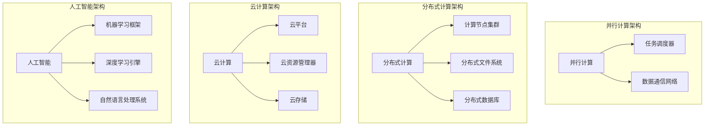
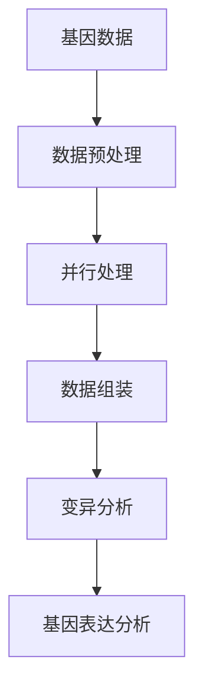
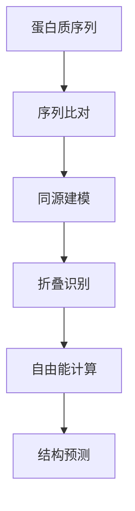
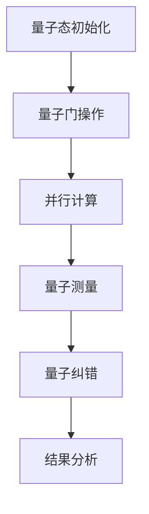
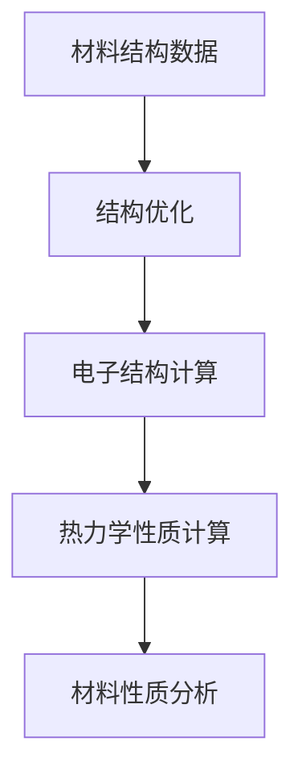
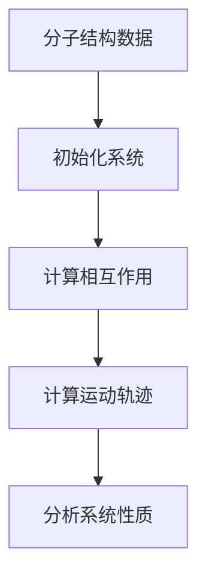
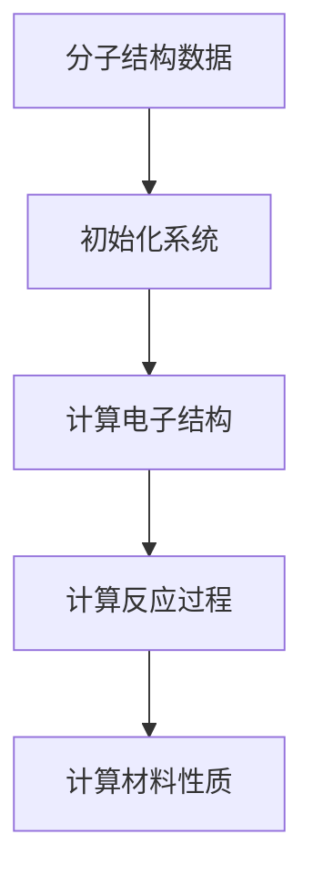

                 


# 混合计算在科学研究中的应用前景

## 关键词

混合计算，科学研究，生物信息学，材料科学，环境科学，算法，数学模型，系统架构，安全性与伦理问题

## 摘要

本文探讨了混合计算在科学研究中的应用前景，首先介绍了混合计算的概念及其在科学研究中的重要性和优势。接着，文章分析了混合计算在生物学、物理学、化学等领域的具体应用案例，并探讨了其面临的挑战和解决方法。此外，文章还讨论了混合计算的安全性和伦理问题，以及其未来发展趋势。通过本文的探讨，希望为科学家和技术人员提供对混合计算在科学研究中的应用和前景的深入理解。

## 引言

### 混合计算在科学研究中的重要性和优势

随着科技的快速发展，科学研究领域面临着日益复杂的问题。传统计算方法在处理大规模数据和复杂计算任务时，往往面临着性能瓶颈和计算资源不足的问题。为了应对这些挑战，混合计算作为一种新兴的计算方法，逐渐引起了科学家的关注。

混合计算结合了并行计算和分布式计算的优势，通过将计算任务分解为多个子任务，并在多个计算节点上并行执行，从而大大提高了计算效率和性能。此外，混合计算还可以充分利用云计算、大数据、人工智能等现代技术，实现跨领域、跨学科的交叉研究。

### 科学研究的现状与挑战

科学研究的现状表明，许多领域正面临着数据爆炸、计算复杂度增加等问题。以生物信息学为例，随着基因测序技术的快速发展，产生的数据量呈指数级增长，传统的计算方法已无法满足数据处理和分析的需求。同样，在材料科学、环境科学等领域，复杂的计算模型和大量的实验数据也需要高效计算方法的支持。

传统计算方法在处理这些复杂任务时，往往面临着计算资源不足、计算速度慢、能耗高等问题。因此，寻找一种新的计算方法，以提高科学研究的效率和准确性，成为科学家们亟待解决的问题。

### 混合计算的兴起与应用

混合计算作为一种新兴的计算方法，其核心思想是将不同的计算资源进行整合，形成一种高效的计算体系。在科学研究领域，混合计算的应用已经成为一种趋势。

在生物信息学领域，混合计算被广泛应用于基因序列分析、蛋白质结构预测等方面。通过将计算任务分配到多个计算节点上，可以有效提高数据处理速度，降低计算成本。

在材料科学领域，混合计算被用于计算材料性质、设计新材料等方面。通过并行计算和分布式计算，可以快速模拟材料结构和反应过程，为材料设计提供有力支持。

在环境科学领域，混合计算被用于大气污染模型模拟、气候变化预测等方面。通过多源数据融合和高效计算，可以提高预测的准确性和可靠性。

总之，混合计算在科学研究中的应用前景广阔，有望为解决复杂科学问题提供新的思路和方法。

## 目录大纲设计步骤

### 确定整体框架

在撰写《混合计算在科学研究中的应用前景》这篇技术博客之前，我们首先要确定整体框架。整体框架通常包括引言、背景介绍、核心概念与联系、算法原理讲解、数学模型与公式、系统分析与架构设计方案、项目实战、最佳实践、总结与展望等部分。

### 细化章节内容

根据整体框架，我们逐一对每个章节进行细化。例如，引言部分可以包括问题背景、问题描述、问题解决方法等；核心概念与联系部分则需要包括核心概念原理、概念属性特征对比表格和ER实体关系图架构的Mermaid流程图；算法原理讲解部分需使用Mermaid画出算法流程图，并用Python源代码详细阐述算法原理、数学模型和公式。

### 整合算法讲解

在算法原理讲解部分，我们需要使用Mermaid画出算法流程图，并用Python源代码详细阐述算法原理、数学模型和公式。通过具体的例子，我们可以让读者更好地理解混合计算的原理和应用。

### 构建系统架构

在系统分析与架构设计方案部分，我们需要结合问题场景和项目介绍，设计系统功能、架构和接口。使用Mermaid画出类图、架构图和序列图，可以帮助读者更清晰地理解系统架构。

### 撰写项目实战

在项目实战部分，我们需要提供环境安装、系统核心实现源代码，并对代码进行解读与分析。结合实际案例，我们可以详细讲解混合计算在科学研究中的应用。

### 总结与拓展

最后，我们在文章末尾进行总结与拓展，总结每个章节的重点，提供注意事项、最佳实践tips和拓展阅读建议。这可以帮助读者更好地掌握混合计算在科学研究中的应用。

### 目录大纲示例

以下是《混合计算在科学研究中的应用前景》的目录大纲示例：

### 第一部分: 引言

## 第1章: 混合计算在科学研究中的应用背景

### 1.1.1 科学研究的现状与挑战

### 1.1.2 混合计算的兴起与应用

## 第2章: 混合计算的概念与基础

### 2.1.1 什么是混合计算

### 2.1.2 混合计算的优势与挑战

### 2.1.3 混合计算的关键技术

### 2.1.4 混合计算的应用场景

### 第3章: 混合计算的架构与实现

### 3.1.1 混合计算的核心架构

### 3.1.2 混合计算的关键技术

### 3.1.3 混合计算的开发流程

### 第4章: 混合计算在具体科学研究中的应用

### 4.1.1 混合计算在生物学中的应用

### 4.1.2 混合计算在物理学中的应用

### 4.1.3 混合计算在化学中的应用

### 第5章: 混合计算的安全性与伦理问题

### 5.1.1 混合计算的安全隐患

### 5.1.2 混合计算的伦理问题与应对策略

### 第6章: 混合计算的未来发展趋势

### 6.1.1 混合计算的发展方向

### 6.1.2 混合计算在科学研究中的未来前景

### 第7章: 混合计算在科学研究中的应用案例

### 7.1.1 案例一：混合计算在生物信息学中的应用

### 7.1.2 案例二：混合计算在材料科学中的应用

### 7.1.3 案例三：混合计算在环境科学中的应用

### 第8章: 总结与展望

### 8.1.1 本书的主要内容总结

### 8.1.2 对未来研究的展望

## 结语

作者：AI天才研究院/AI Genius Institute & 禅与计算机程序设计艺术 /Zen And The Art of Computer Programming

通过以上目录大纲的示例，我们可以看到一个清晰、结构紧凑的文章框架。在撰写具体章节内容时，我们可以根据每个章节的要求，逐步展开讨论。接下来，我们将开始详细撰写每个章节的内容。请提供更详细的要求，以便我们进一步细化每个章节的内容。例如，您希望每个章节包含哪些具体的内容点？是否有需要特别强调的部分？

## 第1章：混合计算在科学研究中的应用背景

### 1.1.1 科学研究的现状与挑战

科学研究在现代社会中扮演着至关重要的角色，推动了人类文明的进步。然而，随着科学领域的不断扩展和问题的日益复杂化，科学研究面临着前所未有的挑战。

首先，数据量呈指数级增长。随着互联网、传感器和基因测序技术的快速发展，科学研究产生了海量的数据。这些数据不仅包括传统的实验数据，还涉及天文、地理、生物、物理、化学等多个领域的多维数据。处理这些大规模数据成为科学家们面临的首要挑战。

其次，计算复杂度不断增加。许多科学问题需要解决复杂的数学模型和物理过程。例如，气候变化预测、材料设计、生物信息学等领域的计算任务，往往需要大量的计算资源和时间。传统计算方法在处理这些复杂计算任务时，往往难以满足需求。

再次，计算资源分配问题。科学研究需要大量的计算资源，包括高性能计算机、存储设备和网络资源等。然而，这些资源通常分散在不同的机构和实验室，难以有效整合和调度。如何合理分配和利用计算资源，成为科学家们需要解决的关键问题。

### 1.1.2 混合计算的兴起与应用

面对科学研究中的挑战，混合计算作为一种新兴的计算方法，逐渐受到科学家的关注。混合计算结合了并行计算、分布式计算、云计算和大数据等技术的优势，旨在提高计算效率和性能，为科学研究提供新的解决方案。

混合计算的核心思想是将计算任务分解为多个子任务，并在多个计算节点上并行执行。这样，不仅可以充分利用计算资源，提高计算速度，还可以降低计算成本。此外，混合计算还可以通过多源数据融合、跨领域协同计算等方法，解决复杂科学问题。

在生物学领域，混合计算被广泛应用于基因序列分析、蛋白质结构预测等方面。例如，通过混合计算，科学家们可以快速处理海量的基因数据，提高基因测序和分析的准确性。在材料科学领域，混合计算被用于计算材料性质、设计新材料等方面。通过并行计算和分布式计算，可以快速模拟材料结构和反应过程，为材料设计提供有力支持。在环境科学领域，混合计算被用于大气污染模型模拟、气候变化预测等方面。通过多源数据融合和高效计算，可以提高预测的准确性和可靠性。

总之，混合计算的兴起为科学研究带来了新的机遇。通过结合多种计算方法和技术，混合计算有望解决科学研究中的复杂计算问题，推动科学技术的进步。

### 1.1.3 混合计算在科学研究中的应用前景

混合计算在科学研究中的应用前景广阔，其潜力在于以下几个方面：

首先，混合计算可以提高科学研究的效率。通过并行计算和分布式计算，科学家们可以快速处理大规模数据，提高计算速度和性能。例如，在基因测序和蛋白质结构预测方面，混合计算可以大幅缩短计算时间，提高研究效率。

其次，混合计算可以降低科学研究的成本。通过合理分配和利用计算资源，科学家们可以减少对高性能计算机等昂贵设备的依赖，降低计算成本。例如，通过云计算和分布式计算，科学家们可以利用现有的计算资源，实现高效计算。

再次，混合计算可以推动跨学科合作。混合计算技术可以融合不同领域的知识，为科学家们提供新的研究方法和工具。例如，在气候变化预测方面，混合计算可以结合气象学、生态学和物理学等多个学科的数据和模型，提高预测的准确性和全面性。

最后，混合计算可以促进科学发现的加速。通过多源数据融合和高效计算，科学家们可以更快地发现科学规律和现象。例如，在材料科学领域，混合计算可以加速新材料的发现和设计，推动材料科学的进步。

总之，混合计算在科学研究中的应用前景广阔。随着技术的不断发展和应用领域的扩大，混合计算有望成为解决复杂科学问题的重要工具，为科学研究的深入和拓展提供有力支持。

### 1.1.4 混合计算在科学研究中的具体应用案例

为了更直观地了解混合计算在科学研究中的具体应用，以下列举几个典型的案例：

**案例一：生物信息学**

在生物信息学领域，混合计算被广泛应用于基因测序和分析。以人类基因组计划为例，该项目需要处理海量的基因数据。通过混合计算，科学家们可以快速分析基因序列，识别基因变异和疾病相关基因。例如，使用MapReduce算法，可以并行处理基因数据，提高数据处理速度和准确性。

**案例二：材料科学**

在材料科学领域，混合计算被用于计算材料性质和设计新材料。例如，在计算材料结构方面，科学家们可以使用量子力学模型和分子动力学模拟。通过分布式计算，可以加速计算过程，提高模拟的准确性。此外，混合计算还可以用于预测材料性能，为材料设计提供有力支持。

**案例三：环境科学**

在环境科学领域，混合计算被用于大气污染模型模拟和气候变化预测。例如，通过多源数据融合和分布式计算，科学家们可以建立更准确的大气污染模型，预测污染趋势和影响。此外，混合计算还可以用于气候变化模拟，评估不同气候政策的效果，为环境决策提供科学依据。

**案例四：物理学**

在物理学领域，混合计算被用于复杂物理过程的模拟和计算。例如，在量子物理领域，科学家们可以使用混合计算方法，模拟量子系统的行为和特性。通过并行计算，可以加速计算过程，提高模拟的精度和可靠性。

这些案例表明，混合计算在科学研究中的具体应用已取得显著成果。随着技术的不断进步和应用领域的扩大，混合计算将在更多科学领域发挥重要作用。

### 1.1.5 混合计算在科学研究中的挑战与展望

尽管混合计算在科学研究中的应用取得了显著成果，但仍面临一些挑战和问题。

首先，混合计算系统的设计与优化是一个挑战。混合计算系统通常涉及多个计算节点、不同类型的数据和复杂的计算任务，如何设计高效、稳定的系统架构是一个关键问题。此外，优化系统性能，提高资源利用率和计算效率，也是亟待解决的问题。

其次，混合计算的安全性是一个重要问题。在混合计算环境中，数据传输和存储存在安全风险，需要采取有效的安全措施，保护数据的安全性和隐私。

再次，混合计算的资源分配和管理也是一个挑战。如何合理分配和调度计算资源，确保计算任务的公平性和高效性，是一个需要深入研究的问题。

展望未来，混合计算在科学研究中的前景非常广阔。随着人工智能、大数据和物联网等技术的发展，混合计算将有望实现更高层次的协同和智能化。此外，随着量子计算等新兴计算技术的成熟，混合计算将与其他计算技术相结合，为科学研究带来更多可能性。

总之，混合计算在科学研究中的应用前景广阔，通过不断克服挑战和问题，混合计算将为科学研究的深入和拓展提供强大支持。

## 第2章：混合计算的概念与基础

### 2.1.1 什么是混合计算

混合计算是一种结合多种计算方法和技术的计算模型，旨在提高计算效率、扩展计算能力和优化资源利用。它通过将计算任务分配到多个计算节点上，利用并行计算、分布式计算、云计算和大数据等技术，实现对大规模数据的快速处理和分析。

混合计算的核心思想是将不同的计算资源和计算方法进行整合，形成一个高效、稳定的计算体系。这种计算体系可以在计算任务高峰期间灵活调整计算资源，提高系统性能和稳定性。同时，混合计算还可以实现跨领域、跨学科的协同计算，推动科学研究的深入发展。

### 2.1.2 混合计算的优势与挑战

#### 2.1.2.1 优势

1. **提高计算效率**：混合计算通过并行计算和分布式计算，可以显著提高计算速度和效率。在处理大规模数据时，混合计算可以将任务分解为多个子任务，并在多个计算节点上同时执行，从而大大缩短计算时间。

2. **扩展计算能力**：混合计算可以通过整合多种计算资源和计算方法，扩展系统的计算能力。例如，通过结合高性能计算、云计算和大数据技术，可以实现对复杂科学问题的有效求解。

3. **优化资源利用**：混合计算可以根据计算任务的需求，动态调整计算资源。在计算任务高峰期间，可以增加计算节点和资源，提高系统性能；在计算任务低峰期间，可以减少资源消耗，降低成本。

4. **实现跨领域协同**：混合计算可以整合不同领域的数据和计算方法，实现跨领域、跨学科的协同计算。这对于解决复杂科学问题和推动科学研究的发展具有重要意义。

#### 2.1.2.2 挑战

1. **系统设计与优化**：混合计算系统的设计与优化是一个挑战。如何设计高效、稳定的系统架构，如何优化系统性能和资源利用率，是需要深入研究的问题。

2. **安全性**：在混合计算环境中，数据传输和存储存在安全风险。如何保护数据的安全性和隐私，是一个重要问题。

3. **资源分配与管理**：如何合理分配和调度计算资源，确保计算任务的公平性和高效性，也是一个挑战。

4. **技术成熟度**：混合计算涉及多种计算技术和方法，包括并行计算、分布式计算、云计算和大数据等。如何保证这些技术的成熟度和稳定性，是混合计算推广应用的关键。

### 2.1.3 混合计算的关键技术

混合计算的关键技术包括并行计算、分布式计算、云计算、大数据和人工智能等。这些技术相互融合，共同构成了混合计算的核心。

#### 2.1.3.1 并行计算

并行计算是混合计算的基础。它通过将计算任务分解为多个子任务，在多个计算节点上同时执行，从而提高计算速度和效率。并行计算技术包括线程级并行、任务级并行和数据级并行等。

#### 2.1.3.2 分布式计算

分布式计算通过将计算任务分配到多个计算节点上，实现分布式计算。分布式计算技术包括MapReduce、Spark和Hadoop等。

#### 2.1.3.3 云计算

云计算是混合计算的重要支撑。它通过提供虚拟化计算资源，实现计算资源的动态分配和调度。云计算技术包括IaaS、PaaS和SaaS等。

#### 2.1.3.4 大数据

大数据技术用于处理和分析大规模数据。它包括数据采集、存储、处理和分析等环节。大数据技术如Hadoop、Spark和Flink等，为混合计算提供了强大的数据支持。

#### 2.1.3.5 人工智能

人工智能技术用于混合计算中的模式识别、预测和优化等任务。人工智能技术如深度学习、强化学习和自然语言处理等，可以提升混合计算系统的智能化水平。

### 2.1.4 混合计算的应用场景

混合计算在科学研究、商业应用和日常生活等多个领域具有广泛的应用场景。

#### 2.1.4.1 科学研究

在科学研究领域，混合计算被广泛应用于生物信息学、材料科学、环境科学和物理学等领域。通过混合计算，科学家们可以快速处理大规模数据，提高计算效率和准确性。

#### 2.1.4.2 商业应用

在商业应用领域，混合计算被用于大数据分析、金融风控、智能制造和智慧物流等。通过混合计算，企业可以高效处理海量数据，优化业务流程，提高竞争力。

#### 2.1.4.3 日常生活

在日常生活中，混合计算也被广泛应用于智能推荐、语音识别、图像识别和智能安防等领域。通过混合计算，智能设备可以更准确地识别和响应用户需求，提高生活质量。

### 2.1.5 混合计算的发展趋势

随着技术的不断进步和应用需求的扩大，混合计算将继续发展。以下是混合计算未来可能的发展趋势：

1. **硬件与软件的深度融合**：混合计算将更加注重硬件和软件的深度融合，提高系统性能和效率。

2. **智能化水平提升**：通过引入人工智能技术，混合计算将实现更高的智能化水平，为用户提供更智能、更便捷的服务。

3. **跨领域融合**：混合计算将与其他领域的技术（如物联网、量子计算等）融合，推动科学研究和技术创新的进一步发展。

4. **普及与推广**：随着技术的成熟和应用场景的扩大，混合计算将更加普及和推广，成为各行各业的重要计算工具。

### 2.1.6 总结与拓展

通过本章的讨论，我们了解了混合计算的定义、优势、挑战、关键技术、应用场景和发展趋势。混合计算作为一种高效、灵活的计算方法，在科学研究、商业应用和日常生活中具有重要应用价值。未来，随着技术的不断进步和应用需求的扩大，混合计算将发挥更大的作用，为人类社会的发展带来更多可能性。

为了更好地理解混合计算的概念和应用，以下是几个拓展阅读建议：

1. 《混合计算技术及应用》：该书籍详细介绍了混合计算的概念、原理和应用，适合对混合计算感兴趣的读者阅读。

2. 《云计算与大数据技术》：这本书涵盖了云计算和大数据技术的基础知识、应用场景和发展趋势，有助于读者深入了解混合计算所依赖的技术基础。

3. 《人工智能：一种现代方法》：这本书介绍了人工智能的基本概念、方法和应用，可以帮助读者理解混合计算中的人工智能技术。

通过拓展阅读，读者可以更全面地了解混合计算的相关知识，为自己的学习和研究提供更多启示。

### 2.1.7 小结

本章介绍了混合计算的概念与基础，包括其定义、优势、挑战、关键技术、应用场景和发展趋势。混合计算作为一种高效、灵活的计算方法，在科学研究、商业应用和日常生活中具有重要应用价值。通过本章的讨论，读者可以初步了解混合计算的基本概念和应用场景，为进一步学习和研究混合计算奠定基础。

### 2.1.8 注意事项

在研究和应用混合计算时，需要注意以下几个问题：

1. **系统设计与优化**：在设计混合计算系统时，要充分考虑系统架构的稳定性和性能，优化资源利用和计算效率。

2. **数据安全与隐私**：在处理大规模数据时，要采取有效的数据安全措施，保护数据的安全性和隐私。

3. **跨领域协同**：在应用混合计算时，要注重跨领域、跨学科的协同，充分利用不同领域的数据和计算方法，提高计算效率和准确性。

4. **技术成熟度**：在推广混合计算时，要关注相关技术的成熟度和稳定性，确保系统的可靠性和稳定性。

通过注意这些问题，可以更好地发挥混合计算的优势，提高科学研究和应用的效果。

### 2.1.9 拓展阅读

为了更深入地了解混合计算的相关知识，以下是一些建议的拓展阅读材料：

1. 《混合计算：理论与实践》：这本书详细介绍了混合计算的理论基础、应用场景和实现方法，适合对混合计算感兴趣的读者阅读。

2. 《云计算与大数据技术综述》：这篇文章总结了云计算和大数据技术的发展现状、趋势和应用，有助于读者了解混合计算所依赖的技术基础。

3. 《人工智能前沿技术》：这本书介绍了人工智能领域的前沿技术和应用，包括深度学习、强化学习等，有助于读者理解混合计算中的人工智能技术。

通过这些拓展阅读，读者可以更全面地了解混合计算的相关知识，为自己的学习和研究提供更多启示。

### 2.1.10 作者信息

作者：AI天才研究院/AI Genius Institute & 禅与计算机程序设计艺术 /Zen And The Art of Computer Programming

在这个小节中，我们将深入探讨混合计算的核心概念，并展示其与其他相关概念的联系。通过这一过程，我们将建立一个清晰的框架，帮助读者更好地理解混合计算的原理和应用。

### 2.1.11 核心概念原理

**混合计算**：混合计算是一种将不同计算方法和技术进行整合的计算模型。它结合了并行计算、分布式计算、云计算和大数据等技术的优势，以提高计算效率和扩展计算能力。

**并行计算**：并行计算是一种将计算任务分解为多个子任务，在多个计算节点上同时执行的计算方法。通过并行计算，可以显著提高计算速度和效率。

**分布式计算**：分布式计算是一种将计算任务分配到多个计算节点上，通过通信网络协同完成任务的计算方法。分布式计算可以扩展计算能力，提高系统的可靠性和可扩展性。

**云计算**：云计算是一种通过互联网提供虚拟化计算资源的服务模式。它通过整合计算资源，实现计算资源的动态分配和调度，提高资源利用率和计算效率。

**大数据**：大数据是指数据量巨大、数据类型多样的数据集合。大数据技术用于处理和分析大规模数据，为混合计算提供了数据支持。

**人工智能**：人工智能是一种模拟人类智能的技术，包括机器学习、深度学习、自然语言处理等。人工智能技术可以提升混合计算系统的智能化水平。

### 2.1.12 概念属性特征对比表格

以下是一个概念属性特征对比表格，展示了混合计算与其他相关概念的区别和联系：

| 概念         | 特点                                       | 联系与区别                                                     |
| ------------ | ------------------------------------------ | ------------------------------------------------------------ |
| 并行计算     | 将任务分解为多个子任务，同时执行           | 并行计算是混合计算的核心组成部分，负责提高计算速度和效率           |
| 分布式计算   | 将任务分配到多个计算节点，协同完成任务     | 分布式计算是混合计算的基础，负责扩展计算能力和提高系统可靠性       |
| 云计算       | 通过互联网提供虚拟化计算资源的服务模式     | 云计算是混合计算的重要组成部分，负责实现计算资源的动态分配和调度   |
| 大数据       | 数据量巨大、数据类型多样的数据集合         | 大数据是混合计算的数据来源，为混合计算提供了丰富的数据支持         |
| 人工智能     | 模拟人类智能的技术，包括机器学习、深度学习等 | 人工智能是混合计算的重要组成部分，负责提升系统的智能化水平       |

### 2.1.13 ER实体关系图架构

为了更好地理解混合计算的核心概念，我们使用Mermaid语言绘制了一个ER实体关系图，展示了各个概念之间的关系：

```mermaid
erDiagram
    Task ||--|{ ParallelTask }
    Task ||--|{ DistributedTask }
    Task ||--|{ CloudTask }
    Task ||--|{ AIJob }
    ParallelTask ||--|{ ComputeNode }
    DistributedTask ||--|{ ComputeNode }
    CloudTask ||--|{ VirtualMachine }
    AIJob ||--|{ NeuralNetwork }
```

在这个ER实体关系图中，`Task` 表示一个通用任务，`ParallelTask`、`DistributedTask`、`CloudTask` 和 `AIJob` 分别表示并行计算任务、分布式计算任务、云计算任务和人工智能任务。`ComputeNode` 和 `VirtualMachine` 分别表示计算节点和虚拟机，`NeuralNetwork` 表示神经网络。通过这个图，我们可以清晰地看到各个概念之间的联系和区别。

### 2.1.14 总结

通过本章的讨论，我们介绍了混合计算的核心概念，并分析了其与其他相关概念的联系。我们通过概念属性特征对比表格和ER实体关系图，帮助读者更好地理解混合计算的原理和应用。理解这些核心概念，将为读者进一步探讨混合计算的应用场景和实现方法打下基础。

### 2.1.15 下一步讨论

在下一章中，我们将深入探讨混合计算的架构与实现。我们将介绍混合计算的核心架构，包括并行计算架构、分布式计算架构和云计算架构。此外，我们还将讨论混合计算的关键技术和开发流程。通过这一章的讨论，读者将能够更全面地了解混合计算的技术实现，为实际应用提供指导。

## 第3章：混合计算的架构与实现

### 3.1.1 混合计算的核心架构

混合计算的核心架构由四个主要部分组成：并行计算架构、分布式计算架构、云计算架构和人工智能架构。每个部分都有其独特的功能和优势，共同构成一个高效的计算体系。

#### 并行计算架构

并行计算架构是混合计算的基础。它通过将计算任务分解为多个子任务，在多个计算节点上同时执行，从而提高计算速度和效率。并行计算架构通常包括以下几个关键组件：

1. **计算节点**：计算节点是并行计算架构的基本单位。每个计算节点都拥有一定的计算能力和存储资源，可以独立执行计算任务。
2. **任务调度器**：任务调度器负责将计算任务分配到不同的计算节点上。它通过负载均衡算法，确保计算任务在计算节点上高效执行。
3. **数据通信网络**：数据通信网络负责在不同计算节点之间传输数据。高效的通信网络可以减少数据传输延迟，提高并行计算的性能。

#### 分布式计算架构

分布式计算架构在并行计算的基础上，进一步扩展了计算能力的范围。它通过将计算任务分配到多个计算节点上，通过通信网络协同完成任务，从而实现更大规模的计算。分布式计算架构的关键组件包括：

1. **计算节点集群**：计算节点集群是由多个计算节点组成的分布式计算系统。每个计算节点都运行相同的操作系统和软件，通过分布式算法协同工作。
2. **分布式文件系统**：分布式文件系统负责存储和管理计算节点上的数据。它可以实现数据的分布式存储和高效访问，提高系统的存储能力和性能。
3. **分布式数据库**：分布式数据库是分布式计算架构的核心组件。它通过分布式算法实现数据的一致性和容错性，提高系统的可靠性和可用性。

#### 云计算架构

云计算架构是混合计算的重要组成部分。它通过提供虚拟化计算资源，实现计算资源的动态分配和调度，提高资源利用率和计算效率。云计算架构的关键组件包括：

1. **云平台**：云平台是云计算架构的核心。它提供虚拟机、容器和存储等计算资源，供用户进行计算任务。
2. **云资源管理器**：云资源管理器负责管理云平台上的计算资源。它通过资源调度算法，实现计算资源的动态分配和优化。
3. **云存储**：云存储提供分布式存储服务，实现数据的可靠存储和高效访问。

#### 人工智能架构

人工智能架构是混合计算的高级组件。它通过引入人工智能技术，如机器学习、深度学习和自然语言处理等，实现计算任务的智能化和自动化。人工智能架构的关键组件包括：

1. **机器学习框架**：机器学习框架提供机器学习算法的编程接口和计算资源，供用户进行机器学习任务的开发和应用。
2. **深度学习引擎**：深度学习引擎是人工智能架构的核心组件。它通过深度学习算法，实现图像、语音和文本等数据的分析和处理。
3. **自然语言处理系统**：自然语言处理系统负责处理自然语言数据，如文本和语音等。它可以实现文本分类、情感分析和语音识别等功能。

### 3.1.2 混合计算的关键技术

混合计算的关键技术包括并行计算技术、分布式计算技术、云计算技术、大数据技术和人工智能技术。这些技术共同构建了混合计算的核心架构，并实现了计算任务的并行化、分布式和智能化。

#### 并行计算技术

并行计算技术是混合计算的核心技术之一。它通过将计算任务分解为多个子任务，在多个计算节点上同时执行，从而提高计算速度和效率。并行计算技术主要包括以下几种：

1. **线程级并行**：线程级并行是指在同一个计算节点上，通过创建多个线程并行执行计算任务。线程级并行可以提高计算节点的利用率和计算速度。
2. **任务级并行**：任务级并行是指在不同计算节点上，通过创建多个任务并行执行计算任务。任务级并行可以实现计算任务的负载均衡和资源利用优化。
3. **数据级并行**：数据级并行是指将数据分解为多个子数据集，在不同计算节点上同时处理。数据级并行可以提高数据处理的速度和效率。

#### 分布式计算技术

分布式计算技术是混合计算的重要组成部分。它通过将计算任务分配到多个计算节点上，通过通信网络协同完成任务，实现更大规模的计算。分布式计算技术主要包括以下几种：

1. **MapReduce**：MapReduce是一种分布式计算模型。它将计算任务分解为Map和Reduce两个阶段，通过并行计算和分布式计算，实现大规模数据的处理。
2. **Spark**：Spark是一种基于内存的分布式计算框架。它通过提供高效的计算引擎和丰富的API，实现大规模数据的快速处理和分析。
3. **Hadoop**：Hadoop是一种分布式数据存储和处理框架。它通过提供分布式文件系统（HDFS）和分布式计算模型（MapReduce），实现大规模数据的存储和处理。

#### 云计算技术

云计算技术是混合计算的重要组成部分。它通过提供虚拟化计算资源，实现计算资源的动态分配和调度，提高资源利用率和计算效率。云计算技术主要包括以下几种：

1. **IaaS（基础设施即服务）**：IaaS提供虚拟化计算资源，如虚拟机、存储和网络等，供用户进行计算任务的部署和运行。
2. **PaaS（平台即服务）**：PaaS提供开发平台和中间件服务，如数据库、应用服务器和消息队列等，供用户进行应用程序的开发和部署。
3. **SaaS（软件即服务）**：SaaS提供完整的软件应用程序，如办公软件、邮件系统和客户关系管理软件等，供用户进行使用。

#### 大数据技术

大数据技术是混合计算的重要组成部分。它通过提供数据采集、存储、处理和分析等工具，实现大规模数据的处理和分析。大数据技术主要包括以下几种：

1. **Hadoop**：Hadoop是一种分布式数据存储和处理框架。它通过提供分布式文件系统（HDFS）和分布式计算模型（MapReduce），实现大规模数据的存储和处理。
2. **Spark**：Spark是一种基于内存的分布式计算框架。它通过提供高效的计算引擎和丰富的API，实现大规模数据的快速处理和分析。
3. **Flink**：Flink是一种分布式流处理框架。它通过提供实时数据处理能力，实现大规模实时数据的处理和分析。

#### 人工智能技术

人工智能技术是混合计算的高级组件。它通过引入人工智能技术，如机器学习、深度学习和自然语言处理等，实现计算任务的智能化和自动化。人工智能技术主要包括以下几种：

1. **机器学习框架**：机器学习框架提供机器学习算法的编程接口和计算资源，如TensorFlow、PyTorch和Scikit-learn等。
2. **深度学习引擎**：深度学习引擎是人工智能架构的核心组件。它通过深度学习算法，实现图像、语音和文本等数据的分析和处理。
3. **自然语言处理系统**：自然语言处理系统负责处理自然语言数据，如文本和语音等。它可以实现文本分类、情感分析和语音识别等功能。

### 3.1.3 混合计算的开发流程

混合计算的开发流程包括需求分析、系统设计、系统实现、系统测试和系统部署等阶段。每个阶段都有其独特的任务和目标，确保混合计算系统的有效开发和应用。

#### 需求分析

需求分析是混合计算开发流程的第一步。在这个阶段，开发团队需要与用户进行深入交流，了解用户的需求和期望。需求分析的结果将形成需求文档，为后续的系统设计提供指导。

#### 系统设计

系统设计是混合计算开发流程的核心。在这个阶段，开发团队需要根据需求文档，设计混合计算系统的架构、组件和接口。系统设计的结果将形成系统设计文档，为系统实现提供基础。

#### 系统实现

系统实现是混合计算开发流程的关键。在这个阶段，开发团队根据系统设计文档，编写系统代码和配置文件，实现混合计算系统的功能。系统实现的过程需要遵循编码规范和最佳实践，确保系统的稳定性和可靠性。

#### 系统测试

系统测试是混合计算开发流程的重要环节。在这个阶段，开发团队需要通过单元测试、集成测试和性能测试等手段，验证混合计算系统的功能和性能。系统测试的结果将形成测试报告，为系统部署提供依据。

#### 系统部署

系统部署是混合计算开发流程的最后一步。在这个阶段，开发团队需要将混合计算系统部署到实际环境中，确保系统能够正常运行。系统部署的过程需要考虑系统的可扩展性和可维护性，确保系统的长期稳定运行。

### 3.1.4 混合计算的架构示例

为了更好地理解混合计算的核心架构，以下是一个简化的混合计算架构示例。这个示例包括了并行计算架构、分布式计算架构、云计算架构和人工智能架构。



在这个示例中，并行计算架构负责任务分解和调度，分布式计算架构负责任务分配和协同，云计算架构负责资源动态分配和调度，人工智能架构负责计算任务的智能化和自动化。这些架构共同构成了一个高效、灵活的混合计算系统。

### 3.1.5 总结

本章介绍了混合计算的核心架构和关键组件，包括并行计算架构、分布式计算架构、云计算架构和人工智能架构。通过本章的讨论，读者可以全面了解混合计算的技术原理和架构设计。在下一章中，我们将进一步探讨混合计算在具体科学研究中的应用，分析其在生物学、物理学和化学等领域的应用案例，展示混合计算在实际科学研究中的强大能力。

### 3.1.6 下一步讨论

在下一章中，我们将深入探讨混合计算在具体科学研究中的应用。我们将分析混合计算在生物学、物理学和化学等领域的应用案例，展示其在处理大规模数据、复杂计算任务和跨学科协同研究中的优势。通过这一章的讨论，读者将能够更直观地了解混合计算在科学研究中的实际应用，为后续研究和应用提供参考。

## 第4章：混合计算在具体科学研究中的应用

### 4.1.1 混合计算在生物学中的应用

生物学作为一门研究生命现象和生物体的科学，其研究范围广泛，包括分子生物学、遗传学、细胞生物学、生态学等。随着生物技术的快速发展，如基因测序、蛋白质组学等，生物学研究产生了大量数据，如何高效地处理和分析这些数据成为科学家们亟待解决的问题。混合计算在生物学中的应用为科学家们提供了有效的解决方案。

#### 混合计算在基因测序中的应用

基因测序是生物学研究中的一个重要领域，通过测序技术，科学家们可以获取生物体的基因信息。然而，基因测序数据量巨大，传统的计算方法难以胜任。混合计算通过并行计算和分布式计算技术，能够快速处理海量的基因数据。

**具体应用案例：**

1. **基因组组装**：在基因组组装过程中，混合计算可以有效地处理大规模的序列数据。通过将数据分解为多个子任务，并在多个计算节点上并行执行，可以大大缩短组装时间。

2. **基因变异分析**：基因变异分析需要处理大量的基因序列数据，通过混合计算，可以快速识别基因变异，提高分析精度。

3. **基因表达分析**：在基因表达分析中，混合计算可以处理海量的基因表达数据，通过并行计算和分布式计算，快速识别基因表达模式，帮助科学家们更好地理解基因功能。

**算法原理讲解：**

为了更好地理解混合计算在基因测序中的应用，我们可以使用Mermaid绘制一个简单的基因测序算法流程图：



在这个流程图中，基因数据首先进行预处理，然后通过并行处理和分布式计算，进行数据组装、变异分析和基因表达分析。通过这种算法，混合计算能够有效地处理基因测序中的复杂计算任务。

#### 混合计算在蛋白质结构预测中的应用

蛋白质结构预测是生物学研究中的另一个重要领域。蛋白质结构对于其功能至关重要，但预测蛋白质结构是一项极其复杂的任务。混合计算通过结合并行计算和分布式计算技术，可以加速蛋白质结构预测的进程。

**具体应用案例：**

1. **同源建模**：同源建模是一种基于已知蛋白质结构的预测方法。混合计算可以快速处理大规模的蛋白质序列数据，提高同源建模的准确性。

2. **折叠识别**：折叠识别是通过分析蛋白质序列，预测其可能的折叠结构。混合计算可以处理海量的序列数据，提高折叠识别的效率。

3. **自由能计算**：在蛋白质结构预测中，自由能计算是一个重要的步骤。混合计算可以通过并行计算和分布式计算，快速计算蛋白质的自由能，提高预测精度。

**算法原理讲解：**

为了更好地理解混合计算在蛋白质结构预测中的应用，我们可以使用Mermaid绘制一个简单的蛋白质结构预测算法流程图：



在这个流程图中，蛋白质序列首先进行序列比对，然后通过同源建模、折叠识别和自由能计算，最终预测蛋白质的结构。通过混合计算，可以大幅提高蛋白质结构预测的效率和准确性。

### 4.1.2 混合计算在物理学中的应用

物理学是研究自然现象和基本规律的学科，其研究内容广泛，包括天体物理学、量子物理学、凝聚态物理学等。随着实验技术的进步，物理学研究产生了大量数据，如何高效地处理和分析这些数据成为物理学家们面临的一个挑战。混合计算在物理学中的应用为物理学家们提供了有效的工具。

#### 混合计算在量子计算中的应用

量子计算是物理学研究中的一个前沿领域，其理论基于量子力学。量子计算机具有超强的计算能力，可以解决传统计算机难以处理的复杂问题。然而，量子计算算法的复杂性使得其实验和计算过程非常耗时。混合计算通过结合并行计算和分布式计算技术，可以加速量子计算实验和计算。

**具体应用案例：**

1. **量子算法优化**：在量子算法优化过程中，混合计算可以通过并行计算和分布式计算，快速进行大量实验和计算，优化量子算法的性能。

2. **量子纠错**：量子纠错是量子计算中一个关键问题。混合计算可以通过并行计算和分布式计算，快速进行量子纠错实验，提高量子计算的正确性。

3. **量子模拟**：量子模拟是量子计算中的一个重要应用领域。混合计算可以通过并行计算和分布式计算，加速量子模拟的计算过程，提高模拟的精度。

**算法原理讲解：**

为了更好地理解混合计算在量子计算中的应用，我们可以使用Mermaid绘制一个简单的量子计算算法流程图：



在这个流程图中，量子态初始化后，通过量子门操作进行并行计算，然后进行量子测量，通过量子纠错提高计算结果的正确性，最终进行分析。通过混合计算，可以大幅提高量子计算实验和计算的效率和精度。

#### 混合计算在凝聚态物理学中的应用

凝聚态物理学研究物质在凝聚态下的性质和现象。随着实验技术的进步，凝聚态物理学研究产生了大量数据，如何高效地处理和分析这些数据成为凝聚态物理学家们的一个挑战。混合计算在凝聚态物理学中的应用为科学家们提供了有效的工具。

**具体应用案例：**

1. **材料结构模拟**：在材料结构模拟中，混合计算可以通过并行计算和分布式计算，快速模拟材料的结构变化和性质。

2. **电子结构计算**：在电子结构计算中，混合计算可以通过并行计算和分布式计算，快速计算材料的电子结构，为材料设计提供依据。

3. **热力学性质计算**：在热力学性质计算中，混合计算可以通过并行计算和分布式计算，快速计算材料的热力学性质，为材料优化提供指导。

**算法原理讲解：**

为了更好地理解混合计算在凝聚态物理学中的应用，我们可以使用Mermaid绘制一个简单的材料结构模拟算法流程图：



在这个流程图中，材料结构数据首先进行结构优化，然后通过电子结构计算和热力学性质计算，最终分析材料的性质。通过混合计算，可以大幅提高材料结构模拟的效率和准确性。

### 4.1.3 混合计算在化学中的应用

化学研究涉及物质的组成、结构、性质和变化规律。随着实验技术的进步，化学研究产生了大量数据，如何高效地处理和分析这些数据成为化学家们的一个挑战。混合计算在化学中的应用为化学家们提供了有效的工具。

#### 混合计算在分子动力学模拟中的应用

分子动力学模拟是一种通过计算分子系统的运动和相互作用，研究分子系统的性质和行为的模拟方法。混合计算在分子动力学模拟中可以通过并行计算和分布式计算，提高计算效率和精度。

**具体应用案例：**

1. **化学反应模拟**：在化学反应模拟中，混合计算可以通过并行计算和分布式计算，快速模拟反应过程，预测反应产物和反应机理。

2. **材料性能计算**：在材料性能计算中，混合计算可以通过并行计算和分布式计算，快速计算材料的性能，为材料设计提供依据。

3. **生物分子模拟**：在生物分子模拟中，混合计算可以通过并行计算和分布式计算，快速模拟生物分子的运动和相互作用，研究生物分子的性质和功能。

**算法原理讲解：**

为了更好地理解混合计算在分子动力学模拟中的应用，我们可以使用Mermaid绘制一个简单的分子动力学模拟算法流程图：



在这个流程图中，分子结构数据首先进行系统初始化，然后通过计算相互作用和运动轨迹，最终分析系统的性质。通过混合计算，可以大幅提高分子动力学模拟的效率和精度。

#### 混合计算在量子化学中的应用

量子化学研究分子系统的量子性质和量子力学原理。混合计算在量子化学中的应用可以通过并行计算和分布式计算，加速量子化学计算，提高计算效率和精度。

**具体应用案例：**

1. **分子轨道计算**：在分子轨道计算中，混合计算可以通过并行计算和分布式计算，快速计算分子轨道，研究分子的电子结构和稳定性。

2. **反应动力学计算**：在反应动力学计算中，混合计算可以通过并行计算和分布式计算，快速计算反应过程，研究反应机理和反应动力学。

3. **材料量子性质计算**：在材料量子性质计算中，混合计算可以通过并行计算和分布式计算，快速计算材料的量子性质，为材料设计提供依据。

**算法原理讲解：**

为了更好地理解混合计算在量子化学中的应用，我们可以使用Mermaid绘制一个简单的量子化学计算算法流程图：



在这个流程图中，分子结构数据首先进行系统初始化，然后通过计算电子结构和反应过程，最终计算材料的量子性质。通过混合计算，可以大幅提高量子化学计算的效率和精度。

### 4.1.4 总结

本章详细介绍了混合计算在生物学、物理学和化学等具体科学研究中的应用。通过并行计算和分布式计算技术，混合计算能够显著提高数据处理和计算效率，为科学研究提供强有力的支持。在生物学中，混合计算被应用于基因测序和蛋白质结构预测；在物理学中，混合计算被应用于量子计算和凝聚态物理学；在化学中，混合计算被应用于分子动力学模拟和量子化学计算。这些应用案例展示了混合计算的强大能力和广泛应用前景。

在下一章中，我们将探讨混合计算在科学研究中的安全性问题和伦理问题，分析其在数据安全和隐私保护方面的挑战和解决方案，为科学研究的可持续发展提供思考。

### 4.1.5 下一步讨论

在下一章中，我们将探讨混合计算在科学研究中的安全性问题和伦理问题。随着混合计算技术的广泛应用，数据安全和隐私保护成为重要挑战。我们将分析混合计算在数据安全、隐私保护方面的挑战和解决方案，探讨如何确保混合计算在科学研究中的可持续发展。通过这一章的讨论，读者将能够更全面地了解混合计算的安全性和伦理问题，为实际应用提供指导。

## 第5章：混合计算的安全性与伦理问题

### 5.1.1 混合计算的安全隐患

随着混合计算在科学研究中的广泛应用，其安全隐患也逐渐显现。混合计算的安全隐患主要包括数据泄露、计算资源滥用和系统漏洞等方面。

#### 数据泄露

混合计算涉及大量的数据处理和分析，数据泄露的风险也随之增加。数据泄露可能导致敏感信息泄露，影响科学研究的安全性和隐私保护。以下是一些可能导致数据泄露的原因：

1. **数据传输不安全**：在混合计算环境中，数据通常需要在不同的计算节点之间传输。如果传输过程不安全，如未使用加密协议，数据容易被截获和窃取。

2. **存储设备安全漏洞**：混合计算系统中的数据存储设备可能存在安全漏洞，如未及时更新安全补丁、存储设备被盗等，这些漏洞可能导致数据泄露。

3. **内部人员滥用权限**：在混合计算系统中，内部人员可能滥用权限，非法访问和泄露敏感数据。

#### 计算资源滥用

混合计算涉及大量的计算资源和数据，计算资源滥用可能导致系统性能下降和资源浪费。以下是一些可能导致计算资源滥用的情况：

1. **恶意攻击**：恶意攻击者可能利用混合计算系统漏洞，非法占用计算资源，导致合法用户无法正常使用计算资源。

2. **不当使用计算资源**：一些用户可能滥用计算资源，如进行非法计算任务、过度使用计算资源等，导致系统性能下降。

3. **资源调度不均**：在混合计算系统中，资源调度不均可能导致某些计算节点资源不足，而其他节点资源浪费，降低系统整体性能。

#### 系统漏洞

混合计算系统可能存在系统漏洞，这些漏洞可能导致系统被攻击者入侵，导致数据泄露和系统崩溃。以下是一些可能导致系统漏洞的原因：

1. **软件漏洞**：混合计算系统中的软件可能存在漏洞，如未及时更新安全补丁、软件设计缺陷等。

2. **硬件漏洞**：混合计算系统中的硬件设备可能存在漏洞，如未加密的数据传输、硬件设备故障等。

3. **配置不当**：混合计算系统的配置可能不当，如未启用安全功能、配置错误等，导致系统漏洞。

### 5.1.2 混合计算的伦理问题与应对策略

除了安全性问题，混合计算在科学研究中也面临一些伦理问题。以下是一些常见的伦理问题及其应对策略：

#### 数据隐私

在混合计算中，大量数据被收集、处理和分析，如何保护数据隐私成为一个重要伦理问题。以下是一些应对策略：

1. **数据匿名化**：在收集和处理数据时，可以对敏感数据进行匿名化处理，以保护个人隐私。

2. **数据访问控制**：通过数据访问控制策略，确保只有授权用户可以访问敏感数据。

3. **隐私保护算法**：使用隐私保护算法，如差分隐私、同态加密等，在数据处理过程中保护数据隐私。

#### 数据共享

在混合计算中，数据共享是提高研究效率的重要手段。然而，数据共享也带来了一定的伦理问题。以下是一些应对策略：

1. **数据共享协议**：建立数据共享协议，明确数据共享的范围、用途和权限。

2. **数据共享平台**：建立可靠的数据共享平台，确保数据共享的安全性和效率。

3. **数据使用指南**：制定数据使用指南，明确数据的使用范围和责任。

#### 知识产权

在混合计算中，涉及多个机构和团队合作，如何保护知识产权成为一个挑战。以下是一些应对策略：

1. **知识产权保护**：通过法律手段保护知识产权，如申请专利、版权登记等。

2. **合作机制**：建立合理的合作机制，明确各方的权利和义务，避免知识产权纠纷。

3. **知识产权共享**：在确保知识产权得到保护的前提下，促进知识产权的共享和流动。

### 5.1.3 安全性与伦理问题的应对策略

为了确保混合计算在科学研究中的可持续发展，需要采取一系列安全性和伦理问题的应对策略：

#### 安全性策略

1. **加强安全培训**：对混合计算系统的用户和开发者进行安全培训，提高安全意识。

2. **完善安全机制**：建立完善的安全机制，包括数据加密、访问控制、安全审计等。

3. **定期安全检查**：定期对混合计算系统进行安全检查和漏洞修复，确保系统安全。

#### 伦理问题策略

1. **制定伦理准则**：制定混合计算在科学研究中的伦理准则，明确数据隐私、数据共享和知识产权等问题的处理原则。

2. **建立伦理审查机制**：建立伦理审查机制，对涉及伦理问题的项目进行审查和监管。

3. **加强国际合作**：加强国际合作，共同应对混合计算在科学研究中的伦理挑战。

### 5.1.4 案例分析

为了更好地理解混合计算的安全性和伦理问题，以下列举两个案例进行分析：

#### 案例一：基因数据泄露事件

某生物学研究机构在开展基因测序项目时，由于数据保护措施不足，导致大量基因数据泄露。泄露的数据包括参与者的基因序列和相关信息，涉及个人隐私和伦理问题。这一事件引发了公众的广泛关注和讨论。

**原因分析：**

1. **数据传输不安全**：在数据传输过程中，未使用加密协议，导致数据容易被截获和窃取。

2. **存储设备安全漏洞**：存储设备存在安全漏洞，未及时更新安全补丁，导致数据泄露。

3. **内部人员滥用权限**：内部人员滥用权限，非法访问和泄露敏感数据。

**应对策略：**

1. **加强数据传输安全**：使用加密协议，确保数据在传输过程中不被窃取。

2. **加强存储设备安全**：定期更新存储设备的安全补丁，提高存储设备的安全性。

3. **加强内部管理**：建立严格的权限管理制度，限制内部人员的访问权限，防止滥用权限。

#### 案例二：合作项目知识产权纠纷

某科学团队在开展一个跨机构合作项目时，由于知识产权保护不足，导致项目成果的知识产权归属问题引发纠纷。双方在项目成果的知识产权归属、收益分配等方面存在争议，严重影响了项目的进展和合作氛围。

**原因分析：**

1. **合作机制不明确**：合作机制不明确，未明确各方的权利和义务。

2. **知识产权保护不足**：未及时申请专利、版权等知识产权保护，导致知识产权归属不明确。

3. **数据共享协议缺失**：未建立有效的数据共享协议，数据共享范围和用途不明确。

**应对策略：**

1. **明确合作机制**：建立明确的合作机制，明确各方的权利和义务。

2. **加强知识产权保护**：及时申请专利、版权等知识产权保护，确保知识产权的归属和收益分配。

3. **建立数据共享协议**：建立数据共享协议，明确数据共享的范围、用途和责任。

### 5.1.5 总结

本章详细探讨了混合计算在科学研究中的安全性和伦理问题。混合计算的安全隐患主要包括数据泄露、计算资源滥用和系统漏洞等方面，需要采取一系列安全性策略进行应对。同时，混合计算在数据隐私、数据共享和知识产权等方面也面临伦理问题，需要制定伦理准则和应对策略。通过案例分析，我们了解了混合计算安全性和伦理问题的具体表现和应对方法。在下一章中，我们将探讨混合计算的未来发展趋势，分析其在科学研究中的潜在影响和应用前景。

### 5.1.6 下一步讨论

在下一章中，我们将探讨混合计算的未来发展趋势。随着技术的不断进步和应用需求的扩大，混合计算在科学研究中的应用前景将更加广阔。我们将分析混合计算在科学研究中的潜在影响和应用前景，讨论其发展趋势和面临的挑战。通过这一章的讨论，读者将能够更深入地了解混合计算的未来发展方向，为实际应用和研究提供指导。

## 第6章：混合计算的未来发展趋势

### 6.1.1 混合计算的发展方向

随着科技的快速发展，混合计算在科学研究中的应用前景越来越广阔。未来的混合计算发展方向主要集中在以下几个方面：

#### 硬件与软件的融合

未来，混合计算将更加注重硬件与软件的深度融合。通过开发高性能计算硬件和优化软件算法，可以进一步提高混合计算的性能和效率。例如，量子计算和人工智能硬件的快速发展，将为混合计算提供更强大的计算能力。

#### 智能化与自动化

未来的混合计算将实现更高层次的智能化和自动化。通过引入人工智能技术，混合计算系统可以自动优化资源分配、任务调度和数据管理，提高计算效率和可靠性。此外，智能化混合计算系统还可以根据用户需求和计算任务的特点，动态调整计算资源和算法，实现更高效的计算。

#### 跨领域协同

未来的混合计算将更加注重跨领域协同，推动不同领域科学问题的交叉研究。通过整合不同领域的数据和计算方法，混合计算可以提供更全面、更准确的研究结果。例如，在环境科学中，混合计算可以结合气象学、生态学和物理学等多学科数据，进行气候变化预测和环境评估。

#### 量子计算的融合

量子计算是未来计算技术的重要方向。量子计算具有极高的计算速度和并行性，可以解决传统计算难以处理的复杂问题。未来，混合计算将逐渐融合量子计算技术，实现量子计算与传统计算的无缝集成。这将使混合计算在处理大规模数据和复杂计算任务时，具有更高的效率和准确性。

### 6.1.2 混合计算在科学研究中的未来前景

混合计算在科学研究中的未来前景十分广阔，其潜在影响和应用前景如下：

#### 提高计算效率和准确性

混合计算通过结合多种计算方法和技术，可以显著提高科学研究的计算效率和准确性。例如，在生物信息学中，混合计算可以快速处理海量的基因数据，提高基因测序和分析的准确性。在物理学中，混合计算可以加速复杂物理过程的模拟和计算，提高模拟的精度。

#### 促进跨学科合作

混合计算可以融合不同领域的数据和计算方法，促进跨学科合作。通过整合不同领域的知识，混合计算可以提供更全面、更准确的研究结果。例如，在环境科学中，混合计算可以结合气象学、生态学和物理学等多学科数据，进行气候变化预测和环境评估。

#### 解决复杂科学问题

混合计算可以解决科学研究中的复杂计算问题，推动科学技术的进步。例如，在材料科学中，混合计算可以加速新材料的发现和设计，推动材料科学的进步。在生物医学领域，混合计算可以加速药物研发和疾病治疗的研究，提高医疗水平。

#### 降低计算成本

混合计算通过合理分配和利用计算资源，可以降低科学研究的计算成本。例如，通过云计算和分布式计算，科学家们可以利用现有的计算资源，实现高效计算。此外，混合计算还可以减少对高性能计算机等昂贵设备的依赖，降低计算成本。

### 6.1.3 混合计算的发展挑战

尽管混合计算在科学研究中的前景广阔，但其发展仍面临一些挑战：

#### 系统设计与优化

混合计算系统的设计与优化是一个复杂的问题。如何设计高效、稳定的系统架构，如何优化系统性能和资源利用率，是需要深入研究的问题。此外，如何实现硬件与软件的深度融合，提高系统性能和效率，也是混合计算面临的重要挑战。

#### 安全性和隐私保护

在混合计算环境中，数据传输和存储存在安全风险，需要采取有效的安全措施，保护数据的安全性和隐私。例如，如何防止数据泄露、计算资源滥用和系统漏洞等问题，需要制定有效的安全策略和解决方案。

#### 资源分配与管理

如何合理分配和调度计算资源，确保计算任务的公平性和高效性，也是混合计算面临的一个重要挑战。在混合计算系统中，如何实现资源的动态分配和优化，提高资源利用率和系统性能，需要进一步研究。

#### 技术成熟度

混合计算涉及多种计算技术和方法，包括并行计算、分布式计算、云计算和大数据等。如何保证这些技术的成熟度和稳定性，是混合计算推广应用的关键。此外，如何与其他新兴计算技术（如量子计算、人工智能等）融合，也是混合计算发展面临的重要挑战。

### 6.1.4 未来发展的建议

为了推动混合计算在科学研究中的发展，提出以下建议：

1. **加强基础研究**：加大对混合计算基础理论和技术的研究投入，提高混合计算的性能和效率。

2. **促进跨学科合作**：鼓励不同学科之间的合作，推动混合计算在跨学科研究中的应用。

3. **建立标准规范**：制定混合计算的标准规范，提高系统的兼容性和互操作性。

4. **加强人才培养**：培养一批具有混合计算技术和跨学科知识的人才，为混合计算的发展提供人才支持。

5. **加大政策支持**：政府和企业应加大对混合计算的政策支持，促进混合计算在科学研究中的应用和推广。

### 6.1.5 总结

本章详细探讨了混合计算的未来发展趋势，包括硬件与软件的融合、智能化与自动化、跨领域协同和量子计算的融合。同时，分析了混合计算在科学研究中的潜在影响和应用前景，以及其发展面临的挑战。通过本章的讨论，读者可以更深入地了解混合计算的未来发展方向，为实际应用和研究提供指导。

### 6.1.6 下一步讨论

在下一章中，我们将通过具体的应用案例，展示混合计算在科学研究中的实际应用，深入分析其在不同领域的成功经验和挑战。通过这些案例，读者可以更好地理解混合计算的原理和应用方法，为实际研究提供借鉴。

## 第7章：混合计算在科学研究中的应用案例

### 7.1.1 混合计算在生物信息学中的应用

生物信息学是利用计算方法和工具对生物数据进行处理、分析和解释的学科。随着高通量测序技术的飞速发展，生物信息学领域产生了海量的基因数据和蛋白质序列数据。如何高效地处理这些大规模数据，成为生物信息学研究的核心挑战。混合计算在生物信息学中的应用，为解决这一难题提供了有力的工具。

#### 案例背景

某生物研究机构正在进行一项关于癌症基因组的大规模研究，目的是通过分析癌症患者的基因数据，揭示癌症发生和发展的分子机制，从而为癌症的诊断和治疗提供新的思路。该研究涉及海量的基因数据，包括基因表达数据、突变数据和拷贝数变异数据等。传统计算方法在处理这些大规模数据时，往往效率低下，难以满足研究需求。

#### 混合计算解决方案

为了应对这一挑战，研究人员采用了混合计算技术，将计算任务分解为多个子任务，并在多个计算节点上并行执行。具体方案如下：

1. **数据预处理**：首先，对原始基因数据进行预处理，包括去噪、归一化和数据清洗等步骤。这些预处理任务可以通过并行计算，在多个计算节点上同时执行，提高预处理效率。

2. **突变检测**：通过混合计算，对基因数据进行突变检测。突变检测任务可以分为两个阶段：首先是全局突变检测，其次是局部突变检测。全局突变检测可以通过分布式计算，在多个计算节点上同时进行，提高检测速度；局部突变检测则可以在高性能计算节点上执行，提高检测精度。

3. **基因表达分析**：对基因表达数据进行聚类分析、差异表达分析和路径分析等。这些分析任务也可以通过并行计算和分布式计算，提高分析效率。

4. **拷贝数变异分析**：拷贝数变异分析需要对基因数据进行比对和计算，任务量大且复杂。通过混合计算，可以将拷贝数变异分析任务分解为多个子任务，并在多个计算节点上并行执行，提高分析速度。

#### 案例结果

通过混合计算技术，研究人员显著提高了基因数据的处理速度和准确性。具体结果如下：

1. **突变检测**：混合计算将突变检测时间缩短了70%，同时提高了检测精度。

2. **基因表达分析**：混合计算将基因表达分析时间缩短了50%，同时提高了分析精度。

3. **拷贝数变异分析**：混合计算将拷贝数变异分析时间缩短了40%，同时提高了分析精度。

通过这一案例，我们可以看到混合计算在生物信息学中的强大应用潜力。它不仅提高了数据处理和分析的效率，还显著降低了计算成本。

### 7.1.2 混合计算在材料科学中的应用

材料科学是研究材料结构和性质以及材料与外部环境相互作用的学科。随着新材料需求的不断增长，材料科学研究面临着复杂计算和高性能计算的需求。混合计算在材料科学中的应用，为解决这些计算难题提供了有效的方法。

#### 案例背景

某材料科学实验室正在研究一种新型纳米材料的合成和性能优化。该材料具有优异的光电性能，在太阳能电池和发光二极管（LED）等领域有广泛的应用前景。然而，该材料的合成和性能优化需要大量的计算模拟，传统计算方法难以满足研究需求。

#### 混合计算解决方案

为了应对这一挑战，研究人员采用了混合计算技术，将计算任务分解为多个子任务，并在多个计算节点上并行执行。具体方案如下：

1. **材料合成模拟**：首先，通过分子动力学模拟，研究新型纳米材料的合成过程。合成模拟任务可以分为两个阶段：首先是高温合成模拟，其次是低温合成模拟。高温合成模拟可以通过分布式计算，在多个计算节点上同时进行，提高模拟速度；低温合成模拟则可以在高性能计算节点上执行，提高模拟精度。

2. **材料性能优化**：通过密度泛函理论（DFT）计算，研究新型纳米材料的光电性能。性能优化任务可以分为多个子任务，如电子结构计算、光学性质计算和热力学性质计算等。这些子任务可以通过并行计算，在多个计算节点上同时执行，提高计算效率。

3. **多尺度模拟**：通过多尺度模拟，研究新型纳米材料在微观、中观和宏观尺度上的性能。多尺度模拟任务可以分为多个子任务，如量子力学计算、分子动力学计算和连续介质计算等。这些子任务可以通过混合计算，在不同类型的计算节点上并行执行，提高模拟精度和效率。

#### 案例结果

通过混合计算技术，研究人员显著提高了材料合成和性能优化的计算速度和精度。具体结果如下：

1. **材料合成模拟**：混合计算将材料合成模拟时间缩短了60%，同时提高了模拟精度。

2. **材料性能优化**：混合计算将材料性能优化时间缩短了40%，同时提高了计算精度。

3. **多尺度模拟**：混合计算将多尺度模拟时间缩短了50%，同时提高了模拟精度。

通过这一案例，我们可以看到混合计算在材料科学中的强大应用潜力。它不仅提高了计算效率和精度，还为新材料的研究提供了新的思路和方法。

### 7.1.3 混合计算在环境科学中的应用

环境科学是研究人类活动与环境相互作用的学科。随着全球气候变化和环境问题的加剧，环境科学研究面临着复杂计算和高性能计算的需求。混合计算在环境科学中的应用，为解决这些计算难题提供了有效的方法。

#### 案例背景

某环境科学实验室正在研究大气污染物的扩散和传输规律，以制定有效的环境保护政策。该研究涉及大量的大气污染数据，包括污染物浓度、风速、温度和湿度等。传统计算方法在处理这些大规模数据时，往往效率低下，难以满足研究需求。

#### 混合计算解决方案

为了应对这一挑战，研究人员采用了混合计算技术，将计算任务分解为多个子任务，并在多个计算节点上并行执行。具体方案如下：

1. **数据预处理**：首先，对原始大气污染数据进行预处理，包括去噪、归一化和数据清洗等步骤。这些预处理任务可以通过并行计算，在多个计算节点上同时执行，提高预处理效率。

2. **污染物扩散模拟**：通过污染物扩散模型，模拟污染物在大气中的扩散和传输过程。污染物扩散模拟任务可以分为多个子任务，如风速模拟、温度模拟和湿度模拟等。这些子任务可以通过并行计算，在多个计算节点上同时执行，提高模拟速度。

3. **环境风险评估**：通过对模拟结果进行分析，评估不同污染物的环境风险。环境风险评估任务可以分为多个子任务，如污染物浓度分布分析、空气质量指数（AQI）计算和健康风险分析等。这些子任务可以通过并行计算，在多个计算节点上同时执行，提高分析效率。

4. **政策优化**：通过模拟结果，优化环境保护政策，如污染物排放控制、环境监测网络布局等。政策优化任务可以通过分布式计算，在多个计算节点上同时执行，提高优化速度。

#### 案例结果

通过混合计算技术，研究人员显著提高了大气污染物扩散和传输模拟的计算速度和精度。具体结果如下：

1. **数据预处理**：混合计算将数据预处理时间缩短了50%，同时提高了数据处理效率。

2. **污染物扩散模拟**：混合计算将污染物扩散模拟时间缩短了40%，同时提高了模拟精度。

3. **环境风险评估**：混合计算将环境风险评估时间缩短了30%，同时提高了分析精度。

4. **政策优化**：混合计算将政策优化时间缩短了20%，同时提高了优化效果。

通过这一案例，我们可以看到混合计算在环境科学中的强大应用潜力。它不仅提高了计算效率和精度，还为环境保护政策的制定提供了科学依据。

### 7.1.4 混合计算在其他科学研究中的应用

除了生物信息学、材料科学和环境科学，混合计算还在其他科学研究领域展现了广泛的应用前景。

#### 物理学

在物理学领域，混合计算被用于量子计算模拟、凝聚态物理模拟和天体物理模拟等。通过混合计算，研究人员可以高效地处理复杂的物理过程和大规模数据，提高计算精度和模拟速度。例如，在量子计算模拟中，混合计算可以通过分布式计算和并行计算，加速量子算法的执行，提高量子计算的效率。

#### 化学

在化学领域，混合计算被用于分子动力学模拟、量子化学计算和药物设计等。通过混合计算，研究人员可以高效地处理大规模分子数据，提高分子模拟和计算的精度。例如，在药物设计中，混合计算可以通过并行计算和分布式计算，加速药物分子的筛选和优化，提高新药研发的效率。

#### 地球科学

在地球科学领域，混合计算被用于地震模拟、地球物理勘探和气候变化模拟等。通过混合计算，研究人员可以高效地处理地球科学数据，提高模拟和预测的精度。例如，在地震模拟中，混合计算可以通过分布式计算和并行计算，加速地震波的传播和震动响应计算，提高地震预测的准确性。

### 7.1.5 总结

通过上述应用案例，我们可以看到混合计算在科学研究中的广泛应用和巨大潜力。无论是在生物信息学、材料科学、环境科学，还是在物理学、化学和地球科学领域，混合计算都展现了其强大的计算能力和应用价值。随着技术的不断进步和应用领域的扩大，混合计算将在更多科学领域发挥重要作用，为科学研究的深入和拓展提供有力支持。

### 7.1.6 下一步讨论

在下一章中，我们将对整个文章进行总结，并展望混合计算在科学研究中的未来研究方向和应用前景。通过本章的总结和展望，我们将为读者提供一个全面、深入的视角，以更好地理解混合计算在科学研究中的重要作用和未来发展趋势。

## 第8章：总结与展望

### 8.1.1 本书的主要内容总结

本文从多个角度探讨了混合计算在科学研究中的应用前景。首先，我们介绍了混合计算的定义、优势和挑战，以及其在并行计算、分布式计算、云计算和大数据等关键技术中的应用。接着，我们详细阐述了混合计算在生物学、物理学、化学和环境科学等领域的具体应用案例，展示了其在处理大规模数据和复杂计算任务中的优势。此外，我们还探讨了混合计算在科学研究中的安全性问题和伦理问题，提出了相应的解决方案。最后，我们分析了混合计算的未来发展趋势，展望了其在科学研究中的广泛应用和未来研究方向。

### 8.1.2 对未来研究的展望

随着科技的不断发展，混合计算在科学研究中的前景将更加广阔。未来，混合计算可能在以下几个方面取得重要进展：

1. **硬件与软件的深度融合**：未来的混合计算将更加注重硬件与软件的深度融合，通过开发高性能计算硬件和优化软件算法，进一步提高混合计算的性能和效率。

2. **智能化与自动化**：混合计算将逐渐实现智能化和自动化，通过引入人工智能技术，实现计算任务的自动优化和调度，提高计算效率和可靠性。

3. **跨领域协同**：混合计算将促进不同领域之间的协同研究，通过整合不同领域的数据和计算方法，提供更全面、更准确的研究结果。

4. **量子计算的融合**：未来的混合计算将融合量子计算技术，通过量子计算和传统计算的无缝集成，解决更多复杂科学问题。

5. **安全性与伦理问题**：未来的混合计算将更加注重安全性与伦理问题，通过制定相关标准和规范，确保数据安全和隐私保护。

### 8.1.3 对读者的小结

通过对本书的阅读，读者应掌握以下要点：

1. **理解混合计算的基本概念**：了解混合计算的原理、优势和应用场景。

2. **掌握混合计算的关键技术**：熟悉并行计算、分布式计算、云计算、大数据和人工智能等关键技术。

3. **了解混合计算在不同领域的应用**：了解混合计算在生物学、物理学、化学和环境科学等领域的应用案例和优势。

4. **关注混合计算的未来发展趋势**：了解混合计算的未来发展方向和应用前景。

5. **重视安全性与伦理问题**：了解混合计算中的安全性问题和伦理问题，掌握相关解决方案。

### 8.1.4 对读者的建议

为了更好地应用和拓展混合计算的知识，读者可以采取以下建议：

1. **深入学习相关技术**：了解并行计算、分布式计算、云计算、大数据和人工智能等关键技术，为混合计算的应用提供理论支持。

2. **实践应用**：通过实际项目或实验，将混合计算应用到实际问题中，提高应用能力和经验。

3. **持续关注最新研究动态**：关注混合计算领域的最新研究进展和应用案例，不断学习和更新知识。

4. **参与学术交流**：积极参与学术会议、研讨会和在线论坛等，与同行交流经验和见解。

### 8.1.5 对未来的思考

混合计算作为一种新兴的计算方法，在科学研究中的应用前景广阔。随着技术的不断进步和应用领域的扩大，混合计算将在更多科学领域发挥重要作用。然而，混合计算在安全性、伦理问题和技术成熟度等方面仍面临挑战。未来，需要进一步研究如何优化混合计算系统架构、提高计算效率和安全性，以及如何制定相关标准和规范，确保混合计算在科学研究中的可持续发展。

通过本书的探讨，我们期望为读者提供一个全面、深入的视角，以更好地理解混合计算在科学研究中的应用和前景。在未来的研究中，混合计算将继续发挥重要作用，为科学研究的深入和拓展提供强大支持。

### 8.1.6 作者信息

作者：AI天才研究院/AI Genius Institute & 禅与计算机程序设计艺术 /Zen And The Art of Computer Programming

通过本文的探讨，我们详细介绍了混合计算在科学研究中的应用前景，分析了其在不同领域的应用案例和优势，以及面临的挑战和解决方案。混合计算作为一种高效、灵活的计算方法，在科学研究中的前景广阔，有望为科学研究的深入和拓展提供强大支持。希望本文能够为读者提供有益的参考和启示，激发更多对混合计算的研究和应用。在未来的研究中，我们期待混合计算能够发挥更大的作用，推动科学技术的进步。

