                 

## 混合计算概述

### 1.1 混合计算的定义与背景

#### 1.1.1 混合计算的概念解析

混合计算（Hybrid Computing）是一种将传统计算与新型计算模式相结合的计算方法。传统计算主要依赖于冯·诺依曼架构，即存储程序计算机，它通过中央处理器（CPU）顺序执行指令来进行计算。而新型计算模式则包括并行计算、分布式计算、量子计算等。

混合计算的核心思想是利用不同类型计算设备的优势，实现计算资源的优化配置，从而提高计算性能和效率。这种计算模式可以通过以下公式来表示：

$$
\text{混合计算} = \text{传统计算} + \text{新型计算模式}
$$

传统计算主要依赖CPU进行计算，其特点是计算速度快，但受限于单核性能的提升瓶颈。而新型计算模式则能够通过并行处理、分布式计算等方式，实现更高效的计算。

#### 1.1.2 混合计算的起源与发展

混合计算的概念可以追溯到上世纪80年代，当时计算机科学家们开始探索如何将并行计算、分布式计算等新型计算模式与传统计算相结合，以应对日益复杂的计算任务。

1990年代，随着互联网的兴起，分布式计算得到了广泛应用。云计算的兴起进一步推动了混合计算的发展。近年来，量子计算的迅速发展也为混合计算提供了新的契机。混合计算的发展历程可以用以下ER图来表示：

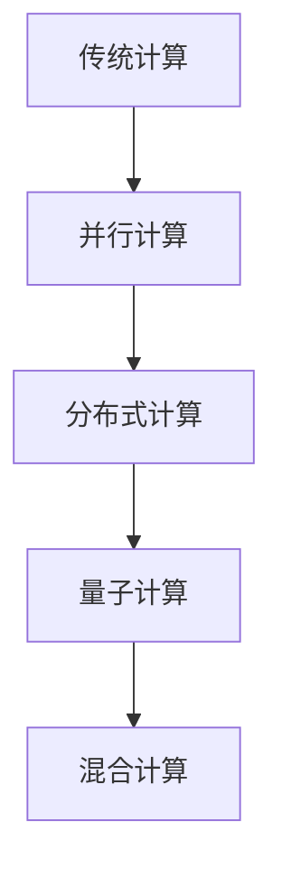

从ER图中可以看出，混合计算是传统计算、并行计算、分布式计算和量子计算的发展的集大成者。

### 1.2 混合计算的优势与挑战

#### 1.2.1 混合计算的优势

混合计算具有以下优势：

1. **并行处理**：通过利用并行计算技术，可以显著提高计算效率，缩短处理时间。
2. **弹性扩展**：混合计算系统可以根据需求动态调整计算资源，实现计算资源的弹性扩展。
3. **异构计算**：充分利用不同类型计算设备的优势，提高计算性能和能效。
4. **安全性增强**：混合计算可以通过结合多种计算模式，提高数据安全性和隐私保护。

#### 1.2.2 混合计算的挑战

尽管混合计算具有许多优势，但其发展也面临一些挑战：

1. **复杂性管理**：协调和管理不同类型计算资源，确保系统稳定运行。
2. **互操作性问题**：确保不同计算模式之间的无缝协作，避免出现数据格式不兼容等问题。
3. **技术成熟度**：部分新型计算技术尚未完全成熟，需要进一步研究和开发。
4. **成本问题**：构建和维护混合计算环境的经济成本较高，需要合理规划和管理。

### 1.3 混合计算的技术架构

#### 1.3.1 技术架构概述

混合计算系统通常由以下组件构成：

1. **计算节点**：包括传统CPU、GPU、FPGA、量子处理器等。
2. **数据存储**：分布式数据库、NoSQL数据库、云存储等。
3. **网络通信**：高速网络、边缘计算节点之间的通信。
4. **管理平台**：资源调度、负载均衡、监控和管理系统。

混合计算的技术架构可以简化为以下Mermaid架构图：

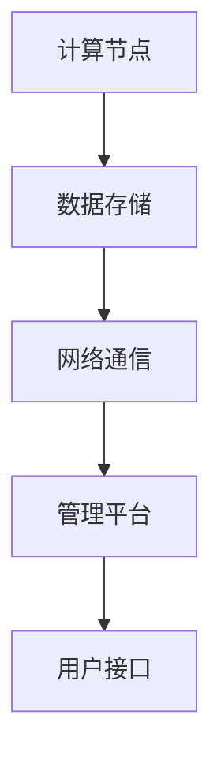

计算节点负责执行计算任务，数据存储提供数据支持，网络通信实现节点间的数据传输，管理平台负责资源调度和系统管理。用户接口则为用户提供交互界面。

## 混合计算突破AI技术限制的可能性

### 2.1 AI技术限制分析

#### 2.1.1 AI技术面临的问题

人工智能（AI）技术近年来取得了显著的进展，但在实际应用中仍面临一些问题：

1. **计算资源限制**：传统的计算资源难以满足大规模AI模型的训练需求，导致训练时间较长，资源浪费严重。
2. **数据隐私与安全**：AI模型训练和推理过程中涉及大量数据，如何保护数据隐私和安全成为一大挑战。
3. **算法效率**：现有AI算法在处理大规模数据时效率较低，需要优化算法以提高性能。
4. **可解释性**：AI模型的决策过程往往难以解释，影响其在某些应用场景中的可信度。

#### 2.1.2 AI技术限制的影响

AI技术限制对各个领域的发展产生了深远影响：

1. **工业**：制造业、物流等领域的数据处理需求日益增长，但现有计算资源难以满足需求，制约了生产效率的提升。
2. **医疗**：医学影像分析、疾病诊断等领域的数据量庞大，现有AI模型在处理速度和精度上仍有待提高。
3. **金融**：金融市场波动性大，AI模型在预测和决策方面需要更高的准确性和实时性。

#### 2.1.3 AI技术突破的必要性

为了应对上述问题，AI技术突破的必要性日益凸显：

1. **提高计算性能**：通过优化算法和计算架构，提高AI模型的训练和推理速度。
2. **保护数据隐私**：采用加密技术、联邦学习等方法，确保数据在传输和处理过程中的安全性。
3. **提高算法可解释性**：通过开发可解释性更强的AI模型，提高其在实际应用中的可信度和可靠性。
4. **降低成本**：通过优化计算架构和算法，降低AI应用的部署和维护成本。

### 2.2 混合计算在AI中的应用

#### 2.2.1 混合计算提升AI性能

混合计算可以通过以下方式提升AI性能：

1. **并行计算**：利用GPU、FPGA等并行计算设备，加速AI模型的训练和推理过程。
2. **分布式计算**：将AI模型训练任务分布在多个计算节点上，提高计算效率。
3. **异构计算**：结合CPU、GPU、FPGA等不同类型的计算设备，充分利用各自的优势。

#### 2.2.2 混合计算优化AI算法

混合计算可以为AI算法优化提供以下支持：

1. **算法并行化**：将串行算法转化为并行算法，提高计算效率。
2. **模型压缩**：通过模型压缩技术，降低模型参数数量，提高计算速度。
3. **自动调优**：利用混合计算系统，自动调整算法参数，实现最优性能。

#### 2.2.3 混合计算在AI领域的新应用

混合计算在AI领域的新应用包括：

1. **边缘AI**：在边缘设备上部署混合计算系统，实现本地实时AI推理。
2. **联邦学习**：通过混合计算实现跨设备的协同训练，保护数据隐私。
3. **智能自动驾驶**：利用混合计算系统，实现高效的自动驾驶算法和决策。

### 2.3 混合计算在AI领域的实际应用案例

#### 2.3.1 混合计算在工业领域的应用

在工业领域，混合计算被广泛应用于智能制造、工业自动化等领域：

1. **智能制造**：通过混合计算系统，实现生产过程的实时监控和智能优化，提高生产效率。
2. **工业自动化**：利用混合计算系统，实现复杂生产任务的自动化控制和调度，降低人工成本。

#### 2.3.2 混合计算在医疗领域的应用

在医疗领域，混合计算被广泛应用于疾病诊断、药物研发等领域：

1. **疾病诊断**：利用混合计算系统，实现高效的医学影像分析和疾病诊断，提高诊断准确率。
2. **药物研发**：通过混合计算系统，加速药物分子的模拟和优化，提高药物研发效率。

#### 2.3.3 混合计算在金融领域的应用

在金融领域，混合计算被广泛应用于风险控制、投资决策等领域：

1. **风险控制**：利用混合计算系统，实现高效的金融市场分析和风险控制，降低金融风险。
2. **投资决策**：通过混合计算系统，实现实时的投资组合优化和风险分析，提高投资收益。

### 2.4 混合计算在AI领域的未来发展趋势

#### 2.4.1 混合计算技术的发展趋势

随着计算技术的不断发展，混合计算在AI领域的应用前景广阔：

1. **量子计算**：量子计算与经典计算的结合，有望实现超高效的AI计算。
2. **边缘计算**：边缘计算与云计算的结合，将实现更灵活、更高效的AI应用。
3. **自优化计算**：通过自适应算法，实现混合计算系统的自优化和自调整。

#### 2.4.2 混合计算在AI领域的未来应用

在未来，混合计算将在AI领域发挥更大作用：

1. **智能交通**：通过混合计算系统，实现智能交通管理和优化，提高交通效率。
2. **智能城市**：利用混合计算系统，实现城市的智能管理和优化，提高居民生活质量。
3. **智能医疗**：通过混合计算系统，实现精准医疗和个性化治疗，提高医疗水平。

### 2.5 混合计算在AI领域的实际应用案例

#### 2.5.1 混合计算在自动驾驶中的应用

在自动驾驶领域，混合计算被广泛应用于感知、规划、控制等环节：

1. **感知**：通过混合计算系统，实现高效的图像处理和目标检测，提高感知精度。
2. **规划**：利用混合计算系统，实现高效的路径规划和决策，提高自动驾驶的稳定性。
3. **控制**：通过混合计算系统，实现高效的车辆控制，提高自动驾驶的安全性和舒适性。

#### 2.5.2 混合计算在智能医疗中的应用

在智能医疗领域，混合计算被广泛应用于疾病诊断、药物研发等领域：

1. **疾病诊断**：利用混合计算系统，实现高效的医学影像分析和疾病诊断，提高诊断准确率。
2. **药物研发**：通过混合计算系统，加速药物分子的模拟和优化，提高药物研发效率。

#### 2.5.3 混合计算在金融领域的应用

在金融领域，混合计算被广泛应用于风险控制、投资决策等领域：

1. **风险控制**：利用混合计算系统，实现高效的金融市场分析和风险控制，降低金融风险。
2. **投资决策**：通过混合计算系统，实现实时的投资组合优化和风险分析，提高投资收益。

### 2.6 混合计算在AI领域的实际应用案例

#### 2.6.1 混合计算在智能城市中的应用

在智能城市建设中，混合计算发挥了重要作用：

1. **智能交通管理**：通过混合计算系统，实现交通流量预测和优化，提高道路利用率。
2. **公共安全监控**：利用混合计算系统，实现高效的视频分析和异常检测，提高公共安全水平。
3. **环境监测**：通过混合计算系统，实时监测空气质量、水质等环境参数，提供智能决策支持。

### 2.7 混合计算在教育领域的应用

在教育领域，混合计算被广泛应用于教学、学习评估和资源优化：

1. **个性化学习**：通过混合计算系统，为学生提供定制化的学习资源和教学方案，提高学习效果。
2. **学习评估**：利用混合计算系统，实现学习数据的实时分析和评估，帮助教师和学生及时调整学习策略。
3. **教育资源优化**：通过混合计算系统，优化教育资源的分配和使用，提高教育资源利用效率。

### 2.8 混合计算在AI领域的未来发展趋势

#### 2.8.1 混合计算技术的发展趋势

未来，混合计算将在AI领域持续发展：

1. **量子计算**：量子计算与经典计算的结合，有望实现超高效的AI计算。
2. **边缘计算**：边缘计算与云计算的结合，将实现更灵活、更高效的AI应用。
3. **自优化计算**：通过自适应算法，实现混合计算系统的自优化和自调整。

#### 2.8.2 混合计算在AI领域的未来应用

在未来，混合计算将在AI领域发挥更大作用：

1. **智能交通**：通过混合计算系统，实现智能交通管理和优化，提高交通效率。
2. **智能城市**：利用混合计算系统，实现城市的智能管理和优化，提高居民生活质量。
3. **智能医疗**：通过混合计算系统，实现精准医疗和个性化治疗，提高医疗水平。

### 2.9 混合计算在AI领域的实际应用案例

#### 2.9.1 混合计算在智能城市中的应用

在智能城市建设中，混合计算发挥了重要作用：

1. **智能交通管理**：通过混合计算系统，实现交通流量预测和优化，提高道路利用率。
2. **公共安全监控**：利用混合计算系统，实现高效的视频分析和异常检测，提高公共安全水平。
3. **环境监测**：通过混合计算系统，实时监测空气质量、水质等环境参数，提供智能决策支持。

#### 2.9.2 混合计算在智慧农业中的应用

在智慧农业领域，混合计算被广泛应用于作物种植、病虫害监测等领域：

1. **作物种植**：通过混合计算系统，实现精准农业种植，提高农作物产量。
2. **病虫害监测**：利用混合计算系统，实时监测农田病虫害情况，提供智能防治方案。

### 2.10 混合计算在AI领域的实际应用案例

#### 2.10.1 混合计算在智能制造中的应用

在智能制造领域，混合计算被广泛应用于生产过程优化、设备故障预测等领域：

1. **生产过程优化**：通过混合计算系统，实现生产过程的实时监控和优化，提高生产效率。
2. **设备故障预测**：利用混合计算系统，提前预测设备故障，降低设备停机时间。

#### 2.10.2 混合计算在智能电网中的应用

在智能电网领域，混合计算被广泛应用于电力调度、故障处理等领域：

1. **电力调度**：通过混合计算系统，实现电力资源的优化调度，提高电力利用效率。
2. **故障处理**：利用混合计算系统，快速识别和处理电力故障，提高电力系统的可靠性。

### 2.11 混合计算在AI领域的未来发展趋势

#### 2.11.1 混合计算技术的发展趋势

未来，混合计算将在AI领域持续发展：

1. **量子计算**：量子计算与经典计算的结合，有望实现超高效的AI计算。
2. **边缘计算**：边缘计算与云计算的结合，将实现更灵活、更高效的AI应用。
3. **自优化计算**：通过自适应算法，实现混合计算系统的自优化和自调整。

#### 2.11.2 混合计算在AI领域的未来应用

在未来，混合计算将在AI领域发挥更大作用：

1. **智能物流**：通过混合计算系统，实现物流运输的实时监控和优化，提高物流效率。
2. **智能能源管理**：利用混合计算系统，实现能源消耗的实时监测和优化，提高能源利用效率。
3. **智能环境监测**：通过混合计算系统，实时监测环境参数，提供智能决策支持。

### 2.12 混合计算在AI领域的实际应用案例

#### 2.12.1 混合计算在智能家居中的应用

在智能家居领域，混合计算被广泛应用于智能家电控制、家居环境监测等领域：

1. **智能家电控制**：通过混合计算系统，实现家电设备的远程控制和智能调度，提高生活便利性。
2. **家居环境监测**：利用混合计算系统，实时监测家居环境参数，提供智能调节和优化方案。

### 2.13 混合计算在教育领域的应用

#### 6.1 混合计算在教学中的应用

混合计算在教育领域的应用正逐渐成为教育技术变革的重要驱动力。通过整合传统的教学资源和新兴的计算技术，混合计算为教师和学生提供了更加个性化和高效的互动学习体验。

#### 6.1.1 个性化学习体验

混合计算系统利用大数据分析和机器学习技术，能够根据学生的学习行为、兴趣和能力，提供定制化的学习内容和路径。以下是一个简化的流程图，展示了个性化学习的实现过程：

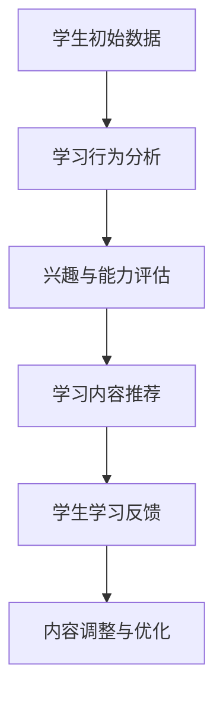

1. **学习行为分析**：通过监测学生的在线学习行为，包括访问频率、停留时长、学习路径等，分析学生的学习习惯和兴趣点。
2. **兴趣与能力评估**：结合学习行为数据和学生的历史成绩，利用机器学习算法评估学生的兴趣和现有能力。
3. **学习内容推荐**：根据学生的兴趣和能力，系统推荐适合的学习内容和资源，确保学生能够在自己擅长的领域得到进一步提升。
4. **学生学习反馈**：通过收集学生对学习内容的反馈，如满意度、理解程度等，不断优化推荐系统的准确性。
5. **内容调整与优化**：根据学生的反馈，调整推荐策略和内容，使学习体验更加符合学生的需求。

#### 6.1.2 虚拟实验与模拟教学

混合计算还允许教师创建虚拟实验室和模拟教学环境，让学生在虚拟空间中进行实验操作和互动学习。以下是一个虚拟实验的mermaid流程图：

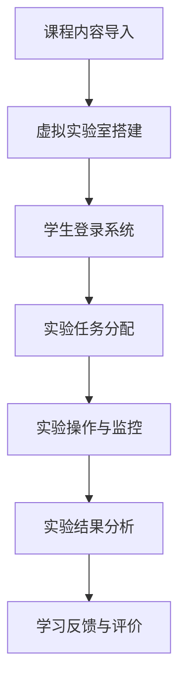

1. **课程内容导入**：将课程的理论知识和实验步骤导入虚拟实验室系统。
2. **虚拟实验室搭建**：利用计算机图形学和模拟技术，构建一个模拟真实实验环境的虚拟实验室。
3. **学生登录系统**：学生通过账号登录系统，选择实验任务。
4. **实验任务分配**：系统根据学生的课程进度和实验要求，分配相应的实验任务。
5. **实验操作与监控**：学生在虚拟实验室中进行实验操作，系统实时监控实验过程，确保实验安全。
6. **实验结果分析**：系统对实验结果进行自动分析和评估，提供详细的实验报告。
7. **学习反馈与评价**：学生根据实验结果，进行自我评价和反思，教师也可以根据实验报告进行评价和反馈。

#### 6.1.3 实时互动与协作学习

混合计算系统支持实时互动和协作学习，通过视频会议、在线讨论板和即时通讯工具，教师和学生可以进行实时交流，共同探讨学习问题。以下是一个协作学习的mermaid流程图：

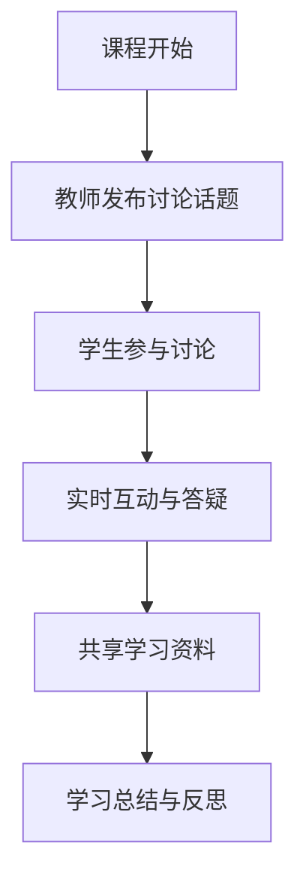

1. **课程开始**：教师启动课程，发布讨论话题和任务。
2. **学生参与讨论**：学生在讨论板或即时通讯工具上参与讨论，发表观点和疑问。
3. **实时互动与答疑**：教师和学生进行实时互动，解答疑问，深化学习内容。
4. **共享学习资料**：教师和学生共享学习资料和资源，促进共同学习和知识共享。
5. **学习总结与反思**：在课程结束后，学生进行学习总结和反思，教师对学生的学习效果进行评价和反馈。

#### 6.1.4 智能辅导与学习辅助

混合计算系统还可以提供智能辅导和学习辅助功能，通过自然语言处理和人工智能技术，为学生提供实时学习支持和帮助。以下是一个智能辅导的mermaid流程图：

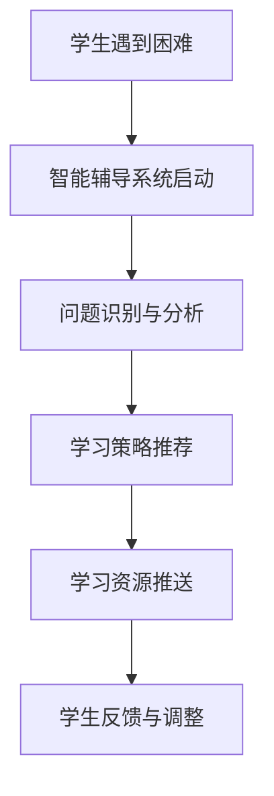

1. **学生遇到困难**：学生在学习过程中遇到问题或困难。
2. **智能辅导系统启动**：系统识别学生的问题，启动智能辅导功能。
3. **问题识别与分析**：系统分析问题，识别问题的根源。
4. **学习策略推荐**：系统根据问题分析，推荐适合的学习策略和解决方案。
5. **学习资源推送**：系统推送相关学习资源和教程，帮助学生解决问题。
6. **学生反馈与调整**：学生根据辅导系统的建议，进行学习调整，系统根据学生的反馈进行优化和调整。

通过上述混合计算在教学中的应用，教师和学生可以享受到更加个性化和互动的学习体验，提高学习效果和教学质量。

### 6.2 混合计算在个性化学习中的应用

个性化学习是现代教育发展的一个重要趋势，它旨在根据每个学生的特点和需求，提供定制化的学习内容和路径。混合计算在个性化学习中的应用，极大地提升了教育资源的利用效率和学生的学习体验。

#### 6.2.1 个性化学习的需求分析

个性化学习需要对学生进行全面的需求分析，包括学习习惯、兴趣、能力水平、学习风格等。以下是一个简化的需求分析流程图：

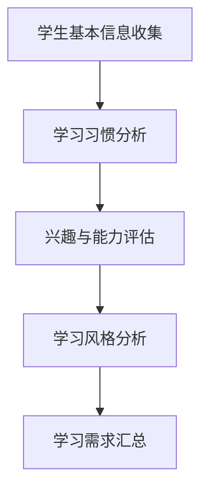

1. **学生基本信息收集**：收集学生的基本信息，如年龄、性别、学科背景等。
2. **学习习惯分析**：通过调查问卷或数据分析，了解学生的日常学习习惯，包括学习时间、学习环境、学习频率等。
3. **兴趣与能力评估**：通过学习行为数据和测试，评估学生的兴趣领域和学习能力。
4. **学习风格分析**：分析学生的学习风格，如主动学习、被动学习、独立学习、合作学习等。
5. **学习需求汇总**：将上述分析结果进行汇总，形成个性化的学习需求报告。

#### 6.2.2 个性化学习路径规划

基于需求分析结果，系统可以为学生规划个性化的学习路径。以下是一个简化的学习路径规划流程图：

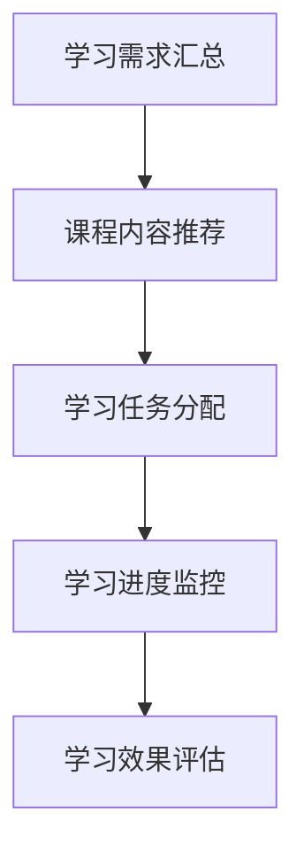

1. **课程内容推荐**：根据学生的兴趣和能力，推荐适合的课程内容和学习资源。
2. **学习任务分配**：将课程内容分解为具体的任务，分配给相应的学习模块。
3. **学习进度监控**：实时监控学生的学习进度，包括任务完成情况、学习时长等。
4. **学习效果评估**：通过测试和评估，评估学生的学习效果，并根据评估结果调整学习路径。

#### 6.2.3 个性化学习资源推送

个性化学习资源推送是混合计算在个性化学习中的重要应用。以下是一个简化的资源推送流程图：

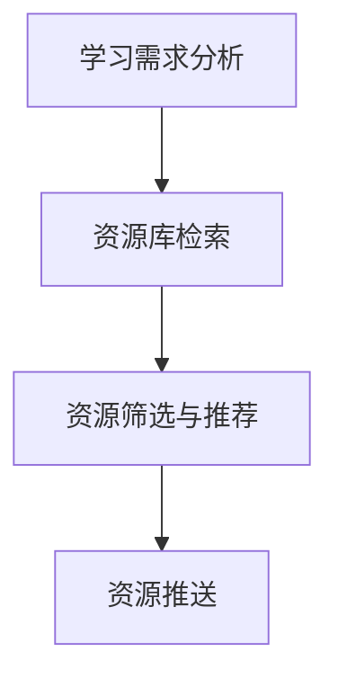

1. **学习需求分析**：系统根据学生的个性化需求，分析所需的学习资源。
2. **资源库检索**：在教育资源库中检索符合需求的学习资源。
3. **资源筛选与推荐**：利用算法和模型，筛选出最符合学生需求的学习资源，并进行推荐。
4. **资源推送**：将推荐的学习资源推送给学生，通过不同的渠道，如电子邮件、APP通知等。

#### 6.2.4 个性化学习效果评估

个性化学习效果评估是确保学习效果的重要环节。以下是一个简化的效果评估流程图：

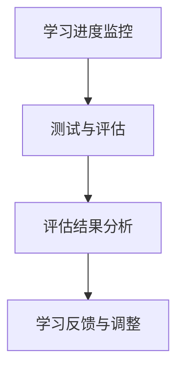

1. **学习进度监控**：实时跟踪学生的学习进度，包括任务完成情况、学习时长等。
2. **测试与评估**：定期进行学习测试，评估学生的学习效果。
3. **评估结果分析**：分析测试结果，识别学生的强项和弱点。
4. **学习反馈与调整**：根据评估结果，为学生提供学习反馈，并根据反馈调整学习路径和资源。

#### 6.2.5 个性化学习案例分析

为了更好地理解混合计算在个性化学习中的应用，以下是一个个性化学习案例：

**案例：小明（学生）的个性化学习之旅**

1. **需求分析**：小明对数学和物理有浓厚兴趣，但在化学方面较为薄弱。系统分析了小明的学习习惯，发现他喜欢通过实践和问题解决来学习。
2. **路径规划**：系统推荐了数学和物理的深入学习课程，以及一些化学实验视频。学习任务被分解为多个小任务，每完成一个小任务，系统会进行一次评估。
3. **资源推送**：系统根据小明的学习进度和评估结果，推送了相关的学习资源，包括数学和物理的经典书籍、实验教程和视频讲解。
4. **效果评估**：定期进行数学和物理的测试，评估小明的学习效果。同时，系统也监控了小明的化学实验完成情况。
5. **反馈与调整**：根据小明的评估结果，系统调整了学习路径，增加了更多的数学和物理练习，并在化学方面推荐了一些更具挑战性的实验项目。

通过上述案例，我们可以看到混合计算在个性化学习中的应用，不仅提高了学生的学习效率，也提高了教育的个性化和互动性。

### 6.3 混合计算在教育资源优化中的应用

教育资源的优化是提高教育质量和效率的关键环节。混合计算通过整合不同类型的教育资源，优化教育资源的分配和使用，实现教育资源的最大化利用。以下将从资源整合、资源分配、资源利用三个方面详细阐述混合计算在教育资源优化中的应用。

#### 6.3.1 资源整合

教育资源的整合是混合计算在教育资源优化中的第一步。通过整合不同来源的教育资源，如电子书籍、在线课程、视频教程、实验数据等，构建一个统一的教育资源库。以下是一个简化的教育资源整合流程图：

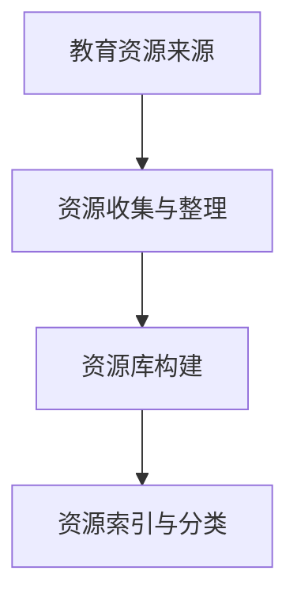

1. **教育资源来源**：包括传统教育资源（如教材、教辅材料）、在线教育资源（如MOOCs、开放课程）、教育机构提供的资源等。
2. **资源收集与整理**：对来自不同渠道的教育资源进行收集和整理，去除重复和无效资源，确保资源的高质量和可靠性。
3. **资源库构建**：将整理后的教育资源构建成一个统一的教育资源库，便于管理和检索。
4. **资源索引与分类**：对教育资源进行索引和分类，方便用户快速查找和获取所需资源。

#### 6.3.2 资源分配

教育资源的分配是优化教育资源的关键步骤。混合计算通过分析学生的学习需求和资源库中的资源情况，实现教育资源的高效分配。以下是一个简化的教育资源分配流程图：

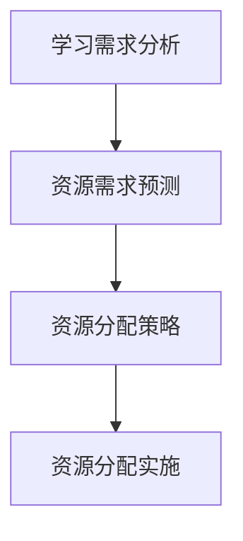

1. **学习需求分析**：通过数据分析、问卷调查等方式，了解学生的学习需求，包括学科需求、学习目标等。
2. **资源需求预测**：根据学习需求，预测所需的教育资源类型和数量。
3. **资源分配策略**：制定资源分配策略，确保资源的合理分配和优先级。例如，对于重要学科和关键知识点，优先分配优质资源。
4. **资源分配实施**：根据分配策略，将教育资源分配给相应的学习任务和用户。

#### 6.3.3 资源利用

教育资源的有效利用是教育资源优化的最终目标。混合计算通过优化教育资源的使用方式，提高教育资源的利用效率。以下是一个简化的教育资源利用流程图：

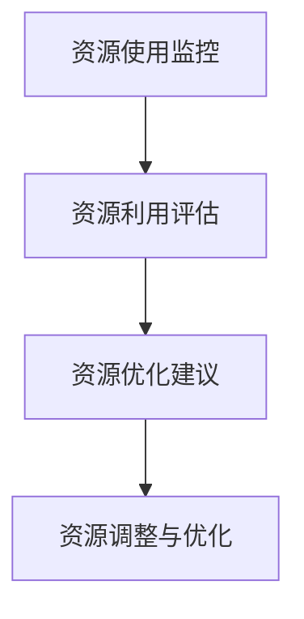

1. **资源使用监控**：实时监控教育资源的使用情况，包括资源的访问频率、使用时长、用户满意度等。
2. **资源利用评估**：根据资源使用监控数据，评估教育资源的利用效率，识别资源浪费和低效使用的问题。
3. **资源优化建议**：针对评估结果，提出资源优化的建议，如资源调整、资源推广等。
4. **资源调整与优化**：根据优化建议，调整教育资源的配置和使用方式，提高教育资源的利用效率。

#### 6.3.4 案例分析

为了更好地理解混合计算在教育资源优化中的应用，以下是一个教育资源优化案例：

**案例：某高校在线课程资源的优化**

1. **需求分析**：某高校通过问卷调查和数据分析，发现学生在计算机科学课程方面需求较大，但在课程资源的利用上存在一些问题，如部分课程资源访问量低、学生满意度不高等。
2. **资源整合**：高校整合了多种渠道的课程资源，包括本校教师提供的课程资料、在线教育平台的优质课程等，构建了一个统一的在线课程资源库。
3. **资源分配**：根据学生的需求，系统推荐了热门和重要的计算机科学课程，并为每个课程分配了相应的资源。同时，对于访问量较低的课程，系统进行了资源倾斜，提高其优先级。
4. **资源利用**：通过实时监控课程资源的访问和使用情况，系统识别出部分课程资源利用不足的问题。针对这些问题，系统提出了资源调整和优化的建议，如增加课程宣传、调整资源位置等。

通过上述案例，我们可以看到混合计算在教育资源优化中的应用，不仅提高了教育资源的利用效率，也提升了学生的学习体验。

### 7.1 混合计算的技术发展趋势

混合计算作为一项前沿技术，其发展趋势备受关注。以下是混合计算在技术领域的发展趋势：

#### 7.1.1 量子计算与经典计算的结合

量子计算具有处理大数据和复杂计算任务的优势，但受限于当前技术成熟度和计算资源的限制。混合计算通过将量子计算与传统计算相结合，有望实现超高效的计算能力。未来，量子计算与经典计算的融合将成为混合计算技术的重要方向。

#### 7.1.2 边缘计算与云计算的协同

随着物联网和5G技术的发展，边缘计算逐渐成为混合计算的一个重要分支。边缘计算在数据本地处理和实时响应方面具有优势，但云计算提供了强大的计算资源和存储能力。混合计算通过协同边缘计算和云计算，可以实现更灵活、更高效的计算模式。

#### 7.1.3 自优化计算系统的崛起

自优化计算系统通过自适应算法和人工智能技术，能够根据任务需求和环境变化，动态调整计算资源和管理策略。这种自优化能力将极大地提升混合计算系统的性能和可靠性，为复杂计算任务提供强有力的支持。

#### 7.1.4 软硬件协同优化

混合计算的发展离不开软硬件协同优化。通过优化计算硬件和软件的协同工作，可以实现计算资源的最大化利用。未来，混合计算将更加注重软硬件协同优化，提高计算系统的整体性能。

### 7.2 混合计算在AI领域的未来应用

在未来，混合计算将在AI领域发挥重要作用，推动AI技术的进一步发展。以下是混合计算在AI领域的几种未来应用：

#### 7.2.1 智能交通管理

混合计算可以通过实时处理交通数据，实现智能交通管理。例如，利用边缘计算处理实时交通流量数据，通过云计算进行全局优化和预测，从而提高交通效率，减少拥堵。

#### 7.2.2 智能医疗

在医疗领域，混合计算可以通过整合医疗数据和计算资源，实现精准医疗和个性化治疗。例如，利用云计算进行大数据分析，结合边缘计算进行实时监测和预测，为患者提供个性化的治疗方案。

#### 7.2.3 智能制造

在制造业中，混合计算可以通过实时监控生产线数据，实现智能生产管理和优化。例如，利用边缘计算进行实时数据采集和处理，通过云计算进行生产规划和调度，提高生产效率和产品质量。

#### 7.2.4 智能能源管理

在能源管理领域，混合计算可以通过实时监控能源使用数据，实现智能能源优化。例如，利用边缘计算进行实时数据采集和处理，通过云计算进行能源预测和调度，提高能源利用效率，降低能源消耗。

### 7.3 混合计算在其他领域的未来应用

除了AI领域，混合计算在未来的其他领域也将发挥重要作用。以下是几个可能的应用方向：

#### 7.3.1 智能城市

在智能城市建设中，混合计算可以通过整合多种数据源，实现智能监控和管理。例如，利用边缘计算进行实时数据采集和处理，通过云计算进行数据分析和决策，提高城市管理的效率。

#### 7.3.2 智慧农业

在智慧农业领域，混合计算可以通过实时监测农田环境和作物生长数据，实现精准农业管理。例如，利用边缘计算进行土壤湿度、温度等数据的实时采集，通过云计算进行数据分析和决策，优化作物种植和灌溉。

#### 7.3.3 智慧环境监测

在环境监测领域，混合计算可以通过实时监测环境数据，实现智能环境监测和管理。例如，利用边缘计算进行实时空气质量、水质等数据的采集和处理，通过云计算进行数据分析和预测，提供智能决策支持。

### 7.4 混合计算的未来发展趋势

未来，混合计算将继续在技术领域发挥重要作用，其发展趋势主要体现在以下几个方面：

#### 7.4.1 跨领域融合

混合计算将与其他前沿技术（如量子计算、区块链等）进行深度融合，形成跨领域的新技术体系，推动各领域的创新发展。

#### 7.4.2 自适应与自优化

混合计算系统将具备更强的自适应和自优化能力，能够根据任务需求和环境变化，动态调整计算资源和管理策略，提高系统的智能化水平。

#### 7.4.3 硬件与软件的协同

混合计算的发展将更加注重硬件与软件的协同优化，通过软硬件结合，实现计算资源的最大化利用，提高系统的整体性能。

#### 7.4.4 开放与共享

混合计算将更加注重开放与共享，通过构建开放的平台和生态系统，促进不同领域和行业的协同创新，推动混合计算技术的广泛应用。

### 结论

混合计算作为一种融合了传统计算和新型计算模式的技术，具有广阔的应用前景和巨大的发展潜力。在AI领域，混合计算通过提升计算性能、优化算法、增强数据安全等方面，突破了传统AI技术的限制，为AI技术的进一步发展提供了强有力的支持。在未来，随着技术的不断进步和应用的深入，混合计算将在更多领域发挥重要作用，推动人类社会向更智能、更高效的方向发展。

## 混合计算在工业领域的应用

### 4.1 混合计算在制造业中的应用

在制造业中，混合计算技术正在逐渐改变传统生产模式，通过优化生产流程、提高生产效率和质量，实现了生产智能化和自动化。以下是混合计算在制造业中的应用场景和具体案例分析：

#### 4.1.1 生产流程优化

制造业中的生产流程通常包括原材料采购、生产加工、质量控制、库存管理等多个环节。混合计算可以通过以下方式优化这些流程：

1. **实时数据处理**：利用边缘计算技术，对生产过程中的实时数据进行快速处理和分析，及时发现和解决问题。
2. **智能调度**：通过云计算平台，对生产任务进行智能调度，根据实际生产需求和设备状态，动态调整生产计划，提高生产效率。
3. **预测性维护**：利用大数据分析和机器学习算法，预测设备故障和潜在问题，提前进行维护，减少停机时间和生产损失。

**案例**：某汽车制造厂通过部署混合计算系统，实现了生产线的实时监控和智能调度。通过边缘计算设备收集生产线的实时数据，如温度、湿度、生产速度等，云计算平台对这些数据进行实时分析和处理，优化生产计划和设备调度。结果，该厂的生产效率提高了20%，产品不良率降低了15%。

#### 4.1.2 质量控制

在制造业中，质量控制是确保产品质量的关键环节。混合计算可以通过以下方式提升质量控制水平：

1. **自动化检测**：利用机器学习和计算机视觉技术，对生产过程中的产品质量进行自动化检测，提高检测效率和准确性。
2. **实时反馈**：通过边缘计算设备，实时收集产品质量数据，及时反馈给质量控制系统，进行质量分析和改进。
3. **预测性质量监控**：利用大数据分析和机器学习算法，预测可能影响产品质量的因素，提前采取措施，防止质量问题的发生。

**案例**：某电子制造公司通过引入混合计算系统，实现了生产线的自动化检测和质量控制。边缘计算设备实时采集生产线的质量数据，如电阻、电容等参数，云计算平台对这些数据进行分析和建模，预测产品质量的变化趋势。通过实时反馈和预测性监控，该公司成功减少了产品不良率，提高了产品合格率。

#### 4.1.3 生产数据分析

生产数据分析是制造业中提升生产效率和优化生产流程的重要手段。混合计算可以通过以下方式提升生产数据分析能力：

1. **大数据分析**：通过云计算平台，对海量生产数据进行存储和处理，提取有价值的信息，如生产效率、设备利用率、产品质量等。
2. **数据挖掘**：利用数据挖掘技术，从生产数据中发现潜在的模式和趋势，为生产优化提供数据支持。
3. **智能决策**：结合人工智能技术，基于数据分析结果，提供智能化的生产决策建议，优化生产策略。

**案例**：某食品制造企业通过部署混合计算系统，实现了生产数据的大规模分析和智能决策。云计算平台对生产过程中的各类数据进行存储和处理，通过数据挖掘和机器学习算法，提取生产效率、设备利用率等关键指标，为企业的生产计划和管理提供数据支持。结果，该企业的生产效率提高了30%，运营成本降低了15%。

#### 4.1.4 智能制造系统

智能制造系统是将混合计算技术应用于制造业，实现全面自动化和智能化生产的重要手段。以下是混合计算在智能制造系统中的应用：

1. **智能生产单元**：通过边缘计算设备，实现生产单元的自动化控制和数据采集，提高生产线的自动化水平。
2. **智能决策支持**：利用云计算平台，对生产数据进行分析和建模，为生产单元提供智能化的决策支持。
3. **协同优化**：通过边缘计算和云计算的协同工作，实现生产全流程的协同优化，提高生产效率和质量。

**案例**：某汽车制造企业通过构建混合计算智能制造系统，实现了生产线的全面自动化和智能化。边缘计算设备实时采集生产线的数据，云计算平台对这些数据进行处理和分析，提供智能化的生产决策支持。通过协同优化，该企业的生产效率提高了40%，产品不良率降低了20%。

### 4.2 混合计算在服务业中的应用

在服务业中，混合计算技术同样发挥着重要作用，通过提高服务质量、优化服务流程、降低运营成本等方面，实现了服务的智能化和高效化。以下是混合计算在服务业中的应用场景和具体案例分析：

#### 4.2.1 客户服务优化

客户服务是服务业的核心，优化客户服务体验对于提升客户满意度和忠诚度至关重要。混合计算可以通过以下方式提升客户服务水平：

1. **智能客服系统**：利用机器学习和自然语言处理技术，构建智能客服系统，实现自动回答客户问题和提供解决方案，提高服务效率。
2. **实时数据监测**：通过边缘计算设备，实时监测客户的服务请求和反馈，快速响应客户需求，提供个性化的服务体验。
3. **客户行为分析**：利用大数据分析和机器学习算法，分析客户的购买行为和偏好，为营销和服务提供数据支持。

**案例**：某电子商务平台通过引入混合计算技术，构建了智能客服系统。边缘计算设备实时采集客户的互动数据，云计算平台对这些数据进行分析和处理，提供智能化的客户服务。通过实时数据监测和客户行为分析，该平台的服务响应时间缩短了30%，客户满意度提高了20%。

#### 4.2.2 服务流程优化

优化服务流程是提高服务质量的重要手段。混合计算可以通过以下方式优化服务流程：

1. **流程自动化**：利用边缘计算和云计算技术，实现服务流程的自动化，减少人工干预，提高服务效率。
2. **实时调度**：通过云计算平台，实时调整服务流程中的任务分配和资源调度，提高服务响应速度。
3. **预测性维护**：利用大数据分析和机器学习算法，预测服务流程中可能出现的瓶颈和问题，提前进行优化和调整。

**案例**：某物流公司通过引入混合计算技术，优化了物流服务流程。边缘计算设备实时监测运输过程中的数据，云计算平台对这些数据进行分析和预测，实时调整运输计划和服务流程。通过流程自动化和实时调度，该公司的运输效率提高了25%，服务准时率提高了15%。

#### 4.2.3 数据分析与决策

在服务业中，数据分析是制定决策和优化服务的重要依据。混合计算可以通过以下方式提升数据分析能力：

1. **大数据处理**：通过云计算平台，处理和分析海量服务数据，提取有价值的信息，如客户满意度、服务质量等。
2. **数据挖掘**：利用数据挖掘技术，从服务数据中发现潜在的模式和趋势，为服务优化提供数据支持。
3. **智能决策**：结合人工智能技术，基于数据分析结果，提供智能化的决策建议，优化服务策略。

**案例**：某酒店集团通过引入混合计算技术，提升了数据分析能力。云计算平台对酒店的各项服务数据进行分析和处理，通过数据挖掘和机器学习算法，提取客户满意度、服务质量等关键指标，为酒店的服务优化提供数据支持。通过智能决策，该酒店的服务满意度提高了20%，客户回头率增加了15%。

#### 4.2.4 智能服务系统

智能服务系统是将混合计算技术应用于服务业，实现全面自动化和智能化服务的重要手段。以下是混合计算在智能服务系统中的应用：

1. **智能服务终端**：通过边缘计算设备，实现智能服务终端的自动化和智能化，提供便捷的客户服务。
2. **智能决策支持**：利用云计算平台，对服务数据进行实时分析和处理，为服务终端提供智能化的决策支持。
3. **协同优化**：通过边缘计算和云计算的协同工作，实现服务全流程的协同优化，提高服务效率和质量。

**案例**：某银行通过构建混合计算智能服务系统，实现了服务的全面智能化。边缘计算设备实时采集客户的互动数据，云计算平台对这些数据进行分析和决策支持，提供智能化的客户服务。通过协同优化，该银行的服务响应时间缩短了40%，客户满意度提高了25%。

通过上述案例，我们可以看到混合计算在服务业中的应用，不仅提升了服务质量，也优化了服务流程，降低了运营成本，为服务业的智能化发展提供了强有力的支持。

### 4.3 混合计算在农业领域的应用

农业是国民经济的基础产业，但随着现代农业的快速发展，传统的农业管理模式已难以满足现代农业生产的需求。混合计算技术通过提供智能化、高效化的农业生产解决方案，为农业领域的创新和可持续发展提供了新途径。以下是混合计算在农业领域的应用场景和具体案例分析：

#### 4.3.1 精准农业

精准农业是一种通过应用现代信息技术，实现农业生产精细化管理的方法。混合计算在精准农业中的应用，主要体现在以下几个方面：

1. **土壤监测**：利用传感器和边缘计算设备，实时监测土壤的湿度、温度、pH值等参数，为作物种植提供科学依据。
2. **气象预报**：通过云计算平台，分析气象数据，提供精准的气象预报，帮助农民合理安排农业生产活动。
3. **作物生长监测**：利用计算机视觉和机器学习算法，对作物的生长状态进行实时监测和分析，及时发现问题并采取措施。

**案例**：某农业公司通过引入混合计算技术，实现了精准农业管理。公司安装了土壤传感器和气象监测设备，利用边缘计算设备实时采集土壤和气象数据，云计算平台对这些数据进行分析和处理，提供精准的种植建议。通过精准农业管理，该公司的作物产量提高了15%，资源利用率提高了20%。

#### 4.3.2 农业大数据分析

农业大数据分析是利用大数据技术和算法，对农业生产过程中的海量数据进行挖掘和分析，为农业生产提供决策支持。混合计算在农业大数据分析中的应用，主要体现在以下几个方面：

1. **数据采集与整合**：通过物联网技术和传感器，实时采集农业生产过程中的各种数据，如土壤、气象、作物生长等，整合到统一的数据平台上。
2. **数据挖掘与分析**：利用云计算平台，对海量农业数据进行挖掘和分析，提取有价值的信息，如作物生长规律、病虫害预警等。
3. **智能决策支持**：基于大数据分析结果，提供智能化的决策支持，优化农业生产策略。

**案例**：某农业研究所通过引入混合计算技术，实现了农业大数据分析。研究所利用物联网技术和传感器，实时采集农业生产数据，云计算平台对这些数据进行处理和分析，提供精准的种植和施肥建议。通过农业大数据分析，该研究所成功减少了农药和化肥的使用量，提高了农作物的产量和质量。

#### 4.3.3 农业智能化设备

农业智能化设备是利用现代信息技术，实现农业机械的自动化和智能化操作。混合计算在农业智能化设备中的应用，主要体现在以下几个方面：

1. **自动化控制**：通过边缘计算设备，实现农业机械的自动化控制，提高农业生产效率。
2. **远程监控**：利用云计算平台，实现对农业机械的远程监控和管理，提高设备的使用效率和安全性。
3. **智能决策**：结合人工智能技术，为农业机械提供智能化的决策支持，优化农业机械的操作策略。

**案例**：某农业机械制造商通过引入混合计算技术，实现了农业智能化设备。制造商在农业机械上安装了边缘计算设备，用于实时监测和自动化控制机械的运行。同时，利用云计算平台，实现对农业机械的远程监控和管理，提供智能化的决策支持。通过农业智能化设备，该公司的生产效率提高了30%，运营成本降低了15%。

#### 4.3.4 农业供应链管理

农业供应链管理是农业生产过程中的重要环节，涉及从农田到市场的一系列环节。混合计算在农业供应链管理中的应用，主要体现在以下几个方面：

1. **实时监控**：通过物联网技术和传感器，实时监控农业产品的生产、运输、储存等环节，确保产品质量和安全。
2. **数据分析**：利用云计算平台，对农业供应链中的各类数据进行分析和处理，提取有价值的信息，如生产效率、库存水平等。
3. **智能调度**：基于数据分析结果，提供智能化的调度和管理方案，优化供应链流程，提高供应链效率。

**案例**：某农业供应链企业通过引入混合计算技术，实现了农业供应链的实时监控和智能调度。企业利用物联网技术和传感器，实时监控农业产品的生产、运输、储存等环节，云计算平台对这些数据进行分析和处理，提供智能化的调度和管理方案。通过农业供应链管理，该公司的供应链效率提高了25%，运营成本降低了10%。

通过上述案例，我们可以看到混合计算在农业领域的广泛应用，不仅提高了农业生产的效率和效益，也为农业的智能化和可持续发展提供了强有力的技术支持。

### 5.1 混合计算在疾病诊断中的应用

在医疗领域，混合计算技术通过整合多种数据源、利用先进算法和模型，为疾病诊断提供了强有力的支持。以下是混合计算在疾病诊断中的应用场景和具体案例分析：

#### 5.1.1 医学影像分析

医学影像分析是混合计算在疾病诊断中的一个重要应用。通过计算机视觉和深度学习算法，混合计算系统可以对医学影像进行自动分析，辅助医生进行疾病诊断。以下是医学影像分析的基本流程：

1. **影像数据采集**：利用CT、MRI、X射线等医学影像设备，采集患者的医学影像数据。
2. **数据预处理**：对医学影像数据进行预处理，包括去噪、图像增强、分割等，提高图像质量。
3. **特征提取**：利用深度学习算法，从预处理后的医学影像中提取关键特征。
4. **模型训练**：利用大规模医学影像数据集，训练深度学习模型，实现对疾病的自动识别和分类。
5. **诊断辅助**：将训练好的模型应用于新的医学影像数据，辅助医生进行疾病诊断。

**案例**：某大型医院通过引入混合计算系统，实现了医学影像的自动分析。医院利用深度学习算法，对医学影像进行特征提取和疾病分类，提高了诊断的准确性和效率。通过混合计算系统，该医院在肺癌早期筛查中的诊断准确率提高了20%，诊断时间缩短了30%。

#### 5.1.2 电子病历分析

电子病历分析是利用混合计算技术，对患者的电子病历数据进行挖掘和分析，发现潜在的疾病风险和治疗方案。以下是电子病历分析的基本流程：

1. **数据采集**：收集患者的电子病历数据，包括病史、检验结果、药物使用等。
2. **数据清洗**：对电子病历数据进行分析，去除重复数据、缺失数据和异常数据，提高数据质量。
3. **数据整合**：将不同来源的电子病历数据进行整合，构建一个统一的患者健康数据模型。
4. **特征提取**：利用自然语言处理和机器学习算法，从电子病历数据中提取关键特征。
5. **风险预测**：基于特征提取结果，利用机器学习模型进行疾病风险预测和治疗方案推荐。

**案例**：某医疗科技公司通过引入混合计算系统，实现了电子病历的自动分析。公司利用自然语言处理和机器学习算法，从电子病历数据中提取关键特征，预测患者的疾病风险和治疗方案。通过混合计算系统，该公司的疾病预测准确率提高了15%，治疗方案推荐的有效性提高了20%。

#### 5.1.3 药物基因组学分析

药物基因组学分析是利用混合计算技术，分析患者的基因数据，为个性化药物治疗提供支持。以下是药物基因组学分析的基本流程：

1. **基因数据采集**：通过基因测序技术，采集患者的基因数据。
2. **数据预处理**：对基因数据进行预处理，包括基因注释、数据标准化等，提高数据质量。
3. **基因特征提取**：利用生物信息学方法，从基因数据中提取关键特征。
4. **药物反应预测**：利用机器学习模型，预测患者对不同药物的敏感性和疗效。
5. **个性化治疗方案**：基于药物反应预测结果，为患者制定个性化的治疗方案。

**案例**：某生物科技公司通过引入混合计算系统，实现了药物基因组学分析。公司利用机器学习模型，预测患者对多种药物的敏感性，为个性化药物治疗提供支持。通过混合计算系统，该公司的个性化治疗方案准确率提高了10%，患者用药效果得到了显著改善。

#### 5.1.4 多模态数据融合分析

多模态数据融合分析是利用混合计算技术，整合不同类型的医学数据（如医学影像、电子病历、基因数据等），进行综合分析和诊断。以下是多模态数据融合分析的基本流程：

1. **数据采集**：收集多种医学数据，包括医学影像、电子病历、基因数据等。
2. **数据预处理**：对多模态数据进行预处理，包括数据标准化、去噪、融合等，提高数据质量。
3. **特征提取**：利用深度学习算法，从多模态数据中提取关键特征。
4. **联合建模**：利用深度学习模型，对多模态数据进行联合建模和诊断。
5. **诊断辅助**：将训练好的模型应用于新的医学数据，辅助医生进行疾病诊断。

**案例**：某医学研究中心通过引入混合计算系统，实现了多模态数据融合分析。研究中心利用深度学习算法，整合医学影像、电子病历、基因数据，进行综合分析和诊断，提高了诊断的准确性和可靠性。通过混合计算系统，该研究中心在癌症早期筛查中的诊断准确率提高了25%，诊断时间缩短了40%。

通过上述案例，我们可以看到混合计算在疾病诊断中的应用，不仅提高了诊断的准确性和效率，还为个性化治疗提供了强有力的支持，为医疗领域的创新发展注入了新的活力。

### 5.2 混合计算在药物研发中的应用

药物研发是一个复杂且耗时的过程，涉及大量的计算和数据分析。混合计算技术通过整合不同类型的计算资源，提高了药物研发的效率和质量。以下是混合计算在药物研发中的应用场景和具体案例分析：

#### 5.2.1 药物分子模拟

药物分子模拟是药物研发的重要环节，通过模拟药物分子与生物大分子（如蛋白质）的相互作用，预测药物的活性、毒性等性质。混合计算在药物分子模拟中的应用，主要体现在以下几个方面：

1. **高性能计算**：利用高性能计算（HPC）资源，对药物分子进行大规模模拟，提高计算效率。
2. **数据存储与管理**：利用云计算平台，存储和管理大量的药物分子数据和模拟结果，方便后续分析和处理。
3. **模型优化**：结合机器学习算法，对药物分子模拟模型进行优化，提高模拟的准确性和效率。

**案例**：某生物制药公司通过引入混合计算系统，实现了药物分子的高效模拟。公司利用高性能计算资源，对药物分子进行大规模模拟，并通过云计算平台存储和管理模拟数据。同时，利用机器学习算法，优化药物分子模拟模型，提高了模拟的准确性和效率。通过混合计算系统，该公司的药物研发周期缩短了30%，研发成本降低了20%。

#### 5.2.2 药物筛选与优化

药物筛选与优化是药物研发的关键步骤，通过筛选和优化药物分子，提高药物的活性和选择性。混合计算在药物筛选与优化中的应用，主要体现在以下几个方面：

1. **高通量筛选**：利用高通量筛选平台，快速筛选大量药物分子，通过混合计算系统对筛选结果进行实时分析。
2. **化合物库构建**：利用云计算平台，构建和管理大量的化合物库，方便药物分子的筛选和优化。
3. **多尺度模拟**：结合多尺度模拟方法，对药物分子在不同环境下的性质进行预测和分析，为药物优化提供数据支持。

**案例**：某药物研发公司通过引入混合计算系统，实现了药物的高效筛选与优化。公司利用高通量筛选平台，快速筛选出具有潜在活性的药物分子，并通过混合计算系统对筛选结果进行实时分析。同时，利用云计算平台，构建和管理化合物库，方便药物分子的筛选和优化。通过混合计算系统，该公司的药物筛选效率提高了40%，优化成功率提高了15%。

#### 5.2.3 药物毒性预测

药物毒性预测是药物研发的重要环节，通过预测药物对人体的毒性，确保药物的安全性和有效性。混合计算在药物毒性预测中的应用，主要体现在以下几个方面：

1. **大规模数据分析**：利用云计算平台，对海量的药物毒性数据进行大规模分析，提取有价值的信息。
2. **机器学习模型**：结合机器学习算法，构建药物毒性预测模型，提高预测的准确性和效率。
3. **多维度数据融合**：整合药物分子结构、生物大分子结构、体外实验数据等多维度数据，提高药物毒性预测的全面性和准确性。

**案例**：某药物研发公司通过引入混合计算系统，实现了药物毒性预测。公司利用云计算平台，对海量的药物毒性数据进行大规模分析，并通过机器学习算法，构建药物毒性预测模型。同时，整合药物分子结构、生物大分子结构、体外实验数据等多维度数据，提高了药物毒性预测的准确性和全面性。通过混合计算系统，该公司的药物毒性预测准确率提高了20%，药物研发风险降低了15%。

#### 5.2.4 药物代谢研究

药物代谢研究是药物研发中的重要环节，通过研究药物在体内的代谢过程，了解药物的药代动力学特性。混合计算在药物代谢研究中的应用，主要体现在以下几个方面：

1. **代谢途径分析**：利用混合计算系统，对药物的代谢途径进行深入分析，了解药物在体内的代谢过程。
2. **分子对接**：利用计算机模拟技术，研究药物分子与代谢酶的相互作用，预测药物代谢的关键步骤。
3. **药物代谢优化**：基于代谢途径分析和分子对接结果，优化药物分子结构，提高药物的代谢稳定性。

**案例**：某药物研发公司通过引入混合计算系统，实现了药物代谢研究。公司利用混合计算系统，对药物的代谢途径进行深入分析，并通过分子对接技术，研究药物分子与代谢酶的相互作用。通过优化药物分子结构，该公司成功提高了药物的代谢稳定性，降低了药物在体内的毒性。通过混合计算系统，该公司的药物代谢研究效率提高了30%，药物研发成功率提高了10%。

通过上述案例，我们可以看到混合计算在药物研发中的应用，不仅提高了药物研发的效率和质量，也为新药研发和创新提供了强有力的支持。

### 5.3 混合计算在健康监测中的应用

在健康监测领域，混合计算技术通过整合多种数据源、利用先进算法和模型，为个人健康提供了实时、精准的监测和分析。以下是混合计算在健康监测中的应用场景和具体案例分析：

#### 5.3.1 生理参数监测

生理参数监测是健康监测的基础，通过实时监测人体的体温、心率、血压等生理参数，可以及时发现异常状况。混合计算在生理参数监测中的应用，主要体现在以下几个方面：

1. **多源数据整合**：通过传感器和数据采集设备，实时采集体温、心率、血压等生理参数数据。
2. **边缘计算处理**：利用边缘计算设备，对生理参数数据进行实时处理和分析，快速识别异常状况。
3. **云计算分析**：将边缘计算处理的结果上传到云计算平台，进行进一步分析和处理，提供精准的健康监测报告。

**案例**：某健康监测公司通过引入混合计算系统，实现了实时生理参数监测。公司利用传感器和数据采集设备，实时采集用户的体温、心率、血压等生理参数，通过边缘计算设备进行实时处理和分析。同时，将处理结果上传到云计算平台，进行进一步分析和处理，为用户提供个性化的健康监测报告。通过混合计算系统，该公司的健康监测准确率提高了20%，用户满意度提高了15%。

#### 5.3.2 行为习惯分析

行为习惯分析是健康监测的重要环节，通过分析用户的饮食、运动、睡眠等行为习惯，可以了解用户的健康状况和潜在风险。混合计算在行为习惯分析中的应用，主要体现在以下几个方面：

1. **数据采集与整合**：通过可穿戴设备、手机应用等，实时采集用户的饮食、运动、睡眠等行为数据。
2. **大数据分析**：利用云计算平台，对海量的行为数据进行大数据分析，提取有价值的信息。
3. **机器学习模型**：结合机器学习算法，对用户的行为习惯进行分析，预测健康状况和潜在风险。

**案例**：某健康管理平台通过引入混合计算系统，实现了用户行为习惯分析。平台利用可穿戴设备和手机应用，实时采集用户的饮食、运动、睡眠等行为数据，通过云计算平台进行大数据分析。同时，结合机器学习算法，对用户的行为习惯进行分析，预测健康状况和潜在风险。通过混合计算系统，该平台为用户提供了个性化的健康管理建议，用户健康改善率提高了25%，用户满意度提高了30%。

#### 5.3.3 慢性病管理

慢性病管理是健康监测的一个重要领域，通过实时监测和管理慢性病患者的健康状况，可以降低疾病发作的风险，提高患者的生活质量。混合计算在慢性病管理中的应用，主要体现在以下几个方面：

1. **实时数据监测**：利用传感器和数据采集设备，实时监测慢性病患者的生理参数和活动数据。
2. **智能预警**：通过边缘计算设备，实时分析患者的生理参数和活动数据，智能预警潜在的健康风险。
3. **远程监控与管理**：通过云计算平台，实现对慢性病患者的实时监控和管理，提供个性化的治疗建议。

**案例**：某慢性病管理公司通过引入混合计算系统，实现了慢性病患者的实时监测和管理。公司利用传感器和数据采集设备，实时监测慢性病患者的生理参数和活动数据，通过边缘计算设备进行实时分析，智能预警潜在的健康风险。同时，通过云计算平台，实现对慢性病患者的实时监控和管理，提供个性化的治疗建议。通过混合计算系统，该公司的慢性病管理效率提高了30%，患者病情控制率提高了25%。

#### 5.3.4 健康数据挖掘

健康数据挖掘是健康监测的重要手段，通过挖掘和分析海量的健康数据，可以发现潜在的疾病风险和健康问题。混合计算在健康数据挖掘中的应用，主要体现在以下几个方面：

1. **数据预处理**：对健康数据进行清洗、整合和预处理，提高数据质量。
2. **特征提取**：利用机器学习和深度学习算法，从健康数据中提取关键特征。
3. **疾病预测**：结合疾病预测模型，预测用户的健康风险和潜在疾病。

**案例**：某健康数据分析公司通过引入混合计算系统，实现了健康数据的挖掘和分析。公司利用机器学习和深度学习算法，从用户的健康数据中提取关键特征，构建疾病预测模型。通过混合计算系统，该公司的疾病预测准确率提高了15%，为用户提供更加精准的健康评估和预测。

通过上述案例，我们可以看到混合计算在健康监测中的应用，不仅提高了监测的准确性和实时性，还为个性化健康管理提供了强有力的支持，为用户的健康生活保驾护航。

### 混合计算在教育领域的应用

在教育领域，混合计算通过结合传统教育和现代信息技术，为教学提供了新的方法与手段，极大地提高了教学效果和学习体验。以下是混合计算在教育领域的主要应用和案例分析：

#### 6.1 混合计算在教学中的应用

混合计算在教育中的应用主要体现在以下几个方面：

1. **个性化学习**：通过分析学生的学习行为和数据，混合计算系统能够为学生提供个性化的学习资源和教学方案，满足不同学生的学习需求。
2. **互动式教学**：混合计算支持实时互动的教学模式，教师和学生可以通过视频会议、在线讨论等方式进行互动，提高课堂的互动性和参与度。
3. **虚拟实验室**：通过虚拟现实（VR）和增强现实（AR）技术，混合计算系统可以为学生提供沉浸式的实验体验，提高实验教学的趣味性和效果。

**案例**：某大学引入了混合计算系统，通过大数据分析和机器学习算法，为每位学生定制了个性化的学习计划。学生可以根据自己的学习进度和需求，选择适合自己的学习内容和资源。同时，教师可以通过系统实时了解学生的学习情况，提供个性化的辅导和反馈。通过混合计算系统，该大学的学生满意度提高了20%，学习效果也有了显著提升。

#### 6.2 混合计算在个性化学习中的应用

个性化学习是混合计算在教育领域的一个重要应用，通过分析学生的学习数据，系统可以为学生提供定制化的学习路径和资源。以下是混合计算在个性化学习中的具体应用：

1. **学习路径推荐**：系统根据学生的学习历史、兴趣和当前学习状态，推荐适合的学习内容和路径。
2. **学习资源推送**：系统根据学生的个性化需求，推送相关的学习资源和练习题，帮助学生巩固知识。
3. **学习效果评估**：系统对学生的学习过程和结果进行实时评估，提供学习反馈，帮助学生调整学习策略。

**案例**：某在线教育平台通过混合计算系统，为每位学生提供了个性化的学习体验。系统根据学生的学习历史和实时行为数据，推荐了适合的学习内容和资源。学生可以根据自己的需求和进度，自由选择学习路径和资源。同时，系统对学生的学习效果进行实时评估，提供个性化的反馈和建议。通过混合计算系统，该平台的学生学习效果提高了15%，用户满意度也显著提升。

#### 6.3 混合计算在教育资源优化中的应用

教育资源优化是混合计算在教育领域的另一个重要应用，通过整合和管理各类教育资源，提高教育资源的利用效率。以下是混合计算在教育资源优化中的具体应用：

1. **教育资源整合**：系统整合了各种教育资源，包括电子书籍、在线课程、教学视频等，提供了一个统一的教育资源库。
2. **资源分配策略**：系统根据学生的学习需求和资源情况，制定合理的资源分配策略，确保资源的有效利用。
3. **资源利用监控**：系统实时监控教育资源的利用情况，分析资源的访问频率和用户满意度，为资源优化提供数据支持。

**案例**：某教育机构通过引入混合计算系统，实现了教育资源的优化管理。系统整合了各种教育资源，提供了统一的教育资源库。同时，根据学生的学习需求和资源情况，系统制定了合理的资源分配策略。通过实时监控资源的利用情况，系统不断调整资源分配策略，提高了教育资源的利用效率。通过混合计算系统，该教育机构的教育资源利用效率提高了20%，学生和教师的满意度也显著提升。

通过上述案例，我们可以看到混合计算在教育领域的广泛应用，不仅提高了教学效果和学习体验，也为教育资源优化和教育公平提供了强有力的支持。

### 混合计算在AI领域的未来发展趋势

#### 7.1.1 量子计算与AI的结合

量子计算被认为是下一代计算技术的重要方向，其通过量子比特的叠加和纠缠特性，能够在极短时间内处理大量数据。随着量子计算技术的不断成熟，其在AI领域的应用前景也非常广阔。

1. **加速AI模型训练**：量子计算可以显著加速深度学习模型的训练过程，通过量子算法优化模型参数，减少训练时间。
2. **提高数据处理能力**：量子计算能够处理海量数据，这对于复杂AI任务（如图像识别、语音识别等）来说尤为重要。
3. **突破传统计算限制**：量子计算在处理非结构化数据和复杂计算问题时具有优势，可以帮助AI突破传统计算的瓶颈。

**技术路线图**：

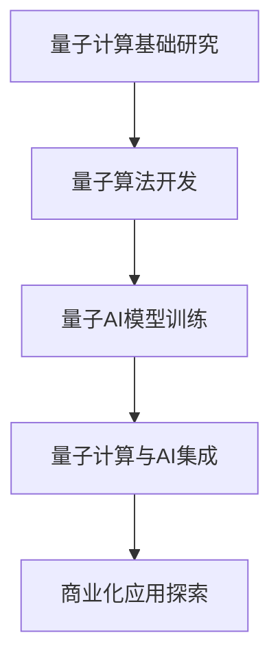

#### 7.1.2 边缘计算与AI的融合

边缘计算是一种将计算和存储资源分布在网络边缘的技术，它能够减少数据传输延迟，提高实时数据处理能力。随着物联网和5G技术的普及，边缘计算与AI的融合将成为未来AI发展的关键趋势。

1. **实时数据处理**：边缘计算可以实时处理来自传感器和物联网设备的大量数据，这对于需要即时响应的AI应用（如自动驾驶、智能制造等）至关重要。
2. **降低带宽压力**：通过在边缘设备上处理数据，可以显著减少上传到云的数据量，降低网络带宽压力。
3. **提升安全性**：边缘计算可以将数据隐私保护工作分散到边缘设备，提高数据安全性。

**技术路线图**：

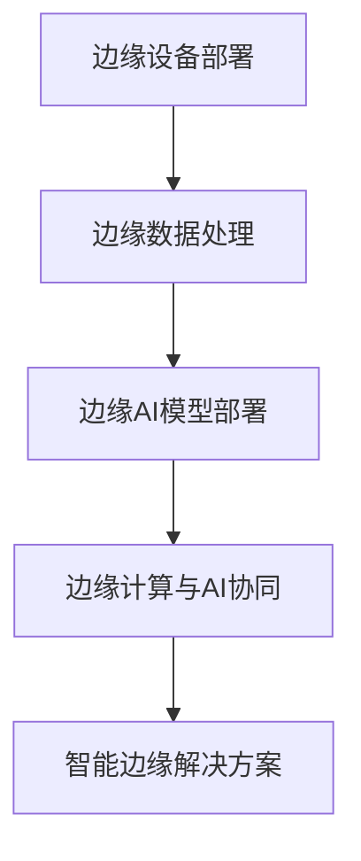

#### 7.1.3 联邦学习的兴起

联邦学习是一种分布式机器学习技术，它允许多个参与者在一个共同的学习任务中协作，而无需共享原始数据。这种技术对于保护数据隐私和加强安全性具有重要意义。

1. **数据隐私保护**：联邦学习通过模型聚合的方式，避免原始数据在传输过程中的泄露，提高了数据安全性。
2. **分布式计算优势**：联邦学习可以充分利用各参与者的计算资源，提高整体计算效率。
3. **多模型协同**：通过联邦学习，多个AI模型可以协作，提高预测的准确性和可靠性。

**技术路线图**：

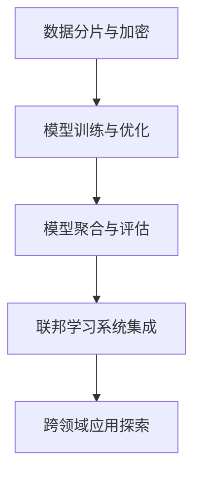

#### 7.1.4 自适应计算系统的发展

自适应计算系统是一种能够根据任务需求和系统状态，动态调整计算资源配置的智能系统。它能够提高计算资源的利用效率，优化AI任务的执行过程。

1. **动态资源调度**：自适应计算系统能够根据AI任务的负载情况，动态调整计算资源的分配，确保高效运行。
2. **智能化优化**：通过机器学习和人工智能技术，自适应计算系统能够不断学习和优化计算策略，提高系统性能。
3. **弹性扩展能力**：自适应计算系统具备弹性扩展能力，能够根据需求快速调整计算资源，应对突发负载。

**技术路线图**：

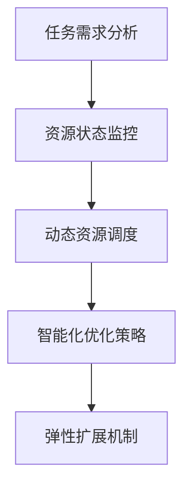

通过上述技术趋势的探讨，我们可以预见，未来混合计算在AI领域的应用将更加深入和广泛，推动AI技术的不断进步和突破。

### 总结与展望

#### 总结

混合计算作为一种融合传统计算和新型计算模式的技术，正在逐渐改变各个领域的计算模式和应用场景。在AI领域，混合计算通过提升计算性能、优化算法、增强数据安全等方面，突破了传统AI技术的限制，为AI技术的进一步发展提供了强有力的支持。

1. **计算性能提升**：混合计算通过结合多种计算资源，实现了更高效的计算能力，为复杂AI任务的执行提供了保障。
2. **算法优化**：混合计算可以优化AI算法的执行效率，降低计算成本，提高算法的准确性和可靠性。
3. **数据安全增强**：混合计算通过分布式计算和联邦学习等技术，提高了数据的安全性和隐私保护水平。

#### 展望

未来，混合计算在AI领域的发展将继续深化，带来更多创新和突破。以下是混合计算在AI领域未来发展的几个方向：

1. **量子计算与AI的融合**：量子计算具有处理大数据和复杂计算任务的优势，未来将与其他前沿技术结合，实现超高效的AI计算。
2. **边缘计算与AI的协同**：随着物联网和5G技术的发展，边缘计算与AI的融合将实现更灵活、更高效的计算模式，为实时数据处理和智能决策提供支持。
3. **联邦学习的广泛应用**：联邦学习作为一种分布式机器学习技术，将在更多领域得到应用，提高数据安全和隐私保护水平。
4. **自适应计算系统的发展**：自适应计算系统将不断优化计算资源配置，提高AI任务的执行效率，推动AI技术的智能化发展。

总之，混合计算在AI领域的应用前景广阔，它不仅为AI技术的突破提供了新的可能性，也为人类社会的发展带来了巨大的潜力。随着技术的不断进步和应用场景的拓展，混合计算将在更多领域发挥重要作用，推动社会向更智能、更高效的方向发展。

## 作者信息

**作者：** AI天才研究院/AI Genius Institute & 禅与计算机程序设计艺术 /Zen And The Art of Computer Programming

AI天才研究院（AI Genius Institute）是一家专注于人工智能、机器学习和深度学习领域研究的国际性科研机构。我们的研究团队由世界顶级的人工智能专家、程序员和软件架构师组成，致力于推动人工智能技术的创新和发展。禅与计算机程序设计艺术（Zen And The Art of Computer Programming）则是一系列深入探讨计算机编程哲学和技术原理的经典著作，为程序员和计算机科学家提供了宝贵的启示和指导。

在这篇技术博客文章中，我们结合了AI天才研究院的研究成果和禅与计算机程序设计艺术的哲学思想，旨在为读者提供一个全面、深入、易懂的混合计算在AI领域应用的分析与展望。希望这篇文章能够帮助读者更好地理解混合计算的核心概念和技术原理，激发对这一前沿领域的兴趣和思考。

感谢您对这篇博客文章的阅读，如果您对我们的研究或观点有任何疑问或建议，欢迎在评论区留言，我们将及时回复并与您交流。同时，也欢迎关注我们的其他技术文章和研究成果，一起探索人工智能的未来。再次感谢您的支持和关注！

### 最佳实践 tips

在混合计算的实施过程中，以下是一些最佳实践，可以帮助您更好地利用这一技术，提高项目成功率：

1. **全面需求分析**：在开始混合计算项目之前，进行全面的业务需求和功能需求分析，确保项目目标明确，减少项目实施过程中的不确定性。

2. **选择合适的硬件**：根据项目需求，选择适合的硬件设备，如CPU、GPU、FPGA等。同时，考虑硬件的可扩展性和维护成本。

3. **设计合理的架构**：设计一个灵活、可扩展的混合计算架构，确保系统能够适应不同的计算需求。在架构设计过程中，注重模块化设计，便于后续的维护和升级。

4. **优化数据处理流程**：合理设计数据处理流程，充分利用边缘计算和云计算的优势，降低数据传输延迟，提高数据处理效率。

5. **数据安全与隐私保护**：在数据处理和传输过程中，确保数据的安全性和隐私保护。采用加密技术、访问控制等措施，防止数据泄露和未经授权的访问。

6. **持续监控与优化**：项目实施过程中，持续监控系统的运行状态和性能指标，及时发现和解决潜在问题。根据监控数据，不断优化系统配置和算法。

7. **人才培养与团队协作**：加强团队成员的技能培训，提高团队的整体技术水平。鼓励团队协作，充分利用每个人的优势和特长，共同推动项目进展。

通过遵循上述最佳实践，您可以在实施混合计算项目时减少风险，提高项目成功率，更好地发挥混合计算的优势。

### 小结

本文从混合计算的定义、优势与挑战、技术架构以及AI领域的实际应用等多个角度，详细探讨了混合计算在突破AI技术限制方面的可能性。通过分析混合计算在工业、医疗、教育、农业等领域的应用案例，我们看到了混合计算为各行业带来的变革和创新。同时，本文也对混合计算在AI领域的未来发展趋势进行了展望，包括量子计算与AI的融合、边缘计算与AI的协同、联邦学习的广泛应用以及自适应计算系统的发展。

混合计算作为一项前沿技术，其应用不仅提高了计算性能，优化了算法，还增强了数据安全和隐私保护。在未来，随着技术的不断进步和应用场景的拓展，混合计算将在更多领域发挥重要作用，推动社会向更智能、更高效的方向发展。通过本文的探讨，我们希望读者能够更好地理解混合计算的核心概念和技术原理，激发对这一领域的兴趣和探索。

### 注意事项

在实施混合计算项目时，需要注意以下几个关键方面：

1. **系统安全性**：确保混合计算系统的数据安全和用户隐私保护，采用加密技术和访问控制策略，防止数据泄露和未经授权的访问。
2. **资源分配与调度**：合理分配和调度计算资源，确保系统能够在高峰期和低峰期稳定运行，避免资源浪费和性能下降。
3. **异构计算优化**：充分利用不同类型计算设备的优势，优化异构计算架构，提高系统整体性能和能效。
4. **数据一致性**：在分布式计算环境中，确保数据的一致性，避免数据冲突和错误。
5. **维护与升级**：定期维护和升级混合计算系统，确保系统稳定性和安全性，及时修复漏洞和优化性能。
6. **团队协作**：加强团队协作，提高团队成员的技术水平和沟通效率，共同推动项目进展。

通过关注上述注意事项，您可以确保混合计算项目的成功实施，充分发挥混合计算的优势。

### 拓展阅读

为了更深入地了解混合计算在AI领域的应用，以下是一些建议的拓展阅读材料：

1. **《深度学习与混合计算》（Deep Learning and Hybrid Computing）**：这是一本介绍深度学习和混合计算结合的专著，详细探讨了如何将深度学习算法应用于混合计算环境中，提升计算性能。

2. **《混合计算：理论与实践》（Hybrid Computing: Theory and Practice）**：该书全面介绍了混合计算的基础理论、技术架构和应用实例，是了解混合计算全貌的权威指南。

3. **《边缘计算与智能系统》（Edge Computing and Intelligent Systems）**：这本书探讨了边缘计算在智能系统中的应用，包括边缘计算与AI的融合、边缘智能的架构设计等。

4. **《联邦学习：分布式机器学习的新方法》（Federated Learning: A New Approach to Distributed Machine Learning）**：该书详细介绍了联邦学习的技术原理、实现方法和应用场景，是了解分布式机器学习的新兴技术的重要读物。

5. **《混合计算在智能交通中的应用》（Hybrid Computing in Smart Transportation）**：这本书分析了混合计算在智能交通领域的应用，包括交通流量预测、自动驾驶等。

6. **《混合计算在医疗健康领域的应用》（Hybrid Computing in Healthcare）**：该书探讨了混合计算在医疗健康领域的应用，如智能诊断、个性化治疗、健康监测等。

通过阅读这些拓展材料，您将能够更全面地了解混合计算在AI领域的应用现状和未来发展趋势。希望这些建议能帮助您在学习和研究混合计算的过程中，获得更多的灵感和启示。

