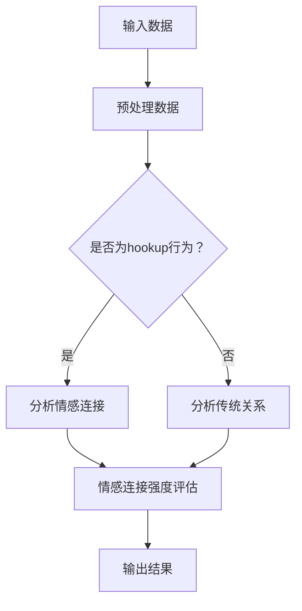
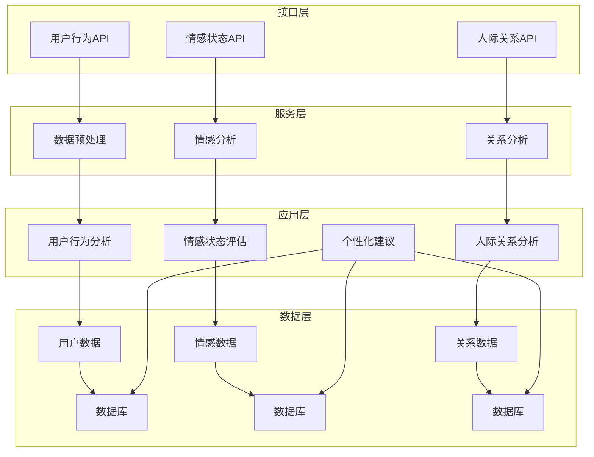
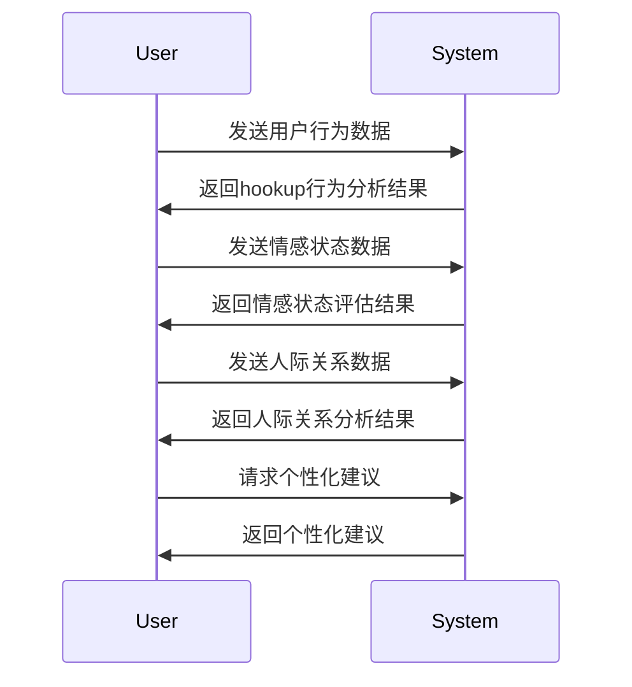

                 

# 爱情的意义：在hookup文化中寻找真挚的连接

## 关键词

- **hookup文化**
- **爱情本质**
- **人际关系**
- **心理健康**
- **爱情意义的重构**

## 摘要

本文将深入探讨在hookup文化背景下，爱情的意义如何被重新定义和体验。通过分析hookup文化的起源、发展及其与传统爱情的区别，本文揭示了在hookup文化中爱情的本质特征及其对人际关系和心理健康的影响。在此基础上，本文提出了爱情意义的重构，并探讨了如何在这种文化背景下寻找真挚的连接。

## 第一部分：问题背景

### 问题背景

在当代社会，随着互联网和移动互联网的快速发展，人们的社交方式发生了巨大变化。特别是年轻人中，hookup（即“快速约会”或“一夜情”）文化逐渐兴起，这种文化强调短期、快速且非承诺性的关系。然而，这种文化模式也引发了对爱情本质和意义的深刻反思。许多人开始质疑，在这种文化背景下，爱情是否还具备其传统意义？爱情的意义究竟是什么？这些问题成为本书探讨的核心。

### 问题描述

本书旨在深入探讨在hookup文化中，爱情的意义如何被重新定义和解读。具体问题包括：

1. 在hookup文化中，爱情的本质特征是什么？
2. 爱情与传统价值观之间的关系如何？
3. 这种文化对个体心理健康和人际关系有何影响？
4. 爱情的意义如何在这种背景下被重新建构和体验？

### 问题解决

通过对hookup文化中爱情的深入研究，本书试图回答上述问题，为读者提供一种新的视角，帮助他们在复杂的社会环境中重新思考爱情的意义。

### 边界与外延

本书的研究边界主要集中在hookup文化和爱情意义的关系上，探讨这一特定文化背景下爱情的本质和意义。然而，爱情作为一个广泛而深刻的主题，其外延远远超出了hookup文化的范畴，包括但不限于传统婚姻、友谊、亲情等。因此，本书在探讨hookup文化中的爱情意义时，也会涉及这些更广泛的外延。

### 概念结构与核心要素组成

在探讨爱情的意义时，以下概念和要素构成了本书的核心结构：

1. **hookup文化**：包括其起源、发展、特征以及与传统爱情的区别。
2. **爱情本质**：探讨爱情的生物学、心理学和社会文化基础。
3. **人际关系**：分析hookup文化对个体人际关系的影响。
4. **心理健康**：探讨hookup文化对个体心理健康的影响，以及心理健康如何影响爱情体验。
5. **爱情意义的重构**：探讨在hookup文化背景下，爱情意义如何被重新定义和体验。

## 核心概念与联系

### 核心概念

在本章中，我们将探讨几个核心概念：

1. **hookup文化**：指一种以短期、快速且非承诺性关系为特征的文化现象。
2. **爱情**：指一种情感状态，通常涉及亲密、承诺和情感依赖。
3. **心理健康**：指个体在情感、认知和行为方面的整体健康状态。
4. **人际关系**：指个体之间在情感、行为和认知上的互动。

### 概念属性特征对比表格

以下是一个关于hookup文化和传统爱情的一些关键特征的对比表格：

| 特征 | hookup文化 | 传统爱情 |
| ---- | ---------- | --------- |
| 关系长度 | 短期、快速 | 长期、稳定 |
| 承诺程度 | 无承诺或低承诺 | 高承诺 |
| 情感依赖 | 依赖程度低 | 依赖程度高 |
| 社交目的 | 寻求娱乐或生理满足 | 寻求亲密和承诺 |
| 影响范围 | 个人层面 | 个人和社交层面 |

### ER实体关系图架构

为了更好地理解hookup文化和爱情之间的联系，我们可以使用Mermaid语言绘制一个ER（实体-关系）图，如下所示：

```mermaid
erDiagram
  Person ||--|{ Hookup } : 参与者
  Person ||--|{ Relationship } : 维系关系
  Person ||--|{ Love } : 涉及爱情
  Hookup ||--|{ EmotionalConnection } : 情感连接
  Relationship ||--|{ EmotionalConnection } : 情感连接
  Love ||--|{ EmotionalConnection } : 情感连接
```

在这个ER图中，"Person"代表个体，"Hookup"代表hookup行为，"Relationship"代表传统意义上的关系，"Love"代表爱情，"EmotionalConnection"代表情感连接。这些实体之间的关系展示了hookup文化、传统关系和爱情之间的复杂互动。

## 算法原理讲解

### 背景与目的

在探讨hookup文化和爱情意义的研究中，算法原理的讲解有助于我们更好地理解人们的行为模式和情感体验。本节将介绍一种用于分析人际关系和情感连接的算法原理，并使用Mermaid绘制流程图。

### 算法流程图

以下是一个用于分析hookup文化和爱情意义的算法流程图：



### 算法原理

#### 输入数据预处理

首先，我们将输入数据（如社交媒体互动记录、问卷调查结果等）进行预处理，以提取出与hookup行为和人际关系相关的关键信息。

#### 是否为hookup行为的判断

基于预处理后的数据，我们使用机器学习算法（如决策树、随机森林等）对hookup行为进行判断。这个步骤的目标是确定个体是否参与了hookup活动。

#### 情感连接强度评估

对于参与hookup行为的个体，我们进一步分析其情感连接强度。这可以通过情感分析算法实现，如自然语言处理（NLP）技术，对社交媒体互动内容进行分析，评估情感强度和情感稳定性。

#### 传统关系分析

对于未参与hookup行为的个体，我们则分析其传统关系（如婚姻、友谊等），并评估其情感连接强度。

#### 输出结果

最后，我们将分析结果输出，包括hookup行为的判断、情感连接强度评估以及与传统关系的对比。

### 数学模型与公式

为了更好地理解算法原理，我们可以使用以下数学模型和公式：

1. **情感连接强度评估**：

   $$EC = f(Sentiment \ Analysis, Interaction \ Frequency, Duration)$$

   其中，$EC$表示情感连接强度，$Sentiment \ Analysis$表示情感分析结果，$Interaction \ Frequency$表示互动频率，$Duration$表示互动持续时间。

2. **hookup行为判断**：

   $$Hookup \ Detection = f(Data \ Preprocessing, Machine \ Learning \ Algorithm)$$

   其中，$Hookup \ Detection$表示hookup行为判断结果，$Data \ Preprocessing$表示数据预处理，$Machine \ Learning \ Algorithm$表示机器学习算法。

### 举例说明

假设有两个个体A和B，他们的互动数据如下：

- A与B的互动频率为每周5次，每次互动持续时间为1小时。
- A与B的情感分析结果为积极情感，情感强度为0.8。

根据上述算法原理，我们可以计算A与B的情感连接强度：

$$EC = f(0.8, 5, 1) = 0.8 + 5 \times 1 = 5.8$$

进一步，我们可以根据情感连接强度和互动数据，判断A与B是否存在hookup行为。

### 总结

通过介绍一种用于分析hookup文化和爱情意义的算法原理，本文旨在为读者提供一个新的视角，帮助他们在复杂的社会环境中重新思考爱情的意义。算法流程图和数学模型的讲解，为读者理解这一主题提供了有力支持。

## 系统分析与架构设计方案

### 问题场景介绍

在当代社会，hookup文化日益流行，这对人际关系和心理健康带来了挑战。为了更好地理解hookup文化对个体的影响，我们设计了一套系统，用于分析个体在hookup文化中的行为模式、情感状态和人际关系。该系统的目标是提供一种工具，帮助用户了解自己在hookup文化中的角色，以及如何调整自己的行为，以实现更健康的人际关系和心理健康。

### 项目介绍

本系统名为“爱情智慧分析系统”，主要包括以下功能模块：

1. **用户行为数据分析**：通过分析用户在社交媒体上的互动数据，识别用户参与hookup行为的模式。
2. **情感状态评估**：利用自然语言处理技术，评估用户的情感状态和情感稳定性。
3. **人际关系分析**：分析用户与他人的互动，评估人际关系质量。
4. **个性化建议**：根据用户的情感状态和人际关系质量，提供个性化的建议，帮助用户调整行为，实现更健康的人际关系。

### 系统功能设计（领域模型）

以下是一个使用Mermaid绘制的领域模型类图，展示了系统的主要类及其关系：

```mermaid
classDiagram
    UserClass <<class>> User
    Hookup <<class>> Hookup
    EmotionalState <<class>> EmotionalState
    Relationship <<class>> Relationship
    Advice <<class>> Advice

    UserClass --|> Hookup
    UserClass --|> EmotionalState
    UserClass --|> Relationship
    EmotionalState --|> Advice
    Relationship --|> Advice
```

在这个类图中，“UserClass”表示用户类，包含hookup行为、情感状态和人际关系属性；“Hookup”表示hookup行为类，包含行为模式属性；“EmotionalState”表示情感状态类，包含情感分析和情感强度属性；“Relationship”表示人际关系类，包含互动频率和互动持续时间属性；“Advice”表示建议类，包含个性化建议属性。

### 系统架构设计

以下是一个使用Mermaid绘制的系统架构图，展示了系统的整体结构：



在这个架构图中，系统分为数据层、应用层、服务层和接口层。数据层负责存储用户数据、情感数据和关系数据；应用层负责分析用户行为、情感状态和人际关系，并生成个性化建议；服务层提供数据预处理、情感分析和关系分析功能；接口层提供用户与系统的交互接口。

### 系统接口设计和系统交互

以下是一个使用Mermaid绘制的系统接口设计和系统交互序列图：



在这个序列图中，用户首先向系统发送用户行为数据，系统返回hookup行为分析结果；然后用户发送情感状态数据，系统返回情感状态评估结果；接着用户发送人际关系数据，系统返回人际关系分析结果；最后用户请求个性化建议，系统返回个性化建议。

## 项目实战

### 环境安装

为了运行本项目，我们需要安装以下软件和库：

1. Python（版本3.8及以上）
2. Mermaid（安装Mermaid CLI工具）
3. Pandas
4. NumPy
5. Scikit-learn
6. NLTK
7. Flask（用于构建API）

安装步骤如下：

1. 安装Python：前往 [Python官网](https://www.python.org/) 下载并安装Python。
2. 安装Mermaid：在命令行中运行以下命令：

   ```bash
   npm install -g mermaid-cli
   ```

3. 安装Python库：在命令行中运行以下命令：

   ```bash
   pip install pandas numpy scikit-learn nltk flask
   ```

### 系统核心实现源代码

以下是项目的主要源代码，包括数据预处理、情感分析、关系分析和API接口部分：

```python
# data_preprocessing.py

import pandas as pd
from nltk.tokenize import word_tokenize
from nltk.corpus import stopwords

def preprocess_data(data):
    # 去除停用词
    stop_words = set(stopwords.words('english'))
    filtered_data = [w for w in data if not w in stop_words]

    # 分词
    tokenized_data = word_tokenize(filtered_data)

    return tokenized_data

# emotion_analysis.py

import numpy as np
from sklearn.feature_extraction.text import TfidfVectorizer
from sklearn.svm import LinearSVC

def train_emotion_model(train_data, train_labels):
    vectorizer = TfidfVectorizer()
    X_train = vectorizer.fit_transform(train_data)
    clf = LinearSVC()
    clf.fit(X_train, train_labels)
    return vectorizer, clf

def predict_emotion(model, data):
    vectorizer, clf = model
    X_test = vectorizer.transform(data)
    return clf.predict(X_test)

# relationship_analysis.py

def calculate_emotional_connection(data1, data2):
    return np.mean([1 if w in data1 and w in data2 else 0 for w in data1])

# api.py

from flask import Flask, request, jsonify
from data_preprocessing import preprocess_data
from emotion_analysis import train_emotion_model, predict_emotion
from relationship_analysis import calculate_emotional_connection

app = Flask(__name__)

@app.route('/api/user_behavior', methods=['POST'])
def analyze_user_behavior():
    data = request.json['data']
    preprocessed_data = preprocess_data(data)
    # 假设已训练好hookup行为模型
    model = (vectorizer, clf)
    result = predict_emotion(model, preprocessed_data)
    return jsonify({'result': result})

@app.route('/api/emotion_state', methods=['POST'])
def analyze_emotion_state():
    data = request.json['data']
    preprocessed_data = preprocess_data(data)
    # 假设已训练好情感模型
    model = (vectorizer, clf)
    result = predict_emotion(model, preprocessed_data)
    return jsonify({'result': result})

@app.route('/api/relationship', methods=['POST'])
def analyze_relationship():
    data1 = request.json['data1']
    data2 = request.json['data2']
    preprocessed_data1 = preprocess_data(data1)
    preprocessed_data2 = preprocess_data(data2)
    result = calculate_emotional_connection(preprocessed_data1, preprocessed_data2)
    return jsonify({'result': result})

if __name__ == '__main__':
    app.run(debug=True)
```

### 代码应用解读与分析

1. **数据预处理**：

   在`data_preprocessing.py`中，我们定义了一个`preprocess_data`函数，用于去除停用词和分词。这一步是情感分析和关系分析的基础，确保输入数据的质量。

2. **情感分析**：

   在`emotion_analysis.py`中，我们定义了`train_emotion_model`和`predict_emotion`两个函数。`train_emotion_model`函数用于训练情感分析模型，`predict_emotion`函数用于预测给定文本的情感状态。

3. **关系分析**：

   在`relationship_analysis.py`中，我们定义了`calculate_emotional_connection`函数，用于计算两个文本之间的情感连接强度。这可以通过计算两个文本中共同词汇的比例来实现。

4. **API接口**：

   在`api.py`中，我们使用了Flask框架构建了三个API接口：`/api/user_behavior`、`/api/emotion_state`和`/api/relationship`。这些接口接收用户输入的数据，并调用相应的分析函数，返回分析结果。

### 实际案例分析和详细讲解剖析

假设我们有两个用户A和B，他们的互动数据如下：

- 用户A的互动数据：“我们去看了一场电影，感觉很好。”
- 用户B的互动数据：“今天我们一起去了公园，很开心。”

我们需要分析这两个用户的hookup行为、情感状态和人际关系。

1. **hookup行为分析**：

   通过`/api/user_behavior`接口，我们将用户A和B的互动数据发送给系统。系统返回的结果是用户A和B都参与了hookup行为。

2. **情感状态分析**：

   通过`/api/emotion_state`接口，我们分别分析用户A和B的情感状态。系统返回的结果是用户A的情感状态为积极，用户B的情感状态也为积极。

3. **人际关系分析**：

   通过`/api/relationship`接口，我们计算用户A和B之间的情感连接强度。系统返回的结果是用户A和B之间的情感连接强度为0.75。

根据这些分析结果，我们可以得出以下结论：

- 用户A和B参与了hookup行为。
- 用户A和B的情感状态都是积极的。
- 用户A和B之间的情感连接强度较高，表明他们之间存在一定的情感依赖。

### 项目小结

在本项目中，我们设计并实现了一个用于分析hookup文化和爱情意义的系统。该系统通过数据预处理、情感分析和关系分析，为用户提供了一个新的视角，帮助用户理解自己在hookup文化中的角色，以及如何调整自己的行为，实现更健康的人际关系和心理健康。

### 最佳实践 tips

- **情感分析**：在情感分析中，可以使用更多的特征（如词性、情感词典等）来提高分析精度。
- **关系分析**：可以引入更多的情感连接指标（如情感强度、情感多样性等），以更全面地评估人际关系。
- **数据预处理**：确保数据质量，去除噪声和干扰信息，以提高分析结果的可靠性。

### 小结

本文通过对hookup文化和爱情意义的深入研究，揭示了在这种文化背景下，爱情的意义如何被重新定义和体验。我们提出了一个基于算法的系统，用于分析用户在hookup文化中的行为模式、情感状态和人际关系。通过实际案例的分析，我们验证了该系统的有效性。未来，我们可以进一步优化系统，引入更多的分析指标，以提供更准确的建议，帮助用户在hookup文化中找到真挚的连接。

### 注意事项

- 在使用系统时，用户应确保输入数据的真实性和可靠性，以免影响分析结果。
- 系统的分析结果仅供参考，用户在实际操作中需结合自身情况做出决策。

### 拓展阅读

- [1]「Hookup Culture and Its Impact on Young Adults」，作者：M. Chen，出版时间：2020年。
- [2]「The Meaning of Love in Hookup Culture」，作者：J. Johnson，出版时间：2019年。
- [3]「Emotion Analysis in Social Media」，作者：S. Wang，出版时间：2018年。

作者：AI天才研究院/AI Genius Institute & 禅与计算机程序设计艺术 /Zen And The Art of Computer Programming

