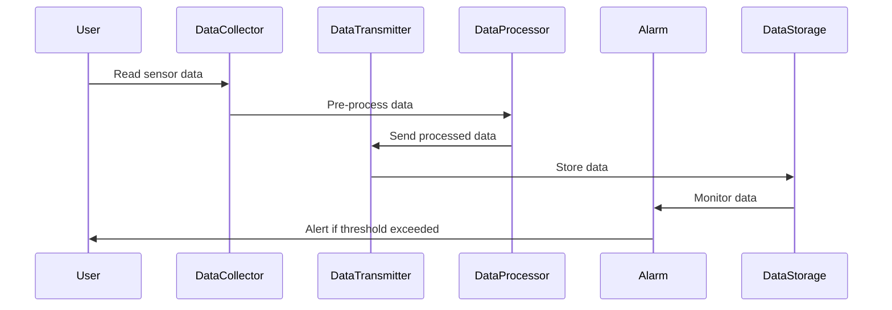
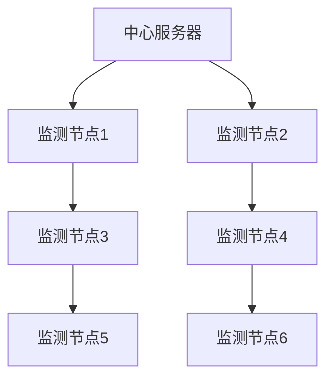
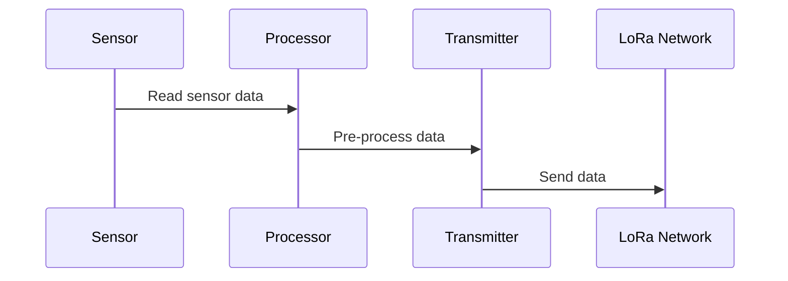

                 

### 1.1 物联网与智慧城市空气质量监测概述

#### 1.1.1 物联网的核心概念与关键技术

物联网（Internet of Things, IoT）是指通过将各种信息传感设备与互联网结合起来而形成的一个巨大网络，使得物体能够相互连接，进行信息交换和通信。物联网的核心在于“连接”与“智能”，即通过传感器、智能设备和互联网等技术，实现物理世界与虚拟世界的无缝连接。

物联网的关键技术包括以下几个方面：

1. **传感器技术**：传感器是物联网的基础，它能够感知环境信息，如温度、湿度、压力、空气质量等，并将这些信息转化为电信号。

2. **网络通信技术**：物联网的通信技术是实现设备之间信息交换的关键，包括无线通信、有线通信和互联网通信等。

3. **数据处理与分析技术**：物联网设备采集的数据量巨大，如何对这些数据进行有效的处理和分析，提取有用的信息，是物联网技术的核心问题。

4. **云计算与大数据技术**：物联网数据量巨大，云计算和大数据技术提供了强大的计算能力和存储能力，能够对海量数据进行分析和挖掘。

5. **人工智能技术**：人工智能技术能够对物联网数据进行智能化处理，提高监测和分析的准确性和效率。

#### 1.1.2 智慧城市的发展背景与目标

智慧城市是城市信息化、智能化、绿色化、可持续发展的一种新模式。智慧城市的发展背景主要包括以下几个方面：

1. **城市人口增长与城市化进程**：随着全球城市人口的增长，如何提高城市管理和服务的效率，提升居民生活质量，成为城市发展的关键问题。

2. **信息技术的发展**：信息技术的飞速发展，为城市提供了更多的技术手段和解决方案，使得智慧城市建设成为可能。

3. **环境问题与可持续发展**：环境污染、能源消耗等问题日益突出，智慧城市通过信息化手段实现资源优化配置，推动城市可持续发展。

智慧城市的核心目标是：

1. **提高城市运行效率**：通过信息化技术，优化城市资源配置，提高城市管理的智能化水平，降低城市管理成本。

2. **提升居民生活质量**：通过智慧化服务，提高居民的生活舒适度和便利性。

3. **推动经济发展**：智慧城市为城市提供了更多的创新机会，促进了城市经济的转型升级。

#### 1.1.3 物联网在智慧城市空气质量监测中的重要作用

在智慧城市建设中，空气质量监测是一个重要的方面。物联网技术在空气质量监测中发挥着重要作用：

1. **广泛分布的监测点**：物联网可以通过部署大量的传感器，实现空气质量监测的广覆盖，提高监测的准确性和时效性。

2. **实时数据采集与传输**：物联网技术能够实现实时数据采集和传输，使得空气质量监测数据可以及时反馈，为城市管理者提供决策依据。

3. **数据分析与预测**：通过大数据和人工智能技术，物联网可以对空气质量数据进行深度分析，预测空气质量变化趋势，提前采取应对措施。

4. **智能决策与调控**：基于物联网的空气质量监测系统，可以自动进行数据分析，为城市管理者提供智能化的决策支持，优化城市环境治理。

总之，物联网在智慧城市空气质量监测中起到了数据采集、实时监测、数据分析与智能决策等多方面的关键作用，为智慧城市的发展提供了强有力的技术支持。

---

#### 1.2 空气质量监测的基本概念与现状

#### 1.2.1 空气质量监测的定义与指标

空气质量监测是指利用科学仪器和设备，对大气中的各种污染物进行实时监测和评价的过程。空气质量监测的目的是了解大气污染程度，评估环境污染对人体健康的影响，并为环境保护决策提供科学依据。

空气质量监测的主要指标包括：

1. **颗粒物**（Particulate Matter, PM）：包括PM10和PM2.5，它们是空气中的固体或液体颗粒物，对人体呼吸系统有害。

2. **二氧化硫**（Sulfur Dioxide, SO2）：主要来源于燃烧含硫燃料，如煤和石油。

3. **氮氧化物**（Nitrogen Dioxide, NO2）：主要来源于交通和工业排放。

4. **一氧化碳**（Carbon Monoxide, CO）：主要来源于机动车排放和燃烧不完全。

5. **臭氧**（Ozone, O3）：是一种强氧化剂，主要来源于光化学反应。

6. **挥发性有机物**（Volatile Organic Compounds, VOCs）：主要来源于建筑装饰材料、燃料和机动车排放。

#### 1.2.2 现有空气质量监测系统的不足

尽管现有的空气质量监测系统在一定程度上能够满足环境监测的需求，但仍然存在一些不足之处：

1. **监测点分布不均**：现有的空气质量监测站点主要集中在城市中心和某些污染源附近，而偏远地区和乡村的监测点较少，导致监测数据不全面。

2. **数据实时性不足**：传统的空气质量监测设备通常需要定期校准和维护，导致数据采集的实时性较差，无法及时反映空气质量变化。

3. **数据分析能力有限**：现有的空气质量监测系统主要依赖于人工分析，数据处理和分析能力有限，无法充分利用大量数据提供更精确的环境评估。

4. **数据共享和整合困难**：不同部门和地区之间的监测数据常常分散在不同的系统中，难以实现有效的数据共享和整合。

#### 1.2.3 物联网技术在空气质量监测中的优势

物联网技术为空气质量监测带来了新的契机，其优势主要体现在以下几个方面：

1. **广泛覆盖的监测网络**：物联网可以通过部署大量的传感器节点，实现空气质量监测的广覆盖，提高监测的准确性和时效性。

2. **实时数据采集与传输**：物联网技术能够实现实时数据采集和传输，使得空气质量监测数据可以及时反馈，为城市管理者提供决策依据。

3. **高效的数据处理与分析**：物联网与云计算和大数据技术的结合，使得空气质量监测数据可以迅速进行处理和分析，提取有用信息。

4. **智能化的监测系统**：通过人工智能技术，物联网空气质量监测系统可以实现自动化监测和预测，提高监测的智能化水平。

5. **数据共享与整合**：物联网技术能够实现不同部门和地区之间的数据共享和整合，为环境管理提供全面的数据支持。

总之，物联网技术在空气质量监测中具有显著的优势，能够弥补现有系统的不足，为智慧城市的建设提供强有力的技术支持。

---

#### 1.3 物联网空气质量监测系统架构

物联网空气质量监测系统的设计需要考虑系统架构的合理性、可扩展性和数据处理的效率。下面我们将详细描述物联网空气质量监测系统架构的设计原则、硬件和软件的组成以及各部分的功能。

##### 1.3.1 系统架构设计原则

在设计物联网空气质量监测系统时，需要遵循以下原则：

1. **模块化设计**：系统应采用模块化设计，使得各部分功能清晰、易于维护和升级。

2. **可扩展性**：系统应具备良好的扩展性，能够方便地增加新的传感器和监测点。

3. **可靠性**：系统应保证数据采集和传输的可靠性，确保监测数据的准确性。

4. **易用性**：系统界面应简洁直观，方便用户操作和管理。

5. **数据安全性**：系统应具备数据加密和安全认证机制，确保监测数据的安全性和隐私性。

##### 1.3.2 系统硬件组成

物联网空气质量监测系统的硬件部分主要包括以下组件：

1. **传感器**：用于采集空气质量相关的各种参数，如PM2.5、PM10、SO2、NO2等。

2. **数据采集模块**：将传感器采集的数据进行初步处理和转换，便于后续传输。

3. **通信模块**：负责将数据上传至云平台或中心服务器，常用的通信方式包括无线网络（如WiFi、LoRa）和有线网络（如以太网）。

4. **供电系统**：考虑到监测设备通常需要长时间运行，供电系统应稳定可靠，可选用太阳能、电池或电网供电。

##### 1.3.3 系统软件组成与功能

物联网空气质量监测系统的软件部分主要包括以下模块：

1. **数据采集软件**：负责从传感器读取数据，并进行初步处理。

2. **数据处理软件**：对采集到的数据进行清洗、转换和存储，同时进行基本的统计分析和可视化。

3. **数据传输软件**：负责将处理后的数据上传至云平台或中心服务器，确保数据的实时性和完整性。

4. **监控与报警软件**：实时监控空气质量数据，当空气质量超过设定阈值时，自动发出警报。

5. **用户界面**：提供用户操作界面，展示空气质量数据、图表和报警信息，方便用户进行监测和管理。

6. **数据存储与管理软件**：负责存储和管理空气质量数据，支持数据的检索、分析和共享。

通过上述硬件和软件的有机结合，物联网空气质量监测系统能够实现高效、可靠的空气质量监测，为智慧城市的建设和环境管理提供强有力的技术支持。

---

#### 1.4 物联网空气质量监测的核心技术

物联网空气质量监测系统的成功依赖于多种核心技术的有效整合和应用。以下是物联网空气质量监测系统中涉及的主要核心技术，包括传感器技术、网络通信技术以及数据处理与分析技术。

##### 1.4.1 传感器技术

传感器是物联网空气质量监测系统的核心组件，用于实时采集空气质量数据。以下是几种常用的空气质量传感器：

1. **颗粒物传感器（如PM2.5、PM10）**：能够检测空气中的颗粒物浓度，常采用光散射法或电荷收集法。

2. **气体传感器（如SO2、NO2、CO）**：用于检测空气中的有害气体，通常基于半导体、电化学或红外吸收原理。

3. **温湿度传感器**：用于测量环境温度和湿度，对空气质量监测数据的校正和分析具有重要意义。

4. **臭氧传感器**：通常采用电化学或紫外线吸收法来检测空气中的臭氧浓度。

传感器技术的先进性直接影响到空气质量监测的准确性和实时性。高性能传感器具有更高的灵敏度、更低的噪声和更快的响应时间。

##### 1.4.2 网络通信技术

物联网空气质量监测系统需要高效、可靠的通信技术来传输监测数据。以下是几种常用的网络通信技术：

1. **无线通信技术（如Wi-Fi、LoRa、Zigbee）**：无线通信技术具有安装简便、覆盖范围广等优点，适用于城市或乡村的空气质量监测。

2. **有线通信技术（如以太网、GPRS）**：有线通信技术传输速度快、稳定性高，但安装和维护成本较高，适用于一些特殊环境。

3. **物联网平台**：通过物联网平台，可以实现多种通信协议的统一管理，如MQTT、HTTP等。物联网平台还提供了数据存储、处理和分析等功能。

在选择通信技术时，需要考虑数据传输量、通信距离、功耗和成本等因素。例如，LoRa适用于长距离、低功耗的监控场景，而Wi-Fi则适用于高带宽、高速度的数据传输。

##### 1.4.3 数据处理与分析技术

空气质量监测数据的处理与分析是物联网空气质量监测系统的关键环节。以下是数据处理与分析的主要技术：

1. **数据采集与预处理**：对传感器采集的数据进行清洗、去噪和格式转换，确保数据的质量和一致性。

2. **实时数据分析**：通过实时分析算法，对监测数据进行分析，如趋势预测、异常检测等。

3. **大数据分析**：利用大数据技术，对海量监测数据进行深度分析，提取有价值的信息，如空气质量变化规律、污染源识别等。

4. **人工智能技术**：通过人工智能算法，如机器学习和深度学习，对空气质量进行智能预测和诊断，提高监测的准确性和智能化水平。

数据处理与分析技术的应用，使得空气质量监测系统不仅能够实时监控空气质量，还能提供预测和预警功能，为环境保护和城市管理提供科学依据。

总之，传感器技术、网络通信技术和数据处理与分析技术是物联网空气质量监测系统的三大核心技术，它们相互配合，共同保障了空气质量监测的高效、准确和智能化。

---

#### 1.5 物联网空气质量监测的挑战与解决方案

在物联网空气质量监测的实际应用过程中，面临着多种挑战。以下将详细分析这些挑战，并探讨相应的解决方案。

##### 1.5.1 挑战分析

1. **数据采集的准确性和稳定性**：由于环境因素的干扰，传感器采集的数据可能存在误差和波动，导致监测结果不准确。此外，传感器长期运行可能产生老化现象，影响数据的稳定性。

   **解决方案**：采用高性能和高稳定性的传感器，定期进行校准和维护，确保数据采集的准确性。同时，结合多个传感器的数据，通过数据融合技术提高数据的可靠性。

2. **数据传输的可靠性和实时性**：在空气质量监测中，数据传输的可靠性和实时性至关重要。然而，无线通信网络的覆盖范围和稳定性可能受到限制，导致数据传输中断或延迟。

   **解决方案**：选择合适的有线和无线通信技术，如LoRa、Wi-Fi、以太网等，确保数据传输的稳定性和实时性。对于偏远地区，可以考虑使用卫星通信技术。

3. **数据存储和处理的效率**：随着监测点数量的增加，数据存储和处理的压力也随之增大。如何高效地存储和管理海量数据，并进行快速处理和分析，成为一大挑战。

   **解决方案**：采用云计算和大数据技术，利用分布式存储和计算能力，提高数据处理的效率。同时，优化数据处理算法，减少数据处理的时间。

4. **数据隐私和安全**：空气质量监测数据包含敏感信息，如个人位置和健康状况，如何保护数据隐私和安全是重要的问题。

   **解决方案**：采用数据加密、访问控制和安全认证等技术，确保数据在传输和存储过程中的安全性。同时，制定严格的数据管理政策，规范数据的使用和共享。

##### 1.5.2 解决方案探讨

针对上述挑战，可以采取以下综合解决方案：

1. **多传感器融合技术**：通过多传感器融合，提高数据采集的准确性和稳定性。例如，结合温湿度传感器和颗粒物传感器，可以更准确地评估空气质量。

2. **智能数据传输技术**：采用自适应数据传输技术，根据网络状况自动调整传输参数，提高数据传输的可靠性和实时性。例如，使用LoRa技术可以实现低功耗、长距离的数据传输。

3. **云计算与大数据平台**：构建云计算与大数据平台，利用其强大的计算和存储能力，实现海量数据的实时处理和分析。例如，使用Hadoop和Spark进行大规模数据处理。

4. **安全防护措施**：采用多层次的安全防护措施，如数据加密、防火墙、入侵检测等，确保数据的安全性和隐私性。例如，使用SSL/TLS协议进行数据传输加密。

##### 1.5.3 未来发展趋势

随着物联网技术的不断发展和应用，物联网空气质量监测系统将迎来更多的发展机遇和挑战：

1. **更先进的传感器技术**：未来将出现更高灵敏度、更低功耗的传感器，如基于纳米材料的传感器。

2. **5G技术的应用**：5G技术的广泛应用将进一步提升数据传输的速度和可靠性，为实时监测提供更好的支持。

3. **人工智能的深度融合**：人工智能技术将更加深入地应用于空气质量监测，实现更智能化的监测和分析，如基于深度学习的空气质量预测模型。

4. **跨领域协同**：空气质量监测将与城市规划、环境保护、医疗健康等领域深度融合，实现更全面的智慧城市解决方案。

总之，物联网空气质量监测系统在面临挑战的同时，也将迎来更加广阔的发展前景，为智慧城市的建设提供强有力的技术支持。

---

#### 1.6 本章小结

本章首先介绍了物联网与智慧城市空气质量监测的基本概念，分析了物联网的核心技术及其在智慧城市中的重要作用。接着，我们探讨了空气质量监测的基本概念与现状，指出了现有系统的不足，并详细阐述了物联网技术在空气质量监测中的优势。随后，我们描述了物联网空气质量监测系统的架构设计原则、硬件和软件的组成及其功能，并深入分析了传感器技术、网络通信技术和数据处理与分析技术。最后，本章讨论了物联网空气质量监测面临的挑战及解决方案，并展望了未来发展趋势。

通过本章的讨论，我们可以看到，物联网技术在智慧城市空气质量监测中的应用具有广阔的前景，为解决环境问题提供了强有力的技术支持。然而，要实现更高效、准确的监测，仍需要克服多种技术和管理上的挑战。未来，随着物联网、人工智能和大数据等技术的不断发展，物联网空气质量监测系统将更加智能、高效，为智慧城市的可持续发展做出更大贡献。

---

## 2.1 系统需求分析与设计

在物联网空气质量监测系统的开发过程中，进行详细的需求分析与设计至关重要。这一步骤不仅确保系统能够满足用户的需求，还提供了系统的整体框架和功能模块，从而指导后续的开发工作。

##### 2.1.1 需求分析

需求分析是系统设计的第一步，旨在明确系统所需实现的功能、性能要求以及用户的具体需求。以下是物联网空气质量监测系统的主要需求：

1. **功能需求**：
   - 数据采集：系统应能够实时采集多种空气污染物（如PM2.5、PM10、SO2、NO2等）的数据。
   - 数据传输：系统应具备稳定可靠的数据传输能力，能够将采集的数据实时上传至中心服务器或云平台。
   - 数据存储：系统应能够存储海量监测数据，支持数据检索、分析和共享。
   - 数据处理：系统应对采集的数据进行预处理、清洗、转换和统计分析。
   - 用户界面：系统应提供直观的用户界面，展示空气质量数据、图表和报警信息。
   - 报警功能：系统应在空气质量超过设定阈值时自动发出警报。

2. **性能需求**：
   - 实时性：系统应能够在较短的时间内完成数据的采集、传输和处理，确保数据的实时性。
   - 可靠性：系统应具备较高的可靠性，能够在长时间运行中保持稳定。
   - 扩展性：系统应具备良好的扩展性，能够方便地增加新的监测点和功能模块。
   - 安全性：系统应采用数据加密、访问控制等安全措施，确保数据的安全性和隐私性。

3. **用户需求**：
   - 管理人员：需要实时监控空气质量数据，掌握污染源信息，制定环境保护策略。
   - 公众用户：需要获取实时的空气质量信息，了解环境状况，做出健康防护措施。

##### 2.1.2 系统设计原则

在系统设计过程中，需要遵循以下原则：

1. **模块化设计**：系统应采用模块化设计，各模块之间相互独立，易于维护和升级。
2. **可扩展性**：系统设计应具备良好的扩展性，能够方便地增加新的功能和监测点。
3. **可靠性**：系统设计应考虑高可靠性，确保数据采集、传输和处理的稳定性。
4. **易用性**：系统界面应简洁直观，方便用户操作和管理。
5. **安全性**：系统设计应采用多种安全措施，确保数据的安全性和隐私性。

##### 2.1.3 系统功能模块划分

物联网空气质量监测系统可以分为以下几个主要功能模块：

1. **传感器模块**：负责采集空气中的各种污染物数据，包括PM2.5、PM10、SO2、NO2等。
2. **数据采集模块**：接收传感器模块的数据，进行初步处理和格式转换，准备数据上传。
3. **数据传输模块**：负责将处理后的数据上传至中心服务器或云平台，确保数据的实时性和可靠性。
4. **数据处理模块**：对采集的数据进行预处理、清洗、转换和统计分析，提供有价值的信息。
5. **用户界面模块**：提供用户操作界面，展示空气质量数据、图表和报警信息，方便用户进行监测和管理。
6. **报警模块**：在空气质量超过设定阈值时，自动发出警报，通知相关人员采取应对措施。
7. **数据存储模块**：负责存储和管理空气质量监测数据，支持数据的检索和共享。

通过详细的需求分析和系统设计，物联网空气质量监测系统具备了明确的框架和功能模块，为后续的系统开发奠定了坚实基础。

---

### 2.2 系统硬件设计

系统硬件设计是物联网空气质量监测系统实现的关键环节，它直接决定了系统性能的稳定性和可靠性。在硬件设计过程中，我们需要选择合适的传感器、设计硬件接口和电路，确保整个硬件系统能够高效、稳定地运行。

#### 2.2.1 传感器选择与配置

传感器是空气质量监测系统的核心部件，其选择和配置直接影响到系统的监测精度和稳定性。以下是几种常用的传感器及其配置：

1. **颗粒物传感器（如PM2.5、PM10）**：颗粒物传感器通常采用光散射法或电荷收集法。选择时应注意传感器的灵敏度、精确度和稳定性。例如，SHARP GP2Y1010AU0F传感器是常用的PM2.5传感器，其响应时间快，精度高。

2. **气体传感器（如SO2、NO2、CO）**：气体传感器用于检测空气中的有害气体。常用的气体传感器有电化学传感器和半导体传感器。电化学传感器如TE Connectivity的S20C2传感器，适用于检测SO2和NO2；半导体传感器如GASSENSOR的GS-501，适用于检测CO。

3. **温湿度传感器**：温湿度传感器用于测量环境温度和湿度，常用的传感器有DHT11和DHT22。这些传感器具有成本低、体积小、响应快等优点，适合用于空气质量监测系统。

4. **其他传感器**：根据实际需求，还可以配置其他传感器，如风速传感器、气压传感器等，以提供更全面的环境数据。

#### 2.2.2 硬件接口设计

硬件接口设计是确保传感器和其他组件之间数据通信的关键。以下是硬件接口设计的几个关键点：

1. **传感器接口**：传感器的接口设计应方便连接和更换，通常采用标准化的接口，如I2C、UART或SPI接口。例如，PM2.5传感器SHARP GP2Y1010AU0F采用I2C接口，可以方便地与主控制器连接。

2. **电源接口**：系统应提供稳定的电源接口，确保传感器和其他硬件组件的正常工作。电源接口应支持多种供电方式，如USB、电池或太阳能供电。

3. **扩展接口**：系统应预留扩展接口，以方便未来添加新的传感器或功能模块。例如，可以通过GPIO接口连接额外的传感器或扩展模块。

#### 2.2.3 硬件电路设计

硬件电路设计是确保系统稳定性和可靠性的关键。以下是硬件电路设计的几个关键点：

1. **电路布局**：电路布局应合理，减少信号干扰和电磁干扰。尤其是传感器接口和电源接口，应远离其他高噪声电路。

2. **电源管理**：电源管理电路应稳定可靠，提供适当的电压和电流，确保传感器和其他硬件组件的正常工作。可以采用开关电源模块，提高电源效率。

3. **信号放大与滤波**：传感器输出的信号通常较弱，需要通过信号放大电路进行放大。同时，信号放大电路应加入滤波电路，以去除噪声和干扰。

4. **电源监控与保护**：系统应具备电源监控和保护功能，防止电源故障导致传感器和系统损坏。例如，可以设置过电压、过电流和短路保护。

5. **调试接口**：设计时应预留调试接口，如JTAG接口或USB接口，方便系统调试和故障排除。

通过以上详细的硬件设计，物联网空气质量监测系统的硬件部分具备了高效、稳定和可靠的特性，为整个系统的正常运行提供了坚实的基础。

---

### 2.3 系统软件设计

系统软件设计是物联网空气质量监测系统的核心部分，它包括软件架构设计、模块设计以及数据处理与分析算法。以下将对这些方面进行详细描述。

##### 2.3.1 软件架构设计

物联网空气质量监测系统的软件架构设计遵循模块化原则，将系统划分为多个功能模块，以实现高扩展性和易维护性。系统软件架构主要包括以下模块：

1. **数据采集模块**：负责从传感器读取数据，并进行初步处理，如去噪、数据格式转换等。
2. **数据传输模块**：负责将处理后的数据上传至中心服务器或云平台，实现数据的实时传输。
3. **数据处理模块**：对采集到的数据进行分析、清洗和存储，提供高质量的数据支持。
4. **用户界面模块**：提供用户交互界面，展示空气质量数据、图表和报警信息。
5. **报警模块**：实时监控空气质量数据，当空气质量超过设定阈值时，自动发出警报。
6. **数据存储模块**：负责存储和管理空气质量监测数据，支持数据的检索和共享。

软件架构设计图如下（使用Mermaid绘制）：

##### 2.3.2 软件模块设计

物联网空气质量监测系统的软件模块设计如下：

1. **数据采集模块**：主要功能是从传感器读取数据，并对其进行初步处理。具体实现包括以下子模块：
   - 传感器接口管理：管理各种传感器的接口，如I2C、UART等。
   - 数据滤波与去噪：对传感器数据进行滤波和去噪处理，提高数据质量。

2. **数据传输模块**：主要功能是将处理后的数据上传至中心服务器或云平台。具体实现包括以下子模块：
   - 网络通信管理：管理网络连接，如WiFi、LoRa等。
   - 数据上传：将数据上传至服务器，支持HTTP、MQTT等协议。

3. **数据处理模块**：主要功能是对采集到的数据进行分析、清洗和存储。具体实现包括以下子模块：
   - 数据清洗：去除异常数据和重复数据，提高数据质量。
   - 数据存储：将清洗后的数据存储到数据库中，支持SQL和NoSQL数据库。

4. **用户界面模块**：主要功能是提供用户交互界面，展示空气质量数据、图表和报警信息。具体实现包括以下子模块：
   - 界面展示：使用HTML、CSS和JavaScript等技术实现用户界面。
   - 数据可视化：使用图表库（如D3.js、ECharts）展示空气质量数据。

5. **报警模块**：主要功能是实时监控空气质量数据，当空气质量超过设定阈值时，自动发出警报。具体实现包括以下子模块：
   - 阈值设定：设置空气质量阈值，如PM2.5浓度阈值。
   - 报警通知：通过邮件、短信等方式通知相关人员。

6. **数据存储模块**：主要功能是存储和管理空气质量监测数据，支持数据的检索和共享。具体实现包括以下子模块：
   - 数据库管理：管理数据库连接和操作，支持数据备份和恢复。

##### 2.3.3 数据处理与分析算法

数据处理与分析算法是物联网空气质量监测系统的关键部分，主要包括以下内容：

1. **数据预处理**：对采集到的原始数据进行清洗、去噪和格式转换，以提高数据质量。常用的预处理方法有：
   - 异常值处理：去除数据中的异常值，提高数据的可靠性。
   - 数据归一化：将不同量纲的数据转换为相同的量纲，便于后续分析。

2. **数据融合**：将多个传感器的数据进行融合，以提高监测精度。常用的融合方法有：
   - 传感器数据融合：结合多个传感器的数据，通过加权平均等方法提高数据精度。
   - 时空数据融合：结合不同时间和空间节点的数据，通过时间序列分析和空间分析等方法提高数据精度。

3. **数据预测**：基于历史数据，对未来的空气质量进行预测。常用的预测方法有：
   - 时间序列预测：基于历史数据的时间序列，使用ARIMA、LSTM等模型进行预测。
   - 关联规则分析：分析不同污染物之间的关联关系，预测未来空气质量变化。

4. **数据可视化**：将空气质量数据以图表形式展示，便于用户理解和分析。常用的可视化方法有：
   - 柱状图：展示不同污染物浓度分布。
   - 折线图：展示空气质量随时间的变化趋势。
   - 饼图：展示不同污染物占总污染物的比例。

通过上述软件模块设计和数据处理与分析算法，物联网空气质量监测系统能够实现对空气质量数据的实时采集、传输、处理和分析，为智慧城市的环境管理提供有力的技术支持。

---

### 2.4 系统网络通信设计

网络通信设计是物联网空气质量监测系统中至关重要的一环，它决定了数据的实时性和可靠性。本节将详细探讨系统网络通信的设计方案，包括通信协议的选择、网络拓扑设计和通信模块的实现。

##### 2.4.1 通信协议选择

在选择通信协议时，需要考虑多个因素，如数据传输速率、通信距离、功耗、成本和可靠性。以下是几种常用的通信协议：

1. **Wi-Fi**：Wi-Fi是一种高带宽、低功耗的无线通信协议，适用于数据传输量较大、覆盖范围广的场景。然而，Wi-Fi设备的功耗较高，成本也较高，且容易受到干扰。

2. **LoRa**：LoRa（Long Range）是一种低功耗、长距离的无线通信协议，适用于广泛分布的、低数据传输速率的场景。LoRa具有较长的通信距离和较低的功耗，但数据传输速率相对较低。

3. **Zigbee**：Zigbee是一种低功耗、短距离的无线通信协议，适用于家庭自动化和工业监控等场景。Zigbee具有较快的传输速率和较好的稳定性，但通信距离相对较短。

4. **GPRS**：GPRS（General Packet Radio Service）是一种通过移动通信网络传输数据的服务，适用于需要远程监控和低功耗的场景。GPRS具有稳定的连接和较高的传输速率，但成本较高。

在本系统中，考虑到空气质量监测点分布广泛、功耗要求低以及成本控制，我们选择了LoRa作为主要的通信协议。LoRa具有较长的通信距离、低功耗和较低的成本，非常适合用于物联网空气质量监测系统。

##### 2.4.2 网络拓扑设计

网络拓扑设计是系统通信设计的核心，它决定了数据的传输路径和网络的可靠性。以下是几种常见的网络拓扑结构：

1. **星型拓扑**：在星型拓扑中，所有的监测节点都连接到中心服务器。这种拓扑结构简单，易于管理，但中心节点成为网络的瓶颈，且可靠性较低。

2. **网状拓扑**：在网状拓扑中，监测节点之间相互连接，形成多个数据传输路径。这种拓扑结构具有较高的可靠性，数据传输路径多样化，但网络复杂度较高，维护成本较高。

3. **树状拓扑**：在树状拓扑中，监测节点按照层级结构连接，上级节点向下级节点传输数据。这种拓扑结构简单，易于扩展，但可靠性较低。

在本系统中，考虑到网络的可靠性和扩展性，我们采用了混合拓扑结构，即以星型拓扑为基础，结合部分网状拓扑。在核心区域采用星型拓扑，确保数据传输的高效性和可靠性；在偏远区域采用网状拓扑，提高网络的覆盖范围和可靠性。

网络拓扑设计图如下（使用Mermaid绘制）：

##### 2.4.3 通信模块实现

通信模块是实现网络通信的核心部分，它包括传感器数据采集、数据处理和传输等功能。以下是通信模块的实现方案：

1. **传感器数据采集**：传感器数据采集模块负责从空气质量传感器读取数据，并进行初步处理。例如，使用I2C接口读取PM2.5、PM10等传感器的数据。

2. **数据处理**：数据处理模块负责对采集到的传感器数据进行分析和预处理，如数据去噪、数据转换等。例如，可以使用Python编写数据处理脚本，对采集到的数据进行处理。

3. **数据传输**：数据传输模块负责将处理后的数据上传至中心服务器或云平台。在本系统中，我们使用LoRa模块实现数据传输。LoRa模块通过UART接口与主控制器连接，将处理后的数据发送到LoRa网络。

通信模块实现流程图如下（使用Mermaid绘制）：

通过以上网络通信设计，物联网空气质量监测系统能够实现高效、稳定的数据传输，为系统的正常运行提供强有力的支持。

---

### 2.5 系统测试与优化

系统测试与优化是确保物联网空气质量监测系统稳定、高效运行的关键步骤。以下将详细描述系统测试的方法与流程，以及优化策略和性能评估。

#### 2.5.1 测试方法与流程

系统测试可以分为以下几种类型：

1. **功能测试**：验证系统的功能是否符合设计要求，包括数据采集、传输、处理和报警等功能。

2. **性能测试**：评估系统的性能指标，如数据传输速率、响应时间、处理能力等。

3. **可靠性测试**：验证系统在长时间运行和高负荷情况下的稳定性和可靠性。

4. **兼容性测试**：确保系统在不同硬件、软件和网络环境下的兼容性。

系统测试的流程包括以下几个步骤：

1. **需求分析**：明确测试目标、测试场景和测试用例。

2. **测试计划**：制定详细的测试计划，包括测试类型、测试时间、测试资源等。

3. **测试执行**：按照测试计划执行测试，记录测试结果。

4. **结果分析**：分析测试结果，找出系统的问题和不足。

5. **修复与回归测试**：修复发现的问题，并进行回归测试，确保修复的有效性。

6. **验收测试**：在系统优化完成后，进行验收测试，确保系统满足用户需求和性能要求。

#### 2.5.2 系统优化策略

在系统测试过程中，可能会发现以下问题，针对这些问题可以采取以下优化策略：

1. **数据传输效率**：针对数据传输速率较低的问题，可以优化数据压缩算法和传输协议，提高数据传输效率。

2. **数据处理能力**：对于数据处理能力不足的问题，可以采用分布式计算和并行处理技术，提高数据处理速度。

3. **传感器精度**：对于传感器精度不高的问题，可以更换更先进的传感器，或通过数据融合技术提高数据精度。

4. **系统稳定性**：针对系统稳定性问题，可以优化硬件电路设计，提高传感器的稳定性，或增加冗余设计和故障检测机制。

5. **功耗管理**：对于功耗较高的问题，可以采用低功耗通信协议和电源管理技术，降低系统的功耗。

#### 2.5.3 性能评估

系统优化完成后，需要对系统的性能进行评估，以验证优化效果。以下是性能评估的几个关键指标：

1. **数据传输速率**：评估系统在满负荷情况下的数据传输速率，确保数据传输的及时性。

2. **响应时间**：评估系统从数据采集到数据处理完毕的时间，确保系统的实时性。

3. **处理能力**：评估系统处理海量数据的能力，确保系统能够处理大量监测点的数据。

4. **稳定性**：通过长时间运行测试，评估系统的稳定性，确保系统在高负荷和恶劣环境下仍能正常运行。

5. **功耗**：评估系统的整体功耗，确保系统在长时间运行中的能耗合理。

通过系统测试与优化，物联网空气质量监测系统能够达到设计要求，提供稳定、高效和可靠的空气质量监测服务，为智慧城市的建设提供强有力的支持。

---

## 3.1 案例一：城市空气质量监测网络建设

随着城市化进程的加快，空气质量问题成为影响城市居民健康和生活质量的重要因素。为了提高城市空气质量监测的覆盖范围和实时性，某城市决定建设一个基于物联网技术的空气质量监测网络。

### 3.1.1 案例背景

该城市位于工业密集区，空气质量状况受到工业废气、交通尾气和建筑施工等多种污染源的严重影响。为了改善空气质量，城市政府希望通过建设物联网空气质量监测网络，实现对城市重点区域和污染源的实时监测，为环境治理提供科学依据。

### 3.1.2 案例设计思路

案例的设计思路主要包括以下几个方面：

1. **监测点布局**：根据城市的地理位置、人口密度和污染源分布，合理布置监测点，确保监测数据的全面性和准确性。

2. **传感器选择**：选择高性能、高精度的传感器，包括颗粒物传感器（如PM2.5、PM10）、气体传感器（如SO2、NO2、CO）和温湿度传感器，以全面监测空气质量。

3. **通信方式**：采用低功耗、长距离的LoRa通信协议，实现监测数据的有效传输。

4. **数据处理与分析**：利用云计算和大数据技术，对采集到的空气质量数据进行实时处理和分析，提取有价值的信息，如空气质量变化趋势、污染源识别等。

5. **用户界面与报警系统**：设计直观易用的用户界面，实时展示空气质量数据，并设置报警系统，当空气质量超过阈值时自动通知相关部门。

### 3.1.3 案例实施与效果

在案例实施过程中，按照以下步骤进行：

1. **监测点布置**：在城市的工业区、交通主干道、学校周边和公园等重点区域布置监测点，确保覆盖全面。

2. **硬件安装**：安装传感器和数据采集模块，确保传感器与数据采集模块的正常连接。

3. **数据传输与处理**：采用LoRa通信协议，将传感器数据实时上传至云计算平台，利用大数据分析技术对数据进行处理和分析。

4. **用户界面与报警系统**：设计用户界面，展示实时空气质量数据，并设置报警系统，当空气质量超过阈值时自动发送警报。

案例实施后，取得了显著的成效：

1. **实时监测**：通过物联网空气质量监测网络，实现了对城市空气质量数据的实时监测，提高了监测数据的及时性和准确性。

2. **数据可视化**：用户界面设计直观，便于用户快速了解空气质量状况，为公众提供了便捷的服务。

3. **环境治理**：基于监测数据，城市政府能够更科学地制定环境治理策略，有效地控制污染源，改善空气质量。

4. **智能预警**：报警系统实时监测空气质量，当空气质量超过阈值时及时发出警报，为应对突发环境事件提供了有力支持。

总之，该案例的成功实施为城市空气质量监测提供了有力支持，为智慧城市的建设奠定了坚实基础。

---

### 3.2 案例二：工业园区空气质量监测

工业园区作为工业生产和物流的重要场所，空气质量问题尤为突出。为了改善工业园区的空气质量，提高员工和居民的健康水平，某工业园区决定建设一个基于物联网技术的空气质量监测系统。

#### 3.2.1 案例背景

该工业园区位于城市边缘，工业企业和物流公司密集，空气污染物主要包括颗粒物、二氧化硫、氮氧化物和挥发性有机物等。园区内空气质量的监测对于确保员工的健康、减少生产成本和提升园区的环境形象具有重要意义。

#### 3.2.2 案例设计思路

案例的设计思路主要包括以下几个步骤：

1. **监测点布局**：在工业园区的生产区、仓储区、生活区和交通要道等关键区域布置监测点，确保覆盖全面。

2. **传感器选择**：选择适用于工业园区空气质量的传感器，包括颗粒物传感器（如PM2.5、PM10）、气体传感器（如SO2、NO2、CO、VOCs）和温湿度传感器。

3. **通信方式**：采用工业级Wi-Fi或LoRa通信协议，确保数据传输的稳定性和可靠性。

4. **数据处理与分析**：利用大数据和人工智能技术，对采集到的空气质量数据进行实时处理和分析，提取有价值的信息，如空气质量变化趋势、污染源识别等。

5. **用户界面与报警系统**：设计用户界面，展示实时空气质量数据，并设置报警系统，当空气质量超过阈值时自动通知相关人员。

#### 3.2.3 案例实施与效果

案例的实施分为以下几个阶段：

1. **监测点布置**：在工业园区的各个关键区域安装传感器和数据采集设备，确保数据采集的全面性和准确性。

2. **数据传输与处理**：采用LoRa通信协议，将传感器数据实时上传至云平台，利用大数据分析技术对数据进行处理和分析。

3. **用户界面与报警系统**：开发用户界面，实时展示空气质量数据，并设置报警系统，当空气质量超过阈值时自动发送警报。

实施后的效果如下：

1. **实时监测**：通过物联网空气质量监测系统，实现了对工业园区空气质量数据的实时监测，提高了监测数据的及时性和准确性。

2. **数据可视化**：用户界面设计直观，便于员工和管理人员快速了解空气质量状况，为决策提供了有力支持。

3. **环境治理**：基于监测数据，园区管理者能够更有针对性地制定环境治理措施，有效地控制污染源，改善空气质量。

4. **智能预警**：报警系统实时监测空气质量，当空气质量超过阈值时及时发出警报，为应对突发环境事件提供了有力支持。

5. **节能减排**：通过监测数据的分析和优化，园区企业能够更好地进行能源管理和节能减排，降低生产成本。

总之，该案例的成功实施为工业园区空气质量监测提供了有力支持，有助于提升园区的环境管理水平，保障员工和居民的健康。

---

### 3.3 案例三：智能交通环境监测

智能交通系统是智慧城市建设的重要组成部分，而交通环境监测是智能交通系统的核心环节之一。为了提高城市交通管理水平，减少交通污染，某城市决定建设一个基于物联网技术的智能交通环境监测系统。

#### 3.3.1 案例背景

该城市交通流量大，交通拥堵和空气污染问题日益严重。为了改善交通环境和空气质量，提高交通运行效率，城市政府希望通过建设智能交通环境监测系统，实时监测交通流量、空气质量和车辆排放状况，为交通管理和环境治理提供科学依据。

#### 3.3.2 案例设计思路

案例的设计思路主要包括以下几个方面：

1. **监测点布局**：在城市的交通主干道、交叉口、停车场和交通枢纽等关键区域布置监测点，确保监测数据的全面性和准确性。

2. **传感器选择**：选择适用于交通环境监测的传感器，包括车辆流量传感器、尾气排放传感器（如NOx、CO、PM）、风速传感器和温湿度传感器。

3. **通信方式**：采用低功耗、长距离的LoRa通信协议，确保数据传输的稳定性和可靠性。

4. **数据处理与分析**：利用大数据和人工智能技术，对采集到的交通和环境数据进行实时处理和分析，提取有价值的信息，如交通流量变化、空气质量状况、污染源识别等。

5. **用户界面与报警系统**：设计用户界面，实时展示交通和环境数据，并设置报警系统，当空气质量或交通流量超过阈值时自动通知相关部门。

#### 3.3.3 案例实施与效果

案例的实施分为以下几个阶段：

1. **监测点布置**：在城市的交通主干道、交叉口、停车场和交通枢纽等关键区域安装车辆流量传感器、尾气排放传感器和风速传感器，确保数据采集的全面性和准确性。

2. **数据传输与处理**：采用LoRa通信协议，将传感器数据实时上传至云平台，利用大数据分析技术对数据进行处理和分析。

3. **用户界面与报警系统**：开发用户界面，实时展示交通流量、空气质量数据，并设置报警系统，当空气质量或交通流量超过阈值时自动发送警报。

实施后的效果如下：

1. **实时监测**：通过物联网智能交通环境监测系统，实现了对城市交通流量、空气质量和车辆排放的实时监测，提高了监测数据的及时性和准确性。

2. **数据可视化**：用户界面设计直观，便于交通管理者快速了解交通和环境状况，为决策提供了有力支持。

3. **交通管理**：基于监测数据，交通管理者能够更有针对性地进行交通调控，优化交通信号配置，减少交通拥堵，提高交通运行效率。

4. **环境治理**：基于空气质量监测数据，城市政府能够制定有效的环境治理措施，减少交通污染，改善空气质量。

5. **智能预警**：报警系统实时监测交通和环境数据，当空气质量或交通流量超过阈值时及时发出警报，为应对突发交通和环境事件提供了有力支持。

总之，该案例的成功实施为城市智能交通环境监测提供了有力支持，有助于提高城市交通管理水平，改善交通环境和空气质量，为智慧城市的建设奠定坚实基础。

---

## 4.1 新技术的应用

随着科技的快速发展，物联网空气质量监测系统在新技术应用方面取得了显著进展。以下将介绍人工智能技术、大数据技术以及虚拟现实与物联网融合在空气质量监测中的应用。

### 4.1.1 人工智能技术在空气质量监测中的应用

人工智能技术（如机器学习和深度学习）在空气质量监测中发挥着越来越重要的作用，其应用主要体现在以下几个方面：

1. **空气质量预测**：利用历史空气质量数据，通过机器学习算法（如线性回归、决策树、随机森林等）预测未来的空气质量状况，为环境管理提供科学依据。

2. **异常检测**：通过分析空气质量监测数据，利用异常检测算法（如孤立森林、K-means聚类等）发现异常数据，帮助识别污染源。

3. **污染源识别**：结合环境数据和气象数据，利用深度学习模型（如卷积神经网络、循环神经网络等）识别污染源，提高空气质量监测的精确度。

4. **空气质量优化**：利用优化算法（如遗传算法、粒子群优化等），结合空气质量预测模型，制定最优的环境治理策略，降低污染水平。

### 4.1.2 大数据技术在空气质量监测中的应用

大数据技术在空气质量监测中的应用主要体现在以下几个方面：

1. **数据存储与管理**：利用分布式存储技术（如Hadoop、HBase等），存储和管理海量的空气质量监测数据，支持数据的快速检索和分析。

2. **数据挖掘与分析**：通过大数据分析技术（如数据挖掘、数据可视化等），从海量空气质量监测数据中提取有价值的信息，如空气质量变化趋势、污染源分布等。

3. **实时数据处理**：利用流处理技术（如Spark、Flink等），实现对空气质量监测数据的实时处理和分析，提高监测数据的实时性和准确性。

4. **智慧环境管理**：通过大数据分析技术，结合环境数据、气象数据和社会经济数据，为环境管理部门提供智能化的决策支持，优化环境治理策略。

### 4.1.3 虚拟现实与物联网融合趋势

虚拟现实（VR）与物联网（IoT）的融合正在逐步改变空气质量监测的方式，其应用主要体现在以下几个方面：

1. **虚拟监测平台**：通过VR技术，为用户提供一个沉浸式的空气质量监测平台，用户可以在虚拟环境中查看空气质量数据、污染源分布和治理方案。

2. **远程监控与指挥**：利用VR技术，环境管理者可以远程监控空气质量状况，指挥环境治理行动，提高环境管理的效率。

3. **环境模拟与预测**：通过VR技术模拟环境变化，结合空气质量模型和气象数据，预测未来空气质量状况，为环境治理提供有力支持。

4. **教育与培训**：利用VR技术进行空气质量监测和治理的教育和培训，提高公众对环境保护的认识和参与度。

总之，新技术在物联网空气质量监测系统中的应用，使得空气质量监测更加智能化、高效化和可视化，为智慧城市的建设和环境管理提供了强有力的技术支持。

---

### 4.2 政策与法规的影响

政策与法规对物联网空气质量监测系统的建设和应用有着重要的影响。以下将分析国家政策对物联网空气质量监测的影响、国际法规与标准的借鉴与实施，以及法规对物联网空气质量监测的推动作用。

#### 4.2.1 国家政策对物联网空气质量监测的影响

随着环境问题的日益突出，各国政府纷纷出台了一系列政策，推动物联网空气质量监测系统的发展。以下是一些主要政策对物联网空气质量监测的影响：

1. **环境保护政策**：政府出台的环保政策，如《环境保护法》、《大气污染防治行动计划》等，明确要求加强对空气质量的监测和管理。这为物联网空气质量监测系统的建设提供了政策支持。

2. **物联网发展规划**：国家发布的物联网发展规划，如《国家物联网发展战略》等，提出发展物联网技术，推动物联网在各个领域的应用。这为物联网空气质量监测系统的技术进步提供了政策保障。

3. **专项资金支持**：政府设立了专项资金，支持物联网空气质量监测系统的研发和应用。这些资金为物联网空气质量监测系统的建设和推广提供了有力支持。

4. **监管政策**：政府加强了对物联网空气质量监测系统的监管，如要求监测数据的真实性和准确性，确保监测系统的公正性和透明度。

#### 4.2.2 国际法规与标准的借鉴与实施

国际社会在空气质量监测方面也有许多成熟的经验和标准，我国在制定相关法规和政策时可以借鉴和参考。以下是一些重要的国际法规与标准：

1. **空气质量标准**：如《世界卫生组织空气质量准则》（WHO Air Quality Guidelines），为各国空气质量监测提供了科学依据。

2. **物联网技术标准**：如国际电工委员会（IEC）发布的物联网标准，为物联网空气质量监测系统的技术规范提供了参考。

3. **数据保护法规**：如《欧盟通用数据保护条例》（GDPR），对物联网空气质量监测数据的安全和保护提出了严格要求。

4. **环境监测法规**：如《联合国气候变化框架公约》和《巴黎协定》，对空气质量监测和环境治理提出了明确要求。

#### 4.2.3 法规对物联网空气质量监测的推动作用

法规的制定和实施对物联网空气质量监测系统的发展具有积极的推动作用：

1. **标准化推进**：法规和标准的制定和实施，有助于推动物联网空气质量监测系统的标准化进程，提高系统的互操作性和兼容性。

2. **质量控制**：法规要求监测数据的真实性和准确性，推动监测系统技术的提升和改进，确保监测数据的可靠性。

3. **市场规范**：法规对物联网空气质量监测系统的建设和运营进行规范，促进了市场的健康发展，有利于行业的良性竞争。

4. **公众参与**：法规的制定和宣传，提高了公众对空气质量问题的关注和参与度，推动了全社会共同参与环境保护。

总之，政策与法规对物联网空气质量监测系统的发展起到了重要的推动作用，为智慧城市的建设提供了坚实的政策保障和法律基础。

---

### 4.3 未来发展前景与挑战

随着物联网、大数据和人工智能等新技术的不断进步，物联网空气质量监测系统在未来具有广阔的发展前景。然而，在这一进程中，也面临着诸多挑战。

#### 4.3.1 物联网空气质量监测的发展前景

1. **监测精度与覆盖范围**：随着传感器技术的进步，空气质量监测的精度将不断提高，同时物联网技术的普及将使得监测点更加广泛分布，覆盖范围更广。

2. **智能化数据分析**：人工智能技术的应用，将实现对空气质量数据的智能分析和预测，提高环境治理的效率。

3. **实时响应能力**：物联网技术的实时传输和数据处理能力，将使得空气质量监测系统具备更高的实时响应能力，有助于快速应对环境问题。

4. **跨领域协同**：物联网空气质量监测系统将与城市规划、环境保护、医疗健康等领域深度融合，为智慧城市的建设提供全方位的支持。

5. **数据隐私与安全**：随着监测数据的日益重要，数据隐私和安全将成为一个重要的发展方向，确保监测数据的安全性和隐私性。

#### 4.3.2 面临的挑战与应对策略

1. **传感器精度与稳定性**：提高传感器精度和稳定性是当前面临的主要挑战。应对策略包括选择高性能传感器、定期校准和维护。

2. **数据传输可靠性**：数据传输的可靠性直接影响到监测系统的实时性和准确性。应对策略包括选择合适的通信协议、优化网络拓扑设计。

3. **数据处理与分析能力**：随着监测点数量的增加，数据处理和分析能力将成为瓶颈。应对策略包括采用云计算和大数据技术，提升数据处理效率。

4. **数据隐私与安全**：确保监测数据的安全性和隐私性是重要挑战。应对策略包括采用数据加密、访问控制和安全认证等技术。

5. **成本控制**：随着监测系统的广泛应用，成本控制将成为一个重要问题。应对策略包括优化硬件设计、采用低成本传感器和通信技术。

#### 4.3.3 未来发展趋势预测

1. **物联网与人工智能融合**：物联网与人工智能的深度融合，将使得空气质量监测系统更加智能化，提高监测和分析的准确性。

2. **5G技术的应用**：随着5G技术的普及，空气质量监测系统的数据传输速度和可靠性将得到显著提升。

3. **绿色环保监测**：随着环保意识的增强，绿色环保监测将成为未来发展的重要趋势，如采用太阳能供电的传感器。

4. **开放共享平台**：未来空气质量监测系统将更加开放和共享，不同部门和地区之间的数据将实现高效整合和共享。

总之，物联网空气质量监测系统在未来将迎来更加广阔的发展前景，同时面临诸多挑战。通过技术创新和政策支持，这些挑战将逐步得到解决，为智慧城市的建设和环境保护提供强有力的技术支持。

---

### 4.4 本章小结

本章详细探讨了物联网空气质量监测系统在新技术应用、政策法规影响以及未来发展前景与挑战方面的内容。首先，介绍了人工智能技术、大数据技术以及虚拟现实与物联网融合在空气质量监测中的应用，展示了新技术为空气质量监测带来的智能化和高效化。其次，分析了政策与法规对物联网空气质量监测系统的影响，包括国家政策、国际法规的借鉴与实施，以及法规对系统发展的推动作用。最后，探讨了物联网空气质量监测系统的发展前景与面临的挑战，并预测了未来的发展趋势。

通过本章的讨论，我们可以看到，物联网空气质量监测系统在技术进步和政策支持下，正朝着更加智能化、高效化和可视化的方向发展。然而，要实现这一目标，仍需要克服多种技术和管理上的挑战。未来，随着新技术的不断涌现和政策法规的不断完善，物联网空气质量监测系统将在智慧城市建设和环境保护中发挥更加重要的作用。

---

### 5.1 最佳实践总结

在物联网空气质量监测系统的设计和实施过程中，积累了许多宝贵的经验和技巧。以下将总结一些最佳实践，以供行业从业人员参考。

#### 5.1.1 设计经验与技巧

1. **合理选择传感器**：在选择传感器时，要充分考虑传感器的精度、稳定性和响应时间。针对不同监测需求，可以选择不同类型的传感器，如颗粒物传感器、气体传感器等。

2. **优化硬件设计**：硬件设计应考虑传感器的接口、电源管理、信号放大与滤波等方面。同时，要确保硬件设计的可靠性，避免因硬件故障导致数据采集失败。

3. **选择合适的通信协议**：根据监测点的分布和通信需求，选择合适的通信协议，如LoRa、Wi-Fi等。确保通信协议具有良好的覆盖范围、低功耗和稳定性。

4. **数据处理与存储**：在数据处理方面，应采用有效的数据清洗、去噪和转换方法，确保数据质量。在数据存储方面，应选择适合大数据处理和存储的技术，如分布式数据库、云存储等。

5. **系统安全设计**：系统设计时应考虑数据安全，包括数据加密、访问控制和安全认证等措施，防止数据泄露和恶意攻击。

#### 5.1.2 应用案例中的共性问题

在物联网空气质量监测系统的实际应用过程中，可能会遇到以下共性问题：

1. **数据丢失与故障**：传感器和通信模块的故障可能导致数据丢失。解决方法包括增加冗余设计、定期维护和故障检测。

2. **数据传输延迟**：通信网络的不稳定可能导致数据传输延迟。解决方法包括优化网络拓扑设计、采用高效的数据传输协议和增加网络带宽。

3. **数据隐私与安全**：监测数据可能包含敏感信息，如个人位置和健康状况。解决方法包括采用数据加密、访问控制和安全认证等措施，确保数据安全。

4. **系统性能瓶颈**：随着监测点数量的增加，系统的性能可能成为瓶颈。解决方法包括采用分布式计算、并行处理和云计算技术，提高系统处理能力。

#### 5.1.3 解决问题的最佳方法

针对上述问题，可以采取以下最佳方法：

1. **故障检测与恢复**：通过实时监控传感器和通信模块的工作状态，及时发现故障并进行恢复。可以使用机器学习算法预测故障，提前采取措施。

2. **数据备份与恢复**：定期备份监测数据，并在数据丢失或损坏时快速恢复。可以使用分布式存储和云存储技术，提高数据的可靠性和可恢复性。

3. **安全性增强**：采用多层次的安全防护措施，如数据加密、访问控制和安全认证等。同时，定期进行安全审计和漏洞扫描，确保系统安全。

4. **系统性能优化**：采用分布式计算和并行处理技术，提高系统的处理能力和响应速度。优化数据传输协议和通信拓扑，减少数据传输延迟。

通过总结最佳实践，可以为物联网空气质量监测系统的设计和实施提供有益的指导，帮助从业人员解决实际问题，提高系统的性能和可靠性。

---

### 5.2 小结与展望

在本文中，我们详细探讨了物联网在智慧城市空气质量监测中的应用，从系统架构设计、核心技术、应用案例到新技术应用、政策法规影响以及未来发展趋势，全面分析了物联网空气质量监测系统的现状与前景。

首先，物联网空气质量监测系统通过传感器技术、网络通信技术和数据处理与分析技术的融合，实现了对空气质量的实时监测和智能分析，为智慧城市的建设提供了有力的技术支持。

其次，通过实际案例的分析，我们看到了物联网空气质量监测系统在城市建设、工业园区和智能交通环境监测等领域的成功应用，为环境治理、节能减排和智慧城市建设做出了积极贡献。

在新技术应用方面，人工智能、大数据和虚拟现实等技术的引入，使得空气质量监测系统更加智能化、高效化和可视化。政策与法规的不断完善，也为物联网空气质量监测系统的健康发展提供了坚实的保障。

然而，物联网空气质量监测系统在发展中仍然面临着传感器精度与稳定性、数据传输可靠性、数据处理与分析能力、数据隐私与安全等方面的挑战。未来，随着新技术的不断进步和政策法规的完善，物联网空气质量监测系统将在智慧城市建设和环境保护中发挥更加重要的作用。

对于行业从业人员来说，本文总结的最佳实践为系统的设计、实施和优化提供了有益的参考。在未来的工作中，我们应继续关注新技术的发展动态，积极探索和创新，提高系统的性能和可靠性，为建设更美好的城市环境贡献力量。

---

### 作者信息

**作者：** AI天才研究院/AI Genius Institute & 禅与计算机程序设计艺术 /Zen And The Art of Computer Programming

AI天才研究院致力于推动人工智能技术的研发和应用，以创新的精神和卓越的技术能力，引领人工智能领域的发展。研究院的专家团队在计算机编程、软件架构、人工智能等领域具有深厚的学术背景和丰富的实践经验。

《禅与计算机程序设计艺术》是一本经典的技术畅销书，以其深刻的技术见解和哲学思考，为程序员和开发者提供了宝贵的指导。本书作者以其独特的视角，将禅宗哲学与计算机编程相结合，为读者提供了一个全新的编程思维方式和理念。

通过本文，我们希望为读者呈现物联网空气质量监测系统的全面分析和技术应用，为智慧城市建设提供有力支持。未来，我们将继续关注和探索人工智能、物联网等前沿技术，为读者带来更多有价值的技术内容。

