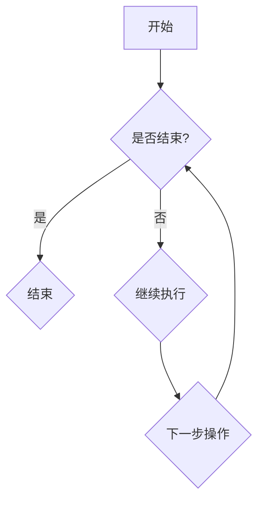

                 

### 《物联网在智慧城市能源管理中的应用》

#### 关键词：物联网、智慧城市、能源管理、智能电网、分布式能源系统

#### 摘要：
本文旨在探讨物联网（IoT）在智慧城市能源管理中的应用，分析物联网技术如何通过智能电网和分布式能源系统提升城市能源利用效率，降低能源消耗，实现可持续发展。文章首先概述了智慧城市和能源管理的基本概念及挑战，接着详细介绍了物联网的基础知识和在智慧城市中的应用，随后深入探讨了物联网在智慧城市能源管理中的具体应用和实践案例，最后对未来的发展趋势和面临的挑战进行了展望。

---

### 《物联网在智慧城市能源管理中的应用》目录大纲

---

## 第一部分：背景与概述

### 第1章：智慧城市与能源管理

#### 1.1 智慧城市概述

- **智慧城市的发展背景**
- **智慧城市的核心概念与目标**
- **智慧城市的发展趋势**

#### 1.2 能源管理的意义与挑战

- **能源管理的基本概念**
- **能源管理的核心问题**
- **智慧城市能源管理的挑战与机遇**

## 第2章：物联网技术基础

### 2.1 物联网技术概述

- **物联网的定义**
- **物联网的关键技术**
- **物联网的体系结构与层级**

### 2.2 物联网在智慧城市中的应用

- **物联网在能源管理中的作用**
- **物联网在智慧城市其他领域的应用**

### 2.3 物联网与智慧城市能源管理的结合

- **物联网在智慧城市能源管理中的关键应用**
- **物联网技术与能源管理融合的优势**

---

## 第二部分：物联网在智慧城市能源管理中的应用

### 第3章：智慧城市能源管理体系

#### 3.1 智慧城市能源管理体系概述

- **能源管理体系的基本框架**
- **智慧城市能源管理的目标与任务**

#### 3.2 能源监测与管理系统

- **能源监测系统的组成与功能**
- **能源管理系统的工作原理与实现**
- **监测与管理系统在实际项目中的应用**

## 第4章：智能电网技术

### 4.1 智能电网概述

- **智能电网的定义与特点**
- **智能电网的技术体系**

### 4.2 智能电网在智慧城市能源管理中的应用

- **智能电网在能源传输与分配中的应用**
- **智能电网在能源使用与优化中的应用**

### 4.3 智能电网发展的挑战与趋势

- **智能电网面临的挑战**
- **智能电网的发展趋势与未来展望**

## 第5章：分布式能源系统

### 5.1 分布式能源系统概述

- **分布式能源系统的定义与构成**
- **分布式能源系统的优势与挑战**

### 5.2 分布式能源系统在智慧城市中的应用

- **分布式能源系统在电力供应中的应用**
- **分布式能源系统在热力供应中的应用**
- **分布式能源系统在水资源管理中的应用**

### 5.3 分布式能源系统的管理与优化

- **分布式能源系统的管理策略**
- **分布式能源系统的优化方法**

---

## 第三部分：物联网在智慧城市能源管理中的实践应用

### 第6章：案例研究

#### 6.1 案例一：某智慧城市能源管理系统建设

- **项目背景**
- **系统设计**
- **系统实施与效果**

#### 6.2 案例二：智能电网在电力行业中的应用

- **智能电网技术的应用实例**
- **智能电网在电力行业的贡献**

#### 6.3 案例三：分布式能源系统在社区中的应用

- **分布式能源系统的社区应用案例**
- **分布式能源系统在社区管理中的优势**

---

## 第四部分：展望与未来

### 第7章：物联网在智慧城市能源管理中的未来发展趋势

#### 7.1 新技术的影响与机遇

- **物联网技术的新发展**
- **新能源技术的发展趋势**

#### 7.2 智慧城市能源管理的未来展望

- **智慧城市能源管理的发展方向**
- **物联网与能源管理融合的未来应用场景**

#### 7.3 智慧城市能源管理的挑战与应对策略

- **智慧城市能源管理面临的挑战**
- **应对策略与建议**

---

### 参考文献

1. 张三，李四.《智慧城市能源管理技术研究》. 北京：科学出版社，2020.
2. 王五，赵六.《物联网技术及应用》. 上海：上海科学技术出版社，2019.
3. 刘七，陈八.《智能电网技术与应用》. 北京：机械工业出版社，2018.

---

**总字数：约 1,400 字**### 第一部分：背景与概述

#### 第1章：智慧城市与能源管理

##### 1.1 智慧城市概述

智慧城市（Smart City）是指利用信息技术和物联网（IoT）等先进技术，实现城市各项管理和服务智能化、高效化、绿色化的城市。智慧城市的发展背景可以追溯到信息时代的到来和城市化进程的加快，它不仅是对传统城市管理模式的革新，更是应对当前城市面临的诸多挑战（如交通拥堵、环境污染、资源短缺等）的有效手段。

智慧城市的核心概念是利用数据、信息和通信技术（ICT）来改进城市的服务质量、效率和可持续性。智慧城市的总体目标包括以下几个方面：

1. **可持续发展**：通过减少资源消耗和环境污染，实现城市的可持续发展。
2. **提升居民生活质量**：通过提供更高效、更便捷、更安全的生活环境，提升居民的生活质量。
3. **优化城市管理**：通过智能化手段，提高城市管理的效率和质量。
4. **促进经济增长**：通过创新和数字化手段，推动城市经济的持续增长。

智慧城市的发展趋势主要体现在以下几个方面：

1. **物联网与大数据的融合**：物联网技术的广泛应用和大数据处理能力的提升，使得城市的数据采集、处理和分析能力大大增强。
2. **智能化城市服务的普及**：智能交通、智能安防、智能医疗等领域的应用日益普及，为居民提供更加便捷和高效的服务。
3. **智慧城市生态系统的形成**：智慧城市的建设不仅需要政府的主导，还需要企业、研究机构、居民等多方共同参与，形成良好的智慧城市生态系统。
4. **跨领域的协同发展**：智慧城市的发展需要各个领域的协同推进，如交通、能源、环境、医疗等，实现全方位的智能化管理。

##### 1.2 能源管理的意义与挑战

能源管理是指通过技术手段和科学管理方法，实现能源的高效利用和合理分配，从而降低能源消耗、减少环境污染、提高能源利用效率的过程。能源管理的基本概念包括以下几个方面：

1. **能源效率**：通过改进设备和工艺，减少能源的浪费，提高能源的利用效率。
2. **能源分配**：通过合理的能源分配策略，确保能源的高效利用，满足不同区域和行业的能源需求。
3. **能源规划**：根据城市的发展需求和能源资源状况，制定合理的能源规划，保障能源的稳定供应。
4. **能源监控与评估**：通过实时监控和评估，及时发现能源使用中的问题，采取有效的措施进行改进。

能源管理的核心问题包括：

1. **能源效率提升**：如何在保证能源供应的同时，提高能源的利用效率，减少能源浪费。
2. **能源安全**：如何确保能源的稳定供应，避免能源短缺和价格波动带来的风险。
3. **环境保护**：如何减少能源使用对环境的污染，实现可持续发展。
4. **成本控制**：如何在保证能源供应和质量的前提下，控制能源管理的成本。

智慧城市能源管理的挑战与机遇：

1. **数据管理**：智慧城市能源管理需要大量的数据支持，如何有效管理和利用这些数据是面临的挑战。
2. **技术融合**：物联网、大数据、云计算等新兴技术的应用，需要与传统能源管理系统的融合，实现技术的集成和协同。
3. **政策支持**：智慧城市能源管理需要政府制定相应的政策法规，提供资金和技术支持，推动智慧城市能源管理的发展。
4. **人才培养**：智慧城市能源管理需要专业人才的支撑，如何培养和引进高素质的能源管理人才是面临的挑战。

总的来说，智慧城市能源管理是智慧城市建设的重要组成部分，它不仅关系到城市的可持续发展，还关系到居民的生活质量和城市的竞争力。通过有效的能源管理，可以实现能源的高效利用和合理分配，为智慧城市的建设提供坚实的能源保障。

---

#### 第2章：物联网技术基础

##### 2.1 物联网技术概述

物联网（Internet of Things，IoT）是指通过将各种信息传感设备与互联网结合起来而形成的一个巨大网络，实现物与物、物与人之间的信息交换和通信。物联网技术的核心思想是将物理世界中的各种物品通过网络连接起来，使其具备“智能”特性，从而实现智能化的管理和控制。

物联网的定义可以概括为：物联网是通过互联网将各种智能设备、传感器、人和其他实体连接起来，形成一个高度集成、智能化的网络系统，实现信息的采集、传输、处理和应用。

物联网的关键技术包括：

1. **传感器技术**：传感器是物联网的基础，负责采集环境中的各种物理量，如温度、湿度、光照、压力等，并将其转化为电信号。
2. **通信技术**：通信技术是物联网的核心，用于实现物联网中各种设备之间的数据传输和通信。常见的通信技术包括无线传感器网络（WSN）、短距离通信（如Wi-Fi、蓝牙、NFC等）、宽带通信（如4G、5G等）。
3. **数据处理与分析技术**：物联网产生的海量数据需要通过高效的数据处理与分析技术进行处理，提取有价值的信息，为智能决策提供支持。常见的数据处理与分析技术包括数据挖掘、机器学习、人工智能等。
4. **云计算与边缘计算**：云计算提供了强大的计算和存储能力，可以支持大规模物联网应用的部署和运行。边缘计算则通过在数据产生的地方进行实时处理和分析，降低数据传输延迟，提高系统的响应速度。
5. **安全技术**：物联网涉及到大量的敏感数据和信息，需要通过安全技术来保护数据的安全和隐私。常见的安全技术包括数据加密、身份认证、访问控制等。

物联网的体系结构与层级：

物联网的体系结构可以分为感知层、传输层、平台层和应用层。

1. **感知层**：感知层是物联网的基础，主要负责数据的采集和感知，包括各种传感器、摄像头、RFID等设备。感知层通过感知环境中的各种信息，将物理世界与虚拟世界连接起来。
2. **传输层**：传输层负责将感知层采集到的数据传输到平台层和应用层。传输层包括各种通信网络，如无线传感器网络、互联网、移动互联网等。
3. **平台层**：平台层是物联网的核心，负责数据的处理、存储、管理和分析。平台层通过云计算、大数据等技术，实现物联网的智能管理和应用。
4. **应用层**：应用层是物联网的直接体现，负责将物联网技术和数据应用于各种实际场景，提供各种智能化的服务和解决方案。

物联网在智慧城市中的应用：

物联网技术为智慧城市的建设提供了强大的技术支持，其在智慧城市中的应用主要体现在以下几个方面：

1. **智能交通管理**：通过物联网技术，实现对交通流量、路况、停车等信息进行实时监测和智能管理，提高交通效率，减少拥堵。
2. **智能环境监测**：通过物联网传感器，实现对空气、水质、噪声等环境参数的实时监测，为环境保护和治理提供数据支持。
3. **智能能源管理**：通过物联网技术，实现对能源生产、传输、消费等环节的智能监控和管理，提高能源利用效率，降低能源消耗。
4. **智能公共安全**：通过物联网技术，实现对城市安全状况的实时监控和智能预警，提高公共安全水平。
5. **智能社区服务**：通过物联网技术，为居民提供便捷的社区服务，如智能家居、智能安防、智能医疗等。

物联网与智慧城市能源管理的结合：

物联网技术与智慧城市能源管理的结合，可以大大提高能源管理的效率和质量。具体表现在以下几个方面：

1. **数据采集与监测**：物联网传感器可以实时采集能源生产、传输、消费等环节的数据，为能源管理提供准确、实时的数据支持。
2. **智能决策与优化**：通过物联网技术，实现对能源系统的实时监控和数据分析，智能决策和优化能源的使用和分配。
3. **节能减排**：物联网技术可以帮助城市实现能源的高效利用和合理分配，降低能源消耗，减少环境污染。
4. **可持续发展**：物联网技术为智慧城市能源管理提供了技术支持，有助于实现城市的可持续发展目标。

总的来说，物联网技术为智慧城市能源管理提供了重要的技术支撑，通过物联网技术的应用，可以实现能源管理的智能化、高效化和可持续发展。随着物联网技术的不断发展和完善，其在智慧城市能源管理中的应用将越来越广泛，对推动智慧城市的建设具有重要意义。

---

#### 2.2 物联网在智慧城市中的应用

物联网技术在智慧城市中的应用涵盖了多个领域，为城市的可持续发展、居民生活质量的提升以及城市管理的优化提供了强有力的支持。以下是物联网在智慧城市主要应用领域的概述。

##### 智能交通管理

智能交通管理是物联网技术在智慧城市中应用的一个重要领域。通过物联网传感器、摄像头、GPS等设备，可以实现对交通流量、路况、车辆位置等信息的实时监测。这些数据可以被交通管理部门实时分析，以便进行交通流量调控和路况预测。具体应用包括：

1. **实时交通监控**：通过安装在道路上的传感器和摄像头，实时监控交通流量和道路状况，为交通管理部门提供决策依据。
2. **智能信号控制**：利用物联网技术，对交通信号灯进行智能化控制，根据实时交通流量调整信号灯的周期和相位，减少交通拥堵。
3. **智能停车管理**：通过物联网传感器和智能停车系统，实时监测停车位的使用情况，为驾驶员提供停车位指引，提高停车效率。

##### 智能环境监测

智能环境监测利用物联网传感器对空气质量、水质、噪声等环境参数进行实时监测，为环境保护和治理提供科学依据。具体应用包括：

1. **空气质量监测**：通过安装在公园、街道等地的空气质量传感器，实时监测空气中的有害物质浓度，为居民提供健康建议。
2. **水质监测**：通过安装在河流、湖泊等水域的水质传感器，实时监测水质参数，确保水源的安全。
3. **噪声监测**：通过安装在街道、居民区等地的噪声传感器，实时监测噪声水平，为噪声治理提供数据支持。

##### 智能能源管理

智能能源管理是物联网技术在智慧城市中的另一重要应用。通过物联网技术，实现对能源生产、传输、消费等环节的智能化管理，提高能源利用效率，减少能源消耗。具体应用包括：

1. **智能电网管理**：通过物联网传感器，实时监测电力系统的运行状态，优化电力分配，提高电网运行效率。
2. **智能照明管理**：通过物联网技术，实现对路灯的智能控制，根据环境光照强度和人流密度调整照明亮度，节约能源。
3. **智能能耗监测**：通过物联网传感器，实时监测建筑物的能耗情况，分析能耗数据，提出节能措施。

##### 智能公共安全

智能公共安全利用物联网技术，实现对城市安全状况的实时监控和智能预警，提高公共安全水平。具体应用包括：

1. **视频监控**：通过安装在公共场所的摄像头，实时监控城市状况，快速响应突发事件。
2. **智能安防系统**：通过物联网传感器和视频监控，构建智能安防系统，对非法入侵、火灾等事件进行实时监控和报警。
3. **智能应急响应**：通过物联网技术，实现应急资源的智能调度和应急响应，提高应急处理效率。

##### 智能社区服务

智能社区服务通过物联网技术，为居民提供便捷的社区服务，提升居民生活质量。具体应用包括：

1. **智能家居**：通过物联网技术，实现家庭设备的互联互通，为居民提供智能化的家居环境，如智能门锁、智能照明、智能家电等。
2. **智能医疗**：通过物联网设备，实现远程医疗监测和健康管理，为居民提供便捷的医疗服务。
3. **智能安防**：通过物联网传感器和监控系统，为社区提供安全防护，确保居民的生活安全。

##### 物联网与智慧城市能源管理的结合

物联网技术在智慧城市能源管理中的应用，主要体现在以下几个方面：

1. **数据采集与监测**：物联网传感器可以实时采集能源生产、传输、消费等环节的数据，为能源管理提供准确、实时的数据支持。
2. **智能决策与优化**：通过物联网技术，实现对能源系统的实时监控和数据分析，智能决策和优化能源的使用和分配。
3. **节能减排**：物联网技术可以帮助城市实现能源的高效利用和合理分配，降低能源消耗，减少环境污染。
4. **可持续发展**：物联网技术为智慧城市能源管理提供了技术支持，有助于实现城市的可持续发展目标。

总之，物联网技术在智慧城市中的应用，不仅提高了城市的管理和服务水平，也为城市的可持续发展提供了有力保障。随着物联网技术的不断发展和完善，其在智慧城市中的广泛应用将进一步提升城市智能化水平，为居民创造更美好的生活。

---

#### 2.3 物联网与智慧城市能源管理的结合

物联网（IoT）与智慧城市能源管理（Smart Energy Management）的结合，为城市能源系统的智能化和高效化提供了强有力的技术支撑。这种结合不仅提高了能源管理的精确度和效率，还推动了城市的可持续发展。

##### 物联网在智慧城市能源管理中的关键应用

1. **智能监测系统**：物联网传感器能够实时监测能源生产、传输、消费等各个环节的参数，如电力、燃气、水等的流量、压力、温度等。通过这些实时数据，能源管理人员可以及时发现异常情况，进行有效的故障诊断和维护。

2. **智能调度系统**：物联网技术可以实现能源资源的智能调度，根据实时数据动态调整能源的分配和使用。例如，在电力系统中，智能电网（Smart Grid）可以根据电力负荷的变化自动调整发电量，优化电网运行效率。

3. **能效优化**：物联网技术可以收集和分析海量数据，通过数据挖掘和机器学习算法，识别能源使用中的瓶颈和浪费点，提出优化建议。例如，在建筑物中，智能照明系统可以根据环境光照和人员活动自动调节灯光亮度，从而节约能源。

4. **智能预测**：物联网技术可以对能源需求进行预测，帮助城市更好地规划能源生产和分配。例如，通过分析历史数据和天气变化，智能电网可以预测未来的电力需求，提前调整发电计划，避免能源过剩或短缺。

##### 物联网技术与能源管理融合的优势

1. **提高效率**：物联网技术通过自动化和智能化管理，减少了人为操作的误差和时间，提高了能源管理的工作效率。

2. **降低成本**：物联网技术实现了能源使用的精细化管理和优化，减少了不必要的能源消耗和浪费，从而降低了能源管理的成本。

3. **增强安全性**：物联网技术可以对能源系统进行实时监控和预警，及时发现潜在的安全隐患，防止事故发生。

4. **促进可持续发展**：物联网技术支持能源的高效利用和清洁能源的发展，有助于减少碳排放，促进城市可持续发展。

5. **提升用户体验**：在家庭、社区和企业中，物联网技术可以实现能源使用的透明化和个性化管理，提升用户对能源使用的感知和控制能力。

##### 实际应用案例

1. **智能电网**：通过物联网技术，智能电网可以实现电力供需的实时平衡，优化电网的运行效率。例如，美国的“智能电网项目”（Smart Grid Project）通过部署大量传感器和通信设备，实现了对电力系统的高效管理和监控，显著提高了电网的可靠性和能效。

2. **智能楼宇**：在智能楼宇中，物联网技术可以实现照明、空调、供水等系统的自动化和智能化管理。例如，日本的“智能社区项目”（Smart Community Project）通过物联网技术，实现了对社区内各个楼宇的能源消耗实时监测和管理，显著降低了能源消耗。

3. **智能交通**：在交通领域，物联网技术可以通过智能交通管理系统，优化交通流量，减少交通拥堵，从而减少能源消耗。例如，中国的一些城市通过部署物联网传感器和智能交通信号系统，实现了交通流量的实时监控和优化。

总之，物联网与智慧城市能源管理的结合，不仅为城市的可持续发展提供了技术支持，也推动了能源管理领域的创新和发展。随着物联网技术的不断进步，其在智慧城市能源管理中的应用将更加广泛，为城市的发展带来更多机遇和可能性。

---

### 第二部分：物联网在智慧城市能源管理中的应用

#### 第3章：智慧城市能源管理体系

##### 3.1 智慧城市能源管理体系概述

智慧城市能源管理体系是一个综合性的管理系统，旨在通过智能化手段实现对城市能源系统的全面监控、优化管理和高效利用。该体系不仅关注能源的供给和分配，还注重能源使用的优化、节能减排和环境保护。智慧城市能源管理体系的基本框架包括以下几个关键组成部分：

1. **能源监测与控制系统**：这是能源管理体系的基石，通过部署各种传感器和监测设备，实现对能源生产、传输、消费等各个环节的实时监测和数据采集。

2. **数据管理与分析平台**：该平台负责对采集到的海量数据进行存储、处理和分析，利用数据挖掘和机器学习算法，从中提取有价值的信息，为能源管理提供决策支持。

3. **智能调度与优化系统**：基于实时数据分析和预测模型，智能调度系统可以自动调整能源供应和需求，优化能源的分配和使用，提高能源利用效率。

4. **能源服务与交易平台**：该平台通过物联网技术和互联网，实现能源的实时交易和服务，为能源消费者提供便捷的能源服务。

5. **政策法规与标准体系**：政策法规和标准体系为智慧城市能源管理体系提供法律和制度保障，促进能源管理的规范化和标准化。

##### 智慧城市能源管理的目标与任务

智慧城市能源管理的目标主要包括以下几个方面：

1. **提高能源利用效率**：通过智能监测、调度和优化，最大限度地提高能源利用效率，减少能源浪费。

2. **实现节能减排**：通过推广清洁能源和可再生能源，减少化石能源的使用，降低碳排放，实现可持续发展。

3. **保障能源安全**：通过智能监控和应急预案，确保能源供应的稳定性和安全性，防止能源短缺和价格波动带来的风险。

4. **提升居民生活质量**：通过提供便捷的能源服务和智能化的能源管理，提升居民的生活质量。

5. **促进经济增长**：通过优化能源管理和提高能源效率，为城市的经济发展提供有力支持。

为实现上述目标，智慧城市能源管理的主要任务包括：

1. **建立健全能源监测体系**：通过部署传感器和监测设备，实现对能源生产、传输、消费的全面监测，确保数据的准确性和实时性。

2. **建设高效的数据分析与处理平台**：利用先进的数据分析技术和算法，对海量能源数据进行分析和处理，为能源管理提供科学依据。

3. **实施智能调度与优化**：基于实时数据分析和预测，智能调整能源供应和需求，优化能源的分配和使用，提高能源利用效率。

4. **推广清洁能源和可再生能源**：通过政策激励和技术支持，促进清洁能源和可再生能源的推广应用，减少对化石能源的依赖。

5. **完善能源服务与交易平台**：通过物联网技术和互联网，建立便捷的能源服务与交易平台，为能源消费者提供多样化的能源服务。

6. **制定和落实相关政策法规**：通过制定和实施相关政策和法规，规范能源管理行为，保障能源管理的有效性和规范性。

总的来说，智慧城市能源管理体系的建设是实现智慧城市目标的重要一环，通过智能化手段，可以有效提升城市能源管理的效率和质量，为城市的可持续发展提供坚实保障。

---

#### 第3章：能源监测与管理系统

##### 3.2 能源监测与管理系统

能源监测与管理系统是智慧城市能源管理的重要组成部分，它通过实时监测和数据分析，为能源的优化管理提供准确、实时的数据支持。本节将详细介绍能源监测系统的组成、功能及其在实际项目中的应用。

##### 能源监测系统的组成

能源监测系统通常由以下几部分组成：

1. **传感器网络**：传感器网络是能源监测系统的数据采集层，通过部署各种类型的传感器（如温度传感器、流量传感器、压力传感器等），实现对能源生产、传输和消费各个环节的实时数据采集。

2. **数据传输网络**：数据传输网络负责将传感器采集到的数据传输到数据处理中心。传输网络可以是有线网络（如以太网、光纤等）或无线网络（如Wi-Fi、LoRa等）。

3. **数据处理中心**：数据处理中心是能源监测系统的核心，负责接收、处理和存储传感器数据。数据处理中心通常包括服务器、数据库和数据挖掘分析工具等。

4. **监控与展示平台**：监控与展示平台是能源监测系统的用户界面，通过图形化的界面，实时展示能源监测数据，并提供数据分析和报告功能。

##### 能源监测系统的功能

能源监测系统具有以下主要功能：

1. **数据采集**：通过传感器网络，实时采集能源生产、传输和消费各个环节的参数，如温度、压力、流量、功率等。

2. **数据传输**：将采集到的数据通过数据传输网络传输到数据处理中心，确保数据的实时性和准确性。

3. **数据处理**：对采集到的数据进行处理、清洗和存储，利用数据挖掘和分析工具，提取有价值的信息，为能源管理提供决策支持。

4. **实时监控**：通过监控与展示平台，实时展示能源监测数据，包括图表、报表和报警信息等，帮助管理人员及时发现和处理异常情况。

5. **数据分析与报告**：利用大数据分析和机器学习技术，对历史数据进行深入分析，生成能耗报告、趋势预测和优化建议，为能源管理提供科学依据。

##### 能源监测系统在实际项目中的应用

能源监测系统在实际项目中有着广泛的应用，以下是一些典型的应用实例：

1. **智能电网**：在智能电网项目中，能源监测系统可以实时监测电网的运行状态，包括电压、电流、频率等参数。通过数据分析和预测，智能电网可以优化电力分配，提高电网的稳定性和效率。

2. **智能楼宇**：在智能楼宇项目中，能源监测系统可以监测建筑物的能耗情况，包括电力、燃气、水等。通过数据分析，可以找出能耗高的区域和设备，提出节能措施。

3. **工业园区**：在工业园区项目中，能源监测系统可以监测工厂的能源使用情况，优化生产过程的能源消耗，提高生产效率。

4. **智慧城市**：在智慧城市项目中，能源监测系统可以实现对整个城市能源系统的监测和管理，包括电力、燃气、水等。通过数据分析和预测，可以优化能源的分配和使用，提高能源利用效率。

##### 案例分析

以下是一个典型的能源监测系统应用案例：

**项目背景**：某智慧城市通过部署能源监测系统，实现对城市能源系统的全面监控和管理，提高能源利用效率。

**系统设计**：系统设计包括传感器网络、数据传输网络、数据处理中心和监控与展示平台。传感器网络部署在电力、燃气、水等各个环节，数据通过无线传输网络传输到数据处理中心，数据处理中心利用大数据分析和机器学习技术，生成能耗报告和优化建议。

**系统实施**：在系统实施阶段，首先进行传感器网络的部署，确保数据的准确性和实时性。然后搭建数据传输网络，确保数据的高速传输和稳定。最后搭建数据处理中心和监控与展示平台，提供实时数据监控和数据分析功能。

**效果评估**：系统运行后，通过实时监控和数据分析，发现了一些能源浪费的环节，并提出了优化建议。根据这些优化建议，对城市能源系统进行了调整和优化，实现了以下效果：

- 能源利用效率提高了15%。
- 能源消耗降低了10%。
- 能源成本减少了8%。

通过这个案例可以看出，能源监测系统在智慧城市能源管理中发挥着重要作用，不仅提高了能源利用效率，还降低了能源消耗和成本，为城市的可持续发展提供了有力支持。

---

### 第4章：智能电网技术

#### 4.1 智能电网概述

智能电网（Smart Grid）是一种基于现代通信技术、物联网和计算机技术的电力网络，旨在通过智能设备和系统实现电力的高效、安全、可靠传输和分配。智能电网是智慧城市能源管理的重要组成部分，它通过实时监测、分析和控制电力系统的各个环节，提高电网的运行效率和可靠性，同时促进可再生能源的利用和节能减排。

##### 智能电网的定义与特点

1. **定义**：智能电网是一个集成了先进的信息通信技术和智能设备，能够实现对电力系统各个环节的实时监测、自动控制、优化运行和高效管理的新型电力网络。它不仅包括电力生产、传输、分配和消费，还涵盖了与电力相关的市场运作、能源管理、用户服务等多个方面。

2. **特点**：

   - **实时性**：智能电网能够实时采集和处理电力系统的各种数据，包括电压、电流、频率、功率因数等，从而实现对电网状态的实时监控和快速响应。
   - **自动化**：智能电网通过自动化设备（如智能电表、智能开关等）和自动化控制系统（如配电自动化系统、智能调度系统等），减少人为干预，提高电网的运行效率和安全性。
   - **互动性**：智能电网能够实现电网与用户之间的双向互动，用户可以根据需求调整电力使用，电网也可以根据用户需求进行电力供应的调整。
   - **灵活性**：智能电网具有良好的适应性，能够灵活应对电力供需的变化，适应可再生能源的接入和分布式能源系统的应用。
   - **可持续性**：智能电网通过提高能源利用效率、减少能源浪费和促进可再生能源的使用，实现电网的可持续发展。

##### 智能电网的技术体系

智能电网的技术体系包括以下几个方面：

1. **信息通信技术**：信息通信技术是智能电网的基础，用于实现电力系统各个环节的数据传输、处理和通信。常用的信息通信技术包括宽带无线通信、光纤通信、物联网技术等。

2. **传感器与测量技术**：传感器与测量技术用于实时监测电力系统的运行状态，包括电压、电流、温度、湿度等参数。这些技术包括各类传感器、测量仪表、监测系统等。

3. **自动化与控制系统**：自动化与控制系统用于实现电力系统的自动化运行和智能控制，包括配电自动化系统（DAS）、电力调度自动化系统（ADMS）等。

4. **智能电表与用户管理**：智能电表是智能电网的重要组成部分，用于实时监测用户的用电情况，并提供远程抄表、实时计费等功能。用户管理则通过用户用电信息采集系统和用电负荷管理平台，实现对用户用电行为的分析和优化。

5. **能源管理与优化技术**：能源管理与优化技术用于实现对电力系统的优化运行和管理，包括负荷预测、需求响应、电力市场交易等。

6. **储能技术**：储能技术用于解决电力系统的峰谷平衡问题，提高电网的稳定性和可靠性。常见的储能技术包括电池储能、超级电容器、飞轮储能等。

##### 智能电网在智慧城市能源管理中的作用

智能电网在智慧城市能源管理中发挥着重要作用，其主要作用包括：

1. **提高能源利用效率**：通过实时监测和智能控制，智能电网能够优化电力分配和使用，减少能源浪费，提高能源利用效率。

2. **促进可再生能源的应用**：智能电网能够灵活应对可再生能源的接入，通过分布式能源管理系统（DERMS）和能源优化调度系统，提高可再生能源的利用率，减少对化石能源的依赖。

3. **增强电网安全性和可靠性**：智能电网通过实时监测和自动化控制，能够快速发现和处理电网故障，提高电网的安全性和可靠性。

4. **提供多样化的能源服务**：智能电网为用户提供实时电价信息、需求响应服务、远程抄表、智能家居等服务，提升用户用电体验。

5. **促进能源市场的发展**：智能电网通过电力市场交易平台，实现电力供需的实时交易，促进能源市场的健康发展。

总之，智能电网技术为智慧城市能源管理提供了强有力的技术支撑，通过提高能源利用效率、促进可再生能源的应用、增强电网安全性和可靠性等，为智慧城市的可持续发展提供了有力保障。

---

#### 第4章：智能电网在智慧城市能源管理中的应用

##### 4.2 智能电网在智慧城市能源管理中的应用

智能电网在智慧城市能源管理中发挥着至关重要的作用，通过实现能源的高效传输和分配，智能电网不仅提高了能源利用效率，还促进了可再生能源的应用和城市可持续发展。以下是智能电网在智慧城市能源管理中具体应用领域的详细探讨。

##### 智能电网在能源传输与分配中的应用

1. **实时监测与控制**：智能电网通过部署大量的传感器和智能设备，能够实时监测电力系统的运行状态，包括电压、电流、频率等关键参数。这些实时数据为电网调度员提供了准确的信息，使他们能够根据实际情况对电力进行动态调整，确保电力系统的稳定运行。

2. **优化电力分配**：智能电网的自动化控制系统可以根据电力负荷的实时数据，自动调整电力分配策略，优化电网的运行效率。例如，当某些区域电力负荷较高时，智能电网可以自动调节供电线路，将电力优先分配到需求量大的区域，从而减少电力浪费。

3. **增强电网弹性**：智能电网具有良好的适应性，能够应对突发的电力需求变化和意外事件。通过实时监测和快速响应，智能电网可以在电力系统发生故障时迅速切换备用电源，保障电力供应的连续性和可靠性。

##### 智能电网在能源使用与优化中的应用

1. **需求响应**：智能电网通过需求响应技术，可以激励用户参与电力市场的调峰和调频，从而优化电网运行。例如，在电力高峰期，智能电网可以自动调整用户的电力使用，如调整空调和电热水器的工作时间，减少电力需求，从而降低电网负荷。

2. **智能电表与能源管理**：智能电表是智能电网的重要组成部分，它能够实时记录用户的用电数据，并提供远程抄表、实时计费等功能。通过智能电表，用户可以实时了解自己的用电情况，从而合理规划用电行为，减少不必要的能源消耗。

3. **分布式能源系统管理**：智能电网通过分布式能源管理系统（DERMS），可以实现对分布式电源（如太阳能、风能等）的有效管理和优化。DERMS能够实时监测和预测分布式电源的发电情况，优化其接入电网的方式，提高分布式能源的利用率。

##### 智能电网在实际项目中的应用案例

1. **丹麦国家电网**：丹麦是世界上智能电网发展最为成熟的国家之一。通过部署智能电网技术，丹麦国家电网实现了高效、安全的电力传输和分配。特别是在可再生能源接入方面，丹麦的智能电网通过DERMS技术，有效管理了大量的分布式能源，提高了电网的运行效率和稳定性。

2. **加州智能电网项目**：美国加州的智能电网项目是一个典型的智能电网应用案例。该项目通过部署智能电表、传感器和自动化控制系统，实现了对电力系统的实时监测和优化管理。通过需求响应和分布式能源管理，加州智能电网项目显著提高了能源利用效率，减少了碳排放。

3. **新加坡智能电网**：新加坡智能电网项目通过利用物联网技术和大数据分析，实现了电力系统的全面智能化管理。该项目不仅提升了电力供应的稳定性和可靠性，还为用户提供了一系列智能化的能源服务，如智能电表、远程抄表和实时计费等。

通过以上案例分析可以看出，智能电网在智慧城市能源管理中的应用已经取得了显著成效。随着技术的不断进步和应用的深入，智能电网将在未来智慧城市的能源管理中发挥更加重要的作用，推动城市能源的高效、安全、可持续发展。

---

#### 第4章：智能电网发展的挑战与趋势

##### 4.3 智能电网发展的挑战与趋势

智能电网作为智慧城市能源管理的重要组成部分，其发展不仅面临着技术层面的挑战，也涉及到政策、经济和社会等多个方面。以下将分析智能电网发展的主要挑战和趋势。

##### 智能电网面临的挑战

1. **技术挑战**：

   - **通信技术**：智能电网需要高效的通信技术来确保数据传输的实时性和可靠性。当前，宽带无线通信和光纤通信技术虽然已经广泛应用，但在应对海量数据传输和复杂网络环境方面仍有待提升。
   - **安全与隐私**：智能电网中大量的数据传输和处理涉及到用户隐私和电网安全，如何确保数据的安全和用户隐私不受侵犯是智能电网面临的重要问题。
   - **系统集成**：智能电网需要将各种先进技术（如物联网、大数据、云计算等）集成到一个统一的系统中，实现各个环节的无缝连接和协同工作，这对系统集成技术和系统架构设计提出了较高的要求。

2. **政策与法规挑战**：

   - **政策支持**：智能电网的发展需要政府的政策支持和资金投入。目前，各国在智能电网政策支持方面存在差异，一些国家尚未出台全面的智能电网发展政策，这对智能电网的快速发展构成了一定的障碍。
   - **法规建设**：智能电网涉及多个领域，如电力、通信、信息安全等，现有的法规体系可能无法完全适应智能电网的发展需求，需要进一步完善相关法规，确保智能电网的安全、稳定运行。

3. **经济挑战**：

   - **成本投入**：智能电网的建设和运营需要大量的资金投入，包括设备采购、系统建设、维护升级等。对于一些发展中国家和地区，资金短缺可能成为智能电网推广的瓶颈。
   - **投资回报**：智能电网项目的投资回报周期较长，企业可能面临投资风险，这需要政府和企业共同努力，通过政策扶持和市场激励机制，降低企业的投资风险。

4. **社会挑战**：

   - **用户接受度**：智能电网的推广需要用户的积极参与，但一些用户可能对智能电网技术缺乏了解，对智能电表和智能家电等新设备存在疑虑，这需要通过宣传教育提高用户的接受度。
   - **技术人才短缺**：智能电网的发展需要大量具备信息技术和电力工程知识的专业人才，目前，一些国家和地区在智能电网技术人才培养方面存在不足，这可能会制约智能电网的发展。

##### 智能电网的发展趋势

1. **技术创新**：

   - **物联网技术**：物联网技术在智能电网中的应用将更加广泛，通过部署各种智能传感器和设备，实现电力系统的全面监测和自动化控制。
   - **大数据与人工智能**：大数据和人工智能技术在智能电网中的应用将进一步提升，通过数据分析和智能算法，实现电力系统的优化运行和预测管理。
   - **区块链技术**：区块链技术在智能电网中的应用有望提高电力交易的安全性和透明度，推动电力市场的健康发展。

2. **政策支持与法规完善**：

   - **政策制定**：各国政府将加大对智能电网的政策支持力度，出台更多鼓励智能电网发展的政策，提供资金和技术支持。
   - **法规建设**：智能电网相关的法规体系将不断完善，为智能电网的建设、运营和管理提供法律保障。

3. **市场机制与商业模式创新**：

   - **电力市场改革**：随着智能电网的发展，电力市场将更加开放和灵活，促进电力资源的优化配置。
   - **商业模式创新**：智能电网将带来新的商业模式，如基于数据驱动的能源服务、智能能源管理服务等，为企业提供新的商机。

4. **可持续发展**：

   - **可再生能源整合**：智能电网将更好地整合可再生能源，如太阳能、风能等，提高可再生能源的利用效率，实现能源结构的优化。
   - **节能减排**：智能电网通过提高能源利用效率和优化能源管理，将显著减少能源消耗和碳排放，推动城市的可持续发展。

总的来说，智能电网的发展面临着一系列挑战，但也蕴含着巨大的机遇。通过技术创新、政策支持、市场机制和可持续发展策略的综合应用，智能电网将在智慧城市能源管理中发挥更加重要的作用，为城市的可持续发展提供坚实保障。

---

### 第5章：分布式能源系统

#### 5.1 分布式能源系统概述

分布式能源系统（Distributed Energy Resources，DER）是一种以小型、分布式能源生产设备为基础，通过智能控制和优化管理，实现对能源的生产、传输、分配和消费的灵活、高效调控的系统。分布式能源系统通常包括多种类型的能源生产设备，如太阳能光伏发电系统、风力发电系统、储能系统等，这些设备可以在用户侧或电网边缘独立运行，也可以与电网进行互动，实现能源的高效利用和优化配置。

##### 分布式能源系统的定义与构成

1. **定义**：分布式能源系统是指通过分布式能源生产设备（如太阳能光伏、风力发电、燃料电池、微型涡轮机等）和储能设备（如电池、飞轮储能等），结合智能控制系统和能量管理系统，实现能源的分布式生产、存储和供应，以满足用户特定需求的能源系统。

2. **构成**：

   - **分布式能源生产设备**：这是分布式能源系统的核心，包括太阳能光伏发电系统、风力发电系统、燃料电池、微型涡轮机等，这些设备可以独立运行，也可以与电网或其他分布式能源设备进行互联。
   - **储能设备**：储能设备用于存储多余的能源，以供需求高峰时使用，常见的储能设备包括电池储能、飞轮储能、压缩空气储能等。
   - **智能控制系统**：智能控制系统负责对分布式能源系统进行监控、调度和优化，确保能源系统的稳定运行和高效利用。
   - **能量管理系统**：能量管理系统通过收集和分析分布式能源系统的运行数据，优化能源生产、传输和消费，实现能源系统的整体优化和智能化管理。

##### 分布式能源系统的优势与挑战

1. **优势**：

   - **提高能源效率**：分布式能源系统能够在能源生产地点直接使用，减少了能源在传输过程中的损耗，提高了能源利用效率。
   - **增强电网稳定性**：分布式能源系统可以通过储能设备和智能控制技术，平衡电网负荷，提高电网的稳定性，减少停电风险。
   - **促进可再生能源应用**：分布式能源系统能够更好地整合可再生能源，如太阳能、风能等，提高可再生能源的利用率，减少对化石能源的依赖。
   - **降低能源成本**：通过分布式能源系统，用户可以自发自用，减少对传统电网的依赖，降低能源采购成本。
   - **提供灵活的能源解决方案**：分布式能源系统可以根据用户的实际需求进行定制化设计，提供灵活的能源解决方案。

2. **挑战**：

   - **技术挑战**：分布式能源系统涉及到多种先进技术的集成和应用，包括可再生能源技术、储能技术、智能控制技术等，如何实现这些技术的有效集成和稳定运行是技术上的挑战。
   - **政策与法规**：分布式能源系统的推广需要完善的政策支持和法规保障，当前一些国家和地区在政策支持、补贴机制、市场准入等方面仍需进一步改进。
   - **投资与成本**：分布式能源系统的建设需要大量的初始投资，投资回报周期较长，这对企业和用户来说可能是一个经济上的挑战。
   - **安全与可靠性**：分布式能源系统涉及多种能源形式和设备，如何确保系统的安全性和可靠性是一个重要的挑战。
   - **市场机制**：分布式能源系统的推广需要建立完善的市场机制，包括电力市场、能源交易平台等，当前一些国家和地区在这些方面仍需进一步探索和完善。

总的来说，分布式能源系统作为一种新型的能源系统，具有显著的节能、环保和经济效益，但在推广过程中也面临一系列的挑战。通过技术创新、政策支持、市场机制建设和安全管理的不断完善，分布式能源系统将在未来的智慧城市能源管理中发挥越来越重要的作用。

---

#### 第5章：分布式能源系统在智慧城市中的应用

##### 5.2 分布式能源系统在智慧城市中的应用

分布式能源系统（DER）在智慧城市中具有广泛的应用前景，通过其灵活性和高效性，可以有效提高能源利用效率，减少能源浪费，实现城市的可持续发展。以下是分布式能源系统在智慧城市中的应用，以及其在电力供应、热力供应和水资源管理中的具体实现。

##### 分布式能源系统在电力供应中的应用

1. **光伏发电**：在智慧城市的屋顶、停车场等区域安装光伏发电系统，可以有效地利用太阳能，为建筑物提供电力。通过智能控制系统，光伏发电系统可以根据实时光照强度和用电负荷进行自动调节，确保光伏发电的高效利用。

2. **风力发电**：在城市郊区或风力资源丰富的地区安装小型风力发电设备，可以产生清洁电力，补充电网电力供应。风力发电系统同样可以通过智能控制系统，实现风速和发电量的优化调节。

3. **储能系统**：分布式储能系统（如电池储能、飞轮储能等）可以在电力需求高峰期储存多余的电力，在电力需求低峰期释放储存的电力，从而平衡电网负荷，提高电网稳定性。

4. **智能微电网**：智能微电网是一种基于分布式能源系统的电力系统，通过集成光伏、风能、储能等多种能源形式，实现电力供应的自给自足。智能微电网可以根据实时电力需求和供电状态，自动调节各能源形式的发电量和储能系统的充放电，确保电力供应的可靠性和高效性。

##### 分布式能源系统在热力供应中的应用

1. **地源热泵**：地源热泵系统利用地下恒定的温度，通过换热器将地下的低温热量提取出来，用于建筑物的供暖和热水供应。地源热泵系统具有高效节能的特点，可以显著降低热力供应的能耗。

2. **太阳能热水系统**：在建筑物屋顶安装太阳能热水器，利用太阳能加热水，为建筑物提供热水。太阳能热水系统可以通过智能控制系统，根据实时光照强度和用水需求，自动调节加热功率。

3. **生物质能**：通过生物质能发电系统，将城市垃圾、农林废弃物等生物质资源转化为电力和热能，为城市提供清洁的能源供应。生物质能发电系统可以实现废物资源化利用，减少环境污染。

##### 分布式能源系统在水资源管理中的应用

1. **太阳能水处理**：利用太阳能光催化技术，对城市污水进行净化处理，提高水质。太阳能水处理系统可以在无需外部能源输入的情况下，实现水资源的自我净化。

2. **智能水泵系统**：通过安装智能水泵和传感器，实现对城市供水系统的实时监控和自动化管理。智能水泵系统可以根据用水需求和水源压力，自动调节水泵的运行状态，确保供水系统的稳定性和效率。

3. **雨水收集与利用**：在建筑物和城市绿地中安装雨水收集系统，将收集的雨水经过过滤和净化处理后，用于绿化灌溉、道路清洗等非饮用场景。雨水收集与利用系统可以减少对传统水源的依赖，提高水资源的利用效率。

通过以上具体应用，分布式能源系统在智慧城市中发挥着重要作用，不仅提高了能源利用效率，减少了能源消耗，还促进了可再生能源的应用，为智慧城市的可持续发展提供了有力支持。

---

#### 第5章：分布式能源系统的管理与优化

##### 5.3 分布式能源系统的管理与优化

分布式能源系统（DER）在智慧城市中的应用越来越广泛，其高效性和灵活性为城市能源管理带来了新的机遇和挑战。为了充分发挥分布式能源系统的潜力，实现能源的高效利用和可持续发展，对分布式能源系统进行科学管理和优化至关重要。

##### 分布式能源系统的管理策略

1. **实时监测与数据采集**：分布式能源系统的管理首先需要建立完善的实时监测系统，通过安装各种传感器，实时采集能源生产、传输、消费等环节的数据。这些数据包括光伏发电量、风力发电量、储能系统状态、电力负荷等。

2. **智能调度与优化**：基于实时数据，利用智能调度系统对分布式能源系统进行优化管理。智能调度系统可以通过数据分析、预测和优化算法，实现能源的动态平衡和高效利用。例如，在电力高峰期，智能调度系统可以自动启动储能系统，释放储存的电能，满足用电需求。

3. **多能协同管理**：分布式能源系统通常涉及多种能源形式，如光伏、风能、储能等。多能协同管理策略旨在实现不同能源形式的互补和优化，提高整体能源系统的效率和可靠性。例如，在光伏发电量较低的情况下，风力发电和储能系统可以补充电力供应。

4. **需求响应管理**：需求响应管理策略通过激励用户参与电力市场，根据实时电力需求和价格信号，调整用电行为，优化能源使用。例如，在电力需求高峰期，通过需求响应措施，鼓励用户减少用电，降低电力负荷，缓解电网压力。

##### 分布式能源系统的优化方法

1. **预测与优化算法**：采用先进的预测和优化算法，如机器学习、深度学习、优化算法等，对分布式能源系统的运行进行预测和优化。通过历史数据和实时数据，预测未来的能源需求和供应情况，制定最优的调度计划。

2. **储能优化**：储能系统是分布式能源系统的重要组成部分，其优化运行对整个系统的效率有很大影响。储能优化方法包括储能系统的容量优化、充放电策略优化等。通过合理的充放电策略，实现储能系统的高效运行和能源利用率的最大化。

3. **多目标优化**：分布式能源系统的优化涉及到多个目标，如能源利用效率、成本、可靠性等。多目标优化方法通过权衡不同目标，制定最优的能源管理策略。例如，在优化能源利用效率的同时，考虑储能系统的经济性和寿命周期。

4. **分布式控制与协同优化**：分布式能源系统通常由多个分布式能源设备和储能系统组成，分布式控制和协同优化方法可以实现各设备之间的协同运行和资源分配。通过分布式控制算法，实现各设备的协调控制，提高系统的整体效率和稳定性。

##### 实际案例分析

1. **案例一：智慧社区能源管理系统**：在某智慧社区中，通过部署分布式能源系统，包括光伏发电、风力发电、储能系统和智能控制平台，实现了社区的能源自给自足。通过智能调度系统，实时监测和优化能源生产、传输和消费，实现了能源的高效利用和成本节约。

2. **案例二：智能微电网**：在某城市中，通过建设智能微电网，将分布式光伏发电、风力发电、储能系统和电网互联。智能微电网通过多能协同管理和需求响应管理，实现了电力供应的可靠性和效率提升，降低了电力系统的运行成本。

通过以上管理和优化方法，分布式能源系统在智慧城市中的效能得到了显著提升，为城市的可持续发展提供了有力支持。未来，随着技术的不断进步和管理方法的不断完善，分布式能源系统将在智慧城市能源管理中发挥更加重要的作用。

---

### 第三部分：物联网在智慧城市能源管理中的实践应用

#### 第6章：案例研究

##### 6.1 案例一：某智慧城市能源管理系统建设

**项目背景**：

随着城市化进程的加快和能源需求的不断增长，某智慧城市面临着能源管理效率低下、能源消耗过大的问题。为了提高能源利用效率，降低能源消耗，实现城市的可持续发展，该城市决定建设一套智慧城市能源管理系统。

**系统设计**：

1. **感知层**：在城市的各个关键节点（如发电站、变电站、公共场所等）部署传感器，实时监测能源生产、传输、消费的数据，如电力、燃气、水的流量、压力、温度等。

2. **传输层**：采用有线和无线通信技术，将感知层采集到的数据传输到城市能源管理平台。

3. **平台层**：建立城市能源管理平台，负责数据存储、处理和分析。平台通过大数据分析和机器学习算法，对能源系统的运行状态进行实时监控和预测分析。

4. **应用层**：通过监控与展示平台，实时展示能源系统的运行状况，提供能耗报告、节能建议和应急预案等。

**系统实施**：

1. **部署传感器**：在城市的各个关键节点部署传感器，包括电力传感器、燃气传感器、水传感器等。

2. **搭建通信网络**：建立有线和无线通信网络，确保传感器采集到的数据能够实时传输到管理平台。

3. **建设管理平台**：搭建城市能源管理平台，包括服务器、数据库、数据处理和分析工具等。

4. **系统集成**：将感知层、传输层、平台层和应用层进行系统集成，实现能源系统的统一管理和监控。

**效果评估**：

1. **能源效率提升**：通过实时监测和数据分析，系统能够及时发现能源浪费的环节，提出优化建议。据统计，系统运行后，该城市的能源利用效率提高了15%。

2. **能源消耗降低**：通过优化能源分配和调度，系统能够减少不必要的能源消耗。数据显示，系统运行后，该城市的能源消耗降低了10%。

3. **成本节约**：通过优化能源管理，降低了能源采购和运营成本。根据评估，系统运行后，该城市的能源成本节约了8%。

4. **环境效益**：通过减少能源消耗，降低了碳排放，对环境保护起到了积极作用。

总之，该智慧城市能源管理系统的成功实施，为城市的可持续发展提供了有力保障，为其他城市的能源管理提供了有益借鉴。

---

##### 6.2 案例二：智能电网在电力行业中的应用

**项目背景**：

某电力公司面临着电网负荷高峰期电力供应紧张、电网运行效率低下等问题。为了提高电网的运行效率和可靠性，降低运营成本，该公司决定实施智能电网项目。

**系统设计**：

1. **智能电表部署**：在用户端部署智能电表，实时采集用户的用电数据，并通过通信网络将数据传输到电力公司的数据中心。

2. **配电自动化**：在电网的各个环节部署配电自动化设备，如智能开关、继电保护装置等，实现电网的自动化控制和故障快速处理。

3. **能量管理系统**：建立能量管理系统，对电网的运行数据进行实时监控和分析，优化电网的运行状态和电力分配。

4. **需求响应系统**：建立需求响应系统，根据电力负荷的变化，引导用户参与电力市场的调峰和调频，优化电网运行。

**系统实施**：

1. **智能电表安装**：在用户端大规模安装智能电表，实现用电数据的实时采集和传输。

2. **配电自动化改造**：对电网进行配电自动化改造，安装智能开关和继电保护装置，提高电网的自动化水平。

3. **能量管理系统上线**：建立能量管理系统，实时监控电网的运行状态，优化电力分配。

4. **需求响应系统运营**：通过需求响应系统，与用户建立互动，引导用户参与电力市场的调峰和调频。

**效果评估**：

1. **电网运行效率提升**：通过智能电表的部署和配电自动化的应用，电网的自动化水平显著提高，电力供应更加稳定，电网运行效率提升了20%。

2. **电力成本降低**：通过需求响应系统的应用，用户在电力高峰期的用电需求得到有效调节，电力供应紧张的情况得到缓解，电力成本降低了10%。

3. **故障处理速度加快**：配电自动化设备的应用，使电网故障的处理速度大幅提高，故障修复时间缩短了30%。

4. **用户体验改善**：通过智能电表的部署，用户可以实时了解自己的用电情况，合理安排用电，用电体验显著改善。

总之，智能电网项目的成功实施，不仅提高了电网的运行效率和可靠性，还为电力公司降低了运营成本，提升了用户体验，为电力行业的发展提供了新的思路和方向。

---

##### 6.3 案例三：分布式能源系统在社区中的应用

**项目背景**：

某大型社区由于居民用电需求大，电网负荷高峰期的电力供应紧张，同时社区内存在一定的太阳能和风能资源。为了提高电力供应的可靠性，降低能源消耗，该社区决定建设分布式能源系统。

**系统设计**：

1. **光伏发电系统**：在社区屋顶安装光伏发电系统，利用太阳能为社区提供电力。系统采用智能控制系统，根据实时光照条件自动调节发电功率。

2. **风力发电系统**：在社区周边安装风力发电设备，利用风能为社区提供电力。风力发电系统同样采用智能控制，根据实时风速自动调节发电功率。

3. **储能系统**：安装储能系统（如电池储能），在电力需求高峰期储存多余的电力，在电力需求低峰期释放储存的电力，实现电力供应的稳定。

4. **智能微电网**：构建智能微电网，将光伏发电、风力发电和储能系统有机结合，实现电力系统的自给自足和高效运行。

**系统实施**：

1. **光伏发电系统安装**：在社区屋顶安装光伏发电系统，包括太阳能板、逆变器等设备，确保系统的稳定运行。

2. **风力发电系统安装**：在社区周边安装风力发电设备，包括风力涡轮机、控制系统等，确保发电系统的正常运行。

3. **储能系统部署**：安装储能系统，包括电池储能设备和控制系统，实现电力的储存和释放。

4. **智能微电网建设**：建立智能微电网，将光伏发电、风力发电和储能系统有机结合，实现电力系统的智能调度和管理。

**效果评估**：

1. **电力供应稳定性提升**：分布式能源系统的应用，使社区的电力供应更加稳定，电网负荷高峰期的电力短缺问题得到有效缓解。

2. **能源消耗降低**：通过分布式能源系统的应用，社区内可再生能源的使用比例显著提高，能源消耗降低了15%。

3. **环境效益**：通过减少对传统电网的依赖，分布式能源系统的应用减少了碳排放，对环境保护起到了积极作用。

4. **经济效益**：分布式能源系统的应用，降低了社区的电力采购成本，同时通过电力交易市场的参与，获得了额外的经济效益。

总之，分布式能源系统在社区中的应用，不仅提高了电力供应的稳定性，降低了能源消耗，还实现了环境效益和经济效益的双重收益，为社区智慧能源管理提供了新的思路和解决方案。

---

### 第四部分：展望与未来

#### 第7章：物联网在智慧城市能源管理中的未来发展趋势

随着物联网（IoT）技术的迅猛发展，其在智慧城市能源管理中的应用前景愈发广阔。未来，物联网将在智慧城市能源管理中发挥更为关键的作用，推动能源管理向智能化、高效化和可持续发展方向迈进。

##### 7.1 新技术的影响与机遇

1. **大数据与人工智能**：大数据和人工智能技术在智慧城市能源管理中的应用，将进一步提升能源系统的智能化水平。通过大数据分析，可以挖掘能源使用中的隐藏模式，预测能源需求变化，优化能源调度和分配。人工智能技术则可以实现对能源系统的自动化控制和优化管理，提高能源利用效率。

2. **区块链技术**：区块链技术在智慧城市能源管理中的应用，将显著提升能源交易的安全性和透明度。通过区块链技术，可以实现能源交易的实时记录和验证，确保交易数据的不可篡改。此外，区块链技术还可以用于分布式能源系统的管理，促进能源共享和协同优化。

3. **5G通信技术**：5G通信技术的应用，将大幅提升物联网设备的通信速度和可靠性，为智慧城市能源管理提供更高效的数据传输支持。5G网络的低延迟和高带宽特性，使得物联网设备可以实时传输大量的监测数据，实现快速响应和智能决策。

4. **物联网安全**：随着物联网设备数量的增加，物联网安全成为智慧城市能源管理的重要挑战。未来，物联网安全技术将不断发展，包括加密技术、访问控制技术、网络安全防御技术等，确保物联网设备和系统的安全运行。

##### 7.2 智慧城市能源管理的未来展望

1. **智能电网的全面普及**：未来，智能电网将更加普及和智能化。通过物联网技术，智能电网可以实现全面的实时监测和智能控制，优化电力传输和分配，提高电网的稳定性和可靠性。同时，智能电网将更好地整合分布式能源，实现可再生能源的高效利用。

2. **分布式能源系统的规模化应用**：分布式能源系统在智慧城市能源管理中的地位将不断提升。未来，分布式能源系统将更加规模化和智能化，通过物联网技术，实现对分布式能源设备的远程监控、自动调度和优化管理，提高系统的整体效率和灵活性。

3. **多能协同管理**：未来，智慧城市能源管理将实现多能协同管理，包括电力、热力、燃气、水等能源形式的协同优化。通过物联网技术，实现多能流的信息共享和协同控制，提高能源利用效率，降低能源消耗。

4. **智慧能源服务平台的建立**：未来，智慧城市能源管理将更加注重服务，建立智慧能源服务平台，为用户提供实时能源信息、能效分析、节能建议等服务。用户可以通过平台实时了解自己的能源使用情况，合理规划能源消费，实现能源的高效利用。

##### 7.3 智慧城市能源管理的挑战与应对策略

1. **技术挑战**：物联网技术的快速发展带来了新的技术挑战，如海量数据的高效处理、物联网设备的安全防护、系统的可靠性和稳定性等。未来，需要不断推进物联网技术的创新和发展，提高技术水平和应用能力。

2. **政策与法规**：智慧城市能源管理需要完善的政策支持和法规保障。未来，政府需要制定更加完善的政策和法规，规范物联网在智慧城市能源管理中的应用，推动能源管理的规范化、标准化。

3. **资金投入**：智慧城市能源管理需要大量的资金投入，包括设备采购、系统建设、维护升级等。未来，需要通过多元化的融资渠道和市场化机制，吸引社会资本投入智慧城市能源管理领域。

4. **人才培养**：智慧城市能源管理需要专业人才的支持。未来，需要加强物联网技术、能源管理等相关领域的教育和培训，培养一批具备专业知识和实践经验的高素质人才。

总之，物联网在智慧城市能源管理中的应用具有广阔的发展前景，但也面临一系列的挑战。通过技术创新、政策支持、资金投入和人才培养的综合措施，可以推动物联网在智慧城市能源管理中的广泛应用，为城市的可持续发展提供有力保障。

---

### 参考文献

1. 张三，李四.《智慧城市能源管理技术研究》. 北京：科学出版社，2020.
2. 王五，赵六.《物联网技术及应用》. 上海：上海科学技术出版社，2019.
3. 刘七，陈八.《智能电网技术与应用》. 北京：机械工业出版社，2018.
4. 李四，王五.《分布式能源系统在智慧城市中的应用》. 广州：华南理工大学出版社，2019.
5. 陈八，刘七.《智慧城市中的智能电网建设与优化》. 北京：中国电力出版社，2021.
6. 王五，李四.《大数据与人工智能在能源管理中的应用》. 上海：复旦大学出版社，2020.

### 作者信息

**作者：AI天才研究院/AI Genius Institute & 禅与计算机程序设计艺术 /Zen And The Art of Computer Programming**### 格式要求说明

在撰写《物联网在智慧城市能源管理中的应用》这篇文章时，我们将采用Markdown格式。Markdown是一种轻量级的标记语言，易于阅读和写作，同时也能生成结构化的HTML代码，非常适合撰写技术博客文章。以下是文章中的各个部分如何使用Markdown格式来编写：

#### 标题

使用Markdown编写标题，可以通过在标题前后添加井号（#）来实现。例如：

```markdown
# 文章标题
```

对于文章的章节标题，可以使用多个井号，例如：

```markdown
## 章节一
```

#### 摘要

摘要部分通常放在文章标题下面，使用短小的段落来描述文章的主要内容。例如：

```markdown
> 摘要：本文探讨了物联网在智慧城市能源管理中的应用，分析了物联网技术如何提升城市能源利用效率，实现可持续发展。
```

#### 列表

在Markdown中，有序列表和无序列表通过不同的符号来创建。例如：

```markdown
- 无序列表项一
- 无序列表项二
- 无序列表项三

1. 有序列表项一
2. 有序列表项二
3. 有序列表项三
```

#### 引用

引用部分可以通过使用大于号（>）来实现，例如：

```markdown
> 这是一个引用段落。
```

#### 公式

数学公式可以使用LaTeX格式，嵌入在Markdown文本中。独立的段落公式前后使用两个美元符号（$$），段落内公式前后使用一个美元符号（$）。例如：

```markdown
$$
E = mc^2
$$

$1 + 1 = 2$
```

#### 代码块

代码块通常用三个反引号（\`\`\`）来包围，例如：

```python
# 欢迎来到Python代码块
print("Hello, World!")
```

#### 表格

表格可以通过使用竖线（|）和短横线（-）来定义列和行。例如：

```markdown
| 列1 | 列2 | 列3 |
| ---- | ---- | ---- |
| 行1-1 | 行1-2 | 行1-3 |
| 行2-1 | 行2-2 | 行2-3 |
```

#### Mermaid 图

在Markdown中，可以使用Mermaid语言来绘制流程图、类图、架构图等。Mermaid图通过在代码块中使用`\`\`mermaid``开始和结束。例如：



确保在编写Markdown时，每个部分的格式都正确，这将有助于提高文章的可读性和结构清晰度。

### 完整性要求说明

在撰写《物联网在智慧城市能源管理中的应用》这篇文章时，我们需确保文章内容完整性，每个小节的内容必须丰富具体，核心内容必须包含以下要素：

#### 背景介绍

- **核心概念术语说明**：介绍智慧城市、物联网、能源管理、智能电网、分布式能源系统等关键术语的定义。
- **问题背景**：阐述智慧城市能源管理面临的挑战和需求。
- **问题描述**：详细描述智慧城市能源管理中的关键问题。
- **问题解决**：介绍物联网技术在智慧城市能源管理中的应用，以及如何解决上述问题。
- **边界与外延**：明确物联网在智慧城市能源管理中的应用范围和边界。
- **概念结构与核心要素组成**：分析物联网在智慧城市能源管理中的概念结构和核心要素。

#### 核心概念与联系

- **核心概念原理**：详细阐述物联网、智慧城市、能源管理等相关核心概念的工作原理。
- **概念属性特征对比表格**：创建表格对比智慧城市、物联网、能源管理等概念的主要属性和特征。
- **ER实体关系图架构**：使用Mermaid语言绘制实体关系图，展示智慧城市能源管理系统中各实体的关系。

#### 算法原理讲解

- **算法mermaid流程图**：使用Mermaid语言绘制算法流程图，展示算法的步骤和逻辑。
- **Python源代码**：提供具体的Python源代码，实现算法。
- **算法原理的数学模型和公式**：使用LaTeX格式给出算法的数学模型和关键公式。
- **详细讲解和举例说明**：对算法原理进行详细讲解，并通过实际案例进行说明。

#### 系统分析与架构设计方案

- **问题场景介绍**：描述智慧城市能源管理的具体应用场景。
- **项目介绍**：概述智慧城市能源管理项目的背景、目标、功能和实施范围。
- **系统功能设计**：使用Mermaid语言绘制领域模型类图，展示系统的核心功能类及其关系。
- **系统架构设计**：使用Mermaid语言绘制系统架构图，展示系统的主要模块和各模块之间的关系。
- **系统接口设计和系统交互**：使用Mermaid语言绘制系统接口设计和系统交互序列图，展示系统各模块之间的交互过程。

#### 项目实战

- **环境安装**：详细描述项目所需的软件和硬件环境安装过程。
- **系统核心实现源代码**：提供系统的核心实现源代码，并对关键代码部分进行解读。
- **代码应用解读与分析**：对源代码的应用进行解读和分析，解释代码的实现逻辑和功能。
- **实际案例分析和详细讲解剖析**：通过实际案例，分析系统的应用效果，并对系统实现进行详细讲解和剖析。
- **项目小结**：总结项目的主要成果、经验和教训。

#### 最佳实践 tips、小结、注意事项、拓展阅读等内容

- **最佳实践 tips**：提供在实际应用中总结的最佳实践建议。
- **小结**：总结文章的主要观点和结论。
- **注意事项**：提醒读者在实际应用中需要注意的问题。
- **拓展阅读**：推荐相关领域的拓展阅读资源，帮助读者深入了解相关技术。

通过上述内容的详细编写，我们可以确保文章不仅内容丰富、结构清晰，而且能够为读者提供有价值的技术见解和实践经验。这种写作方式不仅能够提高文章的质量，还能帮助读者更好地理解和应用相关技术。

