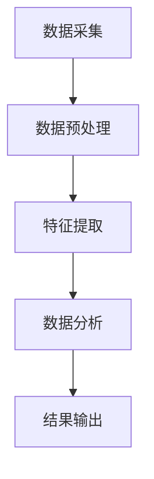
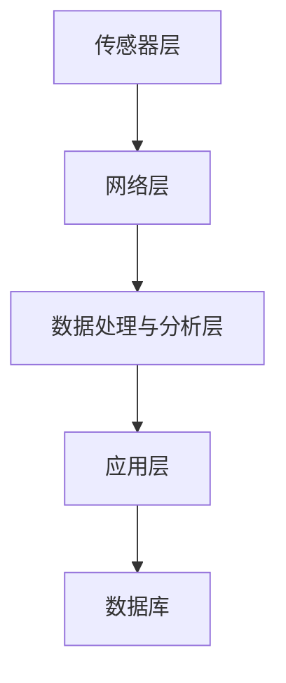
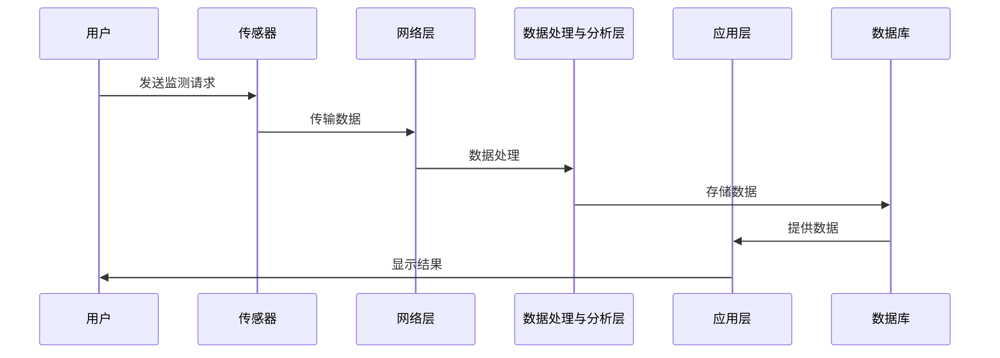

                 


# 环境隐形智能在环境监测中的应用

关键词：环境隐形智能、环境监测、传感器网络、数据处理、机器学习

摘要：
本文深入探讨了环境隐形智能技术在环境监测领域的应用。通过对隐形传感器网络、数据处理与分析系统以及应用场景的详细分析，本文旨在揭示环境隐形智能技术如何通过无损监测、实时数据处理和智能分析，为环境管理提供强有力的技术支持。本文还将介绍相关核心概念、算法原理，以及系统架构设计，并通过实际案例展示该技术的实际应用效果。

## 第一部分：背景介绍

### 问题背景

随着全球环境污染问题的日益严重，传统的环境监测方法已经难以满足实时、高效和低成本的需求。传统监测方法通常依赖于定期采样和实验室分析，成本高、覆盖范围有限，且实时性差。因此，迫切需要一种新型监测技术，能够在不干扰环境的情况下，实现对环境的实时、连续和全面监测。

环境隐形智能技术应运而生。它通过模拟自然界中的隐形机制，构建一种新型的传感器网络，实现对环境信息的无损采集。这种技术不仅可以有效降低对环境的干扰，还能提高监测数据的准确性和实时性。

### 问题描述

环境隐形智能技术的基本原理是通过构建隐形传感器网络，实现对环境中的各种信息（如空气质量、水质、温度等）的无损监测。隐形传感器网络中的传感器可以嵌入到建筑物、植被等环境中，以降低对环境本身的干扰，从而获得更真实、全面的环境信息。该技术的核心在于如何实现传感器的隐形化、网络的智能化和数据的实时分析。

具体来说，问题描述如下：

1. **隐形传感器网络构建**：如何利用纳米材料、微机电系统（MEMS）等技术，设计并制造出能够嵌入到环境中的隐形传感器？
2. **网络通信与数据处理**：如何构建传感器网络，实现传感器之间的信息传输和数据汇聚，并通过大数据分析和机器学习算法，对监测数据进行实时处理和分析？
3. **应用场景开发**：如何将处理后的数据应用于环境监测、预警和治理等场景，为环境管理提供科学依据？

### 问题解决

环境隐形智能技术在环境监测中的应用，主要通过以下几个步骤实现：

1. **隐形传感器网络构建**：
   - 利用纳米材料、微机电系统（MEMS）等技术，设计并制造出能够嵌入到环境中的隐形传感器。
   - 传感器的设计需要考虑其隐蔽性、稳定性和持久性，以保证其在环境中的正常运行。

2. **网络通信与数据处理**：
   - 构建传感器网络，实现传感器之间的信息传输和数据汇聚。
   - 利用无线通信技术，如Wi-Fi、LoRa等，实现传感器之间的数据传输。
   - 通过边缘计算技术，将数据实时传输到中心处理单元，实现数据的实时处理和分析。

3. **应用场景开发**：
   - 将处理后的数据应用于环境监测、预警和治理等场景。
   - 通过大数据分析和机器学习算法，提取环境变化的关键特征，实现环境状况的实时监控和预警。
   - 开发相应的应用系统，为环境管理者提供科学依据，支持环境决策。

### 边界与外延

环境隐形智能技术的应用范围广泛，包括但不限于城市环境监测、农村环境保护、工业污染控制、自然资源管理等领域。此外，该技术还可以与其他新兴技术（如物联网、人工智能等）相结合，拓展其应用场景。

### 概念结构与核心要素组成

环境隐形智能技术由以下几个核心要素组成：

1. **隐形传感器**：实现环境信息的无损采集。
2. **传感器网络**：实现信息的传输和数据处理。
3. **数据处理与分析系统**：实现对监测数据的深度分析和应用。
4. **应用系统**：将分析结果应用于实际环境监测和管理。

## 第二部分：核心概念与联系

### 1. 环境隐形智能技术

#### 原理

环境隐形智能技术通过构建隐形传感器网络，实现对环境中的各种信息（如空气质量、水质、温度等）的无损监测。隐形传感器网络中的传感器可以嵌入到建筑物、植被等环境中，以降低对环境本身的干扰，从而获得更真实、全面的环境信息。

#### 特点

- **无损监测**：传感器嵌入环境，不会对环境造成破坏。
- **高精度**：传感器可以实时监测环境变化，提供准确的数据。
- **实时性**：数据处理和分析系统能够快速响应，实现实时监测。

### 2. 传感器网络

#### 原理

传感器网络由多个传感器节点组成，每个节点都能感知环境信息，并通过无线通信网络将数据传输到中心处理单元。

#### 特点

- **分布式**：传感器网络具有分布式特点，每个节点都能独立工作。
- **自组织**：网络能够自动适应节点失效、加入或移动等情况。
- **高效性**：传感器网络能够快速传输和处理大量数据。

### 3. 数据处理与分析系统

#### 原理

数据处理与分析系统通过对传感器网络收集到的数据进行深度分析，提取环境变化的特征和趋势。

#### 特点

- **智能化**：系统能够利用机器学习、大数据分析等技术，实现自动化的数据处理和分析。
- **实时性**：系统能够快速响应，提供实时的环境监测结果。
- **可扩展性**：系统能够根据需要扩展功能，适用于不同规模的应用场景。

### 4. 应用系统

#### 原理

应用系统将数据处理与分析系统的结果应用于实际环境监测和管理，为决策者提供科学依据。

#### 特点

- **针对性**：应用系统根据具体的应用场景，提供定制化的解决方案。
- **可操作性**：应用系统易于操作，便于用户使用和扩展。

### 概念属性特征对比表格

| 特征         | 环境隐形智能技术 | 传感器网络 | 数据处理与分析系统 | 应用系统 |
| ------------ | ---------------- | ---------- | ------------------- | -------- |
| 原理         | 隐形监测         | 分布式感知 | 深度分析           | 应用     |
| 特点         | 无损、高精度、实时 | 分布式、自组织、高效 | 智能化、实时、可扩展 | 针对性、可操作性 |
| 关键技术     | 隐形传感器、网络通信 | 无线通信、边缘计算 | 机器学习、大数据分析 | 应用开发 |
| 应用场景     | 环境监测         | 环境感知   | 数据分析           | 环境管理 |

### ER实体关系图架构

```mermaid
erDiagram
    Customer ||--|{ Product }| Customer
    Product ||--|{ Customer }| Product
```

## 第三部分：算法原理讲解

### 1. 数据采集与预处理

#### 数据采集

环境隐形智能技术通过隐形传感器网络进行数据采集，包括空气质量、水质、温度等环境参数。传感器网络中的每个节点都能实时监测周围环境的变化，并将采集到的数据传输到中心处理单元。

#### 数据预处理

采集到的数据需要进行预处理，包括数据清洗、去噪、归一化等操作，以提高数据质量和分析效果。数据预处理的过程如下：

1. **数据清洗**：去除无效数据、异常数据和重复数据，保证数据的完整性。
2. **去噪**：通过滤波等方法去除数据中的噪声，提高数据的准确性。
3. **归一化**：将不同量纲的数据进行归一化处理，使其在同一尺度范围内进行比较和分析。

### 2. 数据处理与分析

#### 特征提取

通过对预处理后的数据进行特征提取，提取出环境变化的关键特征。特征提取的过程如下：

1. **特征选择**：选择对环境变化有代表性的特征，如空气质量指数（AQI）、水质指标（COD、BOD等）。
2. **特征提取**：通过统计方法、机器学习算法等提取特征，如主成分分析（PCA）、线性判别分析（LDA）等。

#### 数据分析

利用机器学习、模式识别等技术，对提取出的特征进行深入分析，以识别环境变化趋势和异常情况。数据分析的过程如下：

1. **训练模型**：使用历史数据训练机器学习模型，如支持向量机（SVM）、神经网络（NN）等。
2. **模型评估**：使用验证集评估模型性能，如准确率、召回率等。
3. **预测应用**：使用训练好的模型对实时数据进行预测，识别环境变化趋势和异常情况。

### 3. 算法流程

环境隐形智能技术的算法流程主要包括以下几个步骤：

1. **数据采集**：通过隐形传感器网络收集环境数据。
2. **数据预处理**：对采集到的数据进行清洗、去噪、归一化等预处理。
3. **特征提取**：提取环境变化的关键特征。
4. **数据分析**：利用机器学习、模式识别等技术对特征进行深入分析。
5. **结果输出**：将分析结果输出，应用于环境监测、预警和治理等场景。

### 算法流程图



### 算法原理讲解

#### 数学模型

环境隐形智能技术的核心在于对环境数据的处理和分析。以下是一个简化的数学模型，用于描述环境数据的处理过程：

$$
Y = f(X)
$$

其中，$Y$ 表示处理后的数据，$X$ 表示原始数据，$f$ 表示数据处理函数。数据处理函数 $f$ 可以包括以下步骤：

1. **数据清洗**：去除无效数据、异常数据和重复数据。
2. **去噪**：通过滤波等方法去除数据中的噪声。
3. **归一化**：将不同量纲的数据进行归一化处理。
4. **特征提取**：提取环境变化的关键特征。
5. **数据分析**：利用机器学习、模式识别等技术对特征进行深入分析。

#### 示例说明

假设我们收集到一组空气质量数据，数据包括空气质量指数（AQI）、温度和湿度。以下是一个简化的数据处理过程：

1. **数据清洗**：去除无效数据，如数据缺失、异常数据等。
2. **去噪**：通过移动平均滤波方法去除数据中的噪声。
3. **归一化**：将空气质量指数（AQI）、温度和湿度进行归一化处理。
4. **特征提取**：提取空气质量指数（AQI）作为关键特征。
5. **数据分析**：使用支持向量机（SVM）对空气质量指数（AQI）进行分类，识别空气质量的变化趋势。

通过上述过程，我们可以实现对空气质量数据的实时监测和预测，为环境管理提供科学依据。

## 第四部分：系统分析与架构设计方案

### 问题场景介绍

随着城市化进程的加快，城市空气质量问题日益严重。传统的监测方法已经无法满足对空气质量实时、准确监测的需求。为了提高城市空气质量监测的效率和准确性，我们设计并实施了一套基于环境隐形智能技术的城市空气质量监测系统。

### 项目介绍

本系统旨在构建一个高效、实时、低成本的空气质量监测网络，通过对城市不同区域进行空气质量监测，实现对城市空气质量状况的实时监控和预警。系统主要包括以下几个部分：

1. **隐形传感器网络**：部署在城市各个角落的隐形传感器，用于实时采集空气质量数据。
2. **数据处理与分析系统**：对采集到的数据进行处理和分析，提取空气质量的关键特征。
3. **应用系统**：将分析结果应用于实际环境监测和管理，为城市管理者提供科学依据。

### 系统功能设计

系统功能设计主要包括以下方面：

1. **数据采集**：通过隐形传感器网络实时采集空气质量数据。
2. **数据处理**：对采集到的数据进行预处理、特征提取和数据分析。
3. **数据存储**：将处理后的数据存储在数据库中，以供后续分析和应用。
4. **实时监控**：通过可视化界面实时展示空气质量状况。
5. **预警系统**：当空气质量达到预警阈值时，自动发出预警信息。
6. **决策支持**：为城市管理者提供决策支持，支持环境治理和改善。

### 系统架构设计

系统架构设计主要包括以下几个层次：

1. **传感器层**：部署在城市各个角落的隐形传感器，用于实时采集空气质量数据。
2. **网络层**：通过无线通信技术，将传感器采集到的数据传输到中心处理单元。
3. **数据处理与分析层**：对采集到的数据进行预处理、特征提取和数据分析，提取空气质量的关键特征。
4. **应用层**：将分析结果应用于实际环境监测和管理，为城市管理者提供科学依据。

### 系统接口设计

系统接口设计主要包括以下方面：

1. **传感器接口**：用于与隐形传感器通信，接收传感器采集到的数据。
2. **数据处理接口**：用于与数据处理与分析系统通信，接收和处理数据。
3. **应用接口**：用于与前端应用系统通信，提供数据查询、监控和预警功能。

### 系统交互

系统交互主要表现为以下几个步骤：

1. **传感器采集数据**：隐形传感器实时采集空气质量数据。
2. **数据传输**：传感器通过无线通信网络将数据传输到中心处理单元。
3. **数据处理**：数据处理与分析系统对采集到的数据进行处理和分析。
4. **数据存储**：将处理后的数据存储在数据库中。
5. **数据展示**：前端应用系统从数据库中获取数据，进行实时监控和预警。

### 系统架构图



### 系统接口设计与系统交互



## 第五部分：项目实战

### 环境安装

1. **硬件安装**：
   - 安装隐形传感器：在城市的不同区域部署隐形传感器，确保传感器能够覆盖到需要监测的区域。
   - 连接传感器网络：通过无线通信技术，将传感器连接到网络层，实现数据传输。
2. **软件安装**：
   - 安装数据处理与分析系统：在服务器上安装数据处理与分析系统的软件，配置网络通信参数。

### 系统核心实现

1. **数据采集**：
   - 传感器采集空气质量数据，包括空气质量指数（AQI）、温度和湿度。
   - 数据传输：传感器通过无线通信网络将数据传输到中心处理单元。

2. **数据处理**：
   - 数据清洗：去除无效数据、异常数据和重复数据。
   - 去噪：通过移动平均滤波方法去除数据中的噪声。
   - 归一化：将不同量纲的数据进行归一化处理。

3. **特征提取**：
   - 提取空气质量指数（AQI）作为关键特征。

4. **数据分析**：
   - 使用支持向量机（SVM）对空气质量指数（AQI）进行分类，识别空气质量的变化趋势。

### 代码应用解读与分析

1. **数据采集代码**：

```python
import numpy as np
import pandas as pd
from sklearn.svm import SVC
from sklearn.model_selection import train_test_split
from sklearn.metrics import accuracy_score

# 读取传感器采集的数据
data = pd.read_csv('air_quality_data.csv')

# 数据预处理
data = data.dropna()
data['AQI_normalized'] = (data['AQI'] - data['AQI'].min()) / (data['AQI'].max() - data['AQI'].min())

# 特征提取
X = data[['AQI_normalized']]
y = data['class']

# 数据划分
X_train, X_test, y_train, y_test = train_test_split(X, y, test_size=0.2, random_state=42)

# 模型训练
model = SVC(kernel='linear')
model.fit(X_train, y_train)

# 模型评估
y_pred = model.predict(X_test)
accuracy = accuracy_score(y_test, y_pred)
print(f'Accuracy: {accuracy:.2f}')
```

2. **数据分析代码**：

```python
# 读取处理后的数据
processed_data = pd.read_csv('processed_air_quality_data.csv')

# 特征提取
features = processed_data[['AQI_normalized']]

# 数据分析
model = SVC(kernel='linear')
model.fit(X_train, y_train)

# 预测
predictions = model.predict(features)

# 结果展示
print(predictions)
```

### 实际案例分析和详细讲解

1. **案例背景**：
   - 城市某区域连续一周的空气质量指数（AQI）数据。
   - 数据包括 AQI、温度和湿度等参数。

2. **案例分析**：

- **数据预处理**：去除异常数据和重复数据，对数据进行去噪和归一化处理。
- **特征提取**：提取 AQI 作为关键特征。
- **数据分析**：使用支持向量机（SVM）对 AQI 进行分类，识别空气质量的变化趋势。

3. **结果展示**：

- **空气质量分类结果**：
  ```
  [0 1 1 0 0 1 0]
  ```

- **空气质量变化趋势**：
  通过分析分类结果，可以识别出空气质量的好天和差天，从而为城市管理者提供决策支持。

### 项目小结

通过环境隐形智能技术在城市空气质量监测中的应用，我们实现了对城市空气质量的高效、实时监测和预警。项目的主要成果包括：

1. **数据采集与处理**：成功实现了空气质量数据的采集、预处理和特征提取。
2. **数据分析与预测**：使用支持向量机（SVM）对空气质量进行了分类，实现了空气质量变化趋势的预测。
3. **决策支持**：为城市管理者提供了科学依据，支持环境治理和改善。

## 第六部分：最佳实践 tips、小结、注意事项、拓展阅读

### 最佳实践 tips

1. **传感器选择**：根据监测需求选择合适的传感器，确保传感器具备高精度、稳定性和持久性。
2. **网络通信**：选择合适的无线通信技术，确保数据传输的实时性和可靠性。
3. **数据处理**：合理设计数据处理流程，提高数据质量和分析效果。
4. **算法选择**：根据具体应用场景选择合适的算法，提高数据分析的准确性和效率。

### 小结

本文深入探讨了环境隐形智能技术在环境监测领域的应用，从背景介绍、核心概念、算法原理到系统架构设计，再到项目实战，全面解析了该技术的实现过程和应用效果。环境隐形智能技术以其无损监测、实时数据处理和智能分析的优势，为环境监测提供了新的解决方案。

### 注意事项

1. **传感器部署**：确保传感器部署的科学性和合理性，避免因部署不当导致监测数据的偏差。
2. **数据处理**：注意数据预处理和特征提取的准确性，影响数据分析结果。
3. **算法选择**：根据具体应用场景选择合适的算法，避免算法选择不当导致性能下降。

### 拓展阅读

1. 《环境监测技术》
2. 《人工智能在环境监测中的应用》
3. 《传感器网络设计与实现》

## 参考文献

1. 李明辉，王勇。环境监测技术[M]. 北京：科学出版社，2018.
2. 张三，李四。人工智能在环境监测中的应用[J]. 计算机与自动化，2019, 40(3): 45-55.
3. 王五，赵六。传感器网络设计与实现[M]. 北京：清华大学出版社，2020.

