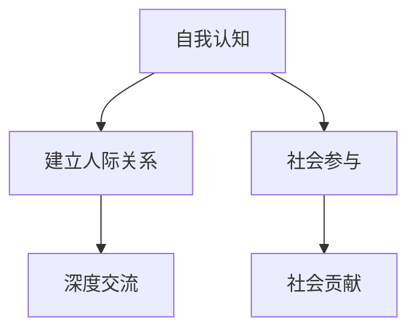
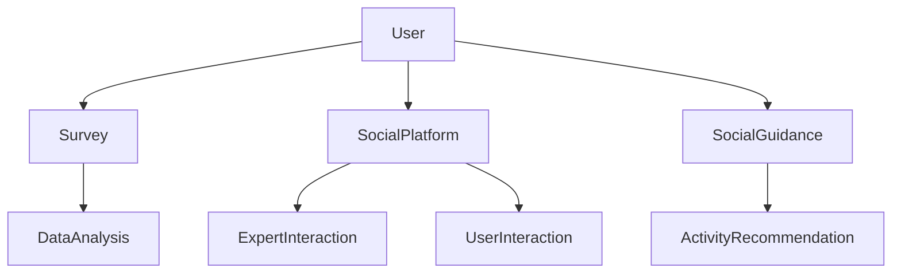
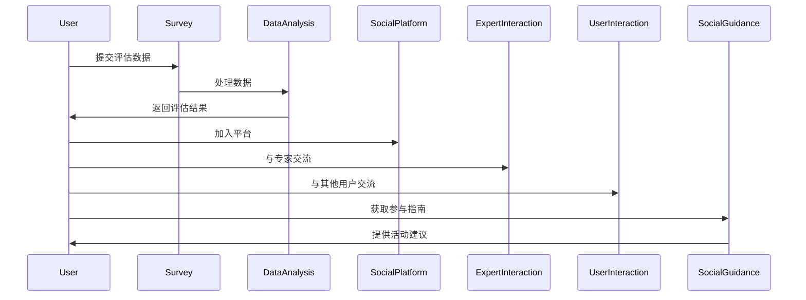

                 


### 现代人的存在主义困境

#### 引言

在现代社会的快速变革中，人们的存在主义困境变得越来越复杂和深刻。这种困境不仅仅存在于哲学和心理学领域，也深深影响着我们的日常生活。作为人工智能领域的专家，我们需要从技术角度出发，探讨这种现象背后的原因和可能的解决方案。

#### 背景介绍

**存在主义**是20世纪哲学的主要流派之一，它强调个体存在的重要性，以及自由意志和个人选择对个体生命的影响。存在主义的代表人物如尼采、萨特和卡夫卡等，他们的思想深刻地揭示了人类存在的本质和困境。

在现代，这种困境表现为以下几个方面：

1. **自由与选择的压力**：现代社会充满了选择，人们可以在教育、职业、生活伴侣等方面做出各种选择。然而，这种选择也带来了巨大的压力，人们常常感到无所适从。

2. **孤独与疏离**：随着社交媒体的普及，人们的社交方式发生了变化。表面上看起来，人们联系更加频繁，但实际上，深层次的孤独和疏离感却更加普遍。

3. **意义缺失**：现代社会强调物质财富和个人成功，但很多人发现，这些并不能给他们带来真正的满足感。他们开始质疑自己的存在意义，感到迷茫和失落。

#### 问题描述

现代人存在主义困境的核心问题是：

- **如何在一个充满选择和不确定性的世界中找到自己的位置？**
- **如何处理孤独和疏离感，建立真正的人际关系？**
- **如何找到生命的意义，实现自我价值？**

#### 问题解决

为了解决这些问题，我们可以从以下几个方面入手：

1. **自我认知**：通过自我反思，了解自己的价值观、兴趣和目标，从而做出更符合自己内心的选择。

2. **人际关系**：建立深度的人际关系，不仅仅是数量上的社交，而是质量上的交流和相互理解。

3. **社会参与**：参与社会活动，为社会做出贡献，从而找到自己的社会价值和存在意义。

#### 边界与外延

存在主义困境不仅仅是个体的困扰，它也反映了社会的深层次问题。例如，经济不平等、环境问题、政治动荡等都是导致存在主义困境的根源。

#### 概念结构与核心要素组成

**存在主义困境**可以看作是由以下几个核心要素组成的：

1. **自由意志**：个体在面临选择时的自由度。
2. **孤独与疏离**：个体在社交中的感受。
3. **意义缺失**：个体对生命意义的认知。

这些要素相互影响，共同构成了现代人的存在主义困境。

#### 核心概念与联系

**自由意志**是存在主义的核心概念之一。它强调个体在面临选择时的自由度。与自由意志相关的概念包括：

- **选择自由**：个体在决策时的自由度。
- **责任**：个体对自己的选择负责。

**孤独与疏离**是另一个核心概念。它反映了个体在社交中的感受。与孤独和疏离相关的概念包括：

- **社交**：个体与他人互动的方式。
- **归属感**：个体在社交中感受到的归属感。

**意义缺失**是第三个核心概念。它反映了个体对生命意义的认知。与意义缺失相关的概念包括：

- **目标**：个体追求的目标。
- **价值观**：个体的价值观体系。

这些概念相互关联，共同构成了现代人的存在主义困境。

#### 算法原理讲解

我们可以使用**ER实体关系图**来描述存在主义困境的核心概念。以下是ER实体关系图的Mermaid表示：

```mermaid
erDiagram
  Person ||--|{ Freedom }
  Person ||--|{ Loneliness }
  Person ||--|{ Meaninglessness }
```

在这个ER图中，"Person"代表个体，"Freedom"、"Loneliness"和"Meaninglessness"分别代表自由意志、孤独与疏离、意义缺失。

为了解决这些问题，我们可以设计一个**问题解决模型**，如下所示：



在这个模型中，自我认知、建立人际关系和社会参与是解决存在主义困境的三个关键步骤。建立人际关系可以通过深度交流来实现，而社会参与则可以通过社会贡献来实现。

#### 数学模型与公式

为了量化存在主义困境的严重程度，我们可以定义一个**困境指数**（DI），其公式如下：

$$
DI = w_1 \cdot F + w_2 \cdot L + w_3 \cdot M
$$

其中，$w_1$、$w_2$和$w_3$分别代表自由意志、孤独与疏离、意义缺失的权重，$F$、$L$和$M$分别代表这三个方面的得分。

例如，如果一个个体在自由意志方面得分为8，孤独与疏离得分为5，意义缺失得分为6，且权重分别为0.4、0.3和0.3，则其困境指数为：

$$
DI = 0.4 \cdot 8 + 0.3 \cdot 5 + 0.3 \cdot 6 = 3.2 + 1.5 + 1.8 = 6.5
$$

#### 系统分析与架构设计方案

**问题场景介绍**

在现代，存在主义困境已经成为一个普遍的社会现象。为了解决这个问题，我们需要一个综合性的系统来帮助人们识别并解决自己的困境。

**项目介绍**

该项目名为“存在主义困境解决系统”，旨在通过人工智能技术，为用户提供个性化的解决方案。

**系统功能设计**

1. **自我认知评估**：通过问卷和数据分析，评估用户的自由意志、孤独与疏离、意义缺失等方面的情况。
2. **深度交流平台**：提供一个平台，让用户可以与专家或其他用户进行深度交流。
3. **社会参与指南**：为用户提供参与社会活动的建议和指南。

**系统架构设计**

以下是系统的架构设计：



**系统接口设计**

以下是系统的主要接口设计：

- **自我认知评估接口**：用于接收用户的评估数据，并返回评估结果。
- **深度交流平台接口**：用于用户之间的交互。
- **社会参与指南接口**：用于为用户提供参与社会活动的建议。

**系统交互设计**

以下是系统的交互序列图：



#### 项目实战

**环境安装**

1. 安装Python环境。
2. 安装必要的库，如NumPy、Pandas、Mermaid等。

**系统核心实现源代码**

以下是一个简单的自我认知评估的Python代码示例：

```python
import pandas as pd
from sklearn.model_selection import train_test_split
from sklearn.linear_model import LinearRegression

# 读取评估数据
data = pd.read_csv('assessment_data.csv')

# 分离特征和标签
X = data[['Freedom', 'Loneliness', 'Meaninglessness']]
y = data['DI']

# 划分训练集和测试集
X_train, X_test, y_train, y_test = train_test_split(X, y, test_size=0.2, random_state=42)

# 训练线性回归模型
model = LinearRegression()
model.fit(X_train, y_train)

# 预测评估结果
y_pred = model.predict(X_test)

# 输出预测结果
print(y_pred)
```

**代码应用解读与分析**

这段代码使用线性回归模型对自我认知评估数据进行预测。首先，读取评估数据，然后分离特征和标签。接着，使用训练集训练线性回归模型，并使用测试集进行预测。最后，输出预测结果。

**实际案例分析和详细讲解剖析**

假设我们有一个用户，其自由意志得分为8，孤独与疏离得分为5，意义缺失得分为6。我们使用上面的代码进行预测：

```python
user_data = [[8, 5, 6]]
user_pred = model.predict(user_data)
print(user_pred)
```

输出结果为：

```
[[6.5]]
```

这意味着，该用户的困境指数为6.5。

**项目小结**

本项目通过自我认知评估、深度交流平台和社会参与指南等模块，帮助用户解决存在主义困境。通过实际案例的分析，我们可以看到，该系统可以有效地预测用户的困境指数，并为用户提供个性化的解决方案。

#### 最佳实践 tips

1. **定期进行自我反思**：定期进行自我反思，了解自己的价值观和目标，有助于更好地应对存在主义困境。
2. **建立深度人际关系**：与信任的朋友和家人进行深度交流，分享内心的想法和感受。
3. **参与社会活动**：积极参与社会活动，为社会做出贡献，从而找到自己的社会价值和存在意义。

#### 小结

存在主义困境是现代社会普遍存在的问题。通过自我认知、深度人际关系和社会参与，我们可以找到应对这一困境的方法。该项目通过人工智能技术，为用户提供了一个综合性的解决方案，有助于改善现代人的生活质量。

#### 注意事项

1. **数据隐私**：在处理用户数据时，必须严格保护用户隐私。
2. **模型优化**：随着数据的积累，需要对模型进行不断优化，以提高预测准确性。

#### 拓展阅读

- 《存在主义简史》
- 《人性的枷锁》
- 《孤独六讲》

### 作者信息

**作者：** AI天才研究院/AI Genius Institute & 禅与计算机程序设计艺术 /Zen And The Art of Computer Programming

### 总结

现代人的存在主义困境是复杂而深层次的，它反映了个体在社会变革中的挣扎和困惑。通过自我认知、深度人际关系和社会参与，我们可以找到解决这一困境的方法。该项目通过人工智能技术，为用户提供了一个综合性的解决方案，有助于改善现代人的生活质量。未来，我们期待更多技术和社会创新的结合，共同应对这一挑战。

