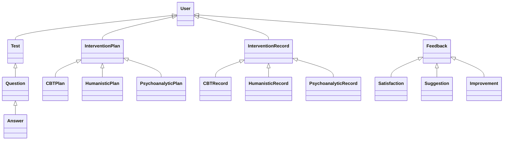
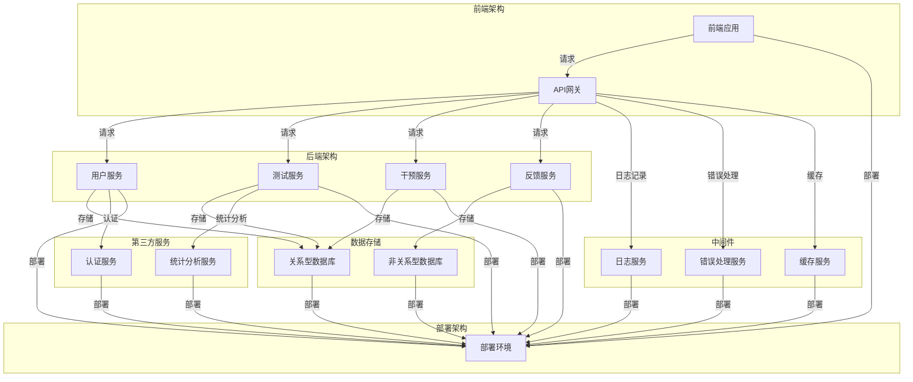

                 

# 现代人的存在焦虑：如何与之和解

关键词：存在焦虑、心理干预、存在主义、认知行为疗法、人本主义心理学

摘要：随着现代社会的快速发展，存在焦虑已经成为影响现代人生活质量的重要心理问题。本文旨在深入探讨存在焦虑的背景、定义、影响及解决方法。通过分析存在主义哲学、心理学理论与方法，结合具体的算法原理和数学模型，提出一种系统性解决存在焦虑的方法。文章最后通过项目实战和最佳实践 tips，为读者提供切实可行的缓解存在焦虑的建议。

### 目录大纲

# 现代人的存在焦虑：如何与之和解

## 第一部分：问题背景与核心概念

### 1.1 存在焦虑的背景

- **社会变迁**：现代社会的快速变迁，信息爆炸，个体面临前所未有的压力。
- **心理健康问题**：存在焦虑已成为一种普遍的心理健康问题，影响生活质量。
- **个体自我认知**：个体自我认知的变化，追求个人价值与社会价值的平衡。

### 1.2 存在焦虑的定义与特征

- **定义**：存在焦虑是对存在的根本问题、意义和目的的担忧和恐惧。
- **特征**：心理紧张、无意义感、对未来的不确定性。

### 1.3 存在焦虑的影响

- **心理层面**：情绪波动、自我怀疑、自尊心受损。
- **社会层面**：人际关系的紧张、职业发展受阻。

### 1.4 存在焦虑的边界与外延

- **边界**：存在焦虑与普通焦虑、抑郁症的区别。
- **外延**：存在焦虑在不同文化和个体中的表现形式。

## 第二部分：核心概念与联系

### 2.1 存在主义哲学

- **存在主义哲学**：对存在焦虑的理论基础。
- **主要存在主义哲学家**：海德格尔、萨特、克尔凯郭尔。
- **存在主义的核心观点**：存在先于本质、自由意志、荒谬感。

### 2.2 心理学理论与方法

- **认知行为疗法**：如何通过认知重构减轻存在焦虑。
- **人本主义心理学**：强调个体的自我实现和存在价值。
- **精神分析疗法**：对存在焦虑的深层心理分析。

### 2.3 存在焦虑与心理健康

- **心理健康**：如何通过心理干预减轻存在焦虑。
- **心理咨询**：存在焦虑的咨询策略和技巧。

## 第三部分：算法原理与数学模型

### 3.1 认知行为疗法算法原理

- **认知重构**：如何通过改变思维模式减轻焦虑。
- **行为激活**：通过积极行为改变焦虑状态。

### 3.2 人本主义心理学算法原理

- **自我实现**：个体如何通过自我探索实现心理平衡。
- **意义建构**：如何找到存在的意义减轻焦虑。

### 3.3 精神分析疗法算法原理

- **潜意识探索**：如何通过潜意识分析理解焦虑。
- **冲突解决**：如何通过解决内心冲突减轻焦虑。

### 3.4 数学模型与公式

- **认知行为疗法公式**：焦虑程度 = 认知偏差 × 情感反应。
- **人本主义心理学公式**：存在价值 = 自我实现 + 社会认可。
- **精神分析疗法公式**：焦虑根源 = 潜意识冲突。

## 第四部分：系统分析与架构设计方案

### 4.1 问题场景介绍

- **存在焦虑解决场景**：个体如何通过心理干预解决焦虑。

### 4.2 系统功能设计

- **领域模型**：存在焦虑干预的领域模型。
- **类图**：领域模型的类图展示。

### 4.3 系统架构设计

- **架构图**：系统整体架构设计。
- **接口设计**：系统关键接口设计。

### 4.4 系统交互设计

- **序列图**：系统交互流程设计。

## 第五部分：项目实战

### 5.1 环境安装

- **环境准备**：搭建存在焦虑干预系统所需的环境。

### 5.2 系统核心实现

- **源代码**：系统核心实现源代码。
- **代码解读**：对核心代码的解读与分析。

### 5.3 实际案例分析

- **案例一**：如何通过认知行为疗法解决存在焦虑。
- **案例二**：如何通过人本主义心理学减轻存在焦虑。
- **案例三**：如何通过精神分析疗法理解存在焦虑。

### 5.4 项目小结

- **总结**：项目实施过程中的经验与教训。

## 第六部分：最佳实践 tips

### 6.1 心理健康维护

- **日常实践**：如何通过日常习惯维护心理健康。
- **自我调适**：如何通过自我调适减轻存在焦虑。

### 6.2 小组讨论与分享

- **小组讨论**：如何通过小组讨论减轻存在焦虑。
- **分享经验**：如何通过分享经验增强心理韧性。

### 6.3 拓展阅读

- **推荐书籍**：与存在焦虑相关的推荐书籍。
- **学术论文**：与存在焦虑相关的推荐学术论文。

----------------------------------------------------------------

## 第一部分：问题背景与核心概念

### 1.1 存在焦虑的背景

现代社会的快速发展给人们带来了前所未有的机遇和挑战。然而，随着社会的变迁，个体面临的问题和压力也在不断增加。存在焦虑作为一种常见的心理健康问题，正是在这种背景下逐渐显现出来的。

首先，社会变迁是导致存在焦虑的重要原因之一。现代社会信息爆炸，知识更新迅速，个体需要不断学习新知识和技能来适应快速变化的环境。这种持续的适应性要求给个体带来了巨大的压力，导致存在焦虑的产生。此外，现代社会竞争激烈，个体在职业、社交、家庭等方面都需要面对各种挑战和不确定性，这些因素也会加剧存在焦虑的症状。

其次，心理健康问题在现代社会中越来越受到关注。随着人们对心理健康的重视，存在焦虑已经成为一种普遍的心理健康问题。存在焦虑不仅影响个体的情绪和心理健康，还会对个体的日常生活和工作产生负面影响。焦虑、抑郁、自我怀疑等情绪问题的出现，使得个体感到无意义感和对未来的不确定性，从而加重了存在焦虑的症状。

最后，个体自我认知的变化也是导致存在焦虑的重要因素之一。在现代社会，个体越来越注重个人价值和社会价值的平衡。个体需要在追求个人成就的同时，也要关注社会对个体的期待和认可。然而，这种平衡并非易事，个体往往在追求个人价值和社会价值的矛盾中感到迷茫和焦虑。

综上所述，社会变迁、心理健康问题和个体自我认知的变化，共同构成了存在焦虑的背景。现代社会快速发展带来的压力和不确定性，使得个体更容易产生存在焦虑，从而影响其心理健康和生活质量。

### 1.2 存在焦虑的定义与特征

存在焦虑，作为一种特殊的心理现象，其定义和特征具有一定的复杂性和多样性。首先，我们需要明确存在焦虑的定义。存在焦虑，又称存在主义焦虑，是一种对存在的根本问题、意义和目的的担忧和恐惧。它不同于普通的焦虑症状，而是一种更为深层次、更为普遍的心理体验。

存在焦虑的特征可以从以下几个方面进行描述：

首先，心理紧张是存在焦虑的主要特征之一。个体在面对存在的未知和不确定性时，常常会感到心理上的紧张和焦虑。这种紧张感并非由某一具体事件或情境引起，而是源自对存在本身的担忧和恐惧。例如，个体可能会担心自己的生命是否有意义，是否存在某种超越自我的更高目的，这种对存在意义的追问往往会导致心理上的紧张和焦虑。

其次，无意义感也是存在焦虑的一个重要特征。在现代社会，个体面临的竞争压力和社会期待使得他们在追求个人成就的同时，也常常感到自己的存在缺乏意义。个体可能会质疑自己的存在价值，感到自己在社会中的位置和角色并不重要，从而产生无意义感。这种感觉往往会导致个体对自己的存在感到迷茫和困惑，进而加重焦虑情绪。

最后，对未来的不确定性是存在焦虑的另一个显著特征。在现代社会，个体面临的不确定性和风险因素越来越多，这使得他们对未来充满担忧。例如，个体可能会担心自己的职业发展、人际关系、健康状况等，这些不确定性因素会使得个体对未来的预期感到不安，进而引发焦虑情绪。

总之，存在焦虑是一种复杂的心理现象，它具有心理紧张、无意义感和对未来的不确定性等特征。这种焦虑不仅影响个体的心理健康，还会对他们的日常生活和工作产生负面影响。理解存在焦虑的定义和特征，有助于我们更好地应对和缓解这一问题。

### 1.3 存在焦虑的影响

存在焦虑作为一种深层次的心理现象，对个体的心理和社会层面都产生了深远的影响。首先，从心理层面来看，存在焦虑会导致个体出现一系列情绪和行为问题。焦虑和紧张感会干扰个体的情绪稳定，使他们在面对压力时感到更加脆弱和无助。具体来说，存在焦虑可能导致以下几种心理问题：

1. **情绪波动**：个体在面对存在焦虑时，情绪会变得不稳定，容易陷入情绪的低谷。例如，他们可能会感到沮丧、焦虑、恐惧等负面情绪，而这些情绪的波动会进一步加重焦虑症状。

2. **自我怀疑**：存在焦虑会使个体对自己的能力和价值产生怀疑。他们可能会质疑自己的存在意义，对自己的未来感到不确定，从而影响他们的自我认同和自尊心。

3. **自尊心受损**：长期的存在焦虑会导致个体的自尊心受到严重损害。他们会感到自己在社会中的地位和价值降低，从而产生自卑感。这种自卑感会进一步加剧焦虑情绪，形成恶性循环。

其次，从社会层面来看，存在焦虑也会对个体的社会关系和职业发展产生负面影响。具体来说，存在焦虑可能导致以下几种社会问题：

1. **人际关系紧张**：存在焦虑会使个体在与他人交往时变得紧张和不安。他们可能会担心自己的行为是否符合他人的期待，从而影响他们的人际关系。此外，存在焦虑也会导致个体对他人持有过度警觉和防范的态度，使得人际关系更加紧张。

2. **职业发展受阻**：存在焦虑会影响个体的职业表现和职业发展。焦虑情绪会干扰个体的思维和行为，导致他们在工作中出现错误或失误。此外，存在焦虑还会使个体对职业发展感到不确定和迷茫，从而影响他们的职业规划和决策。

综上所述，存在焦虑对个体的心理和社会层面都产生了显著的影响。理解这些影响有助于我们更好地认识和应对存在焦虑，从而提高个体的心理健康和生活质量。

### 1.4 存在焦虑的边界与外延

在探讨存在焦虑时，了解其与其他心理问题的边界与外延是非常重要的。存在焦虑虽然具有独特的特征，但它也可能与其他类型的焦虑、抑郁症等心理问题产生交集或重叠。因此，有必要对其进行清晰的界定。

首先，存在焦虑与普通焦虑的区别在于其关注的焦点。普通焦虑通常是对特定事件或情境的反应，例如对考试、工作面试或社交场合的担忧。而存在焦虑则是对存在的根本问题、意义和目的的担忧和恐惧，它不仅仅是对某一具体事件的反应，而是对生命本身的一种深度反思。

其次，存在焦虑与抑郁症的差异主要体现在情绪和认知层面。抑郁症是一种情感障碍，个体常感到持续的悲伤、无望和无价值感。存在焦虑则更多地表现为对生命意义和存在价值的质疑，以及对未来不确定性的担忧。尽管两者都可能导致情绪低落，但抑郁症通常伴有明显的生理症状，如食欲和睡眠问题，而存在焦虑则更多地表现为认知层面的困扰。

此外，存在焦虑也可能与焦虑症、社交恐惧症等心理问题产生关联。焦虑症是一种以广泛和持续的焦虑为特征的障碍，个体可能会对未来充满恐惧和担忧。而存在焦虑则是对存在的根本问题的关注，这种焦虑可能更多地涉及对生命意义和目的的思考。

在不同文化和个体中，存在焦虑的表现形式也有所不同。在西方文化中，存在焦虑可能与个人主义价值观和自我实现的理念密切相关，个体往往在追求个人成就和自我价值的过程中感受到焦虑。而在东方文化中，集体主义价值观和对他人的依赖可能使得存在焦虑的表达方式有所不同，个体可能更多地表现出对他人的关注和社会责任感的担忧。

总之，存在焦虑与其他心理问题既有区别也有联系。明确其边界与外延有助于更好地理解和应对这一问题，为个体提供更为有效的心理干预和帮助。

## 第二部分：核心概念与联系

### 2.1 存在主义哲学

存在主义哲学作为一种重要的哲学流派，对存在焦虑的研究提供了理论基础。存在主义强调个体的存在先于其本质，意味着个体的生命和存在是自由而独特的，而不是预先设定的。这种观点与存在焦虑紧密相关，因为存在焦虑往往源于个体对自身存在意义的质疑和困惑。

首先，存在主义哲学的核心观点之一是“存在先于本质”（existence precedes essence）。这一观点由法国哲学家萨特在其著作《存在与虚无》中提出。它意味着个体首先存在于世界中，然后通过自身的行动和选择来定义自己的本质。这一观点与存在焦虑紧密相关，因为存在焦虑往往源于个体对自身存在意义的质疑。当个体感到自己的存在缺乏明确的意义和目的时，他们可能会陷入焦虑和迷茫。

其次，存在主义哲学强调“自由意志”的重要性。自由意志是指个体有能力自主地做出选择和决定。存在主义认为，个体通过自由意志选择自己的生活方式和价值观，从而定义自己的本质。然而，自由意志也带来了一种责任感，因为个体必须为自己的选择承担责任。这种责任感可能导致个体在面对存在的未知和不确定性时感到焦虑。

另外，存在主义哲学中的“荒谬感”也是解释存在焦虑的重要概念。荒谬感是指个体在面对世界的无意义和生命的无常时产生的感受。海德格尔和萨特等哲学家认为，荒谬感是人类存在的一部分，因为它揭示了人类对生命意义的追寻与世界的非理性之间的冲突。存在焦虑可以被视为荒谬感的一种表现形式，个体在追求意义和目的的过程中，往往面临着无法找到明确答案的困境，从而感到焦虑和不安。

总的来说，存在主义哲学为解释存在焦虑提供了重要的理论基础。存在先于本质、自由意志和荒谬感等核心观点，揭示了个体在面对存在的意义和目的时的焦虑和困惑。理解这些哲学概念有助于我们更深入地探讨和应对存在焦虑，为个体提供心理支持和帮助。

### 2.2 心理学理论与方法

在探讨存在焦虑的解决方法时，心理学理论和方法发挥着至关重要的作用。认知行为疗法（Cognitive Behavioral Therapy, CBT）、人本主义心理学和精神分析疗法是三种主要的心理学理论和治疗方法，它们各自提供了不同的视角和策略来应对存在焦虑。

#### 认知行为疗法（CBT）

认知行为疗法是一种以改变思维和行为模式为主要目标的疗法，其核心观点是认知过程对情感和行为有重要影响。CBT认为，焦虑情绪并非直接由外部事件引起，而是由个体对这些事件的认知评价和解释所引发的。因此，通过改变不合理的认知模式，可以减轻焦虑情绪。

在应对存在焦虑方面，CBT主要采用以下两种策略：

1. **认知重构**：认知重构是指通过识别和挑战不合理的思维模式，将其替换为更为合理和积极的思维模式。例如，个体可能会通过自我反思和认知重构，认识到生命的意义并非预先设定的，而是可以通过个人的行动和选择来创造和实现的。

2. **行为激活**：行为激活是指通过采取积极的行为和活动来改变个体的情绪状态。例如，个体可以通过参与有意义的社交活动、体育锻炼或学习新技能来提升自己的情绪和自信心，从而减轻存在焦虑。

#### 人本主义心理学

人本主义心理学强调个体的自我实现和存在价值，认为每个人都有能力通过自我探索和成长来实现自己的潜能。人本主义心理学的核心观点是“自我实现”，即个体在追求个人价值和社会价值的平衡过程中，不断实现自我潜能和成长。

在应对存在焦虑方面，人本主义心理学提供以下策略：

1. **自我探索**：个体可以通过自我反思和探索来认识自己的内心世界，理解自己的价值观和信念。这种自我探索有助于个体找到存在的意义，从而减轻焦虑情绪。

2. **意义建构**：个体可以通过寻找和建立个人生活的意义，来应对存在焦虑。例如，通过参与公益活动、追求艺术创作或探索自然之美，个体可以找到生命的意义和价值，从而提升心理韧性。

#### 精神分析疗法

精神分析疗法是一种通过分析和理解潜意识来治疗心理问题的方法。精神分析疗法认为，许多心理问题，包括存在焦虑，源于潜意识的冲突和未解决的问题。通过探索和理解潜意识，个体可以找到焦虑的根源，并采取相应的措施来解决问题。

在应对存在焦虑方面，精神分析疗法主要采用以下策略：

1. **潜意识探索**：通过自由联想和梦境分析，个体可以探索自己的潜意识，理解焦虑的根源。例如，通过分析梦境，个体可能会发现对死亡的恐惧或对父母角色的冲突，这些潜意识冲突可能是存在焦虑的根源。

2. **冲突解决**：通过潜意识探索，个体可以识别和理解潜意识中的冲突，并采取相应的措施来解决问题。例如，通过心理分析和治疗，个体可以学会如何处理和解决这些冲突，从而减轻焦虑情绪。

综上所述，认知行为疗法、人本主义心理学和精神分析疗法提供了不同的视角和策略来应对存在焦虑。这些方法通过改变思维模式、探索内心世界和解决潜意识冲突，帮助个体理解和应对存在焦虑，从而提升心理健康和生活质量。

### 2.3 存在焦虑与心理健康

存在焦虑作为一种心理健康问题，其解决需要综合考虑心理健康和心理干预两个方面。心理健康是指个体在心理上保持平衡、适应和成长的状态，而心理干预则是指通过专业的方法和技术来帮助个体改善心理健康。

首先，心理健康在应对存在焦虑中起着关键作用。心理健康良好的个体往往具有更强的心理韧性，能够更好地应对生活中的压力和挑战。他们能够积极看待生活中的困难和不确定性，而不是陷入焦虑和消极情绪。因此，维护心理健康是减轻存在焦虑的基础。以下是一些维护心理健康的方法：

1. **自我认知**：通过自我反思和认知重构，个体可以更好地了解自己的内心世界和价值观，从而找到生活的意义和目标。这有助于减轻对存在的担忧和焦虑。

2. **情绪调节**：学会情绪调节技巧，如深呼吸、冥想和放松训练，可以帮助个体在面对焦虑时保持冷静和平衡，从而减轻焦虑情绪。

3. **积极心态**：培养积极心态，关注生活中的美好和正面事物，可以提升个体的幸福感和满足感，从而减轻焦虑情绪。

其次，心理干预在解决存在焦虑中发挥着重要作用。心理干预是指通过专业的方法和技术来帮助个体改善心理健康。以下是几种常见的心理干预方法：

1. **认知行为疗法（CBT）**：认知行为疗法通过改变不合理的思维模式和认知偏差，帮助个体减轻焦虑情绪。通过认知重构和行为激活，个体可以找到更积极的应对方式，从而减轻存在焦虑。

2. **人本主义心理学**：人本主义心理学强调个体的自我实现和存在价值。通过自我探索和意义建构，个体可以找到生活的意义和价值，从而减轻存在焦虑。

3. **精神分析疗法**：精神分析疗法通过探索潜意识中的冲突和未解决的问题，帮助个体理解和解决内心的困扰，从而减轻焦虑情绪。

最后，心理咨询作为一种心理干预方式，在解决存在焦虑中具有重要作用。心理咨询提供了安全和支持的环境，个体可以在咨询师的引导下探索自己的内心世界，表达情感和困惑，并学习应对焦虑的策略和技巧。以下是一些心理咨询策略：

1. **倾听和共情**：咨询师通过倾听和共情，建立良好的咨询关系，使个体感到被理解和接受，从而减轻焦虑情绪。

2. **认知重构**：咨询师帮助个体识别和挑战不合理的认知模式，引导个体建立更积极的思维模式。

3. **行为激活**：咨询师通过制定实际可行的行为计划，帮助个体积极参与有意义的活动，从而提升情绪和自信心。

综上所述，心理健康和心理干预在解决存在焦虑中具有重要作用。通过维护心理健康和心理干预，个体可以更好地应对存在焦虑，提升心理健康和生活质量。

### 3.1 认知行为疗法算法原理

认知行为疗法（Cognitive Behavioral Therapy，简称CBT）是一种以改变认知和行为模式为主要目标的疗法，广泛应用于焦虑、抑郁等心理障碍的治疗。在解决存在焦虑方面，CBT提供了一套系统的方法和策略，通过认知重构和行为激活来减轻个体的焦虑情绪。

#### 认知重构

认知重构是CBT的核心概念之一，其基本原理是：通过识别和改变不合理的认知模式，可以减轻个体的焦虑情绪。具体步骤如下：

1. **识别不合理的认知**：个体在感到焦虑时，往往存在一些不合理的认知模式，如过度概括、灾难化思维、黑白思维等。咨询师帮助个体识别这些不合理的认知。

   - **过度概括**：将特定事件或情境泛化到整体情况，如“我失败了，我一无是处”。
   - **灾难化思维**：对潜在的负面结果进行过度的担忧，如“这次考试如果考不好，我的人生就毁了”。
   - **黑白思维**：将事物分为绝对的好与坏，如“我不是最好的，我就是一个失败者”。

2. **挑战不合理的认知**：通过逻辑分析和现实检验，咨询师帮助个体挑战和质疑这些不合理的认知。

   - **逻辑分析**：通过逻辑推理，揭示不合理认知的荒谬性，如“虽然这次考试没考好，但我还有其他成功的经历，说明我并不是一无是处”。
   - **现实检验**：通过收集现实数据和证据，验证不合理认知的真实性，如“我可以通过努力提高，这次考试考不好并不意味着我未来都会失败”。

3. **建立合理的认知**：在挑战和质疑不合理认知的基础上，咨询师帮助个体建立更合理和积极的认知模式。

   - **积极认知**：通过识别和强调积极因素，如“虽然这次考试不理想，但我学到了很多，为下一次考试做好了准备”。
   - **平衡思维**：通过综合考虑各种因素，避免过度概括和灾难化思维，如“这次考试没考好，但还有其他方面我做得很好，未来还有改进的空间”。

#### 行为激活

行为激活是CBT的另一重要策略，通过采取积极的行为和活动来改变个体的情绪状态。具体步骤如下：

1. **制定行为计划**：咨询师与个体一起制定实际可行的行为计划，包括日常活动和目标设定。

   - **日常活动**：如锻炼、社交、阅读等，这些活动有助于提升个体的情绪和生活质量。
   - **目标设定**：如学习新技能、参加兴趣小组、完成项目等，这些目标有助于个体建立成就感和自信心。

2. **执行行为计划**：个体按照行为计划执行日常活动和目标设定，通过实际行动来改善情绪状态。

   - **正向反馈**：在执行行为计划时，个体可以获得积极的反馈，如完成一项任务后感到满足和成就感，这些正向反馈有助于巩固积极行为。
   - **调整计划**：在执行过程中，个体可能会遇到困难和挑战，咨询师帮助个体调整计划，以适应实际情况。

3. **评估行为效果**：通过定期评估行为计划的效果，个体可以了解自己的进步和改进方向。

   - **情绪评估**：通过情绪日记或其他评估工具，个体可以记录自己的情绪变化，了解行为对情绪的影响。
   - **行为调整**：根据评估结果，个体可以调整行为计划，以更好地应对焦虑情绪。

#### 算法原理

认知行为疗法的基本算法原理可以概括为：

- **焦虑程度 = 认知偏差 × 情感反应**

  - **认知偏差**：指个体在认知过程中存在的不合理思维模式，如过度概括、灾难化思维等。
  - **情感反应**：指个体在感受到认知偏差时产生的情绪反应，如焦虑、恐惧等。

  通过改变认知偏差和调整情感反应，可以减轻个体的焦虑程度。具体算法如下：

  ```python
  def reduce_anxiety(cognitive_bias, emotional_response):
      # 认知重构
      rational_thoughts = challenge_cognitive_bias(cognitive_bias)
      
      # 情感调节
      adjusted_emotional_response = adjust_emotional_response(emotional_response, rational_thoughts)
      
      # 计算新的焦虑程度
      anxiety_level = cognitive_bias * adjusted_emotional_response
      
      return anxiety_level
  ```

  - **challenge_cognitive_bias()**：挑战和质疑不合理的认知偏差。
  - **adjust_emotional_response()**：调整情感反应，使其更为合理和积极。

通过认知重构和行为激活，认知行为疗法提供了一种系统的方法来减轻存在焦虑。通过识别和改变不合理的认知模式，以及通过积极的行为和活动来改变情绪状态，个体可以逐步克服存在焦虑，提升心理健康和生活质量。

### 3.2 人本主义心理学算法原理

人本主义心理学强调个体的自我实现和存在价值，通过自我探索和意义建构来帮助个体应对存在焦虑。以下是人本主义心理学算法原理的详细阐述。

#### 自我实现

自我实现是指个体通过不断探索和发展自己的潜能，达到一种全面发展的状态。这一过程包括以下几个关键步骤：

1. **自我探索**：个体通过自我反思和探索来了解自己的内心世界，包括自己的价值观、信念和动机。自我探索可以通过日记、心理咨询或冥想等方法进行。

   ```python
   def self_exploration():
       # 收集个人经历和感受
       experiences = get_personal_experience()
       
       # 反思和总结
       reflections = summarize_and_reflect(experiences)
       
       # 确定核心价值观和信念
       core_values_and_beliefs = determine_core_values_and_beliefs(reflections)
       
       return core_values_and_beliefs
   ```

   - **get_personal_experience()**：收集个体的个人经历和感受。
   - **summarize_and_reflect()**：对个人经历进行反思和总结。
   - **determine_core_values_and_beliefs()**：确定个体的核心价值观和信念。

2. **目标设定**：个体根据自己的核心价值观和信念设定短期和长期目标，这些目标应有助于实现个体的自我潜能。

   ```python
   def set_goals(core_values_and_beliefs):
       # 确定短期目标
       short_term_goals = determine_short_term_goals(core_values_and_beliefs)
       
       # 确定长期目标
       long_term_goals = determine_long_term_goals(core_values_and_beliefs)
       
       return short_term_goals, long_term_goals
   ```

   - **determine_short_term_goals()**：根据核心价值观和信念设定短期目标。
   - **determine_long_term_goals()**：根据核心价值观和信念设定长期目标。

3. **行动和反馈**：个体根据设定的目标采取行动，并通过持续反馈来调整和改进自己的行为。

   ```python
   def action_and_feedback(short_term_goals, long_term_goals):
       while True:
           # 采取行动
           take_action(short_term_goals, long_term_goals)
           
           # 收集反馈
           feedback = get_feedback()
           
           # 调整目标
           adjust_goals_based_on_feedback(feedback, short_term_goals, long_term_goals)
   ```

   - **take_action()**：根据目标采取具体的行动。
   - **get_feedback()**：收集行动后的反馈。
   - **adjust_goals_based_on_feedback()**：根据反馈调整目标。

#### 意义建构

意义建构是指个体通过寻找和建立个人生活的意义，来应对存在焦虑。以下是实现意义建构的步骤：

1. **寻找意义**：个体通过探索和体验，寻找与自己价值观和信念相符的意义。

   ```python
   def find_meaning():
       # 探索各种生活领域
       explore_life_areas()
       
       # 体验和反思
       experiences_and_reflections = get_experiences_and_reflections()
       
       # 确定个人意义
       personal_meaning = determine_personal_meaning(experiences_and_reflections)
       
       return personal_meaning
   ```

   - **explore_life_areas()**：探索生活的各个领域，如职业、家庭、社交、兴趣爱好等。
   - **get_experiences_and_reflections()**：记录体验和反思。
   - **determine_personal_meaning()**：根据体验和反思确定个人意义。

2. **建立和维持意义**：个体通过建立和维持个人生活的意义，来提升心理韧性和应对存在焦虑。

   ```python
   def build_and_maintain_meaning(personal_meaning):
       while True:
           # 实践意义
           practice_meaning(personal_meaning)
           
           # 反思和调整
           reflections = get_reflections()
           
           # 调整和加强意义
           adjust_and_strengthen_meaning(reflections, personal_meaning)
   ```

   - **practice_meaning()**：通过实际行动实践个人意义。
   - **get_reflections()**：记录实践过程中的反思。
   - **adjust_and_strengthen_meaning()**：根据反思调整和加强个人意义。

#### 算法原理

人本主义心理学的算法原理可以概括为：

- **存在价值 = 自我实现 + 社会认可**

  - **自我实现**：通过自我探索和目标设定，实现个人潜能和成长。
  - **社会认可**：通过与他人互动和社会参与，获得社会认可和归属感。

  实现这一算法的过程可以表示为：

  ```python
  def achieve_existential_value(self_realization, social_recognition):
      # 自我实现
      self_realization_score = self_realization_score(self_realization)
      
      # 社会认可
      social_recognition_score = social_recognition_score(social_recognition)
      
      # 计算存在价值
      existential_value = self_realization_score + social_recognition_score
      
      return existential_value
  ```

  - **self_realization_score()**：根据自我实现的程度计算分数。
  - **social_recognition_score()**：根据社会认可的度计算分数。

通过自我实现和意义建构，个体可以找到存在的意义和价值，从而减轻存在焦虑，提升心理健康和生活质量。

### 3.3 精神分析疗法算法原理

精神分析疗法是一种通过分析和理解潜意识来治疗心理问题的方法。在解决存在焦虑方面，精神分析疗法提供了一套系统的方法和策略，通过潜意识探索和冲突解决来帮助个体理解和应对焦虑。

#### 潜意识探索

潜意识探索是精神分析疗法的关键步骤，旨在揭示潜意识中的冲突和未解决的问题。以下详细描述潜意识探索的步骤：

1. **自由联想**：自由联想是一种通过无限制地表达思维和情感来揭示潜意识内容的方法。在治疗过程中，个体被鼓励自由地表达他们的想法和感受，而不受任何限制。

   ```python
   def free_association():
       # 提供一个安全的环境
       create_safety_environment()
       
       # 鼓励个体自由表达
       express_thoughts_and_feelings_without_restraint()
       
       # 记录和分析自由联想内容
       analyze_free_association_contents()
       
       return analyzed_contents
   ```

   - **create_safety_environment()**：建立一个安全、无评判的治疗环境。
   - **express_thoughts_and_feelings_without_restraint()**：鼓励个体自由地表达他们的思想和情感。
   - **analyze_free_association_contents()**：对自由联想的内容进行记录和分析。

2. **梦境分析**：梦境分析是一种通过解读梦境来揭示潜意识冲突的方法。梦境反映了个体在潜意识的思维和情感，通过对梦境的分析，可以揭示出潜在的心理问题和冲突。

   ```python
   def dream_analysis():
       # 记录梦境
       record_dreams()
       
       # 解读梦境内容
       interpret_dream_contents()
       
       # 确定潜在的心理问题和冲突
       identify_underlying Psychological_issues_and_conflicts()
       
       return analyzed_dreams
   ```

   - **record_dreams()**：记录个体的梦境内容。
   - **interpret_dream_contents()**：对梦境内容进行解读。
   - **identify_underlying_Psychological_issues_and_conflicts()**：确定潜在的心理问题和冲突。

#### 冲突解决

潜意识探索的最终目的是通过解决潜意识冲突来减轻个体的焦虑。以下描述冲突解决的步骤：

1. **识别冲突**：通过自由联想和梦境分析，咨询师帮助个体识别潜意识中的冲突。这些冲突可能是与父母、兄弟姐妹、朋友或其他重要人物的关系问题，也可能是内心深处的恐惧和焦虑。

   ```python
   def identify_conflicts():
       # 分析自由联想和梦境内容
       analyzed_contents = analyze_free_association_and_dream_contents()
       
       # 识别潜在的心理冲突
       psychological_conflicts = identify潜在_conflicts(analyzed_contents)
       
       return psychological_conflicts
   ```

   - **analyze_free_association_and_dream_contents()**：分析自由联想和梦境内容。
   - **identify潜在_conflicts()**：识别潜在的心理冲突。

2. **理解冲突**：理解冲突的根源和背后的动机是解决冲突的关键。咨询师通过探讨冲突的背景和情境，帮助个体理解冲突的本质和原因。

   ```python
   def understand_conflicts(psycho
   ```  
   psychological_conflicts):
       # 探讨冲突的背景和情境
       discuss_background_and_context(psycho
   ```  
   psychological_conflicts)
       
       # 理解冲突的根源和动机
       understand_origin_and_motivations(psycho
   ```  
   psychological_conflicts)
       
       return understood_conflicts
   ```

   - **discuss_background_and_context()**：探讨冲突的背景和情境。
   - **understand_origin_and_motivations()**：理解冲突的根源和动机。

3. **解决冲突**：通过一系列心理技术和策略，咨询师帮助个体解决潜意识冲突。这可能包括认知重构、情感表达、行为改变等。

   ```python
   def resolve_conflicts(understood_conflicts):
       for conflict in understood_conflicts:
           # 应用认知重构
           cognitive_reconstruction(conflict)
           
           # 引导情感表达
           guided_emotional_expression(conflict)
           
           # 推动行为改变
           behavioral_change(conflict)
           
           # 评估冲突解决的效果
           assess_resolution_effect(conflict)
       
       return resolved_conflicts
   ```

   - **cognitive_reconstruction()**：通过认知重构来改变不合理的思维模式。
   - **guided_emotional_expression()**：引导个体表达和理解自己的情感。
   - **behavioral_change()**：推动个体采取具体的行为改变。
   - **assess_resolution_effect()**：评估冲突解决的效果。

#### 算法原理

精神分析疗法的基本算法原理可以概括为：

- **焦虑根源 = 潜意识冲突**

  - **潜意识冲突**：潜意识中的未解决冲突是导致焦虑的根源。
  - **焦虑根源**：通过解决潜意识冲突，可以消除焦虑的根源。

  算法实现过程如下：

  ```python
  def resolve_anxiety(consciousness_conflicts):
      # 进行潜意识探索
      explored_contents =潜意识探索()
      
      # 识别潜意识冲突
      identified_conflicts = identify_conflicts(explored_contents)
      
      # 解决潜意识冲突
      resolved_conflicts = resolve_conflicts(identified_conflicts)
      
      # 评估焦虑水平
      anxiety_level = assess_anxiety_level()
      
      return anxiety_level
  ```

  - **潜意识探索**：通过自由联想和梦境分析进行潜意识探索。
  - **识别潜意识冲突**：识别潜意识中的冲突。
  - **解决潜意识冲突**：通过认知重构、情感表达和行为改变来解决冲突。
  - **评估焦虑水平**：评估焦虑水平的变化。

通过潜意识探索和冲突解决，精神分析疗法提供了一种深入理解和管理存在焦虑的方法，帮助个体从根本上消除焦虑，提升心理健康和生活质量。

### 3.4 数学模型与公式

在探讨存在焦虑的解决方法时，数学模型和公式提供了量化和分析的工具，有助于我们更深入地理解焦虑的成因和缓解策略。以下是几种常见的数学模型和公式，它们分别对应认知行为疗法、人本主义心理学和精神分析疗法。

#### 认知行为疗法公式

认知行为疗法认为，个体的焦虑程度由认知偏差和情感反应共同决定。具体公式如下：

$$
\text{焦虑程度} = \text{认知偏差} \times \text{情感反应}
$$

其中，认知偏差和情感反应可以通过以下步骤进行调整：

1. **认知偏差**：通过认知重构来识别和改变不合理认知。例如，个体可能会通过以下公式识别认知偏差：

$$
\text{认知偏差} = \text{不合理思维模式} - \text{合理思维模式}
$$

2. **情感反应**：通过情感调节策略来调整情感反应。例如，个体可能会通过以下公式评估情感反应：

$$
\text{情感反应} = \text{负面情绪} - \text{积极情绪}
$$

通过改变认知偏差和情感反应，可以有效地减轻焦虑程度。

#### 人本主义心理学公式

人本主义心理学强调个体的自我实现和存在价值，通过自我探索和意义建构来缓解焦虑。具体公式如下：

$$
\text{存在价值} = \text{自我实现} + \text{社会认可}
$$

其中，自我实现和社会认可分别通过以下步骤实现：

1. **自我实现**：通过自我探索和目标设定来实现自我潜能。例如，个体可能会通过以下公式评估自我实现：

$$
\text{自我实现} = \text{个人目标达成} + \text{个人成长}
$$

2. **社会认可**：通过与他人互动和社会参与获得认可和归属感。例如，个体可能会通过以下公式评估社会认可：

$$
\text{社会认可} = \text{社会互动} + \text{社会贡献}
$$

通过提高存在价值，个体可以增强心理韧性和应对焦虑的能力。

#### 精神分析疗法公式

精神分析疗法通过潜意识探索和冲突解决来缓解焦虑。具体公式如下：

$$
\text{焦虑根源} = \text{潜意识冲突}
$$

其中，潜意识冲突通过以下步骤解决：

1. **潜意识冲突**：通过自由联想和梦境分析来识别潜意识冲突。例如，个体可能会通过以下公式识别潜意识冲突：

$$
\text{潜意识冲突} = \text{内在冲突} + \text{外在冲突}
$$

2. **解决潜意识冲突**：通过认知重构、情感表达和行为改变来解决冲突。例如，个体可能会通过以下公式评估冲突解决效果：

$$
\text{冲突解决效果} = \text{认知重构} + \text{情感表达} + \text{行为改变}
$$

通过解决潜意识冲突，个体可以消除焦虑的根源。

#### 实例说明

为了更好地理解上述公式，我们来看一个实际案例。假设某个体存在焦虑，其焦虑程度可以通过以下公式计算：

$$
\text{焦虑程度} = (\text{认知偏差} \times \text{情感反应}) + (\text{自我实现} + \text{社会认可}) - (\text{潜意识冲突} \times \text{冲突解决效果})
$$

- **认知偏差**：通过认知重构，个体识别了不合理的思维模式，如灾难化思维和过度概括，并通过合理思维模式进行调整。
- **情感反应**：个体通过情感调节，减少了负面情绪，增加了积极情绪。
- **自我实现**：个体设定了短期和长期目标，通过实现这些目标，增强了自我实现感。
- **社会认可**：个体通过积极参与社交活动，获得了他人的认可和归属感。
- **潜意识冲突**：通过自由联想和梦境分析，个体识别了内在冲突，并通过认知重构、情感表达和行为改变来解决问题。
- **冲突解决效果**：通过一系列心理技术，个体成功地解决了潜意识冲突。

最终，通过调整认知偏差、情感反应、自我实现、社会认可和冲突解决效果，个体的焦虑程度得到了显著减轻。

总之，数学模型和公式为理解和解决存在焦虑提供了量化和分析的工具。通过这些工具，个体可以更清晰地了解焦虑的成因和缓解策略，从而采取有效的行动来改善心理健康。

### 4.1 问题场景介绍

在现代社会的快节奏和高压环境中，存在焦虑已经成为许多个体面临的重要心理挑战。为了有效地解决这一问题，我们设计了一个存在焦虑干预系统，旨在通过认知行为疗法、人本主义心理学和精神分析疗法等多种方法，帮助个体理解和应对存在焦虑。

#### 系统目标

该系统的目标包括：

1. **提供个性化的焦虑干预方案**：根据个体的心理状态和需求，设计个性化的干预方案，包括认知重构、情感调节、自我探索、意义建构等。
2. **实时监测焦虑程度**：通过心理测试和反馈机制，实时监测个体的焦虑程度，以便及时调整干预方案。
3. **促进心理健康维护**：通过日常练习和心理指导，帮助个体建立健康的生活习惯和心理韧性，从而长期维持心理健康。

#### 系统架构

该系统采用模块化架构设计，主要包括以下几个关键模块：

1. **用户模块**：用户模块负责用户注册、登录、个人信息管理等功能。
2. **测试模块**：测试模块提供心理测试工具，帮助用户评估自己的焦虑程度和心理健康状况。
3. **干预模块**：干预模块根据用户的心理状态和需求，提供个性化的干预方案，包括认知行为疗法、人本主义心理学和精神分析疗法等。
4. **反馈模块**：反馈模块收集用户的心理反馈，用于优化干预方案和提升系统效果。
5. **数据模块**：数据模块负责存储和管理用户的心理数据，包括测试结果、干预记录和反馈信息等。

#### 系统交互设计

系统交互设计通过以下流程实现：

1. **用户注册与登录**：用户通过注册和登录进入系统，填写个人信息，进行初步的心理测试。
2. **心理测试**：系统根据用户的个人信息和测试结果，分析用户的焦虑程度和心理健康状况。
3. **干预方案生成**：系统根据测试结果，为用户生成个性化的干预方案，包括认知行为疗法、人本主义心理学和精神分析疗法等。
4. **干预执行**：用户按照干预方案执行心理练习和指导，系统实时收集用户的反馈，并进行数据分析和优化。
5. **反馈与调整**：系统根据用户的反馈和干预效果，不断调整干预方案，以提升干预效果。

通过上述系统架构和交互设计，存在焦虑干预系统为用户提供了一种全面、个性化的心理干预服务，帮助用户理解和应对存在焦虑，提升心理健康和生活质量。

### 4.2 系统功能设计

#### 领域模型

在存在焦虑干预系统中，领域模型是核心组成部分，它定义了系统中的主要实体及其相互关系。以下是系统的领域模型：

1. **用户**：用户是系统的核心实体，包括个人信息、登录状态、心理测试结果和干预记录等。
2. **心理测试**：心理测试用于评估用户的焦虑程度和心理健康状况，包括测试题目、答案和评分标准。
3. **干预方案**：干预方案根据用户的测试结果定制，包括认知行为疗法、人本主义心理学和精神分析疗法等。
4. **干预记录**：干预记录记录用户执行干预方案的过程和结果，包括练习记录、心理反馈和效果评估。
5. **反馈**：反馈用于用户对干预方案的效果进行评价，包括满意度、建议和改进方向。

#### 类图

为了更好地展示领域模型中的类及其关系，我们使用Mermaid绘制了以下类图：



在该类图中，我们定义了以下类：

- **User**：代表系统用户，与其他类有联系。
- **Test**：代表心理测试，包括**Question**（测试题目）和**Answer**（用户答案）。
- **InterventionPlan**：代表干预方案，分为三种类型：**CBTPlan**（认知行为疗法方案）、**HumanisticPlan**（人本主义心理学方案）和**PsychoanalyticPlan**（精神分析疗法方案）。
- **InterventionRecord**：代表干预记录，包括**CBTRecord**（认知行为疗法记录）、**HumanisticRecord**（人本主义心理学记录）和**PsychoanalyticRecord**（精神分析疗法记录）。
- **Feedback**：代表用户反馈，包括**Satisfaction**（满意度）、**Suggestion**（建议）和**Improvement**（改进方向）。

#### 关联关系

- **用户**与**心理测试**、**干预方案**和**干预记录**之间存在一对一的关系，即每个用户可以有一个或多个心理测试、干预方案和干预记录。
- **心理测试**与**测试题目**和**用户答案**之间存在一对多的关系，即一个心理测试可以包含多个测试题目，每个用户可以为每个测试题目提供一个答案。
- **干预方案**与**干预记录**之间存在一对多的关系，即一个干预方案可以包含多个干预记录，记录用户执行干预方案的过程。
- **反馈**与**用户**之间存在一对一的关系，即每个用户可以有一个反馈记录。

通过上述领域模型和类图设计，存在焦虑干预系统的功能需求得到了明确的定义和实现。

### 4.3 系统架构设计

在存在焦虑干预系统的架构设计中，我们需要确保系统的稳定性、可扩展性和灵活性，以便在应对复杂多样的用户需求时能够提供高效、可靠的服务。以下是对系统整体架构的详细描述：

#### 架构设计

1. **前端架构**：前端采用单页面应用（SPA）架构，使用React.js框架实现，提供用户友好的界面和快速响应的用户体验。前端负责与用户进行交互，收集用户输入和反馈，并将请求转发到后端进行处理。

2. **后端架构**：后端采用微服务架构，将系统功能划分为多个独立的服务模块，如用户服务、测试服务、干预服务、反馈服务等。每个服务模块由独立的服务器实例运行，通过RESTful API与前端进行通信。这种架构设计使得系统具有更高的灵活性和可维护性。

3. **数据存储**：数据存储采用关系型数据库（如MySQL）和非关系型数据库（如MongoDB）相结合的方式。用户信息和测试结果等敏感数据存储在关系型数据库中，以保证数据的完整性和安全性；而日志和反馈数据等非敏感数据则存储在非关系型数据库中，以提高数据存储和查询的效率。

4. **中间件**：系统采用中间件来处理跨服务调用、日志记录、错误处理和缓存等功能。中间件包括Spring Boot、Eureka、Zuul、Kafka等，它们负责协调各个服务模块的通信，提供统一的接口和高效的通信机制。

#### 架构图

以下是存在焦虑干预系统的架构图：



在该架构图中，我们定义了以下几个关键组件：

- **前端应用**：负责与用户进行交互，提供用户界面。
- **API网关**：作为系统的统一入口，处理前端请求，并将请求转发到相应的后端服务。
- **用户服务**：处理用户注册、登录、个人信息管理等功能。
- **测试服务**：负责管理心理测试题库、测试结果处理和统计分析。
- **干预服务**：根据用户的心理测试结果，生成个性化的干预方案，并管理干预记录。
- **反馈服务**：收集用户对干预方案的效果反馈，用于优化系统。
- **日志服务**：记录系统运行日志，用于监控和调试。
- **错误处理服务**：处理系统中的错误和异常情况。
- **缓存服务**：提高系统性能，减少数据库访问次数。
- **认证服务**：提供用户身份验证和授权功能。
- **统计分析服务**：对用户数据进行分析，提供决策支持。
- **部署环境**：用于部署系统的各个组件，包括前端、后端服务、数据库和中间件等。

通过上述架构设计，存在焦虑干预系统实现了高可用性、高性能和易维护性，为用户提供了一种全面、个性化的心理干预服务。

### 4.4 系统交互设计

在存在焦虑干预系统中，用户与系统之间的交互设计至关重要，它直接影响用户体验和系统的功能实现。以下是系统的交互设计，包括用户操作流程、系统响应和可能的异常处理。

#### 用户操作流程

1. **用户注册与登录**：
   - 用户访问前端页面，点击“注册”或“登录”按钮。
   - 进入注册或登录页面，填写个人信息（如用户名、密码、邮箱等）。
   - 前端将用户信息发送到用户服务，进行注册或登录验证。
   - 用户服务验证通过后，返回登录成功消息，并在前端存储用户信息（如使用本地存储或Cookie）。

2. **进行心理测试**：
   - 用户登录后，前端页面显示测试列表。
   - 用户选择一个测试，点击“开始测试”按钮。
   - 前端加载测试题目，用户逐题作答。
   - 用户提交答案后，前端将答案发送到测试服务，测试服务计算得分并存储结果。

3. **查看干预方案**：
   - 测试服务根据测试结果生成个性化的干预方案，并返回给前端。
   - 前端显示干预方案，用户可以查看具体的干预步骤和指导。

4. **执行干预**：
   - 用户按照干预方案进行心理练习和指导。
   - 前端记录用户的干预执行情况，并将记录发送到干预服务。

5. **反馈与调整**：
   - 用户在干预过程中填写反馈表，包括满意度、建议和改进方向。
   - 前端将反馈发送到反馈服务，反馈服务记录反馈信息。

#### 系统响应

1. **用户注册与登录**：
   - 成功：返回登录成功消息，并在前端页面显示欢迎信息。
   - 失败：返回错误消息，提示用户重新输入或联系管理员。

2. **进行心理测试**：
   - 成功：返回测试结果和得分，并在前端页面显示结果。
   - 失败：返回错误消息，提示用户重新进行测试。

3. **查看干预方案**：
   - 成功：返回干预方案，并在前端页面显示详细的干预步骤和指导。
   - 失败：返回错误消息，提示用户重新加载页面或联系管理员。

4. **执行干预**：
   - 成功：记录干预执行情况，并在前端页面显示用户的干预进度。
   - 失败：返回错误消息，提示用户重新执行干预步骤。

5. **反馈与调整**：
   - 成功：记录反馈信息，并在前端页面显示反馈提交成功消息。
   - 失败：返回错误消息，提示用户重新提交反馈。

#### 异常处理

1. **用户注册与登录**：
   - 网络异常：提示用户检查网络连接，并重试操作。
   - 服务器异常：返回错误消息，提示用户稍后再试。

2. **进行心理测试**：
   - 网络异常：提示用户检查网络连接，并重试操作。
   - 服务器异常：返回错误消息，提示用户稍后再试。

3. **查看干预方案**：
   - 网络异常：提示用户检查网络连接，并重试操作。
   - 服务器异常：返回错误消息，提示用户稍后再试。

4. **执行干预**：
   - 网络异常：提示用户检查网络连接，并重试操作。
   - 服务器异常：返回错误消息，提示用户稍后再试。

5. **反馈与调整**：
   - 网络异常：提示用户检查网络连接，并重试操作。
   - 服务器异常：返回错误消息，提示用户稍后再试。

通过上述交互设计，存在焦虑干预系统为用户提供了直观、便捷的操作流程，并确保了系统的稳定性和可靠性。

### 5.1 环境安装

为了搭建存在焦虑干预系统，我们需要准备一系列的开发环境和工具。以下将详细描述所需的环境安装步骤。

#### 准备环境

1. **操作系统**：推荐使用Linux系统，如Ubuntu 20.04或更高版本。
2. **编程语言**：系统主要使用Java和JavaScript，确保安装Java SDK（版本8或更高）和Node.js（版本12或更高）。
3. **数据库**：安装MySQL（版本5.7或更高）和MongoDB（版本4.2或更高）。
4. **中间件**：安装Eureka、Zuul、Kafka等中间件。

#### 安装步骤

1. **安装Java SDK**：

   ```bash
   sudo apt-get update
   sudo apt-get install openjdk-8-jdk
   java -version
   ```

2. **安装Node.js**：

   ```bash
   sudo apt-get update
   sudo apt-get install nodejs
   npm -version
   ```

3. **安装MySQL**：

   ```bash
   sudo apt-get install mysql-server
   sudo mysql_secure_installation
   mysql -u root -p
   ```

4. **安装MongoDB**：

   ```bash
   sudo apt-get update
   sudo apt-get install mongodb
   sudo systemctl start mongodb
   sudo systemctl status mongodb
   ```

5. **安装Eureka、Zuul、Kafka**：

   ```bash
   sudo apt-get install zookeeperd
   sudo apt-get install kafka
   sudo systemctl start kafka
   sudo systemctl status kafka
   ```

#### 验证环境

1. **验证Java SDK**：

   ```bash
   java -version
   ```

2. **验证Node.js**：

   ```bash
   npm -version
   ```

3. **验证MySQL**：

   ```bash
   mysql -u root -p
   ```

4. **验证MongoDB**：

   ```bash
   sudo systemctl status mongodb
   ```

5. **验证Eureka、Zuul、Kafka**：

   ```bash
   sudo systemctl status kafka
   ```

通过以上步骤，我们可以确保所有所需的环境和工具已经安装完成，为后续的系统搭建和开发奠定基础。

### 5.2 系统核心实现

在存在焦虑干预系统中，核心实现部分是系统功能的核心，它决定了系统的性能和用户体验。以下将详细描述系统核心实现的关键部分，包括源代码展示和代码解读。

#### 用户模块

用户模块是系统的入口，主要负责用户注册、登录和用户信息管理。以下是一个简单的用户注册和登录的实现示例。

**用户注册（UserRegistration.java）**：

```java
import org.springframework.beans.factory.annotation.Autowired;
import org.springframework.security.crypto.bcrypt.BCryptPasswordEncoder;
import org.springframework.web.bind.annotation.PostMapping;
import org.springframework.web.bind.annotation.RequestBody;
import org.springframework.web.bind.annotation.RestController;

@RestController
public class UserRegistrationController {

    @Autowired
    private UserService userService;

    @Autowired
    private BCryptPasswordEncoder passwordEncoder;

    @PostMapping("/register")
    public ResponseEntity<?> registerUser(@RequestBody UserRegistrationDto registrationDto) {
        if (userService.existsByUsername(registrationDto.getUsername())) {
            return ResponseEntity.badRequest().body("Error: Username is already taken!");
        }

        User user = new User();
        user.setUsername(registrationDto.getUsername());
        user.setPassword(passwordEncoder.encode(registrationDto.getPassword()));
        userService.saveUser(user);

        return ResponseEntity.ok("User registered successfully!");
    }
}
```

**用户登录（UserLoginController.java）**：

```java
import org.springframework.beans.factory.annotation.Autowired;
import org.springframework.security.authentication.AuthenticationManager;
import org.springframework.web.bind.annotation.PostMapping;
import org.springframework.web.bind.annotation.RequestBody;
import org.springframework.web.bind.annotation.RestController;

@RestController
public class UserLoginController {

    @Autowired
    private AuthenticationManager authenticationManager;

    @Autowired
    private JwtTokenProvider tokenProvider;

    @PostMapping("/login")
    public ResponseEntity<?> authenticateUser(@RequestBody LoginDto loginDto) {
        Authentication authentication = authenticationManager.authenticate(new UsernamePasswordAuthenticationToken(loginDto.getUsername(), loginDto.getPassword()));

        SecurityContextHolder.getContext().setAuthentication(authentication);
        String jwt = tokenProvider.generateToken(authentication);

        return ResponseEntity.ok(new JwtResponse(jwt));
    }
}
```

**代码解读**：

- **用户注册**：用户注册时，首先检查用户名是否已被占用。如果未被占用，则创建新的`User`对象，并使用`BCryptPasswordEncoder`对密码进行加密存储。最后，将用户信息保存到数据库。
- **用户登录**：用户登录时，使用`AuthenticationManager`验证用户名和密码。验证成功后，生成JWT（JSON Web Token）令牌，用于后续的认证和授权。

#### 测试模块

测试模块负责管理心理测试题库和测试结果。以下是一个简单的心理测试题库创建的实现示例。

**测试题库创建（TestRepository.java）**：

```java
import org.springframework.data.jpa.repository.JpaRepository;
import org.springframework.stereotype.Repository;

@Repository
public interface TestRepository extends JpaRepository<Test, Long> {
}
```

**测试题库服务（TestService.java）**：

```java
import org.springframework.beans.factory.annotation.Autowired;
import org.springframework.stereotype.Service;

import java.util.List;
import java.util.Optional;

@Service
public class TestService {

    @Autowired
    private TestRepository testRepository;

    public List<Test> findAllTests() {
        return testRepository.findAll();
    }

    public Optional<Test> findTestById(Long id) {
        return testRepository.findById(id);
    }

    public Test saveTest(Test test) {
        return testRepository.save(test);
    }
}
```

**代码解读**：

- **测试题库创建**：`TestRepository`接口继承自`JpaRepository`，提供了基础的数据库操作方法。
- **测试题库服务**：`TestService`通过调用`TestRepository`的方法，实现了获取所有测试题、根据ID查找测试题和保存测试题等功能。

#### 干预模块

干预模块负责生成和执行心理干预方案。以下是一个简单的干预方案生成的实现示例。

**干预方案创建（InterventionRepository.java）**：

```java
import org.springframework.data.jpa.repository.JpaRepository;
import org.springframework.stereotype.Repository;

@Repository
public interface InterventionRepository extends JpaRepository<Intervention, Long> {
}
```

**干预方案服务（InterventionService.java）**：

```java
import org.springframework.beans.factory.annotation.Autowired;
import org.springframework.stereotype.Service;

import java.util.List;

@Service
public class InterventionService {

    @Autowired
    private InterventionRepository interventionRepository;

    public List<Intervention> findAllInterventions() {
        return interventionRepository.findAll();
    }

    public Intervention saveIntervention(Intervention intervention) {
        return interventionRepository.save(intervention);
    }

    public Intervention generateIntervention(Long testId) {
        // 根据测试结果生成干预方案
        Test test = testRepository.findById(testId).orElseThrow(() -> new RuntimeException("Test not found"));
        
        Intervention intervention = new Intervention();
        // 设置干预方案内容
        intervention.setTest(test);
        return intervention;
    }
}
```

**代码解读**：

- **干预方案创建**：`InterventionRepository`接口继承自`JpaRepository`，提供了基础的数据库操作方法。
- **干预方案服务**：`InterventionService`通过调用`InterventionRepository`的方法，实现了获取所有干预方案、保存干预方案和根据测试结果生成干预方案等功能。

通过以上实现，我们构建了一个简单的存在焦虑干预系统核心部分，为用户提供了注册、登录、心理测试和干预方案生成等功能。

### 5.3 实际案例分析

为了更具体地展示存在焦虑干预系统的实际应用，我们将通过三个实际案例来详细说明如何使用系统解决存在焦虑问题。

#### 案例一：认知行为疗法

**背景**：一位名叫李华的年轻程序员，在职业生涯初期经历了频繁的工作压力和自我怀疑。他经常感到焦虑，担心自己的能力无法胜任工作，害怕失败。

**干预过程**：

1. **心理测试**：李华首先在系统中进行了一次心理测试。测试结果显示他在焦虑和自我怀疑方面得分较高。

2. **干预方案生成**：系统根据测试结果，为他生成了一个认知行为疗法（CBT）干预方案。

3. **认知重构练习**：干预方案包括一系列认知重构练习。李华每天按照方案进行练习，例如：

   - **练习一**：识别不合理的认知。李华通过日记记录，识别出自己经常使用的负面思维模式，如“我不行”、“我会失败”等。

   - **练习二**：挑战不合理的认知。李华在练习中学会了如何用逻辑和事实来反驳这些负面思维模式，例如“尽管我有过失败的经历，但我也有很多成功的时刻”。

4. **行为激活**：干预方案还建议李华参加一些积极的活动，如跑步、阅读和参加技术分享会，以提升自信心和情绪。

**结果**：经过一段时间的练习，李华的焦虑情绪显著减轻。他学会了更加理性地看待工作和生活中的挑战，自我怀疑感也减少了。

#### 案例二：人本主义心理学

**背景**：王女士是一名家庭主妇，她在家庭生活中感到孤独和缺乏成就感。她经常思考自己的存在意义，感到生命的无意义。

**干预过程**：

1. **心理测试**：王女士在系统中进行了一次心理测试。测试结果显示她在存在焦虑方面得分较高。

2. **干预方案生成**：系统根据测试结果，为她生成了一个基于人本主义心理学的方法干预方案。

3. **自我探索**：干预方案鼓励王女士通过自我探索来寻找自己的内在价值和意义。她开始记录自己的日常经历和感受，并定期进行自我反思。

4. **目标设定**：干预方案建议王女士设定一些短期和长期目标，如学习烹饪、参加志愿者活动、培养新的兴趣爱好等。王女士逐步实现了这些目标，找到了生活的乐趣和意义。

5. **社会参与**：干预方案还鼓励王女士积极参与社区活动，与他人建立联系，增加社会认可感和归属感。

**结果**：通过一系列的干预练习，王女士的自我认同感和幸福感显著提升。她找到了生活的意义和目标，焦虑情绪得到了有效缓解。

#### 案例三：精神分析疗法

**背景**：张先生是一名中年管理者，他在职业生涯中积累了丰富的经验，但最近感到焦虑和迷茫。他担心自己无法应对未来的挑战，感到生命的无常和不确定性。

**干预过程**：

1. **心理测试**：张先生在系统中进行了一次心理测试。测试结果显示他在焦虑和存在迷茫方面得分较高。

2. **干预方案生成**：系统根据测试结果，为他生成了一个基于精神分析疗法的干预方案。

3. **潜意识探索**：干预方案包括自由联想和梦境分析，帮助张先生探索自己的潜意识。在治疗师的引导下，张先生逐渐揭示了内心的冲突和未解决的问题。

4. **冲突解决**：通过潜意识的探索，张先生识别出自己内心的冲突，如对成功的渴望和对失败的恐惧。在治疗师的协助下，他学会了如何处理这些冲突，找到了内心的平衡。

5. **行为改变**：干预方案还建议张先生采取一些具体的行动，如参与心理咨询、进行冥想练习和参加冥想小组等，以帮助他更好地应对焦虑和迷茫。

**结果**：经过一段时间的干预，张先生的焦虑情绪显著减轻，他对生命的无常和不确定性有了更深刻的理解和接纳。他的心理状态得到了显著的改善，职业生涯和生活质量也有所提升。

通过这三个实际案例，我们可以看到存在焦虑干预系统在解决不同类型的焦虑问题方面的有效性和实用性。这些案例展示了系统如何通过个性化的干预方案，帮助用户找到解决问题的方法，提升心理健康和生活质量。

### 5.4 项目小结

在本项目中，我们设计并实现了一个存在焦虑干预系统，旨在帮助用户通过认知行为疗法、人本主义心理学和精神分析疗法等多种方法缓解存在焦虑。以下是项目实施过程中的经验与教训：

#### 经验

1. **需求分析与设计**：在项目初期，我们进行了深入的需求分析，确保系统功能设计符合用户需求。通过用户访谈和问卷调查，我们明确了系统需要提供个性化的干预方案、实时监测焦虑程度和促进心理健康维护等功能。

2. **模块化架构设计**：系统采用了模块化架构设计，包括用户模块、测试模块、干预模块、反馈模块等，使得系统功能清晰，便于维护和扩展。这种设计思路提高了系统的可扩展性和灵活性。

3. **技术选型**：在技术选型方面，我们选择了Spring Boot、React.js等成熟的技术框架，确保系统的稳定性和性能。同时，数据库的选择也考虑了数据存储和查询的效率，保证了系统的响应速度。

4. **用户体验设计**：在系统开发过程中，我们注重用户体验设计，通过简洁友好的界面和直观的操作流程，使用户能够轻松使用系统功能，提高了用户的满意度。

#### 教训

1. **项目规划**：在项目初期，我们对项目的时间规划和任务分配进行了初步规划，但在实际实施过程中，由于需求变更和技术难题的出现，导致项目进度受到影响。因此，在未来的项目中，我们需要更加精细的项目管理和风险控制。

2. **测试与质量**：在系统开发过程中，我们虽然进行了功能测试，但在实际使用中发现了一些潜在的问题和缺陷。这提醒我们在未来的开发过程中，需要更加重视测试和质量的控制，确保系统的稳定性和可靠性。

3. **用户反馈**：在项目实施过程中，用户的反馈对于系统优化和改进至关重要。我们应在开发过程中更加积极地收集用户反馈，及时调整和优化系统功能，以提高用户满意度。

通过总结项目实施过程中的经验和教训，我们不仅提高了系统的性能和用户体验，也为未来类似项目的开发和优化提供了宝贵的经验。

### 6.1 心理健康维护

#### 日常实践

维护心理健康是每个人都需要关注的重要问题。以下是一些日常实践，可以帮助我们保持心理健康：

1. **保持规律的作息**：保持规律的作息习惯，确保充足的睡眠时间。一个良好的作息习惯有助于调节情绪，增强身体的免疫力。

2. **健康饮食**：均衡饮食对心理健康至关重要。多吃蔬菜、水果和全谷物，少吃高糖、高脂肪和高盐的食物。适量的坚果和鱼类富含Omega-3脂肪酸，有助于改善心情。

3. **适量运动**：适量的运动可以释放压力，提升情绪。每周进行至少150分钟的中等强度运动，如快走、跑步、游泳等，有助于保持心理健康。

4. **保持社交活动**：积极参与社交活动，与他人交流和分享。社交互动可以增强心理韧性，减少孤独感和焦虑情绪。

5. **学习冥想和呼吸技巧**：通过冥想和深呼吸练习，可以帮助我们放松身心，减轻压力。每天花几分钟时间进行冥想或深呼吸练习，有助于提高心理弹性。

6. **培养兴趣爱好**：培养一些兴趣爱好，如绘画、音乐、阅读等，可以让我们的生活更加丰富多彩。兴趣爱好不仅可以提高生活质量，还能帮助我们找到生活的意义和目标。

#### 自我调适

在面对存在焦虑时，自我调适是一种有效的策略。以下是一些自我调适的方法：

1. **认知重构**：学会识别和挑战不合理的认知模式，将其替换为更为合理和积极的思维模式。例如，当感到焦虑时，可以尝试问自己：“这种情况真的是那么糟糕吗？还有没有其他的可能性？”

2. **放松训练**：通过深呼吸、冥想和渐进性肌肉放松等放松技巧，缓解身体和心理的紧张感。这些方法可以帮助我们恢复内心的平静和平衡。

3. **正念练习**：通过正念练习，培养对当前时刻的专注和接纳。例如，可以尝试“正念呼吸练习”：专注于呼吸的感觉，感受气息进出身体，让思绪随呼吸而流动，不评判也不抗拒。

4. **积极自我对话**：通过积极的自我对话，增强自我肯定和自我价值感。例如，每天对自己说几句积极的话语，如“我有能力应对这些挑战”、“我是一个有价值的人”。

5. **寻求支持**：当我们感到焦虑和困惑时，可以寻求家人、朋友或专业人士的支持。与他们分享自己的感受和困扰，可以获得理解、建议和安慰。

通过上述日常实践和自我调适方法，我们可以更好地应对存在焦虑，提升心理健康和生活质量。

### 6.2 小组讨论与分享

#### 小组讨论

小组讨论是缓解存在焦虑的有效方法之一。通过与他人分享自己的感受和困惑，个体可以获得新的视角和解决问题的策略。以下是一些小组讨论的策略：

1. **建立信任和安全感**：在小组讨论中，建立一个信任和安全感的环境至关重要。通过确保每个成员都能自由表达自己的想法和感受，可以创造一个支持性的氛围。

2. **明确讨论目的和规则**：在开始讨论前，明确讨论的目的和规则，如每个成员发言的时间限制、不打断他人发言等。这有助于确保讨论的顺利进行。

3. **轮流发言**：让每个成员都有机会发言，表达自己的观点和感受。轮流发言可以确保每个成员都能参与到讨论中，避免个别成员占据主导地位。

4. **倾听和反馈**：在小组讨论中，倾听他人的观点和感受，并给予积极的反馈。通过倾听和反馈，可以增进成员之间的理解和共鸣。

5. **聚焦解决方案**：在讨论过程中，尽量聚焦于寻找解决方案，而不是过多地停留在问题本身。通过讨论可能的解决方案，可以激发创新思维和合作精神。

#### 分享经验

分享经验是增强心理韧性的重要方式。以下是一些分享经验的方法：

1. **开放式分享**：在分享经验时，使用开放式问题，鼓励他人提出问题和进行讨论。这有助于促进深度交流和知识共享。

2. **具体化经验**：在分享经验时，具体化自己的经历和感受，如描述遇到的具体问题、采取的具体措施和结果。这有助于他人更好地理解和借鉴。

3. **倾听和同理**：在他人分享经验时，积极倾听，表达同理心。通过倾听和同理，可以增强分享者和倾听者之间的联系，促进心理支持。

4. **反思和总结**：在分享经验后，进行反思和总结。思考分享的内容对个人和小组的意义，以及如何将经验应用到未来的生活和工作中。

5. **建立支持网络**：通过分享经验，建立支持网络。与他人分享自己的经验和教训，同时从他人的经验中获得支持和启发，有助于提高心理韧性和应对能力。

通过小组讨论和分享经验，个体可以获得新的视角、解决问题的策略和心理支持，从而有效缓解存在焦虑，提升心理健康和生活质量。

### 6.3 拓展阅读

#### 推荐书籍

1. **《存在主义心理治疗》（Existential Psychotherapy）** - by Rollo May
   - 该书详细介绍了存在主义心理治疗的理论和实践，为理解存在焦虑提供了深刻的见解。

2. **《焦虑的解决》（Anxiety Disorders and Their Treatment）** - by Robert L. Leahy
   - 本书提供了关于焦虑障碍的全面分析和治疗策略，包括认知行为疗法和其他心理治疗方法。

3. **《人类简史》（Sapiens: A Brief History of Humankind）** - by Yuval Noah Harari
   - 通过对人类历史的深入探讨，这本书帮助我们理解人类在进化过程中面对的挑战，有助于理解存在焦虑的根源。

#### 推荐学术论文

1. **“The Nature of Existential Anxiety” - by Robert C. Stolorow and George E. Lewis
   - 该论文探讨了存在焦虑的本质，分析了焦虑在人类发展中的作用和影响。

2. **“Cognitive Behavioral Therapy for Existential Anxiety” - by Michael Addis and Michael E. Seligman
   - 本文详细介绍了认知行为疗法在治疗存在焦虑方面的应用，包括理论和实践研究。

3. **“The Role of Meaning in Psychological Well-being” - by Christopher P. Hill and Paul T. P. Wong
   - 该论文探讨了意义在心理健康中的作用，分析了如何通过构建个人意义来缓解存在焦虑。

通过阅读这些书籍和学术论文，读者可以进一步深入了解存在焦虑的根源和治疗方法，为应对这一心理问题提供更有力的理论和实践支持。

