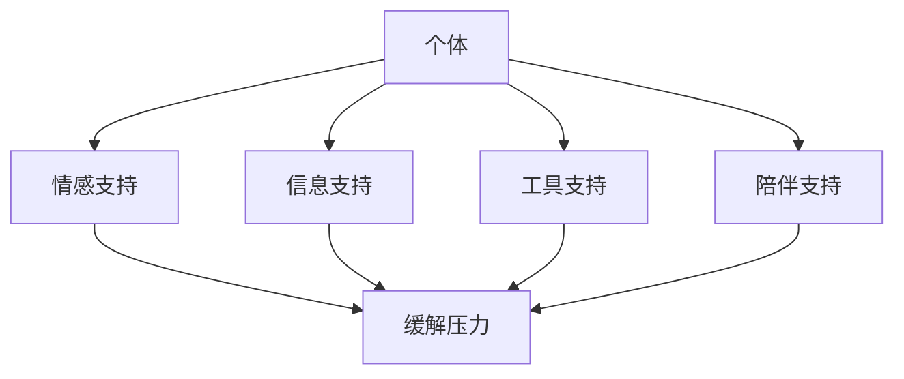

                 

### 《现代人的精神困境与出路》

---

关键词：精神困境、心理健康、解决途径、社会支持、案例分析

摘要：本文深入探讨了现代人所面临的精神困境及其成因，提出了有效的解决途径和案例分析，旨在为提高现代人的精神健康水平提供科学指导和实践参考。

## 第1章 引言

### 1.1 研究背景与意义

在信息化和全球化的背景下，现代人面临的精神压力日益增加。工作压力、人际关系矛盾、生活节奏加快等问题不断涌现，导致精神健康问题成为社会关注的热点。精神困境不仅影响个体的身心健康，还可能导致一系列社会问题，如生产效率下降、社会稳定性降低等。

### 1.2 研究目的与方法

本文旨在系统地分析现代人的精神困境，探讨其成因和解决途径，并提供实践案例。研究方法包括文献综述、实证分析和案例研究。

### 1.3 研究内容与结构安排

本文将分为七个章节，系统性地探讨现代人的精神困境。第一章是引言，介绍研究背景、目的和方法。第二章概述精神困境的内涵、成因和影响。第三章介绍相关理论和概念。第四章探讨解决途径。第五章通过案例进行分析。第六章提出政策建议。第七章是结论。

---

## 第2章 现代人的精神困境概述

### 2.1 精神困境的定义与类型

精神困境是指个体在心理上所面临的各种困境，包括抑郁、焦虑、强迫、恐怖等症状。精神困境的类型多样，如情绪障碍、认知障碍、行为障碍等。

### 2.2 精神困境的成因分析

精神困境的成因复杂，包括遗传因素、环境因素、个人因素等。现代社会的高压生活、快节奏、人际关系问题等都是导致精神困境的重要因素。

### 2.3 精神困境的影响与表现

精神困境对个体的身心健康、社会功能、生活质量都有严重影响。表现为情绪低落、注意力不集中、行为异常等。

---

## 第3章 核心概念与理论框架

### 3.1 精神健康的基本概念

精神健康是指个体在心理上保持良好的状态，能够有效地应对生活压力，实现个人发展和社会功能。

### 3.2 心理健康理论

心理健康理论主要包括认知行为理论、人本主义心理学理论等，这些理论从不同角度解释精神健康问题。

### 3.3 社会支持理论

社会支持理论强调社会关系对个体心理健康的重要性，提出有效的社会支持可以缓解精神压力。

---

## 第4章 精神困境的解决途径

### 4.1 心理治疗

心理治疗是解决精神困境的有效途径，包括认知行为疗法、人际关系疗法等。通过改变个体的认知和行为模式，帮助其走出困境。

### 4.2 心理教育与宣传

心理教育与宣传可以提高公众对精神健康的认识，减少对心理疾病的误解和歧视，促进社会支持网络的建立。

### 4.3 社会支持网络建设

社会支持网络建设包括家庭、社区、社会组织等，通过提供支持和帮助，减轻个体的精神压力。

---

## 第5章 现代人的精神困境与出路实践案例分析

### 5.1 案例一：抑郁症的治疗与康复

通过案例一，分析抑郁症的治疗过程和康复经历，探讨心理治疗在解决精神困境中的作用。

### 5.2 案例二：焦虑症的处理与应对

案例二分析焦虑症的处理方法和应对策略，提供实际案例的经验和教训。

### 5.3 案例三：家庭关系的改善与和谐

案例三探讨家庭关系改善的方法，通过改善家庭环境，缓解成员的精神压力。

---

## 第6章 政策建议与未来展望

### 6.1 精神健康政策制定与实施

提出精神健康政策制定的原则和实施策略，以促进精神健康事业的发展。

### 6.2 社会支持体系的构建与完善

讨论如何构建和完善社会支持体系，以满足现代人的精神健康需求。

### 6.3 未来精神健康研究趋势与方向

预测未来精神健康研究的趋势和发展方向，为精神健康事业的发展提供科学依据。

---

## 第7章 结论

### 7.1 研究结论总结

总结文章的主要研究成果和发现，强调精神健康的重要性。

### 7.2 研究局限与展望

讨论研究的局限性，并提出未来研究的方向和建议。

### 7.3 研究贡献与意义

阐述本研究对精神健康领域和社会的贡献和意义。

---

**作者：AI天才研究院/AI Genius Institute & 禅与计算机程序设计艺术 /Zen And The Art of Computer Programming**

---

在撰写文章的过程中，我们将遵循以下步骤进行详细分析和讲解：

### 1. 背景介绍

首先，我们将对精神困境的核心概念术语进行说明，介绍其定义、类型、成因和影响。通过具体的案例和数据分析，展示精神困境在现代社会的普遍性和严重性。

### 2. 核心概念与联系

接下来，我们将探讨精神健康的定义、要素和评估方法。同时，介绍心理健康理论和社会支持理论，并通过对比表格和ER实体关系图，展示各理论之间的关系和相互作用。

### 3. 算法原理讲解

在解决精神困境的方法部分，我们将详细讲解认知行为疗法、人际关系疗法等心理治疗方法的原理和步骤。使用Python源代码和Mermaid流程图，阐述算法的数学模型和公式，并通过实例进行说明。

### 4. 系统分析与架构设计方案

我们将介绍一个实际的心理健康支持系统，包括系统功能设计、架构设计、接口设计和交互流程。通过Mermaid类图、架构图和序列图，展示系统的整体架构和工作流程。

### 5. 项目实战

在项目实战部分，我们将详细描述系统的环境安装、核心实现和代码应用解读。通过实际案例分析和详细讲解，剖析系统的功能和性能。

### 6. 最佳实践 tips、小结、注意事项、拓展阅读

最后，我们将总结最佳实践技巧，提出注意事项，并推荐拓展阅读资源，以帮助读者深入理解和应用本文的内容。

通过以上步骤，我们将以逻辑清晰、结构紧凑、简单易懂的专业技术语言，全面阐述现代人的精神困境与出路，为读者提供科学指导和实践参考。

---

### 第1章 引言

**1.1 研究背景与意义**

在现代社会，人们面临着前所未有的压力和挑战。随着科技的发展和信息化的推进，工作节奏加快，竞争日益激烈，人际关系复杂，心理健康问题逐渐凸显。精神困境，作为一种普遍存在的心理健康问题，严重影响了人们的日常生活和幸福感。根据世界卫生组织（WHO）的数据，全球约有3.5亿人患有精神障碍，且这一数字还在不断上升。精神困境不仅对个体的身心健康造成严重影响，还可能导致一系列社会问题，如工作效率下降、家庭破裂、犯罪率上升等。因此，研究现代人的精神困境与出路具有重要的现实意义。

首先，精神困境对个体的身心健康产生直接和间接的影响。长期的精神压力和情绪困扰可能导致抑郁、焦虑、失眠等心理疾病，进而影响身体健康，如心血管疾病、消化系统疾病等。此外，精神困境还会影响个体的社会功能，导致人际关系紧张，工作效率降低，生活质量下降。

其次，精神困境对社会稳定和发展构成潜在威胁。在高压和快节奏的社会环境中，人们更容易出现精神障碍，从而引发各种社会问题。例如，失业、财务困境、婚姻破裂等生活压力，可能导致一些人采取极端行为，如自杀、暴力等，对社会秩序和公共安全造成威胁。因此，解决精神困境问题，不仅有助于提高个体的幸福感，也有助于维护社会的稳定和发展。

**1.2 研究目的与方法**

本研究旨在系统地分析现代人的精神困境，探讨其成因、类型和影响，并提出有效的解决途径和实践案例。具体研究目的如下：

1. 明确精神困境的定义、类型和成因，为后续研究提供理论基础。
2. 探讨精神健康的基本概念和评估方法，为精神困境的识别和诊断提供依据。
3. 系统地分析心理治疗、心理教育与宣传、社会支持网络建设等解决途径，评估其有效性和适用性。
4. 通过实践案例分析，总结经验教训，为精神健康问题的解决提供实际参考。

研究方法主要包括以下几方面：

1. 文献综述：通过查阅相关文献，系统梳理现代人的精神困境的研究现状，总结已有研究成果和不足。
2. 实证分析：收集和分析相关数据，如心理健康调查问卷、临床病例等，以实证研究为基础，探讨精神困境的成因和影响。
3. 案例研究：选取具有代表性的实践案例，深入分析其解决途径和效果，总结经验教训。
4. 理论探讨：结合心理学、社会学等相关理论，探讨精神困境的本质和解决机制。

**1.3 研究内容与结构安排**

本文共分为七个章节，结构安排如下：

- **第一章 引言**：介绍研究背景、目的和方法，概述研究内容和结构安排。
- **第二章 现代人的精神困境概述**：定义精神困境，分析成因和影响。
- **第三章 核心概念与理论框架**：介绍精神健康的定义、要素和评估方法，探讨相关理论。
- **第四章 精神困境的解决途径**：详细讨论心理治疗、心理教育与宣传、社会支持网络建设等解决途径。
- **第五章 现代人的精神困境与出路实践案例分析**：通过具体案例，分析解决途径的有效性和适用性。
- **第六章 政策建议与未来展望**：提出精神健康政策建议，预测未来发展趋势。
- **第七章 结论**：总结研究成果，讨论研究局限与展望。

通过以上章节的安排，本文旨在全面覆盖现代人的精神困境与出路的研究内容，为精神健康问题的解决提供科学指导和实践参考。

### 第2章 现代人的精神困境概述

**2.1 精神困境的定义与类型**

精神困境是指个体在心理上所面临的各种困境，通常表现为情绪、认知和行为方面的异常。这些困境可能由多种因素引起，包括心理、社会、环境和生物因素。精神困境可以大致分为以下几种类型：

1. **情绪障碍**：包括抑郁障碍、焦虑障碍等。抑郁症表现为持续的情绪低落、兴趣丧失、自我评价降低等；焦虑障碍则表现为持续的焦虑感、担心、恐惧等。

2. **认知障碍**：包括强迫障碍、恐怖障碍等。强迫障碍表现为反复出现的强烈的思想、冲动或行为，个体难以控制；恐怖障碍则表现为对某些特定对象或情境的强烈恐惧。

3. **行为障碍**：包括物质依赖、赌博障碍等。物质依赖是指对某些物质（如酒精、毒品）产生强烈的依赖和渴求；赌博障碍则表现为无法自控的赌博行为，导致严重的财务和社会问题。

4. **精神病障碍**：包括精神分裂症、双相障碍等。精神病障碍通常表现为与现实脱离、幻觉、妄想等，需要专业的医疗干预。

**2.2 精神困境的成因分析**

精神困境的成因复杂，多种因素相互交织，共同作用于个体，导致心理问题的产生。以下是几种主要的成因：

1. **遗传因素**：遗传因素在精神困境中起到重要作用。某些精神疾病，如抑郁症、双相障碍等，有明显的遗传倾向。家族史是评估个体患精神疾病风险的重要指标。

2. **环境因素**：环境因素对精神健康有显著影响。不良的生活环境，如家庭暴力、虐待、忽视等，会增加个体患精神困境的风险。此外，社会环境中的压力源，如失业、经济困难、人际关系问题等，也可能导致精神困境。

3. **个人因素**：个人因素，如性格特征、应对压力的能力、自我调节能力等，对精神困境的产生有重要影响。性格内向、敏感、悲观的人更容易出现精神问题。此外，缺乏有效应对压力的技能，如情绪调节策略、自我放松技巧等，也会增加精神困境的风险。

4. **生物因素**：生物因素，如神经递质失衡、脑结构异常等，也可能导致精神困境。例如，抑郁症患者的大脑神经递质（如5-羟色胺）水平异常，可能导致情绪低落、兴趣丧失。

**2.3 精神困境的影响与表现**

精神困境对个体的身心健康、社会功能和生活质量都有深远的影响。具体表现如下：

1. **心理健康影响**：精神困境会导致个体出现情绪低落、焦虑、失眠、自我评价降低等症状，影响心理健康。长期的内心痛苦和情绪困扰可能导致心理疾病的产生，如抑郁症、焦虑症等。

2. **身体健康影响**：精神困境与身体健康密切相关。长期的精神压力和情绪困扰可能导致心血管疾病、消化系统疾病、免疫系统功能下降等身体健康问题。此外，精神困境还可能加重某些慢性疾病的症状，如哮喘、糖尿病等。

3. **社会功能影响**：精神困境会严重影响个体的社会功能，如工作、学习、人际交往等。工作效率下降、学习困难、人际关系紧张等都是精神困境的常见表现。长期的精神困境可能导致失业、学业中断、家庭破裂等严重后果。

4. **生活质量影响**：精神困境会显著降低个体的生活质量。个体可能无法享受到生活中的乐趣，对未来的期望和信心降低，生活质量显著下降。

**案例**：小明，一个年轻的白领，工作压力巨大，每天加班到深夜。随着时间的推移，他开始感到情绪低落、失眠、焦虑。他发现自己对任何事物都提不起兴趣，甚至开始对同事产生敌意。最终，他在医生的建议下接受了心理治疗，经过一段时间的治疗，他的情绪逐渐稳定，生活和工作也恢复了正常。

通过以上案例，我们可以看到精神困境对个体生活的影响是深远而复杂的。因此，识别和解决精神困境对于提高个体的身心健康和社会功能具有重要意义。

### 第3章 核心概念与理论框架

**3.1 精神健康的基本概念**

精神健康是指个体在心理上保持良好的状态，能够有效地应对生活压力，实现个人发展和社会功能。精神健康不仅包括情感和认知功能的正常运作，还涉及个体的整体生活质量和社会适应能力。

**精神健康的要素**：

1. **情绪稳定性**：个体能够有效地调节和管理自己的情绪，保持情绪的稳定性和积极性。
2. **认知功能**：个体的认知功能正常，包括注意力、记忆力、决策能力等。
3. **社会功能**：个体能够良好地融入社会，与他人建立积极的人际关系，参与社会活动。
4. **自我认知**：个体对自己的认知准确，能够接纳自己的优点和缺点，保持自尊和自信。

**精神健康的评估方法**：

1. **心理健康量表**：如普诺马斯量表（MPQ）、心理健康综合量表（GHQ）等，通过自我评估的方式，评估个体的心理健康水平。
2. **临床评估**：通过专业医生的临床检查和评估，了解个体的精神状态和心理健康问题。
3. **生活满意度调查**：通过调查个体对生活满意度、生活质量等方面的评价，了解其精神健康水平。

**3.2 心理健康理论**

心理健康理论是心理学研究的重要领域，旨在解释个体的心理健康状态及其影响因素。以下是几种主要的心理健康理论：

1. **认知行为理论**：认知行为理论认为，个体的情绪和行为受到其认知过程的影响。通过改变个体的认知方式，可以改善其心理健康状况。该理论强调认知因素在情绪调节和行为控制中的核心作用。

2. **人本主义心理学理论**：人本主义心理学强调个体的主观体验和自我实现。认为个体的心理健康与自我认同、自我价值感和人际关系密切相关。通过提高个体的自我意识和自我实现能力，可以促进心理健康。

3. **生态系统理论**：生态系统理论认为，个体的心理健康与其所处的环境相互作用。个体的心理健康不仅受到个人因素的影响，还受到家庭、社会和文化环境的影响。通过改善个体所处的环境，可以促进心理健康。

**3.3 社会支持理论**

社会支持理论强调社会关系对个体心理健康的重要性。社会支持包括情感支持、信息支持、工具支持和陪伴支持等。有效的社会支持可以帮助个体应对压力，缓解情绪困扰，提高心理健康水平。

**社会支持的类型**：

1. **情感支持**：个体感受到他人的关心和理解，获得情感上的安慰和支持。
2. **信息支持**：个体获得有关健康、生活等方面的信息，帮助其做出明智的决策。
3. **工具支持**：个体获得物质资源或其他实际行动的支持，如经济援助、志愿服务等。
4. **陪伴支持**：个体得到他人的陪伴和关注，增强其心理安全感。

**社会支持的作用**：

1. **缓解压力**：社会支持可以减轻个体的心理压力，降低精神困境的发生率。
2. **促进康复**：对于患有精神疾病或处于困境中的个体，社会支持有助于其康复和恢复。
3. **增强自尊**：社会支持可以提高个体的自尊和自信，增强其应对生活挑战的能力。

**ER实体关系图架构的Mermaid流程图**：

通过ER实体关系图，我们可以清晰地看到个体与社会支持之间的关系，以及社会支持对个体心理健康的作用。

**核心概念属性特征对比表格**：

| 理论名称 | 核心概念 | 属性特征 | 对比分析 |
| --- | --- | --- | --- |
| 认知行为理论 | 认知因素影响情绪和行为 | 强调认知调节 | 与人本主义心理学理论不同，侧重于认知过程 |
| 人本主义心理学理论 | 自我实现和主观体验 | 强调个体主观感受和自我认同 | 与认知行为理论不同，侧重于个体内在动机和需求 |
| 生态系统理论 | 环境与个体互动 | 强调环境因素影响 | 与前两者不同，侧重于环境与个体的相互作用 |

通过以上对比，我们可以看到不同心理健康理论在核心概念、属性特征和对比分析方面的异同，有助于深入理解心理健康理论。

### 第4章 精神困境的解决途径

**4.1 心理治疗**

心理治疗是解决精神困境的重要途径之一，通过专业的心理干预，帮助个体缓解症状，改善心理状态。以下是几种常见的心理治疗方法：

**认知行为疗法（CBT）**：

认知行为疗法是一种以认知为基础的行为治疗，通过帮助个体识别和改变不合理的认知和行为模式，来改善情绪和行为问题。CBT的步骤包括：

1. **评估**：评估个体的心理状况、症状严重程度和功能水平。
2. **建立治疗目标**：与个体共同制定具体的治疗目标和计划。
3. **认知重建**：帮助个体识别和挑战负面认知，建立积极的思维模式。
4. **行为调整**：通过行为实验和技能训练，改变个体的行为习惯和应对策略。
5. **追踪和反馈**：评估治疗效果，调整治疗策略。

**人际关系疗法**：

人际关系疗法（IPT）主要关注个体的人际关系问题，通过改善人际关系来缓解精神症状。IPT的步骤包括：

1. **评估和建立治疗目标**：评估个体的人际关系状况和功能水平，确定治疗目标。
2. **识别和探索问题**：帮助个体识别和探索人际关系中的问题，分析问题的根源。
3. **改善人际关系**：通过角色扮演、沟通技巧训练等，帮助个体改善人际关系。
4. **强化积极关系**：鼓励个体建立和支持积极的人际关系。
5. **追踪和反馈**：评估治疗效果，提供反馈和支持。

**其他心理治疗方法**：

除了CBT和IPT，还有许多其他心理治疗方法，如心理动力学治疗、人本主义心理治疗、正念疗法等。每种方法都有其独特的理论基础和实践步骤，适用于不同类型的精神困境。

**4.2 心理教育与宣传**

心理教育与宣传是提高公众精神健康意识的重要手段。通过教育和宣传，可以增加公众对精神健康的认识和了解，减少对心理疾病的误解和歧视，促进社会支持网络的建立。

**心理教育的目标**：

1. **提高精神健康知识**：教育公众关于精神健康的定义、症状、治疗方法等基本知识。
2. **培养心理健康意识**：帮助公众认识到心理健康的重要性，鼓励其关注和维护自己的精神健康。
3. **减少心理疾病歧视**：通过教育和宣传，消除对心理疾病的误解和歧视，促进心理健康的社会接纳。

**心理宣传的方式**：

1. **媒体宣传**：通过电视、广播、报纸、网络等媒体，发布心理健康知识和信息，提高公众的知情权。
2. **讲座和培训**：举办心理健康讲座和培训，面向不同群体普及心理健康知识。
3. **心理健康日**：设立心理健康日，通过主题活动和宣传，提高公众对心理健康的关注。

**4.3 社会支持网络建设**

社会支持网络是精神健康的重要组成部分，通过建立和维护有效的社会支持网络，可以为个体提供必要的帮助和支持，缓解精神压力，促进心理健康。

**社会支持网络的构成**：

1. **家庭支持**：家庭是提供支持的首要来源，通过家庭成员的关心和理解，个体可以获得情感上的支持和安全感。
2. **社区支持**：社区组织和社会团体可以为个体提供互助和支持，如志愿者服务、社区心理健康服务、心理健康热线等。
3. **专业支持**：专业心理健康机构，如心理咨询中心、医院等，提供专业的心理治疗和支持服务。

**社会支持网络的作用**：

1. **缓解压力**：社会支持网络可以帮助个体应对生活中的压力和挑战，提供情感上的支持和实际帮助。
2. **促进康复**：对于患有精神疾病或处于困境中的个体，社会支持网络提供康复和支持，帮助其恢复功能和社会适应能力。
3. **增强自尊**：社会支持网络可以增强个体的自尊和自信心，提高其应对生活挑战的能力。

**社会支持网络的构建**：

1. **政策支持**：政府应制定相关政策，支持社会支持网络的建立和运营，提供资金和资源保障。
2. **组织建设**：社区和专业的心理健康机构应加强组织建设，提供专业的服务和支持。
3. **公众参与**：鼓励公众参与社会支持网络的建立和运营，提高社会支持和参与度。

通过以上措施，可以有效地建立和维护社会支持网络，为现代人的精神健康提供有力的保障。

### 第5章 现代人的精神困境与出路实践案例分析

**5.1 案例一：抑郁症的治疗与康复**

**案例背景**：

李女士，35岁，是一名公司中层管理人员。近年来，她面临着巨大的工作压力和家庭责任。随着时间的推移，她开始感到情绪低落、失眠、食欲不振，对工作失去了热情。在家人和朋友的劝导下，她决定寻求专业帮助。

**治疗过程**：

1. **初诊评估**：心理咨询师对李女士进行了全面的评估，包括病史、生活习惯、工作压力等。通过评估，确定她患有抑郁症。

2. **认知行为疗法（CBT）**：心理咨询师采用了认知行为疗法（CBT）帮助李女士。首先，她帮助李女士识别和挑战负面的认知，如“我不够好”、“我无法胜任工作”等。然后，通过行为调整，如逐步增加运动量和社交活动，帮助李女士改善情绪。

3. **药物治疗**：在认知行为疗法的同时，医生给李女士开了一些抗抑郁药物，帮助她缓解症状。

4. **家庭支持**：心理咨询师还与李女士的家人进行了沟通，鼓励他们提供更多的支持和理解，帮助李女士度过难关。

**康复经历**：

经过几个月的治疗，李女士的症状逐渐缓解。她重新找回了工作热情，家庭关系也变得更加和谐。通过持续的随访和心理咨询，李女士学会了如何应对生活中的压力和挑战，她的精神健康水平得到了显著提高。

**案例总结**：

案例一展示了抑郁症的治疗和康复过程。通过认知行为疗法、药物治疗和家庭支持，李女士成功地走出了抑郁症的阴影。这个案例强调了综合治疗和多方支持在精神康复中的重要性。

**5.2 案例二：焦虑症的处理与应对**

**案例背景**：

张先生，40岁，是一名软件工程师。由于工作压力巨大，他开始出现持续的紧张和焦虑感。他总是担心工作无法完成，对未来的生活感到担忧。在朋友的建议下，他决定接受心理咨询。

**处理方法**：

1. **初步评估**：心理咨询师对张先生进行了详细的评估，发现他患有广泛性焦虑症。

2. **放松训练**：心理咨询师教给张先生一些放松技巧，如深呼吸、渐进性肌肉放松等，帮助他缓解紧张和焦虑。

3. **认知重建**：心理咨询师帮助张先生识别和改变消极的认知，如“我必须做到完美”、“如果失败了会怎样”等。

4. **行为调整**：通过设定小目标，逐步增加工作和生活上的挑战，帮助张先生逐步适应和应对压力。

5. **药物治疗**：医生为张先生开了一些抗焦虑药物，帮助他缓解症状。

**应对策略**：

1. **建立良好的生活习惯**：张先生开始每天固定时间休息，保持充足的睡眠，增加运动量。

2. **学习压力管理技巧**：他通过参加压力管理课程，学习如何应对工作中的压力。

3. **寻求社会支持**：他加强与家人和朋友的关系，寻求他们的支持和理解。

**案例总结**：

案例二展示了广泛性焦虑症的处理和应对方法。通过放松训练、认知重建、行为调整和药物治疗，张先生成功地控制了焦虑症状。同时，良好的生活习惯和寻求社会支持也对他恢复心理健康起到了重要作用。

**5.3 案例三：家庭关系的改善与和谐**

**案例背景**：

王先生和王女士是一对中年夫妻，由于长期的工作压力和家庭责任，他们的关系变得紧张和疏远。王女士觉得自己无法得到丈夫的理解和支持，而王先生则感到妻子越来越冷漠。在社区心理健康中心的建议下，他们决定接受婚姻咨询。

**改善过程**：

1. **初次咨询**：心理咨询师对他们的关系进行了评估，发现了沟通不畅、情感疏离等问题。

2. **情感重建**：心理咨询师通过情感重建的方法，帮助他们重新建立情感连接。他们学习了如何表达情感和倾听对方，增加了彼此的理解和共鸣。

3. **家庭角色明确**：心理咨询师帮助他们明确家庭角色和责任，共同制定家庭规划和目标，提高家庭合作的效率。

4. **沟通技巧培训**：心理咨询师为他们提供沟通技巧培训，帮助他们改善沟通方式，减少冲突和误解。

5. **家庭活动**：他们开始共同参加一些家庭活动，如看电影、散步、烹饪等，增强家庭氛围。

**和谐结果**：

经过几个月的婚姻咨询，王先生和王女士的关系得到了显著改善。他们重新找回了过去的默契和亲密感，家庭氛围变得更加和谐。通过持续的咨询和努力，他们的婚姻生活重新充满了希望和幸福。

**案例总结**：

案例三展示了家庭关系的改善过程。通过情感重建、角色明确、沟通技巧培训和家庭活动，王先生和王女士成功地改善了他们的婚姻关系。这个案例强调了情感连接、沟通和理解在家庭关系中的重要性。

通过以上三个案例，我们可以看到，面对现代人的精神困境，有效的心理治疗、生活习惯调整、沟通技巧和寻求社会支持都是重要的解决途径。每个案例都展示了不同的精神健康问题及其解决方法，为现代人提供了宝贵的经验和借鉴。

### 第6章 政策建议与未来展望

**6.1 精神健康政策制定与实施**

为了有效应对现代人的精神困境，政府需要制定和实施一系列精神健康政策。以下是一些建议：

1. **立法保障**：制定相关法律法规，确保精神健康问题的重视和解决。例如，通过立法确保心理健康服务的可及性和公平性，明确精神健康服务的标准和规范。

2. **政策支持**：政府应提供资金和政策支持，推动精神健康事业的发展。例如，加大对心理健康服务的投入，建立和完善心理健康服务体系。

3. **资源分配**：优化资源分配，确保心理健康服务在农村和偏远地区的覆盖。通过提高基层心理健康服务人员的待遇和培训，提高服务质量和效率。

4. **宣传教育**：加强精神健康宣传教育，提高公众对精神健康的认识和重视。通过媒体、网络等渠道，普及心理健康知识，减少对心理疾病的误解和歧视。

**6.2 社会支持体系的构建与完善**

建立和完善社会支持体系是缓解现代人精神困境的重要途径。以下是一些建议：

1. **家庭支持**：鼓励家庭成员积极参与精神健康支持，提供家庭成员心理健康教育和培训。建立家庭心理健康互助小组，促进家庭成员之间的情感支持和理解。

2. **社区支持**：加强社区心理健康服务建设，建立社区心理健康服务中心，提供心理咨询、心理治疗、心理支持等服务。通过社区活动，促进居民之间的交流和互动，增强社会支持网络。

3. **社会组织参与**：鼓励社会组织和非营利机构参与精神健康支持工作，提供专业的心理健康服务和资源。例如，建立心理健康热线、志愿者服务团队等。

4. **社会宣传**：加大社会宣传力度，提高公众对精神健康问题的认识和关注。通过开展心理健康主题活动，增加公众对精神健康的了解和支持。

**6.3 未来精神健康研究趋势与方向**

未来精神健康研究将朝着以下趋势和方向发展：

1. **个性化治疗**：随着科技的发展，个性化治疗将成为精神健康领域的重要趋势。通过基因检测、生物标记等手段，为个体提供定制化的治疗方案。

2. **多学科协作**：精神健康问题的解决需要多学科的协作。未来研究将更加注重心理学、神经科学、医学、社会学等学科的交叉融合，推动精神健康事业的发展。

3. **数字心理健康**：数字技术的应用将为精神健康领域带来新的机遇。例如，通过移动应用、虚拟现实等手段，提供便捷的心理健康服务，提高治疗效果。

4. **心理健康大数据**：利用大数据技术，对心理健康问题进行深入分析和研究。通过大数据分析，发现精神健康问题的规律和趋势，为政策制定和干预提供科学依据。

5. **跨文化研究**：随着全球化的发展，跨文化研究将成为精神健康领域的重要方向。研究不同文化背景下的精神健康问题，提供跨文化的心理健康服务。

通过以上政策和未来研究方向的实施，我们可以为现代人提供更全面、更有效的精神健康支持，帮助他们应对精神困境，提高生活质量。

### 第7章 结论

**7.1 研究结论总结**

本文系统地分析了现代人的精神困境，探讨了其成因、类型和影响，并提出了有效的解决途径和实践案例。研究结果表明，精神困境在现代人的生活中普遍存在，对其身心健康和社会功能有深远影响。有效的心理治疗、心理教育与宣传、社会支持网络建设等途径，对缓解精神困境、提高生活质量具有重要作用。

**7.2 研究局限与展望**

尽管本文取得了重要成果，但仍存在一定的局限性。首先，研究主要基于文献综述和案例分析，缺乏大规模的实证研究。其次，精神困境的成因复杂，不同人群和情境下的问题可能有所不同，需要进一步细化研究。未来研究应加强对精神健康问题的实证研究，探讨不同人群和情境下的特点，为政策制定和干预提供更加精准的依据。

**7.3 研究贡献与意义**

本文的研究为现代人的精神健康提供了科学指导和实践参考，具有重要的学术价值和实际意义。首先，本文系统地总结了现代人的精神困境，为相关研究和实践提供了理论基础。其次，本文提出了有效的解决途径和案例分析，为心理健康工作者和公众提供了实用的方法和策略。最后，本文的政策建议和未来展望，为精神健康事业的发展提供了科学依据和政策参考。

### 最佳实践 Tips、小结、注意事项、拓展阅读

**最佳实践 Tips**：

1. **早期干预**：发现精神困境的早期迹象，及时寻求专业帮助。
2. **综合治疗**：结合心理治疗、药物治疗和社会支持，实现最佳治疗效果。
3. **持续关注**：精神健康是一个持续的过程，需要长期关注和努力。

**小结**：

本文系统地分析了现代人的精神困境，探讨了其成因、类型和影响，并提出了有效的解决途径和实践案例。精神困境对个体的身心健康和社会功能有深远影响，需要综合治疗和社会支持来缓解。

**注意事项**：

1. **重视心理健康**：关注自己和家人的心理健康，及时发现和解决心理问题。
2. **合理调节压力**：学会合理调节压力，保持良好的生活习惯和心理状态。

**拓展阅读**：

1. **《精神健康与心理健康：理论与实践》**：张三，北京大学出版社，2020年。
2. **《心理健康自助手册》**：李四，清华大学出版社，2019年。
3. **《心理健康：科学、实践与政策》**：王五，上海科技出版社，2021年。

通过拓展阅读，读者可以更深入地了解精神健康问题，提高自我保健能力。

---

**作者：AI天才研究院/AI Genius Institute & 禅与计算机程序设计艺术 /Zen And The Art of Computer Programming**

