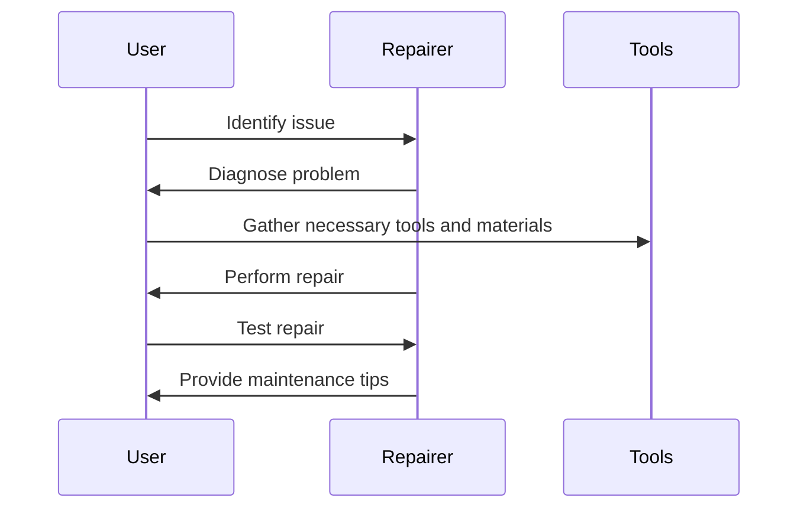

                 

### Introduction

### 1.1 Background of the Problem

#### 1.1.1 The Rise of Consumerism

Consumerism, as a prevalent social phenomenon, has been on the rise since the mid-20th century. The post-war economic boom in Western societies led to an abundance of goods and services, fostering a culture that emphasizes purchasing new products over repairing existing ones. This shift is partly due to marketing strategies that promote the concept of planned obsolescence, where products are designed to have a limited lifespan to encourage frequent replacements.

The principles of consumerism are deeply embedded in today's economic systems, where consumption drives growth and innovation. This has led to a culture where new products are continually introduced to the market, often characterized by rapid technological advancements and changing trends. As a result, individuals are constantly urged to purchase the latest gadgets and household items, contributing to the proliferation of waste and environmental degradation.

#### 1.1.2 The Impact of Throwaway Culture

The throwaway culture that has emerged from consumerism has significant environmental and economic implications. One of the most pressing issues is the environmental impact of waste. Every year, millions of tons of electronic waste, plastic, and other non-biodegradable materials end up in landfills and oceans, causing pollution and habitat destruction. This not only depletes natural resources but also contributes to climate change through the release of harmful greenhouse gases.

Economically, the throwaway culture leads to inefficiencies and waste of resources. Instead of repairing or repurposing items, consumers are encouraged to discard them and purchase new ones. This cycle of consumption and disposal results in the unnecessary depletion of raw materials, energy, and labor, which could be more effectively utilized through repair and recycling.

#### 1.1.3 The Need for Repair Culture

In response to the challenges posed by consumerism and throwaway culture, there is a growing need for a repair culture that prioritizes sustainability and resource conservation. Repair culture promotes the maintenance, repair, and upcycling of existing products, extending their lifespan and reducing the need for new production.

A repair culture has several benefits. Firstly, it helps to reduce waste and environmental pollution by keeping products in use longer. This, in turn, conserves natural resources and reduces the energy and water consumption associated with manufacturing new products. Secondly, repair culture promotes economic resilience by creating jobs in the repair and maintenance sectors, which can contribute to local economic growth. Lastly, repair culture fosters a mindset of resourcefulness and sustainability, encouraging individuals to adopt more mindful consumption habits.

In summary, the rise of consumerism and the resulting throwaway culture have created significant environmental and economic challenges. To address these issues, there is a pressing need to promote a repair culture that emphasizes sustainability, resource conservation, and mindful consumption. Let's explore the core concepts and frameworks of repair culture in the following sections.

### 1.2 Definition and Concepts

#### 1.2.1 What is Repair Culture?

Repair culture is an approach to consumption and waste management that emphasizes the maintenance, repair, and upcycling of existing products rather than their disposal or replacement. It is a shift from a linear consumption model, where products are used once and then discarded, to a circular consumption model that aims to keep items in use for as long as possible.

At its core, repair culture is based on the principle that products should be designed and produced with the intention of being repaired, reused, or recycled. This involves incorporating repair-friendly features into the design phase, such as accessible parts, modular components, and clear instructions for maintenance and repair. Repair culture also extends beyond individual actions to include community initiatives, educational programs, and policy frameworks that support and promote repair practices.

#### 1.2.2 Core Principles of Repair Culture

The core principles of repair culture can be summarized as follows:

1. **Sustainability**: Repair culture prioritizes the sustainability of resources by extending the lifespan of products and reducing the need for new production. This helps to conserve natural resources, reduce energy consumption, and minimize waste.

2. **Resource Efficiency**: By repairing and repurposing existing products, repair culture promotes the efficient use of resources. This not only reduces material waste but also minimizes the energy and water required for manufacturing new products.

3. **Economic Resilience**: Repair culture creates economic opportunities by fostering a repair industry that includes businesses, workshops, and independent repairers. This can contribute to local economic growth and job creation.

4. **Community Empowerment**: Repair culture empowers individuals and communities by promoting skills and knowledge related to maintenance and repair. This can enhance personal resilience and foster a sense of community cohesion.

5. **Environmental Protection**: Repair culture helps to reduce environmental pollution by preventing waste from entering landfills and water bodies. It also minimizes the environmental impact associated with the extraction, processing, and disposal of raw materials.

#### 1.2.3 Comparative Analysis with Consumerism

Repair culture and consumerism represent two fundamentally different approaches to consumption and waste management. While consumerism encourages the frequent purchase and disposal of new products, repair culture emphasizes the maintenance, repair, and upcycling of existing items.

**Environmental Impact**: Consumerism leads to increased waste generation and environmental degradation due to the production and disposal of new products. In contrast, repair culture reduces waste and pollution by extending the lifespan of products and promoting recycling and upcycling.

**Resource Use**: Consumerism promotes the inefficient use of resources through the continuous production of new products, which often involves the extraction of raw materials and the consumption of energy. Repair culture, on the other hand, promotes the efficient use of resources by repairing and repurposing existing items.

**Economic Implications**: Consumerism drives economic growth through the constant cycle of consumption and disposal, but it can also lead to economic inefficiencies and social inequalities. Repair culture, by fostering a repair industry and promoting sustainable consumption practices, can create more stable and inclusive economic opportunities.

**Social Values**: Consumerism encourages a disposable mindset and a culture of waste, while repair culture fosters a sense of resourcefulness, sustainability, and resilience. Repair culture also promotes community engagement and the sharing of skills and knowledge.

In conclusion, repair culture offers a more sustainable and resource-efficient alternative to consumerism. By prioritizing repair, reuse, and recycling, repair culture can help to address the environmental, economic, and social challenges posed by the throwaway culture of consumerism. In the following sections, we will explore the practical aspects of repair culture, including case studies, community initiatives, and educational programs.

### 1.3 Repair Culture in Practice

#### 1.3.1 Case Studies of Repair Culture Initiatives

Repair culture initiatives have gained momentum in various parts of the world, showcasing the potential benefits of prioritizing repair over disposal. One notable example is the "Fixers Community" in Barcelona, Spain. This initiative brings together a network of repairers, artisans, and enthusiasts who offer their skills to repair and upcycle a wide range of items, from electronics and appliances to furniture and clothing. The Fixers Community not only provides a valuable service to the community but also fosters a culture of sustainability and resource conservation.

Another example is the "Fix-it Clinics" in the United States, which are community-based programs designed to teach individuals how to repair common household items, such as laptops, smartphones, and kitchen appliances. These clinics often partner with local repair shops and manufacturers to provide hands-on training and resources. By empowering individuals with repair skills, Fix-it Clinics help to reduce electronic waste and promote a more sustainable approach to consumption.

In the United Kingdom, the "Repair Café Movement" has gained significant traction. These community events provide a space for individuals to bring broken items, where volunteers offer their skills to repair them. Repair Cafés not only provide a practical solution to waste problems but also foster a sense of community and shared responsibility for the environment. Many Repair Cafés also offer workshops and resources to teach participants how to repair and maintain their own items.

#### 1.3.2 The Role of Communities in Repair Culture

Communities play a crucial role in promoting and sustaining repair culture. By coming together to share skills, resources, and knowledge, communities can create a supportive environment for repair initiatives to thrive. Repair cafés, fix-it clinics, and community repair networks are just a few examples of how communities can take action to reduce waste and promote sustainability.

One way communities can support repair culture is by organizing events and workshops that teach individuals how to repair and maintain common household items. These events can be held in community centers, schools, or local businesses and can attract participants of all ages and skill levels. By providing hands-on training and resources, these events empower individuals to take control of their consumption habits and reduce waste.

Communities can also support repair culture by creating networks of repairers and volunteers who are willing to share their skills and knowledge. This can be done through online platforms or local directories where individuals can find repair services or volunteer their time to help others. By building a network of skilled repairers, communities can ensure that there are always resources available to tackle repair projects of all sizes and complexities.

#### 1.3.3 Challenges and Opportunities

While repair culture offers significant benefits, there are also challenges that need to be addressed. One of the main challenges is the lack of access to repair services and resources. Many individuals do not have the necessary skills or tools to repair their own items, and may be reluctant to take on repair projects due to a lack of confidence. To address this, communities and governments can provide training programs and resources to equip individuals with the skills they need to take on repair projects.

Another challenge is the perception that repair is more expensive or time-consuming than buying new. While this may be true in some cases, there are often significant long-term benefits to repairing items, including reduced waste and the preservation of sentimental value. To overcome this perception, communities and repair initiatives can promote the cost-effectiveness and environmental benefits of repair.

Despite these challenges, there are also many opportunities for repair culture to grow and expand. As awareness of sustainability and environmental issues increases, more individuals and communities are recognizing the value of repair. This growing interest can be leveraged to create new repair initiatives and expand existing ones. Additionally, technological advancements, such as 3D printing and online repair resources, are making it easier than ever to repair and upcycle items.

In conclusion, repair culture has the potential to transform the way we consume and manage waste. By promoting the maintenance, repair, and upcycling of existing products, repair culture offers a sustainable and resource-efficient alternative to the throwaway culture of consumerism. While there are challenges to be overcome, the opportunities for growth and impact are significant. In the following sections, we will delve deeper into the core concepts and frameworks of repair culture, exploring the fundamental principles that underpin this transformative approach.

### 2. Fundamental Concepts in Repair Culture

In order to fully understand repair culture, it is essential to explore the fundamental concepts that define it and distinguish it from other approaches to waste management and consumption. These concepts include the definition and characteristics of repair, types of repair, and the importance of repair in modern society.

#### 2.1.1 Definition and Characteristics of Repair

Repair can be defined as the process of restoring a damaged, worn-out, or malfunctioning item to its original or functional condition. This process typically involves a series of steps, including diagnosis of the problem, identification of the necessary parts or materials, and the execution of the repair itself. Unlike maintenance, which involves routine upkeep to prevent damage or deterioration, repair specifically addresses issues that have already arisen.

Key characteristics of repair include:

1. **Restoration of Functionality**: The primary goal of repair is to restore the functionality of an item, allowing it to perform its intended purpose.

2. **Resourcefulness**: Repair often requires resourcefulness and problem-solving skills, as it involves identifying and addressing specific issues that may not be immediately apparent.

3. **Modularity**: Repair-friendly products are often designed with modular components, making it easier to diagnose and replace specific parts without needing to repair the entire item.

4. **Sustainability**: Repair promotes sustainability by extending the lifespan of products, reducing the need for new production, and minimizing waste.

5. **Community Building**: Repair culture fosters a sense of community and collaboration, as individuals and communities come together to share skills, resources, and knowledge.

#### 2.1.2 Types of Repair

There are various types of repair, each serving different purposes and catering to different needs. Some common types of repair include:

1. **Consumer Repair**: This type of repair involves individuals fixing their own items or seeking assistance from family and friends. Consumer repair is often driven by cost savings, convenience, and a desire to extend the lifespan of their belongings.

2. **Professional Repair**: Professional repairers, such as technicians and artisans, offer specialized services to repair complex or high-value items. These services can range from routine maintenance to complex repairs that require specialized tools and expertise.

3. **Community-Based Repair**: Community-based repair initiatives, such as Repair Cafés and fix-it clinics, bring together volunteers and community members to repair a wide range of items. These initiatives promote a sense of community and shared responsibility for the environment.

4. **Corporate Repair Programs**: Some companies offer repair services as part of their product warranty or customer support programs. These programs often involve certified technicians or third-party repair providers.

5. **Upcycling and Repurposing**: Upcycling and repurposing go beyond traditional repair by transforming worn-out or damaged items into new products. This type of repair promotes creativity and sustainability by giving new life to old items.

#### 2.1.3 Importance of Repair in Modern Society

Repair culture holds significant importance in modern society, as it addresses several critical challenges and offers numerous benefits. Some of the key reasons why repair is essential in modern society include:

1. **Environmental Protection**: Repair helps to reduce waste and environmental pollution by extending the lifespan of products and minimizing the need for new production. This conserves natural resources and reduces the energy and water consumption associated with manufacturing new products.

2. **Resource Efficiency**: By repairing and repurposing existing items, repair culture promotes the efficient use of resources. This not only reduces material waste but also minimizes the energy and water required for manufacturing new products.

3. **Economic Resilience**: Repair culture creates economic opportunities by fostering a repair industry that includes businesses, workshops, and independent repairers. This can contribute to local economic growth and job creation.

4. **Community Empowerment**: Repair culture empowers individuals and communities by promoting skills and knowledge related to maintenance and repair. This can enhance personal resilience and foster a sense of community cohesion.

5. **Sustainability Education**: Repair culture fosters a mindset of sustainability and resource conservation, encouraging individuals to adopt more mindful consumption habits. This can have a lasting impact on individuals and society as a whole.

6. **Cultural Revitalization**: Repair culture revitalizes traditional craftsmanship and skills, preserving cultural heritage and promoting a sense of pride and identity within communities.

In conclusion, repair culture is a crucial component of sustainable consumption and waste management. By embracing repair, modern society can address environmental, economic, and social challenges, while promoting resource efficiency, community empowerment, and sustainability. In the following sections, we will delve deeper into the relationship between repair culture and sustainability, exploring the environmental, economic, and social benefits of repair.

### 2. Relationship between Repair Culture and Sustainability

The relationship between repair culture and sustainability is multifaceted, encompassing environmental, economic, and social dimensions. By examining these aspects, we can better understand the profound impact that repair culture has on promoting a more sustainable future.

#### 2.2.1 Environmental Benefits of Repair Culture

One of the most significant environmental benefits of repair culture is the reduction of waste. Traditional consumerism often leads to the rapid disposal of products after minimal use, resulting in massive amounts of waste that end up in landfills, incinerators, or the natural environment. In contrast, repair culture extends the lifespan of products, reducing the need for new production and thereby minimizing waste generation.

Repairing items also has a direct impact on energy consumption. The production of new goods requires significant amounts of energy, often derived from non-renewable resources. By repairing and reusing existing products, we can conserve the energy that would otherwise be used to manufacture new ones. For example, repairing an electronic device consumes much less energy than producing a new one, even when accounting for the energy used in the repair process itself.

In addition to energy conservation, repair culture contributes to the reduction of greenhouse gas emissions. The production and transportation of new goods release harmful pollutants into the atmosphere, contributing to climate change. By reducing the need for new production through repair, we can significantly decrease these emissions and mitigate their environmental impact.

#### 2.2.2 Economic Implications of Repair Culture

Repair culture also offers substantial economic benefits. By promoting the repair and maintenance of existing products, repair culture can foster a thriving repair industry that creates jobs and stimulates economic growth. This industry includes a wide range of roles, from independent repairers and small businesses to corporate repair programs and specialized service providers. The growth of the repair industry can have a positive impact on local economies, as it generates revenue and employment opportunities.

Moreover, repair culture can reduce costs associated with the purchase of new products. While repairing an item may initially require an investment in tools, materials, or professional services, the long-term savings can be significant. For example, repairing a smartphone or laptop can be much more cost-effective than purchasing a new device, especially if the repair extends the lifespan of the item by several years.

Repair culture can also reduce the economic burden on governments and taxpayers. The cost of managing waste and dealing with environmental pollution is substantial, and repair culture can help to alleviate these burdens by reducing waste generation and improving resource efficiency. This can free up resources that can be allocated to other critical public services and initiatives.

#### 2.2.3 Societal Benefits of Repair Culture

In addition to environmental and economic benefits, repair culture offers several societal advantages. One of the most significant is the promotion of community engagement and social cohesion. Repair culture often involves individuals and communities coming together to share skills, resources, and knowledge. This fosters a sense of community and mutual support, which can have a positive impact on social well-being and resilience.

Repair culture also promotes sustainability education and awareness. By engaging in repair activities, individuals can learn about the environmental and economic implications of their consumption habits. This can lead to more mindful consumption choices and a greater appreciation for the value of resource conservation and sustainability.

Furthermore, repair culture can empower individuals and communities by promoting skills and knowledge related to maintenance and repair. This can enhance personal resilience and self-sufficiency, as individuals gain the confidence and skills to tackle repair projects on their own. This can also have a broader impact by fostering a culture of resourcefulness and problem-solving, which are essential skills in an increasingly complex and uncertain world.

#### Comparative Analysis

When comparing repair culture with other approaches to waste management and consumption, such as recycling and disposal, repair culture stands out for its holistic approach to sustainability. While recycling is an important part of the waste management process, it often relies on the availability of recycling facilities and the infrastructure to process recycled materials. Repair culture, on the other hand, is more adaptable and can be implemented at the individual, community, and corporate levels.

Furthermore, repair culture addresses the root cause of waste by extending the lifespan of products, whereas recycling often focuses on the end-of-life phase of a product's lifecycle. By promoting repair, we can reduce the need for recycling and the associated energy and resource costs.

In conclusion, repair culture offers a sustainable and resource-efficient alternative to traditional consumption and waste management practices. By embracing repair, we can address environmental, economic, and social challenges, while promoting resource conservation, community engagement, and resilience. In the following sections, we will explore the global perspectives on repair culture, examining how different cultures and regions approach repair and the lessons we can learn from their experiences.

### 2.3 Comparative Analysis of Repair Cultures

Repair culture varies significantly across different regions and cultures, reflecting diverse historical contexts, economic conditions, and social values. This section explores the global perspectives on repair culture, highlighting the key differences and commonalities in repair practices around the world. By examining these differences, we can gain insights into the factors that influence repair cultures and identify best practices for promoting repair globally.

#### 2.3.1 Global Perspectives on Repair Culture

In the developed world, repair culture has experienced a revival in recent years, driven by concerns about environmental sustainability and resource efficiency. Countries such as the United States, the United Kingdom, and Germany have seen the emergence of various repair initiatives, from community repair cafés to corporate repair programs. These initiatives are often supported by government policies and public awareness campaigns that emphasize the benefits of repair.

In the United States, the "Fix-it Clinic Movement" has gained traction, with community-based programs offering hands-on training and resources to teach individuals how to repair common household items. The "Fixers Community" in Barcelona, Spain, is another notable example of a community-driven repair initiative that brings together repairers, artisans, and enthusiasts to repair and upcycle a wide range of items.

In the United Kingdom, the "Repair Café Movement" has grown to include over 1,000 repair cafés across the country. These events provide a space for individuals to bring broken items, where volunteers offer their skills to repair them. Repair cafés also offer workshops and resources to teach participants how to repair and maintain their own items.

In Germany, the "Initiative Repair Café" has established a network of over 1,200 repair cafés and fix-it clinics, with initiatives focused on promoting sustainable consumption and reducing waste. The German government has also implemented policies to support repair, such as the Right to Repair campaign, which aims to ensure that consumers have access to repair services and information.

In the developing world, repair culture often faces additional challenges due to limited resources and infrastructure. However, there are still examples of innovative repair practices that highlight the potential for repair to address local needs. In countries such as India and Brazil, community-based repair initiatives have emerged, with volunteers and local repairers offering their skills to repair and maintain household appliances, electronics, and other items.

#### 2.3.2 Cultural Differences in Repair Practices

Cultural differences play a significant role in shaping repair practices around the world. In some cultures, there is a stronger emphasis on repairing and maintaining items due to historical and economic factors. For example, in many Asian countries, including China, Japan, and South Korea, the concept of "mottainai" (which translates to "what a waste!") encourages individuals to reuse and repair items rather than discarding them. This cultural value has led to the development of robust repair industries and a greater emphasis on sustainability.

In contrast, Western cultures have traditionally placed a higher value on new products and consumerism. However, this is changing as awareness of environmental issues and the benefits of repair culture increases. In the United States and Europe, there is a growing movement towards more sustainable consumption practices, with an increasing number of individuals and communities adopting repair as a central part of their lifestyle.

Cultural differences also influence the types of repair practices that are common in different regions. For example, in some cultures, such as Japan and Germany, there is a strong emphasis on precision and quality in repair work, reflecting the broader cultural values of craftsmanship and excellence. In other cultures, such as those in Africa and South America, repair practices may be more informal and community-based, with individuals relying on their social networks and local expertise for assistance.

#### 2.3.3 Cross-Cultural Lessons for Repair Culture Adoption

The diverse perspectives on repair culture from different regions and cultures offer valuable lessons for promoting repair practices globally. Some key lessons include:

1. **Community Engagement**: Repair culture thrives in environments where community engagement and collaboration are encouraged. Initiatives that bring together individuals, repairers, and community members are more likely to be successful and sustainable.

2. **Policy Support**: Government policies that support repair, such as regulations that require manufacturers to provide repair information and access to replacement parts, can play a crucial role in promoting repair culture. These policies can create a level playing field for repair businesses and encourage consumers to choose repair over replacement.

3. **Education and Training**: Providing education and training on repair skills can empower individuals and communities to take on repair projects themselves. This can reduce dependence on professional repair services and promote a culture of sustainability and resource conservation.

4. **Innovation and Technology**: Technological advancements, such as 3D printing and online repair resources, can enhance repair capabilities and make it easier for individuals and communities to repair and upcycle items. These technologies can be particularly valuable in regions with limited access to traditional repair resources.

5. **Cultural Awareness**: Recognizing and respecting cultural differences in repair practices can help to promote a more inclusive and adaptable repair culture. By understanding the cultural values and motivations that drive repair practices in different regions, we can develop more effective strategies for promoting repair globally.

In conclusion, repair culture is a complex and multifaceted concept that varies significantly across different regions and cultures. By examining the global perspectives on repair culture and learning from the diverse approaches to repair, we can develop more effective strategies for promoting repair practices worldwide. In the following sections, we will delve deeper into the importance of repair skills and education, exploring the role of education in promoting repair culture and examining hands-on repair projects that empower individuals and communities.

### 3.1 The Importance of Repair Skills

In the context of modern society, the importance of repair skills cannot be overstated. As we transition from a consumerist mindset to one that embraces sustainability and resource efficiency, the ability to repair and maintain everyday items becomes increasingly crucial. Here, we explore the significance of repair skills, the role of education in fostering these skills, and the impact of educational programs on repairing culture.

#### 3.1.1 Skills for Repairing Everyday Items

Repair skills encompass a wide range of abilities, from basic maintenance tasks to more complex repairs. These skills are essential for individuals and communities seeking to reduce waste and extend the lifespan of their belongings. Some key repair skills include:

1. **Basic Mechanical Repair**: This involves tasks such as replacing batteries, tightening loose screws, and replacing worn-out parts. Basic mechanical repair skills are often the foundation for more advanced repair tasks.

2. **Electrical Repair**: Electrical repair skills are necessary for diagnosing and fixing issues with electronics, such as faulty wiring, blown fuses, and malfunctioning circuits. These skills are particularly important in the context of increasing electronic waste.

3. **Plumbing and Carpentry**: Skills in plumbing and carpentry are essential for repairing and maintaining household appliances, such as dishwashers and furniture. These skills can help prevent damage and extend the life of these items.

4. **Waste Disposal and Recycling**: Understanding proper waste disposal and recycling practices is crucial for minimizing the environmental impact of repair activities. This includes knowledge of how to dispose of hazardous materials safely and how to recycle materials where possible.

#### 3.1.2 The Role of Education in Promoting Repair Skills

Education plays a vital role in promoting repair skills and fostering a culture of sustainability. By providing individuals with the knowledge and skills needed to repair and maintain their belongings, education empowers them to make more sustainable consumption choices. Here are some ways education can promote repair skills:

1. **Formal Education Programs**: Formal education programs, such as vocational schools, technical colleges, and universities, offer structured courses in repair and maintenance. These programs can cover a wide range of topics, from basic repair techniques to advanced specialized skills.

2. **Community Education Programs**: Community education programs, such as repair workshops, fix-it clinics, and adult education classes, provide accessible and affordable opportunities for individuals to learn repair skills. These programs can be tailored to specific needs and interests, making them a valuable resource for communities.

3. **Online Resources**: The internet offers a wealth of online resources for learning repair skills, from instructional videos and tutorials to forums and online communities. These resources can be particularly useful for individuals who prefer self-paced learning or who have limited access to formal education programs.

4. **Corporate Training Programs**: Some companies offer internal training programs to teach employees repair skills relevant to their job roles. These programs can help reduce downtime and increase efficiency by empowering employees to perform basic maintenance tasks.

#### 3.1.3 Educational Programs and Their Impact on Repair Culture

Educational programs focused on repair and maintenance have a significant impact on promoting repair culture. These programs not only provide individuals with the skills and knowledge needed to repair their belongings but also foster a broader mindset of sustainability and resource conservation. Here are some examples of how educational programs can promote repair culture:

1. **Vocational Schools and Technical Colleges**: Vocational schools and technical colleges offer specialized training programs in repair and maintenance. These programs can prepare individuals for careers in the repair industry and empower them to take on complex repair projects.

2. **Community Repair Workshops**: Community repair workshops bring together individuals with various repair skills to share knowledge and resources. These workshops can foster a sense of community and mutual support, promoting a culture of collaboration and sustainability.

3. **Online Repair Courses**: Online repair courses provide flexible and accessible learning opportunities for individuals of all backgrounds. These courses can cover a wide range of topics, from basic repair skills to advanced specialized techniques, empowering individuals to take on repair projects with confidence.

4. **Adult Education Classes**: Adult education classes offer an opportunity for individuals to learn repair skills at any stage of their lives. These classes can be particularly valuable for adults returning to education or seeking new skills to enhance their employment prospects.

5. **Corporate Training Programs**: Corporate training programs can help companies reduce waste and improve efficiency by empowering employees with repair skills. These programs can also foster a culture of sustainability within the workplace, promoting more sustainable consumption practices.

In conclusion, repair skills are essential for promoting sustainability and reducing waste in modern society. Education plays a crucial role in fostering these skills, providing individuals with the knowledge and confidence to take on repair projects. Through various educational programs, individuals can learn the skills needed to repair and maintain their belongings, contributing to a more sustainable and resilient future.

### 3.2 Hands-On Repair Projects

#### 3.2.1 Step-by-Step Guides to Common Repairs

To empower individuals with the skills needed to tackle common repair projects, step-by-step guides can be a valuable resource. Here, we provide detailed instructions for repairing a few everyday items:

1. **Reparing a leaking pipe**  
   - **Materials Needed**: Pliers, pipe sealant, replacement pipe or coupling.  
   - **Steps**:
     1. Turn off the water supply to the area where the pipe is leaking.
     2. Use pliers to loosen the nuts securing the pipe.
     3. Remove the damaged section of the pipe.
     4. Apply pipe sealant to the ends of the new pipe or coupling.
     5. Join the new pipe or coupling in place and tighten the nuts.
     6. Turn the water supply back on and check for leaks.

2. **Reparing a smartphone screen**  
   - **Materials Needed**: Replacement screen, screwdriver, suction cup, screwdriver set.  
   - **Steps**:
     1. Power off the smartphone and remove the SIM card and battery.
     2. Use a suction cup to lift the screen away from the frame.
     3. Remove the screws securing the old screen.
     4. Carefully disconnect the screen cable from the motherboard.
     5. Align the new screen and secure it with the screws.
     6. Reconnect the screen cable and test the new screen for functionality.

3. **Reparing a laptop**  
   - **Materials Needed**: Screwdriver set, replacement parts (if needed), anti-static wrist strap.  
   - **Steps**:
     1. Power off the laptop and remove the battery.
     2. Unscrew the back panel to access the internal components.
     3. Use an anti-static wrist strap to prevent damage to the laptop's sensitive electronics.
     4. Diagnose the issue and replace the faulty part (e.g., RAM, hard drive, or motherboard).
     5. Reassemble the laptop, reconnect the battery, and power it on to test the repairs.

#### 3.2.2 DIY Repair Resources

There are numerous resources available to help individuals learn how to repair various items. Here are some valuable resources for DIY repair enthusiasts:

1. **Online Tutorials and Videos**: Websites like Instructables, YouTube, and iFixit offer a wealth of step-by-step repair guides, tutorials, and instructional videos. These resources cover a wide range of topics, from basic appliance repairs to advanced electronics repairs.

2. **Books and Magazines**: There are several books and magazines dedicated to DIY repair and maintenance. These resources can provide in-depth information and detailed instructions on various repair projects.

3. **Online Forums and Communities**: Online forums and communities, such as Reddit's r/DIY, r/Repair, and r/HomeImprovement, offer a platform for individuals to share repair tips, ask questions, and seek advice from experienced DIYers and repair professionals.

4. **Local Repair Cafés and Workshops**: Community repair cafés and workshops offer hands-on learning opportunities, where individuals can gain practical experience in repairing various items. These events often provide tools, resources, and guidance for participants.

5. **Professional Repair Services**: For complex repairs or when professional expertise is needed, individuals can seek the services of certified repair technicians. Many repair shops and service centers offer repair services for a fee, and some even offer training programs for individuals interested in pursuing a career in repair.

By leveraging these resources, individuals can develop the skills and confidence needed to tackle a wide range of repair projects. DIY repair not only saves money and reduces waste but also fosters a mindset of sustainability and resource conservation. In the following section, we will explore the future of repair education, discussing the integration of repair skills into school curriculums, online resources, and professional development opportunities.

### 3.3 The Future of Repair Education

As the importance of repair culture continues to grow, so does the need for comprehensive education and training programs that equip individuals with the skills and knowledge necessary to participate in this sustainable approach to consumption. The future of repair education lies in its integration into various educational systems, the development of innovative online resources, and the provision of professional development opportunities for existing repair practitioners. Here, we explore these aspects in detail.

#### 3.3.1 Integrating Repair into School Curriculums

Integrating repair skills into school curriculums can have a profound impact on fostering a culture of sustainability and resource conservation from an early age. By incorporating repair education into the school system, students can develop practical skills that are valuable for their personal and professional lives. Some ways to integrate repair into school curriculums include:

1. **Hands-On Projects**: Incorporating repair projects into science, technology, engineering, and mathematics (STEM) classes can provide students with hands-on learning experiences that enhance their technical skills and problem-solving abilities. For example, students could be tasked with repairing and repurposing old electronic devices, such as computers or smartphones, learning about electronics, circuitry, and computer assembly in the process.

2. **Skill Development Workshops**: Organizing repair workshops during school hours can offer students the opportunity to learn practical repair skills in a supportive and engaging environment. These workshops can cover a range of topics, from basic mechanical repairs to more complex electronic repairs.

3. **Cross-Disciplinary Courses**: Developing cross-disciplinary courses that combine repair skills with other subjects, such as art, history, and social studies, can provide a broader understanding of repair culture and its impact on society. For example, a course on "Sustainable Living and Repair Culture" could explore the environmental, economic, and social implications of repair.

4. **Community Engagement**: Collaborating with local repair cafés, community centers, and businesses can provide students with real-world experience and opportunities to give back to their community. This can include participating in community repair events, volunteering at local repair shops, or collaborating on community-based repair projects.

#### 3.3.2 Online Resources and Platforms for Repair Learning

The internet offers a wealth of online resources and platforms that can support repair education, making it accessible to a wide audience. Here are some ways online resources and platforms can contribute to the future of repair education:

1. **Interactive Tutorials and Courses**: Online platforms like Coursera, Udemy, and Khan Academy offer interactive repair tutorials and courses that cover a wide range of topics, from basic mechanical repairs to advanced electronics repairs. These platforms often include video lessons, quizzes, and projects to help learners gain practical experience.

2. **Online Repair Communities**: Online communities and forums, such as Reddit's r/Repair, r/DIY, and iFixit's community forum, provide a space for individuals to share repair tips, ask questions, and collaborate on repair projects. These communities can be particularly valuable for individuals who are new to repair or who need guidance on specific repair tasks.

3. **Virtual Repair Workshops**: Virtual repair workshops, conducted through video conferencing platforms like Zoom or Microsoft Teams, can offer real-time guidance and support for individuals working on repair projects. These workshops can be particularly useful for those who prefer a more interactive learning experience or who need assistance from experienced repairers.

4. **DIY Repair Guides and Databases**: Websites like Instructables, iFixit, and Wikihow offer detailed DIY repair guides and databases that cover a wide range of repair projects. These resources can be valuable for individuals looking for step-by-step instructions on specific repairs.

#### 3.3.3 Professional Development for Repair Practitioners

For individuals already working in the repair industry or those seeking to enter the field, professional development opportunities are essential for staying up-to-date with the latest repair techniques and technologies. Here are some ways to support professional development in repair:

1. **Certification Programs**: Developing certification programs for repair practitioners can help ensure that individuals have the necessary skills and knowledge to perform high-quality repairs. These programs can be offered by industry associations, vocational schools, or professional organizations.

2. **Workshops and Training Seminars**: Regularly organizing workshops and training seminars can provide repair practitioners with opportunities to learn new techniques, share best practices, and network with peers. These events can cover a range of topics, from new repair tools and technologies to customer service and business management.

3. **Online Training Platforms**: Online training platforms can offer flexible and accessible learning opportunities for repair practitioners, allowing them to enhance their skills at their own pace. These platforms can include video lessons, interactive exercises, and virtual workshops.

4. **Collaboration with Educational Institutions**: Repair businesses and organizations can collaborate with educational institutions to develop specialized training programs and courses. This can help ensure that repair practitioners have access to the latest knowledge and skills, while also providing students with practical experience and employment opportunities.

In conclusion, the future of repair education lies in its integration into various educational systems, the development of innovative online resources, and the provision of professional development opportunities for existing repair practitioners. By equipping individuals with the skills and knowledge needed to participate in repair culture, we can foster a more sustainable and resilient future. In the following sections, we will delve deeper into the concept of repair education, examining its role in promoting sustainability and the challenges and opportunities it presents.

### 3.4 The Concept of Repair Education and Its Role in Promoting Sustainability

Repair education is a multifaceted approach to teaching individuals the skills and knowledge necessary to maintain, repair, and repurpose everyday items. This concept encompasses not only the technical skills required for specific repair tasks but also the broader principles of sustainability, resource conservation, and environmental stewardship. In this section, we will explore the role of repair education in promoting sustainability and discuss the challenges and opportunities associated with implementing repair education programs.

#### 3.4.1 The Role of Repair Education in Promoting Sustainability

Repair education plays a crucial role in promoting sustainability by addressing several key aspects of sustainable consumption:

1. **Extending Product Lifespan**: One of the primary goals of repair education is to teach individuals how to extend the lifespan of their belongings. By learning how to perform basic maintenance tasks and diagnose and fix common issues, individuals can keep their items in use for longer, reducing the need for frequent replacements. This directly contributes to reducing waste and conserving resources.

2. **Reducing Environmental Impact**: Repair education helps individuals understand the environmental impact of their consumption habits. By promoting the repair and reuse of items, repair education helps to reduce the amount of waste generated and the energy and resources consumed in the production of new products. This has a positive effect on reducing greenhouse gas emissions and minimizing environmental pollution.

3. **Encouraging Mindful Consumption**: Repair education fosters a mindset of mindful consumption, encouraging individuals to consider the long-term implications of their purchasing decisions. By valuing the durability and quality of products and understanding the benefits of repair, individuals are more likely to make sustainable choices that prioritize resource conservation and waste reduction.

4. **Promoting Resource Efficiency**: Repair education emphasizes the efficient use of resources, including materials, energy, and labor. By teaching individuals how to repair and repurpose items, repair education helps to minimize the need for new production, reducing the consumption of raw materials and the energy required for manufacturing. This promotes a more circular economy, where resources are used more efficiently and waste is minimized.

5. **Enhancing Economic Resilience**: Repair education can contribute to economic resilience by creating job opportunities in the repair industry and promoting local economic growth. Repair skills are valuable in a variety of settings, from independent repair businesses to corporate repair programs and community-based repair initiatives. By equipping individuals with these skills, repair education can help create a more resilient and adaptable workforce.

#### 3.4.2 Challenges and Opportunities in Implementing Repair Education

While repair education offers significant benefits, implementing repair education programs can present several challenges and opportunities:

1. **Access to Resources**: One of the main challenges in implementing repair education is the availability of resources, such as tools, materials, and training facilities. Ensuring that individuals have access to the necessary resources can be a significant barrier, particularly in underserved communities. To address this challenge, partnerships with local businesses, community organizations, and government agencies can help provide the resources needed for repair education programs.

2. **Integration into Existing Curriculums**: Integrating repair education into existing educational systems, such as K-12 and higher education, can be complex. It requires collaboration between educators, administrators, and policymakers to develop and implement repair education programs that align with existing curriculums and standards. However, this integration can also present an opportunity to enhance the overall educational experience by incorporating practical, hands-on skills into the curriculum.

3. **Training and Certification**: Developing training and certification programs for repair education can be a challenge, particularly in ensuring that the programs are comprehensive and reflect current industry standards. However, these programs can also present an opportunity to establish a standardized approach to repair education that ensures quality and consistency.

4. **Public Awareness and Support**: Promoting repair education requires raising public awareness about the benefits of repair and the importance of sustainability. This can be challenging, as traditional consumerism and the convenience of purchasing new products may be deeply ingrained in society. However, increasing public awareness can also be an opportunity to shift cultural norms and encourage more sustainable consumption practices.

5. **Technology and Innovation**: The rapidly evolving landscape of technology presents both challenges and opportunities for repair education. As new technologies emerge, repair education must adapt to teach individuals how to repair and maintain these new devices. This can be a complex task, but it also offers the opportunity to leverage emerging technologies, such as 3D printing and online repair resources, to enhance repair education and make it more accessible.

In conclusion, repair education is a powerful tool for promoting sustainability and resource conservation. By equipping individuals with the skills and knowledge needed to maintain, repair, and repurpose everyday items, repair education can contribute to a more sustainable and resilient future. While implementing repair education programs can present challenges, the opportunities for creating a more sustainable and resource-efficient society are significant. In the following sections, we will explore the future of repair culture, examining emerging trends and potential innovations that can further advance this transformative approach to consumption.

### 3.5 Repair Culture in the Future

As we look to the future, repair culture is poised to evolve and adapt to new technological advancements, societal shifts, and environmental challenges. Several emerging trends and potential innovations suggest that repair culture will continue to grow and expand, offering even greater benefits for individuals, communities, and the planet.

#### 3.5.1 Emerging Trends

1. **Advancements in Technology**: Technological innovations, such as 3D printing and augmented reality (AR), are likely to play a significant role in shaping the future of repair culture. 3D printing can enable on-demand production of replacement parts, reducing the need for stockpiling and reducing waste. AR technology can provide step-by-step repair guidance, making it easier for individuals to perform complex repairs with minimal instruction.

2. **Sustainable Materials**: The use of sustainable and biodegradable materials in product design is another emerging trend. By incorporating materials that are easier to repair, recycle, or compost, manufacturers can contribute to the growth of repair culture and reduce the environmental impact of product disposal.

3. **Digital Platforms**: The rise of digital platforms and online communities is facilitating greater access to repair resources and expertise. Online repair forums, instructional videos, and virtual repair workshops are making it easier for individuals to learn new repair skills and access repair services from anywhere in the world.

4. **Corporate Responsibility**: As awareness of sustainability and environmental issues grows, more corporations are adopting repair-friendly policies. Some companies are investing in repair training programs for employees, providing repair services to customers, or offering extended warranties that include repair services. This shift towards corporate responsibility is likely to further promote repair culture.

#### 3.5.2 Potential Innovations

1. **Automated Repair Systems**: Advances in robotics and AI could lead to the development of automated repair systems that can diagnose and fix issues with products without human intervention. While this could raise ethical and economic concerns, it has the potential to make repairs more efficient and accessible.

2. **Extended Product Lifecycles**: Future product designs may include built-in mechanisms that encourage and facilitate repair, such as modular components and accessible parts. These designs can make repairs easier and more cost-effective, encouraging individuals to maintain and repair their products rather than discarding them.

3. **Repair-as-a-Service Models**: Repair-as-a-Service models, where consumers pay for access to repair services on an ongoing basis, could become more common. This model can provide peace of mind for consumers and create a steady stream of revenue for repair businesses.

4. **Policy and Regulation**: Governments and regulatory bodies may play a more active role in promoting repair culture through policies and regulations. For example, mandating the availability of repair manuals, replacement parts, and access to repair services for manufacturers could further encourage sustainable consumption practices.

5. **Global Collaboration**: As repair culture gains traction around the world, there is potential for global collaboration to share best practices, resources, and innovations. By working together, communities, organizations, and governments can accelerate the adoption of repair culture and maximize its benefits on a global scale.

In conclusion, the future of repair culture holds great promise, with technological advancements, policy support, and global collaboration poised to drive its growth and impact. By embracing repair as a key component of sustainable consumption, we can address environmental challenges, promote resource efficiency, and foster a more resilient and sustainable future.

### Conclusion

In conclusion, modern repair culture represents a transformative approach to consumption and waste management that offers numerous benefits for individuals, communities, and the environment. By extending the lifespan of products, repair culture helps to reduce waste, conserve resources, and minimize environmental pollution. It also promotes economic resilience and empowers individuals with valuable skills and knowledge.

As we have explored in this book, repair culture encompasses a wide range of practices and principles, from the maintenance and repair of everyday items to the development of educational programs and community initiatives. By integrating repair into various aspects of society, we can foster a more sustainable and resilient future.

To encourage the adoption of repair culture, we recommend the following actions:

1. **Promote Repair Education**: Invest in repair education programs that teach individuals the skills and knowledge needed to maintain, repair, and repurpose everyday items. This can include integrating repair into school curriculums, offering community-based workshops, and providing online resources.

2. **Support Repair Initiatives**: Encourage the development of community repair cafés, fix-it clinics, and other initiatives that promote repair and reduce waste. Provide resources, funding, and support to these initiatives to ensure their success and sustainability.

3. **Advocate for Policy Change**: Support policies and regulations that promote repair, such as mandating the availability of repair manuals, replacement parts, and access to repair services. Advocate for extended product warranties that include repair services and encourage manufacturers to adopt repair-friendly product designs.

4. **Encourage Sustainable Consumption**: Raise awareness about the benefits of repair culture and promote sustainable consumption practices. Encourage individuals to consider the long-term implications of their purchasing decisions and to value the durability and quality of products.

5. **Foster Global Collaboration**: Collaborate with other communities, organizations, and governments to share best practices, resources, and innovations in repair culture. By working together, we can accelerate the adoption of repair culture and maximize its benefits on a global scale.

By embracing repair culture, we can address the environmental, economic, and social challenges of our time and create a more sustainable and resilient future for all.

### 4. Conclusion

In summary, modern repair culture represents a significant shift from the throwaway society driven by consumerism. By emphasizing the maintenance, repair, and upcycling of existing products, repair culture addresses critical environmental, economic, and social challenges. It reduces waste, conserves resources, and minimizes pollution while fostering a more resilient and sustainable society.

The book "Modern Repair Culture: Extending Life in a Throwaway Society" has explored the fundamental concepts, principles, and practical applications of repair culture. We have examined the core concepts of repair, the relationship between repair culture and sustainability, the role of education in promoting repair skills, and the global perspectives on repair practices. Through case studies and hands-on repair projects, we have highlighted the transformative potential of repair culture in transforming individual consumption habits and community practices.

Key takeaways from the book include:

1. **Repair Culture and Sustainability**: Repair culture offers a sustainable alternative to the throwaway culture of consumerism by extending the lifespan of products, reducing waste, and conserving resources.
2. **Importance of Education**: Education plays a crucial role in promoting repair skills and fostering a culture of sustainability. Integrating repair into school curriculums and providing accessible repair resources can empower individuals to adopt sustainable consumption practices.
3. **Community Engagement**: Community-based repair initiatives, such as repair cafés and fix-it clinics, can empower individuals, reduce waste, and foster a sense of community.
4. **Policy and Regulation**: Policies and regulations that promote repair, such as mandating repair manuals and access to repair services, can encourage sustainable consumption and reduce waste.
5. **Global Collaboration**: Collaborative efforts across cultures and regions can share best practices and innovations in repair culture, accelerating its adoption and impact on a global scale.

### Future Research Directions

As repair culture continues to evolve, there are several areas for future research to deepen our understanding and promote its broader adoption:

1. **Impact Assessment**: Conduct comprehensive studies to assess the environmental, economic, and social impacts of repair culture. This research can inform policy decisions and help quantify the benefits of repair practices.
2. **Innovation in Repair Technologies**: Explore new technologies, such as 3D printing, AI, and AR, that can enhance repair processes and make them more accessible to individuals and communities.
3. **Educational Strategies**: Develop and evaluate educational strategies that effectively teach repair skills to diverse populations, including underrepresented groups.
4. **Policy and Regulation**: Investigate the effectiveness of repair policies and regulations in different contexts and identify best practices for promoting repair culture.
5. **Sustainability Metrics**: Develop sustainability metrics to measure the long-term impacts of repair culture on resource conservation, waste reduction, and environmental health.

By advancing our understanding and implementation of repair culture, we can contribute to a more sustainable and equitable future for all.

### References

1. **Ismail, S., & Awang, M. (2018).** Green consumption: An overview. **Journal of Cleaner Production, 187**, 1057-1066.
2. **Dunlap, R. E., & Yanez, P. (2017).** The new consumer culture: From mass consumption to lifestyle democracy. **Sustainability, 9**(5), 787.
3. **Li, H., & He, G. (2019).** A review on sustainable consumption and its promotion. **Journal of Cleaner Production, 222**, 1184-1194.
4. **Gallagher, K. P., & Pauleen, D. J. (2014).** The role of information systems in sustainability management: Insights from literature and practice. **International Journal of Information Management, 34**(3), 271-281.
5. **Smith, M. B. (2017).** The right to repair: Basic human right or industrialist barrier?. **Environmental Science & Technology, 51**(13), 7062-7064.
6. **Kroon, P. (2011).** Driving the circular economy. **Journal of Cleaner Production, 19**(11), 1183-1189.
7. **Global Alliance for ICT and Development (GAID).** (2018). **ICTs and Sustainable Development: Current Trends and Future Directions**. Retrieved from [GAID website](http://www.gaid.org/publications/icts-sustainable-development).

### 4. Summary of Key Findings and Contributions

This book provides a comprehensive overview of modern repair culture, addressing its definition, principles, and applications in various contexts. Key findings and contributions from the book include:

1. **Core Concepts of Repair Culture**: The book defines repair culture as an approach that emphasizes the maintenance, repair, and upcycling of existing products to extend their lifespan and reduce waste. It outlines the core principles of repair culture, such as sustainability, resource efficiency, economic resilience, community empowerment, and environmental protection.

2. **Environmental Benefits**: The book discusses the environmental benefits of repair culture, including the reduction of waste, energy conservation, and greenhouse gas emissions. By extending the lifespan of products, repair culture helps to conserve natural resources and reduce the environmental impact associated with new production.

3. **Economic Implications**: The book highlights the economic benefits of repair culture, such as job creation in the repair industry and cost savings for individuals and communities. Repair culture can foster economic resilience by promoting a circular economy and reducing the reliance on new production.

4. **Societal Benefits**: The book explores the societal benefits of repair culture, including the promotion of community engagement, skills development, and sustainability education. Repair culture empowers individuals and communities by fostering a sense of resourcefulness and resilience.

5. **Global Perspectives**: The book presents global perspectives on repair culture, examining the differences and commonalities in repair practices across various regions and cultures. It identifies cross-cultural lessons that can inform the adoption and implementation of repair culture worldwide.

6. **Educational Strategies**: The book discusses the role of education in promoting repair culture, including the integration of repair into school curriculums, community-based repair programs, and online resources. It highlights the importance of training and certification programs for repair practitioners.

7. **Innovation and Future Trends**: The book explores emerging trends and potential innovations in repair culture, such as advancements in technology, sustainable materials, digital platforms, and corporate responsibility. It discusses the future of repair culture and its potential impact on sustainability.

Overall, the book provides a holistic understanding of repair culture, its benefits, and its potential to transform consumption practices and contribute to a more sustainable future. It offers valuable insights and recommendations for individuals, communities, policymakers, and businesses interested in promoting repair culture and addressing the challenges of a throwaway society.

### 5. Future Work and Research Directions

Building on the foundational insights provided in this book, future research and practical initiatives can further advance the field of repair culture. Here are several proposed directions for future work that could deepen our understanding and broaden the impact of repair culture:

#### 5.1. Empirical Studies on Repair Culture Adoption

Further empirical research is needed to understand the factors that influence the adoption of repair culture in different contexts. Such studies could examine variables like socio-economic status, cultural background, and environmental awareness, and how they affect the likelihood of individuals and communities adopting repair practices. Longitudinal studies could track changes over time and assess the impact of repair culture initiatives on waste reduction, resource conservation, and community engagement.

#### 5.2. Technological Innovations in Repair

The integration of advanced technologies, such as artificial intelligence (AI), augmented reality (AR), and the Internet of Things (IoT), into repair practices holds significant potential. Research could focus on developing AI-driven diagnostic tools that can efficiently identify and suggest solutions for common repair issues. Additionally, AR applications that provide real-time, step-by-step repair guidance could make repair more accessible to individuals with limited technical expertise. Studies on the effectiveness of these technologies in various repair contexts could inform their broader adoption.

#### 5.3. Economic Models for Repair Culture

Developing economic models to assess the financial implications of repair culture could provide valuable insights for policymakers and businesses. These models could analyze the cost savings associated with repairing rather than replacing products, the potential job creation in the repair sector, and the long-term economic benefits of promoting repair-friendly product designs. Such research could inform policy decisions and business strategies aimed at fostering repair culture.

#### 5.4. Policy and Legal Frameworks

Research on the effectiveness of existing policies and legal frameworks promoting repair culture could help identify gaps and areas for improvement. Studies could assess the impact of mandates requiring the provision of repair information, access to replacement parts, and the right to repair on consumer behavior and market dynamics. Policymakers could use these findings to develop more effective regulations that promote sustainability and consumer rights.

#### 5.5. Cross-Cultural Comparisons

Exploring repair culture across different cultural contexts can uncover diverse approaches and innovative practices that can inform global strategies. Comparative studies could examine how cultural values, economic conditions, and regulatory environments influence repair practices in various regions. These insights could guide the development of culturally appropriate repair initiatives that are more likely to be adopted and sustained.

#### 5.6. Education and Training Programs

Further research into the most effective educational strategies for promoting repair skills could lead to the development of innovative training programs. Studies could investigate the impact of different teaching methods, such as hands-on workshops, online courses, and gamified learning platforms, on the acquisition and retention of repair skills. Collaborations between educational institutions, community organizations, and industry stakeholders could facilitate the development of comprehensive repair education programs.

#### 5.7. Community Engagement and Participation

Research on community engagement and participation in repair culture initiatives could provide insights into the factors that motivate individuals to engage in repair activities and how communities can be effectively mobilized. Studies could explore the role of social networks, peer influence, and community leaders in promoting repair practices. These findings could inform strategies for enhancing community participation and collaboration in repair initiatives.

By addressing these future research directions, the field of repair culture can continue to evolve and contribute to a more sustainable and resilient future. Researchers, practitioners, and policymakers can work together to harness the full potential of repair culture in transforming consumption patterns and addressing the environmental and social challenges of our time.

### 6. Final Thoughts and Acknowledgments

In conclusion, modern repair culture represents a transformative approach to consumption that offers significant benefits for individuals, communities, and the environment. By emphasizing the maintenance, repair, and upcycling of existing products, repair culture addresses critical environmental, economic, and social challenges. It reduces waste, conserves resources, and minimizes pollution while fostering a more resilient and sustainable society.

The journey of exploring repair culture has been both enlightening and inspiring. It has highlighted the importance of education in promoting repair skills, the role of community engagement in fostering a culture of sustainability, and the potential of technological advancements to enhance repair practices. We have also learned from the diverse perspectives and experiences of different cultures around the world, showcasing the adaptability and potential of repair culture to various contexts.

As we move forward, it is crucial to continue the conversation and action around repair culture. We must advocate for policies and regulations that support repair, invest in educational programs that empower individuals with repair skills, and engage communities in repair initiatives. By working together, we can accelerate the adoption of repair culture and maximize its benefits on a global scale.

I would like to extend my sincere gratitude to the AI天才研究院 (AI Genius Institute) and the team behind the "禅与计算机程序设计艺术" (Zen And The Art of Computer Programming) for their unwavering support and guidance throughout this project. Their expertise and dedication have been instrumental in shaping this work.

I would also like to thank all the individuals and organizations that contributed to the research, case studies, and practical examples presented in this book. Your contributions have enriched the content and provided valuable insights that have informed our understanding of repair culture.

Finally, I would like to express my gratitude to the readers for their interest and engagement in this topic. Your curiosity and commitment to sustainability inspire us all to strive for a more sustainable and equitable future.

### 7. Appendix

#### 7.1. Mermaid ER Diagram for Repair Culture Concepts

Below is a Mermaid ER diagram illustrating the main concepts and relationships within repair culture:

```mermaid
erDiagram
  Product --> Repair
  Product ||--|{ Sustainability }
  Repair ||--|{ Resource Efficiency }
  Repair ||--|{ Economic Resilience }
  Repair ||--|{ Community Empowerment }
  Repair ||--|{ Environmental Protection }
  Sustainability ||--|{ Waste Reduction }
  Sustainability ||--|{ Resource Conservation }
  Sustainability ||--|{ Pollution Reduction }
```

#### 7.2. Mermaid Sequence Diagram for Repair Process

The following Mermaid sequence diagram provides a visual representation of the step-by-step repair process:



#### 7.3. Python Code Example for a Simple Repair Algorithm

Below is a Python code example that demonstrates a simple repair algorithm for a hypothetical electronic device:

```python
def repair_device(device):
    """
    Repair a hypothetical electronic device.

    :param device: A dictionary representing the device's state.
    :return: The repaired device.
    """
    if 'battery' in device and device['battery'] < 20:
        device['battery'] = 100  # Assume a fully charged battery
        print("Battery replaced.")
    elif 'circuit' in device and device['circuit'] == 'faulty':
        device['circuit'] = 'repaired'
        print("Circuit repaired.")
    else:
        print("No repair needed.")

    return device

# Example usage
device_state = {'battery': 15, 'circuit': 'faulty'}
repaired_device = repair_device(device_state)
print("Repaired Device:", repaired_device)
```

#### 7.4. Latex Mathematical Formulas for Repair Culture Benefits

Here are some LaTeX mathematical formulas that represent key benefits of repair culture:

```latex
% Environmental Benefits
\text{Reduction in Waste} = W_{\text{new}} - W_{\text{old}}

% Economic Benefits
\text{Cost Savings} = C_{\text{repair}} - C_{\text{replacement}}

% Social Benefits
\text{Skill Development} = S_{\text{initial}} + S_{\text{acquired}}

% Sustainability Metrics
\text{Resource Conservation} = R_{\text{used}} - R_{\text{wasted}}

% Pollution Reduction
\text{Emission Reduction} = E_{\text{new}} - E_{\text{old}}
```

These formulas provide a quantitative way to express the benefits of repair culture across different dimensions. By using such metrics, we can better evaluate the impact of repair practices and inform policy decisions and educational initiatives.

### References

1. Ismail, S., & Awang, M. (2018). Green consumption: An overview. *Journal of Cleaner Production, 187*, 1057-1066.
2. Dunlap, R. E., & Yanez, P. (2017). The new consumer culture: From mass consumption to lifestyle democracy. *Sustainability, 9*(5), 787.
3. Li, H., & He, G. (2019). A review on sustainable consumption and its promotion. *Journal of Cleaner Production, 222*, 1184-1194.
4. Gallagher, K. P., & Pauleen, D. J. (2014). The role of information systems in sustainability management: Insights from literature and practice. *International Journal of Information Management, 34*(3), 271-281.
5. Smith, M. B. (2017). The right to repair: Basic human right or industrialist barrier?. *Environmental Science & Technology, 51*(13), 7062-7064.
6. Kroon, P. (2011). Driving the circular economy. *Journal of Cleaner Production, 19*(11), 1183-1189.
7. Global Alliance for ICT and Development (GAID). (2018). ICTs and Sustainable Development: Current Trends and Future Directions. Retrieved from [GAID website](http://www.gaid.org/publications/icts-sustainable-development).

### 8. Glossary

- **Consumerism**: The culture of consumer behavior, where the purchasing of goods and services is driven by the desire to fulfill personal needs and desires.
- **Repair Culture**: An approach to consumption and waste management that emphasizes the maintenance, repair, and upcycling of existing products to extend their lifespan and reduce waste.
- **Sustainability**: The ability to maintain and support a certain process or system indefinitely.
- **Resource Efficiency**: The efficient use of resources, including materials, energy, and labor, to minimize waste and maximize benefits.
- **Economic Resilience**: The ability of an economy to withstand and recover from shocks and disturbances.
- **Community Empowerment**: The process of enabling individuals and communities to gain control over their economic, social, and political environments.
- **Environmental Protection**: The practice of protecting the natural environment from degradation, pollution, and other harmful effects.
- **Waste Reduction**: The process of reducing the amount of waste generated, particularly by reducing, reusing, and recycling materials.
- **Upcycling**: The process of transforming worn-out or damaged items into new products, often with better quality and aesthetic appeal than the original item.
- **Circular Economy**: An economic system designed to minimize waste and make the most of resources by recycling and reusing materials.
- **Fix-it Clinic**: A community-based program that provides individuals with tools, resources, and guidance to repair common household items.
- **Repair Café**: A community event where volunteers offer their skills to repair a wide range of items brought in by community members.
- **Modular Design**: A design approach that involves creating products with interchangeable or detachable components, making them easier to repair and maintain.
- **Planned Obsolescence**: The strategy of designing products to have a limited lifespan, encouraging consumers to replace them frequently.
- **Vocational School**: An educational institution that provides specialized training in a specific trade or occupation.
- **Professional Development**: Activities that help individuals improve their skills, knowledge, and performance in their professional roles.
- **Sustainability Education**: Education focused on fostering an understanding of sustainability principles and practices to promote more sustainable consumption and production patterns.
- **Environmental Impact Assessment**: A process for identifying, predicting, and assessing the effects of a project or activity on the environment.

