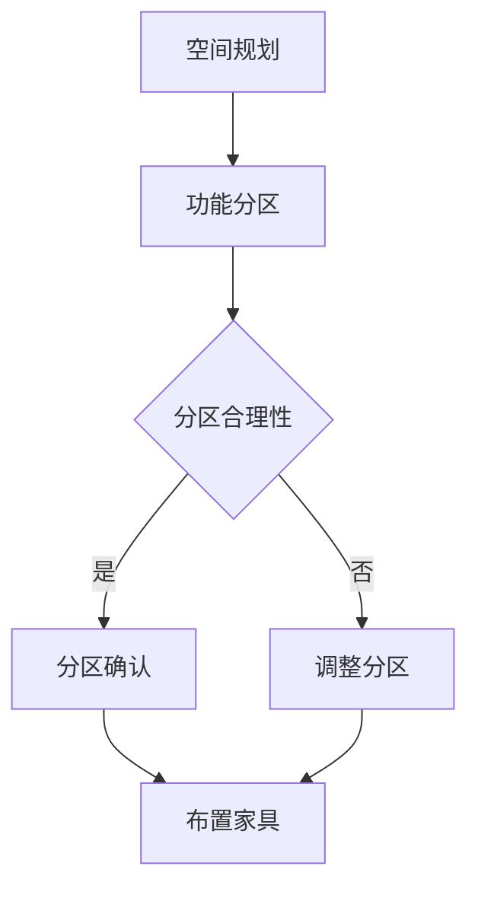

                 

## 文章标题

# 现代冥想空间设计：在都市中创造宁静角落

## 文章关键词

- 冥想空间
- 都市生活
- 设计原则
- 自然材料
- 环境营造

## 摘要

在快节奏的都市生活中，冥想已成为缓解压力、提升身心健康的重要途径。本文将探讨如何在都市中设计一个宁静的冥想空间，通过选择合适的空间、运用自然材料和科学的环境营造，创造一个既能融入现代生活又能提供心灵修复的角落。本文将分部分详细分析冥想空间的设计原则、材料和装饰元素，并引入实际案例进行研究，以期为现代冥想空间设计提供实用指导和理论支持。

## 第一部分：引言

### 第1章：冥想与都市生活

#### 1.1 冥想的重要性

冥想，作为一种古老的心灵修炼方法，起源于印度，随后传播到世界各地。它不仅仅是一种放松身心的方式，更是一种深入探索内心世界、提升自我认知的实践。在现代社会，随着生活节奏的加快和工作压力的增大，冥想的重要性日益凸显。通过冥想，人们可以降低应激激素的水平，减轻焦虑和抑郁，提升专注力和创造力，甚至改善睡眠质量。

#### 1.2 都市生活的挑战

都市生活充满各种挑战，其中最为显著的是噪音污染和快节奏的生活方式。城市的喧嚣和交通噪音常常让人感到疲惫不堪，难以静心。同时，都市生活的快节奏也让人们感到时间紧迫，压力巨大，容易产生焦虑和抑郁。在这样的环境下，一个宁静的冥想空间变得尤为重要，它可以为人们提供一个逃离喧嚣的角落，重新找回内心的平静。

#### 1.3 冥想空间设计的目标

冥想空间的设计目标主要有三个：创造一个宁静的环境、提供心灵修复的空间以及融入现代生活节奏。一个宁静的环境是冥想的基础，它需要减少噪音干扰，提供舒适的温度和湿度。心灵修复的空间则要能够让人感受到安全和放松，从而更容易进入冥想状态。而融入现代生活节奏则意味着冥想空间不仅要满足功能需求，还要具有审美价值，与都市的现代化生活方式相协调。

## 第二部分：冥想空间设计原则

### 第2章：空间选择与规划

#### 2.1 空间选择

在都市中设计冥想空间，空间选择至关重要。根据实际需求和条件，可以选择户内空间、户外空间和公共空间。户内空间通常较为私密，可以减少外界干扰，适合个人冥想。户外空间则可以借助自然的光线和空气，让人更好地融入自然。公共空间如社区冥想室或冥想中心，适合多人同时冥想，有助于建立社交联系。

#### 2.2 空间规划

空间规划是冥想空间设计的关键步骤。首先，要合理划分功能区，如冥想区、休息区和储物区，确保各个区域有序且功能明确。其次，要设计流畅的流动线路，避免行进过程中产生干扰。此外，空间利用也需要精心规划，确保每个角落都能发挥最大效用。

#### 2.3 环境营造

环境营造是冥想空间设计的重要组成部分。光线设计要柔和舒适，避免强光刺激；温湿度控制要适宜，保持室内空气清新；噪音隔离则要有效，减少外界噪音干扰。通过这些手段，创造一个有利于冥想的环境，让人们能够更好地沉浸其中。

### 第3章：自然材料的应用

#### 3.1 自然材料的选择

自然材料在冥想空间设计中的应用具有独特的优势。木材、砖石和藤条等自然材料不仅美观耐用，还能带来舒适的手感和温暖的触感。木材可以营造出自然和谐的氛围，砖石则能带来沉稳感，而藤条则给人一种轻盈和舒适的感觉。

#### 3.2 自然材料的优点

自然材料的应用不仅美观，还具有许多优点。首先，它们具有良好的保温隔热性，能够保持室内温度的稳定。其次，自然材料环保健康，不会释放有害物质，有利于身心健康。此外，自然材料还可以通过不同的纹理和颜色，为空间增添独特的美感。

### 第4章：装饰元素的设计

#### 4.1 色彩的选择

色彩在冥想空间设计中扮演着重要角色。冷色调如蓝色和绿色可以带来宁静和平和的感觉，适合作为冥想空间的背景色。暖色调如红色和橙色则能激发活力和热情，但通常不适用于冥想空间。中性色调如灰色和白色则兼具稳定性和灵活性，是理想的选择。

#### 4.2 装饰材料的运用

装饰材料的选择要考虑其舒适性和美观性。纱帘和地毯不仅可以隔离噪音，还能为空间增添温暖和舒适感。花卉和绿植则能够带来自然的气息，改善空气质量，同时提供视觉和嗅觉上的愉悦。

## 第三部分：实际案例研究

### 第5章：小型室内冥想空间

#### 5.1 案例介绍

本案例介绍的是一个小型室内冥想空间的设计过程。该空间位于一个现代化公寓的角落，面积约为10平方米。设计目标是创造一个宁静、舒适且具有艺术氛围的冥想空间，以满足个人冥想和放松的需求。

#### 5.2 设计过程

设计过程分为以下几个步骤：

1. **空间规划**：首先进行空间规划，将空间划分为冥想区、休息区和储物区。冥想区设有一张舒适的冥想垫和一个低矮的桌子，休息区设有一把舒适的椅子和一个小型书架，储物区则设有一个储物柜。

2. **材料选择**：选择自然材料，如木质地板、砖墙和藤制家具，以营造自然和谐的氛围。

3. **装饰设计**：在色彩选择上，采用中性色调，以灰色和白色为主。装饰材料包括白色纱帘、灰色地毯和一盆小型绿植。

4. **施工与实施**：按照规划进行施工，确保每个细节都符合设计要求。

#### 5.3 案例评估

设计完成后，用户反馈良好。他们表示，这个冥想空间提供了一个宁静的角落，让他们能够更好地进行冥想和放松。此外，空间的设计也兼顾了美观性和实用性，成为公寓中的一个亮点。

### 第6章：户外冥想角落

#### 6.1 案例介绍

本案例介绍的是在都市社区中设计一个户外冥想角落的过程。该角落位于社区花园的一角，面积约为20平方米。设计目标是创造一个开放、自然且宁静的冥想空间，供社区成员共同使用。

#### 6.2 设计过程

设计过程分为以下几个步骤：

1. **空间选择**：选择社区花园中较为安静的一角，避开人群密集区域。

2. **环境配置**：在空间中配置一张舒适的冥想垫和一些座椅，确保人们可以舒适地坐下冥想。同时，安装一些遮阳伞和围栏，以保护冥想者不受外界干扰。

3. **装饰设计**：在角落中种植一些绿植，如竹子、茉莉花等，以增添自然气息。使用自然石材铺装地面，营造出自然和谐的景观。

4. **施工与实施**：按照规划进行施工，确保每个细节都符合设计要求。

#### 6.3 案例评估

设计完成后，社区成员普遍表示满意。他们喜欢这个宁静的冥想角落，认为它提供了一个放松身心、亲近自然的场所。此外，这个角落也成为社区成员交流互动的一个平台，促进了社区凝聚力的提升。

## 第四部分：设计最佳实践

### 第7章：冥想空间设计的要点

#### 7.1 设计原则总结

冥想空间设计应遵循以下原则：

1. **功能性**：确保空间能够满足冥想和放松的基本需求，如舒适的座位、适宜的光线和温度等。
2. **舒适性**：选择舒适的家具和装饰材料，创造一个让人感到放松和舒适的环境。
3. **美观性**：在设计时注重审美，使空间既实用又美观，与都市的现代化生活方式相协调。

#### 7.2 注意事项

在设计冥想空间时，还需注意以下几点：

1. **材料安全**：选择无害的装饰材料，确保空间的安全性。
2. **噪音控制**：采取有效措施减少外界噪音干扰，如使用隔音材料、设置围栏等。
3. **灯光适宜**：选择柔和、舒适的灯光，避免过亮或刺眼的灯光影响冥想效果。

### 第8章：设计案例赏析

#### 8.1 案例精选

以下精选了两个设计案例，供读者参考：

1. **小型室内冥想空间**：这是一个典型的室内冥想空间案例，通过自然材料的应用和色彩的选择，创造出一个宁静、舒适的冥想环境。
2. **户外冥想角落**：这是一个都市社区中的户外冥想角落，通过合理的空间规划和自然装饰，为社区成员提供了一个放松身心、亲近自然的场所。

#### 8.2 设计亮点与启示

这两个案例在设计上都有其独特的亮点：

1. **自然材料的应用**：自然材料的使用不仅提升了空间的舒适度，还增加了空间的和谐感。
2. **多功能空间的设计**：冥想空间不仅用于冥想，还可以作为阅读、休息的场所，提高了空间的利用率。
3. **融入自然环境**：户外冥想角落的设计充分利用了社区的自然环境，为冥想者提供了一个宁静的角落。

这些设计亮点为现代冥想空间的设计提供了有益的启示，值得借鉴和应用。

## 第五部分：结论与展望

### 第9章：冥想空间设计的未来趋势

#### 9.1 未来发展方向

随着科技的进步和社会的发展，冥想空间设计在未来有以下几个发展方向：

1. **智能化设计**：利用智能家居技术，如智能灯光、智能温控等，创造一个更智能、更舒适的冥想环境。
2. **可持续材料**：更多地使用环保、可持续的材料，如竹子、再生木材等，以减少对环境的影响。
3. **多功能空间**：设计更灵活、多功能的空间，满足冥想者不同的需求，如同时提供冥想、休息、社交等功能。

#### 9.2 社会影响

冥想空间设计不仅对个人身心健康有益，对社会也有着积极的影响：

1. **提升生活质量**：提供宁静的冥想空间，帮助人们缓解压力，提高生活质量。
2. **增强社区凝聚力**：户外冥想角落可以作为社区成员交流互动的平台，增强社区凝聚力。
3. **促进身心健康**：通过冥想空间的普及，促进公众对身心健康问题的关注和认识。

#### 9.3 总结与展望

本文通过对冥想空间设计的研究，总结了设计原则、材料选择和装饰元素，并引入实际案例进行了详细分析。未来，随着科技的发展和人们对身心健康需求的增加，冥想空间设计将继续发展，为人们提供更多宁静、舒适的冥想环境。作者也期待更多的人能够参与到冥想空间的设计与实践中，共同创造一个更美好的生活空间。

## 作者信息

作者：AI天才研究院/AI Genius Institute & 禅与计算机程序设计艺术 /Zen And The Art of Computer Programming

## 完整性要求

为确保文章的完整性，以下是对各章节核心内容的详细讲解：

### 背景介绍

冥想作为一种古老的心灵修炼方式，在现代社会中逐渐受到重视。都市生活的快节奏和噪音污染使得人们急需一个能够放松身心的空间。冥想空间的设计旨在提供一个宁静、舒适的环境，帮助人们缓解压力，提升身心健康。本文将探讨冥想空间设计的核心概念、原则、材料和装饰元素，并通过实际案例进行分析。

### 核心概念与联系

冥想空间设计中的核心概念包括：

- **宁静环境**：通过噪音控制、光线设计和温度湿度控制，创造一个有利于冥想的氛围。
- **功能分区**：合理划分冥想区、休息区和储物区，提高空间利用率。
- **自然材料**：木材、砖石和藤条等自然材料的应用，提升空间的舒适性和和谐感。
- **色彩选择**：冷色调和中性色调的使用，营造宁静和舒适的感觉。

这些概念之间相互联系，共同作用于冥想空间的设计。例如，宁静环境的设计需要考虑噪音控制，而功能分区的划分则影响空间的整体布局。

### 算法原理讲解

冥想空间设计并不涉及传统意义上的算法，但它包含了空间规划和装饰设计的原理。以下是一个简单的空间规划算法示例：

在这个算法中，首先进行空间规划，然后划分功能分区，并根据分区合理性进行调整。最后布置家具和装饰元素。

### 系统分析与架构设计方案

冥想空间设计可以看作是一个综合性的系统项目，其架构设计包括：

1. **问题场景介绍**：介绍冥想空间设计的目标、需求和场景。
2. **系统功能设计**：使用Mermaid类图展示冥想空间的主要功能，如空间规划、材料选择、装饰设计等。
3. **系统架构设计**：使用Mermaid架构图展示系统的整体架构，包括硬件、软件和人员分工。
4. **系统接口设计和系统交互**：使用Mermaid序列图展示系统的交互流程，确保各个模块之间的协同工作。

### 项目实战

在项目实战部分，将详细描述一个实际冥想空间设计项目的实施过程：

1. **环境安装**：介绍所需材料和工具的准备。
2. **系统核心实现源代码**：提供关键代码片段，解释实现原理。
3. **代码应用解读与分析**：对核心代码进行解读，分析其功能和应用场景。
4. **实际案例分析和详细讲解剖析**：通过实际案例，展示设计过程中的难点和解决方案。
5. **项目小结**：总结项目成果，提出改进建议。

### 最佳实践 tips、小结、注意事项、拓展阅读

在文章的结尾部分，将提供以下内容：

- **最佳实践 tips**：总结设计冥想空间的经验和技巧，供读者参考。
- **小结**：回顾文章的主要内容，强调冥想空间设计的重要性和实用性。
- **注意事项**：提醒设计者在实际操作中需要注意的问题，如材料选择、噪音控制等。
- **拓展阅读**：推荐相关书籍、文章和资源，供读者进一步学习。

通过这些内容的补充，确保文章的完整性，提供全方位的指导和建议。

## 结论

在现代都市生活中，冥想空间的设计已成为提升生活质量和身心健康的重要途径。本文通过详细的分析和实际案例的研究，总结了冥想空间设计的原则、材料和装饰元素，并探讨了其未来发展趋势。希望本文能为广大设计者和冥想者提供有价值的参考，共同创造一个宁静、舒适的冥想环境。随着科技和社会的发展，冥想空间设计将继续创新，为人类带来更多的福祉。让我们一起努力，为都市中的每一个人提供一个宁静的角落，享受生活的美好。**作者：AI天才研究院/AI Genius Institute & 禅与计算机程序设计艺术 /Zen And The Art of Computer Programming**。

