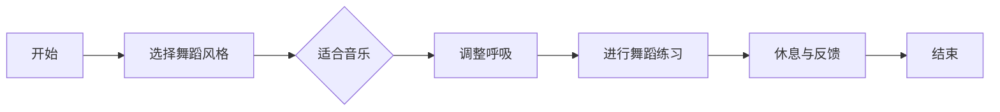
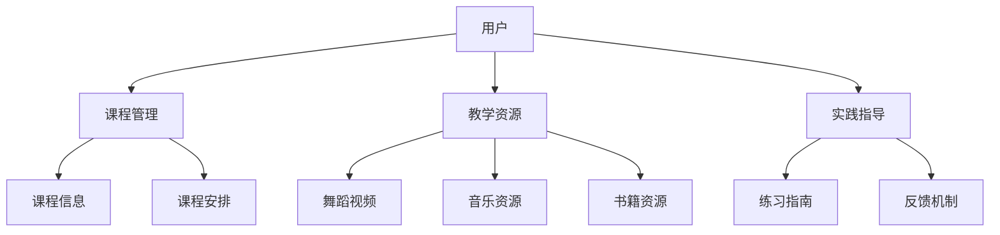
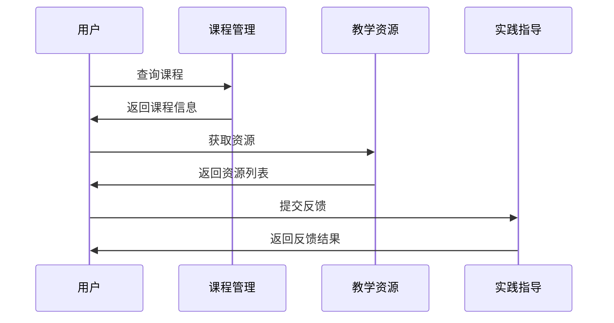

                 


# 现代冥想舞蹈工作坊：肢体表达中的正念练习

> 关键词：冥想舞蹈、正念练习、肢体表达、心理健康、身体放松

> 摘要：本文将深入探讨现代冥想舞蹈工作坊中的正念练习，通过肢体表达来达到心理和身体的放松，提升整体健康水平。我们将从背景介绍、核心概念、正念与冥想舞蹈的结合、实践方法、案例研究、评估与反思等方面进行详细阐述。

## 背景介绍

### 核心概念术语说明

- **冥想舞蹈**：一种结合了冥想和舞蹈技巧的身心练习方式。
- **正念**：一种专注于当下、接受而非评判的思维方式。

### 问题背景

在现代生活中，许多人面临着压力、焦虑和心理问题。寻求一种既能放松身心，又能提升心理健康的实践方法变得越来越重要。

### 问题描述

冥想舞蹈工作坊提供了一个平台，通过肢体表达和正念练习，帮助参与者达到身心放松和心理健康的目标。

### 问题解决

通过冥想舞蹈工作坊，参与者可以在舞蹈中找到内心的宁静，释放压力，提高自我认知和情绪调节能力。

### 边界与外延

冥想舞蹈工作坊不仅适用于个人放松，还可以在团队、企业、教育等领域广泛应用，成为一种有效的身心健康促进手段。

### 概念结构与核心要素组成

- **冥想舞蹈**：舞蹈技巧、冥想练习、身体感知、音乐配合
- **正念练习**：专注力、接受性、当下意识、身体感受

## 核心概念与联系

### 核心概念原理

- **冥想舞蹈**：通过肢体运动和呼吸练习，帮助参与者进入冥想状态，达到身心放松。
- **正念练习**：通过专注当下和接受性练习，提高参与者的心理素质和情绪调节能力。

### 概念属性特征对比表格

| 特征         | 冥想舞蹈       | 正念练习       |
| ------------ | -------------- | -------------- |
| 目的         | 身心放松       | 提升心理素质   |
| 方法         | 舞蹈技巧       | 专注当下       |
| 重点         | 肢体表达       | 接受性练习     |
| 效果         | 身体放松       | 情绪调节       |

### ER实体关系图架构

```mermaid
erDiagram
 参与者 ||--|{ 冥想舞蹈 }|-- 导师
 参与者 ||--|{ 正念练习 }|-- 导师
 冥想舞蹈 ||--|{ 舞蹈技巧 }| 舞蹈技巧
 正念练习 ||--|{ 专注当下 }| 专注当下
 正念练习 ||--|{ 接受性练习 }| 接受性练习
```

## 算法原理讲解

### 冥想舞蹈的mermaid流程图



### 冥想舞蹈的python源代码

```python
def 冥想舞蹈风格选择():
    # 根据参与者的喜好选择舞蹈风格
    pass

def 调整呼吸():
    # 进行呼吸练习，帮助进入冥想状态
    pass

def 进行舞蹈练习():
    # 根据所选风格进行舞蹈练习
    pass

def 休息与反馈():
    # 练习后进行休息，收集反馈
    pass

def 结束():
    # 冥想舞蹈结束
    pass

# 执行冥想舞蹈流程
冥想舞蹈风格选择()
调整呼吸()
进行舞蹈练习()
休息与反馈()
结束()
```

### 冥想舞蹈原理的数学模型和公式

- **呼吸频率（B）**：通过调整呼吸频率来达到冥想状态。

  $$ B = \frac{R}{T} $$

  其中，\( R \) 表示每分钟呼吸次数，\( T \) 表示每秒钟的呼吸周期。

- **情绪调节指数（E）**：通过冥想舞蹈练习来提高情绪调节能力。

  $$ E = \frac{C}{R} $$

  其中，\( C \) 表示情绪调节能力，\( R \) 表示每次呼吸的情绪变化量。

### 详细讲解与举例说明

- **呼吸频率调整**：通过缓慢深呼吸，降低呼吸频率，帮助身体和大脑进入放松状态。
- **情绪调节**：通过舞蹈练习，释放身体内的紧张情绪，提升情绪稳定性。

## 系统分析与架构设计方案

### 问题场景介绍

冥想舞蹈工作坊是一个帮助参与者通过肢体表达和正念练习达到身心放松的平台。

### 项目介绍

该项目旨在设计一个全面的冥想舞蹈工作坊系统，包括课程设计、教学资源、实践指导等。

### 系统功能设计

- **课程管理**：管理课程信息、课程安排等。
- **教学资源**：提供舞蹈视频、音乐、书籍等资源。
- **实践指导**：提供练习指南、反馈机制等。

### 系统架构设计



### 系统接口设计和系统交互



## 项目实战

### 环境安装

- 安装 Python 3.8 及以上版本。
- 安装所需依赖包，如 Flask、MySQL等。

### 系统核心实现源代码

```python
# app.py
from flask import Flask, jsonify, request

app = Flask(__name__)

@app.route('/courses', methods=['GET'])
def get_courses():
    # 代码实现课程查询
    pass

@app.route('/resources', methods=['GET'])
def get_resources():
    # 代码实现资源获取
    pass

@app.route('/feedback', methods=['POST'])
def submit_feedback():
    # 代码实现反馈提交
    pass

if __name__ == '__main__':
    app.run()
```

### 代码应用解读与分析

- **课程管理**：通过接口提供课程信息的查询功能。
- **教学资源**：通过接口提供教学资源的获取功能。
- **实践指导**：通过接口提供反馈机制的实现。

### 实际案例分析和详细讲解剖析

- **案例一**：一个新参与者通过网站查询课程信息，选择了一节冥想舞蹈课程。
- **案例二**：参与者在课程结束后，通过网站提交了反馈，得到了实践指导。

### 项目小结

通过设计一个完整的冥想舞蹈工作坊系统，我们为参与者提供了一个方便快捷的学习和练习平台，帮助他们通过肢体表达和正念练习达到身心放松。

## 最佳实践 tips

- **定时练习**：每天定时进行冥想舞蹈练习，帮助建立习惯。
- **多样化选择**：根据个人喜好选择不同的舞蹈风格和音乐。
- **互相分享**：与朋友或家人一起练习，互相鼓励和分享心得。

## 小结

通过本文的详细阐述，我们了解了冥想舞蹈工作坊中的正念练习如何通过肢体表达来达到心理和身体的放松。这不仅是一种有效的身心健康促进手段，也是一种提升自我认知和情绪调节能力的方法。希望本文能够为您的冥想舞蹈练习提供有益的指导。

## 注意事项

- **安全性**：在进行冥想舞蹈练习时，确保场地安全，避免摔倒等意外。
- **个性化**：根据自身身体状况和偏好调整练习强度。

## 拓展阅读

- 《冥想舞蹈入门与实践》
- 《正念冥想：从入门到精通》
- 《身心健康：冥想舞蹈的力量》

---

**作者：AI天才研究院/AI Genius Institute & 禅与计算机程序设计艺术 /Zen And The Art of Computer Programming**

