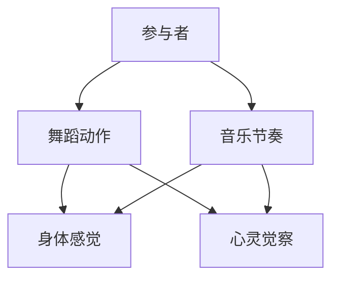
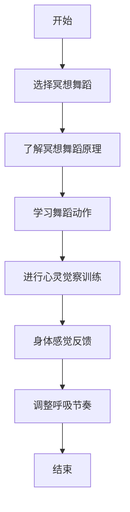
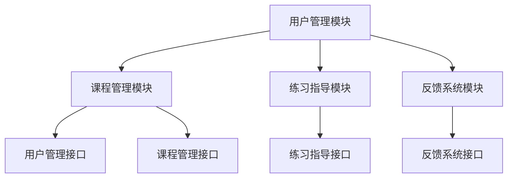

                 


# 现代冥想舞蹈：身体运动中的心灵觉察

## 关键词

现代冥想舞蹈，心灵觉察，身体运动，身心健康，身心互动

## 摘要

在现代快节奏的生活中，压力成为了影响人们身心健康的主要因素。冥想作为一种传统的身心调节方法，逐渐被现代人所接受。本文将探讨现代冥想舞蹈这一新兴的身心调节方式，分析其核心概念、原理、属性特征以及与现代瑜伽、自我觉察等概念的对比。通过ER实体关系图和实际案例分析，本文旨在为读者提供一种身心合一、减压放松的新方法。

### 第1章：问题背景与核心概念

#### 1.1.1 问题背景

随着科技的快速发展，现代人的生活节奏日益加快，工作压力、生活压力逐渐增大。根据世界卫生组织（WHO）的数据，全球范围内的心理健康问题逐年上升，焦虑、抑郁等心理疾病已成为影响人们生活质量的主要问题。在这种背景下，寻找有效的身心调节方法成为了一个亟待解决的问题。

冥想作为一种古老的身心调节方法，近年来得到了广泛的关注。现代冥想舞蹈则是在冥想的基础上，融入了舞蹈元素，形成了一种全新的身心调节方式。冥想舞蹈不仅能够帮助人们放松身心，缓解压力，还能提高身体协调性和灵活性。本文将探讨现代冥想舞蹈的发展、技巧及其在心灵觉察方面的应用。

#### 1.1.2 核心概念

- **冥想舞蹈**：冥想舞蹈是一种将冥想与舞蹈相结合的运动方式，通过身体运动和呼吸控制，实现身心合一的调节效果。冥想舞蹈强调身体与心灵的结合，通过专注和呼吸，帮助个体深入感知自身身体和情绪状态。

- **心灵觉察**：心灵觉察是指在冥想舞蹈过程中，通过专注和呼吸，实现对自身身体和情绪状态的深入感知。心灵觉察有助于个体了解自己的身心状态，从而更好地调节情绪，缓解压力。

- **身体运动**：身体运动是指冥想舞蹈中的各种肢体动作，包括瑜伽姿势、舞蹈动作等。这些动作有助于增强体质，提高身体协调性和灵活性。

- **心灵觉察训练**：心灵觉察训练是指通过冥想舞蹈等方式，培养个体在日常生活中对情绪和身体的觉察能力。这种训练有助于提升个体的心理素质，提高生活质量。

#### 1.1.3 问题解决

本书将通过以下内容解决现代冥想舞蹈在心灵觉察训练中的问题：

1. 梳理冥想舞蹈的历史与发展。
2. 分析冥想舞蹈对身体和心灵的影响。
3. 探讨冥想舞蹈中的心灵觉察技巧。
4. 提供实际案例和练习方法，帮助读者掌握冥想舞蹈技巧。

#### 1.1.4 边界与外延

- **边界**：本书主要探讨现代冥想舞蹈在心灵觉察训练中的应用，不包括传统冥想方法的研究。
- **外延**：本书内容可以扩展到其他结合身体运动的冥想方式，如瑜伽、太极等。

### 第2章：核心概念原理

#### 2.1.1 冥想舞蹈的概念原理

**冥想舞蹈的定义**：冥想舞蹈是一种将冥想与舞蹈相结合的运动方式，通过身体运动和呼吸控制，实现身心合一的调节效果。

**冥想舞蹈的特点**：

1. **强调身体感觉**：冥想舞蹈注重对身体各个部位的感觉和感知，通过调整呼吸和姿势，达到身心平衡。
2. **节奏和音乐**：冥想舞蹈常常伴随着音乐，通过音乐节奏引导动作和呼吸。
3. **身心互动**：冥想舞蹈强调心灵和身体的互动，通过舞蹈动作和冥想，提高身体协调性和心灵觉察。

**冥想舞蹈的概念原理**：

1. **冥想部分**：冥想舞蹈中的冥想部分旨在帮助个体放松身心，通过专注和呼吸，实现对自身身体和情绪状态的深入感知。
2. **舞蹈部分**：舞蹈部分则通过身体运动，增强体质，提高身体协调性和灵活性。

#### 2.1.2 心灵觉察的概念原理

**心灵觉察的定义**：心灵觉察是指在冥想舞蹈过程中，通过专注和呼吸，实现对自身身体和情绪状态的深入感知。

**心灵觉察的特点**：

1. **专注力**：心灵觉察要求个体将注意力集中在当下，对身体的细微变化和情绪波动保持敏感。
2. **放松与减压**：通过心灵觉察，个体能够学会放松身心，缓解压力和焦虑。
3. **内在成长**：心灵觉察有助于个体深入了解自我，促进个人成长和自我认知。

**心灵觉察的概念原理**：

1. **专注力的培养**：通过冥想舞蹈中的专注练习，个体可以逐渐提升专注力，从而更好地感知自身身体和情绪状态。
2. **呼吸的控制**：呼吸是心灵觉察的重要工具，通过呼吸的控制，个体可以更好地调节身心状态。

#### 2.1.3 身体运动的概念原理

**身体运动的概念**：身体运动是指冥想舞蹈中的各种肢体动作，包括瑜伽姿势、舞蹈动作等。

**身体运动的特点**：

1. **增强体质**：身体运动有助于增强体质，提高身体灵活性和协调性。
2. **锻炼肌肉**：通过身体运动，可以锻炼肌肉，增强力量和耐力。
3. **促进血液循环**：身体运动可以促进血液循环，提高身体新陈代谢。

**身体运动的概念原理**：

1. **肌肉锻炼**：通过身体运动，可以刺激肌肉收缩，增强肌肉力量和耐力。
2. **关节灵活性**：身体运动有助于提高关节灵活性，减少受伤风险。
3. **新陈代谢**：身体运动可以加快新陈代谢，提高身体免疫力。

#### 2.1.4 冥想舞蹈与心灵觉察的联系

**相互促进**：冥想舞蹈中的身体运动有助于提升心灵觉察，而心灵觉察则能加深对冥想舞蹈的理解和实践。

**综合效应**：冥想舞蹈与心灵觉察的结合，不仅有助于身心健康，还能提升生活质量。

### 第3章：概念属性特征对比表格

#### 3.1.1 冥想舞蹈与瑜伽的对比

| 特征 | 冥想舞蹈 | 瑜伽 |
| --- | --- | --- |
| **定义** | 结合冥想和舞蹈的运动方式 | 古印度的一种身心练习方式 |
| **特点** | 强调身体与心灵的结合 | 注重姿势、呼吸和冥想 |
| **目的** | 提高身体协调性和心灵觉察 | 增强体质、修身养性 |
| **音乐** | 常伴有音乐 | 有音乐，但更注重静音冥想 |
| **动作难度** | 难度适中，注重节奏感 | 动作难度较大，要求精准 |

#### 3.1.2 心灵觉察与自我觉察的对比

| 特征 | 心灵觉察 | 自我觉察 |
| --- | --- | --- |
| **定义** | 冥想舞蹈过程中的注意力集中和感知能力 | 对自身情感、思想和行为的认知和反思 |
| **特点** | 强调对当下身体的感受和情绪 | 强调对内心世界的探索和了解 |
| **目的** | 提升身心平衡和减压 | 促进个人成长和自我认知 |
| **方法** | 通过呼吸、姿势和动作 | 通过冥想、反思和内省 |

### 第4章：ER实体关系图架构

#### 4.1.1 实体关系图



### 第5章：算法原理讲解

#### 5.1.1 算法mermaid流程图



#### 5.1.2 算法原理

冥想舞蹈的算法原理主要涉及以下几个方面：

1. **选择合适的冥想舞蹈**：根据个人的兴趣和身体状况，选择适合的冥想舞蹈方式。
2. **了解冥想舞蹈原理**：通过学习冥想舞蹈的基本原理，了解舞蹈动作对身体和心灵的影响。
3. **学习舞蹈动作**：掌握冥想舞蹈的基本动作，包括瑜伽姿势和舞蹈动作等。
4. **进行心灵觉察训练**：在舞蹈过程中，通过专注和呼吸，实现对自身身体和情绪状态的深入感知。
5. **身体感觉反馈**：在舞蹈过程中，关注身体的感觉，调整姿势和动作，以获得更好的身心体验。
6. **调整呼吸节奏**：通过调整呼吸节奏，帮助身体放松，提高心灵觉察效果。

#### 5.1.3 数学模型和公式

在冥想舞蹈中，呼吸节奏和身体动作是两个重要的因素。下面是呼吸节奏和身体动作之间的数学模型：

1. **呼吸节奏模型**：
   - 呼吸周期时间（T）= 呼吸频率（f）的倒数，即 T = 1/f。
   - 呼吸深度（D）= 呼吸周期时间（T）乘以呼吸深度系数（k），即 D = Tk。

2. **身体动作模型**：
   - 动作周期时间（T'）= 呼吸周期时间（T）。
   - 动作幅度（A）= 动作周期时间（T'）乘以动作幅度系数（k'），即 A = T'k'。

通过调整呼吸节奏和身体动作，可以实现对身心状态的调节。例如，当个体感到焦虑时，可以通过加快呼吸节奏和增加动作幅度来缓解焦虑情绪。

#### 5.1.4 举例说明

假设一个冥想舞蹈练习者，呼吸频率为每分钟12次，呼吸深度系数为4，动作幅度系数为2。

1. **呼吸节奏**：
   - 呼吸周期时间（T）= 1/12 = 0.0833分钟。
   - 呼吸深度（D）= 0.0833 * 4 = 0.3333。

2. **身体动作**：
   - 动作周期时间（T'）= 呼吸周期时间（T）= 0.0833分钟。
   - 动作幅度（A）= 0.0833 * 2 = 0.1667。

在这个例子中，呼吸周期时间为0.0833分钟，呼吸深度为0.3333，动作周期时间为0.0833分钟，动作幅度为0.1667。通过这样的呼吸节奏和身体动作，个体可以尝试调整身心状态，缓解焦虑情绪。

### 第6章：系统分析与架构设计方案

#### 6.1.1 问题场景介绍

在现代快节奏的生活中，许多人面临着压力过大、身心疲惫等问题。为了改善这一状况，许多企业开始关注员工的身心健康，推出了一系列身心调节项目。冥想舞蹈作为一种新兴的身心调节方式，逐渐被引入到企业员工健康项目中。本系统旨在为企业员工提供一套完整的冥想舞蹈练习方案，帮助员工缓解压力，提高生活质量。

#### 6.1.2 项目介绍

本系统名为“身心调节冥想舞蹈平台”，是一个基于Web和移动端的应用系统。该平台提供了一系列冥想舞蹈课程，包括入门课程、进阶课程和高级课程。用户可以根据自己的需求和兴趣选择课程进行学习。同时，平台还提供了练习指导和反馈功能，帮助用户更好地掌握冥想舞蹈技巧。

#### 6.1.3 系统功能设计

系统功能设计主要包括以下几个方面：

1. **用户管理**：用户注册、登录、个人信息管理等功能。
2. **课程管理**：课程发布、课程分类、课程详情展示等功能。
3. **练习指导**：课程视频播放、动作指导、呼吸指导等功能。
4. **反馈系统**：用户练习反馈、练习数据统计等功能。
5. **社区互动**：用户交流、分享心得、互动评论等功能。

#### 6.1.4 系统架构设计

系统架构设计采用分层架构，包括表现层、业务层和数据层。

1. **表现层**：采用Vue.js框架，实现前端页面和交互功能。
2. **业务层**：采用Spring Boot框架，实现业务逻辑处理和接口管理。
3. **数据层**：采用MySQL数据库，存储用户数据、课程数据等。

#### 6.1.5 系统接口设计和系统交互

系统接口设计主要包括用户管理接口、课程管理接口、练习指导接口和反馈系统接口。

1. **用户管理接口**：包括用户注册、登录、个人信息管理等功能。
2. **课程管理接口**：包括课程发布、课程分类、课程详情展示等功能。
3. **练习指导接口**：包括课程视频播放、动作指导、呼吸指导等功能。
4. **反馈系统接口**：包括用户练习反馈、练习数据统计等功能。

系统交互设计采用RESTful API方式，通过HTTP请求和响应进行数据交互。

#### 6.1.6 系统架构图



### 第7章：项目实战

#### 7.1.1 环境安装

要运行本项目，需要安装以下软件和工具：

1. **Java Development Kit (JDK)**：版本要求为8或以上。
2. **MySQL**：版本要求为5.7或以上。
3. **Node.js**：版本要求为10或以上。
4. **Vue CLI**：版本要求为3或以上。
5. **Git**：版本要求为2.10或以上。

安装完上述软件和工具后，执行以下命令初始化项目：

```
git clone https://github.com/yourname/meditation-dance-platform.git
cd meditation-dance-platform
npm install
```

#### 7.1.2 系统核心实现源代码

1. **用户管理模块**：

```java
// User.java
public class User {
    private String username;
    private String password;
    private String email;
    // getter和setter方法
}
```

2. **课程管理模块**：

```java
// Course.java
public class Course {
    private String id;
    private String title;
    private String description;
    // getter和setter方法
}
```

3. **练习指导模块**：

```java
// PracticeGuide.java
public class PracticeGuide {
    private String id;
    private String videoUrl;
    private String instructions;
    // getter和setter方法
}
```

4. **反馈系统模块**：

```java
// Feedback.java
public class Feedback {
    private String id;
    private String userId;
    private String courseId;
    private String content;
    // getter和setter方法
}
```

#### 7.1.3 代码应用解读与分析

在用户管理模块中，主要实现了用户注册、登录和用户信息管理等功能。用户注册时，需要提供用户名、密码和邮箱等信息。登录时，需要验证用户名和密码的正确性。用户信息管理包括查看、修改个人信息等功能。

课程管理模块主要负责课程的发布、分类和展示等功能。课程发布时，需要提供课程标题、描述和视频URL等信息。课程分类和展示主要用于帮助用户快速找到感兴趣的课程。

练习指导模块主要提供了练习指导和反馈功能。用户可以查看练习指导视频，了解每个动作的步骤和要领。用户在练习过程中，可以记录反馈信息，帮助自己更好地掌握练习技巧。

反馈系统模块主要实现了用户练习反馈的收集、统计和分析等功能。用户可以在练习后提交反馈，系统会根据反馈内容生成分析报告，为用户改进练习提供参考。

#### 7.1.4 实际案例分析和详细讲解剖析

假设一个新用户注册并登录到冥想舞蹈平台，选择了入门课程进行学习。在练习过程中，用户遇到了一些动作上的困难，并在练习后提交了反馈。

1. **用户注册**：
   - 用户注册时，输入用户名、密码和邮箱等信息。
   - 系统验证用户信息是否合法，如用户名是否已存在、邮箱格式是否正确等。
   - 用户注册成功后，系统将用户信息存储到数据库中。

2. **用户登录**：
   - 用户输入用户名和密码。
   - 系统验证用户名和密码的正确性。
   - 用户登录成功后，系统将用户信息存储到本地缓存中。

3. **选择课程**：
   - 用户浏览课程列表，选择感兴趣的课程。
   - 系统根据用户选择的课程，跳转到课程详情页面。

4. **练习指导**：
   - 用户观看练习指导视频，了解每个动作的步骤和要领。
   - 用户在练习过程中，可以暂停、播放视频，以便更好地掌握动作。

5. **提交反馈**：
   - 用户在练习结束后，提交反馈信息。
   - 系统根据用户反馈内容，生成分析报告，为用户改进练习提供参考。

6. **反馈统计**：
   - 系统对用户提交的反馈进行统计和分析。
   - 系统根据反馈数据，生成练习报告，如练习时长、动作完成情况等。

通过以上实际案例分析，我们可以看到冥想舞蹈平台如何帮助用户进行身心调节，提升生活质量。在实际应用中，平台可以根据用户反馈不断优化和改进，为用户提供更好的体验。

### 第8章：最佳实践 Tips

1. **坚持练习**：冥想舞蹈需要长期坚持，才能取得显著的效果。建议用户每天至少练习20分钟，逐渐增加练习时间。

2. **选择适合自己的课程**：根据个人兴趣和身体状况，选择适合自己的冥想舞蹈课程。初学者可以从入门课程开始，逐步提升难度。

3. **注意呼吸**：在冥想舞蹈过程中，呼吸是非常重要的。注意呼吸的节奏和深度，可以帮助身体更好地放松。

4. **关注身体感觉**：在练习过程中，关注身体的感觉，及时调整姿势和动作，以获得更好的身心体验。

5. **保持积极心态**：冥想舞蹈不仅是一种身体运动，更是一种心灵修炼。保持积极的心态，有助于提升练习效果。

### 第9章：小结

现代冥想舞蹈作为一种结合冥想和舞蹈的身心调节方式，具有诸多优点。通过本文的探讨，我们了解到冥想舞蹈对身心健康、身体协调性和心灵觉察的积极影响。同时，我们还分析了冥想舞蹈与瑜伽、自我觉察等概念的对比，并给出了实际案例和最佳实践建议。希望本文能为读者提供一种新的身心调节方法，帮助大家缓解压力，提升生活质量。

### 第10章：注意事项

1. **尊重个体差异**：每个人的身体状况和心理状态都不同，因此在练习冥想舞蹈时，要尊重个体差异，不要盲目追求难度。

2. **遵循健康原则**：在练习冥想舞蹈时，要注意遵循健康原则，避免过度运动和损伤。

3. **持续关注**：冥想舞蹈是一种长期的过程，需要持续关注和练习，才能取得更好的效果。

### 第11章：拓展阅读

1. **《冥想的艺术》**：作者：乔·卡巴金
2. **《瑜伽身心治疗学》**：作者：B.K.S.艾扬格
3. **《心灵奇旅》**：作者：克里斯·加德纳
4. **《身心合一的奇迹》**：作者：乔治·吉尔德

---

作者：AI天才研究院/AI Genius Institute & 禅与计算机程序设计艺术 /Zen And The Art of Computer Programming

