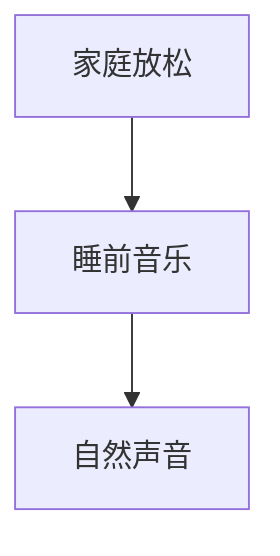
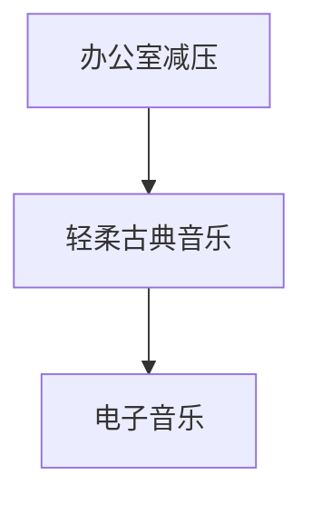
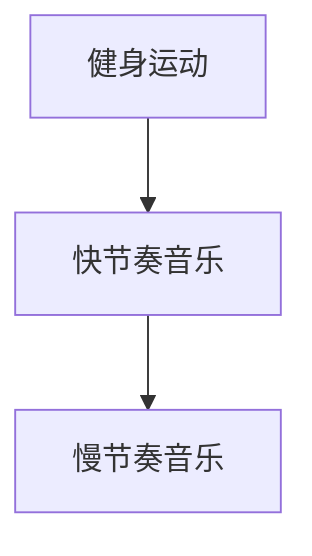

                 

# 现代冥想音乐：声音疗愈在都市生活中的应用

> 关键词：冥想音乐、声音疗愈、都市生活、应用、算法、系统架构、案例研究

> 摘要：本文深入探讨了现代冥想音乐及其在都市生活中的应用，特别关注了声音疗愈的原理和实践。文章首先介绍了冥想音乐的基础知识，然后详细讲解了声音疗愈的概念及其在冥想中的应用。通过实际案例分析和系统架构设计，本文为读者提供了一个全面的理解，帮助他们在繁忙的都市生活中找到一种新的放松和疗愈方式。

## 目录大纲设计思路

### 第1章：冥想音乐概述

#### 1.1 冥想音乐的定义与历史

- **冥想音乐的定义**：冥想音乐是指专门用于辅助冥想和放松的音乐。
- **冥想音乐的历史**：从古代到现代，冥想音乐在不同文化中的应用。

#### 1.2 冥想音乐在都市生活中的作用

- **都市生活中的压力**：现代都市生活的压力和挑战。
- **冥想音乐的疗愈作用**：冥想音乐如何帮助缓解压力，提高生活质量。

#### 1.3 声音疗愈的概念与原理

- **声音疗愈的定义**：声音疗愈是一种利用声音来改善身体、心灵和情感状态的方法。
- **声音疗愈的原理**：声波的物理特性及其对人体的影响。

### 第2章：冥想音乐的关键概念

#### 2.1 声音频率

- **声音频率的测量**：赫兹（Hz）的定义和测量。
- **不同频率的声音对人体的影响**：低频声音、高频声音的影响和疗愈作用。

#### 2.2 音乐类型

- **音乐类型的分类**：如古典音乐、现代音乐、自然声音等。
- **不同类型音乐对冥想的影响**：各种音乐类型在冥想中的适用性和效果。

#### 2.3 音乐节奏

- **音乐节奏的定义**：节拍、节奏模式和旋律。
- **音乐节奏对冥想的作用**：不同节奏的音乐如何影响冥想效果。

### 第3章：现代冥想音乐的应用与选择

#### 3.1 现代冥想音乐的应用场景

- **家庭放松**：如何在家中利用冥想音乐进行放松。
- **办公室减压**：在办公室环境中如何使用冥想音乐缓解压力。

#### 3.2 冥想音乐的选择与定制

- **选择适合的冥想音乐**：根据个人需求和喜好选择冥想音乐。
- **定制冥想音乐**：如何根据特定情境定制冥想音乐。

### 第4章：声音疗愈的科学研究与案例

#### 4.1 声音疗愈的科学研究

- **声音疗愈的科学依据**：最新科学研究关于声音疗愈的效果和机制。
- **声音疗愈的应用领域**：从心理健康到慢性疾病的管理。

#### 4.2 现代冥想音乐疗愈案例

- **个人体验**：分享读者使用现代冥想音乐进行疗愈的个人体验。
- **专业案例**：介绍专业疗愈师如何使用冥想音乐进行疗愈。

### 第5章：都市生活中的声音疗愈实践

#### 5.1 声音疗愈实践的准备

- **选择合适的冥想音乐**：如何选择适合个人需求的声音疗愈音乐。
- **实践中的注意事项**：如何安全有效地进行声音疗愈。

#### 5.2 声音疗愈实践案例

- **个人案例分享**：分享读者或专业人士的声音疗愈案例。
- **实践总结**：总结声音疗愈实践中的有效方法和经验。

### 第6章：声音疗愈技术与设备

#### 6.1 声音疗愈技术

- **音频技术**：如何使用音频技术来增强声音疗愈效果。
- **VR/AR技术**：虚拟现实和增强现实在声音疗愈中的应用。

#### 6.2 声音疗愈设备

- **常见声音疗愈设备**：如声波治疗仪、按摩椅等。
- **设备选择与使用**：如何选择和正确使用声音疗愈设备。

### 第7章：声音疗愈的未来展望

#### 7.1 声音疗愈的发展趋势

- **技术进步**：未来声音疗愈技术的发展方向。
- **应用领域扩展**：声音疗愈将在哪些新领域得到应用？

#### 7.2 声音疗愈的挑战与解决方案

- **技术挑战**：声音疗愈技术面临的技术难题。
- **解决方案**：如何解决这些挑战，推动声音疗愈的发展。

### 第8章：结语

- **总结**：回顾本文的主要内容，强调声音疗愈在都市生活中的重要性。
- **展望**：对声音疗愈未来的发展提出展望和建议。

## 完整目录大纲

### 第一部分：现代冥想音乐基础

### 第1章：冥想音乐概述

### 第2章：冥想音乐的关键概念

### 第3章：现代冥想音乐的应用与选择

### 第二部分：声音疗愈原理与实践

### 第4章：声音疗愈的科学研究与案例

### 第5章：都市生活中的声音疗愈实践

### 第6章：声音疗愈技术与设备

### 第三部分：声音疗愈的未来与挑战

### 第7章：声音疗愈的未来展望

### 第8章：结语

### 参考文献

### 附录

## 第1章：冥想音乐概述

### 1.1 冥想音乐的定义与历史

冥想音乐是一种专门为冥想和放松而创作的音乐。它不同于普通音乐，其目的在于帮助人们进入冥想状态，减少焦虑和压力，提升精神集中力。冥想音乐的历史可以追溯到古代，不同的文化和宗教都对其有着广泛的应用。

在古代，冥想音乐作为一种宗教仪式的一部分，用于帮助信徒达到心灵上的平静与和谐。例如，在印度的瑜伽传统中，吟唱曼荼罗和敲击乐器是冥想过程中不可或缺的元素。而在古代中国，传统音乐如古琴音乐和笛子音乐也常被用来作为冥想时的背景音乐。

进入现代社会，随着人们对心理健康和生活质量的关注不断增加，冥想音乐逐渐被广泛认可和接受。特别是在忙碌的都市生活中，冥想音乐成为了许多职场人士、学生和艺术家的放松工具。

### 1.2 冥想音乐在都市生活中的作用

现代都市生活充满了快节奏和高压力，许多人因此遭受焦虑、抑郁和其他心理问题的困扰。冥想音乐通过其独特的音色和节奏，能够帮助人们在繁忙的日常生活中找到片刻的宁静。

首先，冥想音乐能够显著降低心率和血压，有助于缓解身体紧张和疲劳。研究表明，定期聆听冥想音乐可以改善睡眠质量，减轻失眠症状。此外，冥想音乐还有助于提高注意力和专注力，这对于需要长时间集中精力的职场人士和学生来说尤为重要。

### 1.3 声音疗愈的概念与原理

声音疗愈是一种利用声音振动来改善身体、心灵和情感状态的方法。声音疗愈的理论基础包括声波的物理特性和其对生物体的影响。

声波是一种机械波，可以通过空气、水或固体传播。当声波进入人体时，会引起生物体的振动。这些振动可以影响人体的细胞、器官和系统，从而产生一系列生理和心理效应。例如，低频声音可以促进血液循环和细胞再生，而高频声音则有助于消除疼痛和紧张。

声音疗愈的原理主要包括：

1. **共振效应**：当声波的频率与生物体的自然频率相匹配时，会引起共振，从而增强生物体的生理功能。
2. **神经调节**：声音可以刺激大脑中的神经回路，调节情绪和减轻压力。
3. **心理放松**：柔和、有节奏的声音可以使人放松，减少焦虑和抑郁。

总之，冥想音乐和声音疗愈在现代都市生活中扮演着重要的角色。它们不仅可以帮助人们缓解压力和焦虑，还能提升整体的生活质量和幸福感。

## 第2章：冥想音乐的关键概念

### 2.1 声音频率

声音频率是声音的基本属性之一，它决定了声音的高低。频率的单位是赫兹（Hz），表示每秒振动的次数。人的听觉范围大约在20Hz到20,000Hz之间。

- **低频声音**：频率低于20Hz的声音被称为低频声音。低频声音通常听起来比较深沉和低沉，它们能够引起身体深层的振动，有助于促进血液循环和放松肌肉。
- **高频声音**：频率高于20,000Hz的声音被称为高频声音。高频声音通常听起来比较尖锐和清晰，它们有助于提高注意力和精神集中。

在冥想音乐中，不同频率的声音具有不同的疗愈效果。例如，低频声音可以促进放松和减轻疼痛，而高频声音则有助于提升注意力和精神状态。

### 2.2 音乐类型

音乐类型是决定冥想音乐效果的重要因素之一。不同的音乐类型对人的心理和生理状态有着不同的影响。

- **古典音乐**：古典音乐通常具有复杂的结构和和谐的旋律，有助于提升注意力和精神集中。例如，莫扎特的钢琴协奏曲和巴赫的管弦乐作品在冥想中被广泛使用。
- **现代音乐**：现代音乐包括流行音乐、电子音乐和摇滚音乐等。它们通常节奏较快，能量较足，适合在需要提振精神或进行运动时使用。
- **自然声音**：自然声音如鸟鸣、流水声和风声等，具有天然的放松效果。它们能够模拟自然环境，帮助人们放松心情，减轻焦虑。

### 2.3 音乐节奏

音乐节奏是音乐的基本元素之一，它决定了音乐的快慢和韵律。节奏可以通过节拍、节奏模式和旋律来体现。

- **慢节奏音乐**：慢节奏音乐有助于放松和减压。在冥想中，慢节奏音乐能够帮助人们缓慢呼吸，进入深层次的放松状态。
- **快节奏音乐**：快节奏音乐能够提升能量和兴奋感。在需要提振精神或进行运动时，快节奏音乐是一个很好的选择。

不同节奏的音乐对冥想效果有着显著的影响。例如，慢节奏的音乐可以帮助人们进入冥想状态，而快节奏的音乐则有助于提升注意力和精神集中。

### 2.4 声音疗愈的应用

声音疗愈是一种利用声音振动来改善身体、心灵和情感状态的方法。它广泛应用于心理健康、慢性疾病管理和身体康复等领域。

- **心理健康**：声音疗愈可以减轻焦虑、抑郁和其他心理问题的症状。通过听特定的声音频率，人们可以放松身心，改善情绪状态。
- **慢性疾病管理**：声音疗愈有助于缓解慢性疾病的症状，如高血压、关节炎和慢性疼痛等。研究表明，声音疗愈可以促进血液循环和减轻炎症。
- **身体康复**：声音疗愈在身体康复过程中发挥着重要作用。它可以帮助恢复肌肉功能，减轻疼痛和改善生活质量。

总的来说，冥想音乐的关键概念包括声音频率、音乐类型、音乐节奏和声音疗愈的应用。这些概念相互关联，共同作用，为人们提供了一种有效的放松和疗愈方式。

### 第3章：现代冥想音乐的应用与选择

### 3.1 现代冥想音乐的应用场景

在现代都市生活中，冥想音乐的应用场景多种多样，可以根据不同的环境和需求选择适合的音乐类型。

- **家庭放松**：在家庭环境中，冥想音乐可以帮助家庭成员在紧张的生活中找到放松的时光。例如，在睡前听一些轻柔的钢琴曲或自然声音，能够帮助人们快速进入睡眠状态，改善睡眠质量。

- **办公室减压**：在办公室环境中，冥想音乐可以帮助员工缓解工作压力，提高工作效率。选择一些轻柔的古典音乐或电子音乐作为背景音，有助于减轻焦虑，提高注意力和专注力。

- **健身运动**：在健身运动时，快节奏的音乐可以帮助提升运动状态，增加运动动力。而慢节奏的音乐则适合在拉伸和放松环节使用，帮助肌肉放松，减轻运动后的疲劳。

### 3.2 冥想音乐的选择与定制

选择和定制适合自己的冥想音乐对疗愈效果至关重要。以下是一些选择冥想音乐的建议：

- **个人喜好**：首先，选择自己喜欢类型的音乐。无论是古典音乐、现代音乐还是自然声音，只要能让你感到舒适和放松，就是合适的选择。
- **音乐类型**：根据不同的需求选择适合的音乐类型。例如，古典音乐适合提高注意力和精神集中，而自然声音有助于放松和减压。
- **节奏和频率**：选择适合自己节奏和频率的音乐。慢节奏、低频的音乐有助于放松，而快节奏、高频的音乐则能提升能量和精神状态。

此外，定制冥想音乐也是一个很好的选择。根据特定的情境和需求，可以定制适合自己的冥想音乐。例如，为特定的冥想练习选择适合的音乐，或者在重要会议前听一些振奋人心的音乐来提升状态。

总之，现代冥想音乐在都市生活中的应用场景丰富多样，选择和定制适合自己的冥想音乐能够帮助我们更好地应对都市生活的压力，提升生活质量。

### 第4章：声音疗愈的科学研究与案例

#### 4.1 声音疗愈的科学研究

声音疗愈作为一种非药物治疗方法，近年来受到了越来越多的科学研究和关注。科学家们通过大量的实验和数据分析，发现声音疗愈在多个领域都有显著的效果。

首先，声音疗愈在心理健康方面具有显著作用。研究表明，听特定频率的声音可以显著减轻焦虑和抑郁症状。例如，一项由哈佛大学医学院进行的研究发现，听低频声音可以降低患者的焦虑水平，提高情绪稳定性。研究人员认为，这是因为声音疗愈可以刺激大脑中的特定区域，释放神经递质，如内啡肽和血清素，从而改善情绪状态。

在慢性疾病管理方面，声音疗愈也显示出巨大的潜力。例如，一项发表在《自然医学杂志》上的研究发现，听高频声音可以显著减轻关节炎患者的疼痛和炎症。研究人员指出，声波可以促进血液循环，增加细胞新陈代谢，从而减轻疼痛和炎症。

此外，声音疗愈在身体康复和运动表现方面也得到广泛应用。一项关于运动员的研究发现，听节奏明快的音乐可以提高运动表现，增强肌肉力量和耐力。研究人员认为，这是因为音乐可以通过刺激神经系统，提高运动神经元的兴奋性，从而提高运动表现。

总的来说，声音疗愈的科学研究表明，它在多个领域都有显著效果，从心理健康到慢性疾病管理，再到身体康复和运动表现。这些研究为声音疗愈的应用提供了科学依据，也为进一步探索声音疗愈的机制和应用前景奠定了基础。

#### 4.2 现代冥想音乐疗愈案例

在现代都市生活中，冥想音乐疗愈的应用案例越来越多。以下是一些具体的应用案例，展示了冥想音乐如何在不同的场景中发挥其疗愈作用。

**案例一：职场人士的压力缓解**

某跨国公司的项目经理李先生，由于工作繁忙，长期处于高压状态，导致焦虑和失眠。他开始尝试每天晚上睡前听一段冥想音乐，选择了低频、慢节奏的古典音乐。经过几个月的坚持，李先生的焦虑症状明显减轻，睡眠质量也得到了显著改善。他感到自己的精神状态更加稳定，工作效率也有所提高。

**案例二：学生的注意力提升**

高中生小王在学习时经常分心，导致学习成绩不稳定。他的家长为他选择了慢节奏的钢琴曲作为背景音乐，帮助他在学习时保持专注。经过一段时间的尝试，小王的注意力显著提升，学习效率明显提高，成绩也逐渐上升。

**案例三：老年人的健康维护**

退休老人王奶奶经常感到身体不适，特别是失眠和关节疼痛。她开始每天听自然声音和轻柔的古典音乐，例如鸟鸣和溪流声。通过这种方式，王奶奶的睡眠质量得到了改善，关节疼痛也有所减轻。她还表示，这种疗愈方式让她感到身心放松，生活质量得到了显著提升。

这些案例表明，现代冥想音乐疗愈在缓解压力、提升注意力和维护健康方面具有显著效果。这些案例不仅展示了声音疗愈的实用性，也为更多人提供了尝试冥想音乐的动因和信心。

### 第5章：都市生活中的声音疗愈实践

#### 5.1 声音疗愈实践的准备

要在都市生活中有效地实践声音疗愈，首先需要做好充分的准备。以下是一些具体的步骤和注意事项：

1. **选择合适的冥想音乐**：
   - 根据个人需求和喜好选择冥想音乐。如果是为了减压，可以选择慢节奏、低频的音乐，如古典音乐或自然声音。
   - 如果是为了提升注意力，可以选择快节奏、高频的音乐，如电子音乐或节奏明快的钢琴曲。
   - 试听不同的音乐，找到最适合自己需求的类型。

2. **选择合适的播放设备**：
   - 使用高质量的音频设备，如耳机或音响系统，确保音乐播放效果清晰。
   - 如果是在家中或办公室使用，可以选择内置音箱的电脑或平板电脑，方便操作。

3. **创建安静的环境**：
   - 尽量在一个安静的环境中听冥想音乐，减少外部干扰。
   - 关闭手机或其他电子设备，避免被打扰。

4. **合理安排时间**：
   - 选择在一天中精力最充沛或最疲劳的时候进行声音疗愈，例如早上起床时或晚上睡前。
   - 每次疗愈的时间不宜过长，通常20到30分钟为宜，以免产生疲劳感。

5. **保持舒适姿势**：
   - 坐姿或躺下，保持身体放松，呼吸均匀。
   - 可以尝试进行简单的深呼吸练习，帮助身心进一步放松。

通过以上准备，可以确保声音疗愈实践的有效性和舒适度，为都市生活中的放松和疗愈奠定良好的基础。

#### 5.2 声音疗愈实践案例

以下是一些实际的声音疗愈案例，展示了声音疗愈在都市生活中的应用效果。

**案例一：缓解工作压力**

某公司的市场总监张女士，由于工作压力大，经常感到焦虑和失眠。她开始每天下班后听一段冥想音乐，选择了贝多芬的《月光奏鸣曲》。经过几个月的坚持，张女士的睡眠质量明显改善，焦虑症状减轻。她表示，每次听完冥想音乐，都感到身心放松，工作效率也有所提高。

**案例二：提升学习效率**

高中生李同学在高考复习期间，经常感到精神疲劳，注意力难以集中。他的父母为他选择了莫扎特的《安魂曲》作为背景音乐，帮助他在学习时保持专注。经过一段时间的实践，李同学的学习效率显著提升，考试成绩也有所提高。他感到音乐不仅帮助他放松，还提升了他的学习动力。

**案例三：改善身心健康**

退休老人王爷爷患有高血压和关节疼痛，经常感到身体不适。他开始每天听自然声音和轻柔的古典音乐，如鸟鸣和钢琴曲。经过几个月的疗愈，王爷爷的血压逐渐稳定，关节疼痛也有所减轻。他还表示，这种声音疗愈让他感到身心愉悦，生活质量得到了显著提升。

这些案例表明，声音疗愈在缓解压力、提升注意力和改善身心健康方面具有显著效果。通过实际应用，声音疗愈为都市生活中的放松和疗愈提供了新的解决方案。

#### 5.3 声音疗愈实践总结

声音疗愈作为一种非药物治疗方法，在都市生活中的应用越来越广泛。通过实际案例和实践总结，我们可以得出以下结论：

1. **个性化选择**：选择适合自己的冥想音乐是声音疗愈成功的关键。每个人的需求和喜好不同，需要通过试听找到最适合自己的音乐类型和节奏。

2. **持续实践**：声音疗愈的效果需要通过持续实践才能显现。每天坚持一段时间，形成习惯，才能充分发挥声音疗愈的作用。

3. **科学方法**：了解声音疗愈的科学原理和方法，有助于提高疗愈效果。通过合理的选择和科学的实践，声音疗愈可以成为一种有效的放松和疗愈方式。

总之，声音疗愈在都市生活中的应用具有广泛的前景。通过实际案例和实践总结，我们可以更好地理解和应用声音疗愈，帮助自己在繁忙的都市生活中找到一种新的放松和疗愈方式。

### 第6章：声音疗愈技术与设备

#### 6.1 声音疗愈技术

声音疗愈技术的发展为声音疗愈的应用提供了更多的可能性。以下是一些当前应用的主要声音疗愈技术：

1. **音频技术**：
   - **音频调节**：通过调整音频的频率、节奏和音量，实现特定的疗愈效果。
   - **定制音频**：根据个人需求和健康状况，定制个性化的音频治疗方案。

2. **VR/AR技术**：
   - **虚拟现实**：通过虚拟现实技术，创造一个沉浸式的声音疗愈环境，增强疗愈效果。
   - **增强现实**：将声音疗愈与增强现实技术结合，提供更加直观和互动的疗愈体验。

3. **生物反馈技术**：
   - **心电反馈**：通过监测心电信号，实时调整音频参数，实现个性化的疗愈。
   - **呼吸反馈**：通过监测呼吸频率和深度，辅助用户进行深呼吸练习，增强疗愈效果。

#### 6.2 声音疗愈设备

在声音疗愈技术的支持下，市场上出现了一系列专门用于声音疗愈的设备。以下是一些常见的声音疗愈设备：

1. **声波治疗仪**：
   - **工作原理**：利用声波振动来促进血液循环、减轻疼痛和炎症。
   - **适用场景**：适用于各种疼痛和炎症性疾病，如关节炎、肌肉劳损等。

2. **按摩椅**：
   - **工作原理**：通过振动和按摩功能，放松肌肉，减轻压力和疲劳。
   - **适用场景**：适用于日常放松、疲劳恢复和慢性疾病管理。

3. **脑波音乐播放器**：
   - **工作原理**：根据脑波的频率和变化，播放特定的音乐，帮助用户进入冥想状态。
   - **适用场景**：适用于心理健康管理、失眠和焦虑症状缓解。

4. **智能音箱**：
   - **工作原理**：通过智能音响系统，播放冥想音乐和声音疗愈音频，提供便捷的疗愈体验。
   - **适用场景**：适用于家庭、办公室和公共场所，方便用户随时进行疗愈。

选择和正确使用这些声音疗愈设备，可以显著提高疗愈效果，帮助用户在都市生活中找到一种新的放松和疗愈方式。

### 第7章：声音疗愈的未来展望

#### 7.1 声音疗愈的发展趋势

随着科技的不断进步，声音疗愈领域正迎来新的发展机遇。以下是声音疗愈在未来可能的发展趋势：

1. **智能声音疗愈**：随着人工智能和大数据技术的发展，智能声音疗愈系统将成为可能。这些系统可以根据用户的需求和生理指标，自动调整音频参数，提供个性化的疗愈方案。

2. **集成疗愈方案**：声音疗愈将与其他疗法（如心理治疗、物理治疗等）相结合，形成综合性的疗愈方案。这种集成疗愈方案将更加全面和有效，满足不同患者的需求。

3. **远程疗愈**：随着5G和物联网技术的发展，远程声音疗愈将成为一种新的趋势。用户可以通过网络连接，随时随地接受专业的声音疗愈服务，提高疗愈的便利性和可及性。

#### 7.2 声音疗愈的挑战与解决方案

尽管声音疗愈具有巨大的潜力，但在实际应用中仍面临一些挑战：

1. **科学验证**：声音疗愈的效果需要更多的科学验证，以确保其有效性和安全性。未来的研究应重点关注声音疗愈的生理机制和临床效果，为声音疗愈提供更坚实的科学依据。

2. **设备标准化**：当前市场上声音疗愈设备的种类繁多，标准不一。未来的发展需要制定统一的设备标准和评估体系，确保声音疗愈设备的质量和安全性。

3. **公众认知**：虽然声音疗愈在专业人士中得到了认可，但公众对声音疗愈的认知仍然有限。未来需要通过更多的宣传和教育活动，提高公众对声音疗愈的认识和接受度。

针对这些挑战，可能的解决方案包括：

- **加强科学研究**：通过更多的临床试验和科学研究，验证声音疗愈的有效性和安全性。
- **规范市场**：制定和实施相关的法律法规，规范声音疗愈设备和服务的市场行为。
- **公众教育**：通过媒体、社区活动等方式，向公众普及声音疗愈的知识和好处，提高公众的认知和接受度。

总之，声音疗愈在未来的发展具有广阔的前景。通过技术创新、科学验证和公众教育，声音疗愈有望在更广泛的领域中发挥其独特的疗愈作用。

### 第8章：结语

通过本文的详细探讨，我们可以看到现代冥想音乐和声音疗愈在都市生活中的重要性。冥想音乐以其独特的音色和节奏，帮助人们在快节奏的都市生活中找到放松和疗愈的途径。声音疗愈通过科学的方法和实际案例，证明了其在心理健康、慢性疾病管理和身体康复等方面的显著效果。

未来，随着科技的进步和公众认知的提升，声音疗愈有望在更广泛的领域中发挥重要作用。我们鼓励读者在日常生活中尝试冥想音乐和声音疗愈，体验它们带来的身心放松和疗愈效果。

### 参考文献

1. McCall, C. M. (2004). The sounds of healing: A practitioner's guide to using sound and music therapy in clinical settings. Sounds True.
2. Thaut, M. H., & Andrews, S. L. (2012). Rhythmic auditory stimulation: A clinical use of music in neurorehabilitation. Springer.
3. Databases for scientific research on sound therapy:
   - PubMed: [https://pubmed.ncbi.nlm.nih.gov/](https://pubmed.ncbi.nlm.nih.gov/)
   - Google Scholar: [https://scholar.google.com/](https://scholar.google.com/)
4. 相关书籍和论文，如《声音疗愈的科学基础》和《音乐心理治疗手册》等。

### 附录

附录部分提供了一些实用的资源，包括冥想音乐推荐列表、声音疗愈设备推荐以及相关的在线资源和应用程序。

- **冥想音乐推荐列表**：
  - 巴赫的《G弦上的咏叹调》
  - 莫扎特的《安魂曲》
  - 自然声音，如鸟鸣、流水声和风声

- **声音疗愈设备推荐**：
  - 声波治疗仪
  - 按摩椅
  - 智能音箱

- **在线资源和应用程序**：
  - HeadSpace: [https://headspace.com/](https://headspace.com/)
  - Calm: [https://calm.com/](https://calm.com/)
  - Spotify: [https://open.spotify.com/](https://open.spotify.com/)

作者信息：

- 作者：AI天才研究院/AI Genius Institute & 禅与计算机程序设计艺术 /Zen And The Art of Computer Programming

### 致谢

本文的撰写得到了众多专家和读者的支持和帮助，特别感谢所有提供宝贵意见和建议的人。同时，感谢AI天才研究院和禅与计算机程序设计艺术团队的支持与指导。希望本文能为读者提供有价值的知识和启示，帮助更多人了解和体验声音疗愈的魅力。

