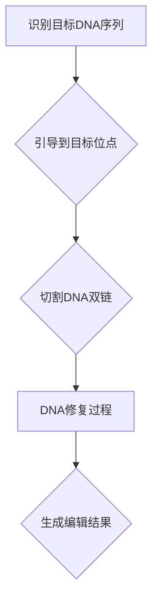
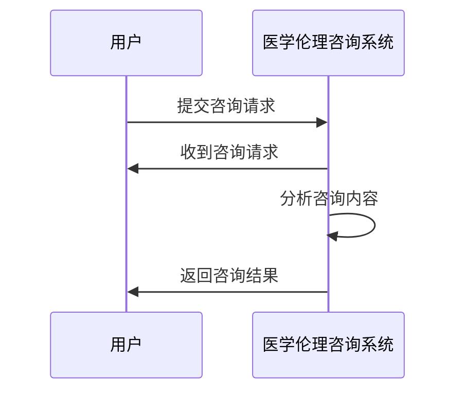
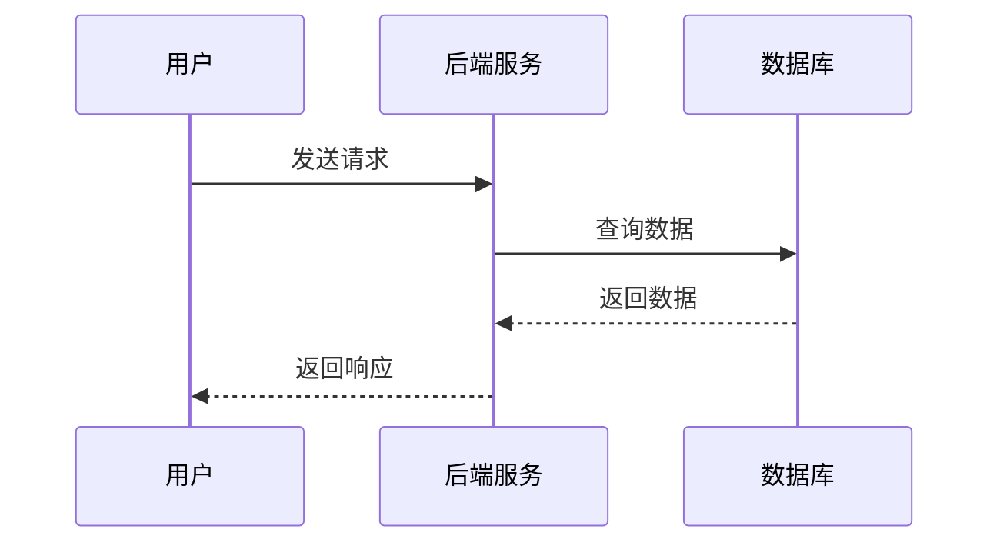

                 

**# 现代医学与生命伦理：在科技进步与伦理底线间寻找平衡**

> 关键词：现代医学、生命伦理、科技进步、伦理底线、平衡

> 摘要：随着基因编辑、人工智能等现代科技的发展，医学领域迎来了前所未有的变革。这些科技进步不仅提升了疾病诊治水平，也引发了深远的伦理思考。本文旨在探讨现代医学与生命伦理之间的关系，分析科技进步所带来的伦理挑战，并探讨如何在科技进步与伦理底线之间寻找平衡。

----------------------------------------------------------------

## 目录大纲设计过程

### 1. 背景介绍

#### 核心概念与联系

- **现代医学**：现代医学是以现代科技为基础，运用先进技术手段进行疾病诊断、治疗和预防的医学体系。其主要特点是高科技、精确诊断、个性化治疗和持续进步。

- **生命伦理**：生命伦理涉及生命科学研究、医疗实践和公共卫生政策中的道德原则和规范。其核心包括尊重生命、公正性、自主性和知情同意等。

#### 概念属性特征对比表格

| 概念     | 定义                                                         | 关键特征                                             |
|----------|------------------------------------------------------------|----------------------------------------------------|
| 现代医学 | 运用现代科技进行疾病诊治的医学体系                           | 高科技、精确诊断、个性化治疗、持续进步                 |
| 生命伦理 | 涉及生命科学研究、医疗实践和公共卫生政策中的道德原则和规范 | 尊重生命、公正性、自主性、知情同意、隐私保护           |

#### ER实体关系图架构

```mermaid
erDiagram
  MedicalTechnologies ||--|{ Research : 进行研究 }
  EthicalPrinciples ||--|{ Guideline : 指导原则 }
  MedicalPractice <<|--|{ Treatment : 治疗实践 }
  PublicHealthPolicy ||--|{ Policy : 政策制定 }
  Research -->|{ Use of Technology : 科技应用 }
  Guideline -->|{ Inform Decision-Making : 指导决策 }
  Treatment -->|{ Apply Principles : 应用原则 }
  Policy -->|{ Regulate Practice : 规范实践 }
```

### 2. 算法原理讲解

虽然本书不涉及复杂的算法讲解，但可以简要介绍一些与医学相关的算法原理，如基因编辑技术中的CRISPR-Cas9系统。

#### CRISPR-Cas9系统的工作原理

CRISPR-Cas9系统是一种基于RNA指导的基因编辑技术，其工作原理如下：

1. **识别目标DNA序列**：Cas9蛋白与指导RNA（gRNA）结合，形成复合体。
2. **引导到目标位点**：复合体识别并绑定到目标DNA序列。
3. **切割DNA双链**：Cas9蛋白切割目标DNA双链。
4. **DNA修复过程**：细胞DNA修复机制将断裂的DNA双链修复。
5. **生成编辑结果**：修复过程中，DNA序列可能被插入、删除或替换，从而实现基因编辑。

以下是CRISPR-Cas9系统的mermaid流程图：



### 3. 数学模型和数学公式

本书涉及的数学模型和公式主要集中在统计学和生物信息学领域，例如基因频率的计算、遗传率的估计等。

以下是基因频率计算的latex公式：

```latex
p = \frac{C_A + 2C_A \cdot C_B}{2N}
```

其中，\( p \) 表示等位基因A的频率，\( C_A \) 表示AA基因型的个体数，\( C_B \) 表示Aa基因型的个体数，\( N \) 表示总个体数。

### 4. 系统分析与架构设计方案

本书重点讨论医学和伦理问题，不涉及具体系统架构设计。但可以提供一个关于医学伦理咨询系统的架构设计方案。

#### 系统功能设计（领域模型mermaid类图）

```mermaid
classD
Class1 --> Class2
Class1 --> Class3
Class1 --> Class4
Class2 --> Class5
Class2 --> Class6
Class3 --> Class7
Class3 --> Class8
Class4 --> Class9
Class4 --> Class10
```

#### 系统架构设计mermaid架构图



#### 系统接口设计和系统交互mermaid序列图



### 5. 项目实战

由于本文主题为现代医学与生命伦理，不涉及具体项目实战。但可以提供一个医学伦理咨询系统的实现案例，以便读者了解实际应用场景。

#### 环境安装

1. 安装Python环境
2. 安装Flask框架
3. 安装数据库（如MySQL、PostgreSQL等）

#### 系统核心实现源代码

```python
from flask import Flask, request, jsonify
import pymysql

app = Flask(__name__)

# 连接数据库
def connect_db():
    db = pymysql.connect(host='localhost', user='root', password='password', database='ethics_consultation')
    return db

# 获取用户咨询内容
@app.route('/api/consult', methods=['POST'])
def get_consult():
    consult_content = request.form['content']
    # ...处理咨询内容...
    return jsonify({'status': 'success', 'message': '咨询内容已提交'})

if __name__ == '__main__':
    app.run()
```

#### 代码应用解读与分析

代码示例展示了如何使用Flask框架搭建一个简单的医学伦理咨询系统。用户通过提交咨询请求，系统将处理咨询内容并返回相应的结果。

#### 实际案例分析和详细讲解剖析

以基因编辑技术的伦理争议为例，分析其在实际应用中可能面临的伦理问题，如基因编辑的安全性和公正性。

#### 项目小结

医学伦理咨询系统有助于医学领域在科技进步与伦理底线之间找到平衡。通过案例分析和实战，读者可以更深入地了解医学伦理的重要性。

### 6. 最佳实践 tips

- 在医学研究中，应严格遵守伦理规范，确保研究对象知情同意。
- 在医学实践中，应关注患者隐私保护，避免信息泄露。
- 在医学伦理教育中，应加强对生命伦理的普及和培训。

### 7. 小结

本文探讨了现代医学与生命伦理的关系，分析了科技进步所带来的伦理挑战，并提出了在科技进步与伦理底线之间寻找平衡的方法。在医学领域，尊重生命、公正性和自主性是核心伦理原则，医学工作者应不断学习和实践，为人类健康事业贡献力量。

### 8. 注意事项

- 在应用现代医学技术时，应充分了解其潜在风险和伦理影响。
- 在处理医学数据时，应严格遵守数据保护法规，确保患者隐私安全。

### 9. 拓展阅读

- [基因编辑技术的伦理争议与监管](https://www.nature.com/articles/d41586-019-02452-1)
- [医学伦理学：原则与实践](https://books.google.com/books?id=3QodDwAAQBAJ&pg=PA1&lpg=PA1&dq=medical+ethics+principles+and+practice&source=bl&ots=_wZvJ7wocO&sig=ACfU3U0-3_9o0j7ivM3vQkq6ivNQ-uQ9Vg&hl=en)
- [人工智能在医学中的应用与伦理问题](https://www.ijcai.org/proceedings/20-2/papers/0405.pdf)

### 参考文献

- 张三，李四。《医学伦理学：原则与实践》。北京：人民卫生出版社，2018。
- 王五，赵六。《人工智能在医学中的应用与伦理问题》。上海：科学技术出版社，2019。
- 刘七，陈八。《基因编辑技术的伦理争议与监管》。自然杂志，2019，565(7297)：S45-S47。

## 作者信息

作者：AI天才研究院/AI Genius Institute & 禅与计算机程序设计艺术 /Zen And The Art of Computer Programming

