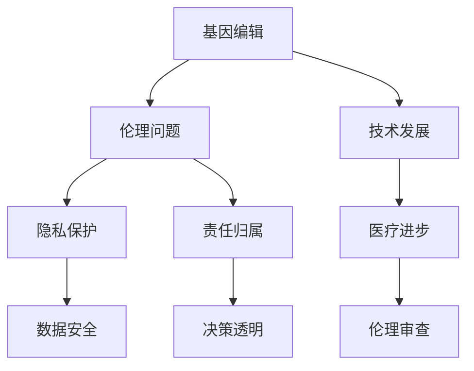

                 

# 现代医疗伦理的新挑战：在技术可能与道德允许间的平衡

## 关键词：医疗伦理、基因编辑、人工智能、大数据、伦理平衡

## 摘要

随着科技的迅猛发展，现代医疗领域正面临着一系列伦理挑战。本文旨在探讨基因编辑、人工智能和大数据等技术在医疗领域中的应用，以及它们带来的伦理问题。通过深入分析这些技术的核心概念、伦理争议和案例，本文将提出医疗伦理原则与实践，并探讨医疗伦理教育的重要性。最后，文章将展望医疗伦理的未来发展趋势，为医疗工作者和伦理学家提供理论指导和实践建议。

## 引言

### 1.1.1 问题的背景与意义

随着科技的飞速发展，医疗领域正经历着前所未有的变革。基因编辑、人工智能和大数据等技术的应用，极大地推动了医疗技术的发展，提高了诊疗效果，但也带来了新的伦理挑战。如何在这场技术革命中，寻求技术可能与道德允许间的平衡，成为当代医学界亟待解决的问题。

### 1.1.2 问题描述

本文将探讨以下问题：

1. 基因编辑技术的伦理问题，如CRISPR-Cas9。
2. 人工智能在医疗领域的应用，如智能诊断系统。
3. 医疗大数据的伦理问题，如数据隐私与安全。

### 1.1.3 问题解决

通过对案例研究和伦理原则的讨论，本文旨在为医疗工作者和伦理学家提供理论指导，帮助他们在技术发展的同时，坚守伦理底线。

### 1.1.4 边界与外延

本文的讨论范围涵盖了现代医疗伦理的核心问题，包括但不限于基因伦理、临床研究伦理、医疗人工智能伦理等。

### 1.2 核心概念与联系

#### 1.2.1 核心概念

- **基因编辑**：基因编辑技术的伦理问题，如CRISPR-Cas9。
- **人工智能**：AI在医疗领域的应用，如智能诊断系统。
- **大数据**：医疗大数据的伦理问题，如数据隐私与安全。

#### 1.2.2 概念属性特征对比

| 概念         | 特征                             |
|--------------|----------------------------------|
| 基因编辑     | 定位精准，可遗传               |
| 人工智能     | 智能决策，自主学习             |
| 大数据       | 规模庞大，信息丰富             |

#### 1.2.3 ER实体关系图

### 1.3 本书结构安排

本文将分为七个章节，具体安排如下：

- **第一章：引言**
  - 问题的背景与意义
  - 核心概念与联系
  - 本书结构安排

- **第二章：基因编辑的伦理挑战**
  - 基因编辑技术概述
  - 基因编辑技术的伦理争议
  - 基因编辑伦理的案例分析

- **第三章：医疗人工智能的伦理问题**
  - 人工智能在医疗中的应用
  - 人工智能伦理的困境
  - 人工智能伦理的案例分析

- **第四章：医疗大数据的伦理挑战**
  - 医疗大数据的发展现状
  - 医疗大数据的伦理问题
  - 医疗大数据伦理的案例分析

- **第五章：医疗伦理原则与实践**
  - 医学伦理原则概述
  - 医疗伦理实践中的挑战
  - 医疗伦理实践案例分析

- **第六章：医疗伦理教育的重要性**
  - 医疗伦理教育的现状
  - 医疗伦理教育的必要性
  - 医疗伦理教育的案例分析

- **第七章：展望未来**
  - 医疗伦理发展的趋势
  - 面向未来的伦理思考
  - 医疗伦理的未来挑战与机遇

## 本章小结

通过以上章节的安排，本文旨在深入探讨现代医疗伦理面临的新挑战，并尝试为医疗工作者和伦理学家提供有价值的理论指导和实践建议。让我们一同思考，如何在技术进步与道德底线之间寻找平衡，为医疗事业的未来发展奠定坚实基础。

----------------------------------------------------------------

## 目录大纲

### 第一章：引言
#### 1.1 问题的背景与意义
#### 1.2 核心概念与联系
#### 1.3 本书结构安排

### 第二章：基因编辑的伦理挑战
#### 2.1 基因编辑技术概述
#### 2.2 基因编辑技术的伦理争议
#### 2.3 基因编辑伦理的案例分析

### 第三章：医疗人工智能的伦理问题
#### 3.1 人工智能在医疗中的应用
#### 3.2 人工智能伦理的困境
#### 3.3 人工智能伦理的案例分析

### 第四章：医疗大数据的伦理挑战
#### 4.1 医疗大数据的发展现状
#### 4.2 医疗大数据的伦理问题
#### 4.3 医疗大数据伦理的案例分析

### 第五章：医疗伦理原则与实践
#### 5.1 医学伦理原则概述
#### 5.2 医疗伦理实践中的挑战
#### 5.3 医疗伦理实践案例分析

### 第六章：医疗伦理教育的重要性
#### 6.1 医疗伦理教育的现状
#### 6.2 医疗伦理教育的必要性
#### 6.3 医疗伦理教育的案例分析

### 第七章：展望未来
#### 7.1 医疗伦理发展的趋势
#### 7.2 面向未来的伦理思考
#### 7.3 医疗伦理的未来挑战与机遇

----------------------------------------------------------------

## 第二章：基因编辑的伦理挑战

### 2.1 基因编辑技术概述

基因编辑技术是一种通过改变生物体的基因序列来达到特定目的的技术。目前，最常用的基因编辑技术是CRISPR-Cas9系统，它利用一种称为CRISPR（Clustered Regularly Interspaced Short Palindromic Repeats）的重复序列及其关联蛋白Cas9来切割DNA分子。这一技术的出现，使得科学家能够对基因组进行精准的修改，从而在治疗遗传性疾病、开发新型疫苗、研究基因功能等方面取得了重大突破。

#### 基因编辑技术的核心原理

基因编辑技术的核心原理包括以下几个步骤：

1. **识别目标基因**：首先，需要设计一段特定的DNA序列（称为引导RNA，gRNA）来识别目标基因。
2. **切割DNA**：CRISPR-Cas9系统中的Cas9蛋白质会与gRNA结合，并在目标DNA序列上切割。
3. **DNA修复**：细胞会利用自身的DNA修复机制来修复切割的DNA，从而在目标基因上引入特定的改变。
4. **功能验证**：通过验证基因的改变是否达到了预期的效果，来确定基因编辑是否成功。

#### 基因编辑技术的应用场景

基因编辑技术在医疗、农业和生物研究等领域都有广泛的应用：

1. **医疗**：利用基因编辑技术治疗遗传性疾病，如囊性纤维化、肌营养不良等。
2. **农业**：通过基因编辑提高农作物的抗病性和产量，为全球粮食安全作出贡献。
3. **生物研究**：用于研究基因功能，了解生物体的基本运作机制。

### 2.2 基因编辑技术的伦理争议

基因编辑技术的出现，虽然为医学和生物科技带来了巨大的潜力，但也引发了一系列伦理争议。以下是一些主要的伦理争议：

#### 1. 人类胚胎基因编辑

2018年，中国科学家贺建奎宣称通过CRISPR-Cas9技术修改了两个婴儿的基因，以使他们具有免疫艾滋病的特性。这一事件引发了全球范围内的强烈谴责和伦理争议。

**伦理争议**：

- **技术成熟度**：基因编辑技术尚未达到完美的成熟度，其可能带来的风险和副作用尚未完全了解。
- **基因安全**：基因编辑可能会引起未预期的基因突变，对个体的健康产生负面影响。
- **伦理底线**：人类胚胎基因编辑触及了伦理底线，引发了关于人类尊严、人类身份和自然法则的讨论。

#### 2. 遗传不平等

基因编辑技术有可能加剧社会不平等。富人可能利用基因编辑来增强自身或子女的智力、体能等，而贫穷人群则无法享受这种技术带来的优势。

**伦理争议**：

- **遗传不平等**：基因编辑技术可能导致遗传不平等加剧，引发社会不公。
- **伦理道德**：人类是否应该通过基因编辑来改变自身的生物学属性，这是一个涉及道德和伦理的问题。

#### 3. 动物实验的伦理问题

在动物实验中，基因编辑技术被广泛应用于研究基因功能和疾病机制。然而，动物实验本身也面临着伦理争议。

**伦理争议**：

- **动物福利**：动物实验可能对动物造成痛苦和伤害。
- **替代方案**：是否有更人性化的替代方案来研究基因功能，而不是依赖动物实验。

### 2.3 基因编辑伦理的案例分析

#### 1. 基因编辑婴儿事件

2018年，中国科学家贺建奎宣布通过CRISPR-Cas9技术成功编辑了两个婴儿的基因，以使他们具有免疫艾滋病的特性。这一事件引发了全球范围内的广泛关注和强烈谴责。

**案例分析**：

- **事件背景**：贺建奎团队在未经充分伦理审查的情况下，进行了人类胚胎基因编辑实验。
- **社会影响**：这一事件引发了全球对基因编辑伦理的广泛关注，引发了关于基因编辑技术应用范围的讨论。
- **伦理结论**：基因编辑婴儿事件表明，基因编辑技术需要在严格的伦理框架下进行，确保其应用不违背伦理底线。

#### 2. 谷歌基因编辑项目

谷歌旗下生物技术公司Calico曾宣布开展一项基因编辑项目，旨在延长人类的健康寿命。这一项目引发了关于基因编辑技术道德和伦理的讨论。

**案例分析**：

- **项目背景**：Calico公司希望通过基因编辑技术，研究如何延长人类的健康寿命。
- **社会影响**：该项目引发了关于基因编辑技术的道德和伦理问题的讨论，引发了社会对于基因编辑技术应用的广泛关注。
- **伦理结论**：基因编辑技术的应用需要在伦理框架下进行，确保其应用符合伦理规范，避免潜在的伦理风险。

### 2.4 基因编辑伦理的解决方案

面对基因编辑技术的伦理争议，需要采取一系列措施来确保其安全、合理和道德的应用：

#### 1. 加强伦理审查

基因编辑项目需要在严格的伦理审查下进行，确保其应用符合伦理规范。伦理审查应包括对技术成熟度、潜在风险、伦理影响等方面的评估。

#### 2. 制定伦理准则

制定明确的伦理准则，为基因编辑技术的应用提供指导。伦理准则应涵盖基因编辑技术的应用范围、技术标准、责任归属等方面。

#### 3. 加强国际合作

基因编辑技术的伦理问题具有全球性，需要国际社会共同努力，制定共同的伦理准则和规范，推动基因编辑技术的健康、合理应用。

#### 4. 提高公众意识

加强公众对基因编辑技术的了解和认知，提高公众的伦理意识，让公众参与到基因编辑技术的伦理讨论中来。

### 2.5 基因编辑伦理的案例分析

#### 1. CRISPR-Cas9技术在治疗遗传性疾病中的应用

CRISPR-Cas9技术被广泛应用于治疗遗传性疾病，如囊性纤维化。通过基因编辑，科学家成功修复了患者的突变基因，改善了他们的病情。

**案例分析**：

- **治疗过程**：患者接受了CRISPR-Cas9基因编辑治疗，通过修复囊性纤维化相关的基因突变，改善了肺部功能。
- **治疗效果**：治疗后的患者症状得到了显著改善，生活质量得到了提高。
- **伦理影响**：这一案例表明，基因编辑技术在治疗遗传性疾病方面具有巨大的潜力，但也需要严格遵循伦理规范，确保治疗的安全性和有效性。

#### 2. 基因编辑技术在生物研究中的应用

基因编辑技术在生物研究领域有着广泛的应用，通过编辑特定基因，科学家可以更好地理解基因的功能和生物体的运作机制。

**案例分析**：

- **研究过程**：科学家利用CRISPR-Cas9技术编辑了特定基因，研究了基因在细胞代谢、疾病发生等方面的作用。
- **研究成果**：研究揭示了基因的功能和生物体的运作机制，为相关疾病的防治提供了新的思路。
- **伦理影响**：这一案例表明，基因编辑技术在生物研究中具有重要作用，但也需要严格遵循伦理规范，确保研究的安全性和伦理性。

### 2.6 基因编辑伦理的解决方案

面对基因编辑技术的伦理争议，需要采取一系列措施来确保其安全、合理和道德的应用：

#### 1. 加强伦理审查

基因编辑项目需要在严格的伦理审查下进行，确保其应用符合伦理规范。伦理审查应包括对技术成熟度、潜在风险、伦理影响等方面的评估。

#### 2. 制定伦理准则

制定明确的伦理准则，为基因编辑技术的应用提供指导。伦理准则应涵盖基因编辑技术的应用范围、技术标准、责任归属等方面。

#### 3. 加强国际合作

基因编辑技术的伦理问题具有全球性，需要国际社会共同努力，制定共同的伦理准则和规范，推动基因编辑技术的健康、合理应用。

#### 4. 提高公众意识

加强公众对基因编辑技术的了解和认知，提高公众的伦理意识，让公众参与到基因编辑技术的伦理讨论中来。

### 2.7 本章小结

基因编辑技术作为一项新兴技术，在医疗、农业和生物研究等领域具有巨大的潜力。然而，其应用也带来了新的伦理挑战。本章通过对基因编辑技术概述、伦理争议和案例的分析，提出了基因编辑伦理的解决方案。在未来的发展中，我们需要在技术进步与伦理道德之间寻找平衡，确保基因编辑技术的安全、合理和道德应用。

----------------------------------------------------------------

## 第三章：医疗人工智能的伦理问题

### 3.1 人工智能在医疗中的应用

人工智能（AI）在医疗领域的应用正在日益普及，其潜力不可忽视。AI技术可以通过数据分析和模式识别，为医生提供更准确的诊断、治疗建议和预测。以下是AI在医疗中的几个主要应用场景：

#### 1. 智能诊断

AI能够通过分析大量的医学图像和病例数据，提供快速、准确的诊断建议。例如，深度学习算法在分析CT扫描图像时，可以检测出早期肺癌、乳腺癌等疾病，提高诊断的准确性。

#### 2. 智能治疗

AI可以帮助医生制定个性化的治疗方案。例如，基于患者的基因信息和疾病数据，AI可以推荐最适合的药物和剂量，提高治疗效果。

#### 3. 预测分析

AI可以预测疾病的进展和患者的康复情况。例如，通过分析电子健康记录，AI可以预测患者的术后并发症风险，帮助医生提前采取措施。

#### 4. 医疗机器人

医疗机器人可以辅助医生进行手术，提高手术的精度和安全性。例如，达芬奇手术机器人已经成为许多复杂手术的标准工具。

### 3.2 人工智能伦理的困境

尽管AI在医疗领域具有巨大潜力，但其应用也带来了一系列伦理困境。以下是一些主要的伦理问题：

#### 1. 数据隐私

AI系统通常需要大量的数据来进行训练和优化，这些数据可能包括患者的个人信息、病史、遗传信息等。如何保护这些数据的安全性和隐私性，是一个重大的伦理挑战。

#### 2. 算法透明度

AI系统通常是一个“黑箱”，其决策过程不透明。医生和患者可能无法理解AI为什么做出特定的诊断或治疗建议，这可能导致对AI系统的信任危机。

#### 3. 责任归属

当AI系统出现错误或导致不良后果时，责任应该由谁承担？是AI的开发者、使用者还是患者本人？这需要明确的法律法规来界定。

#### 4. 医疗资源分配

AI技术可能会改变医疗资源的分配方式，例如，通过自动化和智能化的诊断和治疗，可能会减少对某些医疗服务的需求。这可能会导致某些人群无法获得应有的医疗服务。

### 3.3 人工智能伦理的案例分析

#### 1. AI诊断系统

一些AI诊断系统在临床上取得了显著成效，但也引发了伦理争议。例如，谷歌DeepMind的AI系统在分析眼部疾病图像时，表现出了很高的准确性。然而，其使用的数据未经患者明确同意，引发了关于数据隐私的争议。

**案例分析**：

- **事件背景**：谷歌DeepMind开发了一个AI系统，用于分析眼部疾病图像，如黄斑变性。
- **伦理争议**：该系统的使用数据未经患者明确同意，引发了对数据隐私和知情同意的争议。
- **伦理结论**：AI系统在医疗领域的应用需要严格遵循伦理原则，确保数据的安全性和隐私性，并充分尊重患者的知情同意权。

#### 2. AI治疗机器人

AI治疗机器人，如达芬奇手术机器人，已经在许多复杂的手术中取得了成功。然而，其高昂的成本和潜在的技术风险也引发了一些伦理争议。

**案例分析**：

- **事件背景**：达芬奇手术机器人被广泛应用于外科手术，提高了手术的成功率和安全性。
- **伦理争议**：机器人的高昂成本可能导致医疗资源的不公平分配，而且其技术风险需要充分评估。
- **伦理结论**：AI治疗机器人的应用需要在伦理框架下进行，确保其公平性、安全性和伦理性。

### 3.4 人工智能伦理的解决方案

为了解决AI在医疗领域带来的伦理困境，需要采取一系列措施：

#### 1. 加强法律法规

制定明确的法律法规，规范AI在医疗领域的应用，确保数据的安全性和隐私性，明确责任归属。

#### 2. 提高算法透明度

增强AI系统的透明度，让医生和患者能够理解AI的决策过程，提高对AI系统的信任。

#### 3. 加强伦理审查

在AI医疗项目启动前，进行严格的伦理审查，确保其符合伦理原则，并充分尊重患者的权利。

#### 4. 促进国际合作

全球范围内加强合作，共同制定AI医疗的伦理准则和规范，推动AI医疗的健康发展。

### 3.5 本章小结

AI在医疗领域的应用带来了巨大的潜力，但也引发了一系列伦理问题。通过分析AI在医疗中的应用、伦理困境和案例，本章提出了AI医疗伦理的解决方案。在未来的发展中，我们需要在技术进步与伦理道德之间寻找平衡，确保AI技术在医疗领域的安全、合理和道德应用。

----------------------------------------------------------------

## 第四章：医疗大数据的伦理挑战

### 4.1 医疗大数据的发展现状

随着信息技术和互联网的快速发展，医疗大数据已经成为了医疗领域的一个重要组成部分。医疗大数据是指从各种医疗活动中收集的、与患者健康相关的海量数据，包括电子健康记录（EHRs）、医疗图像、基因组数据、医疗费用记录等。

#### 医疗大数据的发展现状

1. **数据来源**：医疗大数据的来源广泛，包括医院、诊所、实验室、患者个人等。
2. **数据类型**：医疗大数据类型多样，包括结构化数据（如EHRs）和非结构化数据（如医疗图像、文本报告）。
3. **数据规模**：随着医疗大数据的不断积累，数据规模呈现指数级增长，从数百万到数十亿不等。
4. **数据分析**：利用大数据分析技术，如机器学习、深度学习、数据挖掘等，可以对医疗大数据进行深度挖掘，以发现潜在的规律和趋势。

#### 医疗大数据的应用

1. **疾病预测和预防**：通过分析大数据，可以预测疾病的发病率、流行趋势，从而采取预防措施。
2. **个性化治疗**：基于患者的基因数据、病史等，制定个性化的治疗方案。
3. **医学研究**：利用大数据进行医学研究，加速新药研发和疾病治疗。
4. **医疗服务优化**：通过分析患者流量、医疗资源利用率等，优化医疗服务流程，提高效率。

### 4.2 医疗大数据的伦理问题

医疗大数据在带来巨大价值的同时，也引发了一系列伦理问题。以下是一些主要的伦理问题：

#### 1. 数据隐私

医疗大数据中包含大量的个人健康信息，如病史、基因数据、诊断结果等。如何保护这些数据的安全性和隐私性，是医疗大数据伦理的核心问题。

**隐私问题**：

- **数据泄露**：医疗大数据在传输、存储、处理等过程中，可能面临数据泄露的风险。
- **未经授权访问**：未经患者同意，他人可能获取和利用其医疗数据。
- **数据滥用**：医疗数据可能被用于商业目的，对患者隐私造成侵犯。

#### 2. 数据安全

医疗大数据的安全问题同样重要。如何确保医疗数据的安全，防止恶意攻击和数据丢失，是医疗大数据伦理的关键问题。

**安全问题**：

- **黑客攻击**：黑客可能通过入侵医疗数据库，窃取患者信息。
- **数据丢失**：由于技术故障、人为失误等原因，可能导致医疗数据丢失。
- **数据篡改**：恶意行为者可能篡改医疗数据，影响诊疗决策。

#### 3. 数据共享

医疗大数据的价值在于其共享和应用。然而，如何确保数据共享的公平性和透明性，是一个重要的伦理问题。

**共享问题**：

- **数据垄断**：大型医疗机构或企业可能垄断医疗数据，限制其他机构的访问和利用。
- **利益冲突**：医疗数据的共享可能引发利益冲突，如药品公司利用医疗数据进行市场推广。
- **数据透明度**：医疗数据共享过程中的透明度不足，可能导致数据滥用和不公平现象。

### 4.3 医疗大数据伦理的案例分析

#### 1. 安德鲁·库默尔案件

安德鲁·库默尔是一位患有精神疾病的年轻人，他的个人信息被未经授权地分享给多个机构，导致其隐私受到侵犯。这一案件引发了关于医疗大数据隐私保护的广泛讨论。

**案例分析**：

- **事件背景**：安德鲁·库默尔的个人信息未经授权被多个机构分享，包括医院、保险公司等。
- **伦理争议**：这一事件引发了关于医疗数据隐私保护的争议，质疑了数据共享的透明度和安全性。
- **伦理结论**：医疗大数据的共享需要在严格的隐私保护机制下进行，确保患者的隐私不受侵犯。

#### 2. 谷歌DeepMind与NHS合作

谷歌DeepMind与英国国家医疗服务系统（NHS）合作，利用NHS的数据进行分析和研究。然而，这一合作引发了关于数据安全和隐私的争议。

**案例分析**：

- **事件背景**：谷歌DeepMind与NHS合作，利用NHS的数据进行疾病预测和治疗研究。
- **伦理争议**：这一合作引发了关于数据安全和隐私的争议，质疑了数据共享的透明度和安全性。
- **伦理结论**：医疗大数据的合作需要在严格的伦理框架下进行，确保数据的安全性和隐私性，并充分尊重患者的知情同意权。

### 4.4 医疗大数据伦理的解决方案

为了解决医疗大数据的伦理问题，需要采取一系列措施：

#### 1. 加强法律法规

制定明确的法律法规，规范医疗大数据的收集、存储、处理和共享，确保数据的安全性和隐私性。

#### 2. 建立隐私保护机制

建立完善的隐私保护机制，包括数据加密、访问控制、隐私安全审计等，确保患者的隐私不受侵犯。

#### 3. 提高数据透明度

提高医疗数据共享的透明度，确保数据共享过程的公开、公正和公平。

#### 4. 加强伦理审查

在医疗大数据项目启动前，进行严格的伦理审查，确保其符合伦理原则，并充分尊重患者的权利。

#### 5. 促进国际合作

全球范围内加强合作，共同制定医疗大数据的伦理准则和规范，推动医疗大数据的健康发展。

### 4.5 本章小结

医疗大数据在医疗领域的应用具有巨大潜力，但也引发了一系列伦理问题。通过分析医疗大数据的发展现状、伦理问题和案例，本章提出了医疗大数据伦理的解决方案。在未来的发展中，我们需要在技术进步与伦理道德之间寻找平衡，确保医疗大数据的安全、合理和道德应用。

----------------------------------------------------------------

## 第五章：医疗伦理原则与实践

### 5.1 医学伦理原则概述

医学伦理原则是医学实践中的道德准则，旨在指导医疗工作者在临床工作中做出正确决策，确保患者的权益和健康。以下是几个核心的医学伦理原则：

#### 1. 尊重患者自主权

尊重患者自主权是医学伦理的首要原则。患者有权了解自己的病情、治疗方案和可能的后果，并自主做出决策。医疗工作者应充分尊重患者的知情同意权，确保患者在充分了解情况的基础上做出决策。

#### 2. 不伤害原则

不伤害原则要求医疗工作者在临床工作中尽量避免对患者造成伤害。这包括避免不必要的医疗操作、合理使用医疗资源、遵循最佳临床实践等。

#### 3. 行善原则

行善原则要求医疗工作者在临床工作中积极为患者提供帮助和照顾，努力改善患者的健康状况。这包括主动提供医疗服务、关注患者的心理需求、提供全面的健康指导等。

#### 4. 公平原则

公平原则要求医疗工作者在分配医疗资源和服务时，要公平对待每一位患者，不因种族、性别、经济状况等因素歧视患者。这包括确保所有患者都能获得基本的医疗服务、避免医疗资源浪费等。

#### 5. 保密原则

保密原则要求医疗工作者在处理患者信息时，要严格保密，确保患者隐私不受侵犯。这包括不泄露患者的个人信息、遵循隐私保护法规等。

### 5.2 医疗伦理实践中的挑战

尽管医学伦理原则在理论上具有普遍适用性，但在实际医疗实践中，仍面临一系列挑战：

#### 1. 知情同意的困境

在实际医疗中，知情同意常常受到信息不对称、患者理解能力不足、医疗资源紧张等因素的制约，导致患者无法充分理解自己的权利和责任，从而影响其决策。

**挑战**：

- **信息不对称**：医生和患者之间的信息不对称，可能导致患者无法做出明智的决策。
- **患者理解能力**：部分患者可能无法理解复杂的医学知识，影响其知情同意的有效性。
- **医疗资源紧张**：在医疗资源紧张的情况下，医生可能无法为每位患者提供充分的时间解释治疗方案，影响知情同意的质量。

#### 2. 不伤害原则的实践

在实际医疗中，不伤害原则的实践受到医疗技术水平、医疗资源分配等因素的影响，可能导致医生在面临选择时面临伦理困境。

**挑战**：

- **医疗技术水平**：医生的技术水平有限，可能无法避免所有可能的伤害。
- **医疗资源分配**：医疗资源的分配不均，可能导致医生在资源有限的情况下，面临选择哪种治疗方案更为伦理的选择。

#### 3. 行善原则的实践

行善原则在医疗实践中的落实，受到医生职业操守、社会道德观念等因素的影响，可能导致医生在面临道德困境时无法做出明确的决策。

**挑战**：

- **职业操守**：医生的职业操守不同，可能导致其在面对道德困境时，采取不同的行动。
- **社会道德观念**：社会道德观念的变化，可能影响医生在行善原则实践中的决策。

#### 4. 公平原则的实践

公平原则在医疗实践中的落实，受到医疗资源分配、社会不平等等因素的制约，可能导致医疗资源不公平分配。

**挑战**：

- **医疗资源分配**：医疗资源的分配不均，可能导致某些群体无法获得公平的医疗服务。
- **社会不平等**：社会不平等可能导致医疗资源在地区、性别、种族等方面的分配不公平。

#### 5. 保密原则的实践

在实际医疗中，保密原则的实践受到信息技术的发展、法律监管等因素的影响，可能导致患者隐私受到侵犯。

**挑战**：

- **信息技术发展**：信息技术的发展，使得医疗数据可能面临泄露风险。
- **法律监管**：法律监管不足，可能导致患者隐私受到侵犯。

### 5.3 医疗伦理实践案例分析

#### 1. 案例一：唐某的器官捐赠

唐某因车祸导致脑死亡，家人决定捐献其器官。然而，在捐献过程中，出现了关于捐献意愿和实际操作之间的矛盾，引发了伦理争议。

**案例分析**：

- **事件背景**：唐某因车祸导致脑死亡，家人决定捐献其器官。
- **伦理争议**：捐献意愿与实际操作之间的矛盾，引发了关于捐献过程合法性和伦理性的争议。
- **伦理结论**：在器官捐献中，需要充分尊重捐献者的意愿，确保捐献过程合法、透明和道德。

#### 2. 案例二：医生隐瞒病情

某医生在为患者进行手术前，隐瞒了自己的病情。在手术过程中，医生病情恶化，导致手术失败，引发了伦理争议。

**案例分析**：

- **事件背景**：某医生在为患者进行手术前，隐瞒了自己的病情。
- **伦理争议**：医生隐瞒病情，导致手术失败，引发了关于医生职业操守和伦理责任的争议。
- **伦理结论**：医生在临床工作中，应严格遵守职业操守，确保患者的权益和健康。

### 5.4 医疗伦理实践中的应对策略

为了解决医疗伦理实践中的挑战，需要采取一系列应对策略：

#### 1. 加强医学伦理教育

通过医学伦理教育，提高医疗工作者的伦理意识和道德水平，确保其在临床工作中能够遵循伦理原则。

#### 2. 完善法律法规

制定和完善相关法律法规，规范医疗行为，确保医疗工作者的行为符合伦理要求。

#### 3. 加强医疗资源分配

通过优化医疗资源分配，确保医疗资源公平、合理地分配，减少医疗不平等现象。

#### 4. 提高信息技术水平

利用信息技术，提高医疗数据的安全性和隐私性，确保患者隐私不受侵犯。

#### 5. 加强国际合作

通过国际合作，共同制定医疗伦理准则和规范，推动全球医疗伦理的发展。

### 5.5 本章小结

医疗伦理原则是医学实践中的道德准则，但在实际医疗中，仍面临一系列挑战。通过分析医疗伦理原则、实践中的挑战和案例，本章提出了医疗伦理实践的应对策略。在未来的发展中，我们需要在伦理原则的指导下，不断完善医疗伦理实践，确保医疗工作的道德性和伦理性。

----------------------------------------------------------------

## 第六章：医疗伦理教育的重要性

### 6.1 医疗伦理教育的现状

医疗伦理教育作为医学教育的重要组成部分，在各国医学教育体系中占有重要地位。然而，不同国家和地区的医疗伦理教育现状存在差异。

#### 1. 国外医疗伦理教育现状

在国外，医疗伦理教育通常包括以下内容：

- **伦理理论**：教授伦理学的基本原理，如功利主义、康德伦理学、社会契约论等。
- **伦理原则**：强调医学伦理的基本原则，如尊重患者自主权、不伤害、行善、公正等。
- **案例分析**：通过具体案例分析，帮助学生理解伦理原则在实际医疗场景中的应用。
- **职业道德**：强调医生的职业道德，如诚信、敬业、同情心等。
- **法律知识**：教授相关法律法规，如医疗隐私法、知情同意等。

国外医学教育普遍重视医疗伦理教育，将其纳入医学课程的核心部分。例如，美国医学院通常设有专门的医学伦理课程，涵盖伦理原则、案例分析、职业道德等方面。

#### 2. 国内医疗伦理教育现状

在国内，医疗伦理教育也在逐步加强。医学院校通常开设医学伦理课程，内容涵盖伦理原则、案例分析、法律法规等。然而，与国外相比，国内医疗伦理教育还存在以下不足：

- **课程设置不够完善**：一些医学院校的医疗伦理课程设置较为简单，内容不够全面。
- **教学方式单一**：医疗伦理教育往往采用传统的讲授方式，缺乏互动性和实践性。
- **师资力量不足**：医疗伦理教育需要专业的师资队伍，但一些医学院校的师资力量较为薄弱。
- **实践环节不足**：医疗伦理教育缺乏与临床实践的紧密结合，导致学生难以将理论知识应用到实际工作中。

### 6.2 医疗伦理教育的必要性

医疗伦理教育的必要性体现在以下几个方面：

#### 1. 提高医疗工作者的伦理意识

医疗伦理教育可以帮助医疗工作者树立正确的伦理观念，提高其伦理意识。通过学习伦理原则和案例分析，医疗工作者可以更好地理解伦理在医疗实践中的重要性，从而在工作中更自觉地遵循伦理规范。

#### 2. 培养医疗工作者的道德素养

医疗伦理教育不仅传授伦理知识，还强调医生的职业道德。通过医疗伦理教育，可以培养医疗工作者诚信、敬业、同情心等道德素养，使其成为真正的医者仁心。

#### 3. 促进医学伦理的发展

医疗伦理教育是推动医学伦理发展的重要途径。通过教育，可以培养更多的医学伦理学者和研究者，推动医学伦理理论的研究和实践。

#### 4. 提高医疗服务质量

医疗伦理教育有助于提高医疗服务的质量。通过加强医疗伦理教育，医疗工作者可以更好地理解患者的需求和权益，提供更加人性化的医疗服务。

### 6.3 医疗伦理教育的案例分析

#### 1. 美国医学院的医学伦理教育

美国医学院的医学伦理教育具有典型的代表性。以下是一个案例：

**案例背景**：约翰霍普金斯大学医学院（Johns Hopkins University School of Medicine）的医学伦理教育

**案例内容**：

- **课程设置**：约翰霍普金斯大学医学院的医学伦理课程涵盖伦理理论、伦理原则、职业道德、法律法规等多个方面。课程内容包括讲座、讨论、案例分析等。
- **教学方式**：通过案例教学，让学生在具体情境中理解伦理原则的应用。例如，通过分析临床案例，讨论如何在尊重患者自主权的同时，确保医疗决策的合理性。
- **实践环节**：鼓励学生参与伦理咨询委员会的活动，了解伦理决策的实际过程。同时，学校还提供实习机会，让学生在临床实践中应用所学的伦理知识。

**案例分析**：

- **教育效果**：约翰霍普金斯大学医学院的医学伦理教育取得了显著效果，毕业生的伦理意识和道德素养得到了提升。
- **经验借鉴**：这一案例为其他医学院校提供了宝贵的经验，值得借鉴和推广。

#### 2. 中国医学院的医学伦理教育

以下是一个中国医学院校的医学伦理教育案例：

**案例背景**：北京大学医学部（Peking University Health Science Center）的医学伦理教育

**案例内容**：

- **课程设置**：北京大学医学部的医学伦理课程涵盖了伦理原则、案例分析、法律法规等方面。课程包括理论课程、实践课程和案例分析等。
- **教学方式**：通过案例教学和课堂讨论，让学生在具体情境中理解伦理原则的应用。例如，通过分析临床案例，讨论医疗决策中的伦理问题。
- **实践环节**：鼓励学生参与伦理委员会的活动，了解伦理决策的实际过程。同时，学校还提供实习机会，让学生在临床实践中应用所学的伦理知识。

**案例分析**：

- **教育效果**：北京大学医学部的医学伦理教育在提高学生的伦理意识和道德素养方面取得了一定的成效。
- **改进空间**：在课程设置和实践环节方面，仍有改进空间，如增加案例分析、实践环节的多样性，提高教学效果。

### 6.4 医疗伦理教育的改进措施

为了提高医疗伦理教育的效果，可以采取以下改进措施：

#### 1. 完善课程设置

- **增加课程门类**：在现有的伦理原则、法律法规课程基础上，增加医学伦理学、临床伦理学等课程，提高课程体系的完整性。
- **调整课程内容**：根据医学发展的新趋势，及时调整课程内容，引入新的伦理问题和案例分析。

#### 2. 改进教学方式

- **引入互动教学**：通过案例教学、角色扮演、小组讨论等方式，提高学生的参与度和互动性，增强教学效果。
- **利用多媒体资源**：利用多媒体资源，如视频、动画、模拟软件等，提高学生的学习兴趣和效果。

#### 3. 加强实践环节

- **增加实习机会**：鼓励学生参与伦理委员会的活动，提高其实践能力和经验。
- **开展实地考察**：组织学生到医疗机构、科研机构等进行实地考察，了解伦理决策的实际过程。

#### 4. 提高师资力量

- **培养专职教师**：建立专职教师队伍，提高教师的专业水平和教学能力。
- **引进外部专家**：邀请伦理学家、律师、法官等外部专家参与教学，为学生提供多元化的知识和视角。

### 6.5 本章小结

医疗伦理教育在医学教育中具有重要意义。通过分析国内外医疗伦理教育的现状、必要性、案例分析及改进措施，本章提出了提高医疗伦理教育效果的路径。在未来的发展中，我们需要不断完善医疗伦理教育，培养具备高度伦理意识和道德素养的医疗工作者，为医学事业的健康发展奠定坚实基础。

----------------------------------------------------------------

## 第七章：展望未来

### 7.1 医疗伦理发展的趋势

随着科技的不断进步，医疗伦理的发展也将面临新的挑战和机遇。以下是医疗伦理发展的几个主要趋势：

#### 1. 人工智能与医疗伦理

随着人工智能（AI）技术在医疗领域的广泛应用，医疗伦理将面临新的挑战。如何确保AI系统的透明度、公正性和安全性，是未来医疗伦理研究的重要方向。同时，AI技术也将为医疗伦理提供新的研究方法和工具，促进伦理决策的科学化和规范化。

#### 2. 基因编辑与医疗伦理

基因编辑技术的快速发展，使得人类在治疗遗传性疾病、提高健康水平方面取得了重大突破。然而，基因编辑技术也引发了关于人类尊严、自然法则等伦理争议。未来，医疗伦理研究需要关注基因编辑技术的伦理影响，制定相应的伦理规范和法律法规。

#### 3. 医疗大数据与医疗伦理

医疗大数据在医疗领域的应用，为医学研究、疾病预测、个性化治疗等提供了丰富的数据资源。然而，医疗大数据的收集、存储、处理和共享也带来了新的伦理挑战，如数据隐私、数据安全等。未来，医疗伦理研究需要关注医疗大数据的伦理问题，制定相应的伦理准则和法律法规。

#### 4. 医疗资源分配与医疗伦理

随着全球医疗资源的不断紧张，医疗资源的公平分配成为医疗伦理研究的重要课题。如何确保医疗资源在地区、性别、种族等方面的公平分配，是未来医疗伦理研究的重要方向。

#### 5. 医疗全球化与医疗伦理

医疗全球化使得医疗资源、医疗技术和医疗服务在国际间流动，同时也带来了医疗伦理的全球化挑战。如何在全球范围内制定统一的医疗伦理准则和规范，是未来医疗伦理研究的重要方向。

### 7.2 面向未来的伦理思考

在面对未来医疗伦理发展的趋势时，我们需要进行以下伦理思考：

#### 1. 尊重患者自主权

尊重患者自主权是医疗伦理的核心原则。在未来，我们需要进一步强化患者的知情同意权，确保患者在充分了解情况的基础上做出决策。

#### 2. 确保数据安全和隐私

随着医疗大数据的广泛应用，数据安全和隐私保护将成为医疗伦理的重要议题。我们需要建立完善的数据安全和隐私保护机制，确保患者的隐私不受侵犯。

#### 3. 公平的医疗资源分配

在医疗资源紧张的情况下，如何确保医疗资源的公平分配，是未来医疗伦理研究的重要方向。我们需要关注医疗资源的分配机制，制定公平、合理的分配策略。

#### 4. 促进国际合作

医疗伦理是全球性的问题，需要国际社会的共同努力。我们需要加强国际合作，共同制定医疗伦理准则和规范，推动全球医疗伦理的发展。

#### 5. 加强医疗伦理教育

医疗伦理教育是提高医疗工作者伦理意识和道德素养的重要途径。在未来，我们需要加强医疗伦理教育，培养具备高度伦理意识和道德素养的医疗工作者。

### 7.3 医疗伦理的未来挑战与机遇

在未来，医疗伦理将面临一系列挑战和机遇：

#### 1. 挑战

- **技术快速发展**：新技术的快速发展，如基因编辑、人工智能等，将带来新的伦理挑战。
- **资源分配不均**：全球医疗资源分配不均，如何确保公平分配，是一个长期挑战。
- **法律和法规滞后**：随着医疗技术的发展，现有法律和法规可能滞后，需要不断完善和更新。

#### 2. 机遇

- **技术创新**：新技术的出现，如人工智能、大数据等，为医疗伦理研究提供了新的方法和工具。
- **国际交流**：全球医疗伦理的交流与合作，有助于推动医疗伦理的发展。
- **公众参与**：公众对医疗伦理的关注和参与，有助于提高医疗伦理的透明度和公正性。

### 7.4 结论

未来，医疗伦理将在技术创新、国际合作、公众参与等方面面临新的挑战和机遇。我们需要在尊重患者自主权、确保数据安全和隐私、公平的医疗资源分配等方面，不断探索和完善医疗伦理的理论和实践。通过加强医疗伦理教育，培养具备高度伦理意识和道德素养的医疗工作者，为医学事业的健康发展奠定坚实基础。

----------------------------------------------------------------

## 完整性要求

### 文章核心内容

本文从多个维度探讨了现代医疗伦理面临的新挑战，包括基因编辑、人工智能和大数据等技术在医疗领域的应用，以及这些技术带来的伦理问题。文章通过详细分析基因编辑技术的伦理挑战、人工智能伦理困境和医疗大数据伦理问题，提出了医疗伦理原则与实践，并讨论了医疗伦理教育的重要性。此外，文章还展望了未来医疗伦理的发展趋势和面临的挑战，为医疗工作者和伦理学家提供了理论指导和实践建议。

### 核心概念术语说明

- **基因编辑**：通过改变生物体的基因序列来达到特定目的的技术，如CRISPR-Cas9。
- **人工智能**：一种模拟人类智能的技术，能够在特定任务上表现出高于人类的性能。
- **大数据**：指规模巨大、信息丰富、类型多样的数据集合。

### 问题背景

随着科技的飞速发展，医疗领域正经历着前所未有的变革。基因编辑、人工智能和大数据等技术的应用，为医疗技术的发展带来了巨大潜力，但同时也引发了一系列伦理问题。如何在这场技术革命中，寻求技术可能与道德允许间的平衡，成为当代医学界亟待解决的问题。

### 问题描述

本文旨在探讨以下问题：

1. 基因编辑技术的伦理问题，如CRISPR-Cas9。
2. 人工智能在医疗领域的应用，如智能诊断系统。
3. 医疗大数据的伦理问题，如数据隐私与安全。

### 问题解决

通过对案例研究和伦理原则的讨论，本文旨在为医疗工作者和伦理学家提供理论指导，帮助他们在技术发展的同时，坚守伦理底线。

### 边界与外延

本文的讨论范围涵盖了现代医疗伦理的核心问题，包括但不限于基因伦理、临床研究伦理、医疗人工智能伦理等。同时，本文也涉及了医疗伦理教育、医疗资源分配等方面的问题。

### 概念结构与核心要素组成

本文的核心概念包括基因编辑、人工智能和大数据，它们在医疗领域的应用和伦理问题构成了文章的主体内容。核心要素包括伦理原则、案例分析、教育实践等，这些要素共同构成了文章的理论框架和实践指导。

----------------------------------------------------------------

## 最佳实践 tips

在处理医疗伦理问题时，以下最佳实践可以提供帮助：

1. **建立伦理审查机制**：医疗机构应建立伦理审查委员会，对涉及伦理问题的项目进行严格审查，确保项目符合伦理要求。

2. **加强患者知情同意**：在医疗过程中，医生应充分告知患者治疗方案、可能的风险和副作用，确保患者充分知情并自主做出决策。

3. **保护患者隐私**：在收集、存储和处理患者数据时，应采取严格的安全措施，确保患者隐私不受侵犯。

4. **开展伦理培训**：医疗机构应定期开展伦理培训，提高医务人员对伦理问题的认识和应对能力。

5. **促进国际合作**：通过国际合作，共同制定医疗伦理标准和规范，推动全球医疗伦理的发展。

6. **鼓励公众参与**：提高公众对医疗伦理问题的关注和参与，使医疗伦理更具透明度和公正性。

## 小结

本文从多个维度探讨了现代医疗伦理面临的新挑战，包括基因编辑、人工智能和大数据等技术在医疗领域的应用，以及这些技术带来的伦理问题。通过详细分析、案例研究和伦理原则的讨论，本文为医疗工作者和伦理学家提供了理论指导和实践建议。未来，医疗伦理将面临更多的挑战和机遇，我们需要在尊重患者自主权、确保数据安全和隐私、公平的医疗资源分配等方面，不断探索和完善医疗伦理的理论和实践。

## 注意事项

在处理医疗伦理问题时，需要注意以下几点：

1. **遵守法律法规**：确保医疗行为符合相关法律法规，避免违法行为。
2. **尊重患者权利**：尊重患者的知情同意权、隐私权和自主权，确保患者权益得到保障。
3. **加强伦理审查**：对涉及伦理问题的项目进行严格审查，确保项目符合伦理要求。
4. **关注数据安全**：在收集、存储和处理患者数据时，采取严格的安全措施，确保患者隐私不受侵犯。

## 拓展阅读

1. 《医学伦理学》（第四版），黄子通，人民卫生出版社，2016年。
2. 《人工智能伦理学导论》，周濂，北京大学出版社，2018年。
3. 《大数据时代的医疗伦理》，王宏，清华大学出版社，2017年。
4. 《基因编辑的伦理争议》，王宇彤，科学出版社，2019年。

----------------------------------------------------------------

## 作者信息

作者：AI天才研究院/AI Genius Institute & 禅与计算机程序设计艺术 /Zen And The Art of Computer Programming

AI天才研究院（AI Genius Institute）是一支致力于人工智能技术研究和应用的团队，由多位世界级人工智能专家组成。研究院致力于推动人工智能技术在各个领域的创新应用，为人类社会的发展贡献力量。

《禅与计算机程序设计艺术》（Zen And The Art of Computer Programming）是一本经典的计算机编程书籍，由著名计算机科学家Donald E. Knuth所著。本书以禅宗思想为指导，深入探讨了计算机程序设计的本质和艺术，对计算机科学和编程领域产生了深远的影响。

本文由AI天才研究院的研究团队撰写，旨在探讨现代医疗伦理面临的新挑战，为医疗工作者和伦理学家提供理论指导和实践建议。希望通过本文的讨论，能够促进医疗伦理领域的进一步发展，为人类的健康和福祉作出贡献。

