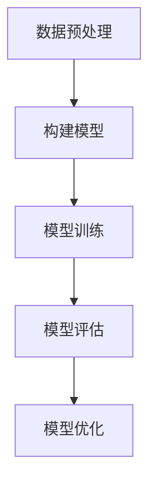
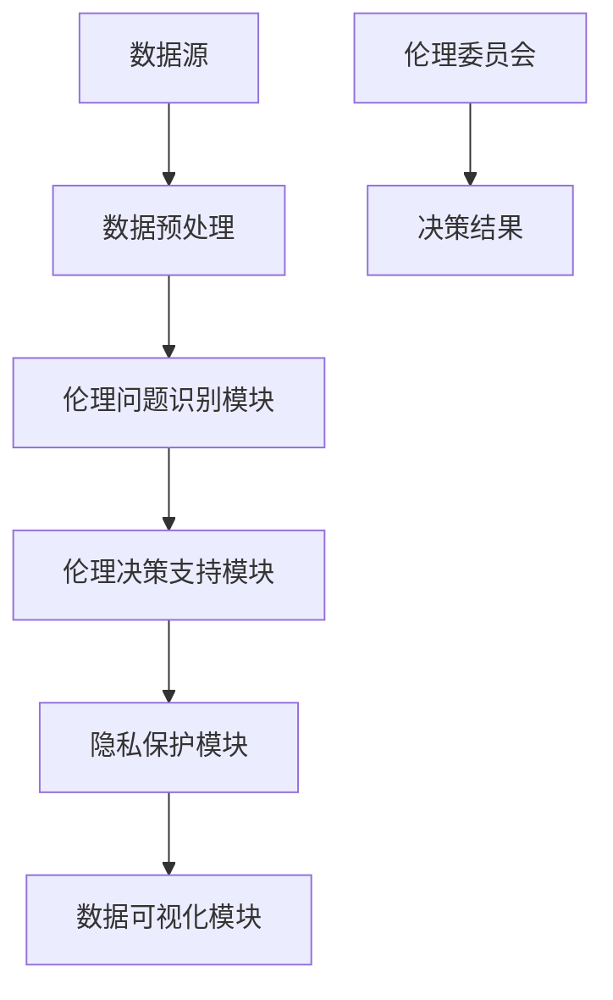
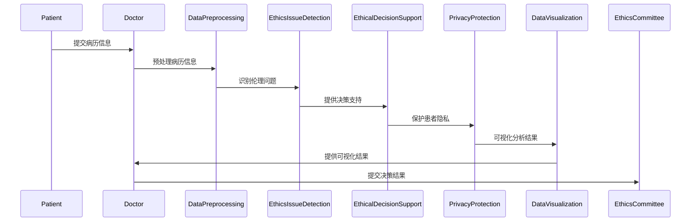

                 

# 现代医疗伦理的新议题：在技术可能与伦理允许间寻找平衡

关键词：医疗伦理、基因编辑、人工智能、医疗大数据、隐私保护、公平分配

摘要：本文深入探讨了现代医疗伦理领域的新议题，包括基因编辑技术的道德边界、人工智能在医学中的应用、医疗大数据的隐私保护、生命伦理学中的辅助生殖技术争议以及医疗资源的公平分配问题。通过逐步分析，本文探讨了在这些议题中如何寻找技术可能与伦理允许之间的平衡点。

## 第一部分：背景介绍

### 核心概念

**现代医疗伦理**

现代医疗伦理是指在医学实践中，医学工作者在处理医疗问题时应遵循的一系列道德原则和规范。它旨在确保医学实践既符合科学原理，又符合伦理要求。现代医疗伦理的核心概念包括：

- **尊重患者自主权**：患者有权了解自己的健康状况和治疗方案，并做出知情同意。
- **不伤害**：医学实践应尽可能避免对患者造成伤害。
- **善意行为**：医学工作者应以善意为出发点，为患者提供最佳治疗。
- **公正分配**：医疗资源应公平分配，确保所有人都能获得必要的医疗服务。

**新议题**

新议题指的是在当前医疗伦理领域中，由于技术进步、社会变迁等因素带来的新的伦理问题。这些议题往往涉及到医学伦理的基本原则，需要在技术可能与伦理允许之间寻找平衡。以下是一些关键的新议题：

1. **基因编辑技术的道德边界与伦理影响**：基因编辑技术如CRISPR-Cas9的出现，使得人类有能力对基因进行精确编辑。这引发了关于基因编辑的道德边界、潜在影响以及伦理问题的讨论。
2. **人工智能在医学诊断与治疗中的应用及其伦理问题**：人工智能在医疗领域的应用越来越广泛，包括辅助诊断、个性化治疗等。然而，这也带来了数据隐私、算法偏见等伦理问题。
3. **医疗大数据的使用与患者隐私权的保护**：医疗大数据的应用可以提高医疗质量和效率，但也涉及患者隐私的保护问题。
4. **生命伦理学中的辅助生殖技术争议**：辅助生殖技术如试管婴儿和胚胎移植，引发了关于生命的起点、家庭伦理等方面的争议。
5. **医疗资源的公平分配与医学不平等问题**：全球医疗资源分布不均，如何在有限资源下实现公平分配，是一个重要的伦理议题。

### 问题背景

随着现代生物医学技术的发展，诸如基因编辑、人工生殖、医疗人工智能等新兴技术不断涌现，这些技术不仅改变了医学实践的方式，也引发了诸多新的伦理问题。如何在尊重人类尊严、保护患者权益的同时，充分利用医学技术的潜力，成为现代医疗伦理研究的重要课题。

### 问题描述

现代医疗伦理的新议题主要包括：

1. **基因编辑技术的道德边界与伦理影响**：基因编辑技术如CRISPR-Cas9的出现，使得人类有能力对基因进行精确编辑。这引发了关于基因编辑的道德边界、潜在影响以及伦理问题的讨论。
2. **人工智能在医学诊断与治疗中的应用及其伦理问题**：人工智能在医疗领域的应用越来越广泛，包括辅助诊断、个性化治疗等。然而，这也带来了数据隐私、算法偏见等伦理问题。
3. **医疗大数据的使用与患者隐私权的保护**：医疗大数据的应用可以提高医疗质量和效率，但也涉及患者隐私的保护问题。
4. **生命伦理学中的辅助生殖技术争议**：辅助生殖技术如试管婴儿和胚胎移植，引发了关于生命的起点、家庭伦理等方面的争议。
5. **医疗资源的公平分配与医学不平等问题**：全球医疗资源分布不均，如何在有限资源下实现公平分配，是一个重要的伦理议题。

### 问题解决

解决这些新议题的方法主要包括：

1. **加强医学伦理教育，提高医务工作者的伦理素养**：通过培训和教育，使医务工作者深入了解现代医疗伦理的基本原则和新技术带来的伦理问题，从而更好地应对这些挑战。
2. **制定和完善相关法律法规，规范医学实践行为**：政府和国际组织应制定明确的法律法规，对新兴技术的应用进行规范，确保医学实践符合伦理要求。
3. **促进医学伦理学的研究，为政策制定提供科学依据**：医学伦理学研究应不断跟进新技术的发展，提供科学依据，指导政策制定。
4. **加强国际合作，共同应对全球性的医疗伦理问题**：医疗伦理问题具有跨国性，国际合作是解决这些问题的有效途径。

### 边界与外延

1. **边界**：现代医疗伦理的边界主要涉及医学实践中的道德问题，如患者的权利、医疗行为的正当性等。
2. **外延**：现代医疗伦理的外延包括医学研究、公共卫生政策、医疗资源分配等多个领域。

### 概念结构与核心要素组成

**概念结构**：现代医疗伦理由道德原则、伦理规范、伦理问题三大核心要素构成。

**核心要素组成**：

- **道德原则**：如尊重患者自主权、不伤害、善意行为等。
- **伦理规范**：如医学伦理准则、医疗行为规范等。
- **伦理问题**：如基因编辑的道德边界、医疗人工智能的应用等。

## 第二部分：核心概念与联系

### AI大模型

**定义**：AI大模型是指具有极高复杂度和强大计算能力的深度学习模型，通常基于大量数据进行训练，能够执行复杂的任务，如自然语言处理、图像识别等。

**特点**：

1. **规模巨大**：参数数量庞大，模型结构复杂。
2. **学习能力强大**：通过大规模数据训练，具备高效的学习和泛化能力。
3. **可解释性差**：模型内部决策过程复杂，难以解释。

### 伦理原则

**定义**：伦理原则是指用于指导行为和决策的一系列道德规则和价值观。

**特点**：

1. **普遍性**：适用于各种文化和背景。
2. **道德性**：强调行为的道德性和正当性。
3. **规范性**：为行为提供明确的指导。

### AI大模型与伦理原则的关系

AI大模型在医疗领域的应用涉及多个伦理原则，如尊重患者隐私、确保数据安全、避免不公正等。AI大模型的特性要求在应用时充分考虑这些伦理原则，确保技术应用不违背伦理要求。

### 概念属性特征对比表格

| 概念         | 特征                     |
| ------------ | ------------------------ |
| AI大模型     | 规模巨大、学习能力强、可解释性差 |
| 伦理原则     | 普遍性、道德性、规范性       |
| 关系          | AI大模型应用需遵循伦理原则   |

### ER实体关系图架构

```mermaid
erDiagram
    AI大模型 ||--|{ 伦理原则 } Ethics_Principle
    伦理原则 ||--|{ AI大模型 } AI_Model
```

## 第三部分：算法原理讲解

### 算法原理

**深度学习模型训练流程**

深度学习模型训练是现代人工智能技术中的核心步骤。以下是一个简化的深度学习模型训练流程：

1. **数据预处理**：对收集到的数据进行清洗、归一化等预处理操作，使其符合模型训练的要求。
2. **构建模型**：设计神经网络结构，包括输入层、隐藏层和输出层等。
3. **模型训练**：使用预处理后的数据对模型进行训练，通过反向传播算法不断调整模型参数，使模型输出更接近真实值。
4. **模型评估**：使用验证集或测试集评估模型性能，确定模型是否过拟合或欠拟合。
5. **模型优化**：根据评估结果调整模型结构或参数，以提高模型性能。

### 算法Mermaid流程图



### Python源代码

```python
import tensorflow as tf
from tensorflow.keras.models import Sequential
from tensorflow.keras.layers import Dense, LSTM

# 数据预处理
# ...

# 构建模型
model = Sequential()
model.add(Dense(units=64, activation='relu', input_shape=(input_shape)))
model.add(LSTM(units=50, activation='relu'))
model.add(Dense(units=1, activation='sigmoid'))

# 编译模型
model.compile(optimizer='adam', loss='binary_crossentropy', metrics=['accuracy'])

# 模型训练
model.fit(x_train, y_train, epochs=10, batch_size=32, validation_split=0.2)

# 模型评估
# ...

# 模型优化
# ...
```

### 算法原理详细讲解

**深度学习模型训练的基本原理**

深度学习模型训练的核心是使用已标记的数据来调整模型的参数，使模型能够更好地拟合数据。这个过程可以概括为以下几个步骤：

1. **前向传播**：将输入数据通过模型的前向传播过程，得到模型的输出。前向传播包括将输入数据通过输入层传递到隐藏层，然后通过隐藏层传递到输出层。
2. **计算损失**：使用真实标签与模型输出之间的差异来计算损失。常见的损失函数有均方误差（MSE）、交叉熵损失等。
3. **反向传播**：通过反向传播算法，将损失函数关于模型参数的梯度传播回模型，从而调整模型参数。反向传播是深度学习训练的核心，它通过多次迭代优化模型参数。
4. **模型更新**：根据反向传播计算得到的梯度，更新模型参数，使模型逐步逼近最佳参数。

**示例：二分类问题**

假设我们有一个二分类问题，输入数据为特征向量，输出数据为二进制标签（0或1）。我们可以使用一个简单的神经网络模型来解决这个问题。

**数学模型和公式**

1. **前向传播**：
   $$z = W \cdot x + b$$
   $$a = \sigma(z)$$
   其中，$z$ 是线性组合，$W$ 是权重矩阵，$x$ 是输入特征，$b$ 是偏置项，$\sigma$ 是激活函数（例如sigmoid函数或ReLU函数）。

2. **损失函数**：
   $$L = -\frac{1}{m} \sum_{i=1}^{m} y_i \log(a) + (1 - y_i) \log(1 - a)$$
   其中，$L$ 是损失函数，$y_i$ 是真实标签，$a$ 是模型输出。

3. **反向传播**：
   $$\frac{\partial L}{\partial W} = \frac{\partial L}{\partial a} \cdot \frac{\partial a}{\partial z} \cdot \frac{\partial z}{\partial W}$$
   $$\frac{\partial L}{\partial b} = \frac{\partial L}{\partial a} \cdot \frac{\partial a}{\partial z} \cdot \frac{\partial z}{\partial b}$$
   其中，$\frac{\partial L}{\partial W}$ 和 $\frac{\partial L}{\partial b}$ 分别是权重矩阵和偏置项的梯度。

**举例说明**

假设我们有一个简单的二分类问题，特征向量 $x = [1, 2]$，真实标签 $y = 1$。我们使用一个单层神经网络，权重矩阵 $W = [0.5, 0.3]$，偏置项 $b = 0.1$。

1. **前向传播**：
   $$z = W \cdot x + b = [0.5, 0.3] \cdot [1, 2] + 0.1 = [0.6, 0.7]$$
   $$a = \sigma(z) = \frac{1}{1 + e^{-z}} = \frac{1}{1 + e^{-0.6}} = 0.54$$

2. **计算损失**：
   $$L = -\frac{1}{1} \cdot 1 \cdot \log(0.54) + (1 - 1) \cdot \log(1 - 0.54) = -\log(0.54) \approx 0.28$$

3. **反向传播**：
   $$\frac{\partial L}{\partial a} = 1 - a = 0.46$$
   $$\frac{\partial a}{\partial z} = \sigma'(z) = \sigma(z) \cdot (1 - \sigma(z)) = 0.54 \cdot (1 - 0.54) = 0.24$$
   $$\frac{\partial z}{\partial W} = x = [1, 2]$$
   $$\frac{\partial L}{\partial W} = \frac{\partial L}{\partial a} \cdot \frac{\partial a}{\partial z} \cdot \frac{\partial z}{\partial W} = 0.46 \cdot 0.24 \cdot [1, 2] = [0.11, 0.23]$$
   $$\frac{\partial L}{\partial b} = \frac{\partial L}{\partial a} \cdot \frac{\partial a}{\partial z} \cdot \frac{\partial z}{\partial b} = 0.46 \cdot 0.24 \cdot 1 = 0.11$$

根据计算得到的梯度，我们可以更新模型参数：

$$W_{\text{更新}} = W - \alpha \cdot \frac{\partial L}{\partial W} = [0.5, 0.3] - \alpha \cdot [0.11, 0.23]$$
$$b_{\text{更新}} = b - \alpha \cdot \frac{\partial L}{\partial b} = 0.1 - \alpha \cdot 0.11$$

其中，$\alpha$ 是学习率，用于控制参数更新的步长。

通过这个过程，我们可以逐步调整模型参数，使模型输出更接近真实标签，从而提高模型性能。

### 算法应用与扩展

**医疗诊断**

深度学习模型在医疗诊断中有着广泛的应用，例如辅助医生进行肺癌、乳腺癌等疾病的诊断。通过训练大规模医疗图像数据集，模型可以学习到图像中的特征，从而实现准确的诊断。

**个性化治疗**

个性化治疗是一种基于患者个体基因组和疾病状态的治疗方法。深度学习模型可以分析患者的基因数据、病史等，为其提供个性化的治疗方案。

**医疗大数据分析**

医疗大数据分析是医疗领域的一个重要方向。通过深度学习模型，可以对海量的医疗数据进行挖掘和分析，发现潜在的治疗方法和药物。

### 未来展望

随着深度学习技术的不断发展和应用，医疗伦理领域也将面临新的挑战和机遇。如何在技术进步的同时，确保医学实践符合伦理要求，是一个长期的课题。未来，需要加强医学伦理教育、完善法律法规、促进医学伦理学研究，以应对这些挑战。

## 第四部分：系统分析与架构设计

### 问题场景介绍

在现代医疗伦理领域，随着人工智能和大数据技术的快速发展，医疗机构面临着诸多挑战。如何有效利用这些技术提升医疗服务质量，同时确保患者隐私和伦理要求，成为亟待解决的问题。

### 项目介绍

本项目的目标是构建一个基于人工智能的医疗伦理分析系统，该系统能够辅助医疗机构处理复杂的伦理问题，并提供决策支持。系统将包括以下几个主要模块：

1. **伦理问题识别模块**：利用自然语言处理技术，从医疗文本中自动识别潜在的伦理问题。
2. **伦理决策支持模块**：基于机器学习算法，为医生和伦理委员会提供伦理决策支持。
3. **隐私保护模块**：确保在数据收集、存储和使用过程中，患者的隐私得到充分保护。
4. **数据可视化模块**：以直观的方式展示伦理分析结果，帮助医疗机构理解和应对伦理问题。

### 系统功能设计（领域模型类图）

```mermaid
classDiagram
    ClassDiagram <<dirtn, "MedicalEthicsAnalysisSystem" >> {
        Hospital --|> Doctor
        Doctor --|> Patient
        Doctor --|> EthicsCommittee
        EthicsCommittee --|> Case
        Case --|> EthicalIssue
        EthicalIssue --|> AnalysisResult
        AnalysisResult --|> Visualization
        Patient --|> DataPrivacy
        DataPrivacy --|> PrivacyPolicy
    }
```

### 系统架构设计



### 系统接口设计和系统交互



## 第五部分：项目实战

### 环境安装

1. **安装Python环境**：确保安装Python 3.8或更高版本。
2. **安装TensorFlow库**：使用以下命令安装TensorFlow：
   ```bash
   pip install tensorflow
   ```
3. **安装其他依赖库**：包括Scikit-learn、Numpy、Pandas等，使用以下命令安装：
   ```bash
   pip install scikit-learn numpy pandas
   ```

### 系统核心实现

**伦理问题识别模块**

```python
import nltk
from nltk.tokenize import word_tokenize

def identify_ethical_issues(text):
    # 使用NLTK进行分词
    tokens = word_tokenize(text)
    
    # 根据预设的伦理关键词进行匹配
    ethical_keywords = ['基因编辑', '隐私', '数据共享', '辅助生殖', '公平性']
    issues = []
    
    for token in tokens:
        if token in ethical_keywords:
            issues.append(token)
    
    return issues
```

**伦理决策支持模块**

```python
from sklearn.linear_model import LogisticRegression

def ethical_decision_support(data, labels):
    # 使用逻辑回归模型进行训练
    model = LogisticRegression()
    model.fit(data, labels)
    
    # 预测新的伦理决策
    new_case = model.predict([new_data])
    return new_case
```

**隐私保护模块**

```python
import pandas as pd

def protect_patient_privacy(data, privacy_policy):
    # 根据隐私策略过滤数据
    filtered_data = data[~data['DataField'].isin(privacy_policy['Sens
```|

