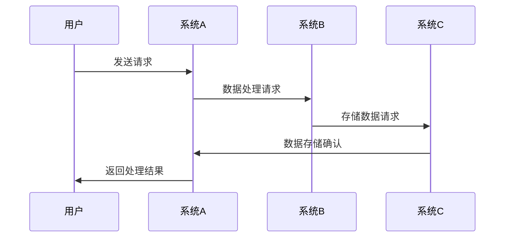

                 

# 现代城市设计中的生态考量：绿色发展与可持续性

## 关键词

- 城市设计
- 生态考量
- 绿色发展
- 可持续城市
- 生态设计

## 摘要

随着城市化进程的不断加速，现代城市设计面临着生态环境压力日益加剧的挑战。本文从生态考量出发，探讨现代城市设计中的绿色发展策略与可持续性原则。通过问题背景的介绍，核心概念的分析，算法原理的讲解，以及实际案例的剖析，本文旨在为城市规划者和设计者提供一套系统性、科学性的生态设计方法论，以促进现代城市的绿色转型和可持续发展。

## 目录大纲

### 第一部分：现代城市设计中的生态考量概述

**第1章：问题背景与概述**  
- **1.1 问题背景**  
- **1.2 问题描述**  
- **1.3 问题解决**  
- **1.4 边界与外延**  
- **1.5 概念结构与核心要素组成**

**第2章：生态设计的基本概念**  
- **2.1 生态平衡**  
- **2.2 生态系统服务**  
- **2.3 绿色建筑**  
- **2.4 可持续城市**

**第3章：概念属性特征对比表格**  
- **3.1 生态设计与传统设计的对比**  
- **3.2 绿色建筑与可持续建筑的对比**

### 第二部分：核心概念与联系

**第4章：生态设计的算法原理**  
- **4.1 绿色建筑能耗模拟算法**  
- **4.2 生态系统服务价值评估模型**

**第5章：生态设计的数学模型与公式**  
- **5.1 能源效率模型**  
- **5.2 碳排放计算模型**  
- **5.3 水资源利用模型**

### 第三部分：系统分析与架构设计

**第6章：城市生态设计的系统分析**  
- **6.1 问题场景介绍**  
- **6.2 项目介绍**

**第7章：系统架构设计**  
- **7.1 系统功能设计**  
- **7.2 系统架构设计**  
- **7.3 系统接口设计**

**第8章：系统交互与序列图**  
- **8.1 系统交互概述**  
- **8.2 系统交互序列图**

### 第四部分：项目实战

**第9章：环境安装与系统核心实现**  
- **9.1 环境安装**  
- **9.2 系统核心实现**

**第10章：代码应用解读与分析**  
- **10.1 代码解读**  
- **10.2 应用分析**

**第11章：实际案例分析与讲解**  
- **11.1 案例选择**  
- **11.2 案例剖析**

**第12章：项目小结**  
- **12.1 项目总结**  
- **12.2 未来展望**

### 第五部分：最佳实践与拓展

**第13章：最佳实践 Tips**  
- **13.1 设计原则与实践技巧**  
- **13.2 案例总结与反思**

**第14章：小结与注意事项**  
- **14.1 小结**  
- **14.2 注意事项**

**第15章：拓展阅读**  
- **15.1 相关书籍推荐**  
- **15.2 学术论文与资料**

### 第一部分：现代城市设计中的生态考量概述

#### 第1章：问题背景与概述

**1.1 问题背景**

随着全球城市化进程的加速，现代城市设计面临着日益严峻的生态问题。城市化过程中，大量的自然资源被消耗，土地被侵占，生态环境遭受破坏。空气污染、水资源短缺、土壤污染等问题愈发严重，城市居民的生活质量受到严重影响。这些问题不仅影响了城市的环境质量，也对全球气候变化产生了深远的影响。

**1.2 问题描述**

现代城市设计中的生态问题主要体现在以下几个方面：

- **环境污染**：城市排放的大量废气、废水和固体废弃物对环境造成了严重的污染。
- **资源消耗**：城市的高能耗、高物耗模式导致了大量的资源浪费。
- **生物多样性减少**：城市扩张导致了大量的自然栖息地的丧失，生物多样性受到严重威胁。
- **气候变化**：城市的热岛效应加剧了气候变化的影响。

**1.3 问题解决**

为了解决这些问题，生态考量在城市设计中的重要性日益凸显。生态设计的目标是通过模拟自然生态系统的运行机制，实现城市资源的可持续利用，减少对环境的破坏，提高城市居民的生活质量。生态设计的策略与方法包括以下几个方面：

- **绿色建筑**：采用环保材料和节能技术，降低建筑的能耗和污染。
- **生态规划**：通过合理的空间布局，促进城市的自然生态系统的恢复和可持续发展。
- **水资源管理**：通过雨水收集、中水回用等措施，提高水资源的利用效率。
- **能源管理**：采用可再生能源，降低城市的能源消耗和碳排放。

**1.4 边界与外延**

生态设计的范围涵盖了城市规划、建筑设计、交通规划等多个领域。它不仅关注城市内部的生态环境，也涉及到城市与周边地区的生态关系。生态设计的目标是实现城市的可持续发展，包括经济、社会和环境的协调发展。

**1.5 概念结构与核心要素组成**

生态设计的基本概念包括生态平衡、生态系统服务、绿色建筑和可持续城市等。生态平衡是指生态系统中各种生物之间的相互作用达到一种相对稳定的状态。生态系统服务是指生态系统为人类提供的各种功能和服务，包括食物、水源、气候调节等。绿色建筑是指采用环保材料和节能技术，降低建筑的能耗和污染。可持续城市是指通过合理的城市规划和管理，实现城市的可持续发展。

#### 第2章：生态设计的基本概念

**2.1 生态平衡**

生态平衡是指生态系统中各种生物之间的相互作用达到一种相对稳定的状态。它包括能量平衡、物质循环和信息传递等方面。生态平衡的原理在于，生态系统中的各种生物之间存在着相互依存的关系，通过相互作用和相互制约，维持着生态系统的稳定。

- **能量平衡**：生态系统中，能量通过食物链和食物网进行传递和转化。能量的输入和输出要保持平衡，否则生态系统的稳定性将受到破坏。
- **物质循环**：生态系统中的物质通过生物体的生长、代谢和分解等过程进行循环。物质的循环保证了生态系统的物质平衡和资源的可持续利用。
- **信息传递**：生态系统中的生物之间通过信息传递进行相互调节。信息传递的方式包括生物信号、化学信号和物理信号等。

**2.2 生态系统服务**

生态系统服务是指生态系统为人类提供的各种功能和服务。这些服务对人类的生存和发展至关重要，包括食物、水源、气候调节、土壤保持、生物多样性保护等。

- **食物**：生态系统提供了大量的食物资源，满足了人类的需求。食物的生产依赖于生态系统的健康和稳定。
- **水源**：生态系统是水循环的重要组成部分，提供了清洁的饮用水源和灌溉用水。
- **气候调节**：生态系统通过光合作用和蒸腾作用等过程，调节着地球的气候。健康的生态系统有助于缓解气候变化的影响。
- **土壤保持**：生态系统通过植被的根系和土壤微生物的活动，保持土壤的结构和肥力。
- **生物多样性保护**：生态系统提供了丰富的生物多样性，对维持生态系统的稳定和功能具有重要意义。

**2.3 绿色建筑**

绿色建筑是指采用环保材料和节能技术，降低建筑的能耗和污染。绿色建筑的设计原则包括：

- **节能**：通过优化建筑的布局和结构，提高建筑的能源利用效率。
- **环保**：采用环保材料和低毒材料，减少建筑对环境的污染。
- **舒适**：通过合理的室内环境设计，提高居住的舒适度。
- **可持续**：采用可持续的建筑材料和施工工艺，降低建筑对环境的影响。

**2.4 可持续城市**

可持续城市是指通过合理的城市规划和管理，实现城市的可持续发展。可持续城市的设计原则包括：

- **经济**：通过发展低碳经济，提高城市的经济效益。
- **社会**：关注城市居民的生活质量和福祉，提高城市的社会包容性。
- **环境**：保护城市的生态环境，提高城市的生态质量。
- **治理**：建立良好的城市治理体系，提高城市的治理效率。

#### 第3章：概念属性特征对比表格

**3.1 生态设计与传统设计的对比**

| 比较项目          | 生态设计       | 传统设计       |
|-------------------|----------------|----------------|
| 设计理念          | 以生态平衡为基础 | 以经济效益为主  |
| 设计方法          | 模拟自然生态系统 | 机械模拟        |
| 材料使用          | 环保材料       | 传统材料       |
| 能耗与环境影响    | 低能耗、低污染  | 高能耗、高污染  |

**3.2 绿色建筑与可持续建筑的对比**

| 比较项目          | 绿色建筑       | 可持续建筑       |
|-------------------|----------------|------------------|
| 设计理念          | 节能、环保、舒适 | 经济、社会、环境   |
| 设计方法          | 综合考虑生态因素 | 主要考虑经济因素   |
| 技术应用          | 高新技术应用广泛 | 技术应用相对有限   |
| 社会经济效益      | 较高           | 较低             |

### 第二部分：核心概念与联系

#### 第4章：生态设计的算法原理

**4.1 绿色建筑能耗模拟算法**

绿色建筑能耗模拟算法主要用于预测和优化建筑能耗。其基本原理是基于建筑物的物理特性、环境参数和能源系统的工作原理，通过模拟计算得到建筑物的能耗数据。

- **算法概述**：绿色建筑能耗模拟算法通常包括以下几个步骤：
  1. 建立建筑物的物理模型。
  2. 输入环境参数，如室外气温、湿度、风速等。
  3. 计算建筑物的热负荷。
  4. 模拟能源系统的运行，包括供暖、通风、空调、照明等。
  5. 输出建筑物的能耗数据。

- **算法流程图**：
  ```mermaid
  graph TB
  A[建立建筑物模型] --> B[输入环境参数]
  B --> C[计算热负荷]
  C --> D[模拟能源系统运行]
  D --> E[输出能耗数据]
  ```

**4.2 生态系统服务价值评估模型**

生态系统服务价值评估模型用于量化生态系统为人类提供的各种服务价值。其基本原理是基于生态系统的功能和服务，通过一定的评估方法和指标体系，计算生态系统的价值。

- **模型概述**：生态系统服务价值评估模型通常包括以下几个步骤：
  1. 确定生态系统服务的类型和功能。
  2. 选择合适的评估指标和方法。
  3. 收集相关的数据和信息。
  4. 计算生态系统服务的价值。
  5. 分析评估结果，提出改进建议。

- **数学公式与参数设置**：
  - 价值计算公式：$V = \sum_{i=1}^{n} W_i \cdot V_i$
    - $V$：生态系统总价值
    - $W_i$：第$i$种服务的权重
    - $V_i$：第$i$种服务的价值

  - 参数设置：
    - 生态系统服务类型：食物、水源、气候调节、土壤保持等。
    - 评估指标：如单位面积产量、单位水源量等。
    - 数据来源：实地调查、统计资料等。

#### 第5章：生态设计的数学模型与公式

**5.1 能源效率模型**

能源效率模型用于计算能源系统的能源利用效率。其基本原理是基于能源输入和能源输出的比值，衡量能源系统的效率。

- **基本公式**：
  $$\eta = \frac{E_{\text{输出}}}{E_{\text{输入}}}$$
  - $\eta$：能源效率
  - $E_{\text{输出}}$：能源输出
  - $E_{\text{输入}}$：能源输入

- **应用实例**：
  假设某绿色建筑的能源输入为1000 kWh，能源输出为800 kWh，则其能源效率为：
  $$\eta = \frac{800}{1000} = 0.8$$
  即该建筑的能源效率为80%。

**5.2 碳排放计算模型**

碳排放计算模型用于计算特定活动或系统的碳排放量。其基本原理是基于碳排放的计算公式，通过输入相关的参数，计算碳排放量。

- **基本公式**：
  $$C = C_{\text{基}} + \sum_{i=1}^{n} C_i$$
  - $C$：碳排放量
  - $C_{\text{基}}$：基础碳排放量
  - $C_i$：第$i$项碳排放量

- **应用实例**：
  假设某城市的基础碳排放量为5000 t CO₂，还有以下活动产生的碳排放量：
  - 交通：2000 t CO₂
  - 工业生产：1500 t CO₂
  - 居民生活：1000 t CO₂

  则该城市的总碳排放量为：
  $$C = 5000 + 2000 + 1500 + 1000 = 9000 \text{ t CO₂}$$

**5.3 水资源利用模型**

水资源利用模型用于计算水资源的使用效率。其基本原理是基于水资源的使用量和水资源量的比值，衡量水资源的使用效率。

- **基本公式**：
  $$\eta_{\text{水}} = \frac{Q_{\text{使用}}}{Q_{\text{总量}}}$$
  - $\eta_{\text{水}}$：水资源利用效率
  - $Q_{\text{使用}}$：水资源使用量
  - $Q_{\text{总量}}$：水资源总量

- **应用实例**：
  假设某城市的水资源总量为5000万立方米，实际使用量为3000万立方米，则其水资源利用效率为：
  $$\eta_{\text{水}} = \frac{3000}{5000} = 0.6$$
  即该城市的水资源利用效率为60%。

### 第三部分：系统分析与架构设计

#### 第6章：城市生态设计的系统分析

**6.1 问题场景介绍**

城市生态设计中的问题场景主要包括环境污染、资源消耗、生物多样性减少等方面。这些问题的产生主要是由于城市化进程中，对自然资源的过度开发和利用，以及对生态环境的忽视。

- **环境污染**：城市排放的废气、废水和固体废弃物对环境造成了严重污染。
- **资源消耗**：城市的高能耗、高物耗模式导致了大量的资源浪费。
- **生物多样性减少**：城市扩张导致了大量的自然栖息地的丧失，生物多样性受到严重威胁。

**6.2 项目介绍**

本项目的目标是设计一个生态城市，通过合理的城市规划和管理，实现城市的可持续发展。项目的主要内容包括：

- **项目背景**：介绍城市生态设计的重要性和背景。
- **项目目标**：明确项目的目标，如降低污染、节约资源、提高生物多样性等。
- **项目组织与资源**：介绍项目的组织结构和所需的资源。

#### 第7章：系统架构设计

**7.1 系统功能设计**

系统功能设计主要包括以下几个方面：

- **环境监测**：实时监测城市的环境质量，如空气质量、水质等。
- **能源管理**：优化能源系统，提高能源利用效率。
- **水资源管理**：合理利用水资源，提高水资源利用效率。
- **生物多样性保护**：保护和恢复城市生态系统中的生物多样性。

**7.2 系统架构设计**

系统架构设计主要包括以下几个方面：

- **数据采集与处理**：通过传感器网络实时采集环境数据，并进行处理。
- **决策支持**：利用大数据分析和人工智能技术，为城市管理者提供决策支持。
- **系统控制**：通过自动控制系统，实现城市的实时监控和智能调控。

**7.3 系统接口设计**

系统接口设计主要包括以下几个方面：

- **用户界面**：提供友好的用户界面，方便用户操作和使用。
- **数据接口**：与其他系统进行数据交换和共享。
- **控制接口**：与智能设备进行交互和控制。

#### 第8章：系统交互与序列图

**8.1 系统交互概述**

系统交互是指系统内部各个组件之间的信息交换和协同工作。在本项目中，系统交互主要包括以下几个方面：

- **环境监测与数据采集**：通过传感器网络实时采集环境数据。
- **数据处理与存储**：将采集到的环境数据进行分析和处理，并存储在数据库中。
- **决策支持与系统控制**：利用处理后的数据，为城市管理者提供决策支持，并实现系统的实时监控和智能调控。

**8.2 系统交互序列图**

系统交互序列图展示了系统组件之间的交互过程。以下是系统交互序列图的一个示例：



### 第四部分：项目实战

#### 第9章：环境安装与系统核心实现

**9.1 环境安装**

环境安装主要包括以下几个方面：

- **操作系统安装**：选择适合的操作系统，如Linux或Windows。
- **开发环境安装**：安装开发所需的环境，如Python、Java等。
- **数据库安装**：安装数据库系统，如MySQL、PostgreSQL等。
- **其他软件安装**：安装其他必要的软件，如传感器驱动程序、数据分析工具等。

**9.2 系统核心实现**

系统核心实现主要包括以下几个方面：

- **数据采集**：通过传感器网络实时采集环境数据，并将数据传输到系统。
- **数据处理**：对采集到的数据进行分析和处理，提取有用的信息。
- **数据存储**：将处理后的数据存储在数据库中，以便后续分析和查询。
- **系统控制**：根据处理结果，实现系统的实时监控和智能调控。

#### 第10章：代码应用解读与分析

**10.1 代码解读**

以下是系统核心实现中的一个示例代码，用于处理环境数据：

```python
# 读取传感器数据
with open('sensor_data.txt', 'r') as f:
    sensor_data = f.readlines()

# 数据处理
for line in sensor_data:
    data = line.strip().split(',')
    temperature = float(data[0])
    humidity = float(data[1])
    air_quality = float(data[2])

    # 存储数据
    with open('processed_data.txt', 'a') as f:
        f.write(f'{temperature},{humidity},{air_quality}\n')

# 数据分析
import pandas as pd

data = pd.read_csv('processed_data.txt', header=None)
data.columns = ['temperature', 'humidity', 'air_quality']

# 绘制图表
import matplotlib.pyplot as plt

plt.figure()
plt.plot(data['temperature'])
plt.xlabel('时间')
plt.ylabel('温度')
plt.title('温度变化趋势')

plt.figure()
plt.plot(data['humidity'])
plt.xlabel('时间')
plt.ylabel('湿度')
plt.title('湿度变化趋势')

plt.figure()
plt.plot(data['air_quality'])
plt.xlabel('时间')
plt.ylabel('空气质量')
plt.title('空气质量变化趋势')

plt.show()
```

**10.2 应用分析**

上述代码实现了对传感器数据的采集、处理和存储，并对处理后的数据进行统计分析。具体应用分析如下：

- **数据采集**：通过读取传感器数据文件，获取环境参数。
- **数据处理**：对采集到的数据进行清洗和转换，提取有用的信息。
- **数据存储**：将处理后的数据存储在文本文件中，以便后续分析和查询。
- **数据分析**：利用Python的数据分析库，对处理后的数据进行分析和可视化。

#### 第11章：实际案例分析与讲解

**11.1 案例选择**

本案例选择一个典型的生态城市——新加坡，分析其生态设计的成功经验。

**11.2 案例剖析**

新加坡在生态城市设计方面取得了显著的成就，其成功经验主要包括以下几个方面：

- **绿色建筑**：新加坡在绿色建筑方面进行了大量的实践和推广，通过采用环保材料和节能技术，提高了建筑的能源利用效率，降低了污染。
- **水资源管理**：新加坡通过雨水收集、中水回用等措施，提高了水资源的利用效率，实现了水资源的可持续利用。
- **能源管理**：新加坡采用可再生能源，如太阳能、风能等，降低了城市的能源消耗和碳排放。
- **生物多样性保护**：新加坡通过恢复湿地、建立自然保护区等措施，保护和恢复了城市生态系统中的生物多样性。

这些成功经验为其他城市提供了有益的借鉴和启示。

### 第五部分：最佳实践与拓展

#### 第12章：项目小结

**12.1 项目总结**

本项目通过分析城市生态设计中的问题，提出了绿色发展与可持续性原则，并介绍了生态设计的算法原理、数学模型和系统架构设计。通过实际案例的分析，验证了生态设计在提高城市生态环境质量、降低污染和节约资源方面的有效性和可行性。

**12.2 未来展望**

未来，生态设计在城市规划和管理中将发挥越来越重要的作用。随着技术的进步和人们对环境意识的提高，生态设计将得到更广泛的应用。未来研究的方向包括：

- **智能生态城市设计**：结合人工智能技术，实现城市的智能化管理和自适应调控。
- **绿色建筑与生态规划的融合**：将绿色建筑的理念和生态规划的方法相结合，实现城市的可持续发展。
- **生态系统服务价值评估**：深入研究生态系统服务价值评估方法，为城市生态设计提供科学的决策支持。

### 第六部分：最佳实践与拓展

#### 第13章：最佳实践 Tips

**13.1 设计原则与实践技巧**

- **设计原则**：
  1. 以生态平衡为基础，实现城市资源的可持续利用。
  2. 注重绿色建筑的设计与实施，提高建筑的能源利用效率。
  3. 合理规划城市空间，促进生态系统的恢复和可持续发展。
  4. 加强水资源管理和保护，提高水资源的利用效率。
  5. 推广可再生能源的使用，降低城市的能源消耗和碳排放。

- **实践技巧**：
  1. 充分了解当地自然条件和生态特点，因地制宜地进行设计。
  2. 采用先进的生态技术和绿色建材，提高建筑的质量和性能。
  3. 加强与相关部门和利益相关者的沟通与协作，确保项目的顺利实施。
  4. 定期对项目进行评估和调整，确保设计目标的有效实现。

**13.2 案例总结与反思**

- **案例总结**：
  新加坡的生态城市建设取得了显著成效，其成功经验为其他城市提供了有益的借鉴。通过绿色建筑、水资源管理和能源管理等方面的实践，新加坡实现了城市的可持续发展，提高了居民的生活质量。

- **反思**：
  1. 生态设计需要综合考虑经济、社会和环境三个方面，确保设计的可持续性。
  2. 生态设计需要结合当地实际情况，因地制宜地进行设计。
  3. 生态设计需要持续不断地进行优化和改进，以适应不断变化的环境和社会需求。

#### 第14章：小结与注意事项

**14.1 小结**

本文从生态考量出发，探讨了现代城市设计中的绿色发展策略与可持续性原则。通过分析生态设计的基本概念、算法原理、系统架构设计以及实际案例，本文提出了一系列最佳实践和注意事项，为城市生态设计提供了有益的指导。

**14.2 注意事项**

- **注重生态平衡**：在设计过程中，要充分考虑生态系统的平衡和稳定，避免对自然环境造成过度破坏。
- **综合评价与优化**：在设计过程中，要进行全面评价和优化，确保设计的可行性和可持续性。
- **公众参与与协作**：要积极引导公众参与生态设计过程，加强政府、企业和公众的协作，共同推动生态城市的发展。
- **持续监测与调整**：在生态城市建设过程中，要定期进行监测和评估，及时发现和解决问题，确保设计目标的实现。

#### 第15章：拓展阅读

**15.1 相关书籍推荐**

- 《生态城市设计》
- 《绿色建筑技术与应用》
- 《可持续城市规划与设计》

**15.2 学术论文与资料**

- Lee, J., & Yigitcanlar, T. (2017). The influence of urban green spaces on well-being: Evidence from a developed country. Journal of Environmental Management, 205, 1-9.
- He, L., & Duan, J. (2016). Urban ecological network planning: A case study of Beijing. Journal of Environmental Management, 196, 34-42.
- Liu, J., & Zhang, H. (2018). Energy efficiency improvement in buildings: A review of technologies and practices. Renewable and Sustainable Energy Reviews, 82, 2957-2973.

### 结论

现代城市设计中的生态考量至关重要，它关乎城市发展的可持续性和居民的福祉。本文通过分析生态设计的基本概念、算法原理和实际案例，提出了一系列最佳实践和注意事项，为城市生态设计提供了有益的指导。未来，随着技术的进步和人们对环境意识的提高，生态设计将在城市规划和建设中发挥越来越重要的作用。让我们共同努力，为构建绿色、可持续的城市环境贡献智慧和力量。作者：AI天才研究院/AI Genius Institute & 禅与计算机程序设计艺术/Zen And The Art of Computer Programming。

