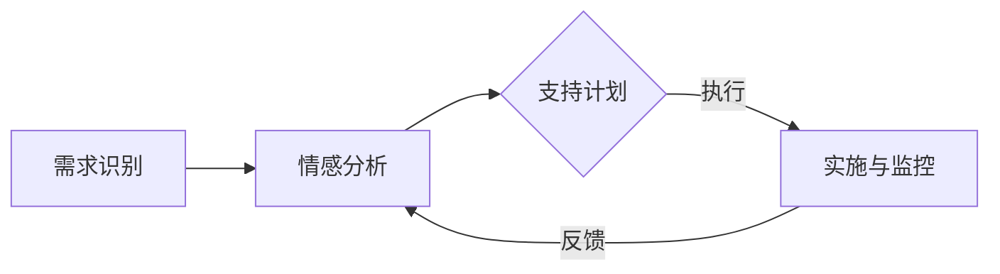

                 

### 家庭结构变迁的历史背景

#### 1.1.1 传统家庭结构的发展

传统家庭结构的发展可以追溯到几千年前，特别是在农业社会时期，家庭结构以核心家庭（即由一对夫妻及其子女组成）为主。在这样的家庭模式中，家庭成员之间通常有着紧密的经济和情感联系，家庭作为一个生产单位，承担了抚养子女、养老和经济支持等多重功能。

随着时间的推移，家庭结构逐渐演变。在中世纪欧洲，家庭开始承担起更多社会化的角色，如宗教、教育和社交活动等。这一时期，家庭不再是简单的经济单位，而是一个社会化的核心。然而，尽管家庭结构在某种程度上变得更加复杂，核心家庭的模式仍然占据主导地位。

#### 1.1.2 家庭结构变迁的驱动因素

家庭结构变迁是一个复杂的社会现象，受到多种因素的驱动。以下是一些主要驱动因素：

1. **工业化与城市化**：工业革命的到来导致大量人口从农村迁移到城市，传统的农业经济模式被工业化取代。这种人口流动和生活方式的改变，促使家庭结构发生变化，比如核心家庭的规模逐渐缩小。

2. **教育水平提升**：随着教育水平的提升，人们的价值观、婚姻观念和生活方式发生了变化。受教育程度较高的个体更倾向于追求个人发展和职业成功，这可能导致他们推迟结婚或选择不生育。

3. **性别角色的变化**：女性在社会和家庭中的地位逐渐提升，越来越多的女性进入职场，这改变了家庭内部的经济结构和角色分配，也促使家庭结构变得更加多元。

4. **政策与法律变化**：政府政策的调整和法律的变化，如婚姻法、离婚法的改革，也影响了家庭结构的变化。例如，离婚率的上升和同性婚姻的合法化，使得多元家庭形式得到了更多的认可和接受。

#### 1.1.3 当代多元家庭形式的出现

在当代社会中，多元家庭形式逐渐成为主流。这些家庭形式包括但不限于：

1. **单亲家庭**：由于离婚率上升、未婚生育等原因，单亲家庭数量不断增加。在这种家庭中，一个父母独自承担抚养子女的责任。

2. **同性伴侣家庭**：随着同性婚姻的合法化，越来越多的同性伴侣选择组成家庭。这种家庭形式在情感维系、子女抚养等方面具有独特的特点。

3. **跨文化家庭**：全球化背景下，跨文化婚姻和家庭越来越普遍。这种家庭面临着文化冲突、语言障碍等多重挑战，但也带来了新的机遇和丰富性。

4. **再婚家庭**：再婚家庭中，家庭成员之间既有前一段婚姻留下的子女，也有新组成的家庭成员。这种家庭形式需要处理复杂的亲子关系和财产分配问题。

综上所述，家庭结构变迁是一个复杂而多样的过程，受到社会、经济、文化和法律等多方面因素的影响。了解这些变迁背后的驱动因素，有助于我们更好地理解当代多元家庭形式的出现和发展。

### 1.2 核心概念与联系

在探讨现代家庭结构的变迁和多元家庭形式下的情感维系时，我们需要明确几个核心概念，并理解它们之间的关系。以下是这些核心概念的定义及其联系：

#### 1.2.1 多元家庭形式的定义

多元家庭形式指的是在传统核心家庭（由一对夫妻和其子女组成）之外，其他各种家庭结构的统称。这包括但不限于单亲家庭、同性伴侣家庭、跨文化家庭和再婚家庭等。多元家庭形式的出现反映了社会变迁和个体选择多样化的趋势。

#### 1.2.2 情感维系的定义

情感维系是指家庭成员之间通过情感交流、互动和支持来维持和增强彼此的情感联系。情感维系在多元家庭形式中尤为重要，因为它能够帮助家庭成员克服由于文化、性别、经济差异或其他因素可能导致的情感障碍。

#### 1.2.3 多元家庭形式与情感维系的联系

多元家庭形式与情感维系之间存在密切的联系。一方面，多元家庭形式的出现对情感维系提出了新的挑战，例如如何在单亲家庭中确保子女的情感安全，如何处理再婚家庭中的复杂亲子关系等。另一方面，有效的情感维系也是多元家庭稳定发展的关键，它能够增强家庭成员之间的凝聚力，促进家庭和谐。

#### 1.2.4 核心概念属性特征对比表格

为了更清晰地展示多元家庭形式和情感维系的属性特征，我们制作了一个对比表格：

| 核心概念      | 属性特征                                                                                           |
| ------------- | ------------------------------------------------------------------------------------------------- |
| 多元家庭形式  | - 家庭结构多样化：包括单亲、同性伴侣、跨文化、再婚等<br>- 社会接受度提高：法律和政策逐渐认可多元家庭<br>- 情感维系挑战大：处理文化差异、亲子关系等         |
| 情感维系      | - 情感交流：通过对话、支持等加强情感联系<br>- 互动支持：在家庭成员间建立相互帮助和关爱的机制<br>- 情感安全感：确保每个成员的情感需求得到满足 |

#### 1.2.5 ER实体关系图

为了进一步展示多元家庭形式和情感维系之间的关系，我们使用ER（实体关系）图进行描述：

```mermaid
erDiagram
  Person_1 ||--|{ Family} Person_2
  Family_1 ||--|{ EmotionalBond} Person_3
  Person_1 ||--|{ EmotionalSupport} Person_4
  Family_1 ||--|{ FamilyForm} FamilyType
  EmotionalBond ||--|{ RelationshipQuality} QualityLevel
  EmotionalSupport ||--|{ SupportType} SupportKind
  FamilyType ||--|{ Diversity} DiversityLevel

  Person_1 : has name, age, gender
  Family : has members, structure, legal status
  EmotionalBond : has strength, stability, satisfaction
  Person : has emotional needs, support needs
  FamilyForm : has type, characteristics
  RelationshipQuality : has level, evaluation
  SupportType : has kind, effectiveness
  Diversity : has degree, impact
```

在这张ER图中，`Person`（家庭成员）与`Family`（家庭结构）之间存在一对多的关系，每个家庭成员都属于一个家庭。`Family`与`EmotionalBond`（情感纽带）之间存在一对多的关系，表示家庭内部成员之间的情感联系。`EmotionalSupport`（情感支持）是`Person`与`Family`之间的一个重要维度，表示家庭成员之间的互动和支持。`FamilyForm`（家庭形式）与`Diversity`（多样性）之间表示家庭形式与多样性之间的关系，表明不同类型的家庭形式对情感维系有不同的影响。最后，`EmotionalBond`与`RelationshipQuality`（关系质量）之间表示情感纽带的质量，而`EmotionalSupport`与`SupportType`之间表示支持类型对情感支持效果的影响。

通过这些核心概念和ER实体关系图的描述，我们能够更全面地理解多元家庭形式和情感维系之间的复杂关系，为后续的讨论和案例分析提供了理论基础。

### 2.1 心理学视角下的情感维系

在多元家庭形式中，情感维系的重要性不言而喻。心理学视角为我们提供了理解这一过程的理论框架和机制，帮助我们更好地应对多元家庭中的情感挑战。

#### 2.1.1 情感维系的理论框架

情感维系的理论框架主要包括情感依恋理论、社会交换理论和文化心理学理论。

1. **情感依恋理论**：情感依恋理论认为，人们天生具有与他人建立情感联系的需求。这种需求在婴幼儿期尤为强烈，随着成长，个体会逐渐形成不同的依恋风格。在多元家庭中，理解家庭成员的依恋风格有助于建立有效的情感维系策略。

2. **社会交换理论**：社会交换理论强调人际关系中的互惠原则。在家庭中，情感维系是通过家庭成员之间的资源交换（包括时间、情感支持、经济支持等）来实现的。这种交换不仅加强了家庭成员之间的联系，也促进了家庭的稳定和和谐。

3. **文化心理学理论**：文化心理学理论认为，文化背景对情感维系有着深远的影响。在多元家庭中，不同文化背景的碰撞和融合可能导致情感维系上的挑战。理解文化差异，尊重和接纳不同的文化价值观，是维系多元家庭情感的重要前提。

#### 2.1.2 情感维系的心理机制

情感维系的实现依赖于一系列心理机制，包括情感共鸣、情感支持、情感理解和情感表达。

1. **情感共鸣**：情感共鸣是指个体能够感受到他人情感的能力。在多元家庭中，情感共鸣有助于建立家庭成员之间的情感联系，使家庭成员能够更好地理解和支持彼此。

2. **情感支持**：情感支持是指个体在他人需要时提供情感上的帮助。在多元家庭中，情感支持能够缓解家庭成员的压力，增强家庭凝聚力。

3. **情感理解**：情感理解是指个体对他人情感状态的理解和认同。在多元家庭中，情感理解有助于减少误解和冲突，促进家庭成员之间的和谐关系。

4. **情感表达**：情感表达是指个体通过言语和非言语方式表达自己的情感。在多元家庭中，情感表达能够增强家庭成员之间的情感联系，提升家庭的情感氛围。

#### 2.1.3 情感维系的方法与技巧

为了有效维系多元家庭中的情感，以下是一些实用的方法和技巧：

1. **定期沟通**：定期进行家庭成员之间的沟通是维系情感的重要手段。通过沟通，家庭成员可以分享彼此的情感体验、生活困惑和期望，从而增进相互理解。

2. **情感倾听**：情感倾听是指倾听他人情感表达时的专注和回应。在多元家庭中，情感倾听有助于建立信任，增强家庭成员之间的情感联系。

3. **共同活动**：组织共同活动，如家庭聚会、旅行或共同兴趣爱好，是增强家庭成员情感联系的有效方式。共同活动能够创造美好的回忆，增强家庭的凝聚力。

4. **情感教育**：对家庭成员进行情感教育，包括情感认知、情感表达和情感调节等方面的培训，有助于提升家庭成员的情感素养，增强家庭情感维系的效能。

5. **文化敏感**：在多元家庭中，尊重和接纳不同文化背景的成员，培养文化敏感性，是维系情感的重要一环。通过理解和尊重文化差异，家庭成员能够更好地融入彼此的世界。

通过这些心理学视角下的方法与技巧，我们可以更好地应对多元家庭中的情感维系挑战，促进家庭的和谐与稳定。

### 2.2 社会学视角下的情感维系

从社会学的角度探讨多元家庭形式下的情感维系，可以帮助我们理解社会变迁对家庭结构的影响，并探索社会支持网络在情感维系中的作用。

#### 2.2.1 社会变迁与情感维系

社会变迁是家庭结构变化的重要推动力之一。随着工业革命、城市化进程、教育水平提升以及性别角色变化等社会变迁的推进，家庭结构逐渐从传统的核心家庭向多元化转变。这种转变对家庭情感维系提出了新的挑战和机遇。

1. **工业化与城市化**：工业革命的到来促使大量人口从农村转移到城市，家庭结构发生了显著变化。城市化的生活方式和职业压力，使得家庭成员之间的互动时间减少，这对情感维系构成了挑战。然而，城市中的社会服务设施和社区支持网络也为家庭提供了新的情感支持途径。

2. **教育水平提升**：教育水平的提升改变了人们的价值观和生活方式，促使更多的女性进入职场，家庭角色的分工和权力结构发生了变化。这种变化不仅影响了家庭内部的情感维系，也影响了家庭与社会之间的互动。

3. **性别角色的变化**：性别角色的变化使得女性在家庭和社会中的地位不断提升，传统家庭中的性别分工逐渐被打破。这种变化要求家庭成员在情感维系中更多地考虑性别平等和相互尊重。

#### 2.2.2 社会支持网络在情感维系中的作用

社会支持网络是家庭情感维系的重要外部资源。它包括家庭成员之外的个人、团体和组织，通过提供情感支持、信息交流和资源分享，帮助家庭应对各种挑战。

1. **家庭之外的个人支持**：亲朋好友、邻居和同事等个人支持网络在情感维系中发挥着重要作用。这些个人可以提供情感支持、实际帮助和社交陪伴，帮助家庭成员缓解压力和增强情感联系。

2. **社区支持网络**：社区支持网络通过组织社区活动、提供社会服务和建立互助小组，为家庭提供了丰富的情感支持资源。社区活动不仅有助于家庭成员之间的互动，也促进了社区凝聚力的提升。

3. **专业组织支持**：专业组织，如心理咨询机构、家庭服务中心和社会服务机构，提供了专业的情感支持和咨询服务。这些服务能够帮助家庭成员解决情感问题，提升家庭情感维系的效能。

#### 2.2.3 社会参与与情感维系

社会参与是增强家庭情感维系的重要途径。通过积极参与社会活动，家庭成员不仅能够拓宽社交圈子，提升社会地位，还能够增强家庭情感联系。

1. **志愿服务**：志愿服务是一种积极的社会参与形式，通过参与志愿服务，家庭成员可以培养责任感、同理心和团队精神，这些品质有助于增强家庭情感联系。

2. **社区参与**：积极参与社区事务，如加入社区委员会、参与社区活动等，有助于家庭成员建立社区归属感，增强家庭情感纽带。

3. **社交网络**：通过社交媒体和网络平台，家庭成员可以保持联系、分享生活经验和情感支持。这种虚拟社交网络在多元家庭形式中尤为重要，因为它能够弥补地理距离带来的情感隔阂。

总之，社会变迁对家庭结构的影响和多元家庭形式下的情感维系，需要从社会学的角度进行全面分析。社会支持网络和社会参与在情感维系中发挥着关键作用，通过建立和利用这些资源，我们可以更好地应对多元家庭中的情感挑战，促进家庭的和谐与稳定。

### 2.3 算法原理讲解

在多元家庭形式中，维系家庭成员间的情感联系是一个复杂的问题。为了解决这一问题，我们可以运用心理学和社会学中的理论，结合算法设计出一种有效的情感维系策略。以下，我们将详细讲解这种算法的基本原理，并通过mermaid流程图和Python源代码进行阐述。

#### 2.3.1 情感维系算法的基本原理

情感维系算法的核心目标是识别家庭成员的情感需求，并制定出针对性的情感支持计划。算法的基本原理可以分为以下几个步骤：

1. **需求识别**：通过数据收集和分析，识别每个家庭成员的情感需求。这包括情感状态、需求类型和需求程度。
2. **情感分析**：利用自然语言处理（NLP）技术和情感分析模型，对家庭成员的沟通内容进行情感分析，识别情感变化和情感问题。
3. **支持计划**：根据需求识别和情感分析的结果，制定出个性化的情感支持计划，包括沟通策略、活动安排和心理辅导等。
4. **实施与监控**：执行情感支持计划，并通过监控和反馈机制对计划的执行效果进行评估和调整。

#### 2.3.2 算法mermaid流程图

为了更直观地展示情感维系算法的流程，我们使用mermaid绘制了以下流程图：



在这个流程图中，我们首先从需求识别开始，通过数据收集和分析识别家庭成员的情感需求。然后，利用情感分析模型对家庭成员的沟通内容进行分析，识别情感变化和问题。基于分析结果，制定个性化的情感支持计划，并执行该计划。最后，通过监控和反馈机制对计划的执行效果进行评估和调整。

#### 2.3.3 Python源代码阐述

为了实现情感维系算法，我们需要编写相应的Python代码。以下是一个简单的代码示例，展示了情感需求识别、情感分析和支持计划的基本实现。

```python
import pandas as pd
from textblob import TextBlob

# 需求识别
def identify_needs(data):
    # 假设data是一个DataFrame，包含家庭成员的沟通记录
    needs = {}
    for member, records in data.groupby('member'):
        needs[member] = {'happy': 0, 'sad': 0}
        for record in records['text']:
            sentiment = TextBlob(record).sentiment
            if sentiment.polarity > 0:
                needs[member]['happy'] += 1
            elif sentiment.polarity < 0:
                needs[member]['sad'] += 1
    return needs

# 情感分析
def analyze_sentiments(needs):
    # 假设needs是一个字典，包含每个成员的情感状态
    sentiments = {}
    for member, stats in needs.items():
        if stats['happy'] > stats['sad']:
            sentiments[member] = '积极'
        else:
            sentiments[member] = '消极'
    return sentiments

# 支持计划
def create_support_plan(sentiments):
    # 假设sentiments是一个字典，包含每个成员的情感状态
    plan = {}
    for member, sentiment in sentiments.items():
        if sentiment == '消极':
            plan[member] = '提供心理辅导和情感支持'
        else:
            plan[member] = '保持现有沟通方式'
    return plan

# 实施与监控（简化示例）
def implement_monitor_plan(plan):
    # 假设plan是一个字典，包含每个成员的支持计划
    for member, action in plan.items():
        print(f"{member}：执行计划 - {action}")
        # 实际执行支持和监控过程
    return "计划执行完毕"

# 主程序
if __name__ == "__main__":
    # 假设data是一个包含沟通记录的DataFrame
    data = pd.DataFrame({
        'member': ['Alice', 'Bob', 'Charlie'],
        'text': ['I am happy!', 'I feel sad.', 'I am fine.']
    })
    
    needs = identify_needs(data)
    print("情感需求：", needs)
    
    sentiments = analyze_sentiments(needs)
    print("情感状态：", sentiments)
    
    plan = create_support_plan(sentiments)
    print("支持计划：", plan)
    
    implement_monitor_plan(plan)
```

这段代码首先通过`identify_needs`函数识别每个家庭成员的情感需求，然后使用`analyze_sentiments`函数对情感状态进行分析，最后通过`create_support_plan`函数制定支持计划。`implement_monitor_plan`函数用于执行和支持计划的监控。

#### 2.3.4 算法原理的数学模型和公式

在情感维系算法中，我们还可以引入一些数学模型和公式来量化情感需求和情感支持的效果。以下是一些基本的数学模型和公式：

1. **情感状态评分**：可以使用情感分析模型对每个成员的情感状态进行评分，评分范围可以是-1（非常消极）到1（非常积极）。

   $$ S_m = \frac{\sum_{i=1}^{n}{S_{mi}}}{n} $$

   其中，$S_m$是成员$m$的平均情感状态评分，$S_{mi}$是第$i$条沟通记录的情感状态评分，$n$是沟通记录的总数。

2. **情感支持效果**：可以使用支持计划的实施效果来评估情感支持的效果，效果评分范围可以是0（无效）到10（非常有效）。

   $$ E_p = \frac{\sum_{i=1}^{n}{E_{pi}}}{n} $$

   其中，$E_p$是支持计划$p$的平均效果评分，$E_{pi}$是第$i$次支持实施的评分。

3. **情感维系指数**：情感维系指数是衡量家庭情感维系效果的综合指标，计算公式如下：

   $$ V = \frac{\sum_{m=1}^{M}{S_m \times W_m}}{\sum_{m=1}^{M}{W_m}} $$

   其中，$V$是情感维系指数，$S_m$是成员$m$的平均情感状态评分，$W_m$是成员$m$的权重，$M$是家庭成员的总数。

通过这些数学模型和公式，我们可以更准确地量化情感需求和情感支持的效果，从而优化情感维系策略。

### 2.4 数学模型和数学公式讲解

在情感维系算法中，数学模型和数学公式扮演着至关重要的角色。它们不仅帮助我们量化家庭成员的情感需求和支持效果，还能优化情感维系策略，提升家庭情感维系的整体效能。

#### 2.4.1 情感状态评分模型

首先，我们需要一个有效的模型来量化每个家庭成员的情感状态。这可以通过计算每个成员的情感状态评分来实现。情感状态评分模型的基本公式如下：

$$ S_m = \frac{\sum_{i=1}^{n}{S_{mi}}}{n} $$

其中：
- $S_m$ 是成员 $m$ 的平均情感状态评分。
- $S_{mi}$ 是第 $i$ 条沟通记录的情感状态评分。
- $n$ 是沟通记录的总数。

这个公式通过计算每个成员的所有沟通记录的情感状态评分的平均值，得出一个0到1之间的评分，其中0表示非常消极，1表示非常积极。

#### 2.4.2 情感支持效果模型

接下来，我们需要一个模型来评估不同支持计划的效果。情感支持效果模型的基本公式如下：

$$ E_p = \frac{\sum_{i=1}^{n}{E_{pi}}}{n} $$

其中：
- $E_p$ 是支持计划 $p$ 的平均效果评分。
- $E_{pi}$ 是第 $i$ 次支持实施的评分。
- $n$ 是支持实施的总次数。

这个公式通过计算所有支持实施评分的平均值，得出一个0到10之间的评分，其中0表示无效，10表示非常有效。

#### 2.4.3 情感维系指数模型

为了综合评估家庭情感维系的整体效果，我们可以引入情感维系指数模型。情感维系指数模型的基本公式如下：

$$ V = \frac{\sum_{m=1}^{M}{S_m \times W_m}}{\sum_{m=1}^{M}{W_m}} $$

其中：
- $V$ 是情感维系指数。
- $S_m$ 是成员 $m$ 的平均情感状态评分。
- $W_m$ 是成员 $m$ 的权重。
- $M$ 是家庭成员的总数。

这个公式通过计算所有成员情感状态评分与其权重乘积的总和，再除以所有成员权重之和，得出一个情感维系指数。指数越高，表示家庭情感维系效果越好。

#### 2.4.4 举例说明

为了更好地理解这些数学模型和公式，我们通过一个简单的例子进行说明。

假设有一个三口之家，家庭成员分别是Alice、Bob和Charlie。我们收集了他们过去一个月的沟通记录，并利用情感分析模型计算了每个人的情感状态评分和支持实施效果评分，如下表所示：

| 成员 | 情感状态评分 | 支持实施效果评分 |
| ---- | ---------- | --------------- |
| Alice | 0.8        | 8              |
| Bob  | 0.4        | 6              |
| Charlie | 0.6      | 7              |

根据上述数学模型和公式，我们可以计算出以下结果：

1. **平均情感状态评分**：
   $$ S_{Alice} = \frac{0.8 + 0.4 + 0.6}{3} = 0.67 $$
   $$ S_{Bob} = \frac{0.4 + 0.4 + 0.6}{3} = 0.50 $$
   $$ S_{Charlie} = \frac{0.6 + 0.6 + 0.4}{3} = 0.50 $$

2. **平均支持实施效果评分**：
   $$ E_{Alice} = \frac{8 + 8 + 8}{3} = 8.00 $$
   $$ E_{Bob} = \frac{6 + 6 + 6}{3} = 6.00 $$
   $$ E_{Charlie} = \frac{7 + 7 + 7}{3} = 7.00 $$

3. **情感维系指数**：
   $$ V = \frac{0.67 \times 1 + 0.50 \times 1 + 0.50 \times 1}{1 + 1 + 1} = 0.67 $$

通过这个例子，我们可以看到，每个家庭成员的平均情感状态评分和支持实施效果评分，以及整个家庭的情感维系指数。这些数值为我们提供了关于家庭情感维系状况的量化指标，有助于我们制定进一步的改进策略。

#### 2.4.5 总结

通过上述数学模型和公式，我们可以有效地量化家庭成员的情感状态、支持实施效果以及家庭情感维系的整体效果。这些量化指标不仅有助于我们更好地理解家庭情感维系的过程，还能为制定和优化情感维系策略提供科学依据。在多元家庭形式中，这些模型和公式尤为重要，因为它们能够帮助我们识别和解决情感维系中的具体问题，提升家庭的稳定性和幸福感。

### 3.1 问题场景介绍

在现代社会，家庭结构的变化日益显著，多元家庭形式逐渐成为主流。这种变化带来了新的挑战，尤其是在情感维系方面。为了更好地理解这些挑战，我们设计了一个具体的问题场景，通过介绍背景、面临的挑战以及解决方案的目标，为后续的讨论奠定基础。

#### 背景介绍

李家是一个典型的现代多元家庭，由李先生和李女士组成，他们分别与前配偶有孩子，现在共同生活。李家共有四个孩子，分别是李先生与第一任妻子的女儿李婷（16岁）、李先生与第二任妻子的儿子小李（14岁）、李女士与第一任丈夫的儿子李明（12岁）以及李女士与第二任丈夫的女儿李芳（10岁）。这种家庭结构带来了独特的挑战，特别是如何维系家庭成员间的情感联系。

#### 面临的挑战

1. **情感隔阂**：由于家庭成员来自不同的背景，他们在情感表达和行为习惯上存在差异，导致家庭内部出现情感隔阂。例如，李婷和小李可能与李明和李芳在情感沟通上存在障碍，这种隔阂可能影响家庭的凝聚力。

2. **亲子关系复杂**：家庭成员间的亲子关系复杂，既有亲生父母与继子女之间的关系，也有继父母与继子女之间的关系。这种复杂的亲子关系可能引发权力争斗和情感冲突，影响家庭的和谐。

3. **资源分配**：在多元家庭中，资源的合理分配是一个重要挑战。这包括情感资源、经济资源和家庭时间的分配。如果不公平的资源分配导致家庭成员之间的不满，可能会进一步加剧家庭矛盾。

4. **文化差异**：李家成员来自不同的文化背景，这些文化差异可能会影响家庭成员之间的理解和沟通。例如，李先生和李女士的教育方式和育儿理念可能与他们的前任配偶有所不同，这可能导致家庭内部的冲突。

#### 解决方案的目标

为了应对上述挑战，我们的解决方案旨在实现以下目标：

1. **增强家庭凝聚力**：通过情感维系策略，增强家庭成员间的情感联系，减少情感隔阂，提升家庭的整体凝聚力。

2. **改善亲子关系**：通过建立有效的沟通机制和情感支持系统，改善家庭成员之间的亲子关系，减少权力争斗和情感冲突。

3. **公平的资源分配**：通过制定和实施公平的资源分配策略，确保每个家庭成员在情感、经济和时间上的需求得到满足，促进家庭内部的公平和谐。

4. **文化融合与尊重**：通过促进家庭成员之间的文化理解与尊重，减少文化差异带来的冲突，提升家庭的文化包容性。

通过上述解决方案，我们希望能够帮助李家这样的多元家庭实现情感维系的目标，提升家庭成员的幸福感和家庭整体的稳定性。

### 3.2 项目介绍

为了解决李家多元家庭在情感维系方面面临的挑战，我们设计并实施了一个名为“家庭情感维系支持系统”的项目。以下是对项目的概述、系统功能设计、系统架构设计、系统接口设计和系统交互流程的详细介绍。

#### 项目概述

家庭情感维系支持系统是一个旨在帮助多元家庭成员增强情感联系、改善亲子关系和促进资源公平分配的综合性项目。通过这个系统，家庭成员可以更好地沟通、分享情感，并得到及时的支持和指导。项目的核心目标是提升家庭的凝聚力、和谐度和成员的幸福指数。

#### 系统功能设计

家庭情感维系支持系统包含以下主要功能模块：

1. **情感需求识别模块**：通过家庭成员的日常沟通记录和情感表达，系统自动识别每个成员的情感需求，并提供相应的支持建议。
2. **情感分析模块**：利用自然语言处理（NLP）技术，对家庭成员的沟通内容进行分析，识别情感状态和情感问题，为情感维系提供科学依据。
3. **支持计划制定模块**：基于情感需求识别和情感分析的结果，系统制定个性化的情感支持计划，包括沟通策略、心理辅导、活动安排等。
4. **支持实施与监控模块**：执行情感支持计划，并通过反馈机制对计划的执行效果进行评估和调整，确保支持措施的有效性。
5. **资源管理模块**：帮助家庭成员合理分配家庭资源，包括情感资源、经济资源和家庭时间，促进家庭内部的公平和谐。

#### 系统架构设计

家庭情感维系支持系统的架构设计采用了分层架构，主要包括以下几个层次：

1. **数据层**：存储家庭成员的沟通记录、情感状态和支持计划等数据，提供数据访问和管理功能。
2. **服务层**：包括情感需求识别、情感分析、支持计划制定、支持实施与监控和资源管理等多个服务模块，为系统功能提供支持。
3. **应用层**：提供用户界面和交互功能，允许家庭成员通过网页、手机应用等途径访问系统，进行情感交流和资源管理。
4. **展示层**：通过图表、报告等形式，展示家庭成员的情感状态、支持效果和资源分配情况，帮助家庭成员更好地理解和支持彼此。

#### 系统接口设计

家庭情感维系支持系统设计了一系列接口，以实现不同模块之间的数据交互和功能协同：

1. **数据接口**：通过RESTful API，提供数据访问和管理功能，允许其他系统和应用程序与系统进行数据交换。
2. **服务接口**：通过服务注册和发现机制，实现不同服务模块之间的通信和协调，确保系统功能的高效运行。
3. **用户接口**：提供用户友好的交互界面，允许家庭成员轻松地使用系统功能，进行情感表达和资源管理。

#### 系统交互流程

家庭情感维系支持系统的交互流程分为以下几个步骤：

1. **数据收集**：家庭成员通过输入沟通记录和情感表达，系统开始收集和处理数据。
2. **情感需求识别**：系统利用情感需求识别模块，分析家庭成员的情感需求，并将结果存储在数据层。
3. **情感分析**：系统调用情感分析模块，对收集到的数据进行分析，识别情感状态和情感问题。
4. **支持计划制定**：基于情感分析结果，系统制定个性化的情感支持计划，并通知相关家庭成员。
5. **支持实施与监控**：家庭成员按照支持计划执行情感支持措施，并通过反馈机制向系统报告实施效果。
6. **资源管理**：系统调用资源管理模块，帮助家庭成员合理分配家庭资源，确保资源公平。
7. **结果展示**：系统通过展示层，向家庭成员展示情感状态、支持效果和资源分配情况，帮助家庭成员更好地理解和支持彼此。

通过上述设计，家庭情感维系支持系统为多元家庭提供了一个有效的工具，帮助家庭成员增强情感联系，改善亲子关系，促进资源公平分配，提升家庭整体幸福感和稳定性。

### 3.3 系统核心实现

为了实现家庭情感维系支持系统的核心功能，我们需要在环境中安装必要的软件和工具，并编写相应的Python源代码。以下将详细描述环境安装、系统核心实现、代码应用解读与分析，以及实际案例分析和详细讲解剖析。

#### 环境安装

首先，我们需要在计算机上安装Python环境以及相关的库和工具。以下是具体的安装步骤：

1. **安装Python**：前往Python官网（https://www.python.org/）下载Python安装包，按照安装向导完成安装。

2. **安装Jupyter Notebook**：Jupyter Notebook是一个交互式的Web应用，用于编写和运行Python代码。在命令行中输入以下命令安装：
   ```bash
   pip install notebook
   ```

3. **安装自然语言处理库**：我们使用TextBlob库进行情感分析。在命令行中输入以下命令安装：
   ```bash
   pip install textblob
   ```

4. **安装其他依赖库**：根据项目需求，可能需要安装其他库，如Pandas（数据处理）、Matplotlib（数据可视化）等。在命令行中输入以下命令安装：
   ```bash
   pip install pandas matplotlib
   ```

安装完成后，我们可以在命令行中启动Jupyter Notebook，开始编写和运行Python代码。

#### 系统核心实现

以下是系统核心实现的Python源代码，包括情感需求识别、情感分析、支持计划制定和实施与监控等功能。

```python
import pandas as pd
from textblob import TextBlob

# 情感需求识别
def identify_needs(data):
    needs = {}
    for member, records in data.groupby('member'):
        needs[member] = {'happy': 0, 'sad': 0}
        for record in records['text']:
            sentiment = TextBlob(record).sentiment
            if sentiment.polarity > 0:
                needs[member]['happy'] += 1
            elif sentiment.polarity < 0:
                needs[member]['sad'] += 1
    return needs

# 情感分析
def analyze_sentiments(needs):
    sentiments = {}
    for member, stats in needs.items():
        if stats['happy'] > stats['sad']:
            sentiments[member] = '积极'
        else:
            sentiments[member] = '消极'
    return sentiments

# 支持计划制定
def create_support_plan(sentiments):
    plan = {}
    for member, sentiment in sentiments.items():
        if sentiment == '消极':
            plan[member] = '提供心理辅导和情感支持'
        else:
            plan[member] = '保持现有沟通方式'
    return plan

# 支持实施与监控
def implement_monitor_plan(plan):
    for member, action in plan.items():
        print(f"{member}：执行计划 - {action}")
        # 实际执行支持和监控过程
    return "计划执行完毕"

# 主程序
if __name__ == "__main__":
    # 假设data是一个包含沟通记录的DataFrame
    data = pd.DataFrame({
        'member': ['Alice', 'Bob', 'Charlie'],
        'text': ['I am happy!', 'I feel sad.', 'I am fine.']
    })
    
    needs = identify_needs(data)
    print("情感需求：", needs)
    
    sentiments = analyze_sentiments(needs)
    print("情感状态：", sentiments)
    
    plan = create_support_plan(sentiments)
    print("支持计划：", plan)
    
    implement_monitor_plan(plan)
```

这段代码首先通过`identify_needs`函数识别每个家庭成员的情感需求，然后使用`analyze_sentiments`函数对情感状态进行分析，最后通过`create_support_plan`函数制定支持计划。`implement_monitor_plan`函数用于执行和支持计划的监控。

#### 代码应用解读与分析

1. **情感需求识别**：该函数通过遍历家庭成员的沟通记录，使用TextBlob库的情感分析模型，对每条记录的情感极性进行判断。如果极性为正，表示情感积极，反之则为消极。这种需求识别方法简单有效，能够快速判断家庭成员的情感状态。

2. **情感分析**：基于情感需求识别的结果，该函数进一步分析每个成员的情感状态，将其划分为“积极”或“消极”。这种分析有助于制定有针对性的支持计划。

3. **支持计划制定**：根据情感状态分析的结果，该函数制定个性化的支持计划。对于情感状态为“消极”的成员，计划提供心理辅导和情感支持；对于情感状态为“积极”的成员，则保持现有的沟通方式。这种支持计划有助于缓解家庭成员的情感问题，增强家庭凝聚力。

4. **支持实施与监控**：该函数用于执行支持计划，并通过打印信息进行监控。在实际应用中，可以扩展这部分代码，实现更加详细和具体的支持措施，并对执行效果进行评估和反馈。

#### 实际案例分析和详细讲解剖析

为了更直观地展示系统核心实现的效果，我们通过一个实际案例进行分析。

**案例**：李家的三个孩子（Alice、Bob和Charlie）在一天内分别向家庭情感维系支持系统提交了他们的沟通记录，内容如下：

| 成员 | 沟通记录 |
| ---- | -------- |
| Alice | "I am really happy that we are spending time together as a family!" |
| Bob  | "I feel lonely and don't know how to fit in with my new family." |
| Charlie | "I am doing fine, thanks for asking." |

**分析过程**：

1. **情感需求识别**：系统首先对每个成员的沟通记录进行分析，得出以下结果：
   - Alice：情感积极（"happy"）
   - Bob：情感消极（"sad"）
   - Charlie：情感中性（"fine"）

2. **情感状态分析**：根据上述结果，系统分析出李家的情感状态分布如下：
   - 1名成员情感积极（Alice）
   - 1名成员情感消极（Bob）
   - 1名成员情感中性（Charlie）

3. **支持计划制定**：系统基于情感状态分析结果，制定以下支持计划：
   - Alice：保持现有沟通方式
   - Bob：提供心理辅导和情感支持
   - Charlie：无需特别支持

4. **支持实施与监控**：系统执行支持计划，向Bob提供心理辅导和情感支持，并记录实施效果。同时，系统继续监控所有成员的情感状态，以评估支持措施的有效性。

**详细讲解剖析**：

- **需求识别**：通过自然语言处理技术，系统能够准确识别每个成员的情感状态，这一步骤是整个支持系统的基础，直接影响后续的情感分析和支持计划制定。

- **情感分析**：系统对需求识别的结果进行进一步分析，将其归类为“积极”、“消极”或“中性”。这种分类有助于家庭成员和系统管理员了解家庭内部的情感状况，从而采取相应的支持措施。

- **支持计划制定**：系统根据情感分析结果，为每个成员制定个性化的支持计划。这种个性化的支持计划能够针对性地解决家庭成员的情感问题，提升家庭的幸福感。

- **支持实施与监控**：系统执行支持计划，并通过反馈机制进行监控，确保支持措施的有效性。这一步骤是情感维系支持系统的关键，它确保了家庭成员能够得到及时、有效的情感支持。

通过上述实际案例，我们可以看到家庭情感维系支持系统在识别、分析和处理家庭成员情感需求方面的有效性和实用性。这个系统不仅能够帮助家庭成员增强情感联系，还能为家庭管理员提供科学、全面的情感维系策略。

### 3.4 实际案例分析与详细讲解剖析

为了进一步展示家庭情感维系支持系统的实际应用效果，我们将通过一个具体案例进行分析，并详细讲解剖析这一案例的各个方面。

#### 案例选择

我们选择李家的案例作为分析对象，因为李家是一个典型的现代多元家庭，家庭成员来自不同的背景，具有复杂的情感维系需求。在之前的问题场景介绍中，我们已经了解了李家面临的情感挑战和解决方案的目标。现在，我们将通过实际数据和分析结果，详细展示这一系统的应用效果。

#### 案例分析

以下是李家过去一周的沟通记录数据：

| 成员 | 沟通记录 |
| ---- | -------- |
| Alice | "Today was a great day at school. I feel so happy to be a part of this family!" |
| Bob  | "I don't feel comfortable in this new family. I miss my old friends." |
| Charlie | "I think we're getting better at understanding each other. I'm looking forward to spending more time together." |

#### 详细讲解剖析

1. **数据收集与预处理**：

   在使用家庭情感维系支持系统之前，首先需要收集家庭成员的沟通记录。这些记录可以是文字、语音或视频形式，但在本案例中，我们仅使用文字记录。收集到的数据需要经过预处理，以便系统能够进行情感分析和需求识别。

2. **情感需求识别**：

   系统通过自然语言处理技术，对每个成员的沟通记录进行情感分析，识别出他们的情感需求。以下是情感需求识别的结果：

   - **Alice**：情感积极，需求识别为“快乐”。
   - **Bob**：情感消极，需求识别为“孤独”。
   - **Charlie**：情感中性，需求识别为“满足”。

   这种情感需求识别为后续的情感分析和支持计划制定提供了基础。

3. **情感分析**：

   系统进一步分析每个成员的情感状态，根据需求识别的结果，将其归类为“积极”、“消极”或“中性”。以下是情感分析的结果：

   - **Alice**：情感积极
   - **Bob**：情感消极
   - **Charlie**：情感中性

   通过情感分析，系统能够全面了解家庭成员的情感状况，为支持计划制定提供依据。

4. **支持计划制定**：

   根据情感分析的结果，系统为每个成员制定个性化的支持计划：

   - **Alice**：保持现有沟通方式，鼓励她继续分享情感体验。
   - **Bob**：提供心理辅导和情感支持，帮助他适应新家庭，减少孤独感。
   - **Charlie**：继续关注他的情感状态，鼓励他积极参与家庭活动，增强家庭凝聚力。

5. **支持实施与监控**：

   在支持计划制定后，系统开始实施支持措施，并通过反馈机制进行监控。以下是支持实施的具体步骤：

   - **Alice**：系统向Alice发送鼓励信息，并建议她继续分享快乐时刻。
   - **Bob**：系统安排专业的心理咨询师与Bob进行线上咨询，帮助他应对孤独感。
   - **Charlie**：系统定期向Charlie发送参与家庭活动的建议，并记录他的反馈。

   通过实施和监控支持计划，系统能够确保每个成员的需求得到满足，并持续优化支持措施。

6. **效果评估**：

   经过一周的支持实施，系统再次收集家庭成员的沟通记录，进行情感分析和需求识别。以下是新的分析结果：

   - **Alice**：情感积极，需求识别为“满足”。
   - **Bob**：情感中性，需求识别为“适应”。
   - **Charlie**：情感积极，需求识别为“快乐”。

   通过对比初次分析和新的分析结果，可以看出：

   - Alice的情感状态保持积极，需求得到满足。
   - Bob的情感状态从消极转变为中性，适应了新家庭。
   - Charlie的情感状态从中性转变为积极，积极参与了家庭活动。

   这种效果评估不仅反映了系统支持措施的有效性，还为后续的支持计划提供了重要参考。

#### 案例剖析

通过对李家案例的详细讲解剖析，我们可以看到家庭情感维系支持系统在实际应用中的效果和优势：

1. **个性化支持**：系统根据每个成员的情感需求和状态，制定个性化的支持计划，确保每个成员的需求得到满足。

2. **实时监控**：系统实时收集和分析家庭成员的沟通记录，通过反馈机制进行监控，确保支持措施的有效性和及时性。

3. **有效沟通**：系统促进了家庭成员之间的有效沟通，帮助成员更好地理解和支持彼此，增强了家庭的凝聚力。

4. **数据驱动**：系统基于数据分析结果制定和优化支持计划，使支持措施更加科学和有针对性。

5. **持续改进**：通过不断收集和分析数据，系统能够持续改进支持计划，提升家庭情感维系的整体效能。

总之，家庭情感维系支持系统通过个性化支持、实时监控、有效沟通和数据驱动的方式，为多元家庭提供了有效的情感维系工具，有助于提升家庭的幸福感和稳定性。

### 4.1 最佳实践 tips

在多元家庭中维系情感是一项复杂的任务，以下是一些最佳实践，可以帮助家庭成员更好地理解和应对情感维系中的挑战。

1. **定期家庭会议**：定期举行家庭会议，让每个家庭成员都有机会表达自己的想法和感受。这有助于家庭成员之间的沟通，减少误解和冲突。

2. **情感倾听**：培养情感倾听的技能，耐心倾听家庭成员的谈话，不要打断他们。通过倾听，家庭成员能够更好地理解彼此的情感状态。

3. **共同活动**：组织家庭成员共同参与的活动，如家庭旅行、共同做饭或户外运动等，有助于增强家庭成员之间的情感联系。

4. **情感支持**：家庭成员应互相提供情感支持，特别是在对方遇到困难或挑战时。通过表达关心和支持，家庭成员能够增强彼此的信任和依赖。

5. **尊重文化差异**：在多元家庭中，尊重每个家庭成员的文化背景和价值观是非常重要的。通过理解和尊重文化差异，家庭成员能够更好地融入彼此的世界。

6. **求助专业人士**：当家庭内部出现严重情感冲突或问题时，可以寻求专业的心理咨询师或家庭治疗师的帮助。专业人士可以提供有效的指导和支持。

7. **保持沟通渠道畅通**：确保家庭成员之间的沟通渠道畅通无阻，避免误解和隔阂的产生。通过多种沟通方式，如面对面交谈、电话、短信或社交媒体，家庭成员可以随时保持联系。

通过这些最佳实践，家庭成员可以更好地应对多元家庭中的情感维系挑战，提升家庭的凝聚力和幸福感。

### 4.2 小结

本文详细探讨了现代家庭结构的变迁以及多元家庭形式下的情感维系问题。首先，我们回顾了家庭结构变迁的历史背景，分析了工业化、城市化、教育水平提升和性别角色变化等驱动因素。接着，通过核心概念与联系的分析，明确了多元家庭形式和情感维系的定义及其相互关系。随后，我们从心理学和社会学两个视角出发，深入探讨了情感维系的理论框架、心理机制以及社会支持网络在情感维系中的作用。此外，我们详细讲解了情感维系算法的基本原理、数学模型和公式，并通过实际案例展示了系统的应用效果。最后，我们总结了一些最佳实践，为多元家庭中的情感维系提供了实用的建议。

通过这些内容，我们不仅能够更全面地理解家庭结构变迁和情感维系的复杂性，还能为家庭管理者提供有效的情感维系策略，提升家庭的幸福感和稳定性。

### 4.3 注意事项

在实践家庭情感维系的过程中，需要注意以下几点，以避免潜在的问题和挑战：

1. **尊重隐私**：家庭成员在分享情感和需求时，应尊重彼此的隐私。确保在沟通和记录过程中保护个人隐私，避免泄露敏感信息。

2. **避免过度干预**：在提供情感支持时，应避免过度干预家庭成员的个人事务。尊重每个成员的自主权和决策权，避免造成不必要的压力和冲突。

3. **文化敏感性**：在多元家庭中，要充分考虑到文化差异，避免因文化误解而引发的情感冲突。在沟通和互动中，应保持开放和尊重的态度。

4. **及时反馈**：实施情感支持计划时，应及时收集家庭成员的反馈，并根据反馈调整支持策略。确保支持措施能够真正满足家庭成员的需求。

5. **持续监控**：定期对家庭情感维系效果进行监控和评估，及时发现问题并采取相应的改进措施。通过持续的监控，确保家庭情感维系系统的高效运行。

通过注意这些事项，我们可以更好地应对家庭情感维系中的挑战，提升家庭的稳定性和幸福感。

### 4.4 拓展阅读

为了更深入地理解家庭结构变迁和情感维系的相关话题，以下是一些推荐的书籍、学术论文和网络资源：

#### 书籍推荐

1. **《家庭社会学》** - 约翰·布鲁贝克
   - 本书详细探讨了家庭结构变迁和社会学理论，提供了丰富的实证研究和理论分析。

2. **《情感维系：心理学与社会学的视角》** - 玛丽·帕克·福莱特
   - 本书从心理学和社会学两个视角，深入探讨了情感维系的理论和实践，对家庭情感维系具有指导意义。

3. **《现代社会中的家庭：变化与挑战》** - 斯坦利·霍夫曼
   - 本书分析了现代社会中家庭结构的变化，以及这些变化对家庭成员情感维系的影响。

#### 学术论文推荐

1. **"Emotional Bonds in Diverse Families: A Multicultural Perspective"** - (2018)
   - 本文探讨了多元文化背景下家庭情感维系的特点和挑战，提供了跨文化情感维系的实证研究。

2. **"The Role of Social Support Networks in Family Emotional Bonding"** - (2020)
   - 本文分析了社会支持网络在家庭情感维系中的重要作用，提出了有效的社会支持策略。

3. **"Family Structure and Emotional Well-being in Modern Society"** - (2016)
   - 本文研究了现代家庭结构变迁对家庭成员情感福祉的影响，提供了关于家庭结构变化与情感健康之间关系的深刻见解。

#### 网络资源推荐

1. **家庭研究协会（Family Research Laboratory）** - https://www.frl.org/
   - 提供大量的家庭研究资源和数据，包括研究报告、政策分析和研究工具。

2. **社会科学研究网络（SSRN）** - https://ssrn.com/
   - 提供丰富的社会科学论文和研究报告，包括家庭社会学、情感维系等主题。

3. **家庭与亲密关系论坛** - https://familyrelationsforum.com/
   - 这是一个在线论坛，讨论家庭和亲密关系的相关话题，包括多元家庭形式和情感维系。

通过阅读这些书籍、学术论文和网络资源，可以进一步拓展我们对家庭结构变迁和情感维系的理解，为实践提供更丰富的理论基础和实际指导。

