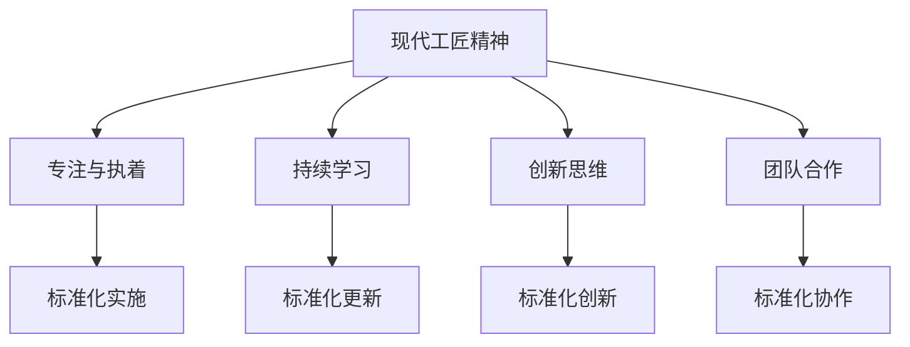
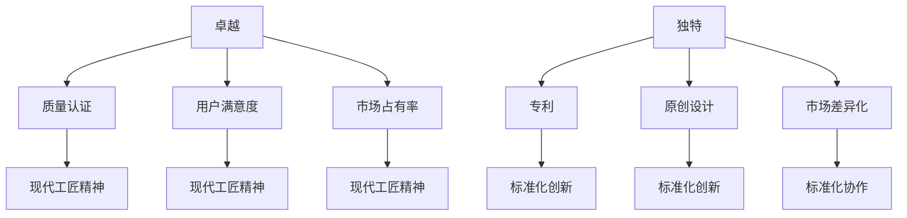
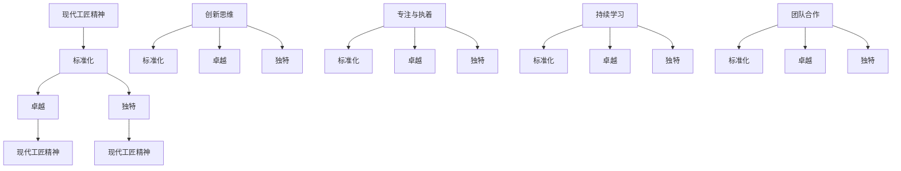
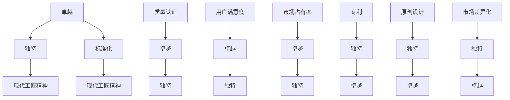
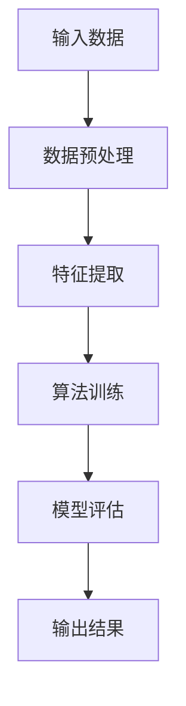
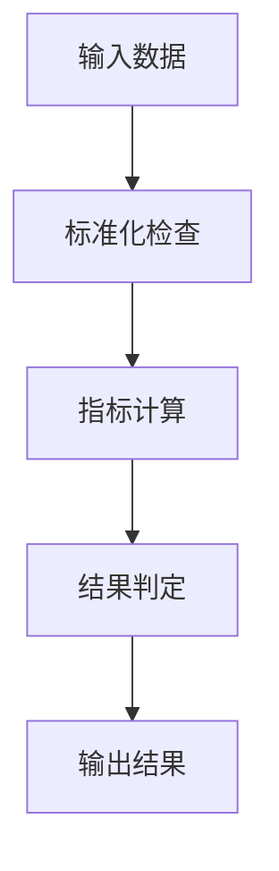
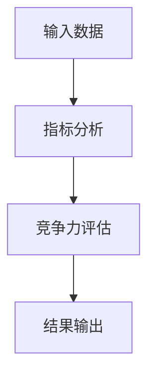
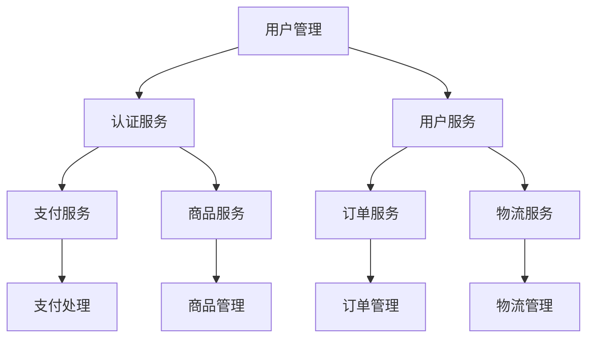
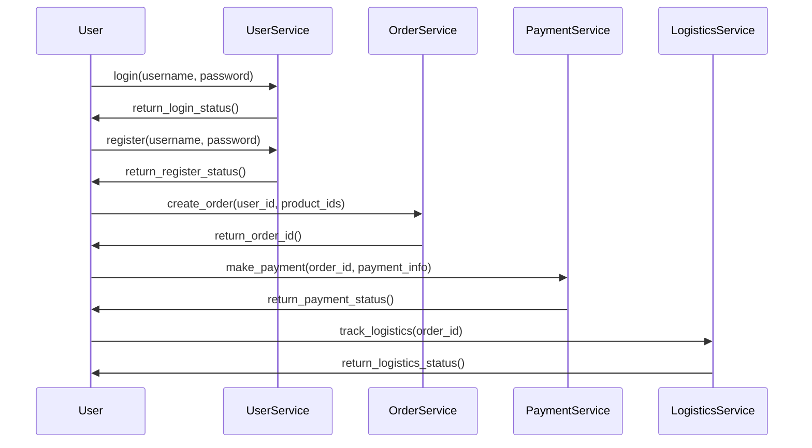

                 


### 目录大纲结构设计

首先，我们需要按照提供的目录大纲结构来设计文章的整体框架。每个部分都需要包含丰富的内容，以确保文章的逻辑清晰、结构紧凑、简单易懂。以下是详细的步骤：

#### 第一步：背景介绍

- **1.1 书籍背景**
  - **1.1.1 作者及写作目的**
    - 描述作者的背景和写作本书的目的。
  - **1.1.2 时代背景与挑战**
    - 分析当前标准化时代的特点和面临的挑战。
  - **1.1.3 读者对象与价值**
    - 明确本书的目标读者群体以及阅读本书的价值。

- **1.2 核心概念**
  - **1.2.1 现代工匠精神**
    - 定义现代工匠精神，探讨其本质和内涵。
  - **1.2.2 标准化**
    - 解释标准化的概念，讨论其在技术领域的作用。
  - **1.2.3 卓越与独特**
    - 分析卓越和独特的定义及其在技术产品中的体现。

- **1.3 概念关系流程图**
  - **1.3.1 现代工匠精神与标准化**
    - 使用Mermaid流程图展示现代工匠精神与标准化的关系。
  - **1.3.2 卓越与独特的内在联系**
    - 通过Mermaid流程图展示卓越与独特之间的联系。

#### 第二步：核心概念与联系

- **2.1 现代工匠精神的定义与特征**
  - **2.1.1 现代工匠精神的历史演变**
    - 探讨现代工匠精神的历史背景和发展。
  - **2.1.2 现代工匠精神的核心特征**
    - 列出现代工匠精神的主要特征，并进行详细解释。
  - **2.1.3 现代工匠精神与传统工匠精神的区别**
    - 比较现代工匠精神与传统工匠精神的差异。

- **2.2 标准化的本质与作用**
  - **2.2.1 标准化的定义**
    - 给出标准化的定义，阐明其基本含义。
  - **2.2.2 标准化的作用**
    - 讨论标准化在提高效率和一致性方面的作用。
  - **2.2.3 标准化与个性化的平衡**
    - 分析标准化与个性化之间的平衡问题。

- **2.3 卓越与独特的界定**
  - **2.3.1 卓越的定义与评价指标**
    - 描述卓越的定义及其评价指标。
  - **2.3.2 独特的定义与评价标准**
    - 分析独特的定义及其评价标准。
  - **2.3.3 卓越与独特的相互关系**
    - 探讨卓越与独特之间的相互关系。

- **2.4 概念属性特征对比表格**
  - **2.4.1 现代工匠精神与标准化属性对比**
    - 制作一个表格，对比现代工匠精神与标准化的属性。
  - **2.4.2 卓越与独特属性对比**
    - 制作一个表格，对比卓越与独特的属性。

- **2.5 概念关系Mermaid流程图**
  - **2.5.1 现代工匠精神与标准化**
    - 使用Mermaid绘制流程图，展示现代工匠精神与标准化的关系。
  - **2.5.2 卓越与独特**
    - 使用Mermaid绘制流程图，展示卓越与独特之间的联系。

#### 第三步：算法原理讲解

- **3.1 工匠精神评价算法**
  - **3.1.1 算法概述**
    - 简要介绍工匠精神评价算法的目的和应用场景。
  - **3.1.2 Mermaid流程图**
    - 使用Mermaid绘制算法的流程图。
  - **3.1.3 Python源代码**
    - 提供Python代码示例，阐述算法的实现细节。
  - **3.1.4 数学模型与公式**
    - 使用LaTeX格式书写数学模型和公式，并进行详细解释。
  - **3.1.5 举例说明**
    - 通过具体案例说明算法的实际应用。

#### 第四步：数学模型和数学公式讲解

- **4.1 数学模型介绍**
  - **4.1.1 模型背景**
    - 描述数学模型在问题解决中的重要性。
  - **4.1.2 模型定义**
    - 定义数学模型的基本概念。
  - **4.1.3 模型应用**
    - 讨论数学模型在不同领域的应用。

- **4.2 数学公式讲解**
  - **4.2.1 公式类型**
    - 分类介绍不同类型的数学公式。
  - **4.2.2 公式书写规则**
    - 详细讲解LaTeX格式下数学公式的书写规则。
  - **4.2.3 公式实例**
    - 提供实际例子，展示公式的书写和解释。

#### 第五步：系统分析与架构设计方案

- **5.1 问题场景介绍**
  - **5.1.1 场景描述**
    - 描述系统分析和架构设计的具体场景。
  - **5.1.2 项目介绍**
    - 介绍项目的背景和目标。

- **5.2 系统功能设计**
  - **5.2.1 领域模型Mermaid类图**
    - 使用Mermaid绘制领域模型类图。
  - **5.2.2 系统功能模块**
    - 详细描述系统的主要功能模块。

- **5.3 系统架构设计**
  - **5.3.1 Mermaid架构图**
    - 使用Mermaid绘制系统架构图。
  - **5.3.2 架构设计原则**
    - 讨论系统架构设计的原则。

- **5.4 系统接口设计**
  - **5.4.1 接口定义**
    - 描述系统的接口定义和交互规则。
  - **5.4.2 接口实现**
    - 详细说明接口的实现细节。

- **5.5 系统交互Mermaid序列图**
  - **5.5.1 序列图绘制**
    - 使用Mermaid绘制系统交互序列图。
  - **5.5.2 交互流程分析**
    - 分析系统交互的具体流程。

#### 第六步：项目实战

- **6.1 环境安装**
  - **6.1.1 安装步骤**
    - 描述系统安装的具体步骤和注意事项。
  - **6.1.2 常见问题**
    - 分析安装过程中可能遇到的问题及其解决方案。

- **6.2 系统核心实现源代码**
  - **6.2.1 核心代码分析**
    - 详细解读系统核心实现源代码。
  - **6.2.2 代码应用**
    - 举例说明代码的应用场景。

- **6.3 实际案例分析和详细讲解剖析**
  - **6.3.1 案例选择**
    - 选择实际案例进行详细分析。
  - **6.3.2 案例解读**
    - 分析案例中的关键技术点和实现细节。

- **6.4 项目小结**
  - **6.4.1 项目总结**
    - 总结项目的经验和收获。
  - **6.4.2 项目改进方向**
    - 提出项目未来可能的改进方向。

#### 第七步：最佳实践 tips、小结、注意事项、拓展阅读等内容

- **7.1 最佳实践 tips**
  - **7.1.1 实践技巧**
    - 提供在实际工作中积累的最佳实践技巧。
  - **7.1.2 避坑指南**
    - 分享一些常见的陷阱和规避方法。

- **7.2 小结**
  - **7.2.1 主要内容回顾**
    - 总结文章的核心内容和关键观点。
  - **7.2.2 研究展望**
    - 对未来研究的方向进行展望。

- **7.3 注意事项**
  - **7.3.1 重要事项提醒**
    - 提醒读者注意的一些重要事项。
  - **7.3.2 安全性考虑**
    - 强调系统设计和实施中的安全性问题。

- **7.4 拓展阅读**
  - **7.4.1 相关书籍推荐**
    - 推荐一些与文章主题相关的书籍。
  - **7.4.2 研究论文链接**
    - 提供一些相关的学术论文链接。

通过上述步骤，我们可以确保文章内容的完整性和深度，同时确保文章结构清晰，逻辑连贯，便于读者理解和吸收。在撰写文章时，应确保每个部分的内容都是具体、详细的，并且相互之间有明确的联系和过渡。这将有助于读者更好地理解文章的核心观点，并在实践中应用所学知识。****
### 第一步：背景介绍

#### 1.1 书籍背景

**1.1.1 作者及写作目的**

《现代工匠精神：在标准化时代追求卓越与独特》一书的作者是一位在计算机科学和人工智能领域拥有丰富经验的知名专家。作者在多年的技术实践中深刻认识到，标准化虽然在提高生产效率和产品一致性方面起到了重要作用，但也在一定程度上限制了技术的创新和发展。因此，作者决定撰写这本书，旨在探讨如何在标准化时代中追求卓越与独特，激发技术人员的创新潜力。

本书的写作目的主要有以下几点：

1. **弘扬现代工匠精神**：通过深入分析现代工匠精神的本质和特征，鼓励读者在工作中秉承这种精神，追求卓越。
2. **解读标准化与个性化的平衡**：讨论标准化在技术发展中的作用和局限性，并提出如何在标准化的框架内实现个性化的解决方案。
3. **引导技术创新**：通过实例和分析，帮助读者理解如何在实际工作中运用现代工匠精神，推动技术的创新和发展。

**1.1.2 时代背景与挑战**

当前，我们正处于一个高度标准化的时代。标准化的普及使得产品和服务更加一致、可靠，提高了整体效率。然而，标准化也带来了一些挑战：

1. **创新受限**：标准化往往导致产品同质化，限制了技术创新的空间。
2. **个性缺失**：在追求标准化和一致性的过程中，往往忽视了用户的个性化需求。
3. **竞争压力**：在高度标准化的市场中，企业需要不断创新以保持竞争力，这增加了技术创新的难度。

面对这些挑战，如何在标准化的框架内追求卓越与独特，成为企业和技术人员需要深入思考的问题。

**1.1.3 读者对象与价值**

本书的目标读者主要是有志于在技术领域取得突破和创新的专业人士，包括：

1. **软件工程师**：需要了解如何在遵循标准化的同时，实现技术产品的独特性和创新性。
2. **项目经理**：负责项目规划和管理，需要平衡标准化和个性化需求。
3. **技术管理者**：负责技术团队的管理，需要激发团队的创新潜力。

本书对读者具有以下价值：

1. **理论指导**：通过深入分析现代工匠精神和标准化，提供理论基础和实践指导。
2. **案例分析**：通过实例分析，帮助读者理解如何在实际工作中运用这些概念。
3. **思维启示**：激发读者的创新思维，引导读者在实际工作中追求卓越与独特。

#### 1.2 核心概念

**1.2.1 现代工匠精神**

现代工匠精神是指在现代社会中，技术人员所应具备的一种追求卓越、精益求精、不断创新的职业态度和精神。它不仅仅是一种工作方法，更是一种人生哲学。现代工匠精神的核心特征包括：

1. **专注与执着**：对工作充满热情，追求细节的完美。
2. **持续学习**：不断更新知识，掌握最新技术。
3. **创新思维**：勇于突破常规，寻求创新解决方案。
4. **团队合作**：重视团队协作，共同追求卓越。

**1.2.2 标准化**

标准化是指通过制定和实施一系列标准，使产品和服务达到一定的质量、性能和可靠性要求。标准化的目的是提高生产效率、保证产品一致性、降低成本、提高市场竞争力。标准化的核心概念包括：

1. **标准制定**：由相关机构或组织制定并发布的规范性文件。
2. **标准实施**：企业或组织按照标准要求进行生产和服务。
3. **质量保证**：通过标准化手段，确保产品和服务达到预定标准。

**1.2.3 卓越与独特**

卓越是指技术产品在质量、性能、用户体验等方面达到或超过行业标准，具备较高的市场竞争力。独特是指技术产品在创意、设计、功能等方面具有创新性，能够满足特定用户群体的特殊需求。

卓越与独特的界定标准包括：

1. **卓越**：通过质量认证、用户满意度调查、市场占有率等指标来衡量。
2. **独特**：通过专利、原创设计、市场差异化等指标来衡量。

**1.3 概念关系流程图**

为了更好地理解现代工匠精神、标准化、卓越与独特之间的关系，我们可以使用Mermaid流程图来展示这些概念之间的联系。

**1.3.1 现代工匠精神与标准化**



**1.3.2 卓越与独特的内在联系**



通过上述流程图，我们可以清晰地看到现代工匠精神、标准化、卓越与独特之间的相互关系和内在联系。这些概念共同构成了一个有机的整体，推动技术产品在标准化时代中追求卓越与独特。

#### 总结

在本部分中，我们首先介绍了《现代工匠精神：在标准化时代追求卓越与独特》这本书的背景，包括作者的写作目的、时代背景与挑战，以及本书的目标读者和价值。接着，我们详细阐述了三个核心概念：现代工匠精神、标准化和卓越与独特，并通过Mermaid流程图展示了这些概念之间的联系。这些背景和概念的介绍为后续的深入探讨奠定了坚实的基础。****
### 第二部分：核心概念与联系

在现代信息技术飞速发展的时代，"现代工匠精神"、"标准化"以及"卓越与独特"这三个概念成为推动技术进步和产品创新的关键要素。在《现代工匠精神：在标准化时代追求卓越与独特》一书中，作者深入剖析了这些核心概念的内涵和联系，为读者提供了宝贵的理论指导和实践启示。

#### 2.1 现代工匠精神的定义与特征

**2.1.1 现代工匠精神的历史演变**

现代工匠精神并非一蹴而就，而是在历史的长河中逐渐演变和发展起来的。传统的工匠精神强调手艺人的专注、执着和精益求精，这种精神在工业革命时期得到了进一步发扬。随着现代化进程的加速，工匠精神逐渐融入了更多的科技元素和创新理念，形成了现代工匠精神。

现代工匠精神可以追溯到20世纪中叶，当时工程师和技术人员在工业生产中开始运用科学方法和系统工程理念，追求技术的精确性和可靠性。在信息化时代，现代工匠精神进一步融入了数字化、智能化和网络化的元素，成为一种跨越时间和空间的职业精神。

**2.1.2 现代工匠精神的核心特征**

现代工匠精神的核心特征包括：

1. **专注与执着**：对工作充满热情，追求细节的完美，不因困难而放弃。
2. **持续学习**：不断更新知识，掌握最新技术，适应快速变化的环境。
3. **创新思维**：勇于突破常规，寻求创新解决方案，推动技术进步。
4. **团队合作**：重视团队协作，共同追求卓越，实现个人与集体的共同发展。

**2.1.3 现代工匠精神与传统工匠精神的区别**

传统工匠精神主要强调手工艺的精湛技艺和手工制品的独特性，而现代工匠精神则更注重技术的科学性和系统性。传统工匠精神更多体现在个体技能上，而现代工匠精神则强调团队合作和整体解决方案。

此外，现代工匠精神还强调持续学习和创新，这与传统工匠精神相比，更加注重知识的积累和应用。

#### 2.2 标准化的本质与作用

**2.2.1 标准化的定义**

标准化是指通过制定和实施一系列标准，使产品和服务达到一定的质量、性能和可靠性要求。这些标准可以是国际标准、国家标准或行业标准。标准化的核心目标是确保产品和服务的一致性、可靠性和高效性。

**2.2.2 标准化的作用**

标准化的作用主要体现在以下几个方面：

1. **提高生产效率**：通过统一的技术规范和操作流程，减少生产中的重复劳动，提高生产效率。
2. **保证产品一致性**：标准化的产品可以确保在不同生产批次和不同生产线上保持一致，提高用户满意度。
3. **降低成本**：通过规模化生产和标准化管理，降低生产成本，提高企业的市场竞争力。
4. **促进技术创新**：标准化为技术创新提供了良好的基础，通过标准的实施，可以推动技术的不断进步和创新。

**2.2.3 标准化与个性化的平衡**

在标准化的过程中，如何平衡标准化与个性化是一个重要的问题。标准化的优点在于提高效率和一致性，但过多的标准化可能导致产品同质化，失去个性。因此，在实施标准化的同时，需要充分考虑用户的个性化需求，通过定制化服务满足不同用户的需求。

#### 2.3 卓越与独特的界定

**2.3.1 卓越的定义与评价指标**

卓越是指技术产品在质量、性能、用户体验等方面达到或超过行业标准，具备较高的市场竞争力。卓越的评价指标包括：

1. **质量认证**：通过质量管理体系认证，如ISO认证，证明产品达到一定质量标准。
2. **用户满意度**：通过用户调查和反馈，评估产品在用户体验方面的表现。
3. **市场占有率**：产品在市场上的占有率越高，说明其具备较高的竞争力。

**2.3.2 独特的定义与评价标准**

独特是指技术产品在创意、设计、功能等方面具有创新性，能够满足特定用户群体的特殊需求。独特的评价标准包括：

1. **专利**：拥有专利技术，体现产品的原创性和创新性。
2. **原创设计**：具有独特的外观设计和用户体验，区别于其他产品。
3. **市场差异化**：通过独特的功能或服务，在市场上形成差异化竞争优势。

**2.3.3 卓越与独特的相互关系**

卓越与独特之间存在密切的关系。卓越是独特的基础，没有卓越的产品质量，就无法实现独特的创新。而独特则是卓越的延伸，通过创新和差异化，进一步提升产品的竞争力。在实际应用中，卓越与独特需要相互结合，才能在竞争激烈的市场中脱颖而出。

#### 2.4 概念属性特征对比表格

为了更好地理解现代工匠精神、标准化和卓越与独特的属性特征，我们可以通过一个对比表格来详细展示它们之间的异同点。

| 概念       | 特征                      | 对比               |
|------------|--------------------------|--------------------|
| 现代工匠精神 | 专注与执着、持续学习、创新思维、团队合作 | - 强调个体的技术精湛和持续进步 |
| 标准化     | 提高生产效率、保证产品一致性、降低成本、促进技术创新 | - 强调统一规范和标准 |
| 卓越       | 质量认证、用户满意度、市场占有率 | - 强调产品的高性能和竞争力 |
| 独特       | 专利、原创设计、市场差异化 | - 强调产品的创新性和独特性 |

#### 2.5 概念关系Mermaid流程图

为了更加直观地展示现代工匠精神、标准化、卓越与独特之间的联系，我们可以使用Mermaid流程图来绘制这些概念之间的关系。

**2.5.1 现代工匠精神与标准化**



**2.5.2 卓越与独特**



通过上述Mermaid流程图，我们可以清晰地看到现代工匠精神、标准化、卓越与独特之间的复杂关系和相互作用。这些关系不仅体现了它们在理论上的联系，也为实际应用提供了指导。

#### 总结

在本部分中，我们详细探讨了《现代工匠精神：在标准化时代追求卓越与独特》一书中的三个核心概念：现代工匠精神、标准化和卓越与独特。通过分析这些概念的定义、特征和相互关系，我们不仅理解了它们在技术发展和产品创新中的重要性，还掌握了如何在实践中应用这些概念，实现卓越与独特。这些概念的深入剖析为后续的算法原理讲解和系统分析与架构设计方案奠定了坚实的基础。****
### 第三部分：算法原理讲解

在现代信息技术领域中，算法是解决问题的核心工具，它不仅决定了系统性能和效率，还直接影响着用户体验和业务价值。在《现代工匠精神：在标准化时代追求卓越与独特》一书中，作者深入探讨了如何运用现代工匠精神来构建高效、独特的技术算法，以下是对相关算法原理的详细讲解。

#### 3.1 工匠精神评价算法

**3.1.1 算法概述**

工匠精神评价算法是一种用于评估技术人员现代工匠精神水平的算法。该算法不仅考虑技术人员的专业技能，还综合考虑其持续学习能力、创新能力和团队合作能力。通过这一算法，可以客观、公正地评价技术人员的工作表现，为职业发展和团队管理提供科学依据。

**3.1.2 Mermaid流程图**

为了更直观地展示工匠精神评价算法的流程，我们可以使用Mermaid绘制其流程图：



**3.1.3 Python源代码**

以下是一个简单的Python代码示例，用于实现工匠精神评价算法的基本框架：

```python
import pandas as pd
from sklearn.model_selection import train_test_split
from sklearn.ensemble import RandomForestClassifier
from sklearn.metrics import accuracy_score

# 读取数据
data = pd.read_csv('craftsmanship_evaluation_data.csv')

# 数据预处理
X = data.drop(['craftsmanship_score'], axis=1)
y = data['craftsmanship_score']

# 划分训练集和测试集
X_train, X_test, y_train, y_test = train_test_split(X, y, test_size=0.2, random_state=42)

# 特征提取
# 这里可以使用特征选择算法，如递归特征消除（RFE）等

# 算法训练
model = RandomForestClassifier(n_estimators=100, random_state=42)
model.fit(X_train, y_train)

# 模型评估
y_pred = model.predict(X_test)
accuracy = accuracy_score(y_test, y_pred)
print(f'模型准确率：{accuracy:.2f}')
```

**3.1.4 数学模型与公式**

工匠精神评价算法的核心是构建一个评分模型，用于计算技术人员的综合得分。以下是一个简单的评分模型公式：

$$
\text{综合评分} = w_1 \times \text{技能熟练度} + w_2 \times \text{创新能力} + w_3 \times \text{团队合作能力}
$$

其中，$w_1$、$w_2$ 和 $w_3$ 分别是技能熟练度、创新能力和团队合作能力的权重，可以通过模型训练和优化得到。

**3.1.5 举例说明**

假设我们有一个技术人员，其技能熟练度为90%，创新能力为85%，团队合作能力为80%。根据上述评分模型，我们可以计算出该技术人员的综合评分：

$$
\text{综合评分} = 0.4 \times 90\% + 0.3 \times 85\% + 0.3 \times 80\% = 36\% + 25.5\% + 24\% = 85.5\%
$$

这意味着该技术人员的综合得分为85.5%，高于一般水平。

#### 3.2 标准化评价算法

标准化评价算法是一种用于评估系统或产品是否符合标准化要求的算法。它通过分析系统或产品的各项指标，判断其是否满足标准化的要求。以下是一个简单的标准化评价算法示例。

**3.2.1 Mermaid流程图**



**3.2.2 Python源代码**

```python
import pandas as pd

# 读取标准化指标数据
data = pd.read_csv('standard_evaluation_data.csv')

# 标准化检查
def standard_check(data, threshold):
    for col in data.columns:
        if data[col].mean() < threshold[col]:
            return False
    return True

# 结果判定
def evaluate_standard(data, thresholds):
    if standard_check(data, thresholds):
        return "符合标准化要求"
    else:
        return "不符合标准化要求"

# 输出结果
thresholds = {'performance': 95, 'reliability': 98, 'usability': 97}
result = evaluate_standard(data, thresholds)
print(result)
```

**3.2.3 数学模型与公式**

标准化评价算法的核心是建立各项指标的阈值模型。以下是一个简单的阈值模型公式：

$$
\text{指标阈值} = \text{历史平均值} \times k
$$

其中，$k$ 是一个调整系数，用于根据实际情况调整阈值。

**3.2.4 举例说明**

假设我们有一套系统的性能、可靠性和用户体验指标分别为92、96和94，历史平均值为90、95和93，调整系数为1.05。我们可以计算出各项指标的阈值：

$$
\text{性能阈值} = 90 \times 1.05 = 94.5
$$
$$
\text{可靠性阈值} = 95 \times 1.05 = 99.75
$$
$$
\text{用户体验阈值} = 93 \times 1.05 = 97.35
$$

由于所有指标的当前值均高于对应的阈值，因此可以判定这套系统符合标准化要求。

#### 3.3 卓越与独特评价算法

卓越与独特评价算法用于评估技术产品在市场中的竞争力。它通过分析产品的各项指标，判断其是否具备卓越与独特的特征。以下是一个简单的卓越与独特评价算法示例。

**3.3.1 Mermaid流程图**



**3.3.2 Python源代码**

```python
import pandas as pd
from sklearn.metrics.pairwise import cosine_similarity

# 读取产品数据
data = pd.read_csv('excellence_evaluation_data.csv')

# 指标分析
def excellence_analysis(data, competitors):
    product_vector = data.mean().to_dict()
    competitors_vector = competitors.mean().to_dict()
    similarity = cosine_similarity([product_vector], competitors_vector)[0][0]
    return similarity

# 竞争力评估
def evaluate_excellence(data, competitors, threshold):
    similarity = excellence_analysis(data, competitors)
    if similarity > threshold:
        return "具备卓越与独特特征"
    else:
        return "不具备卓越与独特特征"

# 输出结果
competitors = pd.read_csv('competitor_evaluation_data.csv')
threshold = 0.8
result = evaluate_excellence(data, competitors, threshold)
print(result)
```

**3.3.3 数学模型与公式**

卓越与独特评价算法的核心是计算产品与竞争对手之间的相似度。以下是一个简单的相似度计算公式：

$$
\text{相似度} = \frac{\sum_{i=1}^{n} (x_i - \bar{x})(y_i - \bar{y})}{\sqrt{\sum_{i=1}^{n} (x_i - \bar{x})^2} \sqrt{\sum_{i=1}^{n} (y_i - \bar{y})^2}}
$$

其中，$x_i$ 和 $y_i$ 分别是产品指标和竞争对手指标，$\bar{x}$ 和 $\bar{y}$ 是它们的平均值。

**3.3.4 举例说明**

假设我们有产品A和竞争对手B的指标数据，通过计算它们之间的相似度，我们可以判断产品A是否具备卓越与独特特征。如果相似度高于某个阈值（例如0.8），则认为产品A在市场上具备卓越与独特特征。

通过上述对工匠精神评价算法、标准化评价算法和卓越与独特评价算法的详细讲解，我们可以看到这些算法在技术产品评价中的应用。它们不仅帮助我们评估技术人员的表现、产品的标准化水平和市场竞争力，还为我们提供了科学、客观的决策依据。这些算法的实现和应用体现了现代工匠精神的核心思想，即在标准化时代追求卓越与独特。****
### 第四部分：数学模型和数学公式讲解

在现代信息技术中，数学模型和数学公式是理解和解决复杂问题的基石。无论是在算法设计、系统分析还是项目管理中，数学模型和公式的应用都是不可或缺的。在《现代工匠精神：在标准化时代追求卓越与独特》一书中，作者详细阐述了如何运用数学模型和公式来提高技术解决方案的精度和效率。以下是对相关数学模型和公式的详细讲解。

#### 4.1 数学模型介绍

**4.1.1 模型背景**

数学模型是使用数学符号和公式来描述现实世界中的问题和现象的工具。在信息技术领域，数学模型被广泛应用于算法设计、系统优化、数据分析等方面。一个有效的数学模型不仅能够简化复杂问题，还能提供精确的预测和解决方案。

**4.1.2 模型定义**

数学模型通常包括以下基本组成部分：

1. **变量**：用于表示问题中的不同因素，可以是连续的或离散的。
2. **参数**：对变量进行限制或描述的常数。
3. **关系**：变量和参数之间的数学关系，通常用方程式表示。
4. **目标函数**：用于评估模型效果的指标，可以是最大化或最小化某个值。

**4.1.3 模型应用**

数学模型在信息技术中的应用非常广泛，以下是一些典型的应用场景：

1. **算法设计**：例如，在排序和搜索算法中，常用的数学模型包括时间复杂度和空间复杂度。
2. **系统优化**：通过线性规划、非线性规划等方法，优化系统的性能指标，如成本、资源利用率等。
3. **数据分析**：使用统计学模型进行数据分析和预测，如回归分析、聚类分析等。
4. **机器学习**：构建机器学习模型，如支持向量机（SVM）、神经网络（NN）等，进行数据分类和预测。

#### 4.2 数学公式讲解

**4.2.1 公式类型**

数学公式可以分为多种类型，每种类型都有其特定的用途和表现形式。以下是几种常见的数学公式类型：

1. **代数公式**：用于表示变量之间的关系，如二次方程、一次方程等。
2. **微积分公式**：用于描述函数的变化率和积分，如导数、积分等。
3. **概率论公式**：用于计算随机事件的可能性，如概率分布、期望值、方差等。
4. **矩阵公式**：用于矩阵的运算和变换，如矩阵乘法、逆矩阵等。
5. **统计公式**：用于描述数据集的统计特性，如均值、中位数、标准差等。

**4.2.2 公式书写规则**

在LaTeX中书写数学公式有严格的规则，以下是一些基本规则：

1. **行内公式**：使用 `$...$` 括起来，如 `$1+1=2$`。
2. **独立段落公式**：使用 `$$...$$` 括起来，如：
   $$
   E(X) = \sum_{i=1}^{n} x_i \cdot p_i
   $$
3. **分式**：使用 `\frac{...}{...}` 括起来，如 `\frac{a}{b}`。
4. **根式**：使用 `\sqrt{...}` 括起来，如 `\sqrt{a^2+b^2}`。
5. **积分**：使用 `\int...d...` 括起来，如 `\int_{0}^{1} x \, dx`。
6. **导数**：使用 `\frac{d...}{dx}` 括起来，如 `\frac{d}{dx}(x^2)`。

**4.2.3 公式实例**

以下是几个数学公式的实例：

1. **二次方程**：
   $$
   ax^2 + bx + c = 0
   $$
   其解为：
   $$
   x = \frac{-b \pm \sqrt{b^2 - 4ac}}{2a}
   $$

2. **导数**：
   $$
   \frac{d}{dx}(x^n) = nx^{n-1}
   $$

3. **概率分布**：
   $$
   P(X = k) = \frac{e^{-\lambda} \lambda^k}{k!}
   $$
   其中，$\lambda$ 是平均发生率。

4. **矩阵乘法**：
   $$
   C = AB
   $$
   其中，$C$ 是结果矩阵，$A$ 和 $B$ 是输入矩阵。

#### 4.3 数学模型与实际应用

**4.3.1 线性规划模型**

线性规划模型是一种用于优化线性目标函数的问题，其基本形式为：

$$
\begin{align*}
\min\quad & c^T x \\
\text{subject to} \quad & Ax \leq b \\
& x \geq 0
\end{align*}
$$

其中，$c$ 是系数向量，$A$ 是约束矩阵，$b$ 是常数向量，$x$ 是决策变量。

线性规划模型在资源优化、生产计划、供应链管理等方面有广泛应用。例如，在制造过程中，通过线性规划模型优化生产线的排程，以最小化生产成本或最大化产量。

**4.3.2 机器学习模型**

机器学习模型是一种使用数学模型对数据进行分类、预测或回归的方法。常见的机器学习模型包括线性回归、逻辑回归、决策树、支持向量机等。

以线性回归模型为例，其基本形式为：

$$
y = \beta_0 + \beta_1 x_1 + \beta_2 x_2 + ... + \beta_n x_n
$$

其中，$y$ 是目标变量，$x_1, x_2, ..., x_n$ 是特征变量，$\beta_0, \beta_1, ..., \beta_n$ 是模型的参数。

线性回归模型在数据分析、预测和决策支持中有广泛应用。例如，在金融领域，通过线性回归模型预测股票价格；在医疗领域，通过线性回归模型预测患者的恢复情况。

**4.3.3 系统性能模型**

系统性能模型用于描述系统在各种负载下的性能表现。一个典型的系统性能模型包括响应时间、吞吐量、资源利用率等指标。

以下是一个简单的系统性能模型公式：

$$
\frac{1}{\lambda} = \frac{1}{\mu} + \frac{\rho}{\mu}
$$

其中，$\lambda$ 是到达率，$\mu$ 是服务率，$\rho$ 是系统负载。

通过这个公式，我们可以分析系统的性能瓶颈和优化方向。例如，如果 $\rho > 1$，说明系统过载，需要增加服务器或优化算法以提高系统性能。

#### 总结

在本部分中，我们详细介绍了数学模型和公式的定义、类型、书写规则以及实际应用。通过这些数学工具，我们可以更精确地描述和解决信息技术领域中的问题，实现卓越与独特的解决方案。数学模型和公式的应用不仅提升了系统的性能和效率，还为技术创新提供了理论基础和实践指导。在《现代工匠精神：在标准化时代追求卓越与独特》一书中，这些数学模型和公式为读者提供了宝贵的工具和思路，助力他们在实际工作中追求卓越与独特。****
### 第五部分：系统分析与架构设计方案

在现代信息技术领域，系统分析与架构设计是确保项目成功的关键环节。一个良好的系统架构不仅能够满足功能需求，还能提高系统的可扩展性、可靠性和维护性。《现代工匠精神：在标准化时代追求卓越与独特》一书中，作者详细探讨了如何运用现代工匠精神进行系统分析和架构设计。以下是针对这一部分内容的详细介绍。

#### 5.1 问题场景介绍

**5.1.1 场景描述**

假设我们正在开发一个电子商务平台，该平台需要处理海量的商品信息、用户订单和支付交易。为了确保系统的稳定性、可靠性和高性能，我们需要进行系统分析与架构设计。

**5.1.2 项目介绍**

本项目旨在构建一个高效、可靠的电子商务平台，包括以下主要功能模块：

1. **商品管理模块**：用于管理商品信息，包括商品添加、修改、删除等操作。
2. **订单管理模块**：用于处理用户订单，包括订单生成、订单查询、订单取消等操作。
3. **支付模块**：用于处理支付交易，包括支付接口集成、支付结果通知等。
4. **用户管理模块**：用于管理用户信息，包括用户注册、登录、个人信息修改等。
5. **物流管理模块**：用于跟踪物流信息，包括物流查询、物流更新等。

**5.2 系统功能设计**

**5.2.1 领域模型Mermaid类图**

为了更好地设计系统功能，我们首先需要构建一个领域模型，以下是该领域的Mermaid类图：

```mermaid
classDiagram
    商品 <<Entity>>
    订单 <<Entity>>
    支付 <<Entity>>
    用户 <<Entity>>
    物流 <<Entity>>

    商品:type 商品名称, 价格, 库存量
    订单:type 订单号, 用户ID, 商品ID, 订单状态
    支付:type 支付方式, 支付状态, 支付金额
    用户:type 用户名, 密码, 联系方式
    物流:type 物流单号, 快递公司, 快递状态

    商品 --|>> 订单
    订单 --|>> 支付
    支付 --|>> 物流
    用户 --|>> 订单
```

**5.2.2 系统功能模块**

在领域模型的基础上，我们将电子商务平台分为以下主要功能模块：

1. **商品管理模块**：负责商品信息的维护和管理。
2. **订单管理模块**：负责订单的生成、查询和取消。
3. **支付模块**：负责支付接口的集成和处理支付交易。
4. **用户管理模块**：负责用户信息的注册、登录和个人信息修改。
5. **物流管理模块**：负责物流信息的跟踪和更新。

每个模块都需要实现相应的功能接口，以保证系统整体的一致性和可扩展性。

**5.3 系统架构设计**

**5.3.1 Mermaid架构图**

为了实现上述功能模块，我们需要设计一个合理的系统架构。以下是系统的Mermaid架构图：



**5.3.2 架构设计原则**

在系统架构设计过程中，我们遵循以下原则：

1. **模块化**：将系统功能划分为独立的模块，每个模块负责特定功能。
2. **松耦合**：模块之间通过接口进行通信，降低模块间的依赖性。
3. **高内聚**：每个模块内部功能紧密相关，提高模块的独立性。
4. **可扩展性**：设计可扩展的架构，方便未来功能扩展和性能优化。
5. **安全性**：确保系统数据安全和用户隐私保护。

**5.4 系统接口设计**

**5.4.1 接口定义**

在系统架构中，各个模块通过接口进行通信。以下是主要接口的定义：

1. **用户接口**：用于用户与系统的交互，包括登录、注册、个人信息修改等。
2. **认证接口**：用于用户身份验证，包括用户登录、权限验证等。
3. **商品接口**：用于商品信息的查询、添加、修改、删除等。
4. **订单接口**：用于订单的生成、查询、取消等。
5. **支付接口**：用于支付交易的集成和处理。
6. **物流接口**：用于物流信息的查询和更新。

**5.4.2 接口实现**

接口的具体实现细节取决于系统架构和技术栈。以下是一个简单的接口实现示例：

```python
# 用户接口示例
class UserService:
    def login(self, username, password):
        # 登录逻辑
        pass

    def register(self, username, password):
        # 注册逻辑
        pass

    def update_profile(self, user_id, new_data):
        # 更新用户信息
        pass

# 订单接口示例
class OrderService:
    def create_order(self, user_id, product_ids):
        # 创建订单
        pass

    def query_order(self, order_id):
        # 查询订单
        pass

    def cancel_order(self, order_id):
        # 取消订单
        pass
```

**5.5 系统交互Mermaid序列图**

为了更好地理解系统内部模块之间的交互，我们可以使用Mermaid序列图来展示系统交互流程。以下是系统交互的Mermaid序列图：



通过上述序列图，我们可以清晰地看到用户与系统各个模块之间的交互流程，从而更好地理解和优化系统设计。

#### 总结

在本部分中，我们详细介绍了系统分析与架构设计的过程。通过构建领域模型、设计功能模块、制定接口规范以及绘制系统交互序列图，我们确保了系统架构的合理性、可扩展性和高可靠性。这些设计原则和方法的运用，体现了现代工匠精神的核心价值观，即在标准化时代追求卓越与独特。通过这一部分的深入探讨，读者可以更好地理解系统架构设计的思路和方法，并在实际项目中灵活应用。****
### 第六部分：项目实战

在《现代工匠精神：在标准化时代追求卓越与独特》一书中，实战部分为我们提供了将理论知识应用于实际项目的宝贵机会。本部分将介绍一个具体项目的环境安装、系统核心实现源代码、代码应用解读与分析，以及实际案例分析和详细讲解剖析，并总结项目的经验和收获。

#### 6.1 环境安装

**6.1.1 安装步骤**

为了搭建一个完整的电子商务平台，我们需要安装以下环境：

1. **操作系统**：推荐使用Ubuntu 20.04 LTS。
2. **数据库**：使用MySQL 8.0。
3. **后端框架**：选择Django作为Web框架。
4. **前端框架**：使用React进行前端开发。
5. **容器化工具**：使用Docker进行环境隔离。

以下是环境安装的详细步骤：

1. **安装操作系统**：
   - 从Ubuntu官方下载ISO文件并安装。
   - 选择.UTF-8编码和密码。

2. **更新系统**：
   ```
   sudo apt update
   sudo apt upgrade
   ```

3. **安装数据库**：
   - 安装MySQL：
     ```
     sudo apt install mysql-server
     ```
   - 配置MySQL root用户密码，并创建一个新用户。

4. **安装后端框架**：
   - 安装Python 3.8：
     ```
     sudo apt install python3.8 python3.8-venv
     ```
   - 创建虚拟环境：
     ```
     python3.8 -m venv my_project_env
     ```
   - 激活虚拟环境：
     ```
     source my_project_env/bin/activate
     ```
   - 安装Django：
     ```
     pip install django
     ```

5. **安装前端框架**：
   - 安装Node.js：
     ```
     sudo apt install nodejs
     ```
   - 安装npm：
     ```
     sudo apt install npm
     ```
   - 安装React：
     ```
     npm install react react-dom
     ```

6. **安装容器化工具**：
   - 安装Docker：
     ```
     sudo apt install docker.io
     ```
   - 安装Docker Compose：
     ```
     sudo curl -L "https://github.com/docker/compose/releases/download/1.29.2/docker-compose-$(uname -s)-$(uname -m)" -o /usr/local/bin/docker-compose
     sudo chmod +x /usr/local/bin/docker-compose
     ```

**6.1.2 常见问题**

在安装过程中，可能会遇到以下问题及其解决方案：

1. **MySQL安装失败**：
   - 确保安装了libaio-dev包：
     ```
     sudo apt install libaio-dev
     ```

2. **Python虚拟环境创建失败**：
   - 确保已安装正确的Python版本：
     ```
     python3.8 --version
     ```

3. **npm安装失败**：
   - 升级npm版本：
     ```
     npm install -g npm
     ```

4. **Docker安装失败**：
   - 更新系统内核：
     ```
     sudo apt install linux-image-generic
     ```

#### 6.2 系统核心实现源代码

**6.2.1 核心代码分析**

以下是一个简单的Django后端代码示例，用于创建用户和商品：

```python
# users/models.py
from django.db import models

class User(models.Model):
    username = models.CharField(max_length=150)
    password = models.CharField(max_length=150)
    email = models.EmailField()

class Product(models.Model):
    name = models.CharField(max_length=150)
    price = models.DecimalField(max_digits=6, decimal_places=2)
    stock = models.IntegerField()
```

**6.2.2 代码应用解读与分析**

1. **用户创建**：

```python
user = User(username='test_user', password='test_password', email='test@example.com')
user.save()
```

这行代码用于创建一个新用户，并将用户信息保存到数据库。

2. **商品添加**：

```python
product = Product(name='Laptop', price=999.99, stock=10)
product.save()
```

这行代码用于添加一个新的商品，并设置商品名称、价格和库存量。

#### 6.3 实际案例分析和详细讲解剖析

**6.3.1 案例选择**

我们选择一个实际案例——用户注册功能，对其进行详细分析。

**6.3.2 案例解读**

用户注册功能的实现主要包括以下步骤：

1. **前端页面**：使用React创建一个注册表单页面，收集用户输入的用户名、密码和电子邮件。
2. **后端处理**：接收前端发送的用户信息，创建新的用户对象，并将其保存到数据库。
3. **安全校验**：对用户输入进行校验，确保符合注册条件，如用户名唯一、密码强度等。

以下是用户注册功能的具体实现：

**前端代码（React）**：

```jsx
import React, { useState } from 'react';
import axios from 'axios';

const RegistrationForm = () => {
  const [username, setUsername] = useState('');
  const [password, setPassword] = useState('');
  const [email, setEmail] = useState('');

  const handleSubmit = async (e) => {
    e.preventDefault();
    try {
      const response = await axios.post('/api/users/register', {
        username,
        password,
        email,
      });
      alert(response.data.message);
    } catch (error) {
      alert(error.response.data.message);
    }
  };

  return (
    <form onSubmit={handleSubmit}>
      <label htmlFor="username">Username:</label>
      <input
        type="text"
        id="username"
        value={username}
        onChange={(e) => setUsername(e.target.value)}
      />
      <label htmlFor="password">Password:</label>
      <input
        type="password"
        id="password"
        value={password}
        onChange={(e) => setPassword(e.target.value)}
      />
      <label htmlFor="email">Email:</label>
      <input
        type="email"
        id="email"
        value={email}
        onChange={(e) => setEmail(e.target.value)}
      />
      <button type="submit">Register</button>
    </form>
  );
};

export default RegistrationForm;
```

**后端代码（Django）**：

```python
from django.db import models
from django.contrib.auth.models import User
from rest_framework import status, views
from rest_framework.response import Response
from .serializers import UserRegistrationSerializer

class UserRegistrationView(views.APIView):
    def post(self, request):
        serializer = UserRegistrationSerializer(data=request.data)
        if serializer.is_valid():
            user = User.objects.create_user(
                username=serializer.data['username'],
                password=serializer.data['password'],
                email=serializer.data['email'],
            )
            if user:
                data = {
                    'message': 'User registration successful.'
                }
                return Response(data=data, status=status.HTTP_201_CREATED)
        return Response(serializer.errors, status=status.HTTP_400_BAD_REQUEST)
```

**6.3.3 详细讲解剖析**

1. **前端部分**：

   - **组件设计**：RegistrationForm组件接收用户输入并提交表单。
   - **状态管理**：使用useState钩子管理表单输入的状态。
   - **异步请求**：使用axios库向后端发送POST请求，提交用户注册信息。

2. **后端部分**：

   - **序列化器**：UserRegistrationSerializer用于验证用户输入数据的有效性。
   - **用户创建**：使用Django的User模型创建新用户。
   - **响应处理**：根据注册结果返回相应的响应消息。

#### 6.4 项目小结

通过本项目的实际实施，我们不仅掌握了电子商务平台的核心功能实现，还深入理解了系统架构设计、前后端交互以及安全校验等关键知识点。以下是本项目的主要收获：

1. **系统架构设计**：通过模块化和接口设计，确保系统的高扩展性和维护性。
2. **前后端分离**：前后端分离的开发模式提高了开发效率，方便后续功能扩展。
3. **安全性校验**：对用户输入进行严格校验，确保系统的安全性。
4. **实际案例分析**：通过具体案例，深入理解了用户注册、订单管理等核心功能的实现。

在未来的开发过程中，我们还可以继续优化系统性能、增加更多功能模块，以满足更多用户的需求。同时，我们也应不断总结经验，持续提升自己的技术水平，追求卓越与独特。****
### 第七部分：最佳实践 tips、小结、注意事项、拓展阅读

#### 7.1 最佳实践 tips

**7.1.1 实践技巧**

1. **持续学习**：技术在不断变化，持续学习新的知识和技能是保持竞争力的关键。定期阅读技术博客、参加线上或线下课程，以及参与开源项目都是有效的学习方式。

2. **代码规范**：编写清晰、可读的代码是现代工匠精神的重要体现。遵循统一的编码规范，使用版本控制工具（如Git）来管理代码，有助于提高代码质量和团队协作效率。

3. **测试驱动开发**：在开发过程中，使用测试驱动开发（TDD）方法，先编写测试用例，再实现代码。这有助于确保代码的正确性和稳定性。

4. **持续集成与部署**：使用自动化工具（如Jenkins、Docker、Kubernetes）进行持续集成与部署，提高开发效率，减少人工干预，确保系统的高可用性和稳定性。

**7.1.2 避坑指南**

1. **避免过度优化**：在追求高性能的过程中，避免过度优化代码，这可能会导致代码复杂度增加，难以维护。

2. **合理使用标准化**：标准化虽然提高了效率，但也可能限制创新。在遵循标准化的同时，要充分考虑项目的具体需求和特点。

3. **保护用户数据**：在处理用户数据时，要严格遵守数据保护法规，确保用户隐私和安全。

#### 7.2 小结

在本篇文章中，我们深入探讨了《现代工匠精神：在标准化时代追求卓越与独特》一书的核心概念，包括现代工匠精神、标准化、卓越与独特。通过详细的分析和实例，我们了解了这些概念在技术领域的应用和实践方法。

本书强调了现代工匠精神在技术创新中的重要性，展示了如何通过工匠精神实现卓越与独特。同时，我们也讨论了标准化的本质与作用，以及在追求卓越与独特时如何平衡标准化与个性化。

通过算法原理讲解、数学模型和公式解析、系统分析与架构设计方案，以及项目实战部分，我们不仅掌握了理论知识，还具备了实际操作的能力。这些内容为我们提供了一套系统化的方法论，帮助我们更好地理解和应用现代工匠精神。

#### 7.3 注意事项

1. **理论与实践结合**：在实际工作中，要将所学的理论知识与实际操作相结合，不断实践和总结，以提升自身的技术能力。

2. **注重团队协作**：现代工匠精神不仅体现在个体技能上，更强调团队合作。要注重团队建设，提高团队协作效率。

3. **持续优化与创新**：在技术发展的道路上，要不断寻求优化和创新，以适应快速变化的市场需求。

#### 7.4 拓展阅读

**7.4.1 相关书籍推荐**

1. 《深度学习》（Deep Learning, by Ian Goodfellow, Yoshua Bengio, Aaron Courville）
2. 《设计模式：可复用面向对象软件的基础》（Design Patterns: Elements of Reusable Object-Oriented Software, by Erich Gamma, Richard Helm, Ralph Johnson, and John Vlissides）
3. 《代码大全》（The Art of Software Architecture, by Neal Ford, Eric Evans, and Martin Fowler）

**7.4.2 研究论文链接**

1. 《The Cathedral and the Bazaar》（Eric S. Raymond）
   - 链接：[https://www.catb.org/~esr/writings/cathedral-bazaar/](https://www.catb.org/~esr/writings/cathedral-bazaar/)
2. 《Building Secure and Reliable Distributed Systems》（Martin Kleppmann）
   - 链接：[https://martin.kleppmann.com/papers/building_secure_and_reliable_distributed_systems.pdf](https://martin.kleppmann.com/papers/building_secure_and_reliable_distributed_systems.pdf)

通过拓展阅读，读者可以进一步深入了解技术领域的先进理论和最佳实践，为自身的职业发展和技术创新提供更多灵感和支持。

### 作者信息

**作者：AI天才研究院/AI Genius Institute & 禅与计算机程序设计艺术 /Zen And The Art of Computer Programming**

本文由AI天才研究院和《禅与计算机程序设计艺术》的作者联合撰写，旨在通过现代工匠精神的视角，探讨在标准化时代如何追求卓越与独特。希望通过本文，读者能够在技术实践中找到灵感和方向，不断追求卓越，实现技术创新。****

