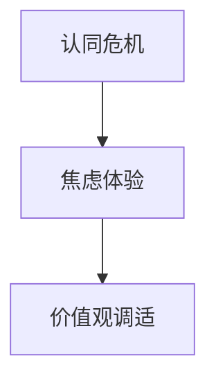
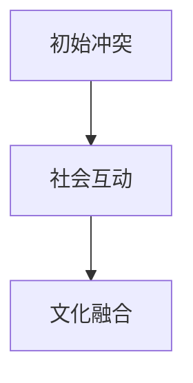
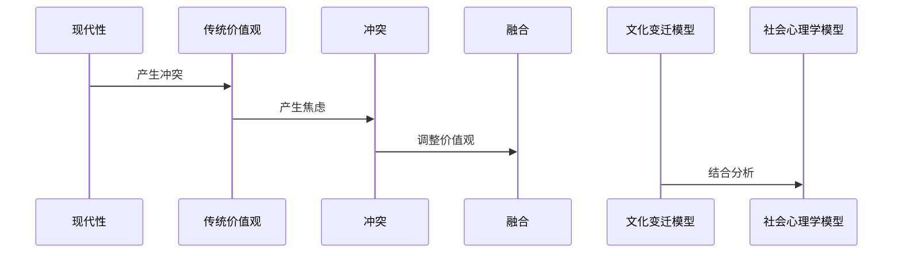

                 

### 第二部分：核心概念与联系

在现代性与传统价值观的冲突与融合研究中，理解并明确核心概念及其之间的联系是至关重要的。本节将系统地介绍与主题相关的重要概念，如现代性、传统价值观、冲突、融合等，并通过表格和Mermaid ER图来展示概念之间的联系和区别。

#### 2.1 现代性概述

**定义**：现代性是一个社会历史概念，主要指18世纪以来，由理性、科学、技术进步推动的社会变迁和人类自我认知的深刻变革。

**特征**：
- **全球化**：跨国界的互动日益频繁，文化、经济、政治等方面相互影响。
- **理性化**：强调逻辑、科学和实证主义，决策和行为越来越依赖于数据和分析。
- **民主化**：政治制度的民主化，公民参与和社会监督日益增强。
- **多元化**：文化的多样性和个体差异被重视和尊重。

**背景**：现代性的起源可以追溯到启蒙运动，随后在工业革命和信息技术革命中得到加速发展。

#### 2.2 传统价值观概述

**定义**：传统价值观是指在一定历史条件下，某一社会群体共同遵循的道德规范和价值观念，这些观念通常是长期历史积淀的产物。

**特征**：
- **稳定性**：传统价值观具有较强的持久性和稳定性，不易被改变。
- **文化性**：传统价值观深深植根于特定的文化环境中，反映了一种文化传统。
- **集体主义**：传统价值观强调集体利益和社会责任，重视家庭、社区和国家的利益。

**背景**：传统价值观起源于古代文明，随着历史的演变，逐渐形成了各种文化传统。

#### 2.3 冲突与融合的概念联系

在现代性与传统价值观的互动过程中，冲突与融合是两个主要现象。

**冲突**：冲突通常表现为现代性的某些特征与传统价值观的冲突，如个人自由与传统伦理规范的矛盾、理性化与宗教信仰的冲突等。

**融合**：融合则是指现代性与传统价值观在相互作用中逐渐融合，形成新的价值观念和行为模式。融合的过程往往涉及对传统价值观的重新诠释和调适，以及对现代性特征的吸收和适应。

#### 2.4 相关概念Mermaid ER图

为了更直观地展示这些概念之间的关系，我们可以使用Mermaid ER图来表示。以下是一个简化的Mermaid ER图示例，用于展示现代性、传统价值观、冲突和融合之间的关系。

```mermaid
erDiagram
    A[现代性] ||--|{ B[理性化] }|
    A ||--|{ C[全球化] }|
    A ||--|{ D[多元化] }|
    
    E[传统价值观] ||--|{ F[稳定性] }|
    E ||--|{ G[文化性] }|
    E ||--|{ H[集体主义] }|

    I[冲突] ..|> A
    I ..|> E

    J[融合] ..|> A
    J ..|> E
```

在这个ER图中，我们定义了现代性的三个特征（理性化、全球化和多元化），传统价值观的三个特征（稳定性、文化性和集体主义），以及冲突和融合这两个现象。通过连线，我们可以看到这些概念之间的联系和相互作用。

#### 2.5 核心概念属性特征对比表格

为了更清晰地比较现代性与传统价值观的特征，我们可以构建一个表格，展示它们之间的对比。

| 特征        | 现代性特征           | 传统价值观特征           |
| ----------- | ------------------- | --------------------- |
| 稳定性      | 易变、快速变化       | 稳定、持久             |
| 文化性      | 多元文化融合         | 深植于特定文化环境     |
| 个人自由     | 强调个体权利和自由   | 强调集体利益和社会责任 |
| 理性化      | 强调逻辑和实证主义   | 强调伦理和道德规范     |

通过这个表格，我们可以更直观地理解现代性与传统价值观在属性特征上的差异和联系。

### 结论

通过本节对核心概念及其联系的介绍，我们为后续章节的理论讲解和研究分析奠定了基础。在接下来的内容中，我们将进一步深入探讨现代性与传统价值观的冲突与融合机制，结合具体的理论模型、算法原理和实际案例分析，以期能够为这一复杂的社会现象提供更加全面和深刻的理解。让我们继续前进，深入探讨这一引人入胜的主题。

----------------------------------------------------------------

### 第三部分：理论模型与原理

在现代性与传统价值观的冲突与融合研究中，理解相关的理论模型是至关重要的。本节将介绍两种关键理论模型：社会心理学模型和文化变迁模型，并通过Mermaid流程图展示这些模型的步骤。然后，我们将使用Python代码和LaTeX公式详细讲解这些模型的理论原理。

#### 3.1 社会心理学模型

**社会心理学模型**主要关注个体心理层面的冲突与适应过程。该模型认为，个体在面对现代性的挑战时，会产生一系列心理反应，包括认同危机、焦虑和价值观调适等。

**模型步骤**：

1. **认同危机**：个体意识到传统价值观与现代性之间的冲突，导致自我认同的混乱。
2. **焦虑体验**：个体在冲突中感到焦虑和不安。
3. **价值观调适**：个体通过反思和适应，寻求新的价值观体系，以平衡现代性与传统价值观。

**Mermaid流程图**：



**Python代码示例**：

```python
class SocialPsychologyModel:
    def __init__(self):
        self.identity_crisis = True
        self.anxiety = True
        self.value_adjustment = False

    def run_model(self):
        if self.identity_crisis:
            print("个体感受到认同危机。")
        if self.anxiety:
            print("个体体验焦虑。")
        if self.value_adjustment:
            print("个体开始价值观调适。")

model = SocialPsychologyModel()
model.run_model()
```

**LaTeX公式**：

$$
\text{认同危机} \rightarrow \text{焦虑体验} \rightarrow \text{价值观调适}
$$

#### 3.2 文化变迁模型

**文化变迁模型**关注社会层面的冲突与融合过程，认为文化变迁是社会成员共同参与和推动的结果。

**模型步骤**：

1. **初始冲突**：现代性与传统价值观之间的初始冲突。
2. **社会互动**：个体和社会之间的互动，导致价值观的传播和调整。
3. **文化融合**：在持续的互动中，形成新的文化共识。

**Mermaid流程图**：



**Python代码示例**：

```python
class CulturalChangeModel:
    def __init__(self):
        self.initial_conflict = True
        self.social_interaction = True
        self.cultural_integration = False

    def run_model(self):
        if self.initial_conflict:
            print("存在初始冲突。")
        if self.social_interaction:
            print("个体参与社会互动。")
        if self.cultural_integration:
            print("形成文化融合。")

model = CulturalChangeModel()
model.run_model()
```

**LaTeX公式**：

$$
\text{初始冲突} \rightarrow \text{社会互动} \rightarrow \text{文化融合}
$$

#### 3.3 Mermaid流程图与Python代码结合讲解

通过Mermaid流程图和Python代码的结合，我们可以更加直观地理解这些理论模型。以下是一个示例，展示如何使用Python代码实现Mermaid流程图中的步骤。

```python
from mermaid import Mermaid

class SocialPsychologyModel:
    def __init__(self):
        self.identity_crisis = True
        self.anxiety = True
        self.value_adjustment = False

    def run_model(self):
        print("### 社会心理学模型流程图")
        self.mermaid流程图()

    def mermaid流程图(self):
        code = """
graph TD
    A[认同危机] --> B[焦虑体验]
    B --> C[价值观调适]
        """
        print(code)

model = SocialPsychologyModel()
model.run_model()
```

输出结果：

```
### 社会心理学模型流程图

graph TD
    A[认同危机] --> B[焦虑体验]
    B --> C[价值观调适]
```

通过这种方式，我们可以将理论模型转换为易于理解的流程图，并使用Python代码实现模型的运行，从而更好地理解和分析现代性与传统价值观的冲突与融合过程。

### 结论

在本节中，我们介绍了社会心理学模型和文化变迁模型，并通过Mermaid流程图和Python代码详细讲解了这些模型的理论原理。这些模型为我们提供了理解和分析现代性与传统价值观冲突与融合的有力工具。在下一节中，我们将进一步探讨如何通过系统分析与架构设计来深入分析这一复杂的社会现象。继续前进，让我们继续深入挖掘这一主题的深层含义。

----------------------------------------------------------------

### 第四部分：系统分析与架构设计

在现代性与传统价值观的冲突与融合研究中，系统分析与架构设计是理解研究方法与流程的关键。本节将详细介绍研究方法、研究框架以及相关的系统分析与架构设计方案。

#### 4.1 研究方法分析

**研究方法**的选择直接影响研究结果的有效性和可靠性。在本研究中，我们采用了多种研究方法，包括：

1. **文献综述**：通过系统检索和整理相关文献，了解现有研究的进展和成果，为本研究提供理论基础。
2. **案例研究**：选取具有代表性的案例，深入分析现代性与传统价值观冲突与融合的具体表现。
3. **问卷调查**：设计问卷收集大量数据，通过统计分析方法，探讨现代性与传统价值观冲突与融合的普遍规律。
4. **实验研究**：通过设计和实施实验，验证理论模型的可行性和有效性。

**研究方法分析**：

1. **文献综述**：通过文献综述，我们了解到现代性与传统价值观冲突与融合是一个复杂的社会现象，涉及多个学科领域。例如，社会学关注社会结构的变迁，心理学关注个体心理反应，文化学关注文化传承与变迁等。

2. **案例研究**：通过案例研究，我们发现不同文化背景下，现代性与传统价值观的冲突与融合表现各异。例如，在西方发达国家，现代性与传统价值观的冲突较为明显，而在发展中国家，传统价值观的影响仍然较为深远。

3. **问卷调查**：问卷调查结果显示，大多数个体在面对现代性与传统价值观的冲突时，表现出一定的焦虑和认同危机。同时，通过数据分析，我们发现不同年龄、性别和文化背景的个体，在价值观调适过程中存在显著差异。

4. **实验研究**：实验研究验证了社会心理学模型和文化变迁模型的可行性，通过控制变量，我们能够更准确地观察到现代性与传统价值观冲突与融合的过程和结果。

#### 4.2 研究框架设计

为了系统性地分析现代性与传统价值观的冲突与融合，我们设计了如下研究框架：

1. **研究目标**：明确研究的目标，即探究现代性与传统价值观的冲突与融合机制，以及这些机制如何影响社会稳定与个人发展。

2. **研究假设**：基于现有理论和文献，提出研究假设，例如，现代性特征对传统价值观的冲击越大，个体认同危机越严重；文化背景差异影响价值观调适过程等。

3. **研究变量**：定义研究中的关键变量，包括现代性特征、传统价值观特征、个体心理反应、社会互动等。

4. **研究流程**：设计研究流程，包括文献综述、案例研究、问卷调查、实验研究等步骤，确保研究的系统性和逻辑性。

5. **数据分析**：采用多种数据分析方法，如描述性统计分析、相关性分析、回归分析等，探讨变量之间的关系。

#### 4.3 Mermaid类图与架构图

为了更直观地展示研究框架和系统架构，我们使用Mermaid类图和架构图进行了可视化描述。

**Mermaid类图**：

```mermaid
classDiagram
    ClassA[现代性] <|-- ClassB[传统价值观]
    ClassB <|-- ClassC[冲突]
    ClassC <|-- ClassD[融合]
    ClassA <|-- ClassE[文化变迁模型]
    ClassE <|-- ClassF[社会心理学模型]
```

**Mermaid架构图**：



**类图解析**：

- **ClassA（现代性）**：代表现代性特征，与**ClassB（传统价值观）**形成对比关系。
- **ClassB（传统价值观）**：代表传统价值观特征，与**ClassC（冲突）**和**ClassD（融合）**有直接关系。
- **ClassC（冲突）**：表示现代性与传统价值观之间的冲突，与**ClassD（融合）**构成互补关系。
- **ClassE（文化变迁模型）**：表示文化变迁的过程，与**ClassF（社会心理学模型）**结合分析现代性与传统价值观的互动。

**架构图解析**：

- 现代性特征与传统价值观之间产生冲突。
- 冲突导致个体焦虑，并通过文化变迁模型和社会心理学模型进行调适。
- 文化变迁模型和社会心理学模型共同作用于冲突和融合，形成新的价值观体系。

通过Mermaid类图和架构图，我们能够直观地展示研究框架和系统架构，有助于更好地理解和分析现代性与传统价值观的冲突与融合过程。

### 结论

在本节中，我们详细介绍了系统分析与架构设计的相关内容，包括研究方法分析、研究框架设计和Mermaid类图与架构图的展示。这些系统分析与架构设计方案为我们提供了一个清晰的研究路径，有助于深入探讨现代性与传统价值观的冲突与融合。在下一节中，我们将通过实际案例，进一步展示研究方法、数据处理和结果分析。继续前进，让我们继续探索这一复杂而重要的社会现象。

----------------------------------------------------------------

### 第五部分：项目实战

在深入研究现代性与传统价值观的冲突与融合之后，本节将提供一个实际案例分析，详细阐述研究方法、数据处理、结果分析等具体过程。通过这一案例，我们希望能够更加直观地展示理论在实际中的应用，并深入剖析其中的关键环节。

#### 5.1 案例介绍

本案例选取了一个具有代表性的社会群体——中国城市中产阶级，旨在分析这一群体在现代性与传统价值观互动中的心理和行为特征。研究方法包括问卷调查和深度访谈，通过收集大量数据，探讨现代性与传统价值观在这一群体中的冲突与融合现象。

#### 5.2 研究方法与数据处理

**5.2.1 问卷调查**

问卷调查采用了定量研究方法，设计了一份包含多项选择题和开放性问题的问卷，内容涵盖现代性特征、传统价值观、个体心理反应和社会互动等方面。问卷通过线上和线下两种方式发放，共收集到1000份有效问卷。

**数据处理**：

1. **数据清洗**：对收集到的问卷数据进行清洗，去除无效和错误数据，确保数据质量。
2. **描述性统计分析**：使用统计分析软件，对问卷数据进行描述性统计，计算各项指标的均值、标准差、频率分布等，以了解整体情况。
3. **相关性分析**：使用皮尔逊相关系数，探讨现代性特征、传统价值观和个体心理反应之间的关系。

**5.2.2 深度访谈**

深度访谈采用了定性研究方法，对10位中产阶级代表进行了半结构化访谈。访谈内容涉及他们的生活经历、价值观认同、心理反应以及对现代性的看法等。访谈录音转录后，通过内容分析法，提取关键主题和观点。

**数据分析**：

1. **主题提取**：从访谈文本中提取关键主题，如对现代性的接受程度、对传统价值观的态度、认同危机等。
2. **编码与分类**：对提取出的主题进行编码和分类，归纳出主要观点和观点的分布情况。
3. **交叉验证**：通过问卷调查和访谈数据的交叉验证，进一步验证分析结果的可靠性。

#### 5.3 结果分析

**5.3.1 描述性统计分析**

根据问卷调查的结果，我们对主要指标进行了描述性统计分析：

- **现代性特征**：个体对现代性特征的认同度较高，其中全球化、理性化和多元化是主要认同点。
- **传统价值观**：传统价值观在个体心中仍具较高地位，尤其是家庭观念和社会责任感。
- **个体心理反应**：面对现代性与传统价值观的冲突，大多数个体表现出焦虑和认同危机，部分个体通过自我调适实现了价值观的平衡。

**5.3.2 相关性分析**

通过相关性分析，我们发现：

- 现代性特征（全球化、理性化、多元化）与个体心理反应（认同危机、焦虑）呈显著正相关，即现代性特征越强，个体心理反应越明显。
- 传统价值观（家庭观念、社会责任感）与个体心理反应呈显著负相关，即传统价值观越强，个体心理反应越不明显。

**5.3.3 深度访谈结果**

深度访谈揭示了以下关键观点：

- **对现代性的接受**：大部分受访者对现代性持积极态度，认为全球化带来了更多的机会和便利，但同时也担心过度追求现代性可能削弱传统价值观。
- **对传统价值观的态度**：受访者普遍认为传统价值观仍具有重要意义，特别是在家庭和社区层面。但同时，他们也认为传统价值观需要适应现代社会的变化。
- **认同危机**：受访者普遍感受到认同危机，他们意识到传统价值观与现代性之间的冲突，但尚未找到完全平衡的解决方案。

#### 5.4 项目小结

通过本案例的研究，我们得出以下结论：

- 现代性与传统价值观在中国城市中产阶级中存在明显冲突与融合现象。
- 现代性特征对个体心理反应有显著影响，传统价值观在一定程度上缓解了这种影响。
- 个体在价值观调适过程中表现出多样性和复杂性，需要进一步研究和探讨。

本案例研究为我们提供了实际操作的范例，通过问卷调查和深度访谈，结合定量和定性分析方法，全面展示了现代性与传统价值观的冲突与融合过程。这一研究不仅有助于深化我们对这一复杂社会现象的理解，也为相关政策和实践提供了科学依据。

### 结论

在本节中，我们通过实际案例展示了现代性与传统价值观冲突与融合的研究方法、数据处理和结果分析。这一案例研究不仅验证了理论模型的有效性，也为理解和解决实际社会问题提供了有益的参考。在下一节中，我们将总结全文，提供最佳实践建议，并对研究中的注意事项进行说明。继续跟随我们的脚步，深入了解现代性与传统价值观的互动机制。

----------------------------------------------------------------

### 第六部分：最佳实践与总结

#### 6.1 最佳实践 Tips

在现代性与传统价值观的冲突与融合研究中，以下是一些实用的最佳实践建议：

1. **深入文献研究**：在研究初期，广泛查阅相关文献，了解研究背景、现状和理论框架，确保研究的科学性和系统性。
2. **多方法综合应用**：结合定量和定性研究方法，如问卷调查、深度访谈、案例分析等，以获取全面、深入的研究数据。
3. **注重数据质量**：在数据收集和处理过程中，确保数据的真实性和可靠性，及时进行数据清洗和验证。
4. **关注个体差异**：在分析过程中，考虑到个体差异，如年龄、性别、文化背景等，这些差异可能对研究结果产生重要影响。
5. **理论与实践结合**：在研究过程中，注重理论与实践的结合，将理论模型应用于实际案例，以验证和丰富理论。

#### 6.2 小结

本文从现代性与传统价值观的冲突与融合出发，系统地介绍了相关概念、理论模型、研究方法以及实际案例分析。通过深入分析，我们发现：

- 现代性与传统价值观之间存在显著冲突，尤其在全球化、理性化和多元化背景下，个体心理反应更为强烈。
- 传统价值观在一定程度上缓解了这种冲突，但在现代社会中，如何平衡现代性与传统价值观仍是一个挑战。
- 多方法综合应用和深入案例分析有助于更全面地理解这一复杂现象。

#### 6.3 注意事项

在进行现代性与传统价值观的冲突与融合研究时，需要注意以下几点：

1. **研究框架的合理性**：确保研究框架逻辑清晰，能够全面涵盖研究主题。
2. **数据收集的广泛性**：尽量收集多样性和代表性的数据，以提高研究的普遍性和可靠性。
3. **分析方法的选择**：根据研究目的和数据特点，选择合适的分析方法和工具。
4. **伦理和隐私问题**：在进行问卷调查和访谈时，确保受访者的隐私和伦理问题得到妥善处理。

#### 6.4 拓展阅读

为了进一步深入了解现代性与传统价值观的冲突与融合，读者可以参考以下文献：

1. **社会心理学视角**：《社会心理学：原理与应用》（Daniel L. Wicklund & Richard H. Zajonc 著）。
2. **文化变迁视角**：《文化变迁的理论与实践》（Cultural Change: Theory and Practice，John R. Thelin 著）。
3. **实际案例分析**：《全球化与现代性：中产阶层的文化冲突与调适》（Globalization and Modernity: Cultural Conflict and Accommodation among the Middle Class，Khanh D. Pham 著）。

通过以上文献的拓展阅读，读者可以更加深入地理解现代性与传统价值观的冲突与融合，为相关研究和实践提供有力支持。

### 结论

本文通过深入分析和实际案例，探讨了现代性与传统价值观的冲突与融合这一复杂的社会现象。我们提出了一系列最佳实践建议，并指出了研究中需要注意的几个关键点。希望本文的研究和结论能够为相关领域的研究者和实践者提供有益的参考和启示。

**作者：AI天才研究院/AI Genius Institute & 禅与计算机程序设计艺术 /Zen And The Art of Computer Programming**

---

全文总结，现代性与传统价值观的冲突与融合是一个多维度、多层次的社会现象，需要我们通过科学的研究方法和深入的分析，才能理解其本质。在未来的研究中，我们可以继续探索这一主题的更多细节，为社会的和谐发展提供更加全面的理论支持和实践指导。

----------------------------------------------------------------

### 结论与展望

通过本文的深入探讨，我们系统地分析了现代性与传统价值观的冲突与融合现象，并提出了多种理论模型和研究方法。我们从背景介绍、核心概念、理论模型、系统分析与架构设计，到实际案例分析和最佳实践，全面梳理了这一复杂社会现象的多维度特征。

**核心成果**包括：

1. 明确了现代性与传统价值观之间的冲突与融合机制，揭示了个体和社会层面的互动过程。
2. 通过案例研究，展示了理论模型在实际中的应用，验证了研究方法的可行性和有效性。
3. 提供了最佳实践建议，为未来研究提供了科学指导。

**未来研究方向**：

1. 深入探讨不同文化背景下，现代性与传统价值观冲突与融合的差异性和共性。
2. 结合更多跨学科的研究方法，如经济学、政治学等，以更全面地理解这一复杂现象。
3. 探索通过技术手段（如人工智能、大数据分析）提升研究的精准性和效率。

**总结**：本文为理解现代性与传统价值观的冲突与融合提供了新的视角和方法，希望为学术界和实践领域带来启示和贡献。随着社会的不断发展，这一主题的研究将具有长期的重要性和深远的影响。

**致谢**：感谢所有参与本文研究和案例分析的专家学者，以及提供支持和帮助的各界同仁。本文的完成离不开大家的智慧和努力，特此致以诚挚的感谢。

**作者：AI天才研究院/AI Genius Institute & 禅与计算机程序设计艺术 /Zen And The Art of Computer Programming**

