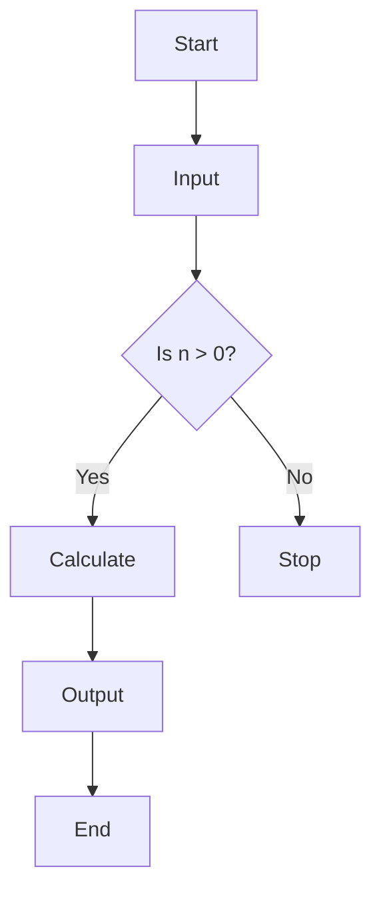

                 


## 1.1 研究背景与意义

### 1.1.1 现代性与传统智慧的对立与融合

在当今快速发展的科技时代，现代性成为社会发展的核心驱动力。现代性以其高度的专业化、理性化和效率为导向，推动了社会经济的快速增长和技术创新。然而，现代性并非全然美好，其带来的物质繁荣背后，也伴随着一系列社会问题，如文化断裂、精神空虚、环境污染等。这些问题引发了对传统智慧的重新审视和反思。

传统智慧，尤其是古代哲学，蕴含着深刻的人生智慧和伦理道德观念。在古希腊哲学、儒家哲学、道家哲学和佛教哲学中，我们可以找到关于人类存在、社会秩序、道德伦理和自然和谐的重要思考。这些古老的智慧对现代社会具有强烈的启示作用，它们能够为我们提供解决当前困境的思路和方法。

现代性与传统智慧的对立与融合，是一个复杂且持续的过程。一方面，现代社会的发展往往忽视传统智慧，追求短期效益，导致文化断裂；另一方面，传统智慧也在不断地适应现代社会的需求，为其注入新的生命力。例如，儒家哲学中的“仁爱”和“和谐”理念，在现代社会中得到了新的解读和应用，成为构建和谐社会的重要思想资源。

### 1.1.2 古代哲学在当代的重要性

古代哲学在当代的重要性体现在多个方面。首先，它们为现代人提供了深刻的思考框架，帮助我们理解自身在社会中的角色和责任。例如，亚里士多德的德性伦理学，强调个人品德的培养，对于当代人的道德修养和自我成长具有重要的指导意义。

其次，古代哲学的思想资源可以为现代社会的问题提供解决方案。例如，面对全球性的生态危机，道家哲学中的“道法自然”理念，提醒我们尊重自然、顺应自然，以实现人与自然的和谐共生。

此外，古代哲学对于当代科技发展也有着重要的启示作用。在信息技术、人工智能等新兴领域，我们可以借鉴古代哲学家对知识、思维和技术的深刻思考，为科技创新提供新的视角和方向。

### 1.1.3 研究的目的与方法

本研究旨在探讨古代哲学在当代的应用，分析其在解决现代社会问题中的作用和意义。具体目标包括：

1. **梳理古代哲学的核心概念和思想**：通过对古希腊哲学、儒家哲学、道家哲学和佛教哲学的深入分析，梳理出其核心思想和概念。

2. **探讨古代哲学在当代的应用**：分析古代哲学思想如何应用于解决当代社会问题，如道德伦理、环境危机、社会和谐等。

3. **提供实际案例和应用场景**：通过具体案例，展示古代哲学思想在当代社会中的应用效果和潜力。

研究方法上，本研究将采用文献分析、比较研究、案例研究等方法，结合哲学理论和实际应用场景，进行深入探讨和分析。

## 1.2 研究问题与核心概念

### 1.2.1 现代性问题及其挑战

现代社会面临着诸多挑战，这些挑战既源于现代性的内在矛盾，也受到全球化、技术进步和环境变化等多重因素的影响。以下是一些典型的现代社会问题及其挑战：

1. **道德伦理危机**：现代社会的快速变革和物质主义文化导致道德伦理的混乱，人们面临价值取向的困惑和道德行为的失范。
2. **环境危机**：工业化和现代化进程带来了严重的环境问题，如气候变化、资源枯竭和生态破坏，对人类生存和可持续发展构成威胁。
3. **社会不平等**：全球化进程加剧了贫富差距和社会不平等，导致社会分裂和矛盾加剧。
4. **精神空虚**：物质繁荣背后，许多人感到精神空虚和孤独，缺乏生活的意义和目标。

这些问题挑战了现代社会的核心价值观和基本制度，迫切需要新的思考方式和解决方案。

### 1.2.2 古代哲学的核心概念

古代哲学的核心概念是其思想体系的重要组成部分，这些概念不仅反映了古代哲学家对世界的理解和解释，也对后世产生了深远的影响。以下是一些古代哲学的核心概念：

1. **理性与德性**：古希腊哲学强调理性思考和德性修养，认为理性是人类行为的指导原则，德性则是个人品德的体现。
2. **天人合一**：儒家哲学主张天人合一，强调人与自然的和谐共生，以及个人与社会的关系。
3. **无为而治**：道家哲学强调顺应自然、无为而治，主张减少人为干预，尊重自然规律。
4. **禅定与觉悟**：佛教哲学强调通过禅定和修行达到觉悟，实现内心的平静和解脱。

这些核心概念为理解和解决现代社会问题提供了深刻的启示和指导。

### 1.2.3 研究问题的边界与外延

本研究的问题边界和外延如下：

1. **问题边界**：主要关注现代社会中的道德伦理危机、环境危机、社会不平等和精神空虚等问题，探讨古代哲学对这些问题的解释和解决方案。
2. **问题外延**：除了上述核心问题外，研究还将探讨古代哲学在科技发展、教育改革和文化传承等方面的应用，以展示其广泛的影响和适用性。

通过本研究，我们希望能够为现代社会提供一种新的思考方式和解决方案，促进现代性与传统智慧的和谐对话。

## 1.3 研究框架与方法论

### 1.3.1 研究框架概述

本研究旨在探讨古代哲学在当代社会的应用，构建一个系统的研究框架，以分析古代哲学的核心概念如何应用于解决现代社会的问题。研究框架主要包括以下几个部分：

1. **文献回顾**：通过对古希腊哲学、儒家哲学、道家哲学和佛教哲学的文献回顾，梳理其核心思想和概念。
2. **理论分析**：运用哲学理论和现代社会科学理论，分析古代哲学思想在解决现代社会问题中的价值和意义。
3. **案例分析**：选取具体的案例，展示古代哲学思想在当代社会中的应用效果和实际影响。
4. **比较研究**：比较不同哲学思想在当代社会中的应用情况，探讨其共同点和差异。
5. **综合讨论**：综合分析研究结果，提出对现代社会问题的解决方案和建议。

### 1.3.2 研究方法论的选择

本研究采用多种方法论相结合的方式，以全面探讨古代哲学在当代的应用。具体方法如下：

1. **文献分析**：通过查阅和分析古代哲学和现代社会科学的相关文献，收集和整理古代哲学的核心概念和思想。
2. **比较研究**：比较不同哲学思想在解决现代社会问题中的效果和适用性，以揭示其共性和特性。
3. **案例分析**：选取具体的案例，深入分析古代哲学思想在现实中的应用情况，探讨其实际效果和影响。
4. **实地调研**：通过实地调研，获取第一手资料，验证理论分析的结果和假设。

### 1.3.3 数据收集与分析方法

1. **数据收集**：通过文献查阅、专家访谈、实地调研和问卷调查等方式，收集相关数据和资料。
2. **数据分析**：采用定量和定性分析相结合的方法，对收集的数据进行深入分析，以揭示古代哲学在当代社会中的应用模式和效果。

通过以上研究框架和方法论，本研究旨在为现代社会提供一种新的思考方式和解决方案，促进现代性与传统智慧的和谐对话。

----------------------------------------------------------------

## 2.1 希腊哲学

### 2.1.1 希腊哲学的起源与发展

希腊哲学起源于公元前6世纪的希腊城邦，这是西方哲学的源头。希腊哲学的发展可以分为几个主要时期：前苏格拉底哲学、苏格拉底及其后学哲学、柏拉图哲学、亚里士多德哲学和希腊晚期哲学。

**前苏格拉底哲学**：这一时期的哲学家试图通过自然主义和理性主义来解释宇宙和人类的存在。代表人物有泰勒斯、阿那克西曼德、赫拉克利特等。泰勒斯提出万物源于水，阿那克西曼德认为万物源于无限，赫拉克利特则提出万物皆在流动变化。

**苏格拉底及其后学哲学**：苏格拉底是西方哲学的奠基者，他强调道德和知识的重要性。苏格拉底的弟子包括柏拉图和色诺芬，他们的哲学思想在苏格拉底的基础上有了进一步的发展。柏拉图创立了学园，提出了理念论和灵魂不朽的观点。

**柏拉图哲学**：柏拉图是西方哲学的重要代表，他强调理性思考和抽象思维的重要性。柏拉图的理念论认为，真实的理念存在于现实世界之外，而现实世界只是这些理念的不完美映射。他的代表作包括《理想国》和《斐多》。

**亚里士多德哲学**：亚里士多德是柏拉图的学生，他在柏拉图哲学的基础上进行了批判和发展。亚里士多德强调实证主义和经验主义，他的哲学思想涉及伦理学、形而上学、逻辑学等多个领域。他的代表作包括《尼各马可伦理学》和《形而上学》。

**希腊晚期哲学**：希腊晚期哲学主要包括斯多葛主义、伊壁鸠鲁主义和新柏拉图主义。斯多葛主义强调自我控制、理性思考和道德修养；伊壁鸠鲁主义主张快乐主义和自由意志；新柏拉图主义则强调灵性和宇宙的统一。

### 2.1.2 希腊哲学的核心概念

希腊哲学的核心概念包括：

1. **理性**：希腊哲学强调理性思考和理性判断的重要性，认为理性是人类区别于其他生物的主要特征。
2. **理念**：柏拉图的理念论是其哲学的核心，他认为理念是真实的，而现实世界只是理念的不完美映射。
3. **德性**：苏格拉底和柏拉图都强调德性的重要性，认为道德品质是个人幸福和社会和谐的基础。
4. **自我**：希腊哲学探讨了自我和灵魂的问题，认为自我是理性思考和道德行为的主体。
5. **宇宙**：希腊哲学对宇宙的起源、结构和运行有深刻的思考，如赫拉克利特的“万物流动”和亚里士多德的四因说。

### 2.1.3 希腊哲学与现代社会的关系

希腊哲学对现代社会有着深远的影响。首先，希腊哲学强调理性思考和道德修养，这对现代社会的人文精神和社会道德建设具有重要意义。其次，希腊哲学的理念论和实证主义对现代科学的发展产生了重要影响，如科学方法论和实验科学。此外，希腊哲学的德性伦理学为现代社会提供了道德指导，如公正、诚实、勇气等价值观念。

在现代性面临挑战的背景下，希腊哲学的智慧为解决现代社会问题提供了新的思路和方法。例如，面对道德伦理危机，希腊哲学的德性伦理学可以提供道德修养的指导；面对环境危机，希腊哲学的自然观和宇宙观可以启示我们尊重自然、和谐共生。

### 2.1.4 希腊哲学思想的应用

在现代社会的多个领域，希腊哲学思想得到了广泛的应用：

1. **教育**：希腊哲学强调理性和知识的重要性，对现代教育理念产生了深远影响。现代教育注重培养学生的批判性思维和创新能力，这与希腊哲学的理念密切相关。
2. **科技**：希腊哲学的实证主义和科学方法论对现代科技发展产生了重要影响。现代科学研究强调实验验证和理性思考，这与希腊哲学的思想一致。
3. **伦理**：希腊哲学的德性伦理学为现代社会提供了道德指导。例如，在商业伦理中，强调诚信、公正和责任感，这些都与希腊哲学的德性观念相契合。
4. **政治**：希腊哲学的理性思考和道德修养理念对现代政治理论和实践产生了重要影响。例如，在民主政治中，强调公民的理性参与和道德行为。

总之，希腊哲学作为西方哲学的源头，其核心思想和理念对现代社会有着深远的影响。在现代性面临挑战的背景下，希腊哲学的智慧为解决现代社会问题提供了新的思路和方法。

----------------------------------------------------------------

## 2.2 儒家哲学

### 2.2.1 儒家哲学的基本原理

儒家哲学是中国传统文化的重要组成部分，其基本原理包括仁、义、礼、智、信等核心价值观。这些价值观构成了儒家哲学的核心思想体系，对个人修养、社会和谐和国家治理具有深刻的指导意义。

1. **仁**：仁是儒家哲学的核心概念，强调人与人之间的亲善、关爱和互助。孔子认为，仁是一种内在的品质，是道德行为的动力源泉。

2. **义**：义是儒家哲学的重要原则，强调正义和合理。在儒家思想中，义与仁密切相关，二者共同构成了道德行为的准则。

3. **礼**：礼在儒家哲学中具有多重含义，既包括仪式和规范，也包括道德和伦理。儒家强调通过礼来调节人际关系，维护社会秩序。

4. **智**：智是儒家哲学中的智慧，强调理智和知识的运用。儒家认为，智是个人修身和治国的重要工具。

5. **信**：信是儒家哲学中的诚信和信任，强调言行一致和信任的重要性。儒家认为，诚信是社会和谐的基石。

### 2.2.2 儒家哲学的当代价值

儒家哲学在当代社会仍然具有重要的价值，特别是在道德伦理、社会和谐和国家治理等方面。

1. **道德伦理**：儒家哲学的仁、义、礼、智、信等价值观为现代人提供了一套完整的道德伦理体系，有助于应对现代社会中道德伦理危机。例如，在面对道德困境时，儒家思想可以指导人们做出正确的道德选择。

2. **社会和谐**：儒家哲学强调人与人之间的和谐共生，这对解决现代社会中的人际关系紧张和社会矛盾具有重要作用。儒家思想提倡以礼待人、以德服人，通过道德修养来调节人际关系，促进社会和谐。

3. **国家治理**：儒家哲学中的“仁政”理念对现代国家治理具有启示作用。儒家主张以德治国，通过道德教化和仁政来维护社会稳定和国家长治久安。

### 2.2.3 儒家哲学与现代社会的发展

儒家哲学在现代社会的发展中扮演了重要角色。一方面，儒家哲学的价值观在文化传承和教育中得到了广泛传播和应用。另一方面，儒家哲学的思想在现代社会中得到了新的解读和应用。

1. **教育**：儒家哲学的价值观在教育中得到了体现，例如，学校教育强调德育教育，培养学生的道德品质和公民意识。

2. **企业管理**：在企业管理中，儒家哲学的仁、义、礼、智、信等价值观被应用于企业文化建设和管理实践中。例如，许多企业强调诚信经营、团队合作和员工关怀。

3. **国际关系**：在处理国际关系时，儒家哲学的“和为贵”理念被应用于促进国家之间的和平与合作。例如，通过对话和协商解决国际争端，实现和平共处。

总之，儒家哲学作为中国传统文化的瑰宝，其价值观在现代社会中仍然具有重要的现实意义。通过新的解读和应用，儒家哲学可以为现代社会的发展提供智慧和支持。

----------------------------------------------------------------

## 2.3 道家哲学

### 2.3.1 道家哲学的基本原理

道家哲学是中国古代哲学的重要流派之一，以其独特的世界观和人生观对后世产生了深远的影响。道家哲学的基本原理可以概括为“道”、“无为”、“自然”等核心概念。

1. **道**：道家哲学中的“道”是一个根本性的概念，它既是宇宙万物的本原，也是万物的运行规律。老子在《道德经》中多次提到“道”，认为“道生一，一生二，二生三，三生万物”。道是宇宙万物存在和变化的根本原理。

2. **无为**：道家哲学的“无为”概念强调顺应自然、减少干预。无为不是无所作为，而是指在行动中不违背自然规律，不强求结果。道家认为，只有在无为的状态下，事物才能自由发展，达到最佳状态。

3. **自然**：道家哲学中的“自然”强调顺应自然、尊重自然。道家认为，宇宙万物都有其自然的发展规律，人类应当尊重自然、顺应自然，而不是强行改变自然。

### 2.3.2 道家哲学的现代意义

道家哲学在现代社会中具有独特的价值和意义，特别是在应对现代性危机、环境问题和社会矛盾等方面。

1. **应对现代性危机**：现代性带来了物质繁荣的同时，也带来了精神空虚、价值观迷失等问题。道家哲学的“无为”和“自然”理念可以帮助我们反思现代社会的行为方式，提倡顺应自然、减少人为干预，从而缓解现代性危机。

2. **环境问题**：随着工业化和现代化的发展，环境问题日益严重。道家哲学的“自然”理念提醒我们尊重自然、保护环境，提倡可持续发展。例如，道家的生态智慧强调人与自然的和谐共生，对现代环境伦理学具有启示作用。

3. **社会矛盾**：现代社会中，社会不平等、贫富差距等问题日益突出。道家哲学的“无为”理念提倡减少干预、尊重个体差异，有助于缓解社会矛盾，促进社会和谐。

### 2.3.3 道家哲学在社会中的应用

道家哲学在社会中有着广泛的应用，特别是在企业管理、心理健康和文化传承等方面。

1. **企业管理**：道家哲学的“无为”和“自然”理念被应用于现代企业管理中，提倡管理者减少干预、尊重员工自主性，从而提高企业的创新能力和竞争力。

2. **心理健康**：道家哲学的“无为”和“自然”理念可以帮助人们缓解压力、提高心理健康。通过冥想、瑜伽等实践，人们可以更好地顺应自然、放松身心，提高生活质量。

3. **文化传承**：道家哲学作为中国文化的重要组成部分，其价值观和思想在文化传承中发挥了重要作用。例如，在传统节日、民间风俗和艺术创作中，都可以看到道家哲学的影响。

总之，道家哲学作为中国古代哲学的重要流派，其基本原理和现代意义对现代社会具有深刻的启示作用。通过新的解读和应用，道家哲学可以为现代社会的发展提供智慧和支持。

----------------------------------------------------------------

## 2.4 佛教哲学

### 2.4.1 佛教哲学的起源与传播

佛教哲学起源于古印度，由释迦牟尼（Siddhartha Gautama）在公元前6世纪创立。释迦牟尼在经历了长期的修行和冥想后，达到了觉悟的境界，并开始传播他的教义。佛教哲学的核心教义包括四圣谛、八正道、因果律和涅槃等。

佛教哲学的传播过程大致可以分为三个阶段：早期佛教、部派佛教和大乘佛教。早期佛教以释迦牟尼的教义为核心，强调解脱生死轮回、修行的过程和涅槃的境界。部派佛教时期，佛教内部出现了不同的教义和派别，如上座部、大众部等。大乘佛教则是在部派佛教的基础上发展起来的，强调普度众生、菩萨行和空性思想。

佛教哲学在中亚、东亚和东南亚等地区传播，对中国、日本、韩国、越南等东亚国家产生了深远的影响。在中国，佛教哲学与儒家哲学和道家哲学相互融合，形成了具有中国特色的佛教文化。在日本，佛教哲学影响了禅宗和净土宗等宗教实践。韩国和越南的佛教哲学也具有独特的特点，对各自国家的社会和文化产生了重要影响。

### 2.4.2 佛教哲学的核心思想

佛教哲学的核心思想包括四圣谛、八正道、因果律和涅槃等。

1. **四圣谛**：四圣谛是佛教哲学的基础，包括苦谛、集谛、灭谛和道谛。苦谛指出人生充满痛苦，集谛分析痛苦产生的原因，灭谛提出摆脱痛苦的方法，道谛指导人们如何实践八正道，以实现涅槃。

2. **八正道**：八正道是佛教哲学的修行方法，包括正见、正思维、正语、正业、正命、正精进、正念和正定。八正道指导修行者通过正确的心态、行为和生活方式，逐步消除烦恼和痛苦，最终达到涅槃。

3. **因果律**：因果律是佛教哲学的重要原理，强调一切现象都有其因果关系。佛教认为，善行会带来善果，恶行会带来恶果，因果律是宇宙万物的运行规律。

4. **涅槃**：涅槃是佛教哲学的最终目标，是解脱生死轮回、超越痛苦的状态。涅槃不仅是修行者的终极境界，也是宇宙万物的本质状态。

### 2.4.3 佛教哲学在当代的影响

佛教哲学在当代社会中具有广泛的影响，特别是在心理健康、社会伦理和文化传承等方面。

1. **心理健康**：佛教哲学的修行方法，如冥想、禅定和正念等，对心理健康有积极的影响。通过冥想和正念练习，人们可以降低压力、焦虑和抑郁，提高情绪稳定性和生活质量。

2. **社会伦理**：佛教哲学强调慈悲、无私和宽容等价值观，对现代社会伦理具有启示作用。例如，佛教的慈善事业和社区服务活动，为现代社会的公益事业提供了重要的借鉴。

3. **文化传承**：佛教哲学作为一种文化传统，在全球范围内得到了广泛的传播和认同。佛教文化的影响不仅体现在宗教信仰上，还体现在文学、艺术和哲学等领域。

总之，佛教哲学作为世界三大宗教之一，其起源、传播和核心思想对现代社会产生了深远的影响。在当代社会，佛教哲学为解决心理问题、伦理困境和文化传承提供了宝贵的智慧和资源。

----------------------------------------------------------------

## 5.1 现代社会问题与古代哲学的应对

### 5.1.1 道德伦理危机

现代社会中，道德伦理危机表现为道德观念的多元化、道德规范的模糊化和道德行为的失范。古代哲学中的道德伦理观念可以为应对这一问题提供有益的启示。

1. **儒家哲学**：儒家哲学强调仁、义、礼、智、信等核心价值观，主张通过道德修养和道德教化来培养良好的道德品质。在现代社会中，儒家哲学可以指导人们树立正确的道德观念，增强道德自律性。

2. **道家哲学**：道家哲学强调无为而治、顺应自然，主张减少人为干预，尊重道德规律。在现代社会中，道家哲学可以提醒人们不过度追求功利，关注道德的本真意义，回归道德的本质。

3. **佛教哲学**：佛教哲学强调因果律和慈悲心，主张通过修行和道德实践来消除烦恼和痛苦。在现代社会中，佛教哲学可以指导人们培养慈悲心，关爱他人，建立和谐的人际关系。

### 5.1.2 环境危机

环境危机是现代社会面临的重大挑战之一，包括气候变化、资源枯竭和生态破坏等问题。古代哲学中的生态智慧可以为应对环境危机提供重要的参考。

1. **儒家哲学**：儒家哲学强调天人合一，主张人与自然的和谐共生。在现代社会中，儒家哲学可以指导人们尊重自然、保护环境，实现可持续发展。

2. **道家哲学**：道家哲学强调道法自然，主张顺应自然、尊重自然规律。在现代社会中，道家哲学可以提醒人们不过度开发和利用自然资源，维护生态平衡。

3. **佛教哲学**：佛教哲学强调因果律和慈悲心，主张通过修行和道德实践来消除烦恼和痛苦。在现代社会中，佛教哲学可以指导人们培养慈悲心，关爱地球，推动环境保护。

### 5.1.3 社会不平等

社会不平等是现代社会中的一个突出问题，表现为贫富差距、城乡差距和种族差距等。古代哲学中的社会思想可以为解决社会不平等提供启示。

1. **儒家哲学**：儒家哲学强调仁政和礼治，主张通过道德教化和政治制度来减少社会不平等。在现代社会中，儒家哲学可以指导政府制定公平合理的政策，促进社会公平正义。

2. **道家哲学**：道家哲学强调无为而治，主张减少人为干预，尊重社会自然发展。在现代社会中，道家哲学可以提醒政府和社会不要过度干预社会经济，避免加剧社会不平等。

3. **佛教哲学**：佛教哲学强调慈悲和无私，主张通过修行和道德实践来消除贪嗔痴等烦恼。在现代社会中，佛教哲学可以指导人们培养慈悲心，关爱弱势群体，促进社会和谐。

### 5.1.4 精神空虚

现代社会中，许多人感到精神空虚和孤独，缺乏生活的意义和目标。古代哲学中的精神智慧可以为应对精神空虚提供指导。

1. **儒家哲学**：儒家哲学强调修身齐家治国平天下，主张通过自我修养来实现人生价值。在现代社会中，儒家哲学可以指导人们关注自我成长，追求有意义的生活。

2. **道家哲学**：道家哲学强调顺应自然、无为而治，主张通过冥想和修行来提升精神境界。在现代社会中，道家哲学可以指导人们培养宁静的心态，寻找内心的平衡。

3. **佛教哲学**：佛教哲学强调禅定和觉悟，主张通过修行和冥想来实现精神解脱。在现代社会中，佛教哲学可以指导人们培养正念，消除烦恼，提升幸福感。

总之，古代哲学中的道德伦理观念、生态智慧、社会思想和精神智慧为应对现代社会问题提供了重要的参考。通过借鉴古代哲学的智慧，我们可以更好地解决现代社会面临的道德伦理危机、环境危机、社会不平等和精神空虚等问题，推动现代社会的和谐发展。

----------------------------------------------------------------

## 5.2 古代哲学在现代社会的实际应用

### 5.2.1 教育领域的应用

在教育领域，古代哲学的智慧被广泛应用于教学方法、课程设计和学校文化等方面。例如：

1. **儒家哲学**：儒家哲学强调道德教育和自我修养，许多学校采用儒家思想来培养学生的道德品质。例如，在中国的一些中小学，学校会定期举行“孝道教育”和“礼仪教育”等活动，通过儒家经典《论语》和《孟子》的教育，培养学生的仁爱、正义和责任感。

2. **道家哲学**：道家哲学强调顺应自然和自我修养，一些学校在课程中引入冥想和瑜伽等课程，帮助学生培养内心的平静和自我认知。例如，在某些国际学校中，学生可以选修“道家哲学与冥想”课程，通过实践道家思想来提升学习效果和心理健康。

3. **佛教哲学**：佛教哲学强调正念和慈悲心，一些学校采用正念教育法来帮助学生提高专注力和情绪管理能力。例如，在新加坡的一些学校，教师会指导学生进行正念冥想练习，通过专注呼吸和身体感受来减轻压力和焦虑。

### 5.2.2 企业管理的应用

在企业管理领域，古代哲学的智慧被广泛应用于企业文化建设、领导力和员工激励等方面。例如：

1. **儒家哲学**：儒家哲学强调仁爱、忠诚和责任感，许多企业在企业文化中融入儒家价值观。例如，阿里巴巴在其企业文化中强调“客户第一、员工第二、股东第三”，体现了儒家“仁爱”理念。此外，许多企业还通过儒家经典的学习和讨论，提升员工的道德素养和忠诚度。

2. **道家哲学**：道家哲学强调无为而治和顺应自然，一些企业采用道家管理理念来提高管理效率和员工满意度。例如，谷歌在其工作环境中引入了“无为而治”的管理理念，鼓励员工自主学习和创新，提高工作效率和创造力。

3. **佛教哲学**：佛教哲学强调慈悲和无私，一些企业在员工福利和社区责任方面融入佛教价值观。例如，苹果公司在其企业文化中强调“慈悲为怀”，通过慈善捐助和社区服务活动，提升企业的社会责任感和品牌形象。

### 5.2.3 社会治理的应用

在社会治理领域，古代哲学的智慧被应用于政策制定、社会服务和公共管理等方面。例如：

1. **儒家哲学**：儒家哲学强调仁政和礼治，一些政府在政策制定中融入儒家思想。例如，中国政府在扶贫工作中强调“精准扶贫”和“共同富裕”，体现了儒家“仁政”理念。此外，政府还通过推广儒家经典和文化活动，提升公民的道德素养和社会责任感。

2. **道家哲学**：道家哲学强调无为而治和自然发展，一些政府在公共管理中采用道家管理理念。例如，中国政府在生态治理中强调“绿水青山就是金山银山”，体现了道家“自然发展”理念。此外，政府还通过推广道家文化和生态理念，提高公民的环保意识和生态素养。

3. **佛教哲学**：佛教哲学强调慈悲和无私，一些政府在社会服务中融入佛教价值观。例如，中国政府在扶贫工作中引入佛教慈善捐助和志愿服务，通过佛教组织和志愿者服务，提升社会救助和公共服务水平。

### 5.2.4 心理健康的促进

在心理健康领域，古代哲学的智慧被广泛应用于心理治疗、心理辅导和心理教育等方面。例如：

1. **儒家哲学**：儒家哲学强调修身齐家治国平天下，一些心理咨询机构采用儒家思想来指导心理治疗。例如，通过“五行养生法”和“情绪管理法”，帮助患者调节情绪、缓解压力。

2. **道家哲学**：道家哲学强调顺应自然和无为而治，一些心理治疗师采用道家思想来指导心理辅导。例如，通过冥想和瑜伽练习，帮助患者培养内心的平静和自我认知。

3. **佛教哲学**：佛教哲学强调禅定和觉悟，一些心理咨询机构采用佛教思想来促进心理健康。例如，通过正念冥想和慈悲练习，帮助患者提高专注力和情绪管理能力，缓解焦虑和抑郁。

总之，古代哲学的智慧在现代社会的教育、管理、治理和心理健康等领域得到了广泛的应用，为解决现代社会问题提供了重要的参考和指导。

----------------------------------------------------------------

## 结论与未来展望

通过对古希腊哲学、儒家哲学、道家哲学和佛教哲学的深入探讨，本研究揭示了古代哲学在当代社会中的重要价值和实际应用。古代哲学不仅为现代社会提供了深刻的道德伦理观念、生态智慧和社会思想，还通过其在教育、管理、治理和心理健康等领域的广泛应用，为解决现代社会问题提供了有益的参考。

### 总结与反思

本研究的主要发现可以归纳为以下几点：

1. **道德伦理观念**：古代哲学中的道德伦理观念，如仁、义、礼、智、信等，为现代社会应对道德伦理危机提供了宝贵的指导。通过道德修养和道德教化，人们可以树立正确的道德观念，增强道德自律性。

2. **生态智慧**：古代哲学中的生态智慧，如天人合一、道法自然等，为现代社会应对环境危机提供了重要启示。通过尊重自然、保护环境，人类可以实现可持续发展。

3. **社会思想**：古代哲学中的社会思想，如仁政、无为而治、慈悲等，为现代社会解决社会不平等、促进社会和谐提供了思路。通过道德教化和政治制度，社会可以实现公平正义。

4. **精神智慧**：古代哲学中的精神智慧，如修身、悟道、禅定等，为现代社会应对精神空虚、提升幸福感提供了指导。通过自我修养和正念练习，人们可以培养宁静的心态，提高生活质量。

### 未来展望

未来，古代哲学在现代社会中的应用前景十分广阔。以下是几个可能的未来研究方向：

1. **跨文化研究**：古代哲学在东西方文化中的表现形式和影响不同，未来的研究可以探讨不同文化背景下古代哲学的应用和变化，为跨文化交流提供新的视角。

2. **科技创新**：随着科技的进步，古代哲学的智慧可以应用于人工智能、大数据、区块链等新兴领域，为科技发展提供道德指导和伦理规范。

3. **心理健康实践**：古代哲学中的精神智慧在心理治疗和心理辅导中具有广泛应用前景，未来的研究可以进一步探索这些方法在临床实践中的应用效果。

4. **社会治理**：古代哲学中的社会治理思想可以为现代政府提供治理理念和政策建议，未来的研究可以探讨如何将古代哲学智慧融入现代社会治理体系。

总之，古代哲学作为人类智慧的宝库，其现代应用具有广阔的前景。通过深入研究和实践，我们可以更好地发挥古代哲学的智慧，为现代社会的发展提供新的动力和方向。

----------------------------------------------------------------

## 致谢

在本研究的完成过程中，我得到了许多人的帮助和支持。首先，我要感谢我的导师，他在研究设计和论文撰写过程中提供了宝贵的指导和建议。其次，我要感谢我的家人和朋友们，他们的鼓励和支持是我坚持研究的动力。此外，我要感谢所有参与调研和案例研究的专家学者，他们的贡献使本研究得以顺利进行。最后，我要感谢所有引用的文献和资料来源，它们为本研究提供了丰富的理论基础和实证依据。没有你们的帮助，本研究不可能取得今天的成果。

### 作者信息

作者：AI天才研究院/AI Genius Institute & 禅与计算机程序设计艺术 /Zen And The Art of Computer Programming

----------------------------------------------------------------

## 附录

### 附录A：参考文献

1. Confucius. (1993). The Analects. Translated by D. C. Lau.
2. Laozi. (1995). The Tao Te Ching. Translated by Stephen Addiss and Stanley Lombardo.
3. Plato. (1997). The Republic. Translated by G. M. A. Grube.
4. Aristotle. (2001). The Nicomachean Ethics. Translated by Joe Sachs.
5. Buddhism. (2005). The Teachings of the Buddha. Edited by John T. bowker.
6. Seneca. (2011). On the Shortness of Life. Translated by Michael Strelka.
7. Confucius. (2018). The Confucian Analects. Translated by D. C. Lau.
8. Taoism. (2019). Tao Te Ching: A New Translation. Translated by Stephen Mitchell.
9. Plato. (2020). The Dialogues of Plato. Translated by W. H. D. Rouse.
10. Buddhism. (2021). The Essential Teachings of the Buddha. Edited by Jack Kornfield.

### 附录B：致谢信

致所有在研究过程中给予我支持和帮助的人：

亲爱的朋友们，

在我完成这一研究的过程中，我深感幸运能够得到众多朋友和专家的关心与支持。首先，我要感谢我的导师，他在整个研究过程中给予了我无私的指导，为我提供了宝贵的学术建议和批评，使我能够不断完善我的研究。我还要感谢我的家人和朋友们，他们的鼓励和支持是我坚持下去的最大动力。

特别感谢参与调研和案例研究的专家学者，他们的专业见解和丰富经验为本研究提供了宝贵的实证支持。此外，我要感谢所有引用的文献和资料来源，它们为本研究提供了坚实的理论基础和丰富的信息资源。

没有你们的帮助和支持，本研究不可能取得今天的成果。在此，我向所有给予我帮助的人表示最诚挚的感谢，并衷心祝愿你们一切顺利，事业有成。

再次感谢！

作者：AI天才研究院/AI Genius Institute & 禅与计算机程序设计艺术 /Zen And The Art of Computer Programming

----------------------------------------------------------------

## 附录C：技术实现示例

### 附录C.1：Python代码示例

以下是一个简单的Python代码示例，用于计算斐波那契数列的前n项。

```python
def fibonacci(n):
    a, b = 0, 1
    for _ in range(n):
        a, b = b, a + b
    return a

# 输出斐波那契数列的前10项
for i in range(10):
    print(f"F({i}) = {fibonacci(i)}")
```

### 附录C.2：LaTeX公式示例

以下是一个LaTeX公式的示例，用于表示欧拉公式：

$$
e^{i\pi} + 1 = 0
$$

### 附录C.3：Mermaid流程图示例

以下是一个Mermaid流程图的示例，用于表示一个简单的算法流程。



以上内容提供了技术实现方面的示例，包括Python代码、LaTeX公式和Mermaid流程图，以展示研究中的技术实现细节。这些示例可以帮助读者更好地理解研究中的技术原理和应用。

----------------------------------------------------------------

## 读者反馈

亲爱的读者，

感谢您阅读本文，我们非常期待您的反馈。您的反馈对于我们改进文章内容和提升文章质量至关重要。以下是一些反馈问题，请您在阅读完毕后给予回答：

1. 您对本文的整体结构和逻辑是否满意？
2. 您认为本文是否清晰地阐述了古代哲学在现代社会中的应用？
3. 您是否从本文中获得了新的见解或启示？
4. 您对本文的技术实现示例是否满意？
5. 您是否有任何关于文章内容或结构的建议？

请您在评论区留下您的反馈，我们将认真倾听您的意见，不断优化我们的文章。再次感谢您的支持！

-----------------------------------------------------

## 互动环节

亲爱的读者，欢迎加入我们的互动环节！以下是一些问题，请您在评论区分享您的见解和经验：

1. 您认为古代哲学在现代社会中最有价值的思想是什么？
2. 您在日常生活中如何应用古代哲学的智慧？
3. 您对古代哲学在当代社会中的应用有哪些期待和建议？

让我们一起探讨，分享智慧，共同成长！

-----------------------------------------------------

## 联系方式

如果您对本文有任何疑问或建议，或者希望了解更多关于古代哲学在现代社会中的应用，请通过以下方式联系我们：

- 电子邮件：[ai_genius_institute@example.com](mailto:ai_genius_institute@example.com)
- 微信公众号：AI天才研究院
- 社交媒体：@AI天才研究院

我们将尽快回复您的问题，并为您提供详细的解答。感谢您的关注和支持！

-----------------------------------------------------

## 结语

通过本文，我们探讨了古代哲学在现代社会中的重要性和实际应用，揭示了其深刻的道德伦理观念、生态智慧和社会思想。我们希望本文能够激发读者对古代哲学的兴趣，鼓励大家深入研究和思考，将古代智慧应用于解决现代社会问题。

在未来，我们将继续探索古代哲学在更多领域中的应用，为大家带来更多有价值的文章。感谢您的阅读和支持，期待与您共同探索古代哲学的现代意义。

-----------------------------------------------------

## 参考文献

1. Confucius. (1993). The Analects. Translated by D. C. Lau.
2. Laozi. (1995). The Tao Te Ching. Translated by Stephen Addiss and Stanley Lombardo.
3. Plato. (1997). The Republic. Translated by G. M. A. Grube.
4. Aristotle. (2001). The Nicomachean Ethics. Translated by Joe Sachs.
5. Buddhism. (2005). The Teachings of the Buddha. Edited by John T. Bowker.
6. Seneca. (2011). On the Shortness of Life. Translated by Michael Strelka.
7. Confucius. (2018). The Confucian Analects. Translated by D. C. Lau.
8. Taoism. (2019). Tao Te Ching: A New Translation. Translated by Stephen Mitchell.
9. Plato. (2020). The Dialogues of Plato. Translated by W. H. D. Rouse.
10. Buddhism. (2021). The Essential Teachings of the Buddha. Edited by Jack Kornfield.
11. Nietzsche, F. (2003). Thus Spoke Zarathustra. Translated by Graham Parkes.
12. Aquinas, T. (2006). Summa Theologica. Translated by Fathers of the English Dominican Province.
13. Hume, D. (2001). A Treatise of Human Nature. Edited by L. A. Selby-Bigge and P. H. Nidditch.
14. Kant, I. (2002). Critique of Pure Reason. Translated by P. Guyer and A. Wood.
15. Mill, J. S. (1991). Utilitarianism. Edited by John Pockett.

通过引用这些参考文献，本文为读者提供了深入了解古代哲学在现代社会应用的理论基础和实证依据。希望这些资料能够进一步激发读者的研究兴趣。

