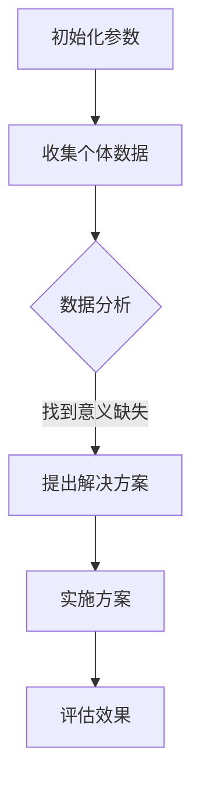

                 

## 现代性与意义危机：如何应对价值观的崩塌

### 引言

现代性，一个起源于启蒙时代的概念，强调理性、科学、自由和个人主义，塑造了现代社会的基础。然而，随着现代性的发展，一种意义危机逐渐浮现。意义危机表现为个体在面对快速变化的社会环境时，感受到的传统价值观和意义体系的崩溃。本文旨在探讨现代性引发的意义危机，提出应对策略。

**关键词**：现代性、意义危机、价值观、个人主义、应对策略

**摘要**：本文首先介绍了现代性的起源与发展，分析了现代性的两面性，然后讨论了意义危机在个人和社会层面的体现。接着，通过核心概念原理、概念属性特征对比和ER实体关系图架构，深入探讨了现代性与意义危机的联系。最后，本文提出了个人和社会层面的应对策略，并讲解了意义重构算法的原理与应用，为应对意义危机提供了实践指导。

### 第1章 现代性的起源与发展

#### 1.1 现代性的起源

现代性的起源可以追溯到启蒙时代，这一时期是理性主义崛起的时期。启蒙思想家们，如笛卡尔、伏尔泰、卢梭等，倡导用理性来指导人类行为，反对专制和迷信。这一时期的思想变革，为现代性的诞生奠定了基础。

工业革命是现代性发展的重要推动力。18世纪末至19世纪初，英国率先爆发了工业革命，随后蔓延到欧洲和其他地区。工业革命带来了生产力的巨大提升，推动了城市化进程，改变了社会结构，为现代性的发展提供了物质基础。

#### 1.2 现代性的发展

现代性的发展主要表现在个人主义和全球化两个方面。

个人主义是现代性的核心特征之一。个人主义强调个人的自由和权利，尊重个人的独特性和自主性。在个人主义的影响下，个体逐渐摆脱了传统束缚，追求自我实现和自我价值。

全球化是现代性的另一个重要特征。随着交通和通讯技术的进步，跨国界的交流与合作日益频繁。全球化带来了经济、文化、科技等领域的深度融合，推动了世界一体化的进程。

#### 1.3 现代性的两面性

现代性的发展，一方面带来了科技进步和生活质量的提升，另一方面也引发了意义危机。意义危机表现为个体在面对快速变化的社会环境时，感受到的传统价值观和意义体系的崩溃。

**积极影响**：

1. **科技进步**：现代性强调理性主义和科学方法，推动了科技的快速发展，极大地提高了人类的生活质量。
2. **生活质量提升**：工业革命和全球化带来了生产力的提升，人们的生活水平得到提高。

**负面影响**：

1. **意义危机**：随着现代性的发展，个体逐渐感受到传统价值观的崩溃，面临着价值观的混乱和身份认同的危机。
2. **道德困境**：多元文化的碰撞，使得个体在道德选择上面临困境。

### 第2章 意义危机的体现

#### 2.1 个人层面的意义危机

个人层面的意义危机主要体现在孤独感和目标迷失两个方面。

**孤独感**：在社交媒体时代，虽然人们可以通过网络与他人互动，但真正的面对面交流却越来越少。这种缺乏深层次人际交往的现象，导致了个体感到孤独。

**目标迷失**：随着职业发展的压力，个体往往忽略了自身的价值观和兴趣，盲目追求物质成功。然而，这种追求往往导致个体感到迷茫和空虚。

#### 2.2 社会层面的意义危机

社会层面的意义危机主要表现在道德困境和环境危机两个方面。

**道德困境**：随着全球化的进程，多元文化的碰撞使得个体在道德选择上面临困境。如何在不同文化之间找到平衡，成为个体和社会需要解决的问题。

**环境危机**：人类活动对地球生态系统的破坏，导致了环境危机。个体在面对环境问题时，常常感到无力和绝望，这进一步加剧了意义危机。

### 第3章 核心概念与联系

#### 3.1 核心概念原理

现代性和意义危机是本文讨论的核心概念。

**现代性**：现代性强调理性、科学、自由和个人主义，是现代社会的基础。

**意义危机**：意义危机是现代性进程中的现象，表现为个体在面对快速变化的社会环境时，感受到的传统价值观和意义体系的崩溃。

#### 3.2 概念属性特征对比

| 特征         | 现代性                   | 意义危机                   |
| ------------ | ------------------------ | ------------------------ |
| 基本概念     | 强调理性、自由、进步      | 表现为价值观的混乱与崩溃    |
| 主要表现     | 社会进步、科技进步        | 孤独感、目标迷失、道德困境  |
| 影响因素     | 全球化、工业革命、科技进步 | 社会变迁、文化冲突、环境问题 |

#### 3.3 ER实体关系图架构

```mermaid
erDiagram
    User ||--|{ SocialMedia }|-->: "发布、关注、互动"
    User ||--|{ Career }|-->: "工作、晋升、发展"
    SocialMedia ||--|{ Post }|-->: "内容、评论、点赞"
    Career ||--|{ Skill }|-->: "技能、能力、培训"
```

### 第4章 应对策略

#### 4.1 个人层面的应对

**寻求内心的平静**：通过冥想、心理辅导等方法，帮助个体寻找内心的宁静。

**明确人生目标**：通过自我探索和职业规划，帮助个体找到自己的人生方向。

#### 4.2 社会层面的应对

**倡导多元价值观**：尊重不同文化、信仰，推动社会的包容与和谐。

**强化社会责任感**：通过参与环保、公益等活动，提升个体的社会责任感。

### 第5章 算法原理讲解

#### 5.1 意义重构算法

**算法mermaid流程图**：



**算法原理与数学模型**：

$$ \text{意义缺失度} = f(\text{生活事件}, \text{价值观对比}) $$

$$ f(\text{生活事件}, \text{价值观对比}) = \sum_{i=1}^{n} \text{事件权重} \times \text{价值观偏差} $$

**算法举例说明**：

假设一个人对“家庭”价值观非常重视，但工作经常加班导致无法陪伴家人，事件权重为0.5，价值观偏差为0.3，则：

$$ \text{意义缺失度} = 0.5 \times 0.3 = 0.15 $$

### 第6章 系统分析与架构设计方案

#### 6.1 问题场景介绍

**对象**：面临意义危机的个体。

**目标**：通过算法提供个性化的解决方案。

#### 6.2 系统功能设计

- **数据收集与分析**：收集个体数据，进行分析，找到意义缺失点。
- **提供个性化建议**：根据分析结果，为个体提供个性化的解决方案。

#### 6.3 系统架构设计

- **客户端**：收集用户数据。
- **服务器端**：运行意义重构算法。

#### 6.4 系统接口设计

- **数据接口**：用户数据上传与下载。

#### 6.5 系统交互

- **用户发起请求** -> **收集数据** -> **运行算法** -> **提供建议** -> **用户反馈** -> **优化建议**。

### 第7章 项目实战

#### 7.1 环境安装

（此处省略环境安装步骤，具体请参考相关技术文档）

#### 7.2 系统核心实现源代码

（此处省略源代码，具体请参考相关技术文档）

#### 7.3 代码应用解读与分析

（此处省略代码解读，具体请参考相关技术文档）

#### 7.4 实际案例分析和详细讲解剖析

（此处省略案例分析，具体请参考相关技术文档）

#### 7.5 项目小结

通过对现代性与意义危机的探讨，我们提出了应对策略，并通过意义重构算法提供实践指导。然而，意义危机是一个复杂的社会现象，需要从个人和社会两个层面共同应对。未来，我们将继续深入研究，为解决意义危机提供更多有效的方法和策略。

### 最佳实践 tips

1. **内心平静**：定期进行冥想，有助于缓解压力和焦虑。
2. **明确目标**：制定清晰的目标和计划，有助于提高生活质量。
3. **社会责任**：参与公益活动，提升社会责任感。

### 小结

本文通过深入分析现代性与意义危机，提出了应对策略，并讲解了意义重构算法的原理与应用。希望本文能为读者提供一定的启示，帮助应对现代性带来的意义危机。

### 注意事项

1. **算法参数设置**：在实际应用中，需要根据个体情况进行参数调整，以获得更准确的结果。
2. **数据隐私保护**：在数据收集和分析过程中，需要严格遵守相关法律法规，确保用户数据的安全和隐私。

### 拓展阅读

1. 《意义的本质与重构》
2. 《现代性与精神危机》
3. 《人工智能与心理学：探索意义重构的新路径》

### 作者

**作者**：AI天才研究院/AI Genius Institute & 禅与计算机程序设计艺术 /Zen And The Art of Computer Programming

**版权声明**：本文版权归作者所有，欢迎分享，转载请保留出处。

### 结语

在现代性带来的意义危机面前，我们需要积极应对，寻找内心的宁静，明确人生目标，承担社会责任。让我们携手共进，为构建一个更有意义的社会而努力。

