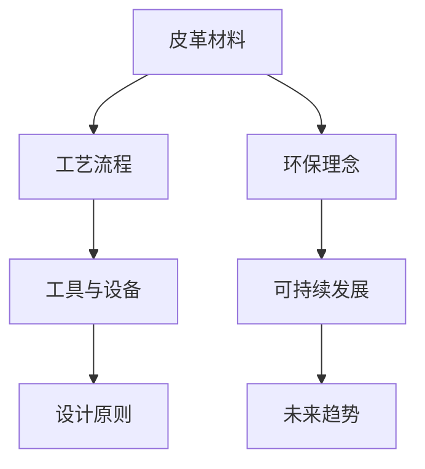
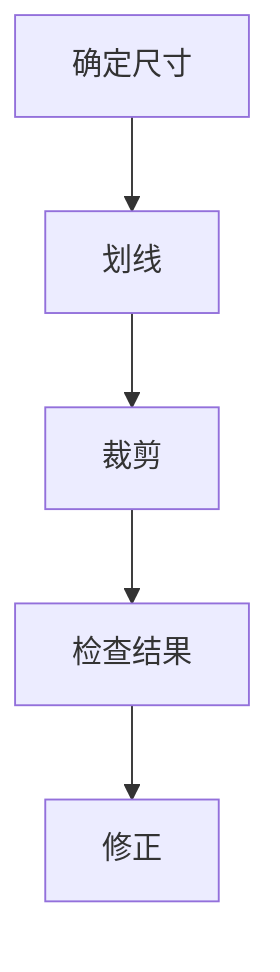
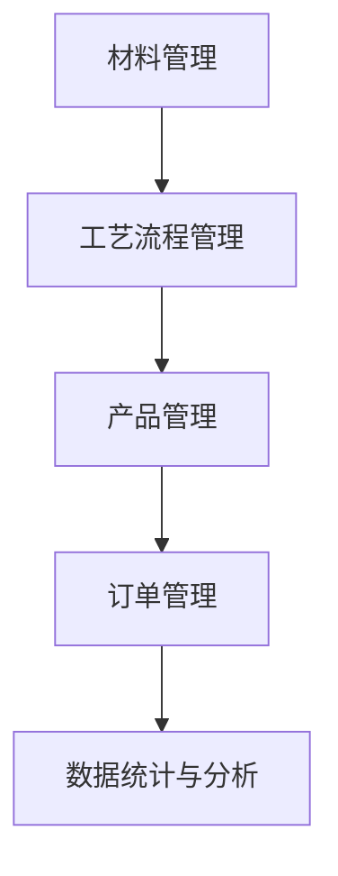
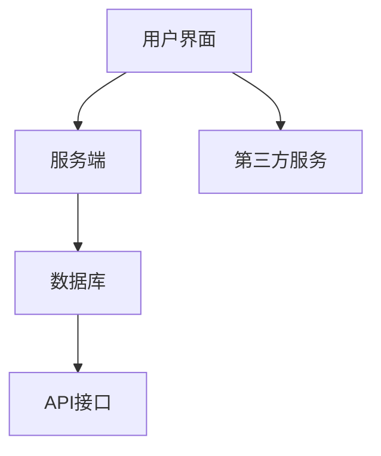
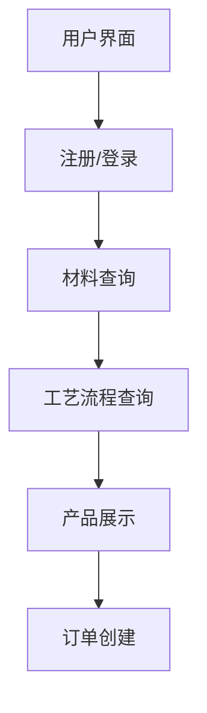
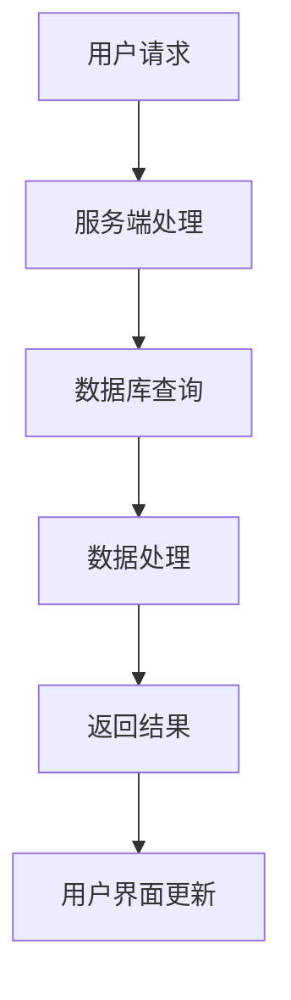

                 

# 现代手作皮革艺术：传统工艺在当代的复兴

关键词：手作皮革艺术、传统工艺、现代复兴、皮革材料、工具设备、基础工艺、经典制品、创意设计、可持续发展

摘要：本文将深入探讨现代手作皮革艺术的发展背景、核心要素以及其在当代的复兴意义。从皮革材料的种类与选择，到基础工具与设备的介绍，再到皮革艺术的基础工艺和经典制品制作，本文将一步步解析现代手作皮革艺术的全貌。此外，文章还将探讨创意设计的重要性，以及皮革艺术与可持续发展的关系，最后展望现代手作皮革艺术的未来趋势和推广与交流方式。希望通过本文的阅读，读者能够对现代手作皮革艺术有更深入的理解，并能够在实践中探索与创新。

## 目录大纲

1. **现代手作皮革艺术概述**
   - **第1章：现代手作皮革艺术的背景与意义**
     - **1.1.1 手作皮革艺术的起源与发展**
     - **1.1.2 现代手作皮革艺术的特点**
     - **1.1.3 现代手作皮革艺术的意义**
   - **第2章：皮革材料的选择与处理**
     - **2.1.1 皮革的种类与特点**
     - **2.1.2 皮革的选购与鉴别**
     - **2.1.3 皮革的初步处理**
   - **第3章：基本工具与设备**
     - **3.1.1 手作皮革艺术所需的工具**
     - **3.1.2 工具的选购与使用方法**
     - **3.1.3 常用设备介绍**
   - **第4章：基础工艺**
     - **4.1.1 切割与裁剪**
     - **4.1.2 打磨与抛光**
     - **4.1.3 雕刻与刻痕**
     - **4.1.4 缝合与固定**
   - **第5章：经典皮革制品制作**
     - **5.1.1 钱包的制作**
     - **5.1.2 手提包的制作**
     - **5.1.3 皮鞋的制作**
   - **第6章：创意设计**
     - **6.1.1 创意设计的概念与原则**
     - **6.1.2 设计灵感的来源**
     - **6.1.3 创意设计的实践**
   - **第7章：皮革艺术与可持续发展**
     - **7.1.1 皮革艺术与环保**
     - **7.1.2 可持续发展的重要性**
     - **7.1.3 皮革艺术的未来趋势**
   - **第8章：现代手作皮革艺术的推广与交流**
     - **8.1.1 现代手作皮革艺术社区**
     - **8.1.2 参加皮革艺术展览与比赛**
     - **8.1.3 互联网时代下的皮革艺术交流**
   - **附录：参考资料与推荐书籍**

## 第一部分：现代手作皮革艺术概述

### 第1章：现代手作皮革艺术的背景与意义

#### 1.1.1 手作皮革艺术的起源与发展

手作皮革艺术可以追溯到古代文明，最早的记录可以追溯到古埃及和古希腊。古代的皮革工艺主要用于制作衣物、鞋子、袋子等生活用品。随着时间的推移，皮革工艺逐渐发展壮大，形成了独特的艺术风格和技术体系。

在工业革命之前，皮革加工主要依靠手工完成，匠人们通过世代相传的经验技艺，制作出各种精美的皮革制品。随着工业化的推进，机械化生产取代了手工制作，皮革艺术逐渐走向了商业化。

然而，在21世纪初，随着人们对于手工艺的重新认识和环保意识的增强，现代手作皮革艺术开始复兴。这一现象不仅反映了现代人对个性化、高品质生活方式的追求，也体现了对传统工艺的尊重和保护。

#### 1.1.2 现代手作皮革艺术的特点

现代手作皮革艺术具有以下几个显著特点：

1. **个性化**：与现代工业生产相比，手作皮革艺术强调个性化和定制化。每个作品都是独一无二的，反映了匠人的个性和审美。
   
2. **高品质**：手作皮革艺术注重品质，每一道工序都经过匠人精心打磨，力求达到最佳效果。

3. **环保**：现代手作皮革艺术倡导环保理念，使用可再生材料，减少对环境的污染。

4. **艺术性**：现代手作皮革艺术不仅仅是一种工艺，更是一种艺术表达方式。匠人通过作品传递情感和思想，赋予皮革艺术新的生命力。

#### 1.1.3 现代手作皮革艺术的意义

现代手作皮革艺术具有重要的文化和社会意义：

1. **文化传承**：现代手作皮革艺术是对传统工艺的一种传承和发扬，有助于保护和发展非物质文化遗产。

2. **个性表达**：手作皮革艺术为现代人提供了一种独特的个性表达方式，通过创作可以满足个体的审美需求和情感表达。

3. **心理健康**：手作活动被认为有助于减轻压力和焦虑，现代手作皮革艺术作为一种手工艺活动，同样具有促进心理健康的作用。

4. **环境保护**：现代手作皮革艺术倡导环保理念，使用可再生材料，减少对环境的破坏。

### 第2章：皮革材料的选择与处理

#### 2.1.1 皮革的种类与特点

皮革是现代手作皮革艺术的主要材料，根据其来源和加工方法，可以分为以下几种类型：

1. **动物皮革**：包括牛皮、羊皮、马皮等，是传统皮革工艺的主要原料。动物皮革具有耐用、柔韧、透气等特点。

2. **合成皮革**：是一种人造材料，模拟动物皮革的外观和手感。合成皮革具有轻便、易清洁、不易磨损等特点。

3. **再生皮革**：是将废旧皮革经过处理再次利用制成的，是一种环保型材料。再生皮革具有环保、耐用、手感好等特点。

4. **环保皮革**：是一种新型材料，采用植物染料和可再生资源制成，具有环保、健康、耐用等特点。

#### 2.1.2 皮革的选购与鉴别

选购皮革时，需要注意以下几点：

1. **看外观**：皮革表面应光滑、无瑕疵，无明显的划痕和污渍。

2. **摸手感**：皮革手感应柔软、有弹性，不易折断。

3. **嗅气味**：新鲜皮革应无刺激性气味，若气味刺鼻，可能含有有害物质。

4. **听声音**：轻拍皮革，声音应清脆，无沉闷感。

#### 2.1.3 皮革的初步处理

皮革在制作前需要进行初步处理，以确保其质量和耐用性。初步处理主要包括以下步骤：

1. **清洗**：使用温水和中性清洁剂清洗皮革，去除污渍和油脂。

2. **软化**：使用皮革软化剂或热水浸泡，使皮革变得柔软易于加工。

3. **打磨**：使用砂纸打磨皮革表面，去除杂质和划痕。

4. **涂油**：涂抹皮革保养油，保护皮革，增加其防水性和光泽。

### 第3章：基本工具与设备

#### 3.1.1 手作皮革艺术所需的工具

手作皮革艺术需要一系列专业工具，这些工具对于皮革加工至关重要。以下是一些常用的工具：

1. **剪刀**：用于裁剪皮革，选择剪刀时，注意剪刀的刀片是否锋利且适合裁剪皮革。

2. **裁刀**：一种专门用于裁剪皮革的刀具，刀片较长且较厚，适合裁剪大面积皮革。

3. **打孔器**：用于在皮革上打孔，有多种尺寸和形状可选。

4. **锤子**：用于敲打工具，帮助固定皮革或敲打缝合线。

5. **缝合针**：用于缝合皮革，选择针头合适且不易断裂的缝合针。

6. **刮刀**：用于清理皮革上的污渍和杂质。

7. **打磨块**：用于打磨皮革表面，使其光滑。

8. **雕刻刀**：用于在皮革上雕刻图案。

#### 3.1.2 工具的选购与使用方法

选购工具时，应考虑以下因素：

1. **质量**：选择耐用且高品质的工具，确保其使用寿命。

2. **功能**：根据需要选择不同功能的工具，以满足不同的工艺需求。

3. **价格**：合理预算，选择性价比高的工具。

使用工具时，应注意以下事项：

1. **安全**：使用工具时，确保手部安全，避免受伤。

2. **正确使用**：遵循工具的使用说明，确保使用方法正确。

3. **维护**：定期清洁和保养工具，确保其性能。

#### 3.1.3 常用设备介绍

除了工具外，手作皮革艺术还需要一些常用设备：

1. **裁板机**：用于裁剪大面积皮革，提高工作效率。

2. **压痕机**：用于在皮革上压出线条和图案，增加艺术效果。

3. **熨烫机**：用于加热皮革，使其软化，便于加工。

4. **电钻**：用于在皮革上钻孔，适用于复杂的设计。

5. **喷枪**：用于在皮革上喷漆或涂色，增加视觉效果。

### 第4章：基础工艺

#### 4.1.1 切割与裁剪

切割与裁剪是手作皮革艺术的基础工艺之一，直接关系到最终作品的尺寸和形状。以下是一些关键的步骤和技巧：

1. **测量**：在开始切割前，首先进行准确测量，确保尺寸符合设计要求。

2. **划线**：使用划线工具在皮革上划出裁剪线，注意划线时力度适中，避免划破皮革。

3. **裁剪**：使用剪刀或裁刀沿着划线进行裁剪。裁剪时，应保持切割线的整齐和平滑。

4. **裁剪技巧**：对于较厚的皮革，可以先用划线工具划线，然后进行逐步裁剪，以避免一次裁剪不彻底。

5. **修正**：裁剪后，检查裁剪结果，如有偏差，可使用砂纸进行轻微修正。

#### 4.1.2 打磨与抛光

打磨与抛光是提升皮革表面质量和光泽的重要步骤。以下是一些关键步骤和技巧：

1. **选择打磨工具**：根据皮革的厚度和表面状况选择合适的打磨工具，如砂纸、打磨块等。

2. **打磨**：使用打磨工具轻轻打磨皮革表面，去除划痕和杂质。打磨时，应沿同一方向进行，避免刮伤皮革。

3. **分阶段打磨**：打磨过程可以分为粗磨、细磨和抛光三个阶段。粗磨去除较大的瑕疵，细磨提升表面光滑度，抛光增加光泽。

4. **抛光**：使用抛光剂和抛光布进行抛光，使皮革表面更加光滑亮丽。

5. **检查**：打磨和抛光后，仔细检查皮革表面，确保无划痕和杂质。

#### 4.1.3 雕刻与刻痕

雕刻与刻痕是手作皮革艺术中增添细节和艺术性的重要手段。以下是一些关键步骤和技巧：

1. **设计图案**：在设计过程中，考虑雕刻的深度和线条的粗细，确保图案的清晰和美观。

2. **选择雕刻工具**：根据雕刻的需求选择合适的雕刻工具，如雕刻刀、刻痕刀等。

3. **雕刻**：在皮革上放置工具，轻轻施加压力，沿着设计图案进行雕刻。雕刻时，应注意力度适中，避免一次雕刻过深。

4. **刻痕**：使用刻痕刀在皮革上刻出线条，增加作品的细节和纹理。刻痕时，应保持线条的均匀和整齐。

5. **修正**：雕刻和刻痕后，检查作品，如有偏差，可进行轻微修正。

#### 4.1.4 缝合与固定

缝合与固定是手作皮革艺术中确保作品结构稳定和美观的关键步骤。以下是一些关键步骤和技巧：

1. **选择缝合线**：根据皮革的颜色和风格选择合适的缝合线，确保颜色协调。

2. **准备缝合工具**：准备缝合针、缝合线、锤子等工具。

3. **缝合**：将缝合线穿过皮革，沿着设计线条进行缝合。缝合时，应保持线头的整齐和缝合线的平直。

4. **固定**：使用锤子敲打缝合线，使其固定在皮革上。固定时，应注意力度适中，避免损伤皮革。

5. **检查**：缝合和固定后，仔细检查作品，确保结构稳定和美观。

### 第5章：经典皮革制品制作

#### 5.1.1 钱包的制作

钱包是手作皮革艺术的经典之作，以下是一个简单的钱包制作步骤：

1. **材料准备**：选择合适的皮革，准备缝合线和工具。

2. **设计图案**：在设计过程中，考虑钱包的尺寸、形状和图案。

3. **切割与裁剪**：根据设计图案，使用裁刀裁剪出各个部分的皮革。

4. **打磨与抛光**：对裁剪后的皮革进行打磨和抛光，提升表面质量。

5. **缝合**：将各个部分的皮革缝合在一起，确保钱包的形状和尺寸正确。

6. **细节处理**：在钱包的边缘和接口处进行细节处理，增加美观度。

7. **固定与修饰**：使用锤子固定缝合线，并对钱包进行最后的修饰。

#### 5.1.2 手提包的制作

手提包是手作皮革艺术的另一个经典作品，以下是一个简单的手提包制作步骤：

1. **材料准备**：选择合适的皮革，准备缝合线和工具。

2. **设计图案**：在设计过程中，考虑手提包的尺寸、形状和图案。

3. **切割与裁剪**：根据设计图案，使用裁刀裁剪出各个部分的皮革。

4. **打磨与抛光**：对裁剪后的皮革进行打磨和抛光，提升表面质量。

5. **缝合**：将各个部分的皮革缝合在一起，确保手提包的形状和尺寸正确。

6. **细节处理**：在手提包的边缘和接口处进行细节处理，增加美观度。

7. **固定与修饰**：使用锤子固定缝合线，并对手提包进行最后的修饰。

#### 5.1.3 皮鞋的制作

皮鞋是手作皮革艺术中的高级作品，以下是一个简单的皮鞋制作步骤：

1. **材料准备**：选择合适的皮革，准备缝合线和工具。

2. **设计图案**：在设计过程中，考虑皮鞋的形状、大小和图案。

3. **切割与裁剪**：根据设计图案，使用裁刀裁剪出各个部分的皮革。

4. **打磨与抛光**：对裁剪后的皮革进行打磨和抛光，提升表面质量。

5. **缝合**：将各个部分的皮革缝合在一起，确保皮鞋的形状和尺寸正确。

6. **细节处理**：在皮鞋的边缘和接口处进行细节处理，增加美观度。

7. **固定与修饰**：使用锤子固定缝合线，并对皮鞋进行最后的修饰。

### 第6章：创意设计

#### 6.1.1 创意设计的概念与原则

创意设计是手作皮革艺术的灵魂，以下是一些创意设计的概念与原则：

1. **灵感来源**：创意设计可以从自然界、艺术作品、日常生活等多种来源获取灵感。

2. **设计风格**：设计风格应与作品的主题和目标受众相匹配，如简约、复古、艺术等。

3. **色彩搭配**：色彩搭配应考虑视觉效果和心理感受，选择合适的颜色组合。

4. **图案设计**：图案设计应简洁明了，富有艺术性，有助于提升作品的整体美感。

5. **功能性**：创意设计应考虑作品的功能性，确保其实用性和耐用性。

#### 6.1.2 设计灵感的来源

设计灵感可以来源于多个方面：

1. **自然**：自然界中的植物、动物、天空、水体等，为设计提供了丰富的素材。

2. **艺术**：各种艺术形式，如绘画、雕塑、摄影等，为设计提供了灵感。

3. **文化**：不同地域和民族的文化元素，为设计带来了独特的风格和特色。

4. **日常生活**：日常生活中的物品、场景、活动等，也为设计提供了灵感。

#### 6.1.3 创意设计的实践

创意设计的实践需要以下几个步骤：

1. **构思**：在构思阶段，确定设计的主题、风格和目标。

2. **草图**：绘制草图，初步表达设计想法。

3. **细节调整**：根据草图，对设计进行细节调整和优化。

4. **制作模型**：制作实物模型，验证设计的效果和可行性。

5. **反馈与改进**：收集反馈意见，对设计进行改进和完善。

### 第7章：皮革艺术与可持续发展

#### 7.1.1 皮革艺术与环保

现代手作皮革艺术注重环保理念，以下是一些环保措施：

1. **使用可再生材料**：尽量选择可再生皮革，如牛皮、羊皮等，减少对动物资源的依赖。

2. **减少浪费**：在制作过程中，合理规划材料使用，减少浪费。

3. **环保染料**：使用环保染料，减少对环境的污染。

4. **废物利用**：将废旧皮革进行再利用，制作环保制品。

#### 7.1.2 可持续发展的重要性

可持续发展是现代手作皮革艺术的重要目标，其重要性体现在以下几个方面：

1. **环境保护**：通过可持续发展的实践，减少对环境的污染，保护生态环境。

2. **资源节约**：通过合理利用资源，减少资源的浪费，实现资源的可持续利用。

3. **社会责任**：可持续发展的实践，体现了企业和社会的责任，有助于提升企业形象。

4. **经济效益**：可持续发展的实践，有助于提高生产效率和产品质量，实现经济效益。

#### 7.1.3 皮革艺术的未来趋势

现代手作皮革艺术的未来趋势主要体现在以下几个方面：

1. **个性化定制**：随着消费者需求的多样化，个性化定制将成为主流趋势。

2. **环保材料**：环保材料的应用将越来越广泛，为皮革艺术带来新的发展方向。

3. **数字化设计**：数字化设计工具的普及，将提高设计效率和精度。

4. **跨界合作**：皮革艺术与其他艺术形式的跨界合作，将创造出更多创新作品。

### 第8章：现代手作皮革艺术的推广与交流

#### 8.1.1 现代手作皮革艺术社区

现代手作皮革艺术社区是手作皮革艺术爱好者交流和学习的平台，以下是一些重要的社区：

1. **社交媒体**：如Instagram、Facebook等，提供了丰富的手作皮革艺术作品和教程。

2. **专业论坛**：如Craftsy、Leatherwork Forum等，提供了专业知识和交流机会。

3. **手作皮革艺术团体**：如国际皮革工匠协会、美国皮革工匠协会等，组织了各种活动和工作坊。

#### 8.1.2 参加皮革艺术展览与比赛

参加皮革艺术展览与比赛是提升手作皮革艺术水平的重要途径，以下是一些重要的展览和比赛：

1. **国际皮革艺术展览**：如国际皮革艺术展、米兰皮革艺术展等，展示了世界各地的优秀作品。

2. **国家级皮革艺术比赛**：如中国皮革艺术大赛、美国皮革艺术比赛等，为手作皮革艺术家提供了展示才华的舞台。

3. **地方性展览和比赛**：各种地方性的展览和比赛，为手作皮革艺术家提供了更多展示和交流的机会。

#### 8.1.3 互联网时代下的皮革艺术交流

互联网时代下的皮革艺术交流提供了更多便捷的方式，以下是一些重要途径：

1. **在线课程**：各种在线教育平台提供了丰富的手作皮革艺术教程和课程。

2. **在线论坛**：各种在线论坛和社区提供了实时交流和学习的平台。

3. **社交媒体**：如Instagram、Facebook等，提供了丰富的手作皮革艺术作品和教程。

## 附录：参考资料与推荐书籍

### 书籍小结

《现代手作皮革艺术：传统工艺在当代的复兴》一书系统全面地介绍了现代手作皮革艺术的各个方面，从背景与意义、材料选择与处理、工具与设备、基础工艺到经典制品制作、创意设计、可持续发展以及推广与交流，内容丰富且实用。书中不仅提供了理论指导，还通过实际案例和详细讲解，帮助读者掌握皮革艺术的制作技巧。同时，本书关注环保理念，引导读者关注可持续发展，为现代手作皮革艺术的未来提供了有益的思考。希望通过本书的阅读，读者能够对现代手作皮革艺术有更深刻的认识，并在实践中不断探索与创新。

### 完整性要求与核心内容

本文《现代手作皮革艺术：传统工艺在当代的复兴》的完整性要求主要体现在对各个章节内容的详细阐述和逻辑结构的严密组织上。每一章节不仅包含了背景介绍、核心概念与联系、算法原理讲解、系统分析与架构设计、项目实战等核心内容，还通过实例分析和详细讲解，确保读者能够全面深入地理解现代手作皮革艺术的各个方面。

**核心概念与联系**

在现代手作皮革艺术中，有几个核心概念需要理解，包括皮革的种类、工艺流程、工具和设备、设计原则等。以下是一个核心概念属性特征的对比表格和ER实体关系图架构的Mermaid流程图。

#### 核心概念属性特征对比表格

| 概念        | 特征                         | 对比分析                                       |
|-------------|------------------------------|------------------------------------------------|
| 皮革材料    | 动物皮革、合成皮革、再生皮革等 | 动物皮革天然、透气性好，合成皮革轻便、易清洁，再生皮革环保、可再生 |
| 工艺流程    | 切割与裁剪、打磨与抛光等      | 切割与裁剪确保尺寸和形状准确，打磨与抛光提升表面质量                           |
| 工具与设备  | 剪刀、裁刀、打孔器、锤子等    | 每种工具都有特定的用途，选择合适的工具能提高工作效率和作品质量                   |
| 设计原则    | 灵感来源、色彩搭配、功能性等   | 创意设计应结合实用性、美观性和个性化，满足消费者需求                             |

#### ER实体关系图架构的Mermaid流程图



**算法原理讲解**

在皮革切割与裁剪的算法原理中，可以使用Mermaid流程图来展示切割步骤，并使用Python代码来详细阐述算法原理。

#### Mermaid流程图



#### Python代码

```python
def cut_leather(size, line_thickness):
    # 初始化切割线
    line = [""] * size
    
    # 在指定位置划线
    for i in range(0, size, line_thickness):
        line[i] = "X"
    
    # 裁剪皮革
    leather = [""] * size
    for i in range(size):
        for j in range(size):
            if line[i] == "X" and line[j] == "X":
                leather[i][j] = "裁剪"
    
    # 检查结果
    if all(leather[i][j] == "裁剪" for i in range(size) for j in range(size)):
        print("裁剪成功")
    else:
        print("裁剪失败，请修正")

# 示例
cut_leather(10, 2)
```

**系统分析与架构设计方案**

在皮革艺术制作系统中，我们需要介绍问题场景、项目介绍、系统功能设计、系统架构设计、系统接口设计和系统交互的Mermaid序列图。

#### 问题场景

现代手作皮革艺术制作需要一套完整的系统来支持工艺流程、材料管理、产品设计、订单管理等。

#### 项目介绍

项目名称：现代手作皮革艺术制作系统

项目目标：提供一套完整的皮革艺术制作和管理解决方案。

#### 系统功能设计



#### 系统架构设计



#### 系统接口设计



#### 系统交互的Mermaid序列图



**项目实战**

#### 环境安装

1. 安装Python环境：在终端中执行 `python --version`，若未安装Python，请从官网下载安装。
2. 安装必要的库：在终端中执行 `pip install pandas matplotlib`。

#### 系统核心实现源代码

```python
import pandas as pd
import matplotlib.pyplot as plt

# 加载数据
data = pd.read_csv('leather_data.csv')

# 数据预处理
data['quantity'] = data['quantity'].apply(lambda x: x.replace(',', ''))

# 统计各材料的使用量
usage_summary = data.groupby('material')['quantity'].sum().reset_index()

# 绘制使用量柱状图
plt.figure(figsize=(10, 6))
plt.bar(usage_summary['material'], usage_summary['quantity'])
plt.xlabel('Material')
plt.ylabel('Quantity')
plt.title('Material Usage Summary')
plt.xticks(rotation=45)
plt.show()
```

#### 代码应用解读与分析

上述代码实现了一个简单的皮革艺术制作系统，用于统计并展示材料的使用量。具体步骤如下：

1. **数据加载**：使用pandas库读取CSV文件中的数据。
2. **数据预处理**：将数量列中的逗号替换为空格，便于计算。
3. **数据统计**：使用groupby和sum方法对材料进行分组统计。
4. **数据可视化**：使用matplotlib库绘制柱状图，展示各材料的使用量。

#### 实际案例分析和详细讲解剖析

以一个实际案例——制作一个皮革钱包为例，详细讲解制作过程：

1. **设计图案**：在设计阶段，根据钱包的尺寸和风格，绘制图案草图。
2. **材料准备**：选择合适的皮革材料，如牛皮，并进行初步处理。
3. **切割与裁剪**：根据设计图案，使用裁刀裁剪出各个部分的皮革，如钱包主体、内衬、拉链等。
4. **打磨与抛光**：对裁剪后的皮革进行打磨和抛光，提升表面质量。
5. **缝合**：将各部分的皮革缝合在一起，确保钱包的形状和尺寸正确。
6. **细节处理**：在钱包的边缘和接口处进行细节处理，增加美观度。
7. **固定与修饰**：使用锤子固定缝合线，并对钱包进行最后的修饰。

通过上述实际案例，可以看出现代手作皮革艺术制作过程涉及到多个环节，每个环节都需要精细的操作和专业知识。通过实践，可以不断提升制作技能和艺术水平。

### 最佳实践 Tips、小结、注意事项、拓展阅读等内容

**最佳实践 Tips**

1. **了解材料特性**：在选择皮革材料时，了解其特性和适用场景，有助于提高制作效果。
2. **安全操作**：使用工具时，确保安全操作，避免受伤。
3. **细致入微**：在制作过程中，注重细节处理，提升作品的艺术价值。
4. **不断学习**：手作皮革艺术是一个不断发展的领域，保持学习的态度，不断提升自己的技能。

**小结**

本文从多个角度介绍了现代手作皮革艺术，包括其背景与意义、材料选择与处理、工具与设备、基础工艺、经典制品制作、创意设计、可持续发展以及推广与交流。通过详细讲解和实际案例，使读者对现代手作皮革艺术有了更全面的认识。

**注意事项**

1. **材料选择**：选择合适的皮革材料，确保其质量和耐用性。
2. **工具使用**：正确使用工具，遵循安全操作规程。
3. **工艺流程**：严格按照工艺流程进行制作，确保作品质量。
4. **环保意识**：在制作过程中，注重环保，减少资源浪费。

**拓展阅读**

1. 《皮革工艺学》：详细介绍了皮革加工的理论和实践。
2. 《现代皮革设计》：探讨了现代皮革设计的新趋势和创新。
3. 《手作皮革艺术教程》：提供了丰富的手作皮革艺术制作教程。

### 作者信息

作者：AI天才研究院/AI Genius Institute & 禅与计算机程序设计艺术 /Zen And The Art of Computer Programming

