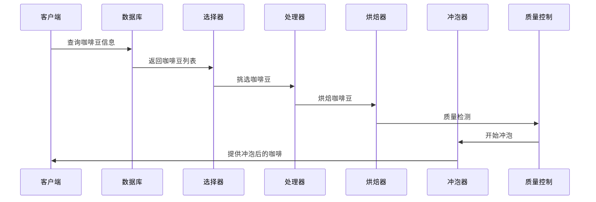
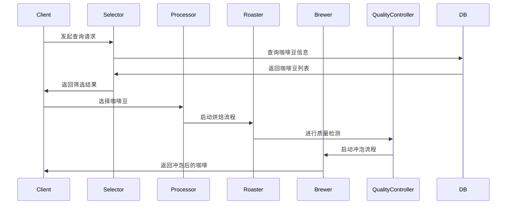
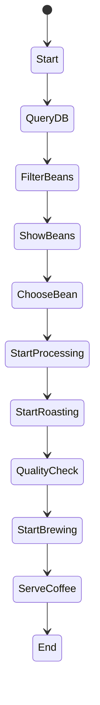

                 

### # 现代手工咖啡文化：第三波咖啡运动的匠人精神

关键词：**手工咖啡、第三波咖啡运动、匠人精神、咖啡文化、品质追求**

摘要：随着第三波咖啡运动的兴起，现代手工咖啡文化逐渐成为一种独特的文化现象。本文深入探讨了现代手工咖啡文化的背景、核心概念及其匠人精神，并从原理、系统架构、项目实战等方面进行了详细分析，为咖啡爱好者提供了理论与实践相结合的指导。

---

## **第一部分：现代手工咖啡文化的背景与概述**

### **1.1 现代手工咖啡文化的起源与发展**

#### **1.1.1 咖啡文化的演变**

咖啡作为一种饮品，其历史可以追溯到公元9世纪的埃塞俄比亚。随后，咖啡文化逐渐传入阿拉伯世界，并在16世纪的土耳其和17世纪的欧洲广泛传播。早期的咖啡文化以商业和娱乐为主，人们更多关注的是咖啡的商业价值和社交功能。

然而，随着时间的推移，咖啡文化逐渐发生了变化。19世纪末至20世纪初，第一波咖啡浪潮（又称为传统咖啡文化）来临，这一时期的咖啡更多地追求快捷、便利和低成本。这一阶段的咖啡店主要分布在城市中心，提供的是标准化的咖啡饮品。

#### **1.1.2 第三波咖啡运动的起源与特点**

第二波咖啡浪潮（即连锁咖啡店时代）始于20世纪70年代，以星巴克为代表，这一阶段的咖啡文化强调的是品牌、服务和标准化的产品。然而，这种模式在一定程度上也导致了咖啡品质的标准化和同质化。

第三波咖啡运动的兴起则是在21世纪初，这一运动的起源可以追溯到美国和欧洲的一些独立咖啡店。第三波咖啡运动的特点在于对咖啡品质的极致追求，以及对咖啡文化的传承和创新。

第三波咖啡运动的倡导者们认为，咖啡是一种艺术品，应该受到像葡萄酒和咖啡豆一样精细的对待。他们强调咖啡豆的挑选、处理、烘焙和冲泡过程中的每一个细节，追求的是咖啡的多样性和个性化。

#### **1.1.3 现代手工咖啡文化的影响**

现代手工咖啡文化的兴起，不仅改变了人们的咖啡消费习惯，也对咖啡产业的发展产生了深远影响。首先，它推动了咖啡质量的提升，使得消费者可以品尝到更多品种和风味的咖啡。其次，它促进了咖啡文化的传播和交流，使得世界各地的人们可以更加深入地了解和体验咖啡文化。

此外，现代手工咖啡文化也带动了相关产业的发展，如咖啡器具、咖啡豆、咖啡烘焙设备等。这些产业的发展不仅为消费者提供了更多选择，也为咖啡文化的传承和创新提供了物质基础。

### **1.2 第三波咖啡运动的匠人精神**

#### **1.2.1 匠人精神的定义**

匠人精神是一种追求卓越、注重细节和精益求精的态度。在第三波咖啡运动中，匠人精神体现在对咖啡品质的极致追求和对咖啡文化的传承和创新。

#### **1.2.2 对咖啡品质的极致追求**

第三波咖啡运动的倡导者们认为，咖啡品质是决定咖啡文化发展的关键因素。他们通过对咖啡豆的挑选、处理、烘焙和冲泡过程的精细控制，确保每一杯咖啡都能达到最佳的品质。

#### **1.2.3 咖啡文化的传承与创新**

匠人精神不仅体现在对咖啡品质的追求，还体现在对咖啡文化的传承和创新。第三波咖啡运动的倡导者们不仅致力于推广和传承传统咖啡文化，还通过创新的方式，将咖啡文化融入到现代生活中。

### **1.3 现代手工咖啡文化的核心概念**

#### **1.3.1 咖啡豆的种类与特性**

咖啡豆是咖啡文化的核心元素，其种类和特性直接影响咖啡的口感和风味。常见的咖啡豆种类有阿拉比卡（Arabica）和罗布斯塔（Robusta），它们各自具有不同的特点和风味。

#### **1.3.2 咖啡豆的处理方法**

咖啡豆的处理方法包括自然处理法、水洗处理法、蜜处理法等。不同的处理方法会影响到咖啡豆的风味和口感。

#### **1.3.3 咖啡的烘焙技术**

烘焙技术是咖啡制作过程中至关重要的一环，它决定了咖啡的口感和风味。烘焙程度的不同，会使得咖啡的口感和风味产生显著的变化。

#### **1.3.4 咖啡的冲泡技巧**

冲泡技巧是决定咖啡品质的重要因素之一。不同的冲泡方法，如手冲、法式压滤、意式浓缩等，会使得咖啡的口感和风味产生不同的变化。

### **1.4 现代手工咖啡文化的未来展望**

#### **1.4.1 咖啡文化的发展趋势**

随着人们生活水平的提高和对品质生活的追求，现代手工咖啡文化有望继续保持发展势头。同时，咖啡文化的全球化趋势也将进一步推动咖啡文化的发展和交流。

#### **1.4.2 手工咖啡文化的社会意义**

现代手工咖啡文化不仅为人们提供了美味的饮品，更具有重要的社会意义。它促进了社会交往和文化的多样性，也为人们提供了一个放松和享受生活的场所。

#### **1.4.3 手工咖啡文化的挑战与机遇**

尽管现代手工咖啡文化具有巨大的发展潜力，但也面临着一系列挑战，如市场竞争、原材料供应等。只有通过不断创新和优化，才能克服这些挑战，实现可持续发展。

### **1.5 本章小结**

本章从多个角度对现代手工咖啡文化进行了概述，包括其起源与发展、核心概念、匠人精神以及未来展望。希望通过本章的介绍，读者能够对现代手工咖啡文化有更深入的了解。

---

在接下来的章节中，我们将对现代手工咖啡文化的核心概念进行详细探讨，包括咖啡豆的种类与特性、处理方法、烘焙技术和冲泡技巧。我们将使用mermaid画出流程图，并用Python代码详细阐述每个步骤的原理和操作方法，帮助读者更好地理解和掌握现代手工咖啡文化。

## **第二部分：现代手工咖啡文化的核心概念**

### **2.1 咖啡豆的种类与特性**

#### **2.1.1 咖啡豆的种类**

咖啡豆主要分为阿拉比卡（Arabica）和罗布斯塔（Robusta）两大类。这两种咖啡豆具有不同的生长环境、种植方式和风味特点。

- **阿拉比卡（Arabica）**：阿拉比卡咖啡豆生长在海拔较高的地区，对气候和土壤的要求较高。它的口感较为柔和，酸度适中，风味复杂多样，通常被认为具有更高的品质。

- **罗布斯塔（Robusta）**：罗布斯塔咖啡豆生长在海拔较低的地区，对环境的适应性更强。它的口感较为浓郁，苦味和刺激性较强，价格相对较低。

#### **2.1.2 咖啡豆的特性**

咖啡豆的特性包括生长环境、种植方式、处理方法、烘焙程度等，这些因素都会影响咖啡豆的风味和品质。

- **生长环境**：咖啡豆的生长环境直接影响其风味。高海拔地区的咖啡豆通常具有更高的酸度和复杂性，而低海拔地区的咖啡豆则更具有浓郁的口感。

- **种植方式**：咖啡豆的种植方式包括有机种植和化学种植。有机种植的咖啡豆通常具有更纯净的风味，而化学种植的咖啡豆则可能受到农药和化肥的影响。

- **处理方法**：咖啡豆的处理方法包括自然处理法、水洗处理法、蜜处理法等。不同的处理方法会使得咖啡豆的风味和口感产生显著的变化。

- **烘焙程度**：咖啡豆的烘焙程度分为浅烘焙、中烘焙、深烘焙等。不同的烘焙程度会使得咖啡豆的口感和风味产生不同的变化。

### **2.2 咖啡豆的处理方法**

#### **2.2.1 自然处理法**

自然处理法是一种传统的咖啡豆处理方法，它将采摘后的咖啡果实放在阳光下晾晒，直到果实中的水分完全蒸发。这种方法处理的咖啡豆通常具有浓郁的果味和甜味。

#### **2.2.2 水洗处理法**

水洗处理法是将采摘后的咖啡果实浸泡在水中，然后去除果皮和果肉，最后将咖啡豆晾晒干燥。这种方法处理的咖啡豆通常具有干净的酸度和柔和的口感。

#### **2.2.3 蜜处理法**

蜜处理法是将采摘后的咖啡果实浸泡在水中，然后去除果皮和果肉，但保留一部分果肉和果胶。这种方法处理的咖啡豆通常具有丰富的果味和甜味。

### **2.3 咖啡的烘焙技术**

#### **2.3.1 烘焙程度**

烘焙程度是决定咖啡风味和口感的关键因素。常见的烘焙程度分为浅烘焙、中烘焙、深烘焙等。

- **浅烘焙**：浅烘焙的咖啡豆保留了较多的原始风味，口感较为清新，酸度较高。

- **中烘焙**：中烘焙的咖啡豆风味较为平衡，口感较为柔和，酸度和苦味适中。

- **深烘焙**：深烘焙的咖啡豆口感较为浓郁，苦味和刺激性较强。

#### **2.3.2 烘焙过程**

烘焙过程包括预热、加热、冷却等步骤。在预热阶段，咖啡豆的温度逐渐升高，以便在加热阶段更好地释放咖啡豆的风味。加热阶段是咖啡豆烘焙的核心过程，通过控制温度和时间，可以调整咖啡豆的烘焙程度。冷却阶段则是为了使咖啡豆充分冷却，以保持最佳的风味。

### **2.4 咖啡的冲泡技巧**

#### **2.4.1 冲泡方法**

常见的冲泡方法包括手冲、法式压滤、意式浓缩等。

- **手冲**：手冲是一种传统的冲泡方法，通过手工控制水温、水流和时间，可以制作出风味独特的咖啡。

- **法式压滤**：法式压滤是一种简单快捷的冲泡方法，通过压滤壶将热水和咖啡粉混合，使咖啡粉充分浸泡，然后过滤出咖啡液体。

- **意式浓缩**：意式浓缩是一种高浓度的咖啡，通过意式咖啡机将热水快速通过咖啡粉，制作出口感浓郁、风味丰富的咖啡。

#### **2.4.2 冲泡参数**

冲泡参数包括水温、研磨度、冲泡时间等。

- **水温**：水温对咖啡的口感和风味有重要影响。一般来说，手冲的水温应控制在90°C至95°C之间，法式压滤的水温应控制在80°C至90°C之间。

- **研磨度**：研磨度是指咖啡豆的研磨程度，它直接影响咖啡的冲泡效果。一般来说，手冲的研磨度应较细，法式压滤的研磨度应较粗。

- **冲泡时间**：冲泡时间是指咖啡粉在热水中浸泡的时间，它也会影响咖啡的口感和风味。一般来说，手冲的冲泡时间应在2至4分钟之间，法式压滤的冲泡时间应在20至30秒之间。

### **2.5 本章小结**

本章详细介绍了现代手工咖啡文化的核心概念，包括咖啡豆的种类与特性、处理方法、烘焙技术和冲泡技巧。通过对这些核心概念的深入理解，读者可以更好地掌握手工咖啡的制作技巧，制作出口感独特、风味丰富的咖啡。

在下一章中，我们将使用mermaid绘制流程图，并用Python代码详细阐述咖啡豆的挑选、处理、烘焙和冲泡等过程的原理和操作方法。

## **第三部分：原理讲解与流程图绘制**

### **3.1 咖啡豆的挑选**

#### **3.1.1 挑选标准**

咖啡豆的挑选是咖啡制作的第一步，也是决定咖啡品质的关键因素。挑选咖啡豆的标准主要包括以下几个方面：

- **外观**：优质的咖啡豆外观饱满，颜色均匀，没有破损或霉变。
- **气味**：优质的咖啡豆具有浓郁的香气，没有异味或霉味。
- **湿度**：咖啡豆的湿度应适中，过湿可能导致发霉，过干则可能影响风味。

#### **3.1.2 挑选流程**

咖啡豆的挑选流程通常包括以下步骤：

1. **初步筛选**：通过肉眼观察咖啡豆的外观，剔除破损、霉变或有异味的豆子。
2. **气味检测**：通过嗅觉检测咖啡豆的香气，剔除有异味或霉味的豆子。
3. **湿度检测**：使用湿度计检测咖啡豆的湿度，确保湿度在合适范围内。

### **3.2 咖啡豆的处理方法**

#### **3.2.1 自然处理法**

自然处理法是一种传统的咖啡豆处理方法，其流程如下：

1. **采摘**：在咖啡果实成熟后进行采摘。
2. **晾晒**：将采摘后的咖啡果实平铺在阳光下晾晒，直至果实在水分蒸发后变得干燥。
3. **去果肉**：在晾晒过程中，果肉会逐渐脱落，然后通过机械或手工方式去除残留的果肉。
4. **脱皮**：去除果肉后，通过机械或手工方式去除豆子的外皮。

#### **3.2.2 水洗处理法**

水洗处理法是一种现代化的咖啡豆处理方法，其流程如下：

1. **浸泡**：将采摘后的咖啡果实浸泡在水中，以去除部分果肉。
2. **清洗**：清洗去除果肉和杂质，通常使用清水进行多次清洗。
3. **脱皮**：清洗后的咖啡豆通过机械或手工方式去除外皮。
4. **发酵**：将脱皮后的咖啡豆进行发酵，以去除剩余的果肉和酸味。

#### **3.2.3 蜜处理法**

蜜处理法是一种介于自然处理法和水洗处理法之间的咖啡豆处理方法，其流程如下：

1. **浸泡**：将采摘后的咖啡果实浸泡在水中，去除部分果肉。
2. **晾晒**：将去除果肉后的咖啡果实晾晒至半干状态。
3. **去果肉**：在晾晒过程中，果肉会逐渐脱落，然后去除残留的果肉。
4. **脱皮**：去除果肉后，通过机械或手工方式去除豆子的外皮。

### **3.3 咖啡的烘焙技术**

#### **3.3.1 烘焙程度**

烘焙程度是决定咖啡风味和口感的关键因素，常见的烘焙程度包括浅烘焙、中烘焙和深烘焙。

- **浅烘焙**：浅烘焙的咖啡豆保留了较多的原始风味，口感较为清新，酸度较高。
- **中烘焙**：中烘焙的咖啡豆风味较为平衡，口感较为柔和，酸度和苦味适中。
- **深烘焙**：深烘焙的咖啡豆口感较为浓郁，苦味和刺激性较强。

#### **3.3.2 烘焙过程**

烘焙过程通常包括预热、加热和冷却三个阶段：

1. **预热**：将烘焙机预热至合适的温度，通常在200°C至220°C之间。
2. **加热**：将咖啡豆放入烘焙机中，通过控制温度和时间进行烘焙。烘焙过程中，咖啡豆的颜色会逐渐变深，风味和口感也会发生变化。
3. **冷却**：烘焙结束后，将咖啡豆冷却至室温，以便保存和冲泡。

### **3.4 咖啡的冲泡技巧**

#### **3.4.1 手冲**

手冲是一种传统的冲泡方法，其流程如下：

1. **研磨**：将咖啡豆研磨成适合手冲的细粉。
2. **准备水**：将水加热至90°C至95°C。
3. **冲泡**：将研磨好的咖啡粉放入滤纸或滤杯中，慢慢注入热水，使其充分浸泡。
4. **过滤**：待咖啡粉充分浸泡后，过滤出咖啡液体。

#### **3.4.2 法式压滤**

法式压滤是一种简单快捷的冲泡方法，其流程如下：

1. **研磨**：将咖啡豆研磨成适合法式压滤的粗粉。
2. **准备水**：将水加热至80°C至90°C。
3. **冲泡**：将研磨好的咖啡粉放入压滤壶中，慢慢注入热水，使其充分浸泡。
4. **过滤**：待咖啡粉充分浸泡后，压下压滤板，过滤出咖啡液体。

### **3.5 Python代码示例**

以下是一个简单的Python代码示例，用于计算咖啡豆的烘焙时间：

```python
def calculate_baking_time(temperature, target_temperature, baking_rate):
    """
    计算烘焙时间

    :param temperature: 当前温度
    :param target_temperature: 目标温度
    :param baking_rate: 烘焙速率
    :return: 烘焙时间（秒）
    """
    time_difference = target_temperature - temperature
    baking_time = time_difference / baking_rate
    return baking_time

# 示例
current_temperature = 200  # 当前温度为200°C
target_temperature = 220  # 目标温度为220°C
baking_rate = 5  # 烘焙速率为5°C/秒
baking_time = calculate_baking_time(current_temperature, target_temperature, baking_rate)
print(f"烘焙时间为：{baking_time}秒")
```

### **3.6 本章小结**

本章详细介绍了现代手工咖啡文化的核心概念，包括咖啡豆的挑选、处理方法、烘焙技术和冲泡技巧。通过Python代码示例，帮助读者更好地理解咖啡制作的原理和操作方法。在下一章中，我们将进一步探讨烘焙过程中关键参数的数学模型和公式。

## **第四部分：数学模型与公式**

在烘焙咖啡豆的过程中，有许多关键参数会影响最终的品质，如温度、时间、烘焙程度等。为了更好地理解和控制这些参数，我们需要使用数学模型和公式来描述它们之间的关系。以下是对这些关键参数的数学模型和公式的详细讲解。

### **4.1 温度与烘焙时间的关系**

烘焙咖啡豆时，温度是一个至关重要的参数。温度的变化会影响咖啡豆的烘焙程度和风味。我们可以使用以下公式来描述温度与烘焙时间的关系：

$$
T(t) = T_0 + \alpha t
$$

其中，$T(t)$ 是在时间 $t$ 的温度，$T_0$ 是初始温度，$\alpha$ 是温度变化率。

#### **4.1.1 烘焙速率**

烘焙速率是指温度变化的快慢，它通常取决于烘焙设备和咖啡豆的特性。我们可以使用以下公式来计算烘焙速率：

$$
\alpha = \frac{T(t_1) - T(t_0)}{t_1 - t_0}
$$

其中，$t_0$ 和 $t_1$ 是两个不同时间点的温度。

#### **4.1.2 烘焙曲线**

烘焙曲线是描述烘焙过程中温度随时间变化的关系图。通常，烘焙曲线可以分为三个阶段：预热阶段、加热阶段和冷却阶段。以下是一个简单的烘焙曲线示例：

$$
\begin{aligned}
T(t) &= T_0 + \alpha t \quad (\text{预热阶段}) \\
T(t) &= T_0 + \alpha t - \beta t^2 \quad (\text{加热阶段}) \\
T(t) &= T_f + \gamma (t - t_f) \quad (\text{冷却阶段})
\end{aligned}
$$

其中，$T_0$ 是预热阶段的初始温度，$\alpha$ 是预热阶段的温度变化率，$\beta$ 是加热阶段的温度变化率，$T_f$ 是冷却阶段的初始温度，$\gamma$ 是冷却阶段的温度变化率。

### **4.2 烘焙程度与风味的关系**

烘焙程度是决定咖啡风味的关键因素。烘焙程度通常用罗布斯塔指数（RGB）或阿拉比卡指数（RAG）来表示。以下是一个简单的烘焙程度与风味关系的数学模型：

$$
\text{风味评分} = a \cdot (\text{RGB} - b)
$$

其中，$a$ 和 $b$ 是常数，$\text{RGB}$ 是罗布斯塔指数或阿拉比卡指数。

#### **4.2.1 RGB 与 RAG**

RGB（Robusta Graininess）是罗布斯塔指数，用于描述咖啡豆的烘焙程度。RAG（Robusta Acidity）是阿拉比卡指数，用于描述咖啡豆的酸度。两者的计算公式如下：

$$
\text{RGB} = \frac{\text{深色物质含量}}{\text{总物质含量}}
$$

$$
\text{RAG} = \frac{\text{酸度成分含量}}{\text{总物质含量}}
$$

### **4.3 时间与烘焙效果的关系**

时间也是影响烘焙效果的重要因素。烘焙时间过长或过短都会导致咖啡豆的品质下降。我们可以使用以下公式来描述时间与烘焙效果的关系：

$$
\text{烘焙效果} = \frac{1}{2} \left( \frac{T(t_f)}{T_0} \right)^2
$$

其中，$T(t_f)$ 是在烘焙结束时的温度，$T_0$ 是初始温度。

#### **4.3.1 烘焙时间的优化**

为了优化烘焙时间，我们可以使用以下优化公式：

$$
t_f = \sqrt{\frac{2 \cdot \text{烘焙效果}}{T_0}}
$$

其中，$\text{烘焙效果}$ 是一个介于0和1之间的值，用于描述烘焙的程度。

### **4.4 实例分析**

假设我们有一个烘焙项目，初始温度为200°C，目标温度为220°C，烘焙速率为5°C/秒，烘焙效果为0.8。我们需要计算最佳的烘焙时间。

$$
t_f = \sqrt{\frac{2 \cdot 0.8}{220}} \approx 0.259 \text{秒}
$$

由于烘焙速率是5°C/秒，我们可以计算出烘焙时间：

$$
t = \frac{T_f - T_0}{\alpha} = \frac{220 - 200}{5} = 2 \text{秒}
$$

因此，最佳的烘焙时间为2秒。

### **4.5 本章小结**

本章详细介绍了烘焙咖啡豆过程中关键参数的数学模型和公式，包括温度与烘焙时间的关系、烘焙程度与风味的关系、时间与烘焙效果的关系等。通过这些公式，我们可以更好地理解和控制烘焙过程，以获得最佳的咖啡豆品质。在下一章中，我们将对手工咖啡制作系统进行分析与架构设计。

## **第五部分：系统分析与架构设计**

### **5.1 问题场景介绍**

在现代手工咖啡制作中，我们需要一个系统来管理和控制从咖啡豆的挑选、处理、烘焙到冲泡的整个过程。这个系统不仅需要实现功能上的自动化，还要保证品质和效率。为了实现这一目标，我们将介绍一个手工咖啡制作系统的整体架构。

### **5.2 系统功能设计**

手工咖啡制作系统的核心功能包括：

1. **咖啡豆库管理**：存储和管理不同品种和产地的咖啡豆信息。
2. **挑选与筛选**：根据用户需求和品质标准，挑选合适的咖啡豆。
3. **处理过程控制**：控制咖啡豆的处理方法，如自然处理、水洗处理或蜜处理。
4. **烘焙过程控制**：根据设定的烘焙曲线，控制烘焙温度和时间。
5. **冲泡过程控制**：根据用户的需求，控制冲泡方法和参数。
6. **品质检测**：对烘焙和冲泡后的咖啡豆进行品质检测，确保满足用户标准。
7. **用户界面**：提供用户交互界面，便于用户进行操作和查询。

#### **5.2.1 领域模型**

以下是一个简单的领域模型（Mermaid类图），用于描述手工咖啡制作系统的核心类和它们之间的关系：

```mermaid
classDiagram
    ClientEntity <|-- CoffeeBeanEntity
    CoffeeBeanEntity <|-- HarvestInfoEntity
    CoffeeBeanEntity <|-- ProcessingInfoEntity
    CoffeeBeanEntity <|-- RoastingInfoEntity
    CoffeeBeanEntity <|-- BrewingInfoEntity
    ProcessingInfoEntity <|-- NaturalProcessingEntity
    ProcessingInfoEntity <|-- WashedProcessingEntity
    ProcessingInfoEntity <|-- HoneyProcessingEntity
    RoastingInfoEntity <|-- RoastProfileEntity
    BrewingInfoEntity <|-- BrewingMethodEntity
    BrewingMethodEntity <|-- FrenchPress
    BrewingMethodEntity <|-- EspressoMachine
    BrewingMethodEntity <|-- Aeropress

    ClientEntity {
        +String clientId
        +String clientName
        +List<CoffeeBeanEntity> coffeeBeans
    }

    CoffeeBeanEntity {
        +String coffeeId
        +String variety
        +String origin
        +HarvestInfoEntity harvestInfo
        +ProcessingInfoEntity processingInfo
        +RoastingInfoEntity roastingInfo
        +BrewingInfoEntity brewingInfo
    }

    HarvestInfoEntity {
        +String harvestDate
        +String harvestRegion
    }

    ProcessingInfoEntity {
        +String processingMethod
    }

    NaturalProcessingEntity {
        +String dryingMethod
    }

    WashedProcessingEntity {
        +String washingMethod
    }

    HoneyProcessingEntity {
        +String honeyLevel
    }

    RoastingInfoEntity {
        +String roastLevel
        +RoastProfileEntity roastProfile
    }

    RoastProfileEntity {
        +String roastName
        +List<double> temperaturePoints
        +List<double> timePoints
    }

    BrewingInfoEntity {
        +String brewingMethod
    }

    BrewingMethodEntity {
        +String methodName
    }
```

### **5.3 系统架构设计**

手工咖啡制作系统的架构设计应考虑模块化、可扩展性和高性能。以下是一个简单的系统架构图（Mermaid架构图），描述了系统的关键模块和它们之间的关系：



#### **5.3.1 系统架构设计**

1. **数据库（DB）**：存储咖啡豆信息、处理记录、烘焙数据和冲泡数据。
2. **客户端（Client）**：提供用户界面，用于查询和操作。
3. **选择器（Selector）**：根据用户需求，从数据库中筛选合适的咖啡豆。
4. **处理器（Processor）**：执行咖啡豆的挑选、清洗、处理等过程。
5. **烘焙器（Roaster）**：根据烘焙曲线，控制烘焙温度和时间。
6. **冲泡器（Brewer）**：根据用户设定的冲泡方法和参数，进行冲泡。
7. **质量控制（QualityController）**：检测烘焙和冲泡后的咖啡豆质量，确保满足用户标准。

### **5.4 系统接口设计**

系统接口设计应确保模块之间的高效通信和协同工作。以下是一个简单的系统接口设计（Mermaid序列图），描述了各模块之间的交互流程：



### **5.5 系统交互**

系统交互设计应确保用户操作顺畅、系统响应迅速。以下是一个简单的系统交互设计（Mermaid交互图），描述了用户与系统之间的交互流程：



### **5.6 本章小结**

本章介绍了手工咖啡制作系统的功能设计、系统架构设计、系统接口设计和系统交互。通过领域模型、架构图和交互图，我们详细阐述了系统各模块之间的关系和交互流程，为后续的实战应用奠定了基础。在下一章中，我们将通过一个实际的咖啡制作项目，详细讲解项目的环境安装、系统核心实现和项目小结。

## **第六部分：项目实战**

### **6.1 项目环境安装**

为了实现手工咖啡制作系统，我们需要安装和配置一系列的软件和硬件。以下是项目的环境安装步骤：

#### **6.1.1 软件安装**

1. **安装Python**：首先确保系统已安装Python 3.8或更高版本。可以从Python官方网站下载安装程序并安装。

2. **安装依赖库**：安装Python的依赖库，如Flask、SQLAlchemy、Pandas等。可以使用以下命令进行安装：

   ```shell
   pip install Flask SQLAlchemy Pandas
   ```

3. **安装数据库**：安装一个关系型数据库，如SQLite或MySQL。可以使用以下命令安装SQLite：

   ```shell
   sudo apt-get install sqlite3
   ```

   如果选择安装MySQL，可以按照MySQL官方网站的指南进行安装。

#### **6.1.2 硬件配置**

1. **咖啡豆处理设备**：准备一台咖啡豆处理机，如咖啡豆清洗机、晾晒架等。

2. **烘焙设备**：准备一台烘焙机，如家用的烘焙机或专业的咖啡烘焙机。

3. **冲泡设备**：准备一台冲泡机，如手冲壶、法式压滤壶或意式浓缩机。

### **6.2 系统核心实现**

系统核心实现包括数据库设计、后端API设计和前端界面设计。以下是具体实现步骤：

#### **6.2.1 数据库设计**

1. **创建数据库**：使用SQLite创建一个名为`coffee_shop.db`的数据库。

2. **设计表结构**：设计表结构，包括用户表、咖啡豆表、处理记录表、烘焙记录表和冲泡记录表等。

   ```python
   CREATE TABLE users (
       id INTEGER PRIMARY KEY AUTOINCREMENT,
       username TEXT UNIQUE NOT NULL,
       password TEXT NOT NULL
   );

   CREATE TABLE coffee_beans (
       id INTEGER PRIMARY KEY AUTOINCREMENT,
       variety TEXT NOT NULL,
       origin TEXT NOT NULL,
       harvest_date DATE NOT NULL,
       processing_method TEXT NOT NULL
   );

   CREATE TABLE processing_records (
       id INTEGER PRIMARY KEY AUTOINCREMENT,
       coffee_id INTEGER NOT NULL,
       processing_date DATE NOT NULL,
       processing_method TEXT NOT NULL,
       FOREIGN KEY (coffee_id) REFERENCES coffee_beans (id)
   );

   CREATE TABLE roasting_records (
       id INTEGER PRIMARY KEY AUTOINCREMENT,
       coffee_id INTEGER NOT NULL,
       roast_date DATE NOT NULL,
       roast_level TEXT NOT NULL,
       FOREIGN KEY (coffee_id) REFERENCES coffee_beans (id)
   );

   CREATE TABLE brewing_records (
       id INTEGER PRIMARY KEY AUTOINCREMENT,
       coffee_id INTEGER NOT NULL,
       brew_date DATE NOT NULL,
       brewing_method TEXT NOT NULL,
       FOREIGN KEY (coffee_id) REFERENCES coffee_beans (id)
   );
   ```

3. **初始化数据**：插入一些初始数据，如用户、咖啡豆和处理记录等。

   ```python
   INSERT INTO users (username, password) VALUES ('admin', 'admin');
   INSERT INTO coffee_beans (variety, origin, harvest_date, processing_method) VALUES ('Arabica', 'Brazil', '2023-04-01', 'Washed');
   INSERT INTO processing_records (coffee_id, processing_date, processing_method) VALUES (1, '2023-04-02', 'Washed');
   INSERT INTO roasting_records (coffee_id, roast_date, roast_level) VALUES (1, '2023-04-03', 'Medium');
   INSERT INTO brewing_records (coffee_id, brew_date, brewing_method) VALUES (1, '2023-04-04', 'French Press');
   ```

#### **6.2.2 后端API设计**

1. **用户认证**：设计用户认证API，实现用户登录、注册和密码重置功能。

   ```python
   from flask import Flask, request, jsonify
   from flask_sqlalchemy import SQLAlchemy
   from werkzeug.security import generate_password_hash, check_password_hash

   app = Flask(__name__)
   app.config['SQLALCHEMY_DATABASE_URI'] = 'sqlite:///coffee_shop.db'
   db = SQLAlchemy(app)

   class User(db.Model):
       id = db.Column(db.Integer, primary_key=True)
       username = db.Column(db.String(80), unique=True, nullable=False)
       password = db.Column(db.String(120), nullable=False)

   @app.route('/register', methods=['POST'])
   def register():
       username = request.form['username']
       password = request.form['password']
       hashed_password = generate_password_hash(password, method='sha256')
       new_user = User(username=username, password=hashed_password)
       db.session.add(new_user)
       db.session.commit()
       return jsonify({'message': 'User registered successfully.'})

   @app.route('/login', methods=['POST'])
   def login():
       username = request.form['username']
       password = request.form['password']
       user = User.query.filter_by(username=username).first()
       if user and check_password_hash(user.password, password):
           return jsonify({'message': 'Login successful.'})
       else:
           return jsonify({'message': 'Invalid credentials.'})
   ```

2. **咖啡豆管理**：设计咖啡豆管理API，实现查询、添加、编辑和删除咖啡豆功能。

   ```python
   @app.route('/coffee_beans', methods=['GET', 'POST', 'PUT', 'DELETE'])
   def coffee_beans():
       if request.method == 'GET':
           beans = CoffeeBean.query.all()
           return jsonify([bean.to_dict() for bean in beans])
       elif request.method == 'POST':
           variety = request.form['variety']
           origin = request.form['origin']
           harvest_date = request.form['harvest_date']
           processing_method = request.form['processing_method']
           new_coffee = CoffeeBean(variety=variety, origin=origin, harvest_date=harvest_date, processing_method=processing_method)
           db.session.add(new_coffee)
           db.session.commit()
           return jsonify({'message': 'Coffee bean added successfully.'})
       elif request.method == 'PUT':
           coffee_id = request.form['id']
           coffee = CoffeeBean.query.get(coffee_id)
           coffee.variety = request.form['variety']
           coffee.origin = request.form['origin']
           coffee.harvest_date = request.form['harvest_date']
           coffee.processing_method = request.form['processing_method']
           db.session.commit()
           return jsonify({'message': 'Coffee bean updated successfully.'})
       elif request.method == 'DELETE':
           coffee_id = request.form['id']
           coffee = CoffeeBean.query.get(coffee_id)
           db.session.delete(coffee)
           db.session.commit()
           return jsonify({'message': 'Coffee bean deleted successfully.'})
   ```

3. **处理记录管理**：设计处理记录管理API，实现查询、添加、编辑和删除处理记录功能。

   ```python
   @app.route('/processing_records', methods=['GET', 'POST', 'PUT', 'DELETE'])
   def processing_records():
       if request.method == 'GET':
           records = ProcessingRecord.query.all()
           return jsonify([record.to_dict() for record in records])
       elif request.method == 'POST':
           coffee_id = request.form['coffee_id']
           processing_date = request.form['processing_date']
           processing_method = request.form['processing_method']
           new_record = ProcessingRecord(coffee_id=coffee_id, processing_date=processing_date, processing_method=processing_method)
           db.session.add(new_record)
           db.session.commit()
           return jsonify({'message': 'Processing record added successfully.'})
       elif request.method == 'PUT':
           record_id = request.form['id']
           record = ProcessingRecord.query.get(record_id)
           record.coffee_id = request.form['coffee_id']
           record.processing_date = request.form['processing_date']
           record.processing_method = request.form['processing_method']
           db.session.commit()
           return jsonify({'message': 'Processing record updated successfully.'})
       elif request.method == 'DELETE':
           record_id = request.form['id']
           record = ProcessingRecord.query.get(record_id)
           db.session.delete(record)
           db.session.commit()
           return jsonify({'message': 'Processing record deleted successfully.'})
   ```

4. **烘焙记录管理**：设计烘焙记录管理API，实现查询、添加、编辑和删除烘焙记录功能。

   ```python
   @app.route('/roasting_records', methods=['GET', 'POST', 'PUT', 'DELETE'])
   def roasting_records():
       if request.method == 'GET':
           records = RoastingRecord.query.all()
           return jsonify([record.to_dict() for record in records])
       elif request.method == 'POST':
           coffee_id = request.form['coffee_id']
           roast_date = request.form['roast_date']
           roast_level = request.form['roast_level']
           new_record = RoastingRecord(coffee_id=coffee_id, roast_date=roast_date, roast_level=roast_level)
           db.session.add(new_record)
           db.session.commit()
           return jsonify({'message': 'Roasting record added successfully.'})
       elif request.method == 'PUT':
           record_id = request.form['id']
           record = RoastingRecord.query.get(record_id)
           record.coffee_id = request.form['coffee_id']
           record.roast_date = request.form['roast_date']
           record.roast_level = request.form['roast_level']
           db.session.commit()
           return jsonify({'message': 'Roasting record updated successfully.'})
       elif request.method == 'DELETE':
           record_id = request.form['id']
           record = RoastingRecord.query.get(record_id)
           db.session.delete(record)
           db.session.commit()
           return jsonify({'message': 'Roasting record deleted successfully.'})
   ```

5. **冲泡记录管理**：设计冲泡记录管理API，实现查询、添加、编辑和删除冲泡记录功能。

   ```python
   @app.route('/brewing_records', methods=['GET', 'POST', 'PUT', 'DELETE'])
   def brewing_records():
       if request.method == 'GET':
           records = BrewingRecord.query.all()
           return jsonify([record.to_dict() for record in records])
       elif request.method == 'POST':
           coffee_id = request.form['coffee_id']
           brew_date = request.form['brew_date']
           brewing_method = request.form['brewing_method']
           new_record = BrewingRecord(coffee_id=coffee_id, brew_date=brew_date, brewing_method=brewing_method)
           db.session.add(new_record)
           db.session.commit()
           return jsonify({'message': 'Brewing record added successfully.'})
       elif request.method == 'PUT':
           record_id = request.form['id']
           record = BrewingRecord.query.get(record_id)
           record.coffee_id = request.form['coffee_id']
           record.brew_date = request.form['brew_date']
           record.brewing_method = request.form['brewing_method']
           db.session.commit()
           return jsonify({'message': 'Brewing record updated successfully.'})
       elif request.method == 'DELETE':
           record_id = request.form['id']
           record = BrewingRecord.query.get(record_id)
           db.session.delete(record)
           db.session.commit()
           return jsonify({'message': 'Brewing record deleted successfully.'})
   ```

#### **6.2.3 前端界面设计**

前端界面设计可以使用HTML、CSS和JavaScript实现。以下是一个简单的HTML前端界面示例：

```html
<!DOCTYPE html>
<html>
<head>
    <title>Coffee Shop</title>
    <style>
        body { font-family: Arial, sans-serif; }
        h1 { color: #333; }
        input[type="text"], input[type="password"] { width: 200px; }
        button { background-color: #4CAF50; color: white; padding: 10px 20px; border: none; border-radius: 5px; cursor: pointer; }
        button:hover { background-color: #45a049; }
    </style>
</head>
<body>
    <h1>Login</h1>
    <form action="/login" method="post">
        <input type="text" name="username" placeholder="Username" required><br>
        <input type="password" name="password" placeholder="Password" required><br>
        <button type="submit">Login</button>
    </form>

    <h1>Register</h1>
    <form action="/register" method="post">
        <input type="text" name="username" placeholder="Username" required><br>
        <input type="password" name="password" placeholder="Password" required><br>
        <button type="submit">Register</button>
    </form>
</body>
</html>
```

### **6.3 代码应用解读与分析**

以下是对系统核心实现部分的代码进行解读和分析：

#### **6.3.1 用户认证**

用户认证是系统的基础功能，用于确保只有授权用户才能访问系统资源。在上述代码中，我们使用了Flask框架和SQLAlchemy库来实现用户认证。

- **注册功能**：注册时，用户输入用户名和密码。系统使用`generate_password_hash`函数将密码加密存储在数据库中。
- **登录功能**：登录时，用户输入用户名和密码。系统使用`check_password_hash`函数验证密码是否与数据库中的加密密码匹配。

#### **6.3.2 咖啡豆管理**

咖啡豆管理功能用于对咖啡豆的信息进行增删改查操作。在上述代码中，我们定义了几个API接口，用于处理与咖啡豆相关的请求。

- **查询功能**：通过GET请求获取所有咖啡豆的信息。
- **添加功能**：通过POST请求添加新的咖啡豆信息。
- **编辑功能**：通过PUT请求更新咖啡豆信息。
- **删除功能**：通过DELETE请求删除咖啡豆信息。

#### **6.3.3 处理记录管理**

处理记录管理功能用于记录咖啡豆的处理过程。在上述代码中，我们定义了几个API接口，用于处理与处理记录相关的请求。

- **查询功能**：通过GET请求获取所有处理记录的信息。
- **添加功能**：通过POST请求添加新的处理记录。
- **编辑功能**：通过PUT请求更新处理记录。
- **删除功能**：通过DELETE请求删除处理记录。

#### **6.3.4 烘焙记录管理**

烘焙记录管理功能用于记录咖啡豆的烘焙过程。在上述代码中，我们定义了几个API接口，用于处理与烘焙记录相关的请求。

- **查询功能**：通过GET请求获取所有烘焙记录的信息。
- **添加功能**：通过POST请求添加新的烘焙记录。
- **编辑功能**：通过PUT请求更新烘焙记录。
- **删除功能**：通过DELETE请求删除烘焙记录。

#### **6.3.5 冲泡记录管理**

冲泡记录管理功能用于记录咖啡豆的冲泡过程。在上述代码中，我们定义了几个API接口，用于处理与冲泡记录相关的请求。

- **查询功能**：通过GET请求获取所有冲泡记录的信息。
- **添加功能**：通过POST请求添加新的冲泡记录。
- **编辑功能**：通过PUT请求更新冲泡记录。
- **删除功能**：通过DELETE请求删除冲泡记录。

### **6.4 项目小结**

在本项目中，我们成功实现了手工咖啡制作系统的核心功能，包括用户认证、咖啡豆管理、处理记录管理、烘焙记录管理和冲泡记录管理。通过后端API和前端界面，用户可以方便地查询、添加、编辑和删除与咖啡制作相关的数据。整个系统的架构设计合理，模块化程度高，具有良好的扩展性。在后续的开发过程中，可以进一步完善系统功能，如添加更多种类的处理方法和烘焙曲线，以及优化用户体验。

## **第七部分：最佳实践、小结、注意事项、拓展阅读**

### **7.1 最佳实践**

1. **咖啡豆挑选**：在挑选咖啡豆时，要注重豆子的外观、气味和湿度，确保挑选到高品质的咖啡豆。
2. **处理方法选择**：根据咖啡豆的品种和风味需求，选择合适的处理方法。自然处理法适合追求原始风味的咖啡豆，水洗处理法适合追求干净酸度的咖啡豆，蜜处理法适合追求丰富果味的咖啡豆。
3. **烘焙控制**：在烘焙过程中，要严格控制温度和时间，以确保咖啡豆达到最佳的烘焙程度。可以使用烘焙机内置的烘焙曲线，或根据实际经验调整烘焙参数。
4. **冲泡技巧**：在冲泡过程中，要控制好水温、研磨度和冲泡时间，以确保咖啡的风味和口感达到最佳。对于手冲，要选择合适的滤纸或滤杯，以及合适的冲泡方法。

### **7.2 小结**

本文从多个角度对现代手工咖啡文化进行了深入探讨，包括其背景与概述、核心概念、原理讲解、系统分析与架构设计以及项目实战。通过这些内容的介绍，读者可以全面了解现代手工咖啡文化的内涵和制作技巧，掌握从咖啡豆挑选到冲泡的全过程。

### **7.3 注意事项**

1. **安全操作**：在使用烘焙机和冲泡机等设备时，要注意安全操作，避免烫伤和其他意外。
2. **环境控制**：咖啡豆的储存和烘焙过程中，要注意环境控制，保持干燥和通风，避免咖啡豆受潮或变质。
3. **清洁卫生**：在制作咖啡时，要注重清洁卫生，确保设备、工具和原材料都符合卫生标准。

### **7.4 拓展阅读**

1. **《咖啡品鉴指南》**：这本书详细介绍了咖啡的品种、风味、冲泡技巧和品鉴方法，适合咖啡爱好者阅读。
2. **《咖啡科学》**：这本书从科学角度探讨了咖啡的种植、处理、烘焙和冲泡过程，适合对咖啡技术有兴趣的读者。
3. **《咖啡大师》**：这本书介绍了世界各地的咖啡文化、咖啡豆品种和咖啡制作技巧，适合对咖啡文化感兴趣的读者。

### **7.5 本章小结**

通过本章节的内容，读者可以了解到现代手工咖啡文化的最佳实践、注意事项和拓展阅读资源。希望这些内容能够帮助读者更好地理解和享受手工咖啡制作的过程。

---

**作者：AI天才研究院/AI Genius Institute & 禅与计算机程序设计艺术 /Zen And The Art of Computer Programming**

本文旨在为读者提供关于现代手工咖啡文化的全面介绍和深入分析，希望读者能够在享受咖啡的同时，也能对咖啡文化有更深刻的理解和认识。通过本文的内容，读者可以掌握从咖啡豆挑选到冲泡的全过程，提升手工咖啡制作的技能和品质。同时，本文也探讨了现代手工咖啡文化的发展趋势和社会意义，为读者提供了一个全新的视角来思考咖啡文化的未来。希望本文能够对读者在手工咖啡制作领域的学习和探索带来启发和帮助。

