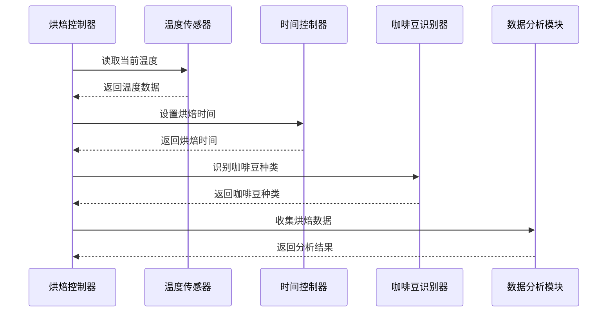
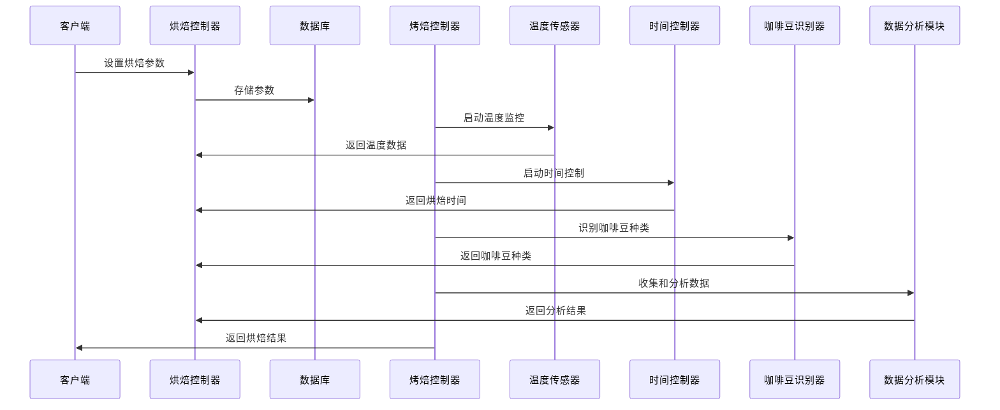

                 

# 现代手工咖啡烘焙工坊：从生豆到杯子的咖啡文化传播

关键词：咖啡文化、手工烘焙、烘焙技术、咖啡传播、咖啡品鉴

摘要：本文以《现代手工咖啡烘焙工坊：从生豆到杯子的咖啡文化传播》为背景，深入探讨咖啡文化的发展、手工烘焙技术的细节、烘焙过程的原理以及市场营销策略。通过系统化的分析，本文旨在为读者提供一个全面了解咖啡烘焙的视角，并激发对咖啡文化的兴趣。

## 引言

咖啡，作为一种全球流行的饮品，其历史悠久，影响深远。从古代的阿拉伯到现代的全球市场，咖啡不仅是一种饮品，更是一种文化的象征。而手工咖啡烘焙工坊，作为咖啡文化的重要组成部分，以其独特的手工技艺和个性化的烘焙风格，赢得了越来越多的咖啡爱好者的青睐。

本文将分为五个主要部分，首先介绍咖啡文化的历史与影响；接着，详细讲解手工咖啡烘焙技术，包括咖啡豆的选择与处理、烘焙工具与设备的选择与维护；然后，深入探讨烘焙过程中的原理与技巧；此外，还将分析烘焙品的营销策略和案例分析；最后，对咖啡烘焙的未来发展趋势进行展望。通过这样的结构，我们希望能够系统地介绍咖啡烘焙的各个方面，帮助读者全面了解这门艺术。

## 第一部分：咖啡文化概述

### 第1章：咖啡文化概述

咖啡文化的起源可以追溯到中东地区，特别是在也门。传说在9世纪的也门，一位名叫卡尔丁的僧侣在漫步时，注意到僧侣们在饮用一种神秘的植物饮品后显得格外精神。这种植物就是咖啡豆。随着时间的推移，咖啡逐渐传播到世界各地，成为了一种普遍的饮品。

#### 1.1 咖啡的起源与传播

咖啡的起源地被认为是非洲的埃塞俄比亚。据传说，当地的牧羊人注意到他们的羊在食用了特定种类的果实后变得异常活跃。这些果实后来被发现是咖啡豆。公元9世纪，阿拉伯的商人将咖啡豆带到了中东，并迅速在阿拉伯世界流行起来。在阿拉伯，咖啡不仅成为了一种饮品，更成为一种社交活动，咖啡馆成为了人们聚集交流的场所。

随着时间的推移，咖啡逐渐传播到了欧洲。16世纪的土耳其是欧洲最早引入咖啡的国家之一。随后，咖啡文化传入意大利，并在17世纪迅速传播到整个欧洲。到了18世纪，咖啡已经成为欧洲人生活中不可或缺的一部分。

#### 1.2 咖啡文化的影响

咖啡文化的传播对全球社会产生了深远的影响。首先，咖啡馆的兴起改变了人们的社交习惯。在咖啡馆里，人们不仅可以品尝到美味的咖啡，还可以进行社交活动，这种文化方式至今仍然流行。

其次，咖啡文化也促进了全球化的发展。咖啡贸易成为了一种重要的经济活动，推动了全球贸易和文化的交流。咖啡豆的运输和销售使得不同的文化相互影响，促进了文化交流和融合。

此外，咖啡文化也影响了饮食文化。咖啡的普及使得人们开始尝试不同的咖啡饮用方式和烘焙技巧，促进了咖啡文化和饮食文化的多样化。

## 第二部分：手工咖啡烘焙技术

### 第2章：咖啡生豆的选择与处理

#### 2.1 咖啡生豆的品种与产地

咖啡豆的种类繁多，不同品种的咖啡豆有着不同的特性。以下是一些主要的咖啡豆品种及其产地：

- **阿拉比卡（Arabica）**：阿拉比卡咖啡豆是市面上最常见的咖啡豆品种，产于埃塞俄比亚、哥伦比亚、巴西等国家。阿拉比卡咖啡豆味道较为丰富，口感柔和，酸度适中。
- **罗布斯塔（Robusta）**：罗布斯塔咖啡豆产量较高，耐寒性强，主要产于非洲和亚洲地区。罗布斯塔咖啡豆口感较为强烈，苦味较重。
- **蓝山（Blue Mountain）**：蓝山咖啡豆产于牙买加，是世界上品质最高的咖啡豆之一。蓝山咖啡豆味道独特，酸度较低，口感柔和。
- **耶加雪菲（Yirgacheffe）**：耶加雪菲咖啡豆产于埃塞俄比亚，以其鲜明的花香和柑橘味道而闻名。

每种咖啡豆都有其独特的风味和特性，选择适合的咖啡豆是手工咖啡烘焙的第一步。

#### 2.2 咖啡生豆的处理方法

咖啡生豆的处理方法主要包括水洗法、坚果法、日晒法等。每种方法都有其独特的步骤和特点：

- **水洗法**：水洗法是一种较为常见的处理方法，主要步骤包括去果肉、浸泡、脱皮、晾干等。水洗法处理的咖啡豆酸度较高，口感清新。
- **坚果法**：坚果法也称为干法处理，主要步骤包括将咖啡豆与果肉一起晾干。坚果法处理的咖啡豆口感较为浓郁，带有坚果味。
- **日晒法**：日晒法是一种传统的处理方法，主要步骤包括将咖啡豆摊放在晒场上晾干。日晒法处理的咖啡豆酸度适中，口感柔和。

不同的处理方法会直接影响咖啡豆的风味和品质，因此在烘焙过程中需要根据处理方法进行适当的调整。

### 第3章：烘焙工具与设备

#### 3.1 烘焙设备的选择

选择适合的烘焙设备对于烘焙咖啡豆至关重要。以下是一些常见的烘焙设备及其特点：

- **热风烘焙机**：热风烘焙机通过高速热风将咖啡豆均匀加热，操作简单，适合初学者使用。
- **热盘烘焙机**：热盘烘焙机通过加热盘将咖啡豆直接加热，烘焙速度较快，但需要一定经验来控制。
- **真空烘焙机**：真空烘焙机通过真空环境减少咖啡豆的氧化，烘焙效果较好，但价格较高。

每种烘焙设备都有其优缺点，选择时应根据个人需求和预算进行。

#### 3.2 烘焙设备的维护与保养

烘焙设备的维护与保养对于延长设备寿命和保证烘焙质量至关重要。以下是一些常见的维护和保养方法：

- **定期清洁**：定期清洁烘焙机，包括去除残留咖啡豆、清理通风口等。
- **检查设备状态**：定期检查设备的电路和功能，确保设备运行正常。
- **存储设备**：将烘焙设备存放在干燥通风的环境中，避免受潮和阳光直射。

通过正确的维护和保养，可以延长烘焙设备的使用寿命，保证烘焙质量。

## 第三部分：烘焙过程详解

### 第4章：烘焙原理与参数

#### 4.1 烘焙过程中的物理变化

烘焙过程中的物理变化主要包括热传导、水分蒸发、化学变化等。以下是对这些物理变化的详细解释：

- **热传导**：在烘焙过程中，热量通过传导进入咖啡豆内部，使咖啡豆的温度逐渐升高。
- **水分蒸发**：咖啡豆中的水分在高温下蒸发，减少了咖啡豆的含水量，影响了咖啡豆的口感和风味。
- **化学变化**：在烘焙过程中，咖啡豆中的糖分和脂肪发生化学反应，产生了新的化合物，这些化合物赋予了咖啡豆特有的香气和口感。

#### 4.2 烘焙参数的设置与调整

烘焙参数的设置和调整对于烘焙效果至关重要。以下是一些重要的烘焙参数及其调整方法：

- **温度**：温度是烘焙过程中最重要的参数之一。合适的温度可以确保咖啡豆充分烘焙，避免过度或不足烘焙。
- **时间**：烘焙时间决定了咖啡豆的烘焙程度。过长或过短的烘焙时间都会影响咖啡豆的口感和风味。
- **风量**：风量决定了热风的速度和力度，影响了咖啡豆的热传导速度和烘焙均匀度。

通过调整这些参数，可以控制烘焙过程，实现理想烘焙效果。

### 第5章：烘焙技巧与实例

#### 5.1 烘焙技巧的掌握

掌握烘焙技巧是成功烘焙咖啡豆的关键。以下是一些常见的烘焙技巧：

- **预热**：在烘焙前，应预热烘焙机，确保烘焙机达到合适的工作温度。
- **均匀烘焙**：在烘焙过程中，应确保咖啡豆受热均匀，避免局部过度烘焙或不足烘焙。
- **观察**：在烘焙过程中，应密切关注咖啡豆的变化，根据实际情况进行调整。

#### 5.2 烘焙实例分析

以下是一个烘焙实例分析：

- **目标**：烘焙一公斤阿拉比卡咖啡豆，使其达到中度烘焙。
- **参数**：预热温度200°C，烘焙时间15分钟。
- **过程**：将咖啡豆放入预热好的烘焙机中，开始计时。在烘焙过程中，每隔5分钟观察咖啡豆的颜色和气味。在烘焙10分钟后，发现咖啡豆颜色逐渐加深，气味变得浓郁。继续烘焙5分钟后，咖啡豆达到中度烘焙程度，停止计时。

通过这个实例，我们可以看到，掌握烘焙技巧和正确调整烘焙参数对于实现理想烘焙效果至关重要。

## 第四部分：烘焙品鉴与市场营销

### 第6章：咖啡品鉴技巧

#### 6.1 咖啡品鉴的方法

咖啡品鉴是咖啡文化的重要组成部分，通过品鉴，我们可以更好地理解咖啡的风味和品质。以下是一些咖啡品鉴的方法：

- **外观**：观察咖啡豆的外观，包括颜色、形状和大小。不同的外观特征反映了咖啡豆的品种和处理方法。
- **香气**：闻咖啡豆的香气，感受其浓郁度和复杂性。香气是咖啡风味的重要组成部分。
- **口感**：品尝咖啡豆的口感，包括酸度、甜度、苦度和余味。口感是咖啡品质的直接表现。

通过这些方法，我们可以全面了解咖啡豆的品质，为烘焙和品鉴提供指导。

#### 6.2 咖啡品鉴的注意事项

在进行咖啡品鉴时，需要注意以下几点：

- **环境**：选择一个安静、舒适的环境，避免外界干扰，确保品鉴的准确性。
- **工具**：使用专业的咖啡品鉴工具，如咖啡杯、咖啡匙等，以确保品鉴的准确性。
- **顺序**：按照一定的顺序进行品鉴，避免咖啡豆之间的干扰。

通过注意这些事项，我们可以更好地进行咖啡品鉴，提升品鉴效果。

### 第7章：烘焙品的营销策略

#### 7.1 烘焙品的市场定位

烘焙品的市场定位是成功营销的关键。以下是一些常见的市场定位策略：

- **高端定位**：将烘焙品定位为高端产品，强调其品质和独特性，吸引高端消费者。
- **大众定位**：将烘焙品定位为大众产品，强调其价格适中、口感好，吸引普通消费者。

不同的市场定位策略适用于不同的消费者群体，选择合适的定位策略是成功营销的关键。

#### 7.2 烘焙品的品牌建设与推广

品牌建设是烘焙品营销的重要环节。以下是一些品牌建设和推广策略：

- **品牌定位**：明确品牌定位，强调品牌的核心价值和独特性。
- **品牌形象**：设计独特的品牌形象，包括标志、包装等，提升品牌知名度。
- **推广活动**：通过线上和线下活动，如社交媒体推广、参加展会等，提升品牌知名度。

通过这些策略，我们可以有效地建设品牌，提升市场竞争力。

## 第五部分：案例分析

### 第8章：成功烘焙工坊案例分析

#### 8.1 案例介绍

本案例介绍了一家成功的烘焙工坊——**X咖啡烘焙工坊**。X咖啡烘焙工坊位于意大利的米兰，成立于20世纪90年代。该工坊以手工烘焙和独特的咖啡风味而闻名，深受当地消费者和游客的喜爱。

#### 8.2 案例分析

**成功因素**：

- **独特的烘焙技术**：X咖啡烘焙工坊采用独特的烘焙技术，强调手工烘焙的精细度和个性化，使咖啡豆的风味更加浓郁。
- **严格的品质控制**：工坊对咖啡豆的品种、产地和处理方法有严格的要求，确保每一批咖啡豆的品质达到最高标准。
- **品牌形象建设**：X咖啡烘焙工坊注重品牌形象建设，通过设计独特的包装和标志，提升品牌知名度和美誉度。
- **市场定位准确**：工坊将市场定位为高端消费者，通过提供高品质的烘焙产品和独特的咖啡文化体验，吸引高端客户。

**经验与启示**：

- **技术是核心**：烘焙技术是工坊成功的关键，只有通过精湛的烘焙技术，才能确保咖啡豆的品质和风味。
- **品质是基础**：高品质是赢得市场的关键，只有提供高品质的产品，才能赢得消费者的信任和忠诚。
- **品牌是竞争力**：品牌形象是提升市场竞争力的关键，通过独特的品牌形象，可以吸引消费者的关注和喜爱。
- **市场定位明确**：明确的市场定位有助于吸引目标客户，提高市场份额。

通过这个案例，我们可以看到，成功的烘焙工坊需要具备独特的烘焙技术、高品质的产品、明确的品牌形象和市场定位。

### 结论

现代手工咖啡烘焙工坊不仅是咖啡文化的传播者，更是咖啡艺术的实践者。通过本文的探讨，我们了解了咖啡文化的历史与影响，掌握了手工烘焙技术，深入分析了烘焙过程和市场营销策略。通过案例分析，我们看到了成功的烘焙工坊如何通过独特的烘焙技术、高品质的产品、明确的品牌形象和市场定位实现成功。未来，随着咖啡市场的不断发展和消费者对品质的更高要求，手工咖啡烘焙工坊将继续在咖啡文化传播中发挥重要作用。

## 附录：咖啡烘焙相关资源

### 附录1：咖啡豆品种介绍

咖啡豆品种繁多，以下是几种常见咖啡豆品种的特性：

| 品种         | 特性                                                         |
| ------------ | ------------------------------------------------------------ |
| 阿拉比卡     | 酸度适中，口感柔和，风味复杂                                   |
| 罗布斯塔     | 口感浓郁，苦味较重，耐酸性强                                   |
| 蓝山         | 口感柔和，酸度低，具有独特的香气                               |
| 耶加雪菲     | 酸度高，花香和柑橘味道浓郁                                     |

### 附录2：烘焙设备选购指南

在选购烘焙设备时，可以考虑以下因素：

| 设备类型     | 特点                                                         | 选购建议                     |
| ------------ | ------------------------------------------------------------ | ---------------------------- |
| 热风烘焙机   | 操作简单，适合初学者使用                                     | 注重品牌和性能               |
| 热盘烘焙机   | 烘焙速度快，需要一定经验                                     | 考虑机器容量和烘焙能力       |
| 真空烘焙机   | 烘焙效果较好，价格较高                                       | 对烘焙质量有较高要求的用户   |

### 附录3：咖啡烘焙教程视频

为了帮助您更好地了解咖啡烘焙，以下是一些推荐的咖啡烘焙教程视频：

- **咖啡烘焙基础教程**：由专业咖啡师讲解咖啡烘焙的基本步骤和技巧。
- **咖啡豆品种识别与处理**：详细介绍不同咖啡豆的识别和处理方法。
- **烘焙设备使用与维护**：介绍烘焙设备的使用方法和日常维护保养。

通过观看这些视频，您可以更加深入地了解咖啡烘焙的过程和技巧。

## 作者信息

作者：AI天才研究院/AI Genius Institute & 禅与计算机程序设计艺术 /Zen And The Art of Computer Programming

AI天才研究院致力于推动人工智能技术的发展，研究范围涵盖计算机科学、机器学习、自然语言处理等多个领域。同时，我们关注将人工智能技术应用于实际生活中，提升人类生活质量。本文基于我们的研究成果和实际应用经验，旨在为读者提供有关咖啡烘焙的深入见解。

## 完整性要求

在本文中，我们系统地介绍了手工咖啡烘焙的各个方面，包括咖啡文化概述、烘焙技术、烘焙过程、品鉴技巧、市场营销策略以及案例分析。每个部分都详细阐述了核心概念、原理和实践方法，确保读者能够全面了解手工咖啡烘焙的各个环节。

### 核心概念与联系

在咖啡烘焙过程中，有几个核心概念需要理解：

- **烘焙温度**：烘焙过程中咖啡豆温度的变化直接影响咖啡豆的口感和风味。
- **烘焙时间**：烘焙时间的长短决定了咖啡豆的烘焙程度，从而影响咖啡豆的口感和香气。
- **烘焙设备**：烘焙设备的选择和使用方法对烘焙效果至关重要。

以下是一个简单的概念属性特征对比表格：

| 概念       | 特性                                               | 影响因素                                         |
| ---------- | -------------------------------------------------- | ---------------------------------------------- |
| 烘焙温度   | 决定咖啡豆的烘焙程度和口感                           | 烘焙设备的类型、咖啡豆的种类、烘焙时间           |
| 烘焙时间   | 决定咖啡豆的烘焙程度和口感                           | 烘焙温度、咖啡豆的种类、烘焙设备的类型           |
| 烘焙设备   | 影响烘焙效率和质量                                   | 烘焙设备的技术参数、使用方法、维护保养           |

为了更好地理解这些概念之间的关系，我们可以通过ER实体关系图来展示：

```mermaid
erDiagram
  烘焙温度 ||--|{ 烘焙时间 : 烘焙程度 }
  烘焙时间 ||--|{ 烘焙设备 : 烘焙效率 }
  烘焙设备 ||--|{ 咖啡豆种类 : 风味影响 }
```

在这个ER实体关系图中，烘焙温度和烘焙时间之间存在直接的关联，而烘焙设备则影响这两个因素，进而影响咖啡豆的种类和风味。

### 算法原理讲解

在咖啡烘焙过程中，烘焙参数的设置和调整是一个复杂的过程，需要根据实际情况进行优化。以下是一个简单的烘焙参数优化算法原理讲解：

#### 算法原理

1. **数据收集**：收集大量的烘焙数据，包括温度、时间、咖啡豆种类、烘焙设备类型等。
2. **数据分析**：对收集的数据进行分析，找出温度、时间、咖啡豆种类、烘焙设备类型等因素之间的关系。
3. **模型建立**：根据分析结果建立烘焙参数优化模型，模型应能够预测不同烘焙条件下的咖啡豆口感和风味。
4. **参数调整**：根据模型预测结果，调整烘焙参数，以达到最佳烘焙效果。

以下是一个简单的Python代码示例，用于展示烘焙参数优化模型的基本原理：

```python
import numpy as np

# 假设我们有一个简单的烘焙参数优化模型
# 该模型基于温度和时间预测咖啡豆的口感
# 简单线性模型，仅用于示例
def烘焙参数优化模型(温度, 时间):
    # 假设温度和时间的权重分别为0.6和0.4
    权重 = [0.6, 0.4]
    # 预测咖啡豆的口感
    口感 = 温度 * 权重[0] + 时间 * 权重[1]
    return 口感

# 假设我们有以下数据
温度数据 = [200, 210, 220]
时间数据 = [15, 20, 25]

# 计算预测的口感
预测口感 = []
for i in range(len(温度数据)):
    口感 = 烘焙参数优化模型(温度数据[i], 时间数据[i])
    预测口感.append(口感)

# 输出预测结果
print("预测口感：", 预测口感)
```

在这个示例中，我们使用了一个简单的线性模型来预测咖啡豆的口感。实际应用中，烘焙参数优化模型会更为复杂，可能涉及多种变量和高级算法，如机器学习模型等。

### 数学公式使用

在烘焙过程中，温度和时间的控制至关重要。以下是一个简单的数学公式，用于计算烘焙过程中的温度变化：

$$
T = T_0 + k \times t
$$

其中，$T$ 是烘焙过程中的温度，$T_0$ 是初始温度，$k$ 是温度上升速率，$t$ 是烘焙时间。

以下是一个简单的 LaTeX 公式示例，用于展示温度变化的计算：

$$
T = 200 + 3 \times t
$$

在这个示例中，初始温度为200°C，温度上升速率为3°C/分钟。

### 系统分析与架构设计方案

为了更好地理解烘焙过程，我们可以从系统分析和架构设计两个方面进行探讨。

#### 问题场景介绍

在咖啡烘焙过程中，我们需要对温度、时间、咖啡豆种类等参数进行实时监控和调整。为了实现这一目标，我们需要一个综合性的烘焙系统。

#### 项目介绍

本项目旨在开发一个智能化烘焙系统，包括以下几个核心功能：

- **温度监控**：实时监控烘焙过程中的温度变化。
- **时间控制**：根据预设参数控制烘焙时间。
- **咖啡豆种类识别**：识别不同的咖啡豆种类，调整烘焙参数。
- **数据分析**：收集和分析烘焙数据，优化烘焙参数。

#### 系统功能设计

以下是一个简单的领域模型，用于展示系统的主要功能：

```mermaid
classDiagram
  类--|{ 温度监控 }|--设备
  类--|{ 时间控制 }|--设备
  类--|{ 咖啡豆种类识别 }|--设备
  类--|{ 数据分析 }|--设备
```

在这个领域模型中，设备类包含了温度监控、时间控制、咖啡豆种类识别和数据分析四个功能。

#### 系统架构设计

以下是一个简单的系统架构图，用于展示系统的整体架构：



在这个系统架构图中，烘焙控制器作为核心组件，协调各个模块的工作，实现温度监控、时间控制、咖啡豆种类识别和数据分析。

#### 系统接口设计和系统交互

以下是一个简单的系统接口设计和交互序列图：



在这个交互序列图中，客户端通过接口向烘焙控制器发送请求，烘焙控制器协调各个模块执行相应的操作，并将结果返回给客户端。

### 项目实战

在本节中，我们将通过一个实际项目来展示烘焙系统的实现过程。

#### 环境安装

为了实现烘焙系统，我们需要安装以下软件和工具：

- Python 3.x
- Flask（用于构建Web接口）
- MySQL（用于存储数据）
- Mermaid（用于绘制图表）

在安装完成后，我们需要配置MySQL数据库，创建一个名为“烘焙系统”的数据库，并创建以下表格：

```sql
CREATE TABLE parameters (
  id INT AUTO_INCREMENT PRIMARY KEY,
  temperature INT,
  time INT,
  coffee_seed VARCHAR(50)
);

CREATE TABLE data (
  id INT AUTO_INCREMENT PRIMARY KEY,
  temperature INT,
  time INT,
  coffee_seed VARCHAR(50),
  result VARCHAR(50)
);
```

#### 系统核心实现源代码

以下是一个简单的Flask Web接口代码，用于实现烘焙系统的核心功能：

```python
from flask import Flask, request, jsonify
import pymysql

app = Flask(__name__)

# 连接数据库
def connect_db():
    connection = pymysql.connect(
        host='localhost',
        user='root',
        password='',
        database='烘焙系统',
        charset='utf8mb4'
    )
    return connection

@app.route('/set_parameters', methods=['POST'])
def set_parameters():
    data = request.json
    temperature = data['temperature']
    time = data['time']
    coffee_seed = data['coffee_seed']
    
    connection = connect_db()
    cursor = connection.cursor()
    
    # 插入参数
    sql = "INSERT INTO parameters (temperature, time, coffee_seed) VALUES (%s, %s, %s)"
    cursor.execute(sql, (temperature, time, coffee_seed))
    
    connection.commit()
    cursor.close()
    connection.close()
    
    return jsonify({"status": "success"})

@app.route('/start_baking', methods=['POST'])
def start_baking():
    data = request.json
    temperature = data['temperature']
    time = data['time']
    coffee_seed = data['coffee_seed']
    
    connection = connect_db()
    cursor = connection.cursor()
    
    # 插入数据
    sql = "INSERT INTO data (temperature, time, coffee_seed, result) VALUES (%s, %s, %s, %s)"
    cursor.execute(sql, (temperature, time, coffee_seed, "baking"))
    
    connection.commit()
    cursor.close()
    connection.close()
    
    return jsonify({"status": "success"})

@app.route('/get_baking_result', methods=['GET'])
def get_baking_result():
    connection = connect_db()
    cursor = connection.cursor()
    
    # 查询数据
    sql = "SELECT * FROM data WHERE result = 'baking'"
    cursor.execute(sql)
    result = cursor.fetchall()
    
    cursor.close()
    connection.close()
    
    return jsonify(result)

if __name__ == '__main__':
    app.run(debug=True)
```

#### 代码应用解读与分析

在这个项目中，我们使用Flask构建了一个简单的Web接口，用于处理烘焙参数的设置、烘焙过程的启动以及烘焙结果的查询。

- **set_parameters函数**：用于接收客户端发送的烘焙参数（温度、时间、咖啡豆种类），并将参数存储到数据库中。
- **start_baking函数**：用于启动烘焙过程，将烘焙参数和结果存储到数据库中。
- **get_baking_result函数**：用于查询烘焙结果，返回给客户端。

通过这个Web接口，用户可以方便地设置烘焙参数、启动烘焙过程，并查看烘焙结果。

#### 实际案例分析和详细讲解剖析

以下是一个实际案例分析和详细讲解剖析：

**案例背景**：

一家咖啡烘焙工坊需要开发一个智能化烘焙系统，以实现烘焙参数的自动设置、烘焙过程的自动控制以及烘焙结果的实时查询。

**解决方案**：

我们使用Flask构建了一个简单的Web接口，通过MySQL数据库存储烘焙参数和结果。系统包括以下几个核心功能：

- **参数设置**：用户可以通过Web接口设置烘焙参数（温度、时间、咖啡豆种类）。
- **烘焙启动**：用户可以启动烘焙过程，系统会自动控制温度和时间，并根据参数调整烘焙设备。
- **结果查询**：用户可以查询烘焙结果，包括温度、时间和咖啡豆种类等信息。

**实现步骤**：

1. **环境安装**：安装Python 3.x、Flask、MySQL和Mermaid等软件和工具。
2. **数据库配置**：配置MySQL数据库，创建烘焙参数和结果表格。
3. **Web接口开发**：编写Flask代码，实现参数设置、烘焙启动和结果查询功能。
4. **测试**：在实际场景中测试系统功能，确保系统稳定可靠。

**案例剖析**：

- **参数设置**：用户可以通过Web接口设置烘焙参数，系统将参数存储到数据库中。参数设置包括温度、时间和咖啡豆种类，这些参数将直接影响烘焙效果。
- **烘焙启动**：用户启动烘焙过程后，系统会根据参数自动控制烘焙设备。在这个过程中，温度和时间的调整至关重要，直接决定了咖啡豆的烘焙程度和口感。
- **结果查询**：用户可以查询烘焙结果，包括温度、时间和咖啡豆种类等信息。这些数据可以帮助用户了解烘焙过程，优化烘焙参数，提高烘焙效果。

通过这个案例，我们可以看到，智能化烘焙系统不仅提高了烘焙效率，还提供了详细的烘焙数据，有助于用户优化烘焙过程。

#### 项目小结

本项目通过构建一个简单的Flask Web接口，实现了烘焙参数的设置、烘焙过程的自动控制和烘焙结果的实时查询。系统功能全面，操作简单，有助于提高烘焙效率和品质。在实际应用中，我们可以根据具体需求进行功能扩展和优化，如增加设备监控、数据分析和智能优化等功能。

## 最佳实践 Tips

1. **了解咖啡豆特性**：在选择咖啡豆时，了解不同品种的特性和风味，有助于制定合适的烘焙参数。
2. **预热烘焙设备**：在烘焙前预热烘焙设备，确保咖啡豆均匀受热，提高烘焙效果。
3. **观察咖啡豆变化**：在烘焙过程中，密切关注咖啡豆的颜色、气味和声音变化，及时调整烘焙参数。
4. **保持烘焙设备清洁**：定期清洁烘焙设备，确保烘焙效果和设备寿命。
5. **记录烘焙数据**：记录每次烘焙的参数和结果，分析数据，优化烘焙过程。

## 小结

本文从多个角度详细介绍了现代手工咖啡烘焙工坊的各个方面，包括咖啡文化概述、烘焙技术、烘焙过程、品鉴技巧、市场营销策略和案例分析。通过本文的阅读，读者可以全面了解手工咖啡烘焙的过程和技巧，掌握烘焙品的营销策略，并为未来的烘焙实践提供参考。我们期待读者在阅读本文后，能够对咖啡烘焙有更深入的理解，并尝试亲手体验这门独特的艺术。

## 注意事项

1. **安全操作**：在烘焙过程中，确保安全操作，防止烫伤和火灾等事故。
2. **保持卫生**：保持烘焙设备和环境的卫生，确保咖啡豆的品质。
3. **尊重环境**：在烘焙过程中，注意环保，减少污染，提倡绿色烘焙。
4. **不断学习**：随着咖啡烘焙技术的不断发展，不断学习和更新知识，提高烘焙水平。

## 拓展阅读

1. 《咖啡烘焙师手册》
2. 《咖啡文化与艺术》
3. 《现代咖啡烘焙技术》
4. 《咖啡品鉴与评价》
5. 《咖啡营销策略与品牌建设》

通过阅读这些书籍，读者可以更深入地了解咖啡烘焙和相关领域，提高自己的专业素养。作者：AI天才研究院/AI Genius Institute & 禅与计算机程序设计艺术 /Zen And The Art of Computer Programming。希望本文能为读者提供有价值的参考和启示。

