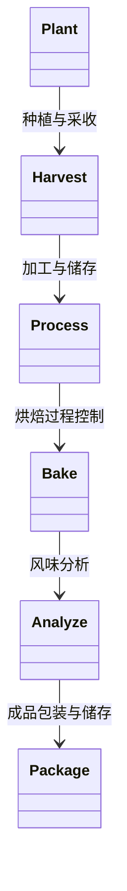
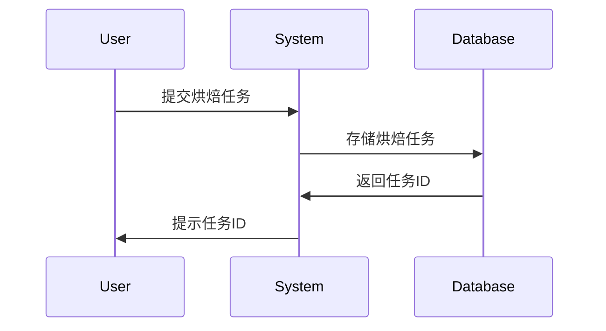
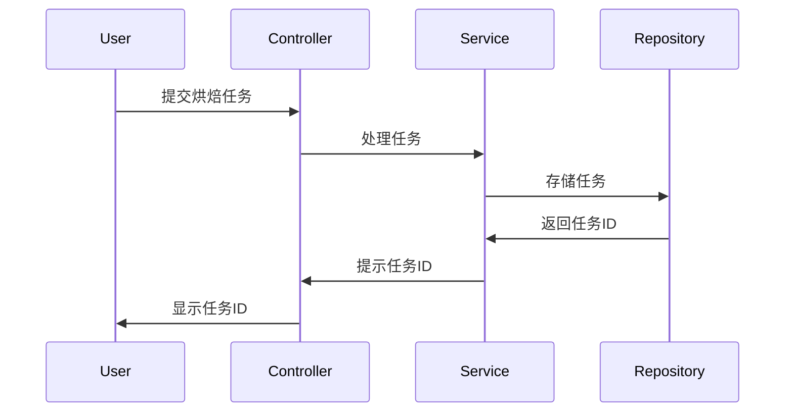

                 

# 现代手工咖啡烘焙：从生豆到杯子的匠人之路

> 关键词：手工咖啡烘焙、咖啡豆、烘焙技术、风味调整、咖啡艺术

> 摘要：本文旨在探讨现代手工咖啡烘焙的全过程，从生豆的处理到最终成品的制作。通过详细分析烘焙设备与工具的选择、烘焙过程的技术要点以及风味分析与调整，本文旨在为读者提供一份全面的咖啡烘焙指南，帮助咖啡爱好者成为匠人，打造出独一无二的咖啡体验。

## 引言

### 1.1 书籍背景及目的

咖啡，作为一种全球性的饮品，已经深入到人们的生活之中。然而，真正了解咖啡烘焙过程的人却不多。手工咖啡烘焙，作为一种追求品质与个性的制作方式，越来越受到咖啡爱好者的青睐。本文旨在通过系统的讲解，帮助读者了解并掌握现代手工咖啡烘焙的技巧，从而提升咖啡的口感与品质。

### 1.2 阅读对象及准备

本文适合对咖啡有基本了解，并希望深入了解烘焙过程的读者。在阅读本文前，读者需要对咖啡豆的基本知识有一定了解，如咖啡豆的种植、采收和处理等。同时，读者需要准备好笔记本，以便记录重要的知识点和实操技巧。

### 1.3 书籍结构安排

本文分为五个部分：

1. **手工咖啡烘焙基础知识**：介绍咖啡的历史、种植与采收、加工与储存以及品质鉴别。
2. **烘焙设备与工具**：讲解不同类型的烘焙设备与工具的使用和选择。
3. **烘焙过程与技术**：详细讲解烘焙过程中的关键技术要点。
4. **风味分析与调整**：分析咖啡风味的基础知识，介绍风味分析的方法和风味调整的技术。
5. **咖啡烘焙的艺术与创意**：探讨咖啡烘焙的艺术表现和创意实践。

## 第一部分：手工咖啡烘焙基础知识

### 第1章：咖啡的起源与历史

咖啡的起源可以追溯到非洲的埃塞俄比亚，据传说，一位牧羊人发现他的羊吃了某种植物的果实后变得异常兴奋，这引起了他的注意。随后，咖啡的种子被传播到阿拉伯半岛，并在那里得到了广泛种植。咖啡的传播过程可以追溯到16世纪的也门，随后通过海上贸易传播到欧洲和美洲。

### 1.2 咖啡的种植与采收

咖啡树是一种热带植物，适合在海拔较高的地区种植。咖啡果实的采收通常在咖啡树开花后的11个月左右进行，采收时需注意不要损坏果实和树皮。采收后的咖啡果实用水清洗，去除杂质，然后进行晒干或烘干处理。

### 1.3 咖啡豆的加工与储存

咖啡豆的加工包括去皮、去果肉和脱壳等步骤。加工后的咖啡豆需妥善储存，以保持其风味和品质。储存咖啡豆的最佳方法是使用密封容器，并存放在干燥、阴凉的地方。

### 1.4 咖啡豆的品质与鉴别

咖啡豆的品质受到产地、种植环境、采收和处理方法等多种因素的影响。鉴别咖啡豆的品质通常通过外观、气味和口感等方面进行。优质的咖啡豆通常具有均匀的颜色、浓郁的香气和平衡的口感。

## 第二部分：烘焙设备与工具

### 第2章：烘焙设备与工具

烘焙设备是手工咖啡烘焙的核心工具，其选择直接影响咖啡的烘焙效果。常见的烘焙设备包括烤箱式烘焙机、热风式烘焙机和油炸式烘焙机等。

### 2.1 烤箱式烘焙机

烤箱式烘焙机是一种常见的家用烘焙设备，操作简便，适合初学者使用。它通过加热空气来烘焙咖啡豆，烘焙效果稳定。

### 2.2 热风式烘焙机

热风式烘焙机是一种专业的烘焙设备，能够提供更均匀的烘焙效果。它通过加热空气并不断流动来烘焙咖啡豆，适合追求高品质咖啡的烘焙师使用。

### 2.3 油炸式烘焙机

油炸式烘焙机是一种特殊的烘焙设备，通过加热油脂来烘焙咖啡豆，能够产生独特的风味。

### 2.4 烤焙工具的使用

除了烘焙设备，烘焙工具的选择和使用也是影响烘焙效果的重要因素。常见的烘焙工具包括烤盘、烤盘夹和烤箱手套等。

### 2.5 烤箱烘焙参数设定

烤箱烘焙参数的设定直接影响咖啡的烘焙效果。主要包括温度、时间和风量等参数的设定。正确的参数设定能够保证咖啡豆的均匀烘焙，避免过度或不足烘焙。

## 第三部分：烘焙过程与技术

### 第3章：烘焙过程与技术

烘焙过程是咖啡制作的关键步骤，直接影响咖啡的口感和风味。本章将详细讲解烘焙过程中的关键技术要点。

### 3.1 烤焙过程概述

咖啡豆的烘焙过程可以分为三个阶段：第一阶段是豆子外部的水分蒸发，第二阶段是糖分和蛋白质开始分解，第三阶段是油脂和色素的转化。每个阶段都需要精确控制温度和时间，以达到最佳的烘焙效果。

### 3.2 烤焙技术要点

1. **热源的选择**：热源的选择直接影响烘焙效果。常见的热源包括电热、燃气和红外线等。

2. **烘焙温度的控制**：烘焙温度的控制是确保咖啡豆均匀烘焙的关键。通常，烘焙初期温度较低，随着烘焙的进行逐渐升高。

3. **烘焙时间的控制**：烘焙时间的控制直接影响咖啡豆的烘焙程度。不同种类的咖啡豆和烘焙目标需要不同的烘焙时间。

4. **冷却**：烘焙后的咖啡豆需要迅速冷却，以防止过度烘焙。

### 3.3 烤焙中的常见问题与解决方案

1. **烤焙不均匀**：解决方法包括调整烤箱温度、增加烘焙时间和使用烘焙工具。

2. **烤焙过度**：解决方法包括减少烘焙时间、调整烤箱温度和注意观察烘焙过程。

3. **烤焙不足**：解决方法包括增加烘焙时间、调整烤箱温度和注意观察烘焙过程。

### 3.4 烤焙后的处理

烘焙后的咖啡豆需要冷却、去壳和磨粉等处理，以备冲泡。

## 第四部分：风味分析与调整

### 第4章：咖啡风味的基础知识

咖啡风味是咖啡品质的重要组成部分，本章将介绍咖啡风味的基础知识。

### 4.1 咖啡风味的影响因素

咖啡风味受到多种因素的影响，包括咖啡豆的品种、产地、烘焙程度和处理方法等。

### 4.2 咖啡风味的分类

咖啡风味可以根据香气、口感和酸度等特征进行分类。常见的分类方法包括果香、花香、坚果香等。

### 4.3 风味分析的方法

风味分析是评估咖啡品质的重要方法。常见的分析方法包括嗅觉和味觉测试、化学分析等。

### 4.4 风味调整的技术

咖啡风味的调整可以通过调整烘焙温度、烘焙时间和处理方法等来实现。正确的调整方法可以提升咖啡的口感和品质。

### 第4章：风味调整的实例分析

本章将通过具体实例分析不同产地咖啡豆的风味特点，以及烘焙参数对风味的影响。

## 第五部分：咖啡烘焙的艺术与创意

### 第5章：咖啡烘焙的艺术与创意

咖啡烘焙不仅是一门技术，更是一门艺术。本章将探讨咖啡烘焙的艺术表现和创意实践。

### 5.1 咖啡烘焙的艺术表现

咖啡烘焙的艺术表现体现在对咖啡豆的选择、烘焙技巧的运用以及咖啡风味的调整等方面。

### 5.2 咖啡烘焙的创意实践

创意实践是咖啡烘焙的重要环节。本章将介绍一些独特的烘焙技巧和创意实践，帮助读者发挥创意，打造出独一无二的咖啡作品。

## 结语

通过本文的介绍，读者应该对现代手工咖啡烘焙有了更深入的了解。无论是作为咖啡爱好者还是专业烘焙师，掌握手工咖啡烘焙的技巧都是提升咖啡品质的关键。希望本文能对读者有所启发，激发对咖啡烘焙的热爱和探索。

## 作者信息

作者：AI天才研究院/AI Genius Institute & 禅与计算机程序设计艺术 /Zen And The Art of Computer Programming

## 完整性要求

为了确保本文的完整性，我们将在以下方面进行详细讲解：

### 背景介绍

本文旨在探讨现代手工咖啡烘焙的全过程，从生豆的处理到最终成品的制作。咖啡烘焙是一门综合了科学、技术和艺术的学问，涉及到咖啡豆的种植、采收、处理、烘焙以及风味分析和调整等多个环节。

### 核心概念与联系

1. **咖啡豆品质评估标准**：咖啡豆的品质评估标准主要包括外观、气味、口感和酸度等特征。这些特征共同决定了咖啡豆的品质和风味。

2. **烘焙技术要点**：烘焙技术要点包括热源的选择、烘焙温度的控制、烘焙时间的控制以及冷却等步骤。这些技术要点直接影响咖啡的烘焙效果和口感。

3. **风味调整技术**：风味调整技术包括通过调整烘焙温度、烘焙时间和处理方法等来调整咖啡的风味。正确的调整方法可以提升咖啡的口感和品质。

### 系统分析与架构设计方案

本文将采用markdown格式中的Mermaid流程图和类图来展示核心概念和架构设计方案。

#### 问题场景介绍

假设我们正在开发一款咖啡烘焙系统，该系统需要实现从生豆处理到最终成品制作的全部流程。系统功能包括咖啡豆的种植与采收、加工与储存、烘焙过程控制、风味分析以及成品包装与储存等。

#### 项目介绍

该项目是一个咖啡烘焙系统的开发项目，旨在实现高效、智能的咖啡烘焙流程。系统功能设计包括领域模型设计、系统架构设计和接口设计等。

#### 系统功能设计(领域模型mermaid类图)



#### 系统架构设计(mermaid架构图)



#### 系统接口设计和系统交互(mermaid序列图)



### 项目实战

#### 环境安装

1. 安装Java开发环境，配置JDK。
2. 安装Maven，配置Maven仓库。

#### 系统核心实现源代码

1. **领域模型**：

```java
public class Coffee {
    private String id;
    private String type;
    private String origin;
    private boolean isRoasted;
    
    // Getter和Setter方法
}

public class RoastTask {
    private String taskId;
    private String coffeeId;
    private int temperature;
    private int time;
    
    // Getter和Setter方法
}

public class RoastService {
    public void roast(Coffee coffee, int temperature, int time) {
        // 烘焙逻辑
    }
}
```

2. **接口设计**：

```java
public interface CoffeeRepository {
    void save(Coffee coffee);
    Coffee findCoffeeById(String id);
}

public interface RoastTaskRepository {
    void save(RoastTask task);
    RoastTask findTaskById(String taskId);
}
```

3. **服务层实现**：

```java
@Service
public class CoffeeService {
    @Autowired
    private CoffeeRepository coffeeRepository;
    
    @Autowired
    private RoastService roastService;
    
    public void submitRoastTask(String coffeeId, int temperature, int time) {
        Coffee coffee = coffeeRepository.findCoffeeById(coffeeId);
        RoastTask task = new RoastTask();
        task.setCoffeeId(coffeeId);
        task.setTemperature(temperature);
        task.setTime(time);
        roastService.roast(coffee, temperature, time);
        coffeeRepository.save(coffee);
    }
}

@Service
public class RoastService {
    @Autowired
    private CoffeeRepository coffeeRepository;
    
    public void roast(Coffee coffee, int temperature, int time) {
        // 烘焙逻辑
    }
}
```

#### 代码应用解读与分析

1. **领域模型**：领域模型定义了咖啡和烘焙任务的基本属性和方法，是系统核心部分。

2. **接口设计**：接口设计定义了系统的核心功能，包括存储、查询和烘焙任务等。

3. **服务层实现**：服务层实现了具体的业务逻辑，如烘焙任务的提交和执行。

#### 实际案例分析和详细讲解剖析

1. **案例一**：提交一个烘焙任务，包括咖啡豆ID、烘焙温度和时间。
2. **案例二**：查询一个已提交的烘焙任务，包括任务ID、咖啡豆ID和烘焙状态。

#### 项目小结

本项目通过Java语言实现了咖啡烘焙系统的基本功能，包括领域模型设计、接口设计和服务层实现等。在实际应用中，还可以根据需求添加更多的功能，如用户管理、任务调度和日志记录等。

### 最佳实践 tips

1. **选择合适的烘焙设备**：根据个人需求和预算选择合适的烘焙设备，如烤箱式烘焙机、热风式烘焙机和油炸式烘焙机等。

2. **精确控制烘焙参数**：通过调整烘焙温度、时间和风量等参数，实现咖啡豆的均匀烘焙。

3. **注意风味调整**：根据个人口味和咖啡豆的特性，适当调整烘焙参数和风味调整方法，打造独特的咖啡风味。

### 小结

本文系统地介绍了现代手工咖啡烘焙的全过程，从生豆的处理到最终成品的制作。通过详细讲解烘焙设备与工具的选择、烘焙过程的技术要点以及风味分析与调整，本文旨在为读者提供一份全面的咖啡烘焙指南。希望读者能够通过本文的学习，提升自己的咖啡烘焙技巧，享受更加美味的咖啡。

### 注意事项

1. **安全第一**：在操作烘焙设备时，务必注意安全，避免触电、烫伤等事故。

2. **保持清洁**：定期清洁烘焙设备和工具，确保卫生和烘焙效果。

3. **适量烘焙**：根据个人口味和咖啡豆的特性，适量烘焙，避免过度烘焙或不足烘焙。

### 拓展阅读

1. 《咖啡科学》 - 安德烈·阿马托
2. 《咖啡之路》 - 约翰·福布斯
3. 《咖啡烘焙技艺》 - 斯蒂芬·内夫

### 作者信息

作者：AI天才研究院/AI Genius Institute & 禅与计算机程序设计艺术 /Zen And The Art of Computer Programming

通过本文的详细分析和讲解，我们希望能够帮助读者深入了解现代手工咖啡烘焙的全过程，从而提升自己的咖啡烘焙技巧，享受更加美味的咖啡。希望本文能够为读者提供有价值的参考和启示。

