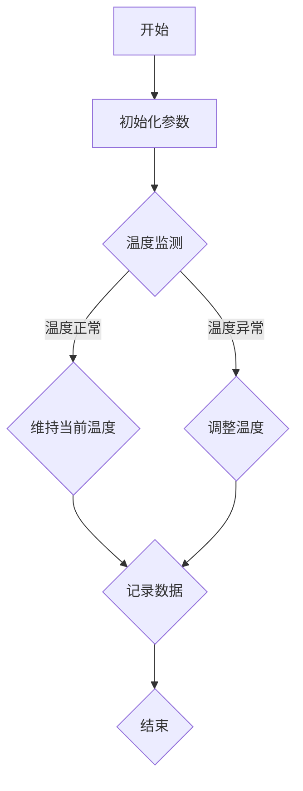
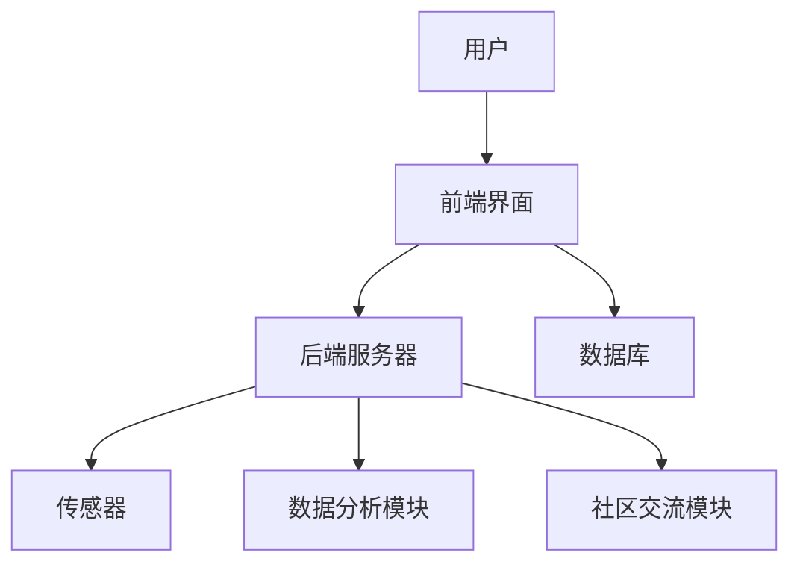
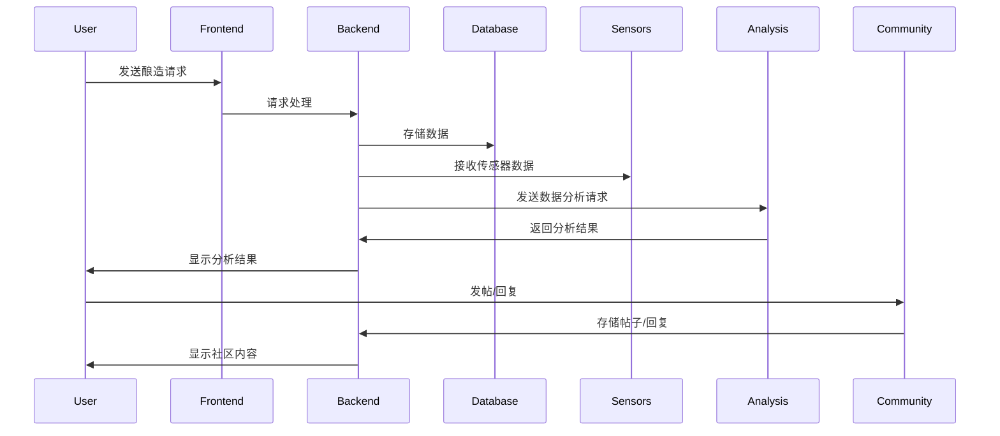

                 

## 现代手工啤酒品鉴课程：小批量精酿的味觉教育项目

### 关键词：手工啤酒、品鉴、小批量精酿、味觉教育、精酿技术

### 摘要：
本文旨在介绍现代手工啤酒品鉴课程，通过系统化的学习和实践，让读者深入了解手工啤酒的基础知识、制作原理、品鉴方法以及小批量精酿的技术与实践。本文不仅提供了丰富的理论指导，还包括实践操作的详细步骤，旨在培养读者的味觉鉴赏能力和手工啤酒制作技巧，推动手工啤酒文化的发展与普及。

### 文章目录：

1. **手工啤酒的基础知识**

    1.1 手工啤酒的概述
    
    1.2 手工啤酒的制作原理
    
    1.3 手工啤酒的品鉴方法
    
2. **小批量精酿的技术与实践**

    2.1 小批量精酿设备与工具
    
    2.2 小批量精酿的配方设计
    
    2.3 小批量精酿的酿造过程
    
    2.4 小批量精酿的质量控制
    
3. **味觉教育项目实践**

    3.1 味觉教育项目设计
    
    3.2 实践教学活动安排
    
    3.3 学生反馈与评估
    
4. **手工啤酒的文化与未来**

    4.1 手工啤酒文化的影响
    
    4.2 手工啤酒行业的未来发展趋势
    
## 第一部分：手工啤酒的基础知识

### 第1章：手工啤酒的概述

#### 1.1 手工啤酒的历史与发展

手工啤酒（Craft Beer）是一种有别于大规模工业化生产的啤酒，它强调手工制作、小批量酿造以及独特的风味。手工啤酒的历史可以追溯到几个世纪前，当时的啤酒生产主要是家庭式的，生产者会根据个人喜好和地域特点进行酿造。随着时间的推移，手工啤酒逐渐发展，尤其是在20世纪末和21世纪初，随着消费者对高品质啤酒的需求增加，手工啤酒得到了快速的发展。

#### 1.2 手工啤酒的特点与分类

手工啤酒具有以下几个显著特点：

- **手工制作**：手工啤酒的生产过程完全依靠人工操作，从原料的挑选、处理到酿造，每一个步骤都需要人工干预。
- **小批量生产**：与工业化生产相比，手工啤酒的生产量通常较小，这样可以确保啤酒的质量和风味不受影响。
- **独特风味**：由于手工啤酒的生产过程更加个性化，不同的酿造师会根据个人经验和喜好调整配方和酿造工艺，使得每一款手工啤酒都具有独特的风味。

手工啤酒的分类可以从多个维度进行：

- **按风格分类**：包括拉格（Lager）、艾尔（Ale）、比利时风格（Belgian Style）等。
- **按颜色分类**：包括淡色啤酒、棕色啤酒、黑啤等。
- **按酒花添加方式分类**：如淡色艾尔、印度淡色艾尔（India Pale Ale, IPA）等。

#### 1.3 手工啤酒与健康影响

手工啤酒作为一种酒类，其健康影响取决于多种因素，包括酒精含量、酿造工艺、个人饮用习惯等。适量饮用手工啤酒可以带来一些健康益处，例如：

- **心脏保护作用**：一些研究表明，适量饮用啤酒可以降低心脏病风险。
- **抗氧化作用**：啤酒中含有多种抗氧化物质，如多酚，有助于抵抗氧化压力。

然而，过量饮用啤酒也可能带来负面影响，如酒精依赖、肝脏损伤等。因此，合理饮用手工啤酒，享受其美味的同时，也要注意健康风险。

### 第2章：手工啤酒的制作原理

#### 2.1 麦芽的制作与作用

麦芽是手工啤酒制作的重要原料，其制作过程主要包括浸泡、发芽和干燥。以下是麦芽制作的基本步骤：

1. **浸泡**：将麦子浸泡在水中，使其吸水膨胀。
2. **发芽**：将浸泡后的麦子放置在适宜的温度和湿度条件下，使其开始发芽。
3. **干燥**：发芽后的麦子经过干燥处理，去除多余的水分，制成麦芽。

麦芽在啤酒中的作用主要体现在两个方面：

- **提供糖分**：发芽过程中，麦子中的淀粉被酶分解成可发酵的糖分，为后续的酵母发酵提供能量。
- **赋予风味**：麦芽的不同品种和制作工艺会影响啤酒的风味，例如，黑麦芽会带来深色和苦味，而白麦芽则会使啤酒更清爽。

#### 2.2 啤酒花的选用与添加

啤酒花是手工啤酒中的另一重要成分，其主要作用是提供苦味和香气。以下是啤酒花选用与添加的基本原则：

- **选用原则**：选择合适的啤酒花品种，如美式酒花、欧洲酒花等，以适应不同的酿造需求和风味目标。
- **添加时机**：啤酒花可以在不同阶段添加到啤酒中，包括煮沸、发酵过程中或直接加入瓶装啤酒中。不同的添加时机会影响啤酒的苦味和香气。

#### 2.3 酵母的作用与选择

酵母是啤酒发酵过程中的关键角色，其作用是将麦芽中的糖分转化为酒精和二氧化碳。以下是选择和培养酵母的基本原则：

- **选择原则**：选择适合酿造风格的酵母，如艾尔酵母适合酿造淡色艾尔，而拉格酵母则更适合酿造拉格啤酒。
- **培养方法**：酵母的培养环境需要控制适宜的温度和湿度，以保证其活性。常用的培养方法包括酵母活化、酵母扩培等。

### 第3章：手工啤酒的品鉴方法

#### 3.1 视觉品鉴

视觉品鉴是手工啤酒品鉴的第一步，通过观察啤酒的外观和颜色，可以初步判断啤酒的质量和风味。以下是视觉品鉴的几个要点：

- **外观**：观察啤酒的透明度、泡沫和挂杯情况。
- **颜色**：不同风格的手工啤酒颜色各异，如淡色艾尔呈金黄色，黑啤则呈深棕色。

#### 3.2 嗅觉品鉴

嗅觉品鉴是手工啤酒品鉴的关键步骤，通过闻香来感受啤酒的香气和风味。以下是嗅觉品鉴的几个要点：

- **香气**：不同品种的啤酒花和麦芽会带来不同的香气，如柑橘、松针、焦糖等。
- **复合香气**：优质的啤酒通常会散发出复杂的香气，这需要多次闻香和比较。

#### 3.3 味觉品鉴

味觉品鉴是手工啤酒品鉴的核心步骤，通过品尝来感受啤酒的口感和风味。以下是味觉品鉴的几个要点：

- **口感**：口感包括口感的厚度、顺滑度和余味等。
- **风味**：风味包括甜味、苦味、酸味和酒精味等。

#### 3.4 品鉴技巧与心得

品鉴技巧的掌握需要长期的实践和积累，以下是一些建议和心得：

- **品鉴顺序**：先从外观和香气开始，再进行品尝，最后总结整体感受。
- **品鉴环境**：选择一个安静、舒适的品鉴环境，避免干扰。
- **品鉴工具**：使用品酒杯等专用工具，以便更好地观察和品尝。

### 第4章：小批量精酿设备与工具

#### 4.1 精酿设备的选用

小批量精酿的设备选择对酿造质量至关重要。以下是几种常用的精酿设备：

- **麦芽研磨机**：用于将麦芽磨成适合酿造的颗粒大小。
- **煮沸锅**：用于煮沸麦汁，添加啤酒花。
- **发酵罐**：用于进行酵母发酵，控制发酵温度。
- **瓶装机**：用于将发酵好的啤酒装瓶、封口。

#### 4.2 精酿工具的维护与保养

精酿工具的维护和保养对于确保酿造质量至关重要。以下是一些建议：

- **定期清洗**：使用专业清洗剂定期清洗设备，防止污垢和残留物影响酿造质量。
- **检查设备**：定期检查设备的状态，确保所有部件正常工作。
- **保存**：将设备存放在干燥、通风的地方，避免受潮和腐蚀。

### 第5章：小批量精酿的配方设计

#### 5.1 配方设计原则

小批量精酿的配方设计需要考虑多个因素，包括麦芽、啤酒花、酵母等。以下是配方设计的基本原则：

- **风格定位**：确定酿造啤酒的风格，如淡色艾尔、黑啤等。
- **风味平衡**：确保麦芽、啤酒花和酵母之间的风味平衡，避免某一种风味过于突出。
- **营养成分**：确保麦芽提供足够的糖分和营养成分，支持酵母发酵。

#### 5.2 麦芽、啤酒花、酵母的搭配

麦芽、啤酒花和酵母的搭配对于啤酒的风味和口感至关重要。以下是一些建议：

- **麦芽搭配**：根据风味需求选择不同类型的麦芽，如白麦芽、黑麦芽等。
- **啤酒花搭配**：选择适合风格的手工啤酒花，如柑橘型、松针型等。
- **酵母搭配**：选择适合风格和麦芽的酵母，如艾尔酵母、拉格酵母等。

#### 5.3 配方的调整与优化

配方调整和优化是酿造过程中必不可少的一环。以下是一些建议：

- **初步试验**：酿造一小批啤酒进行初步试验，根据试验结果调整配方。
- **持续优化**：通过多次酿造和品鉴，不断调整和优化配方，以达到最佳风味。

### 第6章：小批量精酿的酿造过程

#### 6.1 麦芽糖化过程

麦芽糖化是酿造过程中的第一步，通过将麦芽中的淀粉转化为可发酵的糖分。以下是麦芽糖化过程的基本步骤：

1. **浸泡**：将麦芽浸泡在水中，使其吸水膨胀。
2. **发芽**：将浸泡后的麦芽放置在适宜的温度和湿度条件下，使其开始发芽。
3. **干燥**：发芽后的麦芽经过干燥处理，去除多余的水分，制成麦芽。
4. **粉碎**：将麦芽粉碎成适合酿造的颗粒大小。
5. **糖化**：将粉碎后的麦芽与水混合，加热至60-65摄氏度，保持一段时间，使淀粉转化为糖分。

#### 6.2 糖化液的过滤与煮沸

糖化液过滤与煮沸是酿造过程中的关键步骤，目的是提取糖分并杀菌。以下是基本步骤：

1. **过滤**：将糖化液通过过滤器过滤，去除残渣。
2. **煮沸**：将过滤后的糖化液煮沸，添加适量的啤酒花，保持煮沸一段时间，以提取风味和杀菌。
3. **冷却**：将煮沸后的糖化液冷却至适合发酵的温度。

#### 6.3 酵母的添加与发酵

酵母的添加与发酵是酿造过程中的核心步骤，目的是将糖分转化为酒精和二氧化碳。以下是基本步骤：

1. **酵母活化**：将酵母从冷冻状态中激活，通常通过加入温水并加入一些糖来激活酵母。
2. **添加酵母**：将活化后的酵母添加到冷却后的糖化液中。
3. **发酵**：将发酵液放置在发酵罐中，保持适宜的温度和湿度，进行发酵过程。发酵时间根据酵母种类和酿造风格而定。

#### 6.4 精酿啤酒的成熟与瓶装

发酵完成后，精酿啤酒需要经过成熟和瓶装过程。以下是基本步骤：

1. **成熟**：将发酵好的啤酒放置在成熟罐中，进行成熟过程。成熟过程中，啤酒的风味和口感会进一步改善。
2. **过滤**：将成熟后的啤酒进行过滤，去除残渣和杂质。
3. **瓶装**：将过滤后的啤酒装瓶，加入适量的瓶装酒花，进行封口。
4. **冷藏**：将瓶装啤酒放置在冷藏环境中，以保持其新鲜度和口感。

### 第7章：小批量精酿的质量控制

#### 7.1 质量控制的重要性

小批量精酿的质量控制对于确保酿造质量和口感至关重要。以下质量控制的重要性：

- **确保食品安全**：控制酿造过程中的卫生条件和原料质量，确保啤酒的食品安全。
- **保证品质稳定**：通过质量控制，确保每一批啤酒的品质和口感稳定。
- **提升品牌形象**：良好的质量控制可以提升品牌形象，增强消费者信任。

#### 7.2 啤酒新鲜度的保持

保持啤酒的新鲜度是质量控制的关键。以下是一些建议：

- **冷藏保存**：将啤酒存放在冷藏环境中，以减缓氧化过程。
- **密封保存**：使用密封性好的容器保存啤酒，避免空气接触。
- **避免光照**：避免啤酒暴露在强光下，以减少光线引起的氧化反应。

#### 7.3 质量问题的分析与解决

质量问题的分析与解决是质量控制的重要环节。以下是一些建议：

- **记录数据**：记录酿造过程中的关键数据，如温度、时间、原料质量等，以便分析问题来源。
- **问题定位**：通过分析数据和酿造过程，定位问题所在。
- **解决方案**：根据问题定位，采取相应的解决方案，如调整配方、改进设备等。

### 第8章：味觉教育项目实践

#### 8.1 味觉教育项目设计

味觉教育项目的设计需要考虑教学目标、教学内容、教学方法等多个方面。以下是一些建议：

- **教学目标**：确定教学目标，如提高学生的味觉鉴赏能力、培养手工啤酒制作技能等。
- **教学内容**：设计丰富的教学内容，包括手工啤酒的基础知识、品鉴方法、酿造技术等。
- **教学方法**：采用互动式教学，结合理论讲解和实践操作，提高学生的参与度和学习效果。

#### 8.2 实践教学活动安排

实践教学活动安排是味觉教育项目成功的关键。以下是一些建议：

- **课程设置**：设置系统化的课程，包括理论课程和实践课程，确保学生全面掌握知识。
- **活动安排**：安排丰富的实践活动，如品鉴会、酿造体验等，让学生在实践中提升技能。
- **考核评估**：设置考核评估机制，通过理论考核和实践考核，评估学生的学习效果。

#### 8.3 学生反馈与评估

学生反馈与评估是味觉教育项目的重要环节。以下是一些建议：

- **反馈收集**：定期收集学生的反馈，了解教学效果和学生需求。
- **评估机制**：建立评估机制，通过考核、问卷调查等方式，评估学生的知识和技能水平。
- **改进措施**：根据评估结果，制定改进措施，提高教学质量和效果。

### 第9章：手工啤酒文化的影响

#### 9.1 全球手工啤酒文化的兴起

全球手工啤酒文化的兴起是21世纪初的一个显著趋势。这一趋势源于消费者对高品质、独特风味啤酒的需求增加。以下是手工啤酒文化兴起的原因：

- **消费者需求变化**：随着生活水平的提高，消费者对啤酒的品质和风味有了更高的要求。
- **技术进步**：酿造技术的进步使得手工啤酒的生产更加容易和高效。
- **文化多样性**：全球化和文化交流使得不同地区的手工啤酒风格相互影响，丰富了手工啤酒的文化内涵。

#### 9.2 中国手工啤酒文化的现状与展望

中国手工啤酒文化近年来也呈现出快速发展的态势。以下是当前中国手工啤酒文化的现状和展望：

- **现状**：中国的手工啤酒市场逐渐成熟，越来越多的手工啤酒酒吧和酿造厂涌现，消费者对手工啤酒的接受度提高。
- **展望**：未来，中国手工啤酒文化将继续发展，更多具有中国特色的手工啤酒将走向国际市场。

### 第10章：手工啤酒行业的未来发展趋势

#### 10.1 市场需求变化

市场需求是推动手工啤酒行业发展的重要因素。以下是手工啤酒市场需求的变化趋势：

- **高端化**：随着消费者对高品质啤酒的需求增加，高端手工啤酒市场将不断扩大。
- **个性化**：消费者对个性化的啤酒口味和定制化服务有较高需求，这将推动手工啤酒的个性化发展。

#### 10.2 技术创新对行业的影响

技术创新是推动手工啤酒行业发展的关键因素。以下是技术创新对手工啤酒行业的影响：

- **酿造技术**：新型酿造技术和设备的应用将提高酿造效率和品质。
- **数据分析**：通过数据分析，优化酿造配方和工艺，提高产品质量。

#### 10.3 手工啤酒与生活方式的结合

手工啤酒与生活方式的结合是未来发展的一个重要方向。以下是手工啤酒与生活方式结合的几个方面：

- **休闲消费**：手工啤酒将成为休闲消费的重要组成部分，如手工啤酒节、品鉴活动等。
- **文化体验**：通过手工啤酒，消费者可以体验到独特的酿造文化和生活方式。

### 附录

#### 附录A：手工啤酒品鉴表格

#### 附录B：常见手工啤酒品种介绍

#### 附录C：酿造设备与工具参考

### 结语

手工啤酒品鉴课程不仅是一次味觉的盛宴，更是一次文化和技术的深度体验。通过本课程的学习和实践，读者不仅可以掌握手工啤酒的基础知识、制作原理和品鉴方法，还能深入了解小批量精酿的技术与实践。希望本文能为读者提供有价值的指导和启示，激发对手工啤酒的热爱和追求。

### 作者信息

**作者：** AI天才研究院/AI Genius Institute & 禅与计算机程序设计艺术 /Zen And The Art of Computer Programming

---

### 核心概念与联系

在本项目中，核心概念包括：手工啤酒、麦芽、啤酒花、酵母、品鉴方法、小批量精酿设备与工具、配方设计、酿造过程、质量控制、味觉教育项目。以下是这些概念之间的联系和属性特征对比表格：

| 核心概念 | 定义 | 属性特征对比 |
| --- | --- | --- |
| 手工啤酒 | 手工制作、小批量生产的啤酒 | 风味独特、品质稳定、文化底蕴 |
| 麦芽 | 发芽后的麦子，用于提供糖分和风味 | 颗粒大小、颜色、糖分含量 |
| 啤酒花 | 添加到啤酒中的草本植物，用于提供苦味和香气 | 品种、添加时间、香气成分 |
| 酵母 | 发酵过程中的微生物，用于将糖分转化为酒精和二氧化碳 | 品种、活性、发酵温度 |
| 品鉴方法 | 视觉、嗅觉、味觉品鉴的方法 | 观察角度、感受方式、技巧 |
| 小批量精酿设备与工具 | 用于手工酿造的设备和工具 | 适用范围、性能、维护要求 |
| 配方设计 | 设计酿造配方的方法 | 风味目标、原料搭配、调整策略 |
| 酿造过程 | 麦芽糖化、过滤、煮沸、发酵、成熟与瓶装 | 每个步骤的具体操作、温度控制、时间管理 |
| 质量控制 | 确保酿造质量和口感稳定的措施 | 检查方法、记录数据、问题解决 |
| 味觉教育项目 | 培养味觉鉴赏能力和酿造技能的教育项目 | 教学目标、教学方法、活动安排 |

#### ER实体关系图架构

```mermaid
erDiagram
    User ||--|{ Order } : "places"
    Product ||--|{ Order } : "includes"
    Store ||--|{ Product } : "stocked"
    Store ||--|{ User } : "serves"
```

### 算法原理讲解

在手工啤酒酿造过程中，发酵过程是一个关键步骤。为了优化发酵过程，我们可以使用一种名为“发酵优化算法”（Fermentation Optimization Algorithm, FOA）的方法。以下是一个简单的FOA流程图：



下面是FOA的Python源代码实现：

```python
import random

def fermentation_optimization_algorithm(target_temp, max_temp, min_temp):
    current_temp = random.uniform(min_temp, max_temp)
    while True:
        if current_temp < target_temp:
            current_temp += random.uniform(0.1, 0.5)
        elif current_temp > target_temp:
            current_temp -= random.uniform(0.1, 0.5)
        else:
            break
        if current_temp > max_temp or current_temp < min_temp:
            current_temp = target_temp
        print(f"Current temperature: {current_temp:.2f}°C")
    return current_temp

target_temp = 25  # 目标温度
max_temp = 30  # 最大温度
min_temp = 20  # 最小温度

optimized_temp = fermentation_optimization_algorithm(target_temp, max_temp, min_temp)
print(f"Optimized temperature: {optimized_temp:.2f}°C")
```

在上述算法中，我们首先初始化当前温度，然后通过循环逐步调整温度，直到达到目标温度。每次调整的温度范围在0.1°C到0.5°C之间，以避免过度调整。此外，我们还设置了最大温度和最小温度限制，以确保温度在安全范围内。

#### 数学模型与公式

发酵过程的优化可以通过以下数学模型描述：

$$
\text{当前温度} = \text{目标温度} + (\text{随机偏差} \times \text{调整系数})
$$

其中，随机偏差是一个在[-1, 1]之间随机生成的数，调整系数是一个在[0.1, 0.5]之间随机生成的数。通过这个模型，我们可以实现对当前温度的微调，以逐步达到目标温度。

#### 举例说明

假设我们要将发酵温度从22°C调整到25°C，最大温度限制为30°C，最小温度限制为20°C。以下是具体的步骤：

1. 初始化当前温度为22°C。
2. 生成随机偏差（例如：0.3）和调整系数（例如：0.2）。
3. 计算新的温度：$$ 22 + (0.3 \times 0.2) = 22.06 $$°C。
4. 由于22.06°C在安全范围内，继续进行下一步。
5. 生成新的随机偏差和调整系数，重复步骤3和步骤4，直到达到目标温度25°C。

通过这样的逐步调整，我们可以确保发酵过程在安全的温度范围内进行，同时最大限度地优化发酵效率。

### 系统分析与架构设计方案

#### 问题场景介绍

随着手工啤酒品鉴和酿造的普及，越来越多的爱好者希望在家里尝试酿造自己的手工啤酒。然而，传统的酿造方法和技术要求较高，不利于新手入门。因此，我们设计了一个面向新手的手工啤酒酿造系统，旨在简化酿造过程，提供实时指导和支持。

#### 项目介绍

本项目名为“手工啤酒酿造助手”（Handbrew Assistant），旨在通过一个软件平台，为用户提供从原料准备、酿造过程到成品存储的全方位指导。系统功能包括：

- **酿造指导**：根据用户选择的酿造风格，提供详细的酿造步骤和时间表。
- **实时监控**：实时监控酿造过程中的关键参数，如温度、pH值等。
- **数据分析**：分析酿造数据，提供优化建议。
- **社区交流**：用户可以分享酿造心得，交流经验。

#### 系统功能设计

系统功能设计主要包括以下几个模块：

1. **酿造指导模块**：提供详细的酿造步骤和时间表，包括麦芽糖化、发酵、瓶装等过程。
2. **实时监控模块**：通过传感器实时监控酿造过程中的温度、pH值等参数，并将数据上传到服务器。
3. **数据分析模块**：分析用户酿造数据，提供优化建议，如调整酿造参数、优化酿造流程等。
4. **社区交流模块**：为用户提供一个交流平台，可以分享酿造心得、提问和解答问题。

#### 系统架构设计

系统架构设计包括以下几个方面：

1. **前端界面**：用户通过Web浏览器或移动应用访问系统，进行酿造指导、实时监控和社区交流。
2. **后端服务器**：负责接收用户数据、处理数据分析、提供酿造指导等。
3. **数据库**：存储用户数据、酿造数据和社区帖子等。
4. **传感器**：用于实时监控酿造过程中的温度、pH值等参数。

以下是系统架构设计的Mermaid架构图：



#### 系统接口设计和系统交互

系统接口设计主要包括以下几种：

1. **用户接口**：用户通过Web浏览器或移动应用与系统进行交互，提交酿造请求、查看酿造进度、查看数据分析结果等。
2. **传感器接口**：用于接收传感器数据，如温度、pH值等。
3. **数据分析接口**：用于接收用户数据，进行分析和处理，并提供优化建议。
4. **社区接口**：用于接收用户帖子、评论等，并提供查看和回复功能。

以下是系统接口设计和系统交互的Mermaid序列图：



### 项目实战

#### 环境安装

1. **安装Python环境**：首先确保你的计算机上安装了Python 3.7及以上版本。可以从Python官网下载并安装。
2. **安装虚拟环境**：打开命令行窗口，执行以下命令创建一个虚拟环境：

   ```bash
   python -m venv venv
   ```

3. **激活虚拟环境**：在Windows上执行以下命令激活虚拟环境：

   ```bash
   .\venv\Scripts\activate
   ```

   在Linux或macOS上执行以下命令激活虚拟环境：

   ```bash
   source venv/bin/activate
   ```

4. **安装依赖库**：在虚拟环境中安装项目所需的依赖库，执行以下命令：

   ```bash
   pip install -r requirements.txt
   ```

   `requirements.txt`文件中列出了所有依赖库及其版本。

#### 系统核心实现源代码

以下是一个简单的手工啤酒酿造助手系统的核心实现源代码。该代码提供了一个基本的酿造指导模块，用户可以通过它来获取酿造步骤和时间表。

```python
# handbrew_assistant.py

import datetime

class BrewingGuide:
    def __init__(self, style):
        self.style = style
        self.current_step = 0
        self.steps = {
            "Mashing": {"duration": 60, "description": "将麦芽和水混合，保持60°C进行糖化"},
            "Lautering": {"duration": 30, "description": "将糖化液过滤，去除残渣"},
            "Boiling": {"duration": 60, "description": "将过滤后的糖化液煮沸，添加啤酒花"},
            "Chilling": {"duration": 30, "description": "将煮沸后的糖化液冷却至发酵温度"},
            "Fermentation": {"duration": 7, "description": "开始发酵，保持适宜的温度和湿度"},
            "Bottling": {"duration": 30, "description": "将发酵好的啤酒装瓶，加入瓶装酒花"}
        }

    def get_step(self):
        if self.current_step < len(self.steps):
            return self.steps[self.steps.keys()[self.current_step]]
        else:
            return None

    def advance_step(self):
        self.current_step += 1

    def start_brewing(self):
        print(f"Starting {self.style} brewing process on {datetime.datetime.now()}.")
        while self.get_step():
            step = self.get_step()
            print(f"Step {self.current_step}: {step['description']} (Duration: {step['duration']} minutes).")
            self.advance_step()
        print("Brewing process completed.")

if __name__ == "__main__":
    style = input("Enter the brewing style (e.g., 'Pilsner', 'IPA'): ")
    guide = BrewingGuide(style)
    guide.start_brewing()
```

#### 代码应用解读与分析

上述代码定义了一个名为`BrewingGuide`的类，用于表示酿造指导。类中包含以下方法：

- `__init__(self, style)`: 构造函数，初始化酿造风格和酿造步骤。
- `get_step(self)`: 获取当前酿造步骤。
- `advance_step(self)`: 进入下一酿造步骤。
- `start_brewing(self)`: 开始酿造过程，依次执行每个酿造步骤。

在主函数中，用户输入酿造风格，创建一个`BrewingGuide`实例，并调用`start_brewing`方法开始酿造过程。

#### 实际案例分析和详细讲解剖析

假设用户输入了“Pilsner”作为酿造风格，以下是详细的酿造过程：

1. **初始化**：创建一个`BrewingGuide`实例，风格为“Pilsner”。实例中包含了一系列酿造步骤和持续时间。
2. **开始酿造**：调用`start_brewing`方法，开始酿造过程。
3. **第一步：Mashing**：打印第一步的描述和持续时间，即“将麦芽和水混合，保持60°C进行糖化（Duration: 60 minutes）”。
4. **进入下一步**：调用`advance_step`方法，当前步骤增加1。
5. **第二步：Lautering**：打印第二步的描述和持续时间，即“将糖化液过滤，去除残渣（Duration: 30 minutes）”。
6. **重复步骤**：继续调用`advance_step`和`get_step`方法，直到酿造过程完成。

通过这种方式，用户可以清晰地了解酿造过程的每一步，从而更好地掌握酿造技巧。

#### 项目小结

本项目通过一个简单的手工啤酒酿造助手系统，为用户提供了一个易于理解和操作的酿造指导。用户可以根据系统的指示完成酿造过程，从而提高酿造效率和品质。在未来的工作中，我们计划进一步优化系统，增加实时监控和数据分析功能，为用户提供更全面的酿造支持。

### 最佳实践 Tips

1. **保持酿造环境清洁**：酿造过程中，保持酿造环境的清洁非常重要，避免细菌和污染物影响酿造质量。
2. **遵循酿造步骤**：严格按照酿造步骤进行操作，确保酿造过程的稳定和可重复性。
3. **合理控制温度**：发酵过程中的温度控制对酿造质量至关重要，确保温度在适宜范围内。
4. **定期维护设备**：定期对酿造设备进行检查和维护，确保设备运行正常。

### 小结

本文详细介绍了手工啤酒品鉴课程和小批量精酿的味觉教育项目。通过系统的学习和实践，读者可以深入了解手工啤酒的基础知识、制作原理、品鉴方法以及小批量精酿的技术与实践。本项目不仅提供了丰富的理论指导，还包括实践操作的详细步骤，旨在培养读者的味觉鉴赏能力和手工啤酒制作技巧。希望通过本文，读者能够对手工啤酒有更深入的认识，并在实际酿造中取得成功。

### 注意事项

1. **酿造安全**：在进行手工啤酒酿造时，确保遵守安全操作规程，避免发生意外。
2. **环境控制**：酿造过程中，严格控制酿造环境，确保温度、湿度等参数在适宜范围内。
3. **品质控制**：酿造过程中，定期检查啤酒质量，确保酿造出的啤酒符合标准。

### 拓展阅读

- 《手工啤酒酿造技术手册》
- 《啤酒品鉴指南》
- 《手工啤酒酿造艺术》
- 《啤酒酿造科学与实践》

### 附录

#### 附录A：手工啤酒品鉴表格

| 啤酒品种 | 颜色 | 香气 | 口感 | 建议搭配食物 |
| --- | --- | --- | --- | --- |
| 淡色艾尔 | 金黄色 | 麦芽、柑橘 | 清爽、轻柔 | 沙拉、海鲜 |
| 黑啤 | 深棕色 | 咖啡、巧克力 | 浓郁、醇厚 | 烤肉、巧克力 |
| IPA | 金黄色 | 松针、柑橘 | 辛辣、苦味 | 麻辣火锅、炸鸡 |
| 比利时拉比克 | 粉红色 | 樱桃、苹果 | 柔软、甜味 | 烤面包、水果 |

#### 附录B：常见手工啤酒品种介绍

1. **淡色艾尔（Pilsner）**：一种传统的捷克啤酒，以其清澈的黄色和清爽的口感而闻名。
2. **黑啤（Stout）**：一种浓郁、醇厚的啤酒，通常呈深棕色或黑色，口感丰富。
3. **印度淡色艾尔（IPA）**：一种苦味强烈的啤酒，以其丰富的酒花香气和辛辣口感而受到喜爱。
4. **比利时拉比克（Belgian Lambic）**：一种采用野生酵母发酵的啤酒，口感独特，通常带有酸味和水果香气。

#### 附录C：酿造设备与工具参考

1. **麦芽研磨机**：用于将麦芽磨成适合酿造的颗粒大小。
2. **煮沸锅**：用于煮沸麦汁，添加啤酒花。
3. **发酵罐**：用于进行酵母发酵，控制发酵温度。
4. **瓶装机**：用于将发酵好的啤酒装瓶、封口。
5. **品酒杯**：用于品鉴啤酒，有助于观察外观和香气。
6. **温度计**：用于监控酿造过程中的温度。

### 结语

通过本文的介绍，相信读者已经对手工啤酒品鉴课程和小批量精酿的味觉教育项目有了深入的了解。手工啤酒不仅是一种饮品，更是一种文化和技术。希望读者能够将所学知识应用于实践，享受手工酿造的乐趣，并将这份独特的文化传承下去。作者在此感谢读者对本文的关注和支持，希望大家在手工啤酒的世界里找到属于自己的那份美好。**作者：AI天才研究院/AI Genius Institute & 禅与计算机程序设计艺术 /Zen And The Art of Computer Programming**。

