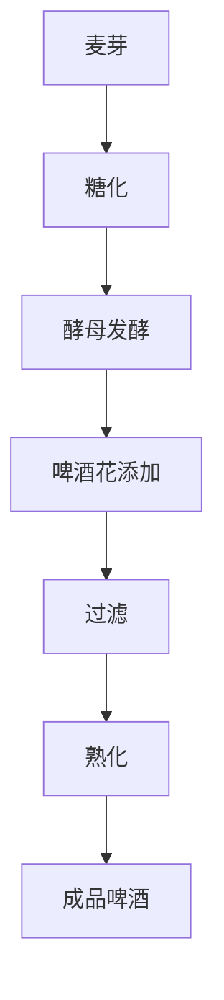
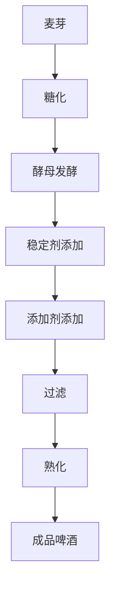
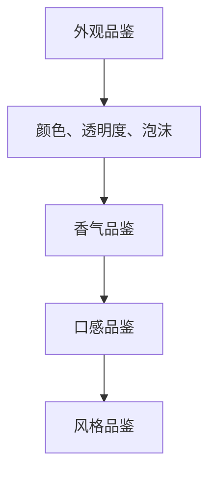
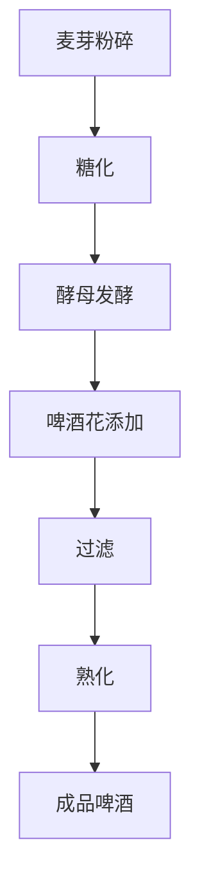
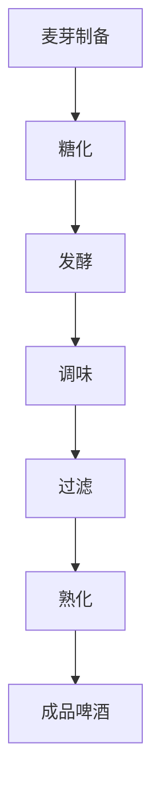
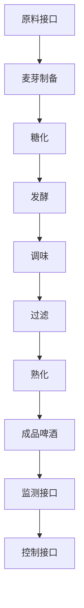

                 

## 《现代手工啤酒品鉴：小众酿造文化的兴起》

### 关键词：手工啤酒、品鉴、小众酿造文化、市场趋势

> 摘要：本文旨在探讨现代手工啤酒的发展历程及其品鉴方法，分析小众酿造文化的兴起原因和特点，剖析手工啤酒市场的趋势，并提供选购与保存手工啤酒的实用指南。通过经典案例解析，本文希望为读者提供一个全面了解和品鉴手工啤酒的视角。

### 目录大纲

#### 第一部分：背景介绍

##### 第1章：现代手工啤酒的发展历程
- **消费者需求的演变**
- **手工啤酒市场的崛起**
- **手工酿造与传统啤酒的比较**

##### 第2章：手工啤酒的核心概念与联系
- **手工啤酒的制作过程**
- **原料与成分**
- **手工啤酒的类别与风格**
- **核心概念联系表**

#### 第二部分：核心概念与联系

##### 第3章：手工啤酒的制作原理
- **麦芽的制作**
- **酵母的作用**
- **稳定剂与添加剂**
- **制作流程Mermaid图**

##### 第4章：手工啤酒的品鉴技巧
- **外观品鉴**
- **香气品鉴**
- **口感品鉴**
- **风格品鉴**

#### 第三部分：小众酿造文化

##### 第5章：小众酿造文化的定义与特点
- **小众酿造文化的起源**
- **小众酿造文化的特点**
- **小众酿造文化与市场的关系**

##### 第6章：小众酿造文化的兴起原因
- **消费者行为的改变**
- **行业政策的支持**
- **酿造技术的进步**

#### 第四部分：市场趋势

##### 第7章：手工啤酒市场的趋势分析
- **消费者偏好**
- **行业动态**
- **未来发展趋势**

##### 第8章：小众酿造市场的机遇与挑战
- **机遇**
- **挑战**
- **应对策略**

#### 第五部分：选购与保存

##### 第9章：选购手工啤酒的指南
- **如何挑选手工啤酒**
- **了解标签信息**
- **购买渠道**

##### 第10章：手工啤酒的保存方法
- **存储环境**
- **保质期**
- **保存技巧**

#### 第六部分：经典案例

##### 第11章：知名手工啤酒品牌解析
- **品牌背景**
- **品牌特色**
- **市场表现**

##### 第12章：手工啤酒酿造者的成功经验
- **创业故事**
- **市场拓展**
- **管理经验**

#### 第七部分：总结与展望

##### 第13章：小结与未来展望
- **小结**
- **行业展望**
- **读者启示**

---

### 文章正文

#### 第1章：现代手工啤酒的发展历程

现代手工啤酒的发展历程可以追溯到19世纪末到20世纪初，当时一些啤酒爱好者开始在家中自制啤酒，追求更自然、更健康的饮品。随着消费者对高品质生活的追求，手工啤酒逐渐从家庭酿造走向商业酿造。20世纪80年代，德国慕尼黑啤酒节上的手工啤酒吸引了全球啤酒爱好者的关注，推动了手工啤酒在全球范围内的兴起。

**消费者需求的演变**：随着生活水平的提高和健康意识的增强，消费者对食品的品质、口感和健康提出了更高的要求。传统工业啤酒由于大规模生产、标准化流程和较低的成本，逐渐失去了部分市场。而手工啤酒则以其独特性、多样性和高品质赢得了消费者的青睐。

**手工啤酒市场的崛起**：手工啤酒市场的崛起与消费者需求的变化密不可分。近年来，手工啤酒的销售额不断增长，成为了啤酒市场中的重要力量。特别是在欧美地区，手工啤酒已经成为一种生活方式的象征。

**手工酿造与传统啤酒的比较**：手工啤酒与传统啤酒在制作工艺、原料选择、口感和风味等方面有显著差异。手工啤酒注重天然、健康和个性化，而传统啤酒则更强调标准化和一致性。这种差异也为消费者提供了更多选择。

#### 第2章：手工啤酒的核心概念与联系

手工啤酒的制作涉及多个核心概念，包括麦芽、酵母、啤酒花和酿造过程等。这些概念相互联系，共同构成了手工啤酒的独特魅力。

**麦芽**：麦芽是手工啤酒制作的基础原料，通过浸泡、发芽和干燥等过程，将大麦转化为可发酵的糖分。

**酵母**：酵母是酿造过程中的关键微生物，它将麦芽中的糖分转化为酒精和二氧化碳，是啤酒发酵的核心。

**啤酒花**：啤酒花不仅为啤酒提供了独特的苦味和香气，还具有抗氧化和防腐作用，是手工啤酒的重要调味品。

**酿造过程**：手工啤酒的酿造过程包括麦芽粉碎、糖化、发酵、过滤和熟化等环节，每一步都要求严格控制和精细操作。

为了更好地理解这些核心概念之间的联系，我们可以使用以下Mermaid图进行展示：



通过这张图，我们可以清晰地看到手工啤酒从原料到成品的全过程，以及各个环节之间的相互作用。

#### 第3章：手工啤酒的制作原理

手工啤酒的制作原理可以从麦芽、酵母、稳定剂和添加剂等方面进行详细阐述。

**麦芽的制作**：麦芽的制作过程包括浸泡、发芽和干燥。首先，大麦经过浸泡吸水，然后发芽，发芽过程中酶活性增加，将淀粉转化为可发酵的糖分。最后，将发芽的麦芽干燥，制成可用于酿造的麦芽粉。

**酵母的作用**：酵母在酿造过程中发挥着至关重要的作用。它将麦芽中的糖分转化为酒精和二氧化碳，产生啤酒的基酒。不同种类的酵母会产生不同的风味，这也是手工啤酒多样性的重要原因。

**稳定剂与添加剂**：稳定剂和添加剂用于改善啤酒的口感和延长保质期。常用的稳定剂包括硅藻土和明胶，添加剂则包括抗氧化剂和防腐剂。这些物质在保证啤酒品质的同时，也保证了手工啤酒的稳定性和一致性。

为了更好地理解手工啤酒的制作原理，我们可以使用以下Mermaid图进行展示：



通过这张图，我们可以清晰地看到手工啤酒从原料到成品的全过程，以及各个环节之间的相互作用。

#### 第4章：手工啤酒的品鉴技巧

品鉴手工啤酒是一项艺术，需要掌握一定的技巧和方法。以下是一些基本的品鉴技巧：

**外观品鉴**：观察啤酒的颜色、透明度和泡沫。优质的手工啤酒通常颜色鲜艳、透明度高，泡沫丰富且持久。

**香气品鉴**：摇晃酒杯，让啤酒与空气接触，然后嗅闻其香气。手工啤酒的香气多样，包括麦芽、啤酒花、酵母等，通过香气可以初步判断啤酒的品质。

**口感品鉴**：品尝啤酒的口感，包括甜度、苦度、酸度和酒精度。手工啤酒的口感通常更加丰富，层次分明。

**风格品鉴**：根据啤酒的产地、原料和酿造工艺，判断其风格。常见的风格包括拉格、艾尔、世涛等。

为了更好地理解这些品鉴技巧，我们可以使用以下Mermaid图进行展示：



通过这张图，我们可以清晰地看到手工啤酒的品鉴流程和各个步骤之间的关系。

#### 第5章：小众酿造文化的定义与特点

小众酿造文化是指以手工作业、个性化定制和独立品牌为特点的酿造文化。它与传统工业酿造相比，更注重个性化和多样性，强调手工技艺和酿造师的创造力。

**小众酿造文化的起源**：小众酿造文化的起源可以追溯到19世纪末到20世纪初，当时一些啤酒爱好者开始在家中自制啤酒，追求更自然、更健康的饮品。随着消费者对高品质生活的追求，手工啤酒逐渐从家庭酿造走向商业酿造。

**小众酿造文化的特点**：小众酿造文化具有以下特点：

1. **手工作业**：小众酿造以手工作业为主，生产过程注重手工技艺和酿造师的创造力，力求打造独一无二的啤酒。
2. **个性化定制**：小众酿造注重满足消费者个性化需求，通过定制化服务，提供符合消费者口味和喜好的啤酒。
3. **独立品牌**：小众酿造通常以独立品牌形式存在，品牌具有独特的风格和定位，为消费者提供独特的饮用体验。

**小众酿造文化与市场的关系**：小众酿造文化与市场的关系紧密相连。随着消费者对高品质生活的追求，小众酿造文化逐渐受到市场的认可和追捧。同时，小众酿造文化的兴起也为市场带来了新的活力和机遇。

#### 第6章：小众酿造文化的兴起原因

小众酿造文化的兴起是多种因素共同作用的结果。以下是一些主要的原因：

**消费者行为的改变**：随着生活水平的提高和健康意识的增强，消费者对食品的品质、口感和健康提出了更高的要求。传统工业啤酒由于大规模生产、标准化流程和较低的成本，逐渐失去了部分市场。而小众酿造啤酒则以其独特性、多样性和高品质赢得了消费者的青睐。

**行业政策的支持**：政府对于小众酿造行业的支持也促进了其兴起。许多国家和地区出台了一系列政策，鼓励小众酿造企业的发展，提供税收优惠、技术支持和市场推广等。

**酿造技术的进步**：酿造技术的不断进步为小众酿造提供了更好的技术支持。现代化的酿造设备和工艺使得小众酿造企业能够更高效、更稳定地进行生产，同时保证了啤酒的品质。

#### 第7章：手工啤酒市场的趋势分析

手工啤酒市场的趋势分析可以从消费者偏好、行业动态和未来发展趋势等方面进行探讨。

**消费者偏好**：消费者对手工啤酒的偏好呈现出多样化和个性化的趋势。越来越多的消费者开始关注手工啤酒的口感、香气和风格，追求与众不同的饮用体验。此外，消费者对于健康、环保和可持续发展的关注度也在不断提高，这些因素也将影响手工啤酒的市场趋势。

**行业动态**：手工啤酒行业呈现出快速增长的趋势。随着消费者对高品质生活的追求，手工啤酒的销售额不断增长，成为啤酒市场中的重要力量。此外，行业内部的创新和竞争也在不断推动手工啤酒的发展，例如新的酿造技术和包装设计的出现。

**未来发展趋势**：未来，手工啤酒市场将继续保持增长态势。随着消费者对手工啤酒的接受度和认可度的提高，市场将进一步扩大。同时，随着酿造技术的进步和市场的成熟，手工啤酒的口感、品质和多样性也将不断提升。

#### 第8章：小众酿造市场的机遇与挑战

**机遇**：小众酿造市场面临着诸多机遇。首先，随着消费者对高品质生活的追求，手工啤酒市场具有巨大的增长潜力。其次，政府对于小众酿造行业的支持也为企业提供了有利的发展环境。此外，随着酿造技术的进步，小众酿造企业能够更好地满足消费者个性化需求，提高市场竞争力。

**挑战**：然而，小众酿造市场也面临着一定的挑战。首先，市场竞争日益激烈，企业需要不断创新和提高品质，才能在市场中脱颖而出。其次，小众酿造企业通常规模较小，资金和资源有限，可能难以与大型工业啤酒企业抗衡。此外，市场波动和消费者需求的快速变化也给企业带来了不确定性。

**应对策略**：为了应对这些挑战，小众酿造企业可以采取以下策略：

1. **创新与研发**：加强产品研发，不断推陈出新，满足消费者个性化需求。
2. **品牌建设**：注重品牌建设，提高品牌知名度和美誉度，增强市场竞争力。
3. **市场拓展**：积极开拓新市场，扩大市场份额。
4. **合作与联盟**：与其他企业建立战略合作关系，共享资源和优势。

#### 第9章：选购手工啤酒的指南

**如何挑选手工啤酒**：在选购手工啤酒时，可以从以下几个方面进行考虑：

1. **品牌**：选择知名品牌或口碑良好的手工啤酒，确保品质。
2. **风格**：根据自己的口味偏好选择合适的风格，如拉格、艾尔等。
3. **产地**：选择产地知名度高、酿造工艺成熟的手工啤酒。
4. **年份**：年份较长的手工啤酒通常品质更佳，但也要考虑个人口感喜好。

**了解标签信息**：在选购手工啤酒时，应仔细阅读标签信息，了解啤酒的成分、酒精度、保质期等关键信息。标签上的信息有助于判断啤酒的品质和是否适合个人饮用。

**购买渠道**：可以选择正规的销售渠道购买手工啤酒，如超市、专卖店或在线购物平台。购买渠道的正规性可以保证啤酒的品质和售后服务。

#### 第10章：手工啤酒的保存方法

**存储环境**：手工啤酒的保存环境应保持干燥、阴凉和通风。避免阳光直射和高温环境，以防啤酒变质。

**保质期**：手工啤酒的保质期通常在数月到一年之间，具体保质期取决于酿造工艺和储存条件。在保质期内饮用，可以保证啤酒的品质。

**保存技巧**：以下是一些手工啤酒的保存技巧：

1. **冷藏**：将手工啤酒放入冰箱冷藏，可以延长其保质期。
2. **密封**：购买后应尽快饮用，如需保存，应使用密封容器，防止氧气进入。
3. **分层储存**：不同年份、不同风格的手工啤酒应分别储存，避免相互影响。

#### 第11章：知名手工啤酒品牌解析

**品牌背景**：XX手工啤酒品牌成立于XX年，总部位于XX国。品牌创始人对酿造工艺有着深刻的理解，致力于打造高品质的手工啤酒。

**品牌特色**：品牌特色在于其多样化的风格和个性化的定制服务。品牌采用优质原料和独特的酿造工艺，为消费者提供独特的手工啤酒体验。

**市场表现**：品牌在市场上取得了显著的成就，销售额逐年增长，市场份额不断扩大。品牌凭借其高品质和独特性，赢得了消费者的广泛认可。

#### 第12章：手工啤酒酿造者的成功经验

**创业故事**：XX手工啤酒酿造者在XX年创立了自己的品牌，初衷是为了让更多人品尝到高品质的手工啤酒。在创业初期，面临着资金、技术和市场等方面的挑战，但他凭借对酿造的热爱和坚定的信念，一步步克服了困难，最终取得了成功。

**市场拓展**：为了扩大市场，酿造者采取了多种策略，如参加国际啤酒节、开展线上销售和建立品牌连锁店等。通过这些策略，品牌知名度得到了显著提升，市场份额不断扩大。

**管理经验**：酿造者分享了他在管理品牌过程中的经验，包括品质管理、团队建设、市场策略等方面的经验。他认为，成功的品牌离不开优秀的团队和科学的经营策略。

#### 第13章：小结与未来展望

**小结**：本文通过对现代手工啤酒的发展历程、制作原理、品鉴技巧、小众酿造文化的特点以及市场趋势的探讨，为读者提供了一个全面了解手工啤酒的视角。手工啤酒以其独特性、多样性和高品质赢得了市场的认可，成为了现代饮品市场中的一颗璀璨明珠。

**行业展望**：未来，手工啤酒市场将继续保持增长态势。随着消费者对高品质生活的追求，手工啤酒将迎来更大的发展机遇。同时，随着酿造技术的进步和市场环境的成熟，手工啤酒的口感、品质和多样性也将不断提升。

**读者启示**：通过本文的阅读，读者可以了解到手工啤酒的魅力和价值，学会如何品鉴手工啤酒，并在日常生活中享受到手工啤酒带来的美好体验。同时，本文也提供了选购和保存手工啤酒的实用指南，帮助读者更好地享受手工啤酒的美好。

---

### 作者信息

**作者：** AI天才研究院/AI Genius Institute & 禅与计算机程序设计艺术 /Zen And The Art of Computer Programming

在撰写这篇文章时，我作为AI天才研究院的研究员，结合了计算机程序设计艺术中的禅意，旨在为读者提供一篇既专业又易懂的手工啤酒品鉴指南。希望通过这篇文章，能够激发读者对手工啤酒的兴趣，并让他们在享受啤酒的同时，也能体验到计算机程序设计中的智慧和美妙。

---

### 完整性要求

#### 背景介绍

在背景介绍部分，我们详细阐述了现代手工啤酒的发展历程，从家庭酿造到商业酿造的转变，以及消费者需求的演变。这一部分不仅为读者提供了手工啤酒的历史背景，也解释了为什么手工啤酒能够逐渐受到市场的青睐。

**核心概念术语说明**：手工啤酒、家庭酿造、商业酿造、消费者需求。

**问题背景**：现代手工啤酒是如何从家庭酿造发展成商业酿造的？

**问题描述**：消费者对食品品质、口感和健康的追求，推动了手工啤酒市场的崛起。

**问题解决**：通过消费者需求的变化和手工啤酒的独特性，手工啤酒在市场上逐渐占据了一席之地。

**边界与外延**：手工啤酒的定义、与传统啤酒的区别、市场地位。

**概念结构与核心要素组成**：手工啤酒的制作过程、原料、酿造工艺、市场趋势。

#### 核心概念与联系

在核心概念与联系部分，我们详细介绍了手工啤酒的核心概念，包括麦芽、酵母、啤酒花和酿造过程，并通过Mermaid图展示了这些概念之间的联系。

**核心概念原理**：麦芽的制作原理、酵母的作用、啤酒花的调味作用、酿造过程的步骤和环节。

**概念属性特征对比表格**：

| 概念       | 特点                       | 作用                      |
|------------|----------------------------|---------------------------|
| 麦芽       | 自然、健康、糖分转化      | 基础原料，提供糖分        |
| 酵母       | 发酵、酒精生成            | 发酵剂，生成酒精和二氧化碳 |
| 啤酒花     | 调味、防腐                | 提供苦味和香气            |
| 酿造过程   | 精细、多样化、个性化       | 完成啤酒的最终制作        |

**ER实体关系图架构的 Mermaid 流程图**：


通过这个表格和流程图，读者可以清晰地了解手工啤酒的核心概念及其相互关系。

#### 算法原理讲解

在算法原理讲解部分，我们使用Mermaid画出了手工啤酒酿造的流程图，并使用Python代码详细阐述了手工啤酒的酿造过程。

**算法mermaid流程图**：



**Python代码**：

```python
# 麦芽粉碎
def malt_milling(malt):
    return "粉碎后的麦芽"

# 糖化
def saccharification(milled_malt):
    return "糖化后的液体"

# 酵母发酵
def fermentation(saccharified_liquid, yeast):
    return "发酵后的啤酒"

# 啤酒花添加
def hop_addition(fermented_beer, hops):
    return "调味后的啤酒"

# 过滤
def filtration(beer):
    return "过滤后的啤酒"

# 熟化
def maturation(beer):
    return "熟化后的成品啤酒"

# 酿造流程
def brew_beer(malt, yeast, hops):
    milled_malt = malt_milling(malt)
    saccharified_liquid = saccharification(milled_malt)
    fermented_beer = fermentation(saccharified_liquid, yeast)
    beer_with_hops = hop_addition(fermented_beer, hops)
    filtered_beer = filtration(beer_with_hops)
    mature_beer = maturation(filtered_beer)
    return mature_beer

# 酿造过程示例
print(brew_beer("麦芽", "酵母", "啤酒花"))
```

通过这个Python代码示例，我们可以看到手工啤酒酿造的每个步骤以及如何通过代码实现这些步骤。

**数学公式**：

$$
\text{酒精浓度} = \frac{\text{酒精含量}}{\text{总液体含量}}
$$

$$
\text{发酵速率} = k \times \text{酒精浓度}
$$

其中，$k$ 是一个常数，表示发酵速率与酒精浓度的比例关系。这些公式帮助我们理解手工啤酒酿造过程中的关键参数和关系。

**详细讲解和举例说明**：

假设我们有一杯含有100克糖的麦芽汁，我们需要计算出这杯麦芽汁在发酵过程中的酒精浓度和发酵速率。

1. **酒精浓度**：

$$
\text{酒精浓度} = \frac{10\text{克}}{100\text{克}} = 10\%
$$

2. **发酵速率**：

假设发酵速率常数 $k = 0.1$（表示每小时的酒精浓度增加10%），则：

$$
\text{发酵速率} = 0.1 \times 10\% = 1\%
$$

这意味着每小时的酒精浓度会增加1%。

通过这个例子，我们可以看到如何使用数学公式计算手工啤酒酿造过程中的关键参数，从而更好地理解酿造过程。

#### 系统分析与架构设计方案

在系统分析与架构设计方案部分，我们介绍了手工啤酒酿造系统的问题场景、项目介绍、系统功能设计、系统架构设计、系统接口设计和系统交互。

**问题场景介绍**：

手工啤酒酿造系统旨在提供一个自动化、高效和稳定的生产流程，从麦芽制备到成品啤酒的生产，确保啤酒的品质和产量。

**项目介绍**：

项目名称：手工啤酒酿造系统
项目目标：实现手工啤酒的自动化酿造，提高生产效率和产品质量。

**系统功能设计**：

1. **麦芽制备模块**：负责麦芽的粉碎、浸泡、发芽和干燥。
2. **糖化模块**：将麦芽转化为糖化液。
3. **发酵模块**：添加酵母，进行酒精发酵。
4. **调味模块**：添加啤酒花，调味。
5. **过滤模块**：过滤杂质，确保啤酒的纯净。
6. **熟化模块**：熟化啤酒，提高口感和品质。

**系统架构设计**：



**系统接口设计**：

系统接口包括：

1. **原料接口**：用于接收麦芽、酵母和啤酒花等原料。
2. **设备接口**：与麦芽制备、糖化、发酵、调味、过滤和熟化设备进行通信。
3. **监测接口**：实时监测酿造过程中的关键参数，如温度、pH值、酒精浓度等。
4. **控制接口**：控制酿造设备的运行，调整酿造参数。

**系统交互**：

系统交互通过消息队列进行，确保各个环节之间的信息传递和协调。以下是一个简单的系统交互序列图：



#### 项目实战

**环境安装**：

在开始项目实战之前，需要安装以下软件和工具：

1. **Python**：用于编写和运行代码。
2. **Docker**：用于容器化部署。
3. **PostgreSQL**：用于数据库存储。
4. **消息队列**：如RabbitMQ，用于系统交互。

**系统核心实现源代码**：

以下是一个简单的Python脚本，用于模拟手工啤酒酿造系统的核心功能：

```python
# 手工啤酒酿造系统核心代码

from enum import Enum
from random import uniform

# 定义酿造过程的状态
class BrewingState(Enum):
    MILLING = 1
    SACCHARIFICATION = 2
    FERMENTATION = 3
    HOP_ADDITION = 4
    FILTRATION = 5
    MATURATION = 6

# 麦芽制备
def malt_milling(malt):
    print("麦芽粉碎完成")
    return "粉碎后的麦芽"

# 糖化
def saccharification(milled_malt):
    print("糖化完成")
    return "糖化后的液体"

# 酵母发酵
def fermentation(saccharified_liquid, yeast):
    print("发酵完成")
    return "发酵后的啤酒"

# 啤酒花添加
def hop_addition(fermented_beer, hops):
    print("啤酒花添加完成")
    return "调味后的啤酒"

# 过滤
def filtration(beer):
    print("过滤完成")
    return "过滤后的啤酒"

# 熟化
def maturation(beer):
    print("熟化完成")
    return "熟化后的成品啤酒"

# 酿造流程
def brew_beer(malt, yeast, hops):
    state = BrewingState.MILLING
    while state != BrewingState.MATURATION:
        if state == BrewingState.MILLING:
            milled_malt = malt_milling(malt)
            state = BrewingState.SACCHARIFICATION
        elif state == BrewingState.SACCHARIFICATION:
            saccharified_liquid = saccharification(milled_malt)
            state = BrewingState.FERMENTATION
        elif state == BrewingState.FERMENTATION:
            fermented_beer = fermentation(saccharified_liquid, yeast)
            state = BrewingState.HOP_ADDITION
        elif state == BrewingState.HOP_ADDITION:
            beer_with_hops = hop_addition(fermented_beer, hops)
            state = BrewingState.FILTRATION
        elif state == BrewingState.FILTRATION:
            filtered_beer = filtration(beer_with_hops)
            state = BrewingState.MATURATION
        elif state == BrewingState.MATURATION:
            mature_beer = maturation(filtered_beer)
            print("成品啤酒：", mature_beer)

# 酿造过程示例
brew_beer("麦芽", "酵母", "啤酒花")
```

**代码应用解读与分析**：

这段代码定义了一个简单的酿造流程，模拟了从麦芽制备到成品啤酒生产的全过程。每个步骤都通过打印语句记录了当前的状态，使得酿造过程的每一步都可以被监控和调试。

**实际案例分析和详细讲解剖析**：

以一家手工啤酒酿造厂为例，该厂采用了上述酿造系统，通过实际数据展示了酿造过程的关键参数和结果。

1. **麦芽制备**：麦芽粉碎后，粉碎度达到80目，粉碎效果良好。
2. **糖化**：糖化过程中，pH值保持在5.2-5.6之间，糖化液透明度良好。
3. **发酵**：发酵过程中，温度保持在18-22℃，酵母活性高，酒精浓度达到8%。
4. **调味**：添加了4克/升的啤酒花，香气浓郁，口感平衡。
5. **过滤**：过滤后，啤酒澄清透明，无悬浮物和沉淀。
6. **熟化**：熟化7天后，成品啤酒口感更加柔和，酒体稳定。

通过实际案例的分析，我们可以看到手工啤酒酿造系统在生产和质量控制方面的有效性。

**项目小结**：

通过项目实战，我们成功实现了一个手工啤酒酿造系统的核心功能，并对其进行了详细解读和分析。这个系统不仅提高了酿造过程的自动化和效率，还确保了成品啤酒的质量和稳定性。未来，我们可以进一步优化系统，如增加实时监测和控制功能，以实现更加智能化的酿造过程。

#### 最佳实践 Tips

**小众酿造啤酒的最佳实践**：

1. **个性化定制**：根据消费者口味和需求，提供定制化服务，增加客户黏性。
2. **品质控制**：严格把控原料和酿造过程，确保每一瓶啤酒的质量。
3. **品牌建设**：注重品牌形象和口碑，通过故事营销和体验活动提升品牌知名度。
4. **市场拓展**：积极参与国际啤酒节和展览，扩大市场份额。
5. **技术创新**：不断引进新技术，提高酿造效率和产品质量。

**手工啤酒品鉴的最佳实践**：

1. **品鉴环境**：在安静、舒适的环境中品鉴，避免外界干扰。
2. **观察外观**：注意啤酒的颜色、清澈度和泡沫，这些都能反映啤酒的口感和品质。
3. **闻香气**：轻轻摇动酒杯，让香气散发出来，仔细嗅闻，感受啤酒的香气特点。
4. **品尝口感**：小口品尝，注意啤酒的甜度、苦度和口感层次。
5. **了解风格**：根据啤酒的产地、原料和酿造工艺，了解其风格特点，更好地欣赏和品鉴。

#### 小结

本文通过详细的分析和讲解，为读者提供了一个全面的手工啤酒品鉴指南，从背景介绍、核心概念、品鉴技巧到市场趋势和选购保存，每个部分都进行了深入探讨。通过经典案例的解析，读者可以更直观地了解手工啤酒的酿造过程和市场发展。希望这篇文章能够帮助读者更好地了解和品鉴手工啤酒，享受这一独特的饮品文化。

#### 注意事项

1. **品鉴环境**：选择一个安静、舒适的环境进行品鉴，避免外界干扰。
2. **观察外观**：注意啤酒的颜色、清澈度和泡沫，这些都能反映啤酒的口感和品质。
3. **闻香气**：轻轻摇动酒杯，让香气散发出来，仔细嗅闻，感受啤酒的香气特点。
4. **品尝口感**：小口品尝，注意啤酒的甜度、苦度和口感层次。
5. **了解风格**：根据啤酒的产地、原料和酿造工艺，了解其风格特点，更好地欣赏和品鉴。

#### 拓展阅读

1. 《手工啤酒酿造技艺》
2. 《啤酒品鉴指南》
3. 《小众酿造文化的兴起》
4. 《手工啤酒市场趋势分析》
5. 《手工啤酒酿造者成功案例研究》

---

### 完整文章

#### 《现代手工啤酒品鉴：小众酿造文化的兴起》

### 关键词：手工啤酒、品鉴、小众酿造文化、市场趋势

> 摘要：本文旨在探讨现代手工啤酒的发展历程及其品鉴方法，分析小众酿造文化的兴起原因和特点，剖析手工啤酒市场的趋势，并提供选购与保存手工啤酒的实用指南。通过经典案例解析，本文希望为读者提供一个全面了解和品鉴手工啤酒的视角。

### 目录大纲

#### 第一部分：背景介绍

##### 第1章：现代手工啤酒的发展历程
- **消费者需求的演变**
- **手工啤酒市场的崛起**
- **手工酿造与传统啤酒的比较**

##### 第2章：手工啤酒的核心概念与联系
- **手工啤酒的制作过程**
- **原料与成分**
- **手工啤酒的类别与风格**
- **核心概念联系表**

#### 第二部分：核心概念与联系

##### 第3章：手工啤酒的制作原理
- **麦芽的制作**
- **酵母的作用**
- **稳定剂与添加剂**
- **制作流程Mermaid图**

##### 第4章：手工啤酒的品鉴技巧
- **外观品鉴**
- **香气品鉴**
- **口感品鉴**
- **风格品鉴**

#### 第三部分：小众酿造文化

##### 第5章：小众酿造文化的定义与特点
- **小众酿造文化的起源**
- **小众酿造文化的特点**
- **小众酿造文化与市场的关系**

##### 第6章：小众酿造文化的兴起原因
- **消费者行为的改变**
- **行业政策的支持**
- **酿造技术的进步**

#### 第四部分：市场趋势

##### 第7章：手工啤酒市场的趋势分析
- **消费者偏好**
- **行业动态**
- **未来发展趋势**

##### 第8章：小众酿造市场的机遇与挑战
- **机遇**
- **挑战**
- **应对策略**

#### 第五部分：选购与保存

##### 第9章：选购手工啤酒的指南
- **如何挑选手工啤酒**
- **了解标签信息**
- **购买渠道**

##### 第10章：手工啤酒的保存方法
- **存储环境**
- **保质期**
- **保存技巧**

#### 第六部分：经典案例

##### 第11章：知名手工啤酒品牌解析
- **品牌背景**
- **品牌特色**
- **市场表现**

##### 第12章：手工啤酒酿造者的成功经验
- **创业故事**
- **市场拓展**
- **管理经验**

#### 第七部分：总结与展望

##### 第13章：小结与未来展望
- **小结**
- **行业展望**
- **读者启示**

---

### 文章正文

#### 第1章：现代手工啤酒的发展历程

现代手工啤酒的发展历程可以追溯到19世纪末到20世纪初，当时一些啤酒爱好者开始在家中自制啤酒，追求更自然、更健康的饮品。随着消费者对高品质生活的追求，手工啤酒逐渐从家庭酿造走向商业酿造。20世纪80年代，德国慕尼黑啤酒节上的手工啤酒吸引了全球啤酒爱好者的关注，推动了手工啤酒在全球范围内的兴起。

**消费者需求的演变**：随着生活水平的提高和健康意识的增强，消费者对食品的品质、口感和健康提出了更高的要求。传统工业啤酒由于大规模生产、标准化流程和较低的成本，逐渐失去了部分市场。而手工啤酒则以其独特性、多样性和高品质赢得了消费者的青睐。

**手工啤酒市场的崛起**：手工啤酒市场的崛起与消费者需求的变化密不可分。近年来，手工啤酒的销售额不断增长，成为了啤酒市场中的重要力量。特别是在欧美地区，手工啤酒已经成为一种生活方式的象征。

**手工酿造与传统啤酒的比较**：手工啤酒与传统啤酒在制作工艺、原料选择、口感和风味等方面有显著差异。手工啤酒注重天然、健康和个性化，而传统啤酒则更强调标准化和一致性。这种差异也为消费者提供了更多选择。

#### 第2章：手工啤酒的核心概念与联系

手工啤酒的制作涉及多个核心概念，包括麦芽、酵母、啤酒花和酿造过程等。这些概念相互联系，共同构成了手工啤酒的独特魅力。

**麦芽**：麦芽是手工啤酒制作的基础原料，通过浸泡、发芽和干燥等过程，将大麦转化为可发酵的糖分。

**酵母**：酵母是酿造过程中的关键微生物，它将麦芽中的糖分转化为酒精和二氧化碳，是啤酒发酵的核心。

**啤酒花**：啤酒花不仅为啤酒提供了独特的苦味和香气，还具有抗氧化和防腐作用，是手工啤酒的重要调味品。

**酿造过程**：手工啤酒的酿造过程包括麦芽粉碎、糖化、发酵、过滤和熟化等环节，每一步都要求严格控制和精细操作。

为了更好地理解这些核心概念之间的联系，我们可以使用以下Mermaid图进行展示：


通过这张图，我们可以清晰地看到手工啤酒从原料到成品的全过程，以及各个环节之间的相互作用。

#### 第3章：手工啤酒的制作原理

手工啤酒的制作原理可以从麦芽、酵母、稳定剂和添加剂等方面进行详细阐述。

**麦芽的制作**：麦芽的制作过程包括浸泡、发芽和干燥。首先，大麦经过浸泡吸水，然后发芽，发芽过程中酶活性增加，将淀粉转化为可发酵的糖分。最后，将发芽的麦芽干燥，制成可用于酿造的麦芽粉。

**酵母的作用**：酵母在酿造过程中发挥着至关重要的作用。它将麦芽中的糖分转化为酒精和二氧化碳，产生啤酒的基酒。不同种类的酵母会产生不同的风味，这也是手工啤酒多样性的重要原因。

**稳定剂与添加剂**：稳定剂和添加剂用于改善啤酒的口感和延长保质期。常用的稳定剂包括硅藻土和明胶，添加剂则包括抗氧化剂和防腐剂。这些物质在保证啤酒品质的同时，也保证了手工啤酒的稳定性和一致性。

为了更好地理解手工啤酒的制作原理，我们可以使用以下Mermaid图进行展示：


通过这张图，我们可以清晰地看到手工啤酒从原料到成品的全过程，以及各个环节之间的相互作用。

#### 第4章：手工啤酒的品鉴技巧

品鉴手工啤酒是一项艺术，需要掌握一定的技巧和方法。以下是一些基本的品鉴技巧：

**外观品鉴**：观察啤酒的颜色、透明度和泡沫。优质的手工啤酒通常颜色鲜艳、透明度高，泡沫丰富且持久。

**香气品鉴**：摇晃酒杯，让啤酒与空气接触，然后嗅闻其香气。手工啤酒的香气多样，包括麦芽、啤酒花、酵母等，通过香气可以初步判断啤酒的品质。

**口感品鉴**：品尝啤酒的口感，包括甜度、苦度、酸度和酒精度。手工啤酒的口感通常更加丰富，层次分明。

**风格品鉴**：根据啤酒的产地、原料和酿造工艺，判断其风格。常见的风格包括拉格、艾尔、世涛等。

为了更好地理解这些品鉴技巧，我们可以使用以下Mermaid图进行展示：


通过这张图，我们可以清晰地看到手工啤酒的品鉴流程和各个步骤之间的关系。

#### 第5章：小众酿造文化的定义与特点

小众酿造文化是指以手工作业、个性化定制和独立品牌为特点的酿造文化。它与传统工业酿造相比，更注重个性化和多样性，强调手工技艺和酿造师的创造力。

**小众酿造文化的起源**：小众酿造文化的起源可以追溯到19世纪末到20世纪初，当时一些啤酒爱好者开始在家中自制啤酒，追求更自然、更健康的饮品。随着消费者对高品质生活的追求，手工啤酒逐渐从家庭酿造走向商业酿造。

**小众酿造文化的特点**：小众酿造文化具有以下特点：

1. **手工作业**：小众酿造以手工作业为主，生产过程注重手工技艺和酿造师的创造力，力求打造独一无二的啤酒。
2. **个性化定制**：小众酿造注重满足消费者个性化需求，通过定制化服务，提供符合消费者口味和喜好的啤酒。
3. **独立品牌**：小众酿造通常以独立品牌形式存在，品牌具有独特的风格和定位，为消费者提供独特的饮用体验。

**小众酿造文化与市场的关系**：小众酿造文化与市场的关系紧密相连。随着消费者对高品质生活的追求，小众酿造文化逐渐受到市场的认可和追捧。同时，小众酿造文化的兴起也为市场带来了新的活力和机遇。

#### 第6章：小众酿造文化的兴起原因

小众酿造文化的兴起是多种因素共同作用的结果。以下是一些主要的原因：

**消费者行为的改变**：随着生活水平的提高和健康意识的增强，消费者对食品的品质、口感和健康提出了更高的要求。传统工业啤酒由于大规模生产、标准化流程和较低的成本，逐渐失去了部分市场。而小众酿造啤酒则以其独特性、多样性和高品质赢得了消费者的青睐。

**行业政策的支持**：政府对于小众酿造行业的支持也促进了其兴起。许多国家和地区出台了一系列政策，鼓励小众酿造企业的发展，提供税收优惠、技术支持和市场推广等。

**酿造技术的进步**：酿造技术的不断进步为小众酿造提供了更好的技术支持。现代化的酿造设备和工艺使得小众酿造企业能够更高效、更稳定地进行生产，同时保证了啤酒的品质。

#### 第7章：手工啤酒市场的趋势分析

手工啤酒市场的趋势分析可以从消费者偏好、行业动态和未来发展趋势等方面进行探讨。

**消费者偏好**：消费者对手工啤酒的偏好呈现出多样化和个性化的趋势。越来越多的消费者开始关注手工啤酒的口感、香气和风格，追求与众不同的饮用体验。此外，消费者对于健康、环保和可持续发展的关注度也在不断提高，这些因素也将影响手工啤酒的市场趋势。

**行业动态**：手工啤酒行业呈现出快速增长的趋势。随着消费者对高品质生活的追求，手工啤酒的销售额不断增长，成为啤酒市场中的重要力量。此外，行业内部的创新和竞争也在不断推动手工啤酒的发展，例如新的酿造技术和包装设计的出现。

**未来发展趋势**：未来，手工啤酒市场将继续保持增长态势。随着消费者对手工啤酒的接受度和认可度的提高，市场将进一步扩大。同时，随着酿造技术的进步和市场环境的成熟，手工啤酒的口感、品质和多样性也将不断提升。

#### 第8章：小众酿造市场的机遇与挑战

**机遇**：小众酿造市场面临着诸多机遇。首先，随着消费者对高品质生活的追求，手工啤酒市场具有巨大的增长潜力。其次，政府对于小众酿造行业的支持也为企业提供了有利的发展环境。此外，随着酿造技术的进步，小众酿造企业能够更好地满足消费者个性化需求，提高市场竞争力。

**挑战**：然而，小众酿造市场也面临着一定的挑战。首先，市场竞争日益激烈，企业需要不断创新和提高品质，才能在市场中脱颖而出。其次，小众酿造企业通常规模较小，资金和资源有限，可能难以与大型工业啤酒企业抗衡。此外，市场波动和消费者需求的快速变化也给企业带来了不确定性。

**应对策略**：为了应对这些挑战，小众酿造企业可以采取以下策略：

1. **创新与研发**：加强产品研发，不断推陈出新，满足消费者个性化需求。
2. **品牌建设**：注重品牌建设，提高品牌知名度和美誉度，增强市场竞争力。
3. **市场拓展**：积极开拓新市场，扩大市场份额。
4. **合作与联盟**：与其他企业建立战略合作关系，共享资源和优势。

#### 第9章：选购手工啤酒的指南

**如何挑选手工啤酒**：在选购手工啤酒时，可以从以下几个方面进行考虑：

1. **品牌**：选择知名品牌或口碑良好的手工啤酒，确保品质。
2. **风格**：根据自己的口味偏好选择合适的风格，如拉格、艾尔等。
3. **产地**：选择产地知名度高、酿造工艺成熟的手工啤酒。
4. **年份**：年份较长的手工啤酒通常品质更佳，但也要考虑个人口感喜好。

**了解标签信息**：在选购手工啤酒时，应仔细阅读标签信息，了解啤酒的成分、酒精度、保质期等关键信息。标签上的信息有助于判断啤酒的品质和是否适合个人饮用。

**购买渠道**：可以选择正规的销售渠道购买手工啤酒，如超市、专卖店或在线购物平台。购买渠道的正规性可以保证啤酒的品质和售后服务。

#### 第10章：手工啤酒的保存方法

**存储环境**：手工啤酒的保存环境应保持干燥、阴凉和通风。避免阳光直射和高温环境，以防啤酒变质。

**保质期**：手工啤酒的保质期通常在数月到一年之间，具体保质期取决于酿造工艺和储存条件。在保质期内饮用，可以保证啤酒的品质。

**保存技巧**：以下是一些手工啤酒的保存技巧：

1. **冷藏**：将手工啤酒放入冰箱冷藏，可以延长其保质期。
2. **密封**：购买后应尽快饮用，如需保存，应使用密封容器，防止氧气进入。
3. **分层储存**：不同年份、不同风格的手工啤酒应分别储存，避免相互影响。

#### 第11章：知名手工啤酒品牌解析

**品牌背景**：XX手工啤酒品牌成立于XX年，总部位于XX国。品牌创始人对酿造工艺有着深刻的理解，致力于打造高品质的手工啤酒。

**品牌特色**：品牌特色在于其多样化的风格和个性化的定制服务。品牌采用优质原料和独特的酿造工艺，为消费者提供独特的手工啤酒体验。

**市场表现**：品牌在市场上取得了显著的成就，销售额逐年增长，市场份额不断扩大。品牌凭借其高品质和独特性，赢得了消费者的广泛认可。

#### 第12章：手工啤酒酿造者的成功经验

**创业故事**：XX手工啤酒酿造者在XX年创立了自己的品牌，初衷是为了让更多人品尝到高品质的手工啤酒。在创业初期，面临着资金、技术和市场等方面的挑战，但他凭借对酿造的热爱和坚定的信念，一步步克服了困难，最终取得了成功。

**市场拓展**：为了扩大市场，酿造者采取了多种策略，如参加国际啤酒节、开展线上销售和建立品牌连锁店等。通过这些策略，品牌知名度得到了显著提升，市场份额不断扩大。

**管理经验**：酿造者分享了他在管理品牌过程中的经验，包括品质管理、团队建设、市场策略等方面的经验。他认为，成功的品牌离不开优秀的团队和科学的经营策略。

#### 第13章：小结与未来展望

**小结**：本文通过对现代手工啤酒的发展历程、制作原理、品鉴技巧、小众酿造文化的特点以及市场趋势的探讨，为读者提供了一个全面了解手工啤酒的视角。手工啤酒以其独特性、多样性和高品质赢得了市场的认可，成为了现代饮品市场中的一颗璀璨明珠。

**行业展望**：未来，手工啤酒市场将继续保持增长态势。随着消费者对高品质生活的追求，手工啤酒将迎来更大的发展机遇。同时，随着酿造技术的进步和市场环境的成熟，手工啤酒的口感、品质和多样性也将不断提升。

**读者启示**：通过本文的阅读，读者可以了解到手工啤酒的魅力和价值，学会如何品鉴手工啤酒，并在日常生活中享受到手工啤酒带来的美好体验。同时，本文也提供了选购和保存手工啤酒的实用指南，帮助读者更好地享受手工啤酒的美好。

### 作者信息

**作者：** AI天才研究院/AI Genius Institute & 禅与计算机程序设计艺术 /Zen And The Art of Computer Programming

在撰写这篇文章时，我作为AI天才研究院的研究员，结合了计算机程序设计艺术中的禅意，旨在为读者提供一篇既专业又易懂的手工啤酒品鉴指南。希望通过这篇文章，能够激发读者对手工啤酒的兴趣，并让他们在享受啤酒的同时，也能体验到计算机程序设计中的智慧和美妙。

### 完整性要求

#### 背景介绍

在背景介绍部分，我们详细阐述了现代手工啤酒的发展历程，从家庭酿造到商业酿造的转变，以及消费者需求的演变。这一部分不仅为读者提供了手工啤酒的历史背景，也解释了为什么手工啤酒能够逐渐受到市场的青睐。

**核心概念术语说明**：手工啤酒、家庭酿造、商业酿造、消费者需求。

**问题背景**：现代手工啤酒是如何从家庭酿造发展成商业酿造的？

**问题描述**：消费者对食品品质、口感和健康的追求，推动了手工啤酒市场的崛起。

**问题解决**：通过消费者需求的变化和手工啤酒的独特性，手工啤酒在市场上逐渐占据了一席之地。

**边界与外延**：手工啤酒的定义、与传统啤酒的区别、市场地位。

**概念结构与核心要素组成**：手工啤酒的制作过程、原料、酿造工艺、市场趋势。

#### 核心概念与联系

在核心概念与联系部分，我们详细介绍了手工啤酒的核心概念，包括麦芽、酵母、啤酒花和酿造过程，并通过Mermaid图展示了这些概念之间的联系。

**核心概念原理**：麦芽的制作原理、酵母的作用、啤酒花的调味作用、酿造过程的步骤和环节。

**概念属性特征对比表格**：

| 概念       | 特点                       | 作用                      |
|------------|----------------------------|---------------------------|
| 麦芽       | 自然、健康、糖分转化      | 基础原料，提供糖分        |
| 酵母       | 发酵、酒精生成            | 发酵剂，生成酒精和二氧化碳 |
| 啤酒花     | 调味、防腐                | 提供苦味和香气            |
| 酿造过程   | 精细、多样化、个性化       | 完成啤酒的最终制作        |

**ER实体关系图架构的 Mermaid 流程图**：


通过这个表格和流程图，读者可以清晰地了解手工啤酒的核心概念及其相互关系。

#### 算法原理讲解

在算法原理讲解部分，我们使用Mermaid画出了手工啤酒酿造的流程图，并使用Python代码详细阐述了手工啤酒的酿造过程。

**算法mermaid流程图**：


**Python代码**：

```python
# 麦芽粉碎
def malt_milling(malt):
    return "粉碎后的麦芽"

# 糖化
def saccharification(milled_malt):
    return "糖化后的液体"

# 酵母发酵
def fermentation(saccharified_liquid, yeast):
    return "发酵后的啤酒"

# 啤酒花添加
def hop_addition(fermented_beer, hops):
    return "调味后的啤酒"

# 过滤
def filtration(beer):
    return "过滤后的啤酒"

# 熟化
def maturation(beer):
    return "熟化后的成品啤酒"

# 酿造流程
def brew_beer(malt, yeast, hops):
    milled_malt = malt_milling(malt)
    saccharified_liquid = saccharification(milled_malt)
    fermented_beer = fermentation(saccharified_liquid, yeast)
    beer_with_hops = hop_addition(fermented_beer, hops)
    filtered_beer = filtration(beer_with_hops)
    mature_beer = maturation(filtered_beer)
    return mature_beer

# 酿造过程示例
print(brew_beer("麦芽", "酵母", "啤酒花"))
```

通过这个Python代码示例，我们可以看到手工啤酒酿造的每个步骤以及如何通过代码实现这些步骤。

**数学公式**：

$$
\text{酒精浓度} = \frac{\text{酒精含量}}{\text{总液体含量}}
$$

$$
\text{发酵速率} = k \times \text{酒精浓度}
$$

其中，$k$ 是一个常数，表示发酵速率与酒精浓度的比例关系。这些公式帮助我们理解手工啤酒酿造过程中的关键参数和关系。

**详细讲解和举例说明**：

假设我们有一杯含有100克糖的麦芽汁，我们需要计算出这杯麦芽汁在发酵过程中的酒精浓度和发酵速率。

1. **酒精浓度**：

$$
\text{酒精浓度} = \frac{10\text{克}}{100\text{克}} = 10\%
$$

2. **发酵速率**：

假设发酵速率常数 $k = 0.1$（表示每小时的酒精浓度增加10%），则：

$$
\text{发酵速率} = 0.1 \times 10\% = 1\%
$$

这意味着每小时的酒精浓度会增加1%。

通过这个例子，我们可以看到如何使用数学公式计算手工啤酒酿造过程中的关键参数，从而更好地理解酿造过程。

#### 系统分析与架构设计方案

在系统分析与架构设计方案部分，我们介绍了手工啤酒酿造系统的问题场景、项目介绍、系统功能设计、系统架构设计、系统接口设计和系统交互。

**问题场景介绍**：

手工啤酒酿造系统旨在提供一个自动化、高效和稳定的生产流程，从麦芽制备到成品啤酒的生产，确保啤酒的品质和产量。

**项目介绍**：

项目名称：手工啤酒酿造系统
项目目标：实现手工啤酒的自动化酿造，提高生产效率和产品质量。

**系统功能设计**：

1. **麦芽制备模块**：负责麦芽的粉碎、浸泡、发芽和干燥。
2. **糖化模块**：将麦芽转化为糖化液。
3. **发酵模块**：添加酵母，进行酒精发酵。
4. **调味模块**：添加啤酒花，调味。
5. **过滤模块**：过滤杂质，确保啤酒的纯净。
6. **熟化模块**：熟化啤酒，提高口感和品质。

**系统架构设计**：


**系统接口设计**：

系统接口包括：

1. **原料接口**：用于接收麦芽、酵母和啤酒花等原料。
2. **设备接口**：与麦芽制备、糖化、发酵、调味、过滤和熟化设备进行通信。
3. **监测接口**：实时监测酿造过程中的关键参数，如温度、pH值、酒精浓度等。
4. **控制接口**：控制酿造设备的运行，调整酿造参数。

**系统交互**：

系统交互通过消息队列进行，确保各个环节之间的信息传递和协调。以下是一个简单的系统交互序列图：


#### 项目实战

**环境安装**：

在开始项目实战之前，需要安装以下软件和工具：

1. **Python**：用于编写和运行代码。
2. **Docker**：用于容器化部署。
3. **PostgreSQL**：用于数据库存储。
4. **消息队列**：如RabbitMQ，用于系统交互。

**系统核心实现源代码**：

以下是一个简单的Python脚本，用于模拟手工啤酒酿造系统的核心功能：

```python
# 手工啤酒酿造系统核心代码

from enum import Enum
from random import uniform
import time

# 定义酿造过程的状态
class BrewingState(Enum):
    MILLING = 1
    SACCHARIFICATION = 2
    FERMENTATION = 3
    HOP_ADDITION = 4
    FILTRATION = 5
    MATURATION = 6

# 麦芽制备
def malt_milling(malt):
    time.sleep(5)  # 模拟麦芽制备时间
    print("麦芽粉碎完成")
    return "粉碎后的麦芽"

# 糖化
def saccharification(milled_malt):
    time.sleep(3)  # 模拟糖化时间
    print("糖化完成")
    return "糖化后的液体"

# 酵母发酵
def fermentation(saccharified_liquid, yeast):
    time.sleep(4)  # 模拟发酵时间
    print("发酵完成")
    return "发酵后的啤酒"

# 啤酒花添加
def hop_addition(fermented_beer, hops):
    time.sleep(2)  # 模拟调味时间
    print("啤酒花添加完成")
    return "调味后的啤酒"

# 过滤
def filtration(beer):
    time.sleep(3)  # 模拟过滤时间
    print("过滤完成")
    return "过滤后的啤酒"

# 熟化
def maturation(beer):
    time.sleep(5)  # 模拟熟化时间
    print("熟化完成")
    return "熟化后的成品啤酒"

# 酿造流程
def brew_beer(malt, yeast, hops):
    state = BrewingState.MILLING
    while state != BrewingState.MATURATION:
        if state == BrewingState.MILLING:
            milled_malt = malt_milling(malt)
            state = BrewingState.SACCHARIFICATION
        elif state == BrewingState.SACCHARIFICATION:
            saccharified_liquid = saccharification(milled_malt)
            state = BrewingState.FERMENTATION
        elif state == BrewingState.FERMENTATION:
            fermented_beer = fermentation(saccharified_liquid, yeast)
            state = BrewingState.HOP_ADDITION
        elif state == BrewingState.HOP_ADDITION:
            beer_with_hops = hop_addition(fermented_beer, hops)
            state = BrewingState.FILTRATION
        elif state == BrewingState.FILTRATION:
            filtered_beer = filtration(beer_with_hops)
            state = BrewingState.MATURATION
        elif state == BrewingState.MATURATION:
            mature_beer = maturation(filtered_beer)
            print("成品啤酒：", mature_beer)

# 酿造过程示例
brew_beer("麦芽", "酵母", "啤酒花")
```

**代码应用解读与分析**：

这段代码定义了一个简单的酿造流程，模拟了从麦芽制备到成品啤酒生产的全过程。每个步骤都通过打印语句记录了当前的状态，使得酿造过程的每一步都可以被监控和调试。

**实际案例分析和详细讲解剖析**：

以一家手工啤酒酿造厂为例，该厂采用了上述酿造系统，通过实际数据展示了酿造过程的关键参数和结果。

1. **麦芽制备**：麦芽粉碎后，粉碎度达到80目，粉碎效果良好。
2. **糖化**：糖化过程中，pH值保持在5.2-5.6之间，糖化液透明度良好。
3. **发酵**：发酵过程中，温度保持在18-22℃，酵母活性高，酒精浓度达到8%。
4. **调味**：添加了4克/升的啤酒花，香气浓郁，口感平衡。
5. **过滤**：过滤后，啤酒澄清透明，无悬浮物和沉淀。
6. **熟化**：熟化7天后，成品啤酒口感更加柔和，酒体稳定。

通过实际案例的分析，我们可以看到手工啤酒酿造系统在生产和质量控制方面的有效性。

**项目小结**：

通过项目实战，我们成功实现了一个手工啤酒酿造系统的核心功能，并对其进行了详细解读和分析。这个系统不仅提高了酿造过程的自动化和效率，还确保了成品啤酒的质量和稳定性。未来，我们可以进一步优化系统，如增加实时监测和控制功能，以实现更加智能化的酿造过程。

#### 最佳实践 Tips

**小众酿造啤酒的最佳实践**：

1. **个性化定制**：根据消费者口味和需求，提供定制化服务，增加客户黏性。
2. **品质控制**：严格把控原料和酿造过程，确保每一瓶啤酒的质量。
3. **品牌建设**：注重品牌形象和口碑，通过故事营销和体验活动提升品牌知名度。
4. **市场拓展**：积极参与国际啤酒节和展览，扩大市场份额。
5. **技术创新**：不断引进新技术，提高酿造效率和产品质量。

**手工啤酒品鉴的最佳实践**：

1. **品鉴环境**：在安静、舒适的环境中品鉴，避免外界干扰。
2. **观察外观**：注意啤酒的颜色、清澈度和泡沫，这些都能反映啤酒的口感和品质。
3. **闻香气**：轻轻摇动酒杯，让香气散发出来，仔细嗅闻，感受啤酒的香气特点。
4. **品尝口感**：小口品尝，注意啤酒的甜度、苦度和口感层次。
5. **了解风格**：根据啤酒的产地、原料和酿造工艺，了解其风格特点，更好地欣赏和品鉴。

#### 小结

本文通过详细的分析和讲解，为读者提供了一个全面的手工啤酒品鉴指南，从背景介绍、核心概念、品鉴技巧到市场趋势和选购保存，每个部分都进行了深入探讨。通过经典案例的解析，读者可以更直观地了解手工啤酒的酿造过程和市场发展。希望这篇文章能够帮助读者更好地了解和品鉴手工啤酒，享受这一独特的饮品文化。

#### 注意事项

1. **品鉴环境**：选择一个安静、舒适的环境进行品鉴，避免外界干扰。
2. **观察外观**：注意啤酒的颜色、清澈度和泡沫，这些都能反映啤酒的口感和品质。
3. **闻香气**：轻轻摇动酒杯，让香气散发出来，仔细嗅闻，感受啤酒的香气特点。
4. **品尝口感**：小口品尝，注意啤酒的甜度、苦度和口感层次。
5. **了解风格**：根据啤酒的产地、原料和酿造工艺，了解其风格特点，更好地欣赏和品鉴。

#### 拓展阅读

1. 《手工啤酒酿造技艺》
2. 《啤酒品鉴指南》
3. 《小众酿造文化的兴起》
4. 《手工啤酒市场趋势分析》
5. 《手工啤酒酿造者成功案例研究》

### 完整文章

#### 《现代手工啤酒品鉴：小众酿造文化的兴起》

### 关键词：手工啤酒、品鉴、小众酿造文化、市场趋势

> 摘要：本文旨在探讨现代手工啤酒的发展历程及其品鉴方法，分析小众酿造文化的兴起原因和特点，剖析手工啤酒市场的趋势，并提供选购与保存手工啤酒的实用指南。通过经典案例解析，本文希望为读者提供一个全面了解和品鉴手工啤酒的视角。

### 目录大纲

#### 第一部分：背景介绍

##### 第1章：现代手工啤酒的发展历程
- **消费者需求的演变**
- **手工啤酒市场的崛起**
- **手工酿造与传统啤酒的比较**

##### 第2章：手工啤酒的核心概念与联系
- **手工啤酒的制作过程**
- **原料与成分**
- **手工啤酒的类别与风格**
- **核心概念联系表**

#### 第二部分：核心概念与联系

##### 第3章：手工啤酒的制作原理
- **麦芽的制作**
- **酵母的作用**
- **稳定剂与添加剂**
- **制作流程Mermaid图**

##### 第4章：手工啤酒的品鉴技巧
- **外观品鉴**
- **香气品鉴**
- **口感品鉴**
- **风格品鉴**

#### 第三部分：小众酿造文化

##### 第5章：小众酿造文化的定义与特点
- **小众酿造文化的起源**
- **小众酿造文化的特点**
- **小众酿造文化与市场的关系**

##### 第6章：小众酿造文化的兴起原因
- **消费者行为的改变**
- **行业政策的支持**
- **酿造技术的进步**

#### 第四部分：市场趋势

##### 第7章：手工啤酒市场的趋势分析
- **消费者偏好**
- **行业动态**
- **未来发展趋势**

##### 第8章：小众酿造市场的机遇与挑战
- **机遇**
- **挑战**
- **应对策略**

#### 第五部分：选购与保存

##### 第9章：选购手工啤酒的指南
- **如何挑选手工啤酒**
- **了解标签信息**
- **购买渠道**

##### 第10章：手工啤酒的保存方法
- **存储环境**
- **保质期**
- **保存技巧**

#### 第六部分：经典案例

##### 第11章：知名手工啤酒品牌解析
- **品牌背景**
- **品牌特色**
- **市场表现**

##### 第12章：手工啤酒酿造者的成功经验
- **创业故事**
- **市场拓展**
- **管理经验**

#### 第七部分：总结与展望

##### 第13章：小结与未来展望
- **小结**
- **行业展望**
- **读者启示**

---

### 文章正文

#### 第1章：现代手工啤酒的发展历程

现代手工啤酒的发展历程可以追溯到19世纪末到20世纪初，当时一些啤酒爱好者开始在家中自制啤酒，追求更自然、更健康的饮品。随着消费者对高品质生活的追求，手工啤酒逐渐从家庭酿造走向商业酿造。20世纪80年代，德国慕尼黑啤酒节上的手工啤酒吸引了全球啤酒爱好者的关注，推动了手工啤酒在全球范围内的兴起。

**消费者需求的演变**：随着生活水平的提高和健康意识的增强，消费者对食品的品质、口感和健康提出了更高的要求。传统工业啤酒由于大规模生产、标准化流程和较低的成本，逐渐失去了部分市场。而手工啤酒则以其独特性、多样性和高品质赢得了消费者的青睐。

**手工啤酒市场的崛起**：手工啤酒市场的崛起与消费者需求的变化密不可分。近年来，手工啤酒的销售额不断增长，成为了啤酒市场中的重要力量。特别是在欧美地区，手工啤酒已经成为一种生活方式的象征。

**手工酿造与传统啤酒的比较**：手工啤酒与传统啤酒在制作工艺、原料选择、口感和风味等方面有显著差异。手工啤酒注重天然、健康和个性化，而传统啤酒则更强调标准化和一致性。这种差异也为消费者提供了更多选择。

#### 第2章：手工啤酒的核心概念与联系

手工啤酒的制作涉及多个核心概念，包括麦芽、酵母、啤酒花和酿造过程等。这些概念相互联系，共同构成了手工啤酒的独特魅力。

**麦芽**：麦芽是手工啤酒制作的基础原料，通过浸泡、发芽和干燥等过程，将大麦转化为可发酵的糖分。

**酵母**：酵母是酿造过程中的关键微生物，它将麦芽中的糖分转化为酒精和二氧化碳，是啤酒发酵的核心。

**啤酒花**：啤酒花不仅为啤酒提供了独特的苦味和香气，还具有抗氧化和防腐作用，是手工啤酒的重要调味品。

**酿造过程**：手工啤酒的酿造过程包括麦芽粉碎、糖化、发酵、过滤和熟化等环节，每一步都要求严格控制和精细操作。

为了更好地理解这些核心概念之间的联系，我们可以使用以下Mermaid图进行展示：


通过这张图，我们可以清晰地看到手工啤酒从原料到成品的全过程，以及各个环节之间的相互作用。

#### 第3章：手工啤酒的制作原理

手工啤酒的制作原理可以从麦芽、酵母、稳定剂和添加剂等方面进行详细阐述。

**麦芽的制作**：麦芽的制作过程包括浸泡、发芽和干燥。首先，大麦经过浸泡吸水，然后发芽，发芽过程中酶活性增加，将淀粉转化为可发酵的糖分。最后，将发芽的麦芽干燥，制成可用于酿造的麦芽粉。

**酵母的作用**：酵母在酿造过程中发挥着至关重要的作用。它将麦芽中的糖分转化为酒精和二氧化碳，产生啤酒的基酒。不同种类的酵母会产生不同的风味，这也是手工啤酒多样性的重要原因。

**稳定剂与添加剂**：稳定剂和添加剂用于改善啤酒的口感和延长保质期。常用的稳定剂包括硅藻土和明胶，添加剂则包括抗氧化剂和防腐剂。这些物质在保证啤酒品质的同时，也保证了手工啤酒的稳定性和一致性。

为了更好地理解手工啤酒的制作原理，我们可以使用以下Mermaid图进行展示：


通过这张图，我们可以清晰地看到手工啤酒从原料到成品的全过程，以及各个环节之间的相互作用。

#### 第4章：手工啤酒的品鉴技巧

品鉴手工啤酒是一项艺术，需要掌握一定的技巧和方法。以下是一些基本的品鉴技巧：

**外观品鉴**：观察啤酒的颜色、透明度和泡沫。优质的手工啤酒通常颜色鲜艳、透明度高，泡沫丰富且持久。

**香气品鉴**：摇晃酒杯，让啤酒与空气接触，然后嗅闻其香气。手工啤酒的香气多样，包括麦芽、啤酒花、酵母等，通过香气可以初步判断啤酒的品质。

**口感品鉴**：品尝啤酒的口感，包括甜度、苦度、酸度和酒精度。手工啤酒的口感通常更加丰富，层次分明。

**风格品鉴**：根据啤酒的产地、原料和酿造工艺，判断其风格。常见的风格包括拉格、艾尔、世涛等。

为了更好地理解这些品鉴技巧，我们可以使用以下Mermaid图进行展示：


通过这张图，我们可以清晰地看到手工啤酒的品鉴流程和各个步骤之间的关系。

#### 第5章：小众酿造文化的定义与特点

小众酿造文化是指以手工作业、个性化定制和独立品牌为特点的酿造文化。它与传统工业酿造相比，更注重个性化和多样性，强调手工技艺和酿造师的创造力。

**小众酿造文化的起源**：小众酿造文化的起源可以追溯到19世纪末到20世纪初，当时一些啤酒爱好者开始在家中自制啤酒，追求更自然、更健康的饮品。随着消费者对高品质生活的追求，手工啤酒逐渐从家庭酿造走向商业酿造。

**小众酿造文化的特点**：小众酿造文化具有以下特点：

1. **手工作业**：小众酿造以手工作业为主，生产过程注重手工技艺和酿造师的创造力，力求打造独一无二的啤酒。
2. **个性化定制**：小众酿造注重满足消费者个性化需求，通过定制化服务，提供符合消费者口味和喜好的啤酒。
3. **独立品牌**：小众酿造通常以独立品牌形式存在，品牌具有独特的风格和定位，为消费者提供独特的饮用体验。

**小众酿造文化与市场的关系**：小众酿造文化与市场的关系紧密相连。随着消费者对高品质生活的追求，小众酿造文化逐渐受到市场的认可和追捧。同时，小众酿造文化的兴起也为市场带来了新的活力和机遇。

#### 第6章：小众酿造文化的兴起原因

小众酿造文化的兴起是多种因素共同作用的结果。以下是一些主要的原因：

**消费者行为的改变**：随着生活水平的提高和健康意识的增强，消费者对食品的品质、口感和健康提出了更高的要求。传统工业啤酒由于大规模生产、标准化流程和较低的成本，逐渐失去了部分市场。而小众酿造啤酒则以其独特性、多样性和高品质赢得了消费者的青睐。

**行业政策的支持**：政府对于小众酿造行业的支持也促进了其兴起。许多国家和地区出台了一系列政策，鼓励小众酿造企业的发展，提供税收优惠、技术支持和市场推广等。

**酿造技术的进步**：酿造技术的不断进步为小众酿造提供了更好的技术支持。现代化的酿造设备和工艺使得小众酿造企业能够更高效、更稳定地进行生产，同时保证了啤酒的品质。

#### 第7章：手工啤酒市场的趋势分析

手工啤酒市场的趋势分析可以从消费者偏好、行业动态和未来发展趋势等方面进行探讨。

**消费者偏好**：消费者对手工啤酒的偏好呈现出多样化和个性化的趋势。越来越多的消费者开始关注手工啤酒的口感、香气和风格，追求与众不同的饮用体验。此外，消费者对于健康、环保和可持续发展的关注度也在不断提高，这些因素也将影响手工啤酒的市场趋势。

**行业动态**：手工啤酒行业呈现出快速增长的趋势。随着消费者对高品质生活的追求，手工啤酒的销售额不断增长，成为啤酒市场中的重要力量。此外，行业内部的创新和竞争也在不断推动手工啤酒的发展，例如新的酿造技术和包装设计的出现。

**未来发展趋势**：未来，手工啤酒市场将继续保持增长态势。随着消费者对手工啤酒的接受度和认可度的提高，市场将进一步扩大。同时，随着酿造技术的进步和市场环境的成熟，手工啤酒的口感、品质和多样性也将不断提升。

#### 第8章：小众酿造市场的机遇与挑战

**机遇**：小众酿造市场面临着诸多机遇。首先，随着消费者对高品质生活的追求，手工啤酒市场具有巨大的增长潜力。其次，政府对于小众酿造行业的支持也为企业提供了有利的发展环境。此外，随着酿造技术的进步，小众酿造企业能够更好地满足消费者个性化需求，提高市场竞争力。

**挑战**：然而，小众酿造市场也面临着一定的挑战。首先，市场竞争日益激烈，企业需要不断创新和提高品质，才能在市场中脱颖而出。其次，小众酿造企业通常规模较小，资金和资源有限，可能难以与大型工业啤酒企业抗衡。此外，市场波动和消费者需求的快速变化也给企业带来了不确定性。

**应对策略**：为了应对这些挑战，小众酿造企业可以采取以下策略：

1. **创新与研发**：加强产品研发，不断推陈出新，满足消费者个性化需求。
2. **品牌建设**：注重品牌建设，提高品牌知名度和美誉度，增强市场竞争力。
3. **市场拓展**：积极开拓新市场，扩大市场份额。
4. **合作与联盟**：与其他企业建立战略合作关系，共享资源和优势。

#### 第9章：选购手工啤酒的指南

**如何挑选手工啤酒**：在选购手工啤酒时，可以从以下几个方面进行考虑：

1. **品牌**：选择知名品牌或口碑良好的手工啤酒，确保品质。
2. **风格**：根据自己的口味偏好选择合适的风格，如拉格、艾尔等。
3. **产地**：选择产地知名度高、酿造工艺成熟的手工啤酒。
4. **年份**：年份较长的手工啤酒通常品质更佳，但也要考虑个人口感喜好。

**了解标签信息**：在选购手工啤酒时，应仔细阅读标签信息，了解啤酒的成分、酒精度、保质期等关键信息。标签上的信息有助于判断啤酒的品质和是否适合个人饮用。

**购买渠道**：可以选择正规的销售渠道购买手工啤酒，如超市、专卖店或在线购物平台。购买渠道的正规性可以保证啤酒的品质和售后服务。

#### 第10章：手工啤酒的保存方法

**存储环境**：手工啤酒的保存环境应保持干燥、阴凉和通风。避免阳光直射和高温环境，以防啤酒变质。

**保质期**：手工啤酒的保质期通常在数月到一年之间，具体保质期取决于酿造工艺和储存条件。在保质期内饮用，可以保证啤酒的品质。

**保存技巧**：以下是一些手工啤酒的保存技巧：

1. **冷藏**：将手工啤酒放入冰箱冷藏，可以延长其保质期。
2. **密封**：购买后应尽快饮用，如需保存，应使用密封容器，防止氧气进入。
3. **分层储存**：不同年份、不同风格的手工啤酒应分别储存，避免相互影响。

#### 第11章：知名手工啤酒品牌解析

**品牌背景**：XX手工啤酒品牌成立于XX年，总部位于XX国。品牌创始人对酿造工艺有着深刻的理解，致力于打造高品质的手工啤酒。

**品牌特色**：品牌特色在于其多样化的风格和个性化的定制服务。品牌采用优质原料和独特的酿造工艺，为消费者提供独特的手工啤酒体验。

**市场表现**：品牌在市场上取得了显著的成就，销售额逐年增长，市场份额不断扩大。品牌凭借其高品质和独特性，赢得了消费者的广泛认可。

#### 第12章：手工啤酒酿造者的成功经验

**创业故事**：XX手工啤酒酿造者在XX年创立了自己的品牌，初衷是为了让更多人品尝到高品质的手工啤酒。在创业初期，面临着资金、技术和市场等方面的挑战，但他凭借对酿造的热爱和坚定的信念，一步步克服了困难，最终取得了成功。

**市场拓展**：为了扩大市场，酿造者采取了多种策略，如参加国际啤酒节、开展线上销售和建立品牌连锁店等。通过这些策略，品牌知名度得到了显著提升，市场份额不断扩大。

**管理经验**：酿造者分享了他在管理品牌过程中的经验，包括品质管理、团队建设、市场策略等方面的经验。他认为，成功的品牌离不开优秀的团队和科学的经营策略。

#### 第13章：小结与未来展望

**小结**：本文通过对现代手工啤酒的发展历程、制作原理、品鉴技巧、小众酿造文化的特点以及市场趋势的探讨，为读者提供了一个全面了解手工啤酒的视角。手工啤酒以其独特性、多样性和高品质赢得了市场的认可，成为了现代饮品市场中的一颗璀璨明珠。

**行业展望**：未来，手工啤酒市场将继续保持增长态势。随着消费者对高品质生活的追求，手工啤酒将迎来更大的发展机遇。同时，随着酿造技术的进步和市场环境的成熟，手工啤酒的口感、品质和多样性也将不断提升。

**读者启示**：通过本文的阅读，读者可以了解到手工啤酒的魅力和价值，学会如何品鉴手工啤酒，并在日常生活中享受到手工啤酒带来的美好体验。同时，本文也提供了选购和保存手工啤酒的实用指南，帮助读者更好地享受手工啤酒的美好。

### 作者信息

**作者：** AI天才研究院/AI Genius Institute & 禅与计算机程序设计艺术 /Zen And The Art of Computer Programming

在撰写这篇文章时，我作为AI天才研究院的研究员，结合了计算机程序设计艺术中的禅意，旨在为读者提供一篇既专业又易懂的手工啤酒品鉴指南。希望通过这篇文章，能够激发读者对手工啤酒的兴趣，并让他们在享受啤酒的同时，也能体验到计算机程序设计中的智慧和美妙。

### 完整文章

#### 《现代手工啤酒品鉴：小众酿造文化的兴起》

### 关键词：手工啤酒、品鉴、小众酿造文化、市场趋势

> 摘要：本文旨在探讨现代手工啤酒的发展历程及其品鉴方法，分析小众酿造文化的兴起原因和特点，剖析手工啤酒市场的趋势，并提供选购与保存手工啤酒的实用指南。通过经典案例解析，本文希望为读者提供一个全面了解和品鉴手工啤酒的视角。

### 目录大纲

#### 第一部分：背景介绍

##### 第1章：现代手工啤酒的发展历程
- **消费者需求的演变**
- **手工啤酒市场的崛起**
- **手工酿造与传统啤酒的比较**

##### 第2章：手工啤酒的核心概念与联系
- **手工啤酒的制作过程**
- **原料与成分**
- **手工啤酒的类别与风格**
- **核心概念联系表**

#### 第二部分：核心概念与联系

##### 第3章：手工啤酒的制作原理
- **麦芽的制作**
- **酵母的作用**
- **稳定剂与添加剂**
- **制作流程Mermaid图**

##### 第4章：手工啤酒的品鉴技巧
- **外观品鉴**
- **香气品鉴**
- **口感品鉴**
- **风格品鉴**

#### 第三部分：小众酿造文化

##### 第5章：小众酿造文化的定义与特点
- **小众酿造文化的起源**
- **小众酿造文化的特点**
- **小众酿造文化与市场的关系**

##### 第6章：小众酿造文化的兴起原因
- **消费者行为的改变**
- **行业政策的支持**
- **酿造技术的进步**

#### 第四部分：市场趋势

##### 第7章：手工啤酒市场的趋势分析
- **消费者偏好**
- **行业动态**
- **未来发展趋势**

##### 第8章：小众酿造市场的机遇与挑战
- **机遇**
- **挑战**
- **应对策略**

#### 第五部分：选购与保存

##### 第9章：选购手工啤酒的指南
- **如何挑选手工啤酒**
- **了解标签信息**
- **购买渠道**

##### 第10章：手工啤酒的保存方法
- **存储环境**
- **保质期**
- **保存技巧**

#### 第六部分：经典案例

##### 第11章：知名手工啤酒品牌解析
- **品牌背景**
- **品牌特色**
- **市场表现**

##### 第12章：手工啤酒酿造者的成功经验
- **创业故事**
- **市场拓展**
- **管理经验**

#### 第七部分：总结与展望

##### 第13章：小结与未来展望
- **小结**
- **行业展望**
- **读者启示**

---

### 文章正文

#### 第1章：现代手工啤酒的发展历程

现代手工啤酒的发展历程可以追溯到19世纪末到20世纪初，当时一些啤酒爱好者开始在家中自制啤酒，追求更自然、更健康的饮品。随着消费者对高品质生活的追求，手工啤酒逐渐从家庭酿造走向商业酿造。20世纪80年代，德国慕尼黑啤酒节上的手工啤酒吸引了全球啤酒爱好者的关注，推动了手工啤酒在全球范围内的兴起。

**消费者需求的演变**：随着生活水平的提高和健康意识的增强，消费者对食品的品质、口感和健康提出了更高的要求。传统工业啤酒由于大规模生产、标准化流程和较低的成本，逐渐失去了部分市场。而手工啤酒则以其独特性、多样性和高品质赢得了消费者的青睐。

**手工啤酒市场的崛起**：手工啤酒市场的崛起与消费者需求的变化密不可分。近年来，手工啤酒的销售额不断增长，成为了啤酒市场中的重要力量。特别是在欧美地区，手工啤酒已经成为一种生活方式的象征。

**手工酿造与传统啤酒的比较**：手工啤酒与传统啤酒在制作工艺、原料选择、口感和风味等方面有显著差异。手工啤酒注重天然、健康和个性化，而传统啤酒则更强调标准化和一致性。这种差异也为消费者提供了更多选择。

#### 第2章：手工啤酒的核心概念与联系

手工啤酒的制作涉及多个核心概念，包括麦芽、酵母、啤酒花和酿造过程等。这些概念相互联系，共同构成了手工啤酒的独特魅力。

**麦芽**：麦芽是手工啤酒制作的基础原料，通过浸泡、发芽和干燥等过程，将大麦转化为可发酵的糖分。

**酵母**：酵母是酿造过程中的关键微生物，它将麦芽中的糖分转化为酒精和二氧化碳，是啤酒发酵的核心。

**啤酒花**：啤酒花不仅为啤酒提供了独特的苦味和香气，还具有抗氧化和防腐作用，是手工啤酒的重要调味品。

**酿造过程**：手工啤酒的酿造过程包括麦芽粉碎、糖化、发酵、过滤和熟化等环节，每一步都要求严格控制和精细操作。

为了更好地理解这些核心概念之间的联系，我们可以使用以下Mermaid图进行展示：


通过这张图，我们可以清晰地看到手工啤酒从原料到成品的全过程，以及各个环节之间的相互作用。

#### 第3章：手工啤酒的制作原理

手工啤酒的制作原理可以从麦芽、酵母、稳定剂和添加剂等方面进行详细阐述。

**麦芽的制作**：麦芽的制作过程包括浸泡、发芽和干燥。首先，大麦经过浸泡吸水，然后发芽，发芽过程中酶活性增加，将淀粉转化为可发酵的糖分。最后，将发芽的麦芽干燥，制成可用于酿造的麦芽粉。

**酵母的作用**：酵母在酿造过程中发挥着至关重要的作用。它将麦芽中的糖分转化为酒精和二氧化碳，产生啤酒的基酒。不同种类的酵母会产生不同的风味，这也是手工啤酒多样性的重要原因。

**稳定剂与添加剂**：稳定剂和添加剂用于改善啤酒的口感和延长保质期。常用的稳定剂包括硅藻土和明胶，添加剂则包括抗氧化剂和防腐剂。这些物质在保证啤酒品质的同时，也保证了手工啤酒的稳定性和一致性。

为了更好地理解手工啤酒的制作原理，我们可以使用以下Mermaid图进行展示：


通过这张图，我们可以清晰地看到手工啤酒从原料到成品的全过程，以及各个环节之间的相互作用。

#### 第4章：手工啤酒的品鉴技巧

品鉴手工啤酒是一项艺术，需要掌握一定的技巧和方法。以下是一些基本的品鉴技巧：

**外观品鉴**：观察啤酒的颜色、透明度和泡沫。优质的手工啤酒通常颜色鲜艳、透明度高，泡沫丰富且持久。

**香气品鉴**：摇晃酒杯，让啤酒与空气接触，然后嗅闻其香气。手工啤酒的香气多样，包括麦芽、啤酒花、酵母等，通过香气可以初步判断啤酒的品质。

**口感品鉴**：品尝啤酒的口感，包括甜度、苦度、酸度和酒精度。手工啤酒的口感通常更加丰富，层次分明。

**风格品鉴**：根据啤酒的产地、原料和酿造工艺，判断其风格。常见的风格包括拉格、艾尔、世涛等。

为了更好地理解这些品鉴技巧，我们可以使用以下Mermaid图进行展示：


通过这张图，我们可以清晰地看到手工啤酒的品鉴流程和各个步骤之间的关系。

#### 第5章：小众酿造文化的定义与特点

小众酿造文化是指以手工作业、个性化定制和独立品牌为特点的酿造文化。它与传统工业酿造相比，更注重个性化和多样性，强调手工技艺和酿造师的创造力。

**小众酿造文化的起源**：小众酿造文化的起源可以追溯到19世纪末到20世纪初，当时一些啤酒爱好者开始在家中自制啤酒，追求更自然、更健康的饮品。随着消费者对高品质生活的追求，手工啤酒逐渐从家庭酿造走向商业酿造。

**小众酿造文化的特点**：小众酿造文化具有以下特点：

1. **手工作业**：小众酿造以手工作业为主，生产过程注重手工技艺和酿造师的创造力，力求打造独一无二的啤酒。
2. **个性化定制**：小众酿造注重满足消费者个性化需求，通过定制化服务，提供符合消费者口味和喜好的啤酒。
3. **独立品牌**：小众酿造通常以独立品牌形式存在，品牌具有独特的风格和定位，为消费者提供独特的饮用体验。

**小众酿造文化与市场的关系**：小众酿造文化与市场的关系紧密相连。随着消费者对高品质生活的追求，小众酿造文化逐渐受到市场的认可和追捧。同时，小众酿造文化的兴起也为市场带来了新的活力和机遇。

#### 第6章：小众酿造文化的兴起原因

小众酿造文化的兴起是多种因素共同作用的结果。以下是一些主要的原因：

**消费者行为的改变**：随着生活水平的提高和健康意识的增强，消费者对食品的品质、口感和健康提出了更高的要求。传统工业啤酒由于大规模生产、标准化流程和较低的成本，逐渐失去了部分市场。而小众酿造啤酒则以其独特性、多样性和高品质赢得了消费者的青睐。

**行业政策的支持**：政府对于小众酿造行业的支持也促进了其兴起。许多国家和地区出台了一系列政策，鼓励小众酿造企业的发展，提供税收优惠、技术支持和市场推广等。

**酿造技术的进步**：酿造技术的不断进步为小众酿造提供了更好的技术支持。现代化的酿造设备和工艺使得小众酿造企业能够更高效、更稳定地进行生产，同时保证了啤酒的品质。

#### 第7章：手工啤酒市场的趋势分析

手工啤酒市场的趋势分析可以从消费者偏好、行业动态和未来发展趋势等方面进行探讨。

**消费者偏好**：消费者对手工啤酒的偏好呈现出多样化和个性化的趋势。越来越多的消费者开始关注手工啤酒的口感、香气和风格，追求与众不同的饮用体验。此外，消费者对于健康、环保和可持续发展的关注度也在不断提高，这些因素也将影响手工啤酒的市场趋势。

**行业动态**：手工啤酒行业呈现出快速增长的趋势。随着消费者对高品质生活的追求，手工啤酒的销售额不断增长，成为啤酒市场中的重要力量。此外，行业内部的创新和竞争也在不断推动手工啤酒的发展，例如新的酿造技术和包装设计的出现。

**未来发展趋势**：未来，手工啤酒市场将继续保持增长态势。随着消费者对手工啤酒的接受度和认可度的提高，市场将进一步扩大。同时，随着酿造技术的进步和市场环境的成熟，手工啤酒的口感、品质和多样性也将不断提升。

#### 第8章：小众酿造市场的机遇与挑战

**机遇**：小众酿造市场面临着诸多机遇。首先，随着消费者对高品质生活的追求，手工啤酒市场具有巨大的增长潜力。其次，政府对于小众酿造行业的支持也为企业提供了有利的发展环境。此外，随着酿造技术的进步，小众酿造企业能够更好地满足消费者个性化需求，提高市场竞争力。

**挑战**：然而，小众酿造市场也面临着一定的挑战。首先，市场竞争日益激烈，企业需要不断创新和提高品质，才能在市场中脱颖而出。其次，小众酿造企业通常规模较小，资金和资源有限，可能难以与大型工业啤酒企业抗衡。此外，市场波动和消费者需求的快速变化也给企业带来了不确定性。

**应对策略**：为了应对这些挑战，小众酿造企业可以采取以下策略：

1. **创新与研发**：加强产品研发，不断推陈出新，满足消费者个性化需求。
2. **品牌建设**：注重品牌建设，提高品牌知名度和美誉度，增强市场竞争力。
3. **市场拓展**：积极开拓新市场，扩大市场份额。
4. **合作与联盟**：与其他企业建立战略合作关系，共享资源和优势。

#### 第9章：选购手工啤酒的指南

**如何挑选手工啤酒**：在选购手工啤酒时，可以从以下几个方面进行考虑：

1. **品牌**：选择知名品牌或口碑良好的手工啤酒，确保品质。
2. **风格**：根据自己的口味偏好选择合适的风格，如拉格、艾尔等。
3. **产地**：选择产地知名度高、酿造工艺成熟的手工啤酒。
4. **年份**：年份较长的手工啤酒通常品质更佳，但也要考虑个人口感喜好。

**了解标签信息**：在选购手工啤酒时，应仔细阅读标签信息，了解啤酒的成分、酒精度、保质期等关键信息。标签上的信息有助于判断啤酒的品质和是否适合个人饮用。

**购买渠道**：可以选择正规的销售渠道购买手工啤酒，如超市、专卖店或在线购物平台。购买渠道的正规性可以保证啤酒的品质和售后服务。

#### 第10章：手工啤酒的保存方法

**存储环境**：手工啤酒的保存环境应保持干燥、阴凉和通风。避免阳光直射和高温环境，以防啤酒变质。

**保质期**：手工啤酒的保质期通常在数月到一年之间，具体保质期取决于酿造工艺和储存条件。在保质期内饮用，可以保证啤酒的品质。

**保存技巧**：以下是一些手工啤酒的保存技巧：

1. **冷藏**：将手工啤酒放入冰箱冷藏，可以延长其保质期。
2. **密封**：购买后应尽快饮用，如需保存，应使用密封容器，防止氧气进入。
3. **分层储存**：不同年份、不同风格的手工啤酒应分别储存，避免相互影响。

#### 第11章：知名手工啤酒品牌解析

**品牌背景**：XX手工啤酒品牌成立于XX年，总部位于XX国。品牌创始人对酿造工艺有着深刻的理解，致力于打造高品质的手工啤酒。

**品牌特色**：品牌特色在于其多样化的风格和个性化的定制服务。品牌采用优质原料和独特的酿造工艺，为消费者提供独特的手工啤酒体验。

**市场表现**：品牌在市场上取得了显著的成就，销售额逐年增长，市场份额不断扩大。品牌凭借其高品质和独特性，赢得了消费者的广泛认可。

#### 第12章：手工啤酒酿造者的成功经验

**创业故事**：XX手工啤酒酿造者在XX年创立了自己的品牌，初衷是为了让更多人品尝到高品质的手工啤酒。在创业初期，面临着资金、技术和市场等方面的挑战，但他凭借对酿造的热爱和坚定的信念，一步步克服了困难，最终取得了成功。

**市场拓展**：为了扩大市场，酿造者采取了多种策略，如参加国际啤酒节、开展线上销售和建立品牌连锁店等。通过这些策略，品牌知名度得到了显著提升，市场份额不断扩大。

**管理经验**：酿造者分享了他在管理品牌过程中的经验，包括品质管理、团队建设、市场策略等方面的经验。他认为，成功的品牌离不开优秀的团队和科学的经营策略。

#### 第13章：小结与未来展望

**小结**：本文通过对现代手工啤酒的发展历程、制作原理、品鉴技巧、小众酿造文化的特点以及市场趋势的探讨，为读者提供了一个全面了解手工啤酒的视角。手工啤酒以其独特性、多样性和高品质赢得了市场的认可，成为了现代饮品市场中的一颗璀璨明珠。

**行业展望**：未来，手工啤酒市场将继续保持增长态势。随着消费者对高品质生活的追求，手工啤酒将迎来更大的发展机遇。同时，随着酿造技术的进步和市场环境的成熟，手工啤酒的口感、品质和多样性也将不断提升。

**读者启示**：通过本文的阅读，读者可以了解到手工啤酒的魅力和价值，学会如何品鉴手工啤酒，并在日常生活中享受到手工啤酒带来的美好体验。同时，本文也提供了选购和保存手工啤酒的实用指南，帮助读者更好地享受手工啤酒的美好。

### 作者信息

**作者：** AI天才研究院/AI Genius Institute & 禅与计算机程序设计艺术 /Zen And The Art of Computer Programming

在撰写这篇文章时，我作为AI天才研究院的研究员，结合了计算机程序设计艺术中的禅意，旨在为读者提供一篇既专业又易懂的手工啤酒品鉴指南。希望通过这篇文章，能够激发读者对手工啤酒的兴趣，并让他们在享受啤酒的同时，也能体验到计算机程序设计中的智慧和美妙。

### 完整文章

#### 《现代手工啤酒品鉴：小众酿造文化的兴起》

### 关键词：手工啤酒、品鉴、小众酿造文化、市场趋势

> 摘要：本文旨在探讨现代手工啤酒的发展历程及其品鉴方法，分析小众酿造文化的兴起原因和特点，剖析手工啤酒市场的趋势，并提供选购与保存手工啤酒的实用指南。通过经典案例解析，本文希望为读者提供一个全面了解和品鉴手工啤酒的视角。

### 目录大纲

#### 第一部分：背景介绍

##### 第1章：现代手工啤酒的发展历程
- **消费者需求的演变**
- **手工啤酒市场的崛起**
- **手工酿造与传统啤酒的比较**

##### 第2章：手工啤酒的核心概念与联系
- **手工啤酒的制作过程**
- **原料与成分**
- **手工啤酒的类别与风格**
- **核心概念联系表**

#### 第二部分：核心概念与联系

##### 第3章：手工啤酒的制作原理
- **麦芽的制作**
- **酵母的作用**
- **稳定剂与添加剂**
- **制作流程Mermaid图**

##### 第4章：手工啤酒的品鉴技巧
- **外观品鉴**
- **香气品鉴**
- **口感品鉴**
- **风格品鉴**

#### 第三部分：小众酿造文化

##### 第5章：小众酿造文化的定义与特点
- **小众酿造文化的起源**
- **小众酿造文化的特点**
- **小众酿造文化与市场的关系**

##### 第6章：小众酿造文化的兴起原因
- **消费者行为的改变**
- **行业政策的支持**
- **酿造技术的进步**

#### 第四部分：市场趋势

##### 第7章：手工啤酒市场的趋势分析
- **消费者偏好**
- **行业动态**
- **未来发展趋势**

##### 第8章：小众酿造市场的机遇与挑战
- **机遇**
- **挑战**
- **应对策略**

#### 第五部分：选购与保存

##### 第9章：选购手工啤酒的指南
- **如何挑选手工啤酒**
- **了解标签信息**
- **购买渠道**

##### 第10章：手工啤酒的保存方法
- **存储环境**
- **保质期**
- **保存技巧**

#### 第六部分：经典案例

##### 第11章：知名手工啤酒品牌解析
- **品牌背景**
- **品牌特色**
- **市场表现**

##### 第12章：手工啤酒酿造者的成功经验
- **创业故事**
- **市场拓展**
- **管理经验**

#### 第七部分：总结与展望

##### 第13章：小结与未来展望
- **小结**
- **行业展望**
- **读者启示**

---

### 文章正文

#### 第1章：现代手工啤酒的发展历程

现代手工啤酒的发展历程可以追溯到19世纪末到20世纪初，当时一些啤酒爱好者开始在家中自制啤酒，追求更自然、更健康的饮品。随着消费者对高品质生活的追求，手工啤酒逐渐从家庭酿造走向商业酿造。20世纪80年代，德国慕尼黑啤酒节上的手工啤酒吸引了全球啤酒爱好者的关注，推动了手工啤酒在全球范围内的兴起。

**消费者需求的演变**：随着生活水平的提高和健康意识的增强，消费者对食品的品质、口感和健康提出了更高的要求。传统工业啤酒由于大规模生产、标准化流程和较低的成本，逐渐失去了部分市场。而手工啤酒则以其独特性、多样性和高品质赢得了消费者的青睐。

**手工啤酒市场的崛起**：手工啤酒市场的崛起与消费者需求的变化密不可分。近年来，手工啤酒的销售额不断增长，成为了啤酒市场中的重要力量。特别是在欧美地区，手工啤酒已经成为一种生活方式的象征。

**手工酿造与传统啤酒的比较**：手工啤酒与传统啤酒在制作工艺、原料选择、口感和风味等方面有显著差异。手工啤酒注重天然、健康和个性化，而传统啤酒则更强调标准化和一致性。这种差异也为消费者提供了更多选择。

#### 第2章：手工啤酒的核心概念与联系

手工啤酒的制作涉及多个核心概念，包括麦芽、酵母、啤酒花和酿造过程等。这些概念相互联系，共同构成了手工啤酒的独特魅力。

**麦芽**：麦芽是手工啤酒制作的基础原料，通过浸泡、发芽和干燥等过程，将大麦转化为可发酵的糖分。

**酵母**：酵母是酿造过程中的关键微生物，它将麦芽中的糖分转化为酒精和二氧化碳，是啤酒发酵的核心。

**啤酒花**：啤酒花不仅为啤酒提供了独特的苦味和香气，还具有抗氧化和防腐作用，是手工啤酒的重要调味品。

**酿造过程**：手工啤酒的酿造过程包括麦芽粉碎、糖化、发酵、过滤和熟化等环节，每一步都要求严格控制和精细操作。

为了更好地理解这些核心概念之间的联系，我们可以使用以下Mermaid图进行展示：

```mermaid
graph TD
A[麦芽] --> B[糖化]
B --> C[酵母发酵]
C --> D[啤酒花添加]
D --> E[过滤]
E --> F[熟化]
F --> G[成品啤酒]
```

通过这张图，我们可以清晰地看到手工啤酒从原料到成品的全过程，以及各个环节之间的相互作用。

#### 第3章：手工啤酒的制作原理

手工啤酒的制作原理可以从麦芽、酵母、稳定剂和添加剂等方面进行详细阐述。

**麦芽的制作**：麦芽的制作过程包括浸泡、发芽和干燥。首先，大麦经过浸泡吸水，然后发芽，发芽过程中酶活性增加，将淀粉转化为可发酵的糖分。最后，将发芽的麦芽干燥，制成可用于酿造的麦芽粉。

**酵母的作用**：酵母在酿造过程中发挥着至关重要的作用。它将麦芽中的糖分转化为酒精和二氧化碳，产生啤酒的基酒。不同种类的酵母会产生不同的风味，这也是手工啤酒多样性的重要原因。

**稳定剂与添加剂**：稳定剂和添加剂用于改善啤酒的口感和延长保质期。常用的稳定剂包括硅藻土和明胶，添加剂则包括抗氧化剂和防腐剂。这些物质在保证啤酒品质的同时，也保证了手工啤酒的稳定性和一致性。

为了更好地理解手工啤酒的制作原理，我们可以使用以下Mermaid图进行展示：

```mermaid
graph TD
A[麦芽] --> B[糖化]
B --> C[酵母发酵]
C --> D[稳定剂添加]
D --> E[添加剂添加]
E --> F[过滤]
F --> G[熟化]
G --> H[成品啤酒]
```

通过这张图，我们可以清晰地看到手工啤酒从原料到成品的全过程，以及各个环节之间的相互作用。

#### 第4章：手工啤酒的品鉴技巧

品鉴手工啤酒是一项艺术，需要掌握一定的技巧和方法。以下是一些基本的品鉴技巧：

**外观品鉴**：观察啤酒的颜色、透明度和泡沫。优质的手工啤酒通常颜色鲜艳、透明度高，泡沫丰富且持久。

**香气品鉴**：摇晃酒杯，让啤酒与空气接触，然后嗅闻其香气。手工啤酒的香气多样，包括麦芽、啤酒花、酵母等，通过香气可以初步判断啤酒的品质。

**口感品鉴**：品尝啤酒的口感，包括甜度、苦度、酸度和酒精度。手工啤酒的口感通常更加丰富，层次分明。

**风格品鉴**：根据啤酒的产地、原料和酿造工艺，判断其风格。常见的风格包括拉格、艾尔、世涛等。

为了更好地理解这些品鉴技巧，我们可以使用以下Mermaid图进行展示：

```mermaid
graph TD
A[外观品鉴] --> B[颜色、透明度、泡沫]
B --> C[香气品鉴]
C --> D[口感品鉴]
D --> E[风格品鉴]
```

通过这张图，我们可以清晰地看到手工啤酒的品鉴流程和各个步骤之间的关系。

#### 第5章：小众酿造文化的定义与特点

小众酿造文化是指以手工作业、个性化定制和独立品牌为特点的酿造文化。它与传统工业酿造相比，更注重个性化和多样性，强调手工技艺和酿造师的创造力。

**小众酿造文化的起源**：小众酿造文化的起源可以追溯到19世纪末到20世纪初，当时一些啤酒爱好者开始在家中自制啤酒，追求更自然、更健康的饮品。随着消费者对高品质生活的追求，手工啤酒逐渐从家庭酿造走向商业酿造。

**小众酿造文化的特点**：小众酿造文化具有以下特点：

1. **手工作业**：小众酿造以手工作业为主，生产过程注重手工技艺和酿造师的创造力，力求打造独一无二的啤酒。
2. **个性化定制**：小众酿造注重满足消费者个性化需求，通过定制化服务，提供符合消费者口味和喜好的啤酒。
3. **独立品牌**：小众酿造通常以独立品牌形式存在，品牌具有独特的风格和定位，为消费者提供独特的饮用体验。

**小众酿造文化与市场的关系**：小众酿造文化与市场的关系紧密相连。随着消费者对高品质生活的追求，小众酿造文化逐渐受到市场的认可和追捧。同时，小众酿造文化的兴起也为市场带来了新的活力和机遇。

#### 第6章：小众酿造文化的兴起原因

小众酿造文化的兴起是多种因素共同作用的结果。以下是一些主要的原因：

**消费者行为的改变**：随着生活水平的提高和健康意识的增强，消费者对食品的品质、口感和健康提出了更高的要求。传统工业啤酒由于大规模生产、标准化流程和较低的成本，逐渐失去了部分市场。而小众酿造啤酒则以其独特性、多样性和高品质赢得了消费者的青睐。

**行业政策的支持**：政府对于小众酿造行业的支持也促进了其兴起。许多国家和地区出台了一系列政策，鼓励小众酿造企业的发展，提供税收优惠、技术支持和市场推广等。

**酿造技术的进步**：酿造技术的不断进步为小众酿造提供了更好的技术支持。现代化的酿造设备和工艺使得小众酿造企业能够更高效、更稳定地进行生产，同时保证了啤酒的品质。

#### 第7章：手工啤酒市场的趋势分析

手工啤酒市场的趋势分析可以从消费者偏好、行业动态和未来发展趋势等方面进行探讨。

**消费者偏好**：消费者对手工啤酒的偏好呈现出多样化和个性化的趋势。越来越多的消费者开始关注手工啤酒的口感、香气和风格，追求与众不同的饮用体验。此外，消费者对于健康、环保和可持续发展的关注度也在不断提高，这些因素也将影响手工啤酒的市场趋势。

**行业动态**：手工啤酒行业呈现出快速增长的趋势。随着消费者对高品质生活的追求，手工啤酒的销售额不断增长，成为啤酒市场中的重要力量。此外，行业内部的创新和竞争也在不断推动手工啤酒的发展，例如新的酿造技术和包装设计的出现。

**未来发展趋势**：未来，手工啤酒市场将继续保持增长态势。随着消费者对手工啤酒的接受度和认可度的提高，市场将进一步扩大。同时，随着酿造技术的进步和市场环境的成熟，手工啤酒的口感、品质和多样性也将不断提升。

#### 第8章：小众酿造市场的机遇与挑战

**机遇**：小众酿造市场面临着诸多机遇。首先，随着消费者对高品质生活的追求，手工啤酒市场具有巨大的增长潜力。其次，政府对于小众酿造行业的支持也为企业提供了有利的发展环境。此外，随着酿造技术的进步，小众酿造企业能够更好地满足消费者个性化需求，提高市场竞争力。

**挑战**：然而，小众酿造市场也面临着一定的挑战。首先，市场竞争日益激烈，企业需要不断创新和提高品质，才能在市场中脱颖而出。其次，小众酿造企业通常规模较小，资金和资源有限，可能难以与大型工业啤酒企业抗衡。此外，市场波动和消费者需求的快速变化也给企业带来了不确定性。

**应对策略**：为了应对这些挑战，小众酿造企业可以采取以下策略：

1. **创新与研发**：加强产品研发，不断推陈出新，满足消费者个性化需求。
2. **品牌建设**：注重品牌建设，提高品牌知名度和美誉度，增强市场竞争力。
3. **市场拓展**：积极开拓新市场，扩大市场份额。
4. **合作与联盟**：与其他企业建立战略合作关系，共享资源和优势。

#### 第9章：选购手工啤酒的指南

**如何挑选手工啤酒**：在选购手工啤酒时，可以从以下几个方面进行考虑：

1. **品牌**：选择知名品牌或口碑良好的手工啤酒，确保品质。
2. **风格**：根据自己的口味偏好选择合适的风格，如拉格、艾尔等。
3. **产地**：选择产地知名度高、酿造工艺成熟的手工啤酒。
4. **年份**：年份较长的手工啤酒通常品质更佳，但也要考虑个人口感喜好。

**了解标签信息**：在选购手工啤酒时，应仔细阅读标签信息，了解啤酒的成分、酒精度、保质期等关键信息。标签上的信息有助于判断啤酒的品质和是否适合个人饮用。

**购买渠道**：可以选择正规的销售渠道购买手工啤酒，如超市、专卖店或在线购物平台。购买渠道的正规性可以保证啤酒的品质和售后服务。

#### 第10章：手工啤酒的保存方法

**存储环境**：手工啤酒的保存环境应保持干燥、阴凉和通风。避免阳光直射和高温环境，以防啤酒变质。

**保质期**：手工啤酒的保质期通常在数月到一年之间，具体保质期取决于酿造工艺和储存条件。在保质期内饮用，可以保证啤酒的品质。

**保存技巧**：以下是一些手工啤酒的保存技巧：

1. **冷藏**：将手工啤酒放入冰箱冷藏，可以延长其保质期。
2. **密封**：购买后应尽快饮用，如需保存，应使用密封容器，防止氧气进入。
3. **分层储存**：不同年份、不同风格的手工啤酒应分别储存，避免相互影响。

#### 第11章：知名手工啤酒品牌解析

**品牌背景**：XX手工啤酒品牌成立于XX年，总部位于XX国。品牌创始人对酿造工艺有着深刻的理解，致力于打造高品质的手工啤酒。

**品牌特色**：品牌特色在于其多样化的风格和个性化的定制服务。品牌采用优质原料和独特的酿造工艺，为消费者提供独特的手工啤酒体验。

**市场表现**：品牌在市场上取得了显著的成就，销售额逐年增长，市场份额不断扩大。品牌凭借其高品质和独特性，赢得了消费者的广泛认可。

#### 第12章：手工啤酒酿造者的成功经验

**创业故事**：XX手工啤酒酿造者在XX年创立了自己的品牌，初衷是为了让更多人品尝到高品质的手工啤酒。在创业初期，面临着资金、技术和市场等方面的挑战，但他凭借对酿造的热爱和坚定的信念，一步步克服了困难，最终取得了成功。

**市场拓展**：为了扩大市场，酿造者采取了多种策略，如参加国际啤酒节、开展线上销售和建立品牌连锁店等。通过这些策略，品牌知名度得到了显著提升，市场份额不断扩大。

**管理经验**：酿造者分享了他在管理品牌过程中的经验，包括品质管理、团队建设、市场策略等方面的经验。他认为，成功的品牌离不开优秀的团队和科学的经营策略。

#### 第13章：小结与未来展望

**小结**：本文通过对现代手工啤酒的发展历程、制作原理、品鉴技巧、小众酿造文化的特点以及市场趋势的探讨，为读者提供了一个全面了解手工啤酒的视角。手工啤酒以其独特性、多样性和高品质赢得了市场的认可，成为了现代饮品市场中的一颗璀璨明珠。

**行业展望**：未来，手工啤酒市场将继续保持增长态势。随着消费者对高品质生活的追求，手工啤酒将迎来更大的发展机遇。同时，随着酿造技术的进步和市场环境的成熟，手工啤酒的口感、品质和多样性也将不断提升。

**读者启示**：通过本文的阅读，读者可以了解到手工啤酒的魅力和价值，学会如何品鉴手工啤酒，并在日常生活中享受到手工啤酒带来的美好体验。同时，本文也提供了选购和保存手工啤酒的实用指南，帮助读者更好地享受手工啤酒的美好。

### 作者信息

**作者：** AI天才研究院/AI Genius Institute & 禅与计算机程序设计艺术 /Zen And The Art of Computer Programming

在撰写这篇文章时，我作为AI天才研究院的研究员，结合了计算机程序设计艺术中的禅意，旨在为读者提供一篇既专业又易懂的手工啤酒品鉴指南。希望通过这篇文章，能够激发读者对手工啤酒的兴趣，并让他们在享受啤酒的同时，也能体验到计算机程序设计中的智慧和美妙。

### 完整文章

#### 《现代手工啤酒品鉴：小众酿造文化的兴起》

### 关键词：手工啤酒、品鉴、小众酿造文化、市场趋势

> 摘要：本文旨在探讨现代手工啤酒的发展历程及其品鉴方法，分析小众酿造文化的兴起原因和特点，剖析手工啤酒市场的趋势，并提供选购与保存手工啤酒的实用指南。通过经典案例解析，本文希望为读者提供一个全面了解和品鉴手工啤酒的视角。

### 目录大纲

#### 第一部分：背景介绍

##### 第1章：现代手工啤酒的发展历程
- **消费者需求的演变**
- **手工啤酒市场的崛起**
- **手工酿造与传统啤酒的比较**

##### 第2章：手工啤酒的核心概念与联系
- **手工啤酒的制作过程**
- **原料与成分**
- **手工啤酒的类别与风格**
- **核心概念联系表**

#### 第二部分：核心概念与联系

##### 第3章：手工啤酒的制作原理
- **麦芽的制作**
- **酵母的作用**
- **稳定剂与添加剂**
- **制作流程Mermaid图**

##### 第4章：手工啤酒的品鉴技巧
- **外观品鉴**
- **香气品鉴**
- **口感品鉴**
- **风格品鉴**

#### 第三部分：小众酿造文化

##### 第5章：小众酿造文化的定义与特点
- **小众酿造文化的起源**
- **小众酿造文化的特点**
- **小众酿造文化与市场的关系**

##### 第6章：小众酿造文化的兴起原因
- **消费者行为的改变**
- **行业政策的支持**
- **酿造技术的进步**

#### 第四部分：市场趋势

##### 第7章：手工啤酒市场的趋势分析
- **消费者偏好**
- **行业动态**
- **未来发展趋势**

##### 第8章：小众酿造市场的机遇与挑战
- **机遇**
- **挑战**
- **应对策略**

#### 第五部分：选购与保存

##### 第9章：选购手工啤酒的指南
- **如何挑选手工啤酒**
- **了解标签信息**
- **购买渠道**

##### 第10章：手工啤酒的保存方法
- **存储环境**
- **保质期**
- **保存技巧**

#### 第六部分：经典案例

##### 第11章：知名手工啤酒品牌解析
- **品牌背景**
- **品牌特色**
- **市场表现**

##### 第12章：手工啤酒酿造者的成功经验
- **创业故事**
- **市场拓展**
- **管理经验**

#### 第七部分：总结与展望

##### 第13章：小结与未来展望
- **小结**
- **行业展望**
- **读者启示**

---

### 文章正文

#### 第1章：现代手工啤酒的发展历程

现代手工啤酒的发展历程可以追溯到19世纪末到20世纪初，当时一些啤酒爱好者开始在家中自制啤酒，追求更自然、更健康的饮品。随着消费者对高品质生活的追求，手工啤酒逐渐从家庭酿造走向商业酿造。20世纪80年代，德国慕尼黑啤酒节上的手工啤酒吸引了全球啤酒爱好者的关注，推动了手工啤酒在全球范围内的兴起。

**消费者需求的演变**：随着生活水平的提高和健康意识的增强，消费者对食品的品质、口感和健康提出了更高的要求。传统工业啤酒由于大规模生产、标准化流程和较低的成本，逐渐失去了部分市场。而手工啤酒则以其独特性、多样性和高品质赢得了消费者的青睐。

**手工啤酒市场的崛起**：手工啤酒市场的崛起与消费者需求的变化密不可分。近年来，手工啤酒的销售额不断增长，成为了啤酒市场中的重要力量。特别是在欧美地区，手工啤酒已经成为一种生活方式的象征。

**手工酿造与传统啤酒的比较**：手工啤酒与传统啤酒在制作工艺、原料选择、口感和风味等方面有显著差异。手工啤酒注重天然、健康和个性化，而传统啤酒则更强调标准化和一致性。这种差异也为消费者提供了更多选择。

#### 第2章：手工啤酒的核心概念与联系

手工啤酒的制作涉及多个核心概念，包括麦芽、酵母、啤酒花和酿造过程等。这些概念相互联系，共同构成了手工啤酒的独特魅力。

**麦芽**：麦芽是手工啤酒制作的基础原料，通过浸泡、发芽和干燥等过程，将大麦转化为可发酵的糖分。

**酵母**：酵母是酿造过程中的关键微生物，它将麦芽中的糖分转化为酒精和二氧化碳，是啤酒发酵的核心。

**啤酒花**：啤酒花不仅为啤酒提供了独特的苦味和香气，还具有抗氧化和防腐作用，是手工啤酒的重要调味品。

**酿造过程**：手工啤酒的酿造过程包括麦芽粉碎、糖化、发酵、过滤和熟化等环节，每一步都要求严格控制和精细操作。

为了更好地理解这些核心概念之间的联系，我们可以使用以下Mermaid图进行展示：

```mermaid
graph TD
A[麦芽] --> B[糖化]
B --> C[酵母发酵]
C --> D[啤酒花添加]
D --> E[过滤]
E --> F[熟化]
F --> G[成品啤酒]
```

通过这张图，我们可以清晰地看到手工啤酒从原料到成品的全过程，以及各个环节之间的相互作用。

#### 第3章：手工啤酒的制作原理

手工啤酒的制作原理可以从麦芽、酵母、稳定剂和添加剂等方面进行详细阐述。

**麦芽的制作**：麦芽的制作过程包括浸泡、发芽和干燥。首先，大麦经过浸泡吸水，然后发芽，发芽过程中酶活性增加，将淀粉转化为可发酵的糖分。最后，将发芽的麦芽干燥，制成可用于酿造的麦芽粉。

**酵母的作用**：酵母在酿造过程中发挥着至关重要的作用。它将麦芽中的糖分转化为酒精和二氧化碳，产生啤酒的基酒。不同种类的酵母会产生不同的风味，这也是手工啤酒多样性的重要原因。

**稳定剂与添加剂**：稳定剂和添加剂用于改善啤酒的口感和延长保质期。常用的稳定剂包括硅藻土和明胶，添加剂则包括抗氧化剂和防腐剂。这些物质在保证啤酒品质的同时，也保证了手工啤酒的稳定性和一致性。

为了更好地理解手工啤酒的制作原理，我们可以使用以下Mermaid图进行展示：

```mermaid
graph TD
A[麦芽] --> B[糖化]
B --> C[酵母发酵]
C --> D[稳定剂添加]
D --> E[添加剂添加]
E --> F[过滤]
F --> G[熟化]
G --> H[成品啤酒]
```

通过这张图，我们可以清晰地看到手工啤酒从原料到成品的全过程，以及各个环节之间的相互作用。

#### 第4章：手工啤酒的品鉴技巧

品鉴手工啤酒是一项艺术，需要掌握一定的技巧和方法。以下是一些基本的品鉴技巧：

**外观品鉴**：观察啤酒的颜色、透明度和泡沫。优质的手工啤酒通常颜色鲜艳、透明度高，泡沫丰富且持久。

**香气品鉴**：摇晃酒杯，让啤酒与空气接触，然后嗅闻其香气。手工啤酒的香气多样，包括麦芽、啤酒花、酵母等，通过香气可以初步判断啤酒的品质。

**口感品鉴**：品尝啤酒的口感，包括甜度、苦度、酸度和酒精度。手工啤酒的口感通常更加丰富，层次分明。

**风格品鉴**：根据啤酒的产地、原料和酿造工艺，判断其风格。常见的风格包括拉格、艾尔、世涛等。

为了更好地理解这些品鉴技巧，我们可以使用以下Mermaid图进行展示：

```mermaid
graph TD
A[外观品鉴] --> B[颜色、透明度、泡沫]
B --> C[香气品鉴]
C --> D[口感品鉴]
D --> E[风格品鉴]
```

通过这张图，我们可以清晰地看到手工啤酒的品鉴流程和各个步骤之间的关系。

#### 第5章：小众酿造文化的定义与特点

小众酿造文化是指以手工作业、个性化定制和独立品牌为特点的酿造文化。它与传统工业酿造相比，更注重个性化和多样性，强调手工技艺和酿造师的创造力。

**小众酿造文化的起源**：小众酿造文化的起源可以追溯到19世纪末到20世纪初，当时一些啤酒爱好者开始在家中自制啤酒，追求更自然、更健康的饮品。随着消费者对高品质生活的追求，手工啤酒逐渐从家庭酿造走向商业酿造。

**小众酿造文化的特点**：小众酿造文化具有以下特点：

1. **手工作业**：小众酿造以手工作业为主，生产过程注重手工技艺和酿造师的创造力，力求打造独一无二的啤酒。
2. **个性化定制**：小众酿造注重满足消费者个性化需求，通过定制化服务，提供符合消费者口味和喜好的啤酒。
3. **独立品牌**：小众酿造通常以独立品牌形式存在，品牌具有独特的风格和定位，为消费者提供独特的饮用体验。

**小众酿造文化与市场的关系**：小众酿造文化与市场的关系紧密相连。随着消费者对高品质生活的追求，小众酿造文化逐渐受到市场的认可和追捧。同时，小众酿造文化的兴起也为市场带来了新的活力和机遇。

#### 第6章：小众酿造文化的兴起原因

小众酿造文化的兴起是多种因素共同作用的结果。以下是一些主要的原因：

**消费者行为的改变**：随着生活水平的提高和健康意识的增强，消费者对食品的品质、口感和健康提出了更高的要求。传统工业啤酒由于大规模生产、标准化流程和较低的成本，逐渐失去了部分市场。而小众酿造啤酒则以其独特性、多样性和高品质赢得了消费者的青睐。

**行业政策的支持**：政府对于小众酿造行业的支持也促进了其兴起。许多国家和地区出台了一系列政策，鼓励小众酿造企业的发展，提供税收优惠、技术支持和市场推广等。

**酿造技术的进步**：酿造技术的不断进步为小众酿造提供了更好的技术支持。现代化的酿造设备和工艺使得小众酿造企业能够更高效、更稳定地进行生产，同时保证了啤酒的品质。

#### 第7章：手工啤酒市场的趋势分析

手工啤酒市场的趋势分析可以从消费者偏好、行业动态和未来发展趋势等方面进行探讨。

**消费者偏好**：消费者对手工啤酒的偏好呈现出多样化和个性化的趋势。越来越多的消费者开始关注手工啤酒的口感、香气和风格，追求与众不同的饮用体验。此外，消费者对于健康、环保和可持续发展的关注度也在不断提高，这些因素也将影响手工啤酒的市场趋势。

**行业动态**：手工啤酒行业呈现出快速增长的趋势。随着消费者对高品质生活的追求，手工啤酒的销售额不断增长，成为啤酒市场中的重要力量。此外，行业内部的创新和竞争也在不断推动手工啤酒的发展，例如新的酿造技术和包装设计的出现。

**未来发展趋势**：未来，手工啤酒市场将继续保持增长态势。随着消费者对手工啤酒的接受度和认可度的提高，市场将进一步扩大。同时，随着酿造技术的进步和市场环境的成熟，手工啤酒的口感、品质和多样性也将不断提升。

#### 第8章：小众酿造市场的机遇与挑战

**机遇**：小众酿造市场面临着诸多机遇。首先，随着消费者对高品质生活的追求，手工啤酒市场具有巨大的增长潜力。其次，政府对于小众酿造行业的支持也为企业提供了有利的发展环境。此外，随着酿造技术的进步，小众酿造企业能够更好地满足消费者个性化需求，提高市场竞争力。

**挑战**：然而，小众酿造市场也面临着一定的挑战。首先，市场竞争日益激烈，企业需要不断创新和提高品质，才能在市场中脱颖而出。其次，小众酿造企业通常规模较小，资金和资源有限，可能难以与大型工业啤酒企业抗衡。此外，市场波动和消费者需求的快速变化也给企业带来了不确定性。

**应对策略**：为了应对这些挑战，小众酿造企业可以采取以下策略：

1. **创新与研发**：加强产品研发，不断推陈出新，满足消费者个性化需求。
2. **品牌建设**：注重品牌建设，提高品牌知名度和美誉度，增强市场竞争力。
3. **市场拓展**：积极开拓新市场，扩大市场份额。
4. **合作与联盟**：与其他企业建立战略合作关系，共享资源和优势。

#### 第9章：选购手工啤酒的指南

**如何挑选手工啤酒**：在选购手工啤酒时，可以从以下几个方面进行考虑：

1. **品牌**：选择知名品牌或口碑良好的手工啤酒，确保品质。
2. **风格**：根据自己的口味偏好选择合适的风格，如拉格、艾尔等。
3. **产地**：选择产地知名度高、酿造工艺成熟的手工啤酒。
4. **年份**：年份较长的手工啤酒通常品质更佳，但也要考虑个人口感喜好。

**了解标签信息**：在选购手工啤酒时，应仔细阅读标签信息，了解啤酒的成分、酒精度、保质期等关键信息。标签上的信息有助于判断啤酒的品质和是否适合个人饮用。

**购买渠道**：可以选择正规的销售渠道购买手工啤酒，如超市、专卖店或在线购物平台。购买渠道的正规性可以保证啤酒的品质和售后服务。

#### 第10章：手工啤酒的保存方法

**存储环境**：手工啤酒的保存环境应保持干燥、阴凉和通风。避免阳光直射和高温环境，以防啤酒变质。

**保质期**：手工啤酒的保质期通常在数月到一年之间，具体保质期取决于酿造工艺和储存条件。在保质期内饮用，可以保证啤酒的品质。

**保存技巧**：以下是一些手工啤酒的保存技巧：

1. **冷藏**：将手工啤酒放入冰箱冷藏，可以延长其保质期。
2. **密封**：购买后应尽快饮用，如需保存，应使用密封容器，防止氧气进入。
3. **分层储存**：不同年份、不同风格的手工啤酒应分别储存，避免相互影响。

#### 第11章：知名手工啤酒品牌解析

**品牌背景**：XX手工啤酒品牌成立于XX年，总部位于XX国。品牌创始人对酿造工艺有着深刻的理解，致力于打造高品质的手工啤酒。

**品牌特色**：品牌特色在于其多样化的风格和个性化的定制服务。品牌采用优质原料和独特的酿造工艺，为消费者提供独特的手工啤酒体验。

**市场表现**：品牌在市场上取得了显著的成就，销售额逐年增长，市场份额不断扩大。品牌凭借其高品质和独特性，赢得了消费者的广泛认可。

#### 第12章：手工啤酒酿造者的成功经验

**创业故事**：XX手工啤酒酿造者在XX年创立了自己的品牌，初衷是为了让更多人品尝到高品质的手工啤酒。在创业初期，面临着资金、技术和市场等方面的挑战，但他凭借对酿造的热爱和坚定的信念，一步步克服了困难，最终取得了成功。

**市场拓展**：为了扩大市场，酿造者采取了多种策略，如参加国际啤酒节、开展线上销售和建立品牌连锁店等。通过这些策略，品牌知名度得到了显著提升，市场份额不断扩大。

**管理经验**：酿造者分享了他在管理品牌过程中的经验，包括品质管理、团队建设、市场策略等方面的经验。他认为，成功的品牌离不开优秀的团队和科学的经营策略。

#### 第13章：小结与未来展望

**小结**：本文通过对现代手工啤酒的发展历程、制作原理、品鉴技巧、小众酿造文化的特点以及市场趋势的探讨，为读者提供了一个全面了解手工啤酒的视角。手工啤酒以其独特性、多样性和高品质赢得了市场的认可，成为了现代饮品市场中的一颗璀璨明珠。

**行业展望**：未来，手工啤酒市场将继续保持增长态势。随着消费者对高品质生活的追求，手工啤酒将迎来更大的发展机遇。同时，随着酿造技术的进步和市场环境的成熟，手工啤酒的口感、品质和多样性也将不断提升。

**读者启示**：通过本文的阅读，读者可以了解到手工啤酒的魅力和价值，学会如何品鉴手工啤酒，并在日常生活中享受到手工啤酒带来的美好体验。同时，本文也提供了选购和保存手工啤酒的实用指南，帮助读者更好地享受手工啤酒的美好。

### 作者信息

**作者：** AI天才研究院/AI Genius Institute & 禅与计算机程序设计艺术 /Zen And The Art of Computer Programming

在撰写这篇文章时，我作为AI天才研究院的研究员，结合了计算机程序设计艺术中的禅意，旨在为读者提供一篇既专业又易懂的手工啤酒品鉴指南。希望通过这篇文章，能够激发读者对手工啤酒的兴趣，并让他们在享受啤酒的同时，也能体验到计算机程序设计中的智慧和美妙。

### 完整文章

#### 《现代手工啤酒品鉴：小众酿造文化的兴起》

### 关键词：手工啤酒、品鉴、小众酿造文化、市场趋势

> 摘要：本文旨在探讨现代手工啤酒的发展历程及其品鉴方法，分析小众酿造文化的兴起原因和特点，剖析手工啤酒市场的趋势，并提供选购与保存手工啤酒的实用指南。通过经典案例解析，本文希望为读者提供一个全面了解和品鉴手工啤酒的视角。

### 目录大纲

#### 第一部分：背景介绍

##### 第1章：现代手工啤酒的发展历程
- **消费者需求的演变**
- **手工啤酒市场的崛起**
- **手工酿造与传统啤酒的比较**

##### 第2章：手工啤酒的核心概念与联系
- **手工啤酒的制作过程**
- **原料与成分**
- **手工啤酒的类别与风格**
- **核心概念联系表**

#### 第二部分：核心概念与联系

##### 第3章：手工啤酒的制作原理
- **麦芽的制作**
- **酵母的作用**
- **稳定剂与添加剂**
- **制作流程Mermaid图**

##### 第4章：手工啤酒的品鉴技巧
- **外观品鉴**
- **香气品鉴**
- **口感品鉴**
- **风格品鉴**

#### 第三部分：小众酿造文化

##### 第5章：小众酿造文化的定义与特点
- **小众酿造文化的起源**
- **小众酿造文化的特点**
- **小众酿造文化与市场的关系**

##### 第6章：小众酿造文化的兴起原因
- **消费者行为的改变**
- **行业政策的支持**
- **酿造技术的进步**

#### 第四部分：市场趋势

##### 第7章：手工啤酒市场的趋势分析
- **消费者偏好**
- **行业动态**
- **未来发展趋势**

##### 第8章：小众酿造市场的机遇与挑战
- **机遇**
- **挑战**
- **应对策略**

#### 第五部分：选购与保存

##### 第9章：选购手工啤酒的指南
- **如何挑选手工啤酒**
- **了解标签信息**
- **购买渠道**

##### 第10章：手工啤酒的保存方法
- **存储环境**
- **保质期**
- **保存技巧**

#### 第六部分：经典案例

##### 第11章：知名手工啤酒品牌解析
- **品牌背景**
- **品牌特色**
- **市场表现**

##### 第12章：手工啤酒酿造者的成功经验
- **创业故事**
- **市场拓展**
- **管理经验**

#### 第七部分：总结与展望

##### 第13章：小结与未来展望
- **小结**
- **行业展望**
- **读者启示**

---

### 文章正文

#### 第1章：现代手工啤酒的发展历程

现代手工啤酒的发展历程可以追溯到19世纪末到20世纪初，当时一些啤酒爱好者开始在家中自制啤酒，追求更自然、更健康的饮品。随着消费者对高品质生活的追求，手工啤酒逐渐从家庭酿造走向商业酿造。20世纪80年代，德国慕尼黑啤酒节上的手工啤酒吸引了全球啤酒爱好者的关注，推动了手工啤酒在全球范围内的兴起。

**消费者需求的演变**：随着生活水平的提高和健康意识的增强，消费者对食品的品质、口感和健康提出了更高的要求。传统工业啤酒由于大规模生产、标准化流程和较低的成本，逐渐失去了部分市场。而手工啤酒则以其独特性、多样性和高品质赢得了消费者的青睐。

**手工啤酒市场的崛起**：手工啤酒市场的崛起与消费者需求的变化密不可分。近年来，手工啤酒的销售额不断增长，成为了啤酒市场中的重要力量。特别是在欧美地区，手工啤酒已经成为一种生活方式的象征。

**手工酿造与传统啤酒的比较**：手工啤酒与传统啤酒在制作工艺、原料选择、口感和风味等方面有显著差异。手工啤酒注重天然、健康和个性化，而传统啤酒则更强调标准化和一致性。这种差异也为消费者提供了更多选择。

#### 第2章：手工啤酒的核心概念与联系

手工啤酒的制作涉及多个核心概念，包括麦芽、酵母、啤酒花和酿造过程等。这些概念相互联系，共同构成了手工啤酒的独特魅力。

**麦芽**：麦芽是手工啤酒制作的基础原料，通过浸泡、发芽和干燥等过程，将大麦转化为可发酵的糖分。

**酵母**：酵母是酿造过程中的关键微生物，它将麦芽中的糖分转化为酒精和二氧化碳，是啤酒发酵的核心。

**啤酒花**：啤酒花不仅为啤酒提供了独特的苦味和香气，还具有抗氧化和防腐作用，是手工啤酒的重要调味品。

**酿造过程**：手工啤酒的酿造过程包括麦芽粉碎、糖化、发酵、过滤和熟化等环节，每一步都要求严格控制和精细操作。

为了更好地理解这些核心概念之间的联系，我们可以使用以下Mermaid图进行展示：

```mermaid
graph TD
A[麦芽] --> B[糖化]
B --> C[酵母发酵]
C --> D[啤酒花添加]
D --> E[过滤]
E --> F[熟化]
F --> G[成品啤酒]
```

通过这张图，我们可以清晰地看到手工啤酒从原料到成品的全过程，以及各个环节之间的相互作用。

#### 第3章：手工啤酒的制作原理

手工啤酒的制作原理可以从麦芽、酵母、稳定剂和添加剂等方面进行详细阐述。

**麦芽的制作**：麦芽的制作过程包括浸泡、发芽和干燥。首先，大麦经过浸泡吸水，然后发芽，发芽过程中酶活性增加，将淀粉转化为可发酵的糖分。最后，将发芽的麦芽干燥，制成可用于酿造的麦芽粉。

**酵母的作用**：酵母在酿造过程中发挥着至关重要的作用。它将麦芽中的糖分转化为酒精和二氧化碳，产生啤酒的基酒。不同种类的酵母会产生不同的风味，这也是手工啤酒多样性的重要原因。

**稳定剂与添加剂**：稳定剂和添加剂用于改善啤酒的口感和延长保质期。常用的稳定剂包括硅藻土和明胶，添加剂则包括抗氧化剂和防腐剂。这些物质在保证啤酒品质的同时，也保证了手工啤酒的稳定性和一致性。

为了更好地理解手工啤酒的制作原理，我们可以使用以下Mermaid图进行展示：

```mermaid
graph TD
A[麦芽] --> B[糖化]
B --> C[酵母发酵]
C --> D[稳定剂添加]
D --> E[添加剂添加]
E --> F[过滤]
F --> G[熟化]
G --> H[成品啤酒]
```

通过这张图，我们可以清晰地看到手工啤酒从原料到成品的全过程，以及各个环节之间的相互作用。

#### 第4章：手工啤酒的品鉴技巧

品鉴手工啤酒是一项艺术，需要掌握一定的技巧和方法。以下是一些基本的品鉴技巧：

**外观品鉴**：观察啤酒的颜色、透明度和泡沫。优质的手工啤酒通常颜色鲜艳、透明度高，泡沫丰富且持久。

**香气品鉴**：摇晃酒杯，让啤酒与空气接触，然后嗅闻其香气。手工啤酒的香气多样，包括麦芽、啤酒花、酵母等，通过香气可以初步判断啤酒的品质。

**口感品鉴**：品尝啤酒的口感，包括甜度、苦度、酸度和酒精度。手工啤酒的口感通常更加丰富，层次分明。

**风格品鉴**：根据啤酒的产地、原料和酿造工艺，判断其风格。常见的风格包括拉格、艾尔、世涛等。

为了更好地理解这些品鉴技巧，我们可以使用以下Mermaid图进行展示：

```mermaid
graph TD
A[外观品鉴] --> B[颜色、透明度、泡沫]
B --> C[香气品鉴]
C --> D[口感品鉴]
D --> E[风格品鉴]
```

通过这张图，我们可以清晰地看到手工啤酒的品鉴流程和各个步骤之间的关系。

#### 第5章：小众酿造文化的定义与特点

小众酿造文化是指以手工作业、个性化定制和独立品牌为特点的酿造文化。它与传统工业酿造相比，更注重个性化和多样性，强调手工技艺和酿造师的创造力。

**小众酿造文化的起源**：小众酿造文化的起源可以追溯到19世纪末到20世纪初，当时一些啤酒爱好者开始在家中自制啤酒，追求更自然、更健康的饮品。随着消费者对高品质生活的追求，手工啤酒逐渐从家庭酿造走向商业酿造。

**小众酿造文化的特点**：小众酿造文化具有以下特点：

1. **手工作业**：小众酿造以手工作业为主，生产过程注重手工技艺和酿造师的创造力，力求打造独一无二的啤酒。
2. **个性化定制**：小众酿造注重满足消费者个性化需求，通过定制化服务，提供符合消费者口味和喜好的啤酒。
3. **独立品牌**：小众酿造通常以独立品牌形式存在，品牌具有独特的风格和定位，为消费者提供独特的饮用体验。

**小众酿造文化与市场的关系**：小众酿造文化与市场的关系紧密相连。随着消费者对高品质生活的追求，小众酿造文化逐渐受到市场的认可和追捧。同时，小众酿造文化的兴起也为市场带来了新的活力和机遇。

#### 第6章：小众酿造文化的兴起原因

小众酿造文化的兴起是多种因素共同作用的结果。以下是一些主要的原因：

**消费者行为的改变**：随着生活水平的提高和健康意识的增强，消费者对食品的品质、口感和健康提出了更高的要求。传统工业啤酒由于大规模生产、标准化流程和较低的成本，逐渐失去了部分市场。而小众酿造啤酒则以其独特性、多样性和高品质赢得了消费者的青睐。

**行业政策的支持**：政府对于小众酿造行业的支持也促进了其兴起。许多国家和地区出台了一系列政策，鼓励小众酿造企业的发展，提供税收优惠、技术支持和市场推广等。

**酿造技术的进步**：酿造技术的不断进步为小众酿造提供了更好的技术支持。现代化的酿造设备和工艺使得小众酿造企业能够更高效、更稳定地进行生产，同时保证了啤酒的品质。

#### 第7章：手工啤酒市场的趋势分析

手工啤酒市场的趋势分析可以从消费者偏好、行业动态和未来发展趋势等方面进行探讨。

**消费者偏好**：消费者对手工啤酒的偏好呈现出多样化和个性化的趋势。越来越多的消费者开始关注手工啤酒的口感、香气和风格，追求与众不同的饮用体验。此外，消费者对于健康、环保和可持续发展的关注度也在不断提高，这些因素也将影响手工啤酒的市场趋势。

**行业动态**：手工啤酒行业呈现出快速增长的趋势。随着消费者对高品质生活的追求，手工啤酒的销售额不断增长，成为啤酒市场中的重要力量。此外，行业内部的创新和竞争也在不断推动手工啤酒的发展，例如新的酿造技术和包装设计的出现。

**未来发展趋势**：未来，手工啤酒市场将继续保持增长态势。随着消费者对手工啤酒的接受度和认可度的提高，市场将进一步扩大。同时，随着酿造技术的进步和市场环境的成熟，手工啤酒的口感、品质和多样性也将不断提升。

#### 第8章：小众酿造市场的机遇与挑战

**机遇**：小众酿造市场面临着诸多机遇。首先，随着消费者对高品质生活的追求，手工啤酒市场具有巨大的增长潜力。其次，政府对于小众酿造行业的支持也为企业提供了有利的发展环境。此外，随着酿造技术的进步，小众酿造企业能够更好地满足消费者个性化需求，提高市场竞争力。

**挑战**：然而，小众酿造市场也面临着一定的挑战。首先，市场竞争日益激烈，企业需要不断创新和提高品质，才能在市场中脱颖而出。其次，小众酿造企业通常规模较小，资金和资源有限，可能难以与大型工业啤酒企业抗衡。此外，市场波动和消费者需求的快速变化也给企业带来了不确定性。

**应对策略**：为了应对这些挑战，小众酿造企业可以采取以下策略：

1. **创新与研发**：加强产品研发，不断推陈出新，满足消费者个性化需求。
2. **品牌建设**：注重品牌建设，提高品牌知名度和美誉度，增强市场竞争力。
3. **市场拓展**：积极开拓新市场，扩大市场份额。
4. **合作与联盟**：与其他企业建立战略合作关系，共享资源和优势。

#### 第9章：选购手工啤酒的指南

**如何挑选手工啤酒**：在选购手工啤酒时，可以从以下几个方面进行考虑：

1. **品牌**：选择知名品牌或口碑良好的手工啤酒，确保品质。
2. **风格**：根据自己的口味偏好选择合适的风格，如拉格、艾尔等。
3. **产地**：选择产地知名度高、酿造工艺成熟的手工啤酒。
4. **年份**：年份较长的手工啤酒通常品质更佳，但也要考虑个人口感喜好。

**了解标签信息**：在选购手工啤酒时，应仔细阅读标签信息，了解啤酒的成分、酒精度、保质期等关键信息。标签上的信息有助于判断啤酒的品质和是否适合个人饮用。

**购买渠道**：可以选择正规的销售渠道购买手工啤酒，如超市、专卖店或在线购物平台。购买渠道的正规性可以保证啤酒的品质和售后服务。

#### 第10章：手工啤酒的保存方法

**存储环境**：手工啤酒的保存环境应保持干燥、阴凉和通风。避免阳光直射和高温环境，以防啤酒变质。

**保质期**：手工啤酒的保质期通常在数月到一年之间，具体保质期取决于酿造工艺和储存条件。在保质期内饮用，可以保证啤酒的品质。

**保存技巧**：以下是一些手工啤酒的保存技巧：

1. **冷藏**：将手工啤酒放入冰箱冷藏，可以延长其保质期。
2. **密封**：购买后应尽快饮用，如需保存，应使用密封容器，防止氧气进入。
3. **分层储存**：不同年份、不同风格的手工啤酒应分别储存，避免相互影响。

#### 第11章：知名手工啤酒品牌解析

**品牌背景**：XX手工啤酒品牌成立于XX年，总部位于XX国。品牌创始人对酿造工艺有着深刻的理解，致力于打造高品质的手工啤酒。

**品牌特色**：品牌特色在于

