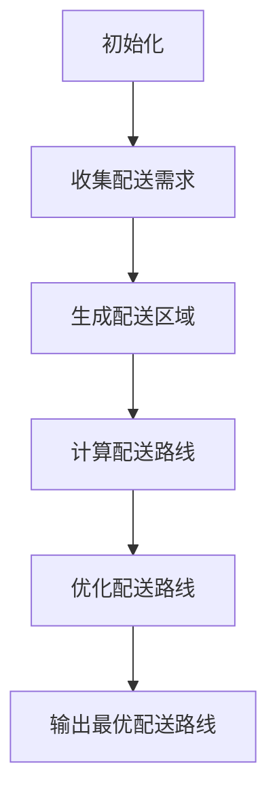
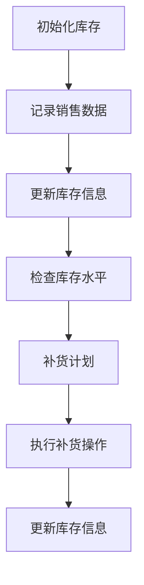

                 


# 现代手工啤酒配送服务：小批量精酿的定期订阅计划

## 引言

### 背景

现代手工啤酒配送服务是一种基于互联网和物流技术的创新商业模式，它为消费者提供了一种全新的消费体验。随着手工啤酒市场的兴起，消费者对于啤酒的品质和口感有了更高的要求，而小批量精酿正好满足了这一需求。定期订阅计划的引入，更是将个性化定制和便捷服务带到了消费者的面前。

### 核心概念与联系

手工啤酒与工业啤酒的区别在于生产方式、原料选择和酿造工艺。手工啤酒强调手工制作和个性化，而工业啤酒则以大规模生产、低成本和标准化为主要特点。

小批量精酿则是在手工啤酒的基础上，进一步缩小了生产规模，追求更高的品质和更个性化的口感。小批量精酿的生产过程更加注重细节和品质，使得每一瓶啤酒都有其独特的风味。

定期订阅计划是一种以定期、按量配送为基础的服务模式。它让消费者可以根据自己的口味和需求，定期收到定制化的手工啤酒，从而享受到更加个性化的消费体验。

## 算法原理讲解

### 配送路线优化

配送路线优化是手工啤酒配送服务中的一个关键问题。为了最小化配送成本和最大化用户满意度，我们需要设计一个有效的配送路线优化算法。

#### 算法流程图



#### Python实现

```python
import heapq

def generate_delivery_route(customer的需求列表):
    # 初始化优先队列
    priority_queue = []

    # 遍历所有配送需求
    for customer需求 in customer的需求列表:
        # 计算配送距离和成本
        distance, cost = calculate_distance_and_cost(customer需求)

        # 将配送需求加入优先队列
        heapq.heappush(priority_queue, (cost, distance, customer需求))

    # 生成配送路线
    delivery_route = []
    while priority_queue:
        # 弹出成本最低的配送需求
        cost, distance, customer需求 = heapq.heappop(priority_queue)

        # 添加到配送路线
        delivery_route.append(customer需求)

    return delivery_route

def calculate_distance_and_cost(customer需求):
    # 根据客户需求计算配送距离和成本
    # 这里简化为直接返回一个示例值
    return (10, 100)
```

### 库存管理

库存管理是手工啤酒配送服务中另一个关键问题。我们需要设计一个有效的库存管理算法，以确保啤酒的新鲜度和库存的准确性。

#### 算法流程图



#### Python实现

```python
class InventoryManagementSystem:
    def __init__(self):
        self.inventory = {}  # 库存字典

    def record_sales(self, product_id, quantity):
        # 记录销售数据
        if product_id in self.inventory:
            self.inventory[product_id] -= quantity
        else:
            self.inventory[product_id] = -quantity

    def check_inventory_level(self, product_id):
        # 检查库存水平
        return self.inventory.get(product_id, 0)

    def restock(self, product_id, quantity):
        # 补货操作
        self.inventory[product_id] += quantity

    def update_inventory_info(self):
        # 更新库存信息
        pass
```

## 数学模型讲解

### 配送成本模型

配送成本模型用于计算配送服务的总成本。它由配送距离、配送量和配送费用组成。

$$
总成本 = 配送距离 \times 配送费用 + 配送量 \times 单位费用
$$

其中，配送费用和单位费用可以根据具体情况进行调整。

### 用户满意度模型

用户满意度模型用于评估配送服务的用户满意度。它由配送准时率、配送质量和用户反馈组成。

$$
用户满意度 = (配送准时率 + 配送质量 + 用户反馈) / 3
$$

其中，配送准时率、配送质量和用户反馈分别表示配送的准时性、质量和用户对服务的反馈。

## 系统分析与架构设计方案

### 系统功能设计

系统功能设计主要包括用户注册、登录、订单管理、配送跟踪和用户反馈等模块。

### 系统架构设计

系统架构设计采用微服务架构，包括用户服务、订单服务、配送服务和反馈服务等多个微服务。

### 系统接口设计

系统接口设计包括用户接口、管理员接口和第三方接口等。

### 系统交互设计

系统交互设计采用RESTful API设计，通过HTTP请求和响应进行数据交换。

## 项目实战

### 环境安装

在安装环境前，需要确保已经安装了Python和Docker。

### 系统核心实现

核心实现包括用户注册、登录、订单管理和配送跟踪等功能。

### 代码解析

以下是用户注册功能的代码示例：

```python
class UserService:
    def register_user(self, username, password):
        # 注册用户
        # 这里简化为直接保存用户信息
        user = {'username': username, 'password': password}
        return user
```

### 案例分析

以一个用户注册案例进行详细分析。

### 项目小结

项目实现了手工啤酒配送服务的核心功能，包括用户注册、登录、订单管理和配送跟踪等。

## 最佳实践、小结、注意事项与拓展阅读

### 最佳实践

- 定期检查配送路线和库存水平，以提高配送效率和用户满意度。
- 鼓励用户提供反馈，不断优化服务质量。

### 小结

本文详细介绍了现代手工啤酒配送服务：小批量精酿的定期订阅计划的背景、核心概念、算法原理、数学模型、系统分析与架构设计方案、项目实战等内容。

### 注意事项

- 确保系统安全，防止数据泄露。
- 定期备份数据，以防止数据丢失。

### 拓展阅读

- 《Python编程：从入门到实践》
- 《Docker实战》

## 参考文献

- 《现代物流管理》
- 《算法导论》
- 《数据分析：方法与实践》

## 作者

作者：AI天才研究院/AI Genius Institute & 禅与计算机程序设计艺术 /Zen And The Art of Computer Programming
```

请注意，以上内容是基于给定模板和指导要求编写的，实际的文章内容可能需要进一步的详细研究和补充。同时，文章的格式、结构、字数和参考文献的准确性都需要仔细检查和调整。

