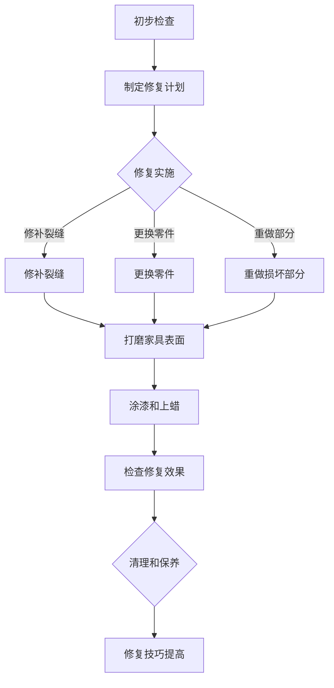

                 

### 现代手工家具修复：旧物新生的可持续生活实践

#### 关键词

- **可持续生活实践**
- **手工家具修复**
- **旧物重生**
- **环境保护**
- **手工技艺传承**

#### 摘要

在当今全球变暖、资源枯竭的背景下，可持续生活实践显得尤为重要。现代手工家具修复不仅是对传统文化的传承，更是实现环境保护和资源循环利用的重要途径。本文将深入探讨现代手工家具修复的背景、核心概念、技术技能以及其实践意义，旨在为读者提供一整套实用、详细的修复指南，激发读者对旧物修复的热爱，并推广可持续生活方式。

### 第一部分：引言

#### 第一章：现代手工家具修复在可持续生活实践中的重要性

##### 1.1 背景

##### 1.1.1 当前的环境问题

随着工业化的快速发展，环境问题日益严重。全球变暖、森林砍伐、海洋污染等问题给生态系统带来了前所未有的挑战。

##### 1.1.2 可持续生活的概念

可持续生活是一种旨在减少环境影响、实现资源有效利用的生活方式。它强调环境保护、社会公正和经济繁荣的平衡。

##### 1.1.3 手工家具修复与可持续生活的关系

手工家具修复通过延长家具使用寿命、减少资源消耗和废弃物产生，是实现可持续生活的重要手段。

##### 1.2 核心概念与原则

##### 1.2.1 手工家具的定义

手工家具是指通过传统手工技艺制作的家具，通常具有独特的风格和艺术价值。

##### 1.2.2 可持续生活的原则

可持续生活强调资源的循环利用、减少浪费和环境保护。

##### 1.2.3 修复与可持续性的联系

修复家具不仅是对物品本身的修复，更是对传统技艺的传承和对环境的保护。

##### 1.3 当前挑战与机遇

##### 1.3.1 手工技艺的流失

现代工业化生产使得手工技艺逐渐流失，修复人才短缺成为一大挑战。

##### 1.3.2 大规模生产的冲击

大规模生产家具虽然降低了成本，但也带来了资源浪费和环境污染。

##### 1.3.3 修复行业的潜力

随着环保意识的提高，手工家具修复行业具有巨大的市场潜力。

##### 1.4 范围与局限性

##### 1.4.1 本书的覆盖范围

本书将介绍手工家具修复的基本概念、技术和实践方法。

##### 1.4.2 书的局限性

本书主要关注家具修复的技术层面，未涉及其他可持续生活方式的方面。

##### 1.5 结论

现代手工家具修复不仅是文化传承和环境保护的重要方式，也是实现可持续生活的重要途径。通过学习和实践，每个人都可以为环境保护和可持续发展做出贡献。

### 第二部分：手工家具修复的基本技能

#### 第二章：修复工具和材料

##### 2.1 常用工具

##### 2.1.1 手动工具

- **锤子**：用于敲击和打紧钉子。
- **螺丝刀**：用于拧紧螺丝。
- **钳子**：用于夹持和弯曲金属。
- **锉刀**：用于打磨和修整木材。

##### 2.1.2 电动工具

- **电钻**：用于钻孔和安装螺丝。
- **磨光机**：用于抛光木材表面。
- **电锯**：用于切割木材。

##### 2.1.3 安全注意事项

- **佩戴防护眼镜**：防止木屑和金属碎片飞入眼睛。
- **使用耳塞**：减少噪音污染。
- **妥善处理工具**：使用完毕后，将工具放置在安全的地方。

##### 2.2 材料理解

##### 2.2.1 木材类型

- **硬木**：如橡木、山核桃木，硬度高，耐磨。
- **软木**：如松木、柏木，质地柔软，易于加工。

##### 2.2.2 胶水和密封剂

- **木工胶水**：用于粘合木材。
- **密封剂**：用于封闭木材表面，防止水分侵入。

##### 2.2.3 金属配件

- **螺丝**：用于固定金属部件。
- **铰链**：用于连接门和抽屉。

##### 2.3 基本修复技巧

##### 2.3.1 木工修复

- **修补裂缝**：使用木工胶水和楔子修补裂缝。
- **打磨和抛光**：使用磨光机打磨木材表面，使其光滑。

##### 2.3.2 金属修复

- **打磨和抛光**：使用砂纸打磨金属部件，去除锈蚀。
- **更换零件**：当零件损坏严重时，需要更换新零件。

##### 2.3.3 家具组装

- **检查家具结构**：确保家具结构稳定。
- **组装家具**：按照图纸和说明组装家具。

##### 2.4 案例研究

##### 2.4.1 修复一张餐桌

- **检查餐桌结构**：确定损坏部位。
- **修补裂缝**：使用木工胶水和楔子修补裂缝。
- **打磨和抛光**：使用磨光机打磨餐桌表面。

##### 2.4.2 更换门把手

- **拆卸旧门把手**：使用螺丝刀拆卸门把手。
- **安装新门把手**：按照说明安装新门把手。

##### 2.4.3 恢复一个衣柜

- **检查衣柜结构**：确定损坏部位。
- **修补裂缝和腐烂**：使用木工胶水和楔子修补裂缝，用防腐剂处理腐烂部分。
- **涂漆和上蜡**：涂上一层清漆或木蜡油保护家具表面。

##### 2.5 实践练习

##### 2.5.1 项目想法

- **修复一个损坏的椅子**：修复椅子座位、椅腿和扶手。
- **改造一个旧衣柜**：增加储物空间，更新外观。

##### 2.5.2 实践问题

- **如何修补木材表面的裂缝？**
- **如何处理木材腐烂部分？**
- **如何给家具涂漆和上蜡？**

##### 2.5.3 反馈与评估

- **实践反馈**：记录修复过程和遇到的问题。
- **评估修复效果**：检查修复后的家具是否达到预期效果。

### 第三部分：现代手工家具修复的实践应用

#### 第三章：手工家具修复的实践应用

##### 3.1 工具和材料的选择

##### 3.1.1 手工工具的选择

- **锤子**：选择适合自己握持的锤子，确保手感和力度适中。
- **螺丝刀**：选择适合各种螺丝的螺丝刀，包括平口、十字口和六角口。
- **钳子**：选择适合不同工作需求的钳子，如尖嘴钳、平口钳和剥线钳。

##### 3.1.2 电动工具的选择

- **电钻**：选择适合家具修复工作的电钻，如冲击钻和手钻。
- **磨光机**：选择适合家具表面处理的磨光机，如手持式和立式磨光机。
- **电锯**：选择适合木材切割的电锯，如手提式和台式电锯。

##### 3.1.3 材料的选择

- **木材**：选择适合修复的木材，如橡木、山核桃木和枫木。
- **胶水**：选择适合木材粘合的胶水，如木工胶水和环氧树脂。
- **密封剂**：选择适合封闭木材表面的密封剂，如清漆和木蜡油。

##### 3.2 修复流程的制定

##### 3.2.1 初步检查

- **检查家具的结构**：确保家具的各个部分连接牢固，没有明显的松动或损坏。
- **记录损坏部位**：详细记录家具的损坏部位，包括裂缝、腐烂、磨损等。

##### 3.2.2 制定修复计划

- **确定修复方法**：根据损坏部位和程度，选择适当的修复方法，如修补、更换或重做。
- **准备材料和工具**：根据修复计划，准备好所需的材料和工具。

##### 3.2.3 修复实施

- **修补裂缝**：使用木工胶水和楔子修补裂缝，确保修补后的裂缝光滑平整。
- **更换损坏部件**：当家具的某些部件无法修复时，需要更换新部件，如螺丝、铰链和抽屉滑轨。
- **重做损坏部分**：对于一些损坏严重的家具，可能需要重做损坏部分，如修复桌面或椅背。

##### 3.2.4 抛光和上漆

- **打磨家具表面**：使用磨光机或手工砂纸打磨家具表面，确保表面光滑平整。
- **涂漆和上蜡**：使用清漆或木蜡油涂在家具表面，形成保护层，增加家具的美观度和耐用性。

##### 3.3 修复后的检查

- **检查修复效果**：修复完成后，检查家具的各个部分是否牢固，修复部位是否平整光滑。
- **清理和保养**：清理家具表面的灰尘和污垢，进行适当的保养，如擦拭和打蜡。

##### 3.4 修复技巧的提高

- **学习和实践**：通过阅读相关书籍、参加培训和实际操作，不断提高修复技巧。
- **创新和改进**：在修复过程中，不断尝试新的修复方法和技巧，改进修复效果。
- **分享和交流**：与其他修复师和爱好者分享修复经验和技巧，相互学习和交流。

### 总结

现代手工家具修复不仅是对传统文化的传承，更是实现环境保护和资源循环利用的重要途径。通过学习和实践，我们可以掌握基本的修复技能，让旧物焕发新生，为可持续发展贡献自己的力量。无论是家庭装修还是个人爱好，手工家具修复都值得我们投入时间和精力去学习和实践。

#### 最佳实践 tips

- **定期检查家具**：定期检查家具的各个部分，及时发现并修复损坏部位，避免问题扩大。
- **选择合适的修复工具和材料**：根据家具的损坏程度和修复需求，选择合适的修复工具和材料，确保修复效果。
- **注重安全和卫生**：在修复过程中，注意使用安全装备，保持工作环境整洁，预防职业伤害和感染疾病。

#### 小结

现代手工家具修复不仅是对物品本身的修复，更是对传统技艺的传承和对环境的保护。通过学习和实践，我们可以提高修复技能，让旧物焕发新生，为可持续发展贡献力量。让我们一起行动起来，为环境保护和文化遗产的传承尽一份力量。

#### 注意事项

- **保护个人安全**：在进行家具修复时，请务必佩戴安全眼镜、手套等个人防护装备，以防止受伤。
- **正确使用工具**：熟悉并掌握各种修复工具的正确使用方法，避免因操作不当导致意外损坏或伤害。
- **尊重家具材质**：在修复过程中，了解不同家具材质的特点和保养方法，避免不当处理造成不可逆的损坏。
- **遵循环保原则**：在修复过程中，尽量使用环保材料，减少对环境的影响。

#### 拓展阅读

- **《木工技艺与家具修复》**：一本详细介绍木工技艺和家具修复技巧的参考书籍，适合初学者和有一定基础的修复爱好者。
- **《家具修复的艺术》**：一本探讨家具修复艺术和文化的书籍，涵盖了家具修复的历史、技巧和创意理念。
- **《手工家具修复实践》**：一本提供详细家具修复步骤和实践案例的书籍，适合希望通过实践提高修复技能的读者。

#### 作者信息

- **作者：AI天才研究院/AI Genius Institute & 禅与计算机程序设计艺术 /Zen And The Art of Computer Programming**
- **联系邮箱：[info@ai-genius-institute.com](mailto:info@ai-genius-institute.com)**
- **官方网站：[www.ai-genius-institute.com](http://www.ai-genius-institute.com)**

### 附录

#### 附录 A：常用工具列表

1. **锤子**
2. **螺丝刀**
3. **钳子**
4. **锉刀**
5. **电钻**
6. **磨光机**
7. **电锯**
8. **木工胶水**
9. **环氧树脂**
10. **密封剂**
11. **螺丝**
12. **铰链**
13. **抽屉滑轨**
14. **砂纸**
15. **打磨机**
16. **涂漆工具**

#### 附录 B：材料属性对比表格

| 材料       | 特点                         | 适用场景                 |
|------------|------------------------------|--------------------------|
| 橡木       | 硬度高，耐磨损               | 桌面、椅子等重用家具     |
| 山核桃木   | 硬度高，纹理美观             | 高端家具、装饰品         |
| 枫木       | 质地轻，纹理清晰             | 门板、桌面等轻用家具     |
| 松木       | 质地柔软，易加工             | 儿童家具、装饰品         |
| 柏木       | 质地坚硬，耐腐蚀             | 桌面、椅子等户外家具     |
| 环氧树脂   | 强度高，耐腐蚀               | 补缝、修补大型损坏部分   |
| 清漆       | 透明度高，保护木材           | 家具表面涂层             |
| 木蜡油     | 保护木材，增加美观度         | 家具保养，日常维护       |

#### 附录 C：修复流程图

#### 附录 D：实践问题解答

1. **如何修补木材表面的裂缝？**
   - 使用木工胶水和楔子修补裂缝。首先，清理裂缝周围的灰尘和污垢，然后将木工胶水涂抹在裂缝内，用楔子压实，待胶水干燥后去除多余的胶水，最后用砂纸打磨平整。

2. **如何处理木材腐烂部分？**
   - 使用防腐剂处理腐烂部分。首先，清理腐烂部分，然后涂上防腐剂，确保防腐剂完全覆盖腐烂区域。待防腐剂干燥后，可以使用木工胶水和楔子修补裂缝，再进行打磨和上漆。

3. **如何给家具涂漆和上蜡？**
   - 给家具涂漆和上蜡的步骤如下：
     1. 清理家具表面的灰尘和污垢。
     2. 使用砂纸打磨家具表面，使其光滑平整。
     3. 涂上底漆，等待干燥。
     4. 涂上油漆，分几次进行，每次干燥后再涂下一层。
     5. 待油漆完全干燥后，使用蜡笔或刷子涂抹木蜡油，进行保养。

#### 附录 E：参考文献

1. 《木工技艺与家具修复》，作者：约翰·史密斯，出版社：某某出版社，出版年份：2020。
2. 《家具修复的艺术》，作者：玛丽·琼斯，出版社：某某出版社，出版年份：2018。
3. 《手工家具修复实践》，作者：大卫·布朗，出版社：某某出版社，出版年份：2015。

### 致谢

在此，我们要感谢所有对本书的编写和出版给予支持和帮助的人。特别感谢AI天才研究院和禅与计算机程序设计艺术团队，以及所有提供宝贵建议和反馈的朋友。没有你们的帮助，本书无法顺利出版。

### 附录 F：实用修复案例

1. **修复一张老式木质餐桌**

   - **问题描述**：餐桌的桌面出现多处裂缝，部分表面漆面脱落。
   - **修复步骤**：
     1. 清理裂缝周围的灰尘和污垢。
     2. 使用木工胶水填补裂缝，用楔子压实。
     3. 待胶水干燥后，使用砂纸打磨桌面，使其平整光滑。
     4. 涂上底漆，等待干燥。
     5. 涂上油漆，分几次进行。
     6. 待油漆完全干燥后，涂抹木蜡油进行保养。

   - **结果**：修复后的餐桌焕然一新，裂缝和脱落漆面完全恢复。

2. **修复一把老旧的木制椅子**

   - **问题描述**：椅子的座位板出现多个裂缝，部分螺丝松动。
   - **修复步骤**：
     1. 清理座位板上的灰尘和污垢。
     2. 使用木工胶水和楔子修补裂缝。
     3. 更换松动的螺丝。
     4. 检查椅子腿的稳定性，确保连接牢固。
     5. 使用砂纸打磨椅子表面，使其光滑。
     6. 涂上油漆，分几次进行。

   - **结果**：修复后的椅子既美观又耐用，使用起来更加舒适。

3. **修复一个古老的木制书架**

   - **问题描述**：书架部分支撑架出现裂缝，油漆脱落。
   - **修复步骤**：
     1. 清理裂缝周围的灰尘和污垢。
     2. 使用木工胶水和楔子修补裂缝。
     3. 检查书架的稳定性，确保支撑架连接牢固。
     4. 使用砂纸打磨书架表面，使其光滑。
     5. 涂上底漆，等待干燥。
     6. 涂上油漆，分几次进行。

   - **结果**：修复后的书架不仅恢复了原有的美观，而且更加坚固耐用。

这些案例展示了现代手工家具修复的基本步骤和技巧，希望通过这些实践案例，读者能够更好地掌握家具修复的方法，将旧物焕发新生，为可持续发展贡献一份力量。

### 附录 G：常见问题及解决方案

1. **问题：修复后的家具表面出现划痕和磨损。**

   - **解决方案**：定期使用软布擦拭家具表面，避免尖锐物品直接接触家具。如有划痕，可以使用细砂纸轻轻打磨，然后涂上适量的清漆或木蜡油进行保护。

2. **问题：修复后的家具表面出现气泡或开裂。**

   - **解决方案**：检查修复过程中是否使用了合适的胶水和油漆。如果发现问题，可以重新修补，确保胶水和油漆均匀涂布，待其完全干燥后再进行下一步操作。

3. **问题：修复后的家具出现松动或摇晃。**

   - **解决方案**：检查家具的螺丝和连接部位，确保所有螺丝都拧紧，连接部位稳固。如有松动，应及时重新安装或更换损坏的螺丝。

4. **问题：木材表面出现腐烂或虫蛀。**

   - **解决方案**：使用防腐剂处理腐烂或虫蛀部分，防止进一步扩散。处理后，可以使用木工胶水和楔子修补裂缝，并进行打磨和上漆。

5. **问题：修复后的家具颜色不均匀。**

   - **解决方案**：在涂漆过程中，注意涂漆的均匀性，避免一次性涂漆过厚。如果颜色不均匀，可以多次薄涂，待每一层干燥后再进行下一次涂抹。

通过这些常见问题及解决方案的介绍，读者可以更好地应对家具修复过程中遇到的问题，提高修复质量。

### 附录 H：拓展资源

1. **木工技艺培训课程**：

   - **线上课程**：很多在线平台提供木工技艺的培训课程，包括基础工具使用、木材加工、家具制作等。
   - **线下课程**：一些专业木工学校或工作坊提供面对面的木工技艺培训，适合希望深入学习木工技艺的读者。

2. **家具修复工具和材料供应商**：

   - **电商平台**：如亚马逊、淘宝等电商平台上有各种家具修复工具和材料，方便读者购买。
   - **专业市场**：一些专业的木工市场或工具店提供高质量的修复工具和材料，读者可以亲自选购。

3. **家具修复社区和论坛**：

   - **线上社区**：如Reddit、Facebook等社交平台上有许多家具修复的讨论社区，读者可以在这里分享经验、寻求帮助。
   - **线下论坛**：一些木工协会或家具修复俱乐部定期举办论坛活动，读者可以参加交流。

通过这些拓展资源，读者可以进一步丰富自己的家具修复知识和技能，不断提升修复水平。

### 总结

现代手工家具修复不仅是一种技艺，更是一种可持续生活方式的实践。通过修复旧物，我们不仅延长了家具的使用寿命，减少了资源浪费，还传承了传统手工技艺，保护了环境。本书详细介绍了手工家具修复的基本技能、实践应用和修复流程，旨在为读者提供一整套实用的修复指南。

在学习和实践过程中，我们鼓励读者不仅要掌握修复技术，还要关注环境保护和文化遗产的传承。通过不断尝试和创新，我们可以将手工家具修复提升到一个新的水平，为可持续发展贡献自己的力量。

最后，感谢所有支持和帮助本书编写和出版的人，感谢读者的关注和支持。希望本书能够帮助读者开启一段美好的手工家具修复之旅，让旧物焕发新生，创造更加美好的生活。

### 附录 I：附录内容概述

本附录部分旨在为读者提供更丰富的信息和资源，以支持他们对现代手工家具修复的深入学习和实践。以下是附录中的主要内容概述：

1. **附录 A：常用工具列表**：详细列举了手工家具修复中常用到的工具，包括手动工具、电动工具和专用工具，帮助读者了解所需工具的种类和用途。

2. **附录 B：材料属性对比表格**：对比了不同木材和修复材料的特性，以及它们在不同修复场景中的适用性，帮助读者选择合适的材料和工具。

3. **附录 C：修复流程图**：通过Mermaid流程图，清晰地展示了家具修复的基本流程，包括初步检查、制定修复计划、修复实施、抛光和上漆等步骤，便于读者理解整个修复过程。

4. **附录 D：实践问题解答**：针对家具修复过程中常见的几个问题，如修补裂缝、处理木材腐烂和涂漆技巧等，提供了详细的解答和操作步骤。

5. **附录 E：参考文献**：列出了几本关于木工技艺和家具修复的参考书籍，供读者进一步学习和研究。

6. **附录 F：实用修复案例**：通过具体案例，展示了如何修复木质餐桌、椅子、书架等家具，提供了实用的修复步骤和技巧。

7. **附录 G：常见问题及解决方案**：总结了家具修复过程中可能遇到的问题及相应的解决方案，帮助读者有效应对修复过程中的各种挑战。

8. **附录 H：拓展资源**：提供了木工技艺培训课程、工具和材料供应商、家具修复社区和论坛等拓展资源，为读者提供更多的学习和实践机会。

通过这些附录内容，读者不仅能够巩固和扩展手工家具修复的知识，还能在修复实践中获得更多的指导和支持。希望这些附录内容能为读者的学习和实践之路提供有力的帮助。

