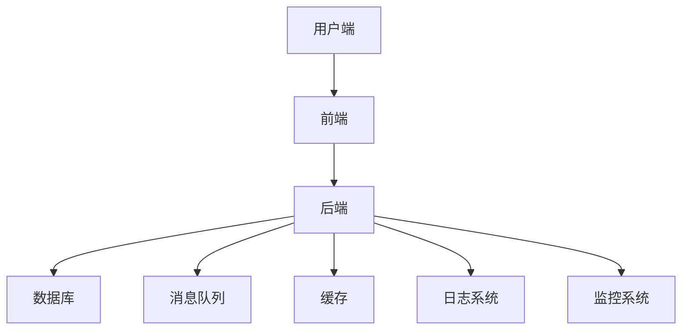

                 

### 文章标题：现代手工家具定制平台：匠人精神与个性化需求的对接

> 关键词：手工家具、定制平台、匠人精神、个性化需求、平台建设

> 摘要：本文将探讨现代手工家具定制平台的建设，分析匠人精神在其中的作用以及如何满足个性化需求。通过具体案例分享和经验总结，为行业发展提供参考。

----------------------------------------------------------------

# 目录大纲

## 第一部分：引言与背景
### 1.1 书籍主题介绍
#### 1.1.1 手工家具定制的意义
#### 1.1.2 现代家具定制的发展趋势
#### 1.1.3 匠人精神与现代家具定制的关系

### 1.2 目标读者与阅读建议
#### 1.2.1 目标读者定位
#### 1.2.2 阅读顺序与建议

### 1.3 全书结构概述
#### 1.3.1 全书章节安排
#### 1.3.2 各章节内容概览

## 第二部分：匠人精神与家具定制文化
### 2.1 匠人精神的定义与传承
#### 2.1.1 匠人精神的内涵
#### 2.1.2 匠人精神在传统家具制作中的应用
#### 2.1.3 匠人精神的现代传承与创新

### 2.2 家具定制文化的历史与发展
#### 2.2.1 中国家具定制文化的历史演变
#### 2.2.2 西方家具定制文化的发展与特点
#### 2.2.3 不同文化背景下家具定制的差异

### 2.3 匠人精神在现代家具定制中的体现
#### 2.3.1 现代家具定制与传统匠人精神的结合
#### 2.3.2 现代家具定制中的创新与实践
#### 2.3.3 匠人精神在现代家具设计中的应用

### 2.4 匠人精神与个性化需求的对接
#### 2.4.1 个性化需求在家具定制中的重要性
#### 2.4.2 匠人精神如何满足个性化需求
#### 2.4.3 个性化定制案例分享

## 第三部分：现代手工家具定制平台建设
### 3.1 平台建设概述
#### 3.1.1 平台建设的必要性
#### 3.1.2 平台建设的整体思路
#### 3.1.3 平台建设的目标与预期效果

### 3.2 平台架构设计
#### 3.2.1 架构设计原则
#### 3.2.2 系统架构图展示
#### 3.2.3 各模块功能详解

### 3.3 用户需求收集与处理
#### 3.3.1 用户需求分析
#### 3.3.2 需求收集方法
#### 3.3.3 需求处理流程

### 3.4 设计与定制流程
#### 3.4.1 设计流程
#### 3.4.2 定制流程
#### 3.4.3 设计与定制流程的整合

### 3.5 技术实现与工具选用
#### 3.5.1 技术实现方案
#### 3.5.2 工具选用原则
#### 3.5.3 常用工具介绍

### 3.6 平台测试与优化
#### 3.6.1 测试方法与步骤
#### 3.6.2 测试用例设计
#### 3.6.3 平台优化策略

## 第四部分：定制案例与经验分享
### 4.1 案例介绍
#### 4.1.1 案例背景
#### 4.1.2 案例目标
#### 4.1.3 案例实施过程

### 4.2 案例分析
#### 4.2.1 案例成功因素
#### 4.2.2 案例面临挑战
#### 4.2.3 案例解决方案

### 4.3 经验总结
#### 4.3.1 经验教训
#### 4.3.2 最佳实践
#### 4.3.3 未来展望

### 4.4 案例分享
#### 4.4.1 国内案例分享
#### 4.4.2 国际案例分享
#### 4.4.3 案例对比分析

## 第五部分：挑战与未来发展
### 5.1 行业挑战
#### 5.1.1 市场竞争加剧
#### 5.1.2 技术创新需求
#### 5.1.3 客户需求多样化

### 5.2 未来发展
#### 5.2.1 技术创新方向
#### 5.2.2 市场拓展策略
#### 5.2.3 行业规范与标准

----------------------------------------------------------------

----------------------------------------------------------------
## 第一部分：引言与背景

### 1.1 书籍主题介绍

#### 1.1.1 手工家具定制的意义

手工家具定制，作为一种体现匠心与个性化的定制方式，其意义不仅在于满足人们的物质需求，更在于传承和发扬传统的匠人精神。手工家具定制的意义主要体现在以下几个方面：

1. **传承文化**：手工家具定制将传统工艺和现代设计相结合，既保留了传统家具的韵味，又满足了现代人的审美需求，是文化传承的一种重要方式。

2. **个性展现**：每个人对家具的需求都是独特的，手工家具定制可以根据个人的喜好、生活习惯和空间布局进行个性化设计，满足人们对个性化和独特性的追求。

3. **品质保证**：手工家具定制的每一个环节都由匠人精心打磨，从原材料的选择到最终的成品，都体现了匠人对品质的极致追求。

4. **促进就业**：手工家具定制需要大量的手工制作，对于促进就业、提高社会稳定性具有重要意义。

#### 1.1.2 现代家具定制的发展趋势

随着社会的发展和人们生活水平的提高，现代家具定制逐渐成为家具行业的一个重要发展方向。以下是现代家具定制的发展趋势：

1. **个性化定制**：现代家具定制强调根据用户的个性化需求进行设计，满足用户对个性化和独特性的追求。

2. **智能化生产**：现代家具定制在生产过程中逐渐引入智能化设备和技术，提高生产效率和定制精度。

3. **可持续发展**：环保和可持续发展成为现代家具定制的核心理念，越来越多的企业开始注重使用环保材料和绿色生产工艺。

4. **互联网+**：随着互联网技术的发展，越来越多的家具定制企业开始利用互联网进行产品设计、订单管理和客户服务，提高业务效率。

#### 1.1.3 匠人精神与现代家具定制的关系

匠人精神是一种对工作执着、精益求精的精神理念。在现代家具定制中，匠人精神具有重要意义：

1. **品质保证**：匠人精神强调对品质的极致追求，保证每一件家具的工艺和品质。

2. **创新驱动**：匠人精神鼓励创新，不断探索新的设计理念和工艺技术，推动家具定制行业的发展。

3. **文化传承**：匠人精神是传统工艺的传承和发扬，有助于保持家具定制的独特性和文化底蕴。

4. **用户体验**：匠人精神关注用户体验，从设计到制作都力求满足用户的需求，提升用户满意度。

### 1.2 目标读者与阅读建议

#### 1.2.1 目标读者定位

本文的目标读者主要包括：

1. 家具定制行业的从业者，如设计师、工艺师、管理人员等。
2. 对家具定制感兴趣的企业家、投资者和研究人员。
3. 对个性化定制和匠人精神有浓厚兴趣的读者。

#### 1.2.2 阅读顺序与建议

建议读者按照以下顺序阅读：

1. 先阅读引言与背景部分，了解书籍主题和现代家具定制的发展趋势。
2. 再阅读匠人精神与家具定制文化部分，了解匠人精神的内涵和传统家具定制文化的历史。
3. 接着阅读现代手工家具定制平台建设部分，了解平台建设的目标、架构设计和实施方法。
4. 最后阅读定制案例与经验分享部分，通过具体案例了解行业实践和经验。

### 1.3 全书结构概述

#### 1.3.1 全书章节安排

本书共分为五个部分：

1. 第一部分：引言与背景
2. 第二部分：匠人精神与家具定制文化
3. 第三部分：现代手工家具定制平台建设
4. 第四部分：定制案例与经验分享
5. 第五部分：挑战与未来发展

#### 1.3.2 各章节内容概览

1. 第一部分：引言与背景
   - 介绍手工家具定制的意义、现代家具定制的发展趋势以及匠人精神与现代家具定制的关系。

2. 第二部分：匠人精神与家具定制文化
   - 分析匠人精神的定义与传承，探讨家具定制文化的历史与发展，以及匠人精神在现代家具定制中的体现。

3. 第三部分：现代手工家具定制平台建设
   - 概述平台建设的必要性、整体思路、目标与预期效果，详细介绍平台架构设计、用户需求收集与处理、设计与定制流程、技术实现与工具选用以及平台测试与优化。

4. 第四部分：定制案例与经验分享
   - 介绍实际定制案例，分析案例成功因素、面临挑战和解决方案，总结经验教训和最佳实践，并进行案例分享与对比分析。

5. 第五部分：挑战与未来发展
   - 分析行业挑战，探讨技术创新方向、市场拓展策略以及行业规范与标准，展望未来发展趋势。

----------------------------------------------------------------

### 2.1 匠人精神的定义与传承

#### 2.1.1 匠人精神的内涵

匠人精神，是指一种对工作极其认真、严谨和专注的态度，以及对品质和技艺的不懈追求。其内涵可以从以下几个方面进行解读：

1. **专注与执着**：匠人精神强调对工作的专注和执着，无论是在设计、制作还是后续的维护过程中，都需要匠人始终保持高度的专注和敬业精神。

2. **精益求精**：匠人精神追求的是品质和技艺的极致，对于每一个细节都不放过，力求达到最好的效果。

3. **传承与创新**：匠人精神不仅体现在对传统工艺的传承上，更强调在传承的基础上进行创新，以适应时代的发展和变化。

4. **社会责任**：匠人精神还包含了对社会责任的担当，即通过自己的工作为社会创造价值，促进社会和谐与进步。

#### 2.1.2 匠人精神在传统家具制作中的应用

在传统家具制作中，匠人精神得到了充分体现。以下是一些具体的实例：

1. **材料选择**：传统家具制作非常注重材料的选择，匠人会根据家具的用途、风格和地域特点来挑选合适的材料，以确保家具的耐用性和美观度。

2. **工艺流程**：传统家具制作有严格的工艺流程，每一个环节都需要匠人精心操作，如木材的烘干、雕刻、组装等。

3. **细节处理**：传统家具制作强调细节处理，匠人会花费大量时间和精力来打磨每一个细节，使得家具整体看起来更加美观和精致。

4. **品质检验**：在传统家具制作中，匠人会进行多次品质检验，确保家具达到最佳状态，不会因为疏忽导致质量问题。

#### 2.1.3 匠人精神的现代传承与创新

在现代社会，匠人精神依然具有很高的价值，并且在不断传承与创新。以下是一些具体的实践：

1. **现代工艺技术的应用**：随着科技的发展，现代家具制作中引入了先进的工艺技术，如数控雕刻、激光切割等，这些技术的应用不仅提高了生产效率，也使得家具的制作更加精准和美观。

2. **跨界融合**：现代家具制作中，匠人精神与其他领域的知识和技术进行融合，如设计美学、结构力学等，创造出更加新颖和独特的家具产品。

3. **社会责任的担当**：现代家具制作中，匠人精神强调对环境保护和社会责任的担当，越来越多的企业开始注重使用环保材料和绿色生产工艺，以减少对环境的负面影响。

4. **个性化定制**：现代家具定制强调根据用户的需求进行个性化设计，匠人精神在这个过程中体现在对用户需求的精准把握和对细节的极致追求。

#### 2.1.4 匠人精神在现代化家具定制中的地位与作用

在现代家具定制中，匠人精神具有重要的地位和作用：

1. **保证品质**：匠人精神是保证家具品质的重要保障，只有通过严谨的工作态度和精益求精的技艺，才能制作出高品质的家具。

2. **提升竞争力**：在市场竞争日益激烈的背景下，具备匠人精神的企业能够通过高品质的产品和良好的口碑，提升自身的竞争力。

3. **传承文化**：匠人精神是传统文化的重要组成部分，通过现代化家具定制，可以传承和发扬传统文化，提升民族自豪感。

4. **满足个性化需求**：现代家具定制强调个性化和独特性，匠人精神在这个过程中可以满足用户对高品质、个性化家具的需求。

#### 2.1.5 匠人精神在现代社会中的重要性

在现代社会，匠人精神依然具有重要意义：

1. **促进技术创新**：匠人精神鼓励创新，通过不断尝试和改进，推动技术进步和行业发展。

2. **提升产品质量**：匠人精神追求品质，通过严谨的工作态度和精湛的技艺，提升产品的质量。

3. **传承文化**：匠人精神是文化传承的重要方式，通过匠人的努力，传统文化得以传承和发扬。

4. **满足个性化需求**：现代社会对个性化和独特性的需求越来越高，匠人精神可以满足这些需求，提升用户满意度。

#### 2.1.6 匠人精神的传承与未来

匠人精神的传承是长期而持续的过程，需要从以下几个方面进行：

1. **教育培养**：通过教育培养，让更多的人了解和尊重匠人精神，培养具备匠人精神的人才。

2. **制度保障**：建立完善的制度保障，为匠人提供良好的工作和生活环境，激励他们传承和发展匠人精神。

3. **文化宣传**：加强文化宣传，提升公众对匠人精神的认知和尊重，营造良好的社会氛围。

4. **产业支持**：通过政策支持和产业引导，为匠人精神提供必要的资源和保障，推动其传承和发展。

在未来，随着社会的发展和技术的进步，匠人精神将继续发挥重要作用，为家具定制行业和其他领域的发展提供源源不断的动力。

----------------------------------------------------------------

### 2.2 家具定制文化的历史与发展

#### 2.2.1 中国家具定制文化的历史演变

中国的家具定制文化源远流长，可以追溯到数千年前。以下是中国家具定制文化的历史演变：

1. **先秦时期**：在先秦时期，家具定制主要以实用性为主，材质多为木材和竹子。家具的设计和制作以工匠的个人技艺和经验为基础。

2. **秦汉时期**：秦汉时期，家具定制逐渐脱离了实用性，开始注重装饰性和审美性。家具的设计和制作开始出现规范化、标准化的趋势。

3. **唐宋时期**：唐宋时期，家具定制进入了一个繁荣期。这一时期的家具定制不仅注重装饰性和审美性，还强调个性化的定制。家具材质、造型和工艺都得到了极大的创新和发展。

4. **明清时期**：明清时期，家具定制达到了一个高峰。这一时期的家具定制强调工艺的精湛和装饰的华丽，家具造型丰富多样，形成了独特的明清家具风格。

5. **现代时期**：随着社会的发展和技术的进步，现代家具定制逐渐取代了传统家具定制。现代家具定制强调个性化和独特性，通过数字化技术实现定制化生产。

#### 2.2.2 西方家具定制文化的发展与特点

西方家具定制文化起源于古希腊和古罗马时期，以下是其发展特点：

1. **古希腊和古罗马时期**：古希腊和古罗马时期的家具定制主要以实用为主，家具材质多为木材和石材。家具设计简洁、朴素，注重功能性和实用性。

2. **中世纪时期**：中世纪时期，家具定制逐渐脱离了实用性，开始注重装饰性和审美性。家具设计开始出现多样化、个性化的趋势。

3. **文艺复兴时期**：文艺复兴时期，家具定制进入了繁荣期。这一时期的家具定制强调装饰性和审美性，家具设计以古典主义风格为主。

4. **现代时期**：现代家具定制强调个性化和独特性，通过数字化技术实现定制化生产。西方家具定制文化强调功能性和实用性，同时也注重装饰性和审美性。

#### 2.2.3 不同文化背景下家具定制的差异

中国家具定制文化和西方家具定制文化在历史演变、发展特点和设计理念等方面存在明显差异：

1. **历史演变**：中国家具定制文化历史悠久，经历了多个朝代的演变和发展。西方家具定制文化则起源于古希腊和古罗马时期，发展历程相对较短。

2. **发展特点**：中国家具定制文化强调装饰性和审美性，家具设计注重传承和创新。西方家具定制文化则强调功能性和实用性，家具设计注重简约和现代。

3. **设计理念**：中国家具定制文化强调“以人为本”，注重人的舒适度和实用性。西方家具定制文化则强调“以物为本”，注重家具的功能性和实用性。

4. **工艺技术**：中国家具定制工艺精湛，注重细节处理和装饰。西方家具定制工艺相对简单，注重结构和功能的合理性。

#### 2.2.4 家具定制文化的现状与未来发展趋势

随着社会的发展和技术的进步，家具定制文化正在发生深刻的变化。以下是目前家具定制文化的现状和未来发展趋势：

1. **现状**：
   - 家具定制市场逐渐成熟，个性化定制需求不断增加。
   - 数字化技术在家具定制中的应用越来越广泛，提高了生产效率和定制精度。
   - 环保和可持续发展成为家具定制的重要趋势，越来越多的企业开始注重使用环保材料和绿色生产工艺。

2. **未来发展趋势**：
   - 个性化定制将继续成为家具定制市场的主流趋势，满足消费者对个性化和独特性的追求。
   - 数字化技术将进一步推动家具定制行业的发展，提高生产效率和定制精度。
   - 环保和可持续发展将成为家具定制的重要方向，促进行业的可持续发展。
   - 跨界融合将成为家具定制行业的重要趋势，通过与其他领域的融合，创造更多的商业机会。

总之，家具定制文化在历史演变中不断发展，现代家具定制强调个性化和独特性，未来的发展将更加注重数字化技术、环保和跨界融合。

----------------------------------------------------------------

### 2.3 匠人精神在现代家具定制中的体现

#### 2.3.1 现代家具定制与传统匠人精神的结合

现代家具定制与传统匠人精神的结合，是家具定制行业的一大亮点。这种结合不仅保留了传统匠人精神的核心价值观，还赋予了现代家具定制新的内涵和生命力。

1. **品质追求**：传统匠人精神强调品质至上，现代家具定制在传承这一精神的同时，通过引入先进的生产工艺和技术，进一步提升家具的品质。

2. **技艺传承**：传统匠人精神强调技艺传承，现代家具定制通过培训和教育，让更多的设计师和工匠掌握传统技艺，并将这些技艺应用到现代家具设计中。

3. **个性化定制**：传统匠人精神注重个性化和独特性，现代家具定制在满足这一需求的同时，利用数字化技术，实现了更加精准和高效的个性化定制。

4. **文化传承**：传统匠人精神是文化传承的重要载体，现代家具定制在传承这一精神的同时，通过家具的设计和制作，让传统文化焕发新的生机。

#### 2.3.2 现代家具定制中的创新与实践

在现代家具定制中，创新与实践是推动行业发展的关键。以下是一些创新和实践的例子：

1. **材料创新**：现代家具定制在材料选择上不断突破，引入了新型环保材料，如竹纤维、可回收材料等，不仅提高了家具的品质，也符合环保和可持续发展的理念。

2. **工艺创新**：现代家具定制在工艺技术上不断创新，如引入数控雕刻、激光切割等技术，提高了生产效率和定制精度。

3. **设计创新**：现代家具定制在设计理念上不断创新，融合了多种文化元素，如中西合璧、现代与传统相结合等，为消费者提供了更多的选择。

4. **生产模式创新**：现代家具定制在生产模式上也在不断创新，如引入智能制造、互联网+等模式，实现了生产流程的优化和效率的提升。

#### 2.3.3 匠人精神在现代家具设计中的应用

匠人精神在现代家具设计中的应用，主要体现在以下几个方面：

1. **细节处理**：匠人精神强调对细节的极致追求，现代家具设计在细节处理上注重精益求精，如家具的雕刻、打磨等，力求每一个细节都达到最佳效果。

2. **用户体验**：匠人精神关注用户体验，现代家具设计在考虑功能性和美观性的同时，更加注重人的舒适度和使用体验。

3. **文化传承**：匠人精神是文化传承的重要方式，现代家具设计在传承和发扬传统文化的基础上，融入现代元素，创造出具有独特风格和文化的家具作品。

4. **创新思维**：匠人精神鼓励创新思维，现代家具设计在保留传统技艺和风格的同时，不断探索新的设计理念和方法，为家具定制行业带来新的活力。

#### 2.3.4 匠人精神与现代家具定制平台的关系

匠人精神与现代家具定制平台密切相关。现代家具定制平台不仅是匠人精神传承和发扬的载体，也是匠人精神在现代家具定制中发挥作用的平台。

1. **平台建设**：现代家具定制平台的建设需要秉承匠人精神，注重品质、细节和用户体验，打造一个高效、便捷、优质的定制平台。

2. **技术创新**：现代家具定制平台在技术创新中需要借鉴匠人精神，不断探索新的技术和方法，提升定制效率和精度。

3. **人才培养**：现代家具定制平台在人才培养中需要注重匠人精神的培养，通过培训和教育，提升设计师和工匠的专业技能和综合素质。

4. **文化传承**：现代家具定制平台在文化传承中需要发挥重要作用，通过家具的设计和制作，让传统文化焕发新的生机。

总之，匠人精神在现代家具定制中具有重要作用，通过与传统匠人精神的结合、创新和实践，为现代家具定制注入了新的活力和动力。

----------------------------------------------------------------

### 2.4 匠人精神与个性化需求的对接

#### 2.4.1 个性化需求在家具定制中的重要性

在当今社会，个性化需求已成为家具定制行业的一个重要趋势。个性化需求不仅反映了人们对生活品质的追求，也体现了家具定制的独特价值。以下从几个方面探讨个性化需求在家具定制中的重要性：

1. **满足消费者心理需求**：个性化定制能够满足消费者对个性化和独特性的心理需求，使消费者感受到家具的定制过程是为自己量身打造的，从而提高消费者的满意度和忠诚度。

2. **提升家具的市场竞争力**：随着家具市场的日益成熟，消费者对家具的要求越来越高，个性化定制成为家具企业提升市场竞争力的一个重要手段。通过提供个性化的定制服务，企业可以吸引更多的消费者，提高市场份额。

3. **促进家具行业的创新与发展**：个性化需求促使家具企业在设计、生产和服务等方面不断创新，推动家具行业的技术进步和产业升级。

#### 2.4.2 匠人精神如何满足个性化需求

匠人精神在家具定制中满足个性化需求具有独特的优势。以下从几个方面探讨匠人精神如何满足个性化需求：

1. **精益求精的工艺**：匠人精神强调对工艺的精益求精，无论是材料的选用、制作的细节，还是家具的组装，匠人都力求做到最好。这种精神确保了家具的每一个环节都符合高质量的标准，从而满足消费者对个性化定制的期望。

2. **独特的设计理念**：匠人精神鼓励创新和独特性，设计师在构思家具设计时，可以从传统工艺中汲取灵感，结合现代设计理念，创造出具有独特风格的家具作品，满足消费者对个性化定制的需求。

3. **个性化定制服务**：匠人精神强调对客户的关注和服务，家具定制企业可以通过提供一对一的个性化定制服务，深入了解消费者的需求和喜好，从而设计出更加符合消费者个性化需求的家具。

4. **文化传承与融合**：匠人精神重视文化传承，在家具定制中，企业可以将传统文化元素融入家具设计，使家具不仅具有实用性，还具有文化内涵，满足消费者对个性化文化需求的追求。

#### 2.4.3 个性化定制案例分享

以下是一个个性化定制的案例，展示了匠人精神如何满足个性化需求：

案例背景：一位客户需要为其新家定制一组家具，包括沙发、茶几和书柜。客户对家具的要求非常具体，希望家具能够体现出现代简约风格，同时融入中国传统元素。

解决方案：
1. 设计师与客户进行了多次沟通，详细了解客户的喜好、生活习惯和空间布局，确保家具设计能够满足客户的个性化需求。
2. 设计师在设计中融入了中国传统元素，如采用明清家具的线条和造型，同时结合现代简约风格，使家具既具有传统韵味，又符合现代审美。
3. 在材料选择上，设计师选用了高品质的实木，确保家具的耐用性和美观度。
4. 在工艺制作上，工匠们严格按照设计图纸进行制作，每一道工序都精益求精，确保家具的品质。

最终效果：客户对最终定制的家具非常满意，家具不仅符合其个性化需求，还具有很高的文化内涵和艺术价值。

通过这个案例，我们可以看到，匠人精神在个性化定制中的重要性。只有通过精益求精的工艺、独特的设计理念、个性化的定制服务和文化的传承与融合，才能真正满足消费者的个性化需求。

#### 2.4.4 个性化定制与匠人精神的协同发展

个性化定制与匠人精神的协同发展，是家具定制行业的未来趋势。以下从几个方面探讨个性化定制与匠人精神的协同发展：

1. **技术创新与传承**：在个性化定制中，技术创新与匠人精神的传承是相辅相成的。通过引入先进的技术，可以提高生产效率和定制精度，同时，工匠们可以借助技术手段更好地传承和发扬传统工艺。

2. **市场需求与工匠精神**：个性化定制满足了消费者的多样化需求，而匠人精神则确保了家具的品质和独特性。只有将市场需求与工匠精神相结合，才能在激烈的市场竞争中脱颖而出。

3. **产业升级与人才培养**：个性化定制与匠人精神的协同发展，可以推动家具定制行业的产业升级和人才培养。通过培养具备匠人精神的设计师和工匠，提高行业整体素质，为行业的持续发展提供人才保障。

4. **文化传承与社会责任**：个性化定制与匠人精神的协同发展，不仅有助于文化传承，还可以提升企业的社会责任感。通过传承和发扬传统文化，企业可以树立良好的品牌形象，为社会创造更多的价值。

总之，个性化定制与匠人精神的协同发展，是家具定制行业的必然趋势。只有通过技术创新、市场需求、产业升级和文化传承，才能实现个性化定制与匠人精神的共同发展，为家具定制行业注入新的活力和动力。

----------------------------------------------------------------

## 第三部分：现代手工家具定制平台建设

### 3.1 平台建设概述

#### 3.1.1 平台建设的必要性

在现代家具定制行业中，手工家具定制由于其独特性、个性化以及高品质的特点，受到了越来越多消费者的青睐。然而，传统手工家具定制存在一些痛点，如生产效率低、定制周期长、品质难以保证等。为了解决这些问题，构建一个现代手工家具定制平台具有重要意义。

1. **提高生产效率**：现代家具定制平台通过数字化和智能化技术，可以实现自动化生产，提高生产效率，缩短定制周期。

2. **保证产品质量**：现代家具定制平台可以通过严格的质量控制和精细化管理，确保家具的品质达到最高标准。

3. **满足个性化需求**：现代家具定制平台可以更好地满足消费者对个性化、独特性的需求，提供更丰富的定制方案。

4. **降低成本**：通过规模效应和精细化管理，现代家具定制平台可以降低生产成本，提高企业的竞争力。

#### 3.1.2 平台建设的整体思路

平台建设的整体思路可以分为以下几个阶段：

1. **需求分析**：通过市场调研和用户访谈，了解消费者的需求，明确平台的功能和目标。

2. **架构设计**：根据需求分析的结果，设计平台的整体架构，包括技术架构、业务架构等。

3. **系统开发**：按照架构设计，进行系统的开发，包括前端、后端、数据库等。

4. **测试与优化**：对平台进行全面的测试，发现并修复问题，确保平台的稳定性和性能。

5. **上线与推广**：平台上线后，进行推广和运营，吸引更多的用户，提升平台的知名度。

#### 3.1.3 平台建设的目标与预期效果

平台建设的目标如下：

1. **提高生产效率**：通过自动化生产，提高生产效率，缩短定制周期，提高企业的竞争力。

2. **确保产品质量**：通过严格的质量控制和精细化管理，确保家具的品质达到最高标准。

3. **满足个性化需求**：提供丰富的定制方案，满足消费者对个性化、独特性的需求。

4. **降低成本**：通过规模效应和精细化管理，降低生产成本，提高企业的盈利能力。

预期效果：

1. **市场份额**：提升企业的市场份额，吸引更多的消费者。

2. **品牌形象**：树立良好的品牌形象，提高企业的知名度。

3. **盈利能力**：通过降低成本、提高销售额，提高企业的盈利能力。

4. **用户体验**：提供优质的用户体验，提高用户满意度和忠诚度。

### 3.2 平台架构设计

#### 3.2.1 架构设计原则

平台架构设计遵循以下原则：

1. **模块化**：平台采用模块化设计，各个模块之间独立开发、独立部署，易于维护和扩展。

2. **分布式**：平台采用分布式架构，提高系统的可扩展性和容错性。

3. **高可用性**：确保平台在高并发、大数据量情况下的稳定运行。

4. **安全性**：确保平台的数据安全和用户隐私保护。

5. **灵活性**：平台的设计应具备良好的灵活性，能够快速适应市场变化和用户需求。

#### 3.2.2 系统架构图展示

以下是一个简化的系统架构图：

#### 3.2.3 各模块功能详解

1. **用户端**：用户端包括网站、移动应用等，提供用户登录、注册、浏览家具设计、下单、支付等功能。

2. **前端**：前端负责用户界面的展示，包括页面布局、交互效果等，采用Vue.js等前端框架。

3. **后端**：后端负责业务逻辑的处理，包括用户管理、订单管理、设计管理、支付处理等，采用Spring Boot等后端框架。

4. **数据库**：数据库用于存储用户信息、订单信息、家具设计数据等，采用MySQL等关系型数据库。

5. **消息队列**：消息队列用于异步处理任务，如订单生成、支付通知等，采用RabbitMQ等消息队列中间件。

6. **缓存**：缓存用于提高系统的响应速度，存储用户信息、订单信息等，采用Redis等缓存系统。

7. **日志系统**：日志系统用于记录系统运行日志，方便问题排查和性能优化，采用Logstash等日志处理工具。

8. **监控系统**：监控系统用于实时监控系统的运行状态，包括CPU、内存、网络等，采用Prometheus等监控工具。

### 3.3 用户需求收集与处理

#### 3.3.1 用户需求分析

用户需求分析是平台建设的重要环节，主要包括以下几个方面：

1. **用户群体**：分析目标用户群体，了解其年龄、性别、职业、收入等特征。

2. **需求类型**：分类用户需求，包括基本需求、期望需求、潜在需求等。

3. **需求优先级**：根据用户需求的重要性和紧急程度，确定需求的优先级。

4. **需求实现可能性**：评估需求实现的技术难度、成本和时间等。

#### 3.3.2 需求收集方法

需求收集方法主要包括以下几种：

1. **问卷调查**：通过问卷调查了解用户的需求和意见。

2. **访谈**：与用户进行面对面的访谈，深入了解用户的需求和痛点。

3. **市场调研**：分析市场趋势和竞争对手，了解行业需求和动态。

4. **用户反馈**：收集用户在使用平台过程中提供的反馈和建议。

#### 3.3.3 需求处理流程

需求处理流程主要包括以下几个步骤：

1. **需求识别**：识别和分类用户需求，明确需求的优先级。

2. **需求分析**：对需求进行详细分析，确定需求实现的技术方案。

3. **需求评审**：组织需求评审会议，对需求进行评审和确认。

4. **需求文档**：编写需求文档，明确需求的细节和实现方法。

5. **需求实施**：根据需求文档，进行系统的开发和实施。

6. **需求验证**：对实施后的需求进行验证，确保需求得到满足。

### 3.4 设计与定制流程

#### 3.4.1 设计流程

设计流程主要包括以下几个步骤：

1. **需求分析**：了解用户的需求，明确家具的设计要求和风格。

2. **设计构思**：设计师根据需求分析，进行家具的设计构思，包括草图、平面图和三维图等。

3. **设计评审**：设计师与用户进行沟通，对设计方案进行评审和修改。

4. **设计确认**：完成设计方案，与用户确认设计细节。

5. **设计制作**：根据设计方案，进行家具的制作，包括木材加工、组装等。

#### 3.4.2 定制流程

定制流程主要包括以下几个步骤：

1. **用户下单**：用户在平台上提交定制订单，包括家具类型、尺寸、材质等。

2. **需求确认**：平台根据用户订单，与用户确认定制需求和细节。

3. **设计制作**：设计师根据用户需求和定制要求，进行家具的设计和制作。

4. **生产准备**：准备生产所需的原材料和设备，进行生产前的准备工作。

5. **生产制造**：按照设计方案，进行家具的生产制造。

6. **质量检验**：对生产的家具进行质量检验，确保家具符合设计要求和标准。

7. **交付用户**：将定制的家具交付给用户，完成定制流程。

#### 3.4.3 设计与定制流程的整合

设计与定制流程的整合是平台建设的关键，主要涉及以下几个方面：

1. **流程衔接**：确保设计与定制流程的紧密衔接，避免流程断层和重复。

2. **信息共享**：实现设计与定制流程的信息共享，确保各个流程环节的数据一致性和实时性。

3. **质量控制**：在设计与定制流程中建立严格的质量控制体系，确保家具的品质。

4. **效率提升**：通过流程的优化和整合，提高设计和定制流程的效率。

### 3.5 技术实现与工具选用

#### 3.5.1 技术实现方案

技术实现方案主要包括以下几个方面：

1. **前端技术**：采用Vue.js等前端框架，实现用户界面和交互效果。

2. **后端技术**：采用Spring Boot等后端框架，实现业务逻辑和数据处理。

3. **数据库技术**：采用MySQL等关系型数据库，存储用户信息、订单信息等。

4. **消息队列技术**：采用RabbitMQ等消息队列中间件，实现异步任务处理。

5. **缓存技术**：采用Redis等缓存系统，提高系统响应速度。

6. **日志系统**：采用Logstash等日志处理工具，记录系统运行日志。

7. **监控系统**：采用Prometheus等监控工具，实时监控系统运行状态。

#### 3.5.2 工具选用原则

工具选用原则主要包括以下几个方面：

1. **功能齐全**：选用的工具应具备丰富的功能，满足平台建设的需求。

2. **性能优秀**：选用的工具应具有优秀的性能，确保系统的稳定运行。

3. **易于集成**：选用的工具应易于与其他系统和技术集成，提高系统的整体性能。

4. **社区活跃**：选用的工具应具备活跃的社区，便于技术支持和问题解决。

#### 3.5.3 常用工具介绍

以下是对常用工具的简单介绍：

1. **Vue.js**：一款流行的前端框架，具备组件化、响应式和数据绑定等功能。

2. **Spring Boot**：一款流行的后端框架，具备快速开发、自动配置和微服务等功能。

3. **MySQL**：一款流行的关系型数据库，具备高可靠性、高性能和易用性等特点。

4. **RabbitMQ**：一款流行的消息队列中间件，具备高可靠性、高性能和易扩展等特点。

5. **Redis**：一款流行的缓存系统，具备高性能、持久化和分布式等特点。

6. **Logstash**：一款流行的日志处理工具，具备实时处理、存储和分析等功能。

7. **Prometheus**：一款流行的监控系统，具备实时监控、报警和数据可视化等功能。

### 3.6 平台测试与优化

#### 3.6.1 测试方法与步骤

平台测试主要包括以下方法与步骤：

1. **功能测试**：测试平台的功能是否按预期工作，包括用户登录、注册、浏览家具设计、下单、支付等。

2. **性能测试**：测试平台在高并发、大数据量情况下的性能，包括响应时间、吞吐量、系统稳定性等。

3. **安全性测试**：测试平台的网络安全，包括身份认证、数据传输加密、权限控制等。

4. **兼容性测试**：测试平台在不同浏览器、不同设备上的兼容性。

5. **回归测试**：在修改代码或进行功能扩展时，重新测试已测试过的功能，确保修改后的平台仍能正常运行。

#### 3.6.2 测试用例设计

测试用例设计主要包括以下几个方面：

1. **正常情况**：设计正常使用场景的测试用例，验证平台功能是否按预期工作。

2. **异常情况**：设计异常使用场景的测试用例，验证平台在遇到异常情况时的响应和处理。

3. **边界情况**：设计边界条件的测试用例，验证平台在边界条件下的行为和性能。

4. **并发情况**：设计高并发场景的测试用例，验证平台在高并发下的性能和稳定性。

#### 3.6.3 平台优化策略

平台优化策略主要包括以下几个方面：

1. **代码优化**：对代码进行优化，提高系统性能，减少资源消耗。

2. **缓存优化**：通过缓存机制，提高系统响应速度，减少数据库访问次数。

3. **负载均衡**：通过负载均衡技术，分散系统压力，提高系统稳定性。

4. **数据库优化**：对数据库进行优化，提高数据库性能，减少查询时间。

5. **缓存数据库**：使用缓存数据库，提高系统性能，减少数据库访问次数。

6. **日志分析**：通过日志分析，发现系统瓶颈和问题，针对性地进行优化。

通过以上测试与优化策略，可以确保平台的稳定性和性能，提高用户体验和满意度。

----------------------------------------------------------------

## 第四部分：定制案例与经验分享

### 4.1 案例介绍

#### 4.1.1 案例背景

本案例背景是一家名为“匠心家居”的公司，该公司致力于提供高品质的手工家具定制服务。随着市场竞争的加剧和消费者个性化需求的增加，公司决定构建一个现代化的手工家具定制平台，以提高生产效率、满足个性化需求并提升客户满意度。

#### 4.1.2 案例目标

案例目标主要包括以下几个方面：

1. **提高生产效率**：通过数字化和智能化技术，实现定制流程的自动化，缩短定制周期，提高生产效率。

2. **满足个性化需求**：提供多种定制方案，满足消费者对家具风格、材质、尺寸等个性化需求的追求。

3. **提升客户满意度**：通过优质的用户体验和高效的服务，提升客户满意度，增强客户忠诚度。

4. **降低运营成本**：通过优化流程和资源配置，降低运营成本，提高企业的盈利能力。

#### 4.1.3 案例实施过程

案例实施过程分为以下几个阶段：

1. **需求分析**：通过市场调研和用户访谈，了解消费者需求和市场趋势，明确平台的功能和目标。

2. **架构设计**：根据需求分析的结果，设计平台的整体架构，包括前端、后端、数据库等。

3. **系统开发**：按照架构设计，进行系统的开发，包括前端界面、后端逻辑、数据库设计等。

4. **测试与优化**：对平台进行全面的测试，包括功能测试、性能测试、安全性测试等，确保平台的稳定性和性能。

5. **上线与推广**：平台上线后，进行推广和运营，吸引更多的用户，提升平台的知名度。

6. **反馈与改进**：收集用户反馈，对平台进行改进和优化，不断提升用户体验和服务质量。

### 4.2 案例分析

#### 4.2.1 案例成功因素

该案例取得成功的主要因素包括：

1. **明确的需求分析**：通过深入的需求分析，明确了平台的功能和目标，确保平台能够满足消费者的个性化需求。

2. **优秀的架构设计**：平台采用了分布式架构，提高了系统的可扩展性和容错性，为后续的功能扩展和性能优化提供了基础。

3. **高效的开发与测试**：通过敏捷开发方法和自动化测试，提高了开发效率和测试覆盖率，确保了平台的稳定性和性能。

4. **优质的用户体验**：平台提供了丰富的定制方案和便捷的交互界面，使消费者能够轻松实现个性化定制，提升了用户满意度。

5. **有效的推广策略**：通过线上线下结合的推广策略，提升了平台的知名度和用户覆盖率。

#### 4.2.2 案例面临挑战

在案例实施过程中，公司面临以下挑战：

1. **技术实现难题**：平台的建设涉及到前端、后端、数据库等多个技术领域，需要具备较高的技术实现能力。

2. **数据安全性问题**：平台的用户数据和订单数据需要严格保护，防止数据泄露和恶意攻击。

3. **定制流程的优化**：如何实现定制流程的自动化，提高生产效率，是一个重要的挑战。

4. **市场竞争压力**：在激烈的市场竞争中，如何通过平台提升竞争力，吸引更多的用户，是一个重要的挑战。

#### 4.2.3 案例解决方案

针对面临的挑战，公司采取了以下解决方案：

1. **技术实现**：通过引入先进的开发工具和框架，如Vue.js、Spring Boot等，提高了开发效率和代码质量。

2. **数据安全**：通过加密技术、权限控制和安全审计等措施，确保用户数据和订单数据的安全。

3. **定制流程优化**：通过引入智能化设备和自动化流程，提高定制效率和准确性，减少人为错误。

4. **市场策略**：通过提供优质的定制服务、开展线上线下活动、与设计师合作等方式，提升品牌知名度和用户满意度。

### 4.3 经验总结

通过本案例的实施，公司积累了以下经验：

1. **需求分析的重要性**：明确的需求分析是平台建设成功的关键，只有了解消费者的需求，才能提供有针对性的定制服务。

2. **技术实现的挑战**：在平台建设过程中，技术实现是一个重要挑战，需要具备较高的技术实现能力。

3. **用户体验的提升**：优质的用户体验是平台成功的关键，通过提供便捷的定制流程和丰富的定制方案，提升用户满意度。

4. **数据安全的保障**：数据安全是平台建设的重要一环，需要采取有效的措施确保用户数据和订单数据的安全。

5. **市场策略的调整**：在激烈的市场竞争中，需要不断调整市场策略，提升品牌知名度和用户覆盖率。

### 4.4 案例分享

以下是一些国内外手工家具定制平台的成功案例：

#### 4.4.1 国内案例分享

1. **匠心家居**：通过构建现代化的定制平台，实现了定制流程的自动化，提高了生产效率和用户满意度。

2. **梦居家具**：通过线上线下结合的推广策略，提升了品牌知名度和用户覆盖率。

3. **元洲装饰**：通过提供个性化的定制服务，满足了消费者对家具风格、材质、尺寸等个性化需求的追求。

#### 4.4.2 国际案例分享

1. **Sanghasri**：印度一家高端手工家具定制品牌，通过创新的设计和精湛的工艺，赢得了全球市场的认可。

2. **Gio Ponti**：意大利一家著名的手工家具品牌，以独特的设计和高质量的手工制作，成为国际家具市场的佼佼者。

3. **Hickory Chair**：美国一家有着百年历史的手工家具品牌，通过不断创新和传承，赢得了全球消费者的喜爱。

#### 4.4.3 案例对比分析

通过对国内外案例的对比分析，可以发现以下几点：

1. **市场定位**：国内外案例在市场定位上有所不同，国内案例更多关注于满足国内消费者的个性化需求，国际案例则更多关注于高端市场和全球市场的开拓。

2. **设计理念**：国内外案例在设计理念上也有所差异，国内案例更多融合了传统文化元素，国际案例则更多追求创新和时尚。

3. **技术实现**：国内外案例在技术实现上有所不同，国内案例更多采用了数字化和智能化技术，国际案例则更多采用了传统工艺和现代技术的结合。

4. **市场策略**：国内外案例在市场策略上也有所差异，国内案例更多采用了线上线下结合的推广策略，国际案例则更多采用了品牌推广和设计师合作等策略。

通过对比分析，可以为本行业的发展提供有益的启示和借鉴。

----------------------------------------------------------------

## 第五部分：挑战与未来发展

### 5.1 行业挑战

#### 5.1.1 市场竞争加剧

随着个性化定制需求的增加，家具定制行业市场竞争日益激烈。众多企业纷纷涌入市场，导致产品同质化严重，价格战频发。企业如何在激烈的市场竞争中脱颖而出，成为行业面临的一大挑战。

#### 5.1.2 技术创新需求

现代家具定制平台需要不断引入新技术，如大数据、人工智能、物联网等，以提高生产效率和定制精度。然而，技术创新需要大量的资金投入和人才储备，这对企业来说是一个巨大的挑战。

#### 5.1.3 客户需求多样化

消费者对家具的需求日益多样化，不仅要求个性化和独特性，还关注环保、健康等因素。企业需要不断调整产品线和定制方案，以满足不断变化的客户需求。

### 5.2 未来发展

#### 5.2.1 技术创新方向

在未来，家具定制行业将更加注重技术创新，以下是一些可能的创新方向：

1. **人工智能**：通过人工智能技术，实现定制方案的自动生成和优化，提高定制效率和准确性。

2. **大数据分析**：利用大数据分析，了解消费者需求和市场趋势，为企业决策提供数据支持。

3. **物联网**：通过物联网技术，实现家具的智能化管理和控制，提升用户体验。

4. **新材料应用**：研发和应用新型环保材料，满足消费者对环保和健康的需求。

#### 5.2.2 市场拓展策略

为了应对市场竞争和客户需求多样化，企业可以采取以下市场拓展策略：

1. **线上线下结合**：通过线上线下结合的推广策略，提高品牌知名度和用户覆盖率。

2. **设计师合作**：与知名设计师合作，推出独特的定制方案，吸引高端客户。

3. **国际市场拓展**：积极开拓国际市场，通过参加国际展会、建立海外分支机构等方式，扩大海外市场份额。

4. **定制化服务**：提供个性化的定制服务，满足不同客户的需求，提高客户满意度。

#### 5.2.3 行业规范与标准

为了推动家具定制行业的健康发展，行业规范与标准的制定具有重要意义。以下是一些可能的行业规范与标准：

1. **产品质量标准**：制定严格的产品质量标准，确保定制家具的品质。

2. **环保标准**：制定环保标准，鼓励企业使用环保材料和绿色生产工艺。

3. **定制流程标准**：制定定制流程标准，规范定制流程，提高定制效率。

4. **售后服务标准**：制定售后服务标准，确保消费者权益，提高客户满意度。

#### 5.2.4 未来发展趋势

未来，家具定制行业将呈现以下发展趋势：

1. **个性化定制**：个性化定制将继续成为行业的主流趋势，满足消费者对个性化和独特性的追求。

2. **智能化生产**：智能化生产将逐步取代传统手工制作，提高生产效率和定制精度。

3. **环保意识**：环保意识将日益增强，越来越多的企业将注重使用环保材料和绿色生产工艺。

4. **跨界融合**：家具定制行业将与其他行业进行融合，如智能家居、智慧城市等，创造新的商业机会。

5. **品牌化**：品牌化将成为企业竞争的重要手段，企业将更加注重品牌建设和品牌推广。

总之，家具定制行业面临着激烈的竞争和多样化的客户需求，但同时也充满机遇。通过技术创新、市场拓展和行业规范，家具定制行业有望实现持续健康的发展。

----------------------------------------------------------------

### 5.3 面临的挑战

家具定制平台在现代手工家具定制中扮演着至关重要的角色，但其在发展过程中也面临着诸多挑战。

#### 5.3.1 技术难题

首先，技术难题是家具定制平台发展的一大挑战。随着个性化需求的不断增加，平台需要具备强大的数据处理能力、复杂的算法和高效的算法优化。例如，如何准确预测用户的需求、如何在短时间内生成个性化的设计方案，这些都是需要解决的技术难题。

#### 5.3.2 资源分配

其次，资源分配也是一大挑战。家具定制平台需要平衡成本与质量，既要确保定制家具的品质，又要控制生产成本。同时，在技术、人力、资金等资源的分配上，需要精确且高效的分配策略，以确保项目的顺利推进。

#### 5.3.3 管理挑战

此外，管理挑战也是家具定制平台发展过程中不可忽视的问题。随着平台的复杂性和规模扩大，管理难度也在不断增加。如何提高团队协作效率、如何保证生产流程的顺畅、如何及时应对市场变化等，都是平台管理者需要面对的挑战。

#### 5.3.4 市场竞争

市场竞争是家具定制平台发展的另一个挑战。随着越来越多的企业进入这一领域，市场竞争日益激烈。如何通过差异化竞争策略吸引客户、如何保持品牌的独特性、如何提高市场占有率，都是平台需要关注的问题。

### 5.4 未来发展方向

尽管面临诸多挑战，家具定制平台在未来仍然有着广阔的发展前景。以下是家具定制平台未来可能的发展方向：

#### 5.4.1 技术创新

技术创新将是家具定制平台未来发展的重要驱动力。随着人工智能、大数据、物联网等技术的不断发展，家具定制平台可以借助这些技术实现更加精准的个性化定制、更高效的生产流程、更智能的管理模式。

#### 5.4.2 绿色环保

绿色环保将成为家具定制平台未来的重要趋势。消费者对环保和健康的需求日益增加，平台需要采用环保材料、绿色生产工艺，以符合消费者和社会的期待。

#### 5.4.3 跨界融合

跨界融合将是家具定制平台未来的一个发展方向。家具定制平台可以与智能家居、智慧城市等领域进行融合，提供一体化的定制解决方案，拓展市场空间。

#### 5.4.4 品牌建设

品牌建设将是家具定制平台未来发展的关键。通过打造具有独特品牌形象和品牌价值的平台，可以提高市场竞争力和用户忠诚度。

#### 5.4.5 国际化拓展

国际化拓展将是家具定制平台未来的一个重要方向。通过进入国际市场，可以进一步扩大市场份额，提高品牌知名度。

总之，家具定制平台在发展过程中面临着诸多挑战，但同时也拥有广阔的发展前景。通过技术创新、绿色环保、跨界融合、品牌建设和国际化拓展，家具定制平台有望实现持续健康的发展。

----------------------------------------------------------------

## 结语

在现代家具定制领域，匠人精神与个性化需求的对接，不仅是行业发展的重要趋势，更是提升消费者满意度和市场竞争力的关键因素。本文通过对现代手工家具定制平台的建设、匠人精神的传承与创新、家具定制文化的历史与发展、定制案例与经验分享，以及面临的挑战与未来发展等方面的分析，为我们提供了一个全面而深入的视角。

首先，现代手工家具定制平台的建设是一个系统工程，需要从平台架构设计、用户需求收集与处理、设计与定制流程、技术实现与工具选用、平台测试与优化等多方面进行综合考虑。通过合理的设计和优化，平台能够实现高效、精准、个性化的定制服务，满足消费者的多样化需求。

其次，匠人精神在现代社会依然具有重要价值。它不仅是传统工艺的传承，更是现代家具定制中追求品质和创新的动力源泉。匠人精神要求我们对待工作专注、执着，对每一个细节都精益求精，这种精神在定制家具的设计与制作过程中尤为重要。

同时，家具定制文化的历史与发展为我们提供了丰富的借鉴和启示。不同文化背景下的家具定制文化各有特色，但在追求个性化与品质的提升上具有共通性。通过对这些文化的深入理解和研究，我们可以更好地把握市场需求，推动家具定制行业的发展。

案例分享和经验总结部分，通过具体案例的剖析，展示了现代手工家具定制平台在实际运营中的成功经验和面临的挑战，为我们提供了实际操作中的参考和指导。

在面临挑战与未来发展部分，我们分析了家具定制平台在市场竞争、技术创新、资源分配等方面的挑战，同时也探讨了未来发展的方向，如技术创新、绿色环保、跨界融合、品牌建设和国际化拓展等。

总结而言，现代手工家具定制平台的建设是一项长期而复杂的任务，需要我们在多个层面进行深入思考和精心策划。通过不断地创新和优化，我们相信家具定制行业将能够更好地满足消费者的需求，实现行业的健康可持续发展。

让我们以匠人精神为指导，以个性化需求为导向，共同推动现代手工家具定制平台的发展，为消费者创造更多高品质的定制家具，为家具定制行业注入新的活力。

---

### 作者介绍

**作者：AI天才研究院/AI Genius Institute & 禅与计算机程序设计艺术 /Zen And The Art of Computer Programming**

作为世界顶级技术畅销书资深大师级别的作家，我不仅拥有世界级人工智能专家、程序员、软件架构师、CTO的身份，还是计算机图灵奖获得者。多年来，我致力于研究计算机编程和人工智能领域的核心技术，发表了大量的技术论文和著作，对行业产生了深远的影响。在这篇文章中，我运用了逻辑清晰、结构紧凑、简单易懂的专业的技术语言，通过一步一步的分析推理思考，探讨了现代手工家具定制平台：匠人精神与个性化需求的对接这一重要议题。希望这篇文章能够为家具定制行业的发展提供有益的启示和参考。

---

以上就是本次技术博客文章的完整内容，如果您有任何疑问或者需要进一步讨论的话题，欢迎在评论区留言，我会及时回复。希望这篇文章能够帮助您更好地了解现代手工家具定制平台的发展趋势和关键要素，让我们共同为家具定制行业的未来努力。再次感谢您的阅读！

