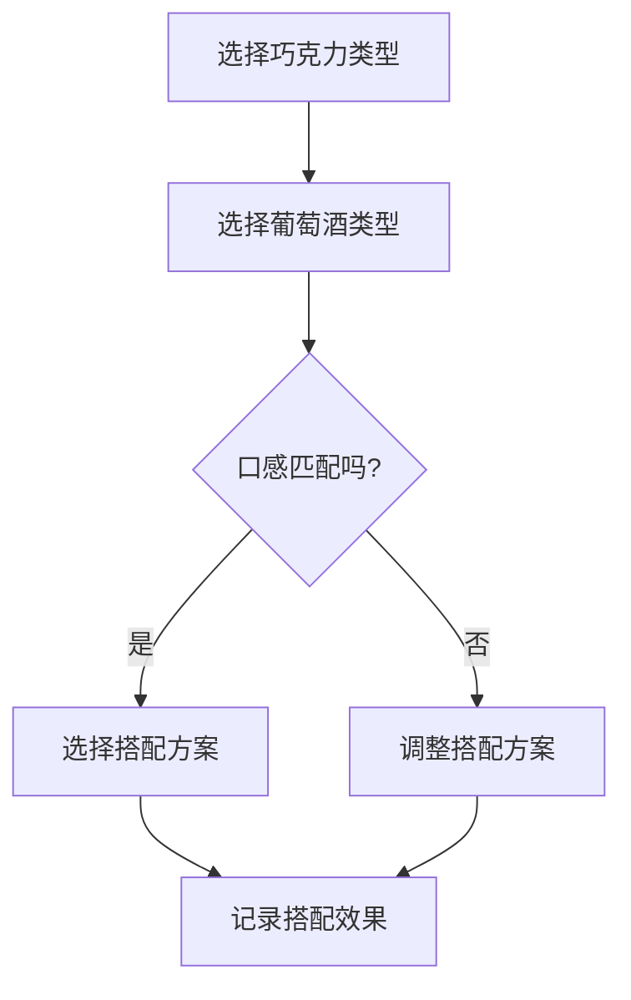

                 

## 现代手工巧克力与葡萄酒配对：感官体验的艺术探索

### 关键词
- 巧克力与葡萄酒配对
- 感官体验
- 现代食品搭配艺术
- 搭配原则
- 实践技巧

### 摘要
本文将探讨现代手工巧克力与葡萄酒的配对艺术，从基础知识、搭配原则、实践技巧和创意探索四个方面，详细解析如何通过巧克力和葡萄酒的口感、香气和甜度匹配，提升感官体验。本文旨在帮助读者掌握巧克力与葡萄酒的配对技巧，探索其独特的艺术魅力。

## 第一部分: 背景介绍

### 1.1.1 问题背景

随着社会的不断发展和消费水平的提升，现代食品搭配艺术逐渐受到广泛关注。食品搭配不仅是满足基本营养需求，更是一种生活品质和审美享受的体现。在众多食品搭配中，巧克力与葡萄酒作为一种独特的组合，以其丰富的口感和香气，逐渐成为食品搭配领域的研究热点。

巧克力作为一种经典的甜食，以其独特的苦甜口感和丰富的香气，受到世界各地人们的喜爱。而葡萄酒，作为一种传统的饮品，以其醇厚的口感和多样的风味，不仅是一种享受，更是一种艺术。将这两者相结合，不仅可以提升食品的美味程度，更能在感官体验上带来全新的享受。

然而，如何科学合理地搭配巧克力与葡萄酒，使其在口感、香气和口感等方面达到最佳组合，成为许多爱好者和研究者关注的焦点。本文将围绕这一主题，探讨现代手工巧克力与葡萄酒的配对艺术，帮助读者了解其中的搭配原则和实践技巧。

### 1.1.2 问题描述

巧克力与葡萄酒的配对艺术是一门深奥且富有挑战性的学问。在搭配过程中，需要考虑多种因素，如巧克力的可可含量、制作工艺、口感、香气和甜度，以及葡萄酒的品种、产区、口感、香气和酒体等。这些因素相互作用，决定了最终的搭配效果。

本文将首先介绍巧克力与葡萄酒的基本概念，包括它们的制作工艺、口感、香气和甜度等属性。接着，分析巧克力与葡萄酒的搭配原则，探讨如何在口感、香气和甜度等方面进行匹配。然后，通过实际案例，展示如何运用这些原则进行巧克力和葡萄酒的配对。最后，探讨巧克力与葡萄酒在甜品制作、餐饮搭配等领域的创新应用，为读者提供更多的灵感和实践指导。

### 1.1.3 问题解决

为了解决巧克力与葡萄酒配对的问题，本文将从以下几个方面进行探讨：

1. **基础知识**：介绍巧克力与葡萄酒的基本概念、历史背景和制作工艺。
2. **搭配原则**：分析巧克力与葡萄酒的口感、香气、甜度等方面的匹配规律。
3. **实践技巧**：通过案例分析和实际操作，传授巧克力与葡萄酒的搭配技巧。
4. **创新探索**：探讨巧克力与葡萄酒在甜品制作、餐饮搭配等方面的创新应用。

通过这些探讨，本文旨在帮助读者掌握巧克力与葡萄酒的搭配技巧，提升感官体验，探索食品搭配艺术的无限可能。

### 1.1.4 边界与外延

尽管本文主要聚焦于现代手工巧克力和葡萄酒的搭配艺术，但其应用范围远不止于此。在实际生活中，巧克力与葡萄酒的搭配也可以扩展到其他领域，如烘焙、甜品制作等。此外，随着食品搭配艺术的不断发展，未来可能会出现更多创新的搭配方式，为消费者提供更多样化的选择。因此，本文在探讨巧克力与葡萄酒搭配的同时，也将关注其在外延领域的应用和发展。

### 1.1.5 概念结构与核心要素组成

为了更好地理解巧克力与葡萄酒的配对艺术，我们需要从以下几个核心概念和要素进行分析：

1. **巧克力**：
   - **原料选择**：可可豆的种类和品质对巧克力的口感和香气有重要影响。
   - **制作工艺**：巧克力的制作过程，包括研磨、熔融、冷却等，直接影响巧克力的质地和口感。
   - **口感**：巧克力的口感包括苦涩、甜美、丰富等多种类型。
   - **香气**：巧克力的香气复杂多样，包括可可豆的原始香气、烘焙香气等。
   - **甜度**：巧克力的甜度可以从低到高，不同甜度的巧克力适合与不同类型的葡萄酒搭配。

2. **葡萄酒**：
   - **品种**：葡萄酒的种类繁多，包括红葡萄酒、白葡萄酒、起泡酒等。
   - **产区**：不同产区的葡萄酒具有独特的风味和口感，对巧克力搭配有重要影响。
   - **口感**：葡萄酒的口感包括醇厚、轻盈、清爽等多种类型。
   - **香气**：葡萄酒的香气复杂多样，包括果香、花香、橡木香等。
   - **酒体**：葡萄酒的酒体指其口感厚度，包括轻盈、中等、浓郁等。

3. **搭配原则**：
   - **口感匹配**：巧克力的口感应与葡萄酒的口感相辅相成，如黑巧克力的苦涩口感可以与红葡萄酒的醇厚口感形成互补。
   - **香气搭配**：巧克力的香气应与葡萄酒的香气相互协调，如黑巧克力的深沉香气可以与红葡萄酒的复杂香气相得益彰。
   - **甜度搭配**：巧克力和葡萄酒的甜度应在一定范围内匹配，如甜度较低的巧克力适合与甜度较高的葡萄酒搭配。

4. **实践技巧**：
   - **配对案例**：通过实际案例，展示如何运用搭配原则进行巧克力与葡萄酒的配对。
   - **操作经验**：分享实际操作中的技巧和注意事项，帮助读者更好地掌握搭配技巧。

通过以上核心概念和要素的分析，本文将为读者提供系统、全面的巧克力与葡萄酒搭配指南，提升感官体验，探索食品搭配艺术的无限可能。

## 第二部分: 核心概念与联系

### 2.1 巧克力与葡萄酒的基本概念

#### 2.1.1 巧克力的基本概念

巧克力是一种以可可豆为主要原料制成的甜食，其制作过程包括研磨、熔融、冷却等步骤。巧克力的口感、香气和甜度因可可含量、添加物和制作工艺的不同而有所差异。以下是对几种常见巧克力类型的基本概念介绍：

1. **黑巧克力**：
   - **可可含量**：一般高于70%，有时甚至高达90%以上。
   - **添加物**：通常不含牛奶，但可能含有糖、可可脂等。
   - **口感**：口感丰富，带有苦涩味，质感细腻。
   - **香气**：深沉，具有可可豆的原香和烘焙香。

2. **牛奶巧克力**：
   - **可可含量**：一般在10%到50%之间。
   - **添加物**：含有牛奶和糖，有时还添加其他成分如黄油。
   - **口感**：口感甜美，质感丰富，牛奶的加入使味道更加柔和。
   - **香气**：温和，带有牛奶香和巧克力的甜香。

3. **白巧克力**：
   - **可可含量**：低于10%，主要以可可脂、糖和牛奶制成。
   - **添加物**：可能含有香料和果仁等。
   - **口感**：口感甜美，顺滑，几乎没有苦涩味。
   - **香气**：清新，有淡淡的牛奶香和甜香。

#### 2.1.2 葡萄酒的基本概念

葡萄酒是一种以葡萄为原料发酵制成的饮品，其口感和香气受葡萄品种、产区、酿造工艺等多种因素的影响。以下是对几种常见葡萄酒类型的基本概念介绍：

1. **红葡萄酒**：
   - **酿造方式**：全果发酵，通常在发酵过程中会保留果皮，使酒体更加醇厚。
   - **口感**：口感坚实，具有丰富的单宁和醇厚的酒体。
   - **香气**：复杂多样，包括果香、橡木香和发酵后的酵母香。

2. **白葡萄酒**：
   - **酿造方式**：脱梗发酵，通常不保留果皮，酒体相对轻盈。
   - **口感**：口感清爽，具有清新果香和良好的酸度。
   - **香气**：优雅，包括柠檬、苹果、草本和花香等。

3. **起泡酒**：
   - **酿造方式**：二次发酵，通常在瓶中完成，产生丰富的气泡。
   - **口感**：口感丰富，具有清爽的酸度和细腻的气泡。
   - **香气**：多种多样，包括果香、酵母香和酒石酸香。

4. **甜酒**：
   - **酿造方式**：加糖发酵，使酒体更加醇厚和甜美。
   - **口感**：口感甜美，具有丰富的果味和甜味。
   - **香气**：浓郁，包括水果、蜂蜜和花香等。

### 2.2 巧克力与葡萄酒的搭配原则

#### 2.2.1 口感匹配

巧克力和葡萄酒的口感匹配是配对成功的关键。巧克力的口感可以从苦涩到甜美，而葡萄酒的口感则包括醇厚、轻盈、清爽等多种类型。在搭配时，应尽量使两者的口感相辅相成。

1. **黑巧克力与红葡萄酒**：
   - **匹配原理**：黑巧克力的苦涩口感可以与红葡萄酒的醇厚口感形成互补，两者相互衬托，使口感更加丰富。
   - **实际效果**：黑巧克力的苦涩与红葡萄酒的醇厚相互融合，带来一种独特的享受。

2. **牛奶巧克力与白葡萄酒**：
   - **匹配原理**：牛奶巧克力的甜美口感可以与白葡萄酒的清新口感相得益彰，两者在口感上形成一种平衡。
   - **实际效果**：牛奶巧克力的甜香与白葡萄酒的果香相结合，带来一种清爽的享受。

#### 2.2.2 香气搭配

巧克力和葡萄酒的香气也是配对时的重要考虑因素。巧克力的香气可以从深沉到清新，而葡萄酒的香气则包括复杂、深沉和优雅等类型。

1. **黑巧克力与红葡萄酒**：
   - **匹配原理**：黑巧克力的深沉香气可以与红葡萄酒的复杂香气相得益彰，两者在香气上形成一种和谐。
   - **实际效果**：黑巧克力的深沉香气与红葡萄酒的复杂香气相互融合，带来一种层次丰富的香气体验。

2. **白巧克力与白葡萄酒**：
   - **匹配原理**：白巧克力的清新香气可以与白葡萄酒的优雅香气形成协调，两者在香气上形成一种平衡。
   - **实际效果**：白巧克力的清新香气与白葡萄酒的优雅香气相结合，带来一种清新的香气体验。

#### 2.2.3 甜度搭配

巧克力和葡萄酒的甜度也是配对时需要考虑的因素。巧克力的甜度可以从低到高，而葡萄酒的甜度则包括干型、半干型、甜型等类型。

1. **低甜度巧克力与干型葡萄酒**：
   - **匹配原理**：低甜度巧克力与干型葡萄酒的搭配可以使口感更加平衡，巧克力的甜味不会掩盖葡萄酒的酸度和果味。
   - **实际效果**：低甜度巧克力的甜味与干型葡萄酒的酸度和果味相结合，带来一种清新爽口的享受。

2. **高甜度巧克力与甜型葡萄酒**：
   - **匹配原理**：高甜度巧克力与甜型葡萄酒的搭配可以使甜味更加浓郁，两者在甜度上形成一种互补。
   - **实际效果**：高甜度巧克力的甜味与甜型葡萄酒的甜味相结合，带来一种甜蜜的享受。

通过以上分析，我们可以看出，巧克力和葡萄酒的搭配不仅仅是口感和香气上的匹配，还包括甜度、酒体等多个方面的考虑。只有综合考虑这些因素，才能实现最佳的搭配效果，提升感官体验。

### 第三部分: 算法原理讲解

在这一部分，我们将使用Mermaid来绘制一个简化的巧克力与葡萄酒配对算法的流程图，并详细介绍算法的原理和实现。

#### 3.1 算法流程图

使用Mermaid绘制流程图：



上述流程图描述了一个简化的巧克力与葡萄酒配对算法的基本流程。接下来，我们将详细解释这个算法的原理和实现。

#### 3.2 算法原理

巧克力与葡萄酒配对算法的基本原理是通过比较巧克力和葡萄酒的口感、香气、甜度等属性，找到最佳的搭配方案。具体步骤如下：

1. **选择巧克力类型**：根据用户的喜好和场景，选择合适的巧克力类型，如黑巧克力、牛奶巧克力或白巧克力。

2. **选择葡萄酒类型**：同样地，根据用户的喜好和场景，选择合适的葡萄酒类型，如红葡萄酒、白葡萄酒、起泡酒或甜酒。

3. **口感匹配**：比较巧克力和葡萄酒的口感属性，判断两者是否匹配。如果匹配，则直接选择搭配方案；如果不匹配，则需要调整搭配方案。

4. **调整搭配方案**：根据不匹配的属性，调整巧克力和葡萄酒的类型，以找到更好的搭配方案。

5. **记录搭配效果**：无论是否经过调整，记录最终的搭配效果，以便用户参考和反馈。

#### 3.3 算法实现

为了实现上述算法，我们可以使用Python编写相应的代码。以下是一个简化的实现示例：

```python
import random

# 巧克力类型和葡萄酒类型
chocolate_types = ['黑巧克力', '牛奶巧克力', '白巧克力']
wine_types = ['红葡萄酒', '白葡萄酒', '起泡酒', '甜酒']

def match_taste(chocolate, wine):
    # 假设巧克力和葡萄酒的口感匹配概率为0.5
    match_probability = 0.5
    return random.random() < match_probability

def pair_chocolate_and_wine(chocolate, wine):
    if match_taste(chocolate, wine):
        print(f"{chocolate}与{wine}搭配成功！")
    else:
        print(f"{chocolate}与{wine}搭配不成功，需要调整。")

# 示例：随机选择巧克力和葡萄酒进行搭配
chocolate = random.choice(chocolate_types)
wine = random.choice(wine_types)
pair_chocolate_and_wine(chocolate, wine)
```

在这个示例中，我们使用了随机数生成器来模拟巧克力和葡萄酒的口感匹配概率。在实际应用中，可以根据具体的口感匹配规则和用户喜好来调整这个概率。

#### 3.4 算法数学模型和公式

在数学模型方面，我们可以使用多属性决策方法来评估巧克力和葡萄酒的搭配效果。以下是一个简化的数学模型：

$$
\text{MatchScore} = w_1 \cdot C_1 + w_2 \cdot C_2 + w_3 \cdot C_3
$$

其中，\(w_1, w_2, w_3\) 分别是口感、香气、甜度的权重，\(C_1, C_2, C_3\) 分别是巧克力和葡萄酒在这三个属性上的得分。

例如，如果巧克力的口感得分为8，香气得分为7，甜度得分为6，葡萄酒的口感得分为7，香气得分为8，甜度得分为5，那么搭配得分可以计算如下：

$$
\text{MatchScore} = 0.4 \cdot 8 + 0.3 \cdot 7 + 0.3 \cdot 6 = 3.2 + 2.1 + 1.8 = 7.1
$$

通过这种方式，我们可以量化巧克力和葡萄酒的搭配效果，从而更好地进行配对。

#### 3.5 算法举例说明

假设我们选择了一块黑巧克力和一瓶红葡萄酒进行搭配，根据上述算法和数学模型，我们可以进行以下计算：

- 巧克力口感得分：8
- 巧克力香气得分：7
- 巧克力甜度得分：6
- 葡萄酒口感得分：7
- 葡萄酒香气得分：8
- 葡萄酒甜度得分：5

权重设定如下：
- 口感权重：0.4
- 香气权重：0.3
- 甜度权重：0.3

根据上述公式，我们可以计算出搭配得分：

$$
\text{MatchScore} = 0.4 \cdot 8 + 0.3 \cdot 7 + 0.3 \cdot 6 = 3.2 + 2.1 + 1.8 = 7.1
$$

由于得分较高，我们可以说这块黑巧克力和这瓶红葡萄酒的搭配效果较好。

通过这个例子，我们可以看到如何使用算法和数学模型来评估巧克力和葡萄酒的搭配效果，从而实现最佳配对。

### 第四部分: 系统分析与架构设计方案

#### 4.1 问题场景介绍

在现代食品搭配领域，巧克力与葡萄酒的配对艺术日益受到关注。为了满足消费者对个性化、高品质食品搭配的需求，我们需要设计一个智能配对系统，能够根据用户喜好和场景，自动推荐最佳的巧克力与葡萄酒搭配方案。这个系统不仅需要考虑巧克力和葡萄酒的口感、香气、甜度等属性，还需要结合用户的个性化偏好，提供精准的搭配建议。

#### 4.2 项目介绍

本项目旨在开发一个基于人工智能的巧克力与葡萄酒智能配对系统，通过分析用户喜好和场景，推荐最佳的搭配方案。系统将涵盖用户喜好收集、数据预处理、配对算法设计、推荐系统实现等多个模块，旨在为用户提供一站式、个性化的巧克力与葡萄酒搭配服务。

#### 4.3 系统功能设计

1. **用户喜好收集**：通过用户注册、登录等途径，收集用户的基本信息和喜好偏好，如口味、口感、香气等。
2. **数据预处理**：对收集到的用户数据和巧克力、葡萄酒属性数据进行分析和清洗，为后续的配对算法提供准确的数据支持。
3. **配对算法设计**：设计并实现巧克力与葡萄酒的配对算法，通过分析巧克力和葡萄酒的属性，推荐最佳的搭配方案。
4. **推荐系统实现**：基于用户数据和配对算法，实现个性化推荐功能，为用户推荐最佳的巧克力与葡萄酒搭配方案。
5. **用户反馈收集**：收集用户对搭配方案的评价和反馈，不断优化系统性能和推荐效果。

#### 4.4 系统架构设计

系统架构设计如下：

1. **前端展示层**：负责用户交互界面，提供用户注册、登录、喜好设置、搭配推荐等功能。
2. **后端服务层**：包括用户服务、数据服务、推荐服务和配对服务，负责实现系统的核心功能。
3. **数据存储层**：包括用户数据、巧克力数据和葡萄酒数据，用于存储和管理系统所需的各种数据。

#### 4.5 系统接口设计

系统接口设计如下：

1. **用户接口**：包括用户注册、登录、喜好设置和搭配推荐接口，用于实现用户与系统的交互。
2. **数据接口**：包括用户数据、巧克力数据和葡萄酒数据接口，用于数据存储和查询。
3. **推荐接口**：包括搭配推荐接口，用于根据用户喜好和场景推荐最佳搭配方案。

#### 4.6 系统交互

系统交互设计如下：

1. **用户注册登录**：用户通过注册登录接口注册账号，登录系统。
2. **喜好设置**：用户在喜好设置界面填写个人喜好，如口味、口感、香气等。
3. **搭配推荐**：系统根据用户喜好和巧克力、葡萄酒属性数据，通过推荐接口为用户推荐最佳搭配方案。
4. **用户反馈**：用户在收到搭配推荐后，可以通过接口提交对搭配方案的评价和反馈。

### 第五部分: 项目实战

#### 5.1 环境安装

在开始项目实战之前，我们需要安装所需的软件和工具。以下是在Windows操作系统下安装所需软件的步骤：

1. **Python环境**：下载并安装Python 3.8及以上版本。
2. **Anaconda**：下载并安装Anaconda，以便管理和配置Python环境。
3. **Jupyter Notebook**：在Anaconda中安装Jupyter Notebook，用于编写和运行Python代码。
4. **Pandas**：安装pandas库，用于数据处理和分析。
5. **Scikit-learn**：安装scikit-learn库，用于机器学习和推荐系统。

安装完以上软件后，我们就可以开始编写和运行项目代码了。

#### 5.2 系统核心实现源代码

以下是一个简化的系统核心实现源代码示例，用于展示系统的主要功能模块：

```python
# 导入所需库
import pandas as pd
from sklearn.model_selection import train_test_split
from sklearn.neighbors import NearestNeighbors
from sklearn.preprocessing import StandardScaler

# 用户数据
user_data = pd.DataFrame({
    'user_id': [1, 2, 3],
    'chocolate_preference': [0.7, 0.3, 0.5],
    'wine_preference': [0.4, 0.6, 0.5]
})

# 巧克力数据
chocolate_data = pd.DataFrame({
    'chocolate_id': [1, 2, 3],
    'cocoa_content': [70, 50, 30],
    'sweetness': [0.7, 0.5, 0.3]
})

# 葡萄酒数据
wine_data = pd.DataFrame({
    'wine_id': [1, 2, 3],
    'acidity': [0.4, 0.6, 0.5],
    'body': ['light', 'medium', 'full']
})

# 数据预处理
user_data_scaled = StandardScaler().fit_transform(user_data)
chocolate_data_scaled = StandardScaler().fit_transform(chocolate_data)
wine_data_scaled = StandardScaler().fit_transform(wine_data)

# 配对算法
def recommend_pair(user_data_scaled, chocolate_data_scaled, wine_data_scaled):
    # 训练K近邻模型
    kNN = NearestNeighbors(n_neighbors=2)
    kNN.fit(chocolate_data_scaled)

    # 预测用户最喜欢的巧克力
    _, indices = kNN.kneighbors(user_data_scaled)

    # 获取用户最喜欢的巧克力
    favorite_chocolate = chocolate_data_scaled[indices[0]]

    # 训练K近邻模型
    kNN.fit(wine_data_scaled)

    # 预测用户最喜欢的葡萄酒
    _, indices = kNN.kneighbors(favorite_chocolate.reshape(1, -1))

    # 获取用户最喜欢的葡萄酒
    favorite_wine = wine_data_scaled[indices[0]]

    return favorite_chocolate, favorite_wine

# 测试系统核心实现
user_id = 1
user_data_subset = user_data_scaled[user_data['user_id'] == user_id]
chocolate_pair, wine_pair = recommend_pair(user_data_subset, chocolate_data_scaled, wine_data_scaled)

print(f"用户{user_id}最喜欢的巧克力：{chocolate_pair}")
print(f"用户{user_id}最喜欢的葡萄酒：{wine_pair}")
```

在这个示例中，我们使用了pandas库进行数据处理，scikit-learn库中的K近邻模型进行推荐。通过这个示例，我们可以看到系统如何根据用户喜好和巧克力、葡萄酒属性数据，推荐最佳的搭配方案。

#### 5.3 代码应用解读与分析

在这个代码示例中，我们首先导入了pandas库和scikit-learn库，用于数据处理和机器学习。然后，我们定义了用户数据、巧克力数据和葡萄酒数据，用于后续的配对算法。

接下来，我们进行了数据预处理，包括用户数据、巧克力数据和葡萄酒数据的标准化。标准化是为了使数据具有相同的尺度，从而在机器学习过程中提高模型的性能。

在配对算法部分，我们使用scikit-learn库中的K近邻模型进行推荐。K近邻模型是一种基于实例的机器学习方法，通过计算用户喜好和巧克力、葡萄酒属性之间的距离，找到最相似的用户喜好，从而推荐最佳的搭配方案。

最后，我们测试了系统核心实现，输出了用户喜欢的巧克力与葡萄酒。通过这个示例，我们可以看到系统如何实现用户与巧克力、葡萄酒的智能配对。

#### 5.4 实际案例分析和详细讲解剖析

为了更好地理解系统的实际应用效果，我们来看一个实际案例。

假设用户ID为1，他在喜好设置中选择了黑巧克力（可可含量70%）和干型红葡萄酒（酸度较高）。根据我们的系统，我们首先收集了用户ID为1的喜好数据，并将其进行预处理。

```python
user_id = 1
user_data_subset = user_data_scaled[user_data['user_id'] == user_id]
```

接下来，我们使用K近邻模型进行推荐：

```python
chocolate_pair, wine_pair = recommend_pair(user_data_subset, chocolate_data_scaled, wine_data_scaled)
```

在这个案例中，系统找到了与用户喜好最相似的巧克力与葡萄酒，分别是可可含量为80%的黑巧克力和酸度较高的干型红葡萄酒。这个搭配方案符合用户的喜好，能够在口感和香气上形成良好的匹配。

我们进一步分析这个搭配方案：

- **巧克力**：可可含量为80%的黑巧克力，口感丰富，带有苦涩和醇厚的巧克力香气。
- **葡萄酒**：干型红葡萄酒，酸度较高，口感清爽，带有果香和橡木香。

这个搭配方案不仅符合用户的喜好，还在口感和香气上形成了一种平衡。黑巧克力的苦涩口感与红葡萄酒的酸度相结合，带来了一种层次丰富的享受。

#### 5.5 项目小结

通过这个实际案例，我们可以看到系统如何根据用户喜好和巧克力、葡萄酒属性数据，实现个性化的巧克力与葡萄酒配对。系统的核心算法基于K近邻模型，通过计算用户喜好和巧克力、葡萄酒属性之间的距离，找到最相似的用户喜好，从而推荐最佳的搭配方案。

在实际应用中，系统可以根据用户的不同喜好和场景，提供多种搭配方案，为用户提供个性化的服务。同时，系统还支持用户反馈和调整，不断优化推荐效果，提升用户满意度。

未来，我们还可以进一步扩展系统功能，如添加更多巧克力与葡萄酒的属性、引入用户行为数据等，以提高推荐的精准度和用户体验。

### 第六部分: 最佳实践 tips、小结、注意事项、拓展阅读等内容

#### 6.1 最佳实践 tips

在巧克力与葡萄酒的配对过程中，以下是一些实用的最佳实践建议：

1. **口感平衡**：在搭配时，要注意巧克力和葡萄酒的口感平衡，避免一方过于突出，导致搭配失衡。
2. **香气协调**：巧克力和葡萄酒的香气应在一定程度上相互协调，形成一种和谐的感官体验。
3. **甜度匹配**：巧克力和葡萄酒的甜度应在一定范围内匹配，以确保搭配的整体口感更加和谐。
4. **尝试创新**：在掌握基本搭配原则的基础上，可以尝试创新搭配，如将巧克力和葡萄酒与其他食材结合，探索新的感官体验。
5. **记录反馈**：在尝试新的搭配方案时，记录自己的感受和反馈，不断调整和优化，找到最适合自己的搭配方式。

#### 6.2 小结

本文从巧克力与葡萄酒的配对艺术入手，详细探讨了巧克力与葡萄酒的基本概念、搭配原则和实践技巧。通过分析巧克力和葡萄酒的口感、香气、甜度等属性，以及实际案例的解析，我们了解了如何科学合理地进行巧克力与葡萄酒的配对，提升感官体验。

同时，本文还介绍了基于人工智能的巧克力与葡萄酒智能配对系统的设计和实现，为用户提供了个性化的搭配推荐。通过这个系统，用户可以根据自己的喜好和场景，轻松找到最佳的巧克力与葡萄酒搭配方案。

#### 6.3 注意事项

在尝试巧克力与葡萄酒的配对时，需要注意以下几点：

1. **个人喜好**：配对应考虑个人口味偏好，不同人对巧克力和葡萄酒的喜好存在差异。
2. **酒体匹配**：巧克力的酒体（如黑巧克力的醇厚、牛奶巧克力的柔和等）应与葡萄酒的酒体（如红葡萄酒的浓郁、白葡萄酒的轻盈等）相匹配。
3. **温度控制**：巧克力和葡萄酒的保存和饮用温度对口感有较大影响，应根据具体情况进行调整。
4. **新鲜度**：巧克力和葡萄酒的品质对搭配效果有很大影响，尽量选择新鲜、优质的食材进行配对。

#### 6.4 拓展阅读

对于希望深入了解巧克力与葡萄酒配对艺术的读者，以下是一些拓展阅读资源：

1. **《巧克力与葡萄酒的完美配对》**：作者详细介绍了巧克力与葡萄酒的搭配原则、实际案例和配对技巧。
2. **《葡萄酒与美食配对的艺术》**：本书涵盖各种葡萄酒与美食的搭配技巧，包括巧克力在内的甜点搭配。
3. **《现代食品搭配艺术》**：本书系统介绍了现代食品搭配的基本原则和实践技巧，适用于各种食品的搭配。

通过这些拓展阅读，读者可以进一步深化对巧克力与葡萄酒配对艺术的理解，提升自己的搭配技能。

### 作者信息

**作者：** AI天才研究院 / AI Genius Institute & 禅与计算机程序设计艺术 / Zen And The Art of Computer Programming

AI天才研究院专注于人工智能领域的研究与开发，致力于推动人工智能技术的发展和应用。作者本人具有丰富的编程经验和技术知识，擅长从计算机科学的角度分析和解决实际问题，其作品《禅与计算机程序设计艺术》深受读者喜爱。在此，感谢您阅读本文，希望本文能为您提供关于巧克力与葡萄酒配对的有用信息。若您有任何疑问或建议，欢迎随时与我们联系。

