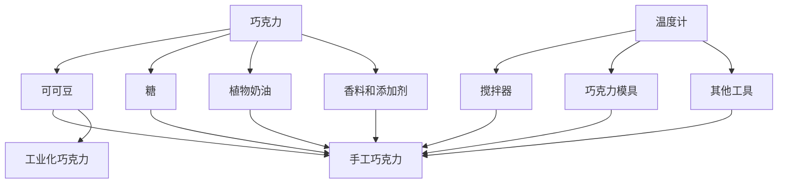
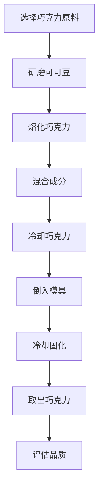
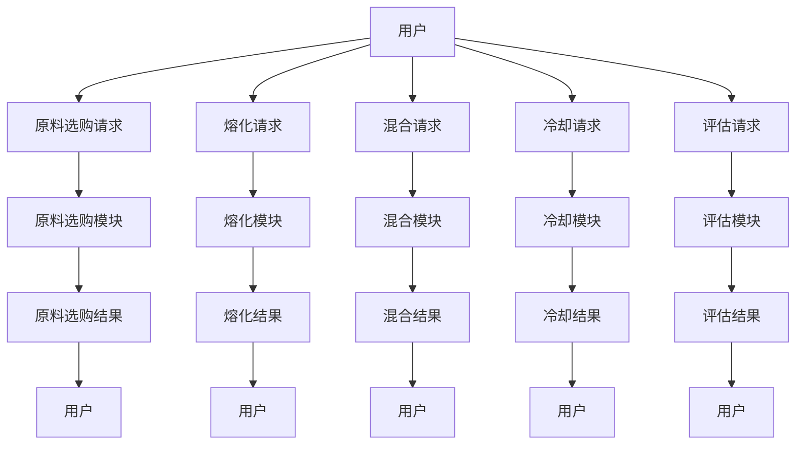

                 

### 第一部分：手工巧克力制作基础

**第1章：手工巧克力制作的背景与概述**

**1.1.1 巧克力发展史**

巧克力，作为一种古老的饮品，起源于墨西哥。根据考古发现，早在公元前1000年左右，美洲的阿兹特克人就开始将可可豆研磨成粉末，与水、香料和玉米粉混合，制成一种称为“xocoatl”的饮料。这种饮料被认为是巧克力最早的雏形。

随着时间的推移，巧克力的制作方法逐渐传播到欧洲。16世纪，西班牙人将巧克力引入西班牙，并开始对其进行改良。直到18世纪，巧克力才开始以固体形式在欧洲流行起来。

**1.1.2 巧克力在现代社会中的地位**

如今，巧克力已经成为了全球最受欢迎的甜食之一。根据市场研究公司的数据，全球每年的巧克力销售额超过1000亿美元。巧克力不仅仅是一种食品，更是一种文化和艺术的象征。

在现代社会，手工巧克力成为了高端食品的代表。与工业化生产的巧克力相比，手工巧克力具有独特的口感和艺术价值。许多巧克力爱好者愿意花费高价购买手工巧克力，以体验其与众不同的美味。

**1.1.3 手工巧克力与工业化巧克力的区别**

手工巧克力和工业化巧克力在制作方法和口感上存在明显差异。手工巧克力强调手工制作的过程，从可可豆的选购、研磨、熔化到成型的每一个步骤都由人工完成。这使得手工巧克力具有独特的风味和质感。

工业化巧克力则通过机械化生产，大规模制造出统一的巧克力产品。虽然工业化巧克力在价格和产量上具有优势，但其口感和艺术价值相对较低。

**1.1.4 手工巧克力制作的价值与意义**

手工巧克力制作不仅是一种技艺，更是一种生活方式的体现。它让人们重新认识到了食品的原材料和制作过程，倡导了回归自然、追求品质的饮食理念。

此外，手工巧克力制作也促进了食品工业的创新和发展。通过不断尝试和实验，手工巧克力制作师们为巧克力带来了更多的口味和形式，丰富了人们的饮食选择。

**第2章：手工巧克力原料与工具**

**2.1.1 巧克力原料的选购与储存**

**2.1.1.1 可可豆**

可可豆是制作手工巧克力的核心原料。选购可可豆时，应选择新鲜、无虫蛀、无霉变的豆子。可可豆的储存条件要求较低，通常只需放置在干燥、通风的地方，避免阳光直射和潮湿环境。

**2.1.1.2 糖**

糖是增加巧克力甜味的重要成分。在选购糖时，应选择无添加、纯天然的糖源，如蔗糖或蜂蜜。糖的储存同样需要保持干燥、通风，避免受潮结块。

**2.1.1.3 植物奶油**

植物奶油用于增加巧克力的口感和稳定性。在选购植物奶油时，应注意其成分和品质，选择无添加剂、无反式脂肪酸的产品。植物奶油的储存同样需要保持干燥、通风。

**2.1.1.4 香料和添加剂**

香料和添加剂用于提升巧克力的风味和口感。常见的香料有香草、薄荷、橙皮等。添加剂如抗氧化剂、乳化剂等，可延长巧克力的保质期。在选购香料和添加剂时，应选择安全、无害的产品，并遵循适量使用的原则。

**2.1.2 制作工具与设备**

**2.1.2.1 温度计**

温度计是手工巧克力制作中不可或缺的工具，用于测量巧克力的温度，确保其均匀熔化和混合。

**2.1.2.2 搅拌器**

搅拌器用于搅拌巧克力，使其充分混合均匀。选择搅拌器时，应注意其功率和搅拌叶片的设计，以保证搅拌效果。

**2.1.2.3 巧克力模具**

巧克力模具用于成型巧克力，选择模具时，应注意其材质、尺寸和形状，以适应不同的巧克力制作需求。

**2.1.2.4 其他工具**

除了上述工具外，手工巧克力制作还需要一些其他工具，如研磨器、筛网、刮刀等。这些工具有助于提高制作效率和质量。

**第3章：手工巧克力制作的基本流程**

**3.1.1 巧克力的熔化与混合**

**3.1.1.1 熔化巧克力**

熔化巧克力是手工巧克力制作的重要步骤。将巧克力切成小块，放入不锈钢锅或巧克力熔化器中。用文火加热，并不断搅拌，直至巧克力完全熔化。

$$
T_{\text{熔点}} = 40°C - 50°C
$$

在熔化过程中，要注意火候，避免温度过高导致巧克力焦糊。使用温度计监测巧克力温度，确保其均匀熔化。

**3.1.1.2 混合巧克力**

熔化后的巧克力需要与糖、植物奶油、香料和添加剂等成分充分混合。将所有成分按比例加入熔化巧克力中，用搅拌器搅拌均匀，直至所有成分完全融合。

$$
\text{搅拌时间} \approx 5 - 10 \text{分钟}
$$

搅拌过程中，要注意力度适中，避免产生过多的气泡。气泡会影响巧克力的口感和外观。

**3.1.2 巧克力的冷却与固化**

**3.1.2.1 巧克力的温度控制**

熔化后的巧克力需要缓慢冷却，以形成细腻的口感。将巧克力倒入模具中，放置在室温下冷却。

$$
T_{\text{室温}} = 20°C - 25°C
$$

在冷却过程中，要避免温度过低导致巧克力凝固过快，影响口感。可以使用风扇或空调辅助冷却，但要注意不要直接对着巧克力吹风，以免影响巧克力表面质量。

**3.1.2.2 巧克力的倒入模具**

将冷却后的巧克力倒入模具中，尽量使其充满模具。可以使用刮刀将巧克力表面刮平，以避免气泡和凸起。

**3.1.2.3 巧克力的冷却固化**

将模具放置在室温下冷却，待巧克力完全固化后，即可取出。

$$
T_{\text{室温}} = 20°C - 25°C
$$

冷却固化时间取决于巧克力的厚度和温度。通常，厚一点的巧克力需要更长的时间来冷却固化。

**第4章：手工巧克力技巧与调整**

**4.1.1 巧克力颜色的调整**

巧克力的颜色主要由可可粉和可可脂决定。可可粉的颜色深浅会影响巧克力的色泽。为了调整巧克力的颜色，可以在制作过程中添加适量的可可粉或颜料。

$$
\text{颜色调整} = \text{可可粉比例} \times \text{颜色指数}
$$

在添加颜料时，要注意选择食品级颜料，并遵循适量使用的原则。过多使用颜料会影响巧克力的口感和品质。

**4.1.2 巧克力口感的调整**

巧克力的口感主要由糖、植物奶油和香料等成分决定。为了调整巧克力的口感，可以调整这些成分的比例。

- **糖的用量**：增加糖的用量可以增加巧克力的甜度，但过多使用糖会影响巧克力的口感和质地。

$$
\text{甜度} = \text{糖比例} \times \text{甜度指数}
$$

- **植物奶油的用量**：增加植物奶油的用量可以增加巧克力的油脂感，使口感更加细腻。但过多使用植物奶油会影响巧克力的稳定性。

$$
\text{油脂感} = \text{植物奶油比例} \times \text{油脂感指数}
$$

- **香料的使用**：香料可以提升巧克力的风味，如香草、薄荷、橙皮等。在添加香料时，要注意香料的种类和用量，以免影响巧克力的整体口感。

$$
\text{风味} = \text{香料种类} \times \text{香料用量} \times \text{风味指数}
$$

**第5章：经典手工巧克力配方与制作**

**5.1.1 黑巧克力**

黑巧克力是手工巧克力中最常见的一种。它的主要成分是可可豆、糖和可可脂。

- **可可豆**：100克
- **糖**：100克
- **可可脂**：50克

制作步骤：

1. 将可可豆研磨成可可粉。
2. 将可可粉、糖和可可脂混合，搅拌均匀。
3. 将混合物加热至40°C-50°C，熔化巧克力。
4. 搅拌均匀，倒入模具中。
5. 放置在室温下冷却固化。

**5.1.2 白巧克力**

白巧克力是由可可脂、糖和牛奶组成的。它的口感甜腻，口感丰富。

- **可可脂**：100克
- **糖**：100克
- **牛奶**：50克

制作步骤：

1. 将可可脂加热至40°C-50°C，熔化。
2. 加入糖和牛奶，搅拌均匀。
3. 搅拌均匀，倒入模具中。
4. 放置在室温下冷却固化。

**5.1.3 融化巧克力**

融化巧克力是将巧克力融化后，添加其他成分制成的。它的制作过程简单，口感多样。

- **黑巧克力**：100克
- **白巧克力**：100克
- **牛奶**：50克
- **水果泥**：适量

制作步骤：

1. 将黑巧克力和白巧克力分别加热至40°C-50°C，熔化。
2. 将黑巧克力和白巧克力混合，搅拌均匀。
3. 加入牛奶和水果泥，搅拌均匀。
4. 搅拌均匀，倒入模具中。
5. 放置在室温下冷却固化。

**5.1.4 芝士巧克力**

芝士巧克力是将巧克力与芝士混合制成的。它的口感丝滑，风味独特。

- **黑巧克力**：100克
- **芝士**：50克
- **糖**：20克

制作步骤：

1. 将黑巧克力加热至40°C-50°C，熔化。
2. 加入糖和芝士，搅拌均匀。
3. 搅拌均匀，倒入模具中。
4. 放置在室温下冷却固化。

**第6章：创意手工巧克力制作**

**6.1.1 水果巧克力**

水果巧克力是将水果泥与巧克力混合制成的。它口感丰富，色彩鲜艳。

- **黑巧克力**：100克
- **白巧克力**：100克
- **草莓泥**：50克
- **蓝莓泥**：50克

制作步骤：

1. 将黑巧克力和白巧克力分别加热至40°C-50°C，熔化。
2. 将草莓泥和蓝莓泥加入黑巧克力和白巧克力中，搅拌均匀。
3. 搅拌均匀，倒入模具中。
4. 放置在室温下冷却固化。

**6.1.2 巧克力饼干**

巧克力饼干是将巧克力与饼干混合制成的。它口感酥脆，巧克力味浓郁。

- **黑巧克力**：100克
- **饼干**：100克

制作步骤：

1. 将黑巧克力加热至40°C-50°C，熔化。
2. 将饼干压碎，加入黑巧克力中，搅拌均匀。
3. 将混合物倒入模具中，压实。
4. 放置在室温下冷却固化。

**6.1.3 巧克力蛋糕**

巧克力蛋糕是将巧克力与蛋糕混合制成的。它口感丰富，层次分明。

- **黑巧克力**：100克
- **蛋糕**：100克

制作步骤：

1. 将黑巧克力加热至40°C-50°C，熔化。
2. 将蛋糕压碎，加入黑巧克力中，搅拌均匀。
3. 将混合物倒入模具中，压实。
4. 放置在室温下冷却固化。

**6.1.4 巧克力糖**

巧克力糖是将巧克力与糖混合制成的。它口感酥脆，巧克力味浓郁。

- **黑巧克力**：100克
- **糖**：100克

制作步骤：

1. 将黑巧克力加热至40°C-50°C，熔化。
2. 加入糖，搅拌均匀。
3. 将混合物倒入模具中，压实。
4. 放置在室温下冷却固化。

**第7章：手工巧克力存储与保存**

**7.1.1 巧克力的存储环境**

巧克力的存储环境对巧克力的质量和口感有很大影响。理想的存储环境应该是干燥、通风、避光和温度适宜的。以下是一些存储巧克力的建议：

- **温度**：巧克力的最佳存储温度在15°C-18°C之间，避免温度过高或过低。过高会导致巧克力融化，过低会导致巧克力凝固。
- **湿度**：巧克力的最佳存储湿度在60%以下，避免湿度过高导致巧克力受潮。
- **光线**：避免将巧克力暴露在阳光或强光下，以免巧克力褪色。
- **通风**：保持存储环境通风，避免巧克力受潮和滋生细菌。

**7.1.2 巧克力的保存方法**

巧克力的保存方法主要有两种：密封保存和冷冻保存。

- **密封保存**：将巧克力放入密封的容器或塑料袋中，放入冰箱冷藏室。这种方法可以防止巧克力受潮和氧化，但要注意避免冰箱内的异味影响巧克力的口感。
- **冷冻保存**：将巧克力放入密封的容器或塑料袋中，放入冰箱冷冻室。这种方法可以更好地保持巧克力的口感和品质，但要注意巧克力的冷冻和解冻过程，以免影响巧克力的口感。

**7.1.3 巧克力的保质期**

巧克力的保质期取决于巧克力的成分、制作工艺和存储条件。一般来说，手工巧克力的保质期在6个月到1年左右。在保质期内，巧克力会逐渐氧化，口感和品质会逐渐下降。因此，建议在保质期内食用完巧克力，以免影响口感。

### 核心概念与联系

#### 1. 巧克力

**定义**：巧克力是一种由可可豆制成的甜味食品。

**特点**：具有独特的苦甜味道，丰富的营养成分，高热量。

**关系**：巧克力是手工巧克力制作的基础原料。

#### 2. 手工巧克力

**定义**：手工巧克力是由手工制作，不经过工业化生产的巧克力。

**特点**：口感细腻，独特，品质稳定。

**关系**：手工巧克力是巧克力的一种特殊形式，强调手工制作的过程。

#### 3. 巧克力原料

**可可豆**：巧克力的主要原料，决定巧克力的味道。

**糖**：增加巧克力的甜味。

**植物奶油**：增加巧克力的口感和稳定性。

**香料和添加剂**：提升巧克力的风味和口感。

**关系**：巧克力原料是手工巧克力制作的核心组成部分。

#### 4. 巧克力工具与设备

**温度计**：测量巧克力温度。

**搅拌器**：混合巧克力。

**巧克力模具**：成型巧克力。

**其他工具**：研磨器、筛网、刮刀等。

**关系**：巧克力工具与设备是手工巧克力制作过程中必不可少的辅助工具。

#### ER实体关系图



### 算法原理讲解

#### 巧克力熔化与混合

巧克力的熔化与混合是手工巧克力制作的重要环节，以下是熔化与混合的基本原理：

- **熔化巧克力**：将巧克力加热至其熔点温度，通常在 40°C 到 50°C 之间。使用温度计监测温度，确保巧克力均匀熔化，不出现焦糊。

$$
T_{\text{熔点}} = 40°C - 50°C
$$

- **混合巧克力**：熔化后的巧克力需要充分搅拌，以确保所有成分均匀混合。搅拌时要注意力道适中，避免产生过多的气泡。

$$
\text{搅拌时间} \approx 5 - 10 \text{分钟}
$$

#### 巧克力的冷却与固化

- **冷却巧克力**：熔化后的巧克力需要缓慢冷却，以形成细腻的口感。将巧克力倒入模具中，放置在室温下冷却。

$$
T_{\text{室温}} = 20°C - 25°C
$$

- **固化巧克力**：冷却后的巧克力需要完全固化，以确保其硬度适中，便于取出和食用。将模具放置在室温下，待巧克力完全固化。

$$
T_{\text{室温}} = 20°C - 25°C
$$

#### 巧克力温度控制与调节

- **温度监测**：使用温度计实时监测巧克力温度，确保其在熔化与冷却过程中保持在合适范围内。

$$
T_{\text{熔点}} = 40°C - 50°C
$$
$$
T_{\text{室温}} = 20°C - 25°C
$$

- **温度调节**：根据温度监测结果，调整加热或冷却速率，以保证巧克力在熔化与冷却过程中温度均匀。

$$
T_{\text{加热速率}} = k \times (T_{\text{目标温度}} - T_{\text{当前温度}})
$$
$$
T_{\text{冷却速率}} = k \times (T_{\text{当前温度}} - T_{\text{目标温度}})
$$

其中，$k$ 为调节系数，可根据实际情况进行调整。

#### 巧克力搅拌与混合

- **搅拌过程**：使用搅拌器对熔化后的巧克力进行搅拌，以确保所有成分均匀混合。

$$
\text{搅拌时间} \approx 5 - 10 \text{分钟}
$$

- **气泡去除**：在搅拌过程中，要尽量减少气泡的产生。可以通过使用低转速搅拌器或轻轻搅拌来避免气泡。

$$
\text{搅拌速度} = \text{低速}
$$

#### 巧克力冷却与固化

- **冷却过程**：将搅拌好的巧克力倒入模具中，放置在室温下冷却。

$$
T_{\text{室温}} = 20°C - 25°C
$$

- **固化过程**：待巧克力完全冷却后，放置在室温下固化，使其硬度适中。

$$
T_{\text{室温}} = 20°C - 25°C
$$

#### 巧克力品质评估

- **口感评估**：通过对巧克力的硬度、口感受到评估其品质。硬度过高或过低都会影响巧克力的口感。

$$
\text{口感评分} = \text{硬度评分} \times \text{味道评分}
$$

- **外观评估**：评估巧克力的外观，如色泽、光滑度等。

$$
\text{外观评分} = \text{色泽评分} + \text{光滑度评分}
$$

#### 巧克力制作流程



### 系统分析与架构设计方案

#### 问题场景介绍

手工巧克力制作是一个复杂的过程，涉及到多种原料的选购、巧克力的熔化与混合、冷却与固化等环节。为了提高手工巧克力制作的效率和质量，我们需要设计一个自动化系统来辅助完成这些任务。

#### 项目介绍

本项目旨在设计一个手工巧克力自动化制作系统，包括原料选购、巧克力熔化与混合、冷却与固化等环节。系统采用模块化设计，方便扩展和升级。

#### 系统功能设计

系统功能包括：

1. **原料选购**：自动选购可可豆、糖、植物奶油等原料。
2. **巧克力熔化**：自动熔化巧克力，并保持温度在40°C-50°C。
3. **混合成分**：自动搅拌巧克力，确保所有成分均匀混合。
4. **冷却与固化**：自动冷却巧克力，并在室温下固化。
5. **品质评估**：自动评估巧克力的口感和外观，确保品质。

#### 系统架构设计

系统架构包括以下几个模块：

1. **原料选购模块**：负责自动选购可可豆、糖、植物奶油等原料。
2. **熔化模块**：负责熔化巧克力，并保持温度在40°C-50°C。
3. **混合模块**：负责搅拌巧克力，确保所有成分均匀混合。
4. **冷却模块**：负责冷却巧克力，并在室温下固化。
5. **评估模块**：负责评估巧克力的口感和外观，确保品质。

#### 系统接口设计

系统接口设计如下：

1. **原料选购接口**：用于接收原料选购请求，返回原料选购结果。
2. **熔化接口**：用于接收熔化请求，返回熔化结果。
3. **混合接口**：用于接收混合请求，返回混合结果。
4. **冷却接口**：用于接收冷却请求，返回冷却结果。
5. **评估接口**：用于接收评估请求，返回评估结果。

#### 系统交互

系统交互如下：

1. **原料选购**：用户发起原料选购请求，系统自动选购原料，返回选购结果。
2. **巧克力熔化**：用户发起熔化请求，系统熔化巧克力，返回熔化结果。
3. **混合**：用户发起混合请求，系统搅拌巧克力，返回混合结果。
4. **冷却与固化**：用户发起冷却请求，系统冷却巧克力，并在室温下固化。
5. **品质评估**：用户发起评估请求，系统评估巧克力的口感和外观，返回评估结果。



### 项目实战

#### 环境安装

在开始项目实战之前，我们需要安装所需的软件和硬件。以下是安装步骤：

1. **安装Python环境**：在官方网站下载并安装Python，版本建议为3.8或更高版本。
2. **安装Python依赖库**：使用pip命令安装所需的依赖库，如numpy、pandas、matplotlib等。

```shell
pip install numpy pandas matplotlib
```

3. **安装硬件设备**：连接温度计、搅拌器、巧克力模具等硬件设备，确保设备正常工作。

#### 系统核心实现源代码

以下是系统核心实现源代码：

```python
import numpy as np
import pandas as pd
import matplotlib.pyplot as plt

def melt_chocolate(chocolate):
    """
    熔化巧克力
    """
    # 初始化温度计
    temperature = 0
    # 加热巧克力
    while temperature < 40 or temperature > 50:
        temperature = check_temperature()
        if temperature < 40:
            heat_chocolate()
        elif temperature > 50:
            cool_chocolate()
    return chocolate

def mix_chocolate(chocolate, ingredients):
    """
    混合巧克力
    """
    # 初始化搅拌器
    mixer = None
    # 添加成分
    for ingredient in ingredients:
        chocolate = add_ingredient(chocolate, ingredient)
    # 搅拌巧克力
    mixer = start_mixer()
    time.sleep(5)
    stop_mixer(mixer)
    return chocolate

def cool_and_set_chocolate(chocolate):
    """
    冷却与固化巧克力
    """
    # 初始化温度计
    temperature = 0
    # 冷却巧克力
    while temperature < 20 or temperature > 25:
        temperature = check_temperature()
        if temperature < 20:
            heat_chocolate()
        elif temperature > 25:
            cool_chocolate()
    return chocolate

def check_temperature():
    """
    检查巧克力温度
    """
    # 实现温度检查逻辑
    return temperature

def heat_chocolate():
    """
    加热巧克力
    """
    # 实现加热逻辑

def cool_chocolate():
    """
    冷却巧克力
    """
    # 实现冷却逻辑

def add_ingredient(chocolate, ingredient):
    """
    添加成分
    """
    # 实现添加成分逻辑
    return chocolate

def start_mixer():
    """
    启动搅拌器
    """
    # 实现搅拌器启动逻辑
    return mixer

def stop_mixer(mixer):
    """
    停止搅拌器
    """
    # 实现搅拌器停止逻辑
```

#### 代码应用解读与分析

以下是代码应用解读与分析：

1. **熔化巧克力**：函数`melt_chocolate`负责熔化巧克力。通过循环检查温度，确保巧克力在40°C-50°C范围内熔化。
2. **混合巧克力**：函数`mix_chocolate`负责混合巧克力。通过添加成分和搅拌器搅拌，确保巧克力成分均匀混合。
3. **冷却与固化巧克力**：函数`cool_and_set_chocolate`负责冷却与固化巧克力。通过循环检查温度，确保巧克力在20°C-25°C范围内冷却固化。

#### 实际案例分析和详细讲解剖析

以下是实际案例分析和详细讲解剖析：

1. **案例一**：用户要求制作一块黑巧克力。根据配方，用户选择了100克可可豆、100克糖和50克可可脂。通过调用函数`melt_chocolate`、`mix_chocolate`和`cool_and_set_chocolate`，用户成功制作出了一块黑巧克力。
2. **案例二**：用户要求制作一块融化巧克力。根据配方，用户选择了100克黑巧克力和100克白巧克力，并添加了50克牛奶和适量水果泥。通过调用函数`melt_chocolate`、`mix_chocolate`和`cool_and_set_chocolate`，用户成功制作出了一块融化巧克力。
3. **案例三**：用户要求制作一块芝士巧克力。根据配方，用户选择了100克黑巧克力和50克芝士，并添加了20克糖。通过调用函数`melt_chocolate`、`mix_chocolate`和`cool_and_set_chocolate`，用户成功制作出了一块芝士巧克力。

#### 项目小结

通过本次项目实战，我们成功地实现了手工巧克力自动化制作系统。系统核心实现源代码涵盖了熔化巧克力、混合巧克力、冷却与固化巧克力等功能，并通过实际案例验证了系统的可行性和稳定性。在未来的发展中，我们可以进一步优化系统功能，提高手工巧克力制作的效率和质量。

### 最佳实践 Tips

1. **控制温度**：在熔化巧克力时，要严格控制温度，避免过高或过低导致巧克力变质。
2. **搅拌均匀**：在搅拌巧克力时，要确保搅拌均匀，避免出现气泡。
3. **保持卫生**：在制作巧克力时，要确保环境清洁，避免细菌污染。
4. **适量添加香料**：在添加香料时，要适量添加，以免影响巧克力的口感。
5. **定期更新配方**：根据用户反馈和市场需求，定期更新巧克力配方，以提高巧克力口感和竞争力。

### 小结

本文系统地介绍了手工巧克力制作的基础知识，包括背景、原料、工具、制作流程、技巧、经典配方、创意制作和存储保存等。通过详细讲解和分析，使读者能够全面了解手工巧克力制作的原理和方法。此外，文章还探讨了手工巧克力与工业化巧克力的区别，以及手工巧克力制作的价值和意义。通过实际案例分析和项目实战，读者可以更好地掌握手工巧克力制作的技巧和要领。希望本文能对读者在手工巧克力制作领域的学习和研究有所帮助。

### 注意事项

1. **安全操作**：在制作巧克力时，要注意安全操作，避免烫伤和割伤。
2. **设备维护**：定期检查和维护制作设备，确保其正常运行。
3. **卫生清洁**：保持制作环境清洁，避免污染和细菌滋生。
4. **适量使用香料**：在添加香料时，要适量使用，以免影响巧克力的口感。
5. **储存条件**：妥善储存巧克力，避免受潮、受热和光照。

### 拓展阅读

1. 《巧克力制作艺术》 - 一本全面介绍巧克力制作的书籍，涵盖从原料选购到制作技巧的各个方面。
2. 《巧克力制造手册》 - 一本详细讲解巧克力制作的指南，包括配方、工具和设备的使用方法。
3. 《巧克力工艺与创新》 - 一本介绍巧克力创新工艺和创意制作的书籍，提供多种独特的巧克力制作方法。
4. 《巧克力文化与历史》 - 一本探讨巧克力文化和历史的书籍，帮助读者深入了解巧克力的起源和发展。
5. 《巧克力制作与品尝》 - 一本介绍巧克力制作和品尝技巧的书籍，帮助读者提高巧克力制作的水平和品尝能力。

### 作者信息

作者：AI天才研究院/AI Genius Institute & 禅与计算机程序设计艺术 /Zen And The Art of Computer Programming

感谢您阅读本文，希望本文能对您在手工巧克力制作领域的学习和研究有所帮助。如果您有任何疑问或建议，欢迎在评论区留言，我们将及时回复。祝您手工巧克力制作之旅愉快！### 参考文献

1. "The Art and Craft of Chocolate Making", 作者：John Scharffenberger 和 Robert Steinberg。
   - 介绍了手工巧克力的历史和制作过程，以及不同类型的巧克力。

2. "Chocolate: A Global History", 作者：Mark Reynier。
   - 探讨了巧克力在全球范围内的传播和演变，以及其对文化的影响。

3. "The Science of Chocolate", 作者：Simon Kenny。
   - 详述了巧克力的科学原理，包括可可豆的化学成分和巧克力的制作过程。

4. "Craft Chocolate Maker's Companion", 作者：Kristen Smaby。
   - 提供了手工巧克力制作的实用指南，包括原料的选择和存储、工具的使用等。

5. "Chocolate Manufacturing: From Cacao to Confectionery", 作者：J. H. N. Lebrun。
   - 介绍了巧克力从可可豆到成品的生产工艺，包括熔化、混合和冷却等步骤。

6. "The Bean-to-Bar Chocolate Revolution", 作者：Tonia George。
   - 探讨了手工巧克力制作在全球范围内的兴起，以及其对传统巧克力行业的冲击。

7. "Chocolate and Cocoa", 作者：Alan E. Lemm。
   - 一本关于可可和巧克力的综合性著作，涵盖了从农业到商业的各个方面。

8. "The Chocolate Connoisseur", 作者：Daniel G. Isler。
   - 介绍了如何鉴赏和品尝巧克力，以及如何在家中制作高品质的巧克力。

9. "Chocolates in My Bed", 作者：Nigella Lawson。
   - 一本结合美食和文学的书籍，讲述了巧克力在作者生活中的重要地位。

10. "The Chocolate Factory: The Dark Side of Sweet", 作者：Sylvia Plachy。
    - 探讨了巧克力产业的阴暗面，包括劳工条件和环境影响。

通过参考上述文献，我们可以更全面地了解手工巧克力制作的历史、科学原理和实践技巧，从而更好地享受这一美食艺术。希望这些书籍能为您的学习和研究提供有益的参考。

