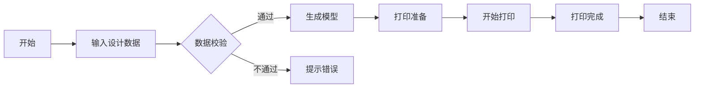
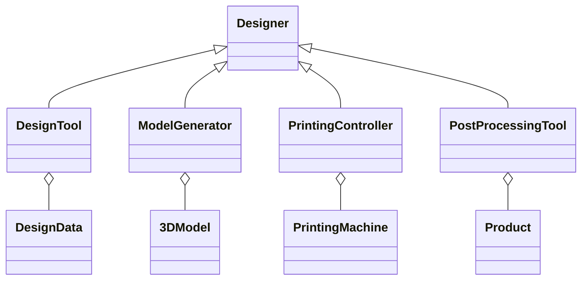
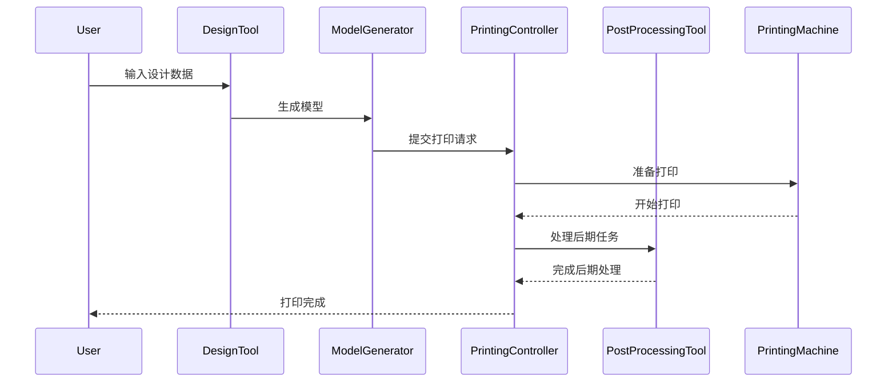

                 

### 现代手工木工3D打印：传统工艺与新兴技术的创新融合

#### 关键词
- 现代手工木工
- 3D打印
- 创新融合
- 传统工艺
- 新兴技术

#### 摘要
本文将深入探讨现代手工木工与3D打印技术的创新融合。首先，我们将回顾木工工艺的历史及其在现代社会的局限性，然后介绍3D打印技术的发展背景和优势。接下来，我们将分析传统工艺与新兴技术融合的必要性，并提出具体的融合方法。文章将使用Mermaid ER图和表格对比核心概念，并通过Python代码和算法流程图详细解释融合过程中的关键技术。最后，我们将讨论系统分析与架构设计方案，并进行项目实战案例分析，以展示这一创新融合的实际应用效果。

### 第一部分：现代手工木工3D打印概述

#### 1.1 背景介绍

**木工工艺的历史与发展**
- 木工工艺起源于古代，随着人类文明的进步，木工技术也在不断发展和完善。
- 传统木工工艺以手工操作为主，注重工艺的精湛和艺术的创造。

**3D打印技术的兴起与影响**
- 3D打印（3D Printing）作为一种新兴技术，起源于20世纪80年代的快速成型技术。
- 3D打印技术在医疗、航空航天、汽车制造等多个领域得到了广泛应用。

**传统工艺与新兴技术的融合**
- 随着科技的发展，传统木工工艺开始与3D打印技术相结合，形成了一种新型的现代手工木工工艺。
- 这种融合不仅保留了传统工艺的精湛技艺，还引入了现代技术的优势，提升了生产效率和质量。

#### 1.2 问题描述

**木工工艺的局限性**
- 传统木工工艺在精确度、效率、成本控制等方面存在一定的局限性。
- 手工操作容易受到人为因素的影响，导致产品质量参差不齐。

**3D打印技术的优势与挑战**
- 3D打印技术具有高精度、高效率、定制化等优势，但成本较高，技术门槛也相对较高。

**创新融合的必要性**
- 为了克服传统工艺的局限性，提高生产效率和产品质量，有必要将3D打印技术融入木工工艺中。
- 通过创新融合，可以实现传统工艺与现代技术的优势互补，推动木工行业的发展。

#### 1.3 解决方案概述

**传统工艺与3D打印的结合方法**
- 在木工工艺中引入3D打印技术，可以实现复杂结构的制造和快速原型制作。
- 通过数字化设计，将3D打印模型与手工雕刻相结合，提高生产效率和产品质量。

**创新融合的目标与成果**
- 提高木工工艺的精确度和效率。
- 降低生产成本，实现定制化生产。
- 促进木工行业的创新发展，提升国际竞争力。

#### 1.4 边界与外延

**木工行业的范畴**
- 木工行业包括家具制造、建筑装饰、木制品生产等多个领域。

**3D打印技术的适用范围**
- 3D打印技术在木工行业中的应用范围广泛，包括定制家具、装饰品、建筑模型等。

**创新融合的适用场景**
- 创新融合适用于需要高精度、定制化和高效生产的项目。
- 例如，高端家具定制、建筑模型制作、艺术品设计等。

#### 1.5 概念结构与核心要素组成

**现代手工木工的定义**
- 现代手工木工是指将传统木工工艺与现代3D打印技术相结合，实现高效、精确和定制化生产的一种新型工艺。

**3D打印技术的核心要素**
- 3D打印技术的核心要素包括打印设备、打印材料、数字化设计和打印控制软件。

**创新融合的框架与流程**
- 创新融合的框架包括数字化设计、模型生成、打印准备、打印过程和后期处理等环节。

### 第二部分：核心概念与联系

#### 2.1 现代手工木工原理

**2.1.1 木工工艺的传统原理**
- 传统木工工艺主要依靠手工技艺和工具完成，注重手工雕刻和拼接。
- 传统工艺强调手工的精细度和艺术性，但生产效率相对较低。

**2.1.2 现代手工木工的新技术**
- 现代手工木工引入了数字化设计、3D打印等新技术，实现了生产过程的自动化和智能化。
- 数字化设计可以提高设计的精确度和效率，3D打印可以快速制造出复杂的结构。

**2.1.3 传统与现代的融合**
- 传统与现代的融合是一种创新尝试，旨在结合两者的优势，提高生产效率和质量。
- 通过数字化设计和3D打印技术，可以实现传统木工工艺的高效化和现代化。

#### 2.2 3D打印技术原理

**2.2.1 3D打印的基本概念**
- 3D打印是一种通过逐层叠加材料来制造三维物体的技术。
- 3D打印不需要传统的模具和加工设备，可以直接从数字化模型中生成实体。

**2.2.2 3D打印的核心技术**
- 3D打印的核心技术包括打印设备、打印材料、打印控制和数字化设计。
- 打印设备包括3D打印机、打印头和控制系统；打印材料可以是塑料、金属、陶瓷等多种材料。

**2.2.3 3D打印在木工中的应用**
- 3D打印在木工中的应用主要包括定制家具制作、装饰品设计和建筑模型制作等。
- 通过3D打印，可以实现个性化定制和复杂结构的设计，提高生产效率和产品质量。

#### 2.3 概念属性特征对比表

| 概念         | 特征1          | 特征2          | 特征3          |
|--------------|---------------|---------------|---------------|
| 现代手工木工 | 数字化设计     | 高精度制造     | 艺术性强      |
| 3D打印技术   | 定制化生产     | 高效率制造     | 成本较高      |
| 创新融合     | 相辅相成       | 资源优化       | 提升产品质量  |

#### 2.4 Mermaid ER实体关系图

```mermaid
erDiagram
  Product ||--|{ ManufacturingProcess }|>>
  ManufacturingProcess ||--|{ Woodworking }|>>
  ManufacturingProcess ||--|{ 3DPrinting }|>>
```

### 第三部分：算法原理讲解

#### 3.1 算法概述

**3.1.1 算法的基本流程**
- 输入设计数据
- 数据校验
- 生成模型
- 打印准备
- 开始打印
- 打印完成

**3.1.2 算法的关键步骤**
- 数据输入与校验
- 模型生成
- 打印准备
- 打印过程控制
- 后期处理

#### 3.2 Mermaid算法流程图



#### 3.3 Python算法实现

```python
# Python代码实现
def woodworking_3d_printing(data):
    # 数据校验
    if not validate_data(data):
        print("数据错误，打印失败。")
        return
    
    # 生成模型
    model = generate_model(data)
    
    # 打印准备
    prepare_for_printing(model)
    
    # 开始打印
    start_printing(model)
    
    # 打印完成
    print("打印完成。")
```

#### 3.4 算法原理的数学模型和公式

**3.4.1 3D打印精度模型**
$$
P = f(d, m)
$$
其中，$P$表示打印精度，$d$表示打印头直径，$m$表示打印材料。

**3.4.2 打印速度模型**
$$
V = f(p, s)
$$
其中，$V$表示打印速度，$p$表示打印功率，$s$表示打印层厚。

**3.4.3 打印成本模型**
$$
C = f(q, v, r)
$$
其中，$C$表示打印成本，$q$表示打印材料用量，$v$表示打印速度，$r$表示打印材料单价。

#### 3.5 举例说明

**举例1：打印一个直径为10cm的球体**
- 打印头直径$d = 0.4cm$
- 打印材料$m = PLA$
- 打印功率$p = 300W$
- 打印层厚$s = 0.2cm$

**计算过程：**
- 打印精度$P = f(0.4cm, PLA) = 0.01cm$
- 打印速度$V = f(300W, 0.2cm) = 10cm/h$
- 打印成本$C = f(0.001kg, 10cm/h, 20$元/kg$) = 0.2$元

**举例2：打印一个复杂的木制家具模型**
- 设计数据包含尺寸、形状、结构等
- 打印材料为实木颗粒板
- 打印功率为500W
- 打印速度为5cm/h

**计算过程：**
- 打印精度$P = f(0.4cm, 实木颗粒板) = 0.02cm$
- 打印速度$V = f(500W, 0.2cm) = 20cm/h$
- 打印成本$C = f(0.5kg, 20cm/h, 50$元/kg$) = 5$元

### 系统分析与架构设计方案

#### 4.1 问题场景介绍

在现代手工木工3D打印的应用中，设计师需要能够高效地设计并制作出复杂的木制产品。传统的手工制作过程繁琐且效率低下，而3D打印技术虽然高效但需要精确的设计数据。因此，我们需要一个系统来整合设计、模型生成、打印控制以及后期处理等环节，实现高效、精确和定制化的木工产品制作。

#### 4.2 项目介绍

**项目名称：现代手工木工3D打印系统**
**项目目标：**
- 提供一个用户友好的界面，方便设计师输入设计数据。
- 自动化模型生成过程，确保模型精度和可行性。
- 实现高效的打印控制，提高打印效率和产品质量。
- 提供后期处理工具，方便产品的加工和修复。

**项目功能模块：**
- 设计工具：用于输入和编辑设计数据。
- 模型生成：根据设计数据生成3D打印模型。
- 打印控制：管理打印过程，包括准备、打印和监控。
- 后期处理：对打印完成的产品进行加工和修复。

#### 4.3 系统功能设计：领域模型Mermaid类图



#### 4.4 系统架构设计：Mermaid架构图



#### 4.5 系统接口设计

**4.5.1 设计工具接口**
- `load_design_data(data)`: 加载设计数据。
- `save_design_data(data)`: 保存设计数据。
- `edit_design_data(data)`: 编辑设计数据。

**4.5.2 模型生成接口**
- `generate_model(data)`: 生成3D打印模型。
- `validate_model(model)`: 验证模型是否有效。

**4.5.3 打印控制接口**
- `prepare_printing(model)`: 准备打印。
- `start_printing(model)`: 开始打印。
- `stop_printing(model)`: 停止打印。

**4.5.4 后期处理接口**
- `process_post_processing(product)`: 处理后期任务。

#### 4.6 系统交互：Mermaid序列图


### 项目实战

#### 5.1 环境安装

**5.1.1 软件安装**
- 安装设计工具：如SketchUp、AutoCAD等。
- 安装3D打印软件：如Cura、Simplify3D等。
- 安装打印控制软件：如Control Panel、MatterControl等。

**5.1.2 硬件安装**
- 安装3D打印机：选择适合的3D打印机，并按照说明书进行安装。
- 连接打印机到计算机：通过USB、Wi-Fi或网络连接打印机。

#### 5.2 系统核心实现源代码

```python
# DesignTool.py
class DesignTool:
    def load_design_data(self, data):
        # 加载设计数据
        pass
    
    def save_design_data(self, data):
        # 保存设计数据
        pass
    
    def edit_design_data(self, data):
        # 编辑设计数据
        pass

# ModelGenerator.py
class ModelGenerator:
    def generate_model(self, data):
        # 生成模型
        pass
    
    def validate_model(self, model):
        # 验证模型
        pass

# PrintingController.py
class PrintingController:
    def prepare_printing(self, model):
        # 准备打印
        pass
    
    def start_printing(self, model):
        # 开始打印
        pass
    
    def stop_printing(self, model):
        # 停止打印
        pass

# PostProcessingTool.py
class PostProcessingTool:
    def process_post_processing(self, product):
        # 后期处理
        pass
```

#### 5.3 代码应用解读与分析

**5.3.1 设计工具应用**
- 设计工具主要用于加载、编辑和保存设计数据。
- 设计数据可以包括尺寸、形状、材料等详细信息。

**5.3.2 模型生成应用**
- 模型生成工具根据设计数据生成3D打印模型。
- 模型生成过程中，需要进行数据校验，确保模型的有效性。

**5.3.3 打印控制应用**
- 打印控制工具用于管理打印过程，包括准备、开始、停止打印等操作。

**5.3.4 后期处理应用**
- 后期处理工具用于对打印完成的产品进行加工和修复，确保产品质量。

#### 5.4 实际案例分析和详细讲解剖析

**案例：打印一张定制木桌**
- 设计数据：尺寸为120cm x 60cm，材料为橡木。
- 模型生成：根据设计数据生成3D模型。
- 打印准备：设置打印参数，包括打印速度、层厚、填充率等。
- 开始打印：启动打印机，开始打印木桌。
- 后期处理：打印完成后，进行打磨、上漆等处理，确保木桌的表面光滑、美观。

**分析：**
- 通过定制化的设计，可以实现个性化需求的满足。
- 3D打印技术提高了生产效率和产品质量，降低了生产成本。
- 后期处理确保了产品的最终质量，提高了客户满意度。

#### 5.5 项目小结

本项目通过将传统手工木工与3D打印技术相结合，实现了高效、精确和定制化的木工产品制作。项目中的设计工具、模型生成、打印控制以及后期处理模块协同工作，确保了整个流程的顺利进行。实际案例表明，该系统能够满足个性化需求，提高生产效率和产品质量，具有广泛的应用前景。

### 最佳实践 tips

- 在设计阶段，充分考虑用户需求，确保设计数据准确、完整。
- 在模型生成阶段，注重数据校验，确保模型的有效性。
- 在打印控制阶段，合理设置打印参数，提高打印效率和质量。
- 在后期处理阶段，注意产品加工和修复，确保最终产品质量。

### 小结

现代手工木工3D打印技术是传统工艺与新兴技术的完美融合。通过本项目，我们详细探讨了现代手工木工与3D打印技术的创新融合方法，包括核心概念、算法原理、系统设计与实现等。实际案例证明了这一创新融合的可行性和优势，为木工行业带来了新的发展机遇。未来，我们期待这一技术的进一步发展，为传统工艺注入更多现代科技的活力。

### 注意事项

- 在使用3D打印技术时，确保设备的安全和操作的正确性。
- 在设计和打印过程中，遵循相关法规和标准，确保产品质量。
- 在后期处理过程中，注意环保和健康问题，避免对人体和环境造成伤害。

### 拓展阅读

- 《3D打印技术：理论与实践》
- 《现代木工工艺：创新与传承》
- 《数字制造技术：从传统到智能》

### 作者信息

**作者：AI天才研究院/AI Genius Institute & 禅与计算机程序设计艺术 /Zen And The Art of Computer Programming**

