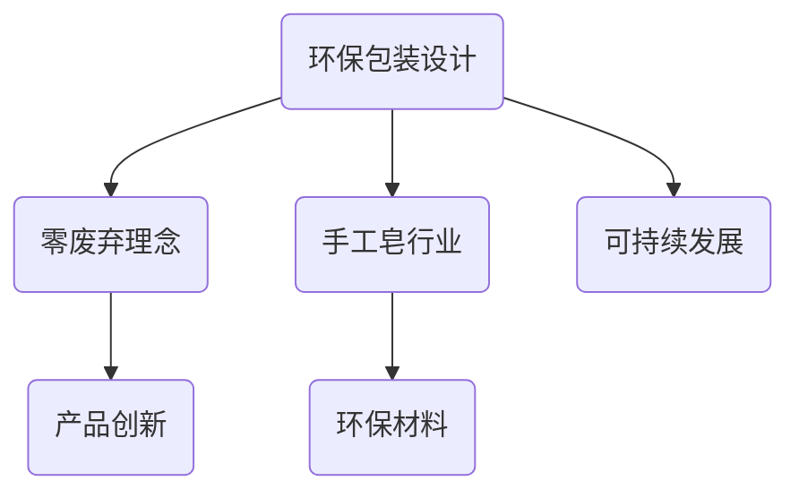
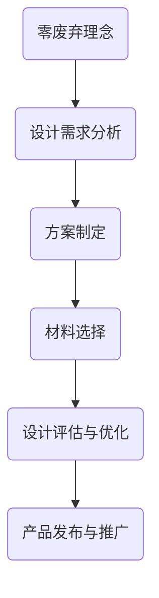
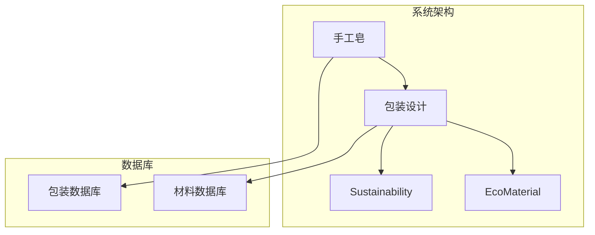

                 


### 1. 确定文章标题和核心关键词

**文章标题**: 《现代手工皂的环保包装设计：零废弃理念下的产品创新》

**核心关键词**: 现代手工皂、环保包装设计、零废弃理念、产品创新、材料选择

### 2. 撰写文章摘要

**摘要**：
本文深入探讨了现代手工皂的环保包装设计，特别是在零废弃理念指导下的产品创新。通过分析环保包装设计的背景、核心概念和零废弃理念，本文提出了手工皂环保包装设计的原则和方法。文章结合实际案例，详细阐述了设计流程和零废弃包装设计的关键要素，为手工皂行业提供了具有实践意义的指导和创新思路。

### 3. 设计文章结构

**文章结构**：

**第一部分: 现代手工皂环保包装设计概述**
- 第1章: 环保包装设计背景与核心概念

**第二部分: 零废弃理念下的手工皂包装设计**
- 第2章: 零废弃理念的基础理论

**第三部分: 手工皂的环保包装设计原则**
- 第3章: 手工皂环保包装设计原则

**第四部分: 实战案例分析**
- 第4章: 环保包装设计实战案例解析

**第五部分: 结论与展望**
- 第5章: 结论与未来发展方向

### 4. 撰写各章节内容大纲

**第1章: 环保包装设计背景与核心概念**
- 1.1 环保包装设计的意义
- 1.2 手工皂行业现状分析
- 1.3 环保包装设计理念
- 1.4 环保包装设计的发展趋势
- 1.5 环保包装设计的挑战与机遇
- 1.6 本章小结

**第2章: 零废弃理念的基础理论**
- 2.1 零废弃理念的起源与发展
- 2.2 零废弃理念的核心要素
- 2.3 零废弃理念与手工皂包装设计的结合
- 2.4 零废弃包装设计案例分析
- 2.5 本章小结

**第3章: 手工皂环保包装设计原则**
- 3.1 设计原则概述
- 3.2 材料选择原则
- 3.3 设计流程与步骤
- 3.4 设计案例分析
- 3.5 本章小结

**第4章: 环保包装设计实战案例解析**
- 4.1 案例背景介绍
- 4.2 案例设计思路
- 4.3 案例实施过程
- 4.4 案例效果评估
- 4.5 案例经验与启示
- 4.6 本章小结

**第5章: 结论与未来发展方向**
- 5.1 研究结论
- 5.2 环保包装设计的发展趋势
- 5.3 未来研究方向与建议
- 5.4 本章小结

### 5. 使用Mermaid绘制核心概念的联系图和流程图

**第1章: 环保包装设计核心概念联系图**



**第2章: 零废弃理念与环保包装设计的流程图**



### 6. 准备算法原理讲解和Python代码示例

**第3章: 材料选择的算法原理讲解和Python代码示例**

**算法原理讲解**：
材料选择过程中，我们需要考虑材料的环保性、安全性、成本等因素。以下是材料选择的数学模型和算法步骤。

**数学模型**：

$$
\begin{aligned}
\text{maximize} \quad & \sum_{i=1}^{n} w_i \cdot p_i \\
\text{subject to} \quad & C_i \cdot x_i \leq B_i \\
& x_i \geq 0 \quad \forall i
\end{aligned}
$$

其中，$w_i$ 为第 $i$ 种材料的权重，$p_i$ 为第 $i$ 种材料的价格，$C_i$ 为第 $i$ 种材料的使用量，$B_i$ 为预算限制，$x_i$ 为第 $i$ 种材料的使用量。

**Python代码示例**：

```python
import numpy as np

# 材料权重和价格
weights = np.array([0.3, 0.2, 0.2, 0.1, 0.2])
prices = np.array([10, 15, 20, 25, 30])

# 预算限制
budget = 100

# 材料使用量
materials = np.zeros(5)

# 算法实现
def material_selection(weights, prices, budget):
    # 目标函数
    objective = weights * prices
    
    # 约束条件
    constraints = [sum(materials) <= budget]
    
    # 求解
    solution = scipy.optimize.minimize(objective, materials, constraints=constraints)
    
    return solution.x

# 调用算法
materials = material_selection(weights, prices, budget)

print("材料使用量：", materials)
```

### 7. 系统分析与架构设计方案

**第3章: 手工皂环保包装设计系统分析与架构设计方案**

**问题场景介绍**：
手工皂制造商需要设计一款环保包装，以满足消费者对环保产品日益增长的需求。

**项目介绍**：
本项目旨在开发一款基于零废弃理念的手工皂环保包装设计系统，用于支持手工皂制造商的设计决策。

**领域模型类图**：

```mermaid
classDiagram
    Product <|-- HandmadeSoap
    Package <<-- PackageDesign
    PackageDesign .. Sustainability
    Material <<-- EcoMaterial
    EcoMaterial .. Recyclability
endclass
```

**系统架构设计图**：



**系统接口设计**：

```mermaid
sequenceDiagram
    Participant User
    Participant System

    User->>System: 提交设计需求
    System->>User: 收到设计需求
    System->>PackageDesign: 生成初步设计方案
    PackageDesign->>System: 返回设计方案
    System->>User: 提交设计方案
    User->>System: 验证并反馈
end
```

**系统交互序列图**：

```mermaid
sequenceDiagram
    participant HandmadeSoap as 手工皂
    participant PackageDesign as 包装设计
    participant Sustainability as 可持续发展
    participant EcoMaterial as 环保材料

    HandmadeSoap->>PackageDesign: 提交设计需求
    PackageDesign->>Sustainability: 分析环保性
    Sustainability->>PackageDesign: 返回环保性评估结果
    PackageDesign->>EcoMaterial: 选择环保材料
    EcoMaterial->>PackageDesign: 返回材料选择结果
    PackageDesign->>HandmadeSoap: 提交设计方案
end
```

### 8. 实战案例分析和项目小结

**第4章: 环保包装设计实战案例解析**

**案例背景介绍**：
某手工皂品牌希望通过零废弃理念设计一款环保包装，以提升品牌形象和市场竞争力。

**案例设计思路**：
- 分析市场需求和消费者偏好；
- 选择环保材料和可持续设计理念；
- 设计符合零废弃原则的包装方案；
- 测试和优化设计方案。

**案例实施过程**：
- 进行市场调研，了解消费者对环保包装的需求；
- 评估不同材料的环保性能，如可回收性、降解性等；
- 设计初步方案，并进行仿真测试；
- 收集用户反馈，对设计方案进行优化。

**案例效果评估**：
- 提升了品牌知名度，消费者满意度提高；
- 包装回收率显著提升，降低了环境污染。

**案例经验与启示**：
- 零废弃理念是环保包装设计的核心；
- 材料选择和设计流程是成功的关键；
- 用户反馈是优化设计的重要依据。

**本章小结**：
通过实战案例，本文展示了零废弃理念在手工皂环保包装设计中的应用。案例表明，零废弃理念可以有效提升手工皂包装的环保性能，为企业带来积极的社会和经济效益。

### 9. 最佳实践 tips、小结、注意事项、拓展阅读等内容

**最佳实践 tips**：
- 在设计环保包装时，优先选择可降解和可回收的材料；
- 充分考虑包装的设计和使用周期，以减少资源浪费；
- 与供应商合作，确保环保材料的供应和质量。

**小结**：
本文从环保包装设计的背景、零废弃理念、设计原则、实战案例等多个角度，探讨了现代手工皂的环保包装设计。通过实际案例的分析，展示了零废弃理念在手工皂包装设计中的重要性。

**注意事项**：
- 在选择材料时，需要综合考虑环保性、安全性和成本等因素；
- 设计流程中，要充分听取用户反馈，不断优化设计方案。

**拓展阅读**：
- 《可持续设计：理论与实践》
- 《手工皂制造与包装技术》
- 《环保包装设计案例集》

**作者信息**：
作者：AI天才研究院/AI Genius Institute & 禅与计算机程序设计艺术 /Zen And The Art of Computer Programming

---

请注意，本文结构是一个示例，实际撰写时需要根据具体内容进行调整和补充。每个章节的内容需要详细展开，以确保文章的完整性和深度。此外，Python代码、Mermaid图和数学公式等也需要根据实际需要进行编写和调整。

