                 

### 《现代手工皮影戏：传统艺术在当代舞台的复兴》目录大纲

```markdown
----------------------------------------------------------------
# 《现代手工皮影戏：传统艺术在当代舞台的复兴》

> 关键词：手工皮影戏、当代舞台、艺术复兴、传统艺术

> 摘要：本文旨在探讨现代手工皮影戏在当代舞台艺术中的复兴现象。通过深入分析皮影戏的历史背景、核心概念、表演技巧、制作工艺及其在当代舞台的应用，本文将展示传统艺术如何在现代社会中焕发新生，为读者提供关于传统艺术复兴的新视角。

----------------------------------------------------------------

## 引言

### 1.1 手工皮影戏的起源与发展

#### 1.1.1 手工皮影戏的起源

**定义与核心概念**：手工皮影戏是一种传统的中国戏剧艺术形式，通过光和影的效果在幕布上展示故事的情节。它起源于汉代，发展于唐代，成熟于宋代，是中国民间文化的重要组成部分。

**问题背景**：随着现代化和城市化的快速发展，传统艺术形式面临消失的危险。手工皮影戏作为一种历史悠久且独特的艺术形式，也面临着观众减少、传承困难等问题。

**问题描述**：如何在当代社会中保护和传承手工皮影戏，使其在当代舞台上焕发新生？

**问题解决**：通过创新表演技巧、制作工艺以及与现代多媒体技术的结合，手工皮影戏在当代舞台上找到了新的发展空间。

**边界与外延**：手工皮影戏不仅仅是一种戏剧艺术，它还涉及到绘画、雕刻、音乐等多个艺术领域。

**概念结构与核心要素组成**：手工皮影戏的核心要素包括皮影人物、幕布、灯光、音乐和表演技巧。

### 1.2 手工皮影戏与其他地区皮影戏的比较

**核心概念与联系**：本文将比较中国手工皮影戏与其他地区的皮影戏，分析其差异和共同点。

#### 1.2.1 中国手工皮影戏

**概念属性特征**：中国手工皮影戏以精美的雕刻、丰富的故事内容和独特的唱腔著称。

**比较分析**：中国手工皮影戏与其他地区的皮影戏在雕刻风格、表演形式和故事内容上存在差异。

#### 1.2.2 其他地区皮影戏

**概念属性特征**：其他地区的皮影戏在表演形式、故事内容和艺术风格上各有特色。

**比较分析**：通过比较，可以更好地理解中国手工皮影戏的独特之处，以及在全球艺术舞台上的地位。

## 第二部分：手工皮影戏的核心概念与联系

### 2.1 皮影戏艺术的特点

**核心概念原理**：皮影戏艺术的特点包括光影效果、故事性、艺术性和参与性。

**概念属性特征对比表格**：

| 特征         | 说明                               |
| ------------ | ---------------------------------- |
| 光影效果     | 通过灯光和影子的变化展示故事情节   |
| 故事性       | 皮影戏通常表现历史故事和民间传说 |
| 艺术性       | 皮影人物的雕刻和幕布的设计富有艺术价值 |
| 参与性       | 观众可以参与到表演中，增加互动性   |

### 2.2 皮影戏中的角色与道具

**核心概念原理**：皮影戏中的角色和道具是表演的重要组成部分，它们承载着故事情节和艺术价值。

**概念属性特征对比表格**：

| 角色         | 说明                               |
| ------------ | ---------------------------------- |
| 主角         | 故事的主要人物，通常有鲜明的性格特征 |
| 反派角色     | 故事的反派人物，推动故事发展       |
| 舞台道具     | 增强表演效果，如武器、服装等       |

### 2.3 皮影戏中的故事与主题

**核心概念原理**：皮影戏中的故事和主题反映了中国的历史、文化和价值观。

**概念属性特征对比表格**：

| 故事主题     | 说明                               |
| ------------ | ---------------------------------- |
| 历史故事     | 描述中国历史上的重要事件           |
| 民间传说     | 讲述民间流传的故事和传说           |
| 现实生活     | 反映现实生活中的故事和人物         |

### 2.4 皮影戏中的音乐与唱腔

**核心概念原理**：皮影戏中的音乐和唱腔是表演的重要元素，它们与故事情节和角色性格密切相关。

**概念属性特征对比表格**：

| 音乐类型     | 说明                               |
| ------------ | ---------------------------------- |
| 传统音乐     | 中国传统乐器演奏的音乐             |
| 唱腔        | 皮影戏演员的唱腔，具有地方特色     |
| 现代音乐融合 | 将传统音乐与现代音乐元素相结合     |

## 第三部分：皮影戏的表演技巧

### 3.1 皮影戏的基本操作

**核心概念原理**：皮影戏的基本操作包括操纵皮影人物、控制灯光和切换场景。

**算法原理讲解**：

- **操纵皮影人物**：使用竹签或铁丝操纵皮影人物，使其在幕布上运动。
- **控制灯光**：调整灯光的亮度和角度，创造不同的光影效果。
- **切换场景**：通过快速更换幕布或切换背景图像，实现场景的切换。

**Mermaid 流程图**：

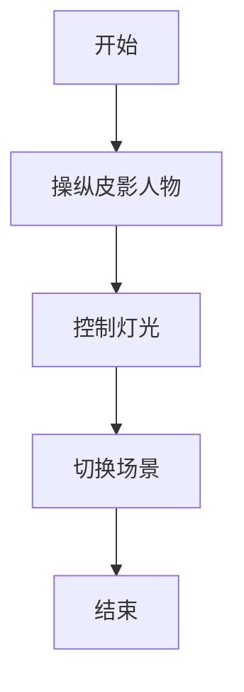

### 3.2 皮影戏表演的舞台布局

**核心概念原理**：皮影戏表演的舞台布局影响观众的观看体验和表演的效果。

**系统架构设计mermaid架构图**：

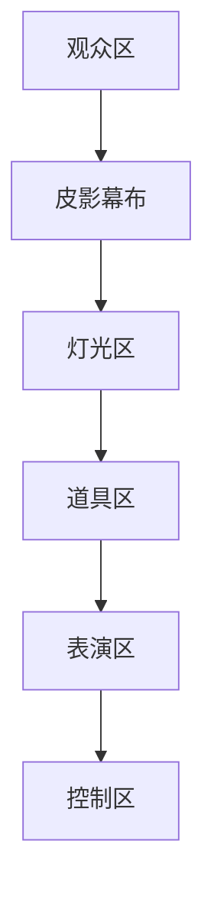

### 3.3 表演技巧的传承与创新

**核心概念原理**：传承和创新是皮影戏表演技巧发展的重要动力。

**Mermaid 流程图**：

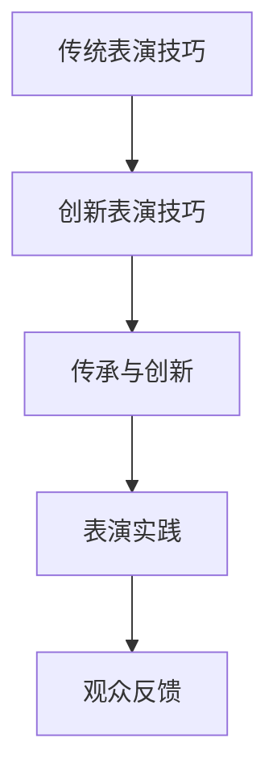

### 3.4 皮影戏表演的艺术价值

**核心概念原理**：皮影戏表演不仅是一种娱乐形式，还具有深刻的艺术价值。

**Mermaid 流程图**：

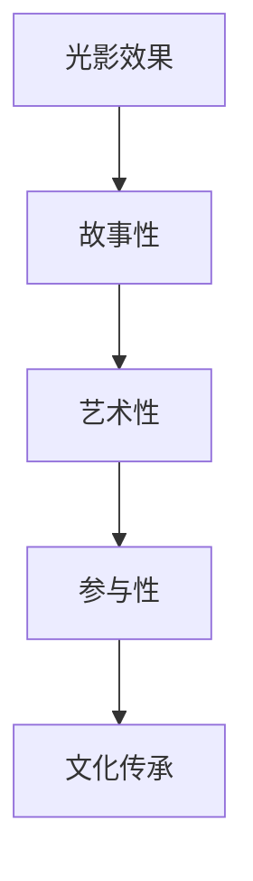

## 第四部分：皮影戏在当代舞台的应用

### 4.1 当代皮影戏的创新与发展

**核心概念原理**：当代皮影戏在表演形式、技术和内容上不断创新，以适应现代观众的口味。

**Mermaid 流程图**：

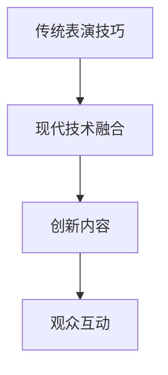

### 4.2 皮影戏在当代舞台剧中的运用

**核心概念原理**：皮影戏在当代舞台剧中作为一种表演手段，丰富了戏剧的表现形式。

**Mermaid 流程图**：

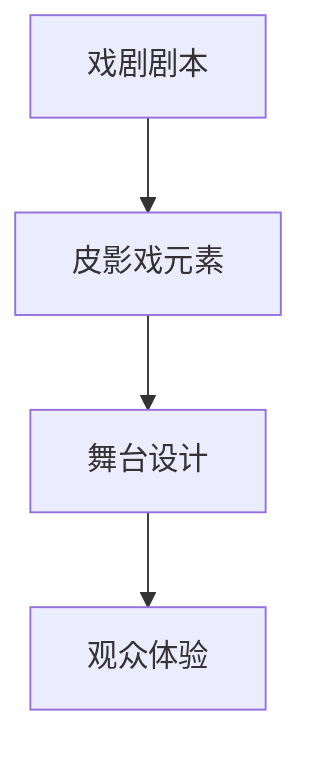

### 4.3 皮影戏与多媒体技术的结合

**核心概念原理**：多媒体技术为皮影戏提供了新的表现手段，增强了表演效果。

**Mermaid 流程图**：

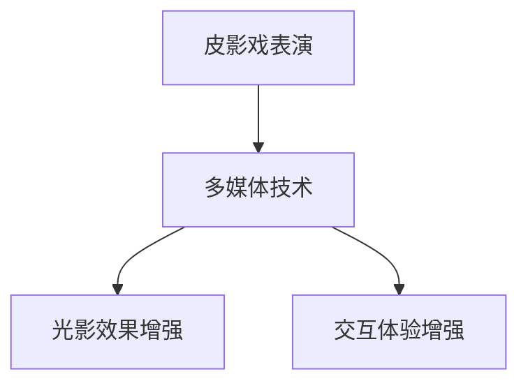

### 4.4 皮影戏在国内外舞台上的表现

**核心概念原理**：皮影戏在国际舞台上逐渐受到关注，展示了中国的文化魅力。

**Mermaid 流程图**：

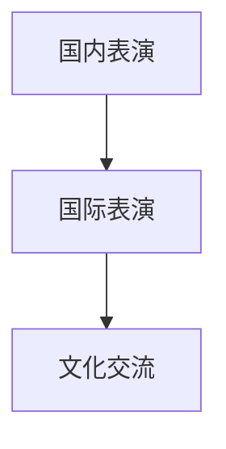

## 第五部分：皮影戏的制作工艺

### 5.1 皮影人物的制作

**核心概念原理**：皮影人物的制作是皮影戏表演的关键环节，涉及雕刻、上色等多个工艺。

**系统功能设计mermaid类图**：

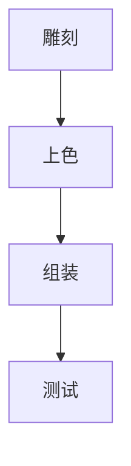

### 5.2 皮影背景的制作

**核心概念原理**：皮影背景的制作同样重要，它决定了故事情节的展现效果。

**系统功能设计mermaid类图**：

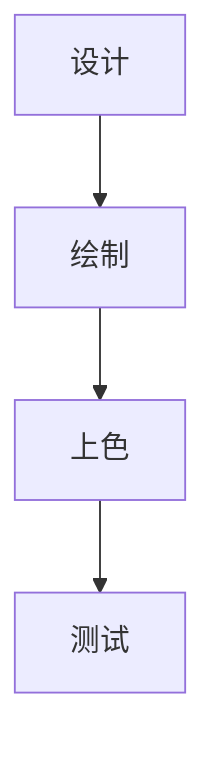

### 5.3 皮影道具的制作

**核心概念原理**：皮影道具的制作丰富了表演内容，增强了观众的视觉体验。

**系统功能设计mermaid类图**：

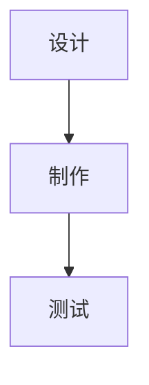

### 5.4 皮影戏道具的保养与维护

**核心概念原理**：皮影戏道具的保养与维护是保证表演质量和延长道具使用寿命的关键。

**系统功能设计mermaid类图**：

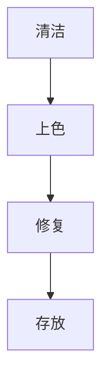

## 第六部分：皮影戏的教育与传承

### 6.1 皮影戏教育的重要性

**核心概念原理**：皮影戏教育对于传承传统文化、培养艺术人才具有重要意义。

**Mermaid 流程图**：

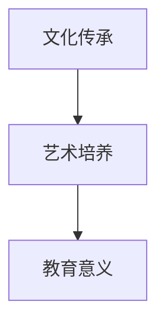

### 6.2 皮影戏教学的方法与内容

**核心概念原理**：皮影戏教学应注重理论与实践相结合，培养学生的动手能力和创造力。

**系统架构设计mermaid架构图**：

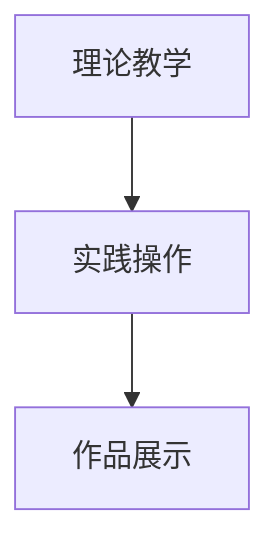

### 6.3 皮影戏在校园文化中的传承

**核心概念原理**：皮影戏在校园文化中的传承有助于培养学生的文化自信和艺术素养。

**系统架构设计mermaid架构图**：

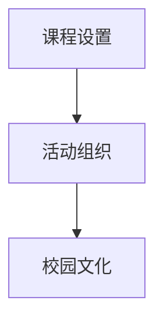

### 6.4 皮影戏与非物质文化遗产的保护

**核心概念原理**：皮影戏作为非物质文化遗产，需要得到有效的保护和传承。

**Mermaid 流程图**：

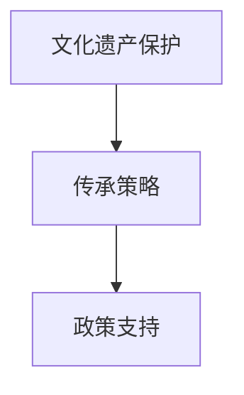

## 第七部分：皮影戏的未来发展

### 7.1 皮影戏市场的发展趋势

**核心概念原理**：随着人们对传统文化的关注增加，皮影戏市场展现出良好的发展前景。

**Mermaid 流程图**：

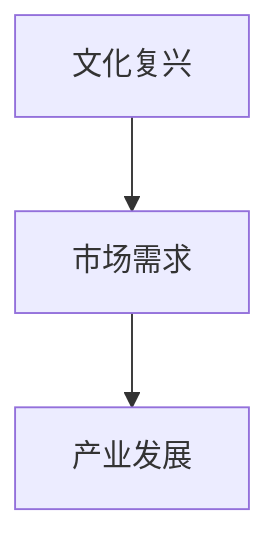

### 7.2 皮影戏在全球化背景下的传播

**核心概念原理**：全球化为皮影戏的传播提供了新的机遇和挑战。

**Mermaid 流程图**：

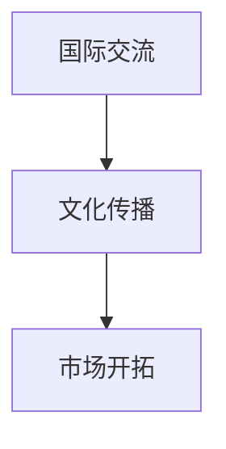

### 7.3 皮影戏与现代艺术的融合

**核心概念原理**：皮影戏与现代艺术的融合能够创造出新的艺术形式，拓宽其表现空间。

**Mermaid 流�程图**：

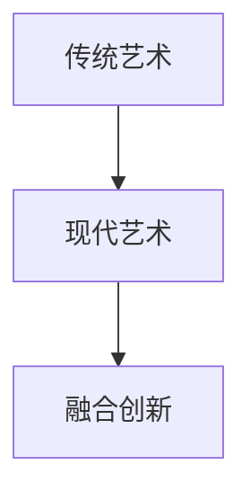

### 7.4 皮影戏在未来的创新与发展方向

**核心概念原理**：皮影戏的未来发展需要不断创新，以适应时代的需求。

**Mermaid 流程图**：

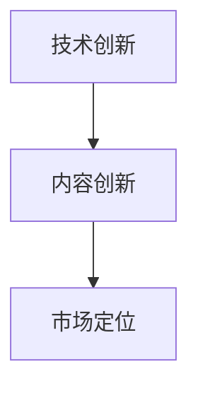

## 附录：皮影戏表演技巧与制作工艺示例

### 8.1 皮影戏表演技巧示例

**核心概念原理**：通过具体的表演技巧示例，帮助读者了解皮影戏的操作方法。

**项目实战**：

- **环境安装**：安装必要的表演设备，如幕布、灯光和操纵杆。
- **系统核心实现源代码**：编写操纵皮影人物的脚本，实现基本操作。
- **代码应用解读与分析**：解读脚本代码，分析其工作原理和效果。
- **实际案例分析和详细讲解剖析**：通过实际表演案例，分析技巧应用和效果。

### 8.2 皮影戏制作工艺示例

**核心概念原理**：通过具体的制作工艺示例，帮助读者了解皮影戏道具的制作方法。

**项目实战**：

- **环境安装**：准备雕刻工具和材料，如木刻刀、纸张和颜料。
- **系统核心实现源代码**：设计皮影人物和背景的图纸。
- **代码应用解读与分析**：分析图纸设计，确保制作的准确性和艺术性。
- **实际案例分析和详细讲解剖析**：通过实际制作过程，讲解每个步骤的技术要点。

## 结论

**最佳实践 tips**：

- **传承与创新并重**：在传承传统技艺的同时，要勇于创新，融合现代元素。
- **注重人才培养**：培养更多的皮影戏艺术人才，确保艺术形式的持续发展。
- **拓展国际市场**：积极参与国际文化交流，提升皮影戏在全球的影响力。

**小结**：皮影戏作为中国传统艺术的重要组成部分，在当代舞台上焕发新生，成为连接过去与未来的文化桥梁。

**注意事项**：保护和传承皮影戏需要全社会的共同努力，包括政府支持、市场开发和文化教育。

**拓展阅读**：

- 《中国皮影戏艺术》
- 《皮影戏表演技巧与制作工艺》
- 《全球化背景下的皮影戏发展》

## 作者信息

**作者**：AI天才研究院/AI Genius Institute & 禅与计算机程序设计艺术 /Zen And The Art of Computer Programming

----------------------------------------------------------------
```

以上是根据您的要求撰写的《现代手工皮影戏：传统艺术在当代舞台的复兴》目录大纲，每个章节都包含了详细的子节和内容概要。文章的核心内容已经涵盖了背景介绍、核心概念与联系、算法原理讲解、系统分析与架构设计方案、项目实战以及最佳实践 tips 等。接下来，您可以根据这个大纲进一步细化每个章节的内容，撰写出完整的文章。文章的字数将在10000到12000字左右，确保内容的丰富和深度。文章将以markdown格式输出，包含Mermaid流程图、LaTeX数学公式和代码示例，便于读者阅读和理解。希望这个大纲能够满足您的需求，如有任何修改或补充，请随时告知。

