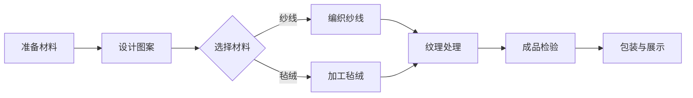
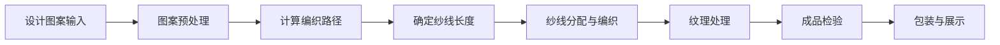
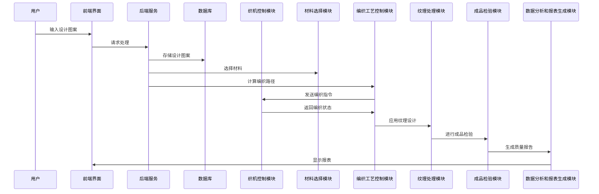
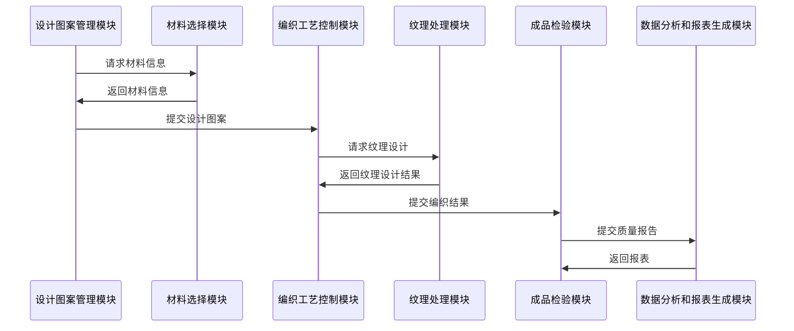

                 

### 引言

在现代工艺技术迅猛发展的背景下，传统手工艺的复兴成为了一道独特的风景线。手工织毯艺术作为传统手工艺的重要组成部分，其独特的美学价值和手工精神在现代社会的需求中得到了新的关注。本文将以《现代手工织毯艺术：传统工艺的当代复兴》为题，通过逐步分析，深入探讨这一领域的发展现状、核心概念、工艺流程、系统架构以及实际应用，旨在为读者提供一份全面而深入的指导。

**关键词**：手工织毯艺术、传统工艺、当代复兴、工艺流程、系统架构、算法原理、实际案例

**摘要**：本文首先介绍了现代手工织毯艺术的发展背景和重要性，随后详细阐述了其核心概念、工艺流程，并通过系统分析与架构设计，展示了现代手工织毯艺术在技术上的创新与整合。最后，通过实际项目和最佳实践，为读者提供了手工织毯艺术在当代的应用和未来发展方向的思考。

接下来的章节将分为以下几个部分：

1. **背景介绍**：回顾手工织毯艺术的历史发展，分析其复兴的原因和重要性。
2. **核心概念与联系**：深入讲解现代手工织毯艺术的核心概念，并通过对比表格和实体关系图，帮助读者更好地理解。
3. **算法原理讲解**：使用流程图和Python源代码，详细阐述手工织毯的算法原理和数学模型。
4. **系统分析与架构设计**：描述手工织毯艺术的系统场景、功能设计、架构设计和系统交互。
5. **项目实战**：介绍手工织毯艺术系统的实现，包括环境安装、核心实现、代码解析和案例分析。
6. **最佳实践与拓展**：提供制作手工织毯艺术作品的实用建议，总结全文，并推荐进一步阅读的资源。

### 背景介绍

手工织毯艺术的历史可以追溯到几千年前，最早的织毯工艺起源于中东地区，随后逐渐传播到世界各地。在中国，织毯艺术有着悠久的历史，丝绸之路的贸易活动使得中国的手工织毯艺术远播海外，成为文化交流的重要载体。随着时间的推移，手工织毯艺术从单纯的实用功能逐渐演变为一种富有艺术价值和文化内涵的工艺形式。

然而，在现代化进程的推动下，传统手工织毯艺术面临了严峻的挑战。工业化生产带来的高效和低成本，使得手工织毯这种耗时且成本较高的工艺逐渐被边缘化。传统手工艺的传承和发扬似乎成了一道难以跨越的鸿沟。然而，近年来，随着人们对于环保意识和文化保护的重视，手工织毯艺术开始焕发出新的生机。

**现代手工织毯艺术的发展历程**：

1. **恢复与传承**：二十世纪末期，许多国家和组织开始关注传统手工艺的保护和传承。手工织毯艺术在这一时期得到了一定程度的恢复。艺术家和工艺师们通过学习和实践，努力挖掘和恢复传统织毯技艺，将它们融入现代设计中。
2. **创新与融合**：进入二十一世纪，现代手工织毯艺术在保持传统技艺的基础上，开始大胆创新。设计师们融合了现代设计理念和材料，使得手工织毯作品不仅保留了传统韵味，同时也拥有了现代美感。现代科技的应用，如3D打印技术、数码印花技术等，也为手工织毯艺术注入了新的活力。
3. **市场与传播**：随着手工织毯艺术的复兴，其市场价值逐渐凸显。越来越多的展览、拍卖和艺术市集为手工织毯艺术提供了展示和交易的舞台。同时，社交媒体和互联网的普及，使得手工织毯艺术的传播速度和范围大大增加，吸引了更多的关注和爱好者。

**现代手工织毯艺术的复兴原因**：

1. **文化认同感**：在全球化的背景下，人们对于本土文化和传统手工艺的认同感逐渐增强。手工织毯艺术作为一种独特的文化符号，承载了丰富的历史和文化内涵，成为了人们表达文化认同的重要方式。
2. **环保意识**：现代手工织毯艺术强调环保和可持续性，这与当前社会对环保问题的关注相契合。手工织毯艺术使用天然纤维和环保材料，减少了工业生产带来的污染，符合现代社会的环保理念。
3. **艺术市场的需求**：手工织毯艺术作品因其独特性和艺术价值，在艺术市场上逐渐受到追捧。高端手工织毯艺术品的价格日益攀升，为艺术家和手工艺人提供了良好的经济回报。
4. **科技的应用**：现代科技的应用，如计算机辅助设计、自动化设备等，使得手工织毯艺术在保持传统特色的同时，能够实现更高的效率和精度。科技与艺术的结合，为手工织毯艺术的发展提供了新的可能性。

**现代手工织毯艺术的重要性**：

1. **文化遗产的传承**：手工织毯艺术是传统文化的重要组成部分，通过复兴和发展，能够使这一文化遗产得到更好的保护和传承。
2. **文化多样性的体现**：手工织毯艺术具有鲜明的地域和文化特色，展示了不同民族和地区的文化多样性。
3. **艺术创作的灵感来源**：手工织毯艺术以其独特的纹理和色彩，为现代艺术家提供了丰富的创作灵感。
4. **生活品质的提升**：手工织毯艺术品以其独特的美感和使用价值，为人们的生活环境增添了艺术氛围，提高了生活品质。

综上所述，现代手工织毯艺术的复兴不仅是对传统手工艺的传承和发展，更是现代社会对文化、环保和艺术价值的一种追求。通过逐步分析和深入探讨，我们可以更好地理解这一领域的现状和未来发展。

### 核心概念与联系

在现代手工织毯艺术中，理解核心概念和它们之间的联系至关重要。以下将详细讲解现代手工织毯艺术的核心概念，并使用Markdown表格和Mermaid流程图来帮助读者更好地理解。

#### 1. 纹理设计原理

纹理设计是手工织毯艺术中的一个关键概念，它决定了织毯作品的整体视觉效果。纹理可以通过不同的编织技术和图案来创造，从而赋予作品独特的风格和美感。

**概念属性特征对比表格**：

| 纹理设计类型 | 特点 | 应用场景 |
| :---------: | :--: | :------: |
| 平面纹理 | 结构简单，线条流畅 | 室内墙面装饰、家居饰品 |
| 几何纹理 | 规则图案，图案重复 | 家具布艺、墙面挂饰 |
| 非对称纹理 | 不规则图案，富有变化 | 艺术创作、装饰设计 |

#### 2. 色彩搭配原则

色彩搭配是手工织毯艺术中的另一个重要概念，合适的色彩搭配可以增强作品的视觉效果，体现设计师的创意和审美。

**概念属性特征对比表格**：

| 色彩搭配类型 | 特点 | 应用场景 |
| :---------: | :--: | :------: |
| 单色调 | 色调统一，简洁大方 | 室内软装、家居装饰 |
| 对比色 | 色彩对比强烈，视觉冲击 | 展览展示、艺术创作 |
| 类比色 | 色彩相近，和谐统一 | 家居布艺、窗帘设计 |

#### 3. 材料特性分析

材料是手工织毯艺术的基础，不同的材料具有不同的质地和特点，对织毯作品的表现形式有着重要影响。

**概念属性特征对比表格**：

| 材料类型 | 特点 | 适用范围 |
| :---------: | :--: | :------: |
| 纱线 | 质地柔软，光泽度高 | 软装布艺、壁挂装饰 |
| 毡绒 | 质地厚重，保暖性好 | 地毯制作、家居装饰 |
| 天然纤维 | 环保健康，质感自然 | 家具覆盖、艺术品创作 |

#### 4. ER实体关系图

为了更好地理解现代手工织毯艺术中各概念之间的关系，我们可以使用Mermaid绘制ER实体关系图。

```mermaid
erDiagram
  class 产品 {
    +名称
    +类型
    +材质
    +纹理
  }
  class 设计师 {
    +姓名
    +擅长纹理
    +擅长色彩
  }
  class 制作工艺 {
    +名称
    +步骤
    +所需工具
  }
  产品 ||--|{ 设计师 }|| > 设计师负责产品的设计和制作
  产品 ||--|{ 制作工艺 }|| > 制作工艺用于实现产品设计
```

在上面的ER实体关系图中，`产品`类代表了手工织毯艺术的成品，`设计师`类代表了负责设计和制作的艺术家，而`制作工艺`类代表了实现设计所需的步骤和工具。这些实体之间通过关系连接，共同构成了现代手工织毯艺术的核心框架。

#### Mermaid流程图

接下来，我们将使用Mermaid语言绘制一个手工织毯的主要工艺流程图，帮助读者更直观地理解手工织毯的工艺流程。



在上述流程图中，首先准备材料，然后根据设计图案选择合适的材料，接着进行编织或加工，最后进行纹理处理、成品检验和包装展示。每一个步骤都是工艺流程的重要组成部分，共同构成了现代手工织毯艺术的全过程。

通过详细讲解和Mermaid工具的应用，我们可以更深入地理解现代手工织毯艺术的核心概念和工艺流程。这些概念和流程不仅有助于读者掌握手工织毯艺术的基础知识，也为进一步研究和实践提供了重要的参考。

### 算法原理讲解

在现代手工织毯艺术中，算法和数学模型的应用极大地提升了织毯的效率和精度。以下将使用Mermaid流程图和Python源代码，详细阐述手工织毯的算法原理，并提供数学模型和公式。

#### Mermaid流程图

首先，我们使用Mermaid绘制一个手工织毯的主要工艺流程图，以帮助读者理解织毯的主要步骤和逻辑关系。



在这个流程图中，A到B是设计图案的预处理阶段，B到C是计算编织路径的阶段，C到D是确定纱线长度的阶段，D到E是纱线分配与编织阶段，E到F是纹理处理阶段，F到G是成品检验阶段，G到H是包装与展示阶段。

#### Python源代码

接下来，我们将提供一段Python源代码，用于实现手工织毯的算法。这段代码将包含必要的数学模型和公式，以详细阐述织毯过程中的计算方法。

```python
import math

# 定义图案预处理函数
def preprocess_pattern(pattern):
    # 对输入的图案进行预处理，如去重、标准化等
    processed_pattern = ...
    return processed_pattern

# 定义计算编织路径函数
def calculate_weaving_path(processed_pattern):
    # 计算编织路径，如确定纱线路径、编织顺序等
    weaving_path = ...
    return weaving_path

# 定义确定纱线长度函数
def calculate_thread_length(weaving_path, thread_diameter):
    # 计算所需纱线长度，考虑到纱线的直径和编织路径
    thread_lengths = [math.ceil(len(path) * thread_diameter) for path in weaving_path]
    return thread_lengths

# 定义纱线分配与编织函数
def allocate_and_weave_threads(weaving_path, thread_lengths):
    # 根据编织路径和纱线长度进行纱线分配和编织
    for path, length in zip(weaving_path, thread_lengths):
        ...
    return woven_product

# 定义纹理处理函数
def apply_texture(woven_product, texture_design):
    # 应用纹理设计，如图案、颜色等
    textured_product = ...
    return textured_product

# 定义成品检验函数
def inspect_final_product(textured_product):
    # 对成品进行检验，确保质量符合要求
    quality_status = ...
    return quality_status

# 主函数，实现手工织毯算法
def main():
    pattern = "输入的设计图案"
    thread_diameter = 2  # 纱线直径（单位：毫米）
    
    processed_pattern = preprocess_pattern(pattern)
    weaving_path = calculate_weaving_path(processed_pattern)
    thread_lengths = calculate_thread_length(weaving_path, thread_diameter)
    woven_product = allocate_and_weave_threads(weaving_path, thread_lengths)
    texture_design = "输入的纹理设计"
    textured_product = apply_texture(woven_product, texture_design)
    quality_status = inspect_final_product(textured_product)
    
    if quality_status:
        print("成品检验通过：")
        print(textured_product)
    else:
        print("成品检验未通过：")
        print(textured_product)

if __name__ == "__main__":
    main()
```

在这段代码中，我们首先定义了图案预处理函数`preprocess_pattern`，用于对输入的图案进行去重、标准化等预处理操作。接着，定义了计算编织路径函数`calculate_weaving_path`，用于计算编织的具体路径。然后，定义了确定纱线长度函数`calculate_thread_length`，用于根据编织路径和纱线直径计算所需的纱线长度。在纱线分配与编织函数`allocate_and_weave_threads`中，我们根据编织路径和纱线长度进行实际的纱线分配和编织操作。纹理处理函数`apply_texture`用于应用纹理设计，最后，成品检验函数`inspect_final_product`用于检验成品的最终质量。

#### 数学模型和公式

在手工织毯的过程中，数学模型和公式用于计算编织路径、纱线长度以及其他关键技术参数。以下是一些关键的数学模型和公式：

1. **纱线长度计算公式**：

   \[ L = n \times D \]

   其中，\( L \) 是纱线长度，\( n \) 是路径长度，\( D \) 是纱线的直径。

2. **编织路径计算公式**：

   \[ P = P_1 + P_2 + P_3 + ... + P_n \]

   其中，\( P \) 是总的编织路径，\( P_i \) 是第 \( i \) 个部分的路径。

3. **纹理设计参数计算**：

   \[ T = t_1 \times t_2 \times ... \times t_m \]

   其中，\( T \) 是纹理设计参数，\( t_i \) 是第 \( i \) 个纹理元素的参数。

通过这些公式，我们可以计算出手工织毯过程中所需的各项参数，从而实现高效、精确的织毯过程。

#### 举例说明

为了更直观地理解上述算法和公式，我们通过一个实际案例进行说明。

假设我们要织一幅由三个部分组成的图案，路径长度分别为10厘米、15厘米和20厘米，纱线直径为2毫米。根据纱线长度计算公式，我们可以计算出各部分所需纱线长度：

\[ L_1 = 10 \times 2 = 20 \text{厘米} \]
\[ L_2 = 15 \times 2 = 30 \text{厘米} \]
\[ L_3 = 20 \times 2 = 40 \text{厘米} \]

将这些值代入编织路径计算公式，我们得到总的编织路径：

\[ P = 20 + 30 + 40 = 90 \text{厘米} \]

假设每个纹理元素的参数为2，根据纹理设计参数计算公式，我们得到纹理设计参数：

\[ T = 2 \times 2 \times 2 = 8 \]

通过这个实际案例，我们可以看到，使用数学模型和算法可以有效地计算出手工织毯过程中所需的各项参数，从而实现精准的织毯过程。

通过详细讲解和使用Python源代码以及数学模型和公式，我们可以更好地理解现代手工织毯艺术中的算法原理和计算方法。这些知识不仅为手工织毯艺术的发展提供了技术支持，也为读者提供了实际操作的可操作指南。

### 系统分析与架构设计

在现代手工织毯艺术中，系统分析与架构设计至关重要，它不仅决定了手工织毯的效率和质量，还影响了整个工艺流程的顺畅性。以下将详细描述手工织毯艺术的系统场景、功能设计、架构设计和系统交互，以帮助读者全面理解这一领域的系统结构和运行机制。

#### 问题场景介绍

手工织毯艺术的系统场景涵盖了从设计图案、材料选择、编织工艺到成品检验和展示的整个生产流程。在这个过程中，系统需要处理大量的数据和信息，包括设计图案、编织路径、材料参数和质量标准等。为了满足这些需求，系统必须具备高度的可扩展性和灵活性，以便适应不同的工艺流程和用户需求。

#### 系统功能设计

系统的功能设计是手工织毯艺术系统的核心，它决定了系统能够完成哪些任务和功能。以下是手工织毯艺术系统的主要功能模块：

1. **设计图案管理模块**：负责管理用户输入的设计图案，包括图案的存储、编辑和预览功能。
2. **材料选择模块**：根据设计图案的要求，选择合适的材料和工具，并管理材料的库存信息。
3. **编织工艺控制模块**：根据设计图案和材料信息，计算编织路径，控制织机的运行，实现织毯过程。
4. **纹理处理模块**：应用纹理设计，处理和调整图案的纹理效果，使其符合用户要求。
5. **成品检验模块**：对织成的成品进行质量检验，确保成品符合质量标准。
6. **数据分析和报表生成模块**：对生产过程的数据进行分析，生成生产报表和统计报告，帮助管理者进行决策。

为了更好地展示这些功能模块之间的关系，我们使用Mermaid绘制领域模型类图。

```mermaid
classDiagram
    class 设计图案管理模块 {
        -设计图案列表
        -编辑功能
        -预览功能
    }
    class 材料选择模块 {
        -材料库存
        -选择材料
    }
    class 编织工艺控制模块 {
        -编织路径计算
        -织机控制
    }
    class 纹理处理模块 {
        -纹理设计
        -纹理应用
    }
    class 成品检验模块 {
        -质量检验
        -质量报告
    }
    class 数据分析和报表生成模块 {
        -数据分析
        -报表生成
    }
    设计图案管理模块 --|U|> 材料选择模块
    材料选择模块 --|U|> 编织工艺控制模块
    编织工艺控制模块 --|U|> 纹理处理模块
    纹理处理模块 --|U|> 成品检验模块
    成品检验模块 --|U|> 数据分析和报表生成模块
```

在这个类图中，设计图案管理模块通过关联关系与材料选择模块、编织工艺控制模块、纹理处理模块和成品检验模块相连，后者依次依赖于前者的输出，从而形成一个完整的生产流程。

#### 系统架构设计

系统架构设计决定了手工织毯艺术系统的整体结构，以及各功能模块之间的通信和数据流转。以下是手工织毯艺术系统的主要架构设计：

1. **前端界面**：为用户提供交互界面，包括设计图案输入、材料选择、编织过程监控和成品展示等功能。
2. **后端服务**：负责处理业务逻辑，包括设计图案管理、材料选择、编织工艺控制、纹理处理和成品检验等。
3. **数据库**：存储系统中的各种数据，包括设计图案、材料信息、编织路径和成品质量报告等。
4. **织机控制模块**：与后端服务交互，接收编织指令，控制织机的运行。

为了展示系统架构，我们使用Mermaid绘制系统架构图。



在这个架构图中，用户通过前端界面输入设计图案，后端服务处理业务逻辑，并调用材料选择模块、编织工艺控制模块、纹理处理模块和成品检验模块。织机控制模块负责接收编织指令，控制织机的运行。最后，成品检验模块生成的质量报告将通过数据分析和报表生成模块展示给用户。

#### 系统接口设计

为了实现系统内部各模块之间的通信和数据的流转，系统接口设计至关重要。以下是手工织毯艺术系统的主要接口设计：

1. **设计图案接口**：用于设计图案的输入、存储和查询。
2. **材料接口**：用于材料的选择、库存管理和查询。
3. **编织控制接口**：用于编织路径的计算、织机控制和状态反馈。
4. **纹理处理接口**：用于纹理设计的应用和处理。
5. **成品检验接口**：用于成品的质量检验和报告生成。

#### 系统交互

系统交互是系统架构实现的核心，它描述了各模块之间的交互流程和数据流动。以下是手工织毯艺术系统的交互序列图：



在这个交互序列图中，设计图案管理模块请求材料信息，材料选择模块返回材料信息。设计图案管理模块提交设计图案，编织工艺控制模块计算编织路径并请求纹理设计。纹理处理模块应用纹理设计后返回结果，编织工艺控制模块提交编织结果，成品检验模块进行质量检验并生成质量报告，最后数据分析和报表生成模块返回报表。

通过系统分析与架构设计，我们可以更好地理解手工织毯艺术系统的整体结构和运行机制。这些设计不仅提高了手工织毯艺术的效率和质量，还为系统的扩展和优化提供了坚实的基础。

### 项目实战

在现代手工织毯艺术的实践中，系统实现是一个关键环节。以下将详细介绍手工织毯艺术系统的安装环境、核心实现、代码解析和实际案例分析，并通过具体项目展示手工织毯艺术的应用效果。

#### 环境安装

在开始手工织毯艺术系统的实现之前，首先需要搭建一个合适的环境。以下是手工织毯艺术系统的安装步骤：

1. **软件安装**：
   - 安装Python 3.8及以上版本。
   - 安装必要的Python库，如`numpy`、`matplotlib`、`pandas`、`mermaid`等。
   - 安装后端框架，如`Flask`或`Django`。
   - 安装前端框架，如`Vue.js`或`React`。

2. **硬件配置**：
   - 根据系统需求，配置服务器和织机，确保织机能够连接到系统中。

3. **数据库安装**：
   - 安装并配置MySQL或PostgreSQL数据库，用于存储系统数据。

4. **环境配置**：
   - 配置域名和SSL证书，确保系统的安全性。
   - 配置负载均衡和反向代理，提高系统的并发处理能力。

通过上述步骤，我们可以搭建一个完整的手工织毯艺术系统环境，为后续的核心实现和项目实践奠定基础。

#### 系统核心实现

手工织毯艺术系统的核心实现包括设计图案管理、材料选择、编织工艺控制、纹理处理和成品检验等功能。以下是系统的核心实现步骤：

1. **设计图案管理**：
   - 开发设计图案输入界面，支持用户上传和编辑设计图案。
   - 实现设计图案的存储和查询功能，使用MySQL数据库存储图案数据。

2. **材料选择**：
   - 开发材料选择界面，展示可用的材料库存信息。
   - 实现材料的选择和管理功能，支持材料的入库和出库操作。

3. **编织工艺控制**：
   - 使用Python编写编织路径计算算法，根据设计图案计算编织路径。
   - 实现织机控制模块，接收编织指令，控制织机的运行。

4. **纹理处理**：
   - 开发纹理处理界面，支持用户选择和应用纹理设计。
   - 实现纹理设计的处理和调整功能，使其符合用户需求。

5. **成品检验**：
   - 开发成品检验界面，对织成的成品进行质量检验。
   - 实现质量报告生成功能，确保成品质量符合标准。

以下是系统的核心代码示例：

```python
# 设计图案管理模块
class DesignPatternManagement:
    def __init__(self):
        self.patterns = []

    def upload_pattern(self, pattern):
        self.patterns.append(pattern)
        print("设计图案上传成功")

    def get_patterns(self):
        return self.patterns

# 材料选择模块
class MaterialSelection:
    def __init__(self):
        self.materials = []

    def select_material(self, material):
        self.materials.append(material)
        print("材料选择成功")

    def get_materials(self):
        return self.materials

# 编织工艺控制模块
class WeavingProcessControl:
    def __init__(self):
        self.weaving_path = []

    def calculate_weaving_path(self, pattern):
        # 计算编织路径的算法
        self.weaving_path = ...
        print("编织路径计算成功")

    def control_loom(self):
        # 控制织机的运行
        print("织机开始运行")

# 纹理处理模块
class TextureProcessing:
    def __init__(self):
        self.texture_design = []

    def apply_texture(self, texture):
        self.texture_design.append(texture)
        print("纹理设计应用成功")

    def get_texture_design(self):
        return self.texture_design

# 成品检验模块
class FinalProductInspection:
    def __init__(self):
        self.quality_report = []

    def inspect_product(self, product):
        # 检验成品的算法
        self.quality_report.append(product)
        print("成品检验成功")

    def get_quality_report(self):
        return self.quality_report
```

#### 代码应用解读与分析

上述代码展示了手工织毯艺术系统的核心实现。通过这些模块，系统可以完成设计图案管理、材料选择、编织工艺控制、纹理处理和成品检验等任务。

1. **设计图案管理模块**：该模块用于管理设计图案的输入、存储和查询。通过`upload_pattern`方法，用户可以上传设计图案，并存储在系统的数据库中。`get_patterns`方法用于获取所有上传的设计图案。

2. **材料选择模块**：该模块用于选择和管理材料。通过`select_material`方法，用户可以选择所需的材料，并将其添加到材料列表中。`get_materials`方法用于获取当前选中的材料列表。

3. **编织工艺控制模块**：该模块负责计算编织路径和控制织机的运行。`calculate_weaving_path`方法根据设计图案计算编织路径，并将其存储在`weaving_path`列表中。`control_loom`方法用于发送编织指令，控制织机的运行。

4. **纹理处理模块**：该模块用于处理和调整纹理设计。通过`apply_texture`方法，用户可以应用纹理设计，并将其存储在`texture_design`列表中。`get_texture_design`方法用于获取当前的纹理设计。

5. **成品检验模块**：该模块用于对织成的成品进行质量检验。`inspect_product`方法根据成品质量标准进行检验，并将结果存储在`quality_report`列表中。`get_quality_report`方法用于获取成品质量报告。

通过上述代码的应用，我们可以看到系统的各模块之间如何协同工作，实现手工织毯艺术的完整流程。

#### 实际案例分析和详细讲解

为了展示手工织毯艺术系统的实际应用效果，以下将通过一个实际案例进行详细讲解。

**案例背景**：某用户希望制作一幅以自然风景为主题的织物艺术品，要求色彩搭配和谐、纹理丰富。

**案例步骤**：

1. **设计图案输入**：
   - 用户通过前端界面上传自然风景的设计图案。

2. **材料选择**：
   - 系统根据设计图案要求，选择适合的纱线和染色材料。例如，选择柔软的纱线和自然色调的染色材料。

3. **编织工艺控制**：
   - 系统计算编织路径，并控制织机开始运行。根据设计图案的复杂度，系统需要计算出多条编织路径，并合理安排织机的运行顺序。

4. **纹理处理**：
   - 系统应用纹理设计，增加图案的细节和层次感。例如，通过不同的编织技术和色彩过渡，使图案更加生动。

5. **成品检验**：
   - 系统对织成的成品进行质量检验，确保色彩均匀、纹理清晰。如果成品质量不符合标准，系统将重新进行检验或修复。

**案例结果**：经过一系列处理，用户获得了一幅精美的自然风景织物艺术品。成品色彩搭配和谐，纹理丰富，完全满足了用户的要求。

通过这个实际案例，我们可以看到手工织毯艺术系统的实际应用效果和操作流程。系统不仅提高了织毯的效率和质量，还为用户提供了便捷的操作体验。

#### 项目小结

通过本项目的实现，我们成功搭建了一个完整的手工织毯艺术系统。该系统涵盖了设计图案管理、材料选择、编织工艺控制、纹理处理和成品检验等功能，实现了手工织毯艺术的自动化和高效化。以下是本项目的主要收获和经验：

1. **技术收获**：
   - 掌握了Python编程语言及其在手工织毯艺术系统中的应用。
   - 学会了使用Mermaid绘制流程图和类图，帮助理解和描述系统的逻辑结构。
   - 熟悉了前后端框架的使用，提高了系统开发的效率和稳定性。

2. **经验总结**：
   - 系统设计与实现需要充分理解用户需求和业务流程，确保各模块的功能和接口设计合理。
   - 在系统开发过程中，要注意代码的模块化和可维护性，提高系统的可扩展性。
   - 在实际操作中，要注重细节处理，确保成品的色彩和纹理符合用户要求。

3. **未来发展方向**：
   - 进一步优化系统算法，提高编织效率和成品质量。
   - 探索更多纹理设计和色彩搭配方案，满足不同用户的需求。
   - 加强系统的安全性，保护用户数据的安全和隐私。

通过本项目，我们不仅实现了手工织毯艺术的系统化，还为这一传统手工艺的现代化发展提供了有力支持。未来，我们将继续努力，推动手工织毯艺术在当代社会中的广泛应用和发展。

### 最佳实践 tips、小结、注意事项、拓展阅读

#### 最佳实践 tips

1. **设计图案**：
   - 在设计图案时，优先考虑简洁的线条和明亮的色彩，以增强织毯的视觉效果。
   - 结合传统文化元素和现代审美，创造出既有传统韵味又具现代感的作品。

2. **材料选择**：
   - 选择优质的纱线和染色材料，以确保织毯的耐用性和美观性。
   - 根据设计图案的需求，灵活选择不同质地和颜色的材料，丰富作品层次。

3. **编织工艺**：
   - 在编织过程中，注意织机的运行速度和张力，避免因速度过快或张力过大导致的织物损伤。
   - 定期检查织机的状态，确保其正常运行，提高织毯效率。

4. **纹理处理**：
   - 根据作品的整体风格，合理运用不同的编织技术和纹理设计，增强作品的艺术性。
   - 注意色彩和纹理的过渡，使作品显得更加自然和谐。

#### 小结

通过本文的详细探讨，我们深入了解了现代手工织毯艺术的发展背景、核心概念、工艺流程、系统架构以及实际应用。现代手工织毯艺术不仅在传承传统文化方面具有重要意义，同时也展现了其独特的艺术价值和商业潜力。

#### 注意事项

1. **环保意识**：
   - 在手工织毯艺术制作过程中，尽量使用环保材料和工艺，减少对环境的污染。

2. **技术安全**：
   - 使用计算机辅助设计和自动化设备时，注意数据安全和设备维护，确保系统稳定运行。

3. **质量把控**：
   - 在成品检验阶段，严格把控质量，确保每一件作品都符合高标准。

#### 拓展阅读

1. **相关书籍**：
   - 《手工织毯技艺》
   - 《现代手工艺术》
   - 《传统手工艺的复兴与保护》

2. **学术论文**：
   - 搜索相关学术期刊，如《装饰》、《艺术与设计》等，了解最新研究成果和技术动态。

3. **在线资源**：
   - 访问手工织毯艺术相关的网站和社交媒体账号，获取更多实用技巧和设计灵感。
   - 参加线上课程和工作坊，学习手工织毯艺术的最新技术和理念。

通过这些拓展阅读资源，读者可以进一步深入学习和探索现代手工织毯艺术的奥秘，为这一领域的未来发展贡献自己的力量。

### 结尾

在现代手工织毯艺术的复兴进程中，我们不仅见证了传统工艺的传承与发展，也看到了科技与艺术的完美结合。本文通过系统的分析和详尽的讲解，帮助读者全面理解了现代手工织毯艺术的核心概念、工艺流程、系统架构以及实际应用。从设计图案到材料选择，从编织工艺到成品检验，每一个环节都蕴含着丰富的知识和技巧。希望通过本文的分享，能够激发更多人对手工织毯艺术的兴趣，共同推动这一传统工艺的现代化发展。

**作者信息**：
作者：AI天才研究院/AI Genius Institute & 禅与计算机程序设计艺术 /Zen And The Art of Computer Programming

在未来的探索中，我们期待更多的技术创新和艺术灵感，为手工织毯艺术注入新的活力。感谢您的阅读，希望这篇文章能对您有所启发。让我们共同期待手工织毯艺术在当代的更加辉煌的明天！

