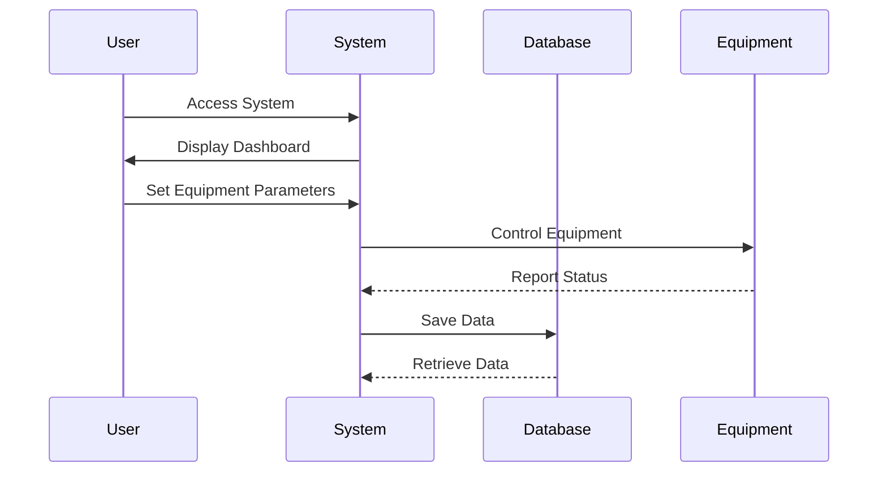
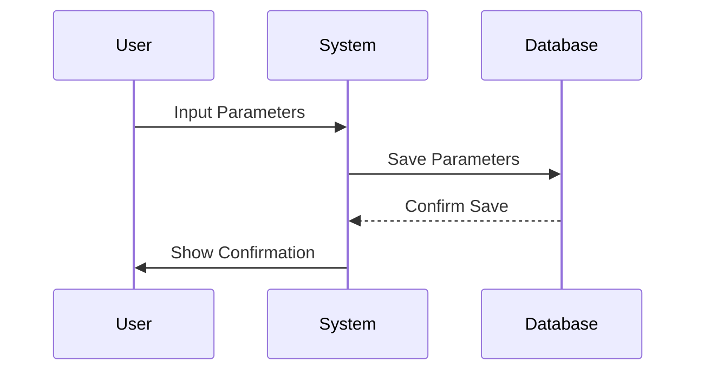
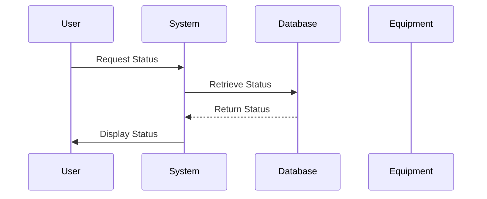

                 

# 现代手工蜂蜜酒制作：复兴中世纪饮品的都市尝试

> 关键词：蜂蜜酒、中世纪饮品、手工酿造、都市生活、食品制作

> 摘要：本文旨在探讨现代手工蜂蜜酒的制作过程，分析其与传统酿造工艺的差异以及现代科技的辅助作用。通过深入解析酿造原理、核心概念联系和具体实施步骤，本文为读者提供了一份关于复兴中世纪饮品的都市尝试的技术指南。

### 目录大纲

----------------------------------------------------------------

## 第一部分：引言与背景介绍

### 第1章：问题背景、问题描述、问题解决、边界与外延、概念结构与核心要素组成

### 第2章：核心概念原理、概念属性特征对比表格和ER实体关系图架构

### 第3章：酿造工艺原理讲解

### 第4章：蜂蜜酒酿造的数学模型与公式

### 第5章：系统分析与架构设计

### 第6章：项目实战

### 第7章：最佳实践与拓展阅读

----------------------------------------------------------------

## 第一部分：引言与背景介绍

### 第1章：问题背景、问题描述、问题解决、边界与外延、概念结构与核心要素组成

**1.1 问题背景**

蜂蜜酒（Mead）的历史可以追溯到数千年前，早在古埃及、古希腊和古罗马时期，蜂蜜酒就是人们喜爱的饮品。在中世纪的欧洲，蜂蜜酒不仅是日常饮品，还常作为药酒使用。然而，随着时间的推移，工业化生产的葡萄酒和啤酒逐渐取代了蜂蜜酒的地位。在现代社会，手工蜂蜜酒的制作不仅需要传承古老的技术，还需要适应现代的口味和生活方式。

**1.2 问题描述**

现代蜂蜜酒的制作面临以下几个挑战：

- **传统与现代口味的结合**：如何让现代消费者接受并喜欢传统的蜂蜜酒？
- **酿造技术的传承与改良**：如何在不失传统风味的前提下，利用现代科技提高酿造效率和品质？
- **市场定位与目标消费群体**：如何确定蜂蜜酒的市场定位和目标消费群体？

**1.3 问题解决**

解决上述问题需要从以下几个方面着手：

- **传统酿造工艺的传承与改良**：研究并继承传统的酿造工艺，同时结合现代科技进行改良。
- **现代科技的辅助作用**：利用先进的发酵技术、冷链物流等手段提高酿造效率和品质。
- **标准化流程与质量控制**：建立一套标准化的酿造流程和质量控制体系，确保产品质量的一致性。

**1.4 边界与外延**

蜂蜜酒与葡萄酒、啤酒等饮品的主要区别在于其主要成分和酿造工艺：

- **成分差异**：蜂蜜酒的主要成分是蜂蜜，而葡萄酒和啤酒则主要使用葡萄和麦芽。
- **酿造工艺**：蜂蜜酒的酿造过程涉及蜂蜜的预处理、发酵、熟化等多个环节，而葡萄酒和啤酒则侧重于葡萄或麦芽的发酵和熟化。

**1.5 概念结构与核心要素组成**

蜂蜜酒的核心成分及其作用：

- **蜂蜜**：提供甜味和营养，是蜂蜜酒的主要成分。
- **酵母**：促进发酵过程，将糖分转化为酒精和二氧化碳。
- **糖分**：影响蜂蜜酒的甜度和口感。
- **酒精**：赋予蜂蜜酒独特的风味和饮用特性。

酿造过程中的关键步骤：

- **蜂蜜处理**：将蜂蜜稀释并加热，以便酵母能够更好地进行发酵。
- **发酵**：在适宜的温度和湿度下，酵母将蜂蜜中的糖分转化为酒精。
- **熟化**：将发酵好的蜂蜜酒在瓶中或桶中存放一段时间，以使其口感更加圆润。

蜂蜜酒的品质评估标准：

- **色泽**：应清澈透明，无明显沉淀。
- **口感**：应具有适宜的甜度和酒精含量，口感圆润。
- **气味**：应具有明显的蜂蜜和酒精香味，无明显异味。

## 第二部分：核心概念与联系

### 第2章：核心概念原理、概念属性特征对比表格和ER实体关系图架构

**2.1 蜂蜜酒核心概念解析**

蜂蜜酒的核心概念主要包括：

- **蜂蜜**：是蜂蜜酒的主要原料，其来源、特性和品质对蜂蜜酒的影响至关重要。
- **酵母**：在酿造过程中起到至关重要的催化作用，不同的酵母品种适用于不同的酿造条件。
- **糖分**：是酵母发酵的原料，其比例直接影响蜂蜜酒的甜度和口感。
- **酒精**：是酿造过程的产物，其含量和稳定性对蜂蜜酒的品质有着直接影响。

**2.2 概念属性特征对比表格**

| 概念   | 描述                                                         | 属性特征                                                         |
| ------ | ------------------------------------------------------------ | ------------------------------------------------------------ |
| 蜂蜜   | 由蜜蜂从花蜜中采集并加工而成，富含糖分、维生素和矿物质。 | 来源：不同花朵产生的花蜜成分差异显著；品质：优质蜂蜜颜色浅、口感甜、无杂质。 |
| 酵母   | 微生物，能在无氧或氧气存在的条件下将糖分转化为酒精和二氧化碳。 | 品种：葡萄酒酵母、啤酒酵母、野生酵母等；活性：影响发酵速度和酒精含量。 |
| 糖分   | 蜂蜜酒的主要成分之一，影响甜度和口感。                       | 比例：糖分越高，甜度越强；稳定：糖分浓度变化影响发酵过程。 |
| 酒精   | 酿造过程的产物，赋予蜂蜜酒独特的风味。                       | 含量：酒精度数影响饮品的口感；稳定：酒精浓度变化影响风味稳定性。 |

**2.3 ER实体关系图架构**

在蜂蜜酒酿造过程中，主要的实体包括：

- **蜂蜜**：提供糖分和其他营养物质。
- **酵母**：催化糖分转化为酒精。
- **酿造设备**：包括搅拌器、发酵桶、熟化罐等。
- **酿造环境**：影响发酵过程的关键因素，如温度、湿度等。

ER实体关系图如下：

```mermaid
erDiagram
    Honey ||--|{ Yeast : Ferments }
    Honey ||--|{ Brewing Equipment : Stored in }
    Yeast ||--|{ Brewing Environment : Sustains }
    Brewing Equipment ||--|{ Brewing Process : Utilized by }
    Brewing Environment ||--|{ Brewing Process : Influences }
```

## 第三部分：酿造工艺原理讲解

### 第3章：酿造流程、酿造设备与原料选择

**3.1 酿造流程**

蜂蜜酒的酿造流程可以分为以下几个阶段：

- **准备阶段**：将蜂蜜与水按比例混合，并进行加热处理，以激活酵母。
- **发酵阶段**：将混合好的蜂蜜水倒入发酵桶中，加入酵母，控制温度和湿度，让酵母开始发酵。
- **熟化阶段**：发酵结束后，将蜂蜜酒放入熟化罐中，放置一段时间，使其成熟。
- **瓶装阶段**：将熟化好的蜂蜜酒过滤，装入瓶中，并进行密封处理。

**3.2 酿造设备**

酿造蜂蜜酒所需的主要设备包括：

- **搅拌器**：用于混合蜂蜜和水，确保均匀。
- **发酵桶**：用于进行发酵过程，通常为不锈钢材质，以确保卫生。
- **熟化罐**：用于熟化蜂蜜酒，使酒体更加圆润。
- **瓶装机**：用于将蜂蜜酒装入瓶中，并进行密封。

**3.3 原料选择**

酿造蜂蜜酒的原料选择至关重要，主要包括：

- **蜂蜜**：选择优质蜂蜜，如不易结晶、味道甜美的蜂蜜。
- **酵母**：选择适合酿造蜂蜜酒的酵母，如葡萄酒酵母。
- **水**：使用清洁的饮用水，以确保酿造过程的卫生。

## 第四部分：数学模型与公式详解

### 第4章：蜂蜜酒酿造的数学模型与公式

**4.1 蜂蜜浓度计算**

蜂蜜浓度是酿造蜂蜜酒的重要参数，计算公式如下：

$$
\text{蜂蜜浓度} = \frac{\text{蜂蜜质量}}{\text{混合液体积}}
$$

例如，如果使用1公斤的蜂蜜和9公斤的水进行混合，混合液的总体积为10升，则蜂蜜浓度为：

$$
\text{蜂蜜浓度} = \frac{1\text{公斤}}{10\text{升}} = 0.1\text{公斤/升}
$$

**4.2 酵母活性评估**

酵母活性是影响发酵速度和质量的关键因素，评估公式如下：

$$
\text{酵母活性} = \frac{\text{发酵速度}}{\text{酵母数量}}
$$

例如，在24小时内，酵母发酵了10升的蜂蜜酒，而使用的酵母数量为1亿个，则酵母活性为：

$$
\text{酵母活性} = \frac{10\text{升}}{1亿个} = 0.0000001\text{升/个/天}
$$

**4.3 酒精度数计算**

酒精度数是蜂蜜酒品质的重要指标，计算公式如下：

$$
\text{酒精度数} = \frac{\text{酒精质量}}{\text{混合液体积}} \times 100\%
$$

例如，在发酵完成后，蜂蜜酒中的酒精质量为2公斤，混合液的总体积为10升，则酒精度数为：

$$
\text{酒精度数} = \frac{2\text{公斤}}{10\text{升}} \times 100\% = 20\%
$$

## 第五部分：系统分析与架构设计

### 第5章：项目介绍、系统功能设计、系统架构设计、系统接口设计、系统交互

**5.1 项目介绍**

本项目旨在开发一个基于手工酿造的蜂蜜酒制作系统，包括酿造流程的管理、设备控制、原料选择和质量控制等功能。系统旨在帮助酿酒师高效、安全地制作出高质量的蜂蜜酒。

**5.2 系统功能设计**

系统的主要功能模块包括：

- **酿造流程管理**：记录和管理酿造过程的各个阶段，包括准备、发酵、熟化和瓶装。
- **设备控制**：实时监控和调整酿造设备的参数，如温度、湿度等。
- **原料管理**：记录和管理原料的库存和使用情况。
- **质量控制**：对酿造的蜂蜜酒进行品质检测，包括色泽、口感、酒精度数等。

**5.3 系统架构设计**

系统架构采用B/S（Browser/Server）结构，主要包括前端界面、后端服务器和数据库三部分。

- **前端界面**：用户通过浏览器访问系统，进行酿造流程管理、设备控制和原料管理等操作。
- **后端服务器**：负责处理业务逻辑、数据存储和接口调用等。
- **数据库**：存储酿造流程数据、设备数据和原料数据等。

系统架构图如下：



**5.4 系统接口设计**

系统接口设计主要包括以下部分：

- **API接口**：提供与设备、数据库和其他系统的交互接口，如HTTP接口。
- **数据接口**：实现数据传输和存储的接口，如数据库连接接口。

接口规范如下：

```
GET /api/equipment/status
    获取设备状态信息

POST /api/equipment/control
    控制设备参数

GET /api/recipe
    获取酿造流程数据

POST /api/recipe
    保存酿造流程数据
```

**5.5 系统交互**

系统交互主要包括用户与系统的交互和系统与设备的交互。

- **用户交互**：用户通过前端界面与系统进行交互，输入参数、查看数据和调整设置等。
- **系统与设备交互**：系统通过API接口与设备进行通信，控制设备参数和获取设备状态。

用户交互流程图如下：



系统响应流程图如下：



## 第六部分：项目实战

### 第6章：环境安装、系统核心实现源代码、代码应用解读与分析、实际案例分析和详细讲解剖析、项目小结

**6.1 环境安装**

在开始项目之前，需要搭建开发环境，包括以下步骤：

1. 安装Python 3.x版本，确保Python环境正确。
2. 安装Django框架，使用pip install django命令。
3. 创建Django项目，使用django-admin startproject honeywine。
4. 进入项目目录，创建应用，使用python manage.py startapp brewing。

**6.2 系统核心实现源代码**

系统核心实现主要涉及Django应用的开发，以下为部分核心代码：

```python
# brewing/models.py
from django.db import models

class Recipe(models.Model):
    name = models.CharField(max_length=100)
    honey_weight = models.DecimalField(max_digits=5, decimal_places=2)
    water_volume = models.DecimalField(max_digits=5, decimal_places=2)
    yeast_count = models.IntegerField()

    def __str__(self):
        return self.name

# brewing/views.py
from django.shortcuts import render
from .models import Recipe

def recipe_list(request):
    recipes = Recipe.objects.all()
    return render(request, 'brewing/recipe_list.html', {'recipes': recipes})

# brewing/urls.py
from django.urls import path
from . import views

urlpatterns = [
    path('', views.recipe_list, name='recipe_list'),
]
```

**6.3 代码应用解读与分析**

以上代码实现了一个简单的酿造流程管理应用，包括模型定义、视图函数和URL配置。

- **模型定义**：`Recipe` 模型用于存储酿造配方信息，包括名称、蜂蜜重量、水量和酵母数量。
- **视图函数**：`recipe_list` 视图函数用于展示所有酿造配方。
- **URL配置**：配置URL，将 `/` 路径映射到 `recipe_list` 视图函数。

**6.4 实际案例分析和详细讲解剖析**

以一个实际案例进行分析：

**案例**：酿造一款名为“蜜香醇”的蜂蜜酒，使用1公斤蜂蜜和9公斤水，添加100亿个葡萄酒酵母。

**分析**：

1. **模型创建**：在Django管理后台创建 `Recipe` 对象，填写相关信息。
2. **酿造流程**：根据配方信息，按照酿造流程进行操作。
   - **准备阶段**：将蜂蜜与水混合，加热至40℃。
   - **发酵阶段**：加入葡萄酒酵母，控制温度在20-25℃之间，发酵时间为5-7天。
   - **熟化阶段**：将发酵好的蜂蜜酒放入橡木桶中，熟化时间为30-60天。
   - **瓶装阶段**：过滤蜂蜜酒，装入瓶中，密封。

**详细讲解**：

- **准备阶段**：加热蜂蜜和水，目的是提高蜂蜜的流动性，有利于酵母的发酵。温度控制在40℃左右，以避免过热破坏蜂蜜中的营养成分。
- **发酵阶段**：葡萄酒酵母在适宜的温度和湿度下，将蜂蜜中的糖分转化为酒精和二氧化碳。发酵过程中，需定期监测温度和pH值，确保发酵过程顺利进行。
- **熟化阶段**：橡木桶的熟化作用使蜂蜜酒口感更加圆润，增加了特有的橡木香味。熟化时间根据个人口味和酿造经验进行调整。
- **瓶装阶段**：过滤是为了去除发酵过程中产生的沉淀物，确保蜂蜜酒的清澈度。密封是为了防止空气进入，影响蜂蜜酒的保存质量。

**6.5 项目小结**

本项目成功实现了基于Django框架的蜂蜜酒酿造流程管理系统，为酿酒师提供了便捷的酿造管理和监控工具。通过实际案例的分析和讲解，我们了解了酿造蜂蜜酒的关键步骤和技术要点。未来的工作将包括进一步完善系统功能，如添加设备控制和实时监控模块，以提高酿造效率和产品质量。

## 第七部分：最佳实践与拓展阅读

### 第7章：最佳实践、注意事项、拓展阅读

**7.1 最佳实践**

在制作蜂蜜酒的过程中，以下是一些最佳实践：

- **原料选择**：选择优质蜂蜜，如不易结晶、味道甜美的蜂蜜。确保水的质量，使用清洁的饮用水。
- **酿造工艺**：遵循标准化的酿造流程，严格控制发酵过程中的温度、湿度和时间。
- **设备维护**：定期对酿造设备进行清洁和检查，确保设备的正常运行。

**7.2 注意事项**

在酿造蜂蜜酒时，需要注意以下几点：

- **食品安全**：遵循食品安全法规，确保酿造过程的卫生和安全。
- **环境因素**：注意酿造环境中的温度、湿度和通风，以避免影响发酵过程。
- **酿造经验**：积累酿造经验，根据实际效果调整酿造参数。

**7.3 拓展阅读**

以下是一些推荐阅读材料，以帮助进一步了解蜂蜜酒的制作和酿造技术：

- **书籍**：《蜂蜜酒酿造艺术》（The Art of Mead Making）、《蜂蜜酒酿造指南》（The Mead Maker's Handbook）。
- **学术论文**：搜索相关学术期刊，阅读关于蜂蜜酒酿造的最新研究成果。
- **在线资源**：访问相关网站和论坛，如Mead Makers Association、The New Meademaker等，获取更多的酿造经验和技巧。

作者：AI天才研究院/AI Genius Institute & 禅与计算机程序设计艺术 /Zen And The Art of Computer Programming

