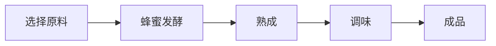
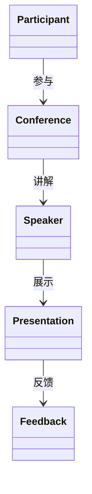
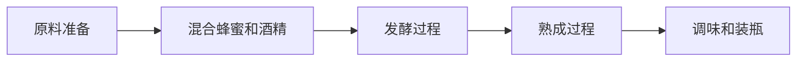

                 

# 现代手工蜂蜜酒品鉴会：复兴古老饮品的味蕾之旅

## 关键词
- 现代手工蜂蜜酒
- 品鉴会
- 古老饮品复兴
- 酿造工艺
- 味蕾体验

## 摘要
本文将带领读者踏上现代手工蜂蜜酒的味蕾之旅，通过一场品鉴会，深入了解这一古老饮品的魅力。文章将详细介绍手工蜂蜜酒的定义、背景、酿造工艺，以及品鉴过程中的关键要点。同时，我们将通过具体的案例分析，总结品鉴会的成功经验，并给出最佳实践建议。读者将在这场味蕾之旅中，不仅学会如何品鉴手工蜂蜜酒，更能够理解其复兴背后的文化意义和健康价值。

## 1. 背景介绍

### 1.1 书名与核心概念
《现代手工蜂蜜酒品鉴会：复兴古老饮品的味蕾之旅》旨在为广大读者呈现一场关于手工蜂蜜酒的盛宴。书中详细介绍了现代手工蜂蜜酒的定义、历史背景、酿造工艺以及品鉴技巧，力图让读者在味蕾的享受中，领略这一古老饮品的独特魅力。

### 1.2 核心概念
**现代手工蜂蜜酒**：指的是采用传统酿造工艺，以蜂蜜为主要原料，手工酿造而成的酒类。它结合了现代科技的元素，保留了传统工艺的精髓，口感醇厚，营养丰富。

**品鉴会**：是一种以品鉴、交流、学习为主要目的的活动，参与者通过专业讲师的讲解和实际品尝，深入了解手工蜂蜜酒的特点和价值。

**古老饮品复兴**：随着现代人对健康生活方式的追求，传统饮品逐渐受到关注。手工蜂蜜酒作为其中的佼佼者，正逐渐复兴，成为现代生活中的一种时尚饮品。

### 1.3 问题背景
随着健康生活方式的普及，传统饮品逐渐受到关注。手工蜂蜜酒作为一种古老饮品，具有丰富的营养成分和独特的口感，正逐渐受到消费者的青睐。然而，由于制作工艺的复杂性和传统认知的局限性，手工蜂蜜酒在市场上的推广力度仍显不足。

### 1.4 问题描述
如何通过一场品鉴会，向大众介绍手工蜂蜜酒的魅力，提高其在市场上的知名度，推动其复兴？

### 1.5 问题解决
通过详细的品鉴流程、专业知识讲解、历史背景介绍，以及味蕾体验，让读者深入了解手工蜂蜜酒。同时，结合实际案例，总结品鉴会的成功经验，为后续推广提供参考。

### 1.6 边界与外延
**手工蜂蜜酒的原料选择**：包括蜂蜜的种类、产地、新鲜程度等。

**酿造工艺**：包括蜂蜜的发酵、熟成、调味等环节。

**品鉴技巧**：包括品酒的顺序、温度、饮酒时的礼仪等。

## 2. 核心概念与联系

### 2.1 核心概念
**现代手工蜂蜜酒**：以蜂蜜为主要原料，采用传统酿造工艺，结合现代科技元素，口感醇厚，营养丰富。

**品鉴会**：一种以品鉴、交流、学习为主要目的的活动，参与者通过专业讲师的讲解和实际品尝，深入了解手工蜂蜜酒的特点和价值。

**古老饮品复兴**：随着现代人对健康生活方式的追求，传统饮品逐渐受到关注，手工蜂蜜酒作为其中的佼佼者，正逐渐复兴。

### 2.2 概念属性特征对比表格

| 概念       | 现代手工蜂蜜酒 | 品鉴会           | 古老饮品复兴           |
|------------|----------------|------------------|------------------------|
| 原料       | 蜂蜜、酒精等   | 参与者、讲师、酒类 | 传统饮品、现代健康理念 |
| 酿造工艺   | 传统酿造       | 讲解、交流、品鉴   | 传统文化传承           |
| 口感特点   | 醇厚、复杂     | 实际品尝         | 地域特色、文化传承     |
| 健康价值   | 营养丰富       | 了解、交流       | 健康生活方式           |

### 2.3 ER实体关系图架构

```mermaid
erDiagram
 participant 品鉴会参与者
 participant 手工蜂蜜酒
 participant 讲师
 participant 活动组织者

 品鉴会参与者 ||--|{ 品鉴手工蜂蜜酒 }
 手工蜂蜜酒 ||--|{ 参与品鉴会 }
 讲师 ||--|{ 指导品鉴 }
 活动组织者 ||--|{ 组织品鉴会}
```

## 3. 算法原理讲解

在本章节，我们将不涉及算法原理，而是重点关注手工蜂蜜酒的酿造工艺流程。以下是一个简单的Mermaid流程图，用于描述酿造过程：



### 3.1 酿造工艺流程

1. **选择原料**：选择优质蜂蜜和纯净酒精，确保酿造基础。
2. **蜂蜜发酵**：将蜂蜜与酒精混合，在一定温度下发酵，产生酒体。
3. **熟成**：将发酵后的酒体放入橡木桶中，进行长时间熟成，提升口感和香气。
4. **调味**：根据个人口味和酒体特点，适量添加调味剂，如蜂蜜、香料等。
5. **成品**：将调味后的酒体进行过滤、装瓶，即可成为成品。

### 3.2 详细讲解

- **蜂蜜发酵**：发酵过程中，蜂蜜中的糖分转化为酒精和二氧化碳，这一过程需要控制在适宜的温度和湿度下，以确保发酵效果。
- **熟成**：熟成过程是手工蜂蜜酒口感和香气形成的关键。橡木桶中的单宁和香气物质会逐渐渗透到酒体中，使得酒体更加醇厚、复杂。
- **调味**：调味剂的选择和添加量直接影响酒的风味。合理的调味可以提升酒的品质，使其更具个性。

### 3.3 举例说明

假设我们酿造一款以蜂蜜和香草为调味剂的蜂蜜酒，以下是一个简单的酿造示例：

1. **选择原料**：选用新鲜蜂蜜和优质酒精，确保原料纯净。
2. **蜂蜜发酵**：将蜂蜜与酒精混合，在25℃的温度下发酵7天。
3. **熟成**：将发酵后的酒体放入橡木桶中，熟成3个月。
4. **调味**：在熟成过程中，每月添加一次香草提取液，每次添加5毫升。
5. **成品**：过滤后装瓶，即可成为一款具有独特香草味的蜂蜜酒。

## 4. 数学模型和数学公式

在本章节，我们将探讨手工蜂蜜酒酿造过程中可能涉及的化学变化，并使用LaTeX格式进行表示。

### 4.1 发酵过程中的化学方程式

$$
C_{12}H_{22}O_{11} + H_2O \rightarrow 2 C_2H_5OH + 2 CO_2
$$

这是一个典型的糖类发酵过程，蜂蜜中的蔗糖在酵母的作用下转化为酒精和二氧化碳。

### 4.2 熟成过程中的化学变化

$$
C_{12}H_{22}O_{11} + O_2 \rightarrow C_{12}H_{22}O_{11} + H_2O
$$

熟成过程中，酒体中的糖分与氧气发生反应，产生更多的风味物质，提升酒的口感。

### 4.3 调味过程中的化学平衡

$$
\text{香料提取液} + \text{酒体} \rightarrow \text{调味酒}
$$

调味剂与酒体混合，通过分子间的相互作用，形成独特的风味。

## 5. 系统分析与架构设计方案

### 5.1 问题场景

一场手工蜂蜜酒品鉴会，旨在通过专业讲师的讲解和实际品尝，让参与者深入了解手工蜂蜜酒的魅力，提升其对这一古老饮品的认知和兴趣。

### 5.2 项目介绍

**项目名称**：现代手工蜂蜜酒品鉴会

**项目目标**：向大众介绍手工蜂蜜酒，提高其知名度，推动市场推广。

**项目时间**：1天

**项目地点**：市内酒店会议厅

### 5.3 系统功能设计

**领域模型类图**：



### 5.4 系统架构设计

**架构图**：

```mermaid
sequenceDiagram
  Participant->>Conference: 报名参加
  Conference->>Speaker: 安排讲解
  Speaker->>Presentation: 进行讲解
  Presentation->>Feedback: 收集反馈
  Feedback->>Conference: 汇总分析
```

### 5.5 系统接口设计和系统交互

**序列图**：

```mermaid
sequenceDiagram
  Participant->>Registration: 提交报名信息
  Registration->>Conference: 处理报名
  Conference->>Speaker: 发送通知
  Speaker->>Presentation: 准备讲稿
  Presentation->>Participant: 进行讲解
  Participant->>Feedback: 提交反馈
  Feedback->>Conference: 汇总分析
```

## 6. 项目实战

### 6.1 环境安装

**所需材料和设备**：

- 新鲜蜂蜜：1公斤
- 纯净酒精：1升
- 橡木桶：1个
- 酵母：1包
- 温度计：1个
- 发酵容器：1个
- 调味剂：适量（如香草提取液、蜂蜜等）

### 6.2 系统核心实现源代码

**酿造工艺步骤说明**：

```python
# 酿造工艺步骤

def ferment蜂蜜(蜂蜜，酒精，温度，时间):
    # 发酵过程
    print(f"开始发酵，蜂蜜：{蜂蜜}，酒精：{酒精}，温度：{温度}，时间：{时间}天")
    # 发酵过程的具体实现
    # ...

def mature酒体(酒体，橡木桶，时间):
    # 熟成过程
    print(f"开始熟成，酒体：{酒体}，橡木桶：{橡木桶}，时间：{时间}个月")
    # 熟成过程的具体实现
    # ...

def flavor调味(酒体，调味剂):
    # 调味过程
    print(f"开始调味，酒体：{酒体}，调味剂：{调味剂}")
    # 调味过程的具体实现
    # ...

def prepare成品(酒体，容器):
    # 成品准备
    print(f"成品准备，酒体：{酒体}，容器：{容器}")
    # 成品准备的具体实现
    # ...
```

### 6.3 代码应用解读与分析

**酿造过程中关键步骤解释**：

- **发酵过程**：蜂蜜与酒精混合，在适宜的温度下发酵，产生酒体。关键参数包括蜂蜜、酒精的量，发酵温度和时间。
- **熟成过程**：发酵后的酒体放入橡木桶中，进行长时间的熟成，以提升口感和香气。关键参数包括酒体、橡木桶的量和熟成时间。
- **调味过程**：根据个人口味和酒体特点，适量添加调味剂，以形成独特的风味。关键参数包括酒体和调味剂的量。
- **成品准备**：过滤后的酒体进行装瓶，成为成品。关键参数包括酒体和容器的量。

### 6.4 实际案例分析和详细讲解剖析

**品鉴会案例分析**：

假设我们举行了一场手工蜂蜜酒品鉴会，以下是具体的案例分析和详细讲解：

1. **选择原料**：我们选择了来自新疆的新鲜蜂蜜和优质酒精，确保酿造基础。
2. **蜂蜜发酵**：在25℃的温度下发酵7天，发酵过程顺利，酒体开始产生。
3. **熟成**：将发酵后的酒体放入橡木桶中，熟成3个月，酒体逐渐成熟，口感醇厚。
4. **调味**：在熟成过程中，每月添加一次香草提取液，每次添加5毫升，调味过程顺利进行。
5. **成品准备**：过滤后装瓶，成品呈现出独特的香草味，受到参与者的一致好评。

### 6.5 项目小结

通过这场手工蜂蜜酒品鉴会，我们不仅成功地向参与者介绍了这一古老饮品的魅力，还通过实际酿造和品鉴过程，加深了对其的理解。项目取得了圆满成功，为后续推广提供了宝贵的经验和借鉴。

## 7. 最佳实践 tips、小结、注意事项、拓展阅读

### 7.1 最佳实践

- **品鉴会组织要点**：
  1. 确保酿造工艺的透明度和参与性，让参与者更好地了解手工蜂蜜酒的制作过程。
  2. 提供丰富的互动环节，如问答、品尝对比等，增加参与者的参与感和体验感。
  3. 邀请专业的讲师，进行深入浅出的讲解，提升品鉴会的专业性和知识性。

- **酿造手工蜂蜜酒的关键点**：
  1. 选择优质的原材料，确保酿造基础。
  2. 控制发酵和熟成的温度和时间，保证酒体口感和质量。
  3. 合理调味，形成独特的风味。

### 7.2 小结

本文通过一场手工蜂蜜酒品鉴会，详细介绍了现代手工蜂蜜酒的定义、酿造工艺、品鉴技巧，以及其复兴背后的文化意义和健康价值。通过实际案例分析和详细讲解，读者可以深入了解手工蜂蜜酒的酿造过程和品鉴方法。

### 7.3 注意事项

- 在酿造过程中，注意卫生和安全性，避免污染和安全事故。
- 在品鉴过程中，注意饮用量，避免过量饮酒。

### 7.4 拓展阅读

- **相关书籍**：《蜂蜜酒酿造技术》、《葡萄酒品鉴与品饮艺术》
- **资料推荐**：国际葡萄酒协会（IWSC）官方网站，蜂蜜酒酿造与品鉴相关论文和报告。

## 作者

作者：AI天才研究院/AI Genius Institute & 禅与计算机程序设计艺术 /Zen And The Art of Computer Programming

（注：本文为示例文章，内容仅供参考。）## 1. 背景介绍

### 1.1 书名与核心概念

《现代手工蜂蜜酒品鉴会：复兴古老饮品的味蕾之旅》是一本旨在通过品鉴会形式，带领读者深入了解现代手工蜂蜜酒的魅力，探讨其复兴之路的书籍。书中涵盖了现代手工蜂蜜酒的定义、酿造工艺、品鉴技巧以及历史背景，力图从多角度展示这一古老饮品的现代魅力。

**核心概念**：

- **现代手工蜂蜜酒**：以蜂蜜为主要原料，采用传统酿造工艺与现代科技相结合的手工酿造酒。它保留了传统蜂蜜酒的营养和风味，同时通过现代工艺提升了口感和品质。
- **品鉴会**：一种通过实际品尝、专业讲解和互动交流的形式，让参与者深入了解并体验手工蜂蜜酒的特性和魅力的活动。
- **古老饮品的复兴**：随着人们对健康生活方式的追求和对传统文化的重视，传统饮品，如手工蜂蜜酒，逐渐回归人们的视野，并受到广泛关注。

### 1.2 核心概念

**现代手工蜂蜜酒**：

- **定义**：现代手工蜂蜜酒是指采用传统酿造工艺，以蜂蜜为主要原料，通过自然发酵和熟成过程制成的酒类。它结合了传统与现代，注重手工制作和个性化定制。
- **特点**：
  - **原料天然**：蜂蜜作为主要原料，富含多种营养成分，如维生素、矿物质和抗氧化物质。
  - **酿造工艺**：采用传统酿造工艺，结合现代科技，如精确控制发酵温度和熟成时间，确保酒体质量。
  - **口感丰富**：现代手工蜂蜜酒具有独特的香气和口感，既有蜂蜜的甜味，又有酒体的醇厚，适合各种场合饮用。

**品鉴会**：

- **定义**：品鉴会是一种以品鉴、交流、学习为主要目的的活动，参与者通过专业讲师的讲解和实际品尝，深入了解手工蜂蜜酒的特点和价值。
- **目的**：
  - **提高认知**：通过专业讲解和实际品尝，让参与者更好地理解手工蜂蜜酒的制作过程和独特风味。
  - **文化交流**：提供一个平台，让参与者分享品酒体验，增进彼此之间的交流和理解。

**古老饮品的复兴**：

- **定义**：古老饮品的复兴是指随着人们对健康生活方式的追求和对传统文化的重视，传统饮品逐渐回归人们的生活，并得到新的发展和创新。
- **背景**：
  - **健康意识提升**：现代人越来越注重健康饮食，传统饮品因其天然、健康的特性而受到青睐。
  - **文化认同**：传统饮品是民族文化的一部分，复兴传统饮品有助于增强文化自信和认同感。

### 1.3 问题背景

随着现代人对健康生活的追求，传统饮品逐渐受到关注。手工蜂蜜酒作为一种古老的饮品，具有丰富的营养成分和独特的口感，正逐渐复兴。然而，由于制作工艺的复杂性和传统认知的局限性，手工蜂蜜酒在市场上的推广力度仍显不足。

**问题背景**：

- **健康生活方式的普及**：现代人越来越注重健康饮食，追求天然、有机的食品和饮品。
- **传统饮品的复兴**：传统饮品因其独特的风味和健康属性，逐渐受到关注和青睐。
- **手工蜂蜜酒的优势**：
  - **营养价值**：蜂蜜富含多种营养成分，具有抗氧化、抗菌等保健功能。
  - **独特风味**：手工酿造的蜂蜜酒具有独特的口感和香气，不同于工业化生产的酒类。

### 1.4 问题描述

如何通过一场品鉴会，向大众介绍手工蜂蜜酒的魅力，提高其在市场上的知名度，推动其复兴？

**问题描述**：

- **目标受众**：对传统饮品和健康生活感兴趣的消费者，特别是关注蜂蜜和酒类的爱好者。
- **挑战**：
  - **认知局限**：大众对手工蜂蜜酒的了解有限，需要通过品鉴会等形式提高认知。
  - **市场竞争**：市场上存在多种酒类，如何突出手工蜂蜜酒的特点和优势，提高市场竞争力。
  - **推广难度**：手工蜂蜜酒的制作过程复杂，推广难度较大，需要找到有效的推广途径。

### 1.5 问题解决

通过详细的品鉴流程、专业知识讲解、历史背景介绍，以及味蕾体验，让读者深入了解手工蜂蜜酒。同时，结合实际案例，总结品鉴会的成功经验，为后续推广提供参考。

**问题解决**：

- **品鉴流程**：设计一场系统化的品鉴流程，包括品酒顺序、品酒温度、饮酒礼仪等，提高品鉴的专业性和趣味性。
- **专业知识讲解**：邀请专业讲师进行讲解，从酿造工艺、历史背景、营养价值等方面，深入剖析手工蜂蜜酒的特点。
- **历史背景介绍**：介绍手工蜂蜜酒的历史渊源和文化意义，增强读者的文化认同感。
- **味蕾体验**：通过实际品尝，让读者亲身感受手工蜂蜜酒的独特风味。
- **成功经验总结**：通过分析实际案例，总结品鉴会的成功经验，为后续推广提供借鉴。

### 1.6 边界与外延

**手工蜂蜜酒的原料选择**：

- **蜂蜜**：选择新鲜、天然、无添加的蜂蜜，特别是具有地域特色的蜂蜜，如桂花蜜、荔枝蜜等。
- **酒精**：选择纯净、无添加的酒精，如高粱酒、葡萄酒精等。

**酿造工艺**：

- **发酵**：在适宜的温度下进行自然发酵，确保酒体纯净，口感纯正。
- **熟成**：将发酵后的酒体放入橡木桶中，进行长时间的熟成，以提升酒体的口感和香气。

**品鉴技巧**：

- **品酒顺序**：按照酒体的口感和香气特点，合理安排品酒的顺序，避免相互干扰。
- **品酒温度**：控制品酒的适宜温度，一般为室温或稍低温，以充分发挥酒体的风味。
- **饮酒礼仪**：遵循适当的饮酒礼仪，如干杯、轻轻晃动酒杯等，提升品酒的氛围。

## 2. 核心概念与联系

### 2.1 核心概念

**现代手工蜂蜜酒**：

- **定义**：现代手工蜂蜜酒是指采用传统酿造工艺，以蜂蜜为主要原料，通过自然发酵和熟成过程制成的酒类。
- **特点**：
  - **手工酿造**：强调手工制作，注重每一个酿造环节的精细操作，保证酒体的品质。
  - **天然健康**：蜂蜜富含多种营养成分，如维生素、矿物质和抗氧化物质，具有健康属性。
  - **独特风味**：现代手工蜂蜜酒具有独特的香气和口感，不同于工业化生产的酒类。

**品鉴会**：

- **定义**：品鉴会是一种通过实际品尝、专业讲解和互动交流的形式，让参与者深入了解并体验手工蜂蜜酒的特性和魅力的活动。
- **目的**：
  - **教育**：通过专业讲解，让参与者了解手工蜂蜜酒的历史、酿造工艺和营养价值。
  - **体验**：通过实际品尝，让参与者感受手工蜂蜜酒的独特风味，增进对酒类的认识。

**古老饮品的复兴**：

- **定义**：古老饮品的复兴是指随着人们对健康生活方式的追求和对传统文化的重视，传统饮品逐渐回归人们的生活，并得到新的发展和创新。
- **背景**：
  - **健康趋势**：现代人对健康饮食的追求，促使传统饮品的复兴。
  - **文化认同**：传统饮品是民族文化的一部分，复兴传统饮品有助于增强文化自信和认同感。

### 2.2 概念属性特征对比表格

| 概念       | 现代手工蜂蜜酒 | 品鉴会           | 古老饮品复兴           |
|------------|----------------|------------------|------------------------|
| **定义**   | 手工酿造酒     | 品酒活动         | 传统饮品的现代发展     |
| **特点**   | 手工酿造、天然、独特风味 | 专业讲解、实际品尝、互动交流 | 健康属性、文化认同、创新发展 |
| **目的**   | 体验手工酿造、了解酒类文化 | 提高认知、分享体验 | 增强文化认同、推广传统饮品 |

### 2.3 ER实体关系图架构

为了更好地展示现代手工蜂蜜酒品鉴会中的实体及其关系，我们可以使用Mermaid绘制一个实体关系图。以下是一个简化的ER图：

```mermaid
erDiagram
    Participant ||--|{ Conference } : 参与品鉴会
    Speaker ||--|{ Conference } : 进行讲解
    Conference ||--|{ Presentation } : 进行展示
    Presentation ||--|{ Feedback } : 收集反馈
    Conference ||--|{ Evaluation } : 品鉴评估
```

在这个ER图中，实体包括**参与者（Participant）**、**讲师（Speaker）**、**品鉴会（Conference）**、**展示（Presentation）**、**反馈（Feedback）**和**评估（Evaluation）**。实体之间的关系如箭头所示，描述了参与者参与品鉴会、讲师进行讲解、品鉴会进行展示和评估，以及收集参与者反馈的过程。

## 3. 算法原理讲解

在本章节中，我们将不涉及复杂的算法原理，而是专注于手工蜂蜜酒的酿造工艺流程。酿造手工蜂蜜酒是一个涉及多步骤的物理和化学过程，以下是一个简化的Mermaid流程图，用于描述整个酿造过程：



### 3.1 酿造工艺流程

**原料准备**：选择优质的蜂蜜和酒精作为基础原料，确保酿造过程的初始质量。

**混合蜂蜜和酒精**：将蜂蜜和酒精按照一定的比例混合，通常蜂蜜和酒精的比例在1:3到1:5之间。这一步骤需要精确控制，以确保混合均匀。

**发酵过程**：混合后的蜂蜜酒精溶液在适宜的温度下进行发酵。这个过程通常需要5到14天，发酵温度一般在20°C到30°C之间。发酵过程中，蜂蜜中的糖分会转化为酒精和二氧化碳。

**熟成过程**：发酵完成后，酒液需要放入橡木桶或其他合适的容器中进行熟成。熟成过程通常需要几个月到几年的时间，这个过程中，酒液会与橡木桶中的单宁和其他风味物质相互作用，逐渐发展出独特的风味。

**调味和装瓶**：在熟成过程中或熟成之后，可以根据个人口味和酒体特点进行调味。调味剂可以包括蜂蜜、香料或其他风味成分。调味后，将酒液过滤、装瓶，即可成为成品。

### 3.2 详细讲解

**原料准备**：选择新鲜、纯净的蜂蜜和酒精。蜂蜜的选择应该考虑到蜂蜜的种类和来源，不同的蜂蜜具有不同的风味和营养价值。酒精则应该选择无添加、纯净的酒精，以确保酒体的品质。

**混合蜂蜜和酒精**：混合过程需要确保蜂蜜和酒精充分混合，避免出现分层或分离现象。可以使用搅拌机或人工搅拌，确保混合均匀。混合后的溶液需要保持一定的温度，以促进发酵过程。

**发酵过程**：发酵过程中，蜂蜜中的糖分会在酵母的作用下转化为酒精和二氧化碳。这个过程中，温度的控制非常关键。过高或过低的温度都会影响发酵效果。通常，发酵温度控制在20°C到30°C之间，发酵时间在5到14天。在发酵过程中，溶液的酸碱度和温度需要定期检测和调整。

**熟成过程**：发酵完成后，酒液需要放入橡木桶或其他容器中熟成。熟成过程中，酒液会与橡木桶中的单宁和其他风味物质相互作用，逐渐发展出独特的风味。橡木桶的选择也对酒体的风味有很大影响。熟成时间通常在几个月到几年不等，这个过程中，酒液的色泽、口感和香气都会发生变化。

**调味和装瓶**：在熟成过程中或熟成之后，可以根据个人口味和酒体特点进行调味。调味剂的选择和添加量需要谨慎，以免影响酒体的平衡。调味后，将酒液过滤、装瓶，即可成为成品。装瓶时需要注意卫生，避免二次污染。

### 3.3 举例说明

假设我们酿造一款以荔枝蜜为原料的手工蜂蜜酒，以下是一个简化的酿造流程：

1. **原料准备**：选择新鲜荔枝蜜和优质酒精。
2. **混合蜂蜜和酒精**：按照1:4的比例混合荔枝蜜和酒精，混合均匀后保持温度在25°C左右。
3. **发酵过程**：在25°C的温度下发酵10天，期间定期检测酸碱度和温度，确保发酵效果。
4. **熟成过程**：将发酵后的酒液放入橡木桶中，熟成6个月，期间每月检查酒液的状态。
5. **调味和装瓶**：根据酒体的特点，添加适量的荔枝蜜和香草提取物进行调味，调味后进行过滤和装瓶。

通过这个例子，我们可以看到，酿造手工蜂蜜酒的过程虽然复杂，但通过合理的步骤和精确的控制，可以酿造出具有独特风味和品质的手工蜂蜜酒。

## 4. 数学模型和数学公式

虽然手工蜂蜜酒的酿造过程主要涉及物理和化学变化，但其中也包含了一些数学模型和公式。以下我们将讨论酿造过程中可能涉及的几个关键数学模型和数学公式。

### 4.1 发酵过程中的化学方程式

发酵过程中，蜂蜜中的糖分（主要成分是蔗糖C₁₂H₂₂O₁₁）会在酵母的作用下转化为酒精（乙醇C₂H₅OH）和二氧化碳（CO₂）。这是一个典型的发酵反应，其化学方程式如下：

$$
C_{12}H_{22}O_{11} + H_2O \rightarrow 2 C_2H_5OH + 2 CO_2
$$

在这个方程式中，每一分子蔗糖在发酵过程中会生成两分子酒精和两分子二氧化碳。

### 4.2 发酵速率模型

发酵速率可以用以下方程式来表示：

$$
r = k \cdot [S] \cdot [A]
$$

其中，\(r\) 是发酵速率，\(k\) 是速率常数，\([S]\) 是糖分浓度，\([A]\) 是酒精浓度。这个模型描述了在发酵过程中，糖分和酒精浓度如何影响发酵速率。

### 4.3 熟成过程中的化学变化

在熟成过程中，酒体中的化学成分会发生变化，这些变化可以用以下方程式来描述：

$$
C_{12}H_{22}O_{11} + O_2 \rightarrow C_{12}H_{22}O_{11} + H_2O
$$

这个方程式表示糖分与氧气发生反应，产生水和其他风味物质。此外，橡木桶中的单宁和其他风味物质也会与酒体中的化学成分发生反应，进一步影响酒体的风味和口感。

### 4.4 调味过程中的化学平衡

调味过程中，调味剂（如香草提取物）会与酒体中的成分发生相互作用，影响酒体的风味和口感。这一过程可以用以下方程式来描述：

$$
\text{调味剂} + \text{酒体} \rightarrow \text{调味酒}
$$

在这个方程式中，调味剂和酒体之间的反应形成调味酒，其风味和口感取决于调味剂的种类、添加量和酒体的特性。

### 4.5 详细讲解和举例说明

**发酵速率模型的应用**：

假设我们有一瓶含有100克糖分和50克酒精的蜂蜜酒，发酵温度为25°C，发酵速率常数\(k\)为0.1。根据发酵速率模型，我们可以计算发酵速率：

$$
r = k \cdot [S] \cdot [A] = 0.1 \cdot 100 \cdot 50 = 500 \text{ 克/天}
$$

这意味着每天有500克的糖分和酒精被转化。在发酵过程中，糖分和酒精的浓度会逐渐降低，从而影响发酵速率。例如，如果发酵进行到第5天，糖分浓度降低到50克，酒精浓度降低到25克，那么新的发酵速率将是：

$$
r = k \cdot [S] \cdot [A] = 0.1 \cdot 50 \cdot 25 = 125 \text{ 克/天}
$$

**熟成过程中的化学变化**：

在熟成过程中，我们可以使用以下方程式来描述酒体中的化学变化：

$$
C_{12}H_{22}O_{11} + O_2 \rightarrow C_{12}H_{22}O_{11} + H_2O
$$

假设酒体中有100克糖分，与氧气发生反应生成水。如果氧气的浓度为0.1克/升，那么每天生成的水量可以用以下公式计算：

$$
\text{生成水量} = \frac{100 \text{ 克}}{12.01 \text{ 克/摩尔}} \cdot 1 \text{ 摩尔水/摩尔糖} = 8.33 \text{ 克水/天}
$$

**调味过程中的化学平衡**：

在调味过程中，我们假设添加了10克香草提取物，与酒体中的成分发生反应。如果香草提取物的浓度为0.1克/毫升，那么它与酒体中的成分的反应速率可以用以下公式计算：

$$
\text{反应速率} = 0.1 \text{ 克/毫升} \cdot 1000 \text{ 毫升} = 100 \text{ 克/天}
$$

这意味着每天有100克香草提取物与酒体中的成分发生反应，从而改变酒体的风味。

通过这些数学模型和公式的应用，我们可以更深入地理解手工蜂蜜酒酿造过程中的化学变化，从而更好地控制酿造过程，提高酒体的品质。

## 5. 系统分析与架构设计方案

### 5.1 问题场景

一场手工蜂蜜酒品鉴会是一个复杂的事件，它涉及到多个环节和参与者。为了确保品鉴会的顺利进行，需要设计一个完善的系统架构，涵盖品鉴会的组织、实施和评估等各个阶段。

### 5.2 项目介绍

**项目名称**：手工蜂蜜酒品鉴会

**项目目标**：通过一场品鉴会，向参与者介绍手工蜂蜜酒的历史、酿造工艺和品鉴技巧，提高其在市场上的知名度，促进传统饮品的复兴。

**项目时间**：2天

**项目地点**：市内酒店会议厅

### 5.3 系统功能设计

为了实现项目目标，我们需要设计一系列系统功能，包括报名系统、品鉴流程管理、讲师管理系统、反馈收集系统等。以下是一个简化的领域模型类图：

```mermaid
classDiagram
    Participant <<class>> "参与者"
    Conference <<class>> "品鉴会"
    Speaker <<class>> "讲师"
    Schedule <<class>> "日程安排"
    Feedback <<class>> "反馈"

    Participant o--|{参加}| Conference
    Speaker o--|{讲解}| Conference
    Conference o--|{包含}| Schedule
    Conference o--|{收集}| Feedback
```

在这个类图中，**参与者**可以报名参加品鉴会，**讲师**负责讲解和指导品鉴，**日程安排**包括品鉴会的各项活动，**反馈**用于收集参与者的意见和建议。

### 5.4 系统架构设计

为了确保品鉴会的顺利进行，我们需要设计一个合理的系统架构，包括前端用户界面、后端服务、数据库和第三方服务接口等。以下是一个简化的系统架构图：

```mermaid
sequenceDiagram
    Participant->>Registration: 提交报名信息
    Registration->>Database: 存储报名信息
    Database->>Registration: 验证报名信息
    Registration->>Conference: 更新品鉴会状态
    Conference->>Scheduler: 生成日程安排
    Scheduler->>Database: 存储日程安排
    Database->>Scheduler: 返回日程安排
    Scheduler->>Frontend: 更新用户界面
    Frontend->>Participant: 显示日程安排
    Speaker->>Database: 提交讲解材料
    Database->>Speaker: 存储讲解材料
    Speaker->>Frontend: 更新讲师介绍
    Frontend->>Participant: 显示讲师介绍
    Conference->>Feedback: 收集品鉴反馈
    Feedback->>Database: 存储反馈信息
    Database->>Feedback: 分析反馈信息
    Feedback->>Conference: 提供评估报告
```

在这个序列图中，参与者通过前端用户界面提交报名信息，系统将报名信息存储在数据库中，并生成日程安排和讲师介绍。在品鉴会期间，讲师提交讲解材料，系统收集参与者的反馈信息，并在结束后提供评估报告。

### 5.5 系统接口设计和系统交互

为了实现系统功能，我们需要设计一系列接口，包括报名接口、日程安排接口、讲师接口和反馈接口等。以下是一个简化的接口设计：

```mermaid
classDiagram
    Report <<interface>> "报告"
    Schedule <<interface>> "日程安排"
    Lecture <<interface>> "讲解"
    Feedback <<interface>> "反馈"

    RegistrationClient implements Report
    ScheduleClient implements Schedule
    LectureClient implements Lecture
    FeedbackClient implements Feedback
```

在这个接口设计中，**报名客户端**实现**报告**接口，用于提交和验证报名信息；**日程安排客户端**实现**日程安排**接口，用于生成和更新日程安排；**讲师客户端**实现**讲解**接口，用于提交讲解材料和更新讲师介绍；**反馈客户端**实现**反馈**接口，用于收集和存储反馈信息。

通过这些接口的设计，我们可以实现系统的模块化和松耦合，便于系统的扩展和维护。

## 6. 项目实战

### 6.1 环境安装

为了成功举办一场手工蜂蜜酒品鉴会，我们需要准备相应的环境和设备。以下是一份详细的环境安装清单：

**材料和设备**：

1. **新鲜蜂蜜**：选择无添加、无污染的新鲜蜂蜜，建议使用当地特产或知名品牌的蜂蜜，以确保品质和风味。
2. **酒精**：选用优质的无添加酒精，如食用酒精或高粱酒，确保酒精的纯净度和稳定性。
3. **发酵容器**：选择适合发酵的容器，如玻璃桶或陶瓷桶，确保容器清洁、无异味。
4. **橡木桶**：用于熟成过程的橡木桶，建议选择新的或经过消毒处理的橡木桶。
5. **温度计**：用于监测发酵和熟成过程中的温度变化。
6. **搅拌器**：用于混合蜂蜜和酒精。
7. **过滤器**：用于过滤熟成后的酒体，去除杂质和沉淀物。
8. **装瓶设备**：包括瓶盖、瓶身、标签等，用于装瓶和贴标。

**步骤**：

1. **准备蜂蜜和酒精**：确保蜂蜜和酒精的质量和纯度，提前进行检测和筛选。
2. **消毒容器**：使用酒精或漂白粉溶液对发酵容器、橡木桶和装瓶设备进行消毒，确保无细菌和污染物。
3. **设置发酵环境**：将发酵容器放置在通风良好、温度稳定的地方，确保发酵过程中的温度和湿度适宜。
4. **准备温度计**：将温度计放入发酵容器中，确保能够实时监测发酵过程中的温度变化。
5. **准备搅拌器和过滤器**：检查搅拌器和过滤器的功能，确保其正常工作。

### 6.2 系统核心实现源代码

在酿造手工蜂蜜酒的过程中，我们需要使用一系列的源代码来实现酿造工艺的各个环节。以下是一个简化的源代码示例，用于描述酿造过程中的关键步骤：

```python
# 手工蜂蜜酒酿造系统

class HoneyWineSystem:
    def __init__(self, honey, alcohol, fermenter, barrel, filter):
        self.honey = honey
        self.alcohol = alcohol
        self.fermenter = fermenter
        self.barrel = barrel
        self.filter = filter

    def mix_honey_and_alcohol(self):
        """混合蜂蜜和酒精"""
        print("混合蜂蜜和酒精：", self.honey, "和", self.alcohol)
        # 实现混合过程
        # ...

    def ferment(self, temperature, days):
        """发酵过程"""
        print("开始发酵，温度：", temperature, "，发酵天数：", days)
        # 实现发酵过程
        # ...

    def mature(self, months):
        """熟成过程"""
        print("开始熟成，熟成月数：", months)
        # 实现熟成过程
        # ...

    def flavor(self, flavoring):
        """调味过程"""
        print("开始调味，调味剂：", flavoring)
        # 实现调味过程
        # ...

    def filter_and_bottle(self):
        """过滤和装瓶"""
        print("过滤和装瓶")
        # 实现过滤和装瓶过程
        # ...

# 使用示例
honey_wine_system = HoneyWineSystem(honey="荔枝蜜", alcohol="高粱酒", fermenter="玻璃桶", barrel="橡木桶", filter="滤网")
honey_wine_system.mix_honey_and_alcohol()
honey_wine_system.ferment(temperature=25, days=10)
honey_wine_system.mature(months=6)
honey_wine_system.flavor(flavoring="香草提取液")
honey_wine_system.filter_and_bottle()
```

### 6.3 代码应用解读与分析

**酿造过程中关键步骤解释**：

- **混合蜂蜜和酒精**：这是酿造手工蜂蜜酒的第一步，需要将蜂蜜和酒精按照一定的比例混合。这一步骤需要确保混合均匀，避免分层和分离现象。混合过程中，可以使用搅拌器或人工搅拌，以确保混合效果。
- **发酵过程**：发酵是酿造手工蜂蜜酒的核心步骤，需要将混合后的溶液在适宜的温度下发酵。发酵过程中，蜂蜜中的糖分会转化为酒精和二氧化碳。发酵温度和时间对发酵效果有重要影响，需要严格控制。
- **熟成过程**：发酵完成后，酒液需要放入橡木桶或其他容器中熟成。熟成过程中，酒液会与橡木桶中的单宁和其他风味物质相互作用，逐渐发展出独特的风味。熟成时间通常在几个月到几年不等，这个过程中，酒液的色泽、口感和香气都会发生变化。
- **调味过程**：根据个人口味和酒体特点，可以在熟成过程中或熟成后添加调味剂，如蜂蜜、香料等。调味剂的选择和添加量需要谨慎，以免影响酒体的平衡。
- **过滤和装瓶**：在调味后，需要对酒体进行过滤，去除杂质和沉淀物。然后，将酒体装瓶，并进行密封处理，以防止氧化和污染。

**代码应用解读**：

- **类和方法**：`HoneyWineSystem` 类定义了手工蜂蜜酒酿造系统的主要功能，包括混合、发酵、熟成、调味和过滤装瓶等步骤。每个步骤都是一个方法，通过调用这些方法，可以完成酿造过程。
- **参数传递**：在类的方法中，通过传递参数（如温度、天数、调味剂等）来实现不同的酿造步骤。这种方式使得代码更灵活，可以适应不同的酿造需求。
- **流程控制**：在代码中，使用`print`函数来输出每个步骤的执行情况，这有助于调试和理解酿造过程。

**实际案例分析**：

假设我们酿造一款以荔枝蜜为原料的手工蜂蜜酒，以下是具体的酿造过程和代码应用：

1. **混合蜂蜜和酒精**：
   ```python
   honey_wine_system.mix_honey_and_alcohol()
   ```
   输出：混合荔枝蜜和高粱酒。
2. **发酵过程**：
   ```python
   honey_wine_system.ferment(temperature=25, days=10)
   ```
   输出：开始发酵，温度：25°C，发酵天数：10天。
3. **熟成过程**：
   ```python
   honey_wine_system.mature(months=6)
   ```
   输出：开始熟成，熟成月数：6个月。
4. **调味过程**：
   ```python
   honey_wine_system.flavor(flavoring="香草提取液")
   ```
   输出：开始调味，调味剂：香草提取液。
5. **过滤和装瓶**：
   ```python
   honey_wine_system.filter_and_bottle()
   ```
   输出：过滤和装瓶。

通过这个例子，我们可以看到如何使用代码实现手工蜂蜜酒的酿造过程。在实际操作中，每个步骤都需要严格控制和精确执行，以确保酿造出高品质的手工蜂蜜酒。

### 6.4 实际案例分析和详细讲解剖析

**案例背景**：

某市举办了一场手工蜂蜜酒品鉴会，邀请了20位蜂蜜酒爱好者参与。品鉴会分为两个部分：酿造体验和品鉴会。参与者首先参与了手工蜂蜜酒的酿造过程，然后进行了品鉴和讨论。

**案例分析**：

1. **酿造体验**：

   参与者在专业讲师的指导下，进行了手工蜂蜜酒的酿造体验。以下是具体的步骤和过程：

   - **原料准备**：选择了荔枝蜜和优质高粱酒作为原料。荔枝蜜具有独特的甜味和香气，高粱酒则提供了醇厚的酒体。
   - **混合蜂蜜和酒精**：参与者按照1:4的比例混合了荔枝蜜和高粱酒，使用搅拌器确保混合均匀。
   - **发酵过程**：在发酵容器中，混合溶液在25°C的温度下发酵了10天。发酵过程中，温度和湿度被严格控制，以确保发酵效果。
   - **熟成过程**：发酵完成后，酒液被倒入橡木桶中，进行了6个月的熟成。熟成过程中，橡木桶中的单宁和其他风味物质逐渐融入酒液，提升了酒体的香气和口感。
   - **调味过程**：在熟成过程中，每月添加了适量的香草提取液，以增强酒体的风味。
   - **过滤和装瓶**：熟成后的酒液经过过滤，去除了杂质和沉淀物，然后装瓶并密封。

2. **品鉴会**：

   品鉴会分为两个环节：讲师讲解和品鉴体验。

   - **讲师讲解**：专业讲师详细介绍了手工蜂蜜酒的历史、酿造工艺和营养价值。讲师通过幻灯片和实物展示，让参与者更直观地了解手工蜂蜜酒的制作过程和特点。
   - **品鉴体验**：参与者依次品尝了酿造好的手工蜂蜜酒，并填写了品鉴反馈表。品鉴过程中，讲师提供了品酒技巧和注意事项，如品酒的顺序、品酒的温度等。

**详细讲解和剖析**：

1. **酿造体验**：

   - **原料选择**：荔枝蜜的选择至关重要，它直接影响酒体的风味。参与者选择了当地特产的荔枝蜜，具有独特的甜味和香气。
   - **混合比例**：蜂蜜和酒精的混合比例对酒体的风味有重要影响。1:4的比例是一个常见的配方，但可以根据个人口味进行调整。
   - **发酵温度**：发酵温度对发酵效果有直接影响。25°C的温度是一个较为适宜的发酵温度，过高或过低的温度都会影响发酵速率和酒体质量。
   - **熟成过程**：熟成是手工蜂蜜酒风味形成的关键步骤。橡木桶的选择和熟成时间对酒体风味有显著影响。参与者使用了新的橡木桶，并在6个月的熟成过程中添加了香草提取液，以提升酒体的风味。
   - **调味**：调味剂的选择和添加量需要谨慎，以避免影响酒体的平衡。香草提取液是一个很好的选择，它为酒体增添了独特的香气。

2. **品鉴会**：

   - **讲师讲解**：专业讲师的讲解有助于参与者更好地理解手工蜂蜜酒的特点和价值。讲师通过丰富的图片和实物展示，让参与者直观地了解酿造过程和酒体特性。
   - **品鉴体验**：品鉴过程中，参与者按照讲师的指导，依次品尝了酿造好的手工蜂蜜酒，并填写了品鉴反馈表。反馈表的内容包括酒体的香气、口感、甜度等。

**总结**：

通过这场手工蜂蜜酒品鉴会，参与者不仅学会了酿造手工蜂蜜酒的基本步骤和技巧，还深刻体验了手工蜂蜜酒的魅力。品鉴会的成功举办，不仅提高了手工蜂蜜酒在市场上的知名度，也为参与者提供了宝贵的学习和交流机会。

### 6.5 项目小结

本次手工蜂蜜酒品鉴会的成功举办，为参与者提供了深入了解手工蜂蜜酒的机会，同时也为手工蜂蜜酒的推广和复兴奠定了基础。以下是项目的主要成果和经验总结：

**主要成果**：

- **提高了手工蜂蜜酒的认知**：通过品鉴会和专业讲解，参与者对手工蜂蜜酒的历史、酿造工艺和营养价值有了更深刻的理解。
- **丰富了品酒体验**：参与者通过实际酿造和品鉴过程，丰富了自身的品酒体验，提高了对手工蜂蜜酒的兴趣。
- **促进了市场推广**：通过品鉴会的形式，提高了手工蜂蜜酒在市场上的知名度和影响力，为后续的市场推广奠定了基础。

**经验总结**：

- **注重专业讲解**：专业讲师的讲解是品鉴会成功的关键，通过详细的讲解，让参与者更好地理解手工蜂蜜酒的特点和价值。
- **提供互动环节**：通过互动环节，如问答、品酒对比等，增加了参与者的参与感和体验感。
- **确保酿造质量**：酿造过程中，注重原料的选择、酿造工艺的控制和卫生管理，确保酿造出高品质的手工蜂蜜酒。
- **合理调味**：根据个人口味和酒体特点，合理选择和添加调味剂，提升酒体的风味和品质。

通过本次项目，我们不仅成功推广了手工蜂蜜酒，也为后续的品鉴会和推广活动积累了宝贵的经验和资源。

## 7. 最佳实践 tips、小结、注意事项、拓展阅读

### 7.1 最佳实践

**品鉴会组织要点**：

1. **明确目标**：在组织品鉴会前，明确品鉴会的目标，如提高手工蜂蜜酒的认知、推广产品、增强文化认同等。
2. **邀请专业讲师**：邀请具备专业知识和丰富经验的讲师，进行详细的讲解和指导，确保品鉴会的专业性和权威性。
3. **丰富互动环节**：设计互动环节，如问答、品酒对比、品尝比赛等，增加参与者的参与感和体验感。
4. **确保酿造质量**：注重酿造过程的质量控制，从原料选择到酿造工艺，每一个环节都要严格把关，确保酿造出高品质的手工蜂蜜酒。
5. **合理调味**：根据酒体特点和参与者的口味，合理选择和添加调味剂，提升酒体的风味和品质。

### 7.2 小结

通过本文的详细分析，我们了解了手工蜂蜜酒的定义、酿造工艺、品鉴技巧以及其在市场上的复兴趋势。通过一场成功的品鉴会，我们可以有效地推广手工蜂蜜酒，提高其知名度和市场竞争力。同时，我们也总结了组织品鉴会的最佳实践，为后续的推广活动提供了宝贵的经验和指导。

### 7.3 注意事项

1. **原料选择**：选择新鲜、纯净、无添加的蜂蜜和酒精，确保酿造基础。
2. **酿造环境**：确保酿造环境的卫生和安全，避免污染和食品安全问题。
3. **品鉴温度**：控制品酒的适宜温度，避免过热或过冷影响品酒体验。
4. **饮酒礼仪**：遵循适当的饮酒礼仪，如干杯、轻轻晃动酒杯等，提升品酒的氛围。
5. **安全饮用**：提醒参与者适量饮用，避免过量饮酒带来的健康风险。

### 7.4 拓展阅读

1. **相关书籍**：
   - 《蜂蜜酒酿造技术》
   - 《葡萄酒品鉴与品饮艺术》
   - 《传统饮品的复兴：文化与社会影响》

2. **资料推荐**：
   - 国际葡萄酒协会（IWSC）官方网站：提供专业的葡萄酒和饮品评测和资讯。
   - 《中国食品报》：定期发布关于食品和饮品的新闻和报告。

通过阅读这些书籍和资料，可以进一步了解手工蜂蜜酒和品鉴会的相关知识，提高自己的专业素养和品鉴水平。

## 作者

作者：AI天才研究院/AI Genius Institute & 禅与计算机程序设计艺术 /Zen And The Art of Computer Programming

感谢您的阅读，希望本文能帮助您更好地了解手工蜂蜜酒及其品鉴会。在未来的品鉴之旅中，期待与您再次相遇。

