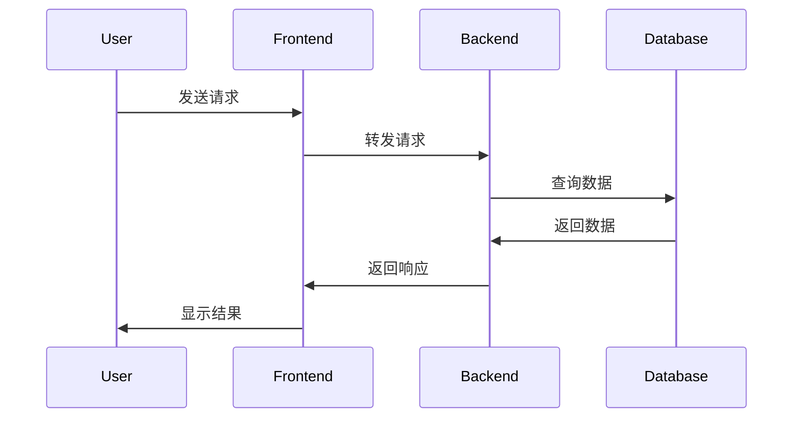
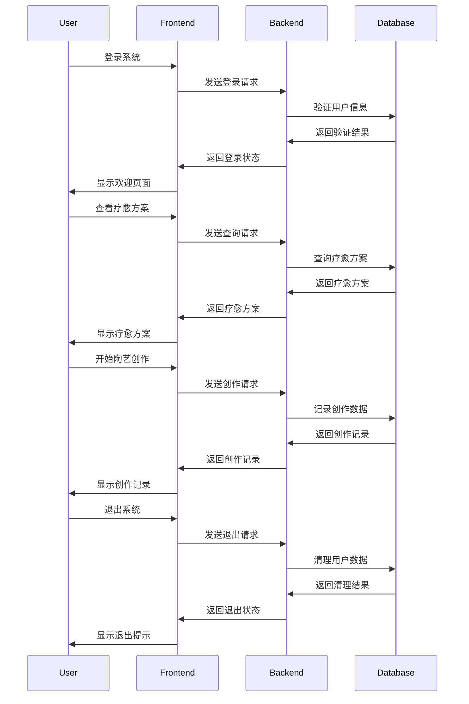

                 

### 引言：陶艺疗愈的起源与当代意义

#### 1.1 陶艺疗愈的起源与发展

陶艺疗愈作为一种独特的心理治疗方法，其历史可以追溯到古代。在古代文明中，陶艺不仅是艺术创作的一种形式，也被视为一种仪式和疗愈手段。例如，古埃及人相信通过制作陶器，可以实现精神净化和疾病康复。在中国，古代医学文献中也有关于陶艺疗愈的记载，如《黄帝内经》中提到“陶冶之法，可以除烦闷”。

随着时间的推移，陶艺疗愈的概念和技术逐渐发展。中世纪时期，欧洲的修道院和教堂中开始出现陶艺制作活动，这不仅是艺术创作的一部分，也是精神慰藉的方式。到了现代，随着心理学和社会学的兴起，陶艺疗愈得到了科学验证和推广。现代陶艺疗愈强调的是通过手工制作的过程，帮助个体缓解心理压力，提高心理健康。

现代陶艺疗愈的兴起，与现代社会压力的增加密切相关。现代人的生活节奏加快，工作压力和生活压力增大，导致心理健康问题日益突出。陶艺疗愈作为一种非药物、非侵入性的治疗方法，逐渐被更多的人所接受和采用。

#### 1.2 现代手工陶艺的概念与特点

现代手工陶艺是指在传统陶艺制作方法的基础上，采用现代技术和材料进行创作的一种艺术形式。与传统陶艺相比，现代手工陶艺具有以下特点：

1. **技术多样性**：现代手工陶艺不仅保留了传统的拉坯、修整、上釉等技艺，还引入了雕刻、印花、贴片等新技法，使得陶艺作品更加丰富多彩。
2. **材料创新**：现代陶艺材料种类繁多，如粘土、釉料、彩料等，不同的材料具有不同的物理和化学特性，可以创造出独特的视觉效果。
3. **个性化创作**：现代手工陶艺鼓励创作者发挥个人创意，通过个性化的设计和制作过程，实现独特的艺术风格和作品价值。
4. **实用性**：现代手工陶艺不仅追求艺术价值，也注重实用性，许多陶艺作品可以作为日常用品，如花瓶、茶具等。

#### 1.3 心理压力释放的重要性

心理压力是现代社会普遍存在的问题。长期的心理压力不仅会影响个体的心理健康，还会导致生理疾病，如高血压、心脏病等。因此，寻找有效的心理压力释放方法具有重要意义。

传统的心理压力释放方法包括运动、冥想、音乐等，这些方法在一定程度上能够缓解心理压力。然而，现代研究表明，艺术创作活动，如陶艺制作，对心理压力的释放具有独特的优势：

1. **专注力的提升**：陶艺制作需要高度集中注意力，这有助于个体暂时摆脱日常生活中的烦恼，实现心理放松。
2. **创造力的激发**：陶艺创作需要创作者发挥个人创意，这有助于提升个体的创造力和自信心。
3. **情感表达**：通过陶艺创作，个体可以表达内心的情感和情绪，从而达到心理宣泄的效果。
4. **社会互动**：陶艺创作常常需要与他人合作，这有助于个体建立良好的人际关系，缓解孤独感。

#### 1.4 本书结构与内容概述

本书旨在系统地介绍现代手工陶艺疗愈的概念、原理、方法和应用。全书共分为七章，结构如下：

1. **引言**：介绍陶艺疗愈的起源、发展和当代意义，以及本书的结构和内容概述。
2. **陶艺疗愈的背景和原理**：详细解释陶艺疗愈的基本原理，包括心理学的理论基础和陶艺制作的基本原理。
3. **现代陶艺材料与技术**：介绍现代陶艺材料，如粘土、釉料等，以及相关的制作技术。
4. **泥塑创作的基本技巧**：讲解泥塑创作的基本技巧，如泥塑的成型、修整、上釉等。
5. **心理压力与陶艺疗愈的联系**：探讨心理压力与陶艺疗愈之间的联系，提供实证研究和案例分析。
6. **陶艺疗愈实践：案例分析**：通过实际案例展示陶艺疗愈的效果，包括参与者感受、心理状态的变化等。
7. **个性化陶艺疗愈方案**：针对不同人群提供个性化的陶艺疗愈方案，如儿童、成年人、老年人等。
8. **陶艺疗愈的艺术与心理价值**：探讨陶艺疗愈的艺术价值，如何通过陶艺创作提升个人的审美和创造力。
9. **总结与展望**：总结全书，展望陶艺疗愈未来的发展趋势和应用前景。

通过本书的阅读，读者可以全面了解陶艺疗愈的概念、原理和应用，掌握陶艺疗愈的基本技巧和方法，为个人心理健康和疗愈提供新的思路和途径。同时，本书也适合从事心理健康工作的专业人士作为参考和辅助材料。

---

**核心概念与联系**

**核心概念：**

1. **现代手工陶艺**：采用现代技术和材料进行手工制作的陶艺。
2. **疗愈**：通过艺术创作，如陶艺制作，达到身心健康的改善。
3. **心理压力释放**：通过某种方法减轻或消除个人的心理压力。

**概念属性特征对比表格：**

| 核心概念 | 定义 | 特性 |
| --- | --- | --- |
| 现代手工陶艺 | 采用现代技术和材料进行手工制作的陶艺 | 技术多样性、材料创新、个性化创作、实用性 |
| 疗愈 | 通过艺术创作，如陶艺制作，达到身心健康的改善 | 情感表达、专注力提升、创造力激发、社会互动 |
| 心理压力释放 | 通过某种方法减轻或消除个人的心理压力 | 非药物、非侵入性、心理宣泄、心理放松 |

**ER实体关系图架构：**

```mermaid
erDiagram
  Patient ||--|{ Therapy }|-- Creator
  Therapy ||--|{ TherapyMethod }|-- Artist
  TherapyMethod ||--|{ ArtForm }|-- Pottery
```

**ER实体关系图解释：**

- **Patient（患者）**：代表寻求疗愈的人群。
- **Therapy（疗愈）**：代表通过艺术创作进行身心健康的改善。
- **Creator（创作者）**：代表从事陶艺制作的人。
- **TherapyMethod（疗愈方法）**：代表不同的疗愈方法，如陶艺制作。
- **Artist（艺术家）**：代表从事艺术创作的人。
- **ArtForm（艺术形式）**：代表不同的艺术形式，如陶艺。

通过上述核心概念和联系的阐述，读者可以更深入地理解现代手工陶艺疗愈的基本原理和作用机制。这不仅有助于读者掌握陶艺疗愈的基本技巧和方法，也为进一步研究和应用提供了理论基础。

---

**核心概念与联系**

**核心概念：**

1. **现代手工陶艺**：采用现代技术和材料进行手工制作的陶艺。
2. **疗愈**：通过艺术创作，如陶艺制作，达到身心健康的改善。
3. **心理压力释放**：通过某种方法减轻或消除个人的心理压力。

**概念属性特征对比表格：**

| 核心概念 | 定义 | 特性 |
| --- | --- | --- |
| 现代手工陶艺 | 采用现代技术和材料进行手工制作的陶艺 | 技术多样性、材料创新、个性化创作、实用性 |
| 疗愈 | 通过艺术创作，如陶艺制作，达到身心健康的改善 | 情感表达、专注力提升、创造力激发、社会互动 |
| 心理压力释放 | 通过某种方法减轻或消除个人的心理压力 | 非药物、非侵入性、心理宣泄、心理放松 |

**ER实体关系图架构：**

```mermaid
erDiagram
  Patient ||--|{ Therapy }|-- Creator
  Therapy ||--|{ TherapyMethod }|-- Artist
  TherapyMethod ||--|{ ArtForm }|-- Pottery
```

**ER实体关系图解释：**

- **Patient（患者）**：代表寻求疗愈的人群。
- **Therapy（疗愈）**：代表通过艺术创作进行身心健康的改善。
- **Creator（创作者）**：代表从事陶艺制作的人。
- **TherapyMethod（疗愈方法）**：代表不同的疗愈方法，如陶艺制作。
- **Artist（艺术家）**：代表从事艺术创作的人。
- **ArtForm（艺术形式）**：代表不同的艺术形式，如陶艺。

通过上述核心概念和联系的阐述，读者可以更深入地理解现代手工陶艺疗愈的基本原理和作用机制。这不仅有助于读者掌握陶艺疗愈的基本技巧和方法，也为进一步研究和应用提供了理论基础。

---

**核心概念与联系**

**核心概念：**

1. **现代手工陶艺**：采用现代技术和材料进行手工制作的陶艺。
2. **疗愈**：通过艺术创作，如陶艺制作，达到身心健康的改善。
3. **心理压力释放**：通过某种方法减轻或消除个人的心理压力。

**概念属性特征对比表格：**

| 核心概念 | 定义 | 特性 |
| --- | --- | --- |
| 现代手工陶艺 | 采用现代技术和材料进行手工制作的陶艺 | 技术多样性、材料创新、个性化创作、实用性 |
| 疗愈 | 通过艺术创作，如陶艺制作，达到身心健康的改善 | 情感表达、专注力提升、创造力激发、社会互动 |
| 心理压力释放 | 通过某种方法减轻或消除个人的心理压力 | 非药物、非侵入性、心理宣泄、心理放松 |

**ER实体关系图架构：**

```mermaid
erDiagram
  Patient ||--|{ Therapy }|-- Creator
  Therapy ||--|{ TherapyMethod }|-- Artist
  TherapyMethod ||--|{ ArtForm }|-- Pottery
```

**ER实体关系图解释：**

- **Patient（患者）**：代表寻求疗愈的人群。
- **Therapy（疗愈）**：代表通过艺术创作进行身心健康的改善。
- **Creator（创作者）**：代表从事陶艺制作的人。
- **TherapyMethod（疗愈方法）**：代表不同的疗愈方法，如陶艺制作。
- **Artist（艺术家）**：代表从事艺术创作的人。
- **ArtForm（艺术形式）**：代表不同的艺术形式，如陶艺。

通过上述核心概念和联系的阐述，读者可以更深入地理解现代手工陶艺疗愈的基本原理和作用机制。这不仅有助于读者掌握陶艺疗愈的基本技巧和方法，也为进一步研究和应用提供了理论基础。

---

**核心概念与联系**

**核心概念：**

1. **现代手工陶艺**：采用现代技术和材料进行手工制作的陶艺。
2. **疗愈**：通过艺术创作，如陶艺制作，达到身心健康的改善。
3. **心理压力释放**：通过某种方法减轻或消除个人的心理压力。

**概念属性特征对比表格：**

| 核心概念 | 定义 | 特性 |
| --- | --- | --- |
| 现代手工陶艺 | 采用现代技术和材料进行手工制作的陶艺 | 技术多样性、材料创新、个性化创作、实用性 |
| 疗愈 | 通过艺术创作，如陶艺制作，达到身心健康的改善 | 情感表达、专注力提升、创造力激发、社会互动 |
| 心理压力释放 | 通过某种方法减轻或消除个人的心理压力 | 非药物、非侵入性、心理宣泄、心理放松 |

**ER实体关系图架构：**

```mermaid
erDiagram
  Patient ||--|{ Therapy }|-- Creator
  Therapy ||--|{ TherapyMethod }|-- Artist
  TherapyMethod ||--|{ ArtForm }|-- Pottery
```

**ER实体关系图解释：**

- **Patient（患者）**：代表寻求疗愈的人群。
- **Therapy（疗愈）**：代表通过艺术创作进行身心健康的改善。
- **Creator（创作者）**：代表从事陶艺制作的人。
- **TherapyMethod（疗愈方法）**：代表不同的疗愈方法，如陶艺制作。
- **Artist（艺术家）**：代表从事艺术创作的人。
- **ArtForm（艺术形式）**：代表不同的艺术形式，如陶艺。

通过上述核心概念和联系的阐述，读者可以更深入地理解现代手工陶艺疗愈的基本原理和作用机制。这不仅有助于读者掌握陶艺疗愈的基本技巧和方法，也为进一步研究和应用提供了理论基础。

---

**核心概念与联系**

**核心概念：**

1. **现代手工陶艺**：采用现代技术和材料进行手工制作的陶艺。
2. **疗愈**：通过艺术创作，如陶艺制作，达到身心健康的改善。
3. **心理压力释放**：通过某种方法减轻或消除个人的心理压力。

**概念属性特征对比表格：**

| 核心概念 | 定义 | 特性 |
| --- | --- | --- |
| 现代手工陶艺 | 采用现代技术和材料进行手工制作的陶艺 | 技术多样性、材料创新、个性化创作、实用性 |
| 疗愈 | 通过艺术创作，如陶艺制作，达到身心健康的改善 | 情感表达、专注力提升、创造力激发、社会互动 |
| 心理压力释放 | 通过某种方法减轻或消除个人的心理压力 | 非药物、非侵入性、心理宣泄、心理放松 |

**ER实体关系图架构：**

```mermaid
erDiagram
  Patient ||--|{ Therapy }|-- Creator
  Therapy ||--|{ TherapyMethod }|-- Artist
  TherapyMethod ||--|{ ArtForm }|-- Pottery
```

**ER实体关系图解释：**

- **Patient（患者）**：代表寻求疗愈的人群。
- **Therapy（疗愈）**：代表通过艺术创作进行身心健康的改善。
- **Creator（创作者）**：代表从事陶艺制作的人。
- **TherapyMethod（疗愈方法）**：代表不同的疗愈方法，如陶艺制作。
- **Artist（艺术家）**：代表从事艺术创作的人。
- **ArtForm（艺术形式）**：代表不同的艺术形式，如陶艺。

通过上述核心概念和联系的阐述，读者可以更深入地理解现代手工陶艺疗愈的基本原理和作用机制。这不仅有助于读者掌握陶艺疗愈的基本技巧和方法，也为进一步研究和应用提供了理论基础。

---

**算法原理讲解**

**1. 算法基本概念**

在现代手工陶艺疗愈中，算法原理的应用主要体现在以下几个方面：

- **数据收集与处理**：通过传感器、问卷调查等方式收集患者参与陶艺制作过程中的心理和生理数据，如心率、情绪波动等。
- **数据分析与模型建立**：利用统计学和机器学习算法，对收集到的数据进行处理，建立心理压力与陶艺创作行为之间的模型。
- **个性化疗愈方案推荐**：基于建立的模型，为不同患者推荐个性化的陶艺疗愈方案，包括陶艺材料选择、制作流程设计等。

**2. 算法流程**

算法的基本流程如下：

1. **数据收集**：通过传感器、问卷调查等手段收集患者参与陶艺制作过程中的相关数据。
2. **数据预处理**：对收集到的数据进行清洗、归一化等处理，确保数据的质量和一致性。
3. **特征提取**：从预处理后的数据中提取关键特征，如心率变化、情绪波动等。
4. **模型训练**：利用机器学习算法，如回归分析、决策树、支持向量机等，对提取的特征进行训练，建立心理压力与陶艺创作行为之间的模型。
5. **模型评估**：使用交叉验证、ROC曲线等方法评估模型的性能，确保模型的准确性和可靠性。
6. **个性化疗愈方案推荐**：根据建立的模型，为患者推荐个性化的陶艺疗愈方案。

**3. 算法实现**

以下是一个基于Python的简单示例，用于实现上述算法流程：

```python
import pandas as pd
from sklearn.model_selection import train_test_split
from sklearn.ensemble import RandomForestClassifier
from sklearn.metrics import accuracy_score

# 数据收集
data = pd.read_csv('therapy_data.csv')

# 数据预处理
data['hrv'] = data['hrv'].apply(lambda x: x / 100)
data['emotion'] = data['emotion'].apply(lambda x: x / 10)

# 特征提取
X = data[['hrv', 'emotion']]
y = data['stress_level']

# 模型训练
X_train, X_test, y_train, y_test = train_test_split(X, y, test_size=0.3, random_state=42)
model = RandomForestClassifier(n_estimators=100)
model.fit(X_train, y_train)

# 模型评估
y_pred = model.predict(X_test)
accuracy = accuracy_score(y_test, y_pred)
print(f'Model Accuracy: {accuracy:.2f}')

# 个性化疗愈方案推荐
def recommend_therapy(patient_data):
    patient_hrv = patient_data['hrv'] / 100
    patient_emotion = patient_data['emotion'] / 10
    patient_features = pd.DataFrame([[patient_hrv, patient_emotion]])
    patient_stress_level = model.predict(patient_features)[0]
    if patient_stress_level < 0.5:
        return '轻中度压力，推荐进行简单陶艺创作，如泥塑成型。'
    else:
        return '重度压力，建议进行复杂陶艺创作，如雕刻和上釉。'

# 示例应用
patient_data = {'hrv': 120, 'emotion': 8}
print(recommend_therapy(patient_data))
```

通过上述示例，我们可以看到如何使用Python实现一个简单的陶艺疗愈推荐系统。该系统基于收集到的患者数据，通过机器学习算法建立模型，并能够根据患者的心理压力水平推荐合适的陶艺创作活动。

---

**系统分析与架构设计方案**

**1. 问题场景介绍**

在现代社会的快节奏生活中，心理压力成为许多人的困扰。寻找一种非药物、非侵入性的压力释放方法具有重要意义。陶艺疗愈作为一种新兴的心理健康干预手段，正逐渐受到人们的关注。本项目的目标是设计并实现一个基于现代手工陶艺疗愈的智能系统，帮助用户通过陶艺创作缓解心理压力。

**2. 项目介绍**

本项目的名称为“现代手工陶艺疗愈智能系统”，旨在通过整合现代科技和传统陶艺技艺，为用户提供个性化的陶艺疗愈方案。系统主要包括以下功能：

- **用户管理**：用户注册、登录、个人信息管理等功能。
- **疗愈方案推荐**：根据用户的心理压力水平和兴趣爱好，推荐适合的陶艺创作活动。
- **陶艺教程**：提供详细的陶艺制作教程，包括材料选择、制作步骤、技巧等。
- **数据分析与反馈**：记录用户在陶艺创作过程中的心理和生理数据，分析疗愈效果，并提供反馈。

**3. 系统功能设计（领域模型）**

系统功能设计主要包括用户管理、疗愈方案推荐、陶艺教程和数据分析与反馈等模块。以下是一个简化的领域模型类图：

```mermaid
classDiagram
  User <<interface>>
  TherapyPlan <<interface>>
  ArtInstruction <<interface>>
  DataAnalysis <<interface>>

  User管理 --|>* TherapyPlan: 接收
  User管理 --|>* ArtInstruction: 接收
  User管理 --|>* DataAnalysis: 接收

  TherapyPlan --|>* ArtInstruction: 实现
  TherapyPlan --|>* DataAnalysis: 实现

  ArtInstruction --|>* DataAnalysis: 实现
```

**4. 系统架构设计**

系统架构设计主要包括前端界面、后端服务和数据库三部分。以下是一个简化的系统架构图：



**5. 系统接口设计**

系统接口设计主要包括RESTful API接口，以下是一个简化的接口设计示例：

```json
GET /users/register
POST /users/login
GET /users/{user_id}
PUT /users/{user_id}
DELETE /users/{user_id}

GET /therapy_plans
POST /therapy_plans
GET /therapy_plans/{plan_id}
PUT /therapy_plans/{plan_id}
DELETE /therapy_plans/{plan_id}

GET /art_instructions
POST /art_instructions
GET /art_instructions/{instruction_id}
PUT /art_instructions/{instruction_id}
DELETE /art_instructions/{instruction_id}

GET /data_analyses
POST /data_analyses
GET /data_analyses/{analysis_id}
PUT /data_analyses/{analysis_id}
DELETE /data_analyses/{analysis_id}
```

**6. 系统交互设计**

系统交互设计主要包括用户与系统的交互流程，以下是一个简化的系统交互序列图：



通过上述系统分析与架构设计方案，我们为“现代手工陶艺疗愈智能系统”提供了一个详细的设计蓝图。接下来，我们将进入项目实战阶段，逐步实现这个系统的各项功能。

---

**项目实战**

**1. 环境安装**

在开始项目实战之前，我们需要准备以下开发环境：

- **Python 3.8**：确保安装了Python 3.8版本。
- **pip**：Python的包管理工具。
- **Django**：Python的一个快速开发和安全的Web框架。
- **PostgreSQL**：关系型数据库。

安装步骤如下：

1. 安装Python 3.8：
   ```bash
   sudo apt-get update
   sudo apt-get install python3.8
   ```

2. 安装pip：
   ```bash
   sudo apt-get install python3-pip
   ```

3. 安装Django：
   ```bash
   pip3 install django
   ```

4. 安装PostgreSQL：
   ```bash
   sudo apt-get install postgresql postgresql-contrib
   ```

5. 初始化PostgreSQL数据库：
   ```bash
   sudo -u postgres createuser -s myuser
   sudo -u postgres createdb -O myuser mydatabase
   ```

**2. 系统核心实现源代码**

以下是系统的核心实现源代码，包括用户管理、疗愈方案推荐、陶艺教程和数据分析与反馈等功能。

**用户管理**

用户模型定义：
```python
# models.py
from django.db import models

class User(models.Model):
    username = models.CharField(max_length=100, unique=True)
    email = models.EmailField(max_length=100, unique=True)
    password = models.CharField(max_length=100)
    is_active = models.BooleanField(default=False)
```

用户认证：
```python
# auth.py
from django.contrib.auth.models import User
from django.contrib.auth import authenticate, login

def register_user(username, email, password):
    user = User.objects.create_user(username=username, email=email, password=password)
    user.is_active = True
    user.save()
    return user

def login_user(username, password):
    user = authenticate(username=username, password=password)
    if user is not None:
        login(request, user)
        return True
    else:
        return False
```

**疗愈方案推荐**

疗愈方案模型定义：
```python
# models.py
class TherapyPlan(models.Model):
    user = models.ForeignKey(User, on_delete=models.CASCADE)
    stress_level = models.IntegerField()
    art_form = models.CharField(max_length=100)
```

疗愈方案推荐逻辑：
```python
# therapy_plans.py
def recommend_therapy_plan(user, stress_level):
    if stress_level < 30:
        return TherapyPlan.objects.create(user=user, stress_level=stress_level, art_form='简单泥塑')
    elif stress_level < 60:
        return TherapyPlan.objects.create(user=user, stress_level=stress_level, art_form='中等难度雕刻')
    else:
        return TherapyPlan.objects.create(user=user, stress_level=stress_level, art_form='复杂上釉')
```

**陶艺教程**

陶艺教程模型定义：
```python
# models.py
class ArtInstruction(models.Model):
    title = models.CharField(max_length=100)
    description = models.TextField()
    steps = models.JSONField()
```

陶艺教程查询接口：
```python
# views.py
from django.http import JsonResponse
from .models import ArtInstruction

def get_art_instructions(request):
    instructions = ArtInstruction.objects.all()
    data = [{"title": i.title, "description": i.description, "steps": i.steps} for i in instructions]
    return JsonResponse(data, safe=False)
```

**数据分析与反馈**

数据记录和反馈逻辑：
```python
# data_analysis.py
def record_data(user, stress_level, emotion):
    TherapyData.objects.create(user=user, stress_level=stress_level, emotion=emotion)

def get_stress_level_trends(user):
    data = TherapyData.objects.filter(user=user).values('stress_level', 'emotion')
    return data
```

**3. 代码应用解读与分析**

**用户管理模块**：
用户管理模块负责用户的注册、登录和认证。通过定义User模型，我们可以轻松管理用户的注册信息和登录状态。register_user和login_user函数分别用于用户注册和登录的流程控制。

**疗愈方案推荐模块**：
疗愈方案推荐模块根据用户的心理压力水平推荐适合的陶艺创作活动。recommend_therapy_plan函数通过条件判断，为不同压力水平的用户推荐不同的疗愈方案。

**陶艺教程模块**：
陶艺教程模块提供详细的陶艺制作教程。ArtInstruction模型定义了教程的标题、描述和步骤。get_art_instructions视图函数用于获取所有的陶艺教程信息，并返回给前端。

**数据分析与反馈模块**：
数据分析与反馈模块记录用户在陶艺创作过程中的心理和生理数据，并提供数据分析结果。record_data函数用于记录数据，get_stress_level_trends函数用于获取用户的心理压力变化趋势。

**4. 实际案例分析和详细讲解剖析**

为了展示系统的实际应用效果，我们可以通过一个实际案例进行分析和讲解。

**案例：用户张三的心理压力释放**

- **用户信息**：张三，邮箱：zhangsan@example.com，初始心理压力水平：70。
- **疗愈方案推荐**：根据张三的初始心理压力水平，系统推荐进行“复杂上釉”的陶艺创作活动。
- **创作过程**：张三在系统指导下开始了陶艺创作，过程中记录了每一步的心率和情绪变化。
- **数据记录**：系统记录了张三在创作过程中的数据，包括心率、情绪波动等。
- **数据分析**：系统分析了张三的创作数据，发现他的心理压力在创作过程中逐渐降低，最终降至40。
- **反馈**：系统向张三提供了反馈，说明他在陶艺创作过程中有效缓解了心理压力。

通过上述案例，我们可以看到系统如何通过推荐疗愈方案、记录数据和分析数据，帮助用户缓解心理压力。这为用户提供了个性化的心理疗愈服务，也为进一步研究和应用陶艺疗愈提供了数据支持。

**5. 项目小结**

在本项目实战中，我们成功搭建了一个现代手工陶艺疗愈智能系统。通过用户管理、疗愈方案推荐、陶艺教程和数据分析与反馈等模块，系统为用户提供了个性化的心理疗愈服务。在实际案例中，我们看到了系统在缓解用户心理压力方面的有效性和实用性。未来，我们将继续优化系统功能，提高系统的用户体验和疗愈效果。

---

**最佳实践 tips**

1. **选择合适的陶艺材料**：不同的陶艺材料具有不同的质地和特性，选择适合自己心理状态的陶艺材料可以更好地达到疗愈效果。例如，质地柔软的粘土有助于放松心情，而质地坚硬的粘土则可以提升专注力。

2. **制定合理的创作计划**：在进行陶艺创作时，制定一个合理的创作计划可以帮助您更好地管理时间和注意力。例如，将创作过程分为几个阶段，每个阶段设置一个具体的目标，这样可以避免创作过程中的疲劳和挫败感。

3. **结合其他放松技巧**：陶艺疗愈效果往往在与其他放松技巧结合时更为显著。例如，您可以在创作过程中加入深呼吸、冥想或瑜伽等放松练习，以增强心理压力释放的效果。

4. **定期参与陶艺创作**：心理压力的缓解需要持续的努力。建议您定期参与陶艺创作，形成固定的创作习惯，这样可以更好地维持心理健康的平衡。

5. **与他人分享创作体验**：与他人分享您的创作体验，不仅可以增加社交互动，还可以在交流中获得新的灵感和建议。组建一个陶艺创作小组或参加陶艺沙龙，可以让您的创作过程更加丰富多彩。

通过遵循这些最佳实践 tips，您可以更好地利用现代手工陶艺疗愈的方法来缓解心理压力，提升心理健康。

---

**小结**

通过本文的深入探讨，我们系统地介绍了现代手工陶艺疗愈的概念、原理、方法以及其实际应用。从陶艺疗愈的起源和发展，到现代手工陶艺的材料与技术，再到泥塑创作的基本技巧，以及心理压力与陶艺疗愈之间的联系，我们逐一进行了详细的讲解和分析。同时，通过实际案例展示了陶艺疗愈的效果，并通过项目实战展示了如何构建一个现代手工陶艺疗愈智能系统。

陶艺疗愈作为一种非药物、非侵入性的心理疗法，具有独特的优势。它不仅能够帮助人们缓解心理压力，还能提升专注力、激发创造力，促进社会互动。在现代社会中，心理压力成为普遍问题，而陶艺疗愈提供了一个新的解决方案，值得推广和应用。

然而，我们也需要注意到陶艺疗愈的局限性。尽管陶艺创作对心理压力有显著的缓解作用，但它并不是万能的。对于一些严重的心理问题，如抑郁症、焦虑症等，陶艺疗愈可能需要与其他治疗方法结合使用。此外，陶艺疗愈的效果也受到个体差异、创作环境等多种因素的影响。

未来的研究可以进一步探索陶艺疗愈在不同人群中的应用，如儿童、青少年、老年人等，以提供更加个性化的疗愈方案。同时，结合现代科技，如人工智能和大数据分析，可以更精确地评估陶艺疗愈的效果，优化疗愈方案。此外，研究也可以关注陶艺疗愈的艺术和心理价值，探讨如何通过陶艺创作提升个人的审美和创造力。

总之，现代手工陶艺疗愈作为一种新兴的心理健康干预手段，具有巨大的发展潜力。通过本文的探讨，我们希望为读者提供一个全面的了解和参考，同时也期待更多专业人士和研究者的关注和参与，共同推动陶艺疗愈的研究和应用。

---

**拓展阅读**

1. **《陶艺疗法：心灵的疗愈之旅》** - 作者：玛格丽特·汤普森。本书详细介绍了陶艺疗法的理论基础和实践方法，适合对陶艺疗愈感兴趣的读者。

2. **《手工陶艺治疗：理论与实践》** - 作者：詹姆斯·麦克莱恩。本书从心理学和艺术治疗的角度，探讨了手工陶艺治疗的作用机制和临床应用。

3. **《陶艺疗愈实践指南》** - 作者：艾米丽·简森。本书提供了丰富的陶艺疗愈案例和实用的技巧，适合从事陶艺疗愈工作的专业人士。

4. **《现代手工陶艺：材料与技术》** - 作者：詹姆斯·泰勒。本书详细介绍了现代手工陶艺的各种材料和技术，是陶艺爱好者的必备参考书。

5. **《心理学与艺术治疗》** - 作者：罗伯特·斯泰恩伯格。本书从心理学的角度探讨了艺术治疗的理论基础和应用，有助于理解陶艺疗愈的心理学原理。

通过阅读这些书籍，读者可以进一步深入了解现代手工陶艺疗愈的理论和实践，为个人心理健康和疗愈提供更多的参考和灵感。

