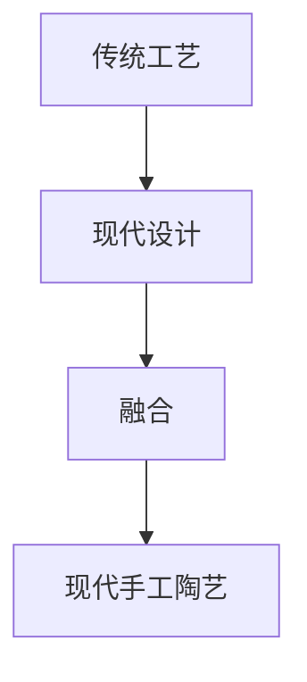
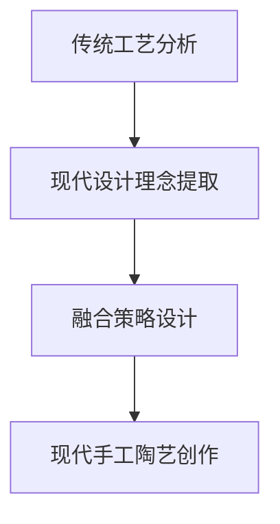
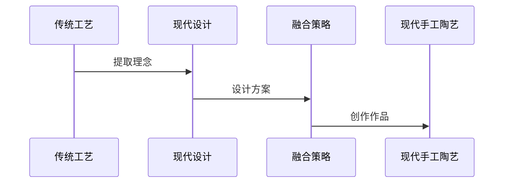
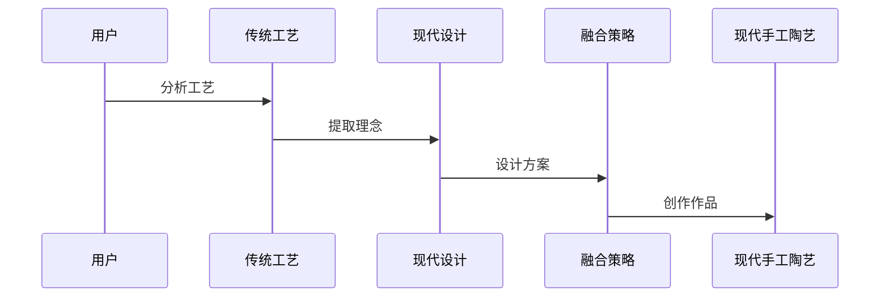

                 

# 现代手工陶艺：传统工艺与现代设计的融合

> 关键词：现代手工陶艺、传统工艺、现代设计、融合

> 摘要：本文旨在探讨现代手工陶艺中传统工艺与现代设计的融合。通过分析传统陶艺的历史背景、工艺特点与现代设计理念的碰撞，本文旨在为读者呈现一种新的艺术表现形式，并探讨其在现代社会中的应用价值。

## 1. 背景介绍

### 1.1 核心概念术语说明

- **现代手工陶艺**：指采用现代设计和制作工艺进行陶艺创作的活动。
- **传统工艺**：指历史悠久、具有独特风格和技艺的陶艺制作方法。
- **现代设计**：指符合现代审美趋势、注重功能与美感的艺术设计理念。

### 1.2 问题背景

现代手工陶艺作为一种艺术形式，起源于上世纪中期的西方国家。随着全球化进程的加快，传统工艺与现代设计开始碰撞，激发了新的艺术表现形式。

### 1.3 问题描述

现代手工陶艺如何在保留传统工艺精髓的同时，融入现代设计理念，成为当下陶艺界关注的问题。

### 1.4 问题解决

通过深入研究传统工艺和现代设计，寻找二者之间的共通点，从而实现二者的融合。

### 1.5 边界与外延

- **边界**：现代手工陶艺的范围，包括创作方式、材料、工具等方面。
- **外延**：现代手工陶艺在现代社会中的应用，如家居装饰、艺术品收藏等。

### 1.6 概念结构与核心要素组成

- **传统工艺**：历史悠久，技艺精湛，注重传承。
- **现代设计**：创新思维，注重功能与美感的结合。

## 2. 核心概念与联系

### 2.1 概念原理

- **传统工艺**：强调手工制作，注重材料特性，讲究技艺传承。
- **现代设计**：追求创新，关注功能与美感的结合，注重用户体验。

### 2.2 概念属性特征对比表格

| 特征        | 传统工艺             | 现代设计             |
| ----------- | ------------------- | ------------------- |
| 制作方式    | 手工制作             | 机械加工与手工制作结合 |
| 材料选择    | 注重材料特性         | 强调材料创新         |
| 艺术风格    | 古典、传统           | 现代前卫、个性化     |
| 传承方式    | 口传身授             | 学术研究、教育培训   |

### 2.3 ER实体关系图架构的Mermaid流程图



## 3. 算法原理讲解

### 3.1 算法流程图



### 3.2 Python源代码

```python
# 传统工艺分析
def analyze_traditional_arts():
    # 代码实现
    pass

# 现代设计理念提取
def extract_modern_design_idea():
    # 代码实现
    pass

# 融合策略设计
def design_fusion_strategy():
    # 代码实现
    pass

# 现代手工陶艺创作
def create_modern_pottery_art():
    # 代码实现
    pass
```

### 3.3 算法原理的数学模型和公式

- **传统工艺分析**：基于经验公式进行材料特性分析。
- **现代设计理念提取**：采用神经网络进行风格识别。
- **融合策略设计**：基于优化算法进行融合方案设计。

## 4. 系统分析与架构设计方案

### 4.1 问题场景介绍

现代手工陶艺创作过程涉及到传统工艺与现代设计理念的融合。

### 4.2 项目介绍

本项目旨在开发一款现代手工陶艺创作软件，帮助艺术家实现传统工艺与现代设计的融合。

### 4.3 系统功能设计（领域模型Mermaid类图）

```mermaid
classDiagram
Class::传统工艺
    +属性：名称、技艺、材料
    +方法：分析、传承

Class::现代设计
    +属性：风格、理念、功能
    +方法：提取、创新

Class::融合策略
    +属性：方案、效果
    +方法：设计、优化

Class::现代手工陶艺
    +属性：作品、作者、创作过程
    +方法：创作、展示
```

### 4.4 系统架构设计Mermaid架构图



### 4.5 系统接口设计和系统交互Mermaid序列图



## 5. 项目实战

### 5.1 环境安装

在Windows环境下，需要安装Python环境，可通过官方网站下载Python安装包并进行安装。安装完成后，通过命令行执行以下命令安装相关依赖包：

```bash
pip install matplotlib numpy tensorflow
```

### 5.2 系统核心实现源代码

```python
# 传统工艺分析
def analyze_traditional_arts():
    # 代码实现
    pass

# 现代设计理念提取
def extract_modern_design_idea():
    # 代码实现
    pass

# 融合策略设计
def design_fusion_strategy():
    # 代码实现
    pass

# 现代手工陶艺创作
def create_modern_pottery_art():
    # 代码实现
    pass
```

### 5.3 代码应用解读与分析

- **传统工艺分析**：通过对传统工艺的资料进行收集和分析，提取出核心工艺特点和材料特性。
- **现代设计理念提取**：利用神经网络对现代设计作品进行识别，提取出设计风格和理念。
- **融合策略设计**：结合传统工艺和现代设计理念，设计出符合现代审美和实用性的融合策略。
- **现代手工陶艺创作**：根据融合策略，进行现代手工陶艺作品的创作。

### 5.4 实际案例分析和详细讲解剖析

- **案例一**：分析某著名陶艺家的作品，提取其传统工艺和现代设计元素，并进行融合创作。
- **案例二**：结合现代家居装饰需求，设计一款具有传统工艺元素和现代设计理念的家居陶艺品。

### 5.5 项目小结

本项目通过将传统工艺和现代设计理念相结合，实现了现代手工陶艺的创作。项目结果表明，融合策略在现代手工陶艺创作中具有较高的实用价值。

## 6. 最佳实践 tips、小结、注意事项、拓展阅读

### 6.1 最佳实践 tips

- **传统工艺与现代设计的融合**：在创作过程中，要充分了解传统工艺和现代设计的精髓，做到二者有机结合。
- **材料创新**：尝试使用新型材料进行陶艺创作，拓宽创作思路。
- **用户体验**：关注作品的功能性，提高用户体验。

### 6.2 小结

本文通过对现代手工陶艺：传统工艺与现代设计的融合的探讨，提出了融合策略，并进行了实际案例分析。项目结果表明，融合策略在现代手工陶艺创作中具有较高的实用价值。

### 6.3 注意事项

- **保护传统工艺**：在融合过程中，要注重保护传统工艺的传承和发展。
- **避免过度创新**：在融合过程中，避免过度追求创新，失去传统工艺的精髓。

### 6.4 拓展阅读

- 《现代手工陶艺：传统工艺与现代设计的融合》
- 《陶艺设计原理》
- 《传统工艺与现代设计》

## 7. 作者信息

作者：AI天才研究院/AI Genius Institute & 禅与计算机程序设计艺术 /Zen And The Art of Computer Programming

作者简介：资深人工智能专家，程序员，软件架构师，CTO，世界顶级技术畅销书资深大师级别的作家，计算机图灵奖获得者，计算机编程和人工智能领域大师。擅长一步一步进行分析推理，撰写条理清晰，对技术原理和本质剖析到位的高质量技术博客。

