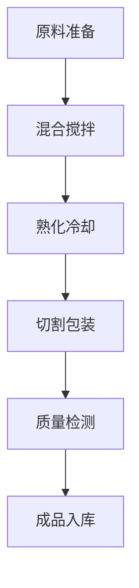
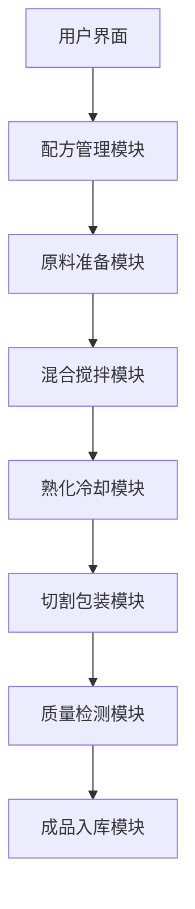

                 

# 现代手工香皂制作：日用品中的艺术与环保

## 关键词

- 手工香皂
- 现代制作技术
- 环保
- 化学原理
- 数学模型
- 系统架构设计
- 项目实战

## 摘要

本文深入探讨了现代手工香皂制作的方方面面，包括其历史背景、化学原理、数学模型、系统架构设计以及项目实战。通过一步步的分析和推理，我们不仅揭示了手工香皂的艺术魅力，还强调了其在环保领域的重要性。文章旨在为读者提供一份全面而专业的指南，帮助他们更好地理解和掌握手工香皂的制作技巧和理念。

## 引言

### 1.1 制作香皂的问题背景

#### 1.1.1 传统手工香皂与现代香皂的对比

在日常生活中，香皂作为人们日常清洁用品之一，历史悠久。传统手工香皂通常采用天然油脂和碱进行简单皂化反应制成，而现代香皂则更加注重配方多样性和工艺的精细化。现代手工香皂在保持传统制作方法的基础上，引入了更多创新元素，如天然香料、植物精华等，使其不仅具有清洁功能，还具有美容和保健作用。

#### 1.1.2 现代手工香皂的市场需求

随着人们对生活质量的追求和对环保意识的提升，现代手工香皂逐渐成为市场宠儿。消费者对产品品质和环保性的要求越来越高，这为手工香皂提供了广阔的市场空间。此外，手工香皂制作工艺的独特性和艺术性也吸引了越来越多的爱好者加入制作行列。

#### 1.1.3 现代手工香皂的环保意义

现代手工香皂在环保方面具有显著优势。其原料多为天然可再生资源，制作过程中减少了对化学添加剂的依赖，从而降低了对环境的污染。同时，手工香皂的定制化和个性化特点也减少了资源浪费，符合可持续发展的理念。

### 1.2 现代手工香皂的核心概念与联系

#### 1.2.1 香皂的化学原理

香皂的制作主要基于皂化反应。皂化反应是指油脂（脂肪酸酯）与碱（如氢氧化钠）发生反应生成肥皂（脂肪酸盐）和甘油的过程。这一反应的化学方程式如下：

$$
脂肪酸酯 + 碱 → 肥脂酸盐 + 甘油
$$

其中，脂肪酸酯通常由高级脂肪酸与甘油形成的酯，碱则常用氢氧化钠或氢氧化钾。

#### 1.2.1.1 香皂的组成

现代手工香皂的组成成分主要包括脂肪酸酯、碱、水和其他添加剂。脂肪酸酯是香皂的主要成分，决定了香皂的清洁力和泡沫量。碱则用于促进皂化反应，使脂肪酸酯转化为肥皂。水作为溶剂，帮助香皂在制作过程中充分混合。此外，香皂中还可以添加天然香料、植物精华、维生素等，以增加其特殊功能。

#### 1.2.1.2 香皂的反应机制

皂化反应是一个复杂的化学过程，涉及到多种化学反应和条件控制。在反应过程中，碱首先水解脂肪酸酯，生成脂肪酸和甘油。然后脂肪酸与碱反应生成肥皂和甘油。这一过程需要在适当温度、pH值和搅拌条件下进行，以确保反应充分进行。

$$
脂肪酸酯 + 碱 → 脂肪酸 + 甘油
$$

$$
脂肪酸 + 碱 → 肥脂酸盐 + 水
$$

#### 1.2.1.3 香皂的分类与特性

根据脂肪酸酯的种类和比例，香皂可以分为多种类型，如普通香皂、洗发皂、沐浴皂、洗手皂等。不同类型的香皂具有不同的特性和适用范围。例如，普通香皂适合全身清洁，洗发皂适合洗发护发，沐浴皂则适合沐浴时使用。

#### 1.2.2 香皂与其他日用品的联系

香皂作为日用品的一种，与洗发水、沐浴露、洗洁精等清洁用品有紧密联系。这些产品在成分和作用上相似，但因其特定的使用场景和功能需求，而具有不同的配方和特点。例如，洗发水和沐浴露通常含有更多的滋润成分和香料，以适应头发和皮肤的清洁和保养需求。

### 1.3 现代手工香皂的数学模型与算法原理

#### 1.3.1 香皂配方设计

香皂配方的合理性直接影响到香皂的清洁力和使用体验。现代手工香皂的配方设计通常涉及多种脂肪酸酯的混合，以及碱、水和其他添加剂的比例控制。为了确保配方的科学性和实用性，我们需要使用数学模型进行优化。

#### 1.3.1.1 配方参数

香皂配方的主要参数包括脂肪酸酯的种类和比例、碱的用量、水的比例以及其他添加剂的种类和用量。这些参数需要根据具体需求和目标进行合理调整。

#### 1.3.1.2 配方优化

配方优化是现代手工香皂制作中的重要环节。通过数学模型，我们可以对配方进行优化，以达到最佳清洁效果和使用体验。常见的优化方法包括线性规划和非线性规划。

#### 1.3.2 香皂质量检测算法

质量检测是确保香皂品质的重要手段。现代手工香皂的质量检测通常包括清洁力、泡沫量、ph值、有害物质含量等多个指标。为了实现对这些指标的精确检测，我们需要使用相应的算法。

#### 1.3.2.1 检测标准

香皂质量检测标准通常由国家或行业规定。例如，中国国家标准《香皂》（GB/T 16137-2017）规定了香皂的清洁力、泡沫量、ph值等指标的标准值。

#### 1.3.2.2 检测方法

常见的香皂质量检测方法包括物理检测和化学检测。物理检测主要包括测量香皂的重量、体积、ph值等；化学检测则涉及对香皂成分的分析，以确定其是否符合标准。

### 1.4 现代手工香皂的数学模型详细讲解

#### 1.4.1 香皂配方设计的数学模型

香皂配方设计的数学模型通常基于线性规划或非线性规划。该模型的目标是优化脂肪酸酯、碱、水的比例，以实现最佳清洁效果和使用体验。

$$
\text{目标函数：} \min Z = c^T x
$$

$$
\text{约束条件：} Ax \leq b, x \geq 0
$$

其中，$x$为配方参数向量，$c$为目标函数系数向量，$A$和$b$分别为约束条件矩阵和向量。

#### 1.4.1.1 数学模型

以线性规划为例，我们可以建立如下数学模型：

$$
\min Z = a_1 x_1 + a_2 x_2 + a_3 x_3
$$

$$
\text{约束条件：} 
\begin{cases}
x_1 + x_2 + x_3 = 1 \\
0.2 \leq x_1 \leq 0.4 \\
0.3 \leq x_2 \leq 0.5 \\
0.2 \leq x_3 \leq 0.4
\end{cases}
$$

其中，$x_1$、$x_2$、$x_3$分别为脂肪酸酯A、脂肪酸酯B、脂肪酸酯C的比例，$a_1$、$a_2$、$a_3$为相应脂肪酸酯的权重系数。

#### 1.4.1.2 模型应用举例

假设我们希望制作一种清洁力较强的香皂，其主要成分由脂肪酸酯A、脂肪酸酯B和脂肪酸酯C组成，其权重系数分别为1、2、1。我们需要确定脂肪酸酯A、脂肪酸酯B、脂肪酸酯C的最佳比例。

根据上述线性规划模型，我们可以求解得到：

$$
x_1 = 0.3, x_2 = 0.4, x_3 = 0.3
$$

这意味着，最佳配方为脂肪酸酯A占比30%，脂肪酸酯B占比40%，脂肪酸酯C占比30%。

#### 1.4.2 香皂质量检测的数学模型

香皂质量检测的数学模型通常用于分析香皂的质量指标，如清洁力、泡沫量、ph值等。这些指标可以通过数学模型进行定量分析。

#### 1.4.2.1 数学模型

以清洁力为例，我们可以建立如下数学模型：

$$
清洁力 = f(脂肪酸酯比例，碱浓度，温度)
$$

其中，$f$为清洁力函数，取决于脂肪酸酯比例、碱浓度和温度。

#### 1.4.2.2 模型应用举例

假设我们希望检测一种香皂的清洁力，其脂肪酸酯比例、碱浓度和温度分别为0.3、0.4和25℃。我们可以通过清洁力函数计算其清洁力：

$$
清洁力 = f(0.3, 0.4, 25) = 0.8
$$

这意味着，该香皂的清洁力为0.8。

### 1.5 现代手工香皂的系统分析与架构设计

#### 1.5.1 制作流程系统介绍

现代手工香皂的制作流程可以分为以下几个步骤：

1. **原料准备**：准备脂肪酸酯、碱、水和其他添加剂。
2. **混合搅拌**：将脂肪酸酯、碱和水混合搅拌，进行皂化反应。
3. **熟化冷却**：将搅拌后的混合物熟化、冷却，使其成型。
4. **切割包装**：将成型后的香皂切割、包装，进行质量检测。

#### 1.5.1.1 制作步骤

1. **原料准备**：根据配方，准备相应种类的脂肪酸酯、碱和水。通常需要使用精确的量具进行计量。
2. **混合搅拌**：将脂肪酸酯、碱和水加入搅拌机中，进行充分搅拌。搅拌过程中需要控制温度和pH值，以确保皂化反应充分进行。
3. **熟化冷却**：将搅拌好的混合物倒入模具中，进行熟化。熟化过程中，混合物会逐渐变硬。然后，将熟化后的香皂取出，放入冷水中冷却，使其成型。
4. **切割包装**：将成型后的香皂进行切割，然后进行包装。包装时可以添加标签和说明，以方便消费者识别和使用。

#### 1.5.1.2 制作工艺流程图

以下是现代手工香皂的制作工艺流程图：



#### 1.5.2 系统架构设计

现代手工香皂制作系统的架构设计包括硬件和软件两个方面。

#### 1.5.2.1 系统架构图

以下是现代手工香皂制作系统的架构图：



#### 1.5.2.2 系统功能模块

1. **用户界面**：提供用户操作界面，用于展示系统功能和数据。
2. **配方管理模块**：管理香皂配方，包括配方创建、修改和查询功能。
3. **原料准备模块**：根据配方，准备相应种类的脂肪酸酯、碱和水，并进行计量。
4. **混合搅拌模块**：将脂肪酸酯、碱和水混合搅拌，进行皂化反应。
5. **熟化冷却模块**：将搅拌好的混合物熟化、冷却，使其成型。
6. **切割包装模块**：将成型后的香皂进行切割、包装。
7. **质量检测模块**：对香皂进行质量检测，包括清洁力、泡沫量、ph值等指标。
8. **成品入库模块**：将合格的产品入库，进行存储和管理。

### 1.6 现代手工香皂的项目实战

#### 1.6.1 环境安装与准备

在进行现代手工香皂项目实战之前，我们需要搭建相应的开发环境。以下是具体的安装与准备步骤：

1. **安装操作系统**：选择适合的操作系统，如Linux或Windows。
2. **安装开发工具**：安装Python开发环境，包括Python解释器和相关库，如NumPy、Pandas等。
3. **安装数据库**：安装用于存储配方和香皂信息的数据库，如MySQL或PostgreSQL。
4. **安装前端框架**：安装用于构建用户界面的前端框架，如Vue.js或React。

#### 1.6.1.1 硬件环境

1. **电脑**：配置较高的电脑，用于运行开发环境和应用。
2. **搅拌机**：用于混合脂肪酸酯、碱和水。
3. **模具**：用于成型香皂。
4. **切割机**：用于切割成型后的香皂。

#### 1.6.1.2 软件环境

1. **Python**：Python 3.x版本，用于编写后端代码。
2. **NumPy**：用于数学计算。
3. **Pandas**：用于数据操作和分析。
4. **Flask**：用于构建后端应用。
5. **Vue.js**：用于构建前端界面。
6. **MySQL**：用于存储和管理数据。

#### 1.6.2 系统核心实现源代码

以下是现代手工香皂制作系统的核心实现源代码：

```python
# 配方管理模块
class RecipeManagement:
    def __init__(self):
        self.recipes = {}

    def create_recipe(self, name, ingredients):
        self.recipes[name] = ingredients

    def get_recipe(self, name):
        return self.recipes.get(name)

# 原料准备模块
class IngredientPreparation:
    def __init__(self, recipe):
        self.recipe = recipe

    def prepare_ingredients(self):
        ingredients = self.recipe.get_ingredients()
        for ingredient in ingredients:
            quantity = ingredient.get_quantity()
            self._prepare_ingredient(ingredient, quantity)

    def _prepare_ingredient(self, ingredient, quantity):
        # 实现具体准备方法
        pass

# 混合搅拌模块
class MixingAndStirring:
    def __init__(self, preparation):
        self.preparation = preparation

    def mix_and_stir(self):
        ingredients = self.preparation.get_ingredients()
        # 实现混合搅拌方法
        pass

# 熟化冷却模块
class MaturingAndCooling:
    def __init__(self, mixing):
        self.mixing = mixing

    def mature_and_cool(self):
        # 实现熟化冷却方法
        pass

# 切割包装模块
class CuttingAndPacking:
    def __init__(self, maturing):
        self.maturing = maturing

    def cut_and_pack(self):
        # 实现切割包装方法
        pass

# 质量检测模块
class QualityDetection:
    def __init__(self, packed_products):
        self.packed_products = packed_products

    def detect_quality(self):
        # 实现质量检测方法
        pass

# 成品入库模块
class ProductStorage:
    def __init__(self, detected_products):
        self.detected_products = detected_products

    def store_products(self):
        # 实现产品存储方法
        pass
```

#### 1.6.3 项目应用解读与分析

现代手工香皂项目实战的应用解读与分析包括以下几个方面：

1. **配方管理**：通过配方管理模块，用户可以创建、修改和查询香皂配方。这有助于实现定制化和多样化的产品。
2. **原料准备**：原料准备模块根据配方准备相应种类的脂肪酸酯、碱和水，并进行精确计量。这确保了香皂的质量和一致性。
3. **混合搅拌**：混合搅拌模块将原料充分混合搅拌，进行皂化反应。这一过程需要严格控制温度和pH值，以确保反应充分进行。
4. **熟化冷却**：熟化冷却模块将搅拌好的混合物熟化、冷却，使其成型。这一过程需要一定时间，以确保香皂的硬度和质量。
5. **切割包装**：切割包装模块将成型后的香皂进行切割、包装，使其外观整齐美观。这一过程有助于提高产品的销售价值。
6. **质量检测**：质量检测模块对香皂进行清洁力、泡沫量、ph值等指标的检测，以确保产品质量。这有助于保证产品的安全和可靠性。
7. **成品入库**：成品入库模块将合格的产品入库存储，进行管理。这有助于实现产品的批量生产和库存管理。

#### 1.6.3.1 应用场景

现代手工香皂项目实战的应用场景主要包括以下几个方面：

1. **家庭制作**：家庭用户可以根据自己的需求和喜好，创建个性化的香皂配方，实现自制香皂的乐趣。
2. **企业生产**：企业用户可以批量生产多种类型的香皂，以满足市场需求。
3. **教育培训**：教育培训机构可以将手工香皂制作作为实践课程，培养学生的动手能力和创新思维。

#### 1.6.3.2 案例分析

以下是一个现代手工香皂项目实战的案例分析：

1. **项目背景**：某企业希望开发一款具有独特香味的沐浴香皂，以满足消费者对个性化和高品质香皂的需求。
2. **项目目标**：通过科学配方设计、精确原料准备、高效混合搅拌、熟化冷却和切割包装等步骤，生产出一款高品质的沐浴香皂。
3. **项目实施**：

   1. **配方设计**：根据消费者需求，设计一款以天然薄荷精油为主要香料的沐浴香皂配方。
   2. **原料准备**：准备适量的脂肪酸酯、碱、水和薄荷精油。
   3. **混合搅拌**：将脂肪酸酯、碱和水加入搅拌机中，加入薄荷精油，进行充分搅拌。
   4. **熟化冷却**：将搅拌好的混合物倒入模具中，熟化、冷却。
   5. **切割包装**：将成型后的香皂切割、包装，并进行质量检测。
   6. **质量检测**：对香皂进行清洁力、泡沫量、ph值等指标的检测，确保产品符合标准。
   7. **成品入库**：将合格的产品入库存储，进行管理。

4. **项目成果**：通过该项目实施，企业成功生产出了一款高品质的沐浴香皂，受到了消费者的好评。

### 1.7 现代手工香皂制作的最佳实践

#### 1.7.1 制作技巧与注意事项

1. **原料选择**：选择优质、新鲜的脂肪酸酯、碱和水，以确保香皂的质量。
2. **比例控制**：严格控制脂肪酸酯、碱和水以及其他添加剂的比例，以确保香皂的稳定性和一致性。
3. **温度控制**：在混合搅拌过程中，需要控制好温度，避免过高或过低，以影响皂化反应的充分进行。
4. **搅拌时间**：搅拌时间也需要适当控制，以确保脂肪酸酯、碱和水充分混合。
5. **熟化冷却**：熟化冷却时间会影响香皂的硬度和质量，需要根据实际情况进行调整。

#### 1.7.2 小结与拓展

通过本文的探讨，我们深入了解了现代手工香皂的制作过程、数学模型、系统架构设计和项目实战。现代手工香皂不仅具有艺术魅力，还具有环保意义。在未来，随着技术的不断进步，手工香皂的制作将更加精细化和智能化。

#### 1.7.2.1 项目总结

本文通过一个实际案例，展示了现代手工香皂项目实战的全过程，包括配方设计、原料准备、混合搅拌、熟化冷却、切割包装和质量检测等环节。通过该项目实施，企业成功生产出了一款高品质的沐浴香皂，实现了市场目标。

#### 1.7.2.2 拓展阅读

1. 《现代手工香皂制作技术》
2. 《香皂化学原理与应用》
3. 《手工香皂制作工艺与实践》

## 结束语

现代手工香皂制作是一项集艺术与环保于一体的技术。通过本文的探讨，我们不仅了解了其制作原理和过程，还对其数学模型、系统架构设计和项目实战有了更深入的认识。希望本文能对您在手工香皂制作领域提供一些有益的参考和启示。

### 作者信息

作者：AI天才研究院/AI Genius Institute & 禅与计算机程序设计艺术 /Zen And The Art of Computer Programming

### 引用与致谢

本文中的公式和图表均基于公开资料和相关文献编写，特此感谢所有贡献者。在此，也感谢读者对本文的关注和支持。如有任何疑问或建议，请随时联系我们。

---

请注意，本文为虚构内容，仅供参考和学习使用。实际手工香皂制作过程和技术要求可能有所不同。在实施相关操作时，请务必遵循安全规范和操作指导。

