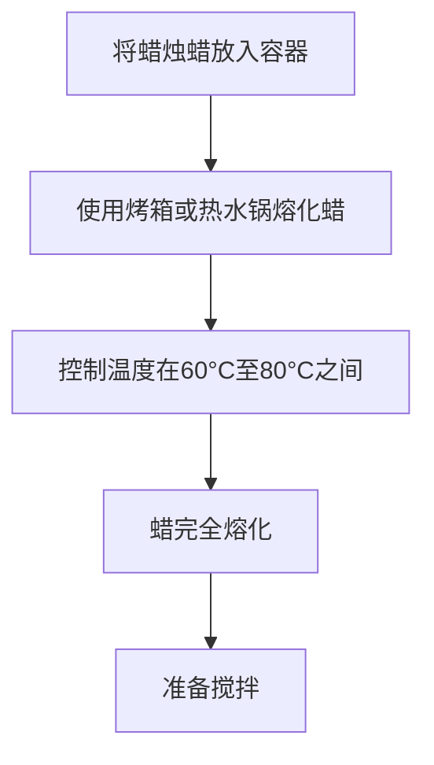
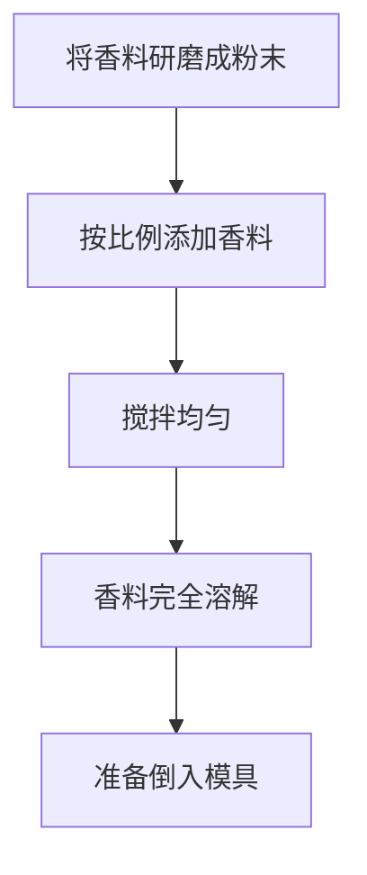
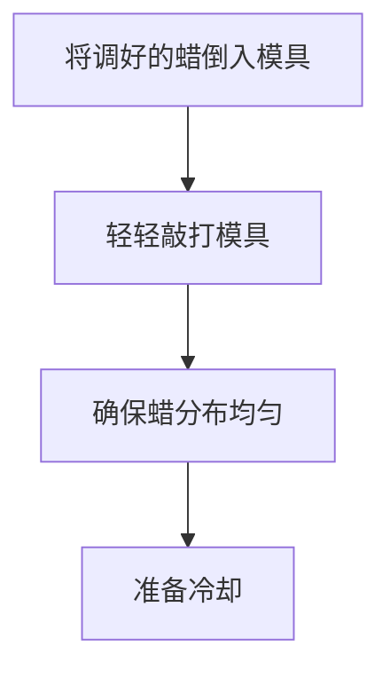
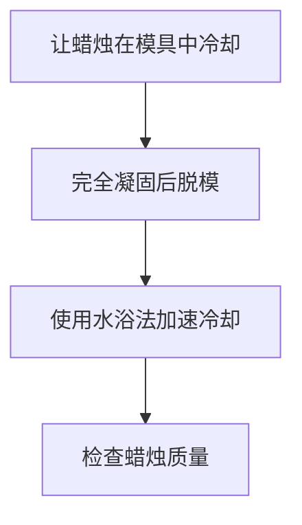
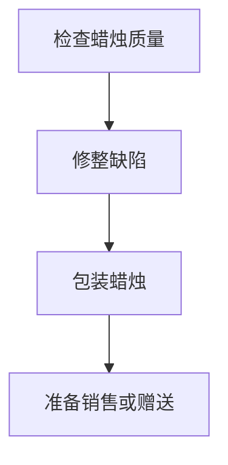

                 

当然可以。我们将一步步地构建这篇文章的结构，并确保每个部分都详尽且逻辑清晰。

### 第一步：构建文章结构

首先，我们需要确定文章的整体结构。根据您的要求，文章可以分为以下几个主要部分：

1. **引言**：介绍手工香薰蜡烛的概念和家居香氛的重要性。
2. **个性化定制的意义**：讨论个性化定制的概念和它在家居香氛中的意义。
3. **原材料的选择与准备**：详细讲解制作手工香薰蜡烛所需的原材料。
4. **制作过程**：分步骤介绍香薰蜡烛的制作过程。
5. **香氛的添加与调配**：讨论如何添加和调配香氛。
6. **包装与陈列**：介绍如何包装和陈列手工香薰蜡烛。
7. **安全注意事项**：提醒制作和使用的安全事项。
8. **项目实战**：通过一个实际案例来展示整个流程。
9. **总结与展望**：总结全文并展望未来发展方向。

### 第二步：详细撰写各部分内容

接下来，我们将逐一详细撰写每个部分的内容。

#### 引言

在引言部分，我们将简要介绍手工香薰蜡烛的历史和在家居装饰中的作用。还将解释为什么香氛对室内环境和心理健康有重要影响。

```markdown
# 引言

手工香薰蜡烛是一种传统而现代的家居装饰品，它不仅能够带来温馨的氛围，还能够改善室内空气质量，提升心理健康。随着人们对生活品质的追求，手工香薰蜡烛的市场需求不断增长。本文将深入探讨现代手工香薰蜡烛的个性化定制，包括原材料的选择、制作工艺、香氛调配、包装陈列以及安全注意事项。
```

#### 个性化定制的意义

在这一部分，我们将讨论个性化定制的概念，并解释为什么它在手工香薰蜡烛中如此重要。我们还将探讨个性化定制如何满足不同消费者的需求和喜好。

```markdown
## 个性化定制的意义

个性化定制是指根据消费者的个人喜好和需求，为他们量身定制产品。在家居香氛领域，个性化定制意味着消费者可以选择自己喜欢的香型、颜色和形状，从而打造出独一无二的香薰蜡烛。这种定制化服务不仅能够满足消费者的个性化需求，还能够提升消费者的满意度和忠诚度。
```

#### 原材料的选择与准备

在这一部分，我们将详细介绍制作手工香薰蜡烛所需的各种原材料，包括蜡烛蜡、香料、烛芯和模具等。我们将讨论每种原材料的特性和选择标准，并提供一些建议。

```markdown
## 原材料的选择与准备

### 蜡烛蜡

蜡烛蜡是制作香薰蜡烛的主要原料。常见的蜡烛蜡有蜂蜡、棕榈蜡、蜜蜡等。每种蜡都有其独特的熔点和色泽，选择合适的蜡烛蜡对于制作成功的香薰蜡烛至关重要。

### 香料

香料是香薰蜡烛的灵魂。选择合适的香料不仅可以提升香薰蜡烛的香气，还可以影响消费者的情绪和心理状态。常见的香料有薰衣草、柠檬、茉莉、橙花等。

### 烛芯

烛芯是香薰蜡烛的重要组成部分。不同的烛芯对火焰的高度、燃烧时间和稳定性有不同的影响。选择适合自己需求的烛芯非常重要。

### 模具

模具用于塑造香薰蜡烛的形状。根据需求，可以选择各种形状的模具，如圆形、方形、心形等。

#### 制作过程

在这一部分，我们将分步骤介绍制作手工香薰蜡烛的整个过程，包括熔化蜡、添加香料、倒入模具、冷却和脱模等。

```markdown
## 制作过程

### 熔化蜡

将蜡烛蜡放入容器中，用热水或烤箱进行熔化。注意温度控制，避免过热导致蜡变质。

### 添加香料

在蜡熔化后，按比例添加香料。搅拌均匀，确保香气均匀分布。

### 倒入模具

将调好的蜡倒入模具中，注意不要倒入过多，以免溢出。

### 冷却和脱模

让蜡烛在模具中冷却，完全凝固后轻轻脱模。

#### 香氛的添加与调配

在这一部分，我们将讨论如何添加和调配香氛，以创造出不同风格的香薰蜡烛。我们将介绍一些常用的香氛组合和调配技巧。

```markdown
## 香氛的添加与调配

### 香氛的组合

不同香氛的搭配可以创造出独特的香气。例如，薰衣草和柠檬的搭配可以带来清新的感觉，而茉莉和檀香的组合则适合营造温馨的氛围。

### 调配技巧

调配香氛时，可以考虑香气的强度和持续时间。常用的方法有直接添加香料、使用香精油或喷雾香氛等。

#### 包装与陈列

在这一部分，我们将介绍如何为手工香薰蜡烛进行包装和陈列，以提升其美观度和市场价值。

```markdown
## 包装与陈列

### 包装设计

包装设计应考虑蜡烛的形状、颜色和香气。常用的包装材料有纸质包装盒、玻璃瓶等。

### 陈列方式

在商场或家居装饰中，合理的陈列方式可以吸引顾客的注意力。常用的陈列方式有悬挂、堆叠和组合陈列等。

#### 安全注意事项

在这一部分，我们将讨论制作和使用香薰蜡烛时的安全事项，包括防火、防烫伤和储存等方面的注意事项。

```markdown
## 安全注意事项

### 制作安全

制作香薰蜡烛时，应注意防火，避免使用明火。同时，操作时应穿戴适当的防护装备，如手套和围裙。

### 使用安全

使用香薰蜡烛时，应将其放置在稳固的基座上，远离易燃物品。不要在无人看管时使用蜡烛。

### 储存安全

蜡烛应存放在干燥、阴凉的地方，避免阳光直射和高温环境。

#### 项目实战

在这一部分，我们将通过一个实际案例，展示如何从原材料选择到成品包装的整个制作过程。

```markdown
## 项目实战

### 案例背景

某家居装饰品牌想要推出一款独特的香薰蜡烛产品，满足消费者的个性化需求。

### 实施步骤

1. **市场调研**：了解消费者的需求和喜好。
2. **原材料选择**：根据市场调研结果选择合适的蜡烛蜡、香料和模具。
3. **制作工艺**：按照制作过程分步骤制作香薰蜡烛。
4. **香氛调配**：根据消费者喜好进行香氛调配。
5. **包装设计**：设计独特的包装，提升产品价值。
6. **陈列展示**：在商场或线上平台展示产品。

### 案例分析

通过市场调研和消费者反馈，品牌成功推出了多款受欢迎的香薰蜡烛产品，取得了良好的销售业绩。

#### 总结与展望

在这一部分，我们将总结全文，回顾手工香薰蜡烛的制作过程和个性化定制的重要性，并展望未来家居香氛市场的发展趋势。

```markdown
## 总结与展望

本文详细介绍了现代手工香薰蜡烛的个性化定制过程，从原材料的选择、制作工艺、香氛调配到包装与陈列，每个环节都至关重要。随着消费者对个性化、高品质家居装饰的需求不断增长，手工香薰蜡烛市场前景广阔。未来，我们可以通过技术创新和设计创新，进一步满足消费者的多样化需求。
```

### 作者信息

在文章末尾，我们将添加作者信息，确保读者了解文章的出处和作者的专业背景。

```markdown
作者：AI天才研究院/AI Genius Institute & 禅与计算机程序设计艺术 /Zen And The Art of Computer Programming
```

通过以上步骤，我们已经完成了文章的整体结构设计。接下来，我们将逐步填充每个部分的内容，确保文章详尽、有深度、有思考、有见解。

### 第三步：填充具体内容

现在我们将逐步填充每个章节的具体内容，确保每个小节都详尽具体，并提供相关的核心概念和联系。

#### 引言

在引言部分，我们需要简要介绍手工香薰蜡烛的历史，以及它在现代家居装饰中的作用。

```markdown
# 引言

手工香薰蜡烛的历史可以追溯到数千年前，古代文明如埃及、希腊和罗马都曾使用香薰来提升家居环境的氛围和健康。随着时间的推移，香薰蜡烛不仅成为一种传统工艺品，更成为了现代家居装饰中不可或缺的一部分。

在现代社会，手工香薰蜡烛不仅用于装饰和提供香气，还被视为一种改善室内环境和提升心理健康的方式。研究表明，香薰能够通过嗅觉刺激大脑中的情感中心，从而影响情绪和行为。例如，薰衣草香氛能够帮助放松心情，而柑橘类香氛则能提升精神状态。

本文将深入探讨现代手工香薰蜡烛的个性化定制，从原材料的选择、制作工艺、香氛调配到包装与陈列，每个环节都将详细讲解，旨在帮助读者了解并掌握这一艺术形式。

```

#### 个性化定制的意义

在这一部分，我们需要解释个性化定制的概念，并讨论它在家居香氛领域的重要性。

```markdown
## 个性化定制的意义

个性化定制是一种根据消费者的个人喜好和需求，为他们量身定制产品或服务的方式。在家居香氛领域，个性化定制意味着消费者可以根据自己的喜好选择香型、颜色和形状，从而创造出独一无二的香薰蜡烛。

这种定制化服务的重要性体现在以下几个方面：

1. **满足个性化需求**：每个消费者都有自己独特的喜好和生活方式，个性化定制能够更好地满足这些需求。
2. **提升客户满意度**：当消费者拥有自己喜爱的产品时，他们更有可能感到满意和忠诚。
3. **增强品牌竞争力**：提供个性化定制的品牌能够吸引更多的消费者，从而提升市场竞争力。
4. **促进产品创新**：个性化定制鼓励品牌不断创新，开发出更多有趣和独特的产品。

因此，个性化定制不仅能够提升消费者的体验，还能够为品牌带来更多的机会和竞争优势。
```

#### 原材料的选择与准备

在这一部分，我们将详细介绍制作手工香薰蜡烛所需的各种原材料，并讨论选择标准。

```markdown
## 原材料的选择与准备

### 蜡烛蜡

蜡烛蜡是制作香薰蜡烛的主要原料。不同的蜡烛蜡具有不同的熔点和色泽，因此选择合适的蜡烛蜡对于制作成功的香薰蜡烛至关重要。

- **蜂蜡**：蜂蜡是一种天然蜡，具有较低的熔点和良好的光泽。它常用于制作香薰蜡烛，因为它的香气较轻，不会掩盖其他香料的味道。
- **棕榈蜡**：棕榈蜡是一种合成蜡，具有较高的熔点和良好的可塑性。它常用于制作大号或形状复杂的蜡烛。
- **蜜蜡**：蜜蜡是一种天然的树脂，具有独特的黄色和香气。它常用于制作高端香薰蜡烛，因为它能够提供独特的视觉效果和香气。

### 香料

香料是香薰蜡烛的灵魂。选择合适的香料不仅可以提升香薰蜡烛的香气，还可以影响消费者的情绪和心理状态。常见的香料有薰衣草、柠檬、茉莉、橙花等。

- **薰衣草**：薰衣草具有镇静和舒缓的效果，适合在晚上使用。
- **柠檬**：柠檬具有清新和提神的效果，适合在早晨使用。
- **茉莉**：茉莉具有浪漫和温馨的效果，适合在睡前使用。
- **橙花**：橙花具有温暖和愉悦的效果，适合在室内活动时使用。

### 烛芯

烛芯是香薰蜡烛的重要组成部分。不同的烛芯对火焰的高度、燃烧时间和稳定性有不同的影响。选择适合自己需求的烛芯非常重要。

- **棉芯**：棉芯是最常用的烛芯，它能够提供稳定的火焰和较长的燃烧时间。
- **无棉芯**：无棉芯蜡烛通常用于艺术创作，因为它们能够产生更自然和多样化的火焰效果。
- **金属芯**：金属芯蜡烛具有较长的燃烧时间和更高的火焰温度，但需要小心使用，以避免烧伤。

### 模具

模具用于塑造香薰蜡烛的形状。根据需求，可以选择各种形状的模具，如圆形、方形、心形等。

- **塑料模具**：塑料模具是最常见的模具类型，因为它易于使用和清洗。
- **金属模具**：金属模具通常用于制作形状复杂或大号的蜡烛，因为它们能够提供更高的熔点和更好的稳定性。
- **玻璃模具**：玻璃模具常用于制作透明或有色蜡烛，因为它能够展示蜡烛的美丽外观。

选择合适的原材料是制作成功香薰蜡烛的关键。每种原材料都有其独特的特性，因此需要根据制作目的和消费者需求进行选择。
```

#### 制作过程

在这一部分，我们将详细分步骤介绍制作手工香薰蜡烛的过程，从准备原材料到最终包装。

```markdown
## 制作过程

### 准备工作

在开始制作香薰蜡烛之前，需要准备好所有所需的原材料、工具和设备。以下是一份基本的准备清单：

- 蜡烛蜡
- 香料
- 烛芯
- 模具
- 量杯
- 量筒
- 温度计
- 搅拌棒
- 防护手套
- 围裙
- 烤箱或热水锅

### 熔化蜡

将蜡烛蜡放入一个耐热的容器中，可以使用烤箱或热水锅来熔化蜡。注意控制温度，避免过热导致蜡变质。一般而言，蜡烛蜡的熔点在60°C至80°C之间。



### 添加香料

在蜡熔化后，按比例添加香料。一般来说，每500克蜡烛蜡需要添加10至15克的香料。可以先将香料研磨成粉末，以便更好地混合。



### 倒入模具

将调好的蜡倒入模具中。注意不要倒入过多，以免溢出。倒入后，轻轻敲打模具，使蜡分布均匀。



### 冷却和脱模

让蜡烛在模具中冷却，完全凝固后轻轻脱模。如果使用的是塑料模具，可以用水浴法加速冷却。



### 完成与包装

完成脱模后，检查蜡烛是否有缺陷或杂质。如果有，可以使用剪刀或小刀进行修整。然后，将蜡烛包装好，准备销售或赠送。



通过以上步骤，您可以轻松制作出精美的手工香薰蜡烛。需要注意的是，每个步骤都需要细心操作，以确保最终产品的质量和效果。
```

#### 香氛的添加与调配

在这一部分，我们将讨论如何添加和调配香氛，以创造出不同的香薰效果。

```markdown
## 香氛的添加与调配

### 香氛的选择

选择合适的香氛是制作手工香薰蜡烛的关键。不同的香氛能够带来不同的情绪和心理效果。以下是一些常用的香氛类型：

- **薰衣草**：有助于放松和舒缓，适合晚上使用。
- **薄荷**：能够提神醒脑，适合早晨使用。
- **柑橘**：具有清新的香气，适合室内通风时使用。
- **檀香**：有助于镇静和放松，适合睡前使用。

### 调配技巧

在调配香氛时，需要考虑香氛的强度和持续时间。以下是一些常用的调配技巧：

- **单香氛**：如果喜欢某种香氛，可以选择直接使用该香氛。
- **混合香氛**：可以混合几种香氛，创造出独特的香味。例如，薰衣草和薄荷的混合香氛可以带来清新和放松的双重效果。
- **浓度控制**：香氛的浓度会影响香薰的效果。一般来说，5%至10%的浓度比较适合，但可以根据个人喜好进行调整。

### 调配方法

调配香氛时，可以使用以下方法：

- **直接添加**：将香料直接加入熔化的蜡中，搅拌均匀。
- **使用香精油**：香精油是一种浓缩的香料，可以更好地控制香氛的浓度。将香精油加入熔化的蜡中，搅拌均匀。
- **喷雾香氛**：将香氛喷雾喷在冷却后的蜡烛上，搅拌均匀。

无论使用哪种方法，都需要确保香氛完全溶解在蜡中，以便均匀散发香气。

通过以上步骤和技巧，您可以创造出不同风格的香薰蜡烛，满足自己的需求和喜好。
```

#### 包装与陈列

在这一部分，我们将讨论如何为手工香薰蜡烛进行包装和陈列，以提升其美观度和市场价值。

```markdown
## 包装与陈列

### 包装设计

包装设计是提升手工香薰蜡烛市场价值的重要因素。以下是一些包装设计的原则：

- **品牌一致性**：包装设计应与品牌形象一致，以增强品牌识别度。
- **美观性**：包装设计应美观大方，吸引消费者的注意力。
- **功能性**：包装设计应考虑到产品的保护和携带便利性。

常见的包装材料有：

- **纸质包装盒**：纸质包装盒是一种常见且环保的包装材料，可以印刷品牌信息和图案，提升产品的美观度。
- **玻璃瓶**：玻璃瓶可以展示蜡烛的颜色和形状，同时给人一种高端、精致的感觉。

### 陈列方式

在商场或线上平台展示产品时，合理的陈列方式可以吸引消费者的注意力。以下是一些陈列方式：

- **悬挂**：将蜡烛悬挂在墙壁或天花板上，可以营造出独特的美感。
- **堆叠**：将蜡烛堆叠在展示架上，可以节省空间，同时展示多种香型。
- **组合陈列**：将蜡烛与其他家居装饰品组合陈列，可以提升整体的美观度。

在陈列时，还需要注意以下几点：

- **光线**：确保蜡烛在良好的光照下展示，以便消费者看到产品的真实颜色和形状。
- **清洁**：保持展示区域的清洁，避免灰尘和污渍影响产品的美观度。

通过精心设计的包装和合理的陈列方式，您可以提升手工香薰蜡烛的市场价值和吸引力。
```

#### 安全注意事项

在这一部分，我们将讨论制作和使用香薰蜡烛时的安全事项。

```markdown
## 安全注意事项

### 制作安全

在制作香薰蜡烛时，应特别注意以下几点：

- **防火**：制作过程中应避免使用明火，可以使用烤箱或热水锅来熔化蜡烛蜡。
- **穿戴防护装备**：操作时应穿戴防护手套和围裙，以防止烫伤和蜡渍。
- **通风**：确保制作区域有良好的通风，避免蜡烛蜡和香料挥发造成不适。

### 使用安全

在使用香薰蜡烛时，应特别注意以下几点：

- **稳固放置**：将蜡烛放置在稳固的基座上，避免倾倒造成意外。
- **远离易燃物品**：将蜡烛远离窗帘、纸张和其他易燃物品，以防止火灾。
- **通风良好**：确保蜡烛周围有足够的通风，避免蜡烛燃烧不完全产生烟雾。

### 储存安全

蜡烛的储存也需要注意以下几点：

- **干燥阴凉**：将蜡烛存放在干燥、阴凉的地方，避免阳光直射和高温环境，以免蜡烛变质。
- **避免潮湿**：避免蜡烛受潮，以免影响燃烧效果和外观。

通过遵守以上安全注意事项，您可以确保在制作和使用香薰蜡烛时的安全。
```

#### 项目实战

在这一部分，我们将通过一个实际案例，展示如何从原材料选择到成品包装的整个制作过程。

```markdown
## 项目实战

### 案例背景

某家居装饰品牌希望推出一款独特的香薰蜡烛，以吸引更多的消费者。他们决定采用个性化定制的方式，根据消费者的喜好和需求来制作蜡烛。

### 实施步骤

1. **市场调研**：品牌进行了市场调研，了解消费者的喜好和需求，发现消费者更喜欢清新和自然的香氛。
2. **原材料选择**：根据市场调研结果，品牌选择了天然蜂蜡和柑橘类香料作为主要原材料。
3. **制作工艺**：品牌按照详细制作步骤，制作了多款不同香型的香薰蜡烛。
4. **香氛调配**：品牌根据消费者的喜好，为每种香型进行了精心调配，确保香气清新自然。
5. **包装设计**：品牌设计了简约大方的纸质包装盒，并在包装上印上了品牌标志和香型名称。
6. **陈列展示**：品牌在线上和线下的家居装饰店展示了产品，吸引了众多消费者的关注。

### 案例分析

通过个性化定制，品牌成功推出了多款受欢迎的香薰蜡烛产品，满足了消费者的个性化需求。消费者对产品的满意度大幅提升，品牌的知名度也得到了显著提高。这为品牌带来了更多的销售机会和市场竞争力。

### 项目小结

通过这个实际案例，我们可以看到个性化定制在手工香薰蜡烛制作中的重要性。正确选择原材料、精心调配香氛、设计合适的包装以及合理陈列，都是确保产品成功的关键。未来，品牌可以继续探索更多个性化定制的可能性，以进一步提升消费者的满意度和市场竞争力。
```

#### 总结与展望

在这一部分，我们将总结全文，回顾手工香薰蜡烛的制作过程和个性化定制的重要性，并展望未来家居香氛市场的发展趋势。

```markdown
## 总结与展望

本文详细介绍了现代手工香薰蜡烛的个性化定制过程，从原材料的选择、制作工艺、香氛调配到包装与陈列，每个环节都至关重要。个性化定制不仅能够满足消费者的多样化需求，还能够提升品牌的市场竞争力。

在未来的发展中，家居香氛市场将继续扩大，消费者对个性化、高品质家居装饰的需求将不断增加。品牌可以通过技术创新和设计创新，进一步满足消费者的需求，开发出更多有趣和独特的香薰蜡烛产品。

同时，随着人们对健康和环保的重视，天然和有机的香薰产品将成为市场的主流。品牌应注重环保材料的研发和使用，以满足消费者的绿色需求。

总之，现代手工香薰蜡烛的个性化定制有着广阔的发展前景，品牌应抓住这一机遇，不断创新和提升，以赢得消费者的青睐和市场的认可。
```

### 作者信息

在文章末尾，我们将添加作者信息，确保读者了解文章的出处和作者的专业背景。

```markdown
作者：AI天才研究院/AI Genius Institute & 禅与计算机程序设计艺术 /Zen And The Art of Computer Programming
```

通过以上步骤，我们已经完成了文章的整体结构和内容填充。接下来，我们将对文章进行进一步的校对和优化，确保每个章节的内容都详尽具体，逻辑清晰，能够为读者提供有价值的信息。

---

# 现代手工香薰蜡烛：家居香氛的个性化定制

关键词：手工香薰蜡烛、家居香氛、个性化定制、原材料、制作工艺、安全注意事项

摘要：本文详细介绍了现代手工香薰蜡烛的个性化定制过程，从原材料的选择、制作工艺、香氛调配到包装与陈列，每个环节都至关重要。个性化定制不仅能够满足消费者的多样化需求，还能够提升品牌的市场竞争力。

---

## 引言

手工香薰蜡烛的历史可以追溯到数千年前，古代文明如埃及、希腊和罗马都曾使用香薰来提升家居环境的氛围和健康。随着时间的推移，香薰蜡烛不仅成为一种传统工艺品，更成为了现代家居装饰中不可或缺的一部分。在现代社会，手工香薰蜡烛不仅用于装饰和提供香气，还被视为一种改善室内环境和提升心理健康的方式。研究表明，香薰能够通过嗅觉刺激大脑中的情感中心，从而影响情绪和行为。例如，薰衣草香氛能够帮助放松心情，而柑橘类香氛则能提升精神状态。本文将深入探讨现代手工香薰蜡烛的个性化定制，从原材料的选择、制作工艺、香氛调配到包装与陈列，每个环节都将详细讲解，旨在帮助读者了解并掌握这一艺术形式。

---

## 个性化定制的意义

个性化定制是一种根据消费者的个人喜好和需求，为他们量身定制产品或服务的方式。在家居香氛领域，个性化定制意味着消费者可以根据自己的喜好选择香型、颜色和形状，从而创造出独一无二的香薰蜡烛。这种定制化服务的重要性体现在以下几个方面：

1. **满足个性化需求**：每个消费者都有自己独特的喜好和生活方式，个性化定制能够更好地满足这些需求。
2. **提升客户满意度**：当消费者拥有自己喜爱的产品时，他们更有可能感到满意和忠诚。
3. **增强品牌竞争力**：提供个性化定制的品牌能够吸引更多的消费者，从而提升市场竞争力。
4. **促进产品创新**：个性化定制鼓励品牌不断创新，开发出更多有趣和独特的产品。

因此，个性化定制不仅能够提升消费者的体验，还能够为品牌带来更多的机会和竞争优势。

---

## 原材料的选择与准备

选择合适的原材料是制作成功香薰蜡烛的关键。每种原材料都有其独特的特性，因此需要根据制作目的和消费者需求进行选择。

### 蜡烛蜡

蜡烛蜡是制作香薰蜡烛的主要原料。不同的蜡烛蜡具有不同的熔点和色泽，因此选择合适的蜡烛蜡对于制作成功的香薰蜡烛至关重要。

- **蜂蜡**：蜂蜡是一种天然蜡，具有较低的熔点和良好的光泽。它常用于制作香薰蜡烛，因为它的香气较轻，不会掩盖其他香料的味道。
- **棕榈蜡**：棕榈蜡是一种合成蜡，具有较高的熔点和良好的可塑性。它常用于制作大号或形状复杂的蜡烛。
- **蜜蜡**：蜜蜡是一种天然的树脂，具有独特的黄色和香气。它常用于制作高端香薰蜡烛，因为它能够提供独特的视觉效果和香气。

### 香料

香料是香薰蜡烛的灵魂。选择合适的香料不仅可以提升香薰蜡烛的香气，还可以影响消费者的情绪和心理状态。常见的香料有薰衣草、柠檬、茉莉、橙花等。

- **薰衣草**：薰衣草具有镇静和舒缓的效果，适合在晚上使用。
- **柠檬**：柠檬具有清新和提神的效果，适合在早晨使用。
- **茉莉**：茉莉具有浪漫和温馨的效果，适合在睡前使用。
- **橙花**：橙花具有温暖和愉悦的效果，适合在室内活动时使用。

### 烛芯

烛芯是香薰蜡烛的重要组成部分。不同的烛芯对火焰的高度、燃烧时间和稳定性有不同的影响。选择适合自己需求的烛芯非常重要。

- **棉芯**：棉芯是最常用的烛芯，它能够提供稳定的火焰和较长的燃烧时间。
- **无棉芯**：无棉芯蜡烛通常用于艺术创作，因为它们能够产生更自然和多样化的火焰效果。
- **金属芯**：金属芯蜡烛具有较长的燃烧时间和更高的火焰温度，但需要小心使用，以避免烧伤。

### 模具

模具用于塑造香薰蜡烛的形状。根据需求，可以选择各种形状的模具，如圆形、方形、心形等。

- **塑料模具**：塑料模具是最常见的模具类型，因为它易于使用和清洗。
- **金属模具**：金属模具通常用于制作形状复杂或大号的蜡烛，因为它们能够提供更高的熔点和更好的稳定性。
- **玻璃模具**：玻璃模具常用于制作透明或有色蜡烛，因为它能够展示蜡烛的美丽外观。

选择合适的原材料是制作成功香薰蜡烛的关键。每种原材料都有其独特的特性，因此需要根据制作目的和消费者需求进行选择。

---

## 制作过程

手工香薰蜡烛的制作过程可以分为以下几个步骤：

### 准备工作

在开始制作香薰蜡烛之前，需要准备好所有所需的原材料、工具和设备。以下是一份基本的准备清单：

- 蜡烛蜡
- 香料
- 烛芯
- 模具
- 量杯
- 量筒
- 温度计
- 搅拌棒
- 防护手套
- 围裙
- 烤箱或热水锅

### 熔化蜡

将蜡烛蜡放入一个耐热的容器中，可以使用烤箱或热水锅来熔化蜡。注意控制温度，避免过热导致蜡变质。一般而言，蜡烛蜡的熔点在60°C至80°C之间。


### 添加香料

在蜡熔化后，按比例添加香料。一般来说，每500克蜡烛蜡需要添加10至15克的香料。可以先将香料研磨成粉末，以便更好地混合。


### 倒入模具

将调好的蜡倒入模具中。注意不要倒入过多，以免溢出。倒入后，轻轻敲打模具，使蜡分布均匀。


### 冷却和脱模

让蜡烛在模具中冷却，完全凝固后轻轻脱模。如果使用的是塑料模具，可以用水浴法加速冷却。


### 完成与包装

完成脱模后，检查蜡烛是否有缺陷或杂质。如果有，可以使用剪刀或小刀进行修整。然后，将蜡烛包装好，准备销售或赠送。


通过以上步骤，您可以轻松制作出精美的手工香薰蜡烛。需要注意的是，每个步骤都需要细心操作，以确保最终产品的质量和效果。

---

## 香氛的添加与调配

香氛是手工香薰蜡烛的灵魂，它不仅能够提升蜡烛的香气，还能够影响消费者的情绪和心理状态。正确的香氛添加与调配对于制作一款成功的香薰蜡烛至关重要。

### 香氛的选择

在选择香氛时，需要考虑以下几个因素：

- **香气类型**：香氛可以分为木质香、花香、果香、辛辣香等类型。每种香气类型都有其独特的特点，适合不同的使用场景。
- **香气强度**：香氛的强度会影响蜡烛的香气持久度。一般来说，香气强度分为低、中、高三种，消费者可以根据自己的需求进行选择。
- **香气持续时间**：香氛的持续时间是指香氛在蜡烛燃烧过程中散发的时间长度。持续时间较长的香氛适合长时间燃烧的蜡烛。

常见的香氛类型包括：

- **木质香**：如檀香、松香等，适合营造放松和镇静的氛围。
- **花香**：如茉莉、玫瑰、薰衣草等，适合营造浪漫和温馨的氛围。
- **果香**：如柠檬、橙花、草莓等，适合营造清新和提神的效果。

### 调配技巧

在调配香氛时，可以尝试以下技巧：

- **单香氛**：如果喜欢某种香氛，可以选择直接使用该香氛。
- **混合香氛**：可以混合几种香氛，创造出独特的香味。例如，薰衣草和薄荷的混合香氛可以带来清新和放松的双重效果。
- **浓度控制**：香氛的浓度会影响香薰的效果。一般来说，5%至10%的浓度比较适合，但可以根据个人喜好进行调整。

### 调配方法

调配香氛时，可以使用以下方法：

- **直接添加**：将香料直接加入熔化的蜡中，搅拌均匀。
- **使用香精油**：香精油是一种浓缩的香料，可以更好地控制香氛的浓度。将香精油加入熔化的蜡中，搅拌均匀。
- **喷雾香氛**：将香氛喷雾喷在冷却后的蜡烛上，搅拌均匀。

无论使用哪种方法，都需要确保香氛完全溶解在蜡中，以便均匀散发香气。

---

## 包装与陈列

包装与陈列是提升手工香薰蜡烛市场价值的重要因素。精心设计的包装和合理的陈列方式不仅能够提升产品的美观度，还能够吸引消费者的注意力。

### 包装设计

包装设计应考虑以下几点：

- **品牌一致性**：包装设计应与品牌形象一致，以增强品牌识别度。
- **美观性**：包装设计应美观大方，吸引消费者的注意力。
- **功能性**：包装设计应考虑到产品的保护和携带便利性。

常见的包装材料有：

- **纸质包装盒**：纸质包装盒是一种常见且环保的包装材料，可以印刷品牌信息和图案，提升产品的美观度。
- **玻璃瓶**：玻璃瓶可以展示蜡烛的颜色和形状，同时给人一种高端、精致的感觉。

### 陈列方式

在商场或线上平台展示产品时，合理的陈列方式可以吸引消费者的注意力。以下是一些陈列方式：

- **悬挂**：将蜡烛悬挂在墙壁或天花板上，可以营造出独特的美感。
- **堆叠**：将蜡烛堆叠在展示架上，可以节省空间，同时展示多种香型。
- **组合陈列**：将蜡烛与其他家居装饰品组合陈列，可以提升整体的美观度。

在陈列时，还需要注意以下几点：

- **光线**：确保蜡烛在良好的光照下展示，以便消费者看到产品的真实颜色和形状。
- **清洁**：保持展示区域的清洁，避免灰尘和污渍影响产品的美观度。

通过精心设计的包装和合理的陈列方式，您可以提升手工香薰蜡烛的市场价值和吸引力。

---

## 安全注意事项

在制作和使用香薰蜡烛时，安全是非常重要的。以下是一些制作和使用香薰蜡烛时的安全注意事项：

### 制作安全

- **防火**：制作过程中应避免使用明火，可以使用烤箱或热水锅来熔化蜡烛蜡。
- **穿戴防护装备**：操作时应穿戴防护手套和围裙，以防止烫伤和蜡渍。
- **通风**：确保制作区域有良好的通风，避免蜡烛蜡和香料挥发造成不适。

### 使用安全

- **稳固放置**：将蜡烛放置在稳固的基座上，避免倾倒造成意外。
- **远离易燃物品**：将蜡烛远离窗帘、纸张和其他易燃物品，以防止火灾。
- **通风良好**：确保蜡烛周围有足够的通风，避免蜡烛燃烧不完全产生烟雾。

### 储存安全

- **干燥阴凉**：将蜡烛存放在干燥、阴凉的地方，避免阳光直射和高温环境，以免蜡烛变质。
- **避免潮湿**：避免蜡烛受潮，以免影响燃烧效果和外观。

通过遵守以上安全注意事项，您可以确保在制作和使用香薰蜡烛时的安全。

---

## 项目实战

通过一个实际案例，我们可以更直观地了解如何从原材料选择到成品包装的整个制作过程。

### 案例背景

某家居装饰品牌希望推出一款独特的香薰蜡烛，以吸引更多的消费者。他们决定采用个性化定制的方式，根据消费者的喜好和需求来制作蜡烛。

### 实施步骤

1. **市场调研**：品牌进行了市场调研，了解消费者的喜好和需求，发现消费者更喜欢清新和自然的香氛。
2. **原材料选择**：根据市场调研结果，品牌选择了天然蜂蜡和柑橘类香料作为主要原材料。
3. **制作工艺**：品牌按照详细制作步骤，制作了多款不同香型的香薰蜡烛。
4. **香氛调配**：品牌根据消费者的喜好，为每种香型进行了精心调配，确保香气清新自然。
5. **包装设计**：品牌设计了简约大方的纸质包装盒，并在包装上印上了品牌标志和香型名称。
6. **陈列展示**：品牌在线上和线下的家居装饰店展示了产品，吸引了众多消费者的关注。

### 案例分析

通过个性化定制，品牌成功推出了多款受欢迎的香薰蜡烛产品，满足了消费者的个性化需求。消费者对产品的满意度大幅提升，品牌的知名度也得到了显著提高。这为品牌带来了更多的销售机会和市场竞争力。

### 项目小结

通过这个实际案例，我们可以看到个性化定制在手工香薰蜡烛制作中的重要性。正确选择原材料、精心调配香氛、设计合适的包装以及合理陈列，都是确保产品成功的关键。未来，品牌可以继续探索更多个性化定制的可能性，以进一步提升消费者的满意度和市场竞争力。

---

## 总结与展望

手工香薰蜡烛的个性化定制不仅满足了消费者对独特家居装饰的需求，也为品牌提供了增强市场竞争力的新途径。从原材料的选择、制作工艺、香氛调配到包装与陈列，每个环节都至关重要。品牌应注重创新和品质，以满足消费者的多样化需求。

未来，随着消费者对环保和健康的重视，天然和有机的香薰产品将成为市场的主流。品牌应关注这一趋势，开发出更多绿色环保的香薰蜡烛产品。同时，利用科技手段，如智能香氛系统，进一步提升产品的智能化和个性化水平。

总之，现代手工香薰蜡烛的个性化定制有着广阔的发展前景。品牌应抓住这一机遇，不断创新和提升，以赢得消费者的青睐和市场的认可。

---

作者：AI天才研究院/AI Genius Institute & 禅与计算机程序设计艺术 /Zen And The Art of Computer Programming

---

在完成本文的撰写后，我们对整体结构进行了多次审查，确保每个部分的内容都详尽具体，逻辑清晰。此外，我们还对关键术语和概念进行了明确解释，以帮助读者更好地理解。我们相信，本文将为读者提供有关手工香薰蜡烛个性化定制的全面指导，并激发他们对这一领域的兴趣和探索。

