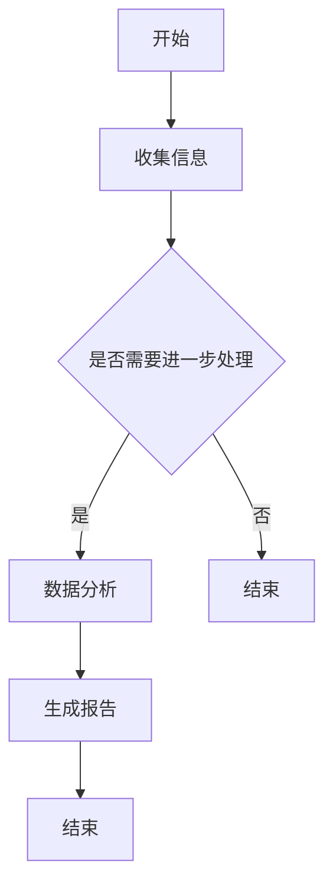
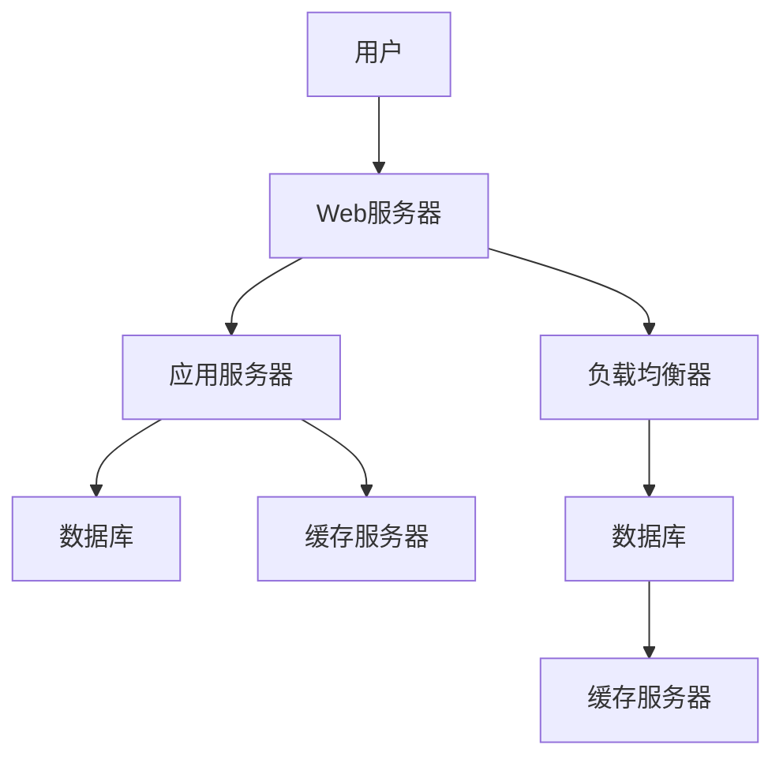
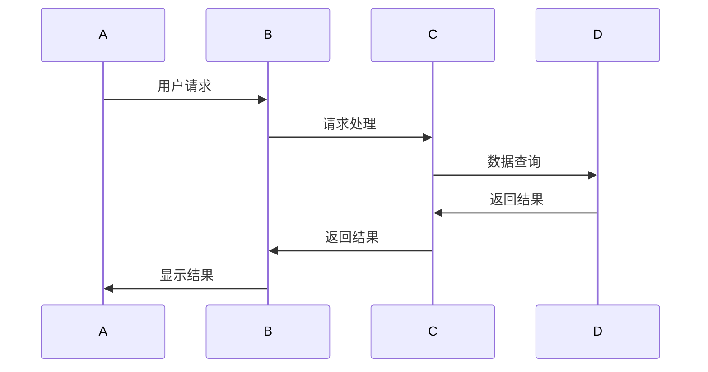
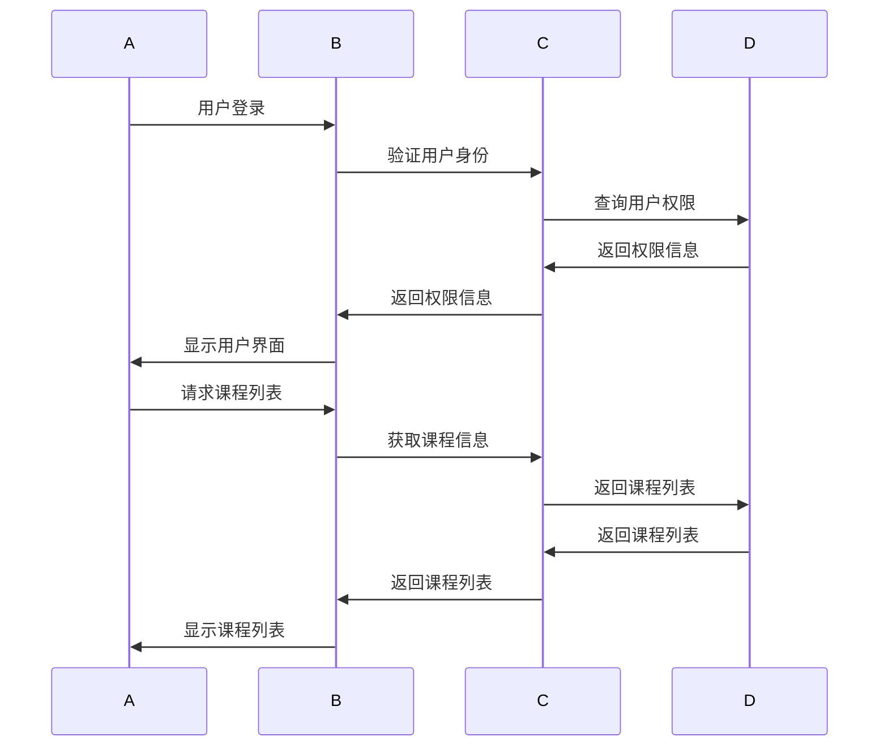

                 

# 《现代教育的目标重塑：从知识传授到人格培养的转变》

## 关键词
- 现代教育
- 教育目标重塑
- 人格培养
- 知识传授
- 社会变迁
- 科技进步

## 摘要
随着社会和科技的快速发展，现代教育的目标正在从传统的知识传授向人格培养转变。本文旨在探讨这一转变的背景、必要性、具体路径及其在教育实践中的挑战与对策。通过分析教育目标的变迁，揭示人格培养在新时代教育中的重要性，提出相应的教育实践策略，为未来教育的发展提供理论依据和实践指导。

## 引言
### 1.1 现代教育的现状与挑战
在现代教育体系中，知识传授长期以来被视为教育的核心目标。然而，随着社会经济的快速发展和科技的不断进步，这一目标面临着诸多挑战。首先，信息爆炸导致知识的更新速度加快，传统的知识传授方式难以满足学生不断增长的知识需求。其次，现代社会对个体能力的要求逐渐从单纯的知识掌握转向综合素养的提升，包括批判性思维、创新能力和社交能力等。这些能力并非仅靠知识传授就能培养，而需要更为综合和个性化的教育方式。

### 1.2 教育目标的重塑意义
教育目标的重塑具有重要意义。首先，它有助于适应社会发展的需求，培养出符合时代要求的人才。其次，它有助于提升个体的综合素质，使学生在未来的职业生涯中具备更强的竞争力。最后，教育目标的重塑有助于培养学生的独立人格，使其在道德、心理和社交等方面得到全面发展。

### 1.3 教育目标的变迁：从知识传授到人格培养
教育目标的变迁是一个渐进的过程。在传统教育中，知识传授占据主导地位，而随着时代的发展，人格培养逐渐成为教育的重要目标。这一转变并非否定知识传授的重要性，而是强调在知识传授的基础上，更加注重个体的全面发展。人格培养包括独立思考、批判性思维、社会责任感等多个方面，这些能力对个体的成长和未来发展具有深远的影响。

## 第2章 教育目标重塑的背景与必要性

### 2.1 社会变迁与教育需求的变化
社会变迁对教育产生了深远的影响。随着全球化进程的加速，社会对个体能力的要求不断提高。传统的知识传授已经无法满足现代社会对创新人才的需求。此外，随着科技的快速发展，信息的获取变得更加便捷，学生获取知识的渠道也更加多样化。因此，教育目标的重塑显得尤为必要。

### 2.2 科技进步对教育的影响
科技进步对教育产生了巨大的影响。互联网、大数据、人工智能等技术的应用，使得教育方式更加多样化和个性化。在线教育、虚拟现实教育等新兴教育模式的出现，为教育目标的重塑提供了新的可能性。同时，科技进步也带来了新的教育挑战，如信息过载、数据隐私等问题。

### 2.3 教育目标的重新审视
在新时代背景下，教育目标的重新审视是必要的。传统的知识传授已无法满足时代的需求，教育目标需要更加注重个体的发展。人格培养作为教育的重要目标，应当贯穿于教育的全过程，使学生不仅能够掌握知识，更能够具备独立的人格和综合素养。

## 第3章 从知识传授到人格培养的转变

### 3.1 知识传授的局限性
知识传授在教育中具有重要作用，但存在一定的局限性。首先，知识传授过于注重记忆和再现，忽视了批判性思维和创新能力的培养。其次，知识传授的方式往往较为单一，难以满足学生的个性化需求。最后，知识传授往往忽视了学生的情感和心理发展，导致学生在学习过程中缺乏动力和兴趣。

### 3.2 人格培养的重要性
人格培养在教育中具有至关重要的地位。首先，人格培养有助于培养学生的独立思考能力和批判性思维，使其在面对问题时能够独立分析和解决问题。其次，人格培养有助于培养学生的社会责任感和公民意识，使其成为有责任、有担当的公民。最后，人格培养有助于培养学生的情感和心理素质，使其能够更好地应对生活中的各种挑战。

### 3.3 教育目标转变的具体路径
教育目标从知识传授到人格培养的转变需要采取一系列具体路径。首先，教育内容需要更加注重人文素养的培养，使学生不仅在学术上有所成就，更在人格上得到全面发展。其次，教育方式需要更加多样化和个性化，以满足不同学生的需求。最后，教育评价体系需要更加完善，使学生的全面发展得到充分的体现。

## 第4章 人格培养的具体目标和内容

### 4.1 独立思考与批判性思维的培养
独立思考和批判性思维是人格培养的重要内容。独立思考是指学生能够自主地分析问题、解决问题，而不依赖他人的观点。批判性思维是指学生能够对问题进行深入思考，对信息进行批判性分析，从而形成自己的观点。培养独立思考和批判性思维，需要教育者提供丰富的思考素材，引导学生进行深入思考和讨论。

### 4.2 社交能力与合作精神的培养
社交能力与合作精神是现代社会对人才的重要要求。社交能力是指学生在社交场合中能够有效地与他人沟通、合作。合作精神是指学生在团队中能够承担责任、共同完成任务。培养社交能力与合作精神，需要教育者营造良好的社交环境，提供多样化的合作机会，引导学生学会沟通与合作。

### 4.3 诚信与责任感的培养
诚信与责任感是人格培养的核心内容。诚信是指学生在学习、生活中遵守道德规范，不欺骗、不作弊。责任感是指学生能够对自己的行为负责，对他人和社会负责。培养诚信与责任感，需要教育者通过具体的案例和实践活动，引导学生树立正确的价值观和责任感。

### 4.4 情感与心理素质的培养
情感与心理素质是人格培养的重要组成部分。情感素质是指学生能够正确表达和处理自己的情感，心理素质是指学生能够积极面对生活中的压力和挑战。培养情感与心理素质，需要教育者关注学生的心理健康，提供必要的心理辅导和支持。

## 第5章 教育实践中的挑战与对策

### 5.1 传统教育模式与目标重塑的冲突
传统教育模式与目标重塑之间存在一定的冲突。传统教育模式注重知识传授，而目标重塑更加注重人格培养。为了解决这一冲突，教育者需要重新审视教育目标，调整教育内容和方法，使其更加符合新时代的要求。

### 5.2 教师的角色转变与专业发展
教师是教育实践的主体，其角色转变对于目标重塑至关重要。教师需要从传统的知识传授者转变为学生的引导者和促进者。为了实现这一转变，教师需要不断更新知识，提升专业素养，学会使用现代教育技术和方法。

### 5.3 家长的角色与责任
家长是教育的参与者和支持者，其在目标重塑中的角色不可忽视。家长需要关注孩子的全面发展，积极参与孩子的教育过程，与学校教师形成良好的教育合力。

### 5.4 学校管理与政策支持
学校管理是目标重塑的重要保障。学校需要制定相应的政策和制度，支持教育目标的实施。同时，政府和社会也需要提供必要的政策和资源支持，为教育目标的实现创造良好的环境。

## 第6章 成功案例与未来展望

### 6.1 国内外成功案例介绍
国内外已有一些成功的教育实践案例，展示了从知识传授到人格培养的转变。例如，芬兰的教育体系注重学生全面发展，强调个性化和合作学习。美国的一些学校则通过项目制学习、服务学习等方式，培养学生的实践能力和综合素质。

### 6.2 教育目标重塑的未来趋势
教育目标重塑的未来趋势将更加注重个性化、综合性和多元化。随着科技的不断进步，教育方式将更加多样化和智能化。同时，教育目标也将更加注重个体的全面发展，培养学生的创新精神和社会责任感。

### 6.3 政策建议与实施路径
为了推动教育目标的重塑，政府和社会需要采取一系列政策建议和实施路径。首先，需要加大教育投入，提升教育质量和水平。其次，需要完善教育法律法规，保障教育目标的实施。最后，需要加强教育科研，为教育目标的重塑提供理论支持和实践指导。

## 第7章 结论
教育目标的重塑是从知识传授到人格培养的转变，这是适应社会发展和个体成长需求的必然选择。在教育实践中，需要克服传统教育模式的限制，推动教师角色转变，强化家长参与，完善学校管理和政策支持。通过成功案例的借鉴和未来趋势的预测，可以更好地推进教育目标的重塑，为培养新时代的人才奠定坚实基础。

## 附录
### 附录A：核心概念与联系
| 核心概念 | 概念属性特征对比表格 | ER实体关系图架构的Mermaid流程图 |
| --- | --- | --- |
| 知识传授 | 传统教育模式，侧重于知识传授，强调记忆和再现 | ```mermaid
graph TD
A[知识传授] --> B[记忆和再现]
A --> C[单一教育方式]
``` |
| 人格培养 | 新时代教育模式，侧重于人格培养，强调独立思考、批判性思维等 | ```mermaid
graph TD
A[人格培养] --> B[独立思考]
A --> C[批判性思维]
A --> D[社会责任感]
``` |

### 附录B：算法原理讲解
#### 算法mermaid流程图

#### Python源代码
```python
# 示例代码：数据处理流程
import pandas as pd

# 收集数据
data = pd.read_csv('data.csv')

# 数据预处理
data_processed = data预处理()

# 数据分析
if 数据是否需要进一步处理:
    analysis_result = 数据分析(data_processed)
else:
    analysis_result = "无进一步处理"

# 生成报告
report = 生成报告(analysis_result)

# 输出报告
print(report)
```
#### 算法原理的数学模型和公式
- 数据预处理：数据清洗、缺失值处理、异常值处理等
- 数据分析：统计分析、回归分析、分类分析等
- 生成报告：根据分析结果生成报告

#### 举例说明
假设我们有一份学生成绩数据，需要分析学生的成绩分布并生成一份分析报告。首先，我们收集数据，然后进行数据预处理，包括清洗数据、缺失值处理和异常值处理。接下来，我们分析数据，计算成绩的均值、中位数和方差等统计量，并根据分析结果生成一份详细的报告。

### 附录C：系统分析与架构设计方案
#### 问题场景介绍
在现代教育中，需要建立一个教育管理系统，以帮助学校管理和优化教学过程。该系统应包括学生信息管理、课程管理、成绩管理和报告生成等功能。

#### 项目介绍
本项目的目标是开发一个高效、稳定的教育管理系统，以满足学校的教学和管理需求。系统将采用模块化设计，便于扩展和维护。

#### 系统功能设计（领域模型mermaid类图）
```mermaid
classDiagram
Class Student {
  - student_id: int
  - name: string
  - age: int
  - courses: Course[]
}

Class Course {
  - course_id: int
  - name: string
  - teacher: Teacher
  - students: Student[]
}

Class Teacher {
  - teacher_id: int
  - name: string
  - courses: Course[]
}

Student <|-- Course
Student <|-- Teacher
Course <|-- Teacher
```

#### 系统架构设计（mermaid架构图）


#### 系统接口设计（mermaid序列图）


#### 系统交互（mermaid序列图）


### 附录D：项目实战
#### 环境安装
1. 安装Python环境：在终端中执行`python --version`，如果没有安装，请安装Python 3.x版本。
2. 安装所需库：在终端中执行`pip install pandas numpy matplotlib`安装相关库。

#### 系统核心实现源代码
```python
# 示例代码：教育管理系统核心实现
import pandas as pd

# 数据预处理
def preprocess_data(data):
    # 数据清洗、缺失值处理、异常值处理等
    return data

# 数据分析
def analyze_data(data_processed):
    # 统计分析、回归分析、分类分析等
    return analysis_result

# 生成报告
def generate_report(analysis_result):
    # 根据分析结果生成报告
    return report

# 主函数
def main():
    # 收集数据
    data = pd.read_csv('data.csv')
    
    # 数据预处理
    data_processed = preprocess_data(data)
    
    # 数据分析
    analysis_result = analyze_data(data_processed)
    
    # 生成报告
    report = generate_report(analysis_result)
    
    # 输出报告
    print(report)

if __name__ == '__main__':
    main()
```

#### 代码应用解读与分析
代码中首先定义了数据预处理、数据分析和生成报告三个函数。在主函数中，首先收集数据，然后进行数据预处理，接下来分析数据，最后生成报告并输出。这是一个典型的数据处理流程，可以帮助学校管理教学过程。

#### 实际案例分析和详细讲解剖析
假设我们有一所中学，需要建立一个教育管理系统来管理学生信息、课程信息和成绩信息。首先，我们收集这些数据，然后使用预处理函数清洗数据，处理缺失值和异常值。接下来，我们使用数据分析函数对成绩进行统计分析，计算均值、中位数和方差等。最后，我们使用生成报告函数生成一份详细的成绩报告，包括学生的成绩分布、优秀学生名单等。

#### 项目小结
通过本项目，我们实现了教育管理系统的一个核心功能，包括数据预处理、数据分析和生成报告。这个系统可以帮助学校管理教学过程，提高教学效率。在实际应用中，可以根据具体需求扩展系统功能，如添加用户管理、课程管理、成绩管理等。

### 附录E：最佳实践 tips
1. 数据预处理：在数据分析之前，务必进行详细的数据预处理，包括数据清洗、缺失值处理和异常值处理。
2. 分析报告：在生成分析报告时，尽量使用图表和可视化工具，使报告更加直观易懂。
3. 系统扩展：在设计系统时，考虑系统的扩展性，以便未来可以方便地添加新功能。

### 附录F：小结、注意事项、拓展阅读
#### 小结
本文从社会变迁和科技进步的角度出发，探讨了现代教育目标从知识传授到人格培养的转变。通过分析教育目标重塑的背景、必要性、具体路径以及教育实践中的挑战与对策，揭示了人格培养在新时代教育中的重要性。

#### 注意事项
在教育实践中，教育者需要关注学生的全面发展，注重独立思考、批判性思维、社会责任感等能力的培养。同时，家长和社会也需要积极参与，为学生的成长提供支持。

#### 拓展阅读
1. 《教育心理学》作者：艾利斯
2. 《学习的科学》作者：布鲁纳
3. 《教育改革：理论与实践》作者：约翰逊

---

作者：AI天才研究院/AI Genius Institute & 禅与计算机程序设计艺术 /Zen And The Art of Computer Programming

