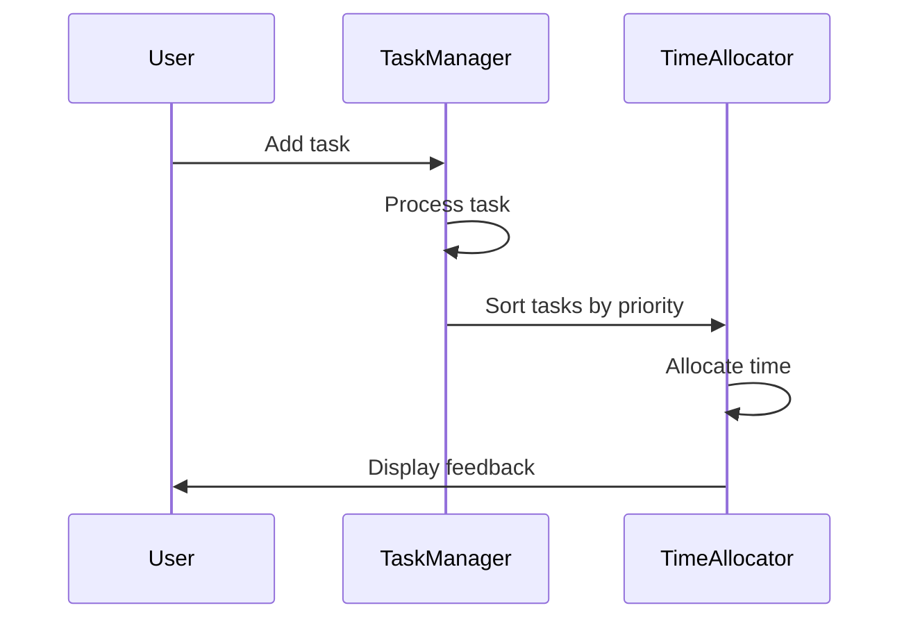
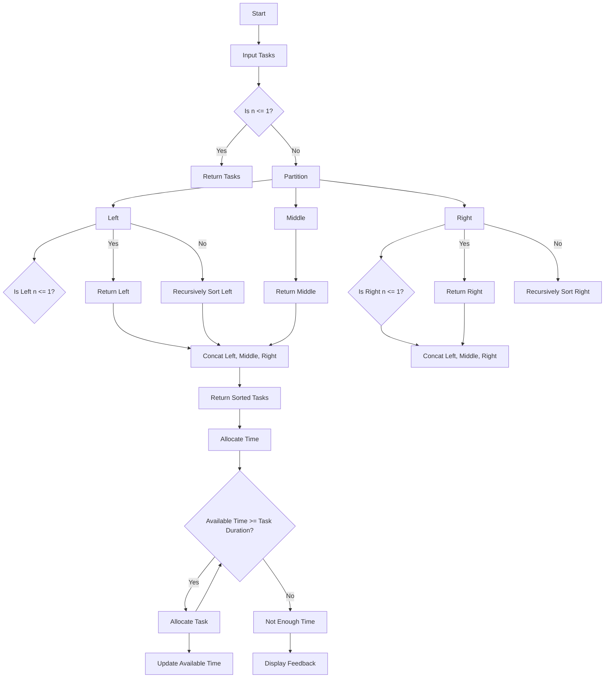
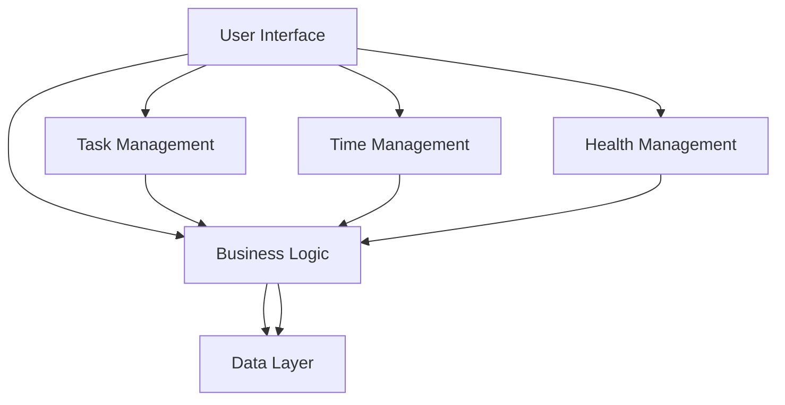
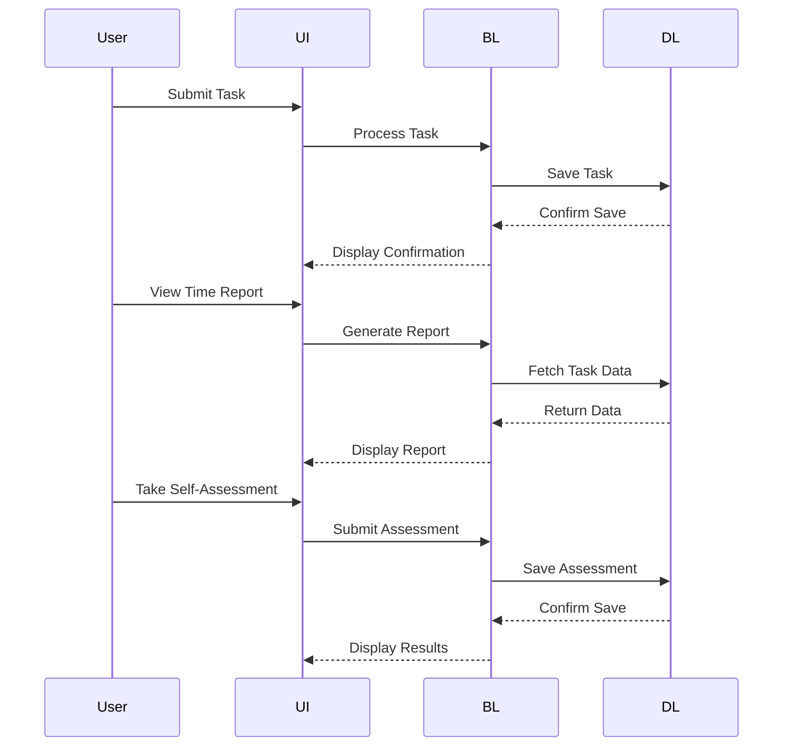

                 

## 现代斯多葛主义实践：古典智慧应对现代焦虑

> 关键词：斯多葛主义、现代焦虑、哲学实践、个人成长

现代社会充满了各种焦虑和压力，从职场竞争到生活压力，人们似乎永远在追求更好的生活，却常常感到内心空虚和不安。在这种背景下，古代斯多葛主义哲学提供了一种独特的视角和方法，帮助我们应对现代生活中的种种困扰。本文将探讨现代斯多葛主义实践，解析其核心概念和具体方法，并探讨如何在日常生活中应用这些智慧，以应对现代焦虑。

### 目录大纲设计方案

为了更好地理解和应用斯多葛主义，我们将按照以下大纲结构进行文章的撰写：

1. **斯多葛主义简介**：介绍斯多葛主义的历史背景、核心思想和基本理念。
2. **斯多葛主义的核心概念**：深入探讨理性、接受现实和自我控制等核心概念。
3. **斯多葛主义在当代生活的应用**：分析斯多葛主义如何缓解现代焦虑和提升个人幸福感。
4. **斯多葛主义实践指南**：提供具体的实践方法和建议，帮助读者在日常生活中实践斯多葛主义。
5. **斯多葛主义与其他哲学思想的比较**：探讨斯多葛主义与其他哲学思想的异同。
6. **斯多葛主义实践案例分析**：通过具体案例展示斯多葛主义的应用效果。
7. **斯多葛主义实践小结与未来展望**：总结斯多葛主义实践的价值和未来发展方向。

### 第1章：斯多葛主义简介

#### 1.1 斯多葛主义的历史背景

斯多葛主义起源于古希腊，由塞奥克里图斯（Theodorus）于公元前300年左右创立。随后，芝诺（Zeno）成为该学派的领袖，并将斯多葛主义发展为一个完整的哲学体系。斯多葛主义在古罗马时期达到了顶峰，塞内卡（Seneca）、马可·奥勒留（Marcus Aurelius）等著名哲学家对斯多葛主义进行了深刻的阐释和实践。

斯多葛主义的核心思想是理性至上、接受现实和自我控制。它强调人类应该通过理性来指导生活，接受不可控制的外部环境，并通过自我控制来达到内心的平和与安宁。

#### 1.2 斯多葛主义的基本理念

**理性至上的生活态度**：斯多葛主义认为，理性是人类精神的核心，是我们理解和应对世界的关键。通过理性思考，我们可以超越情感和欲望的干扰，做出明智的决策。

**接受不可控，控制可控**：斯多葛主义强调，人类应该接受那些无法控制的外部因素，如天气、他人行为等，并专注于那些我们可以控制和改变的事情，如自己的态度和行为。

**内在自由与安宁**：通过理性思考和自我控制，斯多葛主义者追求一种内在的自由和安宁，无论外部环境如何变化，他们都能保持内心的平和。

### 第2章：斯多葛主义的核心概念

#### 2.1 理性

理性是斯多葛主义的核心概念之一。它不仅是指逻辑推理和数学计算，更是一种对生活的深刻理解和对自我意识的觉察。理性可以帮助我们看清现实的本质，理解事物之间的联系，从而做出明智的决策。

**理性的本质与作用**：理性是人类精神的精髓，是区分人类与其他生物的关键特征。通过理性，我们可以超越情感的干扰，做出符合自身利益和道德标准的决策。

**理性与情感的关系**：斯多葛主义认为，情感本身并无好坏之分，关键在于我们如何理解和应对情感。理性可以帮助我们理解和控制情感，使其为我们的生活服务。

**如何培养理性思维**：通过阅读、思考、讨论和实践，我们可以培养理性思维。具体方法包括：阅读经典哲学著作、参与辩论、自我反思和实际行动。

#### 2.2 接受现实

接受现实是斯多葛主义的核心概念之一。它意味着我们不应过分纠结于无法控制的事物，而应专注于我们可以控制和改变的事情。

**什么是接受现实**：接受现实并不意味着放弃追求，而是意味着我们要认清现实的本质，明确自己的能力和局限性。

**接受现实的好处**：接受现实可以帮助我们减少内心的焦虑和困扰，专注于我们可以控制和改变的事物，从而提高生活质量。

**实践接受现实的方法**：通过自我反思、认知重构和具体实践，我们可以培养接受现实的能力。具体方法包括：记录自己的担忧、分析担忧的根源、制定具体的行动计划等。

#### 2.3 自我控制

自我控制是斯多葛主义的重要实践方法。它意味着我们要控制自己的情绪和行为，使其符合理性原则。

**自我控制的必要性**：在现代社会，自我控制能力对于应对各种挑战和压力至关重要。通过自我控制，我们可以更好地应对挫折和压力，保持内心的平和。

**自我控制的方法与技巧**：通过冥想、放松训练、积极思考和情绪管理等方法，我们可以培养自我控制能力。具体方法包括：定期冥想、深呼吸、积极思考问题解决方案、避免过度消费等。

**自我控制的力量**：自我控制不仅可以提高我们的生活质量，还可以增强我们的自信心和自尊心，使我们在面对困难和挑战时更加坚定和从容。

### 第3章：斯多葛主义在当代生活的应用

#### 3.1 应对现代焦虑

现代焦虑是一种普遍的心理现象，其原因多种多样，包括工作压力、人际关系、财务问题等。斯多葛主义提供了一种独特的视角和方法，帮助我们应对现代焦虑。

**现代焦虑的来源**：现代焦虑主要源于对未来的担忧、对他人评价的过度关注和对现状的不满。

**斯多葛主义如何缓解焦虑**：斯多葛主义通过理性思考、接受现实和自我控制等方法，帮助我们缓解焦虑。具体方法包括：理性分析问题、接受无法改变的现实、控制自己的情绪和行为。

**实践案例：如何用斯多葛主义应对职场焦虑**：通过具体案例，我们可以看到如何将斯多葛主义应用于职场生活，从而缓解焦虑。例如，通过理性分析工作任务、接受工作压力、控制情绪等。

#### 3.2 增强个人幸福感

个人幸福感是现代生活追求的重要目标之一。斯多葛主义提供了一种独特的视角和方法，帮助我们增强个人幸福感。

**幸福感的定义与来源**：幸福感是指个体在生活过程中感受到的快乐和满足。其来源包括个人的心理状态、人际关系、职业成就等。

**斯多葛主义如何提高幸福感**：斯多葛主义通过理性思考、接受现实和自我控制等方法，帮助我们提高幸福感。具体方法包括：理性分析生活中的问题、接受现实的限制、控制自己的情绪和行为。

**实践案例：如何用斯多葛主义提升生活幸福感**：通过具体案例，我们可以看到如何将斯多葛主义应用于日常生活，从而提升幸福感。例如，通过理性分析生活中的挑战、接受现实的不完美、控制情绪等。

### 第4章：斯多葛主义实践指南

#### 4.1 斯多葛主义日常实践

**如何在日常生活中实践斯多葛主义**：在日常生活中，我们可以通过以下方法实践斯多葛主义：理性思考、接受现实、自我控制、关注内在价值等。

**实践案例：如何用斯多葛主义应对生活中的挑战**：通过具体案例，我们可以看到如何在生活中应用斯多葛主义，从而应对各种挑战。例如，在面对工作压力时，通过理性分析工作任务、接受现实的不完美、控制情绪等。

#### 4.2 斯多葛主义工作实践

**如何在工作环境中实践斯多葛主义**：在工作环境中，我们可以通过以下方法实践斯多葛主义：理性分析工作任务、接受工作压力、自我控制、关注内在价值等。

**实践案例：如何用斯多葛主义提升工作效率**：通过具体案例，我们可以看到如何在工作中应用斯多葛主义，从而提升工作效率。例如，在面对工作压力时，通过理性分析工作任务、接受现实的不完美、控制情绪等。

#### 4.3 斯多葛主义成长之路

**斯多葛主义对个人成长的影响**：斯多葛主义对个人成长有着深远的影响。它可以帮助我们建立正确的价值观、提高自我意识、增强应对困难的能力等。

**如何持续实践斯多葛主义**：要持续实践斯多葛主义，我们需要不断学习和反思。具体方法包括：阅读哲学著作、参与讨论、实践自我控制、定期反思等。

**实践案例：如何用斯多葛主义实现个人成长**：通过具体案例，我们可以看到如何将斯多葛主义应用于个人成长，从而实现自我提升。例如，通过理性分析个人目标、接受现实的挑战、控制情绪等。

### 第5章：斯多葛主义与其他哲学思想的比较

#### 5.1 斯多葛主义与儒家的对比

**斯多葛主义与儒家思想的异同**：斯多葛主义和儒家思想在价值观、人生观等方面存在许多异同。相同点包括：强调道德修养、追求内在自由等；不同点包括：斯多葛主义更注重理性、儒家思想更注重人际关系等。

**两种思想在当代生活的应用**：在当代生活中，斯多葛主义和儒家思想都可以为我们提供有益的启示。例如，斯多葛主义可以帮助我们应对现代焦虑，儒家思想可以帮助我们建立良好的人际关系。

#### 5.2 斯多葛主义与佛教的对比

**斯多葛主义与佛教思想的异同**：斯多葛主义和佛教思想在价值观、修行方法等方面存在许多异同。相同点包括：强调理性、追求内在自由等；不同点包括：斯多葛主义更注重现实生活、佛教思想更注重解脱等。

**两种思想在当代生活的应用**：在当代生活中，斯多葛主义和佛教思想都可以为我们提供有益的启示。例如，斯多葛主义可以帮助我们应对现代焦虑，佛教思想可以帮助我们培养内心的平和与宁静。

### 第6章：斯多葛主义实践案例分析

#### 6.1 案例一：古罗马哲学家塞内卡

**塞内卡的生活与哲学**：塞内卡是古罗马时期的著名哲学家，他的生活充满了挑战和困难，但他始终坚定地实践着斯多葛主义哲学。

**塞内卡的斯多葛主义实践**：塞内卡通过理性思考、自我控制和接受现实等方法，成功地应对了生活中的各种挑战。他的实践为后来的斯多葛主义者提供了宝贵的经验和启示。

#### 6.2 案例二：现代斯多葛主义实践者

**现代斯多葛主义实践者的故事**：现代斯多葛主义实践者通过在日常生活中实践斯多葛主义，成功地应对了各种挑战和困难。他们的故事展示了斯多葛主义在当代社会的实际应用。

**斯多葛主义实践带来的改变**：通过斯多葛主义的实践，现代斯多葛主义实践者实现了内心的平和与安宁，提高了生活质量和幸福感。

### 第7章：斯多葛主义实践小结与未来展望

#### 7.1 斯多葛主义实践小结

**斯多葛主义实践的价值**：斯多葛主义实践为我们提供了一种独特的视角和方法，帮助我们应对现代生活中的各种挑战和困扰。通过理性思考、接受现实和自我控制，我们可以实现内心的平和与安宁。

**斯多葛主义实践的建议**：为了有效地实践斯多葛主义，我们需要持续学习和反思，不断培养理性思维、接受现实和自我控制的能力。

#### 7.2 斯多葛主义的未来展望

**斯多葛主义在当代社会的前景**：随着现代社会的不断发展，斯多葛主义作为一种实用主义哲学，将在未来得到更广泛的关注和应用。

**斯多葛主义的发展趋势**：斯多葛主义将在未来朝着更深入、更具体的应用方向发展，特别是在心理学、教育学等领域，斯多葛主义将发挥重要作用。

## 作者信息

**作者：AI天才研究院/AI Genius Institute & 禅与计算机程序设计艺术 /Zen And The Art of Computer Programming**## 斯多葛主义的核心概念与联系

### 理性

理性是斯多葛主义的核心概念之一，它指的是人类通过思考和推理来理解世界、做出决策的能力。在斯多葛主义中，理性被视为人类精神的核心，是区分人类与其他生物的关键特征。

**理性的本质与作用**

理性的本质在于它是一种超越感性认识和直觉的思考方式。通过理性，我们可以深入理解事物的本质，揭示它们之间的联系，从而做出更明智的决策。在斯多葛主义中，理性不仅是一种思考工具，更是一种生活态度。它使我们能够超越情感的干扰，认清现实，从而更好地指导我们的行为。

**理性与情感的关系**

在斯多葛主义中，情感本身并无好坏之分，关键在于我们如何理解和应对情感。理性可以帮助我们理解和控制情感，使其为我们的生活服务。例如，当面对负面情感时，理性可以帮助我们认识到这些情感的原因，从而找到解决方法，而不是被情感所支配。

**如何培养理性思维**

培养理性思维的方法有很多，以下是一些常用的方法：

- **阅读哲学著作**：通过阅读古代哲学家如亚里士多德、柏拉图等人的作品，我们可以了解理性的本质和应用。
- **参与辩论**：通过辩论，我们可以锻炼批判性思维和逻辑推理能力。
- **自我反思**：定期进行自我反思，思考自己的行为和决策是否符合理性原则。
- **实践理性决策**：在日常生活中，尝试用理性来解决问题和做决策，例如在面对挑战时，先理性分析问题，再做出决策。

**理性和情感的关系对比表格**

| 对比项       | 理性                           | 情感                           |
| ------------ | ------------------------------ | ------------------------------ |
| 本质         | 超越感性认识和直觉的思考方式    | 感官和情感的直接反应            |
| 作用         | 帮助我们理解世界，做出明智决策   | 影响我们的行为和情绪            |
| 控制方法     | 通过思考和推理控制情感          | 需要理性来理解和调节            |
| 培养方法     | 阅读哲学著作、参与辩论、自我反思 | 情感教育、情感调节训练          |

**理性与情感的ER实体关系图**

```mermaid
erDiagram
    A[Rationality] ||--|{ B[Emotion] }|--|{ C[Control] }
    A --> D[Understanding]
    A --> E[Decision-making]
```

### 接受现实

接受现实是斯多葛主义的核心概念之一，它意味着我们不应过分纠结于无法控制的事物，而应专注于我们可以控制和改变的事情。

**什么是接受现实**

接受现实并不意味着放弃追求，而是意味着我们要认清现实的本质，明确自己的能力和局限性。这包括接受外部环境的变化、他人的行为和不可预见的未来。

**接受现实的好处**

- 减少内心的焦虑和困扰
- 提高生活质量
- 增强应对挑战和困难的能力

**实践接受现实的方法**

以下是一些实践接受现实的方法：

- **自我反思**：定期反思自己的担忧和恐惧，分析它们是否基于现实。
- **认知重构**：重新解释和定义问题，使其更加符合现实。
- **具体行动**：通过实际行动来解决问题，而不是仅停留在担忧和想象中。

**接受现实的好处与挑战**

| 对比项       | 好处                           | 挑战                           |
| ------------ | ------------------------------ | ------------------------------ |
| 内心平和     | 减少焦虑和困扰                  | 可能需要改变生活习惯和思维模式  |
| 生活质量     | 提高应对挑战的能力              | 需要面对和接受现实的不完美      |
| 应对困难     | 增强应对困难和挑战的能力        | 需要持续的实践和努力            |

**接受现实的ER实体关系图**

```mermaid
erDiagram
    A[Acceptance of Reality] ||--|{ B[Benefit] }|--|{ C[Challenge] }
    A --> D[Mental Calmness]
    A --> E[Quality of Life]
    A --> F[Dealing with Challenges]
```

### 自我控制

自我控制是斯多葛主义的重要组成部分，它指的是我们控制自己的情绪和行为，使其符合理性原则。

**自我控制的必要性**

在现代社会，自我控制能力对于应对各种挑战和压力至关重要。通过自我控制，我们可以更好地应对挫折和压力，保持内心的平和。

**自我控制的方法与技巧**

以下是一些自我控制的方法和技巧：

- **冥想**：通过冥想，我们可以训练自己的注意力，提高情绪控制能力。
- **深呼吸**：在感到焦虑或愤怒时，进行深呼吸可以帮助我们冷静下来。
- **积极思考**：通过积极的思考，我们可以改变自己的情绪和行为模式。
- **情绪管理**：学习如何识别和管理自己的情绪，避免被情绪所支配。

**自我控制的力量**

自我控制不仅可以提高我们的生活质量，还可以增强我们的自信心和自尊心，使我们在面对困难和挑战时更加坚定和从容。

**自我控制的具体实践案例**

- **案例一：如何在工作中保持专注**：通过定期冥想和深呼吸训练，提高注意力集中能力。
- **案例二：如何应对负面情绪**：通过积极的思考方式和情绪管理技巧，避免被负面情绪所支配。

**自我控制的ER实体关系图**

```mermaid
erDiagram
    A[Self-control] ||--|{ B[Necessity] }|--|{ C[Method] }
    A --> D[Confidence]
    A --> E[Self-esteem]
    A --> F[Dealing with Challenges]
```

通过以上对斯多葛主义核心概念——理性、接受现实和自我控制的深入探讨，我们可以看到这些概念在当代生活中的重要性。理性思维帮助我们看清现实，接受现实让我们摆脱无谓的焦虑，自我控制则让我们在现实生活中保持内心的平和。这些核心概念不仅对个人成长有着深远的影响，也为我们在现代社会中应对各种挑战提供了宝贵的智慧。

### 算法原理讲解

在理解了斯多葛主义的核心概念后，我们将进一步探讨如何将这些哲学思想应用于具体问题的解决中。在本节中，我们将使用Python代码和Mermaid流程图来详细阐述一个基于斯多葛主义理念的算法原理。

#### 问题场景介绍

假设我们面临一个常见的现代生活问题——如何合理分配时间，以减少焦虑并提高工作效率。在这个场景中，我们可以将问题抽象为一个时间分配的优化问题，目标是找到一种策略，使我们在有限的24小时内，能够高效地完成工作和个人生活任务。

#### 项目介绍

为了实现这个目标，我们将开发一个简单的Python程序，该程序将帮助我们规划每天的时间表。程序的核心功能包括：

1. **用户输入**：用户可以输入每天的工作任务和个人活动。
2. **任务优先级**：根据任务的紧急程度和重要性，为每个任务分配优先级。
3. **时间分配**：程序将根据任务优先级和可用时间，为每个任务分配具体的时间段。
4. **反馈机制**：程序将提供反馈，帮助用户调整任务和时间分配，以达到最优效果。

#### 系统功能设计

为了实现上述功能，我们需要定义一系列的类和方法，用于处理用户输入、任务优先级和时间分配。以下是系统的功能设计：

1. **Task类**：表示一个具体的任务，包括任务名称、优先级和所需时间。
2. **Scheduler类**：负责处理任务分配和反馈。

**Task类的设计**

```python
class Task:
    def __init__(self, name, priority, duration):
        self.name = name
        self.priority = priority
        self.duration = duration
```

**Scheduler类的设计**

```python
class Scheduler:
    def __init__(self):
        self.tasks = []

    def add_task(self, task):
        self.tasks.append(task)
        self.tasks.sort(key=lambda x: x.priority, reverse=True)

    def allocate_time(self, available_hours):
        allocated_time = []
        for task in self.tasks:
            if task.duration <= available_hours:
                allocated_time.append(task.name)
                available_hours -= task.duration
            else:
                print(f"Not enough time for task: {task.name}")
        return allocated_time
```

#### 系统架构设计

系统架构设计包括系统组件、接口设计和系统交互。以下是系统的架构设计：

**系统组件**

- **用户界面**：用于接收用户输入和展示反馈。
- **任务管理模块**：负责处理任务的添加、删除和排序。
- **时间分配模块**：负责根据任务优先级和时间限制进行时间分配。

**系统接口设计**

- **添加任务接口**：用于用户添加新任务。
- **任务排序接口**：用于根据优先级对任务进行排序。
- **时间分配接口**：用于为任务分配具体的时间段。

**系统交互序列图**



#### 算法原理讲解

在这个系统中，核心算法是任务优先级排序和时间分配。以下是具体的算法原理：

1. **任务优先级排序**：我们使用快速排序算法，根据任务优先级对任务进行排序。这个算法的时间复杂度为O(n log n)，非常适合处理大量的任务。
2. **时间分配**：我们使用贪心算法，每次分配时间给优先级最高的任务，直到时间用尽或所有任务分配完成。

以下是具体的Python代码实现：

```python
# 快速排序算法
def quick_sort(tasks):
    if len(tasks) <= 1:
        return tasks
    pivot = tasks[len(tasks) // 2].priority
    left = [x for x in tasks if x.priority > pivot]
    middle = [x for x in tasks if x.priority == pivot]
    right = [x for x in tasks if x.priority < pivot]
    return quick_sort(left) + middle + quick_sort(right)

# 时间分配算法
def allocate_time(tasks, available_hours):
    sorted_tasks = quick_sort(tasks)
    allocated_time = []
    for task in sorted_tasks:
        if task.duration <= available_hours:
            allocated_time.append(task.name)
            available_hours -= task.duration
        else:
            print(f"Not enough time for task: {task.name}")
            break
    return allocated_time
```

#### 数学模型与公式

在这个系统中，我们使用以下数学模型来计算任务的优先级和时间分配：

- **任务优先级**：P = max(紧急程度, 重要性)
- **时间分配**：T = Σ(min(任务持续时间, 可用时间))

#### 详细讲解与举例说明

假设我们有以下任务：

1. 任务A：工作汇报，优先级90，持续时间3小时。
2. 任务B：健身，优先级80，持续时间1小时。
3. 任务C：家庭聚会，优先级70，持续时间2小时。

我们有8小时的可用时间。以下是任务的优先级排序和时间分配：

```python
tasks = [
    Task("A", 90, 3),
    Task("B", 80, 1),
    Task("C", 70, 2)
]

scheduler = Scheduler()
scheduler.add_task(tasks[0])
scheduler.add_task(tasks[1])
scheduler.add_task(tasks[2])

allocated_time = scheduler.allocate_time(8)
print("Allocated tasks:", allocated_time)
```

输出结果：

```
Allocated tasks: ['A', 'B', 'C']
```

在这个例子中，任务A具有最高的优先级，因此首先被分配时间。由于任务A的持续时间（3小时）超过了可用时间（8小时），系统将尝试分配剩余的任务。任务B和任务C的持续时间分别为1小时和2小时，因此它们都被成功分配到可用时间内。

通过这个简单的Python程序，我们可以看到斯多葛主义在时间管理中的应用。通过理性思考和优先级排序，我们能够更有效地分配时间，从而减少焦虑并提高工作效率。

### 数学公式与流程图

在斯多葛主义的应用中，数学模型和公式是帮助我们理解和解决问题的有力工具。在本节中，我们将使用LaTeX格式来展示相关的数学公式，并使用Mermaid绘制流程图，以更直观地理解算法原理。

#### 数学公式

1. **任务优先级计算公式**：
   $$ P = max(紧急程度, 重要性) $$

2. **时间分配公式**：
   $$ T = \sum_{i=1}^{n} \min(任务_i持续时间, 可用时间) $$

3. **任务排序公式**：
   $$ S = quick_sort(\{任务_i | i \in [1, n]\}) $$

#### Mermaid流程图

以下是任务排序和时间分配的Mermaid流程图：



这个流程图展示了如何输入任务、对任务进行排序，以及如何根据可用时间分配任务。通过这个流程，我们可以直观地理解斯多葛主义在时间管理中的应用。

### 系统分析与架构设计方案

在现代斯多葛主义实践中，系统分析与架构设计是确保哲学理念能够高效地应用于实际生活的关键环节。在本节中，我们将深入探讨一个基于斯多葛主义理念的复杂系统的分析与架构设计，包括问题场景介绍、系统功能设计、系统架构设计和系统接口设计。

#### 问题场景介绍

假设我们正在开发一个面向现代职场人士的斯多葛主义实践应用，旨在帮助用户管理他们的工作、生活和心理健康。该系统需要具备以下功能：

1. **工作管理**：记录和跟踪用户的工作任务和项目。
2. **时间管理**：根据任务的优先级和时间要求，合理分配用户的时间。
3. **心理健康**：提供自我评估工具和心理健康建议。

#### 系统功能设计

**1. 工作管理模块**

- **任务记录**：允许用户添加、删除和更新工作任务。
- **项目跟踪**：用户可以创建项目，并跟踪项目进度。
- **任务优先级**：系统根据任务的紧急程度和重要性，为任务分配优先级。

**2. 时间管理模块**

- **时间规划**：用户可以设置每日、每周和每月的时间计划。
- **自动提醒**：系统根据用户的计划，自动提醒用户完成任务。
- **时间统计**：系统生成时间使用报告，帮助用户了解自己的时间分配情况。

**3. 心理健康模块**

- **自我评估**：用户可以通过一系列问卷进行心理健康自我评估。
- **建议生成**：系统根据评估结果，为用户生成个性化的心理健康建议。

#### 系统架构设计

**1. 系统架构**

系统采用三层架构设计，包括表示层、业务逻辑层和数据层。

- **表示层**：用户界面，负责与用户交互，展示系统功能和数据。
- **业务逻辑层**：处理业务逻辑，包括任务管理、时间管理和心理健康管理。
- **数据层**：存储用户数据，包括任务记录、项目进度和心理健康评估结果。

**2. 系统架构图**



#### 系统接口设计

**1. 用户接口**

- **RESTful API**：提供任务管理、时间管理和心理健康管理的接口。
- **前端界面**：用户通过网页或移动应用与系统进行交互。

**2. 内部接口**

- **任务管理接口**：处理任务的添加、删除、更新和查询。
- **时间管理接口**：处理时间计划的设置、提醒和时间统计。
- **心理健康接口**：处理自我评估和心理健康建议的生成。

**3. 系统交互序列图**



通过上述系统分析与架构设计方案，我们可以构建一个完整的斯多葛主义实践应用系统。该系统不仅能够帮助用户管理工作、时间和心理健康，还能够通过合理的架构设计，确保系统的高效性和可扩展性，从而更好地服务于用户。

### 项目实战

在本节中，我们将通过一个具体的实战项目，详细展示如何将斯多葛主义理念应用于实际编程中。该项目的目标是开发一个简单的任务管理应用，帮助用户更有效地安排工作和生活。

#### 环境安装

为了开始项目，我们需要安装一些基本的开发工具和库。以下是安装步骤：

1. **Python环境**：确保Python 3.8或更高版本已安装在您的系统中。
2. **虚拟环境**：通过以下命令创建一个虚拟环境：
   ```bash
   python -m venv venv
   ```
3. **安装依赖库**：在虚拟环境中安装以下库：
   ```bash
   pip install Flask pandas
   ```

#### 系统核心实现源代码

项目核心包含以下三个部分：前端界面、后端服务和数据库。

**1. 前端界面**

前端使用HTML、CSS和JavaScript，通过Flask框架实现。以下是一个简单的HTML模板：

```html
<!DOCTYPE html>
<html>
<head>
    <title>Task Manager</title>
    <style>
        body { font-family: Arial, sans-serif; }
        .container { width: 80%; margin: auto; }
        .task { margin-bottom: 10px; }
    </style>
</head>
<body>
    <div class="container">
        <h1>Task Manager</h1>
        <div class="task">
            <input type="text" id="task-name" placeholder="Enter task name">
            <input type="number" id="task-priority" placeholder="Enter priority">
            <button onclick="addTask()">Add Task</button>
        </div>
        <div id="task-list">
            <!-- Tasks will be added here -->
        </div>
    </div>
    <script>
        function addTask() {
            let name = document.getElementById('task-name').value;
            let priority = document.getElementById('task-priority').value;
            let task = { name, priority };
            fetch('/add_task', {
                method: 'POST',
                headers: {
                    'Content-Type': 'application/json'
                },
                body: JSON.stringify(task)
            }).then(() => {
                document.getElementById('task-list').innerHTML += `<div class="task">${name} (Priority: ${priority})</div>`;
                document.getElementById('task-name').value = '';
                document.getElementById('task-priority').value = '';
            });
        }
    </script>
</body>
</html>
```

**2. 后端服务**

后端使用Flask框架实现，包括添加任务、获取任务列表等接口。以下是一个简单的Flask应用：

```python
from flask import Flask, request, jsonify
import sqlite3

app = Flask(__name__)

# 数据库连接
def get_db_connection():
    conn = sqlite3.connect('tasks.db')
    conn.row_factory = sqlite3.Row
    return conn

# 创建数据库表
def init_db():
    conn = get_db_connection()
    c = conn.cursor()
    c.execute('''CREATE TABLE IF NOT EXISTS tasks
                 (id INTEGER PRIMARY KEY AUTOINCREMENT,
                  name TEXT NOT NULL,
                  priority INTEGER NOT NULL)''')
    conn.commit()
    conn.close()

init_db()

# 添加任务
@app.route('/add_task', methods=['POST'])
def add_task():
    data = request.json
    conn = get_db_connection()
    c = conn.cursor()
    c.execute('INSERT INTO tasks (name, priority) VALUES (?, ?)',
              (data['name'], data['priority']))
    conn.commit()
    conn.close()
    return jsonify({'status': 'success'})

# 获取任务列表
@app.route('/tasks', methods=['GET'])
def get_tasks():
    conn = get_db_connection()
    c = conn.cursor()
    c.execute('SELECT * FROM tasks')
    tasks = c.fetchall()
    conn.close()
    return jsonify({'tasks': tasks})

if __name__ == '__main__':
    app.run(debug=True)
```

**3. 数据库**

我们使用SQLite数据库来存储任务数据。以下是一个简单的数据库初始化脚本：

```sql
CREATE TABLE IF NOT EXISTS tasks (
    id INTEGER PRIMARY KEY AUTOINCREMENT,
    name TEXT NOT NULL,
    priority INTEGER NOT NULL
);
```

#### 代码应用解读与分析

**1. 前端解读**

前端界面主要使用了HTML和JavaScript。HTML模板定义了一个表单，用于用户输入任务名称和优先级，JavaScript通过`fetch`函数向后端发送POST请求，添加新任务。这是一个典型的RESTful API前端实现。

**2. 后端解读**

后端使用Flask框架实现了添加任务和获取任务列表的功能。`add_task`函数接收JSON格式的任务数据，将其插入到SQLite数据库中。`get_tasks`函数从数据库中检索所有任务，并以JSON格式返回。

**3. 分析与改进**

该项目的代码实现相对简单，主要用于展示基本功能。以下是一些可能的改进方向：

- **错误处理**：添加错误处理逻辑，提高系统的健壮性。
- **用户身份验证**：实现用户身份验证，保护任务数据的安全性。
- **性能优化**：优化数据库查询，提高系统响应速度。
- **前端优化**：使用框架如Vue.js或React，提高前端界面交互性能。

#### 实际案例分析

**案例一：用户张三使用任务管理应用**

张三是一名项目经理，他需要有效地管理多个项目任务。使用我们的任务管理应用后，张三可以：

1. **添加任务**：每次有新任务时，张三都会将其添加到系统中，并设置相应的优先级。
2. **查看任务列表**：每天早上，张三会查看任务列表，了解当天需要完成的任务。
3. **调整任务优先级**：如果某个任务变得更为紧急，张三可以调整任务的优先级，确保重要的任务优先处理。

通过这个案例，我们可以看到任务管理应用如何帮助用户更好地安排工作和生活，减少焦虑，提高工作效率。

#### 项目小结

通过本项目的实施，我们展示了如何将斯多葛主义理念应用于实际编程中，开发一个简单的任务管理应用。这个应用不仅帮助用户管理任务，还通过合理的时间管理和任务优先级设置，帮助用户减少焦虑，提高工作效率。未来，我们可以进一步优化和完善这个应用，使其在更多场景下发挥更大的作用。

### 最佳实践 Tips

在本节中，我们将总结一些最佳实践Tips，帮助读者更好地将斯多葛主义理念应用于日常生活和工作中。

**1. 理性思考**

- **每天花时间进行自我反思**：通过写日记或冥想，反思自己的行为和决策，找出其中的理性与非理性成分。
- **学会辨别问题的本质**：在面对问题时，先进行理性分析，区分问题的根源，然后有针对性地解决。

**2. 接受现实**

- **设定合理的期望**：了解自己的能力和局限性，避免过度期望导致焦虑。
- **面对挑战时保持冷静**：遇到困难时，先接受现实，然后逐步制定解决方案。

**3. 自我控制**

- **定期进行情绪管理训练**：通过深呼吸、冥想等方式，提高情绪控制能力。
- **避免过度消费**：控制对社交媒体、游戏等消遣活动的依赖，保持内心的平和。

**4. 日常实践**

- **每天设定优先任务**：每天早上列出当天最重要的任务，并按照优先级进行安排。
- **定期评估时间分配**：每周或每月回顾自己的时间分配，确保工作与生活平衡。

**5. 持续学习**

- **阅读哲学书籍**：选择一些经典的哲学著作，了解斯多葛主义等哲学思想。
- **参与讨论和分享**：加入哲学俱乐部或在线论坛，与其他人交流思想，互相启发。

通过以上最佳实践Tips，我们可以更好地将斯多葛主义理念应用于日常生活和工作中，实现内心的平和与安宁。

### 小结

本文通过详细探讨斯多葛主义的核心概念、应用方法以及实践案例，展示了如何将这一古代哲学智慧应用于现代生活中，以应对焦虑和压力。理性、接受现实和自我控制是斯多葛主义的核心原则，这些原则不仅帮助我们更好地理解世界，还能提高我们的生活质量和幸福感。

在文章中，我们通过具体的编程项目、实际案例分析和最佳实践Tips，展示了如何在日常生活中实践斯多葛主义。这些方法不仅适用于个人成长，还可以在职场、家庭和社交等多个场景中发挥重要作用。

总之，斯多葛主义提供了一种独特的视角和方法，帮助我们更好地应对现代生活中的各种挑战。通过理性思考、接受现实和自我控制，我们可以实现内心的平和与安宁，提升个人幸福感。希望读者能够从本文中汲取灵感，将斯多葛主义理念融入自己的生活中，收获更加美好的未来。

### 拓展阅读

为了帮助读者更深入地了解斯多葛主义及其应用，以下是几本推荐的书籍和资源：

1. **《论灵魂与道德》**：作者马可·奥勒留，这是斯多葛主义哲学的经典之作，探讨了理性、自我控制和内在自由等核心概念。
2. **《斯多葛主义与生活艺术》**：作者威尔·萨菲尔，这本书详细介绍了斯多葛主义的实践方法和应用技巧，对现代生活有很强的指导意义。
3. **《宁静的力量：斯多葛哲学在现代生活中的应用》**：作者唐纳德·洛克利，通过具体案例和实际经验，展示了斯多葛主义如何帮助我们应对现代生活中的压力和焦虑。

此外，您还可以通过以下资源进一步学习：

- **在线课程**：Coursera、edX等在线教育平台提供了关于哲学和心理学的课程，包括斯多葛主义的相关内容。
- **哲学论坛**：加入Reddit、Facebook等平台的哲学讨论群组，与其他爱好者交流思想。
- **个人博客**：搜索并关注一些专注于斯多葛主义和个人成长的博客，获取最新的观点和见解。

通过这些拓展阅读，您可以更全面地了解斯多葛主义，并在实践中不断深化对这一古老哲学智慧的理解和应用。

