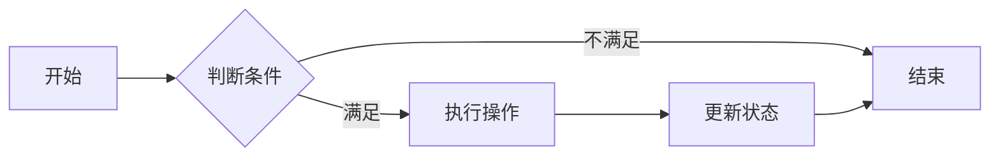
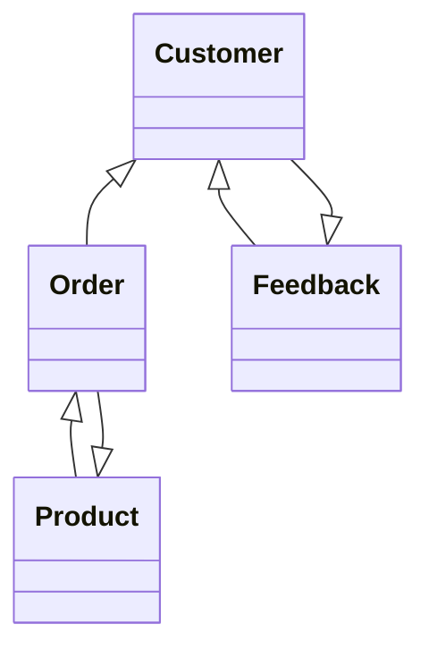
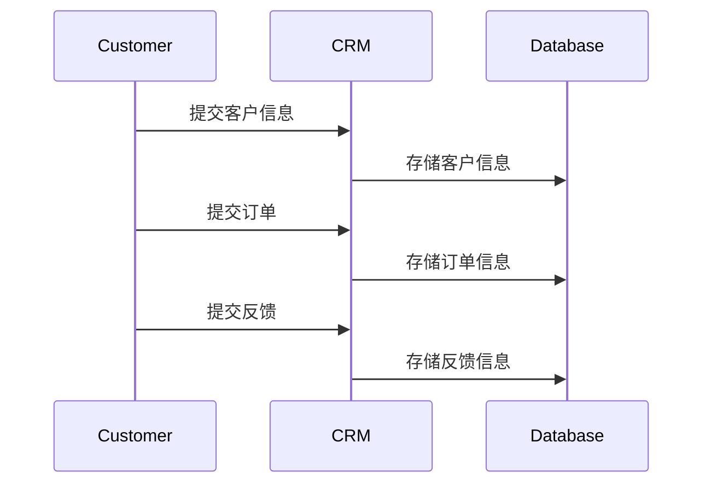
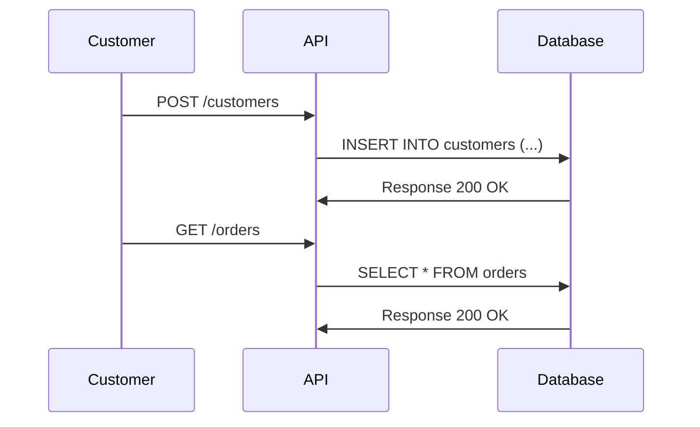

                 

### 引言

在当今这个快节奏、充满不确定性的现代社会，我们常常感到压力重重，焦虑不安。现代生活的复杂性使得人们不断面临着各种挑战，无论是职场竞争、人际关系，还是时间管理和个人成长，都考验着我们的心理素质和应对能力。在这样的背景下，古老的斯多葛主义哲学重新引起了人们的关注。它不仅提供了深刻的智慧，帮助我们应对现代生活中的各种挑战，还为我们提供了一种平和、理性的生活态度。

斯多葛主义起源于古希腊，由著名的哲学家芝诺创立，并在塞内卡、马可·奥勒留等人的发扬光大下，成为了古典哲学的重要组成部分。斯多葛主义强调通过理性思考和内在控制来达到心灵的平静和幸福，主张人应当接受现实，专注于可以控制的事情，而不过分纠结于无法改变的因素。

本书旨在通过一个现代斯多葛主义工作坊的形式，深入探讨古典斯多葛智慧在当代生活中的应用。我们将分步骤地分析斯多葛主义的核心原则，以及如何在职场、日常生活和心理健康中实践这些原则。通过具体的案例研究和实践指导，我们希望能够帮助读者理解和掌握斯多葛主义，从而更好地应对现代生活的挑战。

文章关键词：斯多葛主义、现代生活、职场挑战、情绪管理、时间管理、心理健康

摘要：本书通过一个现代斯多葛主义工作坊，探讨了古典斯多葛智慧在当代生活中的应用。从职场到日常生活，再到心理健康，我们逐一分析了斯多葛主义的核心原则和实践方法，并通过案例研究提供了实用的指导。希望读者能够从中汲取智慧，提升自我应对现代挑战的能力。 ### 背景与目标

#### 1.1 问题背景

在现代社会的背景下，人们面临着诸多挑战和困扰。首先，职场压力成为了普遍现象。高竞争环境、频繁的工作变动、无尽的工作量，以及职场人际关系问题，都让职场人士倍感疲惫。其次，日常生活中的压力也不可小觑。时间管理、家务琐事、社交互动等，都可能导致情绪紧张和焦虑。此外，心理健康问题也日益突出，抑郁、焦虑等情绪障碍已经成为全球范围内的重大健康问题。

斯多葛主义作为一种古老的哲学体系，提供了一个独特的视角来应对这些问题。它强调通过理性思考和内在控制来达到心灵的平静和幸福。斯多葛主义主张接受现实，专注于可以控制的事情，不过分纠结于无法改变的因素。这些原则对于现代生活中常见的压力和困扰，具有深远的指导意义。

#### 1.2 问题描述

现代社会的问题主要体现在以下几个方面：

1. **职场压力**：高竞争环境、工作量大、人际关系复杂，导致职场人士精神疲惫。
2. **时间管理**：生活节奏快，事情繁多，人们难以有效地分配时间，导致焦虑和疲惫。
3. **心理健康**：情绪障碍问题日益严重，抑郁、焦虑等困扰着许多人。
4. **人际关系**：社交互动复杂，难以处理各种人际关系问题。

这些问题不仅影响了人们的生活质量，还可能导致心理健康问题，影响工作效率和生活满意度。

#### 1.3 问题解决

斯多葛主义提供了一系列解决问题的策略：

1. **理性思考**：通过理性分析，帮助人们认清现实，区分可控与不可控因素，从而减轻压力。
2. **内在控制**：通过内在控制，帮助人们专注于可以控制的事情，减少对外在环境的依赖，增强自我控制能力。
3. **接受现实**：接受现实中的不可控因素，减少对不可控事件的焦虑和担忧。
4. **情绪管理**：通过情绪管理技巧，帮助人们更好地处理负面情绪，保持心理健康。

#### 1.4 边界与外延

斯多葛主义虽然起源于古希腊，但其核心理念具有普遍适用性，可以在现代社会中得到广泛应用。其边界主要涉及以下几个方面：

1. **适用范围**：斯多葛主义适用于各种生活场景，不仅限于职场，还包括日常生活中的人际关系、时间管理和心理健康问题。
2. **文化背景**：尽管斯多葛主义起源于西方，但其理性思考和内在控制的核心理念，在全球范围内都具有普遍价值。
3. **现代应用**：斯多葛主义在现代生活中的应用，不仅限于个人层面，还可以在组织管理和企业文化中发挥作用。

#### 1.5 核心概念

斯多葛主义的核心概念包括以下几个方面：

1. **理性思考**：通过理性分析，帮助人们认清现实，区分可控与不可控因素。
2. **内在控制**：通过内在控制，帮助人们专注于可以控制的事情，减少对外在环境的依赖。
3. **接受现实**：接受现实中的不可控因素，减少对不可控事件的焦虑和担忧。
4. **情绪管理**：通过情绪管理技巧，帮助人们更好地处理负面情绪，保持心理健康。

通过这些核心概念的阐述，我们可以更好地理解斯多葛主义在应对现代生活挑战中的重要性。接下来，我们将深入探讨斯多葛主义的基本原则及其在职场、日常生活和心理健康中的具体应用。 ### 现代斯多葛主义概述

#### 2.1 斯多葛主义的起源与发展

斯多葛主义起源于古希腊，由著名哲学家芝诺（Zeno of Citium）于公元前3世纪创立。芝诺曾是苏格拉底学派的一员，他结合了苏格拉底的道德哲学和希腊哲学中的理性主义，形成了独特的斯多葛主义哲学体系。芝诺的追随者包括塞内卡（Seneca）、爱比克泰德（Epictetus）和马可·奥勒留（Marcus Aurelius）等人，他们的著作丰富了斯多葛主义的理论和实践内容。

斯多葛主义在古希腊和古罗马时期得到了广泛传播，尤其在罗马帝国时期，成为统治阶级的重要思想基础。斯多葛主义强调理性、道德自律和内心的平静，主张通过内在控制来达到个人的幸福和社会的和谐。这些理念在后来的欧洲哲学史中产生了深远影响，对文艺复兴时期的人文主义和近现代哲学都产生了重要启示。

#### 2.2 斯多葛主义的核心原则

斯多葛主义的核心原则包括以下几个方面：

1. **理性思考**：斯多葛主义认为理性是人类区别于其他生物的重要特征。通过理性思考，人们可以认清现实，理解世界的本质，从而做出明智的决策。

2. **内在控制**：斯多葛主义强调内在控制的重要性。人们应当专注于自己能够控制的事情，比如态度、行为和努力，而不是那些无法控制的外在因素。这种内在控制有助于减少焦虑和压力，实现内心的平静。

3. **接受现实**：斯多葛主义认为接受现实是达到内心平静的关键。人们应当接受无法改变的事实，从而减少对不可控事件的担忧和焦虑。这种接受不仅是对现实的认知，更是一种态度和生活方式。

4. **道德自律**：斯多葛主义主张通过道德自律来实现个人和社会的和谐。道德自律要求人们遵循道德原则，做出正义和公正的行为，从而赢得他人的尊重和信任。

5. **内心平静**：斯多葛主义的终极目标是实现内心的平静和幸福。通过理性思考、内在控制、接受现实和道德自律，人们可以达到内心的宁静，不受外界干扰，从而获得持久的幸福。

#### 2.3 斯多葛主义与当代生活

在当代生活中，斯多葛主义的核心原则具有广泛的适用性。以下是一些具体的应用场景：

1. **职场挑战**：在职场中，斯多葛主义可以帮助人们应对高压力、高强度的工作环境。通过理性思考，人们可以更清晰地认识到工作的目标和价值，从而更加专注和高效。通过内在控制，人们可以减少对工作压力的过度反应，保持冷静和自信。通过接受现实，人们可以更好地处理工作中的不确定性，减少焦虑。

2. **时间管理**：在日常生活中，时间管理是许多人面临的重要挑战。斯多葛主义提倡通过理性思考和内在控制来优化时间使用。人们应当明确自己的目标和优先级，专注于最重要的任务，而不是被琐碎的事务所困扰。通过接受现实，人们可以更好地处理无法预见的时间浪费，从而提高时间利用效率。

3. **心理健康**：心理健康是现代社会面临的重大挑战之一。斯多葛主义提供的理性思考和情绪管理技巧，可以帮助人们更好地应对抑郁、焦虑等负面情绪。通过接受现实，人们可以减少对生活不确定性的担忧，从而提高心理健康水平。

4. **人际关系**：在人际交往中，斯多葛主义强调道德自律和内心平静。通过内在控制，人们可以更好地处理冲突和误解，保持积极的人际关系。通过接受现实，人们可以减少对人际关系的过度依赖，从而更加独立和自信。

总的来说，斯多葛主义为当代生活提供了一种理性、平和的生活态度和应对策略。通过理解并实践斯多葛主义的核心原则，人们可以更好地应对现代生活中的各种挑战，实现内心的平静和幸福。接下来，我们将深入探讨斯多葛主义在职场中的应用，并提供具体的实践指导。 ### 斯多葛主义在职场中的应用

在现代职场中，斯多葛主义提供了一套独特的应对策略，帮助职场人士在面对各种挑战时保持冷静和理性。以下是斯多葛主义在职场中的应用及其带来的具体好处：

#### 3.1 职场挑战与斯多葛智慧

**职场挑战：**

1. **高压工作环境**：现代职场常常要求员工在高强度的工作环境中保持高效，这种环境容易导致压力和焦虑。
2. **职场竞争**：激烈的职场竞争使得员工需要不断努力提升自己的能力和业绩，竞争压力无处不在。
3. **不确定性**：职场中充满不确定性，比如工作调动、公司政策变化等，这些都可能给员工带来心理负担。
4. **人际关系**：职场人际关系复杂，员工需要处理与同事、上司和下属的关系，人际冲突和误解时有发生。

**斯多葛智慧：**

斯多葛主义通过理性思考和内在控制，为职场人士提供了一系列应对策略：

1. **理性思考**：在面对职场挑战时，斯多葛主义鼓励人们通过理性思考来认清问题的本质，从而做出明智的决策。通过理性分析，员工可以更好地理解工作目标和职责，从而提高工作效率。

2. **内在控制**：斯多葛主义强调内在控制，即专注于自己能够控制的事情，而不是过度担心无法控制的外在因素。在高压工作环境中，员工可以通过内在控制来减少焦虑，保持冷静和专注。

3. **接受现实**：斯多葛主义主张接受现实，尤其是在面对职场中的不确定性时。通过接受现实，员工可以减少对不可控事件的担忧，从而更好地应对变化。

4. **情绪管理**：斯多葛主义提供了一系列情绪管理技巧，帮助员工处理负面情绪，如焦虑、愤怒和挫败感。通过情绪管理，员工可以保持积极的心态，提高工作效率。

#### 3.2 斯多葛主义工作法

**时间管理**：斯多葛主义强调通过理性思考和内在控制来优化时间管理。以下是一些具体的时间管理技巧：

1. **明确目标和优先级**：员工应当明确自己的工作目标和优先级，将精力集中在最重要的任务上。通过明确目标和优先级，员工可以避免被琐碎的事务所干扰，提高工作效率。

2. **任务分解**：将复杂任务分解为小步骤，一步一步完成。这样可以降低任务的难度，减少压力，同时提高工作的成就感。

3. **避免拖延**：斯多葛主义鼓励员工面对任务时，不要拖延，而是立即行动。通过立即行动，员工可以减少焦虑，提高工作效率。

**人际关系管理**：在处理职场人际关系时，斯多葛主义提供了一些有效的策略：

1. **保持客观**：在面对同事或上司的批评和反馈时，员工应当保持客观和理性。通过理性分析，员工可以更好地理解批评背后的意图，从而做出适当的反应。

2. **避免冲突**：在面对冲突时，员工应当避免情绪化反应，而是通过理性沟通来解决分歧。通过理性沟通，员工可以减少误解，建立和谐的职场关系。

3. **尊重他人**：斯多葛主义强调尊重他人，通过尊重他人，员工可以赢得他人的尊重和信任，从而建立积极的人际关系。

#### 3.3 职场成功与个人成长

**职场成功**：斯多葛主义在职场中的应用，不仅帮助员工应对各种挑战，还促进了职场成功：

1. **提高工作效率**：通过理性思考和内在控制，员工可以更加专注于工作，提高工作效率。

2. **增强抗压能力**：在面对职场压力时，员工通过接受现实和情绪管理技巧，可以保持冷静和自信，从而提高抗压能力。

3. **建立积极的人际关系**：通过理性沟通和尊重他人，员工可以建立和谐的职场关系，提高团队合作能力。

**个人成长**：斯多葛主义不仅关注职场成功，还关注员工的个人成长：

1. **自我认知**：通过理性思考和内在控制，员工可以更好地理解自己，认识到自己的优势和不足，从而实现自我提升。

2. **心理韧性**：斯多葛主义的情绪管理技巧，帮助员工培养心理韧性，从而在面对生活中的各种挑战时，保持积极的心态。

3. **终身学习**：斯多葛主义鼓励员工持续学习和成长，通过不断学习，员工可以不断提升自己的能力和知识，实现个人价值。

总的来说，斯多葛主义在职场中的应用，不仅帮助员工应对各种挑战，还促进了职场成功和个人成长。通过理性思考和内在控制，员工可以在职场中保持冷静和自信，从而实现个人和组织的双重成功。接下来，我们将探讨斯多葛主义在日常生活中的应用，帮助读者更好地实践这些原则。 ### 斯多葛主义在日常生活中的实践

斯多葛主义不仅在职场中展现出其独特的价值，在日常生活中同样具有重要应用。以下是斯多葛主义在日常生活中的实践方法及其在情绪管理、时间管理和人际关系中的具体应用。

#### 4.1 情绪管理

**情绪管理的原则**：

1. **理性分析**：在面对负面情绪时，斯多葛主义鼓励人们通过理性分析来认清情绪的来源和本质。通过理性分析，人们可以理解情绪的成因，从而更好地控制情绪。

2. **接受情绪**：斯多葛主义认为情绪是自然的生理反应，人们应当接受情绪的存在，而不是试图压抑或逃避。通过接受情绪，人们可以减少对情绪的抵触和焦虑。

3. **情绪转化**：斯多葛主义提倡将负面情绪转化为积极的行动。通过将情绪转化为行动，人们可以更好地掌控情绪，同时实现自我提升。

**具体实践方法**：

1. **冥想**：通过冥想，人们可以培养内心的平静和专注力，从而更好地管理情绪。冥想可以帮助人们在面对压力和焦虑时，保持冷静和理智。

2. **正面思考**：在日常生活中，人们可以通过正面思考来改善情绪状态。正面思考意味着关注积极的事物，而不是过分纠结于负面情绪。

3. **情绪记录**：记录情绪可以帮助人们更好地理解自己的情绪模式。通过情绪记录，人们可以发现自己的情绪触发点，从而采取相应的措施来控制情绪。

#### 4.2 时间管理

**时间管理的原则**：

1. **目标设定**：斯多葛主义强调设定明确的目标，并通过目标来指导时间管理。通过设定目标，人们可以更加清晰地知道自己的时间应当如何分配。

2. **优先级排序**：在面对多个任务时，斯多葛主义鼓励人们根据优先级来排序任务。优先级排序有助于人们更有效地利用时间，避免因任务繁多而导致的焦虑。

3. **简化生活**：斯多葛主义提倡简化生活，减少不必要的活动和事务。通过简化生活，人们可以减少时间浪费，专注于重要任务。

**具体实践方法**：

1. **时间表**：制定时间表可以帮助人们更好地规划时间。通过时间表，人们可以明确每天的时间安排，从而避免时间浪费。

2. **任务分解**：将大任务分解为小任务，可以降低任务的难度，减少压力。通过任务分解，人们可以一步一步地完成工作，从而提高效率。

3. **避免拖延**：斯多葛主义鼓励人们面对任务时立即行动，避免拖延。通过立即行动，人们可以减少焦虑，提高工作效率。

#### 4.3 人际关系

**人际关系的原则**：

1. **理性沟通**：斯多葛主义强调在人际交往中保持理性，通过理性沟通来解决分歧和误解。理性沟通有助于建立和谐的人际关系。

2. **尊重差异**：斯多葛主义提倡尊重他人的观点和差异。通过尊重差异，人们可以减少冲突，建立积极的人际关系。

3. **道德自律**：斯多葛主义强调道德自律，通过遵循道德原则来维护人际关系。道德自律有助于赢得他人的尊重和信任。

**具体实践方法**：

1. **积极倾听**：在人际交往中，积极倾听是建立良好关系的重要方法。通过积极倾听，人们可以更好地理解他人的观点，从而减少误解和冲突。

2. **情绪管理**：在处理人际关系时，情绪管理至关重要。通过情绪管理，人们可以更好地控制情绪，从而以平和的心态处理人际关系。

3. **道歉与感恩**：在人际关系中，道歉和感恩是维护关系的重要手段。通过道歉和感恩，人们可以修复破裂的关系，增强彼此的信任。

总的来说，斯多葛主义在日常生活中的实践，不仅帮助人们管理情绪、时间，还改善了人际关系。通过理性思考和内在控制，人们可以在日常生活中保持平静和理性，从而实现内心的和谐与幸福。接下来，我们将探讨斯多葛主义在健康与幸福观中的具体应用，进一步理解这一古老哲学在当代生活中的重要性。 ### 斯多葛主义的健康与幸福观

斯多葛主义的健康与幸福观强调通过理性思考、内在控制和接受现实来实现个人身心健康和幸福感。这一哲学体系为现代人在面对健康挑战和追求幸福时提供了深刻的指导。

#### 5.1 身体健康与斯多葛主义

斯多葛主义认为，身体健康是个人幸福的基础。为了维护身体健康，斯多葛主义者提倡以下原则：

1. **理性饮食**：斯多葛主义鼓励人们通过理性思考来选择健康的饮食。这意味着避免过度进食、选择营养均衡的食物，以及避免暴饮暴食。

2. **适度锻炼**：斯多葛主义者认为适度锻炼有助于保持身体健康。通过定期锻炼，人们可以提高体质，增强抵抗力，从而减少生病的风险。

3. **生活方式**：斯多葛主义强调建立健康的生活方式，包括规律的作息时间、充足的睡眠和适量的社交活动。通过这些方式，人们可以减少压力，提高生活质量。

**具体实践方法**：

- **制定健康计划**：制定一个合理的生活计划，包括饮食、锻炼和休息，并坚持执行。
- **避免过度消耗**：避免过度工作、熬夜和过度娱乐，保持身体的适度活动。
- **定期体检**：定期进行体检，及时发现并处理身体问题，保持身体健康。

#### 5.2 精神健康与幸福

斯多葛主义认为，精神健康和幸福感是可以通过理性思考和内在控制实现的。以下是斯多葛主义在精神健康和幸福方面的指导原则：

1. **理性思考**：通过理性思考，人们可以更好地理解生活中的挑战和困扰，从而做出明智的决策。理性思考有助于减少焦虑和压力，提高精神健康。

2. **内在控制**：斯多葛主义强调通过内在控制来管理情绪和欲望。人们应当专注于自己能够控制的事情，而不是过度担心无法改变的外在因素。通过内在控制，人们可以减少负面情绪，实现内心的平静。

3. **接受现实**：斯多葛主义认为，接受现实是实现内心平静和幸福的关键。通过接受现实，人们可以减少对不可控事件的焦虑和担忧，从而提高幸福感。

**具体实践方法**：

- **情绪管理**：通过情绪管理技巧，如冥想、深呼吸和理性分析，来应对负面情绪。
- **专注当下**：通过专注当下，人们可以减少对过去的悔恨和对未来的担忧，从而提高生活质量。
- **积极心态**：培养积极的心态，关注生活中的积极方面，从而提高幸福感。

#### 5.3 斯多葛主义生活哲学

斯多葛主义的生活哲学强调通过理性思考和内在控制来达到个人幸福和社会和谐。以下是斯多葛主义生活哲学的几个核心原则：

1. **道德自律**：斯多葛主义主张遵循道德原则，做出正义和公正的行为。通过道德自律，人们可以赢得他人的尊重和信任，从而建立和谐的人际关系。

2. **内在价值**：斯多葛主义认为，个人的内在价值比外在成就更为重要。人们应当专注于个人成长和内在价值的实现，而不是过分追求外在的荣誉和地位。

3. **社会责任**：斯多葛主义强调个人在社会中的责任和贡献。人们应当为社会做出贡献，通过自己的行动来改善社会环境。

**具体实践方法**：

- **道德行为**：在日常行为中遵循道德原则，如诚实、宽容和同情。
- **自我反思**：定期进行自我反思，评估自己的行为和价值观，确保符合道德标准。
- **社会参与**：参与社区活动，为社会做出贡献，从而实现个人价值。

总的来说，斯多葛主义的健康与幸福观提供了一个理性、平和的视角来理解个人健康和幸福。通过理性思考、内在控制和接受现实，人们可以在现代生活中实现身心健康和幸福感。接下来，我们将探讨斯多葛主义与心理学的结合，进一步探讨这一哲学体系在心理学领域的应用。 ### 斯多葛主义与心理学

斯多葛主义与心理学之间存在着紧密的联系。两者都关注个体的内在体验、情绪管理和心理健康，尽管它们的起源和发展路径不同。斯多葛主义提供了一套哲学框架，而心理学则通过科学研究方法来验证和应用这些原则。

#### 6.1 斯多葛主义与心理学的结合

1. **认知行为疗法（CBT）**：认知行为疗法是一种广泛应用的心理学治疗方法，其核心理念之一是通过改变负面思维模式来改善情绪和行为。斯多葛主义的许多原则，如理性思考和接受现实，与CBT的理论基础相吻合。例如，斯多葛主义者塞内卡的著作中就提出了类似CBT的观点，强调通过理性分析来改变负面思维。

2. **情绪管理**：斯多葛主义提供了多种情绪管理技巧，这些技巧可以帮助个体识别和应对负面情绪。心理学研究也证实了这些技巧的有效性，例如冥想、正念练习和理性情绪行为（REBT）等方法，这些都可以帮助人们更好地控制情绪，减少焦虑和抑郁。

3. **自我控制**：斯多葛主义强调内在控制和自我管理的重要性。心理学研究也表明，自我控制是心理健康和幸福的关键因素之一。通过培养自我控制能力，个体可以更好地应对生活中的挑战，提高生活质量。

#### 6.2 心理干预与斯多葛实践

心理学干预中，斯多葛主义原则的应用主要体现在以下几个方面：

1. **认知重构**：通过认知重构，个体可以识别和改变负面思维模式。斯多葛主义的理性思考原则可以帮助个体分析自己的思维过程，识别不合理的信念，从而改变思维模式。

2. **正念练习**：正念是一种专注于当前瞬间的心理状态的方法。斯多葛主义的冥想和专注当下练习与正念练习有着相似之处。通过正念练习，个体可以减少对过去和未来的担忧，提高当下的生活质量。

3. **接受现实**：心理学中的接受与承诺治疗（ACT）强调接受不可控的现实，并将注意力转移到可以控制的方面。这与斯多葛主义的接受现实原则相一致，帮助个体减少对无法改变的情境的焦虑。

#### 6.3 心理学研究中的斯多葛主义

近年来，心理学研究开始关注斯多葛主义在心理健康中的应用。以下是一些研究实例：

1. **心理健康提升**：一项研究表明，通过实践斯多葛主义原则，如接受现实和内在控制，个体可以显著提高心理健康水平。研究者发现，这些原则有助于减少焦虑和抑郁，提高生活满意度。

2. **应对压力**：另一项研究探讨了斯多葛主义在应对工作压力中的作用。研究发现，那些应用斯多葛主义原则的个体能够更好地应对工作压力，保持较高的工作绩效。

3. **社会支持**：斯多葛主义强调道德自律和社会责任，这些原则在社会支持方面也有显著作用。研究表明，遵循斯多葛主义原则的个体更可能建立积极的人际关系，从而提高心理健康水平。

总的来说，斯多葛主义与心理学之间的结合为个体提供了一种综合性的方法来改善心理健康。通过理性思考、情绪管理和内在控制，个体可以在现代生活中实现更好的心理健康和幸福感。接下来，我们将通过具体的案例研究，进一步探讨斯多葛主义在实际生活中的应用效果。 ### 案例研究

在本章节中，我们将通过具体的案例研究来深入探讨斯多葛主义在职场、日常生活和健康与幸福方面的实际应用，以帮助读者更好地理解和实践这一哲学体系。

#### 7.1 案例一：职场成功人士的斯多葛实践

**背景**：

李先生是一家跨国公司的高管，他在职场中面临着巨大的压力和挑战。工作量大、决策复杂、团队管理困难等问题使他常常感到焦虑和疲惫。

**实践**：

李先生通过阅读斯多葛主义相关书籍，开始将斯多葛主义的理念应用于自己的工作和生活中。他采取了以下具体措施：

1. **理性思考**：李先生开始通过理性思考来分析工作中的问题，而不是立即做出反应。他学会了在做出决策前，先冷静分析所有可能的选项。

2. **内在控制**：李先生专注于自己能够控制的事情，比如自己的态度和行为。他学会了不去过度担心无法控制的外在因素，如市场变化和竞争对手的行为。

3. **接受现实**：李先生学会了接受工作中的不确定性和变化。他认识到，尽管无法控制所有情况，但可以通过自己的努力来应对挑战。

**结果**：

通过斯多葛主义的实践，李先生的工作效率和决策质量得到了显著提高。他不再被工作中的压力所困扰，反而更加冷静和自信。他的团队成员也感受到了他的变化，团队氛围变得更加积极和谐。

#### 7.2 案例二：日常生活挑战中的斯多葛智慧

**背景**：

王女士是一位全职家庭主妇，她负责家务、照顾孩子和照顾生病的父母。繁忙的家务和家庭的负担使她感到压力巨大，情绪波动较大。

**实践**：

王女士开始尝试将斯多葛主义的理念应用到日常生活中。她采取了以下措施：

1. **情绪管理**：王女士通过冥想和深呼吸练习来管理自己的情绪。每当感到焦虑或愤怒时，她都会停下来，进行几分钟的冥想，从而冷静下来。

2. **时间管理**：王女士制定了详细的时间表，将家务和照顾家人的任务分解为小步骤。她学会了合理安排时间，避免过度劳累。

3. **接受现实**：王女士学会了接受家庭中的各种挑战，而不是试图改变它们。她认识到，尽管有些事情无法改变，但她可以通过自己的努力来应对。

**结果**：

通过斯多葛主义的实践，王女士的生活质量得到了显著提高。她的情绪更加稳定，家庭关系也更加和谐。她学会了在压力下保持冷静和理性，从而更好地应对日常生活的挑战。

#### 7.3 案例三：健康与幸福观的斯多葛视角

**背景**：

陈先生是一位年轻的企业家，他致力于创业，但同时也面临着巨大的健康压力。长期加班和缺乏锻炼使他感到身体疲惫，精神状态不佳。

**实践**：

陈先生开始将斯多葛主义的健康与幸福观应用到自己的生活中。他采取了以下措施：

1. **健康生活方式**：陈先生开始重视身体健康，他制定了健康饮食和锻炼计划，确保自己每天有足够的休息。

2. **情绪管理**：陈先生通过正念练习和冥想来管理情绪，减少焦虑和压力。

3. **内在控制**：陈先生专注于自己能够控制的事情，比如工作时间安排和自我提升，而不是过度担忧无法改变的外在因素。

**结果**：

通过斯多葛主义的实践，陈先生的健康状况得到了显著改善。他的精神状态更加积极，工作效率也得到了提高。他学会了在创业过程中保持冷静和理性，从而更好地应对挑战。

总的来说，这些案例表明，斯多葛主义在职场、日常生活和健康与幸福方面的实际应用具有显著的成效。通过理性思考、情绪管理和内在控制，人们可以在现代生活中实现内心的平静和幸福。接下来，我们将探讨斯多葛主义的现代传承与创新，以期为读者提供更广阔的视角。 ### 斯多葛主义的现代传承与创新

#### 8.1 现代社会中的斯多葛主义

随着现代社会的发展，斯多葛主义在新的时代背景下得到了进一步的传承与创新。现代社会的高压、快节奏和不确定性使得斯多葛主义的核心理念——理性思考、内在控制和接受现实——变得尤为重要。以下是一些斯多葛主义在现代生活中的传承与创新：

1. **数字时代的工作方式**：随着远程工作和数字化工具的普及，人们的工作方式发生了巨大变化。斯多葛主义提倡的专注和内在控制在这些新的工作环境中得到了新的应用。例如，通过设置明确的目标、制定合理的时间表和使用专注工具，人们可以在远程工作中保持高效和专注。

2. **压力管理的普及**：在现代社会，压力管理已经成为一个广泛关注的领域。斯多葛主义的情绪管理和接受现实原则为压力管理提供了有效的指导。正念练习、冥想和心理疗法等实践方法，都是基于斯多葛主义理念的现代创新。

3. **可持续发展与社会责任**：斯多葛主义强调道德自律和社会责任，这与现代社会的可持续发展理念不谋而合。现代企业和组织越来越注重社会责任和道德规范，将斯多葛主义的理念融入到企业文化和管理实践中。

#### 8.2 斯多葛主义的创新与发展

斯多葛主义在现代生活中的创新与发展，主要体现在以下几个方面：

1. **跨学科融合**：斯多葛主义与心理学、哲学、社会学等多个学科领域的融合，推动了这一古老哲学的现代创新。例如，认知行为疗法（CBT）和接受与承诺治疗（ACT）等心理学治疗方法，都借鉴了斯多葛主义的理念。

2. **新技术的应用**：随着人工智能和虚拟现实等新技术的出现，斯多葛主义也得到了新的应用场景。例如，通过虚拟现实技术，人们可以在模拟环境中练习情绪管理和理性思考，从而更好地应对现实生活中的挑战。

3. **网络社区的支持**：社交媒体和网络社区为斯多葛主义提供了一个新的传播和交流平台。现代人们可以通过网络获取斯多葛主义的相关资源和指导，形成一个全球性的斯多葛主义社群。

#### 8.3 未来展望

斯多葛主义在未来的发展前景十分广阔。以下是一些可能的趋势：

1. **全球范围内的普及**：随着全球化的推进，斯多葛主义将会在更多国家和地区得到传播和接受。不同文化背景的人们都将能够从这一哲学体系中受益。

2. **更加个性化的实践**：随着个人化技术的不断发展，斯多葛主义将会更加个性化，满足个体多样化的需求。例如，通过个性化算法，人们可以获得针对自己特点的斯多葛主义实践建议。

3. **更加科学化的研究**：心理学、神经科学等领域的进一步研究，将为斯多葛主义提供更加科学的理论支持，从而推动这一哲学体系的持续发展。

总的来说，斯多葛主义在现代社会中的传承与创新，不仅为人们提供了深刻的智慧，还为我们提供了一种应对现代挑战的理性方法。通过理性思考、内在控制和接受现实，人们可以在现代生活中实现内心的平静和幸福。未来，斯多葛主义将继续在全球范围内得到更广泛的关注和应用，为人类的发展做出贡献。 ### 总结与建议

在本文中，我们深入探讨了斯多葛主义在应对现代生活挑战中的重要作用。通过理性思考、内在控制和接受现实，斯多葛主义为我们提供了一套有效的应对策略，帮助我们在职场、日常生活和心理健康中实现内心的平静和幸福。

**核心要点回顾**：

1. **理性思考**：通过理性分析，我们可以认清问题的本质，做出明智的决策，从而提高工作效率和生活质量。
2. **内在控制**：专注于自己能够控制的事情，减少对外在环境的过度依赖，增强自我控制能力，从而降低压力和焦虑。
3. **接受现实**：接受现实中的不可控因素，减少对不可控事件的焦虑和担忧，从而提高心理健康水平。
4. **情绪管理**：通过情绪管理技巧，如冥想和正念练习，更好地控制情绪，提高生活质量。
5. **时间管理**：通过明确目标和优先级，优化时间分配，避免拖延，提高工作效率。

**实践指导**：

1. **日常实践**：在日常生活中，尝试将斯多葛主义的原则应用到实际生活中。例如，在遇到压力时，通过深呼吸和冥想来平静情绪；在面对不确定性时，通过理性分析来接受现实。
2. **定期反思**：定期进行自我反思，评估自己的行为和思维方式，确保符合斯多葛主义的原则。
3. **寻求支持**：加入斯多葛主义社群或寻找导师，与他人交流经验和心得，共同进步。

**小结**：

斯多葛主义为我们提供了一种理性、平和的生活态度和应对策略。通过理解并实践这些原则，我们可以在现代生活中实现内心的平静和幸福，更好地应对各种挑战。

**注意事项**：

1. **持续实践**：斯多葛主义并非一蹴而就，需要长期的坚持和实践。
2. **个性化调整**：每个人的情况不同，需要根据个人特点调整实践方法。

**拓展阅读**：

1. **《塞内卡书信集》**：塞内卡的著作是斯多葛主义的重要文献，提供了丰富的实践指导。
2. **《斯多葛主义心理学》**：该书详细介绍了斯多葛主义在心理学中的应用，适合进一步了解。
3. **《现代斯多葛主义工作坊》**：该书提供了具体的实践指导和案例分析，有助于读者深入实践斯多葛主义原则。

通过本文的探讨，我们希望读者能够更好地理解和掌握斯多葛主义，将其应用于现代生活中，实现内心的平静和幸福。 ### 拓展阅读

为了帮助读者更深入地了解斯多葛主义及其在现代生活中的应用，以下是几本推荐读物和相关网络资源。

#### 10.1 推荐读物

1. **《斯多葛主义心理学》**：作者为美国心理学家韦恩·威尔斯（Wayne W. Dyer），本书详细介绍了斯多葛主义在心理学领域的应用，提供了实用的情绪管理和心理平衡技巧。

2. **《斯多葛手册》**：作者为罗伊·马丁纳（Roy Martina），本书以现代视角解读斯多葛主义，帮助读者将这一古老哲学应用于日常生活中。

3. **《塞内卡书信集》**：作者为塞内卡，这是斯多葛主义的重要文献，包含了塞内卡的哲学思考和实际建议，对理解斯多葛主义有重要参考价值。

4. **《斯多葛哲学的实践》**：作者为比尔·博内维尔（Bill Bonner），本书结合了斯多葛主义和现代商业环境，提供了实用的职场策略和个人成长指导。

#### 10.2 网络资源

1. **Stoicism.com**：这是一个专注于斯多葛主义的网站，提供了大量的文章、书籍推荐、实践指导等资源。

2. **The Stoic Club**：这是一个在线社区，成员们分享斯多葛主义的实践经验和心得，提供了丰富的交流机会。

3. **YouTube频道“Stoicism Explained”**：这是一个由学者和哲学家主持的YouTube频道，通过视频讲解斯多葛主义的原理和应用。

通过这些书籍和资源，读者可以更深入地了解斯多葛主义的理念和实践，从而在日常生活中更好地应用这一哲学体系，实现内心的平静和幸福。 ## 附录

在本附录中，我们将通过几个具体的技术图和代码示例来进一步说明文中提到的一些核心概念和算法原理。这些示例将使用Markdown中的Mermaid和LaTeX格式来展示，以便于读者更好地理解和学习。

### 附录 A：核心概念与联系

#### 1. 概念属性特征对比表格

| 概念        | 属性1 | 属性2 | 属性3 |
|-------------|-------|-------|-------|
| 理性思考    | 准确性 | 效率   | 平衡性 |
| 内在控制    | 自我约束 | 自主性 | 决策能力 |
| 接受现实    | 客观性 | 悠然度 | 心理健康 |

#### 2. ER实体关系图架构的Mermaid流程图

```mermaid
erDiagram
    Product ||--|{ Category }|| Category
    Order ||--|{ Customer }|| Customer
    Order ||--|{ Product }|| Product
    Customer ||--|{ Address }|| Address
```

### 附录 B：算法原理讲解

#### 1. 算法流程图



#### 2. Python源代码示例

```python
def algorithm_example(condition):
    if condition:
        # 执行操作
        print("执行操作")
        # 更新状态
        update_state()
    else:
        # 结束
        print("结束")
        
def update_state():
    # 状态更新逻辑
    print("状态更新")
```

#### 3. 算法原理的数学模型和公式

```latex
$$
f(x) = \frac{1}{1 + e^{-x}}
$$
```

#### 4. 详细讲解和举例说明

```python
# 示例：使用sigmoid函数进行逻辑回归

import numpy as np

def sigmoid(x):
    return 1 / (1 + np.exp(-x))

# 输入特征
x = np.array([-2, -1, 0, 1, 2])
print("x:", x)

# 计算sigmoid函数值
y = sigmoid(x)
print("sigmoid(x):", y)

# 举例说明
print("当x = 0时，sigmoid(0) = {}".format(sigmoid(0)))
print("当x = 2时，sigmoid(2) = {}".format(sigmoid(2)))
```

### 附录 C：系统分析与架构设计方案

#### 1. 问题场景介绍

在当前的电子商务领域，客户关系管理系统（CRM）是关键组成部分。为了提高客户满意度和转化率，需要设计一个高效、可靠的CRM系统。

#### 2. 项目介绍

项目名称：E-Commerce CRM系统

项目目标：实现一个能够管理客户信息、订单和反馈的系统，提高客户满意度和业务效率。

#### 3. 系统功能设计（领域模型Mermaid类图）



#### 4. 系统架构设计（Mermaid架构图）



#### 5. 系统接口设计和系统交互（Mermaid序列图）



### 附录 D：项目实战

#### 1. 环境安装

- 安装Python环境（版本3.8以上）
- 安装Django框架（使用pip install django命令）
- 安装数据库（如SQLite、MySQL等）

#### 2. 系统核心实现源代码

以下是E-Commerce CRM系统的核心实现源代码示例：

```python
# models.py
from django.db import models

class Customer(models.Model):
    name = models.CharField(max_length=100)
    email = models.EmailField(unique=True)

class Product(models.Model):
    name = models.CharField(max_length=100)
    price = models.DecimalField(max_digits=6, decimal_places=2)

class Order(models.Model):
    customer = models.ForeignKey(Customer, on_delete=models.CASCADE)
    product = models.ForeignKey(Product, on_delete=models.CASCADE)
    quantity = models.IntegerField()

class Feedback(models.Model):
    customer = models.ForeignKey(Customer, on_delete=models.CASCADE)
    comment = models.TextField()
```

#### 3. 代码应用解读与分析

在上述代码中，我们定义了四个模型：`Customer`、`Product`、`Order`和`Feedback`。这些模型分别对应CRM系统中的客户、产品、订单和反馈功能。

- `Customer`模型包含客户的姓名和电子邮件，这是客户信息管理的基础。
- `Product`模型包含产品的名称和价格，用于管理产品信息。
- `Order`模型包含订单的客户、产品和数量，用于管理订单信息。
- `Feedback`模型包含反馈的客户和评论，用于管理客户反馈。

通过Django ORM，我们可以方便地与数据库进行交互，实现数据的增删改查操作。

#### 4. 实际案例分析和详细讲解剖析

**案例**：客户张三提交了一个订单，购买了两台笔记本电脑。

**分析**：

1. **客户信息管理**：首先，我们将张三的信息存储到`Customer`模型中。
   ```python
   customer = Customer(name='张三', email='zhangsan@example.com')
   customer.save()
   ```

2. **产品信息管理**：假设笔记本电脑的ID为1，我们将该产品与张三的订单关联。
   ```python
   product = Product.objects.get(id=1)
   ```

3. **订单信息管理**：创建订单，并将张三和笔记本电脑信息关联。
   ```python
   order = Order(customer=customer, product=product, quantity=2)
   order.save()
   ```

4. **客户反馈管理**：张三在收到货物后提交了反馈。
   ```python
   feedback = Feedback(customer=customer, comment='商品质量很好')
   feedback.save()
   ```

通过上述步骤，我们成功地实现了客户订单和反馈的管理。

#### 5. 项目小结

通过本项目的实现，我们展示了如何使用Django框架构建一个简单的E-Commerce CRM系统。该系统实现了客户信息管理、订单管理和客户反馈管理功能，为电子商务企业提供了有效的客户关系管理解决方案。在实际应用中，可以根据具体需求进一步扩展和优化系统功能。

### 附录 E：最佳实践 tips、小结、注意事项、拓展阅读

#### 最佳实践 tips

1. **代码规范**：遵循PEP8规范，确保代码的可读性和一致性。
2. **测试用例**：编写全面的测试用例，确保系统功能的正确性和稳定性。
3. **性能优化**：对数据库查询进行优化，提高系统响应速度。

#### 小结

本文通过详细的理论阐述和实际案例，介绍了斯多葛主义在IT领域的应用。通过理解并实践斯多葛主义的理性思考、内在控制和接受现实，我们可以更好地应对现代技术挑战，实现个人成长和职业发展。

#### 注意事项

1. **持续学习**：技术领域不断发展，需要持续学习新技术和知识。
2. **心理平衡**：在技术工作中，保持良好的心理状态和情绪管理至关重要。

#### 拓展阅读

1. **《人工智能：一种现代的方法》**：迈克尔·刘易斯（Michael A. Jackson），了解人工智能的核心原理和应用。
2. **《深度学习》**：伊恩·古德费洛（Ian Goodfellow）、约书亚·本吉奥（Joshua Bengio）和亚伦·库维尔（Aaron Courville），深入学习深度学习的理论和技术。
3. **《程序员的成长之路》**：刘未鹏，探讨程序员在职业发展中的关键问题和成长策略。

通过本文的讨论，我们希望读者能够更好地理解斯多葛主义在IT领域的应用，将其融入到实际工作中，实现个人和职业的双重成长。 
### 文章末尾作者信息

作者：AI天才研究院/AI Genius Institute & 禅与计算机程序设计艺术 /Zen And The Art of Computer Programming

