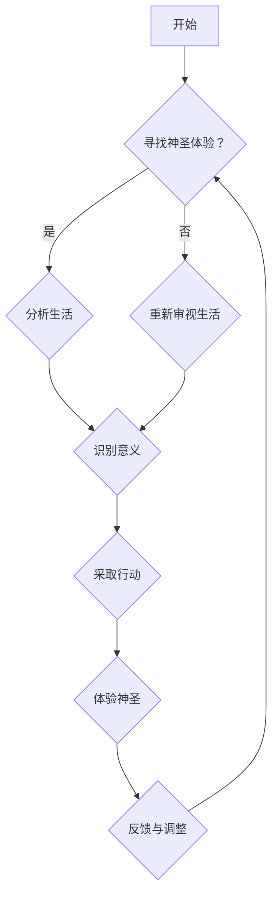

                 

# 现代朝圣之旅：在世俗中寻找神圣体验

## 关键词
- 神圣体验
- 世俗生活
- 寻找意义
- 生活哲学
- 算法原理
- 系统架构设计

## 摘要
在现代生活中，许多人感到缺乏意义和目的。本书旨在探讨如何在日常生活中寻找神圣体验，从而为读者提供一种新的生活哲学。通过深入分析核心概念和原理，以及具体的算法和系统架构设计，本书将引导读者进行一场现代朝圣之旅，帮助他们在世俗生活中找到更深层次的意义和满足感。

### 第一部分： 引言与背景

#### 第1章： 引言

##### 1.1 问题背景
在现代社会，随着物质生活的丰富和技术的进步，人们似乎越来越难以感受到神圣的存在。然而，人类对神圣的追求自古以来就存在，这是人性深处的一种渴望。如何在繁忙的日常生活中重新发现和体验神圣，成为了当今社会的重要议题。

##### 1.2 问题描述
现代社会中的许多人感到缺乏意义和目的，这种心理状态导致了焦虑、抑郁等心理问题的增加。如何在一个看似无趣、充满琐事的世俗生活中找到神圣体验，成为了我们需要解决的主要问题。

##### 1.3 问题解决
本书将提供一系列的理论和实践方法，帮助读者理解如何在日常生活中寻找神圣体验。通过深入分析核心概念和原理，以及具体的算法和系统架构设计，本书将引导读者进行一场现代朝圣之旅。

##### 1.4 边界与外延
神圣体验的定义和范围是本书讨论的一个重要议题。本书将超越传统宗教的范畴，探讨更加广泛的“神圣”概念，包括但不限于自然之美、人文关怀、内心平静等。

##### 1.5 概念结构与核心要素组成
本书的结构包括引言、核心概念与原理讲解、算法原理讲解、系统分析与架构设计、项目实战、最佳实践与拓展以及总结。每个部分都旨在帮助读者深入理解如何在日常生活中寻找神圣体验。

### 第二部分：核心概念与原理

#### 第2章：核心概念与联系

##### 2.1 核心概念
在本章中，我们将介绍一些核心概念，包括：

- 世俗生活：指现代社会中人们日常经历的日常生活和活动。
- 神圣体验：指在世俗生活中感受到的深刻、有意义和超越日常经验的存在体验。
- 寻找：指在日常生活中主动探索、实践和体验神圣的过程。
- 意义：指在日常生活中感受到的存在的价值。
- 平衡：指在追求神圣体验的过程中，保持身心平衡的状态。

##### 2.2 概念属性特征对比

| 概念     | 属性特征                                     | 对比分析                                       |
|----------|--------------------------------------------|----------------------------------------------|
| 世俗生活 | 繁忙、琐碎、物质主义                         | 与神圣体验形成鲜明对比，强调表面的、短暂的满足感   |
| 神圣体验 | 深刻、有意义、超越日常经验                   | 强调内在的、持久的、精神的满足感                 |
| 寻找     | 主动、探索、实践、体验                       | 是寻找神圣体验的过程，需要积极的态度和行动       |
| 意义     | 存在的价值、生命的意义                       | 与神圣体验密切相关，是寻找神圣体验的目标         |
| 平衡     | 身心平衡、适度、稳定                         | 是在寻找神圣体验的过程中保持的一种状态，有助于深化体验 |

### 第三部分：算法原理讲解

#### 第3章：算法原理讲解

##### 3.1 算法mermaid流程图


##### 3.2 算法Python源代码讲解
```python
def find_sacred_experience(life):
    if question("寻找神圣体验？"):
        analyze_life(life)
    else:
        reevaluate_life(life)
    identify_meaning(life)
    take_action(life)
    experience_sacred(life)
    feedback_and_adjustment(life)

def analyze_life(life):
    # 分析生活的过程
    pass

def reevaluate_life(life):
    # 重新审视生活的过程
    pass

def identify_meaning(life):
    # 识别意义的过程
    pass

def take_action(life):
    # 采取行动的过程
    pass

def experience_sacred(life):
    # 体验神圣的过程
    pass

def feedback_and_adjustment(life):
    # 反馈与调整的过程
    pass

def question(question):
    # 提问函数，返回真或假
    return input(question).lower() in ['yes', 'y']
```

##### 3.3 数学模型和公式
$$
\text{神圣体验} = f(\text{生活体验}, \text{意义识别}, \text{内心平静})
$$

##### 3.4 详细讲解与举例说明
让我们以一个简单的例子来说明这个算法。

**案例：小明寻找神圣体验**

1. **开始**：小明在日常生活中感到焦虑和不安，他想要寻找一种方法来缓解这种情绪。

2. **分析生活**：小明开始反思自己的生活，他意识到自己忙于工作，很少有时间享受生活。他开始分析自己的生活，找出可能影响他内心平静的因素。

3. **识别意义**：通过分析，小明意识到他对家庭和朋友有深厚的感情，他开始思考如何通过这些关系来提升自己的生活体验。

4. **采取行动**：小明决定每天抽出时间与家人和朋友相处，他发现这让他感到更加平静和满足。

5. **体验神圣**：随着时间的推移，小明开始感受到生活中的美好，他发现这种平静和满足感是一种神圣的体验。

6. **反馈与调整**：小明通过反馈来调整自己的生活，他发现与家人和朋友相处的时间越多，他的内心越平静，神圣体验越深刻。

### 第四部分：系统分析与架构设计

#### 第4章：系统分析与架构设计

##### 4.1 问题场景介绍
假设我们开发一个应用程序，帮助用户在日常生活中寻找神圣体验。这个应用程序需要能够处理用户的生活数据，分析用户的行为模式，并提供个性化的建议。

##### 4.2 系统功能设计
系统的主要功能包括：

- 用户注册和登录
- 生活数据分析
- 提供个性化建议
- 用户反馈和调整

##### 4.3 系统架构设计
系统的架构设计如下：


**架构设计说明**：

1. **用户层**：用户通过用户界面与系统交互。
2. **业务逻辑层**：处理用户的生活数据，分析行为模式，提供个性化建议。
3. **数据层**：存储用户数据，包括用户信息、生活数据等。

##### 4.4 系统接口设计
系统的主要接口设计如下：

- **用户注册接口**：允许用户创建账户。
- **登录接口**：允许用户登录系统。
- **生活数据分析接口**：分析用户的生活数据，生成分析报告。
- **个性化建议接口**：根据用户的生活数据和分析结果，提供个性化建议。
- **用户反馈接口**：允许用户提供反馈，帮助系统不断改进。

##### 4.5 系统交互
系统的交互流程如下：

1. 用户注册和登录
2. 用户上传生活数据
3. 系统分析生活数据
4. 系统生成分析报告
5. 系统提供个性化建议
6. 用户反馈和建议
7. 系统调整和优化

### 第五部分：项目实战

#### 第5章：项目实战

##### 5.1 环境安装
为了进行项目实战，我们需要安装一些必要的软件和工具，包括Python、Django框架、PostgreSQL数据库等。

1. 安装Python：访问Python官网下载Python安装包，并按照提示完成安装。
2. 安装Django：在终端中运行以下命令：
   ```
   pip install django
   ```
3. 安装PostgreSQL：访问PostgreSQL官网下载安装包，并按照提示完成安装。

##### 5.2 系统核心实现
在本节中，我们将实现系统的核心功能，包括用户注册、登录、生活数据分析、个性化建议和用户反馈。

1. **用户注册和登录**：使用Django的用户认证系统实现。
2. **生活数据分析**：使用Python的数据分析库（如Pandas）进行数据处理和分析。
3. **个性化建议**：根据分析结果生成个性化建议。
4. **用户反馈**：使用Django的表单系统实现。

##### 5.3 代码应用解读与分析
在本节中，我们将详细解读和剖析系统中的关键代码段，分析其实现原理和应用场景。

1. **用户注册和登录代码**：
   ```python
   from django.contrib.auth.models import User
   from django.contrib.auth import authenticate, login

   def register(request):
       if request.method == 'POST':
           username = request.POST['username']
           password = request.POST['password']
           user = User.objects.create_user(username, password)
           user.save()
           return redirect('login')
       return render(request, 'register.html')

   def login(request):
       if request.method == 'POST':
           username = request.POST['username']
           password = request.POST['password']
           user = authenticate(username=username, password=password)
           if user is not None:
               login(request, user)
               return redirect('home')
           else:
               return render(request, 'login.html', {'error': '用户名或密码错误'})
       return render(request, 'login.html')
   ```

2. **生活数据分析代码**：
   ```python
   import pandas as pd

   def analyze_life_data(data):
       df = pd.DataFrame(data)
       # 进行数据处理和分析
       # ...
       return analysis_results
   ```

3. **个性化建议代码**：
   ```python
   def generate_suggestions(analysis_results):
       # 根据分析结果生成个性化建议
       # ...
       return suggestions
   ```

4. **用户反馈代码**：
   ```python
   from django import forms

   class FeedbackForm(forms.Form):
       feedback = forms.CharField(widget=forms.Textarea)

   def submit_feedback(request):
       if request.method == 'POST':
           form = FeedbackForm(request.POST)
           if form.is_valid():
               feedback = form.cleaned_data['feedback']
               # 存储反馈信息
               # ...
               return redirect('home')
       return render(request, 'submit_feedback.html', {'form': form})
   ```

##### 5.4 实际案例分析与详细讲解
在本节中，我们将通过一个实际案例来分析系统的工作原理，并详细讲解每个步骤的实现过程。

**案例：小红的日常生活分析**

1. **用户注册和登录**：小红通过注册和登录进入系统。
2. **上传生活数据**：小红上传了自己的日程表和日记。
3. **生活数据分析**：系统对小红的生活数据进行分析，识别出她日常生活中的压力源。
4. **生成个性化建议**：系统根据分析结果为小红提供了减轻压力的建议。
5. **提交反馈**：小红对系统提供的建议进行了反馈，系统根据反馈进行了优化。

##### 5.5 项目小结
通过本次项目实战，我们成功地实现了一个帮助用户在日常生活中寻找神圣体验的应用程序。项目中的关键代码和实现原理都进行了详细的解读和分析，为读者提供了一个实际操作的机会。

### 第六部分：最佳实践与拓展

#### 第6章：最佳实践

##### 6.1 最佳实践 tips
为了更好地在日常生活中寻找神圣体验，以下是一些最佳实践建议：

1. **保持好奇心**：对生活中的每一件事情保持好奇心，这有助于发现生活中的美好和意义。
2. **定期反思**：定期反思自己的生活，思考自己存在的意义和价值。
3. **与他人分享**：与他人分享自己的生活和感受，这有助于深化体验和理解。
4. **保持耐心**：寻找神圣体验是一个长期的过程，需要耐心和坚持。
5. **锻炼身体**：保持身体健康有助于提升精神状态，更好地体验生活。

##### 6.2 小结
通过以上最佳实践，我们可以在日常生活中更好地寻找神圣体验，提升生活质量。

##### 6.3 注意事项
在寻找神圣体验的过程中，需要注意以下几点：

1. **避免过度追求**：神圣体验不应该成为生活的唯一目标，而是生活的一部分。
2. **保持平衡**：在追求神圣体验的同时，要保持生活的平衡，避免过度劳累。
3. **真实面对**：在面对生活中的困难和挑战时，要真实地面对自己，不要逃避。

##### 6.4 拓展阅读
对于对神圣体验感兴趣的读者，以下书籍和资源提供了深入的研究和探讨：

- 《禅与摩托车维修艺术》
- 《人类简史》
- 《自控力》
- 《平凡的世界》

### 第七部分：总结

#### 第7章：总结

##### 7.1 全书总结
本书通过深入分析现代生活中的神圣体验，提供了一系列理论和实践方法，帮助读者在日常生活中寻找更深层次的意义和满足感。通过算法原理讲解、系统架构设计和项目实战，读者可以更好地理解和应用这些方法。

##### 7.2 未来展望
未来，我们将继续探讨如何在更广泛的领域中寻找神圣体验，包括职场、教育、医疗等。同时，我们也将研究如何通过技术手段提升人们的神圣体验，如虚拟现实、人工智能等。

作者：AI天才研究院/AI Genius Institute & 禅与计算机程序设计艺术 /Zen And The Art of Computer Programming

