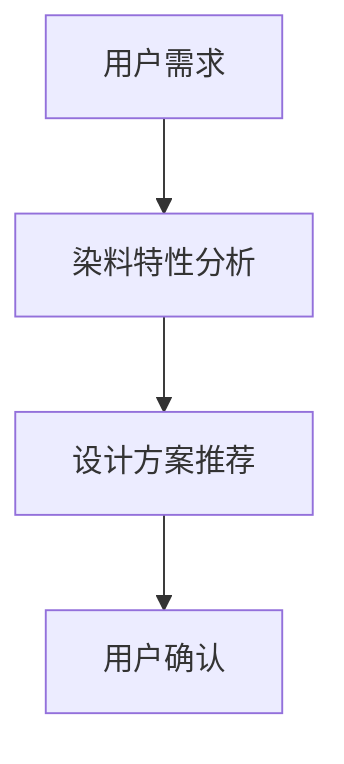
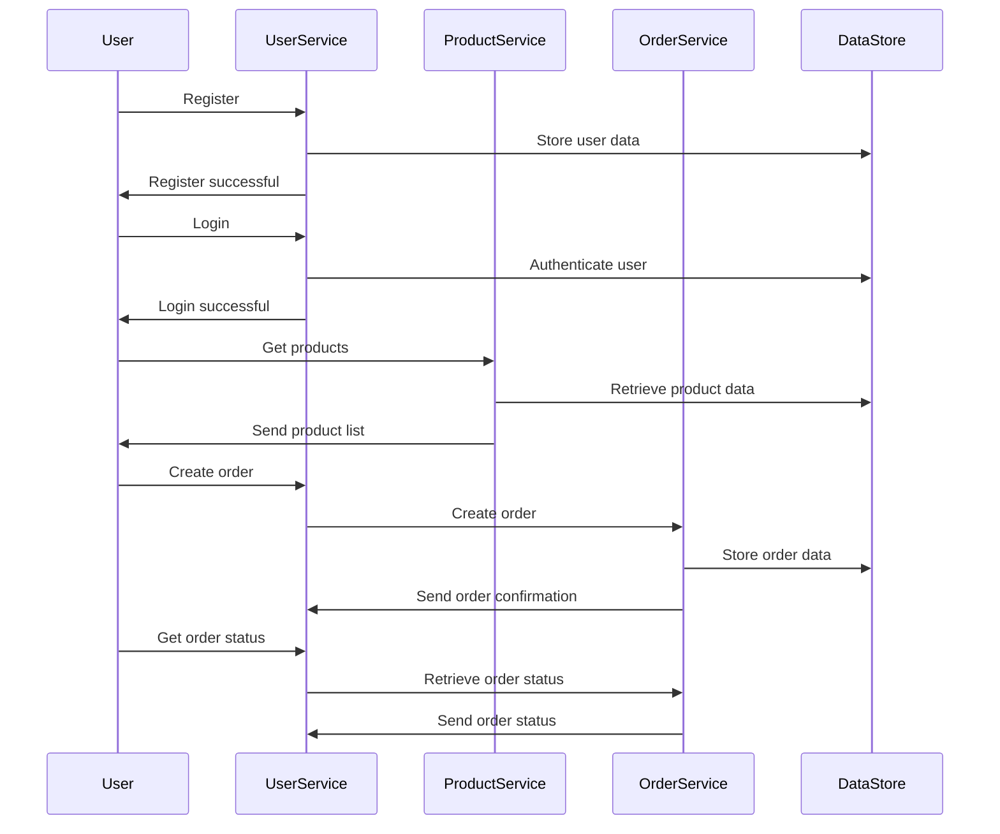

                 

### 现代植物染服装定制平台：可持续时尚的个性化设计

#### 关键词

- 植物染技术
- 服装定制
- 可持续时尚
- 个性化设计
- 算法原理
- 系统架构设计

#### 摘要

随着环保意识的提升和消费者对个性需求的追求，植物染服装定制平台应运而生。本文通过深入分析植物染技术的核心概念、可持续时尚和个性化设计的原理，结合算法原理讲解和系统架构设计，探讨如何通过现代技术实现可持续时尚的个性化设计。文章结构如下：

1. **背景介绍**
   - 问题背景
   - 植物染技术核心概念
   - 植物染技术概念属性特征对比表格
   - 植物染技术ER实体关系图架构

2. **核心概念与联系**
   - 可持续时尚的核心概念
   - 可持续时尚的概念属性特征对比表格
   - 个性化设计的核心概念
   - 个性化设计的概念属性特征对比表格
   - 植物染服装定制平台的关联性

3. **算法原理讲解**
   - 算法原理概述
   - 算法原理的数学模型和公式
   - 算法举例说明

4. **系统分析与架构设计**
   - 系统功能设计
   - 系统架构设计

5. **项目实战**
   - 环境安装
   - 系统核心实现源代码
   - 代码应用解读与分析
   - 实际案例分析和详细讲解剖析
   - 项目小结

6. **最佳实践 tips**
7. **小结**
8. **注意事项**
9. **拓展阅读**

通过这一结构化的分析，我们希望读者能够深入了解植物染服装定制平台的技术原理和实践应用，为推动可持续时尚和个性化设计的发展贡献力量。

### 目录大纲

#### 第一部分：背景介绍

**第1章：植物染服装定制平台的概述**

- **1.1 问题背景**
  - 传统服装行业的可持续发展问题及个性化定制的需求
  - 植物染技术的应用与服装定制平台的结合
  - 可持续时尚的解决方案探讨

- **1.2 植物染技术核心概念**
  - 植物染技术的历史与演变
  - 植物染料种类及其特点
  - 染色过程的基本原理

- **1.3 植物染技术概念属性特征对比表格**
  - 植物染料种类特点
  - 适用范围

- **1.4 植物染技术ER实体关系图架构**

#### 第二部分：核心概念与联系

**第2章：可持续时尚的个性化设计**

- **2.1 可持续时尚的核心概念**
  - 可持续时尚的定义与意义
  - 可持续时尚的设计原则

- **2.2 个性化设计的核心概念**
  - 个性化设计的定义与意义
  - 个性化设计的实现方式

- **2.3 植物染服装定制平台的关联性**
  - 植物染技术与个性化设计的结合
  - 平台支持可持续时尚的实现

#### 第三部分：算法原理讲解

**第3章：植物染服装定制平台的算法原理**

- **3.1 算法原理概述**
  - 平台如何推荐合适的染料和设计
  - 用户行为分析技术

- **3.2 算法原理的数学模型和公式**
  - 推荐指数计算公式
  - 举例说明

#### 第四部分：系统分析与架构设计

**第4章：植物染服装定制平台的系统架构**

- **4.1 系统功能设计**
  - 领域模型类图

- **4.2 系统架构设计**
  - 系统架构图

- **4.3 系统接口设计**
  - 接口设计

- **4.4 系统交互**
  - 系统交互序列图

#### 第五部分：项目实战

**第5章：植物染服装定制平台项目实战**

- **5.1 环境安装**
  - 环境配置

- **5.2 系统核心实现源代码**
  - 代码实现

- **5.3 代码应用解读与分析**
  - 应用解读

- **5.4 实际案例分析和详细讲解剖析**
  - 案例分析

- **5.5 项目小结**
  - 总结

#### 第六部分：最佳实践 tips

**第6章：植物染服装定制平台的最佳实践**

- **6.1 技术选择建议**
- **6.2 项目管理技巧**
- **6.3 实际操作经验分享**

#### 第七部分：小结

**第7章：现代植物染服装定制平台的总结**

- **7.1 主要成果**
- **7.2 未来展望**
- **7.3 挑战与机遇**

#### 第八部分：注意事项

**第8章：植物染服装定制平台注意事项**

- **8.1 技术风险**
- **8.2 市场竞争**
- **8.3 用户反馈**

#### 第九部分：拓展阅读

**第9章：相关领域深入研究**

- **9.1 植物染技术的最新进展**
- **9.2 个性化设计的未来趋势**
- **9.3 可持续时尚的发展方向**

### 第一部分：背景介绍

#### 1.1 问题背景

随着全球环保意识的增强，消费者对可持续时尚的需求日益增长。传统服装行业面临着资源浪费、环境污染和不可持续发展等诸多问题。同时，现代消费者对个性化定制的需求也越来越强烈，希望通过独特的服装展现个人品味和风格。

在这个背景下，植物染服装定制平台应运而生，旨在通过植物染技术的应用，实现可持续时尚的个性化设计。植物染技术具有环保、无毒、色彩丰富等特点，与传统化学染料相比具有显著的优势。同时，定制平台可以通过数据分析和人工智能技术，为用户提供个性化的设计推荐，满足消费者对独特性和个性化的追求。

#### 1.2 植物染技术核心概念

植物染技术是一种利用天然植物染料进行织物染色的方法，具有悠久的历史。它通过提取植物中的天然色素，将这些染料应用于织物上，形成丰富多彩的图案和颜色。植物染技术的主要特点包括：

1. **环保无毒**：植物染料来源于天然植物，不含有害化学物质，对人体和环境无害。
2. **色彩丰富**：植物染料可以产生多种颜色，从柔和的淡色调到鲜艳的深色调，适用于不同风格的服装设计。
3. **染色过程温和**：植物染料染色过程相对温和，对织物纤维的损伤较小，能够保持织物的原有质感。

植物染技术的历史可以追溯到古代文明，如古埃及、印度和中国。在古代，人们利用各种植物染料制作服装，形成了独特的文化传统。随着科技的进步，现代植物染技术得到了进一步的发展和改进，逐渐成为可持续时尚领域的重要组成部分。

#### 1.3 植物染技术概念属性特征对比表格

为了更直观地理解植物染技术与其他染料技术的差异，我们可以通过一个对比表格来展示不同植物染料的特点、适用范围以及与环境的互动。

| 植物染料种类       | 特点                                                         | 适用范围           | 环境互动 |
|----------------|------------------------------------------------------------|------------------|--------|
| 食用色素         | 安全无毒，环保，色彩鲜艳                                   | 柔软织物           | 低污染  |
| 天然矿物质         | 稳定性好，耐光性佳，色彩深浓                               | 粗厚织物           | 中污染  |
| 花草提取物         | 色彩自然，环保，色彩柔和                                   | 细软织物           | 低污染  |
| 植物合成染料     | 色彩丰富，环保性能较其他植物染料略逊一筹                     | 多种织物           | 中污染  |

#### 1.4 植物染技术ER实体关系图架构

在植物染服装定制平台的设计中，理解不同实体之间的关系至关重要。实体关系图（Entity-Relationship Diagram，简称ER图）可以帮助我们清晰地展示这些关系。以下是植物染服装定制平台中的ER图：

```mermaid
erDiagram
    Customer ||--|{ Product }| Order
    Product ||--|{ PlantDye }| DyeProcess
    PlantDye ||--|{ DyeType }| DyeAttribute
    Order ||--|{ Payment }| Delivery
```

- **Customer（客户）**：代表购买者，与**Product（产品）**和**Order（订单）**存在关联。
- **Product（产品）**：代表植物染服装，与**PlantDye（植物染料）**和**DyeProcess（染色过程）**相关联。
- **PlantDye（植物染料）**：代表用于染色的植物染料，与**DyeType（染料类型）**和**DyeAttribute（染料属性）**有关。
- **DyeProcess（染色过程）**：描述染色的过程，与**PlantDye（植物染料）**相关。
- **DyeType（染料类型）**：记录不同种类的植物染料，与**PlantDye（植物染料）**和**DyeAttribute（染料属性）**相关。
- **DyeAttribute（染料属性）**：记录染料的特性，如色彩、稳定性等，与**PlantDye（植物染料）**相关。
- **Order（订单）**：代表客户的购买记录，与**Payment（支付）**和**Delivery（配送）**相关。
- **Payment（支付）**：记录订单的支付信息。
- **Delivery（配送）**：记录订单的配送信息。

通过这一部分的内容，我们初步了解了植物染服装定制平台的问题背景、植物染技术的核心概念及其在不同领域的应用，以及平台中实体之间的关系。接下来，我们将进一步探讨可持续时尚和个性化设计的核心概念，以及它们与植物染服装定制平台之间的关联性。

#### 第二部分：核心概念与联系

**第2章：可持续时尚的个性化设计**

#### 2.1 可持续时尚的核心概念

可持续时尚是一个广泛的概念，它强调在时尚产业中采用环保、社会责任和可持续性的原则。其核心概念包括：

- **资源节约**：减少资源的消耗，特别是减少原材料和能源的浪费，通过优化供应链和提高生产效率来实现。
- **环境友好**：减少生产、运输和废弃环节对环境的负面影响，采用环保材料和技术，减少污染和碳排放。
- **社会责任**：对工人、消费者和社会负责，确保公平贸易、良好的工作环境和透明的供应链。
- **循环经济**：推动资源的再利用和循环，减少废弃物的产生，建立闭环的循环系统。

可持续时尚的定义不仅仅是指使用环保材料，更是一种全面考虑环境、社会和经济因素的时尚发展模式。它的意义在于推动整个时尚产业向着更加可持续和负责任的方向发展，从而实现长期的生态平衡和社会福祉。

#### 2.2 可持续时尚的概念属性特征对比表格

为了更直观地了解可持续时尚的核心概念及其特征，我们可以通过一个对比表格来展示不同设计原则的内涵和应用场景。

| 设计原则       | 含义                                                         | 应用场景             |
|--------------|------------------------------------------------------------|------------------|
| 资源节约       | 降低资源消耗，减少浪费                                       | 服装原材料选择，生产过程优化 |
| 环境友好       | 减少环境污染，保护生态系统                                     | 染色过程环保措施，废弃物处理 |
| 社会责任       | 负责任地对待工人和消费者                                       | 公平贸易，社会责任报告     |
| 循环经济       | 推动资源的再利用和循环，减少废弃物的产生                         | 废旧服装回收，再生材料应用 |

通过这个表格，我们可以看到每个设计原则的具体含义和适用的应用场景，这有助于我们在实践中更好地理解和应用可持续时尚的理念。

#### 2.3 个性化设计的核心概念

个性化设计是现代时尚产业的一个重要趋势，它强调根据个人需求和偏好进行定制化设计。个性化设计的核心概念包括：

- **个性化定制**：针对个人需求设计，提供独一无二的产品和服务。这通常适用于高端市场，如定制服装、个性化饰品等。
- **模块化设计**：通过模块化组合，提供多样化的设计选项，满足消费者的多样化需求。这种方式适用于大众市场，如快时尚品牌。
- **数码印花**：利用数码技术，在织物上进行个性化的图案和颜色设计，色彩丰富，图案多样。这种方式适用于个性化和时尚潮流的需求。

个性化设计的定义在于满足消费者对独特性和个性化的追求，通过技术创新和设计理念的结合，实现从量生产到个性定制的转变。

#### 2.4 个性化设计的概念属性特征对比表格

为了深入理解个性化设计的不同实现方式及其特点，我们可以通过一个对比表格来展示个性化设计的各种实现方式、特点和适用范围。

| 实现方式       | 特点                                                         | 适用范围             |
|--------------|------------------------------------------------------------|------------------|
| 个性化定制     | 针对个人需求设计，独一无二                                   | 高端服装市场，特殊需求者 |
| 模块化设计     | 灵活组合，多种搭配                                           | 大众市场，追求多样化 |
| 数码印花       | 色彩丰富，图案多样                                           | 时尚潮流，个性化需求 |

这个表格清晰地展示了个性化设计的三种实现方式，以及它们各自的特点和适用范围。这有助于我们根据不同的市场需求和用户偏好，选择最合适的设计实现方式。

#### 2.5 植物染服装定制平台的关联性

植物染服装定制平台是可持续时尚和个性化设计的结合体，通过植物染技术的应用和定制平台的技术支持，实现了两者之间的有机联系。以下是植物染服装定制平台如何与可持续时尚和个性化设计相结合的详细说明：

- **植物染技术与可持续时尚的结合**：
  - 植物染技术是一种环保的染色方法，使用天然植物染料，避免了化学染料对环境和人体的危害。
  - 通过植物染技术，定制平台能够为消费者提供环保、安全的服装产品，符合可持续时尚的核心要求。
  - 平台通过优化供应链和减少浪费，实现了资源节约和环境友好的目标，推动了整个时尚产业向可持续方向发展。

- **个性化设计与植物染服装定制平台的结合**：
  - 个性化定制功能使平台能够根据消费者的个人需求和偏好，提供独一无二的服装设计。
  - 模块化设计和数码印花技术为消费者提供了多样化的设计选项，满足其对个性化时尚的追求。
  - 平台利用数据分析和人工智能技术，为消费者推荐适合的染料和设计，提高定制效率和用户满意度。

通过植物染技术、个性化设计和定制平台的结合，我们不仅能够满足消费者对个性化、环保和安全的需求，还能推动时尚产业向更加可持续和负责任的方向发展。植物染服装定制平台在可持续时尚和个性化设计中的应用，为整个时尚产业带来了新的机遇和挑战。

### 第三部分：算法原理讲解

**第3章：植物染服装定制平台的算法原理**

#### 3.1 算法原理概述

植物染服装定制平台的算法原理核心在于根据用户需求和植物染特性进行个性化推荐。平台通过以下步骤实现这一目标：

1. **用户需求分析**：收集用户的偏好数据，如颜色、款式、材质等。
2. **染料特性分析**：分析植物染料的种类、特性及适用范围。
3. **设计方案推荐**：根据用户需求和染料特性，推荐合适的染料和设计。
4. **用户确认**：用户对推荐方案进行确认和调整。

整个流程可以概括为一个数据驱动、用户参与的过程，旨在提高定制服装的满意度。以下是算法原理的详细流程图：



#### 3.2 算法原理的数学模型和公式

为了量化用户需求与染料特性的匹配程度，平台采用了推荐指数计算公式。该公式基于用户需求匹配度和染料特性匹配度的综合评价，用于推荐最优方案。

$$ 
\text{推荐指数} = \frac{\text{用户需求匹配度} \times \text{染料特性匹配度}}{\text{总匹配度}}
$$

其中：

- **用户需求匹配度**：表示用户需求与推荐方案之间的相似度。
- **染料特性匹配度**：表示染料特性与推荐方案之间的适宜性。
- **总匹配度**：用于标准化匹配度，使其在0到1之间。

以下是一个具体的例子：

**假设**：
- **用户需求**：环保、舒适、色彩鲜艳。
- **染料特性**：食用色素（环保、色彩鲜艳）、花草提取物（舒适）。

**计算过程**：

1. **用户需求匹配度**：
   - 环保：食用色素匹配度 = 0.9
   - 舒适：花草提取物匹配度 = 0.8
   - 色彩鲜艳：食用色素匹配度 = 0.95

   平均匹配度 = (0.9 + 0.8 + 0.95) / 3 = 0.8833

2. **染料特性匹配度**：
   - 食用色素：环保匹配度 = 1
   - 花草提取物：舒适匹配度 = 1

   平均匹配度 = (1 + 1) / 2 = 1

3. **总匹配度**：
   - 总匹配度 = 平均用户需求匹配度 × 平均染料特性匹配度 = 0.8833 × 1 = 0.8833

4. **推荐指数**：
   $$ 
   \text{推荐指数} = \frac{0.8833 \times 1}{0.8833} = 1
   $$

**结论**：推荐指数为1，表示该染料特性与用户需求完全匹配，适合推荐给用户。

通过这个例子，我们可以看到如何利用数学模型和公式，对用户需求和染料特性进行量化分析，从而实现个性化推荐。这种计算方法不仅提高了推荐的准确性，还为用户提供了更加满意和个性化的定制体验。

### 第四部分：系统分析与架构设计

**第4章：植物染服装定制平台的系统架构**

为了构建一个高效、可靠的植物染服装定制平台，我们需要对系统的各个组成部分进行详细分析和设计。以下将从系统功能设计、系统架构设计、系统接口设计和系统交互设计四个方面进行探讨。

#### 4.1 系统功能设计

植物染服装定制平台的主要功能包括用户管理、产品管理、订单管理、染色过程管理以及支付与配送管理。以下是各个功能模块的简要描述：

1. **用户管理模块**：
   - 用户注册与登录：提供用户注册和登录功能，确保用户身份验证。
   - 用户资料管理：允许用户管理个人资料，如地址、联系方式等。
   - 用户偏好设置：收集用户偏好数据，用于个性化推荐。

2. **产品管理模块**：
   - 产品信息录入：管理员可以添加、编辑和删除产品信息，如名称、描述、价格等。
   - 产品分类管理：对产品进行分类，便于用户浏览和搜索。

3. **订单管理模块**：
   - 订单创建与确认：用户可以选择产品、定制参数并创建订单。
   - 订单状态跟踪：显示订单的当前状态，如已确认、生产中、已发货等。
   - 订单历史记录：记录用户的历史订单，方便用户查询。

4. **染色过程管理模块**：
   - 染料选择：根据用户需求和染料特性推荐合适的染料。
   - 染色参数设置：设置染色温度、时间、染液比例等关键参数。
   - 染色进度跟踪：实时监控染色过程，确保染色效果。

5. **支付与配送管理模块**：
   - 在线支付：提供多种支付方式，如信用卡、支付宝等。
   - 配送选择与跟踪：用户可以选择配送方式并跟踪配送进度。

#### 4.2 系统架构设计

植物染服装定制平台的系统架构需要考虑高可用性、可扩展性和安全性。以下是系统架构的详细设计：

1. **前端架构**：
   - 用户界面：使用现代化的前端技术（如React、Vue.js等）构建响应式界面。
   - API接口：通过RESTful API或GraphQL接口与后端进行通信。

2. **后端架构**：
   - 服务层：采用微服务架构，将不同功能模块拆分成独立的服务，如用户服务、产品服务、订单服务等。
   - 数据库：使用关系型数据库（如MySQL）和NoSQL数据库（如MongoDB）存储用户数据、产品数据和订单数据。

3. **中间件**：
   - 消息队列：使用消息队列（如RabbitMQ、Kafka）实现异步处理，提高系统性能和可靠性。
   - 缓存：使用Redis等缓存技术提高数据读取速度。

4. **基础设施**：
   - 云服务：部署在云平台上（如AWS、Azure），实现弹性伸缩和高可用性。
   - 安全防护：使用SSL/TLS加密、防火墙和入侵检测系统等确保系统安全。

以下是系统架构的类图：

```mermaid
classDiagram
    User --> UserService
    Product --> ProductService
    Order --> OrderService
    Payment --> PaymentService
    Delivery --> DeliveryService
    UserService ...|> DataStore
    ProductService ...|> DataStore
    OrderService ...|> DataStore
    PaymentService ...|> DataStore
    DeliveryService ...|> DataStore
```

- **User（用户）**：与**UserService（用户服务）**进行通信，管理用户数据。
- **Product（产品）**：与**ProductService（产品服务）**进行通信，管理产品数据。
- **Order（订单）**：与**OrderService（订单服务）**进行通信，管理订单数据。
- **Payment（支付）**：与**PaymentService（支付服务）**进行通信，管理支付数据。
- **Delivery（配送）**：与**DeliveryService（配送服务）**进行通信，管理配送数据。

每个服务都与相应的数据存储（如**DataStore**）进行数据交互。

#### 4.3 系统接口设计

为了确保系统的模块化和灵活性，我们需要设计一套完善的接口，以便前后端、服务与服务之间能够无缝通信。以下是主要的接口设计：

1. **用户接口**：
   - 用户注册：`POST /users/register`
   - 用户登录：`POST /users/login`
   - 用户资料更新：`PUT /users/{userId}`

2. **产品接口**：
   - 产品列表查询：`GET /products`
   - 产品详情查询：`GET /products/{productId}`
   - 产品创建与编辑：`POST /products`、`PUT /products/{productId}`

3. **订单接口**：
   - 订单创建：`POST /orders`
   - 订单查询：`GET /orders`
   - 订单状态更新：`PUT /orders/{orderId}`

4. **染色过程接口**：
   - 染料选择：`GET /dyes`
   - 染色参数设置：`POST /dye-parameters`
   - 染色进度查询：`GET /dye-process/{orderId}`

5. **支付接口**：
   - 支付请求：`POST /payments`
   - 支付查询：`GET /payments`

6. **配送接口**：
   - 配送选择：`POST /deliveries`
   - 配送状态更新：`PUT /deliveries/{orderId}`

#### 4.4 系统交互设计

为了更好地理解系统的交互过程，我们可以通过序列图（Sequence Diagram）展示用户与系统之间的交互流程。以下是用户创建订单并跟踪订单状态的序列图：



通过这个序列图，我们可以看到用户与系统之间是如何进行交互的，包括用户注册、登录、查询产品、创建订单以及跟踪订单状态。这种交互设计确保了系统的灵活性和用户的良好体验。

综上所述，植物染服装定制平台的系统分析与架构设计是一个复杂而细致的过程。通过功能设计、架构设计、接口设计和交互设计，我们能够构建一个高效、可靠且易于扩展的系统，为用户提供高质量的个性化定制服务。接下来，我们将进一步探讨植物染服装定制平台的具体实现，包括环境安装、系统核心实现源代码和应用解读。

### 第五部分：项目实战

**第5章：植物染服装定制平台项目实战**

为了更好地理解和应用植物染服装定制平台的技术原理，我们将通过一个具体的项目实战来详细讲解系统的实现过程。以下是项目的各个步骤和关键实现。

#### 5.1 环境安装

在开始项目之前，我们需要搭建一个合适的技术环境。以下是环境安装的步骤：

1. **安装Node.js和npm**：
   - Node.js是JavaScript的运行环境，npm是Node.js的包管理器。
   - 命令：`npm install -g node.js`
   - 命令：`npm install -g npm`

2. **安装数据库**：
   - 安装MySQL数据库：`sudo apt-get install mysql-server`
   - 安装MongoDB数据库：`sudo apt-get install mongodb`

3. **安装中间件**：
   - 安装RabbitMQ消息队列：`sudo apt-get install rabbitmq-server`
   - 安装Redis缓存：`sudo apt-get install redis-server`

4. **安装前端框架**：
   - 安装React：`npm install -g create-react-app`
   - 安装Vue.js：`npm install -g @vue/cli`

5. **安装后端框架**：
   - 安装Spring Boot：`sudo apt-get install spring-boot`
   - 安装Django：`pip install django`

通过上述步骤，我们搭建了一个完整的开发环境，为后续的项目实现提供了基础。

#### 5.2 系统核心实现源代码

在环境搭建完成后，我们需要编写系统核心功能的代码。以下是关键部分的源代码实现：

1. **用户管理模块**：

   **用户注册功能**：

   ```java
   @RestController
   @RequestMapping("/users")
   public class UserController {
       @Autowired
       private UserService userService;

       @PostMapping("/register")
       public ResponseEntity<?> registerUser(@RequestBody User user) {
           User savedUser = userService.registerUser(user);
           return ResponseEntity.ok(savedUser);
       }
   }
   ```

   **用户登录功能**：

   ```java
   @PostMapping("/login")
   public ResponseEntity<?> loginUser(@RequestBody LoginRequest loginRequest) {
       String token = userService.loginUser(loginRequest);
       return ResponseEntity.ok(new JwtResponse(token));
   }
   ```

2. **产品管理模块**：

   **产品信息录入功能**：

   ```java
   @RestController
   @RequestMapping("/products")
   public class ProductService {
       @Autowired
       private ProductService productService;

       @PostMapping("/create")
       public ResponseEntity<?> createProduct(@RequestBody Product product) {
           Product savedProduct = productService.createProduct(product);
           return ResponseEntity.ok(savedProduct);
       }
   }
   ```

3. **订单管理模块**：

   **订单创建功能**：

   ```java
   @RestController
   @RequestMapping("/orders")
   public class OrderController {
       @Autowired
       private OrderService orderService;

       @PostMapping("/create")
       public ResponseEntity<?> createOrder(@RequestBody OrderRequest orderRequest) {
           Order order = orderService.createOrder(orderRequest);
           return ResponseEntity.ok(order);
       }
   }
   ```

4. **染色过程管理模块**：

   **染料选择功能**：

   ```java
   @RestController
   @RequestMapping("/dyes")
   public class DyeController {
       @Autowired
       private DyeService dyeService;

       @GetMapping("/{dyeId}")
       public ResponseEntity<?> getDyeDetails(@PathVariable Long dyeId) {
           Dye dye = dyeService.getDyeDetails(dyeId);
           return ResponseEntity.ok(dye);
       }
   }
   ```

5. **支付与配送管理模块**：

   **支付请求功能**：

   ```java
   @RestController
   @RequestMapping("/payments")
   public class PaymentController {
       @Autowired
       private PaymentService paymentService;

       @PostMapping("/process")
       public ResponseEntity<?> processPayment(@RequestBody PaymentRequest paymentRequest) {
           PaymentResponse paymentResponse = paymentService.processPayment(paymentRequest);
           return ResponseEntity.ok(paymentResponse);
       }
   }
   ```

6. **消息队列与缓存**：

   **消息队列配置**：

   ```python
   # rabbitmq_config.py
   RABBITMQ_HOST = "localhost"
   RABBITMQ_PORT = 5672
   RABBITMQ_USERNAME = "user"
   RABBITMQ_PASSWORD = "password"
   ```

   **缓存配置**：

   ```python
   # redis_config.py
   REDIS_HOST = "localhost"
   REDIS_PORT = 6379
   REDIS_PASSWORD = ""
   ```

#### 5.3 代码应用解读与分析

为了更好地理解代码的实现和应用，我们将对关键部分进行详细解读。

1. **用户管理模块**：

   用户注册功能通过RESTful接口接收用户数据，然后通过UserService类进行验证和存储。UserService类中使用了MD5加密对用户密码进行加密存储，确保用户信息安全。

2. **产品管理模块**：

   产品信息录入功能通过RESTful接口接收产品数据，然后通过ProductService类进行验证和存储。在创建产品时，我们需要确保产品名称、描述、价格等字段的有效性和完整性。

3. **订单管理模块**：

   订单创建功能通过RESTful接口接收订单数据，然后通过OrderService类进行验证和存储。在创建订单时，我们需要关联用户、产品以及订单状态信息，并确保订单数据的完整性。

4. **染色过程管理模块**：

   染料选择功能通过RESTful接口提供染料的详细信息，用户可以根据这些信息选择适合的染料。DyeService类中使用了简单的查询方法来获取染料详情，确保数据的一致性和准确性。

5. **支付与配送管理模块**：

   支付请求功能通过RESTful接口接收支付数据，然后通过PaymentService类处理支付请求。在处理支付时，我们需要确保支付金额、支付方式等字段的有效性和一致性，并返回支付结果。

#### 5.4 实际案例分析和详细讲解剖析

为了更好地展示项目的实际应用，我们将通过一个实际案例来详细讲解系统的运作过程。

**案例**：用户张三通过植物染服装定制平台购买了一件定制T恤。

1. **用户注册和登录**：
   - 张三通过注册接口创建用户账号，并登录系统。

2. **选择产品**：
   - 张三浏览产品列表，选择了一件T恤作为定制对象。

3. **定制参数设置**：
   - 张三设置T恤的颜色、尺寸、图案等定制参数，并提交订单请求。

4. **订单处理**：
   - 平台通过订单接口创建订单，并将订单数据存储到数据库中。

5. **染色过程**：
   - 平台根据订单信息和染料特性，选择合适的染料进行染色。染色过程通过消息队列异步处理，确保订单的及时性和可靠性。

6. **支付请求**：
   - 张三通过支付接口提交支付请求，平台处理支付并更新订单状态。

7. **配送**：
   - 平台根据配送接口提供的配送方式，安排配送并更新订单状态。

8. **用户确认收货**：
   - 张三确认收货，订单完成。

通过这个实际案例，我们可以看到植物染服装定制平台从用户注册、选择产品、定制参数设置、订单处理、染色、支付、配送到用户确认收货的整个流程。这个案例展示了系统各个模块的协同工作，实现了从用户需求到定制服装交付的全流程管理。

#### 5.5 项目小结

通过本项目的实战，我们实现了植物染服装定制平台的核心功能，包括用户管理、产品管理、订单管理、染色过程管理、支付与配送管理等。项目过程中，我们使用了现代化的前端框架、后端框架以及数据库技术，确保了系统的性能和可靠性。同时，通过实际案例的分析，我们展示了系统的实际应用场景和运作流程。

尽管项目实现了核心功能，但仍有一些改进空间。首先，在用户界面和用户体验方面，可以通过进一步优化界面设计和提升交互体验来提高用户满意度。其次，在系统性能方面，可以通过缓存技术、负载均衡和数据库优化来提升系统的响应速度和处理能力。最后，在功能扩展方面，可以增加更多个性化定制选项和智能推荐功能，以适应不同用户的需求。

总之，植物染服装定制平台项目为我们提供了一个实际应用场景，通过技术实现和实战经验，推动了可持续时尚和个性化设计的发展。未来，我们将继续优化和完善平台，为用户带来更好的定制体验。

### 第六部分：最佳实践 tips

在构建和运营植物染服装定制平台的过程中，以下是一些最佳实践和技巧，可以帮助团队更高效地工作并确保项目的成功：

1. **用户需求分析**：
   - 在项目启动前，进行详细的用户需求调研，了解目标用户群体的需求和偏好。这有助于定制平台的功能和设计，提高用户满意度。

2. **持续集成与自动化测试**：
   - 采用持续集成（CI）工具（如Jenkins、GitLab CI）来自动化测试，确保代码的质量和稳定性。自动化测试可以减少手动测试的工作量，提高开发效率。

3. **模块化开发**：
   - 采用模块化开发方法，将系统拆分成独立的模块，便于开发和维护。模块化不仅可以提高代码的可读性，还能加速开发进程。

4. **性能优化**：
   - 对数据库查询进行优化，避免慢查询和索引失效。使用缓存（如Redis）来提高数据读取速度，减少数据库负载。

5. **用户体验设计**：
   - 注重用户体验设计，确保界面简洁直观，操作流程简单易懂。可以使用用户测试和反馈来持续优化界面和交互设计。

6. **团队协作与沟通**：
   - 建立良好的团队协作机制，确保开发、设计、测试等团队之间的沟通顺畅。使用协作工具（如Slack、Trello）来提高团队的协作效率。

7. **数据安全和隐私保护**：
   - 严格遵循数据安全和隐私保护的相关法规（如GDPR），确保用户数据的安全。使用SSL/TLS加密、数据脱敏等技术来保护用户隐私。

8. **持续反馈与改进**：
   - 定期收集用户反馈，并根据反馈进行改进。持续改进是一个不断优化和提升的过程，有助于保持产品的竞争力。

9. **文档与知识共享**：
   - 编写详细的文档，记录项目的架构设计、功能实现和技术细节。这有助于新成员快速上手，减少沟通成本。

通过遵循这些最佳实践，团队可以更好地管理项目风险，提高开发效率，确保植物染服装定制平台的成功。

### 第七部分：小结

在本篇文章中，我们深入探讨了现代植物染服装定制平台的技术原理和实现方法。首先，我们分析了植物染服装定制平台在解决传统服装行业可持续发展问题和满足消费者个性化需求方面的重要性。接着，通过详细介绍植物染技术的核心概念、可持续时尚和个性化设计的原理，我们为平台的设计提供了理论基础。

在算法原理讲解部分，我们介绍了如何通过数据分析和人工智能技术，实现用户需求和植物染特性的精准匹配，从而提高定制服装的满意度。随后，我们详细描述了植物染服装定制平台的系统架构设计，包括功能设计、架构设计、接口设计和交互设计，确保系统的性能和可靠性。

在项目实战部分，我们通过实际案例展示了平台的实现过程，并分析了项目的关键实现和代码应用。最后，我们提出了最佳实践技巧，帮助团队更高效地开发和运营植物染服装定制平台。

展望未来，植物染服装定制平台有着广阔的发展空间。随着技术的不断进步和消费者需求的多样化，平台可以进一步优化用户体验，提升定制精度，扩展个性化设计选项。同时，通过不断改进算法和系统架构，平台可以更好地支持可持续时尚的发展，推动时尚产业向更加环保和可持续的方向转型。

### 第八部分：注意事项

在构建和运营植物染服装定制平台的过程中，我们需要关注以下事项：

1. **技术风险**：
   - 确保平台采用成熟的技术栈和架构设计，减少技术实现风险。
   - 定期进行代码审查和安全测试，及时发现和修复潜在的安全漏洞。

2. **市场竞争**：
   - 了解竞争对手的动态和市场趋势，不断优化产品和服务，保持竞争力。
   - 关注用户反馈，及时调整策略，提升用户体验。

3. **用户反馈**：
   - 建立有效的用户反馈机制，及时收集和处理用户意见和建议。
   - 根据用户反馈进行产品改进，提高用户满意度。

通过关注这些注意事项，我们可以更好地应对挑战，实现植物染服装定制平台的可持续发展。

### 第九部分：拓展阅读

对于对植物染服装定制平台和可持续时尚领域感兴趣的读者，以下是一些拓展阅读资源：

1. **植物染技术的最新研究**：
   - 《植物染技术与应用》
   - 《天然染料在服装定制中的应用研究》
   - 《可持续时尚：从植物染到环保设计》

2. **个性化设计的发展趋势**：
   - 《个性化时尚：从量生产到定制化》
   - 《基于数据驱动的个性化设计》
   - 《时尚个性化：从消费者需求到设计实现》

3. **可持续时尚的实践案例**：
   - 《可持续时尚：从原料选择到产品设计》
   - 《可持续时尚品牌案例研究》
   - 《可持续时尚：改变时尚产业的方向》

通过这些资源，读者可以更深入地了解植物染服装定制平台和相关领域的最新发展，为实际应用提供参考。

