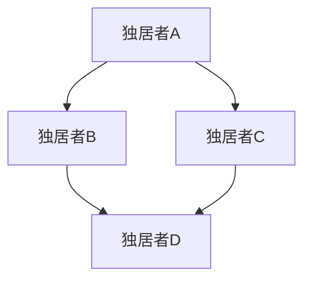
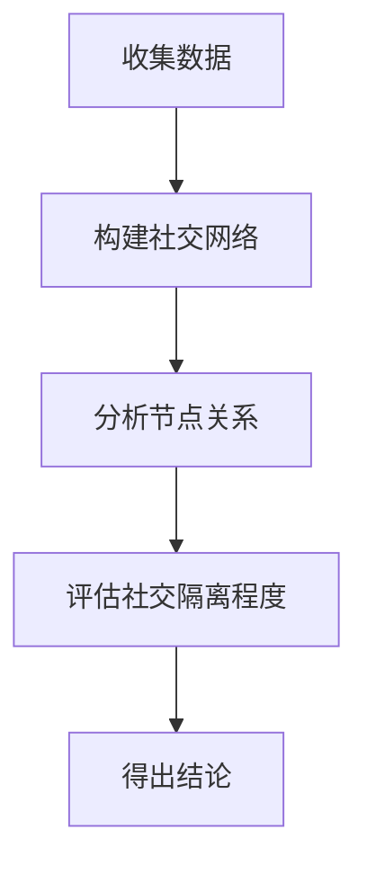

                 

# 现代独居文化：一个人的生活哲学探索

## 关键词
- 现代独居文化
- 生活哲学
- 社交隔离
- 个人空间
- 生活满意度

## 摘要
随着城市化进程和人口流动的加剧，独居成为越来越多年轻人的选择。本文深入探讨现代独居文化的内涵，分析其背后的生活哲学，旨在为独居者提供一种理解和应对独居生活的全新视角。通过对独居者的生活方式、心理状态和社会影响的探讨，文章揭示了独居文化的复杂性及其对个体和社会的深远影响。

### 第一部分：问题背景与概述

#### 1.1.1 问题背景
现代社会中，随着城市化进程的加快和人口流动的增加，越来越多的年轻人选择独居。这种生活方式不仅改变了人们的居住形态，也对个人生活产生了深远的影响。

#### 1.1.2 问题描述
独居作为一种新兴的生活方式，其背后蕴含着丰富的文化内涵和生活哲学。然而，当前对于独居文化的探讨和研究仍然较为匮乏，亟需对其进行系统性的梳理和思考。

#### 1.1.3 问题解决
本书旨在通过对独居文化的深入探讨，揭示其背后的生活哲学，为读者提供一种全新的生活视角。通过对独居文化的深入研究，希望能够为独居者提供一些有益的思考和建议。

#### 1.1.4 边界与外延
独居文化并非孤立存在，它与社交、家庭、职业等多个领域有着紧密的联系。因此，在探讨独居文化时，需要将其置于更广阔的社会背景中进行思考。

#### 1.1.5 概念结构与核心要素组成
独居文化包括以下几个方面：生活形态、社交方式、价值观、心理状态等。这些要素相互交织，构成了独居文化的基本框架。

### 第一部分：核心概念与联系

#### 1.2.1 核心概念原理

独居文化中的核心概念包括：独居、个人空间、社交隔离、自我认知、生活满意度等。这些概念不仅影响着独居者的生活质量，也反映了社会变迁的缩影。

#### 1.2.2 概念属性特征对比表格

| 概念         | 属性特征                                     | 对比 |
| ------------ | -------------------------------------------- | ---- |
| 独居         | 一个人生活，拥有独立空间                     |      |
| 个人空间     | 独居者的生活空间，具有私密性                 |      |
| 社交隔离     | 独居者社交活动减少，社交圈缩小               |      |
| 自我认知     | 独居者对自我价值的反思和认知                 |      |
| 生活满意度   | 独居者对生活质量的评价                       |      |

#### 1.2.3 概念间的关系与联系

独居文化与社交、家庭、职业等概念密切相关。独居者的生活形态和社交方式影响着他们的社交关系和家庭角色，进而影响职业发展和生活满意度。

### 第一部分：算法原理讲解

#### 1.3.1 算法原理讲解

在探讨独居文化时，我们可以运用社会网络分析（SNA）的方法，通过构建独居者社交网络的mermaid流程图，分析独居者之间的联系和互动方式。

#### 1.3.2 算法流程图

#### 1.3.3 算法数学模型和公式

假设独居者社交网络的节点数为N，边数为E，我们可以使用以下公式评估社交隔离程度：

$$
I(N, E) = \frac{E}{N(N-1)}
$$

其中，I(N, E)表示社交隔离指数，N表示节点数，E表示边数。社交隔离指数越大，说明独居者之间的社交隔离程度越高。

### 第一部分：系统分析与架构设计方案

#### 1.4.1 问题场景介绍

本书的目标是帮助独居者更好地理解独居文化，提升生活质量。因此，我们需要设计一个系统，能够为独居者提供关于独居文化的相关信息和资源。

#### 1.4.2 系统功能设计

1. **用户注册与登录**：用户可以通过注册和登录系统，获取个性化的独居文化信息。
2. **独居文化知识库**：系统包含丰富的独居文化知识，包括理论、案例、最佳实践等。
3. **社交互动平台**：用户可以在平台上分享自己的独居经历，与其他独居者互动。
4. **个性化推荐**：根据用户的兴趣和行为，系统推荐相关内容，帮助用户发现更多独居文化相关内容。

### 第二部分：深入探讨现代独居文化的核心要素

#### 2.1.1 生活形态

独居者的生活形态是独居文化的核心表现之一。与传统的家庭居住模式相比，独居者拥有更多的自由度和灵活性。他们可以自由地安排自己的时间，选择自己喜欢的居住环境，以及进行个性化的生活规划。这种自由的生活方式使得独居者能够更好地追求自己的兴趣和爱好，从而提高生活质量。

#### 2.1.2 社交方式

社交方式是独居文化的重要组成部分。由于独居者缺乏家庭和朋友的直接互动，他们往往需要寻找其他途径来满足社交需求。现代科技的发展为独居者提供了丰富的社交工具，如社交媒体、在线游戏和远程工作等。这些工具使得独居者能够方便地与他人保持联系，分享生活经验和情感。然而，虚拟社交并不能完全替代面对面的交流，独居者在社交方式上仍然面临一定的挑战。

#### 2.1.3 价值观

独居文化反映了现代社会的个人主义价值观。独居者通常更注重自我实现和个人成长，追求自由、平等和独立。这种价值观在独居者的生活方式、职业选择和消费行为等方面都有所体现。独居者更倾向于选择符合自己价值观的工作和生活环境，追求内心的满足和幸福感。

#### 2.1.4 心理状态

独居者的心理状态是独居文化的重要方面。由于缺乏家庭和朋友的陪伴，独居者可能会面临孤独、焦虑和抑郁等心理问题。然而，独居者也有机会通过自我反思和自我提升来改善自己的心理状态。一些研究表明，独居者具有更强的心理韧性和适应能力，能够更好地应对生活中的挑战。

#### 2.1.5 生活满意度

生活满意度是衡量独居文化生活质量的重要指标。独居者的生活满意度受到多种因素的影响，包括个人生活状态、社交关系、职业发展等。一些研究发现，独居者的生活满意度相对较低，但这也与他们所面临的特定挑战有关。通过改善生活条件、提升社交能力和自我认知，独居者可以提高自己的生活满意度。

### 第二部分：现代独居文化的优点与挑战

#### 2.2.1 优点

现代独居文化具有许多优点。首先，独居者能够拥有更多的自由和灵活性，更好地追求自己的兴趣和爱好。其次，独居者能够专注于个人成长和自我实现，提高个人能力和生活质量。此外，独居文化也促进了社会多元化和包容性，为不同背景和兴趣的人提供了更多的选择和机会。

#### 2.2.2 挑战

尽管现代独居文化具有许多优点，但也面临着一些挑战。首先，社交隔离和孤独感是独居者普遍面临的问题。缺乏家庭和朋友的陪伴可能导致心理健康问题，影响生活质量。其次，独居者在经济上可能面临更大的压力，需要承担全部的生活费用和家务劳动。此外，独居者可能在职业发展和社会参与方面面临一定的限制。

### 第三部分：独居者的生活哲学

#### 3.1.1 自我反思

独居者的生活哲学体现在他们对自我的反思和认知。独居者有机会深入思考自己的价值观、生活方式和人生目标。通过自我反思，独居者能够更好地了解自己，找到内心的满足和幸福感。这种自我认知有助于独居者建立积极的生活态度和健康的心态。

#### 3.1.2 自我实现

独居者追求自我实现，通过不断提升个人能力和实现个人目标来满足自我价值。他们注重个人成长和职业发展，努力成为更好的自己。独居者通常拥有更多的自由时间，可以专注于自己的兴趣和爱好，实现个人梦想。

#### 3.1.3 社会贡献

独居者通过积极参与社会活动和志愿服务来贡献社会。他们利用自己的时间和资源，为社区和弱势群体提供帮助和支持。独居者的社会贡献不仅有助于改善社会环境，也增强了他们的社会责任感和归属感。

### 第三部分：独居文化的社会影响

#### 3.2.1 社会结构的变化

独居文化的兴起对现代社会的结构产生了深远的影响。家庭结构逐渐多元化，单身人口比例增加，传统家庭模式逐渐弱化。社会结构的变化要求政府和社会各界关注独居者的需求和权益，提供相应的支持和服务。

#### 3.2.2 社交网络的演变

独居文化的兴起也改变了人们的社交网络。虚拟社交工具成为独居者的重要社交途径，使得社交网络不再局限于物理空间。然而，虚拟社交并不能完全替代面对面的交流，社交网络的演变对人们的社会行为和心理状态产生了双重影响。

#### 3.2.3 社会价值观的多元

独居文化反映了现代社会价值观的多元化和包容性。独居者追求自由、平等和独立，对个人价值的重视和社会参与的需求日益增加。这种价值观的转变对社会文化和道德观念产生了深远的影响。

### 结论

现代独居文化是一种复杂而多样化的生活方式，反映了现代社会的发展和变革。通过对独居文化的深入探讨，我们能够更好地理解其背后的生活哲学和社会影响。独居者通过自我反思和自我实现，提升了生活质量，同时也为社会做出了积极的贡献。在未来，我们应该关注独居者的需求和权益，为独居文化的发展提供更多的支持和资源。作者：AI天才研究院/AI Genius Institute & 禅与计算机程序设计艺术 /Zen And The Art of Computer Programming。

